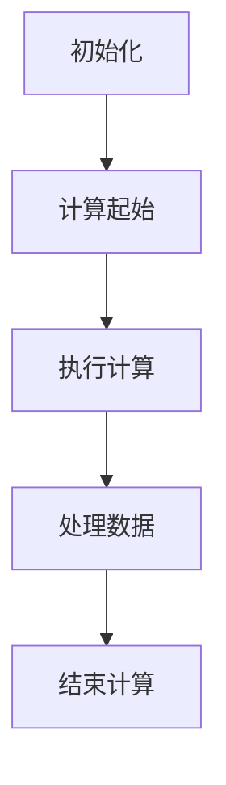

                 

### 文章标题

# Pregel原理与代码实例讲解

> 关键词：Pregel, 图计算, 分布式计算, MapReduce, 社交网络应用

> 摘要：本文将深入讲解Pregel的原理，包括其背景和设计理念，核心概念与架构，以及其在社交网络中的应用。此外，我们将通过一个实际项目实战来详细解读Pregel的代码实现过程，帮助读者更好地理解和应用Pregel技术。

---

### 第一部分：Pregel原理介绍

#### 第1章：Pregel简介

##### 1.1 Pregel的背景和设计理念

Pregel是由Google于2008年提出的一种分布式图处理框架。它的出现是为了解决大规模图数据处理的挑战，特别是在社交网络、推荐系统、生物信息学和交通网络等领域。Pregel的设计理念是将复杂的图数据处理任务分解成多个简单任务，通过分布式计算来高效解决。这一理念深受MapReduce思想的影响，但Pregel在图处理方面具有更高的灵活性和扩展性。

##### 1.2 Pregel与传统MapReduce的区别

传统MapReduce是一种分布式数据处理框架，主要用于处理批量数据。然而，在处理图数据时，MapReduce存在一些局限性。首先，MapReduce不支持图的递归遍历和动态调整。其次，它很难处理稀疏图，因为MapReduce依赖于数据的分片和重组，这在大规模稀疏图中会带来大量的通信开销。相比之下，Pregel通过引入图计算的概念，可以更自然地处理这些挑战。

##### 1.3 Pregel的应用场景和优势

Pregel在多个领域都有广泛的应用，包括社交网络中的社区发现、推荐系统中的朋友推荐、生物信息学中的蛋白质网络分析，以及交通网络中的路径优化等。Pregel的优势在于其分布式计算模型，可以高效处理大规模图数据，同时保持了高可扩展性和容错性。

#### 第2章：Pregel核心概念与架构

##### 2.1 超图和图计算

超图是一种扩展了图的数据结构，可以表示具有多个边的复杂网络。Pregel通过超图来表示和处理大规模图数据。图计算是指对图数据进行操作和计算的过程，包括图的遍历、连接、聚合等。

##### 2.2 Pregel模型详解

Pregel模型包括三个基本组成部分：顶点（Vertex）、边（Edge）和消息（Message）。顶点表示图中的节点，边表示节点之间的关系，消息用于顶点之间的通信。Pregel的工作流程主要包括初始化、计算执行、数据处理和结束计算四个阶段。

##### 2.3 Pregel的Mermaid流程图



#### 第3章：Pregel核心算法

##### 3.1 聚合计算与迭代算法

聚合计算是指将多个顶点的值合并为一个值的过程。迭代算法是指重复执行计算步骤，直到满足终止条件。Pregel通过聚合计算和迭代算法来高效处理大规模图数据。

##### 3.2 伪代码讲解

```python
def Pregel(V, E, G):
    for v in V:
        v.value = initialize(v)
    while not all_vertices_finished():
        for v in V:
            if not v.finished:
                process_vertex(v)
                for w in v.neighbors():
                    send_message(w, v.value)
        receive_and_process_messages()
    return extract_results(V)
```

#### 第4章：数学模型和公式解析

##### 4.1 数学模型基础

- 超图：\( G = (V, E) \)
- 聚合计算：\( f(v) = \sum_{u \in N(v)} w(u, v) \cdot f(u) \)

##### 4.2 公式详解与示例

- 度数序列：\( (d_1, d_2, ..., d_n) \)
- 平均度数：\( \frac{2|E|}{n} \)

##### 4.3 公式应用实例

假设一个无向图中每个顶点的度数均为2，那么该图的边数 \( E \) 可以计算为：
\[ E = \frac{n \cdot d}{2} = \frac{n \cdot 2}{2} = n \]

#### 第5章：Pregel在社交网络中的应用

##### 5.1 社交网络中的图表示

社交网络中的图可以表示为用户和用户之间的关系。用户可以表示为顶点，用户之间的关系可以表示为边。社交网络的拓扑结构可以是复杂的，包括多层次、多维度的关系。

##### 5.2 Pregel算法在社交网络中的应用

Pregel算法在社交网络中可以应用于社区发现、朋友推荐等任务。通过聚合计算和迭代算法，Pregel可以高效地分析社交网络结构，发现用户之间的相似性和联系。

#### 第6章：Pregel项目实战

##### 6.1 实战项目背景

本节将介绍一个具体的Pregel项目实战，包括项目的背景、目标和实现细节。

##### 6.2 开发环境搭建

在本节中，我们将详细讲解如何搭建Pregel的开发环境，包括所需软件和工具的安装和配置。

##### 6.3 代码实现与解读

在本节中，我们将详细介绍Pregel项目的代码实现过程，并逐行解析代码的功能和作用。

#### 第7章：总结与展望

##### 7.1 Pregel的总结

Pregel作为一种分布式图处理框架，具有高效、灵活和可扩展的特点。它在多个领域都有广泛的应用，并展示了巨大的潜力。

##### 7.2 AI图计算技术展望

随着AI技术的不断发展，图计算在AI中的应用前景十分广阔。新兴技术的挑战与机遇并存，需要我们不断探索和创新。

---

### 作者信息

作者：AI天才研究院/AI Genius Institute & 禅与计算机程序设计艺术 /Zen And The Art of Computer Programming

---

以上是本文的目录大纲结构，接下来我们将逐步深入讲解Pregel的原理和应用。让我们一步一步分析推理，深入了解Pregel的核心概念和技术细节。准备好了吗？让我们开始吧！

