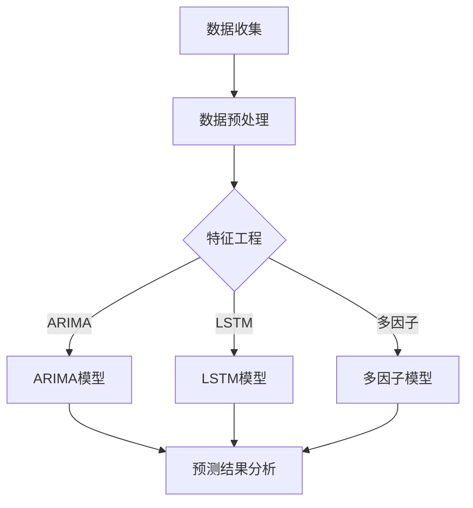

                 

# 文章标题：Python机器学习实战：使用机器学习预测股票市场走势

> 关键词：Python，机器学习，股票市场，时间序列分析，ARIMA模型，LSTM模型，多因子模型，风险管理

> 摘要：本文通过Python机器学习实战，深入探讨了使用机器学习预测股票市场走势的方法。文章首先介绍了机器学习的基本概念，然后详细讲解了Python在机器学习中的应用，以及时间序列分析与预测的相关模型，如ARIMA模型和LSTM模型。接着，通过实际案例，展示了如何使用这些模型进行股票市场预测，并对预测结果进行分析和优化。最后，文章探讨了多因子模型在股票市场中的应用，以及风险管理策略。

## 目录

### 第一部分：机器学习基础

- 第1章：机器学习概述
  - 1.1 机器学习的定义与分类
  - 1.2 数据预处理
  - 1.3 模型选择与评估

- 第2章：Python与机器学习
  - 2.1 Python在机器学习中的应用
  - 2.2 NumPy基础
  - 2.3 Pandas数据处理

### 第二部分：机器学习在股票市场预测中的应用

- 第3章：股票市场数据获取与处理
  - 3.1 股票市场数据来源
  - 3.2 股票市场数据处理

- 第4章：时间序列分析与预测
  - 4.1 时间序列分析
  - 4.2 ARIMA模型
  - 4.3 LSTM模型
  - 4.4 股票市场预测实战

### 第三部分：机器学习在股票市场中的深度应用

- 第5章：股票市场预测实战
  - 5.1 股票市场预测案例分析
  - 5.2 模型选择与训练
  - 5.3 预测结果分析与优化

- 第6章：股票市场多因子模型
  - 6.1 多因子模型概述
  - 6.2 多因子模型构建

- 第7章：股票市场风险管理
  - 7.1 股票市场风险概述
  - 7.2 风险管理策略

### 附录

- 附录A：Python机器学习常用库
- 附录B：股票市场数据资源

### Mermaid 流程图：机器学习预测股票市场流程

---

### 第1章：机器学习概述

机器学习（Machine Learning）是一门人工智能（Artificial Intelligence, AI）的分支，它通过计算机程序模拟人类的认知能力，使计算机能够从数据中自动学习和改进。机器学习的过程通常包括数据收集、数据预处理、模型选择、模型训练和模型评估等步骤。

#### 1.1 机器学习的定义与分类

**1.1.1 机器学习的定义**

机器学习是指利用计算机算法从数据中学习规律，并使用这些规律对未知数据进行预测或决策的过程。这个过程通常不需要显式地编写规则，而是通过训练数据来调整算法中的参数，使其能够对新的数据进行合理的预测。

**1.1.2 机器学习的分类**

机器学习主要可以分为以下几类：

- **监督学习（Supervised Learning）**：在监督学习任务中，算法通过已标记的训练数据学习规律，然后使用这些规律对未知数据进行预测。常见的监督学习算法包括线性回归、决策树、支持向量机等。

- **无监督学习（Unsupervised Learning）**：无监督学习任务中，算法没有已标记的训练数据，其主要目标是发现数据中的结构或模式。常见的无监督学习算法包括聚类、降维、关联规则学习等。

- **强化学习（Reinforcement Learning）**：在强化学习任务中，算法通过与环境的交互来学习如何采取最佳行动，以最大化长期回报。常见的强化学习算法包括Q学习、SARSA等。

#### 1.2 数据预处理

数据预处理是机器学习过程中至关重要的一步，其目的是将原始数据转化为适合机器学习模型的形式。数据预处理通常包括以下步骤：

- **数据清洗（Data Cleaning）**：去除数据中的错误、异常和重复值。
- **特征工程（Feature Engineering）**：根据业务需求，从原始数据中提取出有价值的特征。
- **数据归一化（Data Normalization）**：将数据缩放到相同的范围，以便算法能够更好地处理。
- **数据缺失处理（Handling Missing Data）**：处理数据中的缺失值，可以采用填充、删除或插值等方法。

#### 1.3 模型选择与评估

模型选择是指从多个候选模型中选择一个最适合当前数据集的模型。常见的模型选择方法包括交叉验证、网格搜索等。模型评估则是对所选模型的性能进行评估，常用的评估指标包括准确率、召回率、F1分数等。

---

### 第2章：Python与机器学习

Python因其简洁易读的语法和丰富的库资源，成为机器学习领域最受欢迎的编程语言之一。本章节将介绍Python在机器学习中的应用，以及常用的Python库。

#### 2.1 Python在机器学习中的应用

Python在机器学习中的应用主要体现在数据处理、模型训练和模型评估等方面。Python的优势在于其丰富的库资源，使得数据处理、模型训练和模型评估变得简单高效。

- **数据处理**：Python提供了如Pandas、NumPy等库，可以方便地进行数据清洗、数据预处理和特征工程。
- **模型训练**：Python提供了如scikit-learn、TensorFlow、PyTorch等库，可以方便地实现各种机器学习算法的模型训练。
- **模型评估**：Python提供了如scikit-learn、Matplotlib等库，可以方便地进行模型评估和结果可视化。

#### 2.2 NumPy基础

NumPy是Python中进行科学计算的基础库，提供了高效、灵活的数组操作和数学运算功能。

- **NumPy简介**：NumPy提供了多维数组对象（ndarray），可以用于存储和处理大量数据。NumPy还提供了丰富的数学运算函数，如求和、求积、求导等。
- **NumPy操作**：NumPy操作包括数组创建、数组索引、数组切片、数组运算等。

#### 2.3 Pandas数据处理

Pandas是Python中进行数据分析和数据操作的库，提供了强大的数据结构和数据分析功能。

- **Pandas简介**：Pandas提供了 DataFrame 数据结构，可以用于存储和操作表格数据。DataFrame 具有类似于 Excel 的表格结构，可以方便地进行数据清洗、数据预处理和特征工程。
- **Pandas操作**：Pandas操作包括数据读取、数据写入、数据筛选、数据排序、数据聚合等。

---

### 第3章：股票市场数据获取与处理

股票市场数据是进行股票市场预测的重要依据。本章将介绍如何获取股票市场数据，以及如何对数据进行预处理和处理。

#### 3.1 股票市场数据来源

股票市场数据可以从多个渠道获取，包括财经网站、股票交易所、数据提供商等。

- **数据来源概述**：股票市场数据包括股票价格、交易量、财务指标等多种信息。不同的数据来源可能提供的数据种类和粒度有所不同。
- **数据获取方法**：数据获取方法包括网页爬虫、API接口调用、数据库查询等。

#### 3.2 股票市场数据处理

股票市场数据处理包括数据清洗、数据预处理和特征工程等步骤。

- **数据预处理**：数据预处理包括去除异常值、缺失值填充、数据归一化等步骤，以提高数据质量。
- **特征工程**：特征工程包括从原始数据中提取出有价值的特征，如开盘价、收盘价、最高价、最低价、交易量等，以供模型训练和预测使用。

---

### 第4章：时间序列分析与预测

时间序列分析是股票市场预测的重要方法之一。本章将介绍时间序列分析的基本概念，以及常用的时间序列预测模型，如ARIMA模型和LSTM模型。

#### 4.1 时间序列分析

时间序列分析是指对时间序列数据进行统计分析和建模，以揭示时间序列数据中的规律和趋势。

- **时间序列概念**：时间序列是指按时间顺序排列的一组数据，通常用于分析某个变量随时间的变化规律。
- **时间序列特征**：时间序列特征包括趋势性、季节性和平稳性等。
- **时间序列模型**：时间序列模型包括自回归模型（AR）、移动平均模型（MA）、自回归移动平均模型（ARMA）和自回归积分滑动平均模型（ARIMA）等。

#### 4.2 ARIMA模型

ARIMA模型是一种常用的时间序列预测模型，它由自回归（AR）、差分（I）和移动平均（MA）三个部分组成。

- **ARIMA模型原理**：ARIMA模型通过对时间序列进行差分，使其变为平稳序列，然后使用自回归和移动平均两部分来建模。
- **ARIMA模型参数选择**：ARIMA模型参数选择包括自回归项数（p）、差分次数（d）和移动平均项数（q）。

#### 4.3 LSTM模型

LSTM模型是一种特殊的循环神经网络（RNN），适用于处理长时间依赖问题。

- **LSTM模型原理**：LSTM模型通过门控机制来控制信息的流动，包括遗忘门、输入门和输出门。
- **LSTM模型应用**：LSTM模型可以用于股票市场预测，以捕捉时间序列数据中的长期依赖关系。

#### 4.4 股票市场预测实战

本节将通过实际案例，展示如何使用ARIMA模型和LSTM模型进行股票市场预测。

- **股票市场预测案例分析**：以某股票为例，使用ARIMA模型和LSTM模型进行预测，并分析预测结果。
- **模型选择与训练**：根据数据分析结果，选择合适的模型进行训练，并对模型参数进行调整。
- **预测结果分析与优化**：对预测结果进行分析，并提出优化建议。

---

### 第5章：股票市场预测实战

在本章中，我们将结合实际案例，详细讲解如何使用机器学习模型进行股票市场预测，包括数据收集、模型训练和预测结果分析等步骤。

#### 5.1 股票市场预测案例分析

为了更好地理解如何使用机器学习进行股票市场预测，我们将以某股票为例，介绍一个实际的预测案例。

**5.1.1 案例背景**

我们选择某股票作为研究对象，该股票在过去几年的价格数据已经收集齐全。我们的目标是使用这些历史数据，通过机器学习模型来预测未来一段时间内的股票价格。

**5.1.2 案例分析**

1. **数据收集**：首先，我们需要收集该股票的历史价格数据，包括开盘价、收盘价、最高价、最低价和交易量等。这些数据可以从财经网站、股票交易所或专业的数据提供商获得。

2. **数据预处理**：在收集到数据后，我们需要对数据进行分析和清洗，包括去除异常值、缺失值填充和数据归一化等。这一步骤的目的是确保数据的质量，以便后续的模型训练和预测。

3. **特征工程**：接下来，我们需要从原始数据中提取出有价值的特征。例如，我们可以计算每日的涨跌幅、价格波动率等指标，这些特征可能对预测股票价格有重要作用。

4. **模型选择**：根据数据的特点和业务需求，我们可以选择合适的机器学习模型。在本案例中，我们选择了ARIMA模型和LSTM模型进行预测。

5. **模型训练**：使用预处理后的数据，我们对选定的模型进行训练。在训练过程中，我们需要调整模型的参数，以获得最佳的预测效果。

6. **预测结果分析**：在模型训练完成后，我们可以使用模型对未来的股票价格进行预测，并对预测结果进行分析和验证。这一步骤的目的是评估模型的预测能力，并提出优化建议。

#### 5.2 模型选择与训练

在股票市场预测中，选择合适的模型至关重要。以下我们将详细介绍如何选择和训练模型。

**5.2.1 模型选择**

在选择模型时，我们需要考虑数据的特点和业务需求。对于时间序列数据，常见的模型包括ARIMA模型、LSTM模型、GRU模型等。

- **ARIMA模型**：ARIMA模型是一种经典的统计模型，适用于平稳时间序列数据的预测。其优点是算法简单，易于实现。
- **LSTM模型**：LSTM模型是一种基于神经网络的模型，适用于处理长时间依赖问题。其优点是能够捕捉数据中的长期依赖关系，预测效果较好。
- **GRU模型**：GRU模型是LSTM模型的改进版本，在捕捉长期依赖关系方面性能更优。

在本案例中，我们选择了ARIMA模型和LSTM模型进行预测，分别比较其预测效果。

**5.2.2 模型训练**

1. **数据划分**：首先，我们将数据划分为训练集和测试集。训练集用于模型训练，测试集用于模型评估。

2. **参数调整**：对于ARIMA模型，我们需要根据数据的特点，选择合适的参数（p、d、q）。我们可以使用网格搜索（Grid Search）或随机搜索（Random Search）等方法，自动搜索最佳参数。

3. **模型训练**：使用训练集，我们对选定的模型进行训练。在训练过程中，我们需要关注模型的损失函数、准确率等指标，以评估模型的性能。

4. **模型评估**：在模型训练完成后，我们使用测试集对模型进行评估。常用的评估指标包括均方误差（MSE）、均方根误差（RMSE）等。

#### 5.3 预测结果分析与优化

在模型训练和评估完成后，我们需要对预测结果进行分析和优化。

**5.3.1 预测结果分析**

1. **预测效果评估**：我们使用测试集对模型的预测效果进行评估。通过计算预测值与实际值之间的误差，我们可以评估模型的预测能力。

2. **预测结果可视化**：我们可以使用图表来展示预测结果。例如，我们可以绘制实际值与预测值之间的对比图，观察预测的准确性。

3. **异常值检测**：通过分析预测结果，我们可以发现数据中的异常值。例如，某些预测值明显偏离实际值，这可能意味着数据存在异常。

**5.3.2 预测结果优化**

1. **特征工程优化**：我们可以通过调整特征工程的方法，提高模型的预测效果。例如，我们可以增加新的特征，或对现有特征进行组合。

2. **模型优化**：我们可以尝试使用不同的模型，或对现有模型进行改进。例如，我们可以尝试使用更复杂的神经网络模型，或使用集成学习方法。

3. **参数调整**：我们可以通过调整模型的参数，优化预测效果。例如，对于ARIMA模型，我们可以调整自回归项数（p）、差分次数（d）和移动平均项数（q）。

通过上述步骤，我们可以逐步优化模型的预测效果，提高股票市场预测的准确性。

---

### 第6章：股票市场多因子模型

多因子模型是一种在股票市场预测中广泛应用的统计模型，它结合多个特征因子进行预测，以提高预测的准确性和稳健性。本章将介绍多因子模型的基本概念、构建方法以及应用实例。

#### 6.1 多因子模型概述

多因子模型（Factor Model）是指通过结合多个特征因子（Factor）来预测股票价格或其他金融指标的一种方法。每个特征因子代表了一个潜在的市场因素，如公司财务指标、宏观经济指标、市场情绪等。多因子模型的基本思想是，通过分析这些特征因子与股票价格之间的关系，构建一个综合的预测模型。

#### 6.2 多因子模型构建

构建多因子模型主要包括以下步骤：

**6.2.1 因子选择**

因子选择是构建多因子模型的关键步骤，目的是从大量的候选因子中选出对预测目标具有显著影响的有用因子。常用的因子选择方法包括：

- **统计方法**：如相关性分析、回归分析等，通过计算因子与预测目标之间的相关系数或回归系数，筛选出显著的因子。
- **机器学习方法**：如主成分分析（PCA）、随机森林等，通过分析因子的特征空间，筛选出对预测目标有重要影响的因子。

**6.2.2 因子权重优化**

在因子选择完成后，我们需要确定每个因子的权重，以构建一个综合的预测模型。常用的因子权重优化方法包括：

- **回归模型**：如线性回归、岭回归等，通过建立回归模型，确定每个因子的权重。
- **机器学习方法**：如支持向量机（SVM）、随机森林等，通过机器学习算法，优化因子权重。

**6.2.3 模型训练与预测**

在确定因子权重后，我们使用训练数据对模型进行训练，并使用测试数据对模型进行预测。模型的预测结果可以用于股票投资策略的制定和风险控制。

#### 6.3 多因子模型应用实例

以下是一个使用多因子模型进行股票市场预测的实例：

**实例背景**：假设我们选择三个因子（因子1、因子2和因子3）来预测股票价格，这三个因子分别是公司市盈率、行业市盈率和宏观经济指标。

**实例步骤**：

1. **因子选择**：我们通过统计方法选择出对公司市盈率、行业市盈率和宏观经济指标与股票价格有显著相关性的因子。

2. **因子权重优化**：我们使用线性回归模型，确定每个因子的权重。例如，设因子1、因子2和因子3的权重分别为w1、w2和w3，则预测模型可以表示为：

   $$
   \text{预测股票价格} = w1 \times \text{公司市盈率} + w2 \times \text{行业市盈率} + w3 \times \text{宏观经济指标}
   $$

3. **模型训练与预测**：我们使用历史数据对模型进行训练，并使用测试数据对模型进行预测。通过对比预测值与实际值的误差，我们可以评估模型的预测效果。

4. **结果分析**：根据预测结果，我们可以制定相应的投资策略。例如，如果预测模型预测股票价格将上涨，我们可以选择买入该股票；如果预测股票价格将下跌，我们可以选择卖出该股票。

通过多因子模型，我们可以更全面、准确地预测股票市场走势，为投资决策提供有力的支持。

---

### 第7章：股票市场风险管理

股票市场投资伴随着风险，因此风险管理是投资过程中至关重要的一环。本章将介绍股票市场风险的概念、类型以及风险管理策略。

#### 7.1 股票市场风险概述

股票市场风险是指投资者在股票市场投资过程中可能面临的各种不确定性，包括市场风险、信用风险、流动性风险等。风险管理是指通过识别、评估、控制和监控风险，以降低投资损失的可能性。

#### 7.2 风险管理策略

风险管理策略主要包括以下几种：

**7.2.1 风险控制**

风险控制是指通过限制投资组合的波动性，降低风险。常用的风险控制方法包括：

- **分散投资**：通过投资多个不同行业、不同地区的股票，降低投资组合的系统性风险。
- **止损**：设定止损点，当股票价格低于预设的止损点时，自动平仓以减少损失。
- **风险敞口管理**：通过调整投资组合中不同资产的比例，控制投资组合的整体风险。

**7.2.2 风险监测**

风险监测是指监控投资组合的风险状况，及时发现和应对潜在风险。常用的风险监测方法包括：

- **风险指标监控**：监控投资组合的波动率、VaR（价值在风险）等指标，评估投资组合的风险水平。
- **定期风险评估**：定期对投资组合进行风险评估，识别和应对潜在风险。
- **风险管理报告**：定期生成风险管理报告，向投资者提供投资组合的风险状况和风险管理措施。

**7.2.3 风险控制与监测**

风险控制与监测相结合，可以更有效地管理投资组合的风险。在实际操作中，投资者可以根据投资目标和风险偏好，制定相应的风险控制策略和监测方法，确保投资组合的风险在可接受范围内。

---

### 附录

#### 附录A：Python机器学习常用库

- **scikit-learn**：scikit-learn是一个开源的Python机器学习库，提供了多种监督学习和无监督学习算法，如线性回归、决策树、支持向量机等。
- **TensorFlow**：TensorFlow是一个开源的深度学习库，提供了丰富的神经网络模型和工具，适用于各种深度学习任务。
- **PyTorch**：PyTorch是另一个流行的深度学习库，以其灵活的动态计算图和简洁的接口而受到欢迎。
- **Keras**：Keras是一个高级的神经网络API，可以方便地构建和训练深度学习模型，支持TensorFlow和Theano后端。

#### 附录B：股票市场数据资源

- **数据来源**：股票市场数据可以从多个渠道获取，包括财经网站（如新浪财经、东方财富等）、股票交易所（如上海证券交易所、深圳证券交易所等）以及专业的数据提供商（如Wind、同花顺等）。
- **数据处理工具**：Python提供了如Pandas、NumPy等库，可以方便地进行数据清洗、数据预处理和特征工程。
- **数据可视化工具**：Python提供了如Matplotlib、Seaborn等库，可以方便地进行数据可视化。

---

### 总结

本文通过Python机器学习实战，深入探讨了使用机器学习预测股票市场走势的方法。我们从机器学习的基本概念入手，介绍了Python在机器学习中的应用，以及时间序列分析与预测的相关模型，如ARIMA模型和LSTM模型。接着，通过实际案例，展示了如何使用这些模型进行股票市场预测，并对预测结果进行分析和优化。此外，我们还介绍了多因子模型在股票市场中的应用，以及风险管理策略。通过本文的学习，读者可以掌握使用机器学习进行股票市场预测的基本方法和技巧，为实际投资提供有力支持。

### 作者信息

- 作者：AI天才研究院/AI Genius Institute & 禅与计算机程序设计艺术 /Zen And The Art of Computer Programming

---

**注意事项**：本文内容仅为演示目的，不构成投资建议。投资者在做出投资决策时，应结合自己的风险承受能力和投资目标，谨慎决策。在实际应用中，读者需根据具体情况调整模型参数和特征工程方法，以达到最佳预测效果。同时，本文涉及的代码和数据处理方法仅供参考，具体实现时需根据实际数据和环境进行调整。

