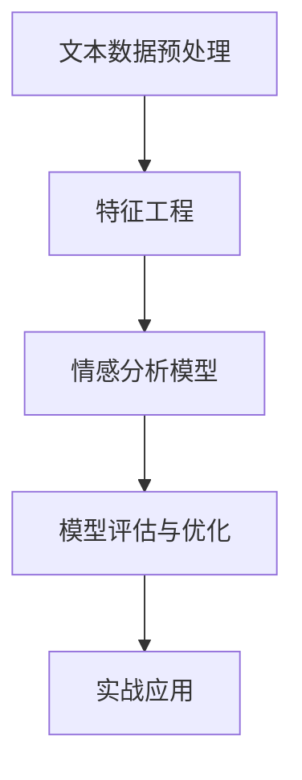

                 

# 文章标题：Python机器学习实战：基于文本数据进行情感分析

## 关键词
- Python
- 机器学习
- 情感分析
- 文本数据预处理
- 特征工程
- 模型评估

## 摘要
本文将深入探讨如何使用Python进行机器学习，特别是基于文本数据的情感分析。文章分为三大部分：Python与机器学习基础，文本数据处理与情感分析，以及实战案例。首先，我们将介绍Python编程基础，包括环境搭建、基础语法和数据类型。接着，我们将详细介绍机器学习的基础知识，包括数据预处理、模型选择与评估。随后，我们将重点讨论文本数据处理与情感分析，从文本预处理、特征工程到情感分析模型的选择与评估。最后，我们将通过实际案例，展示如何将理论应用到实践中，包括社交媒体情感分析、产品评论情感分析和新闻报道情感分析。

## 目录大纲

### 第一部分：Python与机器学习基础

#### 第1章：Python编程基础

##### 1.1 Python环境搭建
##### 1.2 Python基础语法
##### 1.3 Python数据类型
##### 1.4 Python控制结构

#### 第2章：Python科学计算库

##### 2.1 NumPy库
##### 2.2 Pandas库
##### 2.3 Matplotlib库

#### 第3章：机器学习基础

##### 3.1 机器学习概述
##### 3.2 数据预处理
##### 3.3 模型选择与评估

### 第二部分：文本数据处理与情感分析

#### 第4章：文本数据预处理

##### 4.1 文本数据格式化
##### 4.2 文本分词
##### 4.3 停用词过滤

#### 第5章：特征工程

##### 5.1 词袋模型
##### 5.2 TF-IDF模型
##### 5.3 词嵌入技术

#### 第6章：情感分析模型

##### 6.1 基于机器学习的情感分析
##### 6.2 基于深度学习的情感分析
##### 6.3 情感分析模型评估

#### 第7章：文本数据分析

##### 7.1 文本可视化
##### 7.2 文本聚类与主题模型
##### 7.3 文本生成模型

### 第三部分：实战案例

#### 第8章：社交媒体情感分析

##### 8.1 数据获取
##### 8.2 数据预处理
##### 8.3 模型训练与评估
##### 8.4 实际应用案例

#### 第9章：产品评论情感分析

##### 9.1 数据获取
##### 9.2 数据预处理
##### 9.3 模型训练与评估
##### 9.4 实际应用案例

#### 第10章：新闻报道情感分析

##### 10.1 数据获取
##### 10.2 数据预处理
##### 10.3 模型训练与评估
##### 10.4 实际应用案例

#### 附录

##### 附录A：Python与机器学习工具

###### A.1 Python科学计算库
###### A.1.1 NumPy
###### A.1.2 Pandas
###### A.1.3 Matplotlib

###### A.2 机器学习库
###### A.2.1 Scikit-learn
###### A.2.2 TensorFlow
###### A.2.3 PyTorch

### Mermaid 流程图（示例）



### 伪代码（示例）

```python
# 伪代码：文本分类模型训练
def train_model(data, labels):
    # 加载文本数据
    # 预处理文本数据
    # 划分训练集和验证集
    train_data, val_data, train_labels, val_labels = train_test_split(data, labels, test_size=0.2)
    
    # 创建模型
    model = create_model()
    
    # 训练模型
    model.fit(train_data, train_labels)
    
    # 评估模型
    accuracy = model.evaluate(val_data, val_labels)
    
    return model, accuracy
```

### 数学模型和数学公式（示例）

#### 情感分析模型的损失函数：

$$
\text{Loss} = -\frac{1}{N}\sum_{i=1}^{N} y_i \log(p(y_i | \theta))
$$

其中，$y_i$ 表示第 $i$ 个样本的标签，$p(y_i | \theta)$ 表示模型对于 $y_i$ 的预测概率，$\theta$ 表示模型的参数。

### 实际案例与代码解读（示例）

#### 案例一：社交媒体情感分析

**代码实现：** 使用 TensorFlow 和 Keras 实现一个基于词嵌入的文本分类模型。

```python
# 导入所需库
import tensorflow as tf
from tensorflow.keras.preprocessing.sequence import pad_sequences
from tensorflow.keras.layers import Embedding, LSTM, Dense
from tensorflow.keras.models import Sequential

# 加载并预处理数据
# ...

# 划分训练集和测试集
# ...

# 构建模型
model = Sequential([
    Embedding(vocab_size, embedding_dim, input_length=max_sequence_length),
    LSTM(units=128),
    Dense(units=1, activation='sigmoid')
])

# 编译模型
model.compile(optimizer='adam', loss='binary_crossentropy', metrics=['accuracy'])

# 训练模型
model.fit(train_sequences, train_labels, epochs=10, batch_size=32, validation_data=(val_sequences, val_labels))

# 评估模型
test_loss, test_accuracy = model.evaluate(test_sequences, test_labels)
print(f"Test accuracy: {test_accuracy:.2f}")

# 预测
predictions = model.predict(test_sequences)
```

**代码解读：** 
- `Embedding` 层用于将单词转换为向量。
- `LSTM` 层用于处理序列数据，捕捉时间序列信息。
- `Dense` 层用于输出预测结果，使用 sigmoid 激活函数实现二分类。
- 使用 `compile()` 方法设置模型的优化器和损失函数。
- 使用 `fit()` 方法进行模型训练。
- 使用 `evaluate()` 方法进行模型评估。
- 使用 `predict()` 方法进行预测。

接下来，我们将逐步深入每个章节，详细介绍Python与机器学习基础、文本数据处理与情感分析，以及实战案例。通过一步步的推理和思考，我们将揭开机器学习在文本数据分析中的神秘面纱，探索其实际应用。让我们开始这场技术之旅吧！

