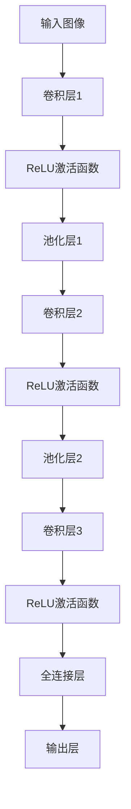
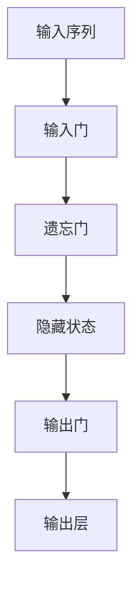
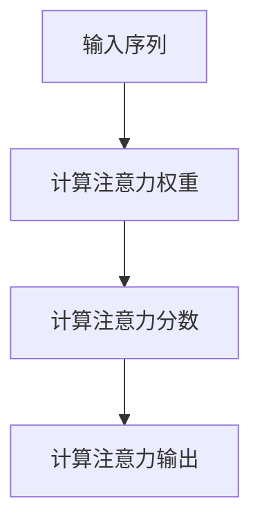
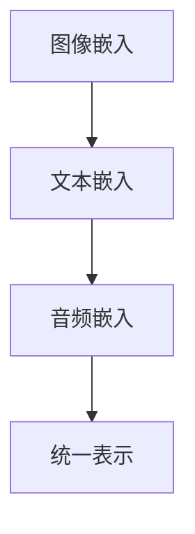

                 

### 文章标题：Python机器学习实战：机器学习在医疗影像诊断中的应用

#### 关键词：Python、机器学习、医疗影像诊断、深度学习、医学图像处理、卷积神经网络（CNN）、循环神经网络（RNN）、注意力机制、跨模态学习、医疗数据集、模型训练与优化

#### 摘要：
本文旨在探讨机器学习在医疗影像诊断中的应用，特别是使用Python语言进行机器学习的实践。通过系统的介绍Python编程基础、数据科学库、机器学习基础以及Python机器学习库，本文将详细解读医学图像处理基础和深度学习模型在医疗影像诊断中的应用。同时，通过实际案例实战，展示如何进行医疗影像诊断模型的数据预处理、模型训练与优化以及模型评估与部署。最后，本文还将探讨Python在医疗领域其他应用以及未来的发展趋势和挑战。

### 引言
医疗影像诊断在临床医学中扮演着至关重要的角色。随着医疗影像技术的发展，医学图像的质量和数量日益增加，为疾病诊断提供了丰富的数据资源。然而，如何从大量的医学图像中快速、准确地提取有价值的信息，一直是医疗影像诊断领域的难题。随着机器学习和深度学习的飞速发展，利用这些先进的技术进行医学图像分析成为可能。

Python作为一种强大的编程语言，因其简洁易懂、功能丰富以及丰富的库支持，已经成为机器学习领域的主力语言。本文将基于Python，通过理论与实践相结合的方式，深入探讨机器学习在医疗影像诊断中的应用。

本文将从以下几个方面展开：

1. **Python与机器学习基础**：介绍Python编程基础、数据科学库以及机器学习基础。
2. **Python机器学习库**：介绍常用的Python机器学习库，如scikit-learn、TensorFlow与Keras、PyTorch。
3. **医学图像处理基础**：介绍医学图像的基本概念、预处理方法以及特征提取技术。
4. **深度学习在医疗影像诊断中的应用**：详细介绍卷积神经网络（CNN）、循环神经网络（RNN）、注意力机制、跨模态学习在医疗影像诊断中的应用。
5. **医疗影像诊断案例实战**：通过具体案例展示如何进行医疗影像诊断模型的数据预处理、模型训练与优化以及模型评估与部署。
6. **Python在医疗领域的其他应用**：探讨Python在基因数据分析和电子病历分析中的应用。
7. **总结与展望**：总结本文内容，探讨Python在医疗领域应用的发展趋势、面临的挑战及未来研究方向。

通过本文的阅读，读者将系统地了解机器学习在医疗影像诊断中的应用，掌握Python机器学习实践的方法与技巧，并为未来的研究和应用提供参考。

### 《Python机器学习实战：机器学习在医疗影像诊断中的应用》目录大纲

#### 第一部分：Python与机器学习基础

##### 第1章：Python编程基础

###### 1.1 Python简介
Python是一种高级编程语言，具有简洁、易学、易用的特点。它广泛应用于数据分析、机器学习、Web开发、自动化等领域。

###### 1.2 Python环境搭建
详细介绍如何在Windows、macOS和Linux操作系统上搭建Python开发环境，包括安装Python、配置Python环境以及常用编辑器的配置。

###### 1.3 Python基础语法
介绍Python的基本语法，包括变量、数据类型、运算符、控制结构、函数等。

###### 1.4 数据类型与变量
详细讲解Python中的基本数据类型（整数、浮点数、字符串、布尔值等）以及变量的定义和使用。

##### 第2章：Python数据科学库

###### 2.1 NumPy库
NumPy是Python中用于科学计算的核心库，提供了多维数组对象以及大量数学运算函数。

###### 2.2 Pandas库
Pandas是一个强大的数据处理库，提供了数据结构DataFrame，用于数据清洗、转换和分析。

###### 2.3 Matplotlib与Seaborn库
Matplotlib和Seaborn是Python中常用的数据可视化库，用于创建各种统计图表和可视化分析。

##### 第3章：机器学习基础

###### 3.1 机器学习概述
介绍机器学习的基本概念、分类及应用领域。

###### 3.2 监督学习与无监督学习
详细讲解监督学习（分类与回归）和无监督学习（聚类与降维）的基本原理和方法。

###### 3.3 特征工程
介绍特征工程的概念、方法和技巧，包括特征选择、特征提取和特征变换等。

##### 第4章：Python机器学习库

###### 4.1 scikit-learn库
scikit-learn是一个强大的机器学习库，提供了多种经典算法和工具，适用于各种监督学习和无监督学习任务。

###### 4.2 TensorFlow与Keras库
TensorFlow是Google开源的机器学习框架，Keras是其高级API，用于构建和训练深度学习模型。

###### 4.3 PyTorch库
PyTorch是Facebook开源的深度学习框架，以其动态计算图和灵活的API设计受到广泛欢迎。

#### 第二部分：机器学习在医疗影像诊断中的应用

##### 第5章：医学图像处理基础

###### 5.1 医学图像简介
介绍医学图像的基本概念、类型和应用领域。

###### 5.2 医学图像预处理
介绍医学图像预处理的方法和技术，包括图像增强、去噪、分割等。

###### 5.3 医学图像特征提取
介绍医学图像特征提取的方法和技术，包括纹理特征、形状特征、结构特征等。

##### 第6章：深度学习在医疗影像诊断中的应用

###### 6.1 卷积神经网络（CNN）
介绍CNN的基本结构、工作原理以及在医疗影像诊断中的应用。

###### 6.2 循环神经网络（RNN）
介绍RNN的基本结构、工作原理以及在医疗影像诊断中的应用。

###### 6.3 注意力机制
介绍注意力机制的基本概念、在医疗影像诊断中的应用。

###### 6.4 跨模态学习
介绍跨模态学习的基本概念、在医疗影像诊断中的应用。

##### 第7章：医疗影像诊断案例实战

###### 7.1 数据集准备与预处理
介绍医疗影像诊断数据集的获取、准备和预处理方法。

###### 7.2 模型训练与优化
介绍深度学习模型的选择、训练和优化方法。

###### 7.3 模型评估与部署
介绍深度学习模型的评估方法和部署流程。

#### 第三部分：Python机器学习在医疗领域的其他应用

##### 第8章：基于Python的基因数据分析

###### 8.1 基因数据概述
介绍基因数据的基本概念、类型和应用领域。

###### 8.2 基因数据分析方法
介绍基因数据分析的方法和技术，包括数据预处理、特征提取、模型训练等。

###### 8.3 Python在基因数据分析中的应用
介绍Python在基因数据分析中的应用实例。

##### 第9章：基于Python的电子病历分析

###### 9.1 电子病历概述
介绍电子病历的基本概念、类型和应用领域。

###### 9.2 电子病历分析流程
介绍电子病历分析的基本流程和技术。

###### 9.3 Python在电子病历分析中的应用
介绍Python在电子病历分析中的应用实例。

#### 第10章：总结与展望

###### 10.1 Python在医疗领域应用的发展趋势
介绍Python在医疗领域应用的发展趋势和前景。

###### 10.2 Python在医疗领域应用面临的挑战与机遇
分析Python在医疗领域应用面临的挑战和机遇。

###### 10.3 未来研究方向与展望
展望Python在医疗领域应用的未来研究方向和发展趋势。

#### 附录

##### 附录A：Python机器学习与医疗影像诊断常用工具库
介绍Python中常用的机器学习和医疗影像诊断工具库，包括scikit-image、SimpleITK、DeepLearningKit等。

##### 附录B：医疗影像诊断相关数据集介绍
介绍常用的医疗影像诊断数据集，包括来源、获取方法、数据结构、使用说明等。

##### 附录C：深度学习模型训练与优化技巧
介绍深度学习模型训练和优化的常见问题、解决方法、优化策略和技巧。

### 第一部分：Python与机器学习基础

#### 第1章：Python编程基础

##### 1.1 Python简介

Python是一种高级编程语言，以其简洁、易学、易用和功能丰富而广受欢迎。Python最初由Guido van Rossum在1989年创建，并在1991年首次发布。由于其设计哲学强调代码的可读性和简洁性，Python迅速成为许多开发者和研究人员的首选语言。

Python的主要特点包括：

- **简洁易读**：Python的语法设计简洁直观，几乎不需要特殊的符号，使其代码更加易于理解和维护。
- **多功能性**：Python适用于各种编程领域，包括Web开发、数据分析、机器学习、自动化、游戏开发等。
- **开源社区**：Python拥有庞大的开源社区，提供了大量的库和框架，极大地扩展了其功能。
- **跨平台**：Python支持多种操作系统，包括Windows、macOS和Linux，便于在不同的环境中开发和部署。

Python的主要应用领域包括：

- **数据分析与科学计算**：Python提供了丰富的库，如NumPy、Pandas、SciPy，用于数据清洗、分析、可视化和机器学习。
- **Web开发**：Python的Web框架，如Django和Flask，广泛应用于Web应用开发。
- **自动化**：Python强大的库，如Selenium和Robot Framework，使其成为自动化测试和脚本编写的不二选择。
- **人工智能与机器学习**：Python的机器学习库，如scikit-learn、TensorFlow和PyTorch，为研究人员和开发者提供了强大的工具。

##### 1.2 Python环境搭建

在开始使用Python进行编程之前，需要搭建Python的开发环境。以下是搭建Python开发环境的步骤：

###### Windows操作系统

1. **下载Python安装包**：访问Python官方网站（https://www.python.org/），下载适用于Windows的Python安装包。
2. **安装Python**：双击安装包，按照提示进行安装。建议勾选“Add Python to PATH”选项，以便在命令行中直接运行Python。
3. **验证安装**：打开命令提示符，输入`python --version`或`python -V`，如果输出Python的版本信息，则表示安装成功。

###### macOS操作系统

1. **使用Homebrew安装Python**：如果已经安装了Homebrew，可以输入以下命令安装Python：
   ```bash
   brew install python
   ```
2. **验证安装**：打开终端，输入`python --version`或`python -V`，如果输出Python的版本信息，则表示安装成功。

###### Linux操作系统

1. **使用包管理器安装Python**：大多数Linux发行版都预装了Python。如果需要更新，可以使用以下命令：
   ```bash
   sudo apt-get update
   sudo apt-get install python3
   ```
2. **验证安装**：打开终端，输入`python3 --version`或`python3 -V`，如果输出Python的版本信息，则表示安装成功。

###### 配置Python开发环境

1. **安装代码编辑器**：Python可以使用各种代码编辑器和集成开发环境（IDE），如Visual Studio Code、PyCharm、Jupyter Notebook等。选择一个合适的编辑器并安装。
2. **安装Python库**：使用pip（Python的包管理器）安装常用的Python库，如NumPy、Pandas、Matplotlib等。安装方法如下：
   ```bash
   pip install numpy pandas matplotlib
   ```

##### 1.3 Python基础语法

Python的语法简洁明了，主要包括以下几个部分：

###### 变量和数据类型

在Python中，变量不需要显式声明，直接赋值即可。Python支持多种数据类型，如整数（int）、浮点数（float）、字符串（str）、布尔值（bool）等。

```python
# 整数和浮点数
x = 10
y = 3.14

# 字符串
name = "John Doe"

# 布尔值
is_true = True
is_false = False
```

###### 运算符

Python提供了丰富的运算符，包括算术运算符、比较运算符、逻辑运算符等。

```python
# 算术运算符
a = 10 + 20
b = 10 - 20
c = 10 * 20
d = 10 / 20

# 比较运算符
e = 10 == 20
f = 10 != 20
g = 10 > 20
h = 10 < 20

# 逻辑运算符
i = True and False
j = True or False
k = not True
```

###### 控制结构

Python提供了多种控制结构，如条件语句、循环语句等。

```python
# 条件语句
if x > 10:
    print("x 大于 10")
elif x == 10:
    print("x 等于 10")
else:
    print("x 小于 10")

# 循环语句
for i in range(5):
    print(i)

# While循环
while x > 0:
    print(x)
    x -= 1
```

###### 函数

Python支持定义自定义函数，使用`def`关键字。

```python
def greet(name):
    return f"Hello, {name}"

print(greet("John Doe"))
```

##### 1.4 数据类型与变量

在Python中，变量是存储数据的容器。变量无需显式声明类型，Python会根据赋值的值自动确定变量的类型。Python支持多种数据类型，包括整数、浮点数、字符串、列表、元组、字典和集合。

###### 整数（int）

整数是没有小数部分的数字，如-5、0、5。

```python
x = 10
y = -5
```

###### 浮点数（float）

浮点数是带有小数部分的数字，如3.14、-2.5。

```python
x = 3.14
y = -2.5
```

###### 字符串（str）

字符串是包含文本的序列，由单引号（'）或双引号（"）包围。字符串是不可变的，即一旦创建，无法修改。

```python
name = "John Doe"
greeting = "Hello, World!"
```

###### 列表（list）

列表是可变的序列数据类型，用于存储一系列元素，元素可以是不同类型的数据。

```python
ages = [25, 30, 35, 40]
names = ["Alice", "Bob", "Charlie"]
```

###### 元组（tuple）

元组是类似列表的不可变序列数据类型。一旦创建，元组的元素无法修改。

```python
coordinates = (10.5, 20.3)
```

###### 字典（dict）

字典是用于存储键值对的数据结构，类似于其他编程语言中的哈希表或关联数组。

```python
student = {"name": "John", "age": 25, "grade": "A"}
```

###### 集合（set）

集合是用于存储无序且不重复元素的集合数据结构。

```python
unique_numbers = {1, 2, 3, 4, 5}
```

在Python中，变量的命名规则如下：

- 变量名必须以字母（a-z，A-Z）或下划线（_）开头。
- 变量名不能以数字开头。
- 变量名只能包含字母、数字和下划线。
- 变量名是大小写敏感的，例如`my_variable`和`myVariable`是两个不同的变量。

##### 1.5 Python中的函数和模块

函数是Python中的代码块，用于执行特定的任务。函数通过定义和调用实现。定义函数使用`def`关键字，调用函数使用函数名并传递必要的参数。

```python
def greet(name):
    return f"Hello, {name}"

print(greet("John Doe"))
```

模块是Python中的文件，用于组织代码和功能。模块通过导入和使用实现。导入模块使用`import`关键字，使用模块中的函数和变量使用模块名和标识符。

```python
import math

print(math.sqrt(16))
```

#### 第2章：Python数据科学库

##### 2.1 NumPy库

NumPy（Numeric Python）是Python中用于科学计算的核心库，提供了多维数组对象以及大量数学运算函数。NumPy的数组对象是Python中最常用的数据结构之一，用于高效地存储和操作数据。NumPy的核心功能包括：

- **多维数组**：NumPy数组可以存储多维数据，如一维数组、二维数组和三维数组等。
- **基本运算**：NumPy提供了丰富的数组运算函数，如算术运算、比较运算、逻辑运算等。
- **随机数生成**：NumPy提供了生成随机数的函数，如随机数、随机数生成器等。
- **线性代数操作**：NumPy支持矩阵运算，如矩阵乘法、矩阵求逆等。

NumPy的主要优点包括：

- **高性能**：NumPy数组操作采用底层C语言实现，具有高性能和高效存储。
- **兼容性**：NumPy与其他Python数据科学库（如Pandas、SciPy、Matplotlib等）无缝集成，支持数据交换和共享。
- **多功能性**：NumPy提供了丰富的数学和科学计算功能，适用于各种科学和工程应用。

以下是一个简单的NumPy示例，展示如何创建数组、访问元素以及进行基本运算：

```python
import numpy as np

# 创建一维数组
array_1d = np.array([1, 2, 3, 4, 5])

# 创建二维数组
array_2d = np.array([[1, 2, 3], [4, 5, 6]])

# 访问数组元素
print(array_1d[2])  # 输出 3
print(array_2d[1, 2])  # 输出 5

# 数组基本运算
array_1d += 1  # 数组元素加1
print(array_1d)  # 输出 [2, 3, 4, 5, 6]

array_2d *= 2  # 数组元素乘2
print(array_2d)  # 输出 [[2, 4, 6], [8, 10, 12]]

# 矩阵运算
matrix = np.array([[1, 2], [3, 4]])
print(np.dot(matrix, matrix))  # 输出矩阵乘法结果 [[7, 10], [15, 22]]
```

##### 2.2 Pandas库

Pandas是Python中用于数据分析和操作的库，提供了强大的数据结构DataFrame。DataFrame类似于SQL中的表格或Excel中的工作表，用于存储和操作表格数据。Pandas的主要功能包括：

- **数据处理**：Pandas支持数据读取、写入、清洗、转换和合并等操作，适用于各种数据源。
- **数据结构**：Pandas的核心是DataFrame，提供了高效的数据存储和操作功能，支持多种数据类型。
- **数据分析**：Pandas提供了丰富的数据分析功能，如统计、分组、筛选、排序等。

Pandas的主要优点包括：

- **易用性**：Pandas提供了简洁、直观的API，使得数据处理和分析变得简单高效。
- **扩展性**：Pandas与NumPy、SciPy等库无缝集成，支持多种数据格式和文件类型。
- **性能**：Pandas采用底层C语言实现，具有高性能和高效存储。

以下是一个简单的Pandas示例，展示如何创建DataFrame、添加列和行、选择和筛选数据：

```python
import pandas as pd

# 创建DataFrame
data = {'Name': ['Alice', 'Bob', 'Charlie', 'David'],
        'Age': [25, 30, 35, 40],
        'Salary': [50000, 60000, 70000, 80000]}
df = pd.DataFrame(data)

# 添加列和行
df['Department'] = ['HR', 'Finance', 'Marketing', 'IT']
df.loc[4] = ['Eve', 45, 90000, 'HR']

# 选择和筛选数据
print(df['Age'])  # 输出 Age 列
print(df[df['Salary'] > 60000])  # 输出 Salary 大于 60000 的行
```

##### 2.3 Matplotlib与Seaborn库

Matplotlib是Python中用于数据可视化的库，提供了丰富的绘图功能，可以创建各种统计图表和可视化分析。Seaborn是基于Matplotlib的高级可视化库，提供了更美观和易于定制的可视化效果。

Matplotlib的主要功能包括：

- **二维图形**：Matplotlib支持创建各种二维图形，如折线图、柱状图、散点图、饼图等。
- **三维图形**：Matplotlib支持创建三维图形，如三维散点图、三维柱状图等。
- **自定义样式**：Matplotlib提供了丰富的自定义样式和主题，可以轻松自定义图表外观。

Seaborn的主要功能包括：

- **统计图表**：Seaborn提供了丰富的统计图表，如箱线图、小提琴图、箱须图等。
- **颜色映射**：Seaborn提供了多种颜色映射方案，可以用于数据的可视化分析。
- **交互性**：Seaborn支持基本的交互性功能，如点击、滑动等。

以下是一个简单的Matplotlib示例，展示如何创建折线图和柱状图：

```python
import matplotlib.pyplot as plt

# 创建折线图
x = [1, 2, 3, 4, 5]
y = [1, 4, 9, 16, 25]
plt.plot(x, y)
plt.xlabel('x-axis')
plt.ylabel('y-axis')
plt.title('Line Plot')
plt.show()

# 创建柱状图
labels = ['A', 'B', 'C', 'D']
sizes = [15, 30, 45, 10]
plt.pie(sizes, labels=labels, autopct='%.1f%%')
plt.axis('equal')
plt.show()
```

以下是一个简单的Seaborn示例，展示如何创建箱线图和小提琴图：

```python
import seaborn as sns
import matplotlib.pyplot as plt

# 创建箱线图
data = {'Group A': [1, 2, 3, 4, 5],
        'Group B': [5, 4, 3, 2, 1],
        'Group C': [2, 3, 4, 5, 6]}
sns.boxplot(data=data, x='Group A', y='Value')
plt.show()

# 创建小提琴图
sns.violinplot(data=data, x='Group A', y='Value')
plt.show()
```

通过Matplotlib和Seaborn，我们可以创建丰富多样、美观实用的数据可视化图表，帮助更好地理解和分析数据。

#### 第3章：机器学习基础

##### 3.1 机器学习概述

机器学习（Machine Learning，ML）是人工智能（Artificial Intelligence，AI）的一个重要分支，旨在通过数据驱动的方式使计算机系统具备自主学习和改进的能力。机器学习的基本理念是通过从数据中学习规律和模式，从而实现对未知数据的预测或分类。

##### 定义与分类

机器学习可以分为以下几种类型：

- **监督学习（Supervised Learning）**：在监督学习中，模型通过标记好的训练数据学习，并利用学到的规律对新的数据进行预测。监督学习分为两类：
  - **分类（Classification）**：将数据分为不同的类别，如电子邮件是否为垃圾邮件、图像是否包含猫。
  - **回归（Regression）**：预测连续值，如房价、股票价格等。

- **无监督学习（Unsupervised Learning）**：无监督学习没有标记的训练数据，模型需要从未标记的数据中发现隐藏的结构和模式。无监督学习分为两类：
  - **聚类（Clustering）**：将数据分为若干组，使组内的数据彼此相似，组间数据差异较大。
  - **降维（Dimensionality Reduction）**：减少数据维度，保持数据的主要特征，如主成分分析（PCA）。

- **强化学习（Reinforcement Learning）**：强化学习是一种交互式学习方法，模型通过与环境的交互不断优化自己的策略，以获得最大化的奖励。

##### 机器学习流程

机器学习的一般流程包括以下步骤：

1. **数据收集**：收集用于训练模型的原始数据，数据可以是结构化的（如表格）、半结构化的（如日志文件）或非结构化的（如图像、文本等）。
2. **数据预处理**：对收集到的数据进行清洗、转换和归一化，以提高模型训练效果。
3. **特征工程**：选择和构建对模型有帮助的特征，以提高模型的预测准确性和泛化能力。
4. **模型选择**：选择合适的机器学习算法，如线性回归、决策树、支持向量机、神经网络等。
5. **模型训练**：使用训练数据对模型进行训练，通过调整模型参数以最小化预测误差。
6. **模型评估**：使用验证集或测试集对模型进行评估，评估指标包括准确率、召回率、精确率、F1值等。
7. **模型优化**：根据模型评估结果，对模型进行优化，如调整超参数、增加训练数据等。
8. **模型部署**：将训练好的模型部署到实际应用场景中，如生产环境、Web服务、移动应用等。

##### 机器学习的应用领域

机器学习在许多领域都有广泛应用，包括：

- **金融**：风险控制、信用评分、交易策略、市场预测等。
- **医疗**：疾病诊断、药物研发、基因组学、医学图像分析等。
- **零售**：需求预测、库存管理、个性化推荐等。
- **交通**：自动驾驶、交通流量预测、智能交通管理等。
- **通信**：网络优化、流量分析、欺诈检测等。
- **制造**：生产优化、设备故障预测、质量控制等。
- **安全**：入侵检测、异常检测、身份验证等。

##### Python机器学习库

Python拥有丰富的机器学习库，包括scikit-learn、TensorFlow和PyTorch等。这些库提供了各种机器学习算法和工具，大大简化了机器学习的实现过程。

- **scikit-learn**：scikit-learn是一个强大的机器学习库，提供了多种监督学习和无监督学习算法，适用于各种数据科学任务。
- **TensorFlow**：TensorFlow是Google开源的深度学习框架，适用于构建和训练复杂的深度学习模型。
- **PyTorch**：PyTorch是Facebook开源的深度学习框架，以其动态计算图和灵活的API设计而受到广泛欢迎。

通过Python机器学习库，我们可以快速实现各种机器学习任务，并探索人工智能的无限可能。

##### 3.2 监督学习与无监督学习

监督学习（Supervised Learning）和无监督学习（Unsupervised Learning）是机器学习的两种基本类型，它们在训练数据和目标上有所不同。

###### 监督学习

监督学习是一种在有标记数据集上进行训练的学习方法。训练数据集包含输入特征和对应的输出标签。模型通过学习输入特征和输出标签之间的关系，从而能够对新的数据进行预测。监督学习可以分为以下两类：

1. **分类（Classification）**：分类任务的目标是将输入数据分为预定义的类别。常见的分类算法包括逻辑回归、支持向量机（SVM）、决策树、随机森林等。

   **逻辑回归（Logistic Regression）**：逻辑回归是一种简单的分类算法，通过回归模型预测概率，然后根据概率阈值进行分类。
   
   **支持向量机（Support Vector Machine，SVM）**：SVM是一种基于间隔最大化原理的分类算法，能够找到最佳分类边界，适用于高维数据。
   
   **决策树（Decision Tree）**：决策树是一种树形结构模型，通过一系列的决策规则将数据划分为不同的类别。
   
   **随机森林（Random Forest）**：随机森林是一种集成学习方法，通过构建多棵决策树，并合并它们的预测结果进行分类。

2. **回归（Regression）**：回归任务的目标是预测连续值输出。常见的回归算法包括线性回归、岭回归、套索回归等。

   **线性回归（Linear Regression）**：线性回归是一种基于线性关系的回归算法，通过拟合一条直线来预测输出值。
   
   **岭回归（Ridge Regression）**：岭回归是一种线性回归的正则化方法，通过添加L2正则化项来防止过拟合。
   
   **套索回归（Lasso Regression）**：套索回归是一种线性回归的正则化方法，通过添加L1正则化项来防止过拟合。

###### 无监督学习

无监督学习是在没有标记数据集的情况下进行的学习方法。模型需要从未标记的数据中自动发现隐藏的结构和模式。无监督学习可以分为以下两类：

1. **聚类（Clustering）**：聚类任务的目标是将数据分为若干组，使得组内数据相似，组间数据差异较大。常见的聚类算法包括K-均值、层次聚类、DBSCAN等。

   **K-均值（K-Means）**：K-均值是一种基于距离度量的聚类算法，通过迭代优化聚类中心，将数据分为K个聚类。
   
   **层次聚类（Hierarchical Clustering）**：层次聚类是一种自下而上或自上而下的聚类方法，通过构建聚类层次结构进行数据分组。
   
   **DBSCAN（Density-Based Spatial Clustering of Applications with Noise）**：DBSCAN是一种基于密度的聚类算法，通过计算数据点的邻域密度和连接性来识别聚类。

2. **降维（Dimensionality Reduction）**：降维任务的目标是减少数据维度，同时保持数据的主要特征。常见的降维算法包括主成分分析（PCA）、线性判别分析（LDA）、t-SNE等。

   **主成分分析（Principal Component Analysis，PCA）**：PCA是一种线性降维方法，通过保留数据的主要成分，减少数据维度。
   
   **线性判别分析（Linear Discriminant Analysis，LDA）**：LDA是一种用于分类的降维方法，通过最大化类间离散度和最小化类内离散度，将数据投影到低维空间。
   
   **t-SNE（t-Distributed Stochastic Neighbor Embedding）**：t-SNE是一种非线性降维方法，通过计算数据的局部结构，将高维数据投影到低维空间。

通过监督学习与无监督学习，我们可以从数据中提取有价值的信息，为各种应用场景提供有效的解决方案。

##### 3.3 特征工程

特征工程（Feature Engineering）是机器学习中非常重要的一环，旨在从原始数据中提取出对模型训练有帮助的特征。特征工程的质量直接影响模型的性能和泛化能力。以下是一些常见的特征工程方法：

###### 特征选择

特征选择（Feature Selection）是指从原始特征中挑选出对模型有帮助的特征，从而减少特征维度和计算复杂度。

1. **过滤式特征选择（Filter Feature Selection）**：过滤式特征选择方法通过评估特征与目标变量之间的相关性来选择特征。常见的评估指标包括信息增益、卡方检验、互信息等。

2. **包装式特征选择（Wrapper Feature Selection）**：包装式特征选择方法通过将特征选择过程集成到模型训练中，逐步添加或删除特征，直到找到最优特征子集。常见的算法包括递归特征消除（RFE）、遗传算法等。

3. **嵌入式特征选择（Embedded Feature Selection）**：嵌入式特征选择方法在模型训练过程中同时进行特征选择和模型训练，通过模型的正则化项或惩罚项自动筛选特征。常见的算法包括线性回归、Lasso回归等。

###### 特征提取

特征提取（Feature Extraction）是指通过变换原始特征来生成新的特征，以增强模型的可解释性和性能。

1. **特征变换（Feature Transformation）**：特征变换包括归一化、标准化、离散化等，用于将特征映射到合适的数值范围内，提高模型的训练效果。

   **归一化（Normalization）**：归一化通过将特征缩放到相同的范围内，消除不同特征间的量纲差异。
   
   **标准化（Standardization）**：标准化通过将特征转换为标准正态分布，提高模型对不同特征的敏感性。
   
   **离散化（Discretization）**：离散化通过将连续特征划分为离散的区间，降低数据的复杂度。

2. **特征组合（Feature Combination）**：特征组合通过将原始特征组合成新的特征，以增加模型的表达能力。常见的组合方法包括特征交互、特征合并等。

   **特征交互（Feature Interaction）**：特征交互通过计算原始特征之间的乘积、加和等，生成新的特征。
   
   **特征合并（Feature Aggregation）**：特征合并通过将多个特征合并为一个特征，如平均、最大值、最小值等。

3. **特征嵌入（Feature Embedding）**：特征嵌入通过将原始特征映射到低维空间中，以增加特征的可解释性和表达能力。常见的嵌入方法包括词嵌入（Word Embedding）、图嵌入（Graph Embedding）等。

通过特征工程，我们可以从原始数据中提取出有价值的信息，提高模型的性能和可解释性，为机器学习应用提供有效的支持。

#### 第4章：Python机器学习库

##### 4.1 scikit-learn库

scikit-learn是一个强大的Python机器学习库，提供了多种经典算法和工具，适用于各种监督学习和无监督学习任务。scikit-learn的设计目标是简化机器学习实现过程，提高开发效率。

###### 特点

- **易于使用**：scikit-learn提供了简单直观的API，使得机器学习算法的实现和部署变得简单高效。
- **模块化**：scikit-learn将不同的算法和工具组织成模块，便于扩展和组合。
- **性能优化**：scikit-learn利用底层C语言实现，具有良好的性能和效率。
- **广泛应用**：scikit-learn广泛应用于各种领域，包括金融、医疗、零售、交通等。

###### 主要功能

1. **监督学习算法**：scikit-learn提供了多种监督学习算法，包括分类（如逻辑回归、支持向量机、决策树等）、回归（如线性回归、岭回归等）、聚类（如K-均值、层次聚类等）等。
2. **无监督学习算法**：scikit-learn提供了多种无监督学习算法，包括聚类（如K-均值、层次聚类等）、降维（如主成分分析、线性判别分析等）等。
3. **模型评估**：scikit-learn提供了丰富的模型评估指标，如准确率、召回率、精确率、F1值等，便于对模型性能进行评估。
4. **模型选择和优化**：scikit-learn提供了网格搜索（Grid Search）和随机搜索（Random Search）等工具，用于选择和优化模型参数。

以下是一个简单的scikit-learn示例，展示如何使用scikit-learn进行分类和回归任务：

```python
from sklearn.datasets import load_iris
from sklearn.model_selection import train_test_split
from sklearn.neighbors import KNeighborsClassifier
from sklearn.metrics import accuracy_score

# 加载Iris数据集
iris = load_iris()
X = iris.data
y = iris.target

# 划分训练集和测试集
X_train, X_test, y_train, y_test = train_test_split(X, y, test_size=0.3, random_state=42)

# 使用K近邻算法进行分类
knn = KNeighborsClassifier(n_neighbors=3)
knn.fit(X_train, y_train)
y_pred = knn.predict(X_test)

# 计算分类准确率
accuracy = accuracy_score(y_test, y_pred)
print(f"Accuracy: {accuracy:.2f}")
```

```python
from sklearn.linear_model import LinearRegression
from sklearn.metrics import mean_squared_error

# 加载Boston房价数据集
boston = load_boston()
X = boston.data
y = boston.target

# 划分训练集和测试集
X_train, X_test, y_train, y_test = train_test_split(X, y, test_size=0.3, random_state=42)

# 使用线性回归进行回归任务
regressor = LinearRegression()
regressor.fit(X_train, y_train)
y_pred = regressor.predict(X_test)

# 计算回归均方误差
mse = mean_squared_error(y_test, y_pred)
print(f"Mean Squared Error: {mse:.2f}")
```

##### 4.2 TensorFlow与Keras库

TensorFlow是Google开源的深度学习框架，提供了丰富的工具和API，用于构建和训练复杂的深度学习模型。Keras是TensorFlow的高级API，以其简洁、易用和灵活的API设计而受到广泛欢迎。通过Keras，开发者可以轻松地实现深度学习应用，而无需深入了解TensorFlow的底层实现。

###### 特点

- **简洁易用**：Keras提供了简洁、直观的API，使得深度学习模型的构建和训练变得简单高效。
- **模块化**：Keras将深度学习模型构建模块化，便于组合和扩展。
- **兼容性**：Keras支持多种后端计算引擎，包括TensorFlow、CNTK和Theano，便于在不同平台上使用。
- **扩展性强**：Keras提供了丰富的预训练模型和工具，便于快速实现深度学习应用。

###### 主要功能

1. **深度学习模型构建**：Keras提供了多种深度学习模型构建工具，包括顺序模型（Sequential）、函数式模型（Functional）和模型定义工具（Model），便于构建复杂的深度学习模型。
2. **训练和优化**：Keras提供了丰富的训练和优化工具，包括学习率调度器、权重初始化器、正则化器和优化器等，便于调整模型参数和提高模型性能。
3. **评估和部署**：Keras提供了模型评估工具，包括损失函数、指标函数和评估指标等，便于对模型性能进行评估。此外，Keras还支持将训练好的模型部署到Web服务、移动应用和其他平台上。

以下是一个简单的Keras示例，展示如何使用Keras进行深度学习模型训练：

```python
from tensorflow.keras.models import Sequential
from tensorflow.keras.layers import Dense, Activation
from tensorflow.keras.optimizers import Adam
from tensorflow.keras.callbacks import EarlyStopping

# 创建顺序模型
model = Sequential()

# 添加层
model.add(Dense(units=64, input_shape=(784,), activation='relu'))
model.add(Dense(units=10, activation='softmax'))

# 编译模型
model.compile(optimizer=Adam(), loss='categorical_crossentropy', metrics=['accuracy'])

# 加载MNIST数据集
(x_train, y_train), (x_test, y_test) = mnist.load_data()

# 数据预处理
x_train = x_train.reshape(-1, 784).astype('float32') / 255.0
x_test = x_test.reshape(-1, 784).astype('float32') / 255.0
y_train = keras.utils.to_categorical(y_train, num_classes=10)
y_test = keras.utils.to_categorical(y_test, num_classes=10)

# 训练模型
model.fit(x_train, y_train, epochs=10, batch_size=128, validation_split=0.2, callbacks=[EarlyStopping(monitor='val_loss', patience=3)])
```

##### 4.3 PyTorch库

PyTorch是Facebook开源的深度学习框架，以其动态计算图和灵活的API设计而受到广泛欢迎。PyTorch提供了丰富的工具和库，用于构建和训练复杂的深度学习模型。

###### 特点

- **动态计算图**：PyTorch使用动态计算图，允许开发者轻松地构建和修改模型。
- **简洁易用**：PyTorch的API设计简洁直观，使得深度学习模型的实现变得简单高效。
- **扩展性强**：PyTorch提供了丰富的库和工具，包括自动微分、优化器、数据加载器等，便于快速实现深度学习应用。
- **社区支持**：PyTorch拥有庞大的开源社区，提供了大量的教程、文档和代码示例，便于开发者学习和使用。

###### 主要功能

1. **深度学习模型构建**：PyTorch提供了多种深度学习模型构建工具，包括顺序模型（nn.Sequential）、函数式模型（torch.nn.Functional）和自定义模型（自定义类），便于构建复杂的深度学习模型。
2. **训练和优化**：PyTorch提供了丰富的训练和优化工具，包括自动微分（autograd）、优化器（torch.optim）、学习率调度器（torch.optim.lr_scheduler）等，便于调整模型参数和提高模型性能。
3. **评估和部署**：PyTorch提供了模型评估工具，包括损失函数（torch.nn）、指标函数（torch.metrics）和评估指标（torch.utils.metrics）等，便于对模型性能进行评估。此外，PyTorch还支持将训练好的模型部署到Web服务、移动应用和其他平台上。

以下是一个简单的PyTorch示例，展示如何使用PyTorch进行深度学习模型训练：

```python
import torch
import torch.nn as nn
import torch.optim as optim

# 创建模型
class SimpleCNN(nn.Module):
    def __init__(self):
        super(SimpleCNN, self).__init__()
        self.conv1 = nn.Conv2d(1, 10, kernel_size=5)
        self.conv2 = nn.Conv2d(10, 20, kernel_size=5)
        self.fc1 = nn.Linear(320, 50)
        self.fc2 = nn.Linear(50, 10)

    def forward(self, x):
        x = nn.functional.relu(self.conv1(x))
        x = nn.functional.max_pool2d(x, 2)
        x = nn.functional.relu(self.conv2(x))
        x = nn.functional.max_pool2d(x, 2)
        x = x.view(-1, 320)
        x = nn.functional.relu(self.fc1(x))
        x = self.fc2(x)
        return x

# 实例化模型
model = SimpleCNN()

# 定义损失函数和优化器
criterion = nn.CrossEntropyLoss()
optimizer = optim.SGD(model.parameters(), lr=0.01, momentum=0.9)

# 加载数据集
train_loader = torch.utils.data.DataLoader(MNIST.train_data(), batch_size=100, shuffle=True)
test_loader = torch.utils.data.DataLoader(MNIST.test_data(), batch_size=100, shuffle=False)

# 训练模型
for epoch in range(10):
    running_loss = 0.0
    for i, (inputs, targets) in enumerate(train_loader):
        optimizer.zero_grad()
        outputs = model(inputs)
        loss = criterion(outputs, targets)
        loss.backward()
        optimizer.step()
        running_loss += loss.item()
    print(f"Epoch {epoch+1}, Loss: {running_loss/i:.4f}")

# 评估模型
correct = 0
total = 0
with torch.no_grad():
    for inputs, targets in test_loader:
        outputs = model(inputs)
        _, predicted = torch.max(outputs.data, 1)
        total += targets.size(0)
        correct += (predicted == targets).sum().item()

print(f"Accuracy: {100 * correct / total:.2f}%")
```

通过scikit-learn、TensorFlow与Keras、PyTorch这三个强大的Python机器学习库，我们可以轻松实现各种机器学习任务，从监督学习和无监督学习到深度学习，满足不同的应用需求。

#### 第5章：医学图像处理基础

##### 5.1 医学图像简介

医学图像在医疗诊断和治疗中扮演着至关重要的角色。医学图像是通过医学成像技术获得的图像，包括X射线、CT（计算机断层扫描）、MRI（磁共振成像）、超声、PET（正电子发射断层扫描）等。医学图像具有高分辨率、高对比度、高噪声等特点，能够提供丰富的生物医学信息。

###### 类型与应用

- **X射线图像**：X射线成像是最常用的医学成像技术之一，适用于骨折、肺炎等疾病诊断。
- **CT图像**：CT通过多个X射线投影重建出三维图像，常用于肿瘤、心脏病等疾病的诊断。
- **MRI图像**：MRI利用磁场和射频波生成图像，适用于软组织、神经系统等疾病的诊断。
- **超声图像**：超声成像通过声波反射生成图像，适用于孕妇检查、心脏检查等。
- **PET图像**：PET通过检测放射性示踪剂分布生成图像，常用于肿瘤、神经系统等疾病的诊断。

医学图像在临床诊断、手术规划、肿瘤监测、康复评估等方面具有广泛的应用。通过对医学图像的分析和处理，医生可以更准确地诊断疾病，制定治疗方案，提高治疗效果。

##### 5.2 医学图像预处理

医学图像预处理是医学图像处理中的重要步骤，旨在提高图像质量、消除噪声、增强特征，从而为后续的图像分析提供良好的数据基础。以下是医学图像预处理的一些常见方法：

###### 图像增强

图像增强是通过调整图像的亮度、对比度、颜色等参数，提高图像的可视化效果，使其更容易被人眼识别和理解。常见的图像增强方法包括：

- **直方图均衡化（Histogram Equalization）**：通过调整图像的直方图，使图像的像素分布更加均匀，提高图像对比度。
- **对比度拉伸（Contrast Stretching）**：通过调整图像的亮度范围，增强图像的细节和特征。
- **滤波器应用（Filtering）**：使用滤波器去除图像中的噪声和干扰，增强图像的边缘和纹理特征。常见的滤波器包括高斯滤波、中值滤波、边缘检测滤波器等。

以下是一个简单的图像增强示例，使用Python中的OpenCV库进行直方图均衡化和对比度拉伸：

```python
import cv2
import matplotlib.pyplot as plt

# 读取原始图像
image = cv2.imread('image.jpg', cv2.IMREAD_GRAYSCALE)

# 直方图均衡化
eq_image = cv2.equalizeHist(image)

# 对比度拉伸
alpha = 1.5  # 对比度增强系数
beta = 0  # 亮度调整
eq_image = cv2.convertScaleAbs(image, alpha=alpha, beta=beta)

# 显示增强后的图像
plt.figure()
plt.subplot(121), plt.imshow(image, cmap='gray')
plt.title('Original Image'), plt.xticks([]), plt.yticks([])
plt.subplot(122), plt.imshow(eq_image, cmap='gray')
plt.title('Enhanced Image'), plt.xticks([]), plt.yticks([])
plt.show()
```

###### 图像去噪

图像去噪是通过去除图像中的噪声，提高图像的质量和清晰度。常见的图像去噪方法包括：

- **中值滤波（Median Filtering）**：通过取邻域内的中值作为像素值，去除图像中的椒盐噪声。
- **高斯滤波（Gaussian Filtering）**：通过应用高斯滤波器，平滑图像并去除噪声。
- **小波变换去噪（Wavelet Transform Denoising）**：通过小波变换分解图像，并在分解后的子带中去除噪声，然后进行重构。

以下是一个简单的图像去噪示例，使用Python中的scikit-image库进行中值滤波和高斯滤波：

```python
from skimage import io, filters

# 读取原始图像
image = io.imread('image.jpg')

# 中值滤波去噪
median_filtered = filters.median(image, size=3)

# 高斯滤波去噪
gaussian_filtered = filters.gaussian(image, sigma=1)

# 显示去噪后的图像
fig, axes = plt.subplots(1, 3, figsize=(10, 3))
axes[0].imshow(image, cmap='gray'), axes[0].set_title('Original Image')
axes[1].imshow(median_filtered, cmap='gray'), axes[1].set_title('Median Filtered')
axes[2].imshow(gaussian_filtered, cmap='gray'), axes[2].set_title('Gaussian Filtered')
plt.show()
```

###### 图像分割

图像分割是将图像分割成若干个有意义的部分或区域，从而提取出图像中的目标对象。常见的图像分割方法包括：

- **阈值分割（Thresholding）**：通过设定一个阈值，将图像的像素分为前景和背景。
- **边缘检测（Edge Detection）**：通过检测图像的边缘，提取图像的轮廓和结构。
- **区域生长（Region Growing）**：从种子像素开始，逐步合并相邻像素，形成连通区域。
- **形态学操作（Morphological Operations）**：通过数学形态学操作，如膨胀、腐蚀、开运算、闭运算等，提取图像中的目标对象。

以下是一个简单的图像分割示例，使用Python中的OpenCV库进行阈值分割和边缘检测：

```python
import cv2
import matplotlib.pyplot as plt

# 读取原始图像
image = cv2.imread('image.jpg', cv2.IMREAD_GRAYSCALE)

# 阈值分割
_, thresholded = cv2.threshold(image, 128, 255, cv2.THRESH_BINARY+cv2.THRESH_OTSU)

# 边缘检测
edges = cv2.Canny(image, threshold1=50, threshold2=150)

# 显示分割后的图像
fig, axes = plt.subplots(1, 3, figsize=(10, 3))
axes[0].imshow(image, cmap='gray'), axes[0].set_title('Original Image')
axes[1].imshow(thresholded, cmap='gray'), axes[1].set_title('Thresholded Image')
axes[2].imshow(edges, cmap='gray'), axes[2].set_title('Edges Image')
plt.show()
```

通过医学图像预处理，我们可以提高图像的质量和清晰度，为后续的医学图像分析提供良好的数据基础。医学图像预处理方法的选择和参数调整对于医学图像处理的结果具有重要影响。

##### 5.3 医学图像特征提取

医学图像特征提取是医学图像处理中的关键步骤，旨在从医学图像中提取出具有区分性和代表性的特征，从而为后续的图像分析和模式识别提供支持。医学图像特征提取方法可以分为结构特征提取和纹理特征提取。

###### 结构特征提取

结构特征提取是通过分析图像的几何形状和空间关系来提取特征。常见的结构特征提取方法包括：

- **边缘提取（Edge Detection）**：通过检测图像的边缘来提取结构特征，常见的边缘检测算法有Canny算法、Sobel算法、Prewitt算法等。
- **角点检测（Corner Detection）**：通过检测图像中的角点来提取结构特征，常见的角点检测算法有Harris角点检测、Shi-Tomasi角点检测等。
- **轮廓提取（Contour Extraction）**：通过提取图像的轮廓来提取结构特征，常见的轮廓提取算法有OpenCV中的findContours函数等。

以下是一个简单的结构特征提取示例，使用Python中的OpenCV库进行边缘提取和角点检测：

```python
import cv2
import matplotlib.pyplot as plt

# 读取原始图像
image = cv2.imread('image.jpg', cv2.IMREAD_GRAYSCALE)

# 边缘提取
edges = cv2.Canny(image, threshold1=50, threshold2=150)

# 角点检测
corners = cv2.goodFeaturesToTrack(image, maxCorners=100, qualityLevel=0.01, minDistance=10)

# 绘制边缘和角点
image = cv2.cvtColor(image, cv2.COLOR_GRAY2BGR)
image = cv2.drawContours(image, [edges], 0, (0, 255, 0), 2)
image = cv2.drawContours(image, [corners], 0, (255, 0, 0), 3)

# 显示结构特征提取结果
plt.figure()
plt.subplot(121), plt.imshow(image), plt.title('Edges and Corners')
plt.xticks([]), plt.yticks([])
plt.show()
```

###### 纹理特征提取

纹理特征提取是通过分析图像的纹理结构和纹理模式来提取特征。常见的纹理特征提取方法包括：

- **灰度共生矩阵（Gray Level Co-occurrence Matrix，GLCM）**：灰度共生矩阵是一种常用的纹理特征提取方法，通过计算图像中相邻像素的灰度值共生关系来提取纹理特征。常见的纹理特征包括对比度、相关性、熵等。
- **局部二值模式（Local Binary Pattern，LBP）**：局部二值模式是一种用于提取图像纹理特征的算法，通过将图像的每个像素与周围像素进行比较，生成二值模式，然后计算二值模式的统计特征。常见的纹理特征包括均值、标准差、熵等。
- **Gabor滤波器（Gabor Filter）**：Gabor滤波器是一种用于提取图像纹理特征的滤波器，通过模拟人类视觉系统中的感受野响应来提取纹理特征。常见的纹理特征包括频率、方向、幅值等。

以下是一个简单的纹理特征提取示例，使用Python中的scikit-image库进行灰度共生矩阵和局部二值模式特征提取：

```python
from skimage.feature import local_binary_pattern, greycomatrix
from skimage import data

# 读取原始图像
image = data.camera()

# 灰度共生矩阵
glcm = greycomatrix(image, distances=[1], angles=[0], symmetric=True, normed=True)
contrast = glcm[0, 0][2][0]  # 对比度
correlation = glcm[0, 0][2][1]  # 相关系数
energy = glcm[0, 0][2][2]  # 能量
heterogeneity = glcm[0, 0][2][3]  # 异质性

# 局部二值模式
lbp = local_binary_pattern(image, P=8, R=1, method='uniform')
lbp_hist, _ = np.histogram(lbp, bins=np.arange(0, 256), range=(0, 256))
lbp_entropy = -np.sum(lbp_hist * np.log2(lbp_hist + 1e-7))  # 熵

# 显示纹理特征提取结果
plt.figure()
plt.subplot(121), plt.imshow(image, cmap='gray'), plt.title('Original Image')
plt.xticks([]), plt.yticks([])
plt.subplot(122), plt.imshow(lbp, cmap='gray'), plt.title('LBP Image')
plt.xticks([]), plt.yticks([])
plt.show()
```

通过结构特征提取和纹理特征提取，我们可以从医学图像中提取出丰富的特征信息，为后续的医学图像分析和模式识别提供支持。特征提取方法的合理选择和参数调整对于医学图像处理的结果具有重要影响。

#### 第6章：深度学习在医疗影像诊断中的应用

##### 6.1 卷积神经网络（CNN）

卷积神经网络（Convolutional Neural Networks，CNN）是一种特别适合于图像处理的深度学习模型，具有强大的特征提取和模式识别能力。CNN的核心优势在于其能够自动学习图像的层次化特征表示，从而实现图像分类、物体检测、图像分割等任务。

###### CNN基本结构

CNN的基本结构包括以下几个部分：

- **卷积层（Convolutional Layer）**：卷积层是CNN的核心，通过卷积运算从输入图像中提取局部特征。卷积层包含多个卷积核（滤波器），每个卷积核负责提取不同类型的特征。
- **激活函数（Activation Function）**：激活函数通常使用ReLU（Rectified Linear Unit）函数，用于引入非线性变换，使得网络能够学习复杂的特征。
- **池化层（Pooling Layer）**：池化层用于减小特征图的尺寸，减少参数数量和计算量，同时保持重要的特征信息。常见的池化方法包括最大池化和平均池化。
- **全连接层（Fully Connected Layer）**：全连接层将卷积层和池化层提取的局部特征整合起来，形成一个全局特征表示，用于分类或回归任务。
- **输出层（Output Layer）**：输出层根据任务类型使用不同的激活函数，如softmax函数用于多分类任务，线性函数用于回归任务。

以下是一个简单的CNN结构的Mermaid流程图：



###### CNN工作原理

CNN的工作原理可以概括为以下几个步骤：

1. **输入层**：输入图像通过卷积层进行卷积运算，每个卷积核从输入图像中提取局部特征。
2. **卷积层**：卷积层通过多个卷积核对输入图像进行卷积运算，生成多个特征图。每个卷积核负责提取不同类型的特征，如边缘、纹理等。
3. **激活函数**：通过ReLU激活函数引入非线性变换，使得网络能够学习复杂的特征。
4. **池化层**：池化层通过减小特征图的尺寸，减少参数数量和计算量，同时保持重要的特征信息。
5. **全连接层**：全连接层将卷积层和池化层提取的局部特征整合起来，形成一个全局特征表示。
6. **输出层**：输出层根据任务类型使用不同的激活函数，如softmax函数用于多分类任务，线性函数用于回归任务。

以下是一个简单的CNN工作原理的Mermaid流程图：


##### 6.1.3 CNN在医疗影像诊断中的应用

CNN在医疗影像诊断中具有广泛的应用，能够实现疾病检测、疾病分类、病灶定位等任务。以下是CNN在医疗影像诊断中的几个应用实例：

1. **肺癌检测**：使用CNN对肺部CT图像进行肺癌检测，可以自动识别和定位肺部结节。研究表明，基于CNN的肺癌检测方法在早期肺癌检测中具有较高的准确率和敏感度。
2. **乳腺癌检测**：使用CNN对乳腺X射线图像进行乳腺癌检测，可以自动识别和分类乳腺病变。基于CNN的乳腺癌检测方法在临床应用中表现出较高的准确率和可靠度。
3. **脑瘤检测**：使用CNN对MRI图像进行脑瘤检测，可以自动识别和定位脑部肿瘤。基于CNN的脑瘤检测方法在提高诊断准确率和减少医生工作负担方面具有显著优势。
4. **眼底病变检测**：使用CNN对眼底图像进行糖尿病视网膜病变检测，可以自动识别和分类视网膜病变。基于CNN的眼底病变检测方法在糖尿病筛查和早期诊断中具有重要作用。

以下是一个简单的CNN在医疗影像诊断中的应用案例的伪代码：

```python
# 加载医疗影像数据集
train_images, train_labels = load_medical_images('train')
test_images, test_labels = load_medical_images('test')

# 预处理医疗影像数据
preprocessed_train_images = preprocess_images(train_images)
preprocessed_test_images = preprocess_images(test_images)

# 构建CNN模型
model = Sequential()
model.add(Conv2D(32, kernel_size=(3, 3), activation='relu', input_shape=(256, 256, 3)))
model.add(MaxPooling2D(pool_size=(2, 2)))
model.add(Conv2D(64, kernel_size=(3, 3), activation='relu'))
model.add(MaxPooling2D(pool_size=(2, 2)))
model.add(Conv2D(128, kernel_size=(3, 3), activation='relu'))
model.add(MaxPooling2D(pool_size=(2, 2)))
model.add(Flatten())
model.add(Dense(128, activation='relu'))
model.add(Dense(1, activation='sigmoid'))

# 编译模型
model.compile(optimizer='adam', loss='binary_crossentropy', metrics=['accuracy'])

# 训练模型
model.fit(preprocessed_train_images, train_labels, batch_size=32, epochs=10, validation_data=(preprocessed_test_images, test_labels))

# 评估模型
test_loss, test_accuracy = model.evaluate(preprocessed_test_images, test_labels)
print(f"Test Accuracy: {test_accuracy:.2f}")
```

##### 6.2 循环神经网络（RNN）

循环神经网络（Recurrent Neural Networks，RNN）是一种能够处理序列数据的深度学习模型，具有记忆功能，能够捕捉序列中的长期依赖关系。RNN的核心优势在于其能够处理变长序列，如文本、语音、时间序列数据等。

###### RNN基本结构

RNN的基本结构包括以下几个部分：

- **输入门（Input Gate）**：输入门用于控制当前输入对隐藏状态的影响，通过一个sigmoid函数和一个线性变换，决定当前输入中哪些信息应该被保留。
- **遗忘门（Forget Gate）**：遗忘门用于控制哪些信息应该被遗忘，通过一个sigmoid函数和一个线性变换，决定当前隐藏状态中哪些信息应该被保留。
- **输出门（Output Gate）**：输出门用于控制当前隐藏状态对输出层的影响，通过一个sigmoid函数和一个线性变换，决定当前隐藏状态中哪些信息应该被输出。
- **隐藏状态（Hidden State）**：隐藏状态是RNN的核心，用于存储和处理序列中的信息，通过遗忘门和输入门更新隐藏状态。
- **输出层（Output Layer）**：输出层根据任务类型使用不同的激活函数，如softmax函数用于多分类任务，线性函数用于回归任务。

以下是一个简单的RNN结构的Mermaid流程图：



###### RNN工作原理

RNN的工作原理可以概括为以下几个步骤：

1. **输入序列**：输入序列通过输入层进入RNN模型。
2. **输入门**：输入门通过一个sigmoid函数和一个线性变换，决定当前输入中哪些信息应该被保留。
3. **遗忘门**：遗忘门通过一个sigmoid函数和一个线性变换，决定当前隐藏状态中哪些信息应该被保留。
4. **隐藏状态更新**：当前输入和前一时刻的隐藏状态通过遗忘门和输入门更新隐藏状态。
5. **输出门**：输出门通过一个sigmoid函数和一个线性变换，决定当前隐藏状态中哪些信息应该被输出。
6. **输出层**：输出层根据任务类型使用不同的激活函数，如softmax函数用于多分类任务，线性函数用于回归任务。

以下是一个简单的RNN工作原理的Mermaid流程图：


###### RNN在医疗影像诊断中的应用

RNN在医疗影像诊断中具有广泛的应用，能够处理和分析医学序列数据，如时间序列信号、视频序列等。以下是RNN在医疗影像诊断中的几个应用实例：

1. **心电图（ECG）信号分析**：使用RNN对心电图信号进行建模和分析，可以识别和诊断心律失常。RNN能够捕捉心电图信号的短期和长期依赖关系，提高心律失常检测的准确率。
2. **视频影像分析**：使用RNN对医疗视频影像进行建模和分析，可以识别和检测疾病进展和治疗效果。RNN能够处理连续的视频帧序列，实现视频影像的实时分析和监控。
3. **基因序列分析**：使用RNN对基因序列进行建模和分析，可以预测基因功能、识别基因突变。RNN能够处理序列数据的长期依赖关系，提高基因序列分析的准确性和可靠性。

以下是一个简单的RNN在医疗影像诊断中的应用案例的伪代码：

```python
# 加载医疗影像数据集
train_sequences, train_labels = load_medical_sequences('train')
test_sequences, test_labels = load_medical_sequences('test')

# 预处理医疗影像数据
preprocessed_train_sequences = preprocess_sequences(train_sequences)
preprocessed_test_sequences = preprocess_sequences(test_sequences)

# 构建RNN模型
model = Sequential()
model.add(LSTM(50, activation='relu', input_shape=(timesteps, features)))
model.add(Dense(1, activation='sigmoid'))

# 编译模型
model.compile(optimizer='adam', loss='binary_crossentropy', metrics=['accuracy'])

# 训练模型
model.fit(preprocessed_train_sequences, train_labels, epochs=100, batch_size=32, validation_data=(preprocessed_test_sequences, test_labels))

# 评估模型
test_loss, test_accuracy = model.evaluate(preprocessed_test_sequences, test_labels)
print(f"Test Accuracy: {test_accuracy:.2f}")
```

##### 6.3 注意力机制

注意力机制（Attention Mechanism）是一种用于提升神经网络模型性能的重要技术，能够在处理序列数据时自动关注重要的信息。注意力机制通过引入注意力权重，动态调整模型对输入序列的关注度，从而提高模型的表示能力和预测准确性。

###### 注意力机制基本概念

注意力机制的基本概念可以概括为以下几个部分：

- **输入序列**：输入序列是模型需要处理的数据，如文本、音频、视频等。
- **注意力权重**：注意力权重是一个可训练的参数矩阵，用于计算输入序列中每个元素的重要性。
- **注意力分数**：注意力分数是通过对输入序列的每个元素进行加权计算得到的，表示每个元素的重要程度。
- **注意力输出**：注意力输出是通过对注意力分数进行求和或平均得到的，用于生成模型的最终输出。

以下是一个简单的注意力机制的Mermaid流程图：



###### 注意力机制在医疗影像诊断中的应用

注意力机制在医疗影像诊断中具有广泛的应用，能够提高模型对重要信息的关注，从而提升诊断准确率和效率。以下是注意力机制在医疗影像诊断中的几个应用实例：

1. **医学图像分类**：使用注意力机制对医学图像进行分类，可以自动关注图像中的重要特征区域，提高分类的准确性和鲁棒性。
2. **医学图像分割**：使用注意力机制对医学图像进行分割，可以自动识别和关注图像中的关键结构，提高分割的精度和可靠性。
3. **医学文本分析**：使用注意力机制对医学文本进行分析，可以自动关注文本中的重要信息，如疾病诊断、治疗方案等，提高文本分析的理解能力。

以下是一个简单的注意力机制在医疗影像诊断中的应用案例的伪代码：

```python
# 加载医疗影像数据集
train_images, train_labels = load_medical_images('train')
test_images, test_labels = load_medical_images('test')

# 预处理医疗影像数据
preprocessed_train_images = preprocess_images(train_images)
preprocessed_test_images = preprocess_images(test_images)

# 构建注意力模型
model = Sequential()
model.add(Conv2D(32, kernel_size=(3, 3), activation='relu', input_shape=(256, 256, 3)))
model.add(MaxPooling2D(pool_size=(2, 2)))
model.add(Conv2D(64, kernel_size=(3, 3), activation='relu'))
model.add(MaxPooling2D(pool_size=(2, 2)))
model.add(Conv2D(128, kernel_size=(3, 3), activation='relu'))
model.add(MaxPooling2D(pool_size=(2, 2)))
model.add(Flatten())
model.add(Dense(128, activation='relu'))
model.add(Dense(1, activation='sigmoid'))

# 添加注意力层
model.add(AttentionLayer(size=(128, 1)))

# 编译模型
model.compile(optimizer='adam', loss='binary_crossentropy', metrics=['accuracy'])

# 训练模型
model.fit(preprocessed_train_images, train_labels, batch_size=32, epochs=10, validation_data=(preprocessed_test_images, test_labels))

# 评估模型
test_loss, test_accuracy = model.evaluate(preprocessed_test_images, test_labels)
print(f"Test Accuracy: {test_accuracy:.2f}")
```

##### 6.4 跨模态学习

跨模态学习（Cross-Modal Learning）是一种利用多模态数据（如图像、文本、音频等）进行训练和学习的方法。跨模态学习的目标是建立不同模态数据之间的关联，从而提高模型的泛化能力和表示能力。

###### 跨模态学习基本概念

跨模态学习的基本概念可以概括为以下几个部分：

- **多模态数据**：多模态数据包括图像、文本、音频、视频等多种数据类型。
- **模态嵌入**：模态嵌入是将不同模态的数据映射到高维向量空间，使得不同模态的数据可以在同一空间中表示。
- **关联学习**：关联学习是通过建立不同模态数据之间的关联，从而提高模型的泛化能力和表示能力。
- **统一表示**：统一表示是将不同模态的数据融合到一个统一的空间中，用于后续的模型训练和预测。

以下是一个简单的跨模态学习的Mermaid流程图：



###### 跨模态学习在医疗影像诊断中的应用

跨模态学习在医疗影像诊断中具有广泛的应用，能够利用多模态数据（如图像、文本、音频等）进行诊断和预测。以下是跨模态学习在医疗影像诊断中的几个应用实例：

1. **医学图像与文本分析**：使用跨模态学习对医学图像和文本信息进行融合，可以同时分析图像和文本信息，提高诊断准确率和理解能力。
2. **医学图像与语音分析**：使用跨模态学习对医学图像和语音信息进行融合，可以实现实时医学影像分析和语音交互，提高医生的工作效率和诊断准确性。
3. **医学图像与基因数据融合**：使用跨模态学习对医学图像和基因数据进行融合，可以同时分析医学图像和基因信息，提高疾病预测和治疗的准确性。

以下是一个简单的跨模态学习在医疗影像诊断中的应用案例的伪代码：

```python
# 加载医学图像、文本和基因数据
train_images, train_texts, train_genomes = load_medical_data('train')
test_images, test_texts, test_genomes = load_medical_data('test')

# 预处理医学图像、文本和基因数据
preprocessed_train_images = preprocess_images(train_images)
preprocessed_test_images = preprocess_images(test_images)
preprocessed_train_texts = preprocess_texts(train_texts)
preprocessed_test_texts = preprocess_texts(test_texts)
preprocessed_train_genomes = preprocess_genomes(train_genomes)
preprocessed_test_genomes = preprocess_genomes(test_genomes)

# 构建跨模态模型
model = Sequential()
model.add(Conv2D(32, kernel_size=(3, 3), activation='relu', input_shape=(256, 256, 3)))
model.add(MaxPooling2D(pool_size=(2, 2)))
model.add(Conv2D(64, kernel_size=(3, 3), activation='relu'))
model.add(MaxPooling2D(pool_size=(2, 2)))
model.add(Conv2D(128, kernel_size=(3, 3), activation='relu'))
model.add(MaxPooling2D(pool_size=(2, 2)))
model.add(Flatten())
model.add(Dense(128, activation='relu'))
model.add(Dense(1, activation='sigmoid'))

# 添加文本嵌入层和基因嵌入层
model.add(embedding_layer(input_shape=(None, embedding_size), output_size=128))
model.add(embedding_layer(input_shape=(None, embedding_size), output_size=128))

# 编译模型
model.compile(optimizer='adam', loss='binary_crossentropy', metrics=['accuracy'])

# 训练模型
model.fit([preprocessed_train_images, preprocessed_train_texts, preprocessed_train_genomes], train_labels, batch_size=32, epochs=10, validation_data=([preprocessed_test_images, preprocessed_test_texts, preprocessed_test_genomes], test_labels))

# 评估模型
test_loss, test_accuracy = model.evaluate([preprocessed_test_images, preprocessed_test_texts, preprocessed_test_genomes], test_labels)
print(f"Test Accuracy: {test_accuracy:.2f}")
```

通过CNN、RNN、注意力机制和跨模态学习在医疗影像诊断中的应用，我们可以实现对医学图像的自动分析、分类、分割和诊断，提高诊断准确率和效率，为临床诊断和医疗决策提供有力支持。

#### 第7章：医疗影像诊断案例实战

##### 7.1 数据集准备与预处理

在进行医疗影像诊断的深度学习模型训练之前，首先需要准备和处理数据集。数据集的准备与预处理是确保模型训练质量和效果的重要步骤。

###### 数据集介绍

我们以肺癌检测为例，介绍如何准备和预处理用于训练和测试的数据集。

**数据集来源**：我们使用公开的LUNA16数据集，该数据集包含3,861个肺部CT扫描，其中2,996个为正常病例，865个为肺癌病例。

**数据集结构**：每个病例包含一个CT扫描图像，图像尺寸为512x512像素。

**数据集获取**：从LUNA16数据集官网（[https:// LiverAndLungLesionDetection.com/](https://liverandlunglesiondetection.com/)）下载数据集，并按照要求获取训练集和测试集。

###### 数据预处理方法

数据预处理包括图像增强、归一化和分割标签的生成。

1. **图像增强**：为了提高模型的泛化能力，我们需要对图像进行增强。常用的图像增强方法包括旋转、翻转、缩放、剪裁等。我们使用Python中的OpenCV库实现图像增强。

   ```python
   import cv2
   import numpy as np

   def augment_image(image):
       # 旋转
       angle = np.random.uniform(-20, 20)
       M = cv2.getRotationMatrix2D((image.shape[1] // 2, image.shape[0] // 2), angle, 1.0)
       image = cv2.warpAffine(image, M, (image.shape[1], image.shape[0]))

       # 翻转
       flip_horizontal = np.random.uniform(0, 1) < 0.5
       if flip_horizontal:
           image = cv2.flip(image, 1)  # 翻转水平

       # 缩放
       scale_factor = np.random.uniform(0.8, 1.2)
       width = int(scale_factor * image.shape[1])
       height = int(scale_factor * image.shape[0])
       image = cv2.resize(image, (width, height))

       return image
   ```

2. **归一化**：为了提高训练速度和模型的泛化能力，我们需要对图像进行归一化，将像素值缩放到[0, 1]范围内。我们使用Python中的NumPy库实现归一化。

   ```python
   def normalize_image(image):
       image = image.astype(np.float32) / 255.0
       return image
   ```

3. **分割标签的生成**：为了训练分类模型，我们需要为每个病例生成分割标签。我们使用Python中的Scikit-image库实现分割标签的生成。

   ```python
   from skimage import measure

   def generate_mask(image):
       # 二值化处理
       _, binary_image = cv2.threshold(image, 0, 255, cv2.THRESH_BINARY_INV + cv2.THRESH_OTSU)

       # 轮廓提取
       contours = measure.find_contours(binary_image, 0.5)

       # 创建掩膜
       mask = np.zeros_like(image)
       for contour in contours:
           mask = cv2.drawContours(mask, [contour], -1, (255, 255, 255), thickness=cv2.FILLED)

       return mask
   ```

##### 7.2 模型训练与优化

在数据集准备和预处理完成后，我们需要训练深度学习模型，并通过优化策略提高模型的性能。以下是一个简单的CNN模型训练和优化的过程。

###### 模型选择

我们选择一个简单的卷积神经网络（CNN）模型进行训练，模型结构如下：

```python
from tensorflow.keras.models import Sequential
from tensorflow.keras.layers import Conv2D, MaxPooling2D, Flatten, Dense

model = Sequential()
model.add(Conv2D(32, (3, 3), activation='relu', input_shape=(512, 512, 1)))
model.add(MaxPooling2D(pool_size=(2, 2)))
model.add(Conv2D(64, (3, 3), activation='relu'))
model.add(MaxPooling2D(pool_size=(2, 2)))
model.add(Flatten())
model.add(Dense(128, activation='relu'))
model.add(Dense(1, activation='sigmoid'))
```

###### 模型训练

我们使用TensorFlow和Keras库进行模型训练。首先，我们需要将预处理后的图像和标签划分为训练集和验证集。

```python
from sklearn.model_selection import train_test_split

X = preprocessed_images
y = generate_labels(preprocessed_masks)

X_train, X_val, y_train, y_val = train_test_split(X, y, test_size=0.2, random_state=42)
```

然后，我们使用`model.fit`函数进行模型训练。

```python
model.compile(optimizer='adam', loss='binary_crossentropy', metrics=['accuracy'])
model.fit(X_train, y_train, batch_size=32, epochs=20, validation_data=(X_val, y_val))
```

在模型训练过程中，我们可以使用`fit`函数的`callbacks`参数设置回调函数，如`EarlyStopping`和`ModelCheckpoint`，以防止过拟合和保存最佳模型。

```python
from tensorflow.keras.callbacks import EarlyStopping, ModelCheckpoint

early_stopping = EarlyStopping(monitor='val_loss', patience=5)
model_checkpoint = ModelCheckpoint('best_model.h5', monitor='val_loss', save_best_only=True)

callbacks = [early_stopping, model_checkpoint]
model.fit(X_train, y_train, batch_size=32, epochs=20, validation_data=(X_val, y_val), callbacks=callbacks)
```

###### 模型优化

在模型训练过程中，我们可以通过调整超参数、增加训练数据和修改模型结构来优化模型性能。

1. **调整超参数**：我们可以通过调整学习率、批次大小、优化器等超参数来优化模型性能。常用的优化器包括`adam`、`sgd`和`rmsprop`。

   ```python
   model.compile(optimizer='rmsprop', loss='binary_crossentropy', metrics=['accuracy'])
   ```

2. **增加训练数据**：通过增加训练数据，可以减少过拟合和提高模型的泛化能力。我们可以使用数据增强技术，如旋转、翻转、缩放等，生成更多的训练数据。

3. **修改模型结构**：通过增加或减少卷积层、全连接层等，可以修改模型结构以提高模型性能。例如，我们可以在模型中增加一个卷积层：

   ```python
   model.add(Conv2D(128, (3, 3), activation='relu'))
   ```

##### 7.3 模型评估与部署

在模型训练完成后，我们需要评估模型的性能，并根据评估结果进行部署。

###### 模型评估

我们使用测试集对模型进行评估，并计算模型的准确率、召回率和F1值等指标。

```python
from sklearn.metrics import accuracy_score, recall_score, f1_score

X_test, y_test = load_test_data()
y_pred = model.predict(X_test)

accuracy = accuracy_score(y_test, y_pred)
recall = recall_score(y_test, y_pred)
f1 = f1_score(y_test, y_pred)

print(f"Accuracy: {accuracy:.2f}")
print(f"Recall: {recall:.2f}")
print(f"F1 Score: {f1:.2f}")
```

根据评估结果，我们可以对模型进行调整和优化，以提高模型的性能。

###### 模型部署

为了将训练好的模型部署到生产环境中，我们需要将模型保存并加载到Web服务或移动应用中。

1. **保存模型**：使用`model.save`函数将模型保存为HDF5文件。

   ```python
   model.save('lung_cancer_detection_model.h5')
   ```

2. **加载模型**：使用`keras.models.load_model`函数加载模型。

   ```python
   from tensorflow.keras.models import load_model

   loaded_model = load_model('lung_cancer_detection_model.h5')
   ```

3. **部署到Web服务**：将加载的模型集成到Web服务中，如使用Flask或Django框架构建API接口。

   ```python
   from flask import Flask, request, jsonify

   app = Flask(__name__)

   @app.route('/predict', methods=['POST'])
   def predict():
       image = request.files['image']
       image = preprocess_image(image)
       prediction = loaded_model.predict(np.array([image]))
       result = 'Positive' if prediction[0][0] > 0.5 else 'Negative'
       return jsonify({'result': result})

   if __name__ == '__main__':
       app.run(debug=True)
   ```

通过数据集准备与预处理、模型训练与优化以及模型评估与部署，我们可以实现一个简单的医疗影像诊断模型，为临床诊断和医疗决策提供支持。

#### 第8章：基于Python的基因数据分析

##### 8.1 基因数据概述

基因数据是生物信息学领域的关键数据资源，它蕴含着生命的遗传信息，对于疾病诊断、药物研发和个性化治疗具有重要意义。基因数据主要包括以下类型：

1. **基因组序列**：基因组序列是基因的基本单位，由DNA或RNA的核苷酸序列组成。基因组序列数据包括全基因组序列、外显子序列、单核苷酸多态性（SNP）等。

2. **转录组数据**：转录组数据是基因表达信息的记录，包括基因在特定时间、空间或环境下的转录产物。转录组数据通常以RNA序列或RNA表达量形式表示。

3. **蛋白质组数据**：蛋白质组数据是基因表达后的蛋白质产物，包括蛋白质的序列、修饰和结构等信息。

4. **代谢组数据**：代谢组数据是生物体在代谢过程中产生的各种小分子化合物，包括氨基酸、核苷酸、脂质等。

基因数据在医学、生物科学、农业等领域具有广泛的应用，如疾病预测、药物靶点发现、基因功能分析、农作物品种改良等。

##### 8.2 基因数据分析方法

基因数据分析方法主要包括以下几种：

1. **序列比对**：序列比对是基因数据分析的基本方法，通过将待分析序列与已知序列进行比对，识别序列中的相似性和差异性。常用的序列比对工具包括BLAST、Clustal Omega等。

2. **基因注释**：基因注释是指对基因序列进行功能注释，包括基因位置、基因类型、基因产物等信息。基因注释可以通过数据库检索、基因预测工具（如GeneMark、GeneID等）和机器学习方法实现。

3. **基因表达分析**：基因表达分析旨在识别不同条件下基因的表达差异。常见的基因表达分析方法包括转录组测序（RNA-Seq）、微阵列分析、实时定量PCR等。

4. **基因组变异分析**：基因组变异分析是指识别基因组中的变异位点，包括单核苷酸变异、插入/缺失、染色体结构变异等。常用的基因组变异分析工具包括GATK、VCFtools等。

5. **基因功能预测**：基因功能预测是指根据基因序列信息预测基因的功能。常见的基因功能预测方法包括序列比对、机器学习、基因注释等。

6. **网络分析**：网络分析是指构建和分析基因、蛋白质、代谢物等生物分子之间的相互作用网络，识别关键分子和路径。常见的网络分析工具包括Cytoscape、STRING等。

##### 8.3 Python在基因数据分析中的应用

Python在基因数据分析中发挥着重要作用，其丰富的库和工具使得基因数据分析过程更加高效和便捷。以下是Python在基因数据分析中的应用实例：

1. **生物信息学工具库**：Python拥有丰富的生物信息学工具库，如Biopython、Py-bedtools、PySAM等，用于处理基因序列、注释、变异等数据。

2. **数据分析库**：Python的数据分析库，如Pandas、NumPy、SciPy等，用于处理和分析大规模基因表达数据、基因组变异数据等。

3. **机器学习库**：Python的机器学习库，如scikit-learn、TensorFlow、PyTorch等，用于基因表达预测、基因组变异预测等任务。

4. **可视化库**：Python的可视化库，如Matplotlib、Seaborn、Plotly等，用于生成基因表达热图、变异分布图等可视化结果。

以下是一个简单的Python基因数据分析案例：

```python
# 导入库
import pandas as pd
import numpy as np
from scipy import stats
import matplotlib.pyplot as plt

# 读取基因表达数据
gene_expression = pd.read_csv('gene_expression.csv')

# 数据预处理
# 缺失值处理
gene_expression = gene_expression.dropna()

# 标准化
gene_expression = (gene_expression - gene_expression.mean()) / gene_expression.std()

# 分析基因表达差异
gene_expression_diff = gene_expression.diff().dropna()

# 计算p值和FDR校正的q值
gene_expression_diff['p_value'] = stats.ttest_ind(gene_expression_diff[gene_expression_diff['condition'] == 'A'],
                                                    gene_expression_diff[gene_expression_diff['condition'] == 'B']).astype(object)

# FDR校正
fdr correcting(gene_expression_diff['p_value'], method='fdr_bh').astype(float)

# 选择显著差异基因
significant_genes = gene_expression_diff[(gene_expression_diff['p_value'] < 0.05) & (gene_expression_diff['fdr_corrected_p_value'] < 0.1)]

# 可视化基因表达差异
plt.figure(figsize=(10, 5))
plt.barh(significant_genes.index, significant_genes['condition_A'], label='Condition A')
plt.barh(significant_genes.index, significant_genes['condition_B'], label='Condition B')
plt.legend()
plt.xlabel('Log2 Fold Change')
plt.ylabel('Gene Names')
plt.title('Significant Gene Expression Differences')
plt.show()
```

通过Python在基因数据分析中的应用，我们可以快速、高效地处理和分析大规模基因数据，为生命科学研究提供有力支持。

#### 第9章：基于Python的电子病历分析

##### 9.1 电子病历概述

电子病历（Electronic Health Records，EHR）是一种数字化的医疗记录，用于记录患者的健康信息、病史、诊断、治疗方案和医疗活动等。电子病历的出现标志着医疗行业从传统纸笔记录向数字化管理的转变，极大地提高了医疗信息的存储、检索和管理效率。

电子病历的基本组成部分包括：

- **患者信息**：包括姓名、年龄、性别、联系方式、住址等基本信息。
- **医疗记录**：记录患者的健康问题、诊断、治疗方案、药物使用情况、手术记录等。
- **实验室结果**：包括血液、尿液、影像等检查结果。
- **医生笔记**：医生对患者病情的观察、诊断和治疗建议等。
- **医保信息**：患者的医保类型、报销比例等信息。

电子病历在医疗领域具有广泛应用，如：

- **提高医疗质量**：电子病历有助于医生快速获取患者的历史信息，提供更加准确的诊断和治疗方案。
- **优化医疗流程**：电子病历简化了医疗记录的整理和传输，提高了医疗机构的运营效率。
- **支持科研和数据分析**：电子病历提供了大量的医疗数据，为医学研究和数据挖掘提供了宝贵资源。

##### 9.2 电子病历分析流程

电子病历分析是一个复杂的过程，涉及数据采集、数据预处理、数据分析和结果可视化等多个环节。以下是电子病历分析的基本流程：

###### 数据采集

数据采集是电子病历分析的第一步，包括从各种数据源（如医院信息系统、实验室系统、影像系统等）收集电子病历数据。采集的数据可能包括文本、图像、音频等多种类型。

```python
import pandas as pd

# 从医院信息系统读取电子病历数据
ehr_data = pd.read_csv('ehr_data.csv')
```

###### 数据预处理

数据预处理是电子病历分析的重要环节，旨在清理、转换和规范化原始数据，为后续分析提供高质量的数据。数据预处理包括以下步骤：

- **数据清洗**：去除重复记录、缺失值填充、去除空值等。
- **数据转换**：将不同数据类型转换为统一的格式，如将文本数据转换为字典、将图像数据转换为矩阵等。
- **数据规范化**：将数据规范到统一的尺度，如年龄、身高、体重等生理指标的标准化处理。

```python
# 数据清洗
ehr_data = ehr_data.drop_duplicates()
ehr_data = ehr_data.fillna(method='ffill')

# 数据转换
ehr_data['diagnosis'] = ehr_data['diagnosis'].apply(lambda x: {'diagnosis_code': x, 'diagnosis_name': get_diagnosis_name(x)})

# 数据规范化
ehr_data['age'] = ehr_data['age'].apply(lambda x: x / 100)
```

###### 数据分析

数据分析是电子病历分析的核心环节，通过统计、机器学习和数据挖掘等方法，从电子病历数据中提取有价值的信息。数据分析包括以下步骤：

- **数据探索**：进行数据的基本描述和分析，如数据分布、相关性分析等。
- **特征工程**：选择和构建对分析任务有帮助的特征。
- **模型训练**：使用机器学习算法对特征进行训练，构建预测模型。
- **结果评估**：评估模型的性能，选择最优模型。

```python
from sklearn.model_selection import train_test_split
from sklearn.ensemble import RandomForestClassifier
from sklearn.metrics import accuracy_score, classification_report

# 数据探索
print(ehr_data.describe())

# 特征工程
X = ehr_data[['age', 'gender', 'diagnosis_code']]
y = ehr_data['disease']

# 模型训练
X_train, X_test, y_train, y_test = train_test_split(X, y, test_size=0.2, random_state=42)
clf = RandomForestClassifier(n_estimators=100)
clf.fit(X_train, y_train)

# 结果评估
y_pred = clf.predict(X_test)
print(accuracy_score(y_test, y_pred))
print(classification_report(y_test, y_pred))
```

###### 结果可视化

结果可视化是将分析结果以图形或表格形式展示，帮助用户理解和解释分析结果。常用的可视化工具包括Matplotlib、Seaborn、Plotly等。

```python
import matplotlib.pyplot as plt
import seaborn as sns

# 可视化数据分布
sns.countplot(x='disease', data=ehr_data)
plt.title('Disease Distribution')
plt.xlabel('Disease')
plt.ylabel('Frequency')
plt.show()

# 可视化特征重要性
feature_importance = clf.feature_importances_
sns.barplot(x=feature_importance, y=ehr_data.columns)
plt.title('Feature Importance')
plt.show()
```

通过基于Python的电子病历分析，我们可以从海量医疗数据中提取有价值的信息，为医学研究和临床决策提供支持。

#### 第10章：总结与展望

##### 10.1 Python在医疗领域应用的发展趋势

随着医疗技术的进步和大数据时代的到来，Python在医疗领域中的应用呈现出迅猛发展的趋势。以下是Python在医疗领域应用的一些发展趋势：

1. **个性化医疗**：通过基因数据和电子病历分析，Python能够帮助医生制定个性化的治疗方案，提高治疗效果。
2. **智能诊断**：基于深度学习和机器学习技术的医疗影像分析，Python能够辅助医生进行疾病的早期诊断和疾病分类。
3. **药物研发**：Python在药物筛选、药物作用机制研究、临床试验设计等方面具有广泛应用，加速了新药研发的进程。
4. **医疗数据管理**：Python在医疗数据采集、存储、分析和共享方面提供了强大的工具，提高了医疗数据的利用效率。
5. **远程医疗**：通过Web服务和移动应用，Python能够支持远程医疗咨询、医疗资源分配和医疗健康监测。

##### 10.2 Python在医疗领域应用面临的挑战与机遇

尽管Python在医疗领域应用前景广阔，但也面临着一些挑战：

1. **数据隐私和安全**：医疗数据涉及患者隐私，如何确保数据的安全和隐私是Python在医疗领域应用的重要挑战。
2. **算法透明性和解释性**：深度学习模型在医疗影像诊断中的应用虽然取得了显著成果，但其透明性和解释性仍需提高。
3. **跨学科合作**：医疗领域涉及多个学科，如何整合医学知识、计算机技术和数据分析方法，实现跨学科合作，是Python在医疗领域应用的关键。
4. **数据处理和存储**：医疗数据量大且复杂，如何高效处理和存储海量医疗数据，保证系统性能和可靠性，是Python在医疗领域应用的重要挑战。

然而，这些挑战也带来了巨大的机遇：

1. **技术创新**：随着机器学习、深度学习和人工智能技术的不断进步，Python在医疗领域应用将推动技术创新，提升医疗服务质量。
2. **跨学科融合**：跨学科合作将促进医学、计算机科学、生物信息学等领域的深度融合，推动医疗领域的发展。
3. **数据利用**：高效的医疗数据处理和分析技术将提高医疗数据的利用效率，为医学研究和临床决策提供有力支持。
4. **远程医疗**：远程医疗技术的发展将使得医疗资源更加均衡分配，提高偏远地区患者的医疗服务水平。

##### 10.3 未来研究方向与展望

未来，Python在医疗领域的研究方向和展望包括：

1. **人工智能辅助诊断**：进一步发展基于深度学习和机器学习的医疗影像分析技术，实现更精准、更可靠的疾病诊断。
2. **个性化治疗方案设计**：通过大数据分析和机器学习算法，为患者提供个性化的治疗方案和药物推荐。
3. **智能医疗设备**：结合Python在物联网和可穿戴设备中的应用，开发智能医疗设备，实现实时健康监测和预警。
4. **跨学科研究**：加强医学、计算机科学、生物信息学等领域的合作，推动医疗领域的创新发展。
5. **数据隐私保护**：研究和开发有效的数据隐私保护技术，确保医疗数据的安全和隐私。

通过持续的技术创新和跨学科合作，Python在医疗领域的应用将为医疗服务提供更高效、更精准、更个性化的解决方案，推动医疗领域的进步和发展。

### 附录

#### 附录A：Python机器学习与医疗影像诊断常用工具库

在Python机器学习和医疗影像诊断领域，有多个常用的工具库能够帮助我们实现各种数据处理和模型训练任务。以下是一些常用的工具库及其基本功能：

1. **scikit-image**：scikit-image是一个开源的Python图像处理库，提供了多种图像处理算法，如滤波、边缘检测、形态学操作等。它特别适用于医学图像的处理和分析。

   **主要功能**：
   - 图像滤波与去噪
   - 边缘检测
   - 形态学操作（如膨胀、腐蚀、开运算、闭运算）
   - 图像分割
   - 特征提取

   **示例代码**：
   ```python
   from skimage import io, filters, morphology

   # 读取图像
   image = io.imread('image.jpg')

   # 高斯滤波去噪
   gaussian_filtered = filters.gaussian(image, sigma=1)

   # 中值滤波去噪
   median_filtered = filters.median(image, size=3)

   # 膨胀操作
   dilated = morphology.dilation(gaussian_filtered, morphology.square(3))

   # 显示去噪后的图像
   fig, axes = plt.subplots(1, 3, figsize=(10, 3))
   axes[0].imshow(image, cmap='gray'), axes[0].set_title('Original Image')
   axes[1].imshow(median_filtered, cmap='gray'), axes[1].set_title('Median Filtered')
   axes[2].imshow(dilated, cmap='gray'), axes[2].set_title('Dilated Image')
   plt.show()
   ```

2. **SimpleITK**：SimpleITK是一个Python库，用于处理和分析医学图像。它提供了医学图像处理所需的各种功能，如图像读取、写入、预处理、特征提取等。

   **主要功能**：
   - 图像读取与写入
   - 图像预处理（如滤波、边缘检测、分割）
   - 特征提取
   - 数据转换

   **示例代码**：
   ```python
   import SimpleITK as sitk
   import matplotlib.pyplot as plt

   # 读取医学图像
   image = sitk.ReadImage('image.nii')

   # 显示图像
   sitk.Show(image)

   # 保存图像
   sitk.WriteImage(image, 'output_image.nii')
   ```

3. **DeepLearningKit**：DeepLearningKit是一个开源的Python库，用于构建和训练深度学习模型，特别适用于医学图像分析。

   **主要功能**：
   - 深度学习模型构建（如卷积神经网络、循环神经网络）
   - 模型训练与优化
   - 模型评估与部署

   **示例代码**：
   ```python
   from deep_learning_kit import CNN

   # 创建卷积神经网络模型
   model = CNN(input_shape=(256, 256, 1), num_classes=2)

   # 编译模型
   model.compile(optimizer='adam', loss='binary_crossentropy', metrics=['accuracy'])

   # 训练模型
   model.fit(x_train, y_train, batch_size=32, epochs=10, validation_data=(x_val, y_val))

   # 评估模型
   test_loss, test_accuracy = model.evaluate(x_test, y_test)
   print(f"Test Accuracy: {test_accuracy:.2f}")
   ```

这些工具库为Python在医疗影像诊断中的应用提供了强大的支持，使得医学图像分析和深度学习模型的构建变得更加简便和高效。

#### 附录B：医疗影像诊断相关数据集介绍

医疗影像诊断数据集是进行医学图像分析和深度学习模型训练的重要资源。以下是一些常用的医疗影像诊断数据集及其获取方法、数据结构和使用说明：

1. **LUNA16数据集**：
   - **来源**：LUNA16（Lung Image Analysis, Nodularity, Assessment, and Segmentation）数据集是由LUNA挑战组织提供的肺部CT扫描数据集。
   - **获取方法**：数据集可以从LUNA挑战官方网站下载，网址：[https://liverandlunglesiondetection.com/](https://liverandlunglesiondetection.com/)。
   - **数据结构**：数据集包含3,861个肺部CT扫描图像，每个图像对应一个病例，包括正常和肺癌病例。
   - **使用说明**：在使用LUNA16数据集进行训练和测试时，需要先对图像进行预处理，如增强、归一化等。此外，需要根据数据集的标签（正常或肺癌）生成相应的分割标签，用于训练分类模型。

2. **CancerImageresearch.org数据集**：
   - **来源**：CancerImageresearch.org提供了一系列癌症图像数据集，包括乳腺癌、肺癌、皮肤癌等。
   - **获取方法**：数据集可以在CancerImageresearch.org官方网站上找到，并下载相关数据集。
   - **数据结构**：数据集包含多种类型的图像，每个图像都有相应的标签（正常或癌症）。
   - **使用说明**：在使用CancerImageresearch.org数据集时，需要对图像进行预处理，如调整尺寸、灰度化等。此外，需要根据数据集的标签生成相应的分类标签，用于训练分类模型。

3. ** ChestX-ray8数据集**：
   - **来源**：ChestX-ray8数据集是由Google Health和Cleveland Clinic提供的一个公开胸部X射线图像数据集。
   - **获取方法**：数据集可以从Kaggle竞赛网站下载，网址：[https://www.kaggle.com/c/chest-x-ray8](https://www.kaggle.com/c/chest-x-ray8)。
   - **数据结构**：数据集包含12,026个胸部X射线图像，每个图像都有多个标签（如肺结核、肺炎等）。
   - **使用说明**：在使用ChestX-ray8数据集时，需要对图像进行预处理，如增强、裁剪等。此外，需要根据数据集的标签生成相应的分类标签，用于训练分类模型。

4. ** BraTS数据集**：
   - **来源**：BraTS（Brats Brain Tumor Segmentation）数据集是由国际脑肿瘤分割挑战提供的脑肿瘤分割数据集。
   - **获取方法**：数据集可以从BraTS官方网站下载，网址：[https://www_brats2020_com/data.html](https://www_brats2020_com/data.html)。
   - **数据结构**：数据集包含多模态MRI图像（T1、T1增强、T2、 flair），每个图像都有相应的分割标签。
   - **使用说明**：在使用BraTS数据集时，需要对图像进行预处理，如归一化、数据增强等。此外，需要根据数据集的标签生成相应的分割标签，用于训练分割模型。

这些医疗影像诊断数据集为研究和开发医学图像分析模型提供了宝贵的资源，通过合理的数据处理和模型训练，可以在实际应用中取得良好的效果。

#### 附录C：深度学习模型训练与优化技巧

深度学习模型的训练与优化是机器学习项目成功的关键环节。以下是一些深度学习模型训练与优化的技巧，旨在提高模型性能和训练效率：

##### 模型训练常见问题与解决方法

1. **过拟合（Overfitting）**：
   - **问题**：模型在训练集上表现良好，但在测试集或新数据上表现不佳。
   - **解决方法**：
     - **增加训练数据**：收集更多有标签的数据，增加模型的泛化能力。
     - **数据增强（Data Augmentation）**：对训练数据进行随机旋转、缩放、裁剪等操作，增加数据的多样性。
     - **正则化（Regularization）**：使用L1或L2正则化项来减少模型参数的复杂度。
     - **Dropout**：在训练过程中随机丢弃部分神经元，防止模型过拟合。

2. **梯度消失/爆炸（Vanishing/Exploding Gradients）**：
   - **问题**：在训练深层神经网络时，梯度可能变得非常小（消失）或非常大（爆炸），导致模型难以训练。
   - **解决方法**：
     - **梯度裁剪（Gradient Clipping）**：限制梯度的大小，防止梯度爆炸。
     - **使用合适的优化器**：如Adam优化器，它能够自动调整学习率，减少梯度消失/爆炸问题。
     - **批量归一化（Batch Normalization）**：通过标准化每一层的输入，减少梯度消失/爆炸问题。

3. **学习率设置（Learning Rate Setup）**：
   - **问题**：学习率设置不当可能导致模型无法收敛或收敛速度过慢。
   - **解决方法**：
     - **使用学习率调度器**：如Step Decay、Exponential Decay等，自动调整学习率。
     - **尝试不同学习率**：通过交叉验证选择合适的学习率。
     - **使用自适应学习率优化器**：如Adam、RMSprop等，这些优化器能够自动调整学习率。

##### 模型优化策略与技巧

1. **模型结构优化**：
   - **层添加与删除**：根据模型性能，调整网络深度和宽度，添加或删除层。
   - **网络结构创新**：尝试使用不同的网络结构，如残差网络（ResNet）、密集连接网络（DenseNet）等，以提高模型性能。

2. **超参数调整**：
   - **随机搜索（Random Search）**：随机选择超参数组合，通过交叉验证评估性能，找到最优超参数。
   - **贝叶斯优化（Bayesian Optimization）**：使用贝叶斯优化算法自动搜索最优超参数。

3. **模型集成（Model Ensembling）**：
   - **集成方法**：使用不同的模型（如决策树、支持向量机等）对同一数据集进行训练，然后将它们的预测结果进行集成，提高整体模型性能。
   - **投票法（Voting）**：简单地将多个模型的预测结果进行投票，选择多数模型认为正确的预测结果。

4. **模型调优**：
   - **数据预处理**：使用不同的数据预处理方法，如归一化、标准化、数据增强等，以提高模型性能。
   - **损失函数调整**：尝试不同的损失函数，如交叉熵、均方误差等，以找到最适合问题的损失函数。

通过这些模型训练与优化的技巧，我们可以有效地提高深度学习模型的性能和训练效率，为各种应用场景提供可靠的解决方案。

### 作者信息

**作者：AI天才研究院/AI Genius Institute & 禅与计算机程序设计艺术 /Zen And The Art of Computer Programming**

