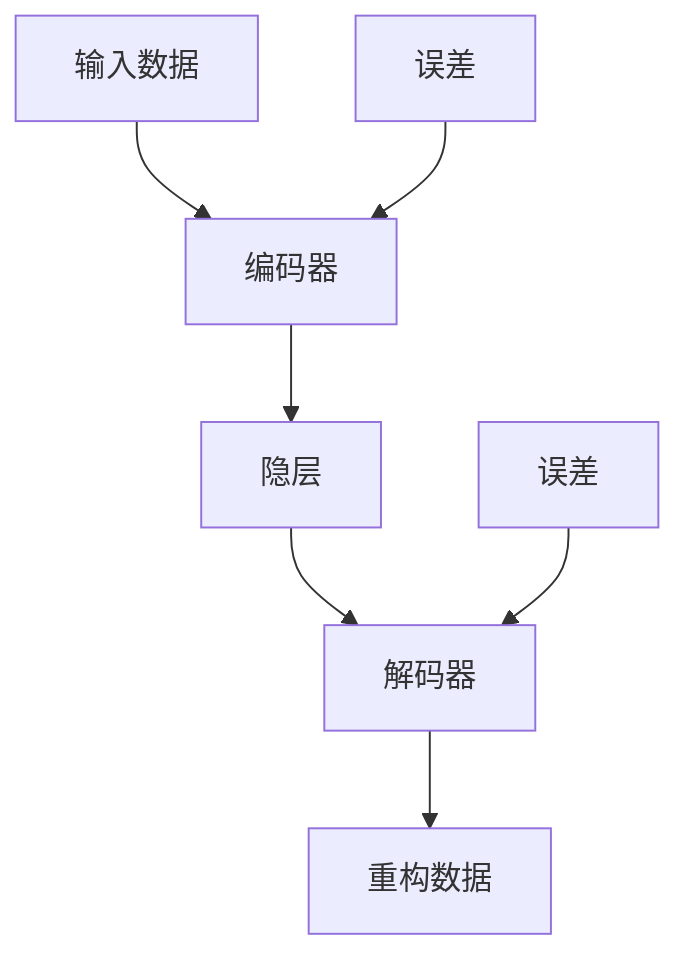

                 

### 文章标题：Python机器学习实战：自编码器（Autoencoders）在数据压缩中的实践

> 关键词：Python，机器学习，自编码器，数据压缩，实战

> 摘要：本文旨在通过Python语言，详细介绍自编码器（Autoencoders）在数据压缩中的应用。文章首先从机器学习基础出发，逐步讲解Python编程基础、数据处理、机器学习核心算法等知识。然后深入探讨自编码器的原理、结构、分类以及其在数据压缩中的具体应用。最后，通过实际项目案例，展示自编码器在图像数据压缩和降维任务中的实现过程和效果分析。希望本文能为读者在数据压缩领域提供有益的实践指导。

#### 第一部分：机器学习基础

**第1章：Python编程基础**

**1.1 Python语言简介**

Python是一种高级、动态、解释型编程语言，因其简洁易懂、高效易用等特点，被广泛应用于科学计算、数据分析、人工智能等领域。Python拥有丰富的库和工具，如NumPy、Pandas、scikit-learn、TensorFlow等，为机器学习研究提供了强大的支持。

**1.1.1 Python历史与特点**

Python由Guido van Rossum于1989年发明，是一种解释型语言，这意味着在运行Python程序时，不需要预先编译成机器码，而是在运行时由Python解释器逐行解释执行。Python具有以下特点：

- **简单易学**：Python语法简洁清晰，接近自然语言，易于上手。
- **可扩展性**：Python支持多种编程范式，如面向对象、过程式、函数式等，便于扩展和复用。
- **开源免费**：Python是开源软件，用户可以自由使用、修改和分发。

**1.1.2 Python安装与配置**

安装Python的步骤如下：

1. **下载安装包**：从Python官方网站（[python.org](https://www.python.org/)）下载适用于操作系统的安装包。
2. **安装Python**：运行安装包，按照提示完成安装。
3. **验证安装**：在命令行中输入`python --version`，如果显示Python版本信息，说明安装成功。

**1.2 Python数据类型与操作**

Python支持多种数据类型，包括整数（int）、浮点数（float）、布尔值（bool）、字符串（str）等。数据类型的使用和操作如下：

- **整数和浮点数**：整数和浮点数是数值类型，用于表示实数。例如：`x = 1`，`y = 2.5`。
- **布尔值**：布尔值用于表示逻辑值，只有`True`和`False`两种。例如：`is_python_easy = True`。
- **字符串**：字符串用于表示文本数据。例如：`message = "Hello, Python!"`。

**1.2.1 基本数据类型**

- **整数（int）**：表示整数，如`x = 10`。
- **浮点数（float）**：表示小数，如`y = 3.14`。
- **布尔值（bool）**：表示逻辑值，如`is_python_easy = True`。
- **字符串（str）**：表示文本数据，如`message = "Hello, Python!"`。

**1.2.2 列表与字典操作**

- **列表（list）**：表示有序集合，如`numbers = [1, 2, 3, 4, 5]`。
- **字典（dict）**：表示无序键值对，如`student = {"name": "Alice", "age": 20}`。

**1.2.3 数据类型转换与操作**

- **类型转换**：可以使用内置函数如`int()`、`float()`、`str()`进行类型转换。
- **列表操作**：可以使用切片、索引、排序等方法对列表进行操作。
- **字典操作**：可以使用键值对访问、更新和删除字典元素。

**1.3 Python函数与模块**

- **函数**：函数是组织代码的基本单元，用于执行特定任务。定义函数时，需要指定函数名、参数和函数体。例如：
  ```python
  def greet(name):
      print("Hello, " + name)
  ```
- **模块**：模块是组织代码的一种方式，用于将相关函数和类组织在一起。导入模块时，可以使用`import`语句。例如：
  ```python
  import math
  ```

**1.3.1 函数定义与调用**

- **定义函数**：使用`def`关键字定义函数，函数名后面跟一对圆括号，括号内是参数列表。例如：
  ```python
  def add(a, b):
      return a + b
  ```

- **调用函数**：使用函数名后面跟一对圆括号，并在括号内传入参数。例如：
  ```python
  result = add(3, 4)
  ```

**1.3.2 模块导入与使用**

- **导入模块**：使用`import`语句导入模块。例如：
  ```python
  import math
  ```

- **使用模块**：导入模块后，可以使用模块中的函数和类。例如：
  ```python
  math.sqrt(9)
  ```

**1.3.3 常用模块介绍**

Python拥有丰富的模块，其中一些常用模块包括：

- **math**：数学运算模块，如`math.sqrt()`、`math.cos()`等。
- **random**：随机数生成模块，如`random.randint()`、`random.random()`等。
- **os**：操作系统模块，用于与操作系统交互，如`os.listdir()`、`os.makedirs()`等。

**第2章：Python在数据处理中的应用**

**2.1 数据读取与预处理**

数据处理是机器学习任务中至关重要的一步。在Python中，可以使用Pandas和NumPy库进行数据处理。

**2.1.1 数据文件读取**

Python支持多种数据文件格式，如CSV、Excel、JSON等。使用Pandas库，可以方便地读取这些文件。

- **CSV文件读取**：
  ```python
  import pandas as pd
  data = pd.read_csv("data.csv")
  ```

- **Excel文件读取**：
  ```python
  data = pd.read_excel("data.xlsx")
  ```

- **JSON文件读取**：
  ```python
  data = pd.read_json("data.json")
  ```

**2.1.2 数据预处理方法**

数据预处理是确保数据质量、提升模型性能的重要步骤。常见的预处理方法包括：

- **数据清洗**：处理缺失值、异常值等。
- **数据转换**：将数据转换为适合模型训练的格式。
- **数据标准化**：将数据缩放到相同范围，如[0, 1]或[-1, 1]。

**2.1.3 数据清洗与转换**

- **数据清洗**：
  ```python
  data = data.dropna()  # 删除缺失值
  data = data[data["column"] != "invalid"]  # 删除异常值
  ```

- **数据转换**：
  ```python
  data = data[data["column"].map({1: "a", 2: "b", 3: "c"})]  # 转换标签
  ```

**2.1.4 数据标准化**

- **数据标准化**：
  ```python
  from sklearn.preprocessing import MinMaxScaler
  scaler = MinMaxScaler()
  data = scaler.fit_transform(data)
  ```

**2.2 数据可视化**

数据可视化是了解数据分布、趋势和异常的重要手段。Python中有多种数据可视化库，如Matplotlib、Seaborn等。

**2.2.1 常见数据可视化方法**

- **柱状图**：
  ```python
  import matplotlib.pyplot as plt
  plt.bar(data["column1"], data["column2"])
  plt.show()
  ```

- **折线图**：
  ```python
  plt.plot(data["column1"], data["column2"])
  plt.show()
  ```

- **散点图**：
  ```python
  plt.scatter(data["column1"], data["column2"])
  plt.show()
  ```

**2.2.2 可视化工具介绍**

- **Matplotlib**：Matplotlib是一个用于数据可视化的Python库，具有丰富的绘图功能。
- **Seaborn**：Seaborn是一个基于Matplotlib的交互式可视化库，提供多种数据可视化模板。

**2.2.3 数据可视化实践**

使用Matplotlib绘制一个简单的折线图：

```python
import matplotlib.pyplot as plt

x = [1, 2, 3, 4, 5]
y = [1, 4, 9, 16, 25]

plt.plot(x, y)
plt.xlabel("X-axis")
plt.ylabel("Y-axis")
plt.title("Line Plot")
plt.show()
```

**2.3 Python在数据处理中的高级应用**

**2.3.1 Pandas库操作**

Pandas是一个用于数据分析和操作的开源库，具有丰富的功能。

- **数据读取与写入**：
  ```python
  data = pd.read_csv("data.csv")
  data.to_csv("output.csv")
  ```

- **数据操作**：
  ```python
  data.head()  # 查看前几行数据
  data.describe()  # 查看数据描述统计
  data.sort_values(by="column")  # 对列进行排序
  ```

**2.3.2 NumPy库操作**

NumPy是一个用于高性能数值计算的Python库，提供多维数组（ndarray）和矩阵操作。

- **数组创建与操作**：
  ```python
  import numpy as np

  arr = np.array([1, 2, 3, 4, 5])
  arr.shape  # 查看数组形状
  arr.mean()  # 查看数组均值
  ```

- **矩阵操作**：
  ```python
  matrix = np.array([[1, 2], [3, 4]])
  matrix.dot(matrix)  # 矩阵乘法
  ```

**2.3.3 数据处理实战**

使用Pandas和NumPy进行数据处理实战。

```python
import pandas as pd
import numpy as np

# 读取数据
data = pd.read_csv("data.csv")

# 数据预处理
data = data.dropna()
data = data[data["column"] != "invalid"]

# 数据转换
data = data[data["column"].map({1: "a", 2: "b", 3: "c"})]

# 数据标准化
scaler = MinMaxScaler()
data = scaler.fit_transform(data)

# 数据可视化
plt.scatter(data["column1"], data["column2"])
plt.xlabel("Column 1")
plt.ylabel("Column 2")
plt.title("Scatter Plot")
plt.show()
```

#### 第二部分：机器学习核心算法

**第3章：机器学习基础概念与算法**

**3.1 机器学习基本概念**

机器学习是人工智能的一个重要分支，旨在让计算机通过数据和经验学习，从而自动完成特定任务。机器学习可以分为以下几类：

- **监督学习**：输入特征和标签，训练模型，然后使用模型进行预测。
- **无监督学习**：只输入特征，模型自动发现特征之间的规律。
- **强化学习**：通过试错学习，在环境中不断优化策略。

**3.1.1 监督学习、无监督学习与强化学习**

- **监督学习**：监督学习是一种最常见的机器学习类型，其中模型通过学习输入特征和对应的输出标签来预测未知数据。常见的监督学习算法包括线性回归、逻辑回归、决策树、支持向量机等。

- **无监督学习**：无监督学习是一种不提供标签的机器学习方法，模型需要从数据中自动发现规律。常见的无监督学习算法包括聚类、降维、主成分分析（PCA）等。

- **强化学习**：强化学习是一种通过试错学习来优化策略的机器学习方法。在强化学习中，模型根据环境反馈调整自己的行为，以最大化奖励。常见的强化学习算法包括Q学习、深度Q网络（DQN）、策略梯度等。

**3.1.2 特征工程与特征选择**

特征工程是机器学习任务中至关重要的一步，旨在从原始数据中提取对模型有用的特征。特征工程包括以下步骤：

- **数据预处理**：处理缺失值、异常值、噪声等。
- **特征转换**：将数值特征转换为适合模型训练的格式，如归一化、标准化等。
- **特征选择**：选择对模型性能有显著影响的特征，以提高模型效率和准确性。

**3.1.3 模型评估与优化**

模型评估是衡量模型性能的重要手段，常用的评估指标包括准确率、召回率、F1分数、均方误差（MSE）等。模型优化包括以下步骤：

- **交叉验证**：使用交叉验证方法评估模型性能，以避免过拟合。
- **参数调优**：调整模型参数，以提高模型性能。
- **正则化**：使用正则化方法防止过拟合，提高模型泛化能力。

**3.2 线性模型**

线性模型是一种简单而强大的机器学习模型，通过线性函数将输入特征映射到输出标签。线性模型可以分为以下几种：

- **线性回归**：预测连续值的线性模型。
- **逻辑回归**：预测概率的线性模型。
- **线性分类器**：预测离散值的线性模型。

**3.2.1 线性回归**

线性回归是一种用于预测连续值的线性模型，其公式为：
$$
y = \beta_0 + \beta_1 x_1 + \beta_2 x_2 + \ldots + \beta_n x_n
$$
其中，$y$是输出标签，$x_1, x_2, \ldots, x_n$是输入特征，$\beta_0, \beta_1, \beta_2, \ldots, \beta_n$是模型参数。

**3.2.2 线性分类器**

线性分类器是一种用于预测离散值的线性模型，其公式为：
$$
y = \text{sign}(\beta_0 + \beta_1 x_1 + \beta_2 x_2 + \ldots + \beta_n x_n)
$$
其中，$y$是输出标签，$x_1, x_2, \ldots, x_n$是输入特征，$\beta_0, \beta_1, \beta_2, \ldots, \beta_n$是模型参数。

**3.2.3 线性模型的应用**

线性模型可以应用于多种任务，如回归、分类等。以下是一个简单的线性回归应用示例：

```python
import numpy as np
from sklearn.linear_model import LinearRegression

# 数据集
X = np.array([[1, 2], [2, 3], [3, 4]])
y = np.array([2, 3, 4])

# 线性回归模型
model = LinearRegression()
model.fit(X, y)

# 预测
new_data = np.array([[4, 5]])
prediction = model.predict(new_data)

print(prediction)
```

**3.3 非线性模型**

非线性模型通过非线性函数将输入特征映射到输出标签，可以更好地捕捉数据中的复杂关系。非线性模型可以分为以下几种：

- **决策树**：基于树结构进行分类或回归的模型。
- **随机森林**：基于决策树的集成学习方法。
- **支持向量机**：基于最大间隔分类或回归的模型。
- **集成学习方法**：将多个模型组合起来，以提高模型性能。

**3.3.1 决策树与随机森林**

- **决策树**：决策树是一种基于树结构的分类或回归模型，其每个节点表示一个特征，每个分支表示一个特征取值。决策树通过递归划分数据集，直到满足停止条件（如最大深度、最小叶节点数等）。

- **随机森林**：随机森林是一种基于决策树的集成学习方法，通过随机选择特征和样本子集来训练多个决策树，然后对多个决策树的预测结果进行投票或平均，以提高模型性能。

**3.3.2 支持向量机**

- **支持向量机**：支持向量机是一种基于最大间隔分类或回归的模型，其目标是找到一个最优的超平面，将不同类别的数据点分隔开来。支持向量机通过求解优化问题，找到最优的模型参数。

**3.3.3 集成学习方法**

- **集成学习方法**：集成学习方法将多个模型组合起来，以提高模型性能。常见的集成学习方法包括Bagging、Boosting和Stacking等。

**第4章：自编码器（Autoencoders）**

**4.1 自编码器基础**

自编码器是一种无监督学习模型，旨在将输入数据压缩到较低维度的表示，然后重构原始数据。自编码器由编码器（Encoder）和解码器（Decoder）组成。

**4.1.1 自编码器原理**

自编码器的工作原理如下：

1. 编码器将输入数据映射到一个较低的维度，通常是一个中间层或隐层。
2. 解码器将压缩后的数据映射回原始维度。
3. 通过最小化重构误差（即原始数据和重构数据之间的差异）来训练模型。

**4.1.2 自编码器结构**

自编码器的基本结构如下图所示：



**4.1.3 自编码器分类**

根据编码器和解码器的结构，自编码器可以分为以下几种类型：

- **全连接自编码器（Fully Connected Autoencoder）**：编码器和解码器都是全连接神经网络。
- **卷积自编码器（Convolutional Autoencoder）**：编码器和解码器都是卷积神经网络。
- **循环自编码器（Recurrent Autoencoder）**：编码器和解码器都是循环神经网络。

**4.2 自编码器在数据压缩中的应用**

自编码器在数据压缩中的应用主要体现在两个方面：降维和数据重构。

**4.2.1 数据压缩原理**

数据压缩是通过减少数据存储空间或传输带宽来提高数据存储或传输效率的过程。自编码器通过以下原理实现数据压缩：

1. 编码器将输入数据映射到一个较低的维度，从而减少数据体积。
2. 解码器将压缩后的数据重构为原始数据，确保数据无损。

**4.2.2 自编码器在数据压缩中的应用案例**

以下是一个使用全连接自编码器进行数据压缩的案例：

```python
import numpy as np
from sklearn.model_selection import train_test_split
from sklearn.preprocessing import MinMaxScaler
from sklearn.metrics import mean_squared_error
from keras.models import Sequential
from keras.layers import Dense

# 生成模拟数据
X = np.random.rand(1000, 100)
X = MinMaxScaler().fit_transform(X)

# 划分训练集和测试集
X_train, X_test = train_test_split(X, test_size=0.2, random_state=42)

# 创建自编码器模型
model = Sequential()
model.add(Dense(50, input_shape=(100,), activation='relu'))
model.add(Dense(100, activation='relu'))
model.add(Dense(50, activation='relu'))
model.add(Dense(100, activation='sigmoid'))
model.add(Dense(100, activation='sigmoid'))

# 编译模型
model.compile(optimizer='adam', loss='mse')

# 训练模型
model.fit(X_train, X_train, epochs=10, batch_size=32, validation_data=(X_test, X_test))

# 评估模型
reconstruction_error = mean_squared_error(X_test, model.predict(X_test))
print("Reconstruction Error:", reconstruction_error)
```

**4.2.3 自编码器在图像数据压缩中的实践**

以下是一个使用卷积自编码器进行图像数据压缩的案例：

```python
import numpy as np
from tensorflow.keras.layers import Conv2D, MaxPooling2D, UpSampling2D
from tensorflow.keras.models import Model
from tensorflow.keras.datasets import mnist

# 加载MNIST数据集
(x_train, _), (x_test, _) = mnist.load_data()

# 归一化数据
x_train = x_train.astype('float32') / 255.
x_test = x_test.astype('float32') / 255.

# 创建卷积自编码器模型
input_shape = (28, 28, 1)
inputs = keras.Input(shape=input_shape)
x = Conv2D(32, (3, 3), activation='relu', padding='same')(inputs)
x = MaxPooling2D((2, 2), padding='same')(x)
x = Conv2D(32, (3, 3), activation='relu', padding='same')(x)
encoded = MaxPooling2D((2, 2), padding='same')(x)

encoded = keras.layers.Flatten()(encoded)
encoded = keras.layers.Dense(32, activation='relu')(encoded)
decoded = keras.layers.Dense(7 * 7 * 32, activation='relu')(encoded)
decoded = keras.layers.Reshape((7, 7, 32))(decoded)
decoded = Conv2D(32, (3, 3), activation='relu', padding='same')(decoded)
decoded = UpSampling2D((2, 2))(decoded)
decoded = Conv2D(32, (3, 3), activation='relu', padding='same')(decoded)
decoded = UpSampling2D((2, 2))(decoded)
outputs = Conv2D(1, (3, 3), activation='sigmoid', padding='same')(decoded)

# 构建模型
autoencoder = Model(inputs, outputs)

# 编译模型
autoencoder.compile(optimizer='adam', loss='binary_crossentropy')

# 训练模型
autoencoder.fit(x_train, x_train, epochs=100, batch_size=256, shuffle=True, validation_data=(x_test, x_test))

# 评估模型
reconstruction_error = autoencoder.evaluate(x_test, x_test)
print("Reconstruction Error:", reconstruction_error)
```

**4.3 自编码器在降维中的应用**

降维是将高维数据映射到低维空间的过程，以减少数据体积并提高计算效率。自编码器在降维中的应用主要体现在以下两个方面：

- **特征提取**：自编码器通过编码器将高维数据映射到低维空间，从而提取关键特征。
- **特征压缩**：自编码器通过压缩编码器和解码器之间的权重，实现特征压缩。

**4.3.1 降维原理**

降维的基本原理是将高维数据映射到一个较低维的空间，从而减少数据体积。降维方法可以分为以下几种：

- **线性降维**：如主成分分析（PCA）、线性判别分析（LDA）等。
- **非线

