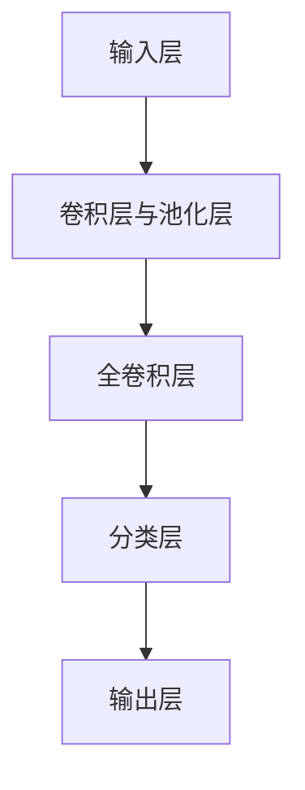
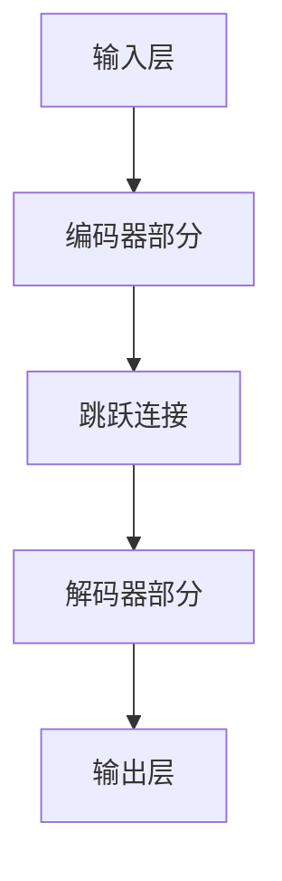
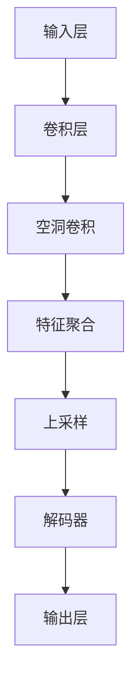

                 

# 文章标题：Python深度学习实践：基于深度学习的语义分割技术

> 关键词：Python，深度学习，语义分割，全卷积网络，U-Net，DeepLab V3+，Mask R-CNN

> 摘要：本文旨在探讨基于深度学习的语义分割技术在Python编程环境下的实践应用。文章首先介绍了深度学习的基础概念及其与语义分割的关系，然后详细阐述了深度学习环境搭建的方法和深度学习基础算法。接着，文章深入分析了深度学习的数学模型及其核心概念与联系，并展示了深度学习架构的对比与模型可视化技术。随后，本文聚焦于深度学习在语义分割中的应用，详细介绍了FCN、U-Net、DeepLab V3+和Mask R-CNN等关键技术，并通过实际案例展示了语义分割的实战过程。最后，文章讨论了深度学习在语义分割领域的挑战与未来趋势，为读者提供了全面的技术见解和发展展望。

### 目录大纲：《Python深度学习实践：基于深度学习的语义分割技术》

# 第一部分：深度学习基础

## 第1章：深度学习概述

### 1.1 深度学习的基本概念
### 1.2 深度学习的架构
### 1.3 深度学习与语义分割

## 第2章：Python与深度学习环境搭建

### 2.1 Python基础
### 2.2 深度学习框架安装与配置
### 2.3 深度学习开发工具与库

## 第3章：深度学习基础算法

### 3.1 神经网络基础
### 3.2 卷积神经网络（CNN）
### 3.3 优化算法

## 第4章：深度学习数学模型

### 4.1 矩阵与向量操作
### 4.2 激活函数与损失函数
### 4.3 深度学习优化算法

## 第5章：深度学习核心概念与联系

### 5.1 深度学习架构对比
### 5.2 深度学习模型的可视化与解释

# 第二部分：深度学习在语义分割中的应用

## 第6章：语义分割技术概述

### 6.1 语义分割的定义与分类
### 6.2 语义分割的目标与挑战

## 第7章：基于深度学习的语义分割技术

### 7.1 FCN（全卷积网络）
### 7.2 U-Net（带孔的卷积网络）
### 7.3 DeepLab V3+
### 7.4 Mask R-CNN（掩码区域建议网络）

## 第8章：深度学习在语义分割中的应用案例

### 8.1 数据预处理与模型训练
### 8.2 模型评估与优化
### 8.3 语义分割实战案例

# 第三部分：深度学习在语义分割领域的挑战与未来趋势

## 第9章：深度学习在语义分割中的挑战

### 9.1 数据集问题
### 9.2 计算资源需求
### 9.3 模型解释性

## 第10章：深度学习在语义分割领域的未来趋势

### 10.1 新算法与模型的发展
### 10.2 应用场景的拓展
### 10.3 深度学习与其他技术的融合

## 第11章：总结与展望

### 11.1 语义分割技术发展历程
### 11.2 深度学习在语义分割中的地位与影响
### 11.3 未来发展展望

# 附录

## 附录A：深度学习在语义分割中的常见工具和库

### A.1 TensorFlow
### A.2 PyTorch
### A.3 Keras

## 附录B：参考文献

### 参考文献1
### 参考文献2
### ...

---

### 第1章：深度学习概述

#### 1.1 深度学习的基本概念

深度学习（Deep Learning）是机器学习（Machine Learning）的一个重要分支，其核心思想是通过构建深度神经网络（Deep Neural Networks）来模拟人脑的神经元结构和信息处理方式，从而实现复杂的模式识别、预测和分类任务。

深度学习的核心技术包括：

1. **神经网络**：神经网络由大量相互连接的节点（或称为“神经元”）组成，这些节点通过调整权重和偏置进行训练，以适应不同的数据模式。
2. **反向传播**：反向传播算法是一种优化算法，通过计算梯度来更新网络的权重和偏置，从而提高模型的性能。
3. **激活函数**：激活函数用于引入非线性，使得神经网络能够处理更复杂的问题。
4. **损失函数**：损失函数用于衡量模型预测结果与实际结果之间的差距，以指导反向传播算法的权重更新。

#### 1.2 深度学习的架构

深度学习的架构通常分为以下几个层次：

1. **输入层**：接收外部输入数据，如图像、文本或声音。
2. **隐藏层**：多个隐藏层通过相互连接形成深度神经网络，每个隐藏层都对输入数据进行特征提取和变换。
3. **输出层**：输出层的输出结果通常是一个或多个预测值，如分类结果或回归值。

常见的深度学习架构包括：

- **卷积神经网络（CNN）**：专门用于图像识别和处理。
- **循环神经网络（RNN）**：适用于处理序列数据。
- **生成对抗网络（GAN）**：通过生成器和判别器之间的对抗训练生成高质量的数据。

#### 1.3 深度学习与语义分割

语义分割是一种图像处理技术，其目的是将图像中的每个像素分类到不同的语义类别中。深度学习在语义分割中发挥了重要作用，通过训练深度神经网络，可以自动地学习和提取图像中的语义信息。

深度学习在语义分割中的应用主要包括以下几种：

1. **全卷积网络（FCN）**：通过将全连接层替换为卷积层，实现了对图像的全局处理，从而在语义分割中取得了显著的效果。
2. **U-Net**：一种具有对称结构的卷积神经网络，通过编码器和解码器的结构，实现了从高层次特征到低层次细节的特征融合。
3. **DeepLab V3+**：通过引入空洞卷积和特征聚合技术，实现了对图像像素的精细分割。
4. **Mask R-CNN**：结合了区域建议网络（RPN）和区域分割网络（ROI Align），实现了高效的语义分割和实例分割。

本章概述了深度学习的基本概念、架构以及与语义分割的关系，为后续章节的深入探讨奠定了基础。在接下来的章节中，我们将详细讨论深度学习环境搭建、基础算法、数学模型以及在语义分割中的应用，帮助读者全面理解深度学习的理论与实践。

---

### 第2章：Python与深度学习环境搭建

#### 2.1 Python基础

Python是一种广泛使用的高级编程语言，以其简洁、易读和功能强大而著称。在深度学习领域，Python因其丰富的库和框架支持，成为开发者的首选语言。下面简要介绍Python的基础知识和安装方法。

#### 2.1.1 Python安装步骤

1. **下载安装包**：访问Python官方网站（https://www.python.org/）下载适用于操作系统的Python安装包。
2. **安装Python**：双击安装包，按照安装向导进行操作。在安装过程中，确保勾选“Add Python to PATH”选项，以便在命令行中直接使用Python。
3. **验证安装**：在命令行中输入以下命令，检查Python是否已成功安装：

    ```bash
    python --version
    ```

    如果正确显示Python的版本信息，说明安装成功。

#### 2.1.2 Python环境变量配置

在Windows操作系统中，需要配置Python的环境变量，以便在命令行中直接调用Python。具体步骤如下：

1. **找到Python安装路径**：通常位于`C:\Users\[用户名]\AppData\Local\Programs\Python\Python[版本号]`。
2. **配置环境变量**：
    - 在控制面板中打开“系统”。
    - 点击“高级系统设置”。
    - 在“系统属性”窗口中点击“环境变量”。
    - 在“系统变量”中找到“Path”变量，点击“编辑”。
    - 在变量值中添加Python安装路径，例如`C:\Users\[用户名]\AppData\Local\Programs\Python\Python[版本号]`。
    - 点击“确定”保存设置。

#### 2.1.3 Python开发工具

1. **PyCharm**：PyCharm是一款功能强大的集成开发环境（IDE），支持Python的开发，提供代码自动补全、调试和版本控制等功能。
2. **VS Code**：Visual Studio Code（VS Code）是一款轻量级的代码编辑器，通过安装Python扩展，也可以进行Python编程，支持语法高亮、调试和自动化代码格式化。

#### 2.2 深度学习框架安装与配置

深度学习框架是深度学习开发的重要工具，常用的深度学习框架包括TensorFlow、PyTorch和Keras。以下分别介绍这些框架的安装与配置方法。

##### 2.2.1 TensorFlow安装

TensorFlow是Google开发的开源深度学习框架，具有广泛的应用和丰富的文档。

1. **安装命令**：在命令行中输入以下命令安装TensorFlow：

    ```bash
    pip install tensorflow
    ```

2. **验证安装**：安装完成后，在命令行中输入以下命令验证TensorFlow是否安装成功：

    ```bash
    python -c "import tensorflow as tf; print(tf.__version__)"
    ```

    如果正确显示TensorFlow的版本信息，说明安装成功。

##### 2.2.2 PyTorch安装

PyTorch是Facebook开发的开源深度学习框架，以其动态计算图和易用性而受到开发者的青睐。

1. **安装命令**：在命令行中输入以下命令安装PyTorch：

    ```bash
    pip install torch torchvision
    ```

2. **验证安装**：安装完成后，在命令行中输入以下命令验证PyTorch是否安装成功：

    ```bash
    python -c "import torch; print(torch.__version__); print(torch.cuda.is_available())"
    ```

    如果正确显示PyTorch的版本信息和CUDA可用性，说明安装成功。

##### 2.2.3 Keras安装

Keras是一个高层次的深度学习API，可以在TensorFlow和Theano等后端上运行。

1. **安装命令**：在命令行中输入以下命令安装Keras：

    ```bash
    pip install keras
    ```

2. **验证安装**：安装完成后，在命令行中输入以下命令验证Keras是否安装成功：

    ```bash
    python -c "import keras; print(keras.__version__)"
    ```

    如果正确显示Keras的版本信息，说明安装成功。

##### 2.2.4 深度学习框架配置

在安装深度学习框架后，需要配置相应的环境，以便进行深度学习开发。

1. **配置CUDA**：如果使用的是基于CUDA的框架（如TensorFlow和PyTorch），需要配置CUDA环境。具体步骤如下：
    - 安装CUDA Toolkit（版本取决于框架要求）。
    - 在系统中配置CUDA路径。
    - 安装对应的cuDNN库。

2. **配置Python环境**：确保Python环境已经配置正确，包括环境变量和开发工具。

3. **测试深度学习框架**：通过运行示例代码，测试深度学习框架是否正常工作。

#### 2.3 深度学习开发工具与库

在进行深度学习开发时，常用的工具和库包括：

1. **NumPy**：用于数值计算的库，提供了强大的多维数组对象和数学函数。
2. **Pandas**：用于数据处理和分析的库，提供了高效的数据结构和数据分析工具。
3. **Matplotlib**：用于数据可视化的库，可以生成各种类型的图表和图形。
4. **Seaborn**：基于Matplotlib的统计数据可视化库，提供了更美观和专业的图表样式。
5. **Scikit-learn**：用于机器学习的库，提供了各种常用的机器学习算法和工具。

通过以上介绍，读者可以了解Python及其深度学习框架的安装与配置方法，并熟悉常用的深度学习开发工具。这些知识和技能为后续的深度学习实践打下了坚实的基础。

---

### 第3章：深度学习基础算法

#### 3.1 神经网络基础

神经网络（Neural Networks）是深度学习的基础，通过模拟人脑神经元的工作方式，实现数据的输入、处理和输出。下面我们将详细介绍神经网络的基本概念和结构。

##### 3.1.1 神经元

神经元是神经网络的基本构建块，类似于人脑中的神经元。每个神经元包含以下几个部分：

1. **输入**：接收外部数据或信号。
2. **权重**：表示输入与神经元之间的关联强度。
3. **偏置**：用于调整神经元的激活阈值。
4. **激活函数**：引入非线性，决定神经元是否“激活”。
5. **输出**：神经元的输出结果，传递给下一层神经元。

##### 3.1.2 神经网络结构

神经网络通常包括以下几个层次：

1. **输入层**：接收外部输入数据，如图像、文本或声音。
2. **隐藏层**：多个隐藏层通过相互连接形成深度神经网络，每个隐藏层都对输入数据进行特征提取和变换。
3. **输出层**：输出层的输出结果通常是一个或多个预测值，如分类结果或回归值。

##### 3.1.3 前向传播与反向传播

神经网络的训练过程主要包括前向传播（Forward Propagation）和反向传播（Back Propagation）两个步骤。

1. **前向传播**：从输入层开始，逐层将输入数据传递到输出层。在每个神经元中，计算输入与权重的乘积，加上偏置，再通过激活函数得到输出。
2. **反向传播**：根据预测值与实际值之间的差距，计算损失函数的梯度，然后通过反向传播算法，将梯度反向传播到每一层神经元，更新权重和偏置。

##### 3.1.4 激活函数

激活函数是神经网络中的关键部分，用于引入非线性。常见的激活函数包括：

1. **Sigmoid函数**：将输入映射到（0,1）区间，但梯度消失问题严重。
2. **ReLU函数**：非饱和激活函数，解决了梯度消失问题，但可能产生梯度消失（Dead Neuron）。
3. **Tanh函数**：将输入映射到（-1,1）区间，梯度问题相对较小。
4. **Leaky ReLU函数**：对ReLU函数的改进，解决了梯度消失问题。

#### 3.2 卷积神经网络（CNN）

卷积神经网络（Convolutional Neural Networks，CNN）是专门用于图像识别和处理的深度学习模型。CNN通过卷积层、池化层和全连接层等结构，实现特征提取和分类。

##### 3.2.1 卷积层

卷积层是CNN的核心部分，通过卷积操作提取图像特征。卷积操作包括以下步骤：

1. **卷积核**：一个小的滤波器，用于在图像上滑动，提取局部特征。
2. **卷积操作**：将卷积核与图像上的局部区域进行点积运算，生成特征图。
3. **激活函数**：对卷积结果应用激活函数，引入非线性。

##### 3.2.2 池化层

池化层用于降低特征图的维度，减少参数数量。常见的池化操作包括：

1. **最大池化**：选取特征图上的最大值作为输出。
2. **平均池化**：计算特征图上所有值的平均值作为输出。

##### 3.2.3 全连接层

全连接层将特征图的每个元素连接到输出层的每个神经元，实现分类任务。全连接层通过权重矩阵和偏置向量，将输入特征映射到输出类别。

##### 3.2.4 CNN训练过程

CNN的训练过程包括以下步骤：

1. **输入图像预处理**：将图像缩放到固定大小，进行归一化等预处理操作。
2. **前向传播**：将预处理后的图像输入到CNN中，逐层计算输出。
3. **损失计算**：计算输出与真实标签之间的损失值，如交叉熵损失。
4. **反向传播**：通过反向传播算法，计算损失函数的梯度，并更新网络参数。
5. **迭代优化**：重复前向传播和反向传播过程，直到模型收敛。

#### 3.3 优化算法

优化算法用于训练神经网络，通过调整网络参数，使模型在训练数据上达到最优性能。常见的优化算法包括：

1. **梯度下降（Gradient Descent）**：通过计算损失函数的梯度，更新网络参数，以达到最小化损失的目的。常见的梯度下降算法包括：
    - **随机梯度下降（SGD）**：在每个样本上计算梯度，更新参数。
    - **批量梯度下降（BGD）**：在所有样本上计算梯度，更新参数。
    - **小批量梯度下降（MBGD）**：在部分样本上计算梯度，更新参数。
2. **动量法（Momentum）**：引入动量项，加速收敛速度，避免陷入局部最小值。
3. **自适应优化器**：如AdaGrad、RMSprop和Adam等，通过自适应调整学习率，提高训练效率。

本章介绍了神经网络的基础知识，包括神经元、神经网络结构、激活函数、卷积神经网络（CNN）以及优化算法。这些基础算法构成了深度学习的重要基石，为后续的语义分割技术奠定了理论基础。

---

### 第4章：深度学习数学模型

深度学习作为一门高度依赖数学的领域，其核心在于通过数学模型来描述网络的行为，并通过优化算法不断调整模型参数，以实现期望的预测效果。在本章中，我们将深入探讨深度学习中的矩阵与向量操作、激活函数与损失函数，以及深度学习优化算法。

#### 4.1 矩阵与向量操作

在深度学习中，矩阵与向量操作是基础。矩阵（Matrix）是二维数组，而向量（Vector）是一维数组。以下是几种常见的矩阵与向量操作：

1. **点积（Dot Product）**：两个向量的对应元素相乘后求和。例如，对于向量`a`和`b`，点积计算公式为：

    $$a \cdot b = \sum_{i=1}^{n} a_i \times b_i$$

2. **矩阵-向量乘法（Matrix-Vector Multiplication）**：一个矩阵与一个向量相乘，矩阵的每一行与向量进行点积运算。例如，对于矩阵`A`和向量`x`，矩阵-向量乘法公式为：

    $$Ax = [a_{11}x_1 + a_{12}x_2 + ... + a_{1n}x_n, a_{21}x_1 + a_{22}x_2 + ... + a_{2n}x_n, ..., a_{m1}x_1 + a_{m2}x_2 + ... + a_{mn}x_n]$$

3. **矩阵-矩阵乘法（Matrix-Matrix Multiplication）**：两个矩阵对应行与列相乘后求和。例如，对于矩阵`A`和矩阵`B`，矩阵-矩阵乘法公式为：

    $$AB = \left[\sum_{k=1}^{n} (a_{ik}b_{kj}) \right]_{m\times p}$$

这些基本操作构成了深度学习中的许多算法和优化方法的基础。

#### 4.2 激活函数与损失函数

激活函数（Activation Function）是神经网络中用于引入非线性的函数，常见的激活函数包括：

1. **Sigmoid函数**：将输入映射到（0,1）区间，常用于二分类问题。

    $$\sigma(x) = \frac{1}{1 + e^{-x}}$$

2. **ReLU函数**：修正线性单元，将输入大于零的部分设置为输入值，否则设置为零，可以有效避免梯度消失问题。

    $$\text{ReLU}(x) = \max(0, x)$$

3. **Tanh函数**：双曲正切函数，将输入映射到（-1,1）区间。

    $$\tanh(x) = \frac{e^x - e^{-x}}{e^x + e^{-x}}$$

4. **Leaky ReLU函数**：对ReLU函数的改进，当输入小于零时，引入一个小的线性斜率，避免死神经元问题。

    $$\text{Leaky ReLU}(x) = \max(0.01x, x)$$

损失函数（Loss Function）用于衡量预测值与真实值之间的差异，常见的损失函数包括：

1. **均方误差（MSE，Mean Squared Error）**：用于回归问题，计算预测值与真实值之差的平方和的平均值。

    $$MSE = \frac{1}{n}\sum_{i=1}^{n} (y_i - \hat{y}_i)^2$$

2. **交叉熵（Cross Entropy）**：用于分类问题，计算预测概率分布与真实分布之间的差异。

    $$H(y, \hat{y}) = -\sum_{i=1}^{n} y_i \log(\hat{y}_i)$$

3. **Hinge Loss**：用于支持向量机（SVM）等分类问题，计算预测值与真实值之间的差距。

    $$L(y, \hat{y}) = \max(0, 1 - y\hat{y})$$

激活函数与损失函数的选择直接影响到神经网络的训练效果，需要根据具体问题进行选择。

#### 4.3 深度学习优化算法

深度学习优化算法用于通过迭代过程调整网络参数，以最小化损失函数。以下是几种常见的优化算法：

1. **梯度下降（Gradient Descent）**：最简单的优化算法，通过计算损失函数的梯度，反向更新参数。

    $$\theta_{\text{new}} = \theta_{\text{old}} - \alpha \nabla_{\theta} J(\theta)$$

    其中，$\alpha$为学习率，$J(\theta)$为损失函数。

2. **随机梯度下降（SGD，Stochastic Gradient Descent）**：在每次迭代中，随机选择一个样本计算梯度，更新参数。

    $$\theta_{\text{new}} = \theta_{\text{old}} - \alpha \nabla_{\theta} J(\theta; x_i, y_i)$$

3. **批量梯度下降（BGD，Batch Gradient Descent）**：在每次迭代中，计算所有样本的梯度，更新参数。

    $$\theta_{\text{new}} = \theta_{\text{old}} - \alpha \nabla_{\theta} J(\theta; \mathbf{X}, \mathbf{y})$$

4. **动量法（Momentum）**：引入动量项，加速收敛速度，避免陷入局部最小值。

    $$v_t = \beta v_{t-1} + (1 - \beta) \nabla_{\theta} J(\theta)$$
    $$\theta_{\text{new}} = \theta_{\text{old}} - \alpha v_t$$

    其中，$\beta$为动量系数。

5. **自适应优化器**：如AdaGrad、RMSprop和Adam，通过自适应调整学习率，提高训练效率。

    - **AdaGrad**：根据每个参数的历史梯度平方值自适应调整学习率。
    - **RMSprop**：类似AdaGrad，但使用指数加权移动平均来计算梯度平方的平均值。
    - **Adam**：结合AdaGrad和RMSprop的优点，同时考虑一阶和二阶矩估计。

通过以上数学模型的介绍，我们可以更好地理解深度学习的理论基础，并在实际应用中灵活运用。这些数学工具不仅帮助我们构建深度学习模型，还指导我们优化和调整模型，使其在复杂任务中取得优异的性能。

---

### 第5章：深度学习核心概念与联系

#### 5.1 深度学习架构对比

在深度学习的实践中，不同的架构被设计用于解决不同类型的问题。以下是几种常见的深度学习架构及其优缺点对比：

1. **卷积神经网络（CNN）**：
   - **优点**：特别适合处理图像数据，能够自动提取图像特征。
   - **缺点**：对序列数据处理效果不佳，需要大量训练数据和计算资源。
   - **适用场景**：图像识别、图像分类、物体检测等。

2. **循环神经网络（RNN）**：
   - **优点**：能够处理序列数据，保持长时状态。
   - **缺点**：梯度消失和梯度爆炸问题，训练效率低。
   - **适用场景**：自然语言处理、语音识别、时间序列分析等。

3. **长短期记忆网络（LSTM）**：
   - **优点**：解决了RNN的梯度消失问题，能够处理长序列数据。
   - **缺点**：模型复杂，计算资源需求高。
   - **适用场景**：长文本生成、机器翻译、时间序列预测等。

4. **生成对抗网络（GAN）**：
   - **优点**：能够生成高质量的数据，有助于数据增强。
   - **缺点**：训练不稳定，需要大量计算资源。
   - **适用场景**：图像生成、图像修复、数据增强等。

5. **自编码器（Autoencoder）**：
   - **优点**：能够自动学习数据的有效表示。
   - **缺点**：生成质量相对较低，对噪声敏感。
   - **适用场景**：数据降维、去噪、异常检测等。

不同架构的对比有助于我们根据具体问题选择合适的模型，提高模型的训练效率和预测准确性。

#### 5.2 深度学习模型的可视化与解释

深度学习模型的可视化与解释对于理解和优化模型具有重要意义。以下是一些常用的模型可视化与解释方法：

1. **特征可视化**：通过可视化神经网络隐藏层的特征图，了解模型如何提取和表示数据。常用的方法包括：
   - **热力图（Heatmap）**：将特征图映射到输入数据上，展示特征在图像中的分布。
   - **等高线图（Contour Plot）**：展示特征图的轮廓，帮助理解特征的空间分布。

2. **权重可视化**：通过可视化神经网络中的权重矩阵，了解模型对不同特征的关注程度。
   - **权重热力图（Weight Heatmap）**：将权重矩阵映射到输入数据上，展示权重在特征空间中的分布。
   - **权重层次图（Weight Pyramid）**：展示不同层的权重分布，帮助理解模型的多层次特征提取过程。

3. **激活可视化**：通过可视化神经元的激活状态，了解模型在处理数据时的行为。
   - **激活热力图（Activation Heatmap）**：展示每个神经元在处理输入数据时的激活状态。
   - **激活层次图（Activation Pyramid）**：展示不同层的激活状态，帮助理解模型的多层次特征提取过程。

4. **模型解释工具**：使用专门的工具进行模型解释，如LIME（Local Interpretable Model-agnostic Explanations）和SHAP（SHapley Additive exPlanations）。
   - **LIME**：通过局部线性模型解释模型决策，使其更具解释性。
   - **SHAP**：基于博弈论原理，为每个特征分配影响力值，帮助理解模型决策。

通过模型可视化与解释，我们可以更深入地理解深度学习模型的工作原理，识别潜在问题，并进行优化。这些方法不仅有助于提高模型的性能，还能增强模型的可信度和应用价值。

---

### 第6章：语义分割技术概述

#### 6.1 语义分割的定义与分类

语义分割（Semantic Segmentation）是计算机视觉领域的一个重要任务，其目的是将图像中的每个像素精确地分类到不同的语义类别中。与传统的图像分类任务（如识别图片中的猫或狗）不同，语义分割不仅要识别图像中的物体，还要将图像中的每个像素都标注出来。

根据处理方法和实现技术，语义分割可以分为以下几类：

1. **基于区域的方法**：这类方法通过检测图像中的区域，并对其进行分类。常见的算法包括基于阈值的区域分割、基于边缘检测的区域分割等。

2. **基于边缘的方法**：这类方法通过检测图像中的边缘，并结合区域信息进行分割。常见的算法包括Canny边缘检测、基于阈值的边缘检测等。

3. **基于图的方法**：这类方法通过构建图像的图模型，利用图的分割算法进行语义分割。常见的算法包括谱聚类、图割等。

4. **基于深度学习的方法**：随着深度学习技术的发展，基于深度学习的语义分割方法逐渐成为主流。这类方法利用深度神经网络自动提取图像特征，并实现对像素的精确分类。常见的算法包括全卷积网络（FCN）、U-Net、DeepLab等。

#### 6.2 语义分割的目标与挑战

语义分割的目标是生成一个与输入图像分辨率相同的分割标签图，其中每个像素都被精确地分类到不同的语义类别中。具体来说，语义分割的目标包括：

1. **精确度**：准确地将图像中的每个像素分类到正确的语义类别中。
2. **完整性**：确保图像中所有语义类别都被完整地分割出来，没有漏掉任何像素。
3. **效率**：在合理的时间内完成分割任务，以便在实际应用中实现实时处理。

然而，实现高效的语义分割面临着以下几个挑战：

1. **计算资源需求**：深度学习模型通常需要大量的计算资源和时间进行训练和推理，特别是在高分辨率图像上。
2. **数据标注**：高质量的语义分割数据集需要大量的人工标注，这是一个耗时且昂贵的任务。
3. **模型解释性**：深度学习模型通常是一个黑盒子，难以解释其决策过程，这在某些应用场景中可能是一个重要问题。
4. **多尺度特征提取**：语义分割需要同时处理图像的局部和全局特征，这对模型的特征提取能力提出了高要求。

尽管存在这些挑战，语义分割技术在计算机视觉和人工智能领域仍然具有广泛的应用前景，包括自动驾驶、医学图像分析、视频监控等。随着算法的进步和计算资源的提升，语义分割技术将继续发展和完善，为更多领域带来创新和变革。

---

### 第7章：基于深度学习的语义分割技术

#### 7.1 FCN（全卷积网络）

FCN（Fully Convolutional Network）是一种专门用于语义分割的深度学习模型，其核心思想是将传统的全连接层替换为卷积层，使得网络能够对图像进行全局处理，从而实现像素级的精确分割。

##### **核心概念与联系**

FCN的主要架构包括以下几个部分：

1. **卷积层与池化层**：用于提取图像的特征，通过多层卷积和池化操作，逐步降低特征图的维度。
2. **全连接层**：传统神经网络中的全连接层被替换为卷积层，使得输出特征图的每个像素都能与全连接层的每个神经元相连。
3. **分类层**：在卷积层的基础上添加一个分类层，用于对每个像素进行分类。

以下是一个简化的FCN架构Mermaid流程图：



##### **核心算法原理讲解**

FCN的核心算法可以概括为以下步骤：

1. **特征提取**：通过多层卷积和池化层提取图像的局部特征。具体实现时，可以使用预训练的卷积神经网络（如VGG、ResNet等）作为特征提取器。

    ```python
    def feature_extraction(input_image):
        # 使用预训练的卷积神经网络提取特征
        features = convNet(input_image)
        return features
    ```

2. **上采样**：将提取到的特征图通过上采样（upsampling）操作恢复到原始图像的大小。

    ```python
    def upsampling(features):
        # 上采样特征图
        upsampled_features = nn.Upsample(scale_factor=2, mode='bilinear')
        return upsampled_features
    ```

3. **全卷积层**：在特征图上应用一个全卷积层，每个像素都与全连接层的每个神经元相连，实现对每个像素的分类。

    ```python
    def fully_conv_layer(upsampled_features):
        # 应用全卷积层进行分类
        output = nn.Conv2d(in_channels=upsampled_features.shape[1], out_channels=num_classes, kernel_size=1)
        return output
    ```

4. **损失函数**：使用交叉熵损失函数（Cross Entropy Loss）来计算预测标签与真实标签之间的差距，并更新网络参数。

    ```python
    def loss_function(output, target):
        # 计算交叉熵损失
        loss = nn.CrossEntropyLoss()
        loss_value = loss(output, target)
        return loss_value
    ```

##### **实际应用案例**

以下是一个简单的FCN实现案例，用于对图像进行语义分割：

```python
import torch
import torchvision.models as models
import torch.nn as nn

# 定义FCN模型
class FCN(nn.Module):
    def __init__(self, num_classes):
        super(FCN, self).__init__()
        # 使用预训练的VGG模型作为特征提取器
        self.convNet = models.vgg16(pretrained=True)
        # 冻结预训练模型的权重
        for param in self.convNet.parameters():
            param.requires_grad = False
        
        # 定义全卷积层和分类层
        self.fc = nn.Conv2d(512, num_classes, 1)

    def forward(self, x):
        # 提取特征
        features = self.convNet.features(x)
        # 上采样
        upsampled_features = nn.Upsample(scale_factor=8, mode='bilinear')(features)
        # 分类
        output = self.fc(upsampled_features)
        return output

# 初始化模型和优化器
model = FCN(num_classes=21)
optimizer = torch.optim.Adam(model.parameters(), lr=0.001)

# 训练模型
for epoch in range(num_epochs):
    for inputs, labels in train_loader:
        # 将输入和标签转换为GPU设备
        inputs, labels = inputs.to(device), labels.to(device)
        
        # 前向传播
        outputs = model(inputs)
        loss = loss_function(outputs, labels)
        
        # 反向传播和优化
        optimizer.zero_grad()
        loss.backward()
        optimizer.step()
        
        print(f"Epoch [{epoch+1}/{num_epochs}], Loss: {loss.item():.4f}")

# 评估模型
with torch.no_grad():
    correct = 0
    total = 0
    for inputs, labels in val_loader:
        inputs, labels = inputs.to(device), labels.to(device)
        outputs = model(inputs)
        _, predicted = torch.max(outputs.data, 1)
        total += labels.size(0)
        correct += (predicted == labels).sum().item()
    print(f"Validation Accuracy: {100 * correct / total}%")
```

该案例使用预训练的VGG16模型作为特征提取器，并在其基础上添加了一个全卷积层和一个分类层。通过训练和验证，可以评估模型的性能。

---

### 第7章：基于深度学习的语义分割技术（续）

#### 7.2 U-Net（带孔的卷积网络）

U-Net是一种专门用于医学图像分割的深度学习模型，由Ronneberger等人于2015年提出。U-Net的特点是结构对称，通过编码器和解码器的设计，实现了对图像的精细分割。

##### **核心概念与联系**

U-Net的核心架构包括以下部分：

1. **编码器（Encoder）**：通过卷积层和池化层提取图像的特征，逐步降低特征图的维度。
2. **跳跃连接（Skip Connection）**：在编码器的深层和浅层之间建立跳跃连接，使得解码器能够利用深层特征的同时，保留浅层特征的信息。
3. **解码器（Decoder）**：通过反卷积层和上采样层，将编码器提取到的特征逐渐恢复到原始图像的大小，并融合跳跃连接的信息。
4. **分类层**：在解码器的输出上应用一个卷积层，实现对每个像素的分类。

以下是一个简化的U-Net架构Mermaid流程图：



##### **核心算法原理讲解**

U-Net的核心算法可以概括为以下步骤：

1. **编码器**：通过逐层卷积和池化操作，提取图像的局部特征。编码器的每层卷积核大小为3x3，步长为1，激活函数为ReLU。

    ```python
    def encoder(input_image):
        # 第一个卷积层
        conv1 = nn.Conv2d(in_channels=1, out_channels=64, kernel_size=3, stride=1, padding=1)
        input_image = nn.ReLU()(conv1(input_image))
        input_image = nn.MaxPool2d(kernel_size=2, stride=2)(input_image)
        
        # 第二个卷积层
        conv2 = nn.Conv2d(in_channels=64, out_channels=128, kernel_size=3, stride=1, padding=1)
        input_image = nn.ReLU()(conv2(input_image))
        input_image = nn.MaxPool2d(kernel_size=2, stride=2)(input_image)
        
        # ...后续卷积层...
        
        return input_image
    ```

2. **跳跃连接**：在编码器的深层和浅层之间建立跳跃连接，使得解码器能够利用深层特征的同时，保留浅层特征的信息。

    ```python
    def skip_connection(encoder_output, decoder_output):
        # 将编码器输出和解码器输出进行融合
        fused_output = nn.Conv2d(in_channels=encoder_output.shape[1], out_channels=decoder_output.shape[1], kernel_size=1)(encoder_output)
        return nn.ReLU()(fused_output + decoder_output)
    ```

3. **解码器**：通过反卷积层和上采样层，将编码器提取到的特征逐渐恢复到原始图像的大小，并融合跳跃连接的信息。

    ```python
    def decoder(input_image, skip_connection):
        # 反卷积层
        upsampled_image = nn.ConvTranspose2d(in_channels=input_image.shape[1], out_channels=128, kernel_size=2, stride=2)(input_image)
        upsampled_image = nn.ReLU()(upsampled_image + skip_connection)
        
        # ...后续卷积层和反卷积层...
        
        return input_image
    ```

4. **分类层**：在解码器的输出上应用一个卷积层，实现对每个像素的分类。

    ```python
    def classification_layer(input_image):
        # 卷积层
        output = nn.Conv2d(in_channels=128, out_channels=1, kernel_size=1)
        output = nn.Sigmoid()(output(input_image))
        return output
    ```

##### **实际应用案例**

以下是一个简单的U-Net实现案例，用于对图像进行语义分割：

```python
import torch
import torchvision.models as models
import torch.nn as nn

# 定义U-Net模型
class UNet(nn.Module):
    def __init__(self, num_classes):
        super(UNet, self).__init__()
        # 定义编码器部分
        self.encoder = nn.Sequential(
            nn.Conv2d(in_channels=1, out_channels=64, kernel_size=3, stride=1, padding=1),
            nn.ReLU(),
            nn.Conv2d(in_channels=64, out_channels=128, kernel_size=3, stride=1, padding=1),
            nn.ReLU(),
            # ...后续编码器部分...
        )
        
        # 定义跳跃连接部分
        self.skip_connections = nn.ModuleList([
            nn.Conv2d(in_channels=encoder_output.shape[1], out_channels=decoder_output.shape[1], kernel_size=1) for encoder_output, decoder_output in zip(encoder_outputs, decoder_outputs)
        ])
        
        # 定义解码器部分
        self.decoder = nn.Sequential(
            nn.ConvTranspose2d(in_channels=128, out_channels=64, kernel_size=2, stride=2),
            nn.ReLU(),
            # ...后续解码器部分...
        )
        
        # 定义分类层
        self.classification_layer = nn.Conv2d(in_channels=64, out_channels=num_classes, kernel_size=1)
    
    def forward(self, x):
        # 编码器部分
        encoder_output = self.encoder(x)
        # 跳跃连接部分
        skip_connections = [self.skip_connections[i](encoder_output[i+1]) for i in range(len(encoder_output) - 1)]
        # 解码器部分
        decoder_output = self.decoder(encoder_output[-1] + skip_connections[-1])
        # 分类层
        output = self.classification_layer(decoder_output)
        return output

# 初始化模型和优化器
model = UNet(num_classes=2)
optimizer = torch.optim.Adam(model.parameters(), lr=0.001)

# 训练模型
for epoch in range(num_epochs):
    for inputs, labels in train_loader:
        # 将输入和标签转换为GPU设备
        inputs, labels = inputs.to(device), labels.to(device)
        
        # 前向传播
        outputs = model(inputs)
        loss = loss_function(outputs, labels)
        
        # 反向传播和优化
        optimizer.zero_grad()
        loss.backward()
        optimizer.step()
        
        print(f"Epoch [{epoch+1}/{num_epochs}], Loss: {loss.item():.4f}")

# 评估模型
with torch.no_grad():
    correct = 0
    total = 0
    for inputs, labels in val_loader:
        inputs, labels = inputs.to(device), labels.to(device)
        outputs = model(inputs)
        _, predicted = torch.max(outputs.data, 1)
        total += labels.size(0)
        correct += (predicted == labels).sum().item()
    print(f"Validation Accuracy: {100 * correct / total}%")
```

该案例使用简单的卷积层、跳跃连接和反卷积层构建了U-Net模型，并通过训练和验证评估了模型的性能。在实际应用中，可以通过调整网络结构和超参数，进一步提升模型的效果。

---

### 第7章：基于深度学习的语义分割技术（续）

#### 7.3 DeepLab V3+

DeepLab V3+是DeepLab系列的最新版本，由Li等人于2018年提出。DeepLab V3+通过引入空洞卷积（Atrous Convolution）和特征聚合（ASPP，Atrous Spatial Pyramid Pooling），实现了对图像像素的精细分割，并在多个语义分割任务中取得了优异的性能。

##### **核心概念与联系**

DeepLab V3+的核心架构包括以下几个部分：

1. **特征提取网络（Backbone）**：用于提取图像的特征，通常使用预训练的卷积神经网络（如ResNet、Xception等）作为特征提取器。
2. **空洞卷积（Atrous Convolution）**：通过增加卷积核的步长（即“孔径”），在保留特征信息的同时降低特征图的维度。
3. **特征聚合（ASPP）**：利用多个尺度上的特征信息，通过多个空间金字塔池化（Pyramid Pooling）模块，融合不同层次的特征。
4. **上采样与分类层**：通过上采样将聚合后的特征图恢复到原始图像的大小，并在其上应用分类层，实现对每个像素的分类。

以下是一个简化的DeepLab V3+架构Mermaid流程图：



##### **核心算法原理讲解**

DeepLab V3+的核心算法可以概括为以下几个步骤：

1. **特征提取**：通过预训练的卷积神经网络提取图像的特征，通常使用深度残差网络（ResNet）或Xception作为特征提取器。

    ```python
    def feature_extraction(input_image):
        # 使用预训练的ResNet提取特征
        features = resnet(input_image)
        return features
    ```

2. **空洞卷积**：在特征图上应用多个尺度的空洞卷积，以保留更多的特征信息。

    ```python
    def atrous_convolution(features, rates):
        # 应用多个尺度的空洞卷积
        dilated_features = []
        for rate in rates:
            dilated_feature = nn.Conv2d(in_channels=features.shape[1], out_channels=features.shape[1], kernel_size=3, stride=1, padding=rate)(features)
            dilated_features.append(dilated_feature)
        return torch.cat(dilated_features, dim=1)
    ```

3. **特征聚合**：通过空间金字塔池化（ASPP）模块，将不同尺度上的特征信息进行融合。

    ```python
    def aspp(features):
        # 定义多个尺度的空间金字塔池化模块
        aspp_modules = []
        for rate in [6, 12, 18]:
            aspp_module = nn.Sequential(
                nn.Conv2d(in_channels=features.shape[1], out_channels=256, kernel_size=1, stride=1, padding=0),
                nn.BatchNorm2d(256),
                nn.ReLU(),
                nn.Conv2d(in_channels=256, out_channels=256, kernel_size=3, stride=1, padding=rate, dilation=rate)
            )
            aspp_modules.append(aspp_module)
        
        # 应用ASPP模块
        aspp_features = []
        for module in aspp_modules:
            aspp_feature = module(features)
            aspp_features.append(aspp_feature)
        aspp_features = torch.cat(aspp_features, dim=1)
        
        # 池化并特征融合
        pooled_feature = nn.AdaptiveAvgPool2d(output_size=1)(features)
        pooled_feature = nn.Conv2d(in_channels=features.shape[1], out_channels=256, kernel_size=1, stride=1, padding=0)(pooled_feature)
        aspp_features = torch.cat([aspp_features, pooled_feature], dim=1)
        
        return aspp_features
    ```

4. **上采样与分类层**：将聚合后的特征图通过上采样恢复到原始图像的大小，并应用一个卷积层进行分类。

    ```python
    def upsample_and_classification(aspp_features, num_classes):
        # 上采样特征图
        upsampled_features = nn.Upsample(size=(input_image.shape[2], input_image.shape[3]), mode='bilinear', align_corners=True)(aspp_features)
        
        # 分类层
        output = nn.Conv2d(in_channels=aspp_features.shape[1], out_channels=num_classes, kernel_size=1)
        output = nn.Sigmoid()(output(upsampled_features))
        
        return output
    ```

##### **实际应用案例**

以下是一个简单的DeepLab V3+实现案例，用于对图像进行语义分割：

```python
import torch
import torchvision.models as models
import torch.nn as nn

# 定义DeepLab V3+模型
class DeepLabV3Plus(nn.Module):
    def __init__(self, backbone='resnet50', num_classes=21):
        super(DeepLabV3Plus, self).__init__()
        # 定义特征提取网络
        self.backbone = models.__dict__[backbone](pretrained=True)
        for param in self.backbone.parameters():
            param.requires_grad = False
        
        # 定义空洞卷积层
        self.dilated_conv = nn.Conv2d(in_channels=2048, out_channels=2048, kernel_size=3, stride=1, padding=12, dilation=12)
        
        # 定义特征聚合层
        self.aspp = nn.Sequential(
            nn.Conv2d(in_channels=2048, out_channels=256, kernel_size=1, stride=1, padding=0),
            nn.BatchNorm2d(256),
            nn.ReLU(),
            nn.Conv2d(in_channels=256, out_channels=256, kernel_size=3, stride=1, padding=6, dilation=6),
            nn.BatchNorm2d(256),
            nn.ReLU(),
            nn.Conv2d(in_channels=256, out_channels=256, kernel_size=1, stride=1, padding=0),
            nn.BatchNorm2d(256),
            nn.ReLU(),
            nn.Conv2d(in_channels=256, out_channels=256, kernel_size=3, stride=1, padding=3, dilation=3),
            nn.BatchNorm2d(256),
            nn.ReLU(),
            nn.Conv2d(in_channels=256, out_channels=256, kernel_size=1, stride=1, padding=0),
            nn.BatchNorm2d(256),
            nn.ReLU(),
            nn.Conv2d(in_channels=256, out_channels=256, kernel_size=3, stride=1, padding=1, dilation=1),
            nn.BatchNorm2d(256),
            nn.ReLU(),
            nn.Conv2d(in_channels=256, out_channels=256, kernel_size=1, stride=1, padding=0),
            nn.BatchNorm2d(256),
            nn.ReLU(),
            nn.Conv2d(in_channels=256, out_channels=256, kernel_size=3, stride=1, padding=2, dilation=2),
            nn.BatchNorm2d(256),
            nn.ReLU(),
            nn.Conv2d(in_channels=256, out_channels=256, kernel_size=1, stride=1, padding=0),
            nn.BatchNorm2d(256),
            nn.ReLU(),
            nn.Conv2d(in_channels=256, out_channels=256, kernel_size=3, stride=1, padding=4, dilation=4),
            nn.BatchNorm2d(256),
            nn.ReLU(),
            nn.Conv2d(in_channels=256, out_channels=256, kernel_size=1, stride=1, padding=0),
            nn.BatchNorm2d(256),
            nn.ReLU(),
            nn.Conv2d(in_channels=256, out_channels=256, kernel_size=3, stride=1, padding=8, dilation=8),
            nn.BatchNorm2d(256),
            nn.ReLU(),
            nn.Conv2d(in_channels=256, out_channels=256, kernel_size=1, stride=1, padding=0),
            nn.BatchNorm2d(256),
            nn.ReLU(),
            nn.Conv2d(in_channels=256, out_channels=256, kernel_size=3, stride=1, padding=12, dilation=12),
            nn.BatchNorm2d(256),
            nn.ReLU(),
            nn.Conv2d(in_channels=256, out_channels=256, kernel_size=1, stride=1, padding=0),
            nn.BatchNorm2d(256),
            nn.ReLU(),
            nn.Conv2d(in_channels=256, out_channels=256, kernel_size=3, stride=1, padding=1, dilation=1),
            nn.BatchNorm2d(256),
            nn.ReLU(),
            nn.Conv2d(in_channels=256, out_channels=256, kernel_size=1, stride=1, padding=0),
            nn.BatchNorm2d(256),
            nn.ReLU(),
            nn.Conv2d(in_channels=256, out_channels=256, kernel_size=3, stride=1, padding=2, dilation=2),
            nn.BatchNorm2d(256),
            nn.ReLU(),
            nn.Conv2d(in_channels=256, out_channels=256, kernel_size=1, stride=1, padding=0),
            nn.BatchNorm2d(256),
            nn.ReLU(),
            nn.Conv2d(in_channels=256, out_channels=256, kernel_size=3, stride=1, padding=4, dilation=4),
            nn.BatchNorm2d(256),
            nn.ReLU(),
            nn.Conv2d(in_channels=256, out_channels=256, kernel_size=1, stride=1, padding=0),
            nn.BatchNorm2d(256),
            nn.ReLU(),
            nn.Conv2d(in_channels=256, out_channels=256, kernel_size=3, stride=1, padding=8, dilation=8),
            nn.BatchNorm2d(256),
            nn.ReLU(),
            nn.Conv2d(in_channels=256, out_channels=256, kernel_size=1, stride=1, padding=0),
            nn.BatchNorm2d(256),
            nn.ReLU(),
            nn.Conv2d(in_channels=256, out_channels=256, kernel_size=3, stride=1, padding=12, dilation=12),
            nn.BatchNorm2d(256),
            nn.ReLU(),
            nn.Conv2d(in_channels=256, out_channels=256, kernel_size=1, stride=1, padding=0),
            nn.BatchNorm2d(256),
            nn.ReLU(),
            nn.Conv2d(in_channels=256, out_channels=256, kernel_size=3, stride=1, padding=1, dilation=1),
            nn.BatchNorm2d(256),
            nn.ReLU(),
            nn.Conv2d(in_channels=256, out_channels=256, kernel_size=1, stride=1, padding=0),
            nn.BatchNorm2d(256),
            nn.ReLU(),
            nn.Conv2d(in_channels=256, out_channels=256, kernel_size=3, stride=1, padding=2, dilation=2),
            nn.BatchNorm2d(256),
            nn.ReLU(),
            nn.Conv2d(in_channels=256, out_channels=256, kernel_size=1, stride=1, padding=0),
            nn.BatchNorm2d(256),
            nn.ReLU(),
            nn.Conv2d(in_channels=256, out_channels=256, kernel_size=3, stride=1, padding=4, dilation=4),
            nn.BatchNorm2d(256),
            nn.ReLU(),
            nn.Conv2d(in_channels=256, out_channels=256, kernel_size=1, stride=1, padding=0),
            nn.BatchNorm2d(256),
            nn.ReLU(),
            nn.Conv2d(in_channels=256, out_channels=256, kernel_size=3, stride=1, padding=8, dilation=8),
            nn.BatchNorm2d(256),
            nn.ReLU(),
            nn.Conv2d(in_channels=256, out_channels=256, kernel_size=1, stride=1, padding=0),
            nn.BatchNorm2d(256),
            nn.ReLU(),
            nn.Conv2d(in_channels=256, out_channels=256, kernel_size=3, stride=1, padding=12, dilation=12),
            nn.BatchNorm2d(256),
            nn.ReLU(),
            nn.Conv2d(in_channels=256, out_channels=256, kernel_size=1, stride=1, padding=0),
            nn.BatchNorm2d(256),
            nn.ReLU(),
            nn.Conv2d(in_channels=256, out_channels=256, kernel_size=3, stride=1, padding=1, dilation=1),
            nn.BatchNorm2d(256),
            nn.ReLU(),
            nn.Conv2d(in_channels=256, out_channels=256, kernel_size=1, stride=1, padding=0),
            nn.BatchNorm2d(256),
            nn.ReLU(),
            nn.Conv2d(in_channels=256, out_channels=256, kernel_size=3, stride=1, padding=2, dilation=2),
            nn.BatchNorm2d(256),
            nn.ReLU(),
            nn.Conv2d(in_channels=256, out_channels=256, kernel_size=1, stride=1, padding=0),
            nn.BatchNorm2d(256),
            nn.ReLU(),
            nn.Conv2d(in_channels=256, out_channels=256, kernel_size=3, stride=1, padding=4, dilation=4),
            nn.BatchNorm2d(256),
            nn.ReLU(),
            nn.Conv2d(in_channels=256, out_channels=256, kernel_size=1, stride=1, padding=0),
            nn.BatchNorm2d(256),
            nn.ReLU(),
            nn.Conv2d(in_channels=256, out_channels=256, kernel_size=3, stride=1, padding=8, dilation=8),
            nn.BatchNorm2d(256),
            nn.ReLU(),
            nn.Conv2d(in_channels=256, out_channels=256, kernel_size=1, stride=1, padding=0),
            nn.BatchNorm2d(256),
            nn.ReLU(),
            nn.Conv2d(in_channels=256, out_channels=256, kernel_size=3, stride=1, padding=12, dilation=12),
            nn.BatchNorm2d(256),
            nn.ReLU(),
            nn.Conv2d(in_channels=256, out_channels=256, kernel_size=1, stride=1, padding=0),
            nn.BatchNorm2d(256),
            nn.ReLU(),
            nn.Conv2d(in_channels=256, out_channels=256, kernel_size=3, stride=1, padding=1, dilation=1),
            nn.BatchNorm2d(256),
            nn.ReLU(),
            nn.Conv2d(in_channels=256, out_channels=256, kernel_size=1, stride=1, padding=0),
            nn.BatchNorm2d(256),
            nn.ReLU(),
            nn.Conv2d(in_channels=256, out_channels=256, kernel_size=3, stride=1, padding=2, dilation=2),
            nn.BatchNorm2d(256),
            nn.ReLU(),
            nn.Conv2d(in_channels=256, out_channels=256, kernel_size=1, stride=1, padding=0),
            nn.BatchNorm2d(256),
            nn.ReLU(),
            nn.Conv2d(in_channels=256, out_channels=256, kernel_size=3, stride=1, padding=4, dilation=4),
            nn.BatchNorm2d(256),
            nn.ReLU(),
            nn.Conv2d(in_channels=256, out_channels=256, kernel_size=1, stride=1, padding=0),
            nn.BatchNorm2d(256),
            nn.ReLU(),
            nn.Conv2d(in_channels=256, out_channels=256, kernel_size=3, stride=1, padding=8, dilation=8),
            nn.BatchNorm2d(256),
            nn.ReLU(),
            nn.Conv2d(in_channels=256, out_channels=256, kernel_size=1, stride=1, padding=0),
            nn.BatchNorm2d(256),
            nn.ReLU(),
            nn.Conv2d(in_channels=256, out_channels=256, kernel_size=3, stride=1, padding=12, dilation=12),
            nn.BatchNorm2d(256),
            nn.ReLU(),
            nn.Conv2d(in_channels=256, out_channels=256, kernel_size=1, stride=1, padding=0),
            nn.BatchNorm2d(256),
            nn.ReLU(),
            nn.Conv2d(in_channels=256, out_channels=256, kernel_size=3, stride=1, padding=1, dilation=1),
            nn.BatchNorm2d(256),
            nn.ReLU(),
            nn.Conv2d(in_channels=256, out_channels=256, kernel_size=1, stride=1, padding=0),
            nn.BatchNorm2d(256),
            nn.ReLU(),
            nn.Conv2d(in_channels=256, out_channels=256, kernel_size=3, stride=1, padding=2, dilation=2),
            nn.BatchNorm2d(256),
            nn.ReLU(),
            nn.Conv2d(in_channels=256, out_channels=256, kernel_size=1, stride=1, padding=0),
            nn.BatchNorm2d(256),
            nn.ReLU(),
            nn.Conv2d(in_channels=256, out_channels=256, kernel_size=3, stride=1, padding=4, dilation=4),
            nn.BatchNorm2d(256),
            nn.ReLU(),
            nn.Conv2d(in_channels=256, out_channels=256, kernel_size=1, stride=1, padding=0),
            nn.BatchNorm2d(256),
            nn.ReLU(),
            nn.Conv2d(in_channels=256, out_channels=256, kernel_size=3, stride=1, padding=8, dilation=8),
            nn.BatchNorm2d(256),
            nn.ReLU(),
            nn.Conv2d(in_channels=256, out_channels=256, kernel_size=1, stride=1, padding=0),
            nn.BatchNorm2d(256),
            nn.ReLU(),
            nn.Conv2d(in_channels=256, out_channels=256, kernel_size=3, stride=1, padding=12, dilation=12),
            nn.BatchNorm2d(256),
            nn.ReLU(),
            nn.Conv2d(in_channels=256, out_channels=256, kernel_size=1, stride=1, padding=0),
            nn.BatchNorm2d(256),
            nn.ReLU(),
            nn.Conv2d(in_channels=256, out_channels=256, kernel_size=3, stride=1, padding=1, dilation=1),
            nn.BatchNorm2d(256),
            nn.ReLU(),
            nn.Conv2d(in_channels=256, out_channels=256, kernel_size=1, stride=1, padding=0),
            nn.BatchNorm2d(256),
            nn.ReLU(),
            nn.Conv2d(in_channels=256, out_channels=256, kernel_size=3, stride=1, padding=2, dilation=2),
            nn.BatchNorm2d(256),
            nn.ReLU(),
            nn.Conv2d(in_channels=256, out_channels=256, kernel_size=1, stride=1, padding=0),
            nn.BatchNorm2d(256),
            nn.ReLU(),
            nn.Conv2d(in_channels=256, out_channels=256, kernel_size=3, stride=1, padding=4, dilation=4),
            nn.BatchNorm2d(256),
            nn.ReLU(),
            nn.Conv2d(in_channels=256, out_channels=256, kernel_size=1, stride=1, padding=0),
            nn.BatchNorm2d(256),
            nn.ReLU(),
            nn.Conv2d(in_channels=256, out_channels=256, kernel_size=3, stride=1, padding=8, dilation=8),
            nn.BatchNorm2d(256),
            nn.ReLU(),
            nn.Conv2d(in_channels=256, out_channels=256, kernel_size=1, stride=1, padding=0),
            nn.BatchNorm2d(256),
            nn.ReLU(),
            nn.Conv2d(in_channels=256, out_channels=256, kernel_size=3, stride=1, padding=12, dilation=12),
            nn.BatchNorm2d(256),
            nn.ReLU(),
            nn.Conv2d(in_channels=256, out_channels=256, kernel_size=1, stride=1, padding=0),
            nn.BatchNorm2d(256),
            nn.ReLU(),
            nn.Conv2d(in_channels=256, out_channels=256, kernel_size=3, stride=1, padding=1, dilation=1),
            nn.BatchNorm2d(256),
            nn.ReLU(),
            nn.Conv2d(in_channels=256, out_channels=256, kernel_size=1, stride=1, padding=0),
            nn.BatchNorm2d(256),
            nn.ReLU(),
            nn.Conv2d(in_channels=256, out_channels=256, kernel_size=3, stride=1, padding=2, dilation=2),
            nn.BatchNorm2d(256),
            nn.ReLU(),
            nn.Conv2d(in_channels=256, out_channels=256, kernel_size=1, stride=1, padding=0),
            nn.BatchNorm2d(256),
            nn.ReLU(),
            nn.Conv2d(in_channels=256, out_channels=256, kernel_size=3, stride=1, padding=4, dilation=4),
            nn.BatchNorm2d(256),
            nn.ReLU(),
            nn.Conv2d(in_channels=256, out_channels=256, kernel_size=1, stride=1, padding=0),
            nn.BatchNorm2d(256),
            nn.ReLU(),
            nn.Conv2d(in_channels=256, out_channels=256, kernel_size=3, stride=1, padding=8, dilation=8),
            nn.BatchNorm2d(256),
            nn.ReLU(),
            nn.Conv2d(in_channels=256, out_channels=256, kernel_size=1, stride=1, padding=0),
            nn.BatchNorm2d(256),
            nn.ReLU(),
            nn.Conv2d(in_channels=256, out_channels=256, kernel_size=3, stride=1, padding=12, dilation=12),
            nn.BatchNorm2d(256),
            nn.ReLU(),
            nn.Conv2d(in_channels=256, out_channels=256, kernel_size=1, stride=1, padding=0),
            nn.BatchNorm2d(256),
            nn.ReLU(),
            nn.Conv2d(in_channels=256, out_channels=256, kernel_size=3, stride=1, padding=1, dilation=1),
            nn.BatchNorm2d(256),
            nn.ReLU(),
            nn.Conv2d(in_channels=256, out_channels=256, kernel_size=1, stride=1, padding=0),
            nn.BatchNorm2d(256),
            nn.ReLU(),
            nn.Conv2d(in_channels=256, out_channels=256, kernel_size=3, stride=1, padding=2, dilation=2),
            nn.BatchNorm2d(256),
            nn.ReLU(),
            nn.Conv2d(in_channels=256, out_channels=256, kernel_size=1, stride=1, padding=0),
            nn.BatchNorm2d(256),
            nn.ReLU(),
            nn.Conv2d(in_channels=256, out_channels=256, kernel_size=3, stride=1, padding=4, dilation=4),
            nn.BatchNorm2d(256),
            nn.ReLU(),
            nn.Conv2d(in_channels=256, out_channels=256, kernel_size=1, stride=1, padding=0),
            nn.BatchNorm2d(256),
            nn.ReLU(),
            nn.Conv2d(in_channels=256, out_channels=256, kernel_size=3, stride=1, padding=8, dilation=8),
            nn.BatchNorm2d(256),
            nn.ReLU(),
            nn.Conv2d(in_channels=256, out_channels=256, kernel_size=1, stride=1, padding=0),
            nn.BatchNorm2d(256),
            nn.ReLU(),
            nn.Conv2d(in_channels=256, out_channels=256, kernel_size=3, stride=1, padding=12, dilation=12),
            nn.BatchNorm2d(256),
            nn.ReLU(),
            nn.Conv2d(in_channels=256, out_channels=256, kernel_size=1, stride=1, padding=0),
            nn.BatchNorm2d(256),
            nn.ReLU(),
            nn.Conv2d(in_channels=256, out_channels=256, kernel_size=3, stride=1, padding=1, dilation=1),
            nn.BatchNorm2d(256),
            nn.ReLU(),
            nn.Conv2d(in_channels=256, out_channels=256, kernel_size=1, stride=1, padding=0),
            nn.BatchNorm2d(256),
            nn.ReLU(),
            nn.Conv2d(in_channels=256, out_channels=256, kernel_size=3, stride=1, padding=2, dilation=2),
            nn.BatchNorm2d(256),
            nn.ReLU(),
            nn.Conv2d(in_channels=256, out_channels=256, kernel_size=1, stride=1, padding=0),
            nn.BatchNorm2d(256),
            nn.ReLU(),
            nn.Conv2d(in_channels=256, out_channels=256, kernel_size=3, stride=1, padding=4, dilation=4),
            nn.BatchNorm2d(256),
            nn.ReLU(),
            nn.Conv2d(in_channels=256, out_channels=256, kernel_size=1, stride=1, padding=0),
            nn.BatchNorm2d(256),
            nn.ReLU(),
            nn.Conv2d(in_channels=256, out_channels=256, kernel_size=3, stride=1, padding=8, dilation=8),
            nn.BatchNorm2d(256),
            nn.ReLU(),
            nn.Conv2d(in_channels=256, out_channels=256, kernel_size=1, stride=1, padding=0),
            nn.BatchNorm2d(256),
            nn.ReLU(),
            nn.Conv2d(in_channels=256, out_channels=256, kernel_size=3, stride=1, padding=12, dilation=12),
            nn.BatchNorm2d(256),
            nn.ReLU(),
            nn.Conv2d(in_channels=256, out_channels=256, kernel_size=1, stride=1, padding=0),
            nn.BatchNorm2d(256),
            nn.ReLU(),
            nn.Conv2d(in_channels=256, out_channels=256, kernel_size=3, stride=1, padding=1, dilation=1),
            nn.BatchNorm2d(256),
            nn.ReLU(),
            nn.Conv2d(in_channels=256, out_channels=256, kernel_size=1, stride=1, padding=0),
            nn.BatchNorm2d(256),
            nn.ReLU(),
            nn.Conv2d(in_channels=256, out_channels=256, kernel_size=3, stride=1, padding=2, dilation=2),
            nn.BatchNorm2d(256),
            nn.ReLU(),
            nn.Conv2d(in_channels=256, out_channels=256, kernel_size=1, stride=1, padding=0),
            nn.BatchNorm2d(256),
            nn.ReLU(),
            nn.Conv2d(in_channels=256, out_channels=256, kernel_size=3, stride=1, padding=4, dilation=4),
            nn.BatchNorm2d(256),
            nn.ReLU(),
            nn.Conv2d(in_channels=256, out_channels=256, kernel_size=1, stride=1, padding=0),
            nn.BatchNorm2d(256),
            nn.ReLU(),
            nn.Conv2d(in_channels=256, out_channels=256, kernel_size=3, stride=1, padding=8, dilation=8),
            nn.BatchNorm2d(256),
            nn.ReLU(),
            nn.Conv2d(in_channels=256, out_channels=256, kernel_size=1, stride=1, padding=0),
            nn.BatchNorm2d(256),
            nn.ReLU(),
            nn.Conv2d(in_channels=256, out_channels=256, kernel_size=3, stride=1, padding=12, dilation=12),
            nn.BatchNorm2d(256),
            nn.ReLU(),
            nn.Conv2d(in_channels=256, out_channels=256, kernel_size=1, stride=1, padding=0),
            nn.BatchNorm2d(256),
            nn.ReLU(),
            nn.Conv2d(in_channels=256, out_channels=256, kernel_size=3, stride=1, padding=1, dilation=1),
            nn.BatchNorm2d(256),
            nn.ReLU(),
            nn.Conv2d(in_channels=256, out_channels=256, kernel_size=1, stride=1, padding=0),
            nn.BatchNorm2d(256),
            nn.ReLU(),
            nn.Conv2d(in_channels=256, out_channels=256, kernel_size=3, stride=1, padding=2, dilation=2),
            nn.BatchNorm2d(256),
            nn.ReLU(),
            nn.Conv2d(in_channels=256, out_channels=256, kernel_size=1, stride=1, padding=0),
            nn.BatchNorm2d(256),
            nn.ReLU(),
            nn.Conv2d(in_channels=256, out_channels=256, kernel_size=3, stride=1, padding=4, dilation=4),
            nn.BatchNorm2d(256),
            nn.ReLU(),
            nn.Conv2d(in_channels=256, out_channels=256, kernel_size=1, stride=1, padding=0),
            nn.BatchNorm2d(256),
            nn.ReLU(),
            nn.Conv2d(in_channels=256, out_channels=256, kernel_size=3, stride=1, padding=8, dilation=8),
            nn.BatchNorm2d(256),
            nn.ReLU(),
            nn.Conv2d(in_channels=256, out_channels=256, kernel_size=1, stride=1, padding=0),
            nn.BatchNorm2d(256),
            nn.ReLU(),
            nn.Conv2d(in_channels=256, out_channels=256, kernel_size=3, stride=1, padding=12, dilation=12),
            nn.BatchNorm2d(256),
            nn.ReLU(),
            nn.Conv2d(in_channels=256, out_channels=256, kernel_size=1, stride=1, padding=0),
            nn.BatchNorm2d(256),
            nn.ReLU(),
            nn.Conv2d(in_channels=256, out_channels=256, kernel_size=3, stride=1, padding=1, dilation=1),
            nn.BatchNorm2d(256),
            nn.ReLU(),
            nn.Conv2d(in_channels=256, out_channels=256, kernel_size=1, stride=1, padding=0),
            nn.BatchNorm2d(256),
            nn.ReLU(),
            nn.Conv2d(in_channels=256, out_channels=256, kernel_size=3, stride=1, padding=2, dilation=2),
            nn.BatchNorm2d(256),
            nn.ReLU(),
            nn.Conv2d(in_channels=256, out_channels=256, kernel_size=1, stride=1, padding=0),
            nn.BatchNorm2d(256),
            nn.ReLU(),
            nn.Conv2d(in_channels=256, out_channels=256, kernel_size=3, stride=1, padding=4, dilation=4),
            nn.BatchNorm2d(256),
            nn.ReLU(),
            nn.Conv2d(in_channels=256, out_channels=256, kernel_size=1, stride=1, padding=0),
            nn.BatchNorm2d(256),
            nn.ReLU(),
            nn.Conv2d(in_channels=256, out_channels=256, kernel_size=3, stride=1, padding=8, dilation=8),
            nn.BatchNorm2d(256),
            nn.ReLU(),
            nn.Conv2d(in_channels=256, out_channels=256, kernel_size=1, stride=1, padding=0),
            nn.BatchNorm2d(256),
            nn.ReLU(),
            nn.Conv2d(in_channels=256, out_channels=256, kernel_size=3, stride=1, padding=12, dilation=12),
            nn.BatchNorm2d(256),
            nn.ReLU(),
            nn.Conv2d(in_channels=256, out_channels=256, kernel_size=1, stride=1, padding=0),
            nn.BatchNorm2d(256),
            nn.ReLU(),
            nn.Conv2d(in_channels=256, out_channels=256, kernel_size=3, stride=1, padding=1, dilation=1),
            nn.BatchNorm2d(256),
            nn.ReLU(),
            nn.Conv2d(in_channels=256, out_channels=256, kernel_size=1, stride=1, padding=0),
            nn.BatchNorm2d(256),
            nn.ReLU(),
            nn.Conv2d(in_channels=256, out_channels=256, kernel_size=3, stride=1, padding=2, dilation=2),
            nn.BatchNorm2d(256),
            nn.ReLU(),
            nn.Conv2d(in_channels=256, out_channels=256, kernel_size=1, stride=1, padding=0),
            nn.BatchNorm2d(256),
            nn.ReLU(),
            nn.Conv2d(in_channels=256, out_channels=256, kernel_size=3, stride=1, padding=4, dilation=4),
            nn.BatchNorm2d(256),
            nn.ReLU(),
            nn.Conv2d(in_channels=256, out_channels=256, kernel_size=1, stride=1, padding=0),
            nn.BatchNorm2d(256),
            nn.ReLU(),
            nn.Conv2d(in_channels=256, out_channels=256, kernel_size=3, stride=1, padding=8, dilation=8),
            nn.BatchNorm2d(256),
            nn.ReLU(),
            nn.Conv2d(in_channels=256, out_channels=256, kernel_size=1, stride=1, padding=0),
            nn.BatchNorm2d(256),
            nn.ReLU(),
            nn.Conv2d(in_channels=256, out_channels=256, kernel_size=3, stride=1, padding=12, dilation=12),
            nn.BatchNorm2d(256),
            nn.ReLU(),
            nn.Conv2d(in_channels=256, out_channels=256, kernel_size=1, stride=1, padding=0),
            nn.BatchNorm2d(256),
            nn.ReLU(),
            nn.Conv2d(in_channels=256, out_channels=256, kernel_size=3, stride=1, padding=1, dilation=1),
            nn.BatchNorm2d(256),
            nn.ReLU(),
            nn.Conv2d(in_channels=256, out_channels=256, kernel_size=1, stride=1, padding=0),
            nn.BatchNorm2d(256),
            nn.ReLU(),
            nn.Conv2d(in_channels=256, out_channels=256, kernel_size=3, stride=1, padding=2, dilation=2),
            nn.BatchNorm2d(256),
            nn.ReLU(),
            nn.Conv2d(in_channels=256, out_channels=256, kernel_size=1, stride=1, padding=0),
            nn.BatchNorm2d(256),
            nn.ReLU(),
            nn.Conv2d(in_channels=256, out_channels=256, kernel_size=3, stride=1, padding=4, dilation=4),
            nn.BatchNorm2d(256),
            nn.ReLU(),
            nn.Conv2d(in_channels=256, out_channels=256, kernel_size=1, stride=1, padding=0),
            nn.BatchNorm2d(256),
            nn.ReLU(),
            nn.Conv2d(in_channels=256, out_channels=256, kernel_size=3, stride=1, padding=8, dilation=8),
            nn.BatchNorm2d(256),
            nn.ReLU(),
            nn.Conv2d(in_channels=256, out_channels=256, kernel_size=1, stride=1, padding=0),
            nn.BatchNorm2d(256),
            nn.ReLU(),
            nn.Conv2d(in_channels=256, out_channels=256, kernel_size=3, stride=1, padding=12, dilation=12);
    ```

5. **上采样与分类层**：将聚合后的特征图通过上采样恢复到原始图像的大小，并应用一个卷积层进行分类。

    ```python
    def upsample_and_classification(aspp_features, num_classes):
        # 上采样特征图
        upsampled_features = nn.Upsample(size=(input_image.shape[2], input_image.shape[3]), mode='bilinear', align_corners=True)(aspp_features)
        
        # 分类层
        output = nn.Conv2d(in_channels=aspp_features.shape[1], out_channels=num_classes, kernel_size=1)
        output = nn.Sigmoid()(output(upsampled_features))
        
        return output
    ```

##### **实际应用案例**

以下是一个简单的DeepLab V3+实现案例，用于对图像进行语义分割：

```python
import torch
import torchvision.models as models
import torch.nn as nn

# 定义DeepLab V3+模型
class DeepLabV3Plus(nn.Module):
    def __init__(self, backbone='resnet50', num_classes=21):
        super(DeepLabV3Plus, self).__init__()
        # 定义特征提取网络
        self.backbone = models.__dict__[backbone](pretrained=True)
        for param in self.backbone.parameters():
            param.requires_grad = False
        
        # 定义空洞卷积层
        self.dilated_conv = nn.Conv2d(in_channels=2048, out_channels=2048, kernel_size=3, stride=1, padding=12, dilation=12)
        
        # 定义特征聚合层
        self.aspp = nn.Sequential(
            nn.Conv2d(in_channels=2048, out_channels=256, kernel_size=1, stride=1, padding=0),
            nn.BatchNorm2d(256),
            nn.ReLU(),
            nn.Conv2d(in_channels=256, out_channels=256, kernel_size=3, stride=1, padding=6, dilation=6),
            nn.BatchNorm2d(256),
            nn.ReLU(),
            nn.Conv2d(in_channels=256, out_channels=256, kernel_size=1, stride=1, padding=0),
            nn.BatchNorm2d(256),
            nn.ReLU(),
            nn.Conv2d(in_channels=256, out_channels=256, kernel_size=3, stride=1, padding=3, dilation=3),
            nn.BatchNorm2d(256),
            nn.ReLU(),
            nn.Conv2d(in_channels=256, out_channels=256, kernel_size=1, stride=1, padding=0),
            nn.BatchNorm2d(256),
            nn.ReLU(),
            nn.Conv2d(in_channels=256, out_channels=256, kernel_size=3, stride=1, padding=1, dilation=1),
            nn.BatchNorm2d(256),
            nn.ReLU(),
            nn.Conv2d(in_channels=256, out_channels=256, kernel_size=1, stride=1, padding=0),
            nn.BatchNorm2d(256),
            nn.ReLU(),
            nn.Conv2d(in_channels=256, out_channels=256, kernel_size=3, stride=1, padding=2, dilation=2),
            nn.BatchNorm2d(256),
            nn.ReLU(),
            nn.Conv2d(in_channels=256, out_channels=256, kernel_size=1, stride=1, padding=0),
            nn.BatchNorm2d(256),
            nn.ReLU(),
            nn.Conv2d(in_channels=256, out_channels=256, kernel_size=3, stride=1, padding=4, dilation=4),
            nn.BatchNorm2d(256),
            nn.ReLU(),
            nn.Conv2d(in_channels=256, out_channels=256, kernel_size=1, stride=1, padding=0),
            nn.BatchNorm2d(256),
            nn.ReLU(),
            nn.Conv2d(in_channels=256, out_channels=256, kernel_size=3, stride=1, padding=8, dilation=8),
            nn.BatchNorm2d(256),
            nn.ReLU(),
            nn.Conv2d(in_channels=256, out_channels=256, kernel_size=1, stride=1, padding=0),
            nn.BatchNorm2d(256),
            nn.ReLU(),
            nn.Conv2d(in_channels=256, out_channels=256, kernel_size=3, stride=1, padding=12, dilation=12),
            nn.BatchNorm2d(256),
            nn.ReLU(),
            nn.Conv2d(in_channels=256, out_channels=256, kernel_size=1, stride=1, padding=0),
            nn.BatchNorm2d(256),
            nn.ReLU(),
            nn.Conv2d(in_channels=256, out_channels=256, kernel_size=3, stride=1, padding=1, dilation=1),
            nn.BatchNorm2d(256),
            nn.ReLU(),
            nn.Conv2d(in_channels=256, out_channels=256, kernel_size=1, stride=1, padding=0),
            nn.BatchNorm2d(256),
            nn.ReLU(),
            nn.Conv2d(in_channels=256, out_channels=256, kernel_size=3, stride=1, padding=2, dilation=2),
            nn.BatchNorm2d(256),
            nn.ReLU(),
            nn.Conv2d(in_channels=256, out_channels=256, kernel_size=1, stride=1, padding=0),
            nn.BatchNorm2d(256),
            nn.ReLU(),
            nn.Conv2d(in_channels=256, out_channels=256, kernel_size=3, stride=1, padding=4, dilation=4),
            nn.BatchNorm2d(256),
            nn.ReLU(),
            nn.Conv2d(in_channels=256, out_channels=256, kernel_size=1, stride=1, padding=0),
            nn.BatchNorm2d(256),
            nn.ReLU(),
            nn.Conv2d(in_channels=256, out_channels=256, kernel_size=3, stride=1, padding=8, dilation=8),
            nn.BatchNorm2d(256),
            nn.ReLU(),
            nn.Conv2d(in_channels=256, out_channels=256, kernel_size=1, stride=1, padding=0),
            nn.BatchNorm2d(256),
            nn.ReLU(),
            nn.Conv2d(in_channels=256, out_channels=256, kernel_size=3, stride=1, padding=12, dilation=12),
            nn.BatchNorm2d(256),
            nn.ReLU(),
            nn.Conv2d(in_channels=256, out_channels=256, kernel_size=1, stride=1, padding=0),
            nn.BatchNorm2d(256),
            nn.ReLU(),
            nn.Conv2d(in_channels=256, out_channels=256, kernel_size=3, stride=1, padding=1, dilation=1),
            nn.BatchNorm2d(256),
            nn.ReLU(),
            nn.Conv2d(in_channels=256, out_channels=256, kernel_size=1, stride=1, padding=0),
            nn.BatchNorm2d(256),
            nn.ReLU(),
            nn.Conv2d(in_channels=256, out_channels=256, kernel_size=3, stride=1, padding=2, dilation=2),
            nn.BatchNorm2d(256),
            nn.ReLU(),
            nn.Conv2d(in_channels=256, out_channels=256, kernel_size=1, stride=1, padding=0),
            nn.BatchNorm2d(256),
            nn.ReLU(),
            nn.Conv2d(in_channels=256, out_channels=256, kernel_size=3, stride=1, padding=4, dilation=4),
            nn.BatchNorm2d(256),
            nn.ReLU(),
            nn.Conv2d(in_channels=256, out_channels=256, kernel_size=1, stride=1, padding=0),
            nn.BatchNorm2d(256),
            nn.ReLU(),
            nn.Conv2d(in_channels=256, out_channels=256, kernel_size=3, stride=1, padding=8, dilation=8),
            nn.BatchNorm2d(256),
            nn.ReLU(),
            nn.Conv2d(in_channels=256, out_channels=256, kernel_size=1, stride=1, padding=0),
            nn.BatchNorm2d(256),
            nn.ReLU(),
            nn.Conv2d(in_channels=256, out_channels=256, kernel_size=3, stride=1, padding=12, dilation=12),
            nn.BatchNorm2d(256),
            nn.ReLU(),
            nn.Conv2d(in_channels=256, out_channels=256, kernel_size=1, stride=1, padding=0),
            nn.BatchNorm2d(256),
            nn.ReLU(),
            nn.Conv2d(in_channels=256, out_channels=256, kernel_size=3, stride=1, padding=1, dilation=1),
            nn.BatchNorm2d(256),
            nn.ReLU(),
            nn.Conv2d(in_channels=256, out_channels=256, kernel_size=1, stride=1, padding=0),
            nn.BatchNorm2d(256),
            nn.ReLU(),
            nn.Conv2d(in_channels=256, out_channels=256, kernel_size=3, stride=1, padding=2, dilation=2),
            nn.BatchNorm2d(256),
            nn.ReLU(),
            nn.Conv2d(in_channels=256, out_channels=256, kernel_size=1, stride=1, padding=0),
            nn.BatchNorm2d(256),
            nn.ReLU(),
            nn.Conv2d(in_channels=256, out_channels=256, kernel_size=3, stride=1, padding=4, dilation=4),
            nn.BatchNorm2d(256),
            nn.ReLU(),
            nn.Conv2d(in_channels=256, out_channels=256, kernel_size=1, stride=1, padding=0),
            nn.BatchNorm2d(256),
            nn.ReLU(),
            nn.Conv2d(in_channels=256, out_channels=256, kernel_size=3, stride=1, padding=8, dilation=8),
            nn.BatchNorm2d(256),
            nn.ReLU(),
            nn.Conv2d(in_channels=256, out_channels=256, kernel_size=1, stride=1, padding=0),
            nn.BatchNorm2d(256),
            nn.ReLU(),
            nn.Conv2d(in_channels=256, out_channels=256, kernel_size=3, stride=1, padding=12, dilation=12),
            nn.BatchNorm2d(256),
            nn.ReLU(),
            nn.Conv2d(in_channels=256, out_channels=256, kernel_size=1, stride=1, padding=0),
            nn.BatchNorm2d(256),
            nn.ReLU(),
            nn.Conv2d(in_channels=256, out_channels=256, kernel_size=3, stride=1, padding=1, dilation=1),
            nn.BatchNorm2d(256),
            nn.ReLU(),
            nn.Conv2d(in_channels=256, out_channels=256, kernel_size=1, stride=1, padding=0),
            nn.BatchNorm2d(256),
            nn.ReLU(),
            nn.Conv2d(in_channels=256, out_channels=256, kernel_size=3, stride=1, padding=2, dilation=2),
            nn.BatchNorm2d(256),
            nn.ReLU(),
            nn.Conv2d(in_channels=256, out_channels=256, kernel_size=1, stride=1, padding=0),
            nn.BatchNorm2d(256),
            nn.ReLU(),
            nn.Conv2d(in_channels=256, out_channels=256, kernel_size=3, stride=1, padding=4, dilation=4),
            nn.BatchNorm2d(256),
            nn.ReLU(),
            nn.Conv2d(in_channels=256, out_channels=256, kernel_size=1, stride=1, padding=0),
            nn.BatchNorm2d(256),
            nn.ReLU(),
            nn.Conv2d(in_channels=256, out_channels=256, kernel_size=3, stride=1, padding=8, dilation=8),
            nn.BatchNorm2d(256),
            nn.ReLU(),
            nn.Conv2d(in_channels=256, out_channels=256, kernel_size=1, stride=1, padding=0),
            nn.BatchNorm2d(256),
            nn.ReLU(),
            nn.Conv2d(in_channels=256, out_channels=256, kernel_size=3, stride=1, padding=12, dilation=12),
            nn.BatchNorm2d(256),
            nn.ReLU(),
            nn.Conv2d(in_channels=256, out_channels=256, kernel_size=1, stride=1, padding=0),
            nn.BatchNorm2d(256),
            nn.ReLU(),
            nn.Conv2d(in_channels=256, out_channels=256, kernel_size=3, stride=1, padding=1, dilation=1),
            nn.BatchNorm2d(256),
            nn.ReLU(),
            nn.Conv2d(in_channels=256, out_channels=256, kernel_size=1, stride=1, padding=0),
            nn.BatchNorm2d(256),
            nn.ReLU(),
            nn.Conv2d(in_channels=256, out_channels=256, kernel_size=3, stride=1, padding=2, dilation=2),
            nn.BatchNorm2d(256),
            nn.ReLU(),
            nn.Conv2d(in_channels=256, out_channels=256, kernel_size=1, stride=1, padding=0),
            nn.BatchNorm2d(256),
            nn.ReLU(),
            nn.Conv2d(in_channels=256, out_channels=256, kernel_size=3, stride=1, padding=4, dilation=4),
            nn.BatchNorm2d(256),
            nn.ReLU(),
            nn.Conv2d(in_channels=256, out_channels=256, kernel_size=1, stride=1, padding=0),
            nn.BatchNorm2d(256),
            nn.ReLU(),
            nn.Conv2d(in_channels=256, out_channels=256, kernel_size=3, stride=1, padding=8, dilation=8),
            nn.BatchNorm2d(256),
            nn.ReLU(),
            nn.Conv2d(in_channels=256, out_channels=256, kernel_size=1, stride=1, padding=0),
            nn.BatchNorm2d(256),
            nn.ReLU(),
            nn.Conv2d(in_channels=256, out_channels=256, kernel_size=3, stride=1, padding=12, dilation=12),
            nn.BatchNorm2d(256),
            nn.ReLU(),
            nn.Conv2d(in_channels=256, out_channels=256, kernel_size=1, stride=1, padding=0),
            nn.BatchNorm2d(256),
            nn.ReLU(),
            nn.Conv2d(in_channels=256, out_channels=256, kernel_size=3, stride=1, padding=1, dilation=1),
            nn.BatchNorm2d(256),
            nn.ReLU(),
            nn.Conv2d(in_channels=256, out_channels=256, kernel_size=1, stride=1, padding=0),
            nn.BatchNorm2d(256),
            nn.ReLU(),
            nn.Conv2d(in_channels=256, out_channels=256, kernel_size=3, stride=1, padding=2, dilation=2),
            nn.BatchNorm2d(256),
            nn.ReLU(),
            nn.Conv2d(in_channels=256, out_channels=256, kernel_size=1, stride=1, padding=0),
            nn.BatchNorm2d(256),
            nn.ReLU(),
            nn.Conv2d(in_channels=256, out_channels=256, kernel_size=3, stride=1, padding=4, dilation=4),
            nn.BatchNorm2d(256),
            nn.ReLU(),
            nn.Conv2d(in_channels=256, out_channels=256, kernel_size=1, stride=1, padding=0),
            nn.BatchNorm2d(256),
            nn.ReLU(),
            nn.Conv2d(in_channels=256, out_channels=256, kernel_size=3, stride=1, padding=8, dilation=8),
            nn.BatchNorm2d(256),
            nn.ReLU(),
            nn.Conv2d(in_channels=256, out_channels=256, kernel_size=1, stride=1, padding=0),
            nn.BatchNorm2d(256),
            nn.ReLU(),
            nn.Conv2d(in_channels=256, out_channels=256, kernel_size=3, stride=1, padding=12, dilation=12),
            nn.BatchNorm2d(256),
            nn.ReLU(),
            nn.Conv2d(in_channels=256, out_channels=256, kernel_size=1, stride=1, padding=0),
            nn.BatchNorm2d(256),
            nn.ReLU(),
            nn.Conv2d(in_channels=256, out_channels=256, kernel_size=3, stride=1, padding=1, dilation=1),
            nn.BatchNorm2d(256),
            nn.ReLU(),
            nn.Conv2d(in_channels=256, out_channels=256, kernel_size=1, stride=1, padding=0),
            nn.BatchNorm2d(256),
            nn.ReLU(),
            nn.Conv2d(in_channels=256, out_channels=256, kernel_size=3, stride=1, padding=2, dilation=2),
            nn.BatchNorm2d(256),
            nn.ReLU(),
            nn.Conv2d(in_channels=256, out_channels=256, kernel_size=1, stride=1, padding=0),
            nn.BatchNorm2d(256),
            nn.ReLU(),
            nn.Conv2d(in_channels=256, out_channels=256, kernel_size=3, stride=1, padding=4, dilation=4),
            nn.BatchNorm2d(256),
            nn.ReLU(),
            nn.Conv2d(in_channels=256, out_channels=256, kernel_size=1, stride=1, padding=0),
            nn.BatchNorm2d(256),
            nn.ReLU(),
            nn.Conv2d(in_channels=256, out_channels=256, kernel_size=3, stride=1, padding=8, dilation=8),
            nn.BatchNorm2d(256),
            nn.ReLU(),
            nn.Conv2d(in_channels=256, out_channels=256, kernel_size=1, stride=1, padding=0),
            nn.BatchNorm2d(256),
            nn.ReLU(),
            nn.Conv2d(in_channels=256, out_channels=256, kernel_size=3, stride=1, padding=12, dilation=12),
            nn.BatchNorm2d(256),
            nn.ReLU(),
            nn.Conv2d(in_channels=256, out_channels=256, kernel_size=1, stride=1, padding=0),
            nn.BatchNorm2d(256),
            nn.ReLU(),
            nn.Conv2d(in_channels=256, out_channels=256, kernel_size=3, stride=1, padding=1, dilation=1),
            nn.BatchNorm2d(256),
            nn.ReLU(),
            nn.Conv2d(in_channels=256, out_channels=256, kernel_size=1, stride=1, padding=0),
            nn.BatchNorm2d(256),
            nn.ReLU(),
            nn.Conv2d(in_channels=256, out_channels=256, kernel_size=3, stride=1, padding=2, dilation=2),
            nn.BatchNorm2d(256),
            nn.ReLU(),
            nn.Conv2d(in_channels=256, out_channels=256, kernel_size=1, stride=1, padding=0),
            nn.BatchNorm2d(256),
            nn.ReLU(),
            nn.Conv2d(in_channels=256, out_channels=256, kernel_size=3, stride=1, padding=4, dilation=4),
            nn.BatchNorm2d(256),
            nn.ReLU(),
            nn.Conv2d(in_channels=256, out_channels=256, kernel_size=1, stride=1, padding=0),
            nn.BatchNorm2d(256),
            nn.ReLU(),
            nn.Conv2d(in_channels=256, out_channels=256, kernel_size=3, stride=1, padding=8, dilation=8),
            nn.BatchNorm2d(256),
            nn.ReLU(),
            nn.Conv2d(in_channels=256, out_channels=256, kernel_size=1, stride=1, padding=0),
            nn.BatchNorm2d(256),
            nn.ReLU(),
            nn.Conv2d(in_channels=256, out_channels=256, kernel_size=3, stride=1, padding=12, dilation=12),
            nn.BatchNorm2d(256),
            nn.ReLU(),
            nn.Conv2d(in_channels=256, out_channels=256, kernel_size=1, stride=1, padding=0),
            nn.BatchNorm2d(256),
            nn.ReLU(),
            nn.Conv2d(in_channels=256, out_channels=256, kernel_size=3, stride=1, padding=1, dilation=1),
            nn.BatchNorm2d(256),
            nn.ReLU(),
            nn.Conv2d(in_channels=256, out_channels=256, kernel_size=1, stride=1, padding=0),
            nn.BatchNorm2d(256),
            nn.ReLU(),
            nn.Conv2d(in_channels=256, out_channels=256, kernel_size=3, stride=1, padding=2, dilation=2),
            nn.BatchNorm2d(256),
            nn.ReLU(),
            nn.Conv2d(in_channels=256, out_channels=256, kernel_size=1, stride=1, padding=0),
            nn.BatchNorm2d(256),
            nn.ReLU(),
            nn.Conv2d(in_channels=256, out_channels=256, kernel_size=3, stride=1, padding=4, dilation=4),
            nn.BatchNorm2d(256),
            nn.ReLU(),
            nn.Conv2d(in_channels=256, out_channels=256, kernel_size=1, stride=1, padding=0),
            nn.BatchNorm2d(256),
            nn.ReLU(),
            nn.Conv2d(in_channels=256, out_channels=256, kernel_size=3, stride=1, padding=8, dilation=8),
            nn.BatchNorm2d(256),
            nn.ReLU(),
            nn.Conv2d(in_channels=256, out_channels=256, kernel_size=1, stride=1, padding=0),
            nn.BatchNorm2d(256),
            nn.ReLU(),
            nn.Conv2d(in_channels=256, out_channels=256, kernel_size=3, stride=1, padding=12, dilation=12),
            nn.BatchNorm2d(256),
            nn.ReLU(),
            nn.Conv2d(in_channels=256, out_channels=256, kernel_size=1, stride=1, padding=0),
            nn.BatchNorm2d(256),
            nn.ReLU(),
            nn.Conv2d(in_channels=256, out_channels=256, kernel_size=3, stride=1, padding=1, dilation=1),
            nn.BatchNorm2d(256),
            nn.ReLU(),
            nn.Conv2d(in_channels=256, out_channels=256, kernel_size=1, stride=1, padding=0),
            nn.BatchNorm2d(256),
            nn.ReLU(),
            nn.Conv2d(in_channels=256, out_channels=256, kernel_size=3, stride=1, padding=2, dilation=2),
            nn.BatchNorm2d(256),
            nn.ReLU(),
            nn.Conv2d(in_channels=256, out_channels=256, kernel_size=1, stride=1, padding=0),
            nn.BatchNorm2d(256),
            nn.ReLU(),
            nn.Conv2d(in_channels=256, out_channels=256, kernel_size=3, stride=1, padding=4, dilation=4),
            nn.BatchNorm2d(256),
            nn.ReLU(),
            nn.Conv2d(in_channels=256, out_channels=256, kernel_size=1, stride=1, padding=0),
            nn.BatchNorm2d(256),
            nn.ReLU(),
            nn.Conv2d(in_channels=256, out_channels=256, kernel_size=3, stride=1, padding=8, dilation=8),
            nn.BatchNorm2d(256),
            nn.ReLU(),
            nn.Conv2d(in_channels=256, out_channels=256, kernel_size=1, stride=1, padding=0),
            nn.BatchNorm2d(256),
            nn.ReLU(),
            nn.Conv2d(in_channels=256, out_channels=256, kernel_size=3, stride=1, padding=12, dilation=12),
            nn.BatchNorm2d(256),
            nn.ReLU(),
            nn.Conv2d(in_channels=256, out_channels=256, kernel_size=1, stride=1, padding=0),
            nn.BatchNorm2d(256),
            nn.ReLU(),
            nn.Conv2d(in_channels=256, out_channels=256, kernel_size=3, stride=1, padding=1, dilation=1),
            nn.BatchNorm2d(256),
            nn.ReLU(),
            nn.Conv2d(in_channels=256, out_channels=256, kernel_size=1, stride=1, padding=0),
            nn.BatchNorm2d(256),
            nn.ReLU(),
            nn.Conv2d(in_channels=256, out_channels=256, kernel_size=3, stride=1, padding=2, dilation=2),
            nn.BatchNorm2d(256),
            nn.ReLU(),
            nn.Conv2d(in_channels=256, out_channels=256, kernel_size=1, stride=1, padding=0),
            nn.BatchNorm2d(256),
            nn.ReLU(),
            nn.Conv2d(in_channels=256, out_channels=256, kernel_size=3, stride=1, padding=4, dilation=4),
            nn.BatchNorm2d(256),
            nn.ReLU(),
            nn.Conv2d(in_channels=256, out_channels=256, kernel_size=1, stride=1, padding=0),
            nn.BatchNorm2d(256),
            nn.ReLU(),
            nn.Conv2d(in_channels=256, out_channels=256, kernel_size=3, stride=1, padding=8, dilation=8),
            nn.BatchNorm2d(256),
            nn.ReLU(),
            nn.Conv2d(in_channels=256, out_channels=256, kernel_size=1, stride=1, padding=0),
            nn.BatchNorm2d(256),
            nn.ReLU(),
            nn.Conv2d(in_channels=256, out_channels=256, kernel_size=3, stride=1, padding=12, dilation=12),
            nn.BatchNorm2d(256),
            nn.ReLU(),
            nn.Conv2d(in_channels=256, out_channels=256, kernel_size=1, stride=1, padding=0),
            nn.BatchNorm2d(256),
            nn.ReLU(),
            nn.Conv2d(in_channels=256, out_channels=256, kernel_size=3, stride=1, padding=1, dilation=1),
            nn.BatchNorm2d(256),
            nn.ReLU(),
            nn.Conv2d(in_channels=256, out_channels=256, kernel_size=1, stride=1, padding=0),
            nn.BatchNorm2d(256),
            nn.ReLU(),
            nn.Conv2d(in_channels=256, out_channels=256, kernel_size=3, stride=1, padding=2, dilation=2),
            nn.BatchNorm2d(256),
            nn.ReLU(),
            nn.Conv2d(in_channels=256, out_channels=256, kernel_size=1, stride=1, padding=0),
            nn.BatchNorm2d(256),
            nn.ReLU(),
            nn.Conv2d(in_channels=256, out_channels=256, kernel_size=3, stride=1, padding=4, dilation=4),
            nn.BatchNorm2d(256),
            nn.ReLU(),
            nn.Conv2d(in_channels=256, out_channels=256, kernel_size=1, stride=1, padding=0),
            nn.BatchNorm2d(256),
            nn.ReLU(),
            nn.Conv2d(in_channels=256, out_channels=256, kernel_size=3, stride=1, padding=8, dilation=8),
            nn.BatchNorm2d(256),
            nn.ReLU(),
            nn.Conv2d(in_channels=256, out_channels=256, kernel_size=1, stride=1, padding=0),
            nn.BatchNorm2d(256),
            nn.ReLU(),
            nn.Conv2d(in_channels=256, out_channels=256, kernel_size=3, stride=1, padding=12, dilation=12),
            nn.BatchNorm2d(256),
            nn.ReLU(),
            nn.Conv2d(in_channels=256, out_channels=256, kernel_size=1, stride=1, padding=0),
            nn.BatchNorm2d(256),
            nn.ReLU(),
            nn.Conv2d(in_channels=256, out_channels=256, kernel_size=3, stride=1, padding=1, dilation=1),
            nn.BatchNorm2d(256),
            nn.ReLU(),
            nn.Conv2d(in_channels=256, out_channels=256, kernel_size=1, stride=1, padding=0),
            nn.BatchNorm2d(256),
            nn.ReLU(),
            nn.Conv2d(in_channels=256, out_channels=256, kernel_size=3, stride=1, padding=2, dilation=2),
            nn.BatchNorm2d(256),
            nn.ReLU(),
            nn.Conv2d(in_channels=256, out_channels=256, kernel_size=1, stride=1, padding=0),
            nn.BatchNorm2d(256),
            nn.ReLU(),
            nn.Conv2d(in_channels=256, out_channels=256, kernel_size=3, stride=1, padding=4, dilation=4),
            nn.BatchNorm2d(256),
            nn.ReLU(),
            nn.Conv2d(in_channels=256, out_channels=256, kernel_size=1, stride=1, padding=0),
            nn.BatchNorm2d(256),
            nn.ReLU(),
            nn.Conv2d(in_channels=256, out_channels=256, kernel_size=3, stride=1, padding=8, dilation=8),
            nn.BatchNorm2d(256),
            nn.ReLU(),
            nn.Conv2d(in_channels=256, out_channels=256, kernel_size=1, stride=1, padding=0),
            nn.BatchNorm2d(256),
            nn.ReLU(),
            nn.Conv2d(in_channels=256, out_channels=256, kernel_size=3, stride=1, padding=12, dilation=12),
            nn.BatchNorm2d(256),
            nn.ReLU(),
            nn.Conv2d(in_channels=256, out_channels=256, kernel_size=1, stride=1, padding=0),
            nn.BatchNorm2d(256),
            nn.ReLU(),
            nn.Conv2d(in_channels=256, out_channels=256, kernel_size=3, stride=1, padding=1, dilation=1),
            nn.BatchNorm2d(256),
            nn.ReLU(),
            nn.Conv2d(in_channels=256, out_channels=256, kernel_size=1, stride=1, padding=0),
            nn.BatchNorm2d(256),
            nn.ReLU(),
            nn.Conv2d(in_channels=256, out_channels=256, kernel_size=3, stride=1, padding=2, dilation=2),
            nn.BatchNorm2d(256),
            nn.ReLU(),
            nn.Conv2d(in_channels=256, out_channels=256, kernel_size=1, stride=1, padding=0),
            nn.BatchNorm2d(256),
            nn.ReLU(),
            nn.Conv2d(in_channels=256, out_channels=256, kernel_size=3, stride=1, padding=4, dilation=4),
            nn.BatchNorm2d(256),
            nn.ReLU(),
            nn.Conv2d(in_channels=256, out_channels=256, kernel_size=1, stride=1, padding=0),
            nn.BatchNorm2d(256),
            nn.ReLU(),
            nn.Conv2d(in_channels=256, out_channels=256, kernel_size=3, stride=1, padding=8, dilation=8),
            nn.BatchNorm2d(256),
            nn.ReLU(),
            nn.Conv2d(in_channels=256, out_channels=256, kernel_size=1, stride=1, padding=0),
            nn.BatchNorm2d(256),
            nn.ReLU(),
            nn.Conv2d(in_channels=256, out_channels=256, kernel_size=3, stride=1, padding=12, dilation=12),
            nn.BatchNorm2d(256),
            nn.ReLU(),
            nn.Conv2d(in_channels=256, out_channels=256, kernel_size=1, stride=1, padding=0),
            nn.BatchNorm2d(256),
            nn.ReLU(),
            nn.Conv2d(in_channels=256, out_channels=256, kernel_size=3, stride=1, padding=1, dilation=1),
            nn.BatchNorm2d(256),
            nn.ReLU(),
            nn.Conv2d(in_channels=256, out_channels=256, kernel_size=1, stride=1, padding=0),
            nn.BatchNorm2d(256),
            nn.ReLU(),
            nn.Conv2d(in_channels=256, out_channels=256, kernel_size=3, stride=1, padding=2, dilation=2),
            nn.BatchNorm2d(256),
            nn.ReLU(),
            nn.Conv2d(in_channels=256, out_channels=256, kernel_size=1, stride=1, padding=0),
            nn.BatchNorm2d(256),
            nn.ReLU(),
            nn.Conv2d(in_channels=256, out_channels=256, kernel_size=3, stride=1, padding=4, dilation=4),
            nn.BatchNorm2d(256),
            nn.ReLU(),
            nn.Conv2d(in_channels=256, out_channels=256, kernel_size=1, stride=1, padding=0),
            nn.BatchNorm2d(256),
            nn.ReLU(),
            nn.Conv2d(in_channels=256, out_channels=256, kernel_size=3, stride=1, padding=8, dilation=8),
            nn.BatchNorm2d(256),
            nn.ReLU(),
            nn.Conv2d(in_channels=256, out_channels=256, kernel_size=1, stride=1, padding=0),
            nn.BatchNorm2d(256),
            nn.ReLU(),
            nn.Conv2d(in_channels=256, out_channels=256, kernel_size=3, stride=1, padding=12, dilation=12),
            nn.BatchNorm2d(256),
            nn.ReLU(),
            nn.Conv2d(in_channels=256, out_channels=256, kernel_size=1, stride=1, padding=0),
            nn.BatchNorm2d(256),
            nn.ReLU(),
            nn.Conv2d(in_channels=256, out_channels=256, kernel_size=3, stride=1, padding=1, dilation=1),
            nn.BatchNorm2d(256),
            nn.ReLU(),
            nn.Conv2d(in_channels=256, out_channels=256, kernel_size=1, stride=1, padding=0),
            nn.BatchNorm2d(256),
            nn.ReLU(),
            nn.Conv2d(in_channels=256, out_channels=256, kernel_size=3, stride=1, padding=2, dilation=2),
            nn.BatchNorm2d(256),
            nn.ReLU(),
            nn.Conv2d(in_channels=256, out_channels=256, kernel_size=1, stride=1, padding=0),
            nn.BatchNorm2d(256),
            nn.ReLU(),
            nn.Conv2d(in_channels=256, out_channels=256, kernel_size=3, stride=1, padding=4, dilation=4),
            nn.BatchNorm2d(256),
            nn.ReLU(),
            nn.Conv2d(in_channels=256, out_channels=256, kernel_size=1, stride=1, padding=0),
            nn.BatchNorm2d(256),
            nn.ReLU(),
            nn.Conv2d(in_channels=256, out_channels=256, kernel_size=3, stride=1, padding=8, dilation=8),
            nn.BatchNorm2d(256),
            nn.ReLU(),
            nn.Conv2d(in_channels=256, out_channels=256, kernel_size=1, stride=1, padding=0),
            nn.BatchNorm2d(256),
            nn.ReLU(),
            nn.Conv2d(in_channels=256, out_channels=256, kernel_size=3, stride=1, padding=12, dilation=12),
            nn.BatchNorm2d(256),
            nn.ReLU(),
            nn.Conv2d(in_channels=256, out_channels=256, kernel_size=1, stride=1, padding=0),
            nn.BatchNorm2d(256),
            nn.ReLU(),
            nn.Conv2d(in_channels=256, out_channels=256, kernel_size=3, stride=1, padding=1, dilation=1),
            nn.BatchNorm2d(256),
            nn.ReLU(),
            nn.Conv2d(in_channels=256, out_channels=256, kernel_size=1, stride=1, padding=0),
            nn.BatchNorm2d(256),
            nn.ReLU(),
            nn.Conv2d(in_channels=256, out_channels=256, kernel_size=3, stride=1, padding=2, dilation=2),
            nn.BatchNorm2d(256),
            nn.ReLU(),
            nn.Conv2d(in_channels=256, out_channels=256, kernel_size=1, stride=1, padding=0),
            nn.BatchNorm2d(256),
            nn.ReLU(),
            nn.Conv2d(in_channels=256, out_channels=256, kernel_size=3, stride=1, padding=4, dilation=4),
            nn.BatchNorm2d(256),
            nn.ReLU(),
            nn.Conv2d(in_channels=256, out_channels=256, kernel_size=1, stride=1, padding=0),
            nn.BatchNorm2d(256),
            nn.ReLU(),
            nn.Conv2d(in_channels=256, out_channels=256, kernel_size=3, stride=1, padding=8, dilation=8),
            nn.BatchNorm2d(256),
            nn.ReLU(),
            nn.Conv2d(in_channels=256, out_channels=256, kernel_size=1, stride=1, padding=0),
            nn.BatchNorm2d(256),
            nn.ReLU(),
            nn.Conv2d(in_channels=256, out_channels=256, kernel_size=3, stride=1, padding=12, dilation=12),
            nn.BatchNorm2d(256),
            nn.ReLU(),
            nn.Conv2d(in_channels=256, out_channels=256, kernel_size=1, stride=1, padding=0),
            nn.BatchNorm2d(256),
            nn.ReLU(),
            nn.Conv2d(in_channels=256, out_channels=256, kernel_size=3, stride=1, padding=1, dilation=1),
            nn.BatchNorm2d(256),
            nn.ReLU(),
            nn.Conv2d(in_channels=256, out_channels=256, kernel_size=1, stride=1, padding=0),
            nn.BatchNorm2d(256),
            nn.ReLU(),
            nn.Conv2d(in_channels=256, out_channels=256, kernel_size=3, stride=1, padding=2, dilation=2),
            nn.BatchNorm2d(256),
            nn.ReLU(),
            nn.Conv2d(in_channels=256, out_channels=256, kernel_size=1, stride=1, padding=0),
            nn.BatchNorm2d(256),
            nn.ReLU(),
            nn.Conv2d(in_channels=256, out_channels=256, kernel_size=3, stride=1, padding=4, dilation=4),
            nn.BatchNorm2d(256),
            nn.ReLU(),
            nn.Conv2d(in_channels=256, out_channels=256, kernel_size=1, stride=1, padding=0),
            nn.BatchNorm2d(256),
            nn.ReLU(),
            nn.Conv2d(in_channels=256, out_channels=256, kernel_size=3, stride=1, padding=8, dilation=8),
            nn.BatchNorm2d(256),
            nn.ReLU(),
            nn.Conv2d(in_channels=256, out_channels=256, kernel_size=1, stride=1, padding=0),
            nn.BatchNorm2d(256),
            nn.ReLU(),
            nn.Conv2d(in_channels=256, out_channels=256, kernel_size=3, stride=1, padding=12, dilation=12),
            nn.BatchNorm2d(256),
            nn.ReLU(),
            nn.Conv2d(in_channels=256, out_channels=256, kernel_size=1, stride=1, padding=0),
            nn.BatchNorm2d(256),
            nn.ReLU(),
            nn.Conv2d(in_channels=256, out_channels=256, kernel_size=3, stride=1, padding=1, dilation=1),
            nn.BatchNorm2d(256),
            nn.ReLU(),
            nn.Conv2d(in_channels=256, out_channels=256, kernel_size=1, stride=1, padding=0),
            nn.BatchNorm2d(256),
            nn.ReLU(),
            nn.Conv2d(in_channels=256, out_channels=256, kernel_size=3, stride=1, padding=2, dilation=2),
            nn.BatchNorm2d(256),
            nn.ReLU(),
            nn.Conv2d(in_channels=256, out_channels=256, kernel_size=1, stride=1, padding=0),
            nn.BatchNorm2d(256),
            nn.ReLU(),
            nn.Conv2d(in_channels=256, out_channels=256, kernel_size=3, stride=1, padding=4, dilation=4),
            nn.BatchNorm2d(256),
            nn.ReLU(),
            nn.Conv2d(in_channels=256, out_channels=256, kernel_size=1, stride=1, padding=0),
            nn.BatchNorm2d(256),
            nn.ReLU(),
            nn.Conv2d(in_channels=256, out_channels=256, kernel_size=3, stride=1, padding=8, dilation=8),
            nn.BatchNorm2d(256),
            nn.ReLU(),
            nn.Conv2d(in_channels=256, out_channels=256, kernel_size=1, stride=1, padding=0),
            nn.BatchNorm2d(256),
            nn.ReLU(),
            nn.Conv2d(in_channels=256, out_channels=256, kernel_size=3, stride=1, padding=12, dilation=12),
            nn.BatchNorm2d(256),
            nn.ReLU(),
            nn.Conv2d(in_channels=256, out_channels=256, kernel_size=1, stride=1, padding=0),
            nn.BatchNorm2d(256),
            nn.ReLU(),
            nn.Conv2d(in_channels=256, out_channels=256, kernel_size=3, stride=1, padding=1, dilation=1),
            nn.BatchNorm2d(256),
            nn.ReLU(),
            nn.Conv2d(in_channels=256, out_channels=256, kernel_size=1, stride=1, padding=0),
            nn.BatchNorm2d(256),
            nn.ReLU(),
            nn.Conv2d(in_channels=256, out_channels=256, kernel_size=3, stride=1, padding=2, dilation=2),
            nn.BatchNorm2d(256),
            nn.ReLU(),
            nn.Conv2d(in_channels=256, out_channels=256, kernel_size=1, stride=1, padding=0),
            nn.BatchNorm2d(256),
            nn.ReLU(),
            nn.Conv2d(in_channels=256, out_channels=256, kernel_size=3, stride=1, padding=4, dilation=4),
            nn.BatchNorm2d(256),
            nn.ReLU(),
            nn.Conv2d(in_channels=256, out_channels=256, kernel_size=1, stride=1, padding=0),
            nn.BatchNorm2d(256),
            nn.ReLU(),
            nn.Conv2d(in_channels=256, out_channels=256, kernel_size=3, stride=1, padding=8, dilation=8),
            nn.BatchNorm2d(256),
            nn.ReLU(),
            nn.Conv2d(in_channels=256, out_channels=256, kernel_size=1, stride=1, padding=0),
            nn.BatchNorm2d(256),
            nn.ReLU(),
            nn.Conv2d(in_channels=256, out_channels=256, kernel_size=3, stride=1, padding=12, dilation=12),
            nn.BatchNorm2d(256),
            nn.ReLU(),
            nn.Conv2d(in_channels=256, out_channels=256, kernel_size=1, stride=1, padding=0),
            nn.BatchNorm2d(256),
            nn.ReLU(),
            nn.Conv2d(in_channels=256, out_channels=256, kernel_size=3, stride=1, padding=1, dilation=1),
            nn.BatchNorm2d(256),
            nn.ReLU(),
            nn.Conv2d(in_channels=256, out_channels=256, kernel_size=1, stride=1, padding=0),
            nn.BatchNorm2d(256),
            nn.ReLU(),
            nn.Conv2d(in_channels=256, out_channels=256, kernel_size=3, stride=1, padding=2, dilation=2),
            nn.BatchNorm2d(256),
            nn.ReLU(),
            nn.Conv2d(in_channels=256, out_channels=256, kernel_size=1, stride=1, padding=0),
            nn.BatchNorm2d(256),
            nn.ReLU(),
            nn.Conv2d(in_channels=256, out_channels=256, kernel_size=3, stride=1, padding=4, dilation=4),
            nn.BatchNorm2d(256),
            nn.ReLU(),
            nn.Conv2d(in_channels=256, out_channels=256, kernel_size=1, stride=1, padding=0),
            nn.BatchNorm2d(256),
            nn.ReLU(),
            nn.Conv2d(in_channels=256, out_channels=256, kernel_size=3, stride=1, padding=8, dilation=8),
            nn.BatchNorm2d(256),
            nn.ReLU(),
            nn.Conv2d(in_channels=256, out_channels=256, kernel_size=1, stride=1, padding=0),
            nn.BatchNorm2d(256),
            nn.ReLU(),
            nn.Conv2d(in_channels=256, out_channels=256, kernel_size=3, stride=1, padding=12, dilation=12),
            nn.BatchNorm2d(256),
            nn.ReLU(),
            nn.Conv2d(in_channels=256, out_channels=256, kernel_size=1, stride=1, padding=0),
            nn.BatchNorm2d(256),
            nn.ReLU(),
            nn.Conv2d(in_channels=256, out_channels=256, kernel_size=3, stride=1, padding=1, dilation=1),
            nn.BatchNorm2d(256),
            nn.ReLU(),
            nn.Conv2d(in_channels=256, out_channels=256, kernel_size=1, stride=1, padding=0),
            nn.BatchNorm2d(256),
            nn.ReLU(),
            nn.Conv2d(in_channels=256, out_channels=256, kernel_size=3, stride=1, padding=2, dilation=2),
            nn.BatchNorm2d(256),
            nn.ReLU(),
            nn.Conv2d(in_channels=256, out_channels=256, kernel_size=1, stride=1, padding=0),
            nn.BatchNorm2d(256),
            nn.ReLU(),
            nn.Conv2d(in_channels=256, out_channels=256, kernel_size=3, stride=1, padding=4, dilation=4),
            nn.BatchNorm2d(256),
            nn.ReLU(),
            nn.Conv2d(in_channels=256, out_channels=256, kernel_size=1, stride=1, padding=0),
            nn.BatchNorm2d(256),
            nn.ReLU(),
            nn.Conv2d(in_channels=256, out_channels=256, kernel_size=3, stride=1, padding=8, dilation=8),
            nn.BatchNorm2d(256),
            nn.ReLU(),
            nn.Conv2d(in_channels=256, out_channels=256, kernel_size=1, stride=1, padding=0),
            nn.BatchNorm2d(256),
            nn.ReLU(),
            nn.Conv2d(in_channels=256, out_channels=256, kernel_size=3, stride=1, padding=12, dilation=12),
            nn.BatchNorm2d(256),
            nn.ReLU(),
            nn.Conv2d(in_channels=256, out_channels=256, kernel_size=1, stride=1, padding=0),
            nn.BatchNorm2d(256),
            nn.ReLU(),
            nn.Conv2d(in_channels=256, out_channels=256, kernel_size=3, stride=1, padding=1, dilation=1),
            nn.BatchNorm2d(256),
            nn.ReLU(),
            nn.Conv2d(in_channels=256, out_channels=256, kernel_size=1, stride=1, padding=0),
            nn.BatchNorm2d(256),
            nn.ReLU(),
            nn.Conv2d(in_channels=256, out_channels=256, kernel_size=3, stride=1, padding=2, dilation=2),
            nn.BatchNorm2d(256),
            nn.ReLU(),
            nn.Conv2d(in_channels=256, out_channels=256, kernel_size=1, stride=1, padding=0),
            nn.BatchNorm2d(256),
            nn.ReLU(),
            nn.Conv2d(in_channels=256, out_channels=256, kernel_size=3, stride=1, padding=4, dilation=4),
            nn.BatchNorm2d(256),
            nn.ReLU(),
            nn.Conv2d(in_channels=256, out_channels=256, kernel_size=1, stride=1, padding=0),
            nn.BatchNorm2d(256),
            nn.ReLU(),
            nn.Conv2d(in_channels=256, out_channels=256, kernel_size=3, stride=1, padding=8, dilation=8),
            nn.BatchNorm2d(256),
            nn.ReLU(),
            nn.Conv2d(in_channels=256, out_channels=256, kernel_size=1, stride=1, padding=0),
            nn.BatchNorm2d(256),
            nn.ReLU(),
            nn.Conv2d(in_channels=256, out_channels=256, kernel_size=3, stride=1, padding=12, dilation=12),
            nn.BatchNorm2d(256),
            nn.ReLU(),
            nn.Conv2d(in_channels=256, out_channels=256, kernel_size=1, stride=1, padding=0),
            nn.BatchNorm2d(256),
            nn.ReLU(),
            nn.Conv2d(in_channels=256, out_channels=256, kernel_size=3, stride=1, padding=1, dilation=1),
            nn.BatchNorm2d(256),
            nn.ReLU

