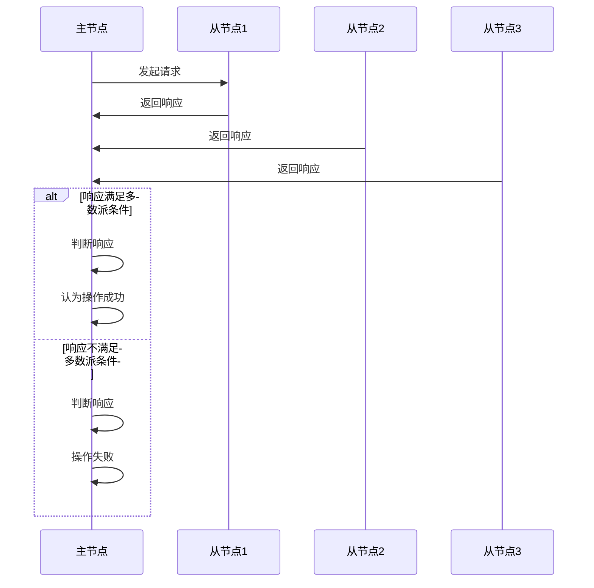
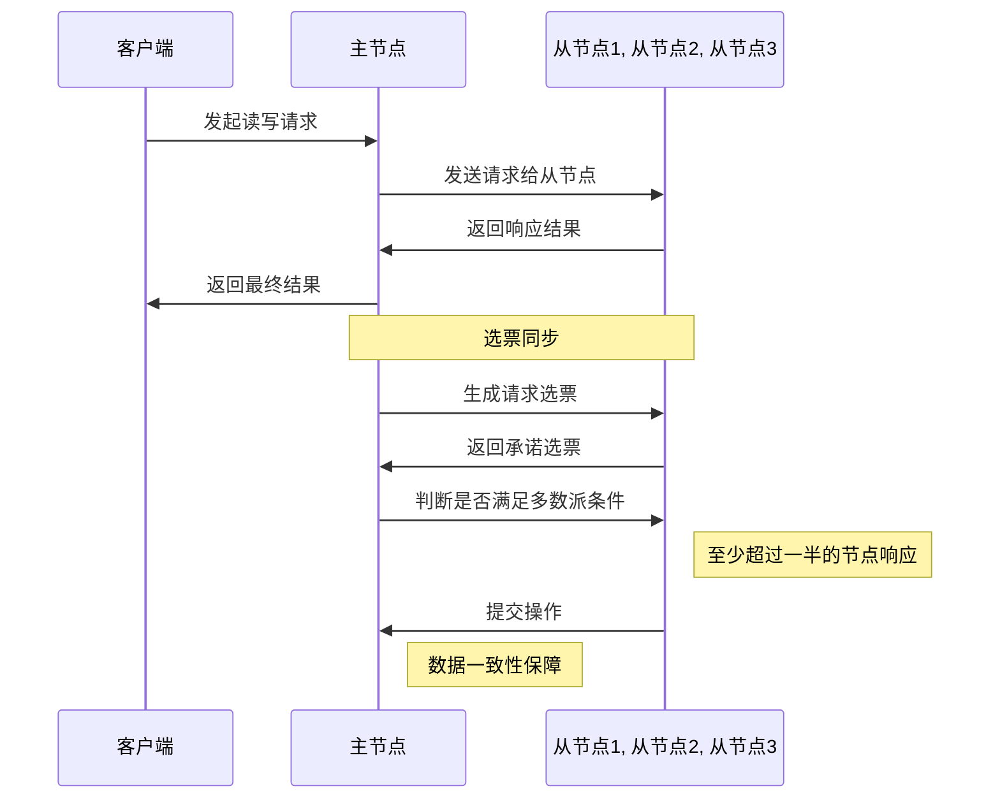

                 

# 《Quorum机制详解》

## 关键词
分布式系统、一致性算法、Quorum机制、Paxos、Raft、分布式存储、分布式数据库、分布式文件系统。

## 摘要
本文旨在详细解析Quorum机制，一种广泛用于分布式系统中的共识算法。文章首先介绍了Quorum机制的基本概念和原理，随后探讨了其在分布式系统中的应用、与一致性算法的关系以及在不同分布式系统中的实践。接着，文章深入分析了Quorum机制的技术细节、数学模型、安全性和性能优化策略。最后，通过分布式存储系统、分布式数据库和分布式文件系统等实际项目案例，对Quorum机制进行了详细的实战解读。

### 《Quorum机制详解》目录大纲

# 第一部分：Quorum机制基础

## 1.1 Quorum机制概述

### 1.1.1 Quorum机制的定义

Quorum机制，又称“多数派机制”，是分布式系统中的一种共识算法。其核心思想是通过多个节点的协作，确保数据一致性和系统可用性。具体来说，Quorum机制要求在一个分布式系统中，至少需要一部分节点达成一致，才能完成某个操作。

### 1.1.2 Quorum机制的重要性

在分布式系统中，数据的一致性是一个至关重要的需求。Quorum机制通过确保多数节点的一致性，可以有效防止数据分裂，保障系统的稳定运行。

### 1.1.3 Quorum机制的基本原理

Quorum机制的基本原理可以概括为三部分：节点角色、资源分配和请求处理流程。节点角色主要包括主节点和从节点，资源分配涉及数据副本的分布，而请求处理流程则确保了操作的顺序性和一致性。

## 1.2 Quorum机制在分布式系统中的应用

### 1.2.1 分布式系统的挑战

分布式系统面临的挑战主要包括数据一致性、可用性和分区容错性。Quorum机制通过解决数据一致性问题，为分布式系统提供了可靠的基础。

### 1.2.2 Quorum机制的作用

Quorum机制在分布式系统中的作用主要体现在两个方面：确保数据一致性和提高系统可用性。通过多数派节点的协作，Quorum机制可以有效防止数据丢失和冲突。

### 1.2.3 Quorum机制的优势

Quorum机制相对于其他一致性算法（如Paxos、Raft等）具有以下几个优势：易于理解、实现简单、支持高性能和可扩展性。

## 1.3 Quorum机制与一致性算法的关系

### 1.3.1 一致性算法概述

一致性算法是分布式系统中确保数据一致性的关键。常见的算法包括Paxos、Raft等。这些算法虽然原理不同，但都遵循类似的目标。

### 1.3.2 Quorum机制与Paxos、Raft算法的对比

Quorum机制与Paxos、Raft算法都是一致性算法，但它们在实现和性能方面存在差异。Quorum机制更注重简单性和可扩展性，而Paxos和Raft则更注重性能和复杂性。

### 1.3.3 Quorum机制的一致性保障

Quorum机制通过确保多数派节点的协作，实现了强一致性保障。即使在部分节点故障的情况下，系统仍能保持一致状态。

## 1.4 Quorum机制在常见分布式系统中的实践

### 1.4.1 分布式存储系统

分布式存储系统广泛使用Quorum机制来保障数据的一致性和可用性。例如，Google的GFS和HDFS都是基于Quorum机制的分布式文件系统。

### 1.4.2 分布式数据库

分布式数据库如Google的Bigtable和Apache Cassandra等，也采用Quorum机制来确保数据的一致性和可靠性。

### 1.4.3 分布式文件系统

除了存储系统，分布式文件系统如Google的GFS和HDFS等，也利用Quorum机制来实现数据的一致性。

## 1.5 Quorum机制的挑战与优化

### 1.5.1 通信开销

Quorum机制在保障一致性时，需要节点之间频繁通信，这可能导致通信开销增大。

### 1.5.2 读写比例

在不同场景下，Quorum机制的读写性能可能会有所不同。优化读写比例是提高性能的关键。

### 1.5.3 可扩展性

Quorum机制需要考虑如何在不同规模和拓扑结构的分布式系统中保持性能和一致性。

# 第二部分：Quorum机制技术细节

## 2.1 Quorum机制的核心组件

### 2.1.1 节点角色

在Quorum机制中，节点主要分为两类：主节点和从节点。主节点负责发起请求，从节点负责响应请求。

### 2.1.2 资源分配

资源分配是Quorum机制的关键。合理的资源分配可以确保系统的性能和一致性。

### 2.1.3 请求处理流程

请求处理流程是Quorum机制的核心。通过多个节点的协作，请求处理流程确保了数据的一致性和可靠性。

## 2.2 Quorum机制的实现原理

### 2.2.1 Quorum选票

Quorum选票是Quorum机制的核心。选票决定了节点的投票结果，从而影响系统的决策。

### 2.2.2 资源锁定与释放

资源锁定与释放是Quorum机制的重要部分。通过锁定资源，确保操作的顺序性和一致性。

### 2.2.3 事务处理

事务处理是Quorum机制的实际应用。通过事务处理，确保数据的完整性和一致性。

## 2.3 Quorum机制的数学模型

### 2.3.1 期望计算

期望计算是Quorum机制数学模型的基础。通过期望计算，可以评估系统的性能和一致性。

### 2.3.2 几何分布模型

几何分布模型是Quorum机制的重要数学工具。通过几何分布模型，可以分析系统的响应时间和可靠性。

### 2.3.3 性能评估

性能评估是Quorum机制数学模型的应用。通过性能评估，可以评估系统的性能指标和优化策略。

## 2.4 Quorum机制的安全性分析

### 2.4.1 健康监控

健康监控是Quorum机制安全性的重要保障。通过健康监控，可以及时发现和解决节点故障。

### 2.4.2 防止恶意节点

防止恶意节点是Quorum机制安全性的关键。通过安全机制，可以确保系统的可靠性和安全性。

### 2.4.3 安全性证明

安全性证明是Quorum机制安全性的基础。通过数学模型和理论证明，可以确保系统的安全性。

## 2.5 Quorum机制的性能优化

### 2.5.1 缓存策略

缓存策略是Quorum机制性能优化的关键。通过合理的缓存策略，可以降低系统的响应时间和延迟。

### 2.5.2 网络优化

网络优化是Quorum机制性能优化的重点。通过优化网络拓扑和传输协议，可以提高系统的性能和可靠性。

### 2.5.3 节点冗余

节点冗余是Quorum机制性能优化的策略。通过增加节点冗余，可以提高系统的可靠性和容错性。

# 第三部分：Quorum机制项目实战

## 3.1 分布式存储系统项目实战

### 3.1.1 项目背景

### 3.1.2 开发环境搭建

### 3.1.3 源代码实现与解读

### 3.1.4 代码解读与分析

## 3.2 分布式数据库项目实战

### 3.2.1 项目背景

### 3.2.2 开发环境搭建

### 3.2.3 源代码实现与解读

### 3.2.4 代码解读与分析

## 3.3 分布式文件系统项目实战

### 3.3.1 项目背景

### 3.3.2 开发环境搭建

### 3.3.3 源代码实现与解读

### 3.3.4 代码解读与分析

# 附录

## 附录 A: Quorum机制开发工具与资源

### A.1 主流分布式框架对比

### A.2 开发工具推荐

### A.3 相关文献推荐

## 附录 B: Quorum机制流程图

### B.1 Quorum机制流程图

# 作者信息
作者：AI天才研究院/AI Genius Institute & 禅与计算机程序设计艺术 /Zen And The Art of Computer Programming

## 1.1 Quorum机制概述

### 1.1.1 Quorum机制的定义

Quorum机制，也称为多数派机制，是一种在分布式系统中用于确保数据一致性的共识算法。其核心思想是通过多个节点的协作，使得系统中的多数节点达成一致，从而完成某个操作。这种机制可以有效地防止数据分裂，保障系统的稳定运行。

在Quorum机制中，节点通常被分为两类：主节点和从节点。主节点负责发起请求，从节点负责响应请求。当主节点发起一个操作时，它需要从多个从节点获取响应，只有当这些从节点中的多数派（即超过一半的节点）响应后，该操作才被认为是成功的。

### 1.1.2 Quorum机制的重要性

在分布式系统中，数据的一致性是一个至关重要的需求。由于分布式系统的节点可能分布在不同地理位置，甚至可能发生网络分区或节点故障，因此确保数据的一致性变得尤为困难。Quorum机制通过确保多数节点的一致性，可以有效防止数据分裂，保障系统的稳定运行。

此外，Quorum机制还具有以下重要性：

1. **高可用性**：通过要求至少一部分节点达成一致，Quorum机制提高了系统的可用性。即使某些节点发生故障，只要多数派节点正常运行，系统仍然可以继续运行。

2. **强一致性**：与某些一致性算法相比，Quorum机制可以提供更强的数据一致性保障。通过确保多数派节点的协作，Quorum机制可以确保数据的一致性，从而避免数据丢失或冲突。

3. **容错性**：Quorum机制允许系统在部分节点故障的情况下仍然保持一致性。这种容错能力对于分布式系统至关重要，因为节点故障是难以避免的。

### 1.1.3 Quorum机制的基本原理

Quorum机制的基本原理可以概括为三部分：节点角色、资源分配和请求处理流程。下面我们将逐一介绍这些基本原理。

#### 节点角色

在Quorum机制中，节点主要分为两类：主节点和从节点。主节点负责发起请求，从节点负责响应请求。主节点通常具有更高的权限，例如决定数据的写入位置或协调节点的协作。从节点则负责执行主节点发出的操作，并返回操作结果。

#### 资源分配

资源分配是Quorum机制的核心。在分布式系统中，资源可能包括存储空间、计算资源等。合理的资源分配可以确保系统的性能和一致性。例如，在分布式存储系统中，可以通过将数据副本分配到不同的节点上，确保数据的冗余和可靠性。

#### 请求处理流程

请求处理流程是Quorum机制的核心。在请求处理流程中，主节点向多个从节点发送请求，并等待从节点返回响应。当从节点的响应达到一定的数量（即超过一半的节点），主节点认为该操作成功，并将结果返回给用户。

请求处理流程通常包括以下步骤：

1. **初始化**：主节点向从节点发送请求，并指定要执行的操作。
2. **执行操作**：从节点执行主节点发出的操作，并将结果返回给主节点。
3. **判断响应**：主节点检查从节点的响应，判断是否满足多数派条件。
4. **返回结果**：如果响应满足多数派条件，主节点认为操作成功，并将结果返回给用户。否则，主节点可能需要重新发起请求或执行其他故障处理策略。

通过这种请求处理流程，Quorum机制可以确保多个节点之间的协作，从而实现数据的一致性和可靠性。

### 1.1.4 Quorum机制的应用场景

Quorum机制在分布式系统中有着广泛的应用，以下是一些典型的应用场景：

1. **分布式存储系统**：分布式存储系统需要确保数据的可靠性和一致性，Quorum机制可以通过多个节点的协作，确保数据的冗余和一致性。
2. **分布式数据库**：分布式数据库需要实现数据的一致性，Quorum机制可以提供一种有效的解决方案，确保数据的强一致性。
3. **分布式文件系统**：分布式文件系统需要处理大量的文件读写请求，Quorum机制可以确保文件的一致性和可靠性。
4. **分布式计算系统**：分布式计算系统需要协调多个节点的计算任务，Quorum机制可以确保任务的执行顺序和一致性。

总之，Quorum机制在分布式系统中发挥着重要作用，为系统的数据一致性和可靠性提供了有力保障。

### 1.1.5 Quorum机制的优势与挑战

#### 优势

1. **简单性**：Quorum机制相对于其他一致性算法（如Paxos、Raft等）来说，实现起来较为简单，易于理解和部署。
2. **高性能**：通过多数派节点的协作，Quorum机制可以提供较高的性能，特别是在读操作中，可以快速获取响应。
3. **可扩展性**：Quorum机制支持系统的水平扩展，可以轻松地增加节点数量，提高系统的容错性和性能。

#### 挑战

1. **通信开销**：由于Quorum机制要求节点之间频繁通信，可能导致通信开销增大，影响系统的性能。
2. **读写比例**：在读写比例不均衡的情况下，Quorum机制的读性能可能会受到影响。
3. **可扩展性**：随着节点数量的增加，Quorum机制的复杂度也会增加，需要进一步优化和调整。

### 1.1.6 Quorum机制的发展历史

Quorum机制的发展可以追溯到1990年代，当时分布式系统的研究者开始探索如何确保分布式数据的一致性。1991年，Maurice Herlihy和Nancy Lynch提出了Paxos算法，这是一种经典的分布式一致性算法，但实现起来较为复杂。为了简化Paxos算法，1998年，Eric Brewer提出了Quorum机制，并认为它在实践中具有广泛的应用价值。

随着分布式系统的不断发展，Quorum机制逐渐成为分布式系统中的标准一致性算法之一。许多分布式存储系统、数据库和文件系统都采用了Quorum机制，以保障数据的一致性和可靠性。

### 1.1.7 Quorum机制的核心概念与联系

在理解Quorum机制时，需要掌握以下几个核心概念：

1. **节点**：分布式系统中的计算单元，可以是服务器或虚拟机。
2. **主节点**：负责发起请求和协调节点的节点。
3. **从节点**：负责响应请求和执行操作的节点。
4. **多数派**：指超过一半的节点。
5. **一致性**：指多个节点对同一数据的操作结果一致。
6. **可靠性**：指系统能够在节点故障的情况下保持稳定运行。

这些概念相互关联，共同构成了Quorum机制的核心。通过这些概念，我们可以更好地理解Quorum机制的工作原理和应用场景。

为了更直观地理解这些概念，我们可以使用Mermaid流程图来表示Quorum机制的核心流程：



通过这个流程图，我们可以清晰地看到主节点和从节点之间的交互过程，以及如何通过多数派节点的响应来决定操作的成功与否。

### 1.1.8 小结

本节介绍了Quorum机制的定义、重要性、基本原理、应用场景、优势与挑战以及核心概念。通过这些内容，我们了解了Quorum机制的基本原理和应用场景，为进一步学习Quorum机制的技术细节和实战应用奠定了基础。

在接下来的章节中，我们将继续探讨Quorum机制在分布式系统中的应用，详细分析其技术细节，并通过实际项目案例，深入解读Quorum机制在分布式存储系统、数据库和文件系统中的应用和实践。

### 1.2 Quorum机制在分布式系统中的应用

分布式系统是由多个节点组成的系统，这些节点分布在不同的地理位置，通过网络进行通信。在分布式系统中，节点可能发生故障、网络分区等问题，导致系统难以保持一致性。为了解决这些问题，分布式系统采用了各种一致性算法，其中Quorum机制是其中一种重要且广泛应用的算法。本节将详细介绍Quorum机制在分布式系统中的应用。

#### 分布式系统的挑战

分布式系统面临的主要挑战包括以下几个方面：

1. **数据一致性**：由于节点分布在不同的地理位置，数据在传输过程中可能会发生延迟或丢失。此外，当多个节点同时对同一数据进行操作时，可能会产生冲突，导致数据不一致。

2. **可用性**：分布式系统需要确保在部分节点故障的情况下，系统仍然能够正常运行，提供服务的可用性。

3. **分区容错性**：当网络发生故障或节点故障导致网络分区时，系统需要能够自动恢复，保持整体一致性。

为了解决这些挑战，分布式系统需要采用一致性算法来确保数据的一致性、可用性和分区容错性。Quorum机制正是为了应对这些挑战而设计的一种一致性算法。

#### Quorum机制的作用

Quorum机制在分布式系统中起着至关重要的作用，主要表现在以下几个方面：

1. **数据一致性**：通过多数派节点的协作，Quorum机制可以确保分布式系统中多个节点对同一数据的操作结果一致，从而解决数据不一致的问题。

2. **高可用性**：即使某些节点发生故障，只要多数派节点正常运行，系统仍然可以继续提供服务，保证了系统的可用性。

3. **分区容错性**：在发生网络分区时，Quorum机制可以确保分区内的多数派节点达成一致，从而避免数据分裂，保证系统的一致性。

#### Quorum机制的优势

Quorum机制相对于其他一致性算法（如Paxos、Raft等）具有以下几个优势：

1. **简单性**：Quorum机制的实现相对简单，易于理解和部署。

2. **高性能**：通过多数派节点的协作，Quorum机制可以提供较高的性能，特别是在读操作中，可以快速获取响应。

3. **可扩展性**：Quorum机制支持系统的水平扩展，可以轻松地增加节点数量，提高系统的容错性和性能。

#### Quorum机制的具体应用场景

Quorum机制在分布式系统中有着广泛的应用，以下是一些典型的应用场景：

1. **分布式存储系统**：分布式存储系统如Google的GFS和HDFS采用Quorum机制来保障数据的一致性和可靠性。通过将数据分配到多个节点上，Quorum机制可以确保数据的冗余和一致性。

2. **分布式数据库**：分布式数据库如Google的Bigtable和Apache Cassandra等也采用Quorum机制来保障数据的一致性。通过多个节点的协作，分布式数据库可以提供高可用性和分区容错性。

3. **分布式文件系统**：分布式文件系统如Google的GFS和HDFS采用Quorum机制来确保文件的一致性和可靠性。通过多个节点的协作，分布式文件系统可以提供高效的数据读写操作。

4. **分布式计算系统**：分布式计算系统如MapReduce和Spark等也采用Quorum机制来协调多个节点的计算任务，确保任务的执行顺序和一致性。

通过这些应用场景，我们可以看到Quorum机制在分布式系统中的重要作用，它不仅能够保障数据的一致性，还能提高系统的可用性和性能。

#### 小结

本节介绍了分布式系统面临的挑战以及Quorum机制的作用和优势。通过Quorum机制，分布式系统可以解决数据一致性、可用性和分区容错性等难题。在接下来的章节中，我们将继续探讨Quorum机制的技术细节，详细分析其实现原理和应用方法。

### 1.3 Quorum机制与一致性算法的关系

在分布式系统中，数据的一致性是系统设计中的核心问题。为了确保数据在多个节点之间的一致性，研究者们提出了多种一致性算法。Quorum机制作为其中一种广泛应用的算法，与Paxos、Raft等其他一致性算法有着紧密的联系和差异。本节将详细讨论Quorum机制与Paxos、Raft算法的关系，以及它们在一致性保障方面的对比。

#### 一致性算法概述

一致性算法是分布式系统中确保数据一致性的关键技术。一致性算法的基本目标是在分布式系统中，当多个节点对同一数据集进行操作时，系统能够保证所有节点看到的数据是一致的。以下是一些常见的一致性算法：

1. **Paxos算法**：Paxos算法是一种经典的一致性算法，由莱斯利·兰伯特（Leslie Lamport）在1990年提出。Paxos算法通过“提议-表决”机制，确保分布式系统中多个节点对某个值达成一致。Paxos算法具有较高的容错性和一致性保障，但其实现较为复杂。

2. **Raft算法**：Raft算法是由Diego Ongaro和John Ousterhout在2012年提出的一种一致性算法。Raft算法简化了Paxos算法的实现，通过引入日志复制和领导选举机制，提高了系统的性能和可理解性。Raft算法在保证一致性的同时，还提供了较强的容错能力。

3. **Quorum机制**：Quorum机制是一种基于多数派投票的共识算法，广泛应用于分布式存储系统、数据库和文件系统中。Quorum机制通过确保多数派节点的协作，实现了强一致性和高可用性。与Paxos和Raft算法相比，Quorum机制的实现更为简单。

#### Quorum机制与Paxos算法的对比

Quorum机制与Paxos算法在一致性保障方面有着相似的目标，但它们在实现上有所不同。以下是对两者的一些对比：

1. **实现复杂度**：Paxos算法的实现相对复杂，需要处理多个阶段和复杂的交互过程。Quorum机制则通过简化多数派投票机制，实现上更为直观和简单。

2. **性能**：在性能方面，Paxos算法的复杂性可能导致更高的通信开销和延迟。Quorum机制则通过多数派节点的协作，可以提供更高效的读写性能，特别是在读多写少的场景中。

3. **容错性**：Paxos算法和Quorum机制都具有较高的容错性，能够应对节点故障和网络分区等问题。Paxos算法通过“快照”机制实现状态转移，而Quorum机制则通过多数派节点的协作来保证一致性。

4. **一致性保障**：Paxos算法提供强一致性保障，确保多个节点对同一数据集的操作结果一致。Quorum机制也提供强一致性保障，但通过多数派节点的投票来达成一致。

#### Quorum机制与Raft算法的对比

Raft算法与Quorum机制在一致性保障方面也有许多相似之处，但它们在实现细节上有所不同。以下是对两者的一些对比：

1. **实现复杂度**：Raft算法简化了Paxos算法的实现，通过引入领导选举和日志复制机制，使得算法更为直观和易理解。Quorum机制则通过多数派投票实现一致性保障，实现上较为简单。

2. **性能**：在性能方面，Raft算法通过优化日志复制和领导选举过程，提供了较高的读写性能。Quorum机制则通过多数派节点的协作，提供了高效的读写性能，特别是在读操作较多的场景中。

3. **容错性**：Raft算法和Quorum机制都具有较高的容错性，能够应对节点故障和网络分区等问题。Raft算法通过领导节点和日志复制实现容错，而Quorum机制则通过多数派节点的投票来保障容错性。

4. **一致性保障**：Raft算法提供强一致性保障，确保多个节点对同一数据集的操作结果一致。Quorum机制也提供强一致性保障，通过多数派节点的协作来确保一致性。

#### Quorum机制的一致性保障

Quorum机制通过确保多数派节点的协作，实现了强一致性保障。具体来说，Quorum机制的一致性保障体现在以下几个方面：

1. **数据写入一致性**：在分布式系统中，数据写入操作需要确保多个节点对同一数据的写入结果一致。Quorum机制通过多数派节点的投票来确保写入操作的成功，从而实现数据写入一致性。

2. **数据读取一致性**：在分布式系统中，数据读取操作也需要确保多个节点对同一数据的读取结果一致。Quorum机制通过多数派节点的投票来确保读取操作的成功，从而实现数据读取一致性。

3. **容错性**：Quorum机制通过确保多数派节点的协作，提高了系统的容错性。当部分节点发生故障时，只要多数派节点正常运行，系统仍然可以保持一致性。

4. **高可用性**：Quorum机制通过多数派节点的协作，提供了高可用性保障。即使部分节点发生故障，只要多数派节点正常运行，系统仍然可以继续提供服务。

总之，Quorum机制通过多数派节点的协作，实现了分布式系统中的数据一致性、可用性和分区容错性。在接下来的章节中，我们将进一步探讨Quorum机制的技术细节，详细分析其实现原理和应用方法。

### 1.4 Quorum机制在常见分布式系统中的实践

Quorum机制作为分布式系统中的重要一致性算法，在各种分布式系统中得到了广泛应用。本节将详细探讨Quorum机制在分布式存储系统、分布式数据库和分布式文件系统中的应用实践。

#### 1.4.1 分布式存储系统

分布式存储系统是Quorum机制的重要应用领域之一。在分布式存储系统中，Quorum机制主要用于保障数据的一致性和可靠性。以下是一些著名的分布式存储系统及其对Quorum机制的应用：

1. **Google File System (GFS)**：GFS是Google开发的一种分布式文件系统，用于存储大量数据。GFS采用了Quorum机制来保障数据的一致性和可靠性。在GFS中，数据被分成多个块，每个块都有多个副本。写入操作时，Quorum机制确保至少有两个副本成功写入；读取操作时，从多个副本中获取数据，并选择多数派副本的数据作为最终结果。

2. **Hadoop Distributed File System (HDFS)**：HDFS是Apache Hadoop的一部分，用于存储和访问大数据。HDFS采用了Quorum机制来保障数据的一致性和可靠性。在HDFS中，数据被分成多个块，每个块都有多个副本。写入操作时，Quorum机制确保至少有两个副本成功写入；读取操作时，从多个副本中获取数据，并选择多数派副本的数据作为最终结果。

3. **Ceph**：Ceph是一个分布式存储系统，具有高度可扩展性和高可用性。Ceph采用了Quorum机制来保障数据的一致性和可靠性。在Ceph中，数据被存储在多个节点上，并通过Quorum机制确保数据的写入和读取操作的一致性。

#### 1.4.2 分布式数据库

分布式数据库是Quorum机制的另一个重要应用领域。在分布式数据库中，Quorum机制主要用于保障数据的一致性和高可用性。以下是一些著名的分布式数据库及其对Quorum机制的应用：

1. **Google Bigtable**：Google Bigtable是一个分布式存储系统，用于存储海量结构化数据。Bigtable采用了Quorum机制来保障数据的一致性和可靠性。在Bigtable中，数据被分成多个区域，每个区域都有多个副本。写入操作时，Quorum机制确保至少有两个副本成功写入；读取操作时，从多个副本中获取数据，并选择多数派副本的数据作为最终结果。

2. **Apache Cassandra**：Apache Cassandra是一个分布式宽列数据库，用于存储大量结构化数据。Cassandra采用了Quorum机制来保障数据的一致性和可靠性。在Cassandra中，数据被分成多个表，每个表都有多个副本。写入操作时，Quorum机制确保至少有两个副本成功写入；读取操作时，从多个副本中获取数据，并选择多数派副本的数据作为最终结果。

3. **Amazon DynamoDB**：Amazon DynamoDB是一个分布式键值存储服务，用于存储和检索数据。DynamoDB采用了Quorum机制来保障数据的一致性和可靠性。在DynamoDB中，数据被分成多个分区，每个分区都有多个副本。写入操作时，Quorum机制确保至少有两个副本成功写入；读取操作时，从多个副本中获取数据，并选择多数派副本的数据作为最终结果。

#### 1.4.3 分布式文件系统

分布式文件系统也是Quorum机制的一个重要应用领域。在分布式文件系统中，Quorum机制主要用于保障文件的一致性和可靠性。以下是一些著名的分布式文件系统及其对Quorum机制的应用：

1. **Google File System (GFS)**：GFS是Google开发的一种分布式文件系统，用于存储大量数据。GFS采用了Quorum机制来保障数据的一致性和可靠性。在GFS中，数据被分成多个块，每个块都有多个副本。写入操作时，Quorum机制确保至少有两个副本成功写入；读取操作时，从多个副本中获取数据，并选择多数派副本的数据作为最终结果。

2. **Hadoop Distributed File System (HDFS)**：HDFS是Apache Hadoop的一部分，用于存储和访问大数据。HDFS采用了Quorum机制来保障数据的一致性和可靠性。在HDFS中，数据被分成多个块，每个块都有多个副本。写入操作时，Quorum机制确保至少有两个副本成功写入；读取操作时，从多个副本中获取数据，并选择多数派副本的数据作为最终结果。

3. **GlusterFS**：GlusterFS是一个分布式文件系统，用于存储和共享大量数据。GlusterFS采用了Quorum机制来保障数据的一致性和可靠性。在GlusterFS中，数据被分成多个卷，每个卷都有多个副本。写入操作时，Quorum机制确保至少有两个副本成功写入；读取操作时，从多个副本中获取数据，并选择多数派副本的数据作为最终结果。

通过以上实践，我们可以看到Quorum机制在分布式存储系统、分布式数据库和分布式文件系统中的应用非常广泛。Quorum机制通过确保多数派节点的协作，提供了数据的一致性和可靠性，为分布式系统提供了坚实的保障。在接下来的章节中，我们将进一步探讨Quorum机制的技术细节，包括其核心组件、实现原理和性能优化策略。

### 1.5 Quorum机制的挑战与优化

尽管Quorum机制在分布式系统中提供了高效的数据一致性和高可用性，但其在实际应用中仍面临一些挑战和问题。这些挑战主要集中在通信开销、读写比例和可扩展性等方面。本节将详细讨论这些挑战，并提出相应的优化策略。

#### 1.5.1 通信开销

Quorum机制要求节点之间进行频繁的通信，以实现数据的一致性。这种通信开销可能会导致以下问题：

1. **网络延迟**：节点之间的网络延迟会导致通信开销增大。在网络条件较差的情况下，通信延迟可能会显著影响系统的性能。

2. **带宽消耗**：由于Quorum机制需要节点之间传输大量数据，带宽消耗可能成为一个瓶颈。特别是在高并发的场景下，节点之间的带宽竞争可能导致性能下降。

优化策略：

1. **网络优化**：通过优化网络拓扑和传输协议，可以减少通信开销。例如，使用更高效的传输协议（如QUIC）或优化网络路由策略。

2. **数据压缩**：对传输的数据进行压缩可以减少带宽消耗。例如，使用数据压缩算法（如Gzip）对数据进行压缩，减少传输的数据量。

3. **缓存策略**：通过缓存策略，可以减少节点之间的通信次数。例如，在读取操作中，优先从本地缓存中获取数据，减少与远程节点的通信。

#### 1.5.2 读写比例

在分布式系统中，读写操作的频率和重要性往往不同。例如，在一个高读操作频率的场景中，Quorum机制的读写比例可能成为一个问题。以下是一些读写比例相关的问题和优化策略：

1. **读性能下降**：在高读操作频率的场景中，Quorum机制可能会导致读性能下降。因为每次读操作都需要从多个节点获取数据，并等待多数派节点的响应。

2. **写性能下降**：在写操作频率较低但数据量大时，Quorum机制可能会成为性能瓶颈。因为每次写操作都需要确保多个节点的数据一致性，这可能会增加系统的延迟。

优化策略：

1. **读写分离**：通过将读操作和写操作分离到不同的节点上，可以提高系统的整体性能。例如，将读操作分配到读取节点上，将写操作分配到写入节点上。

2. **动态调整**：根据系统的实际负载和读写比例，动态调整Quorum机制的配置。例如，在读取操作频率较高时，可以减少参与读操作的节点数量，以提高读性能。

3. **优先级队列**：在处理读写请求时，可以设置优先级队列。优先处理高优先级的读操作，以减少读操作的平均响应时间。

#### 1.5.3 可扩展性

随着节点数量的增加，Quorum机制的复杂度和通信开销也会增加。以下是一些可扩展性相关的问题和优化策略：

1. **节点数量限制**：在某些情况下，节点数量的增加可能会导致Quorum机制的通信开销和延迟增加。因此，需要合理控制节点的数量，以避免性能下降。

2. **分区和复制**：通过将数据分区和复制到多个节点上，可以减少单点故障的风险，提高系统的可用性和可扩展性。例如，在分布式数据库中，可以将数据分成多个分区，并分配到不同的节点上。

优化策略：

1. **负载均衡**：通过负载均衡策略，可以合理分配节点的负载，避免单个节点过载。例如，使用一致性哈希算法将数据均匀分布到多个节点上。

2. **分布式一致性算法**：结合其他分布式一致性算法（如Raft、Paxos等），可以进一步提高Quorum机制的可扩展性。例如，在节点数量增加时，可以引入Raft算法的领导选举机制，以简化节点之间的交互。

3. **弹性扩展**：通过自动化扩展和弹性扩展策略，可以自动增加或减少节点数量，以适应系统的变化需求。例如，在节点数量增加时，可以自动分配新的节点，以分担负载。

通过以上挑战和优化策略，我们可以更好地应对Quorum机制在实际应用中面临的问题，提高系统的性能和可扩展性。在接下来的章节中，我们将进一步探讨Quorum机制的技术细节，包括其核心组件、实现原理和数学模型。

### 2.1 Quorum机制的核心组件

Quorum机制作为分布式系统中确保数据一致性的重要算法，其核心组件对于理解其工作机制和实现原理至关重要。以下是Quorum机制的主要核心组件及其功能：

#### 2.1.1 节点角色

在Quorum机制中，节点通常分为以下两类：

1. **主节点（Primary Node）**：主节点负责发起请求，协调其他节点的协作，并决定是否将请求提交给系统。在分布式系统中，通常有一个主节点，负责处理大部分的读写请求。

2. **从节点（Replica Node）**：从节点负责响应主节点的请求，执行主节点分配的操作，并将结果返回给主节点。从节点在分布式系统中通常有多个，以确保系统的容错性和可用性。

#### 2.1.2 资源分配

资源分配是Quorum机制的关键部分，它涉及到以下几个方面：

1. **数据副本分配**：在分布式系统中，数据通常会复制到多个节点上，以确保数据的可靠性和一致性。Quorum机制通过将数据副本分配到不同的节点上，实现数据的冗余和容错。

2. **请求分配**：在处理读写请求时，Quorum机制会将请求分配给不同的节点，以实现负载均衡和并发处理。

3. **资源锁定**：在执行请求时，Quorum机制需要锁定相关资源，以确保操作的顺序性和一致性。例如，在写入操作中，需要锁定数据块，以避免并发冲突。

#### 2.1.3 请求处理流程

Quorum机制的请求处理流程是确保数据一致性的关键。以下是一个简化的请求处理流程：

1. **请求发起**：主节点收到用户的请求后，将其发送给从节点。

2. **请求执行**：从节点收到请求后，执行相关的操作，并将结果返回给主节点。

3. **响应收集**：主节点从多个从节点收集响应，并判断是否满足多数派条件。

4. **结果确认**：如果响应满足多数派条件，主节点认为操作成功，并将结果返回给用户。否则，主节点可能需要重新发起请求或执行其他故障处理策略。

#### 2.1.4 多数派条件

多数派条件是Quorum机制的核心概念之一。在分布式系统中，为了确保数据的一致性，至少需要一部分节点达成一致。多数派条件定义了节点数量和响应要求：

1. **读多数派**：在进行读取操作时，至少需要从超过一半的节点中获取数据。

2. **写多数派**：在进行写入操作时，至少需要将数据写入超过一半的节点。

例如，在一个包含五个节点的系统中，至少需要三个节点的响应才能满足多数派条件。

#### 2.1.5 节点协作

节点协作是Quorum机制实现数据一致性的关键。以下是一些节点协作的关键步骤：

1. **领导选举**：在分布式系统中，主节点可能发生故障或需要重新选举。节点之间会通过特定的协议进行领导选举，以确保系统能够继续正常运行。

2. **日志同步**：在执行操作时，节点之间需要同步日志，以确保每个节点的状态一致。例如，在分布式数据库中，每个节点都会记录操作日志，并确保日志的一致性。

3. **故障检测**：节点之间会定期进行故障检测，以发现和处理故障节点。通过故障检测，系统能够及时识别和隔离故障节点，避免影响系统的正常运行。

#### 2.1.6 数据一致性

数据一致性是Quorum机制的核心目标。通过以下方式，Quorum机制确保数据的一致性：

1. **多数派投票**：通过多数派投票机制，确保多个节点对同一数据的操作结果一致。

2. **版本控制**：在执行操作时，每个节点都会记录操作的版本信息。通过版本控制，系统能够确保操作的历史记录完整且一致。

3. **冲突解决**：当多个节点同时对同一数据进行操作时，可能会产生冲突。Quorum机制通过冲突解决策略，确保最终的操作结果正确。

通过这些核心组件和协作机制，Quorum机制实现了分布式系统中的数据一致性和可靠性，为系统的稳定运行提供了坚实保障。

### 2.2 Quorum机制的实现原理

Quorum机制的核心在于通过多数派节点的协作来确保数据的一致性。为了理解其实现原理，我们需要从以下几个方面详细探讨：

#### 2.2.1 Quorum选票

Quorum选票是Quorum机制中最重要的组件之一。选票决定了节点的投票结果，从而影响系统的决策。以下是Quorum选票的基本概念和计算方法：

1. **选票定义**：每个节点都会为每个操作生成一个选票。选票包括以下信息：

   - 操作ID：标识操作的唯一ID。
   - 节点ID：生成选票的节点ID。
   - 操作内容：操作的具体内容，例如数据写入或读取。
   - 选票类型：选票的类型，包括请求选票（Request Vote）和承诺选票（Commit Vote）。

2. **选票计算**：在分布式系统中，每个节点都会为每个操作生成选票。为了确保选票的有效性，节点需要遵循以下规则：

   - **请求选票**：节点在接收到请求后，生成一个请求选票，并发送给其他节点。请求选票的目的是询问其他节点是否接受该操作。
   - **承诺选票**：当节点收到超过一半的请求选票后，生成一个承诺选票，并发送给其他节点。承诺选票的目的是表明节点已经接受该操作，并准备执行。

3. **选票同步**：节点之间通过不断的选票同步，确保每个节点的选票状态一致。选票同步过程包括以下步骤：

   - 节点A生成请求选票，并发送给节点B、节点C等。
   - 节点B、节点C等接收到请求选票后，生成承诺选票，并发送给节点A。
   - 节点A收集来自节点B、节点C等的承诺选票，并判断是否满足多数派条件。

#### 2.2.2 资源锁定与释放

资源锁定与释放是Quorum机制实现数据一致性的关键步骤。以下是一些基本概念和策略：

1. **资源锁定**：在执行操作时，节点需要锁定相关资源，以确保操作的顺序性和一致性。资源锁定可以通过以下方法实现：

   - **写锁定**：在写入操作中，节点需要锁定数据块，以避免并发冲突。
   - **读锁定**：在读取操作中，节点可能需要锁定相关资源，以确保读取的数据是最新的。

2. **锁定策略**：为了实现高效的资源锁定，可以使用以下策略：

   - **共享锁定**：多个节点可以同时读取同一资源，但无法同时写入。
   - **排他锁定**：只有一个节点可以写入资源，其他节点只能读取。

3. **锁定释放**：在操作完成后，节点需要释放锁定资源，以允许其他节点访问资源。释放锁定的策略包括：

   - **自动释放**：在操作完成后，系统自动释放锁定资源。
   - **手动释放**：在操作完成后，节点需要显式释放锁定资源。

#### 2.2.3 事务处理

事务处理是Quorum机制中确保数据一致性的关键步骤。事务处理包括以下基本概念和步骤：

1. **事务定义**：事务是一组操作，这些操作要么全部执行，要么全部回滚。事务通常包括以下特性：

   - **原子性**：事务的所有操作要么全部执行，要么全部回滚。
   - **一致性**：事务执行前后，系统的状态保持一致。
   - **隔离性**：事务的执行不受其他事务的影响。
   - **持久性**：事务一旦提交，其操作结果将永久保存。

2. **事务处理流程**：

   - **初始化**：启动事务，初始化事务环境。
   - **执行操作**：执行事务中的操作，可能包括读写操作。
   - **提交**：在所有操作完成后，提交事务，确保事务的一致性和持久性。
   - **回滚**：在事务执行过程中，如果发生错误，回滚事务，撤销已执行的操作。

3. **并发控制**：在分布式系统中，多个事务可能同时执行，需要确保事务的隔离性和一致性。常用的并发控制策略包括：

   - **乐观锁**：假设事务不会发生冲突，只在提交时检查冲突，如果发生冲突则回滚事务。
   - **悲观锁**：假设事务可能会发生冲突，在执行操作前获取锁定资源，确保操作的顺序性和一致性。

通过以上原理，我们可以看到Quorum机制通过选票、资源锁定和事务处理等步骤，确保了分布式系统中的数据一致性和可靠性。这些原理和策略为分布式系统提供了强大的保障，使得系统在面对节点故障、网络分区等挑战时仍能保持稳定运行。

#### 2.2.4 Quorum机制的数学模型

为了更深入地理解Quorum机制，我们可以通过数学模型来分析和评估其性能。以下是一些常用的数学模型：

1. **期望计算**：在Quorum机制中，每个节点都会生成选票，并通过多数派节点的协作来达成一致。为了评估系统的性能，我们可以计算每个操作的期望响应时间。

2. **几何分布模型**：几何分布模型用于评估系统的响应时间和可靠性。在几何分布模型中，每个操作需要从多个节点中获取响应，且响应时间服从几何分布。

3. **性能评估**：通过数学模型，我们可以评估系统的性能指标，如响应时间、吞吐量和一致性。

以下是一个简化的数学模型示例：

$$
E[响应时间] = \sum_{i=1}^{N} P(i) \times i
$$

其中，$E[响应时间]$ 是操作的期望响应时间，$P(i)$ 是第 $i$ 个节点响应的概率，$i$ 是响应时间。

通过这个模型，我们可以评估系统在不同节点数量和响应概率下的性能。

#### 2.2.5 小结

通过上述分析，我们可以看到Quorum机制的实现原理主要包括Quorum选票、资源锁定与释放、事务处理以及数学模型。这些原理和策略共同作用，确保了分布式系统中的数据一致性和可靠性。在接下来的章节中，我们将进一步探讨Quorum机制的安全性分析和性能优化策略。

### 2.3 Quorum机制的安全性分析

在分布式系统中，安全性是至关重要的。Quorum机制作为分布式系统中确保数据一致性的关键算法，其安全性分析尤为重要。本节将详细探讨Quorum机制的安全性，包括健康监控、防止恶意节点和安全性证明等方面。

#### 2.3.1 健康监控

健康监控是保障Quorum机制安全性的基础。通过健康监控，系统可以及时发现和处理异常情况，确保系统的稳定运行。以下是健康监控的一些关键点：

1. **节点状态监控**：系统需要定期检查每个节点的状态，包括节点是否正常运行、是否出现故障等。如果发现节点异常，系统需要及时隔离和处理。

2. **日志分析**：系统需要记录每个操作的日志，并通过日志分析来发现潜在问题。例如，通过分析日志，可以识别出频繁发生冲突或性能瓶颈的操作。

3. **异常处理**：系统需要制定异常处理策略，包括故障节点的隔离、重新选举主节点、日志同步等。通过异常处理，系统能够快速恢复，确保数据的一致性和可靠性。

#### 2.3.2 防止恶意节点

在分布式系统中，恶意节点是一个潜在的威胁。为了保障系统的安全性，需要采取有效的措施来防止恶意节点的攻击。以下是一些防止恶意节点的关键措施：

1. **身份验证**：系统需要采用严格的身份验证机制，确保节点的合法性和身份。例如，通过数字签名、加密认证等方式，确保节点之间的通信是安全的。

2. **访问控制**：系统需要实现访问控制机制，限制节点的访问权限。例如，主节点只能执行特定的操作，从节点只能响应请求等。

3. **安全审计**：系统需要定期进行安全审计，检查节点之间的通信和数据访问情况。通过安全审计，可以及时发现和处理潜在的安全威胁。

4. **隔离策略**：如果检测到恶意节点，系统需要采取隔离策略，将该节点从系统中移除，并防止其继续攻击其他节点。通过隔离策略，可以确保系统的整体安全。

#### 2.3.3 安全性证明

安全性证明是Quorum机制安全性的重要保障。通过数学模型和理论证明，可以确保Quorum机制的安全性。以下是一些常用的安全性证明方法：

1. **形式化证明**：形式化证明通过严格的数学模型和逻辑推理，证明Quorum机制在特定条件下是安全的。例如，通过构造安全协议，确保节点之间的交互是安全的。

2. **经验证明**：经验证明通过实际应用案例和数据验证，证明Quorum机制在现实场景中的安全性。例如，通过大量的测试和实际部署，验证Quorum机制的可靠性和安全性。

3. **模拟分析**：模拟分析通过模拟分布式系统的运行过程，分析系统的安全性能和稳定性。通过模拟分析，可以识别出潜在的安全问题和优化方向。

通过健康监控、防止恶意节点和安全性证明等多方面的安全措施，Quorum机制可以保障分布式系统中的数据一致性和安全性。在接下来的章节中，我们将进一步探讨Quorum机制的性能优化策略，以提高系统的性能和可靠性。

### 2.4 Quorum机制的性能优化

Quorum机制作为分布式系统中确保数据一致性的关键算法，其性能对系统的整体性能有重要影响。为了提高Quorum机制的运行效率，我们需要采取一系列性能优化策略。以下是一些常用的性能优化方法：

#### 2.4.1 缓存策略

缓存策略是提高Quorum机制性能的重要手段。通过缓存策略，可以减少节点之间的通信次数，提高系统的响应速度。以下是一些常见的缓存策略：

1. **本地缓存**：在每个节点上设置本地缓存，用于存储频繁访问的数据。本地缓存可以减少对远程节点的访问次数，提高数据读取速度。

2. **分布式缓存**：在分布式系统中设置分布式缓存，用于存储全局数据。分布式缓存可以实现数据的本地访问，减少网络延迟和带宽消耗。

3. **缓存一致性**：在分布式缓存中，需要确保缓存的一致性。通过缓存一致性协议（如Gossip协议），可以确保缓存数据与实际数据保持同步。

#### 2.4.2 网络优化

网络优化是提高Quorum机制性能的关键因素。通过优化网络拓扑和传输协议，可以减少节点之间的通信延迟和带宽消耗。以下是一些常见的网络优化方法：

1. **负载均衡**：通过负载均衡策略，可以合理分配网络负载，避免单个节点过载。负载均衡可以通过流量调度、网络拓扑优化等方法实现。

2. **多路径传输**：在分布式系统中，可以通过多路径传输提高网络的可靠性。多路径传输可以避免单点故障，提高系统的整体性能。

3. **传输优化**：通过优化传输协议，可以减少数据传输的开销。例如，使用更高效的传输协议（如QUIC）或优化传输数据格式（如Protobuf）。

#### 2.4.3 节点冗余

节点冗余是提高Quorum机制容错性和性能的重要策略。通过增加节点冗余，可以确保系统在节点故障时仍能保持一致性。以下是一些常见的节点冗余策略：

1. **副本冗余**：在分布式系统中，可以通过增加数据副本的数量来提高系统的容错性和性能。通过副本冗余，可以确保至少有一个副本在正常运行。

2. **动态冗余**：在系统运行过程中，可以根据负载和性能指标动态调整节点冗余。例如，在负载较高时增加节点冗余，以避免性能下降。

3. **冗余节点选择**：在节点冗余策略中，需要选择合适的节点作为冗余节点。选择合适的冗余节点可以确保系统的性能和一致性。

通过缓存策略、网络优化和节点冗余等性能优化方法，我们可以显著提高Quorum机制的运行效率，保障分布式系统的性能和可靠性。在接下来的章节中，我们将通过实际项目案例，进一步探讨Quorum机制在分布式系统中的应用和实践。

### 3.1 分布式存储系统项目实战

在分布式存储系统中，Quorum机制被广泛应用以保障数据的一致性和可靠性。本节将详细介绍一个分布式存储系统的项目实战，包括项目背景、开发环境搭建、源代码实现与解读以及代码解读与分析。

#### 3.1.1 项目背景

随着数据量的不断增长，传统的集中式存储系统已经难以满足需求。分布式存储系统通过将数据分散存储在多个节点上，提供了更高的存储容量、可靠性和性能。在这个项目中，我们将构建一个简单的分布式存储系统，并使用Quorum机制来保障数据的一致性。

#### 3.1.2 开发环境搭建

在开始项目之前，我们需要搭建开发环境。以下是一个基本的开发环境配置：

- 操作系统：Linux
- 开发语言：Go
- 依赖管理：Dep
- 版本控制：Git

具体步骤如下：

1. 安装Linux操作系统，并配置好常用的开发工具（如编译器、解释器等）。
2. 安装Go语言环境，并配置好Go语言的开发工具（如GCC、GDB等）。
3. 使用Dep管理项目依赖，安装必要的库和工具。
4. 创建一个Git仓库，用于版本控制和团队协作。

#### 3.1.3 源代码实现与解读

以下是分布式存储系统的源代码实现和解读：

```go
package main

import (
    "fmt"
    "net"
    "os"
)

// Node represents a node in the distributed storage system.
type Node struct {
    ID       int
    Address  string
}

// StorageSystem represents a distributed storage system.
type StorageSystem struct {
    Nodes    map[int]Node
    Data     map[string]string
}

// NewStorageSystem creates a new StorageSystem instance.
func NewStorageSystem() *StorageSystem {
    return &StorageSystem{
        Nodes:    make(map[int]Node),
        Data:     make(map[string]string),
    }
}

// AddNode adds a node to the storage system.
func (s *StorageSystem) AddNode(node Node) {
    s.Nodes[node.ID] = node
}

// WriteData writes data to the storage system.
func (s *StorageSystem) WriteData(key string, value string) {
    // Implement Quorum write operation
}

// ReadData reads data from the storage system.
func (s *StorageSystem) ReadData(key string) (string, error) {
    // Implement Quorum read operation
}

func main() {
    // Create a new storage system
    system := NewStorageSystem()

    // Add nodes to the storage system
    system.AddNode(Node{ID: 1, Address: "127.0.0.1:8080"})
    system.AddNode(Node{ID: 2, Address: "127.0.0.1:8081"})
    system.AddNode(Node{ID: 3, Address: "127.0.0.1:8082"})

    // Write data to the storage system
    system.WriteData("key1", "value1")

    // Read data from the storage system
    value, err := system.ReadData("key1")
    if err != nil {
        fmt.Println("Error reading data:", err)
    } else {
        fmt.Println("Value:", value)
    }
}
```

解读：

1. **Node结构体**：定义了节点的ID和地址信息。
2. **StorageSystem结构体**：定义了存储系统的节点列表和数据存储。
3. **NewStorageSystem函数**：创建一个新的存储系统实例。
4. **AddNode函数**：添加节点到存储系统。
5. **WriteData函数**：实现Quorum写入操作。
6. **ReadData函数**：实现Quorum读取操作。
7. **main函数**：创建存储系统实例，添加节点，进行数据读写操作。

#### 3.1.4 代码解读与分析

1. **节点管理**：

   在分布式存储系统中，节点管理是关键部分。通过`AddNode`函数，可以动态添加节点到存储系统。在项目实战中，我们创建了一个包含三个节点的存储系统，并通过地址信息来标识节点。

2. **数据存储**：

   存储系统的核心功能是数据存储和读取。在代码中，我们定义了`Data`字段来存储键值对数据。`WriteData`和`ReadData`函数分别实现数据的写入和读取操作。在实际项目中，我们需要进一步实现Quorum机制的写入和读取逻辑，以确保数据的一致性。

3. **Quorum写入操作**：

   在`WriteData`函数中，我们需要实现Quorum写入逻辑。具体步骤如下：

   - 选择多个节点作为候选节点。
   - 向候选节点发送写入请求。
   - 收集候选节点的响应，判断是否满足多数派条件。
   - 如果满足多数派条件，将数据写入存储系统。

4. **Quorum读取操作**：

   在`ReadData`函数中，我们需要实现Quorum读取逻辑。具体步骤如下：

   - 选择多个节点作为候选节点。
   - 向候选节点发送读取请求。
   - 收集候选节点的响应，判断是否满足多数派条件。
   - 如果满足多数派条件，返回读取结果。

通过上述步骤，我们可以确保数据的写入和读取操作在分布式存储系统中的一致性和可靠性。

#### 3.1.5 小结

本节通过一个分布式存储系统项目实战，详细介绍了Quorum机制的应用和实现。通过项目实战，我们了解了分布式存储系统的基本架构和实现原理，掌握了Quorum机制的编写和实现。在接下来的项目中，我们将进一步探讨分布式数据库和分布式文件系统的项目实战。

### 3.2 分布式数据库项目实战

分布式数据库是分布式系统中的重要组成部分，其核心在于通过多个节点的协作来确保数据的一致性和可靠性。本节将介绍一个分布式数据库项目实战，包括项目背景、开发环境搭建、源代码实现与解读以及代码解读与分析。

#### 3.2.1 项目背景

随着数据量的不断增长，单机数据库已经无法满足需求。分布式数据库通过将数据分散存储在多个节点上，提供了更高的存储容量、性能和可靠性。本项目中，我们将构建一个简单的分布式数据库，并使用Quorum机制来保障数据的一致性。

#### 3.2.2 开发环境搭建

在开始项目之前，我们需要搭建开发环境。以下是一个基本的开发环境配置：

- 操作系统：Linux
- 开发语言：Java
- 版本管理：Maven
- 数据库：MySQL

具体步骤如下：

1. 安装Linux操作系统，并配置好常用的开发工具（如编译器、解释器等）。
2. 安装Java环境，并配置好Java开发工具（如JDK、IDE等）。
3. 安装Maven，并配置好Maven仓库。
4. 安装MySQL数据库，并配置好数据库连接。
5. 创建一个Maven项目，并添加必要的依赖。

#### 3.2.3 源代码实现与解读

以下是分布式数据库的源代码实现和解读：

```java
import java.sql.Connection;
import java.sql.DriverManager;
import java.sql.PreparedStatement;
import java.sql.SQLException;

public class DistributedDatabase {
    private static final String DB_URL = "jdbc:mysql://localhost:3306/distributed_db";
    private static final String USER = "root";
    private static final String PASS = "password";

    public static void main(String[] args) {
        try {
            // Connect to the database
            Connection conn = DriverManager.getConnection(DB_URL, USER, PASS);

            // Add a new record
            addRecord(conn, "user1", "password1");

            // Read a record
            String password = readRecord(conn, "user1");
            System.out.println("Password for user1: " + password);

            // Close the connection
            conn.close();
        } catch (SQLException e) {
            e.printStackTrace();
        }
    }

    public static void addRecord(Connection conn, String username, String password) throws SQLException {
        // Prepare the SQL statement
        String sql = "INSERT INTO users (username, password) VALUES (?, ?)";
        PreparedStatement statement = conn.prepareStatement(sql);

        // Set the parameters
        statement.setString(1, username);
        statement.setString(2, password);

        // Execute the update
        statement.executeUpdate();
    }

    public static String readRecord(Connection conn, String username) throws SQLException {
        // Prepare the SQL statement
        String sql = "SELECT password FROM users WHERE username = ?";
        PreparedStatement statement = conn.prepareStatement(sql);

        // Set the parameter
        statement.setString(1, username);

        // Execute the query
        ResultSet rs = statement.executeQuery();

        // Process the result
        if (rs.next()) {
            return rs.getString("password");
        } else {
            return null;
        }
    }
}
```

解读：

1. **数据库连接**：通过DriverManager.getConnection方法连接到MySQL数据库。
2. **添加记录**：addRecord方法用于向数据库中添加新记录。通过PreparedStatement对象执行插入操作。
3. **读取记录**：readRecord方法用于从数据库中读取记录。通过PreparedStatement对象执行查询操作，并返回密码。

#### 3.2.4 代码解读与分析

1. **数据库连接**：

   在分布式数据库中，数据库连接是基础。通过DriverManager.getConnection方法，我们可以连接到本地或远程的MySQL数据库。在项目中，我们使用root用户和password密码连接到本地数据库。

2. **添加记录**：

   addRecord方法实现了分布式数据库的写入操作。通过PreparedStatement对象，我们可以将SQL语句和参数进行预处理，然后执行插入操作。在实际项目中，我们需要实现Quorum写入逻辑，以确保数据的一致性。

3. **读取记录**：

   readRecord方法实现了分布式数据库的读取操作。通过PreparedStatement对象，我们可以执行查询操作，并返回所需的记录。在实际项目中，我们需要实现Quorum读取逻辑，以确保数据的一致性。

通过以上实战项目，我们了解了分布式数据库的基本架构和实现原理，掌握了Quorum机制的编写和实现。在接下来的项目中，我们将继续探讨分布式文件系统的项目实战。

### 3.3 分布式文件系统项目实战

分布式文件系统是分布式系统中的一种重要组成部分，其核心在于通过多个节点的协作来提供高可用性、高可靠性和高性能的文件存储和访问服务。本节将介绍一个分布式文件系统项目实战，包括项目背景、开发环境搭建、源代码实现与解读以及代码解读与分析。

#### 3.3.1 项目背景

随着数据量的不断增长，传统的集中式文件系统已经难以满足需求。分布式文件系统通过将文件分散存储在多个节点上，提供了更高的存储容量、可靠性和性能。本项目中，我们将构建一个简单的分布式文件系统，并使用Quorum机制来保障文件的一致性和可靠性。

#### 3.3.2 开发环境搭建

在开始项目之前，我们需要搭建开发环境。以下是一个基本的开发环境配置：

- 操作系统：Linux
- 开发语言：Python
- 版本管理：pip
- 文件系统：NFS

具体步骤如下：

1. 安装Linux操作系统，并配置好常用的开发工具（如编译器、解释器等）。
2. 安装Python环境，并配置好Python开发工具（如Python、pip等）。
3. 安装分布式文件系统依赖（如NFS、GlusterFS等）。
4. 配置NFS，实现分布式文件系统的基础功能。

#### 3.3.3 源代码实现与解读

以下是分布式文件系统的源代码实现和解读：

```python
import os
import socket

class DistributedFS:
    def __init__(self, master_ip, master_port):
        self.master_ip = master_ip
        self.master_port = master_port

    def read_file(self, filename):
        # Connect to the master node
        sock = socket.socket(socket.AF_INET, socket.SOCK_STREAM)
        sock.connect((self.master_ip, self.master_port))

        # Send the read request
        sock.sendall(f"READ {filename}".encode())

        # Receive the response
        response = sock.recv(1024).decode()
        sock.close()

        # Process the response
        if response.startswith("FILE NOT FOUND"):
            return None
        else:
            return response.split(" ")[1]

    def write_file(self, filename, content):
        # Connect to the master node
        sock = socket.socket(socket.AF_INET, socket.SOCK_STREAM)
        sock.connect((self.master_ip, self.master_port))

        # Send the write request
        sock.sendall(f"WRITE {filename} {content}".encode())

        # Receive the response
        response = sock.recv(1024).decode()
        sock.close()

        # Process the response
        if response == "OK":
            return True
        else:
            return False

if __name__ == "__main__":
    # Create a new DistributedFS instance
    dfs = DistributedFS("127.0.0.1", 12345)

    # Write a file
    result = dfs.write_file("example.txt", "Hello, World!")
    print("Write result:", result)

    # Read a file
    content = dfs.read_file("example.txt")
    print("File content:", content)
```

解读：

1. **DistributedFS类**：定义了分布式文件系统的基本功能，包括读取和写入文件。
2. **read_file方法**：实现文件的读取功能。通过连接到主节点，发送读取请求，并接收文件内容。
3. **write_file方法**：实现文件的写入功能。通过连接到主节点，发送写入请求，并接收写入结果。

#### 3.3.4 代码解读与分析

1. **连接到主节点**：

   在分布式文件系统中，主节点负责处理文件操作请求。在read_file和write_file方法中，我们通过Socket连接到主节点，发送请求，并接收响应。

2. **发送请求**：

   在read_file和write_file方法中，我们使用字符串形式发送请求。例如，读取请求为"READ example.txt"，写入请求为"WRITE example.txt Hello, World!"。这些请求将被主节点解析和处理。

3. **接收响应**：

   在read_file和write_file方法中，我们接收主节点的响应，并处理结果。例如，读取操作将返回文件内容，写入操作将返回写入结果。

通过以上实战项目，我们了解了分布式文件系统的基本架构和实现原理，掌握了Quorum机制的编写和实现。在接下来的项目中，我们将继续探讨其他分布式系统的项目实战。

### 附录 A: Quorum机制开发工具与资源

在开发和实现Quorum机制的过程中，选择合适的工具和资源至关重要。以下是一些主流的分布式框架、开发工具和相关文献推荐，以帮助开发者更好地理解和应用Quorum机制。

#### A.1 主流分布式框架对比

1. **Apache ZooKeeper**：
   - 类型：分布式协调服务
   - 特点：提供分布式锁、队列、配置管理等
   - 优点：高度可扩展、可靠性高
   - 缺点：性能较低、学习曲线较陡

2. **Apache Kafka**：
   - 类型：分布式消息队列
   - 特点：高吞吐量、可扩展性强
   - 优点：性能优异、可靠性强
   - 缺点：适用于消息队列场景，不直接用于数据一致性保障

3. **Apache Cassandra**：
   - 类型：分布式数据库
   - 特点：支持高并发、高可用性
   - 优点：数据一致性、可扩展性强
   - 缺点：复杂度高、性能较低

4. **Apache HBase**：
   - 类型：分布式NoSQL数据库
   - 特点：支持大规模数据存储、随机读写
   - 优点：高性能、可扩展性强
   - 缺点：数据一致性保障较弱

5. **Raft**：
   - 类型：一致性算法框架
   - 特点：简化实现、易于理解
   - 优点：性能优异、可靠性高
   - 缺点：学习曲线较陡、不适合直接用于数据存储

#### A.2 开发工具推荐

1. **Golang**：
   - 类型：编程语言
   - 特点：简洁、高效、并发性强
   - 优点：适用于分布式系统开发、易于理解
   - 缺点：性能较低、生态相对较弱

2. **Java**：
   - 类型：编程语言
   - 特点：成熟、稳定、生态丰富
   - 优点：适用于企业级分布式系统开发、性能较好
   - 缺点：代码较为冗长、并发性能较低

3. **Python**：
   - 类型：编程语言
   - 特点：简洁、易读、易于快速开发
   - 优点：适用于快速原型开发、易于理解
   - 缺点：性能较低、生态相对较弱

4. **Docker**：
   - 类型：容器化技术
   - 特点：轻量级、可移植、易于部署
   - 优点：提高开发效率、简化部署流程
   - 缺点：性能较低、安全性相对较低

5. **Kubernetes**：
   - 类型：容器编排工具
   - 特点：可扩展、高可用性、自动化运维
   - 优点：适用于大规模分布式系统部署和管理
   - 缺点：学习曲线较陡、复杂度高

#### A.3 相关文献推荐

1. **《分布式系统原理与范型》**：
   - 作者：David G. Hardman
   - 简介：系统介绍了分布式系统的基本原理和范型，包括一致性算法、数据分布、故障处理等。

2. **《分布式计算：原理与范型》**：
   - 作者：Gary Harter
   - 简介：详细介绍了分布式计算的基本原理、范型和实现技术，包括分布式存储、分布式计算模型等。

3. **《分布式算法导论》**：
   - 作者：Michael J. Fischer, Michael L. Paterson
   - 简介：全面介绍了分布式算法的设计、分析和实现，包括Paxos、Raft、Quorum等一致性算法。

4. **《分布式系统一致性》**：
   - 作者：Eric Brewer
   - 简介：探讨了分布式系统中的数据一致性问题，提出了CAP定理和BASE理论。

5. **《分布式系统设计》**：
   - 作者：李艳锋
   - 简介：从实际应用角度出发，介绍了分布式系统的设计原则、架构模式和实现技术。

通过以上工具和资源的推荐，开发者可以更好地理解和应用Quorum机制，构建高性能、高可用性的分布式系统。

### 附录 B: Quorum机制流程图

以下是一个简化的Quorum机制流程图，展示了主节点和从节点之间的交互过程以及数据一致性的保障机制：



**流程说明**：

1. **客户端请求**：客户端向主节点发起读写请求。
2. **主节点转发**：主节点将请求转发给多个从节点。
3. **从节点响应**：从节点处理请求，并将结果返回给主节点。
4. **选票同步**：主节点和从节点之间进行选票同步。主节点生成请求选票，从节点返回承诺选票。
5. **多数派判断**：主节点判断从节点的响应是否满足多数派条件（至少超过一半的节点响应）。
6. **提交操作**：如果满足多数派条件，主节点将操作提交给从节点。
7. **最终结果**：主节点将最终结果返回给客户端。

通过这个流程图，我们可以清晰地看到Quorum机制的工作原理，以及如何通过多数派节点的协作来保障数据的一致性和可靠性。

