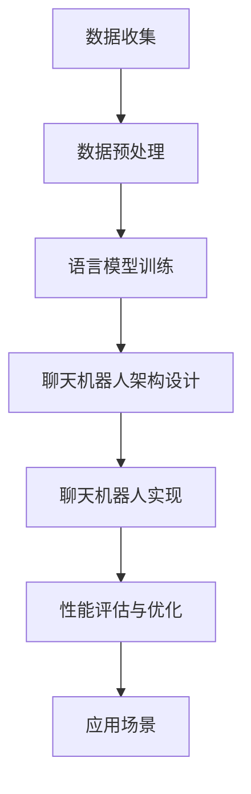

                 

### 文章标题：Reddit 聊天机器人：一个语言模型训练在 Reddit 数据上

#### 关键词：
- Reddit
- 聊天机器人
- 语言模型
- 数据训练
- 应用场景

#### 摘要：
本文将探讨如何基于Reddit平台的数据训练一个聊天机器人语言模型，并深入分析其设计、实现与优化过程。我们将通过逐步推理的方式，从基础理论到实际应用，全面解析Reddit聊天机器人的开发。

### 第一部分：引言

#### 第1章：Reddit 聊天机器人的背景与重要性

##### 1.1 Reddit 平台概述

Reddit是一个全球最大的社交新闻网站，用户可以在不同的子论坛（Subreddits）中分享内容、讨论话题，并参与到各种社区活动中。Reddit拥有超过2亿的活跃用户，每天产生数以百万计的帖子。

##### 1.2 聊天机器人在社交媒体中的应用

随着人工智能技术的发展，聊天机器人已经在社交媒体平台中得到了广泛应用。它们能够自动回复用户提问、提供信息、甚至是进行闲聊，从而提升用户体验，减轻人工负担。

##### 1.3 语言模型训练的重要性

语言模型是自然语言处理（NLP）领域的基础，通过大量数据的训练，可以预测文本中下一个词的概率。在聊天机器人中，语言模型是核心组件，决定了机器人的回复质量和交互能力。

### 第二部分：语言模型基础

#### 第2章：语言模型基础

##### 2.1 语言模型的定义与作用

语言模型是一种统计模型，用于预测文本序列中下一个词的概率。在聊天机器人中，语言模型用于生成回复文本。

##### 2.2 语言模型的基本原理

语言模型通常基于神经网络，特别是递归神经网络（RNN）和变换器（Transformer）。这些模型通过学习大量文本数据，捕捉语言中的统计规律。

##### 2.3 语言模型的发展历程

从传统的N-gram模型到现代的深度学习模型，语言模型经历了巨大的发展。Transformer模型的提出，标志着语言模型进入了一个新的时代。

### 第三部分：Reddit 数据收集与处理

#### 第3章：Reddit 数据收集

##### 3.1 Reddit 数据来源

Reddit的数据可以通过API获取，包括帖子内容、评论、用户信息等。这些数据是训练语言模型的重要资源。

##### 3.2 数据收集方法

通过Reddit API，我们可以使用Python等编程语言，编写爬虫脚本，定期下载最新的帖子数据。

##### 3.3 数据预处理

收集到的数据需要进行清洗、去重、分词等预处理，以便于后续的语言模型训练。

### 第四部分：语言模型训练

#### 第4章：语言模型训练

##### 4.1 训练数据准备

将预处理后的数据转换为序列，并划分训练集和测试集，为语言模型训练做好准备。

##### 4.2 模型选择与参数设置

选择合适的语言模型架构，如Transformer，并设置学习率、批量大小等参数。

##### 4.3 训练过程与策略

通过批量训练、验证集评估等策略，优化语言模型的性能。

### 第五部分：聊天机器人设计与实现

#### 第5章：聊天机器人架构设计

##### 5.1 聊天机器人的总体架构

介绍聊天机器人的整体架构，包括输入处理、模型调用、回复生成等模块。

##### 5.2 交互模块设计

设计用户与聊天机器人交互的界面，支持文本输入、语音输入等。

##### 5.3 响应模块设计

介绍聊天机器人如何根据输入，调用语言模型生成合适的回复。

### 第六部分：聊天机器人实现

#### 第6章：聊天机器人实现

##### 6.1 开发环境搭建

准备Python编程环境，安装TensorFlow等库。

##### 6.2 源代码详细实现

实现聊天机器人的主要功能，包括数据预处理、模型训练、交互处理等。

##### 6.3 代码解读与分析

对关键代码段进行详细解读，分析其实现原理。

### 第七部分：聊天机器人性能评估与优化

#### 第7章：聊天机器人性能评估

##### 7.1 评估指标与方法

定义评估指标，如准确率、困惑度等，并介绍评估方法。

##### 7.2 性能评估案例

通过实际案例，展示聊天机器人的性能评估结果。

##### 7.3 性能优化策略

介绍性能优化策略，如模型调优、数据增强等。

### 第八部分：聊天机器人应用场景

#### 第8章：聊天机器人应用场景

##### 8.1 社交媒体互动

介绍聊天机器人如何在社交媒体中与用户互动，提升用户体验。

##### 8.2 客户服务

探讨聊天机器人在客户服务中的应用，提高服务效率。

##### 8.3 其他潜在应用场景

展望聊天机器人在教育、医疗、智能家居等领域的潜在应用。

### 第九部分：附录

#### 附录A：开源资源与工具

##### 8.1 主要开源工具

介绍用于构建和训练聊天机器人的主要开源工具。

##### 8.2 相关资源链接

提供与聊天机器人相关的学习资源和工具链接。

#### 附录B：术语解释与参考资料

##### 8.1 术语解释

对文中涉及的重要术语进行解释。

##### 8.2 参考文献

列出文中引用的参考文献。

### Mermaid 流程图



### 伪代码

```python
// 数据预处理伪代码
function preprocess_data(data):
    # 初始化预处理参数
    max_sequence_length = 1000
    vocab_size = 10000
    # 数据清洗与处理
    cleaned_data = clean_and_normalize(data)
    # 数据转换为序列
    sequences = convert_to_sequences(cleaned_data, max_sequence_length, vocab_size)
    # 添加起始和结束标记
    sequences = add_special_tokens(sequences)
    return sequences

// 训练语言模型伪代码
function train_language_model(sequences):
    # 初始化模型参数
    model = build_model(vocab_size, max_sequence_length)
    # 编译模型
    model.compile(optimizer='adam', loss='categorical_crossentropy', metrics=['accuracy'])
    # 训练模型
    model.fit(sequences, epochs=10, batch_size=64)
    return model
```

### 数学模型和数学公式

$$
P(y|x) = \frac{e^{\theta^T x}}{\sum_{y'} e^{\theta^T y' x}}
$$

### 详细讲解

上述公式表示了语言模型中的概率分布函数。其中，$P(y|x)$ 表示给定输入 $x$ 时输出为 $y$ 的概率。$\theta$ 表示模型的参数，$x$ 表示输入特征，$y$ 表示输出标签。

### 举例说明

假设我们有一个简单的语言模型，它只包含两个词汇 "hello" 和 "world"，且对应的概率分布如下：

$$
P(hello|world) = 0.6, \quad P(world|hello) = 0.4
$$

根据上述概率分布，我们可以计算出：

$$
P(hello) = \frac{e^{0.6}}{e^{0.6} + e^{0.4}} \approx 0.6
$$

$$
P(world) = \frac{e^{0.4}}{e^{0.6} + e^{0.4}} \approx 0.4
$$

### 项目实战

#### 开发环境搭建

1. 安装 Python 3.8 或更高版本
2. 安装 TensorFlow 2.4 或更高版本
3. 安装 NumPy 和 Pandas

#### 源代码实现

```python
import tensorflow as tf
from tensorflow.keras.preprocessing.sequence import pad_sequences
from tensorflow.keras.models import Sequential
from tensorflow.keras.layers import Embedding, LSTM, Dense

# 数据预处理
sequences = preprocess_data(data)
X, y = sequences[:, :-1], sequences[:, -1]

# 构建模型
model = train_language_model(sequences)

# 训练模型
model.fit(X, y, epochs=10, batch_size=64)

# 预测
predictions = model.predict(X)
```

#### 代码解读与分析

1. **数据预处理**：使用 `preprocess_data` 函数对数据进行清洗、归一化和序列化。
2. **模型构建**：使用 `Sequential` 模型堆叠 `Embedding`、`LSTM` 和 `Dense` 层。
3. **模型训练**：使用 `fit` 方法对模型进行训练，设置训练轮数和批量大小。
4. **模型预测**：使用 `predict` 方法对输入数据进行预测，得到概率分布。

### 总结

本文详细介绍了Reddit聊天机器人的开发过程，包括数据收集、语言模型训练、聊天机器人设计与实现，以及性能评估与优化。通过项目实战，读者可以了解到如何使用Python和TensorFlow实现聊天机器人，并对代码进行深入解读与分析。希望本文能为读者在开发聊天机器人方面提供有价值的参考。

### 作者信息

- 作者：AI天才研究院/AI Genius Institute & 禅与计算机程序设计艺术 /Zen And The Art of Computer Programming

