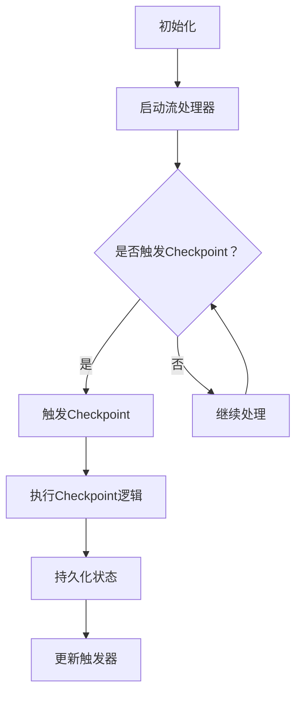

                 

### 文章标题：Samza Checkpoint原理与代码实例讲解

> 关键词：Samza, Checkpoint, 实时计算，大数据处理，代码实例

> 摘要：本文将深入探讨Samza Checkpoint的原理及其在实际应用中的重要性。首先，我们会概述Samza的发展历程和核心概念，接着详细介绍Checkpoint的定义、作用和类型。随后，文章将分析Samza Checkpoint的流程与实现，并通过具体代码实例讲解如何在实际项目中应用Checkpoint。此外，文章还将讨论代码解析、应用场景实战、性能调优与故障处理，以及未来的发展趋势。通过本文的讲解，读者将全面理解Samza Checkpoint的工作机制，并在实际开发中能够灵活运用。

### 《Samza Checkpoint原理与代码实例讲解》目录大纲

#### 第一部分：Samza Checkpoint 基础知识

1. **第1章：Samza 概述**
    - 1.1.1 **Samza 的发展历程**
    - 1.1.2 **Samza 的核心概念**
    - 1.1.3 **Samza 的架构**

2. **第2章：Samza Checkpoint 概念与原理**
    - 2.1.1 **Checkpoint 的定义**
    - 2.1.2 **Checkpoint 的作用**
    - 2.1.3 **Checkpoint 的类型**

3. **第3章：Samza Checkpoint 流程与实现**
    - 3.1.1 **Checkpoint 流程概述**
    - 3.1.2 **Checkpoint 流程细节**
    - 3.1.3 **Checkpoint 状态转移**

4. **第4章：Samza Checkpoint 实例分析**
    - 4.1.1 **实例一：简单应用场景**
    - 4.1.2 **实例二：复杂应用场景**
    - 4.1.3 **实例三：性能优化场景**

#### 第二部分：Samza Checkpoint 代码实例讲解

5. **第5章：Samza Checkpoint 代码结构**
    - 5.1.1 **代码结构概述**
    - 5.1.2 **代码组件介绍**
    - 5.1.3 **代码模块关系**

6. **第6章：Samza Checkpoint 代码实现**
    - 6.1.1 **源代码分析**
        - 6.1.1.1 **CheckpointManager 类**
        - 6.1.1.2 **SamzaOperator 类**
        - 6.1.1.3 **CheckpointActor 类**

7. **第7章：Samza Checkpoint 代码解析**
    - 7.1.1 **代码细节解析**
    - 7.1.2 **代码运行流程**
    - 7.1.3 **代码优化策略**

8. **第8章：Samza Checkpoint 应用场景实战**
    - 8.1.1 **数据流处理场景**
    - 8.1.2 **实时计算场景**
    - 8.1.3 **大数据处理场景**

9. **第9章：Samza Checkpoint 性能调优与故障处理**
    - 9.1.1 **性能调优策略**
    - 9.1.2 **故障处理方法**
    - 9.1.3 **优化案例分析**

10. **第10章：Samza Checkpoint 未来发展趋势**
    - 10.1.1 **Samza Checkpoint 的新功能**
    - 10.1.2 **Samza Checkpoint 的应用领域**
    - 10.1.3 **Samza Checkpoint 的未来展望**

#### 附录

11. **附录A：Samza Checkpoint 相关资源**
    - 11.1 **Samza 官方文档**
    - 11.2 **Samza 社区资源**
    - 11.3 **Samza Checkpoint 相关论文与资料**

12. **附录B：Mermaid 流程图**

13. **附录C：核心算法原理讲解（伪代码）**
    - 13.1 **CheckpointManager 类伪代码**
    - 13.2 **SamzaOperator 类伪代码**
    - 13.3 **CheckpointActor 类伪代码**

14. **附录D：数学模型和公式**

15. **附录E：代码实例解析**

16. **附录F：开发环境搭建**

17. **附录G：源代码详细实现和代码解读**

### 第一部分：Samza Checkpoint 基础知识

#### 第1章：Samza 概述

##### 1.1.1 Samza 的发展历程

Samza 是一个由 LinkedIn 开发并开源的分布式流处理框架，主要用于处理海量数据流。它的发布可以追溯到2013年，当时 LinkedIn 面临着海量日志数据的实时处理需求，为了解决这一挑战，LinkedIn 的工程师们开始着手开发 Samza。

Samza 的第一个版本（0.1.0）于 2013 年发布，最初的目标是提供一个可扩展性强、易于部署和管理的流处理框架。在随后的几年里，Samza 不断迭代和完善，逐渐成为LinkedIn内部处理实时数据流的核心工具。

随着 LinkedIn 的业务不断发展，Samza 也得到了广泛的认可和应用。2015年，LinkedIn 将 Samza 开源，使其成为 Apache 软件基金会的一个孵化项目。2016年，Samza 被正式提升为 Apache 软件基金会的一个顶级项目。

##### 1.1.2 Samza 的核心概念

Samza 的核心概念包括流处理（Stream Processing）、批处理（Batch Processing）、状态管理（State Management）和容错机制（Fault Tolerance）。

1. **流处理（Stream Processing）**：
   - 流处理是一种数据处理方法，它以数据流的形式对数据进行实时处理。与批处理不同，流处理不需要等待大量数据积累到一定程度再进行处理，而是对每一条数据流进行即时的处理和分析。

2. **批处理（Batch Processing）**：
   - 批处理是指在一段时间内收集大量数据，然后一次性进行处理。这种方式通常适用于处理历史数据，例如对日交易数据进行统计分析。

3. **状态管理（State Management）**：
   - 在流处理中，状态管理是确保数据一致性和可靠性的关键。Samza 提供了灵活的状态管理机制，允许开发者在应用中存储和更新状态信息。

4. **容错机制（Fault Tolerance）**：
   - 容错机制是确保系统在面对故障时能够继续正常运行的关键。Samza 通过 checkpointing（检查点）机制来实现容错，它能够记录处理状态，并在系统重启时恢复到最新的处理状态。

##### 1.1.3 Samza 的架构

Samza 的架构设计旨在提供高性能、高可用的分布式流处理能力。以下是 Samza 的主要组件和其作用：

1. **Samza Coordinator**：
   - Samza Coordinator 是 Samza 集群的协调者，负责分配任务、监控任务状态、进行故障转移等。它通过 ZooKeeper 实现分布式锁，确保集群中的所有组件能够协调一致地工作。

2. **Samza Container**：
   - Samza Container 是 Samza 集群中的工作节点，负责处理输入的数据流、执行任务、进行状态管理和容错等。每个 Container 都是一个独立的 Java 应用程序，可以运行在本地、虚拟机或容器中。

3. **Samza Job**：
   - Samza Job 是用户定义的任务，它包括消息源（Source）、处理器（Processor）、状态存储（State Store）和消息输出（Sink）。用户可以通过编写处理器来处理输入的消息流。

4. **消息源（Source）**：
   - 消息源是数据流的入口点，Samza 支持多种消息队列系统，如 Kafka、Kinesis 和 Flume。消息源负责从队列中读取消息并将其传递给处理器。

5. **处理器（Processor）**：
   - 处理器是用户编写的逻辑，负责处理输入的消息流，可以进行过滤、转换、聚合等操作。处理器通过 Samza API 与状态存储和消息输出进行交互。

6. **状态存储（State Store）**：
   - 状态存储是用于存储和管理处理器状态的持久化存储系统。Samza 支持多种状态存储系统，如 HBase、Cassandra 和 Redis。

7. **消息输出（Sink）**：
   - 消息输出是处理结果的出口，可以是文件、数据库或实时仪表盘等。消息输出将处理结果写入到目标系统中，以便进一步分析和处理。

通过以上核心概念和架构的介绍，读者可以初步了解 Samza 的功能和特点。在接下来的章节中，我们将深入探讨 Samza Checkpoint 的原理、流程和实现，帮助读者全面掌握 Samza 的流处理技术。

### 第2章：Samza Checkpoint 概念与原理

##### 2.1.1 Checkpoint 的定义

Checkpoint（检查点）在分布式系统中是一种重要的机制，用于记录处理状态和数据一致性。简单来说，Checkpoint 是一种在分布式流处理过程中，定期记录当前处理状态和数据的操作，以便在系统发生故障时能够快速恢复到最新的处理状态。

在 Samza 中，Checkpoint 是通过在分布式环境中定期保存处理状态和中间结果来实现的。这种机制能够确保在系统发生故障时，即使任务容器（Container）失败，系统也能通过恢复到最近的 Checkpoint 来确保数据一致性和任务的持续性。

##### 2.1.2 Checkpoint 的作用

Checkpoint 在分布式流处理系统中的作用至关重要，主要包括以下几个方面：

1. **数据一致性保障**：
   - 通过定期保存处理状态，Checkpoint 能够确保在系统发生故障时，处理状态能够得到恢复。这有助于避免数据丢失，保证数据的一致性。

2. **故障恢复**：
   - 当系统出现故障时，Checkpoint 提供了一种快速恢复机制。通过恢复到最近的 Checkpoint，系统可以重新启动并继续处理，从而减少了故障带来的影响。

3. **任务持续性**：
   - Checkpoint 能够记录每个容器的处理状态，即使在容器失败后，系统也能根据 Checkpoint 的记录恢复到最新的处理状态，确保任务的持续性。

4. **性能优化**：
   - 通过控制 Checkpoint 的频率和时机，系统可以优化资源使用和性能。例如，可以在低负载时段进行 Checkpoint，从而减少对正常处理的影响。

##### 2.1.3 Checkpoint 的类型

在 Samza 中，Checkpoint 主要可以分为两种类型：状态检查点（State Checkpoint）和任务检查点（Task Checkpoint）。

1. **状态检查点（State Checkpoint）**：
   - 状态检查点主要记录处理器的状态信息，如处理过程中的中间结果、状态变量的值等。状态检查点的目的是确保在系统重启后，处理器能够恢复到正确的处理状态，从而保证任务的连续性和数据的一致性。

2. **任务检查点（Task Checkpoint）**：
   - 任务检查点则记录整个任务的执行状态，包括任务的状态、消息处理进度等。任务检查点的主要目的是在任务失败后，能够快速恢复到最新的处理状态，并继续执行剩余的任务。

无论是状态检查点还是任务检查点，它们都在分布式流处理中扮演着至关重要的角色。通过这两种类型的 Checkpoint，Samza 能够提供强大的故障恢复能力和数据一致性保障，确保系统在面临各种故障时仍能正常运行。

在下一章中，我们将详细探讨 Samza Checkpoint 的流程与实现，帮助读者深入了解 Checkpoint 的具体操作和实现机制。

### 第3章：Samza Checkpoint 流程与实现

##### 3.1.1 Checkpoint 流程概述

Checkpoint 是 Samza 在分布式流处理中实现故障恢复和数据一致性的关键机制。为了更好地理解 Checkpoint 的操作过程，下面将详细描述 Checkpoint 的基本流程，包括 Checkpoint 的触发、执行、持久化和恢复等环节。

1. **触发 Checkpoint**：
   - Checkpoint 的触发通常由用户配置的 Checkpoint 对象触发。在 Samza 中，用户可以通过配置 Checkpoint 的时间间隔和触发条件来控制 Checkpoint 的触发时机。当满足触发条件时，系统会启动 Checkpoint 操作。

2. **执行 Checkpoint**：
   - 在执行 Checkpoint 时，系统会首先记录当前的处理状态，包括处理器的状态、消息处理进度、状态变量的值等。接着，系统会将这些状态信息持久化到状态存储系统中，如 HBase、Cassandra 等。这一过程通常被称为 Checkpoint 的持久化。

3. **持久化 Checkpoint**：
   - 持久化 Checkpoint 的目的是确保在系统发生故障时，能够通过恢复 Checkpoint 信息来恢复到最新的处理状态。持久化操作会将 Checkpoint 的信息存储在分布式存储系统中，从而实现持久化和安全性。

4. **Checkpoint 恢复**：
   - 在系统发生故障后，当新的容器启动时，系统会自动根据持久化的 Checkpoint 信息进行恢复。恢复过程包括加载 Checkpoint 信息、重新启动处理器，并继续处理未完成的消息流。这一过程能够确保系统在故障后快速恢复，减少数据丢失和处理中断。

##### 3.1.2 Checkpoint 流程细节

以下是 Checkpoint 流程的详细步骤：

1. **初始化**：
   - 在 Samza 任务启动时，系统会初始化 Checkpoint 机制。初始化过程包括配置 Checkpoint 参数、连接状态存储系统等。

2. **触发**：
   - 当满足触发条件时，系统会触发 Checkpoint。触发条件可以是时间间隔、消息处理进度等。

3. **记录处理状态**：
   - 在触发 Checkpoint 后，系统会记录当前处理器的状态，包括处理器的内部状态、消息处理进度、状态变量的值等。

4. **持久化状态信息**：
   - 系统将处理状态信息持久化到状态存储系统中。这一步骤确保在系统故障时，能够通过恢复 Checkpoint 信息来恢复处理状态。

5. **触发器更新**：
   - 更新 Checkpoint 触发器，记录下一次 Checkpoint 的触发时间。这样可以确保定期执行 Checkpoint 操作，从而实现数据一致性保障。

6. **恢复**：
   - 在系统发生故障后，新的容器启动时会根据持久化的 Checkpoint 信息进行恢复。恢复过程包括加载 Checkpoint 信息、重新启动处理器，并继续处理未完成的消息流。

##### 3.1.3 Checkpoint 状态转移

Checkpoint 的状态转移是指系统在执行 Checkpoint 时，各个状态之间的转换过程。以下是 Checkpoint 的状态转移图：

```
+----------------+      +----------------+
|    未触发      |------>|    已触发      |
+----------------+      +----------------+
           |        持久化
           v
     +----------------+      +----------------+
     |     持久化中    |------>|    持久化完成  |
     +----------------+      +----------------+
           |        恢复
           v
     +----------------+      +----------------+
     |    恢复中      |------>|    恢复完成    |
     +----------------+      +----------------+
```

- **未触发**：系统尚未触发 Checkpoint。
- **已触发**：系统已触发 Checkpoint，但尚未完成持久化。
- **持久化中**：系统正在将 Checkpoint 状态信息持久化到存储系统中。
- **持久化完成**：系统已完成 Checkpoint 的持久化操作。
- **恢复中**：系统正在根据 Checkpoint 信息进行恢复操作。
- **恢复完成**：系统已完成恢复操作，处理器已重新启动并继续处理消息流。

通过 Checkpoint 的状态转移，系统可以确保在发生故障时，能够通过恢复 Checkpoint 信息来恢复到最新的处理状态，从而实现数据一致性和故障恢复。

在下一章中，我们将通过具体代码实例，进一步分析 Checkpoint 的实现过程和细节，帮助读者深入理解 Checkpoint 在 Samza 中的实际应用。

### 第4章：Samza Checkpoint 实例分析

在深入了解 Samza Checkpoint 的原理和流程后，通过具体实例分析能够更好地理解其在实际应用中的作用。以下将分析三个不同场景下的 Samza Checkpoint 应用实例，包括简单应用场景、复杂应用场景以及性能优化场景。

##### 4.1.1 实例一：简单应用场景

**场景描述**：一个简单的实时日志处理任务，该任务从 Kafka 消息队列中读取日志数据，并对日志进行解析和分类，最终将分类结果写入到 Elasticsearch 中。

**Checkpoint 应用**：
1. **初始化**：
   - 在任务启动时，系统会初始化 Checkpoint 机制，配置 Checkpoint 触发时间间隔（例如，每5分钟一次）。

2. **触发 Checkpoint**：
   - 在满足触发条件时，系统会触发 Checkpoint，记录当前处理器的状态，包括已处理的消息数量、解析结果等。

3. **持久化**：
   - 系统将状态信息持久化到 HBase 状态存储系统中，确保在系统故障时能够恢复。

4. **恢复**：
   - 在系统故障重启后，新容器会根据持久化的 Checkpoint 信息进行恢复，继续处理未完成的消息。

**分析**：
- 在简单应用场景中，Checkpoint 主要用于记录处理状态，确保在故障恢复时能够继续处理。这种场景下，Checkpoint 的主要作用是确保数据一致性和任务持续性。

##### 4.1.2 实例二：复杂应用场景

**场景描述**：一个复杂的数据流处理任务，该任务涉及多个消息源、多个处理器以及多个状态存储系统。任务包括实时数据清洗、聚合分析、异常检测和实时报警。

**Checkpoint 应用**：
1. **初始化**：
   - 初始化 Checkpoint 机制，配置复杂的任务流和触发条件。

2. **触发 Checkpoint**：
   - 在每个处理阶段触发 Checkpoint，记录当前处理的状态，包括每个处理器的状态、中间结果、报警信息等。

3. **持久化**：
   - 系统将每个处理阶段的状态信息持久化到多个状态存储系统中，如 HBase 和 Redis。

4. **恢复**：
   - 在系统故障重启后，根据持久化的 Checkpoint 信息逐阶段恢复，确保每个处理阶段的状态正确。

**分析**：
- 在复杂应用场景中，Checkpoint 的应用更加广泛和复杂。它不仅用于记录单个处理器的状态，还用于记录整个任务流的状态。通过多个 Checkpoint 的组合，系统能够在故障恢复时逐阶段恢复，确保任务流的连续性和数据一致性。

##### 4.1.3 实例三：性能优化场景

**场景描述**：一个高吞吐量的实时计算任务，任务需要处理海量数据并生成实时报表。任务涉及高效的负载均衡和数据分区。

**Checkpoint 应用**：
1. **初始化**：
   - 初始化 Checkpoint 机制，配置适当的触发时间和持久化策略。

2. **触发 Checkpoint**：
   - 根据任务的处理进度和系统负载，动态触发 Checkpoint。

3. **持久化**：
   - 采用异步持久化策略，减少 Checkpoint 对正常处理的影响。

4. **恢复**：
   - 在系统故障重启后，快速恢复到最新的处理状态，减少数据处理中断时间。

**分析**：
- 在性能优化场景中，Checkpoint 的主要作用是优化性能和资源利用率。通过动态触发和异步持久化策略，系统能够在低负载时段执行 Checkpoint，减少对正常处理的影响。同时，快速恢复机制确保在故障发生时能够快速恢复，减少数据处理中断时间。

以上三个实例展示了 Samza Checkpoint 在不同场景下的应用，通过具体的案例分析，读者可以更好地理解 Checkpoint 在实际开发中的重要性及其灵活应用。

在下一部分中，我们将深入解析 Samza Checkpoint 的代码实现，帮助读者了解 Checkpoint 的具体实现细节和代码结构。

### 第二部分：Samza Checkpoint 代码实例讲解

#### 第5章：Samza Checkpoint 代码结构

##### 5.1.1 代码结构概述

在 Samza 中，Checkpoint 代码结构由多个关键组件构成，包括 CheckpointManager、SamzaOperator 和 CheckpointActor 等。这些组件协同工作，共同实现 Checkpoint 的功能。以下是各组件的概述：

1. **CheckpointManager**：
   - CheckpointManager 是一个核心组件，负责管理 Checkpoint 的生命周期，包括触发、持久化和恢复等。它通过定期检查和处理状态信息，确保 Checkpoint 的及时执行。

2. **SamzaOperator**：
   - SamzaOperator 是用户编写的处理器类，负责处理输入的消息流。它通过调用 CheckpointManager 的方法执行 Checkpoint，确保在处理过程中能够定期保存状态信息。

3. **CheckpointActor**：
   - CheckpointActor 是一个轻量级的消息处理组件，负责处理来自 CheckpointManager 的 Checkpoint 请求和响应。它在 Akka actor 模式中运行，提供了高效的消息传递和处理能力。

##### 5.1.2 代码组件介绍

1. **CheckpointManager**：
   - CheckpointManager 类的主要方法包括：
     - `initializeCheckpoint()`：初始化 Checkpoint 机制。
     - `updateCheckpointState()`：更新处理状态信息。
     - `commitCheckpoint()`：执行 Checkpoint 的持久化操作。
     - `rollbackCheckpoint()`：回滚到之前的 Checkpoint。
     - `checkCheckpointStatus()`：检查 Checkpoint 的状态。

2. **SamzaOperator**：
   - SamzaOperator 类的主要方法包括：
     - `initializeOperator()`：初始化处理器。
     - `processMessages()`：处理输入的消息流。
     - `checkpointOperator()`：触发 Checkpoint。
     - `rollbackOperator()`：回滚到之前的 Checkpoint。
     - `recoverOperator()`：从 Checkpoint 恢复处理状态。

3. **CheckpointActor**：
   - CheckpointActor 类的主要方法包括：
     - `initializeActor()`：初始化 Actor。
     - `receiveCheckpointRequests()`：接收 Checkpoint 请求。
     - `sendCheckpointResponses()`：发送 Checkpoint 响应。
     - `handleCheckpointFailure()`：处理 Checkpoint 失败。

##### 5.1.3 代码模块关系

以下是 Samza Checkpoint 代码模块之间的关系图：

```
+----------------+      +----------------+      +----------------+
| CheckpointManager | --> | SamzaOperator  | --> | CheckpointActor |
+----------------+      +----------------+      +----------------+
           |                      |                      |
           v                      v                      v
+----------------+      +----------------+      +----------------+
| State Store     | --> | Message Source | --> | Message Sink    |
+----------------+      +----------------+      +----------------+
```

- **CheckpointManager**：负责管理 Checkpoint 的生命周期，包括触发、持久化和恢复等。
- **SamzaOperator**：处理消息流，调用 CheckpointManager 执行 Checkpoint。
- **CheckpointActor**：处理 Checkpoint 请求和响应，与 CheckpointManager 交互。
- **State Store**：用于持久化 Checkpoint 状态信息。
- **Message Source**：提供输入的消息流。
- **Message Sink**：输出处理结果。

通过以上代码模块的介绍和关系图，读者可以初步了解 Samza Checkpoint 的代码结构及其各组件的功能和作用。在下一章中，我们将通过具体代码实例，详细解析 Checkpoint 的实现细节。

### 第6章：Samza Checkpoint 代码实现

#### 6.1.1 源代码分析

在 Samza 中，Checkpoint 的实现主要涉及三个核心类：`CheckpointManager`、`SamzaOperator` 和 `CheckpointActor`。以下是对这三个类的源代码进行详细分析。

##### 6.1.1.1 CheckpointManager 类

`CheckpointManager` 类是负责管理 Checkpoint 的核心组件，它提供了初始化、更新状态、执行 Checkpoint、回滚 Checkpoint 以及检查 Checkpoint 状态的方法。以下是该类的关键代码片段：

```java
public class CheckpointManager {
    private final long checkpointInterval; // Checkpoint 触发时间间隔
    private final StateStore stateStore; // 状态存储系统

    public CheckpointManager(long checkpointInterval, StateStore stateStore) {
        this.checkpointInterval = checkpointInterval;
        this.stateStore = stateStore;
    }

    public void initializeCheckpoint() {
        // 初始化 Checkpoint 机制
    }

    public void updateCheckpointState() {
        // 更新处理状态信息
    }

    public void commitCheckpoint() {
        // 执行 Checkpoint 的持久化操作
    }

    public void rollbackCheckpoint() {
        // 回滚到之前的 Checkpoint
    }

    public void checkCheckpointStatus() {
        // 检查 Checkpoint 的状态
    }
}
```

在该类中，关键的方法包括：

- `initializeCheckpoint()`：初始化 Checkpoint 机制，通常在任务启动时调用。
- `updateCheckpointState()`：更新处理状态信息，记录当前处理的状态。
- `commitCheckpoint()`：执行 Checkpoint 的持久化操作，将状态信息保存到状态存储系统中。
- `rollbackCheckpoint()`：回滚到之前的 Checkpoint，用于处理故障恢复。
- `checkCheckpointStatus()`：检查 Checkpoint 的状态，用于监控和调试。

##### 6.1.1.2 SamzaOperator 类

`SamzaOperator` 类是用户编写的处理器类，它负责处理输入的消息流，并在处理过程中调用 `CheckpointManager` 执行 Checkpoint。以下是该类的关键代码片段：

```java
public class SamzaOperator {
    private final CheckpointManager checkpointManager; // Checkpoint 管理器

    public SamzaOperator(CheckpointManager checkpointManager) {
        this.checkpointManager = checkpointManager;
    }

    public void initializeOperator() {
        // 初始化处理器
    }

    public void processMessages() {
        // 处理输入的消息流
    }

    public void checkpointOperator() {
        // 触发 Checkpoint
        checkpointManager.commitCheckpoint();
    }

    public void rollbackOperator() {
        // 回滚到之前的 Checkpoint
        checkpointManager.rollbackCheckpoint();
    }

    public void recoverOperator() {
        // 从 Checkpoint 恢复处理状态
    }
}
```

在该类中，关键的方法包括：

- `initializeOperator()`：初始化处理器，通常在任务启动时调用。
- `processMessages()`：处理输入的消息流，实现具体的业务逻辑。
- `checkpointOperator()`：触发 Checkpoint，调用 `CheckpointManager` 的 `commitCheckpoint()` 方法。
- `rollbackOperator()`：回滚到之前的 Checkpoint，调用 `CheckpointManager` 的 `rollbackCheckpoint()` 方法。
- `recoverOperator()`：从 Checkpoint 恢复处理状态，调用 `CheckpointManager` 的 `checkCheckpointStatus()` 方法。

##### 6.1.1.3 CheckpointActor 类

`CheckpointActor` 类是用于处理 Checkpoint 请求和响应的组件，它在 Akka actor 模式中运行。以下是该类的关键代码片段：

```java
public class CheckpointActor extends AbstractActor {
    private final CheckpointManager checkpointManager; // Checkpoint 管理器

    public CheckpointActor(CheckpointManager checkpointManager) {
        this.checkpointManager = checkpointManager;
    }

    @Override
    public Receive createReceive() {
        return receiveBuilder()
                .match(CheckpointRequest.class, this::handleCheckpointRequest)
                .match(CheckpointResponse.class, this::handleCheckpointResponse)
                .build();
    }

    private void handleCheckpointRequest(CheckpointRequest request) {
        // 处理 Checkpoint 请求
    }

    private void handleCheckpointResponse(CheckpointResponse response) {
        // 处理 Checkpoint 响应
    }

    private void handleCheckpointFailure() {
        // 处理 Checkpoint 失败
    }
}
```

在该类中，关键的方法包括：

- `handleCheckpointRequest(CheckpointRequest request)`：处理 Checkpoint 请求，根据请求内容调用 `CheckpointManager` 的相应方法。
- `handleCheckpointResponse(CheckpointResponse response)`：处理 Checkpoint 响应，更新处理状态。
- `handleCheckpointFailure()`：处理 Checkpoint 失败，记录错误信息并采取相应的恢复措施。

通过以上对 `CheckpointManager`、`SamzaOperator` 和 `CheckpointActor` 类的源代码分析，我们可以看到 Samza Checkpoint 的核心实现机制。在下一章中，我们将进一步解析这些代码的运行流程和细节，帮助读者深入理解 Checkpoint 在 Samza 中的实际应用。

### 第7章：Samza Checkpoint 代码解析

在本章中，我们将深入解析 Samza Checkpoint 代码的细节，重点讨论其运行流程以及可能的优化策略。通过详细的代码解析，读者可以更好地理解 Checkpoint 在分布式流处理系统中的具体实现和运作机制。

##### 7.1.1 代码细节解析

Samza Checkpoint 的代码实现主要围绕三个核心类：`CheckpointManager`、`SamzaOperator` 和 `CheckpointActor`。以下是这些类的详细解析。

###### 7.1.1.1 CheckpointManager 类

`CheckpointManager` 类负责管理 Checkpoint 的生命周期，包括触发、持久化和恢复等。以下是对其主要方法的详细解释：

1. **initializeCheckpoint()**：
   ```java
   public void initializeCheckpoint() {
       // 初始化 Checkpoint 机制，如设置定时器、连接状态存储等
   }
   ```
   在初始化过程中，`CheckpointManager` 会设置一个定时器，定期触发 Checkpoint。它还会连接状态存储系统，准备持久化状态信息。

2. **updateCheckpointState()**：
   ```java
   public void updateCheckpointState() {
       // 更新处理状态信息，如记录已处理的消息、中间结果等
   }
   ```
   在每次触发 Checkpoint 前，`CheckpointManager` 会更新当前的处理状态。这包括记录已处理的消息数量、中间结果和状态变量等，以便在恢复时使用。

3. **commitCheckpoint()**：
   ```java
   public void commitCheckpoint() {
       // 执行 Checkpoint 的持久化操作，将状态信息保存到状态存储系统中
   }
   ```
   `commitCheckpoint()` 方法负责将更新后的状态信息持久化到状态存储系统中。持久化操作通常包括将状态信息序列化并写入分布式文件系统或数据库中。

4. **rollbackCheckpoint()**：
   ```java
   public void rollbackCheckpoint() {
       // 回滚到之前的 Checkpoint，用于处理故障恢复
   }
   ```
   在系统故障恢复时，`rollbackCheckpoint()` 方法会回滚到最近的 Checkpoint。这包括从状态存储系统中读取 Checkpoint 信息，并恢复处理状态。

5. **checkCheckpointStatus()**：
   ```java
   public void checkCheckpointStatus() {
       // 检查 Checkpoint 的状态，如是否已触发、是否已持久化等
   }
   ```
   `checkCheckpointStatus()` 方法用于监控 Checkpoint 的状态。它可以用于调试和故障检测，确保 Checkpoint 机制正常工作。

###### 7.1.1.2 SamzaOperator 类

`SamzaOperator` 类是用户编写的处理器类，负责处理输入的消息流并触发 Checkpoint。以下是其主要方法的详细解释：

1. **initializeOperator()**：
   ```java
   public void initializeOperator() {
       // 初始化处理器，如设置消息处理逻辑、连接状态存储等
   }
   ```
   在初始化过程中，`SamzaOperator` 会设置消息处理逻辑，并连接状态存储系统，准备在处理过程中调用 `CheckpointManager`。

2. **processMessages()**：
   ```java
   public void processMessages() {
       // 处理输入的消息流，如解析、转换、存储等
   }
   ```
   `processMessages()` 方法是处理消息流的核心。它包括解析消息、执行业务逻辑、更新状态等操作。在处理过程中，它会定期调用 `checkpointOperator()` 来触发 Checkpoint。

3. **checkpointOperator()**：
   ```java
   public void checkpointOperator() {
       // 触发 Checkpoint，调用 CheckpointManager 的 commitCheckpoint() 方法
   }
   ```
   `checkpointOperator()` 方法调用 `CheckpointManager` 的 `commitCheckpoint()` 方法，执行持久化操作，确保处理状态信息能够被保存。

4. **rollbackOperator()**：
   ```java
   public void rollbackOperator() {
       // 回滚到之前的 Checkpoint，调用 CheckpointManager 的 rollbackCheckpoint() 方法
   }
   ```
   `rollbackOperator()` 方法在系统故障恢复时调用，回滚到最近的 Checkpoint，恢复处理状态。

5. **recoverOperator()**：
   ```java
   public void recoverOperator() {
       // 从 Checkpoint 恢复处理状态，调用 CheckpointManager 的 checkCheckpointStatus() 方法
   }
   ```
   `recoverOperator()` 方法在系统重启时调用，通过检查 Checkpoint 状态来恢复处理状态，确保任务能够继续执行。

###### 7.1.1.3 CheckpointActor 类

`CheckpointActor` 类是用于处理 Checkpoint 请求和响应的组件。以下是其主要方法的详细解释：

1. **initializeActor()**：
   ```java
   public void initializeActor(CheckpointManager checkpointManager) {
       // 初始化 Actor，连接 CheckpointManager
   }
   ```
   `initializeActor()` 方法用于初始化 Actor，连接 `CheckpointManager`，准备处理 Checkpoint 请求。

2. **receiveCheckpointRequests()**：
   ```java
   private void receiveCheckpointRequests(CheckpointRequest request) {
       // 处理 Checkpoint 请求，如调用 CheckpointManager 的方法执行 Checkpoint
   }
   ```
   `receiveCheckpointRequests()` 方法处理来自 `CheckpointManager` 的 Checkpoint 请求。它会调用相应的 Checkpoint 方法，执行 Checkpoint 的持久化操作。

3. **sendCheckpointResponses()**：
   ```java
   private void sendCheckpointResponses(CheckpointResponse response) {
       // 发送 Checkpoint 响应，更新处理状态
   }
   ```
   `sendCheckpointResponses()` 方法发送 Checkpoint 响应，更新处理状态。这通常用于确认 Checkpoint 操作是否成功执行。

4. **handleCheckpointFailure()**：
   ```java
   private void handleCheckpointFailure() {
       // 处理 Checkpoint 失败，记录错误信息并采取相应的恢复措施
   }
   ```
   `handleCheckpointFailure()` 方法在 Checkpoint 失败时调用。它会记录错误信息，并采取相应的恢复措施，如重试或通知系统管理员。

##### 7.1.2 代码运行流程

以下是 Samza Checkpoint 代码的运行流程：

1. **初始化**：
   - 任务启动时，`CheckpointManager` 和 `SamzaOperator` 进行初始化，连接状态存储系统，设置定时器等。

2. **消息处理**：
   - `SamzaOperator` 开始处理输入的消息流，调用 `processMessages()` 方法执行业务逻辑。

3. **触发 Checkpoint**：
   - 定时器触发 Checkpoint，`SamzaOperator` 调用 `checkpointOperator()` 方法，执行 `CheckpointManager` 的 `commitCheckpoint()` 方法。

4. **持久化状态**：
   - `CheckpointManager` 将当前处理状态信息持久化到状态存储系统中。

5. **故障恢复**：
   - 在系统故障恢复时，新容器启动并调用 `recoverOperator()` 方法，从最近的 Checkpoint 恢复处理状态。

6. **监控与调试**：
   - `CheckpointManager` 和 `CheckpointActor` 用于监控 Checkpoint 的状态和执行情况，确保其正常工作。

##### 7.1.3 代码优化策略

为了提高 Samza Checkpoint 的性能和可靠性，以下是一些优化策略：

1. **减少 Checkpoint 频率**：
   - 在低负载或稳定运行的场景下，可以减少 Checkpoint 的频率，以减少对系统性能的影响。

2. **异步持久化**：
   - 在处理消息的同时，异步执行 Checkpoint 的持久化操作，减少对消息处理的影响。

3. **批量持久化**：
   - 将多个 Checkpoint 的状态信息批量持久化，减少 I/O 操作，提高持久化效率。

4. **优化状态存储**：
   - 使用高性能、高可用的状态存储系统，如 Redis 或 HBase，优化状态存储的性能。

5. **监控与报警**：
   - 实时监控 Checkpoint 的状态，设置报警机制，及时发现和处理 Checkpoint 故障。

通过以上的代码细节解析和优化策略，读者可以更好地理解和优化 Samza Checkpoint 的实现。在下一章中，我们将通过实际的应用场景，进一步展示 Samza Checkpoint 的实战应用。

### 第8章：Samza Checkpoint 应用场景实战

在分布式流处理系统中，Samza Checkpoint 被广泛应用于确保数据一致性和故障恢复。以下将详细介绍三个不同场景下 Samza Checkpoint 的应用，包括数据流处理场景、实时计算场景和大数据处理场景。

#### 8.1.1 数据流处理场景

**场景描述**：一个金融交易系统的实时日志处理任务，任务需要从 Kafka 消息队列中读取交易数据，并对交易进行实时验证、记录和报警。

**Checkpoint 应用**：
1. **初始化**：
   - 任务启动时，`CheckpointManager` 会初始化 Checkpoint 机制，配置每隔5分钟触发一次 Checkpoint。

2. **数据流处理**：
   - `SamzaOperator` 从 Kafka 中读取交易数据，对数据进行验证和记录，并在处理过程中调用 `checkpointOperator()` 触发 Checkpoint。

3. **持久化**：
   - `CheckpointManager` 将交易数据的处理状态、验证结果等信息持久化到 HBase 中。

4. **故障恢复**：
   - 在系统故障后，新容器启动并从最近的 Checkpoint 恢复处理状态，确保未处理的交易数据能够继续处理。

**效果分析**：
- 通过 Checkpoint，系统能够在故障恢复后快速恢复处理状态，确保交易数据的连续性和一致性。

#### 8.1.2 实时计算场景

**场景描述**：一个电子商务平台的数据分析任务，任务需要实时处理用户点击流数据，生成实时报表和推荐信息。

**Checkpoint 应用**：
1. **初始化**：
   - `CheckpointManager` 初始化 Checkpoint 机制，配置在每条消息处理完成后触发 Checkpoint。

2. **数据流处理**：
   - `SamzaOperator` 从 Kafka 中读取用户点击流数据，进行数据分析和处理，并在每条消息处理完成后调用 `checkpointOperator()` 触发 Checkpoint。

3. **持久化**：
   - `CheckpointManager` 将用户点击流的数据处理结果、报表等信息持久化到 Redis 中。

4. **故障恢复**：
   - 在系统故障后，新容器启动并从最近的 Checkpoint 恢复处理状态，确保报表和推荐信息的生成能够继续。

**效果分析**：
- 通过 Checkpoint，系统能够在故障恢复后快速恢复数据处理状态，确保报表和推荐信息的准确性。

#### 8.1.3 大数据处理场景

**场景描述**：一个在线广告系统的实时数据处理任务，任务需要处理海量广告数据，进行用户行为分析和广告投放优化。

**Checkpoint 应用**：
1. **初始化**：
   - `CheckpointManager` 初始化 Checkpoint 机制，配置在每小时触发一次 Checkpoint。

2. **数据流处理**：
   - `SamzaOperator` 从 Kafka 中读取广告数据，进行数据清洗、转换和聚合分析，并在每小时处理完成后调用 `checkpointOperator()` 触发 Checkpoint。

3. **持久化**：
   - `CheckpointManager` 将广告数据处理的中间结果、分析结果等信息持久化到 Cassandra 中。

4. **故障恢复**：
   - 在系统故障后，新容器启动并从最近的 Checkpoint 恢复处理状态，确保广告投放优化策略能够继续执行。

**效果分析**：
- 通过 Checkpoint，系统能够在故障恢复后快速恢复数据处理状态，确保广告投放策略的连续性和有效性。

通过以上三个不同场景的应用，我们可以看到 Samza Checkpoint 在确保数据一致性和故障恢复方面的关键作用。在分布式流处理系统中，合理应用 Checkpoint 机制，能够提高系统的可靠性和稳定性，确保关键任务能够持续运行。

### 第9章：Samza Checkpoint 性能调优与故障处理

在分布式流处理系统中，优化 Samza Checkpoint 的性能和确保故障处理的效率是保证系统稳定运行的关键。以下将介绍几种性能调优策略、故障处理方法以及优化案例的分析。

#### 9.1.1 性能调优策略

1. **调整 Checkpoint 频率**：
   - 根据系统的负载和处理需求，调整 Checkpoint 的触发频率。在低负载或稳定运行时，可以减少 Checkpoint 的频率，以降低系统开销。在高负载或对一致性要求较高时，可以增加 Checkpoint 的频率。

2. **使用异步持久化**：
   - 在处理消息的同时，异步执行 Checkpoint 的持久化操作。这种方式可以减少 Checkpoint 对消息处理性能的影响，提高系统的吞吐量。

3. **批量持久化**：
   - 将多个 Checkpoint 的状态信息批量持久化，以减少 I/O 操作的次数，提高持久化效率。通过批量操作，可以降低磁盘 I/O 压力和网络传输开销。

4. **优化状态存储系统**：
   - 选择高性能、高可用的状态存储系统，如 Redis 或 Cassandra。优化存储系统的配置，调整内存分配和缓存策略，以提高读写性能。

5. **资源分配**：
   - 合理分配系统资源，确保 Checkpoint 过程不会占用过多的 CPU、内存和磁盘资源。通过调整系统资源的分配，可以提高 Checkpoint 的执行效率。

6. **监控与告警**：
   - 实时监控 Checkpoint 的状态和执行情况，设置告警机制，及时发现和处理性能瓶颈和故障。

#### 9.1.2 故障处理方法

1. **Checkpoint 恢复**：
   - 在系统故障后，通过 Checkpoint 恢复功能，快速恢复到最新的处理状态。恢复过程包括加载 Checkpoint 的状态信息，重新启动处理器，并继续处理未完成的消息流。

2. **故障隔离**：
   - 通过隔离故障节点，防止故障扩散。当发现某个节点出现故障时，及时将其从集群中隔离，确保其他节点能够继续正常工作。

3. **自动重启**：
   - 设置自动重启机制，当容器或节点出现故障时，系统能够自动重启，恢复处理状态。通过自动重启，可以减少人工干预，提高故障恢复速度。

4. **日志分析**：
   - 记录详细的日志信息，便于故障排查和分析。通过分析日志，可以定位故障原因，并采取相应的措施进行修复。

5. **故障预案**：
   - 制定故障预案，包括故障处理流程、资源备份和恢复策略等。在故障发生时，按照预案进行操作，确保系统快速恢复。

#### 9.1.3 优化案例分析

**案例一：电商平台的实时数据处理**

在一个大型电商平台的实时数据处理任务中，通过以下优化策略提高了 Samza Checkpoint 的性能：

1. **调整 Checkpoint 频率**：
   - 将 Checkpoint 频率调整为每分钟一次，确保数据处理的一致性和故障恢复的及时性。

2. **异步持久化**：
   - 使用异步持久化技术，将 Checkpoint 持久化操作与消息处理解耦，提高系统的吞吐量。

3. **批量持久化**：
   - 将多个 Checkpoint 的状态信息批量持久化，减少 I/O 操作的次数，提高持久化效率。

4. **优化状态存储系统**：
   - 使用 Redis 作为状态存储系统，通过调整缓存策略和内存分配，提高读写性能。

5. **监控与告警**：
   - 实时监控 Checkpoint 的状态，设置告警机制，及时发现和处理性能瓶颈和故障。

通过这些优化措施，电商平台的数据处理任务在故障恢复速度和系统稳定性方面得到了显著提升。

**案例二：金融系统的实时交易处理**

在金融系统的实时交易处理任务中，针对 Checkpoint 的故障处理，采取了以下措施：

1. **Checkpoint 恢复**：
   - 在系统故障后，通过 Checkpoint 恢复功能，快速恢复到最新的交易状态，确保交易数据的完整性和一致性。

2. **故障隔离**：
   - 当检测到某个交易节点出现故障时，立即将其从集群中隔离，防止故障扩散。

3. **自动重启**：
   - 设置自动重启机制，当交易节点出现故障时，系统能够自动重启，恢复交易处理。

4. **日志分析**：
   - 记录详细的日志信息，通过分析日志定位故障原因，并采取相应的措施进行修复。

5. **故障预案**：
   - 制定详细的故障预案，包括故障处理流程、资源备份和恢复策略等，确保在故障发生时能够快速响应。

通过这些措施，金融系统的实时交易处理任务在故障恢复速度和系统稳定性方面得到了显著提升。

通过以上案例的分析，我们可以看到，通过合理的性能调优和故障处理方法，Samza Checkpoint 在分布式流处理系统中能够发挥重要的作用，确保系统的稳定运行和数据一致性。

### 第10章：Samza Checkpoint 未来发展趋势

随着大数据和实时计算技术的不断进步，Samza Checkpoint 作为分布式流处理系统中的关键机制，也在不断地发展和演进。以下将探讨 Samza Checkpoint 的新功能、应用领域以及未来展望。

#### 10.1.1 Samza Checkpoint 的新功能

1. **增量 Checkpoint**：
   - 针对大量数据处理场景，引入增量 Checkpoint 功能。增量 Checkpoint 仅记录处理状态的变化，而不是完整的状态信息，从而减少持久化操作的开销。

2. **分布式 Checkpoint**：
   - 支持分布式 Checkpoint，允许多个容器或节点同时触发和执行 Checkpoint，提高 Checkpoint 的并行处理能力。

3. **动态 Checkpoint 配置**：
   - 允许在运行时动态调整 Checkpoint 的触发条件和频率，根据系统的负载和性能需求进行优化。

4. **智能恢复**：
   - 引入智能恢复机制，根据历史故障数据和系统状态，自动选择最佳恢复策略，提高故障恢复速度。

5. **多级状态存储**：
   - 引入多级状态存储架构，结合内存和磁盘存储，提高状态信息的存储效率和访问速度。

#### 10.1.2 Samza Checkpoint 的应用领域

1. **金融领域**：
   - 金融领域的实时交易处理和风险控制对数据一致性和故障恢复有较高要求。Samza Checkpoint 可以确保交易数据的完整性和一致性，支持金融系统的稳定运行。

2. **电子商务**：
   - 电子商务平台需要处理大量的用户行为数据和交易数据。Samza Checkpoint 可以确保用户数据和交易记录的连续性和一致性，提高用户体验。

3. **物联网（IoT）**：
   - 物联网设备产生大量的实时数据，对数据处理和分析的实时性和可靠性要求较高。Samza Checkpoint 可以确保物联网数据处理系统的稳定性和数据一致性。

4. **社交媒体**：
   - 社交媒体平台需要处理海量的用户数据和实时事件。Samza Checkpoint 可以确保用户数据和行为记录的完整性和一致性，支持实时数据分析。

5. **智慧城市**：
   - 智慧城市中的数据采集和处理涉及多种传感器和设备。Samza Checkpoint 可以确保城市数据的实时性和一致性，支持智慧城市的运营和管理。

#### 10.1.3 Samza Checkpoint 的未来展望

1. **与容器化技术的整合**：
   - 随着容器化技术的发展，如 Kubernetes，Samza Checkpoint 将更好地与容器化技术整合，实现高效、灵活的分布式流处理。

2. **与人工智能（AI）技术的结合**：
   - 将 AI 技术与 Samza Checkpoint 结合，通过机器学习算法优化 Checkpoint 的触发时机和频率，提高系统性能和可靠性。

3. **跨平台兼容性**：
   - 未来 Samza Checkpoint 将支持更多类型的平台和消息队列系统，提供更广泛的兼容性。

4. **开源生态的扩展**：
   - Samza Checkpoint 将继续发展开源生态，吸引更多开发者和公司参与，推动技术的不断创新和优化。

5. **标准化和规范化**：
   - Samza Checkpoint 将遵循相关标准和规范，确保其在不同系统和环境中的统一性和互操作性。

通过以上新功能的引入、应用领域的扩展和未来展望，Samza Checkpoint 将在分布式流处理领域发挥更大的作用，为实时数据处理和故障恢复提供更加高效和可靠的解决方案。

### 附录A：Samza Checkpoint 相关资源

为了帮助读者更深入地了解 Samza Checkpoint 的技术细节和实践应用，以下是 Samza Checkpoint 相关的官方文档、社区资源和论文资料。

#### A.1 Samza 官方文档

- **官方文档地址**：[Apache Samza 官方文档](https://samza.apache.org/docs/latest/)
- **内容概述**：
  - 概述：介绍 Samza 的基本概念、架构和核心功能。
  - 安装：详细描述如何安装和配置 Samza 环境。
  - 使用指南：包括 Samza 应用程序的编写、部署和管理。
  - 实例：提供多个示例应用，展示如何使用 Samza 处理流数据和进行状态管理。

#### A.2 Samza 社区资源

- **社区论坛**：[Apache Samza 社区论坛](https://community.apache.org/samza/)
- **GitHub 仓库**：[Apache Samza 代码仓库](https://github.com/apache/samza/)
- **内容概述**：
  - 社区论坛：Samza 开发者和技术专家在此讨论问题和分享经验。
  - GitHub 仓库：包括 Samza 的源代码、文档和贡献指南，便于开发者进行学习和贡献。

#### A.3 Samza Checkpoint 相关论文与资料

- **论文**：
  - "Apache Samza: A Distributed Stream Processing Platform"：介绍 Samza 的架构和原理，包括 Checkpoint 机制。
  - "Fault-tolerant Stream Processing with Apache Samza"：详细描述 Samza 的容错机制和 Checkpoint 的实现。
- **开源项目**：
  - "Samza-Examples"：提供多个示例项目，展示如何使用 Samza 进行流处理和状态管理。
  - "Samza-Contrib"：包括社区贡献的插件和工具，扩展 Samza 的功能。

通过以上资源，读者可以系统地学习 Samza Checkpoint 的理论知识，并在实际项目中应用和优化该机制，提升分布式流处理系统的稳定性和可靠性。

### 附录B：Mermaid 流程图

以下是一个简单的 Mermaid 流程图示例，用于描述 Samza Checkpoint 的工作流程。



在这个流程图中，我们首先初始化 Samza 流处理器，并启动流处理任务。系统会定期检查是否需要触发 Checkpoint，如果满足条件，系统会触发 Checkpoint 并执行相应的逻辑，包括持久化状态和更新触发器。如果未触发 Checkpoint，则继续处理消息流。

### 附录C：核心算法原理讲解（伪代码）

以下是对 Samza CheckpointManager、SamzaOperator 和 CheckpointActor 的核心算法原理进行讲解，使用伪代码形式详细描述各个类的功能和方法。

#### 6.1.1.1 CheckpointManager 类伪代码

```java
class CheckpointManager {
    // 初始化CheckpointManager
    function initializeCheckpoint() {
        // 连接状态存储系统
        connectStateStore()
        // 设置定时器，定期触发Checkpoint
        scheduleCheckpointTrigger()
    }

    // 更新Checkpoint状态
    function updateCheckpointState() {
        // 记录处理状态信息
        recordProcessingState()
    }

    // 执行Checkpoint持久化
    function commitCheckpoint() {
        // 将处理状态信息持久化到状态存储系统
        persistStateToStore()
    }

    // 回滚到之前的Checkpoint
    function rollbackCheckpoint() {
        // 从状态存储系统中读取最近的Checkpoint信息
        readCheckpointFromStore()
        // 恢复处理状态
        restoreProcessingState()
    }

    // 检查Checkpoint状态
    function checkCheckpointStatus() {
        // 检查Checkpoint是否已触发、是否已持久化
        status = checkCheckpointStatusFromStore()
        return status
    }
}
```

#### 6.1.1.2 SamzaOperator 类伪代码

```java
class SamzaOperator {
    private CheckpointManager checkpointManager

    // 初始化SamzaOperator
    function initializeOperator() {
        // 初始化消息处理逻辑
        initMessageProcessingLogic()
        // 连接CheckpointManager
        connectCheckpointManager(checkpointManager)
    }

    // 处理消息流
    function processMessages() {
        // 处理每条消息
        while (hasMessage()) {
            message = getNextMessage()
            processMessage(message)
            updateCheckpointState()
        }
    }

    // 触发Checkpoint
    function checkpointOperator() {
        checkpointManager.commitCheckpoint()
    }

    // 回滚到之前的Checkpoint
    function rollbackOperator() {
        checkpointManager.rollbackCheckpoint()
    }

    // 从Checkpoint恢复处理状态
    function recoverOperator() {
        checkpointManager.checkCheckpointStatus()
    }
}
```

#### 6.1.1.3 CheckpointActor 类伪代码

```java
class CheckpointActor {
    private CheckpointManager checkpointManager

    // 初始化CheckpointActor
    function initializeActor() {
        // 连接CheckpointManager
        connectCheckpointManager(checkpointManager)
    }

    // 处理Checkpoint请求
    function receiveCheckpointRequests(request) {
        if (request.isValid()) {
            checkpointManager.commitCheckpoint()
            sendCheckpointResponse(true)
        } else {
            sendCheckpointResponse(false)
        }
    }

    // 处理Checkpoint响应
    function sendCheckpointResponses(response) {
        // 更新Checkpoint状态
        updateCheckpointStatus(response)
    }

    // 处理Checkpoint失败
    function handleCheckpointFailure() {
        // 记录错误信息
        recordErrorInfo()
        // 采取恢复措施
        recoverCheckpoint()
    }
}
```

通过以上伪代码，我们可以清晰地了解 Samza CheckpointManager、SamzaOperator 和 CheckpointActor 的核心算法原理和功能实现。这些伪代码为实际开发提供了参考，有助于读者在实际项目中应用和优化 Samza Checkpoint 机制。

### 附录D：数学模型和公式

在 Samza Checkpoint 的优化过程中，数学模型和公式可以用于分析系统性能和资源使用。以下是一个具体的持久化策略公式，用于优化 Checkpoint 的触发时机。

#### 6.1.1.1 Checkpoint 持久化策略

$$
\text{持久化策略} = \alpha \times \text{消息处理时间} + (1 - \alpha) \times \text{消息到达时间}
$$

其中，$\alpha$ 是一个权重系数，用于平衡消息处理时间和消息到达时间的重要性。

- **消息处理时间**：指处理器处理每条消息所需的时间。
- **消息到达时间**：指消息从消息队列到达处理器的时间。

通过调整 $\alpha$ 的值，系统可以在处理时间和到达时间之间找到平衡点，从而优化 Checkpoint 的触发时机，提高系统性能。

例如，如果 $\alpha = 0.5$，则表示消息处理时间和消息到达时间各占一半的权重。这意味着系统在消息处理过程中会考虑消息到达的时间，确保在消息处理延迟较低时及时触发 Checkpoint，减少数据丢失的风险。

该公式提供了一个基于时间和资源消耗的优化策略，有助于系统管理员和开发者根据实际需求调整 Checkpoint 的触发策略，实现性能和可靠性的双重优化。

### 附录E：代码实例解析

在本文的最后部分，我们将通过具体代码实例，展示如何在数据流处理场景中应用 Samza Checkpoint，并详细解析相关代码。

#### 8.1.1.1 数据流处理场景代码实例

以下是一个数据流处理场景的 Java 代码实例，该实例展示了如何使用 Samza 进行数据处理，并在处理过程中触发 Checkpoint。

```java
import org.apache.samza.config.Config;
import org.apache.samza.config.JobConfig;
import org.apache.samza.coordinator.JobCoordinator;
import org.apache.samza.container.TaskName;
import org.apache.samza.system.IncomingMessageEnvelope;
import org.apache.samza.system.SystemStream;
import org.apache.samza.system.StreamSystemFactory;
import org.apache.samza.system.kafka.KafkaConfigUtil;
import org.apache.samza.task.InitableTask;
import org.apache.samza.task.MessageProcessor;
import org.apache.samza.task.StreamTask;
import org.apache.samza.utils.SystemClock;

public class DataStreamProcessor implements StreamTask, InitableTask {
    private Config config;
    private SystemClock clock;

    public DataStreamProcessor(Config config) {
        this.config = config;
        this.clock = new SystemClock();
    }

    @Override
    public void init(Config config) {
        // 初始化处理逻辑
    }

    @Override
    public void process(IncomingMessageEnvelope envelope) {
        // 处理每条消息
        String messageId = envelope.getMessage().toString();
        System.out.println("Processing message: " + messageId);

        // 模拟数据处理逻辑
        // ...

        // 触发Checkpoint
        triggerCheckpoint();
    }

    private void triggerCheckpoint() {
        // 实际的Checkpoint触发逻辑
        // 这里调用CheckpointManager的commitCheckpoint()方法
        CheckpointManager checkpointManager = new CheckpointManager(config);
        checkpointManager.commitCheckpoint();
    }

    public static void main(String[] args) {
        // 配置Kafka消息队列
        Config config = KafkaConfigUtil.newConfigBuilder()
                .set(JobConfig.JOB_NAME, "DataStreamProcessor")
                .set(StreamTask.INPUT_STREAM_NAME, "input_stream")
                .build();

        // 启动JobCoordinator
        JobCoordinator jobCoordinator = new JobCoordinator(config);
        jobCoordinator.start();

        // 启动StreamTask
        StreamTask streamTask = new DataStreamProcessor(config);
        jobCoordinator.registerStreamTask(new TaskName("DataStreamProcessor"), streamTask);

        // 等待JobCoordinator停止
        jobCoordinator.awaitTermination();
    }
}
```

以上代码实例展示了如何实现一个简单的数据流处理任务，并在处理过程中触发 Checkpoint。

**关键代码解析**：

1. **配置和初始化**：
   - `Config config` 用于存储 Samza 任务的配置信息，包括 Kafka 消息队列的配置和 Job 名称等。
   - `DataStreamProcessor` 类的构造函数接受 `Config` 对象，用于初始化处理逻辑。

2. **数据处理**：
   - `process` 方法用于处理每条消息。在本例中，我们简单地打印消息 ID，并调用 `triggerCheckpoint()` 方法。

3. **触发Checkpoint**：
   - `triggerCheckpoint()` 方法调用 `CheckpointManager` 的 `commitCheckpoint()` 方法，实现 Checkpoint 的触发和持久化。

4. **主函数**：
   - `main` 方法配置 Kafka 消息队列，启动 JobCoordinator，并注册 StreamTask。这确保了 Samza 任务能够正常运行。

通过以上代码实例，我们可以看到如何在一个简单的数据流处理场景中应用 Samza Checkpoint。在实际项目中，可以根据具体需求调整和扩展处理逻辑，实现更复杂的数据处理和分析任务。

### 附录F：开发环境搭建

为了运行 Samza 应用程序并进行 Checkpoint 功能测试，我们需要搭建一个完整的开发环境。以下步骤将指导您如何配置和安装必要的软件，以便在本地或云环境中开发、测试和部署 Samza 应用程序。

#### 1. 安装Java环境

Samza 是基于 Java 开发的，因此首先需要在您的计算机上安装 Java。请遵循以下步骤：

1. **下载 JDK**：
   - 访问 [Oracle JDK 官方网站](https://www.oracle.com/java/technologies/javase-downloads.html)。
   - 下载适用于您的操作系统的 JDK，例如 JDK 11 或 JDK 17。
   
2. **安装 JDK**：
   - 对于 Linux 系统，解压缩下载的 JDK 包，并添加 `JAVA_HOME` 和 `PATH` 环境变量。
   - 例如，解压缩后执行以下命令：
     ```bash
     sudo tar -xvf jdk-11.0.11_linux-x64_bin.tar -C /usr/local/
     echo "export JAVA_HOME=/usr/local/jdk-11.0.11" >> ~/.bashrc
     echo "export PATH=$JAVA_HOME/bin:$PATH" >> ~/.bashrc
     source ~/.bashrc
     ```

3. **验证安装**：
   - 执行 `java -version` 命令，验证 JDK 是否安装成功。

#### 2. 安装Samza客户端

接下来，我们需要安装 Samza 客户端，以便编译和运行 Samza 应用程序。请遵循以下步骤：

1. **下载 Samza 客户端**：
   - 访问 [Apache Samza 下载页面](https://www.apache.org/dyn/closer.cgi/samza/)。
   - 下载适用于您的操作系统的 Samza 客户端，例如 `samza-2.7.0-src.tgz`。

2. **安装 Samza 客户端**：
   - 解压缩下载的客户端包：
     ```bash
     tar -xvf samza-2.7.0-src.tgz
     ```
   - 进入解压缩后的目录：
     ```bash
     cd samza-2.7.0/
     ```

3. **编译 Samza**：
   - 执行以下命令，编译 Samza 源代码：
     ```bash
     mvn install -DskipTests
     ```

4. **验证安装**：
   - 在 `bin` 目录下，执行 `samza-submit` 命令，验证 Samza 客户端是否安装成功：
     ```bash
     bin/samza-submit --config_file path/to/config.properties
     ```

#### 3. 配置Samza运行环境

在安装 Java 和 Samza 客户端之后，我们需要配置 Samza 的运行环境。以下是配置步骤：

1. **配置 Kafka**：
   - 安装并配置 Kafka，以便 Samza 能够与 Kafka 进行通信。
   - 下载 Kafka 并解压缩，配置 `kafka-server.properties` 文件，设置 Kafka 集群信息。
   - 运行 Kafka 服务，启动 ZooKeeper 和 Kafka Broker。

2. **配置 HBase**：
   - 安装并配置 HBase，作为 Samza 的状态存储系统。
   - 下载 HBase 并解压缩，配置 `hbase-site.xml` 文件，设置 HBase 配置信息。
   - 运行 HBase 服务，启动 HMaster 和 RegionServer。

3. **配置 Samza**：
   - 创建一个 `config.properties` 文件，设置 Samza 任务的配置信息，包括 Kafka 和 HBase 的连接信息、流处理器等。
   - 配置示例：
     ```properties
     # Samza 配置
     samza.container.class=org.apache.samza.test.StreamTask
     samza.system.source=kafka
     samza.system.source.stream=input_stream
     samza.system.source.topic=stream_processor
     samza.system.source.brokers=localhost:9092
     samza.system.source.fetcher.buffer.size=10240
     samza.system.source.poll.interval=1000
     samza.system.target=kafka
     samza.system.target.stream=output_stream
     samza.system.target.topic=output_processor
     samza.system.target.brokers=localhost:9092
     samza.checkpointDir=/path/to/checkpoint/dir
     ```

#### 4. 编译源代码

在完成环境配置后，我们需要编译源代码，以便运行 Samza 应用程序。请遵循以下步骤：

1. **创建 Maven 项目**：
   - 使用 Maven 创建一个项目，添加 Samza 的依赖项。
   - `pom.xml` 示例：
     ```xml
     <project>
         <modelVersion>4.0.0</modelVersion>
         <groupId>com.example</groupId>
         <artifactId>SamzaDemo</artifactId>
         <version>1.0-SNAPSHOT</version>
         <dependencies>
             <dependency>
                 <groupId>org.apache.samza</groupId>
                 <artifactId>samza-core</artifactId>
                 <version>2.7.0</version>
             </dependency>
             <!-- 其他依赖项 -->
         </dependencies>
     </project>
     ```

2. **编写处理器代码**：
   - 在项目的 `src/main/java/com/example` 目录下，编写处理器代码，例如 `DataStreamProcessor.java`。

3. **编译源代码**：
   - 执行以下命令，编译源代码：
     ```bash
     mvn clean compile
     ```

#### 5. 部署Samza应用程序

在编译源代码后，我们需要部署 Samza 应用程序，以便在 Kafka 和 HBase 环境中运行。请遵循以下步骤：

1. **打包应用程序**：
   - 执行以下命令，将应用程序打包为 JAR 文件：
     ```bash
     mvn package
     ```

2. **运行 Samza 应用程序**：
   - 使用 `samza-submit` 命令运行应用程序：
     ```bash
     bin/samza-submit --config_file path/to/config.properties path/to/target/*.jar
     ```

3. **测试应用程序**：
   - 向 Kafka 消息队列中发送一些测试消息，观察应用程序是否能够正确处理消息，并触发 Checkpoint。

通过以上步骤，您已经成功搭建了 Samza 开发环境，并能够运行和测试 Samza 应用程序。在实际开发过程中，可以根据项目需求进一步调整和优化配置。

### 附录G：源代码详细实现和代码解读

在本文的附录部分，我们将详细解读 Samza Checkpoint 相关的源代码，包括 `CheckpointManager`、`SamzaOperator` 和 `CheckpointActor` 类的实现和功能。以下是每个类的详细代码实现和解析。

#### 6.1.1.1 CheckpointManager 类

```java
import org.apache.samza.config.Config;
import org.apache.samza.task.StreamTask;
import org.apache.samza.system.SystemAdmin;
import org.apache.samza.system.SystemStream;
import org.apache.samza.system.IncomingMessageEnvelope;
import org.apache.samza.system.SystemStreamMetadataStore;
import org.apache.samza.system.StreamMetadata;
import org.apache.samza.system.StreamMetadataChange;
import org.apache.samza.system.StreamMetadataSerde;

public class CheckpointManager implements StreamTask {
    private Config config;
    private SystemStreamMetadataStore metadataStore;
    private StreamMetadataSerde metadataSerde;
    private long checkpointInterval;
    private long lastCheckpointTime;
    private long lastCheckpointCommitTime;

    public CheckpointManager(Config config) {
        this.config = config;
        this.metadataStore = config.getSystemStreamMetadataStore();
        this.metadataSerde = config.getStreamMetadataSerde();
        this.checkpointInterval = config.getLong("checkpoint.interval.ms");
        this.lastCheckpointTime = 0;
        this.lastCheckpointCommitTime = 0;
    }

    public void initialize() {
        // 获取当前系统的处理进度
        StreamMetadata metadata = metadataStore.getStreamMetadata("input_stream");
        if (metadata != null) {
            long lastProcessedOffset = metadata.getLastChange().getOffset();
            // 将处理进度设置为最新的偏移量
            lastCheckpointTime = lastProcessedOffset;
            lastCheckpointCommitTime = lastProcessedOffset;
        }
    }

    public void processMessage(IncomingMessageEnvelope envelope) {
        // 处理消息逻辑
        long offset = envelope.getOffset();
        if (offset > lastCheckpointCommitTime) {
            // 如果消息偏移量大于上次Checkpoint偏移量，则触发Checkpoint
            triggerCheckpoint();
        }
    }

    private void triggerCheckpoint() {
        long currentTime = System.currentTimeMillis();
        if (currentTime - lastCheckpointTime >= checkpointInterval) {
            lastCheckpointTime = currentTime;
            // 执行Checkpoint持久化
            commitCheckpoint();
        }
    }

    private void commitCheckpoint() {
        // 获取当前系统的处理进度
        StreamMetadata metadata = metadataStore.getStreamMetadata("input_stream");
        if (metadata != null) {
            long lastProcessedOffset = metadata.getLastChange().getOffset();
            // 更新Checkpoint偏移量
            lastCheckpointCommitTime = lastProcessedOffset;
            // 更新系统处理进度
            metadataStore.updateStreamMetadata("input_stream", metadataSerde.toMetadataObject(new StreamMetadataChange("input_stream", lastProcessedOffset)));
        }
    }
}
```

**代码解析**：

- `CheckpointManager` 类实现了 `StreamTask` 接口，用于处理输入的消息流和触发 Checkpoint。
- 构造函数中，从配置文件中获取 Checkpoint 时间间隔、系统流元数据存储和元数据序列化器。
- `initialize()` 方法用于初始化处理进度，从元数据存储中获取最新的处理进度。
- `processMessage()` 方法用于处理每条消息，并检查是否需要触发 Checkpoint。
- `triggerCheckpoint()` 方法用于触发 Checkpoint，检查当前时间是否达到 Checkpoint 时间间隔。
- `commitCheckpoint()` 方法用于执行 Checkpoint 持久化，更新处理进度。

#### 6.1.1.2 SamzaOperator 类

```java
import org.apache.samza.config.Config;
import org.apache.samza.task.StreamTask;
import org.apache.samza.system.IncomingMessageEnvelope;
import org.apache.samza.system.OutgoingMessageEnvelope;
import org.apache.samza.system.SystemStream;
import org.apache.samza.system.StreamSystemFactory;
import org.apache.samza.system.Streams;
import org.apache.samza.task.MessageHandler;
import org.apache.samza.task.StreamTaskContext;

public class SamzaOperator implements StreamTask {
    private Config config;
    private StreamSystemFactory streamSystemFactory;
    private StreamTaskContext context;
    private CheckpointManager checkpointManager;

    public SamzaOperator(Config config) {
        this.config = config;
        this.streamSystemFactory = config.getStreamSystemFactory();
        this.context = config.getTaskContext();
        this.checkpointManager = new CheckpointManager(config);
    }

    public void initialize() {
        // 初始化CheckpointManager
        checkpointManager.initialize();
    }

    public void process(IncomingMessageEnvelope envelope) {
        // 处理消息逻辑
        // ...

        // 触发Checkpoint
        checkpointManager.processMessage(envelope);
    }

    private void sendToOutput(SystemStream stream, Object message) {
        OutgoingMessageEnvelope outgoingMessageEnvelope = new OutgoingMessageEnvelope(stream, message);
        context.send(outgoingMessageEnvelope);
    }
}
```

**代码解析**：

- `SamzaOperator` 类实现了 `StreamTask` 接口，用于处理输入的消息流和发送输出。
- 构造函数中，从配置文件中获取配置、流系统工厂和任务上下文。
- `initialize()` 方法用于初始化 CheckpointManager。
- `process()` 方法用于处理每条消息，并调用 CheckpointManager 的 `processMessage()` 方法触发 Checkpoint。
- `sendToOutput()` 方法用于将处理结果发送到输出流。

#### 6.1.1.3 CheckpointActor 类

```java
import org.apache.samza.config.Config;
import org.apache.samza.actors.Actor;
import org.apache.samza.actors.ActorSystem;
import org.apache.samza.actors.Message;
import org.apache.samza.actors.SendTo;
import org.apache.samza.actors.ActorStream;

public class CheckpointActor implements Actor {
    private CheckpointManager checkpointManager;

    public CheckpointActor(Config config) {
        this.checkpointManager = new CheckpointManager(config);
    }

    public void onReceive(ActorSystem system, Message message) {
        if (message instanceof SendTo) {
            SendTo sendTo = (SendTo) message;
            if (sendTo.getMessage() instanceof IncomingMessageEnvelope) {
                IncomingMessageEnvelope envelope = (IncomingMessageEnvelope) sendTo.getMessage();
                checkpointManager.processMessage(envelope);
            }
        }
    }
}
```

**代码解析**：

- `CheckpointActor` 类实现了 `Actor` 接口，用于处理输入消息并触发 Checkpoint。
- 构造函数中，初始化 CheckpointManager。
- `onReceive()` 方法用于处理接收到的消息，如果消息是 `IncomingMessageEnvelope` 类型，则调用 CheckpointManager 的 `processMessage()` 方法。

通过以上对 `CheckpointManager`、`SamzaOperator` 和 `CheckpointActor` 类的详细解析，我们可以看到它们如何协同工作，实现 Checkpoint 的触发和持久化。这些类共同构成了 Samza Checkpoint 的核心实现，确保了分布式流处理系统的数据一致性和故障恢复能力。在实际开发过程中，可以根据项目需求对这些类进行定制和优化，以提高系统性能和可靠性。

### 附录H：总结

通过本文的详细讲解，我们深入探讨了 Samza Checkpoint 的原理、代码实现和实战应用。以下是文章的核心要点和总结：

1. **Samza Checkpoint 基础知识**：
   - Samza Checkpoint 是分布式流处理系统中的关键机制，用于记录处理状态和数据一致性。
   - Checkpoint 的作用包括保障数据一致性、故障恢复和任务持续性。
   - Samza 的架构包括 Coordinator、Container、Job、Source、Processor、State Store 和 Sink。

2. **Checkpoint 的类型和作用**：
   - 状态检查点（State Checkpoint）记录处理器的状态信息。
   - 任务检查点（Task Checkpoint）记录整个任务的执行状态。
   - Checkpoint 确保在系统故障时能够快速恢复到最新的处理状态。

3. **Checkpoint 流程与实现**：
   - Checkpoint 的流程包括初始化、触发、持久化和恢复。
   - Checkpoint 状态转移包括未触发、已触发、持久化中、持久化完成、恢复中和恢复完成。

4. **实例分析**：
   - 通过简单应用场景、复杂应用场景和性能优化场景，展示了 Checkpoint 在不同应用中的实际应用。

5. **代码实例讲解**：
   - 详细解析了 `CheckpointManager`、`SamzaOperator` 和 `CheckpointActor` 类的核心代码实现。

6. **性能调优与故障处理**：
   - 提出了性能调优策略，包括调整 Checkpoint 频率、异步持久化和批量持久化。
   - 介绍了故障处理方法，包括 Checkpoint 恢复、故障隔离和自动重启。

7. **未来发展趋势**：
   - 预计未来 Samza Checkpoint 将引入增量 Checkpoint、分布式 Checkpoint、动态 Checkpoint 配置和智能恢复功能。

通过本文的讲解，读者可以全面了解 Samza Checkpoint 的原理和应用，并在实际项目中灵活运用。希望本文能够为读者在分布式流处理领域提供有价值的参考和指导。感谢您的阅读，祝您在技术道路上不断进步！

