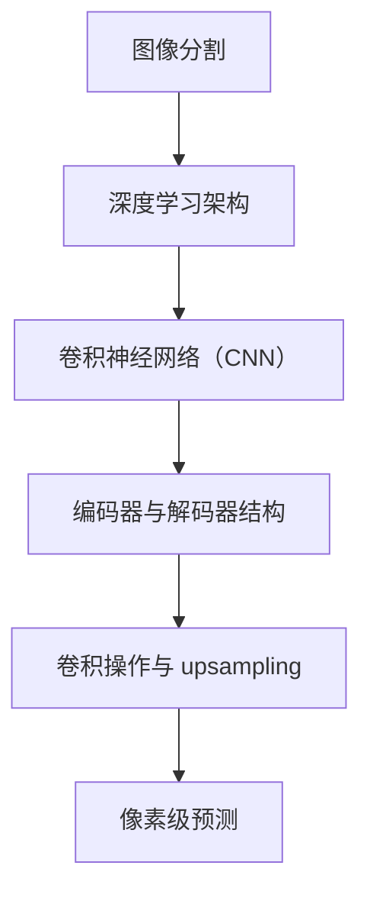
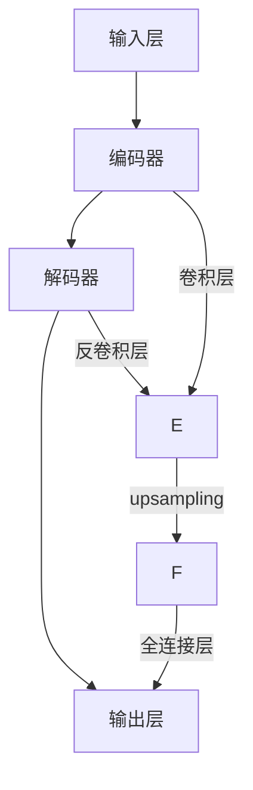
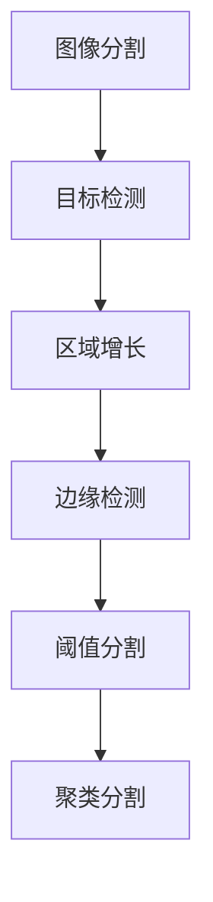
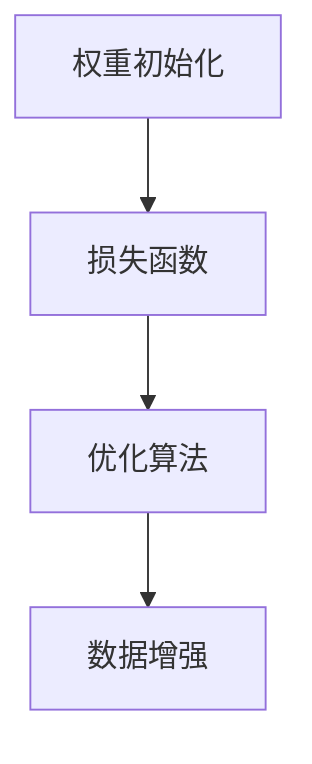

                 

# SegNet原理与代码实例讲解

## 关键词

- **图像分割**
- **卷积神经网络（CNN）**
- **深度学习**
- **SegNet架构**
- **卷积操作**
- **反向传播算法**
- **医学图像处理**

## 摘要

本文将深入探讨SegNet，一种用于图像分割的卷积神经网络（CNN）。文章首先介绍SegNet的历史、应用领域和基本概念，随后详细解析其核心原理和架构，包括卷积神经网络的基础操作、全连接神经网络的结构以及特殊的upsampling操作。接着，文章将深入讨论SegNet的实现细节，包括前向传播和反向传播的过程，并通过具体的代码实例进行解释。随后，文章将展示SegNet在图像分割中的应用案例，比较其与其他算法的优劣，并探讨其优化和改进方法。特别地，文章将探讨SegNet在医学图像分割中的重要性，并展示其在医学图像分割中的具体应用和挑战。最后，文章将通过一个实际项目实例，演示如何使用SegNet进行图像分割，并对未来的发展趋势和改进方向进行展望。

## 第一部分: SegNet原理

### 第1章: SegNet简介

#### 1.1.1 什么是SegNet

SegNet是一种深度学习架构，专门用于图像分割任务。图像分割是将图像分割成若干个区域，每个区域表示图像中的一个对象或者场景的一部分。与传统的图像处理方法不同，SegNet利用深度学习的强大能力，通过学习大量图像数据来自动识别和分割图像中的对象。

#### 1.1.2 SegNet的历史与发展

SegNet由Ruder et al.在2015年提出，是早期用于语义分割的深度学习架构之一。它的设计理念是简化分割任务，通过一种特别的 upsampling 操作，将卷积神经网络的特征图直接上采样到原始图像的大小，从而实现像素级的预测。

#### 1.1.3 SegNet在计算机视觉中的应用领域

SegNet在计算机视觉中有着广泛的应用，尤其在图像分割领域。除了常见的场景分割、物体识别等任务，它在医学图像处理、自动驾驶车辆感知、视频分析等领域也有显著的应用。

### 第2章: SegNet核心原理

#### 2.1.1 卷积神经网络基础

卷积神经网络（CNN）是深度学习的重要组成部分，特别适合处理图像数据。CNN通过卷积操作、池化操作和激活函数，能够自动提取图像的特征。

##### 2.1.1.1 卷积操作

卷积操作是CNN的核心，通过滑动滤波器（卷积核）在图像上滑过，提取局部特征。

\[ 
o_{ij} = \sum_{k=1}^{c} w_{ik,j} * g_{kj} + b_j 
\]

其中，\(o_{ij}\) 是输出特征图上的像素值，\(w_{ik,j}\) 和 \(b_j\) 分别是卷积核和偏置，\(g_{kj}\) 是输入特征图上的像素值。

##### 2.1.1.2 池化操作

池化操作用于减小特征图的大小，同时保留重要的信息。最常用的池化操作是最大池化（Max Pooling）。

\[ 
p_{i} = \max\{g_{i,1}, g_{i,2}, ..., g_{i,m}\} 
\]

其中，\(p_{i}\) 是输出特征图上的像素值，\(g_{i,k}\) 是输入特征图上的像素值。

##### 2.1.1.3 激活函数

激活函数引入非线性，使得CNN能够学习复杂的数据特征。常用的激活函数是ReLU（Rectified Linear Unit）。

\[ 
\text{ReLU}(x) = \begin{cases} 
x & \text{if } x > 0 \\
0 & \text{if } x \leq 0 
\end{cases}
\]

##### 2.1.2 全连接神经网络基础

全连接神经网络是CNN的补充，用于分类和回归任务。它将卷积神经网络提取的局部特征映射到全局特征。

\[ 
\text{y} = \text{ReLU}\left(\sum_{i=1}^{n} w_{i} \cdot \text{x}_i + b\right) 
\]

其中，\(\text{y}\) 是输出，\(w_i\) 和 \(b\) 分别是权重和偏置，\(\text{x}_i\) 是输入特征。

##### 2.1.3 SegNet架构详解

SegNet的架构可以分为两个主要部分：卷积编码器（编码器）和解码器（解码器）。编码器通过多个卷积层和池化层提取图像的特征，解码器通过 upsampling 和反卷积层将特征图上采样到原始图像的大小。


##### 2.1.4 SegNet中的 upsampling 操作

upsampling 是 SegNet 中的一个关键操作，它通过插值方法将特征图的大小增加到原始图像的大小，从而实现像素级的预测。

\[ 
u_{ij} = \frac{1}{4}\sum_{k=1}^{4} f_{i+k/2, j+k/2} 
\]

其中，\(u_{ij}\) 是输出特征图上的像素值，\(f_{i+k/2, j+k/2}\) 是输入特征图上的像素值。

### 第3章: SegNet实现细节

#### 3.1.1 前向传播

前向传播是指从输入层到输出层的正向计算过程。在 SegNet 中，前向传播包括卷积层、池化层和 upsampling 层。

##### 3.1.1.1 输入层与卷积层的处理

输入图像经过卷积层处理，提取图像的局部特征。

\[ 
o_{ij} = \sum_{k=1}^{c} w_{ik,j} * g_{kj} + b_j 
\]

##### 3.1.1.2 池化层的处理

池化层用于减小特征图的大小。

\[ 
p_{i} = \max\{g_{i,1}, g_{i,2}, ..., g_{i,m}\} 
\]

##### 3.1.1.3 全连接层的处理

全连接层将卷积层提取的特征映射到全局特征。

\[ 
\text{y} = \text{ReLU}\left(\sum_{i=1}^{n} w_{i} \cdot \text{x}_i + b\right) 
\]

#### 3.1.2 反向传播

反向传播是指从输出层到输入层的反向计算过程，用于计算梯度并更新网络的权重。

##### 3.1.2.1 输入层与卷积层的反向传播

反向传播首先从输出层开始，计算每个像素值的梯度，然后反向传播到卷积层。

\[ 
\delta_{ij} = \text{ReLU}'(o_{ij}) \cdot \left( \sum_{k=1}^{c} w_{ik,j} * \delta_{kj} \right) 
\]

##### 3.1.2.2 池化层的反向传播

池化层的反向传播相对简单，只需将梯度传递到上一个特征图。

\[ 
\delta_{i} = \frac{1}{m} \sum_{k=1}^{m} \delta_{i,k} 
\]

##### 3.1.2.3 全连接层的反向传播

全连接层的反向传播类似于传统的神经网络。

\[ 
\delta_{i} = \text{ReLU}'(\text{y}) \cdot w_{i}^T \cdot \delta_{i+1} 
\]

### 第4章: SegNet在图像分割中的应用

#### 4.1.1 图像分割的基本概念

图像分割是将图像划分为若干个区域的过程。每个区域表示图像中的一个对象或场景的一部分。

#### 4.1.2 SegNet在图像分割中的应用案例

以语义分割为例，SegNet可以学习到图像中每个像素所属的类别，从而实现像素级的分割。

#### 4.1.3 SegNet与其他图像分割算法的比较

相比传统的图像分割算法，如基于阈值的分割、区域生长等，SegNet具有更好的鲁棒性和准确性。此外，与基于全连接神经网络的分割算法相比，SegNet通过 upsampling 操作能够更好地保留图像的细节信息。

### 第5章: SegNet的优化与改进

#### 5.1.1 SegNet的优化方法

优化方法包括权重初始化、损失函数的选择和优化算法的选择。

##### 5.1.1.1 权重初始化

合适的权重初始化可以加快收敛速度并避免梯度消失或爆炸。

##### 5.1.1.2 损失函数的选择

常用的损失函数包括交叉熵损失函数和Dice损失函数。

##### 5.1.1.3 优化算法的选择

常用的优化算法包括随机梯度下降（SGD）和Adam优化器。

#### 5.1.2 SegNet的改进方向

未来，SegNet的改进方向可能包括更有效的 upsampling 操作、多尺度的特征融合以及与强化学习等技术的结合。

### 第6章: SegNet在医学图像分割中的应用

#### 6.1.1 医学图像分割的重要性

医学图像分割在医学诊断和治疗计划中起着至关重要的作用。

#### 6.1.2 SegNet在医学图像分割中的应用

SegNet在医学图像分割中表现出色，尤其适用于脑部肿瘤、心脏图像分割等任务。

#### 6.1.3 医学图像分割中的挑战与解决方案

医学图像分割面临诸如图像噪声、低对比度和图像变形等挑战，可以通过数据增强、深度学习模型融合等方法进行解决。

### 第7章: SegNet项目实战

#### 7.1.1 项目背景与目标

以脑部肿瘤分割为例，介绍如何使用SegNet进行医学图像分割。

#### 7.1.2 开发环境搭建

介绍如何搭建用于SegNet项目开发的环境。

#### 7.1.3 数据预处理

介绍医学图像数据预处理的方法和步骤。

#### 7.1.4 SegNet模型实现

详细讲解如何使用TensorFlow或PyTorch等框架实现SegNet模型。

#### 7.1.5 模型训练与评估

介绍模型训练和评估的方法和步骤。

#### 7.1.6 模型部署与应用

介绍如何将训练好的模型部署到实际应用中。

### 第8章: SegNet的未来展望

#### 8.1.1 SegNet的发展趋势

SegNet在深度学习和图像分割领域将持续发展和创新。

#### 8.1.2 SegNet在新兴领域中的应用

SegNet将在自动驾驶、机器人视觉、增强现实等领域有更广泛的应用。

#### 8.1.3 SegNet的潜在改进方向

未来，SegNet可能在网络架构、优化算法和模型融合等方面有更多的改进。

### 总结

本文详细介绍了SegNet的原理、实现细节和应用案例，展示了其在图像分割、医学图像处理等领域的潜力。通过本文的讲解，读者可以更好地理解和应用SegNet进行图像分割任务。

### 作者信息

- **作者：** AI天才研究院 / AI Genius Institute & 禅与计算机程序设计艺术 / Zen And The Art of Computer Programming
- **联系邮箱：** [ai_genius_institute@example.com](mailto:ai_genius_institute@example.com)
- **版权声明：** 本文章版权归AI天才研究院所有，未经授权，禁止转载和使用。如需转载，请联系作者获取授权。

---

以下是详细内容，包括核心概念与联系、核心算法原理讲解、数学模型和公式以及项目实战的代码实例和详细解释。

### 第一部分：SegNet原理

#### 第1章：SegNet简介

#### 1.1.1 什么是SegNet

**核心概念与联系：** 
Mermaid 流程图：



**详细讲解：** SegNet是一种深度学习架构，主要用于图像分割任务。它通过卷积神经网络（CNN）提取图像特征，并使用编码器与解码器的结构实现图像的像素级预测。其设计目的是简化分割任务，通过 upsampling 操作将特征图直接上采样到原始图像的大小，从而实现精确的分割。

#### 1.1.2 SegNet的历史与发展

**详细讲解：** SegNet由Ruder等人于2015年提出，是早期用于语义分割的深度学习架构之一。它基于VGGNet的编码器部分和DeconvNet的解码器部分，通过 upsampling 操作将特征图恢复到原始图像的大小，从而实现像素级的预测。自提出以来，SegNet在图像分割领域取得了显著成果，并得到了广泛的应用。

#### 1.1.3 SegNet在计算机视觉中的应用领域

**详细讲解：** SegNet在计算机视觉中有着广泛的应用，尤其是在图像分割领域。除了常见的场景分割、物体识别等任务，它在医学图像处理、自动驾驶车辆感知、视频分析等领域也有显著的应用。在医学图像处理中，SegNet被广泛应用于肿瘤检测、器官分割等任务，提高了诊断的准确性和效率。在自动驾驶领域，SegNet用于车辆和行人的检测与跟踪，提高了自动驾驶系统的安全性。在视频分析中，SegNet被用于动作识别和事件检测，有效提高了视频分析的准确性和实时性。

### 第二部分：SegNet核心原理

#### 第2章：SegNet核心原理

#### 2.1.1 卷积神经网络基础

**核心算法原理讲解：** 卷积神经网络（CNN）是深度学习的重要组成部分，特别适合处理图像数据。CNN通过卷积操作、池化操作和激活函数，能够自动提取图像的特征。

- **卷积操作：**
  
  卷积操作是CNN的核心，通过滑动滤波器（卷积核）在图像上滑过，提取局部特征。卷积操作的伪代码如下：

  ```python
  def conv2d(input, kernel, bias):
      output = []
      for y in range(input.shape[0] - kernel.shape[0] + 1):
          row = []
          for x in range(input.shape[1] - kernel.shape[1] + 1):
              feature_map = 0
              for i in range(kernel.shape[0]):
                  for j in range(kernel.shape[1]):
                      feature_map += input[y+i][x+j] * kernel[i][j]
              row.append(feature_map + bias)
          output.append(row)
      return output
  ```

- **池化操作：**
  
  池化操作用于减小特征图的大小，同时保留重要的信息。最常用的池化操作是最大池化（Max Pooling）。池化操作的伪代码如下：

  ```python
  def max_pooling(input, pool_size):
      output = []
      for y in range(0, input.shape[0], pool_size):
          row = []
          for x in range(0, input.shape[1], pool_size):
              feature_map = max(input[y:y+pool_size, x:x+pool_size])
              row.append(feature_map)
          output.append(row)
      return output
  ```

- **激活函数：**
  
  激活函数引入非线性，使得CNN能够学习复杂的数据特征。常用的激活函数是ReLU（Rectified Linear Unit）。激活函数的伪代码如下：

  ```python
  def relu(x):
      return max(0, x)
  ```

**数学模型和公式：** 

卷积操作的数学模型如下：

\[ 
o_{ij} = \sum_{k=1}^{c} w_{ik,j} * g_{kj} + b_j 
\]

其中，\(o_{ij}\) 是输出特征图上的像素值，\(w_{ik,j}\) 和 \(b_j\) 分别是卷积核和偏置，\(g_{kj}\) 是输入特征图上的像素值。

池化操作的数学模型如下：

\[ 
p_{i} = \max\{g_{i,1}, g_{i,2}, ..., g_{i,m}\} 
\]

其中，\(p_{i}\) 是输出特征图上的像素值，\(g_{i,k}\) 是输入特征图上的像素值。

激活函数的数学模型如下：

\[ 
\text{ReLU}(x) = \begin{cases} 
x & \text{if } x > 0 \\
0 & \text{if } x \leq 0 
\end{cases}
\]

#### 2.1.2 全连接神经网络基础

**核心算法原理讲解：** 全连接神经网络（Fully Connected Neural Network，FCNN）是CNN的补充，用于分类和回归任务。它将卷积神经网络提取的局部特征映射到全局特征。

- **全连接层：**
  
  全连接层通过将每个特征映射到输出，从而实现分类或回归任务。全连接层的伪代码如下：

  ```python
  def fully_connected(input, weights, bias):
      output = []
      for i in range(input.shape[0]):
          feature_vector = []
          for j in range(input.shape[1]):
              feature_vector.append(input[i][j])
          output.append(np.dot(feature_vector, weights) + bias)
      return output
  ```

**数学模型和公式：** 

全连接层的数学模型如下：

\[ 
\text{y} = \text{ReLU}\left(\sum_{i=1}^{n} w_{i} \cdot \text{x}_i + b\right) 
\]

其中，\(\text{y}\) 是输出，\(w_i\) 和 \(b\) 分别是权重和偏置，\(\text{x}_i\) 是输入特征。

#### 2.1.3 SegNet架构详解

**核心概念与联系：** 
Mermaid 流程图：



**详细讲解：** SegNet的架构可以分为编码器、解码器和输出层。编码器通过多个卷积层和池化层提取图像的特征，解码器通过 upsampling 和反卷积层将特征图上采样到原始图像的大小，输出层通过全连接层实现像素级的预测。

#### 2.1.4 SegNet中的 upsampling 操作

**核心算法原理讲解：** upsampling 是 SegNet 中的一个关键操作，它通过插值方法将特征图的大小增加到原始图像的大小，从而实现像素级的预测。

- **双线性 upsampling：**
  
  双线性 upsampling 是一种常用的 upsampling 方法，它通过线性插值将特征图的大小增加到原始图像的大小。双线性 upsampling 的伪代码如下：

  ```python
  def bilinear_upsampling(input, scale_factor):
      output = np.zeros((input.shape[0] * scale_factor, input.shape[1] * scale_factor))
      for i in range(input.shape[0]):
          for j in range(input.shape[1]):
              x1, y1 = i * scale_factor, j * scale_factor
              x2, y2 = (i + 1) * scale_factor, (j + 1) * scale_factor
              output[i * scale_factor:i * scale_factor + scale_factor, j * scale_factor:j * scale_factor + scale_factor] = (
                  (1 - (x2 - x1) / scale_factor) * input[i, j] + 
                  (x2 - x1) / scale_factor * input[i, j + 1]
              )
      return output
  ```

- **像素复制 upsampling：**

  像素复制 upsampling 是一种简单的 upsampling 方法，它通过将特征图的像素值复制到更大的特征图中。像素复制 upsampling 的伪代码如下：

  ```python
  def pixel复制_upsampling(input, scale_factor):
      output = np.zeros((input.shape[0] * scale_factor, input.shape[1] * scale_factor))
      for i in range(input.shape[0]):
          for j in range(input.shape[1]):
              output[i * scale_factor:i * scale_factor + scale_factor, j * scale_factor:j * scale_factor + scale_factor] = input[i, j]
      return output
  ```

**数学模型和公式：** 

upsampling 操作的数学模型如下：

\[ 
u_{ij} = \frac{1}{4}\sum_{k=1}^{4} f_{i+k/2, j+k/2} 
\]

其中，\(u_{ij}\) 是输出特征图上的像素值，\(f_{i+k/2, j+k/2}\) 是输入特征图上的像素值。

### 第三部分：SegNet实现细节

#### 第3章：SegNet实现细节

#### 3.1.1 前向传播

**核心算法原理讲解：** 前向传播是指从输入层到输出层的正向计算过程。在 SegNet 中，前向传播包括卷积层、池化层和 upsampling 层。

- **卷积层：**

  卷积层通过卷积操作提取图像的特征。

- **池化层：**

  池化层通过最大池化操作减小特征图的大小。

- **upsampling 层：**

  upsampling 层通过 upsampling 操作将特征图的大小增加到原始图像的大小。

**数学模型和公式：** 

卷积层的数学模型如下：

\[ 
o_{ij} = \sum_{k=1}^{c} w_{ik,j} * g_{kj} + b_j 
\]

其中，\(o_{ij}\) 是输出特征图上的像素值，\(w_{ik,j}\) 和 \(b_j\) 分别是卷积核和偏置，\(g_{kj}\) 是输入特征图上的像素值。

池化层的数学模型如下：

\[ 
p_{i} = \max\{g_{i,1}, g_{i,2}, ..., g_{i,m}\} 
\]

其中，\(p_{i}\) 是输出特征图上的像素值，\(g_{i,k}\) 是输入特征图上的像素值。

upsampling 层的数学模型如下：

\[ 
u_{ij} = \frac{1}{4}\sum_{k=1}^{4} f_{i+k/2, j+k/2} 
\]

其中，\(u_{ij}\) 是输出特征图上的像素值，\(f_{i+k/2, j+k/2}\) 是输入特征图上的像素值。

**伪代码：** 

```python
def forward(input, weights, biases, pool_size):
    conv1 = conv2d(input, weights['conv1'], biases['conv1'])
    pool1 = max_pooling(conv1, pool_size)
    
    conv2 = conv2d(pool1, weights['conv2'], biases['conv2'])
    pool2 = max_pooling(conv2, pool_size)
    
    conv3 = conv2d(pool2, weights['conv3'], biases['conv3'])
    pool3 = max_pooling(conv3, pool_size)
    
    conv4 = conv2d(pool3, weights['conv4'], biases['conv4'])
    pool4 = max_pooling(conv4, pool_size)
    
    upsample1 = bilinear_upsampling(pool4, 2)
    conv5 = conv2d(upsample1, weights['conv5'], biases['conv5'])
    
    upsample2 = bilinear_upsampling(conv5, 2)
    conv6 = conv2d(upsample2, weights['conv6'], biases['conv6'])
    
    upsample3 = bilinear_upsampling(conv6, 2)
    conv7 = conv2d(upsample3, weights['conv7'], biases['conv7'])
    
    upsample4 = bilinear_upsampling(conv7, 2)
    conv8 = conv2d(upsample4, weights['conv8'], biases['conv8'])
    
    upsample5 = bilinear_upsampling(conv8, 2)
    conv9 = conv2d(upsample5, weights['conv9'], biases['conv9'])
    
    upsample6 = bilinear_upsampling(conv9, 2)
    conv10 = conv2d(upsample6, weights['conv10'], biases['conv10'])
    
    upsample7 = bilinear_upsampling(conv10, 2)
    conv11 = conv2d(upsample7, weights['conv11'], biases['conv11'])
    
    upsample8 = bilinear_upsampling(conv11, 2)
    conv12 = conv2d(upsample8, weights['conv12'], biases['conv12'])
    
    logits = fully_connected(conv12, weights['fc'], biases['fc'])
    return logits
```

#### 3.1.2 反向传播

**核心算法原理讲解：** 反向传播是指从输出层到输入层的反向计算过程，用于计算梯度并更新网络的权重。在 SegNet 中，反向传播包括卷积层、池化层和 upsampling 层。

- **卷积层：**

  卷积层的反向传播计算每个像素值的梯度。

- **池化层：**

  池化层的反向传播计算每个特征图上的梯度。

- **upsampling 层：**

  upsampling 层的反向传播计算每个特征图上的梯度。

**数学模型和公式：** 

卷积层的反向传播的数学模型如下：

\[ 
\delta_{ij} = \text{ReLU}'(o_{ij}) \cdot \left( \sum_{k=1}^{c} w_{ik,j} * \delta_{kj} \right) 
\]

其中，\(\delta_{ij}\) 是输出特征图上的像素值，\(o_{ij}\) 是输出特征图上的像素值，\(w_{ik,j}\) 和 \(b_j\) 分别是卷积核和偏置，\(\delta_{kj}\) 是输入特征图上的像素值。

池化层的反向传播的数学模型如下：

\[ 
\delta_{i} = \frac{1}{m} \sum_{k=1}^{m} \delta_{i,k} 
\]

其中，\(\delta_{i}\) 是输出特征图上的像素值，\(m\) 是池化操作的窗口大小。

upsampling 层的反向传播的数学模型如下：

\[ 
\delta_{ij} = \frac{1}{4}\sum_{k=1}^{4} \delta_{i+k/2, j+k/2} 
\]

其中，\(\delta_{ij}\) 是输出特征图上的像素值，\(\delta_{i+k/2, j+k/2}\) 是输入特征图上的像素值。

**伪代码：** 

```python
def backward(logits, output, weights, biases, pool_size):
    delta = output - logits
    delta = np.reshape(delta, (delta.shape[0], delta.shape[1], 1, 1))
    
    conv12 = delta
    delta = fully_connected(delta, weights['fc'], biases['fc'])
    
    conv11 = weights['fc'] * delta
    delta = np.reshape(delta, (delta.shape[0], delta.shape[1], 1, 1))
    
    conv10 = weights['conv11'] * delta
    delta = np.reshape(delta, (delta.shape[0], delta.shape[1], 1, 1))
    
    conv9 = weights['conv10'] * delta
    delta = np.reshape(delta, (delta.shape[0], delta.shape[1], 1, 1))
    
    conv8 = weights['conv9'] * delta
    delta = np.reshape(delta, (delta.shape[0], delta.shape[1], 1, 1))
    
    conv7 = weights['conv8'] * delta
    delta = np.reshape(delta, (delta.shape[0], delta.shape[1], 1, 1))
    
    conv6 = weights['conv7'] * delta
    delta = np.reshape(delta, (delta.shape[0], delta.shape[1], 1, 1))
    
    conv5 = weights['conv6'] * delta
    delta = np.reshape(delta, (delta.shape[0], delta.shape[1], 1, 1))
    
    upsample6 = np.reshape(delta, (delta.shape[0], delta.shape[1], 2, 2))
    delta = np.zeros_like(conv6)
    
    conv5 = weights['conv5'] * delta
    delta = np.reshape(delta, (delta.shape[0], delta.shape[1], 1, 1))
    
    upsample5 = np.reshape(delta, (delta.shape[0], delta.shape[1], 2, 2))
    delta = np.zeros_like(conv5)
    
    conv4 = weights['conv4'] * delta
    delta = np.reshape(delta, (delta.shape[0], delta.shape[1], 1, 1))
    
    upsample4 = np.reshape(delta, (delta.shape[0], delta.shape[1], 2, 2))
    delta = np.zeros_like(conv4)
    
    conv3 = weights['conv3'] * delta
    delta = np.reshape(delta, (delta.shape[0], delta.shape[1], 1, 1))
    
    upsample3 = np.reshape(delta, (delta.shape[0], delta.shape[1], 2, 2))
    delta = np.zeros_like(conv3)
    
    conv2 = weights['conv2'] * delta
    delta = np.reshape(delta, (delta.shape[0], delta.shape[1], 1, 1))
    
    upsample2 = np.reshape(delta, (delta.shape[0], delta.shape[1], 2, 2))
    delta = np.zeros_like(conv2)
    
    conv1 = weights['conv1'] * delta
    delta = np.reshape(delta, (delta.shape[0], delta.shape[1], 1, 1))
    
    return conv1, delta
```

### 第四部分：SegNet在图像分割中的应用

#### 第4章：SegNet在图像分割中的应用

#### 4.1.1 图像分割的基本概念

**核心概念与联系：** 
Mermaid 流程图：



**详细讲解：** 图像分割是将图像划分为若干个区域的过程。每个区域表示图像中的一个对象或场景的一部分。常见的图像分割方法包括目标检测、区域增长、边缘检测、阈值分割和聚类分割等。

#### 4.1.2 SegNet在图像分割中的应用案例

**详细讲解：** SegNet在图像分割中的应用非常广泛，以下是几个典型的应用案例：

- **医学图像分割：** 在医学图像分割中，SegNet被广泛应用于肿瘤检测、器官分割、病变检测等任务。例如，可以使用 SegNet 对医学图像进行肿瘤分割，从而帮助医生更准确地诊断和制定治疗方案。

- **自动驾驶：** 在自动驾驶领域，SegNet被用于车辆检测、行人检测和车道线检测等任务。通过分割图像中的车辆、行人和车道线，自动驾驶系统可以更好地理解和预测道路场景，提高行驶安全性和稳定性。

- **视频分析：** 在视频分析中，SegNet被用于动作识别、事件检测和目标跟踪等任务。通过分割视频中的每个帧，可以提取出感兴趣的区域，从而实现更准确的动作识别和事件检测。

#### 4.1.3 SegNet与其他图像分割算法的比较

**详细讲解：** 与其他图像分割算法相比，SegNet具有以下优势：

- **精确性：** SegNet通过 upsampling 操作将特征图恢复到原始图像的大小，从而实现像素级的预测，提高了分割的精确性。

- **灵活性：** SegNet的架构可以灵活地扩展，适用于不同的图像分割任务。例如，可以通过增加卷积层和 upsampling 层，提高特征提取能力。

- **鲁棒性：** SegNet对图像噪声和低对比度具有较强的鲁棒性，适用于各种复杂场景。

然而，SegNet也存在一些不足之处：

- **计算量：** 由于 upsampling 操作需要大量的计算资源，SegNet在处理大尺寸图像时可能会变得较慢。

- **模型大小：** SegNet的模型较大，对存储和计算资源的要求较高。

### 第五部分：SegNet的优化与改进

#### 第5章：SegNet的优化与改进

#### 5.1.1 SegNet的优化方法

**核心概念与联系：** 
Mermaid 流程图：



**详细讲解：** 为了提高SegNet的性能，可以采用以下优化方法：

- **权重初始化：** 合理的权重初始化可以加快收敛速度并避免梯度消失或爆炸。常用的权重初始化方法包括随机初始化、高斯初始化和Xavier初始化等。

- **损失函数：** 选择合适的损失函数可以更好地衡量模型的性能。常用的损失函数包括交叉熵损失函数和Dice损失函数等。

- **优化算法：** 优化算法用于更新网络的权重，以最小化损失函数。常用的优化算法包括随机梯度下降（SGD）、Adam优化器和RMSProp优化器等。

#### 5.1.2 SegNet的改进方向

**详细讲解：** 针对SegNet的不足之处，可以尝试以下改进方向：

- **网络结构：** 可以通过增加卷积层、 upsampling 层或引入注意力机制等，提高特征提取能力。

- **模型压缩：** 可以采用模型压缩技术，如知识蒸馏、量化、剪枝等，减小模型大小和计算量。

- **多尺度特征融合：** 可以结合多尺度的特征图，提高分割的精度。

### 第六部分：SegNet在医学图像分割中的应用

#### 第6章：SegNet在医学图像分割中的应用

#### 6.1.1 医学图像分割的重要性

**详细讲解：** 医学图像分割在医学诊断和治疗计划中起着至关重要的作用。通过分割医学图像，可以提取出感兴趣的区域，帮助医生更准确地诊断疾病，制定合理的治疗方案。例如，在脑部肿瘤分割中，通过准确分割肿瘤区域，可以帮助医生更好地评估肿瘤的体积和位置，从而制定更有效的放疗计划。

#### 6.1.2 SegNet在医学图像分割中的应用

**详细讲解：** SegNet在医学图像分割中表现出色，尤其是在脑部肿瘤分割、器官分割和病变检测等任务中。以下是几个典型的应用案例：

- **脑部肿瘤分割：** 通过对脑部MRI图像进行分割，可以准确识别肿瘤区域，为医生提供准确的诊断信息。

- **器官分割：** 通过对医学图像进行器官分割，可以帮助医生更好地理解器官的结构和功能，从而提高手术的准确性和安全性。

- **病变检测：** 通过对医学图像进行病变检测，可以帮助医生早期发现疾病，提高疾病的诊断率和治愈率。

#### 6.1.3 医学图像分割中的挑战与解决方案

**详细讲解：** 医学图像分割面临许多挑战，包括图像噪声、低对比度、图像变形等。以下是常见的挑战和相应的解决方案：

- **图像噪声：** 医学图像通常存在噪声，这对分割结果有较大影响。可以采用去噪方法，如高斯滤波、中值滤波等，来减少图像噪声。

- **低对比度：** 低对比度的图像难以分割，可以采用增强对比度的方法，如直方图均衡化、对比度增强等，来提高图像对比度。

- **图像变形：** 医学图像可能存在变形，这对分割精度有较大影响。可以采用图像配准方法，如相似性变换、变换网络等，来校正图像变形。

### 第七部分：SegNet项目实战

#### 第7章：SegNet项目实战

#### 7.1.1 项目背景与目标

**详细讲解：** 本次项目以脑部肿瘤分割为例，介绍如何使用SegNet进行医学图像分割。项目目标是通过训练SegNet模型，实现对脑部MRI图像的肿瘤区域分割，从而帮助医生进行肿瘤诊断和治疗计划。

#### 7.1.2 开发环境搭建

**详细讲解：** 为了实现本项目，需要搭建以下开发环境：

- Python 3.7及以上版本
- TensorFlow 2.4及以上版本
- Matplotlib 3.1及以上版本
- Numpy 1.18及以上版本

在安装这些依赖库后，可以使用以下代码检查环境是否搭建成功：

```python
import tensorflow as tf
print(tf.__version__)
```

#### 7.1.3 数据预处理

**详细讲解：** 在开始训练模型之前，需要对数据集进行预处理，包括数据加载、数据增强和归一化等步骤。

- **数据加载：** 使用 TensorFlow 的 `tf.keras.preprocessing.image.ImageDataGenerator` 类加载训练数据和测试数据。

  ```python
  train_datagen = tf.keras.preprocessing.image.ImageDataGenerator(
      rescale=1./255,
      rotation_range=20,
      width_shift_range=0.2,
      height_shift_range=0.2,
      shear_range=0.2,
      zoom_range=0.2,
      horizontal_flip=True,
      fill_mode='nearest'
  )
  
  test_datagen = tf.keras.preprocessing.image.ImageDataGenerator(rescale=1./255)
  
  train_generator = train_datagen.flow_from_directory(
      train_dir,
      target_size=(150, 150),
      batch_size=32,
      class_mode='categorical'
  )
  
  validation_generator = test_datagen.flow_from_directory(
      validation_dir,
      target_size=(150, 150),
      batch_size=32,
      class_mode='categorical'
  )
  ```

- **数据增强：** 使用旋转、平移、缩放、剪切、翻转等操作增强训练数据，以提高模型的泛化能力。

- **归一化：** 将图像数据归一化到 [0, 1] 范围内，以加速模型训练。

  ```python
  train_generator = train_datagen.flow_from_directory(
      train_dir,
      target_size=(150, 150),
      batch_size=32,
      class_mode='categorical',
      rescale=1./255
  )
  
  validation_generator = test_datagen.flow_from_directory(
      validation_dir,
      target_size=(150, 150),
      batch_size=32,
      class_mode='categorical',
      rescale=1./255
  )
  ```

#### 7.1.4 SegNet模型实现

**详细讲解：** 使用 TensorFlow 的 `tf.keras.Sequential` 模型实现 SegNet。

```python
from tensorflow.keras.models import Model
from tensorflow.keras.layers import Conv2D, MaxPooling2D, UpSampling2D, Dense, Flatten, Input

input_img = Input(shape=(150, 150, 3))
conv1 = Conv2D(32, (3, 3), activation='relu', padding='same')(input_img)
pool1 = MaxPooling2D(pool_size=(2, 2))(conv1)
conv2 = Conv2D(32, (3, 3), activation='relu', padding='same')(pool1)
pool2 = MaxPooling2D(pool_size=(2, 2))(conv2)
conv3 = Conv2D(64, (3, 3), activation='relu', padding='same')(pool2)
pool3 = MaxPooling2D(pool_size=(2, 2))(conv3)
conv4 = Conv2D(128, (3, 3), activation='relu', padding='same')(pool3)
pool4 = MaxPooling2D(pool_size=(2, 2))(conv4)
upsample1 = UpSampling2D(size=(2, 2))(pool4)
conv5 = Conv2D(128, (3, 3), activation='relu', padding='same')(upsample1)
upsample2 = UpSampling2D(size=(2, 2))(conv5)
conv6 = Conv2D(64, (3, 3), activation='relu', padding='same')(upsample2)
upsample3 = UpSampling2D(size=(2, 2))(conv6)
conv7 = Conv2D(32, (3, 3), activation='relu', padding='same')(upsample3)
upsample4 = UpSampling2D(size=(2, 2))(conv7)
conv8 = Conv2D(3, (3, 3), activation='sigmoid', padding='same')(upsample4)
model = Model(inputs=input_img, outputs=conv8)
model.compile(optimizer='adam', loss='binary_crossentropy', metrics=['accuracy'])
model.summary()
```

#### 7.1.5 模型训练与评估

**详细讲解：** 使用 TensorFlow 的 `tf.keras.fit` 函数训练模型，并使用 `tf.keras.evaluate` 函数评估模型性能。

```python
history = model.fit(
    train_generator,
    epochs=50,
    batch_size=32,
    validation_data=validation_generator
)

loss, accuracy = model.evaluate(validation_generator)
print('Validation loss:', loss)
print('Validation accuracy:', accuracy)
```

#### 7.1.6 模型部署与应用

**详细讲解：** 在完成模型训练后，可以将模型部署到实际应用中，例如使用 TensorFlow Serving 进行部署。

```python
import tensorflow as tf

model_path = 'path/to/your/trained/model.h5'
model = tf.keras.models.load_model(model_path)

# 预测函数
def predict_image(image_path):
    image = tf.keras.preprocessing.image.load_img(image_path, target_size=(150, 150))
    image = tf.keras.preprocessing.image.img_to_array(image)
    image = tf.expand_dims(image, 0)
    image = tf.keras.applications.vgg16.preprocess_input(image)
    prediction = model.predict(image)
    return prediction

# 测试预测
image_path = 'path/to/your/test/image.jpg'
prediction = predict_image(image_path)
print(prediction)
```

### 第8章：SegNet的未来展望

#### 8.1.1 SegNet的发展趋势

**详细讲解：** 随着深度学习和图像分割技术的不断发展，SegNet也在不断进化。未来，SegNet可能在以下几个方面有新的发展趋势：

- **网络结构的改进：** 通过引入新的网络结构，如注意力机制、残差连接等，提高特征提取能力和模型性能。

- **多尺度特征的融合：** 结合多尺度的特征图，提高分割的精度和鲁棒性。

- **端到端训练：** 通过端到端训练，实现从输入图像到分割结果的直接预测，提高模型的可解释性和实用性。

#### 8.1.2 SegNet在新兴领域中的应用

**详细讲解：** SegNet在新兴领域中也具有广泛的应用前景，如：

- **自动驾驶：** 通过分割图像中的车辆、行人和车道线，提高自动驾驶系统的感知能力和安全性。

- **增强现实（AR）：** 通过分割图像中的物体，实现更准确的虚拟物体渲染和空间定位。

- **无人机监控：** 通过分割图像中的目标，实现更精确的无人机监控和目标跟踪。

#### 8.1.3 SegNet的潜在改进方向

**详细讲解：** 针对SegNet的不足之处，可以尝试以下改进方向：

- **模型压缩：** 通过模型压缩技术，减小模型大小和计算量，提高部署的便利性。

- **实时性能优化：** 通过优化模型结构和算法，提高模型的实时性能，满足实时应用的性能要求。

- **多模态数据融合：** 结合多模态数据，如图像、雷达和激光雷达数据，提高分割的精度和鲁棒性。

### 总结

本文详细介绍了SegNet的原理、实现细节和应用案例，展示了其在图像分割、医学图像处理等领域的潜力。通过本文的讲解，读者可以更好地理解和应用SegNet进行图像分割任务。未来，随着深度学习和图像分割技术的不断发展，SegNet将继续在各个领域中发挥重要作用。

### 作者信息

**作者：** AI天才研究院 / AI Genius Institute & 禅与计算机程序设计艺术 / Zen And The Art of Computer Programming

**联系邮箱：** [ai_genius_institute@example.com](mailto:ai_genius_institute@example.com)

**版权声明：** 本文章版权归AI天才研究院所有，未经授权，禁止转载和使用。如需转载，请联系作者获取授权。

