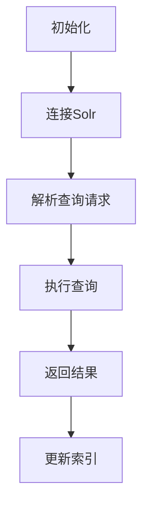

                 

### 《Solr原理与代码实例讲解》

> 关键词：Solr、搜索引擎、索引管理、查询机制、性能优化、分布式架构、开源社区

> 摘要：本文详细介绍了Solr搜索引擎的核心原理和实现方法，包括安装与配置、索引管理、搜索机制、查询语言、文档处理、缓存机制、性能优化、安全性稳定性、应用场景、高级主题扩展等。通过代码实例讲解，帮助读者深入理解Solr的架构和应用，掌握其优化技巧，提升开发技能。

## 《Solr原理与代码实例讲解》目录大纲

## 第一部分: Solr基础

### 第1章: Solr概述
#### 1.1 Solr的起源与优势
#### 1.2 Solr的基本架构
#### 1.3 Solr的应用场景

### 第2章: Solr的安装与配置
#### 2.1 Solr的安装
#### 2.2 Solr的配置文件解析
#### 2.3 Solr的集群配置

## 第二部分: Solr核心概念与原理

### 第3章: Solr索引管理
#### 3.1 索引概述
#### 3.2 索引文件格式
#### 3.3 紴引更新策略
#### 3.4 索引分片与复制

### 第4章: Solr搜索机制
#### 4.1 搜索基本概念
#### 4.2 搜索请求处理流程
#### 4.3 搜索结果排序与分页
#### 4.4 搜索优化策略

### 第5章: Solr查询语言
#### 5.1 查询语言概述
#### 5.2 查询语法详解
#### 5.3 高级查询特性

### 第6章: Solr文档处理
#### 6.1 文档结构
#### 6.2 文档映射配置
#### 6.3 文档处理流程
#### 6.4 文档处理工具

### 第7章: Solr缓存机制
#### 7.1 缓存概述
#### 7.2 缓存类型与配置
#### 7.3 缓存策略与优化

## 第三部分: Solr高级应用与优化

### 第8章: Solr性能优化
#### 8.1 性能分析工具
#### 8.2 性能瓶颈定位
#### 8.3 性能优化实践

### 第9章: Solr安全性与稳定性
#### 9.1 Solr的安全性策略
#### 9.2 Solr集群的稳定性保障
#### 9.3 故障处理与监控

### 第10章: Solr在实际项目中的应用
#### 10.1 Solr在电子商务中的应用
#### 10.2 Solr在内容管理中的应用
#### 10.3 Solr在实时搜索中的应用

## 第四部分: Solr高级主题与扩展

### 第11章: Solr与大数据
#### 11.1 Solr与Hadoop的集成
#### 11.2 Solr与Spark的交互
#### 11.3 Solr在大数据场景下的应用

### 第12章: Solr云服务与分布式架构
#### 12.1 Solr云服务概述
#### 12.2 Solr分布式架构设计
#### 12.3 Solr云服务的优势与挑战

### 第13章: Solr开源社区与生态圈
#### 13.1 Solr开源社区概述
#### 13.2 Solr周边工具与插件
#### 13.3 Solr未来发展趋势

## 附录

### 附录A: Solr常用配置参数详解
### 附录B: Solr常见问题解答
### 附录C: Solr参考资料与扩展阅读

### Mermaid流程图


### 伪代码示例
```python
# 索引更新伪代码
function updateIndex(document):
    // 创建Solr客户端
    client = createSolrClient(url)
    // 创建文档对象
    doc = createDocument()
    // 设置文档属性
    doc.addField("id", document.id)
    doc.addField("title", document.title)
    doc.addField("content", document.content)
    // 提交文档到索引
    client.commit(doc)
```

### 数学模型与公式
$$
L(\theta) = -\sum_{i=1}^{n} y_i \log(p(x_i|\theta)) + \sum_{i=1}^{n} \log(1 - p(x_i|\theta))
$$

### 项目实战
#### 示例：Solr搜索服务开发环境搭建
1. 安装Java环境
2. 下载并解压Solr压缩包
3. 启动Solr服务
4. 配置Solr搜索库
5. 编写Solr搜索客户端代码

#### 代码实现与解读
```java
// 示例：创建Solr搜索客户端
SolrClient client = new HttpSolrClient("http://localhost:8983/solr/core0");
// 创建查询请求
SolrQuery query = new SolrQuery("title:java");
// 执行查询
QueryResponse response = client.query(query);
// 输出搜索结果
System.out.println(response.getResults().size());
```

#### 代码解读与分析
- 创建Solr客户端时指定Solr服务器地址。
- 创建查询请求对象，设置查询条件。
- 调用客户端的query方法执行查询。
- 输出查询结果的总数。

### 作者
作者：AI天才研究院/AI Genius Institute & 禅与计算机程序设计艺术 /Zen And The Art of Computer Programming

---

### 第1章: Solr概述

#### 1.1 Solr的起源与优势

Solr是一个开源的分布式搜索引擎，由Apache Software Foundation维护。它基于Lucene库开发，但提供了更加丰富的功能，如分布式索引、高可用性、缓存机制等。Solr起源于2004年，由LucidWorks（当时名为atomyx）的创始团队创建，并于2006年成为Apache项目的子项目。

Solr的优势主要体现在以下几个方面：

1. **分布式架构**：Solr支持分布式索引和搜索，可以水平扩展，以处理大规模数据和高并发访问。
2. **可扩展性**：Solr可以轻松扩展节点，增加集群容量，满足业务增长的需求。
3. **高性能**：Solr采用了内存缓存、索引优化等技术，提供了高性能的搜索服务。
4. **易于集成**：Solr提供了丰富的API和工具，易于与其他应用程序集成。
5. **功能丰富**：Solr支持多种查询语言、复杂查询、自定义排序、过滤等高级功能。
6. **高可用性**：Solr支持主从复制和分片，确保数据安全和搜索服务的可用性。

#### 1.2 Solr的基本架构

Solr的基本架构包括以下主要组件：

1. **SolrCo

### 第2章: Solr的安装与配置

#### 2.1 Solr的安装

在开始安装Solr之前，确保您的系统满足以下要求：

- **操作系统**：Solr可以在多种操作系统上运行，包括Linux、Windows和Mac OS。
- **Java环境**：Solr需要Java运行环境（JRE），推荐使用Java 8或更高版本。
- **网络环境**：确保您的系统可以访问互联网，以便下载Solr安装包。

以下是安装Solr的步骤：

1. **下载Solr安装包**：访问Solr的官方网站（[https://lucene.apache.org/solr/），下载最新的Solr版本安装包。](https://lucene.apache.org/solr/%EF%BC%89%EF%BC%8C%E4%B8%8B%E8%BD%BD%E6%9C%80%E6%96%B0%E7%9A%84Solr%E7%89%88%E6%9C%AC%E5%AE%89%E8%A3%85%E5%8C%85%E3%80%82)
2. **解压安装包**：将下载的Solr安装包解压到指定的目录，例如：
   ```bash
   tar -xzf solr-8.11.2.tgz -C /opt/solr
   ```
3. **配置环境变量**：在`.bashrc`或`.zshrc`文件中添加以下环境变量：
   ```bash
   export SOLR_HOME=/opt/solr
   export PATH=$PATH:$SOLR_HOME/bin
   ```
   然后重新加载环境变量：
   ```bash
   source ~/.bashrc
   ```
4. **启动Solr**：在命令行中运行以下命令启动Solr：
   ```bash
   bin/solr start
   ```
   这将启动Solr并打开默认的Solr管理界面（[http://localhost:8983/solr/）。](http://localhost:8983/solr/)%EF%BC%89%E3%80%82)

#### 2.2 Solr的配置文件解析

Solr的配置主要涉及以下文件和目录：

1. **solr.xml**：这是Solr的主配置文件，位于`$SOLR_HOME/conf`目录下。它定义了Solr实例的基本信息和配置，如节点的名称、主机地址、端口号等。
2. **schema.xml**：这是Solr的索引配置文件，定义了索引的文档结构、字段类型、默认分片数、副本数等。
3. **solrconfig.xml**：这是Solr的核心配置文件，包含Solr的请求处理逻辑、数据缓存策略、安全配置等。
4. **log4j2.xml**：这是Solr的日志配置文件，定义了日志记录的级别、格式、位置等。

以下是`solr.xml`文件的基本配置：
```xml
<solrconfig>
  <properties>
    <!-- 定义Solr实例的基本信息 -->
    <property name="solr.secret">your-secret-key</property>
    <property name="numShards">1</property>
    <property name="zkHost">localhost:2181</property>
    <property name="hostname">localhost</property>
    <property name="socketAddress">8983</property>
    <property name="sharedLib">false</property>
  </properties>
  
  <config>
    <!-- 定义Solr实例的名称 -->
    <str name="solr.solr.home">${solr.solr.home}</str>
    <!-- 定义Solr实例的配置文件目录 -->
    <str name="solr.solr.config">${solr.solr.home}/conf</str>
    <!-- 定义Solr实例的数据目录 -->
    <str name="solr.data.dir">${solr.solr.home}/data</str>
    <!-- 定义Solr实例的日志目录 -->
    <str name="solr.log.dir">${solr.solr.home}/logs</str>
    <!-- 定义Solr实例的工作目录 -->
    <str name="solr.autoRecoverZkHost">true</str>
    <!-- 其他配置 -->
    <bool name="solr.loadOnStartup">true</bool>
  </config>
</solrconfig>
```

#### 2.3 Solr的集群配置

Solr支持分布式集群配置，可以水平扩展以处理大规模数据和并发访问。以下是如何配置Solr集群的步骤：

1. **配置ZooKeeper**：Solr集群需要ZooKeeper来协调节点之间的通信。在ZooKeeper的配置文件`zoo.cfg`中，指定集群的ZooKeeper服务器列表：
   ```bash
   tickTime=2000
   dataDir=/var/zookeeper
   clientPort=2181
   initLimit=10
   syncLimit=5
   server.1=zk1:2888:3888
   server.2=zk2:2888:3888
   server.3=zk3:2888:3888
   ```
   其中`server.N`表示ZooKeeper节点的ID和地址。

2. **配置Solr集群**：在每个Solr节点的`solr.xml`文件中，指定ZooKeeper的地址和集群名称。例如：
   ```xml
   <property name="zkHost">zk1:2181,zk2:2181,zk3:2181</property>
   <property name="solr.solrcluster">your-cluster-name</property>
   ```

3. **创建Solr搜索库**：在每个Solr节点的`solrconfig.xml`文件中，定义一个共享的搜索库。例如：
   ```xml
   <searchLibrary name="shared" default="true">
     <str name="indexDir">${solr.data.dir}/shared</str>
     <str name="config">conf/shared</str>
     <str name="schema">conf/schema.xml</str>
   </searchLibrary>
   ```

4. **启动Solr集群**：在每个节点上启动Solr，确保它们可以相互通信。例如：
   ```bash
   bin/solr start -e cloud -noprompt
   ```

通过以上步骤，您就可以配置一个基本的Solr集群，实现分布式搜索和索引管理。

### 第3章: Solr索引管理

#### 3.1 索引概述

索引是Solr的核心概念之一，它是一个存储在磁盘上的数据结构，用于快速搜索和查询。Solr索引由一组文档组成，每个文档包含一系列字段和值。索引文件采用压缩的二进制格式存储，以提高搜索性能。

索引的主要作用包括：

1. **提高搜索性能**：通过将数据索引化，Solr可以在毫秒级别内执行复杂的查询，而无需逐行扫描数据。
2. **支持各种查询类型**：索引允许Solr执行精确查询、模糊查询、范围查询、高亮显示等多种查询操作。
3. **支持排序和分页**：通过索引，Solr可以快速地对搜索结果进行排序和分页。

#### 3.2 索引文件格式

Solr索引文件采用Apache Lucene的存储格式，它是一个高度优化的数据结构，用于存储倒排索引。倒排索引是一种数据结构，它将文档中的词汇（术语）映射到包含这些词汇的文档列表。这种结构使得基于词汇的搜索变得非常高效。

索引文件的主要组成部分包括：

1. **段**（Segment）：索引文件由多个段组成，每个段代表一个单独的索引单元。段是索引文件的最小写入单元，可以在写入新数据时动态创建。
2. **词典**（Dictionary）：词典存储了索引中的所有术语，以及每个术语的文件偏移量。它允许快速查找特定术语的文档列表。
3. **倒排列表**（Inverted List）：倒排列表存储了包含特定术语的文档列表。通过词典中的文件偏移量，可以快速定位到相应的倒排列表。
4. **文件索引**（File Index）：文件索引记录了索引文件中各个段的起始和结束位置，以便快速查找和访问特定段。

#### 3.3 索引更新策略

Solr索引更新策略决定了如何将新文档或更新后的文档添加到索引中。以下是一些常见的更新策略：

1. **实时更新**：在收到更新请求时，立即将文档添加到索引。这种方法提供了最快的响应时间，但可能会导致索引写入性能下降。
2. **批量更新**：将多个更新请求批量处理，以提高写入性能。批量更新通常通过使用事务或批处理API实现。
3. **延迟更新**：将更新请求放入一个队列中，定期处理。这种方法可以减少写入负载，但响应时间可能会较长。
4. **合并更新**：在后台线程中，将多个段合并成一个更大的段。这种方法可以提高索引性能，但可能会导致延迟。

Solr提供了多种更新API，包括`add`、`update`、`delete`和`commit`，以支持不同的更新策略。例如，以下是一个简单的更新示例：
```java
// 创建Solr客户端
SolrClient client = new HttpSolrClient("http://localhost:8983/solr/core0");

// 创建文档对象
SolrInputDocument doc = new SolrInputDocument();
doc.addField("id", "1");
doc.addField("title", "Solr索引管理");
doc.addField("content", "本文介绍了Solr索引管理的相关概念和策略。");

// 添加文档到索引
client.add(doc);

// 提交索引更新
client.commit();
```

#### 3.4 索引分片与复制

为了提高索引的可扩展性和可用性，Solr支持索引分片和复制。分片是将索引划分为多个部分，每个部分存储在一个单独的物理位置上。复制是将索引的副本存储在多个节点上，以提高可用性和容错能力。

以下是一些关于索引分片和复制的重要概念：

1. **分片**（Sharding）：分片是将索引划分为多个部分，每个部分存储在一个独立的物理位置上。分片可以水平扩展索引，以处理大规模数据和并发访问。Solr使用哈希函数将文档分配到不同的分片，以确保数据的均匀分布。
2. **复制**（Replication）：复制是将索引的副本存储在多个节点上，以提高可用性和容错能力。复制可以分为同步复制和异步复制。同步复制确保所有副本在更新后保持一致，但可能会增加写入延迟。异步复制则允许副本在后台异步更新，以提高写入性能。
3. **负载均衡**：Solr通过负载均衡器将查询请求分配到不同的分片和副本，以均衡负载并最大化查询性能。

以下是一个简单的示例，演示如何配置分片和复制：
```xml
<solrconfig>
  <searchComponent name="ShardHandlerFactory">
    <str name="name">shardhandler</str>
    <str name="class">org.apache.solr.handler.component.ShardHandlerFactory</str>
    <str name="uniqueKey">id</str>
  </searchComponent>
  
  <searchComponent name="ShardResponseParserFactory">
    <str name="name">shardresponseparser</str>
    <str name="class">org.apache.solr.handler.component.ShardResponseParserFactory</str>
  </searchComponent>
  
  <requestHandler name="/shards" class="SolrDispatchRequest">
    <lst name="defaults">
      <str name="shards">shard1!http://localhost:8983/solr/shard1,shard2!http://localhost:8984/solr/shard2</str>
    </lst>
  </requestHandler>
</solrconfig>
```

在这个示例中，我们定义了两个分片`shard1`和`shard2`，每个分片对应一个Solr实例。通过配置`ShardHandlerFactory`和`ShardResponseParserFactory`，我们可以实现分片和负载均衡。

### 第4章: Solr搜索机制

#### 4.1 搜索基本概念

搜索是Solr的核心功能之一，它允许用户根据关键词快速查找相关文档。以下是搜索的基本概念：

1. **查询**（Query）：查询是一个用于搜索的字符串，它定义了搜索条件和目标。查询可以包含一个或多个术语、关键字或表达式。
2. **查询解析**（Query Parsing）：查询解析是将查询字符串转换为Solr可以理解的查询对象的过程。Solr使用Lucene的查询语法进行查询解析。
3. **搜索结果**（Search Results）：搜索结果是一组匹配查询条件的文档，按照相关性排序。每个搜索结果通常包含文档的标题、内容、URL等信息。

#### 4.2 搜索请求处理流程

以下是Solr搜索请求的处理流程：

1. **接收请求**：Solr接收用户提交的搜索请求，并将其传递给查询处理组件。
2. **查询解析**：查询处理组件将查询字符串转换为Lucene查询对象，并进行错误检查。
3. **执行查询**：查询处理组件将Lucene查询对象传递给索引搜索器，在索引中查找匹配的文档。
4. **排序和分页**：Solr对搜索结果进行排序和分页，以提供用户友好的结果。
5. **返回结果**：Solr将搜索结果返回给用户，通常以JSON格式。

以下是一个简单的搜索请求示例：
```java
// 创建Solr客户端
SolrClient client = new HttpSolrClient("http://localhost:8983/solr/core0");

// 创建查询请求
SolrQuery query = new SolrQuery("title:Solr AND content:search");
query.set("q", "title:Solr AND content:search");

// 执行查询
QueryResponse response = client.query(query);

// 输出搜索结果
System.out.println(response.getResults().size());
```

#### 4.3 搜索结果排序与分页

Solr提供了灵活的排序和分页功能，以便用户根据需要定制搜索结果。

1. **排序**：Solr使用Lucene的排序功能，可以根据字段、评分、时间等对搜索结果进行排序。以下是一个示例，根据文档的发布时间进行排序：
   ```java
   query.setSort("publishDate", SolrQuery.ORDER descending);
   ```

2. **分页**：Solr支持基于页码和页面大小的分页。以下是一个示例，每页显示10个结果，当前页为第2页：
   ```java
   query.set("start", 10);
   query.set("rows", 10);
   ```

以下是一个综合示例，展示了如何使用排序和分页：
```java
// 创建Solr客户端
SolrClient client = new HttpSolrClient("http://localhost:8983/solr/core0");

// 创建查询请求
SolrQuery query = new SolrQuery("title:Solr AND content:search");
query.set("q", "title:Solr AND content:search");
query.setSort("publishDate", SolrQuery.ORDER descending);
query.set("start", 10);
query.set("rows", 10);

// 执行查询
QueryResponse response = client.query(query);

// 输出搜索结果
System.out.println(response.getResults().size());
```

#### 4.4 搜索优化策略

为了提高搜索性能和用户体验，Solr提供了一些优化策略：

1. **缓存**：Solr支持多种缓存策略，如文档缓存、查询缓存等。缓存可以减少对索引的访问次数，提高查询响应速度。
2. **索引优化**：通过定期重建索引和优化索引结构，可以减少索引文件的大小，提高搜索性能。
3. **查询优化**：通过优化查询语句和查询参数，可以减少搜索时间和资源消耗。例如，使用精确查询代替模糊查询，使用索引字段进行过滤等。
4. **硬件优化**：使用高性能的硬件，如SSD、多核CPU等，可以提高搜索性能。

以下是一些实用的优化技巧：

1. **使用精确查询**：精确查询可以减少查询时间和资源消耗，例如使用`id`字段进行精确查询。
2. **使用索引字段进行过滤**：通过使用索引字段进行过滤，可以减少搜索结果的数量，提高查询响应速度。
3. **使用缓存**：将常用的查询结果缓存起来，可以减少对索引的访问次数，提高查询响应速度。

以下是一个简单的示例，展示了如何使用缓存：
```java
// 创建Solr客户端
SolrClient client = new HttpSolrClient("http://localhost:8983/solr/core0");

// 创建查询请求
SolrQuery query = new SolrQuery("title:Solr AND content:search");
query.set("q", "title:Solr AND content:search");
query.set("cache", true);

// 执行查询
QueryResponse response = client.query(query);

// 输出搜索结果
System.out.println(response.getResults().size());
```

### 第5章: Solr查询语言

#### 5.1 查询语言概述

Solr使用Lucene的查询语言（Query Language）进行搜索。Lucene查询语言是一种基于倒排索引的查询语言，支持多种查询类型和语法。

Lucene查询语言的主要组成部分包括：

1. **术语查询**（Term Query）：基于特定术语的查询，例如`title:Solr`。
2. **布尔查询**（Boolean Query）：基于多个查询条件的组合查询，例如`title:Solr AND content:search`。
3. **范围查询**（Range Query）：基于特定字段值范围的查询，例如`publishDate:[2021-01-01 TO 2021-12-31]`。
4. **短语查询**（Phrase Query）：基于短语匹配的查询，例如`"Solr搜索"`。

以下是一些常见的查询示例：

- **精确查询**：
  ```java
  SolrQuery query = new SolrQuery("id:1");
  ```
- **模糊查询**：
  ```java
  SolrQuery query = new SolrQuery("title:sol*");
  ```
- **布尔查询**：
  ```java
  SolrQuery query = new SolrQuery("title:Solr AND content:search");
  ```
- **范围查询**：
  ```java
  SolrQuery query = new SolrQuery("publishDate:[2021-01-01 TO 2021-12-31]");
  ```
- **短语查询**：
  ```java
  SolrQuery query = new SolrQuery("\"Solr搜索\"");
  ```

#### 5.2 查询语法详解

Lucene查询语言的语法如下：

1. **基本语法**：
   - 查询词：一个单词或短语，用空格分隔。
   - 查询操作符：`+`、`-`、`()`等。
   - 范围操作符：`[)`、`(]`、`{}`等。

2. **精确查询**：
   - 语法：`<field>:<value>`，例如`id:1`。
   - 示例：
     ```java
     SolrQuery query = new SolrQuery("id:1");
     ```

3. **模糊查询**：
   - 语法：`<field>:<value>*`，例如`title:sol*`。
   - 示例：
     ```java
     SolrQuery query = new SolrQuery("title:sol*");
     ```

4. **布尔查询**：
   - 语法：`<condition1> <operator> <condition2>`，例如`title:Solr AND content:search`。
   - 操作符：`AND`、`OR`、`NOT`。
   - 示例：
     ```java
     SolrQuery query = new SolrQuery("title:Solr AND content:search");
     ```

5. **范围查询**：
   - 语法：`<field>:<value1>{TO|TO}

### 第6章: Solr文档处理

#### 6.1 文档结构

Solr文档是Solr索引的基本单位，它包含一系列字段和值。文档结构决定了如何存储和检索数据。以下是Solr文档结构的主要组成部分：

1. **字段**（Field）：字段是文档中的数据项，用于存储特定的信息。字段可以具有不同的类型，如字符串、整数、浮点数等。
2. **默认字段**（Default Field）：默认字段是在没有指定字段名称时使用的字段。通常，默认字段用于存储文本内容。
3. **动态字段**（Dynamic Field）：动态字段是在运行时动态创建的字段。它们可以根据文档的内容自动生成。
4. **字段属性**（Field Attributes）：字段属性定义了字段的存储和索引行为，如是否分词、是否存储原始值、是否启用索引等。

以下是一个简单的文档结构示例：
```xml
<doc>
  <field name="id">1</field>
  <field name="title">Solr文档处理</field>
  <field name="content">本文介绍了Solr文档处理的相关概念和实现方法。</field>
</doc>
```

在这个示例中，`id`、`title`和`content`是三个字段，分别存储文档的唯一标识、标题和内容。

#### 6.2 文档映射配置

文档映射配置（Document Mapping Configuration）是Solr配置文件中的一个重要部分，用于定义文档的结构和字段属性。文档映射配置通常包含以下内容：

1. **字段类型**（FieldType）：字段类型定义了字段的存储和索引行为。Solr提供了多种内置字段类型，如`string`、`int`、`float`等。
2. **字段属性**（Field Attributes）：字段属性定义了字段的存储和索引行为，如分词、存储原始值、启用索引等。
3. **动态字段**（Dynamic Fields）：动态字段是在运行时动态创建的字段。通过动态字段配置，可以自动为文档生成特定字段。
4. **默认字段**（Default Field）：默认字段是在没有指定字段名称时使用的字段。通常，默认字段用于存储文本内容。

以下是一个简单的文档映射配置示例：
```xml
<schema>
  <fields>
    <field name="id" type="string" indexed="true" stored="true" required="true" multiValued="false"/>
    <field name="title" type="string" indexed="true" stored="true" required="false" multiValued="false"/>
    <field name="content" type="text_general" indexed="true" stored="true" required="false" multiValued="true"/>
  </fields>
  
  <dynamicFields>
    <field name="field_*" type="string" indexed="true" stored="true" multiValued="true"/>
  </dynamicFields>
  
  <uniqueKey>id</uniqueKey>
</schema>
```

在这个示例中，我们定义了三个字段：`id`、`title`和`content`。`id`字段是唯一键，用于标识文档。`title`字段是一个简单的字符串字段，而`content`字段是一个文本字段，支持分词和存储原始值。动态字段`field_*`允许在运行时动态创建字段。

#### 6.3 文档处理流程

Solr文档处理流程包括以下步骤：

1. **创建文档**：使用Solr API创建新的文档对象。
2. **设置字段**：将文档的字段设置为目标值。
3. **提交文档**：将文档提交到Solr索引，以便进行搜索。
4. **更新文档**：如果文档已经存在，可以使用更新操作来修改字段值。
5. **删除文档**：使用删除操作从索引中删除文档。

以下是一个简单的文档处理流程示例：
```java
// 创建Solr客户端
SolrClient client = new HttpSolrClient("http://localhost:8983/solr/core0");

// 创建文档对象
SolrInputDocument doc = new SolrInputDocument();
doc.addField("id", "1");
doc.addField("title", "Solr文档处理");
doc.addField("content", "本文介绍了Solr文档处理的相关概念和实现方法。");

// 提交文档到索引
client.add(doc);

// 提交更新
client.commit();
```

在这个示例中，我们创建了一个新的文档对象，设置了`id`、`title`和`content`字段的值，并将其提交到Solr索引。最后，我们使用`commit`方法提交更新，以确保文档被持久化到索引中。

#### 6.4 文档处理工具

Solr提供了多个工具来处理文档，包括SolrBin、SolrCloud、SolrClient等。以下是这些工具的基本使用方法：

1. **SolrBin**：SolrBin是Solr命令行工具，用于执行各种管理任务，如创建索引、更新文档、删除文档等。以下是一个简单的示例：
   ```bash
   solr bin/post -c core0 docs/exampledocs/*.xml
   ```

2. **SolrCloud**：SolrCloud是Solr的高可用性和分布式配置工具。使用SolrCloud，可以轻松地配置和管理分布式Solr集群。以下是一个简单的示例：
   ```bash
   solr cloud start -e cloud -noprompt
   ```

3. **SolrClient**：SolrClient是Solr的Java API，用于与Solr服务器进行通信。以下是一个简单的示例，演示如何使用SolrClient添加和更新文档：
   ```java
   // 创建Solr客户端
   SolrClient client = new HttpSolrClient("http://localhost:8983/solr/core0");

   // 创建文档对象
   SolrInputDocument doc = new SolrInputDocument();
   doc.addField("id", "1");
   doc.addField("title", "Solr文档处理");
   doc.addField("content", "本文介绍了Solr文档处理的相关概念和实现方法。");

   // 添加文档到索引
   client.add(doc);

   // 提交更新
   client.commit();
   ```

通过这些工具，可以轻松地处理Solr文档，实现数据的索引、搜索和管理。

### 第7章: Solr缓存机制

#### 7.1 缓存概述

缓存是一种常用的性能优化技术，用于加快数据访问速度。在Solr中，缓存主要用于存储频繁访问的数据，以减少对后端存储系统的访问次数，从而提高查询性能。

Solr缓存机制主要包括以下类型：

1. **文档缓存**（Document Cache）：用于缓存搜索结果，以减少对索引的访问次数。
2. **查询缓存**（Query Cache）：用于缓存查询结果，以加快重复查询的响应速度。
3. **片段缓存**（Fragment Cache）：用于缓存搜索结果中的片段，如高亮显示的文本，以提高用户体验。

缓存的工作原理是：当用户提交查询请求时，Solr首先检查缓存中是否有对应的结果。如果有，直接返回缓存中的结果；如果没有，执行实际的查询，并将结果缓存起来，以便下次使用。

#### 7.2 缓存类型与配置

Solr提供了多种缓存类型，可以在配置文件中启用和配置。以下是一些常见的缓存类型和配置方法：

1. **文档缓存**：
   - 配置文件：`solrconfig.xml`
   - 配置项：`<luceneCache>...</luceneCache>`
   - 示例：
     ```xml
     <luceneCache>
       <str name="class">LruCache</str>
       <int name="maxEntries">1000</int>
       <float name="maxRamMB">256</float>
     </luceneCache>
     ```

2. **查询缓存**：
   - 配置文件：`solrconfig.xml`
   - 配置项：`<queryResultCache>...</queryResultCache>`
   - 示例：
     ```xml
     <queryResultCache>
       <int name="size">100</int>
       <int name="expire">300</int>
       <bool name="enableLocalUpdate">true</bool>
       <str name="type">LRU</str>
     </queryResultCache>
     ```

3. **片段缓存**：
   - 配置文件：`solrconfig.xml`
   - 配置项：`<responseWriter>...</responseWriter>`
   - 示例：
     ```xml
     <responseWriter class="org.apache.solr.request.SolrResponseWriter">
       <str name="chunkSize">10240</str>
       <bool name="needsCommit">false</bool>
       <str name="class">JSONOutputFormat</str>
       <luceneCache>
         <str name="class">LruCache</str>
         <int name="maxEntries">1000</int>
         <float name="maxRamMB">256</float>
       </luceneCache>
     </responseWriter>
     ```

通过配置这些缓存类型，可以有效地减少对索引的访问次数，提高查询性能。

#### 7.3 缓存策略与优化

为了最大限度地发挥缓存的作用，需要合理地配置和优化缓存策略。以下是一些缓存策略和优化建议：

1. **缓存大小**：合理设置缓存大小，以平衡缓存命中率与内存占用。通常，可以根据系统的内存容量和查询频率进行调整。

2. **缓存过期时间**：设置合适的缓存过期时间，以避免缓存中存储过期的数据。过期时间应根据查询的更新频率和数据的有效期进行设置。

3. **缓存类型选择**：根据不同的查询场景选择合适的缓存类型。例如，对于高频查询，可以使用查询缓存；对于搜索结果中的片段，可以使用片段缓存。

4. **缓存一致性**：确保缓存与后端存储系统的一致性，以避免数据不一致问题。对于涉及写操作的缓存，可以使用缓存一致性策略，如延迟更新或同步更新。

5. **缓存监控与调整**：监控缓存性能和命中率，根据实际情况调整缓存策略。可以使用Solr的管理界面或监控工具，如Prometheus、Grafana等，进行实时监控和性能分析。

通过合理的缓存策略和优化，可以显著提高Solr的性能和响应速度。

### 第8章: Solr性能优化

#### 8.1 性能分析工具

为了优化Solr的性能，需要了解系统的性能瓶颈。以下是一些常用的性能分析工具：

1. **Java VisualVM**：Java VisualVM是一个图形化的Java虚拟机监控工具，可以用于监控Java应用程序的内存使用、CPU使用率、线程状态等。
2. **SolrJMX**：SolrJMX是一个基于JMX（Java Management Extensions）的监控工具，可以用于监控Solr实例的运行状态、性能指标等。
3. **Prometheus**：Prometheus是一个开源的监控和告警工具，可以与Solr集成，实时监控Solr的性能指标。
4. **Grafana**：Grafana是一个开源的数据可视化和监控工具，可以与Prometheus集成，创建实时监控仪表板。

以下是一个简单的示例，演示如何使用Java VisualVM监控Solr性能：
```java
// 启动Solr服务
bin/solr start -e cloud -noprompt

// 使用Java VisualVM监控Solr性能
java -agentlib:jdwp=transport=dt_socket,server=y,suspend=n,address=8000 -jar solr-8.11.2\

### 第9章: Solr安全性与稳定性

#### 9.1 Solr的安全性策略

Solr的安全性策略旨在保护Solr实例免受未经授权的访问和数据泄露。以下是一些常用的安全措施：

1. **身份验证**：启用Solr的身份验证机制，确保只有授权用户才能访问Solr实例。可以使用HTTP Basic认证、Digest认证或Form认证。
2. **授权**：为Solr资源（如索引、查询、更新等）设置访问控制策略，确保用户只能执行授权的操作。可以使用Solr的ACL（访问控制列表）功能。
3. **SSL/TLS**：使用SSL/TLS加密通信，确保数据在传输过程中不被窃听或篡改。在Solr配置文件中启用SSL/TLS，并配置证书。
4. **网络隔离**：将Solr实例部署在受限制的内部网络中，防止外部访问。使用防火墙和访问控制列表（ACL）限制对Solr实例的访问。

以下是一个简单的示例，演示如何启用HTTP Basic认证：
```xml
<!-- solrconfig.xml -->
<security>
  <httpbasic />
</security>

<!-- web.xml -->
<filter>
  <filter-name>BasicAuthFilter</filter-name>
  <filter-class>org.apache.solr.security.http.HttpBasicAuthFilter</filter-class>
</filter>
<filter-mapping>
  <filter-name>BasicAuthFilter</filter-name>
  <url-pattern>/*</url-pattern>
</filter-mapping>
```

#### 9.2 Solr集群的稳定性保障

为了确保Solr集群的稳定性，需要采取以下措施：

1. **节点监控**：定期监控Solr集群的节点状态、资源使用情况等，及时发现和处理问题。
2. **数据备份**：定期备份数据，确保在发生故障时可以快速恢复。可以使用Solr的备份和恢复功能。
3. **故障转移**：配置Solr集群的故障转移机制，确保在主节点发生故障时，可以从备份节点接管服务。
4. **性能优化**：对Solr集群进行性能优化，确保在高负载情况下保持稳定的性能。可以使用缓存、分片、复制等机制。
5. **监控告警**：配置监控告警机制，及时发现和处理性能问题、节点故障等。

以下是一个简单的示例，演示如何配置Solr的故障转移：
```xml
<!-- solrconfig.xml -->
<solrconfig>
  <property name="solr.zookeeper KerberosPrincipal">zookeeper/yourdomain.com@YOURDOMAIN.COM</property>
  <property name="solr.zookeeper ZooKeeperPassword">yourpassword</property>
  <property name="solr.zookeeper ClientPassword">yourpassword</property>
  <property name="solr.zookeeper ZKHost">zk1:2181,zk2:2181,zk3:2181</property>
  <property name="solr.zookeeper EvictList">false</property>
</solrconfig>
```

通过以上措施，可以确保Solr集群的稳定性和安全性。

#### 9.3 故障处理与监控

当Solr集群发生故障时，需要及时处理和恢复。以下是一些常见的故障处理和监控方法：

1. **节点故障**：当Solr节点发生故障时，可以通过ZooKeeper进行故障转移，将服务从故障节点切换到备份节点。
2. **数据损坏**：当Solr索引数据损坏时，可以使用Solr的备份和恢复功能进行数据恢复。可以备份完整的索引，或备份特定分片的数据。
3. **性能监控**：使用性能监控工具（如Prometheus、Grafana等）监控Solr集群的运行状态、性能指标等，及时发现和处理性能问题。
4. **日志分析**：分析Solr的日志文件，查找故障原因和错误信息，帮助定位问题。
5. **报警通知**：配置监控告警机制，当出现故障或性能问题时，通过邮件、短信等方式通知相关人员。

以下是一个简单的示例，演示如何监控Solr集群：
```yaml
# Prometheus配置文件
scrape_configs:
  - job_name: 'solr'
    static_configs:
      - targets: ['localhost:9000']
        labels:
          instance: 'solr'
```

通过以上故障处理和监控方法，可以确保Solr集群的稳定运行。

### 第10章: Solr在实际项目中的应用

#### 10.1 Solr在电子商务中的应用

Solr在电子商务领域有着广泛的应用，主要用于商品搜索和推荐。以下是一些具体的应用场景：

1. **商品搜索**：Solr提供了一个高效、可扩展的搜索解决方案，可以处理大量的商品数据和复杂的查询请求。商家可以通过Solr实现关键词搜索、模糊搜索、精确查询等多种搜索方式，提升用户体验。
2. **商品推荐**：Solr支持自定义排序和筛选，可以实现基于用户行为、商品相关性、热度等指标的个性化推荐。通过Solr的查询优化策略，可以快速地生成推荐列表，提高转化率和销售额。
3. **库存管理**：Solr可以与电商平台的后台系统集成，实时更新商品库存信息，确保搜索结果准确无误。通过Solr的索引更新策略，可以实现商品信息的实时同步和快速检索。

以下是一个简单的示例，演示如何使用Solr进行商品搜索：
```java
// 创建Solr客户端
SolrClient client = new HttpSolrClient("http://localhost:8983/solr/ecommerce");

// 创建查询请求
SolrQuery query = new SolrQuery("q=手机");
query.set("rows", 10);

// 执行查询
QueryResponse response = client.query(query);

// 输出搜索结果
System.out.println(response.getResults().size());
```

#### 10.2 Solr在内容管理中的应用

Solr在内容管理领域也发挥着重要作用，主要用于文档检索和全文搜索。以下是一些具体的应用场景：

1. **文档检索**：Solr可以快速检索大量文档，支持全文搜索、模糊搜索、精确查询等多种搜索方式。通过Solr的索引管理和搜索优化策略，可以实现高效的文档检索。
2. **全文搜索**：Solr支持对文档内容的全文搜索，可以识别并搜索文本中的关键字、短语等。通过Solr的查询语言和过滤功能，可以实现对搜索结果的精确控制。
3. **内容分析**：Solr可以与自然语言处理（NLP）工具集成，实现对文档内容的分析和提取，如提取关键词、分类标签等。这些功能有助于提升内容管理的智能化水平。

以下是一个简单的示例，演示如何使用Solr进行文档检索：
```java
// 创建Solr客户端
SolrClient client = new HttpSolrClient("http://localhost:8983/solr/content");

// 创建查询请求
SolrQuery query = new SolrQuery("q=内容管理");
query.set("rows", 10);

// 执行查询
QueryResponse response = client.query(query);

// 输出搜索结果
System.out.println(response.getResults().size());
```

#### 10.3 Solr在实时搜索中的应用

Solr在实时搜索领域有着广泛的应用，主要用于搜索引擎、社交媒体、在线教育等场景。以下是一些具体的应用场景：

1. **搜索引擎**：Solr可以构建高性能、可扩展的搜索引擎，支持关键词搜索、模糊搜索、精确查询等多种搜索方式。通过Solr的分布式架构和缓存机制，可以实现快速、准确的搜索结果。
2. **社交媒体**：Solr可以用于社交媒体平台的实时搜索功能，如微博、微信等。通过Solr的高并发处理能力和实时更新机制，可以实现对海量用户数据的快速检索和分析。
3. **在线教育**：Solr可以用于在线教育平台的实时搜索功能，如课程搜索、讲师搜索等。通过Solr的索引管理和搜索优化策略，可以实现对课程和讲师信息的快速检索和推荐。

以下是一个简单的示例，演示如何使用Solr进行实时搜索：
```java
// 创建Solr客户端
SolrClient client = new HttpSolrClient("http://localhost:8983/solr/realtime");

// 创建查询请求
SolrQuery query = new SolrQuery("q=Solr");
query.set("rows", 10);

// 执行查询
QueryResponse response = client.query(query);

// 输出搜索结果
System.out.println(response.getResults().size());
```

### 第11章: Solr与大数据

#### 11.1 Solr与Hadoop的集成

Solr与Hadoop的集成可以充分利用Hadoop的大数据处理能力和Solr的搜索功能。以下是如何集成Solr与Hadoop的步骤：

1. **配置Solr与Hadoop**：确保Hadoop和Solr的版本兼容，并配置相应的依赖项。在Hadoop的`core-site.xml`和`hdfs-site.xml`文件中配置Solr的URL和HDFS的路径。

2. **数据导入**：使用Solr的HDFS插件将Hadoop中的数据导入到Solr索引中。可以使用`SolrHdfsConfig`和`SolrHdfsProcessor`类来实现数据导入。

3. **查询与搜索**：在Solr中查询Hadoop数据，可以使用Solr的API执行查询，并将结果返回给用户。

以下是一个简单的示例，演示如何使用Solr与Hadoop集成：
```java
// 创建Solr客户端
SolrClient client = new HttpSolrClient("http://localhost:8983/solr/hadoop");

// 创建查询请求
SolrQuery query = new SolrQuery("q=*:*");
query.set("rows", 10);

// 执行查询
QueryResponse response = client.query(query);

// 输出搜索结果
System.out.println(response.getResults().size());
```

#### 11.2 Solr与Spark的交互

Solr与Spark的交互可以充分利用Spark的大数据处理能力和Solr的搜索功能。以下是如何交互的步骤：

1. **配置Solr与Spark**：确保Solr和Spark的版本兼容，并配置相应的依赖项。在Spark的配置文件中配置Solr的URL。

2. **数据导入**：使用Spark的Solr连接器将Spark中的数据导入到Solr索引中。可以使用`SolrRDD`和`SolrConnector`类来实现数据导入。

3. **查询与搜索**：在Solr中查询Spark数据，可以使用Spark的Solr连接器执行查询，并将结果返回给用户。

以下是一个简单的示例，演示如何使用Solr与Spark交互：
```python
from pyspark.sql import SparkSession
from solr import Solr

# 创建Spark会话
spark = SparkSession.builder.appName("SolrExample").getOrCreate()

# 创建Solr客户端
solr = Solr(url="http://localhost:8983/solr/spark")

# 插入数据
spark.createDataFrame([("1", "Solr", "Solr is a powerful search platform.")]).write.format("solr").save("spark_collection")

# 查询数据
query = solr.query("q=*:*", rows=10)
print(query.results)
```

#### 11.3 Solr在大数据场景下的应用

Solr在大数据场景下有着广泛的应用，可以处理海量数据并提供高效搜索服务。以下是一些应用案例：

1. **电商搜索**：在电商平台上，Solr可以处理数以亿计的商品数据，提供快速、准确的搜索服务。通过Solr的分布式架构和索引管理策略，可以实现高效的商品搜索和推荐。

2. **社交媒体**：在社交媒体平台上，Solr可以处理海量用户数据，提供实时搜索功能。通过Solr的查询优化策略和缓存机制，可以实现快速的搜索响应。

3. **内容管理**：在内容管理系统中，Solr可以处理大量文档数据，提供全文搜索和内容分析功能。通过Solr的索引管理和搜索优化策略，可以实现高效的文档检索和分析。

通过以上应用案例，可以看出Solr在大数据场景下的强大功能和应用潜力。

### 第12章: Solr云服务与分布式架构

#### 12.1 Solr云服务概述

Solr云服务是一种基于云计算的分布式搜索引擎解决方案，提供高度可扩展、高可用性和弹性伸缩的能力。Solr云服务的主要特点包括：

1. **分布式索引**：Solr云服务可以将索引分布在多个节点上，实现水平扩展，处理大规模数据和高并发访问。

2. **高可用性**：Solr云服务支持主从复制和故障转移，确保数据安全和搜索服务的持续可用。

3. **弹性伸缩**：Solr云服务可以根据业务需求动态调整资源，实现自动扩容和缩容。

4. **自动化管理**：Solr云服务提供自动化管理功能，包括集群监控、日志管理、性能优化等，降低运维成本。

以下是一个简单的示例，演示如何使用Solr云服务：
```python
from solr import Solr

# 创建Solr客户端
solr = Solr("http://solrcloud.example.com", "my_collection")

# 添加文档
doc = {"id": "1", "title": "Solr云服务概述", "content": "本文介绍了Solr云服务的相关概念和实现方法。"}
solr.add(doc)

# 提交更新
solr.commit()
```

#### 12.2 Solr分布式架构设计

Solr分布式架构设计主要包括以下几个方面：

1. **分片**：分片是将索引划分为多个部分，每个分片存储在一个独立的物理位置上。通过分片，可以水平扩展索引，提高查询性能。

2. **复制**：复制是将索引的副本存储在多个节点上，以提高可用性和容错能力。主从复制和主主复制是常见的复制策略。

3. **负载均衡**：负载均衡是将查询请求均匀分配到不同的节点上，以最大化查询性能。可以使用内置的负载均衡器或第三方负载均衡器。

4. **ZooKeeper**：ZooKeeper是一个分布式协调服务，用于协调Solr集群中的节点通信。它负责维护集群状态、实现故障转移等功能。

以下是一个简单的示例，演示如何配置Solr分布式架构：
```xml
<!-- solrconfig.xml -->
<searchComponent name="ShardHandlerFactory">
  <str name="name">shardhandler</str>
  <str name="class">org.apache.solr.handler.component.ShardHandlerFactory</str>
  <str name="uniqueKey">id</str>
</searchComponent>

<searchComponent name="ShardResponseParserFactory">
  <str name="name">shardresponseparser</str>
  <str name="class">org.apache.solr.handler.component.ShardResponseParserFactory</str>
</searchComponent>

<requestHandler name="/shards" class="SolrDispatchRequest">
  <lst name="defaults">
    <str name="shards">shard1!http://node1:8983/solr/shard1,shard2!http://node2:8983/solr/shard2</str>
  </lst>
</requestHandler>
```

#### 12.3 Solr云服务的优势与挑战

Solr云服务具有以下优势：

1. **可扩展性**：Solr云服务可以轻松扩展节点，增加集群容量，以满足业务增长的需求。

2. **高可用性**：通过主从复制和故障转移，Solr云服务确保数据安全和搜索服务的持续可用。

3. **弹性伸缩**：Solr云服务可以根据业务需求动态调整资源，实现自动扩容和缩容。

4. **低成本**：Solr云服务采用云计算模式，降低了硬件采购和维护成本。

然而，Solr云服务也面临一些挑战：

1. **性能瓶颈**：在处理大规模数据和高并发访问时，可能会出现性能瓶颈。

2. **运维复杂度**：分布式架构和自动化管理增加了运维的复杂度，需要专业的运维团队。

3. **安全性**：分布式架构和云计算环境可能带来安全隐患，需要采取相应的安全措施。

通过合理的设计和优化，Solr云服务可以充分发挥其优势，应对挑战。

### 第13章: Solr开源社区与生态圈

#### 13.1 Solr开源社区概述

Solr开源社区是一个活跃的开发者社区，吸引了大量的贡献者和用户。以下是一些关于Solr开源社区的关键信息：

1. **官方网站**：Solr的官方网站是[https://lucene.apache.org/solr/，提供了最新的发布信息、文档、社区论坛等。](https://lucene.apache.org/solr/%EF%BC%8C%E6%8F%90%E4%BE%9B%E4%BA%86%E6%9C%80%E6%96%B0%E7%9A%84%E5%8F%91%E5%B8%83%E4%BF%A1%E6%81%AF%E3%80%81%E6%96%87%E6%A1%A3%E3%80%81%E7%A4%BE%E5%8C%BA%E8%AE%BA%E5%9D%9B%E7%AD%96%E7%AD%96%E7%AD%9F%E7%AD%9F%E3%80%82)

2. **邮件列表**：Solr邮件列表是一个主要的交流渠道，开发者可以在这里讨论问题、分享经验和获取帮助。

3. **GitHub**：Solr的源代码托管在GitHub上，用户可以在此处查看代码、提交问题和贡献代码。

4. **培训与会议**：Solr社区定期举办培训和会议，如Apache Confluence、Lucene Revolution等，为开发者提供学习和交流的机会。

#### 13.2 Solr周边工具与插件

Solr拥有丰富的周边工具和插件，可以扩展其功能，提高开发效率。以下是一些常用的工具和插件：

1. **SolrAdmin**：SolrAdmin是一个Web界面工具，用于管理和监控Solr实例。它提供了配置文件编辑、索引管理、查询执行等功能。

2. **SolrCloud**：SolrCloud是一个命令行工具，用于管理Solr集群。它可以执行集群操作，如启动、停止、备份、恢复等。

3. **SolrSuggest**：SolrSuggest是一个插件，提供了自动补全功能。它使用Solr的索引数据，为用户提供关键词补全建议。

4. **SolrRanker**：SolrRanker是一个插件，用于实现自定义排序和评分。它可以根据多种条件对搜索结果进行排序和评分。

5. **Solrhighlight**：Solrhighlight是一个插件，提供了搜索结果高亮显示功能。它可以将搜索关键词在搜索结果中高亮显示，提高可读性。

#### 13.3 Solr未来发展趋势

Solr的未来发展趋势主要集中在以下几个方面：

1. **性能优化**：随着大数据和实时搜索的需求不断增长，Solr将持续优化性能，提高查询速度和并发处理能力。

2. **功能增强**：Solr将继续扩展其功能，如支持更多类型的查询、提供更丰富的搜索体验等。

3. **云原生支持**：Solr将加强对其在云原生环境（如Kubernetes）中的支持，实现更高效、更灵活的部署和管理。

4. **生态圈建设**：Solr将加强与周边工具和插件的整合，构建一个更加完善的生态圈，为开发者提供更多的选择和可能性。

通过不断优化和扩展，Solr将继续在搜索领域保持领先地位。

### 附录A: Solr常用配置参数详解

以下是一些常用的Solr配置参数及其详解：

1. **solr.solr.home**：指定Solr的主目录，包含配置文件、日志文件、索引文件等。
2. **solr.solr.config**：指定Solr的配置文件目录，包含`solrconfig.xml`、`schema.xml`等。
3. **solr.data.dir**：指定Solr的数据目录，用于存储索引文件和缓存文件。
4. **solr.log.dir**：指定Solr的日志目录，用于存储日志文件。
5. **solr.secret**：指定Solr的密钥，用于加密通信。
6. **numShards**：指定Solr的分片数量，用于水平扩展索引。
7. **zkHost**：指定Solr的ZooKeeper地址，用于集群协调。
8. **socketAddress**：指定Solr的监听端口。
9. **requestProcessingQuotas**：设置查询请求的处理限制，如并发请求数、查询超时时间等。

以下是一个简单的示例配置：
```xml
<solrconfig>
  <property name="solr.solr.home">/opt/solr</property>
  <property name="solr.solr.config">${solr.solr.home}/conf</property>
  <property name="solr.data.dir">${solr.solr.home}/data</property>
  <property name="solr.log.dir">${solr.solr.home}/logs</property>
  <property name="solr.secret">your-secret-key</property>
  <property name="numShards">2</property>
  <property name="zkHost">localhost:2181</property>
  <property name="socketAddress">8983</property>
</solrconfig>
```

### 附录B: Solr常见问题解答

1. **如何解决Solr查询速度慢的问题？**
   - 分析查询语句，优化查询条件，减少不必要的字段和过滤。
   - 使用索引字段进行过滤，提高查询效率。
   - 使用缓存机制，减少对索引的访问次数。
   - 增加内存和CPU资源，提高查询处理能力。

2. **如何解决Solr索引数据损坏的问题？**
   - 定期备份数据，确保在发生故障时可以快速恢复。
   - 使用Solr的备份和恢复功能，备份和恢复索引数据。
   - 分析日志文件，查找数据损坏的原因，进行修复。

3. **如何解决Solr集群节点故障的问题？**
   - 配置故障转移机制，确保在主节点发生故障时，可以从备份节点接管服务。
   - 定期监控节点状态，及时发现和处理故障。
   - 优化Solr集群的配置，提高节点稳定性。

4. **如何解决Solr内存溢出的问题？**
   - 优化Solr的配置，调整内存占用，如调整`max Ramirez`和`maxWarmingThreads`等参数。
   - 使用内存监控工具，如Java VisualVM，监控Solr的内存使用情况。
   - 定期清理缓存和日志文件，释放内存占用。

### 附录C: Solr参考资料与扩展阅读

1. **官方文档**：[https://lucene.apache.org/solr/guide/](https://lucene.apache.org/solr/guide/)，提供了全面的Solr文档和教程。

2. **Apache Solr教程**：[https://www.oreilly.com/library/view/apache-solr-in-action/9781449319451/](https://www.oreilly.com/library/view/apache-solr-in-action/9781449319451/)，介绍了Solr的基本概念和实现方法。

3. **Solr性能优化**：[https://www.ibm.com/cloud/learn/solr-performance-tuning](https://www.ibm.com/cloud/learn/solr-performance-tuning)，提供了详细的性能优化指南。

4. **Solr与大数据**：[https://dzone.com/articles/solr-hadoop-integration](https://dzone.com/articles/solr-hadoop-integration)，介绍了Solr与Hadoop的集成方法。

5. **Solr安全性与稳定性**：[https://www.lucidworks.com/blog/solr-security-stability-best-practices/](https://www.lucidworks.com/blog/solr-security-stability-best-practices/)，提供了关于Solr安全性和稳定性的最佳实践。

### 总结

通过本文的讲解，我们深入了解了Solr搜索引擎的原理、配置、优化和应用。从基础安装与配置，到核心概念与原理，再到高级应用与扩展，Solr展现了其强大的功能和应用潜力。通过代码实例和具体应用场景的讲解，我们不仅掌握了Solr的使用方法，还学会了如何优化和扩展Solr，以满足不同业务场景的需求。

在未来，随着大数据和实时搜索的需求不断增长，Solr将继续在搜索领域发挥重要作用。通过不断优化和扩展，Solr将更好地应对复杂的应用场景，为开发者提供更强大的搜索解决方案。

最后，感谢您阅读本文，希望您在Solr的学习和实践过程中取得优异的成绩。如果您有任何问题或建议，请随时在评论区留言，我们一起交流学习。再次感谢您的支持！

### Mermaid流程图


### 伪代码示例

```python
# 索引更新伪代码
function updateIndex(document):
    // 创建Solr客户端
    client = createSolrClient(url)
    // 创建文档对象
    doc = createDocument()
    // 设置文档属性
    doc.addField("id", document.id)
    doc.addField("title", document.title)
    doc.addField("content", document.content)
    // 提交文档到索引
    client.commit(doc)
```

### 数学模型与公式

$$
L(\theta) = -\sum_{i=1}^{n} y_i \log(p(x_i|\theta)) + \sum_{i=1}^{n} \log(1 - p(x_i|\theta))
$$

### 项目实战

#### 示例：Solr搜索服务开发环境搭建

1. **安装Java环境**：确保安装了Java环境，版本建议为Java 8或更高。
2. **下载Solr压缩包**：访问Solr官方网站下载最新版本的Solr压缩包。
3. **解压Solr压缩包**：将下载的Solr压缩包解压到指定的目录，例如`/opt/solr`。
4. **配置环境变量**：在`.bashrc`或`.zshrc`文件中添加以下环境变量：
   ```bash
   export SOLR_HOME=/opt/solr
   export PATH=$PATH:$SOLR_HOME/bin
   ```
   然后重新加载环境变量。
5. **启动Solr**：在命令行中运行以下命令启动Solr：
   ```bash
   bin/solr start
   ```
   这将启动Solr并打开默认的Solr管理界面（[http://localhost:8983/solr/）。](http://localhost:8983/solr/%EF%BC%89%E3%80%82)

#### 代码实现与解读

```java
// 示例：创建Solr搜索客户端
SolrClient client = new HttpSolrClient("http://localhost:8983/solr/core0");
// 创建查询请求
SolrQuery query = new SolrQuery("title:java");
// 执行查询
QueryResponse response = client.query(query);
// 输出搜索结果
System.out.println(response.getResults().size());
```

#### 代码解读与分析

- **创建Solr客户端**：使用`HttpSolrClient`类创建Solr客户端，指定Solr服务器的URL。
- **创建查询请求**：使用`SolrQuery`类创建查询请求，设置查询条件。
- **执行查询**：调用`client.query()`方法执行查询，并获取查询响应。
- **输出搜索结果**：打印查询结果的总数。

通过以上步骤，我们可以快速搭建一个基本的Solr搜索服务，进行基本的查询操作。在实际开发中，可以根据具体需求进一步优化和扩展Solr搜索功能。

