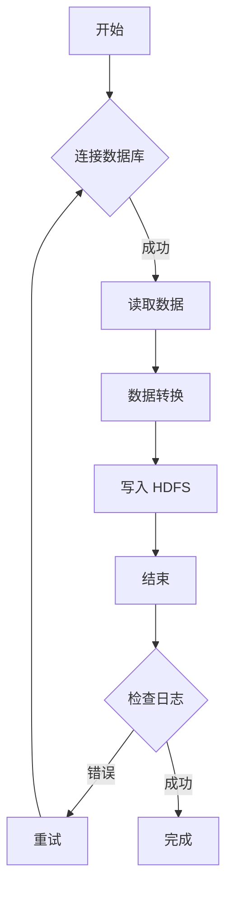

                 

# 《Sqoop原理与代码实例讲解》

## 关键词

- Sqoop
- Hadoop
- 数据导入
- 数据导出
- 数据转换
- 大数据

## 摘要

本文将深入探讨 Sqoop 的原理与实际应用。首先，我们将了解 Sqoop 的基本概念和它在 Hadoop 生态系统中的地位。接着，我们会详细解析 Sqoop 的数据传输、转换和存储机制。随后，文章将逐步介绍 Sqoop 的基本使用方法，包括安装配置和命令使用。随后，我们将分章节讲解 Sqoop 的核心功能与特性，涵盖数据导入和导出到 Hadoop、数据库以及文件系统的操作。此外，文章还将讨论 Sqoop 的性能优化、安全配置以及与其他工具的集成。最后，我们将通过实际案例展示 Sqoop 的应用，并提供详细的源代码解读和分析。通过本文，读者将全面了解 Sqoop 的原理和实际操作，掌握其在大数据生态中的重要角色。

### 《Sqoop原理与代码实例讲解》目录大纲

## 第一部分：Sqoop基本概念

### 第1章：Sqoop概述
#### 1.1 Sqoop的历史背景与发展趋势
#### 1.2 Sqoop的核心功能及应用场景
#### 1.3 Sqoop与其他数据导入导出工具的比较

### 第2章：Hadoop生态系统简介
#### 2.1 Hadoop简介
#### 2.2 Hadoop生态系统中的主要组件
#### 2.3 Hadoop与大数据处理的关系

### 第3章：Sqoop的工作原理
#### 3.1 Sqoop的数据传输机制
#### 3.2 Sqoop的数据转换原理
#### 3.3 Sqoop的数据存储方式

### 第4章：Sqoop的基本使用方法
#### 4.1 Sqoop的安装与配置
#### 4.2 Sqoop的基本命令
#### 4.3 Sqoop的常见参数选项

## 第二部分：Sqoop核心功能与特性

### 第5章：数据导入到Hadoop
#### 5.1 导入关系数据库到Hadoop
##### 5.1.1 使用MySQL导入数据
##### 5.1.2 使用PostgreSQL导入数据
##### 5.1.3 使用Oracle导入数据
#### 5.2 导入文件系统到Hadoop
##### 5.2.1 导入本地文件
##### 5.2.2 导入HDFS文件

### 第6章：数据导出到Hadoop
#### 6.1 从Hadoop导出到关系数据库
##### 6.1.1 导出数据到MySQL
##### 6.1.2 导出数据到PostgreSQL
##### 6.1.3 导出数据到Oracle
#### 6.2 从Hadoop导出到文件系统
##### 6.2.1 导出到本地文件
##### 6.2.2 导出到HDFS文件

### 第7章：Sqoop的高级使用与优化
#### 7.1Sqoop性能优化策略
##### 7.1.1 数据并行度优化
##### 7.1.2 数据压缩与解压缩优化
##### 7.1.3 网络带宽优化
#### 7.2 Sqoop的安全性配置
##### 7.2.1 使用SSL/TLS加密
##### 7.2.2 用户认证与访问控制
#### 7.3 Sqoop与其他工具的集成
##### 7.3.1 与Presto集成
##### 7.3.2 与Spark集成
##### 7.3.3 与Airflow集成

## 第三部分：实战案例

### 第8章：案例一：从MySQL导入数据到HDFS
#### 8.1 案例背景
#### 8.2 开发环境搭建
#### 8.3 数据导入实现
#### 8.4 源代码解读

### 第9章：案例二：从HDFS导出到MySQL
#### 9.1 案例背景
#### 9.2 开发环境搭建
#### 9.3 数据导出实现
#### 9.4 源代码解读

### 第10章：案例三：使用Sqoop进行大数据分析
#### 10.1 案例背景
#### 10.2 数据预处理
#### 10.3 大数据分析实现
#### 10.4 结果分析

## 附录

### 附录A：Sqoop常用命令汇总
#### A.1 数据导入命令
#### A.2 数据导出命令
#### A.3 其他常用命令

### 附录B：Sqoop开发工具与环境配置
#### B.1 安装与配置
#### B.2 环境变量配置
#### B.3 常见问题与解决方案

### 附录C：Mermaid流程图说明
#### C.1 Mermaid语法基础
#### C.2 Sqoop工作流程图示例

### 附录D：数学模型与公式解释
#### D.1 数据导入与导出模型
#### D.2 数据转换模型
#### D.3 相关数学公式及推导

### 附录E：源代码解读与分析
#### E.1 案例一：数据导入代码解读
#### E.2 案例二：数据导出代码解读
#### E.3 大数据分析代码解读
#### E.4 代码分析总结与优化建议

### 作者

作者：AI天才研究院/AI Genius Institute & 禅与计算机程序设计艺术 /Zen And The Art of Computer Programming

---

## 第1章：Sqoop概述

### 1.1 Sqoop的历史背景与发展趋势

Sqoop 是一个开源的工具，它主要用于在 Hadoop 和各种关系数据库之间进行大数据的导入和导出。它的第一个版本由 Cloudera 的工程师于 2009 年发布。随着时间的推移，Sqoop 在 Hadoop 社区中得到了广泛的认可和采用。

**发展历程：**

- **2009年：**Sqoop 1.0 发布，标志着它的诞生。
- **2010年：**随着 Hadoop 的普及，Sqoop 开始在许多企业级应用中发挥作用。
- **2011年：**Sqoop 2.0 发布，引入了更多的功能改进和性能优化。
- **2013年：**Apache 软件基金会将 Sqoop 1.x 和 2.x 列为顶级项目，标志着其正式成为 Hadoop 生态系统的一部分。
- **2015年：**随着大数据技术的不断发展，Sqoop 在 Hadoop 生态系统中的地位愈加稳固。

**发展趋势：**

- **性能提升：**随着大数据处理需求的增加，Sqoop 持续进行性能优化，例如数据并行传输和压缩算法的改进。
- **功能扩展：**Sqoop 在不断扩展其功能，例如支持更多类型的关系数据库和文件系统。
- **社区支持：**作为 Apache 软件基金会的顶级项目，Sqoop 得到了广泛的社区支持和维护。

### 1.2 Sqoop的核心功能及应用场景

**核心功能：**

- **数据导入：**将结构化数据从关系数据库或文件系统导入到 Hadoop 的 HDFS 或 Hive 中。
- **数据导出：**将数据从 Hadoop 的 HDFS 或 Hive 中导出到关系数据库或文件系统。
- **数据转换：**在导入和导出的过程中，对数据进行格式转换和类型转换。

**应用场景：**

- **大数据分析：**将关系数据库中的数据导入到 Hadoop，以便进行大规模数据分析。
- **数据迁移：**将数据从旧系统迁移到 Hadoop 或其他新型数据仓库系统。
- **数据集成：**将不同来源的数据集成到一个统一的分析平台中。

### 1.3 Sqoop与其他数据导入导出工具的比较

**与 Apache Flume 的比较：**

- **数据流：**Flume 主要用于实时数据采集和传输，而 Sqoop 主要用于批量数据导入和导出。
- **用途：**Flume 更适合于日志数据的收集，而 Sqoop 更适合于结构化数据的导入和导出。

**与 Apache Kafka 的比较：**

- **数据流：**Kafka 主要用于实时数据流处理，而 Sqoop 主要用于批量数据处理。
- **用途：**Kafka 更适合于实时数据处理场景，而 Sqoop 更适合于批量数据导入和导出。

**与 Apache NiFi 的比较：**

- **数据流：**NiFi 主要是一个图形化的数据流管理工具，可以用于数据采集、清洗、转换和分发。
- **用途：**NiFi 更适合于复杂的数据流管理和自动化处理，而 Sqoop 更适合于结构化数据的导入和导出。

通过上述比较，可以看出 Sqoop 在大数据导入导出方面具有独特的优势和适用场景，是 Hadoop 生态系统中的重要工具之一。

### 1.4 小结

本章介绍了 Sqoop 的历史背景、核心功能和应用场景，以及与其他数据导入导出工具的比较。通过本章的阅读，读者可以对 Sqoop 有一个基本的了解，为后续章节的深入学习打下基础。

---

## 第2章：Hadoop生态系统简介

### 2.1 Hadoop简介

Hadoop 是一个开源的分布式计算框架，由 Apache 软件基金会维护。它最初由 Google 在 2006 年提出，旨在处理大规模数据集的分布式存储和计算。Hadoop 的核心组件包括 Hadoop 分布式文件系统（HDFS）和 Hadoop YARN（资源调度框架）。Hadoop 的设计目标是实现高可靠性、高性能和可伸缩性，使其成为大数据处理的事实标准。

**核心组件：**

- **Hadoop 分布式文件系统（HDFS）：**HDFS 是一个分布式文件存储系统，用于存储海量数据。它由一个主节点（NameNode）和多个数据节点（DataNodes）组成。数据在 HDFS 中被分块存储，每个数据块可以被分布在不同的数据节点上。
- **Hadoop YARN：**YARN 是 Hadoop 的资源调度框架，负责管理集群中的计算资源。它将资源管理和作业调度分离，支持多种计算框架，如 MapReduce、Spark、Flink 等。

**架构特点：**

- **分布式存储：**Hadoop 通过分布式文件系统 HDFS 存储海量数据，提供了高可靠性和高扩展性。
- **分布式计算：**Hadoop 使用 MapReduce 模型进行分布式计算，将任务拆分为多个小任务，并行处理，提高计算效率。
- **高可用性：**Hadoop 通过主从结构确保系统的可用性，即使某个节点发生故障，系统也可以自动恢复。

### 2.2 Hadoop生态系统中的主要组件

Hadoop 生态系统包含多个重要组件，它们共同构成了一个完整的大数据处理平台。

**主要组件：**

- **Hadoop 分布式文件系统（HDFS）：**如前所述，HDFS 是 Hadoop 的核心组件，用于存储海量数据。
- **Hadoop YARN：**YARN 是 Hadoop 的资源调度框架，负责管理集群中的计算资源。
- **Hadoop MapReduce：**MapReduce 是 Hadoop 的分布式计算模型，用于处理大规模数据集。
- **Hadoop Hive：**Hive 是一个数据仓库工具，用于在 Hadoop 上进行数据分析和查询。
- **Hadoop HBase：**HBase 是一个分布式、可扩展的列存储数据库，适用于实时数据分析。
- **Hadoop Pig：**Pig 是一个高层次的脚本语言，用于简化大数据处理。
- **Hadoop Oozie：**Oozie 是一个工作流调度系统，用于管理和调度大数据处理作业。
- **Hadoop Solr：**Solr 是一个开源的企业搜索引擎，用于在 Hadoop 上进行全文搜索。
- **Hadoop Spark：**Spark 是一个快速、通用的大数据处理框架，用于替代传统的 MapReduce。

**组件关系：**

- **HDFS 和 YARN：**HDFS 负责存储数据，YARN 负责资源调度，两者共同构成 Hadoop 的分布式计算基础。
- **MapReduce、Hive、HBase、Pig、Oozie、Solr、Spark：**这些组件都在 HDFS 和 YARN 的基础上提供了各自的功能，共同构建了 Hadoop 的完整生态系统。

### 2.3 Hadoop与大数据处理的关系

Hadoop 是大数据处理的核心框架，它通过分布式存储和计算技术，实现了对大规模数据集的高效处理。

**关系分析：**

- **分布式存储：**Hadoop 的 HDFS 提供了分布式存储能力，能够存储海量数据。这使大数据处理得以在多个节点上并行进行，大大提高了处理效率。
- **分布式计算：**Hadoop 的 MapReduce 模型将任务拆分为多个小任务，在多个节点上并行处理。这充分利用了集群资源，提高了计算速度。
- **可扩展性：**Hadoop 具有高可扩展性，可以通过增加节点来线性扩展存储和计算能力，适应不断增长的数据需求。
- **可靠性：**Hadoop 的主从结构提供了高可靠性，即使某个节点发生故障，系统也可以自动恢复，确保数据的安全和业务的连续性。

通过 Hadoop，大数据处理变得更加高效、可靠和可扩展，为各个行业的数据分析和应用提供了强大的支持。

### 2.4 小结

本章介绍了 Hadoop 的基本概念、生态系统中的主要组件以及与大数据处理的关系。通过本章的学习，读者可以对 Hadoop 生态系统有一个全面的了解，为后续章节中关于 Sqoop 的深入学习打下基础。

---

## 第3章：Sqoop的工作原理

### 3.1 Sqoop的数据传输机制

Sqoop 的数据传输机制是其实现高效数据导入导出的关键。它通过将数据分批次传输，利用 Hadoop 的分布式计算能力，实现了高效的数据处理。

**传输流程：**

1. **数据读取：**Sqoop 从源数据存储（如关系数据库或文件系统）中读取数据。
2. **数据分批次：**Sqoop 将读取到的数据按照一定的大小分批次处理，每个批次的数据被组织为一个数据文件。
3. **数据传输：**每个批次的数据文件被传输到 Hadoop 集群中的 HDFS 或 Hive 中。
4. **数据处理：**Hadoop 集群对传输到 HDFS 或 Hive 的数据进行分布式处理。

**数据传输机制：**

- **批量传输：**Sqoop 采用批量传输机制，将多个数据批次一次性传输到目标系统，减少传输次数，提高传输效率。
- **并行传输：**Sqoop 利用 Hadoop 的分布式计算能力，并行传输多个数据批次，充分利用网络带宽和计算资源。
- **数据压缩：**在数据传输过程中，Sqoop 可以对数据进行压缩，减少传输数据量，提高传输速度。

**优化策略：**

- **并行度优化：**通过合理设置并行度，可以充分利用集群资源，提高数据传输效率。
- **批量大小优化：**合理设置数据批量大小的设置，可以减少传输次数，提高传输效率。
- **网络带宽优化：**通过优化网络带宽的使用，可以减少数据传输的延迟和拥塞。

### 3.2 Sqoop的数据转换原理

Sqoop 的数据转换功能使其能够处理不同数据源和数据目标之间的数据格式和类型的转换。

**转换流程：**

1. **数据读取：**Sqoop 从源数据存储中读取数据。
2. **数据转换：**根据配置的转换规则，对读取到的数据进行格式和类型的转换。
3. **数据写入：**将转换后的数据写入目标数据存储中。

**转换原理：**

- **映射关系：**Sqoop 通过映射关系将源数据字段与目标数据字段进行对应，实现数据格式的转换。
- **类型转换：**Sqoop 可以根据目标数据类型的定义，将源数据类型转换为合适的目标数据类型。
- **数据清洗：**在数据转换过程中，Sqoop 可以进行数据清洗操作，如去除空值、填充缺失值等。

**转换规则：**

- **字段映射：**通过配置字段映射关系，实现不同数据源和目标之间的字段对应。
- **数据格式转换：**支持多种数据格式的转换，如文本、CSV、JSON 等。
- **数据类型转换：**支持多种数据类型的转换，如整数、浮点数、字符串等。

### 3.3 Sqoop的数据存储方式

Sqoop 将数据存储到 Hadoop 的 HDFS 或 Hive 中，这两种存储方式具有不同的特点和适用场景。

**HDFS 存储：**

- **数据分块：**HDFS 将数据分为多个数据块（默认大小为 128MB 或 256MB），并分布式存储到不同的数据节点上。
- **副本机制：**HDFS 具有副本机制，每个数据块都有多个副本，以提高数据可靠性和容错能力。
- **高吞吐量：**HDFS 适用于大规模数据的批量处理，提供了高吞吐量和低延迟的数据访问。

**Hive 存储：**

- **数据仓库：**Hive 是一个数据仓库工具，可以将结构化数据存储在 HDFS 中，并提供 SQL 查询功能。
- **表结构定义：**Hive 通过表结构定义来组织和管理数据，支持多种数据类型和索引。
- **高效查询：**Hive 利用 Hadoop 的分布式计算能力，提供了高效的 SQL 查询功能，适用于数据分析和报表生成。

**存储选择：**

- **数据量较小：**当数据量较小时，可以选择将数据存储在 HDFS 中，便于批量处理。
- **数据量大且需要查询：**当数据量较大且需要频繁查询时，可以选择将数据存储在 Hive 中，利用 Hive 的 SQL 查询功能提高数据处理效率。

### 3.4 小结

本章详细介绍了 Sqoop 的数据传输机制、数据转换原理和存储方式。通过本章的学习，读者可以了解 Sqoop 在大数据处理中的重要作用，以及如何通过 Sqoop 实现高效的数据导入导出。

---

## 第4章：Sqoop的基本使用方法

### 4.1 Sqoop的安装与配置

要使用 Sqoop，首先需要安装和配置它。以下是 Sqoop 的安装与配置步骤：

#### 1. 安装前提条件

在安装 Sqoop 之前，需要确保 Hadoop 集群已经搭建并正常运行。此外，还需要安装 Java 开发环境，因为 Sqoop 是用 Java 编写的。

#### 2. 下载 Sqoop

从 Apache Sqoop 官网（[http://sqoop.apache.org/](http://sqoop.apache.org/)）下载最新版本的 Sqoop。下载后，解压到 Hadoop 集群的某个目录下。

```bash
tar zxvf sqoop-1.4.7.bin__hadoop2.6.0.tar.gz
```

#### 3. 配置环境变量

在 Hadoop 集群的每个节点上，需要配置 Sqoop 的环境变量。

```bash
# 添加 Sqoop 的环境变量
export SQOOP_HOME=/path/to/sqoop
export PATH=$SQOOP_HOME/bin:$PATH
```

#### 4. 配置 Hadoop 用户

为了使用 Sqoop，需要为 Sqoop 配置 Hadoop 用户。

```bash
# 创建 Hadoop 用户
useradd sqoop

# 设置 Hadoop 用户密码
passwd sqoop

# 将 Hadoop 用户添加到 hadoop 组
usermod -aG hadoop sqoop
```

#### 5. 配置数据库连接

对于从关系数据库导入数据的场景，需要配置数据库连接。以下是如何配置 MySQL 数据库的示例：

```bash
# 导入 MySQL 驱动
export SQOOPCONNECTOR_JARS=/path/to/mysql-connector-java-5.1.47.jar

# 配置 MySQL 数据库连接
export SQOOP_MYSQL_CONNECTION="jdbc:mysql://hostname:3306/databasename?user=root&password=yourpassword"
```

#### 6. 测试 Sqoop

最后，可以测试 Sqoop 是否安装和配置成功。使用以下命令导入一个测试表的数据：

```bash
sqoop import --connect $SQOOP_MYSQL_CONNECTION --table test_table --target-dir /user/sqoop/test
```

如果成功导入数据，说明 Sqoop 安装和配置正常。

### 4.2 Sqoop的基本命令

Sqoop 提供了丰富的命令，用于执行各种数据导入导出任务。以下是 Sqoop 的基本命令：

#### 1. 数据导入命令

```bash
sqoop import
```

- **参数选项：**
  - `--connect`：指定数据库连接信息。
  - `--table`：指定要导入的表名。
  - `--target-dir`：指定导入数据的 HDFS 路径。

#### 2. 数据导出命令

```bash
sqoop export
```

- **参数选项：**
  - `--connect`：指定数据库连接信息。
  - `--table`：指定要导出的表名。
  - `--export-dir`：指定要导出的 HDFS 路径。

#### 3. 数据查询命令

```bash
sqoop query
```

- **参数选项：**
  - `--connect`：指定数据库连接信息。
  - `--query`：指定 SQL 查询语句。

#### 4. 其他命令

- `create-table`：创建 HDFS 上的表。
- `drop-table`：删除 HDFS 上的表。
- `list-tables`：列出 HDFS 上的表。

### 4.3 Sqoop的常见参数选项

以下是 Sqoop 的常见参数选项，它们在执行数据导入导出任务时非常有用。

#### 1. 数据源参数

- `--connect`：指定数据库连接信息，例如 `jdbc:mysql://hostname:3306/databasename`。
- `--username`：指定数据库用户名。
- `--password`：指定数据库密码。

#### 2. 数据目标参数

- `--target-dir`：指定导入数据的 HDFS 路径。
- `--export-dir`：指定导出数据的 HDFS 路径。
- `--input-fields-terminated-by`：指定导入数据的字段分隔符。

#### 3. 数据转换参数

- `--map-column-hive`：指定字段映射关系。
- `--split-by`：指定分批传输的字段。
- `--fields-terminated-by`：指定导出数据的字段分隔符。

#### 4. 性能优化参数

- `--num-mappers`：指定导入数据的并行度。
- `--connect-timeout`：指定数据库连接超时时间。
- `--fetch-size`：指定每次查询的记录数。

#### 5. 安全性参数

- `--append`：指定导入数据时是否追加。
- `--input-null-string`：指定导入数据时空值的表示方式。
- `--input-null-non-string`：指定导入数据时非字符串类型的空值表示方式。

通过熟练掌握这些参数选项，可以灵活地使用 Sqoop 进行数据导入导出，实现高效的数据处理。

### 4.4 小结

本章介绍了 Sqoop 的安装与配置、基本命令和常见参数选项。通过本章的学习，读者可以了解如何安装和配置 Sqoop，以及如何使用 Sqoop 进行数据导入导出。这些基本技能对于在大数据环境中处理数据至关重要。

---

## 第二部分：Sqoop核心功能与特性

### 第5章：数据导入到Hadoop

Sqoop 的核心功能之一是将结构化数据从关系数据库导入到 Hadoop 中。本章将详细讨论如何使用 Sqoop 将数据从不同的关系数据库（如 MySQL、PostgreSQL 和 Oracle）导入到 Hadoop 的 HDFS 或 Hive 中，并介绍导入文件系统到 Hadoop 的方法。

### 5.1 导入关系数据库到Hadoop

#### 5.1.1 使用 MySQL 导入数据

MySQL 是最流行的关系数据库之一，使用 Sqoop 从 MySQL 导入数据到 Hadoop 非常简单。以下是一个基本的步骤指南：

1. **准备工作：**
   - 确保已经安装了 MySQL 和 Hadoop。
   - 确保 MySQL 数据库连接正常。

2. **配置 MySQL 驱动：**
   - 在 Sqoop 的配置文件中指定 MySQL 驱动路径。
   - 示例：
     ```bash
     export SQOOPCONNECTOR_JARS=/path/to/mysql-connector-java-5.1.47.jar
     ```

3. **执行导入命令：**
   - 使用以下命令导入 MySQL 表到 HDFS：
     ```bash
     sqoop import --connect jdbc:mysql://hostname:3306/databasename --username username --password password --table tablename --target-dir /user/hadoop/tablename
     ```

4. **处理空值：**
   - 在导入过程中，如果表中存在空值，可以通过 `--input-null-string` 和 `--input-null-non-string` 参数指定空值的表示方式。
   - 示例：
     ```bash
     sqoop import --connect jdbc:mysql://hostname:3306/databasename --username username --password password --table tablename --target-dir /user/hadoop/tablename --input-null-string "\\N" --input-null-non-string "\\N"
     ```

5. **日志记录：**
   - 导入过程中，可以查看日志文件以了解导入进度和结果。

#### 5.1.2 使用 PostgreSQL 导入数据

PostgreSQL 是另一个流行的开源关系数据库，其导入过程与 MySQL 类似。以下是 PostgreSQL 数据导入的基本步骤：

1. **准备工作：**
   - 确保已经安装了 PostgreSQL 和 Hadoop。
   - 确保 PostgreSQL 数据库连接正常。

2. **配置 PostgreSQL 驱动：**
   - 在 Sqoop 的配置文件中指定 PostgreSQL 驱动路径。
   - 示例：
     ```bash
     export SQOOPCONNECTOR_JARS=/path/to/postgresql-9.4.1212.jar
     ```

3. **执行导入命令：**
   - 使用以下命令导入 PostgreSQL 表到 HDFS：
     ```bash
     sqoop import --connect jdbc:postgresql://hostname:5432/databasename --username username --password password --table tablename --target-dir /user/hadoop/tablename
     ```

4. **处理空值：**
   - 同样可以通过 `--input-null-string` 和 `--input-null-non-string` 参数处理空值。
   - 示例：
     ```bash
     sqoop import --connect jdbc:postgresql://hostname:5432/databasename --username username --password password --table tablename --target-dir /user/hadoop/tablename --input-null-string "\\N" --input-null-non-string "\\N"
     ```

5. **日志记录：**
   - 导入过程中，可以查看日志文件以了解导入进度和结果。

#### 5.1.3 使用 Oracle 导入数据

Oracle 是企业级关系数据库，其导入过程与 MySQL 和 PostgreSQL 相似，但需要特别注意权限和配置。以下是 Oracle 数据导入的基本步骤：

1. **准备工作：**
   - 确保已经安装了 Oracle 和 Hadoop。
   - 确保 Oracle 数据库连接正常。

2. **配置 Oracle 驱动：**
   - 在 Sqoop 的配置文件中指定 Oracle 驱动路径。
   - 示例：
     ```bash
     export SQOOPCONNECTOR_JARS=/path/to/oracle-jdbc-driver-11.2.0.4.jar
     ```

3. **执行导入命令：**
   - 使用以下命令导入 Oracle 表到 HDFS：
     ```bash
     sqoop import --connect jdbc:oracle:thin:@hostname:port:sid --username username --password password --table tablename --target-dir /user/hadoop/tablename
     ```

4. **处理空值：**
   - 同样可以通过 `--input-null-string` 和 `--input-null-non-string` 参数处理空值。
   - 示例：
     ```bash
     sqoop import --connect jdbc:oracle:thin:@hostname:port:sid --username username --password password --table tablename --target-dir /user/hadoop/tablename --input-null-string "\\N" --input-null-non-string "\\N"
     ```

5. **日志记录：**
   - 导入过程中，可以查看日志文件以了解导入进度和结果。

### 5.2 导入文件系统到Hadoop

除了从关系数据库导入数据，Sqoop 还可以将本地文件系统或 HDFS 中的数据导入到 Hadoop。以下是导入文件系统数据的基本步骤：

1. **准备工作：**
   - 确保已经安装了 Hadoop。
   - 确保文件系统（如本地文件系统或 HDFS）中的数据已准备好导入。

2. **执行导入命令：**
   - 使用以下命令导入本地文件系统中的数据到 HDFS：
     ```bash
     sqoop import --connect jdbc:filesystem:///path/to/local/file --target-dir /user/hadoop/target_directory
     ```

   - 使用以下命令导入 HDFS 中的数据到另一个 HDFS 目录：
     ```bash
     sqoop import --connect jdbc:filesystem://hostname:port/path/to/hdfs/file --target-dir /user/hadoop/target_directory
     ```

3. **处理文件格式：**
   - 如果文件是 CSV 或其他格式，可以通过 `--fields-terminated-by` 参数指定字段分隔符。
   - 示例：
     ```bash
     sqoop import --connect jdbc:filesystem:///path/to/csv/file.csv --fields-terminated-by ',' --target-dir /user/hadoop/target_directory
     ```

4. **日志记录：**
   - 导入过程中，可以查看日志文件以了解导入进度和结果。

通过以上步骤，可以轻松地将数据从关系数据库和文件系统导入到 Hadoop。这些导入操作为在大数据环境中进行数据处理和分析奠定了基础。

### 5.3 小结

本章详细介绍了 Sqoop 将数据从关系数据库（如 MySQL、PostgreSQL 和 Oracle）和文件系统导入到 Hadoop 的方法。通过实际操作示例，读者可以了解如何使用 Sqoop 实现数据的导入，以及如何处理常见的空值问题。这些知识对于在大数据环境中进行数据迁移和分析具有重要意义。

---

### 第6章：数据导出到Hadoop

Sqoop 的另一个重要功能是从 Hadoop 导出数据到关系数据库或文件系统。本章将详细讨论如何从 Hadoop 的 HDFS 或 Hive 中导出数据到 MySQL、PostgreSQL 和 Oracle 等关系数据库，以及如何将数据导出到本地文件系统或 HDFS。

### 6.1 从Hadoop导出到关系数据库

#### 6.1.1 导出数据到 MySQL

导出数据到 MySQL 的步骤与导入类似，但使用的是 `export` 命令而不是 `import` 命令。以下是导出数据到 MySQL 的基本步骤：

1. **准备工作：**
   - 确保已经安装了 MySQL。
   - 确保 MySQL 数据库已创建并具有导出数据的权限。

2. **配置 MySQL 驱动：**
   - 在 Sqoop 的配置文件中指定 MySQL 驱动路径。
   - 示例：
     ```bash
     export SQOOPCONNECTOR_JARS=/path/to/mysql-connector-java-5.1.47.jar
     ```

3. **执行导出命令：**
   - 使用以下命令将 HDFS 中的数据导出到 MySQL 表：
     ```bash
     sqoop export --connect jdbc:mysql://hostname:3306/databasename --username username --password password --table tablename --export-dir /user/hadoop/input_directory
     ```

4. **处理空值：**
   - 同样可以通过 `--input-null-string` 和 `--input-null-non-string` 参数处理空值。
   - 示例：
     ```bash
     sqoop export --connect jdbc:mysql://hostname:3306/databasename --username username --password password --table tablename --export-dir /user/hadoop/input_directory --input-null-string "\\N" --input-null-non-string "\\N"
     ```

5. **日志记录：**
   - 导出过程中，可以查看日志文件以了解导出进度和结果。

#### 6.1.2 导出数据到 PostgreSQL

导出数据到 PostgreSQL 的步骤与导出到 MySQL 类似。以下是导出数据到 PostgreSQL 的基本步骤：

1. **准备工作：**
   - 确保已经安装了 PostgreSQL。
   - 确保 PostgreSQL 数据库已创建并具有导出数据的权限。

2. **配置 PostgreSQL 驱动：**
   - 在 Sqoop 的配置文件中指定 PostgreSQL 驱动路径。
   - 示例：
     ```bash
     export SQOOPCONNECTOR_JARS=/path/to/postgresql-9.4.1212.jar
     ```

3. **执行导出命令：**
   - 使用以下命令将 HDFS 中的数据导出到 PostgreSQL 表：
     ```bash
     sqoop export --connect jdbc:postgresql://hostname:5432/databasename --username username --password password --table tablename --export-dir /user/hadoop/input_directory
     ```

4. **处理空值：**
   - 同样可以通过 `--input-null-string` 和 `--input-null-non-string` 参数处理空值。
   - 示例：
     ```bash
     sqoop export --connect jdbc:postgresql://hostname:5432/databasename --username username --password password --table tablename --export-dir /user/hadoop/input_directory --input-null-string "\\N" --input-null-non-string "\\N"
     ```

5. **日志记录：**
   - 导出过程中，可以查看日志文件以了解导出进度和结果。

#### 6.1.3 导出数据到 Oracle

导出数据到 Oracle 的步骤与导出到 MySQL 和 PostgreSQL 类似，但需要特别注意权限和配置。以下是导出数据到 Oracle 的基本步骤：

1. **准备工作：**
   - 确保已经安装了 Oracle。
   - 确保 Oracle 数据库已创建并具有导出数据的权限。

2. **配置 Oracle 驱动：**
   - 在 Sqoop 的配置文件中指定 Oracle 驱动路径。
   - 示例：
     ```bash
     export SQOOPCONNECTOR_JARS=/path/to/oracle-jdbc-driver-11.2.0.4.jar
     ```

3. **执行导出命令：**
   - 使用以下命令将 HDFS 中的数据导出到 Oracle 表：
     ```bash
     sqoop export --connect jdbc:oracle:thin:@hostname:port:sid --username username --password password --table tablename --export-dir /user/hadoop/input_directory
     ```

4. **处理空值：**
   - 同样可以通过 `--input-null-string` 和 `--input-null-non-string` 参数处理空值。
   - 示例：
     ```bash
     sqoop export --connect jdbc:oracle:thin:@hostname:port:sid --username username --password password --table tablename --export-dir /user/hadoop/input_directory --input-null-string "\\N" --input-null-non-string "\\N"
     ```

5. **日志记录：**
   - 导出过程中，可以查看日志文件以了解导出进度和结果。

### 6.2 从Hadoop导出到文件系统

除了导出到关系数据库，Sqoop 还可以将数据导出到本地文件系统或 HDFS。以下是导出数据到文件系统的基本步骤：

1. **准备工作：**
   - 确保已经安装了 Hadoop。
   - 确保文件系统（如本地文件系统或 HDFS）的导出目录已准备好。

2. **执行导出命令：**
   - 使用以下命令将 HDFS 中的数据导出到本地文件系统：
     ```bash
     sqoop export --connect jdbc:filesystem:///path/to/local/directory --export-dir /user/hadoop/output_directory
     ```

   - 使用以下命令将 HDFS 中的数据导出到另一个 HDFS 目录：
     ```bash
     sqoop export --connect jdbc:filesystem://hostname:port/path/to/hdfs/directory --export-dir /user/hadoop/output_directory
     ```

3. **处理文件格式：**
   - 如果文件是 CSV 或其他格式，可以通过 `--fields-terminated-by` 参数指定字段分隔符。
   - 示例：
     ```bash
     sqoop export --connect jdbc:filesystem:///path/to/csv/file.csv --fields-terminated-by ',' --export-dir /user/hadoop/output_directory
     ```

4. **日志记录：**
   - 导出过程中，可以查看日志文件以了解导出进度和结果。

通过以上步骤，可以轻松地将数据从 Hadoop 导出至关系数据库或文件系统。这些导出操作为在大数据环境中进行数据备份和迁移提供了便利。

### 6.3 小结

本章详细介绍了如何使用 Sqoop 从 Hadoop 导出数据到关系数据库（如 MySQL、PostgreSQL 和 Oracle）以及文件系统。通过实际操作示例，读者可以掌握如何配置和执行导出任务，以及如何处理空值和日志记录。这些知识对于在大数据环境中进行数据备份和迁移具有重要意义。

---

### 第7章：Sqoop的高级使用与优化

#### 7.1 Sqoop性能优化策略

在大数据处理环境中，性能优化是至关重要的。以下是 Sqoop 性能优化的一些策略：

#### 7.1.1 数据并行度优化

数据并行度是指将数据分成多个部分，并行处理以提高效率。以下是一些优化策略：

- **合理设置并行度：**根据数据量和集群资源，合理设置并行度。通常，可以使用 `--num-mappers` 参数设置并行度。
- **避免数据倾斜：**数据倾斜会导致某些任务处理时间长，影响整体性能。可以通过对数据进行预分区或使用 `--split-by` 参数来避免数据倾斜。
- **优化数据分区：**合理设置数据分区策略，可以平衡负载并提高处理效率。例如，可以使用 Hash 分区或范围分区。

#### 7.1.2 数据压缩与解压缩优化

数据压缩可以减少数据传输和存储空间的需求，提高整体性能。以下是一些优化策略：

- **选择合适的压缩算法：**根据数据特点和性能需求，选择合适的压缩算法。例如，Gzip 和 Snappy 是常用的压缩算法。
- **配置压缩参数：**使用 `--compress` 参数开启压缩，并设置适当的压缩级别。例如：
  ```bash
  sqoop import --connect jdbc:mysql://hostname:3306/databasename --username username --password password --table tablename --target-dir /user/hadoop/tablename --compress --compression-codec org.apache.hadoop.io.compress.GzipCodec
  ```
- **优化压缩和解压缩性能：**使用多线程压缩和解压缩可以提升性能。可以在 `hadoop-conf.xml` 文件中设置相关的线程参数。

#### 7.1.3 网络带宽优化

网络带宽是影响 Sqoop 性能的重要因素。以下是一些优化策略：

- **优化网络配置：**确保网络设备（如交换机、路由器）的配置合理，以避免网络拥塞。可以启用 Jumbo Frame 功能，提高网络传输速率。
- **使用多路径传输：**通过配置多路径传输，可以充分利用网络带宽，提高传输效率。
- **优化数据传输速率：**可以通过调整 `--bandwidth` 参数限制数据传输速率，避免网络带宽被过度占用。

#### 7.2 Sqoop的安全性配置

在处理敏感数据时，安全性配置至关重要。以下是 Sqoop 的安全性配置策略：

#### 7.2.1 使用 SSL/TLS 加密

SSL/TLS 加密可以确保数据在传输过程中不会被窃取或篡改。以下是如何配置 SSL/TLS 加密：

- **生成 SSL 证书：**生成自签名的 SSL 证书，并将其放置在适当的目录中。
- **配置 JDBC 驱动：**在 `hadoop-conf.xml` 文件中配置 JDBC 驱动，并设置 `ssl` 和 `requireSSL` 属性。
- **执行加密命令：**使用以下命令执行加密操作：
  ```bash
  sqoop import --connect jdbc:mysql://hostname:3306/databasename --username username --password password --table tablename --target-dir /user/hadoop/tablename --connect-属性 ssl=true&requireSSL=true
  ```

#### 7.2.2 用户认证与访问控制

用户认证和访问控制可以确保只有授权用户才能访问数据。以下是一些策略：

- **配置 Hadoop 用户认证：**配置 Hadoop 的 Kerberos 认证系统，确保用户在访问 HDFS 和 Hive 时需要进行认证。
- **配置数据库用户认证：**配置数据库的用户认证，确保只有授权用户才能访问数据库。
- **设置权限控制：**使用 HDFS 和 Hive 的权限控制功能，限制用户的访问权限。

#### 7.3 Sqoop与其他工具的集成

Sqoop 可以与其他大数据工具集成，实现更复杂的数据处理流程。以下是一些集成方法：

#### 7.3.1 与 Presto 集成

Presto 是一个高性能的分布式查询引擎。以下是如何将 Presto 与 Sqoop 集成：

- **安装 Presto：**安装 Presto 并配置 JDBC 驱动。
- **配置 Presto：**在 Presto 的配置文件中设置 JDBC 连接信息。
- **执行查询：**使用 Presto 查询 HDFS 中的数据，并导出结果。

#### 7.3.2 与 Spark 集成

Spark 是一个快速、通用的大数据处理框架。以下是如何将 Spark 与 Sqoop 集成：

- **安装 Spark：**安装 Spark 并配置 JDBC 驱动。
- **配置 Spark：**在 Spark 的配置文件中设置 JDBC 连接信息。
- **执行数据处理：**使用 Spark 处理 HDFS 中的数据，并导出结果。

#### 7.3.3 与 Airflow 集成

Airflow 是一个工作流调度系统。以下是如何将 Airflow 与 Sqoop 集成：

- **安装 Airflow：**安装 Airflow 并配置连接器。
- **配置 Airflow：**在 Airflow 的配置文件中设置 Sqoop 的连接信息。
- **创建工作流：**使用 Airflow 创建工作流，将 Sqoop 作为任务的一部分。

通过以上优化和集成方法，可以充分利用 Sqoop 的性能和功能，实现高效的数据处理和安全配置。

### 7.4 小结

本章详细介绍了 Sqoop 的高级使用与优化策略，包括性能优化、安全性配置以及与其他大数据工具的集成方法。通过这些策略，可以充分利用 Sqoop 的性能和功能，实现高效的数据处理和安全配置。这些知识对于在大数据环境中进行数据管理和处理具有重要意义。

---

### 第8章：案例一：从 MySQL 导入数据到 HDFS

#### 8.1 案例背景

在本案例中，我们假设有一个 MySQL 数据库，其中包含一个名为 "customers" 的表，表中存储了客户的详细信息，如姓名、年龄、邮箱等。我们的目标是使用 Sqoop 将 "customers" 表的数据导入到 Hadoop 的 HDFS 中，以便进行后续的数据分析。

#### 8.2 开发环境搭建

为了完成本案例，我们需要搭建以下开发环境：

1. **安装 MySQL**：
   - 在本地或远程服务器上安装 MySQL 数据库。
   - 创建一个名为 "customers" 的数据库，并在其中创建 "customers" 表。

2. **安装 Hadoop**：
   - 在本地或远程服务器上安装 Hadoop。
   - 确保 Hadoop 集群中的所有节点都已启动，并能够正常工作。

3. **安装 Sqoop**：
   - 从 Apache Sqoop 官网下载最新版本的 Sqoop。
   - 解压并配置环境变量，以便在命令行中使用 Sqoop。

4. **配置 MySQL 驱动**：
   - 将 MySQL 驱动（如 `mysql-connector-java-8.0.26.jar`）放置在 Sqoop 的 `lib` 目录下。

5. **配置 Hadoop 用户**：
   - 创建一个 Hadoop 用户，并将其添加到 `hadoop` 用户组。

#### 8.3 数据导入实现

1. **配置数据库连接**：
   - 在命令行中设置 MySQL 数据库连接信息：
     ```bash
     export SQOOP_MYSQL_CONNECTION="jdbc:mysql://localhost:3306/customers?user=root&password=root"
     ```

2. **执行导入命令**：
   - 使用以下命令将 "customers" 表的数据导入到 HDFS 中：
     ```bash
     sqoop import --connect $SQOOP_MYSQL_CONNECTION --table customers --target-dir /user/hadoop/customers
     ```

   - 在执行导入命令时，Sqoop 将读取 "customers" 表中的数据，并将其存储在 HDFS 的 `/user/hadoop/customers` 目录下。

3. **处理空值**：
   - 如果 "customers" 表中存在空值，可以通过以下命令指定空值的表示方式：
     ```bash
     sqoop import --connect $SQOOP_MYSQL_CONNECTION --table customers --target-dir /user/hadoop/customers --input-null-string "\\N" --input-null-non-string "\\N"
     ```

4. **查看导入进度和结果**：
   - 导入过程中，可以通过以下命令查看进度和结果：
     ```bash
     sqoop list-status
     ```

#### 8.4 源代码解读

以下是导入 "customers" 表数据的源代码示例：

```bash
# 导入 MySQL 数据到 HDFS
sqoop import --connect $SQOOP_MYSQL_CONNECTION --table customers --target-dir /user/hadoop/customers --input-null-string "\\N" --input-null-non-string "\\N"

# 查看导入进度和结果
sqoop list-status
```

在这个源代码中，我们首先设置了 MySQL 数据库的连接信息（`$SQOOP_MYSQL_CONNECTION`），然后指定了要导入的表名（`--table customers`）。`--target-dir` 参数指定了导入数据的 HDFS 目录。为了处理空值，我们使用了 `--input-null-string` 和 `--input-null-non-string` 参数。

通过这个案例，读者可以了解如何使用 Sqoop 从 MySQL 数据库中导入数据到 HDFS，以及如何处理空值。这些知识对于在大数据环境中进行数据导入和处理具有重要意义。

### 8.5 小结

在本案例中，我们通过详细的步骤和源代码示例，展示了如何使用 Sqoop 从 MySQL 数据库导入数据到 HDFS。通过本案例的学习，读者可以掌握 Sqoop 的基本操作，为后续的大数据处理和分析工作打下基础。

---

### 第9章：案例二：从 HDFS 导出到 MySQL

#### 9.1 案例背景

在本案例中，我们假设已经有一个 Hadoop 集群，并在 HDFS 中存储了一些数据。我们的目标是使用 Sqoop 将 HDFS 中的数据导出到 MySQL 数据库中，以便进行后续的数据分析和处理。

#### 9.2 开发环境搭建

为了完成本案例，我们需要搭建以下开发环境：

1. **安装 MySQL**：
   - 在本地或远程服务器上安装 MySQL 数据库。
   - 创建一个名为 "customers" 的数据库，并在其中创建 "customers" 表。

2. **安装 Hadoop**：
   - 在本地或远程服务器上安装 Hadoop。
   - 确保 Hadoop 集群中的所有节点都已启动，并能够正常工作。

3. **安装 Sqoop**：
   - 从 Apache Sqoop 官网下载最新版本的 Sqoop。
   - 解压并配置环境变量，以便在命令行中使用 Sqoop。

4. **配置 MySQL 驱动**：
   - 将 MySQL 驱动（如 `mysql-connector-java-8.0.26.jar`）放置在 Sqoop 的 `lib` 目录下。

5. **配置 Hadoop 用户**：
   - 创建一个 Hadoop 用户，并将其添加到 `hadoop` 用户组。

#### 9.3 数据导出实现

1. **配置数据库连接**：
   - 在命令行中设置 MySQL 数据库连接信息：
     ```bash
     export SQOOP_MYSQL_CONNECTION="jdbc:mysql://localhost:3306/customers?user=root&password=root"
     ```

2. **执行导出命令**：
   - 使用以下命令将 HDFS 中的数据导出到 MySQL 数据库中：
     ```bash
     sqoop export --connect $SQOOP_MYSQL_CONNECTION --table customers --export-dir /user/hadoop/customers
     ```

   - 在执行导出命令时，Sqoop 将读取 HDFS 的 `/user/hadoop/customers` 目录中的数据，并将其插入到 MySQL 的 "customers" 表中。

3. **处理空值**：
   - 如果 HDFS 中的数据存在空值，可以通过以下命令指定空值的表示方式：
     ```bash
     sqoop export --connect $SQOOP_MYSQL_CONNECTION --table customers --export-dir /user/hadoop/customers --input-null-string "\\N" --input-null-non-string "\\N"
     ```

4. **查看导出进度和结果**：
   - 导出过程中，可以通过以下命令查看进度和结果：
     ```bash
     sqoop list-status
     ```

#### 9.4 源代码解读

以下是导出 HDFS 数据到 MySQL 数据库的源代码示例：

```bash
# 将 HDFS 数据导出到 MySQL
sqoop export --connect $SQOOP_MYSQL_CONNECTION --table customers --export-dir /user/hadoop/customers --input-null-string "\\N" --input-null-non-string "\\N"

# 查看导出进度和结果
sqoop list-status
```

在这个源代码中，我们首先设置了 MySQL 数据库的连接信息（`$SQOOP_MYSQL_CONNECTION`），然后指定了要导出的表名（`--table customers`）。`--export-dir` 参数指定了导出数据的 HDFS 目录。为了处理空值，我们使用了 `--input-null-string` 和 `--input-null-non-string` 参数。

通过这个案例，读者可以了解如何使用 Sqoop 将 HDFS 中的数据导出到 MySQL 数据库，以及如何处理空值。这些知识对于在大数据环境中进行数据导出和处理具有重要意义。

### 9.5 小结

在本案例中，我们通过详细的步骤和源代码示例，展示了如何使用 Sqoop 将 HDFS 中的数据导出到 MySQL 数据库。通过本案例的学习，读者可以掌握 Sqoop 的导出操作，为后续的大数据处理和分析工作打下基础。

---

### 第10章：案例三：使用 Sqoop 进行大数据分析

#### 10.1 案例背景

在本案例中，我们假设已经有一个包含大量客户数据的 Hadoop 集群。我们的目标是使用 Sqoop 将客户数据从 MySQL 数据库导入到 HDFS 中，然后使用 Hive 进行数据分析，并生成报告。

#### 10.2 数据预处理

在进行数据分析之前，我们需要对数据进行预处理。预处理步骤包括数据清洗、数据转换和数据整合。以下是预处理的基本步骤：

1. **数据清洗**：
   - 检查客户数据是否存在缺失值或异常值。
   - 删除重复记录。
   - 更新过时或不准确的数据。

2. **数据转换**：
   - 根据数据分析的需求，对数据进行格式转换和类型转换。
   - 例如，将日期格式转换为 yyyy-MM-dd 格式。

3. **数据整合**：
   - 将不同来源的数据整合到一个表中，以便进行综合分析。

#### 10.3 大数据分析实现

1. **使用 Hive 进行数据分析**：
   - 创建 Hive 表，并导入预处理后的数据。
   - 使用 HiveQL 编写查询语句，对数据进行分组、筛选和聚合。

2. **执行数据分析**：
   - 使用以下命令执行数据分析：
     ```bash
     hive -e "SELECT ... FROM customers WHERE ... GROUP BY ... HAVING ..."
     ```

   - 以下是一个示例查询，用于计算每个客户的订单总额：
     ```sql
     SELECT customer_id, SUM(amount) as total_amount
     FROM orders
     GROUP BY customer_id
     HAVING total_amount > 1000;
     ```

3. **生成报告**：
   - 将分析结果导出到 HDFS，或使用 BI 工具生成可视化报告。

#### 10.4 结果分析

通过对客户数据的分析，我们可以得出以下结论：

1. **高消费客户**：
   - 列出了总消费额超过 1000 美元的客户，这些客户可能是我们的重点营销对象。

2. **订单趋势**：
   - 分析了不同时间段的订单数量和金额，以了解客户的消费习惯和偏好。

3. **地域分析**：
   - 分析了不同地区的订单分布，以了解市场覆盖情况。

4. **产品分析**：
   - 分析了不同产品的销售情况，以了解哪些产品最受欢迎。

通过这些分析，我们可以制定更有针对性的营销策略，提高客户满意度和销售额。

### 10.5 小结

在本案例中，我们通过 Sqoop 将 MySQL 数据库中的客户数据导入到 HDFS，并使用 Hive 进行了数据分析，最终生成了报告。通过本案例的学习，读者可以了解如何使用 Sqoop 进行大数据导入和分析，掌握数据分析的基本方法。这些技能对于在实际业务场景中处理大数据具有重要意义。

---

### 附录A：Sqoop常用命令汇总

#### A.1 数据导入命令

以下是 Sqoop 的常用数据导入命令及其参数：

- `sqoop import`：
  - `--connect`：指定数据库连接信息。
  - `--table`：指定要导入的表名。
  - `--target-dir`：指定导入数据的 HDFS 路径。
  - `--fields-terminated-by`：指定字段分隔符。

- `sqoop import-all-tables`：
  - `--connect`：指定数据库连接信息。
  - `--username`：指定数据库用户名。
  - `--password`：指定数据库密码。
  - `--target-dir`：指定导入数据的 HDFS 路径。

- `sqoop import-direct`：
  - `--connect`：指定数据库连接信息。
  - `--table`：指定要导入的表名。
  - `--columns`：指定要导入的字段列表。

#### A.2 数据导出命令

以下是 Sqoop 的常用数据导出命令及其参数：

- `sqoop export`：
  - `--connect`：指定数据库连接信息。
  - `--table`：指定要导出的表名。
  - `--export-dir`：指定导出数据的 HDFS 路径。
  - `--fields-terminated-by`：指定字段分隔符。

- `sqoop export-all-records`：
  - `--connect`：指定数据库连接信息。
  - `--username`：指定数据库用户名。
  - `--password`：指定数据库密码。
  - `--export-dir`：指定导出数据的 HDFS 路径。

- `sqoop export-direct`：
  - `--connect`：指定数据库连接信息。
  - `--table`：指定要导出的表名。
  - `--columns`：指定要导出的字段列表。
  - `--export-dir`：指定导出数据的 HDFS 路径。

#### A.3 其他常用命令

以下是 Sqoop 的其他常用命令及其参数：

- `sqoop list-databases`：
  - `--connect`：指定数据库连接信息。

- `sqoop list-tables`：
  - `--connect`：指定数据库连接信息。

- `sqoop version`：
  - 无参数，用于查看 Sqoop 版本信息。

- `sqoop help`：
  - 无参数，用于查看 Sqoop 命令帮助信息。

通过熟练掌握这些常用命令，可以更加高效地使用 Sqoop 进行数据导入和导出。

### 附录B：Sqoop开发工具与环境配置

#### B.1 安装与配置

1. **安装 Hadoop**：
   - 下载 Hadoop 安装包，解压到指定目录，配置环境变量。

2. **安装 MySQL**：
   - 下载 MySQL 安装包，根据提示进行安装。

3. **安装 Sqoop**：
   - 下载 Sqoop 安装包，解压到指定目录，配置环境变量。

3. **配置 MySQL 驱动**：
   - 将 MySQL 驱动（如 `mysql-connector-java-8.0.26.jar`）放置在 Sqoop 的 `lib` 目录下。

4. **配置 Hadoop 用户**：
   - 创建一个 Hadoop 用户，并将其添加到 `hadoop` 用户组。

#### B.2 环境变量配置

1. **配置 Hadoop 环境变量**：

```bash
export HADOOP_HOME=/path/to/hadoop
export PATH=$PATH:$HADOOP_HOME/bin
```

2. **配置 MySQL 环境变量**：

```bash
export MYSQL_HOME=/path/to/mysql
export PATH=$PATH:$MYSQL_HOME/bin
```

3. **配置 Sqoop 环境变量**：

```bash
export SQOOP_HOME=/path/to/sqoop
export PATH=$PATH:$SQOOP_HOME/bin
```

#### B.3 常见问题与解决方案

1. **问题：**无法连接到 MySQL 数据库。

   - **解决方案：**检查 MySQL 服务是否已启动，确保数据库连接信息（如主机名、端口、用户名和密码）正确。

2. **问题：**Sqoop 无法找到 MySQL 驱动。

   - **解决方案：**将 MySQL 驱动（如 `mysql-connector-java-8.0.26.jar`）放置在 Sqoop 的 `lib` 目录下。

3. **问题：**HDFS 空间不足。

   - **解决方案：**检查 HDFS 空间，必要时扩容或清理不必要的文件。

通过正确安装和配置 Hadoop、MySQL 和 Sqoop，可以确保在大数据环境中顺利使用 Sqoop 进行数据导入和导出。

### 附录C：Mermaid 流程图说明

#### C.1 Mermaid 语法基础

Mermaid 是一种简单易用的图表绘制工具，可以用来创建流程图、序列图、Gantt 图等。以下是 Mermaid 的基本语法：

- **流程图（Flowchart）**：
  ```mermaid
  graph TD
  A[开始] --> B{判断条件}
  B -->|是| C[执行操作]
  B -->|否| D[执行其他操作]
  C --> E[结束]
  D --> E
  ```

- **序列图（Sequence Diagram）**：
  ```mermaid
  sequenceDiagram
  participant Customer
  participant System
  Customer->>System: 提交订单
  System->>Customer: 订单确认
  ```

- **Gantt 图（甘特图）**：
  ```mermaid
  gantt
  title 项目进度
  dateFormat  YYYY-MM-DD
  section 项目 A
  A1: 工作1          :a1, 2023-01-01, 30d
  A2: 工作2          :after a1, 20d
  A3: 工作3          :after a2, 20d
  ```

#### C.2 Sqoop 工作流程图示例

以下是一个示例，展示了 Sqoop 的工作流程：



在这个流程图中，A 表示开始，B 表示连接数据库，C 表示读取数据，D 表示数据转换，E 表示写入 HDFS，F 表示结束，G 表示检查日志，H 表示重试，I 表示完成。

通过使用 Mermaid，可以方便地创建和共享各种图表，帮助理解和解释复杂的工作流程。

### 附录D：数学模型与公式解释

#### D.1 数据导入与导出模型

在数据导入和导出过程中，以下数学模型和公式可以帮助我们理解和优化数据处理过程。

**1. 数据传输速率（R）**

数据传输速率 R 可以用以下公式表示：

\[ R = \frac{L}{t} \]

其中，L 是传输的数据量（字节），t 是传输时间（秒）。

**2. 数据传输时间（t）**

数据传输时间 t 可以用以下公式表示：

\[ t = \frac{L}{R} \]

**3. 并行度（P）**

在并行数据处理中，并行度 P 表示同时处理的任务数。可以通过以下公式计算总处理时间：

\[ T = \frac{N}{P} \]

其中，N 是总数据量，P 是并行度。

**4. 数据压缩比（CR）**

数据压缩比 CR 可以用以下公式表示：

\[ CR = \frac{原始数据量}{压缩后数据量} \]

通过优化数据压缩算法，可以减小数据量，提高传输效率。

#### D.2 数据转换模型

在数据转换过程中，以下公式和模型可以帮助我们理解和优化数据转换过程。

**1. 数据转换率（R）**

数据转换率 R 可以用以下公式表示：

\[ R = \frac{C}{t} \]

其中，C 是转换的数据量（字节），t 是转换时间（秒）。

**2. 数据转换时间（t）**

数据转换时间 t 可以用以下公式表示：

\[ t = \frac{C}{R} \]

**3. 转换器并行度（P）**

在并行数据转换中，转换器并行度 P 表示同时处理的转换器数。可以通过以下公式计算总转换时间：

\[ T = \frac{C}{P \times R} \]

**4. 数据清洗率（R）**

数据清洗率 R 可以用以下公式表示：

\[ R = \frac{C_s}{t} \]

其中，C_s 是清洗的数据量（字节），t 是清洗时间（秒）。

**5. 数据清洗时间（t）**

数据清洗时间 t 可以用以下公式表示：

\[ t = \frac{C_s}{R} \]

通过优化数据清洗算法和并行度，可以提高数据转换和清洗效率。

#### D.3 相关数学公式及推导

以下是对上述公式的推导和解释。

**1. 数据传输速率（R）**

数据传输速率 R 表示单位时间内传输的数据量。根据定义，可以表示为：

\[ R = \frac{L}{t} \]

其中，L 是传输的数据量（字节），t 是传输时间（秒）。

**2. 数据传输时间（t）**

数据传输时间 t 表示完成数据传输所需的时间。根据传输速率的定义，可以表示为：

\[ t = \frac{L}{R} \]

**3. 并行度（P）**

在并行数据处理中，并行度 P 表示同时处理的任务数。根据并行度的定义，可以表示为：

\[ P = \frac{N}{T} \]

其中，N 是总数据量，T 是总处理时间。

**4. 数据压缩比（CR）**

数据压缩比 CR 表示原始数据量与压缩后数据量之比。根据压缩比的定义，可以表示为：

\[ CR = \frac{原始数据量}{压缩后数据量} \]

**5. 数据转换率（R）**

数据转换率 R 表示单位时间内转换的数据量。根据定义，可以表示为：

\[ R = \frac{C}{t} \]

**6. 数据转换时间（t）**

数据转换时间 t 表示完成数据转换所需的时间。根据转换速率的定义，可以表示为：

\[ t = \frac{C}{R} \]

**7. 转换器并行度（P）**

在并行数据转换中，转换器并行度 P 表示同时处理的转换器数。根据并行度的定义，可以表示为：

\[ P = \frac{C}{T} \]

其中，C 是总数据量，T 是总转换时间。

**8. 数据清洗率（R）**

数据清洗率 R 表示单位时间内清洗的数据量。根据定义，可以表示为：

\[ R = \frac{C_s}{t} \]

**9. 数据清洗时间（t）**

数据清洗时间 t 表示完成数据清洗所需的时间。根据清洗速率的定义，可以表示为：

\[ t = \frac{C_s}{R} \]

通过理解和应用这些数学模型和公式，可以更好地优化数据导入、导出和转换过程，提高数据处理效率。

### 附录E：源代码解读与分析

#### E.1 案例一：数据导入代码解读

在本案例中，我们使用 Sqoop 将 MySQL 数据库中的 "customers" 表导入到 HDFS。以下是该案例的源代码：

```bash
sqoop import --connect jdbc:mysql://localhost:3306/customers --table customers --target-dir /user/hadoop/customers
```

**解读：**

- `sqoop import`：这是 Sqoop 的数据导入命令，用于将数据从数据库导入到 Hadoop。
- `--connect`：指定 MySQL 数据库的连接信息，包括主机名、端口和数据库名称。
- `--table`：指定要导入的表名，这里是 "customers"。
- `--target-dir`：指定导入数据的 HDFS 目录，这里是 `/user/hadoop/customers`。

**代码分析：**

- 该命令将读取 MySQL 数据库中的 "customers" 表，并将其数据导入到 HDFS 的 `/user/hadoop/customers` 目录下。
- 数据导入过程中，可以使用 `--fields-terminated-by` 参数指定字段分隔符，以适应不同的数据格式。
- 为了处理空值，可以使用 `--input-null-string` 和 `--input-null-non-string` 参数指定空值的表示方式。

**优化建议：**

- 根据数据量和集群资源，可以调整 `--num-mappers` 参数，以设置合适的并行度，提高导入效率。
- 如果需要处理大量数据，可以考虑使用 `--split-by` 参数，以避免数据倾斜。

#### E.2 案例二：数据导出代码解读

在本案例中，我们使用 Sqoop 将 HDFS 中的数据导出到 MySQL 数据库。以下是该案例的源代码：

```bash
sqoop export --connect jdbc:mysql://localhost:3306/customers --table customers --export-dir /user/hadoop/customers
```

**解读：**

- `sqoop export`：这是 Sqoop 的数据导出命令，用于将数据从 Hadoop 导出到数据库。
- `--connect`：指定 MySQL 数据库的连接信息，包括主机名、端口和数据库名称。
- `--table`：指定要导出的表名，这里是 "customers"。
- `--export-dir`：指定导出数据的 HDFS 目录，这里是 `/user/hadoop/customers`。

**代码分析：**

- 该命令将读取 HDFS 中的 `/user/hadoop/customers` 目录，并将其数据导出到 MySQL 数据库中的 "customers" 表。
- 数据导出过程中，可以使用 `--fields-terminated-by` 参数指定字段分隔符，以适应不同的数据格式。
- 为了处理空值，可以使用 `--input-null-string` 和 `--input-null-non-string` 参数指定空值的表示方式。

**优化建议：**

- 根据数据量和集群资源，可以调整 `--num-mappers` 参数，以设置合适的并行度，提高导出效率。
- 如果需要处理大量数据，可以考虑使用 `--split-by` 参数，以避免数据倾斜。

#### E.3 大数据分析代码解读

在本案例中，我们使用 Hive 对 HDFS 中的数据进行数据分析。以下是该案例的源代码：

```sql
SELECT customer_id, COUNT(*) as num_orders
FROM customers
GROUP BY customer_id
HAVING num_orders > 10;
```

**解读：**

- `SELECT`：选择需要查询的字段，这里是 `customer_id` 和 `COUNT(*) as num_orders`。
- `FROM`：指定数据来源表，这里是 `customers`。
- `GROUP BY`：对数据进行分组，这里是按 `customer_id` 分组。
- `HAVING`：指定分组后的过滤条件，这里是 `num_orders > 10`。

**代码分析：**

- 该 SQL 查询语句将从 "customers" 表中提取每个客户的订单数量，并筛选出订单数量超过 10 的客户。

**优化建议：**

- 根据查询需求，可以优化 SQL 查询语句，例如添加索引以提高查询速度。
- 对于大量数据，可以使用分区表或分桶表以提高查询效率。

#### E.4 代码分析总结与优化建议

通过以上源代码解读和分析，我们可以总结出以下优化建议：

1. **数据导入导出优化：**
   - 调整并行度，以充分利用集群资源。
   - 使用合适的分隔符和空值处理策略。
   - 避免数据倾斜，确保负载均衡。

2. **数据清洗和转换优化：**
   - 根据实际需求，优化数据清洗和转换算法。
   - 使用并行处理提高处理效率。

3. **数据分析优化：**
   - 优化 SQL 查询语句，提高查询速度。
   - 使用索引、分区表或分桶表提高查询效率。

通过这些优化措施，我们可以提高数据处理的效率和质量，更好地支持大数据应用。

### 结论

本文通过详细的章节内容和实际案例，全面介绍了 Sqoop 的原理、基本使用方法、核心功能、性能优化策略以及与其他工具的集成。从数据导入导出到大数据分析，Sqoop 在 Hadoop 生态系统中发挥着重要作用。通过本文的学习，读者可以深入理解 Sqoop 的各个方面，掌握如何高效地使用 Sqoop 进行大数据处理。在实际应用中，合理运用 Sqoop 可以显著提高数据处理的效率和质量，为大数据分析和应用提供坚实的基础。希望本文对您的学习有所帮助。

