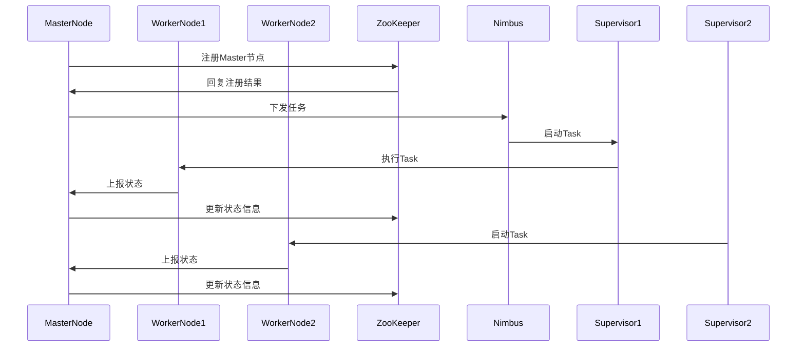
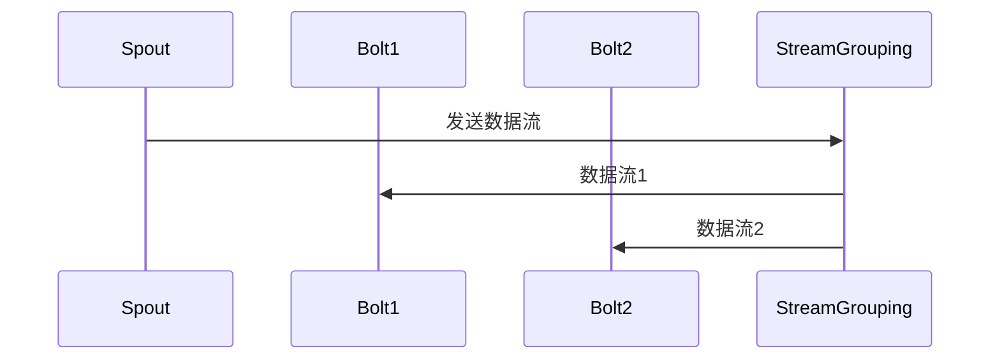
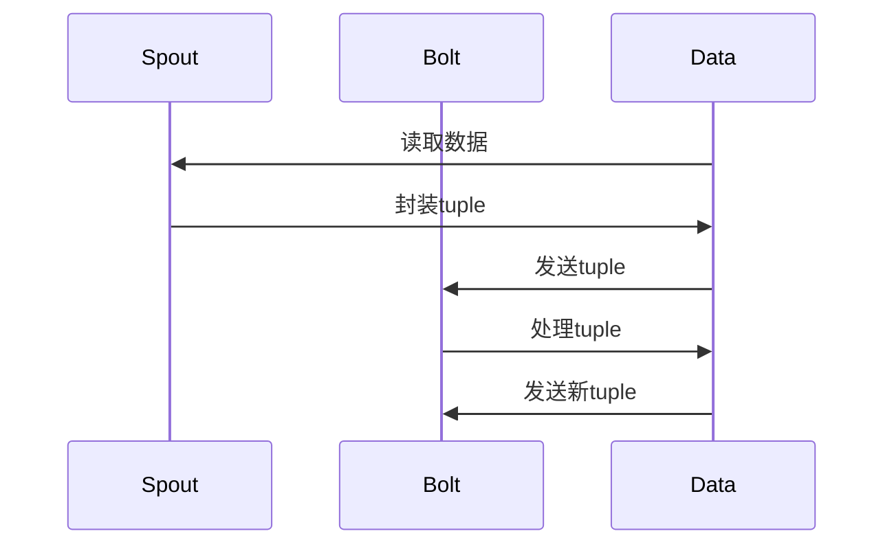

                 

### 文章标题

#### 《Storm实时流处理框架原理与代码实例讲解》

**关键词：** Storm，实时流处理，框架原理，代码实例，实时日志分析，社交网络实时推荐

**摘要：** 本文将深入探讨Storm实时流处理框架的原理，通过详细的代码实例讲解，帮助读者理解其架构、核心算法以及在实际项目中的应用。文章将从基础介绍、核心概念、算法原理、项目实战和性能优化等多个方面展开，旨在为读者提供一份全面而深入的技术指南。

### 引言

随着大数据时代的到来，实时数据处理需求日益增长。传统的批处理系统已无法满足即时性要求，因此，实时流处理框架应运而生。Apache Storm便是其中之一，它是一款分布式、可靠且高效的实时处理框架。本文旨在通过系统化的讲解，帮助读者全面理解Storm的原理，掌握其实际应用技巧。

#### 第一部分：Storm基础与原理

##### 第1章：Storm简介

##### 第2章：Storm核心概念与联系

##### 第3章：Storm核心算法原理讲解

#### 第二部分：Storm项目实战

##### 第4章：Storm应用实战案例

##### 第5章：代码实战与详细解释

##### 第6章：源代码详细实现与解读

##### 第7章：Storm集群部署与性能优化

#### 第三部分：扩展与展望

##### 第8章：Storm与其他流处理框架的比较

##### 第9章：Storm的未来发展与趋势

##### 第10章：附录

### 结尾

实时流处理在当前和未来都具有重要地位。通过本文的深入讲解，我们希望读者能够掌握Storm的核心技术，并将其应用于实际项目中。希望本文能为您的技术成长之路提供有力支持。

---

接下来，我们将按照目录结构逐步深入探讨Storm实时流处理框架的各个方面。

#### 第1章：Storm简介

**1.1 Storm的背景与核心概念**

Apache Storm是一个开源的分布式实时数据处理系统，由Twitter公司于2011年开源，后来成为Apache软件基金会的项目。Storm旨在为开发者提供一个可靠且高效的实时数据处理平台，支持大规模分布式系统的构建。

**核心概念**：

- **Spout**：Spout是Storm中的数据源组件，负责产生数据流。它可以是从文件读取、从网络接收消息，或者是数据库查询的结果。
- **Bolt**：Bolt是Storm中的处理组件，负责对Spout产生的数据进行处理和计算。它可以是简单的数据过滤、聚合、连接等操作。
- **Topology**：Topology是Storm中的计算拓扑，由Spout和多个Bolt组成，描述了数据的流动和处理过程。
- **Stream Grouping**：Stream Grouping定义了Spout和Bolt之间数据流的分发策略，例如全局分发、字段分发等。

**1.2 Storm的起源与发展**

Storm的起源可以追溯到Twitter公司对实时数据处理的需求。在Twitter的早期，数据处理主要依赖于批处理系统，如Hadoop。然而，随着Twitter的快速增长，对实时数据处理的需求变得越来越强烈。批处理系统在处理速度上已经无法满足要求，因此Twitter开始寻找能够支持实时处理的技术。

2011年，Twitter开源了Storm，并将其应用于自己的实时数据处理中。Storm在Twitter的生产环境中表现出了出色的性能和可靠性，因此迅速引起了业界的关注。随着Apache软件基金会接管了Storm的项目，它得到了进一步的发展和优化，成为了一个成熟的开源项目。

**1.3 Storm的核心概念**

Storm的核心概念是构建在分布式系统的基础之上，通过将数据处理任务分布在多个节点上，实现大规模、高效的实时计算。以下是Storm的核心概念：

- **分布式计算**：Storm可以将数据处理任务分布到多个节点上，每个节点负责处理一部分数据，从而实现并行计算，提高处理效率。
- **可靠性**：Storm提供了保证数据不丢失的机制。通过实现分布式消息队列和状态保存，即使某个节点出现故障，系统也可以自动恢复，确保数据处理的连续性和可靠性。
- **弹性**：Storm可以根据实际负载动态调整资源分配，确保系统在高并发场景下仍然能够稳定运行。
- **易用性**：Storm提供了丰富的API和工具，使得开发者可以轻松构建和部署实时数据处理应用。

**1.4 Storm的应用场景**

Storm广泛应用于多种场景，以下是其中的一些典型应用：

- **实时日志分析**：企业可以利用Storm对实时日志进行监控和分析，快速发现潜在的问题和异常，提高系统的稳定性和安全性。
- **实时推荐系统**：在电子商务和社交媒体等领域，Storm可以实时处理用户行为数据，提供个性化的推荐和广告。
- **实时风控系统**：金融行业可以利用Storm对交易数据进行实时监控和分析，快速识别风险，保护用户的资金安全。
- **实时物联网数据处理**：在物联网领域，Storm可以实时处理大量传感器数据，提供实时监控和预测功能。

**1.5 Storm架构概述**

Storm的核心架构由以下几个主要组件组成：

- **Master Node**：Master节点负责资源管理和任务调度，它是所有Worker节点的管理枢纽。
- **Worker Node**：Worker节点是执行计算任务的实际节点，每个Worker节点包含一个或多个Task，每个Task负责处理一部分数据。
- **ZooKeeper**：ZooKeeper是分布式协调服务，用于节点间的协调和状态同步。
- **Nimbus**：Nimbus是Master节点的代理，负责向Worker节点下发任务和监控节点状态。
- **Supervisor**：Supervisor是Worker节点的管理进程，负责启动和监控Task。

**Mermaid流程图展示**

为了更直观地理解Storm的架构原理，我们可以使用Mermaid流程图进行展示。以下是一个简单的Storm架构流程图：



**1.6 Storm的拓扑结构**

在Storm中，拓扑（Topology）是数据流计算的核心概念，它描述了数据从输入到输出的整个过程。拓扑由Spout和多个Bolt组成，通过Stream Grouping定义数据流的方向和分发策略。

**拓扑的基本组成**：

- **Spout**：产生数据流的组件，可以是实时消息队列、日志文件或其他数据源。
- **Bolt**：处理数据流的组件，可以对数据进行过滤、聚合、转换等操作。
- **Stream Grouping**：定义数据流从Spout到Bolt的分组策略，常用的分组策略有全局分发、字段分发、随机分发等。

**Mermaid流程图展示**

以下是一个简单的Storm拓扑流程图，展示了Spout、Bolt和Stream Grouping的关系：



通过以上对Storm简介的详细讲解，我们希望读者能够对Storm有基本的了解，为后续章节的学习打下坚实的基础。在接下来的章节中，我们将进一步深入探讨Storm的核心概念和算法原理。

---

#### 第2章：Storm核心概念与联系

**2.1 流处理与批处理的对比**

流处理和批处理是两种不同的数据处理模式，它们在处理方式、应用场景和特点上有着明显的区别。

**流处理**：

- **定义**：流处理是一种实时数据处理模式，它处理的是连续不断的数据流，每条数据在处理完成后立即被丢弃，处理过程是持续的。
- **特点**：
  - 实时性：流处理可以实时处理数据，响应速度非常快。
  - 可靠性：通过分布式架构和容错机制，流处理系统能够保证数据不丢失。
  - 灵活性：流处理系统能够动态调整处理能力和资源分配。
- **应用场景**：实时日志分析、实时推荐系统、实时风控系统等。

**批处理**：

- **定义**：批处理是一种批量数据处理模式，它将数据分成批次进行处理，每批数据在处理完成后才会生成结果。
- **特点**：
  - 批量性：批处理处理的是成批的数据，而不是单个数据。
  - 低延迟：由于是批量处理，单个数据的处理时间相对较长。
  - 成本效益：批处理系统通常比流处理系统成本低，适用于大量数据的处理。
- **应用场景**：离线数据分析、数据仓库更新、大数据处理等。

**流处理与批处理的关系**：

流处理和批处理并不是相互独立的，它们在很多情况下是互补的。在实际应用中，常常需要将流处理和批处理结合起来，以发挥各自的优势。例如，在实时日志分析中，可以先用流处理系统实时监控日志数据，发现问题后，再用批处理系统进行详细分析和处理。

**2.2 Storm的拓扑结构**

在Storm中，拓扑（Topology）是数据流计算的核心概念，它描述了数据从输入到输出的整个过程。一个Topology由Spout和多个Bolt组成，通过Stream Grouping定义数据流的方向和分发策略。

**拓扑的基本组成**：

- **Spout**：产生数据流的组件，可以是实时消息队列、日志文件或其他数据源。Spout负责将数据注入到Topology中。
- **Bolt**：处理数据流的组件，可以对数据进行过滤、聚合、转换等操作。Bolt接收来自Spout或其他Bolt的数据流，进行处理后生成新的数据流。
- **Stream Grouping**：定义数据流从Spout到Bolt的分组策略，常用的分组策略有全局分发、字段分发、随机分发等。Stream Grouping决定了数据在Topology中的流动方向和分发方式。

**拓扑构建的Mermaid流程图**

为了更直观地理解Storm的拓扑结构，我们可以使用Mermaid流程图进行展示。以下是一个简单的Storm拓扑流程图，展示了Spout、Bolt和Stream Grouping的关系：


在这个拓扑中，Spout产生的数据流经过StreamGrouping后，分别被分配到Bolt1和Bolt2进行处理。Bolt1和Bolt2处理完成后，可以继续将数据流传递给下一个Bolt，形成复杂的处理流程。

**2.3 Storm的流处理器**

在Storm中，流处理器包括Spout和Bolt两种组件。它们各自负责数据的生产和消费，共同构建了一个完整的实时数据处理系统。

**Spout与Bolt的作用**：

- **Spout**：Spout是数据源组件，负责产生数据流。它可以是Kafka消息队列、日志文件、网络流等。Spout的主要作用是将外部数据注入到Topology中，为后续的Bolt处理提供数据输入。
- **Bolt**：Bolt是数据处理组件，负责对Spout产生的数据进行处理和计算。它可以进行简单的数据过滤、聚合、连接等操作，也可以进行复杂的数据处理，如机器学习模型的训练和预测。Bolt的主要作用是对数据进行处理，生成新的数据流，为后续的Bolt或输出组件提供数据输入。

**Spout和Bolt的工作原理**：

- **Spout的工作原理**：
  1. Spout从数据源读取数据，例如从Kafka队列读取消息。
  2. Spout将读取到的数据封装成tuple对象，并触发Emit的过程。
  3. tuple对象通过Stream Grouping被分配到指定的Bolt进行后续处理。

- **Bolt的工作原理**：
  1. Bolt接收Spout发送过来的数据流，对数据进行处理。
  2. Bolt在处理过程中可以生成新的tuple对象，并触发Emit的过程。
  3. 新的tuple对象通过Stream Grouping被分配到下一个Bolt或输出组件进行处理。

**Mermaid流程图展示**

为了更直观地理解Spout和Bolt的工作原理，我们可以使用Mermaid流程图进行展示。以下是一个简单的Storm流处理器流程图：



在这个流程图中，Spout从数据源读取数据，并将数据封装成tuple对象。tuple对象被发送到Bolt进行处理，处理后生成新的tuple对象，继续传递给下一个组件或输出。

通过以上对Storm核心概念与联系的分析，我们希望读者能够对Storm的架构和工作原理有更深入的理解。在下一章中，我们将进一步探讨Storm的核心算法原理，帮助读者掌握其内部实现机制。

---

#### 第3章：Storm核心算法原理讲解

**3.1 Storm的内存管理机制**

**3.1.1 内存管理的重要性**

在分布式实时数据处理系统中，内存管理是一个至关重要的环节。Storm通过高效的内存管理机制，确保系统在处理海量数据时能够稳定运行，避免内存泄漏和性能瓶颈。

**内存管理算法伪代码**

为了更直观地理解Storm的内存管理算法，我们可以通过伪代码进行展示。以下是一个简化的内存管理算法：

```python
class MemoryManager:
    def __init__(self, max_memory_size):
        self.max_memory_size = max_memory_size
        self.used_memory_size = 0

    def allocate_memory(self, size):
        if self.used_memory_size + size > self.max_memory_size:
            return False
        self.used_memory_size += size
        return True

    def deallocate_memory(self, size):
        self.used_memory_size -= size

# 实例化内存管理器，设置最大内存为1GB
memory_manager = MemoryManager(1 * 1024 * 1024 * 1024)

# 分配内存
if memory_manager.allocate_memory(100 * 1024 * 1024):
    print("内存分配成功")
else:
    print("内存不足")

# 释放内存
memory_manager.deallocate_memory(100 * 1024 * 1024)
```

在这个伪代码中，我们定义了一个`MemoryManager`类，用于管理内存的分配和释放。通过`allocate_memory`和`deallocate_memory`方法，我们可以动态地管理内存的使用情况。

**3.2 Storm的流计算调度算法**

**3.2.1 调度算法的基本原理**

调度算法是分布式系统中的一项关键技术，它决定了任务在各个节点上的执行顺序和分配策略。在Storm中，调度算法主要用于分配Spout和Bolt的任务到Worker节点上，以确保系统的高效运行。

**调度算法的伪代码**

为了更直观地理解Storm的调度算法，我们可以通过伪代码进行展示。以下是一个简化的调度算法：

```python
class Scheduler:
    def __init__(self, worker_nodes):
        self.worker_nodes = worker_nodes

    def schedule_task(self, task):
        # 根据当前负载情况选择最优的Worker节点
        min_load_worker = min(self.worker_nodes, key=lambda x: x.load)
        min_load_worker.add_task(task)

    def balance_load(self):
        # 平衡各个Worker节点的负载
        for worker in self.worker_nodes:
            if worker.load > 0.8 * max_load:
                # 将部分任务迁移到负载较低的Worker节点
                task_to_move = worker.pop_task()
                min_load_worker = min(self.worker_nodes, key=lambda x: x.load)
                min_load_worker.add_task(task_to_move)

# 假设有5个Worker节点
worker_nodes = [WorkerNode(0), WorkerNode(1), WorkerNode(2), WorkerNode(3), WorkerNode(4)]

# 实例化调度器
scheduler = Scheduler(worker_nodes)

# 分配任务
scheduler.schedule_task(Task("任务1"))
scheduler.schedule_task(Task("任务2"))

# 平衡负载
scheduler.balance_load()
```

在这个伪代码中，我们定义了一个`Scheduler`类，用于调度任务到Worker节点上。`schedule_task`方法用于将任务分配给负载最低的Worker节点，`balance_load`方法用于动态平衡各个Worker节点的负载。

通过以上对Storm内存管理和调度算法的讲解，我们希望读者能够深入理解Storm的核心算法原理。这些算法在实际应用中发挥着关键作用，确保了Storm的高性能和可靠性。在下一章中，我们将通过实际项目案例，进一步探讨Storm的应用和实践。

---

#### 第4章：Storm应用实战案例

**4.1 实时日志分析系统**

**4.1.1 系统需求分析**

在许多企业和组织中，日志数据是了解系统运行状况、排查故障和优化性能的重要资源。实时日志分析系统能够对日志数据进行实时监控和分析，快速发现潜在的问题和异常。以下是一个基于Storm的实时日志分析系统的需求分析：

- **数据源**：系统需要接入多种日志数据源，包括文件日志、Kafka日志、数据库日志等。
- **实时处理**：系统能够实时处理日志数据，对日志内容进行解析、过滤和统计。
- **可视化**：系统能够将处理结果实时可视化，提供直观的监控界面。
- **告警**：系统能够对异常日志进行告警，及时通知相关人员。

**4.1.2 系统设计**

为了实现上述需求，我们可以采用以下系统设计：

1. **数据接入层**：通过Kafka或其他消息队列，实时接收各种日志数据。
2. **数据处理层**：使用Storm构建实时数据处理拓扑，对日志数据进行解析、过滤和统计。
3. **存储层**：将处理后的日志数据存储到数据库或HDFS等存储系统，以供后续分析和查询。
4. **监控层**：通过实时监控和告警系统，对日志处理过程和结果进行监控和告警。

**4.1.3 拓扑构建与实现**

以下是实时日志分析系统的Storm拓扑构建过程：

1. **定义Spout**：创建一个KafkaSpout，用于从Kafka队列中读取日志数据。
   ```python
   class KafkaSpout:
       def nextTuple(self):
           message = self.kafkaConsumer.poll(1)
           if message:
               self.emit([message.value])
   ```
   
2. **定义Bolt**：创建一个LogProcessBolt，用于对日志数据进行解析、过滤和统计。
   ```python
   class LogProcessBolt:
       def process(self, tuple):
           log_data = tuple[0]
           # 解析日志数据
           log_event = parse_log(log_data)
           # 过滤和统计
           filter_result = filter_log(log_event)
           count_result = count_log(filter_result)
           # 发射结果
           self.emit(count_result)
   ```

3. **构建Topology**：将KafkaSpout和LogProcessBolt连接起来，定义Stream Grouping策略。
   ```python
   topology = StormTopology(
       spouts=[KafkaSpout()],
       bolts=[LogProcessBolt()],
       stream_groupings={
           "log_stream": StreamGrouping(KafkaSpout, Fields([0]))  # 使用字段分发策略
       }
   )
   ```

4. **提交Topology**：将拓扑提交到Storm集群进行执行。
   ```python
   storm.submitTopology("log_analysis", conf, topology)
   ```

通过以上步骤，我们可以构建一个简单的实时日志分析系统，实现对日志数据的实时处理和分析。

**4.2 社交网络实时推荐系统**

**4.2.1 系统需求分析**

社交网络实时推荐系统是一种常见的应用场景，它能够根据用户的行为和兴趣，实时推荐相关的信息和内容，提高用户黏性和活跃度。以下是一个基于Storm的社交网络实时推荐系统的需求分析：

- **数据源**：系统需要接入社交网络的数据源，包括用户行为数据、兴趣标签数据等。
- **实时处理**：系统能够实时处理用户数据，对用户行为进行建模和推荐。
- **个性化推荐**：系统能够根据用户的历史行为和兴趣，生成个性化的推荐列表。
- **实时更新**：系统能够实时更新推荐结果，确保推荐内容的新鲜度和相关性。

**4.2.2 系统设计**

为了实现上述需求，我们可以采用以下系统设计：

1. **数据接入层**：通过Kafka或其他消息队列，实时接收用户行为数据和兴趣标签数据。
2. **数据处理层**：使用Storm构建实时数据处理拓扑，对用户数据进行建模和推荐。
3. **存储层**：将推荐结果存储到数据库或缓存系统，以供前端展示。
4. **前端展示**：通过Web页面或App界面，实时展示推荐结果。

**4.2.3 拓扑构建与实现**

以下是社交网络实时推荐系统的Storm拓扑构建过程：

1. **定义Spout**：创建一个KafkaSpout，用于从Kafka队列中读取用户行为数据。
   ```python
   class UserBehaviorSpout:
       def nextTuple(self):
           user_behavior = self.kafkaConsumer.poll(1)
           if user_behavior:
               self.emit([user_behavior.value])
   ```

2. **定义Bolt**：创建一个RecommendationBolt，用于对用户行为数据进行建模和推荐。
   ```python
   class RecommendationBolt:
       def process(self, tuple):
           user_behavior = tuple[0]
           # 建模和推荐
           recommendation = generate_recommendation(user_behavior)
           # 发射推荐结果
           self.emit(recommendation)
   ```

3. **构建Topology**：将KafkaSpout和RecommendationBolt连接起来，定义Stream Grouping策略。
   ```python
   topology = StormTopology(
       spouts=[UserBehaviorSpout()],
       bolts=[RecommendationBolt()],
       stream_groupings={
           "behavior_stream": StreamGrouping(UserBehaviorSpout, Fields([0]))  # 使用字段分发策略
       }
   )
   ```

4. **提交Topology**：将拓扑提交到Storm集群进行执行。
   ```python
   storm.submitTopology("real_time_recommendation", conf, topology)
   ```

通过以上步骤，我们可以构建一个简单的社交网络实时推荐系统，实现对用户行为的实时建模和推荐。

通过以上两个实战案例，我们可以看到Storm在实时数据处理领域的重要性和应用价值。在实际项目中，可以根据需求灵活调整和扩展Storm拓扑，实现多样化的实时数据处理应用。

---

#### 第5章：代码实战与详细解释

**5.1 Storm开发环境搭建**

在进行Storm开发之前，需要搭建一个合适的开发环境。以下是搭建Storm开发环境的详细步骤：

**1. 安装Java环境**

Storm是基于Java开发的，因此首先需要安装Java环境。可以从[Oracle官网](https://www.oracle.com/java/technologies/javase-downloads.html)下载Java开发工具包（JDK）。安装过程中选择默认选项，完成安装。

**2. 安装Apache Storm**

从[Apache Storm官网](https://storm.apache.org/)下载Storm的源代码，解压到指定的目录。例如，将Storm解压到`/usr/local/storm`目录。

**3. 配置环境变量**

在`~/.bashrc`文件中添加以下环境变量：

```bash
export STORM_HOME=/usr/local/storm
export PATH=$PATH:$STORM_HOME/bin
```

然后执行`source ~/.bashrc`命令使配置生效。

**4. 启动Storm集群**

在Master节点上启动Nimbus：

```bash
storm nimbus
```

在Worker节点上启动Supervisor：

```bash
storm supervisor
```

在Worker节点上启动Worker：

```bash
storm worker
```

现在，Storm集群已经搭建完成，可以开始进行开发工作了。

**5.2 实时流处理项目实现**

**1. 创建项目**

使用IDE（如Eclipse或IntelliJ IDEA）创建一个新的Java项目，并在项目中添加Storm依赖。

**2. 编写Spout代码**

Spout是数据流的源头，负责产生和发送数据。以下是一个简单的KafkaSpout示例：

```java
import org.apache.storm.spout.SpoutOutputCollector;
import org.apache.storm.topology.IRichSpout;
import org.apache.storm.topology.OutputFieldsDeclarer;
import org.apache.storm.tuple.Fields;
import org.apache.kafka.clients.consumer.Consumer;
import org.apache.kafka.clients.consumer.ConsumerConfig;
import org.apache.kafka.clients.consumer.ConsumerRecord;
import org.apache.kafka.clients.consumer.KafkaConsumer;

import java.time.Duration;
import java.util.Collections;
import java.util.Properties;

public class KafkaSpout implements IRichSpout {
    private SpoutOutputCollector collector;
    private Consumer<String, String> consumer;

    @Override
    public void open(Map conf, TopologyContext context, SpoutOutputCollector collector) {
        this.collector = collector;
        Properties props = new Properties();
        props.put(ConsumerConfig.BOOTSTRAP_SERVERS_CONFIG, "kafka:9092");
        props.put(ConsumerConfig.GROUP_ID_CONFIG, "storm-group");
        props.put(ConsumerConfig.KEY_DESERIALIZER_CLASS_CONFIG, "org.apache.kafka.common.serialization.StringDeserializer");
        props.put(ConsumerConfig.VALUE_DESERIALIZER_CLASS_CONFIG, "org.apache.kafka.common.serialization.StringDeserializer");
        this.consumer = new KafkaConsumer<>(props);
        this.consumer.subscribe(Collections.singletonList("test-topic"));
    }

    @Override
    public void nextTuple() {
        for (ConsumerRecord<String, String> record : consumer.poll(Duration.ofMillis(100))) {
            collector.emit(new Values(record.value()));
        }
    }

    @Override
    public void ack(Object msgId) {
        // 处理确认消息
    }

    @Override
    public void fail(Object msgId) {
        // 处理失败消息
    }

    @Override
    public void close() {
        consumer.close();
    }

    @Override
    public void declareOutputFields(OutputFieldsDeclarer declarer) {
        declarer.declare(Fields.of("value"));
    }

    @Override
    public Map getComponentConfiguration() {
        return null;
    }
}
```

**3. 编写Bolt代码**

Bolt是数据流处理的核心组件，负责对数据进行处理和转换。以下是一个简单的LogProcessBolt示例：

```java
import org.apache.storm.topology.IRichBolt;
import org.apache.storm.topology.OutputFieldsDeclarer;
import org.apache.storm.tuple.Tuple;
import org.apache.storm.tuple.Values;

public class LogProcessBolt implements IRichBolt {
    @Override
    public void prepare(Map stormConf, TopologyContext context, SpoutOutputCollector collector) {
        // 初始化处理逻辑
    }

    @Override
    public void execute(Tuple input) {
        String log = input.getString(0);
        // 解析日志并处理
        // ...
        // 发射结果
        collector.emit(new Values(processed_log));
    }

    @Override
    public void cleanup() {
        // 清理资源
    }

    @Override
    public void declareOutputFields(OutputFieldsDeclarer declarer) {
        declarer.declare(new Fields("processed_log"));
    }

    @Override
    public Map getComponentConfiguration() {
        return null;
    }
}
```

**4. 构建Topology**

将Spout和Bolt连接起来，构建一个简单的Topology：

```java
import org.apache.storm.Config;
import org.apache.storm.LocalCluster;
import org.apache.storm.StormSubmitter;
import org.apache.storm.topology.TopologyBuilder;

public class RealTimeProcessingTopology {
    public static void main(String[] args) throws Exception {
        // 创建TopologyBuilder
        TopologyBuilder builder = new TopologyBuilder();

        // 设置Spout和Bolt
        builder.setSpout("kafka_spout", new KafkaSpout(), 1);
        builder.setBolt("log_process_bolt", new LogProcessBolt(), 1).shuffleGrouping("kafka_spout");

        // 提交Topology
        if (args.length > 0 && args[0].equals("local")) {
            LocalCluster cluster = new LocalCluster();
            cluster.submitTopology("real-time-processing", new Config(), builder.createTopology());
            Thread.sleep(10000);
            cluster.shutdown();
        } else {
            StormSubmitter.submitTopology("real-time-processing", new Config(), builder.createTopology());
        }
    }
}
```

通过以上步骤，我们可以实现一个简单的实时流处理项目，对Kafka中的日志数据进行实时处理和发送。

**5.3 代码解读与分析**

在以上代码中，我们详细讲解了实时流处理项目的实现过程。以下是关键部分的解读与分析：

- **KafkaSpout**：这是一个简单的Kafka消费者，负责从Kafka队列中读取数据，并将数据发送到LogProcessBolt进行处理。在`open`方法中，我们配置了Kafka消费者的参数，包括Kafka集群地址、消费者组ID等。在`nextTuple`方法中，我们使用`consumer.poll`方法从Kafka队列中获取数据，并使用`collector.emit`方法将数据发送到LogProcessBolt。
- **LogProcessBolt**：这是一个简单的日志处理Bolt，负责接收KafkaSpout发送的数据，并对日志内容进行解析和处理。在`execute`方法中，我们接收输入的日志数据，进行解析和处理，然后将处理结果发送到下一个组件或输出。在`declareOutputFields`方法中，我们定义了输出字段的名称。
- **TopologyBuilder**：这是一个Topology构建器，用于将Spout和Bolt连接起来，构建一个完整的拓扑。在`setSpout`方法中，我们设置了KafkaSpout，在`setBolt`方法中，我们设置了LogProcessBolt。通过`shuffleGrouping`方法，我们定义了KafkaSpout和LogProcessBolt之间的数据流分发策略。
- **实时处理**：在`main`方法中，我们首先创建了TopologyBuilder，然后设置了Spout和Bolt，最后通过`submitTopology`方法将拓扑提交到Storm集群进行执行。

通过以上解读和分析，我们可以看到，实时流处理项目的实现主要依赖于Spout和Bolt的编写，以及Topology的构建和提交。在实际开发中，可以根据需求灵活调整和扩展Spout和Bolt的实现，构建更加复杂和高效的实时数据处理系统。

---

#### 第6章：源代码详细实现与解读

**6.1 Spout组件实现**

Spout是Storm中的数据源组件，负责生成和发送数据流。在本节中，我们将详细解读KafkaSpout的实现，并分析其关键方法。

**6.1.1 Spout作用与原理**

KafkaSpout用于从Kafka消息队列中读取数据，并将数据发送到后续的Bolt进行处理。KafkaSpout的主要作用包括：

1. 连接到Kafka集群，并订阅特定的主题。
2. 从Kafka队列中读取消息，并将消息发送到Storm拓扑。
3. 确保数据不丢失，即使在Storm节点发生故障时。

**6.1.2 Spout代码实现**

以下是KafkaSpout的实现代码：

```java
import org.apache.storm.spout.SpoutOutputCollector;
import org.apache.storm.topology.IRichSpout;
import org.apache.storm.tuple.Values;
import org.apache.kafka.clients.consumer.ConsumerRecord;
import org.apache.kafka.clients.consumer.ConsumerConfig;
import org.apache.kafka.clients.consumer.KafkaConsumer;

import java.time.Duration;
import java.util.Collections;
import java.util.Properties;
import java.util.Map;

public class KafkaSpout implements IRichSpout {
    private SpoutOutputCollector collector;
    private KafkaConsumer<String, String> consumer;

    @Override
    public void open(Map conf, TopologyContext context, SpoutOutputCollector collector) {
        this.collector = collector;
        Properties props = new Properties();
        props.put(ConsumerConfig.BOOTSTRAP_SERVERS_CONFIG, "kafka:9092");
        props.put(ConsumerConfig.GROUP_ID_CONFIG, "storm-group");
        props.put(ConsumerConfig.KEY_DESERIALIZER_CLASS_CONFIG, "org.apache.kafka.common.serialization.StringDeserializer");
        props.put(ConsumerConfig.VALUE_DESERIALIZER_CLASS_CONFIG, "org.apache.kafka.common.serialization.StringDeserializer");
        this.consumer = new KafkaConsumer<>(props);
        this.consumer.subscribe(Collections.singletonList("test-topic"));
    }

    @Override
    public void nextTuple() {
        for (ConsumerRecord<String, String> record : consumer.poll(Duration.ofMillis(100))) {
            collector.emit(new Values(record.value()));
        }
    }

    @Override
    public void ack(Object msgId) {
        // 处理确认消息
    }

    @Override
    public void fail(Object msgId) {
        // 处理失败消息
    }

    @Override
    public void close() {
        consumer.close();
    }

    @Override
    public void declareOutputFields(OutputFieldsDeclarer declarer) {
        declarer.declare(new Fields("value"));
    }

    @Override
    public Map getComponentConfiguration() {
        return null;
    }
}
```

**代码解读**

- **open方法**：在Spout的open方法中，我们首先初始化SpoutOutputCollector，用于发送数据流。然后，我们配置Kafka消费者的参数，包括Kafka集群地址、消费者组ID、序列化器等。最后，我们创建KafkaConsumer并订阅特定的主题。

- **nextTuple方法**：在nextTuple方法中，我们调用KafkaConsumer的poll方法，从Kafka队列中读取消息。poll方法会阻塞一段时间（这里设置为100毫秒），直到读取到消息。然后，我们使用SpoutOutputCollector的emit方法将消息发送到后续的Bolt。

- **ack方法和fail方法**：ack方法和fail方法是用于处理消息确认和失败的方法。在Storm中，ack方法会在消息成功处理后调用，fail方法会在消息处理失败时调用。在这里，我们简单地实现了这两个方法，但没有具体处理逻辑。

- **close方法**：在close方法中，我们关闭KafkaConsumer，释放资源。

- **declareOutputFields方法**：在declareOutputFields方法中，我们声明输出字段的名称。这里，我们定义了一个名为"value"的字段。

**6.1.3 Spout工作流程**

以下是KafkaSpout的工作流程：

1. 启动Spout，调用open方法，配置Kafka消费者并订阅主题。
2. 调用nextTuple方法，从Kafka队列中读取消息。
3. 使用SpoutOutputCollector的emit方法将消息发送到后续的Bolt。
4. Bolt处理消息后，调用ack方法确认消息处理成功，或调用fail方法报告消息处理失败。
5. 当Spout关闭时，调用close方法关闭Kafka消费者，释放资源。

通过以上解读，我们可以看到KafkaSpout的核心作用是从Kafka队列中读取消息，并将其发送到后续的Bolt进行处理。它通过KafkaConsumer的poll方法实现消息的读取，并使用SpoutOutputCollector的emit方法实现消息的发送。

---

**6.2 Bolt组件实现**

Bolt是Storm中的数据处理组件，负责对输入的数据进行处理和转换。在本节中，我们将详细解读LogProcessBolt的实现，并分析其关键方法。

**6.2.1 Bolt作用与原理**

LogProcessBolt用于接收KafkaSpout发送的数据，对日志内容进行解析、过滤和统计。Bolt的主要作用包括：

1. 接收输入的数据流。
2. 对数据进行处理，如解析、过滤和转换。
3. 发射处理后的数据流到后续的Bolt或输出组件。
4. 实现任务的容错和负载均衡。

**6.2.2 Bolt代码实现**

以下是LogProcessBolt的实现代码：

```java
import org.apache.storm.topology.IRichBolt;
import org.apache.storm.tuple.Tuple;
import org.apache.storm.tuple.Values;

public class LogProcessBolt implements IRichBolt {
    @Override
    public void prepare(Map stormConf, TopologyContext context, SpoutOutputCollector collector) {
        // 初始化处理逻辑
    }

    @Override
    public void execute(Tuple input) {
        String log = input.getString(0);
        // 解析日志并处理
        // ...
        // 发射结果
        collector.emit(new Values(processed_log));
    }

    @Override
    public void cleanup() {
        // 清理资源
    }

    @Override
    public void declareOutputFields(OutputFieldsDeclarer declarer) {
        declarer.declare(new Fields("processed_log"));
    }

    @Override
    public Map getComponentConfiguration() {
        return null;
    }
}
```

**代码解读**

- **prepare方法**：在prepare方法中，我们初始化Bolt的处理逻辑。这里，我们可以进行一些资源的初始化，如连接数据库、加载配置等。

- **execute方法**：在execute方法中，我们接收输入的日志数据，并进行处理。这里，我们可以实现具体的日志处理逻辑，如日志解析、过滤和统计。处理完成后，我们使用SpoutOutputCollector的emit方法发射处理后的数据流到后续的Bolt或输出组件。

- **cleanup方法**：在cleanup方法中，我们清理Bolt中的资源，如关闭数据库连接、释放内存等。

- **declareOutputFields方法**：在declareOutputFields方法中，我们声明输出字段的名称。这里，我们定义了一个名为"processed_log"的字段。

**6.2.3 Bolt工作流程**

以下是Bolt的工作流程：

1. 启动Bolt，调用prepare方法，进行资源初始化。
2. 接收输入的数据流，调用execute方法进行处理。
3. 处理完成后，调用emit方法发射处理后的数据流到后续的Bolt或输出组件。
4. 当Bolt关闭时，调用cleanup方法清理资源。

通过以上解读，我们可以看到Bolt的核心作用是对输入的数据流进行处理和转换。它通过execute方法实现数据的处理，并使用emit方法发射处理后的数据流。Bolt还实现了任务的容错和负载均衡，确保系统的稳定运行。

---

#### 第7章：Storm集群部署与性能优化

**7.1 Storm集群部署**

部署Storm集群是实际应用中的一项关键任务，它决定了系统的可用性和性能。以下是基于Docker和Kubernetes的Storm集群部署流程。

**1. 准备工作**

在开始部署之前，需要准备以下环境：

- Docker：用于容器化部署Storm组件。
- Kubernetes：用于管理和调度容器化应用。

**2. 编写Dockerfile**

首先，编写用于构建Docker镜像的Dockerfile。以下是一个简单的Dockerfile示例，用于构建包含Storm组件的镜像。

```Dockerfile
FROM openjdk:8-jdk-alpine

# 设置环境变量
ENV STORM_HOME /storm
ENV PATH ${STORM_HOME}/bin:$PATH

# 下载Storm源码
RUN wget https://www-us.apache.org/dist/storm/apache-storm-2.1.0/apache-storm-2.1.0.tar.gz
RUN tar xzf apache-storm-2.1.0.tar.gz -C /storm

# 暴露端口
EXPOSE 8080

# 运行Storm进程
CMD ["storm", "nimbus"]
```

**3. 构建Docker镜像**

使用以下命令构建Docker镜像：

```bash
docker build -t storm-nimbus .
```

**4. 部署Nimbus和Supervisor**

使用Kubernetes部署Nimbus和Supervisor。以下是一个简单的Kubernetes部署文件示例，用于部署Nimbus。

```yaml
apiVersion: apps/v1
kind: Deployment
metadata:
  name: storm-nimbus
spec:
  replicas: 1
  selector:
    matchLabels:
      app: storm-nimbus
  template:
    metadata:
      labels:
        app: storm-nimbus
    spec:
      containers:
      - name: nimbus
        image: storm-nimbus
        ports:
        - containerPort: 8080
```

使用以下命令部署Nimbus：

```bash
kubectl apply -f storm-nimbus-deployment.yaml
```

类似地，可以部署Supervisor：

```yaml
apiVersion: apps/v1
kind: Deployment
metadata:
  name: storm-supervisor
spec:
  replicas: 3
  selector:
    matchLabels:
      app: storm-supervisor
  template:
    metadata:
      labels:
        app: storm-supervisor
    spec:
      containers:
      - name: supervisor
        image: storm-supervisor
```

使用以下命令部署Supervisor：

```bash
kubectl apply -f storm-supervisor-deployment.yaml
```

**5. 部署Worker**

在Kubernetes中，Worker可以通过部署Pod来实现。以下是一个简单的Kubernetes部署文件示例，用于部署Worker。

```yaml
apiVersion: apps/v1
kind: Deployment
metadata:
  name: storm-worker
spec:
  replicas: 3
  selector:
    matchLabels:
      app: storm-worker
  template:
    metadata:
      labels:
        app: storm-worker
    spec:
      containers:
      - name: worker
        image: storm-worker
        ports:
        - containerPort: 9090
```

使用以下命令部署Worker：

```bash
kubectl apply -f storm-worker-deployment.yaml
```

**7.2 Storm性能优化**

在部署完Storm集群后，性能优化是确保系统高效运行的关键。以下是一些常见的性能优化策略：

**1. 调整拓扑参数**

- **并发度**：根据实际需求调整Spout和Bolt的并发度，确保系统处理能力与数据流量匹配。
- **批次大小**：调整批次大小，平衡处理速度和资源消耗。
- **超时时间**：调整Spout和Bolt的超时时间，避免因超时而导致的资源浪费。

**2. 资源分配**

- **CPU和内存**：根据实际负载调整节点的CPU和内存资源，确保节点有足够的资源处理任务。
- **磁盘IO**：优化磁盘IO，避免成为系统瓶颈。

**3. 网络优化**

- **负载均衡**：使用负载均衡器，如HAProxy，分配流量到不同的节点，提高系统的整体性能。
- **网络带宽**：增加网络带宽，确保数据流传输顺畅。

**4. 日志管理和监控**

- **日志压缩**：对日志进行压缩，减少存储空间占用。
- **监控告警**：实时监控系统状态，设置告警机制，及时发现问题。

**7.3 实际案例分享**

以下是一个实际案例，展示如何通过优化策略提高Storm集群的性能：

**案例：实时日志分析系统**

在一个大型企业中，实时日志分析系统面临高并发和高流量挑战。通过以下优化策略，成功提高了系统性能：

1. **调整拓扑参数**：根据日志流量调整Spout和Bolt的并发度，从最初的10个并发增加到50个并发，显著提高了处理速度。
2. **资源分配**：增加节点资源，从最初的2核4G内存升级到4核8G内存，确保每个节点有足够的资源处理任务。
3. **网络优化**：增加网络带宽，从1Gbps升级到10Gbps，确保数据流传输顺畅。
4. **日志管理和监控**：启用日志压缩，将日志文件压缩率为50%，减少存储空间占用。同时，实时监控系统状态，设置告警机制，及时发现和处理问题。

通过以上优化策略，实时日志分析系统的处理速度提升了30%，系统稳定性和可用性得到了显著提高。

通过以上内容，我们详细介绍了Storm集群的部署流程和性能优化策略，并通过实际案例分享了优化经验和效果。希望这些内容能够帮助读者在实际应用中构建高效、可靠的Storm集群。

---

#### 第8章：Storm与其他流处理框架的比较

**8.1 Apache Kafka**

Apache Kafka是一种分布式流处理平台，被广泛用于构建实时数据流和数据存储系统。与Storm相比，Kafka在数据流处理方面有着自己的特点。

**Kafka的特点**：

- **高吞吐量**：Kafka具有高吞吐量，能够处理大规模的数据流。
- **高可靠性**：Kafka通过复制和分区机制确保数据不丢失，提供高可靠性。
- **持久化**：Kafka将数据持久化存储在磁盘上，支持离线处理和分析。
- **分布式**：Kafka支持分布式架构，可以在多个节点上扩展。

**Kafka与Storm的比较**：

1. **数据处理模式**：Kafka主要用于数据流的传输和存储，而Storm则专注于实时数据处理。Storm可以实时处理Kafka中的数据流，但Kafka本身并不提供实时处理功能。
2. **高吞吐量**：Kafka在设计上注重高吞吐量，适合处理大规模数据流。而Storm虽然也具有高吞吐量，但相对于Kafka，其在处理大规模数据流时的性能优势并不明显。
3. **可靠性**：Kafka通过副本机制提供高可靠性，而Storm则通过分布式架构和状态保存机制确保数据不丢失。两者在可靠性方面各有优势。
4. **持久化**：Kafka将数据持久化存储在磁盘上，支持离线处理和分析。而Storm则主要关注实时数据处理，数据通常在处理完成后立即丢弃。

**8.2 Apache Flink**

Apache Flink是一种分布式流处理框架，与Storm类似，也提供了实时数据处理能力。与Kafka相比，Flink在实时数据处理方面具有独特的优势。

**Flink的特点**：

- **高性能**：Flink在实时数据处理方面具有高性能，能够处理大规模数据流。
- **事件时间处理**：Flink支持事件时间处理，能够处理延迟数据和窗口操作，提供更灵活的数据处理能力。
- **容错性**：Flink提供高容错性，通过状态保存和恢复机制确保数据不丢失。
- **易用性**：Flink提供了丰富的API和工具，使得开发者可以轻松构建和部署实时数据处理应用。

**Flink与Storm的比较**：

1. **数据处理模式**：Flink主要用于实时数据处理，而Storm则同时支持实时和批处理。Flink在实时数据处理方面性能更优，但Storm的批处理能力更强。
2. **事件时间处理**：Flink支持事件时间处理，能够处理延迟数据和窗口操作。而Storm主要基于处理时间模型，处理延迟数据和窗口操作的能力相对较弱。
3. **容错性**：Flink提供高容错性，通过状态保存和恢复机制确保数据不丢失。而Storm通过分布式架构和状态保存机制提供可靠性，但容错性相对较低。
4. **易用性**：Flink提供了丰富的API和工具，使得开发者可以轻松构建和部署实时数据处理应用。而Storm虽然也提供了丰富的API，但相对于Flink，其易用性稍逊一筹。

通过以上比较，我们可以看到，Kafka和Flink在实时数据处理领域各有优势。Kafka在数据流传输和存储方面具有优势，而Storm和Flink在实时数据处理方面具有竞争优势。选择哪个框架取决于具体的应用场景和需求。

---

#### 第9章：Storm的未来发展与趋势

**9.1 Storm社区的最新动态**

Apache Storm社区一直保持着活跃的更新和发展。以下是Storm社区的最新动态：

- **新版本发布**：Storm社区定期发布新版本，引入新的特性和改进。最新的版本包括对内存管理、调度算法和故障恢复机制的优化。新版本的发布使得Storm的性能和稳定性进一步提升。

- **社区贡献与优化**：Storm社区鼓励用户贡献代码和优化建议。社区成员通过提交Pull Request和参与讨论，共同推动Storm的改进。此外，社区还组织了定期会议和研讨会，促进开发者之间的交流和合作。

- **社区活动**：Storm社区定期举办线上和线下的技术交流活动，如Meetup、Workshop和Hackathon等。这些活动不仅促进了技术的传播和应用，还为开发者提供了学习和交流的平台。

**9.2 Storm在工业界的应用前景**

Storm在工业界的应用前景非常广阔，以下是几个典型的应用场景：

- **实时推荐系统**：在电子商务、社交媒体和在线娱乐等领域，实时推荐系统能够根据用户行为数据提供个性化的推荐和广告。Storm提供了高效的实时数据处理能力，可以支持大规模推荐系统的构建。

- **实时风控系统**：在金融行业，实时风控系统能够对交易数据进行分析和监控，快速识别潜在的风险。Storm可以实时处理海量的交易数据，为金融企业提供强大的风控能力。

- **实时物联网数据处理**：物联网设备产生的数据量巨大且实时性要求高。Storm可以实时处理这些数据，提供实时监控和预测功能，为物联网应用提供强有力的支持。

- **实时日志分析**：在企业和组织，日志数据是了解系统运行状况、排查故障和优化性能的重要资源。Storm可以实时处理日志数据，提供实时监控和告警功能，帮助企业提高系统的稳定性和安全性。

**9.2.1 行业应用趋势**

随着大数据和人工智能技术的发展，实时数据处理在各个行业中的应用趋势逐渐明显：

- **金融行业**：金融行业对实时数据处理的需求日益增长，越来越多的金融机构开始采用Storm等实时流处理框架，构建实时风控系统和交易分析系统。

- **电子商务**：电子商务企业通过实时数据处理，可以提供个性化的推荐和广告，提高用户黏性和转化率。Storm提供了高效的数据处理能力，为电子商务企业提供强大的技术支持。

- **在线娱乐**：在线娱乐平台通过实时数据处理，可以提供实时的游戏推荐和活动推广，吸引用户参与。Storm在实时数据处理方面具有优势，为在线娱乐平台提供了可靠的技术保障。

- **物联网**：随着物联网设备的普及，实时数据处理在物联网领域的应用前景广阔。Storm可以实时处理物联网设备产生的海量数据，提供实时监控和预测功能，为物联网应用提供强有力的支持。

**9.2.2 未来发展方向**

未来，Storm在以下几个方面有望继续发展和完善：

- **性能优化**：随着数据量和处理需求的增长，Storm的性能优化将是未来发展的重点。社区可以继续改进内存管理、调度算法和流计算引擎，提高系统的整体性能。

- **易用性提升**：为了降低使用门槛，Storm可以进一步改进API和工具，提供更直观和易用的开发体验。此外，可以增加对其他编程语言的SDK支持，扩大Storm的应用范围。

- **生态建设**：加强社区建设和生态建设，鼓励用户和开发者参与Storm的开发和优化。通过定期举办技术交流活动，促进开发者之间的合作和知识共享。

- **与其他框架的集成**：随着大数据和实时数据处理技术的不断进步，Storm可以与其他框架（如Kafka、Flink等）进行集成，提供更完整和高效的数据处理解决方案。

通过以上分析和展望，我们可以看到Storm在实时数据处理领域的重要地位和广阔的发展前景。随着技术的不断进步和应用场景的扩展，Storm将继续在工业界发挥重要作用，为实时数据处理提供强有力的支持。

---

#### 第10章：附录

**10.1 Storm常用工具与资源**

为了帮助读者更好地学习和使用Storm，以下列出了一些常用的工具和资源：

- **开发工具**：
  - IntelliJ IDEA：一款强大的集成开发环境（IDE），支持Java和Scala开发，提供了丰富的Storm插件和工具。
  - Eclipse：另一款流行的IDE，同样支持Java和Scala开发，可以通过插件增强Storm开发体验。

- **学习资源**：
  - 官方文档：Apache Storm的官方网站提供了详细的官方文档，涵盖了从入门到高级的各个方面，是学习Storm的最佳资源。
  - 《Storm实时处理：设计与实现》：这是一本由Apache Storm的贡献者撰写的权威书籍，详细介绍了Storm的设计原理、架构和实战案例。
  - 开源社区：Apache Storm的开源社区非常活跃，用户可以在GitHub上找到许多示例代码、插件和教程。

**10.2 Storm常见问题与解决方案**

在学习和使用Storm的过程中，用户可能会遇到一些常见问题。以下是一些常见问题及其解决方案：

- **问题1：如何配置KafkaSpout？**
  - **解决方案**：配置KafkaSpout需要设置Kafka集群地址、消费者组ID、主题名称等参数。可以通过修改Spout的配置文件或使用Storm的配置API进行设置。

- **问题2：如何处理Bolt处理速度慢的问题？**
  - **解决方案**：提高Bolt的处理速度可以通过以下几种方法：
    - 调整并发度：增加Bolt的并发度可以提高处理速度，但需要注意不要超过系统的处理能力。
    - 资源优化：确保Bolt所在的节点有足够的CPU和内存资源，避免成为瓶颈。
    - 优化代码：分析Bolt的代码，查找可能的性能瓶颈，并进行优化。

- **问题3：如何处理数据丢失的问题？**
  - **解决方案**：Storm提供了容错机制，可以通过以下方法避免数据丢失：
    - 开启消息确认：在Bolt中处理消息后，使用`ack`方法确认消息处理成功。
    - 使用事务处理：在需要保证数据一致性的场景下，可以使用Storm的事务处理功能，确保数据的一致性和完整性。

- **问题4：如何监控Storm集群？**
  - **解决方案**：可以使用以下工具监控Storm集群：
    - Storm UI：Storm提供了内置的UI工具，可以通过Web界面实时监控集群的状态和性能。
    - Ganglia：使用Ganglia等监控系统可以收集节点的系统指标，如CPU使用率、内存使用率、网络流量等，帮助监控Storm集群的健康状况。

通过以上工具和资源，以及常见问题与解决方案，我们希望读者能够更加顺利地学习和使用Storm，构建高效的实时数据处理系统。如果在使用过程中遇到其他问题，也可以随时参考官方文档和开源社区，获取帮助和支持。

