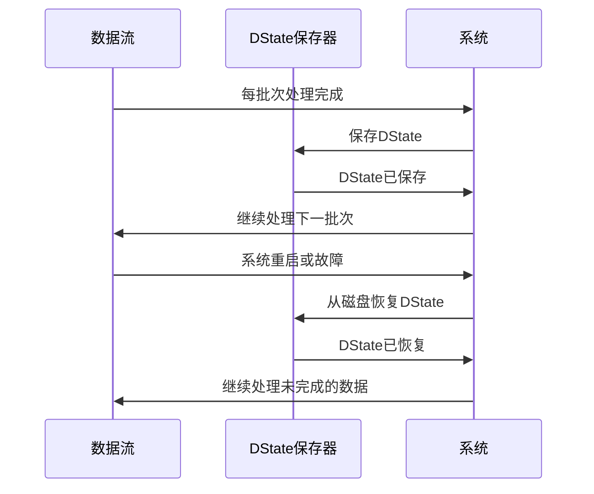
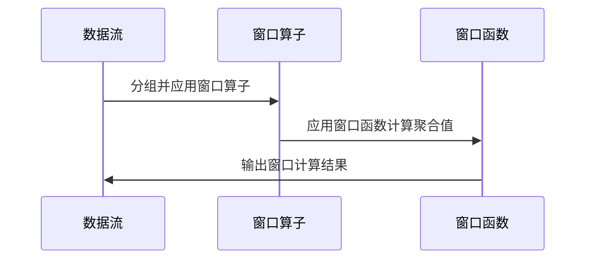
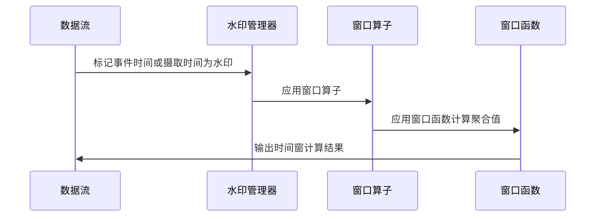
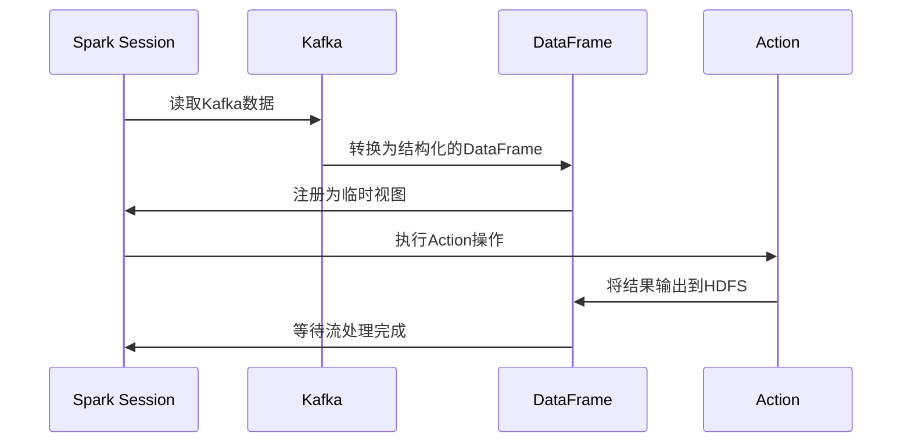

                 

### 文章标题: 《Structured Streaming原理与代码实例讲解》

Structured Streaming是现代流处理技术中的一种重要架构，它基于大数据处理框架Spark实现，能够对实时数据进行高效的流处理和分析。Structured Streaming的出现，极大地改变了传统流处理技术的局限性，为大数据领域的实时数据处理提供了强有力的工具。本文将系统地介绍Structured Streaming的原理，并通过代码实例深入讲解其在实际项目中的应用。

关键词：Structured Streaming、Spark、流处理、实时数据分析、代码实例

**摘要：**
本文将从Structured Streaming的基本概念和架构入手，详细介绍其核心算法原理，并通过一系列代码实例展示其在实际项目中的应用。文章内容结构如下：

1. **基础部分**：包括Structured Streaming的定义、背景、架构、优势与挑战。
2. **核心算法原理部分**：涵盖持久化与恢复、窗口原理、Watermarking、时间语义与时间窗。
3. **项目实战部分**：通过实时日志分析、实时推荐系统、实时风控系统、实时广告系统的实战项目，详细讲解Structured Streaming的应用。
4. **开发环境与工具部分**：介绍Spark环境的搭建、Structured Streaming工具的使用以及代码调试与性能优化。
5. **附录部分**：提供开发资源、伪代码与Mermaid流程图实例、代码示例与解读。

通过本文的讲解，读者可以全面了解Structured Streaming的原理和实战应用，为大数据实时处理提供技术支持。接下来，我们将一步步深入探讨Structured Streaming的各个关键部分。

### Structured Streaming 概述

#### 1.1 Structured Streaming 的定义与背景

Structured Streaming是Apache Spark的一个模块，旨在提供一种结构化的流处理方式。它不同于传统的基于微批处理（Micro-Batch）或基于事件（Event-Driven）的流处理技术，而是通过结构化的数据接口（如DataFrame和Dataset）对实时数据进行处理。这种结构化的方式使得数据的处理更加简单、高效和可靠。

Structured Streaming的起源可以追溯到Spark 1.6版本，当时引入了DStream（Discretized Stream）的概念，用于处理实时数据流。随着Spark版本的迭代，DStream逐渐演化为Structured Streaming，实现了对数据流的更高效管理和处理。

**核心概念：**

- **DStream（Discretized Stream）**：DStream是Spark中对实时数据流的抽象，它表示一系列连续的数据批次。每个批次在一定时间窗口内积累，当窗口结束时，DStream生成一个数据批次。

- **DState（Discretized State）**：DState是对DStream的进一步扩展，用于保存处理过程中的中间状态，例如窗口计算的结果等。

- **Transform**：Transform用于对DStream进行操作，如映射（map）、过滤（filter）等。通过Transform，我们可以将原始数据流转化为结构化的DataFrame或Dataset。

- **Action**：Action是触发数据处理操作的行为，如计算汇总（reduce）、持久化（saveAs）等。执行Action时，会触发对数据流的处理，并将结果输出到文件系统或数据库中。

**Structured Streaming与传统流处理技术对比：**

- **与传统微批处理技术（如Apache Storm和Flink）对比：**
  - **数据结构化**：Structured Streaming通过DataFrame和Dataset提供结构化的数据接口，使得数据处理更加直观和高效。
  - **性能优化**：Structured Streaming利用Spark的内存管理和调度机制，提供了更高的性能。
  - **容错性**：Structured Streaming通过DState和Punctuation机制，实现了更高的容错性和持久化能力。

- **与基于事件驱动的流处理技术（如Apache Kafka Streams）对比：**
  - **数据处理灵活性**：Structured Streaming提供丰富的数据处理函数和操作符，能够满足多样化的数据处理需求。
  - **集成性**：Structured Streaming与Spark的其他功能（如Spark SQL、Spark MLlib等）无缝集成，提供了更强大的数据处理能力。

#### 1.2 Structured Streaming 的架构

Structured Streaming的架构设计充分考虑了实时数据处理的高效性和可靠性。以下是Structured Streaming的主要组件和架构设计：

**主要组件：**

- **Input Sources（输入源）**：输入源可以是Kafka、Flume、Kinesis等数据源，它们将实时数据发送到Spark集群进行处理。

- **Stream Processing（流处理）**：流处理是Structured Streaming的核心，它包括数据采集、Transform操作、Action操作等。通过DataFrame或Dataset的API，可以方便地对数据进行处理。

- **Output Sinks（输出目标）**：输出目标可以是HDFS、Hive、Kafka等数据存储系统，用于存储处理结果或触发后续操作。

**架构设计：**

1. **数据采集**：输入源将实时数据发送到Spark集群，数据首先存储在内存或磁盘的临时存储区中。

2. **Transform操作**：通过对DataFrame或Dataset进行Transform操作，实现对数据的过滤、映射、连接等处理。

3. **Action操作**：执行Action操作，如reduce、saveAs等，触发数据处理流程并生成结果。

4. **持久化与恢复**：通过DState和Punctuation机制，将处理过程中的中间状态和结果进行持久化，确保数据处理的可靠性和容错性。

5. **输出结果**：处理结果可以通过Output Sinks输出到文件系统、数据库或其他数据存储系统。

**工作流程：**

1. **数据采集**：输入源将实时数据发送到Spark集群，数据存储在内存或磁盘的临时存储区中。

2. **数据转换**：通过Transform操作，将原始数据转换为结构化的DataFrame或Dataset。

3. **数据处理**：通过Action操作，触发数据处理流程，如reduce、saveAs等。

4. **持久化**：通过DState和Punctuation机制，将处理过程中的中间状态和结果进行持久化，确保数据处理的可靠性和容错性。

5. **输出结果**：将处理结果输出到文件系统、数据库或其他数据存储系统。

#### 1.3 Structured Streaming 在 Spark 中的实现

Structured Streaming在Spark中的实现主要依赖于DataFrame和Dataset API。以下是Structured Streaming在Spark中的基本用法：

**基本用法：**

```python
from pyspark.sql import SparkSession

# 创建Spark会话
spark = SparkSession.builder.appName("StructuredStreamingExample").getOrCreate()

# 从Kafka读取数据
df = spark \
  .readStream \
  .format("kafka") \
  .option("kafka.bootstrap.servers", "localhost:9092") \
  .option("subscribe", "test_topic") \
  .load()

# 转换为结构化的DataFrame
df.selectExpr("CAST(value AS STRING)") \
  .withColumn("data", from_json("value", "struct<mfield1:string,mfield2:string>")) \
  .select("data.*")

# 注册为临时视图
df.createOrReplaceTempView("data")

# 执行Action操作
query = spark.sql("SELECT * FROM data")

# 将结果输出到HDFS
query.writeStream.format("parquet") \
  .option("path", "/user/data/parquet") \
  .option("checkpointLocation", "/user/data/checkpoint") \
  .start()

# 等待流处理完成
query.awaitTermination()
```

**使用 DataFrame API 进行 Structured Streaming：**

```python
# 读取Kafka数据
df = spark \
  .readStream \
  .format("kafka") \
  .option("kafka.bootstrap.servers", "localhost:9092") \
  .option("subscribe", "test_topic") \
  .load()

# 转换为DataFrame
df.selectExpr("CAST(value AS STRING)") \
  .withColumn("data", from_json("value", "struct<mfield1:string,mfield2:string>")) \
  .select("data.*")

# 注册为临时视图
df.createOrReplaceTempView("data")

# 执行SQL查询
query = spark.sql("SELECT * FROM data")

# 将结果输出到文件系统
query.writeStream.format("parquet") \
  .option("path", "/user/data/parquet") \
  .option("checkpointLocation", "/user/data/checkpoint") \
  .start()
```

**使用 Dataset API 进行 Structured Streaming：**

```python
from pyspark.sql import SparkSession
from pyspark.sql.functions import from_json, col

# 创建Spark会话
spark = SparkSession.builder.appName("StructuredStreamingExample").getOrCreate()

# 读取Kafka数据
df = spark \
  .readStream \
  .format("kafka") \
  .option("kafka.bootstrap.servers", "localhost:9092") \
  .option("subscribe", "test_topic") \
  .load()

# 转换为Dataset
df.selectExpr("CAST(value AS STRING)") \
  .withColumn("data", from_json("value", "struct<mfield1:string,mfield2:string>")) \
  .select("data.*") \
  .as("parsed_data")

# 注册为临时视图
df.createOrReplaceTempView("data")

# 执行SQL查询
query = spark.sql("SELECT * FROM data")

# 将结果输出到文件系统
query.writeStream.format("parquet") \
  .option("path", "/user/data/parquet") \
  .option("checkpointLocation", "/user/data/checkpoint") \
  .start()

# 等待流处理完成
query.awaitTermination()
```

通过以上示例，可以看到Structured Streaming在Spark中的实现非常简单和直观，利用DataFrame和Dataset API，可以方便地进行实时数据流的处理和分析。

#### 1.4 Structured Streaming 的优势与挑战

Structured Streaming作为现代流处理技术的一种重要架构，具有诸多优势，但也面临一些挑战。

**优势：**

1. **结构化数据处理**：Structured Streaming通过DataFrame和Dataset API提供结构化的数据处理接口，使得数据处理更加直观和高效。与传统流处理技术相比，Structured Streaming可以更方便地进行数据转换、过滤和聚合等操作。

2. **高性能与可扩展性**：Structured Streaming基于Spark实现，利用Spark的内存管理和调度机制，提供了更高的性能和可扩展性。通过分布式计算，可以轻松处理大规模的数据流。

3. **持久化与容错性**：Structured Streaming通过DState和Punctuation机制，实现了数据的持久化和容错性。在处理过程中，中间状态和结果会被持久化到磁盘或内存中，确保数据处理的可靠性和持久性。

4. **集成性**：Structured Streaming与Spark的其他功能（如Spark SQL、Spark MLlib等）无缝集成，提供了更强大的数据处理能力。通过集成，可以方便地利用Spark的机器学习、图计算等功能进行实时数据分析。

**挑战：**

1. **资源消耗**：由于Structured Streaming需要对数据进行持久化和缓存，因此可能需要更多的内存和磁盘资源。在处理大规模数据流时，资源消耗可能会成为瓶颈。

2. **复杂度**：虽然Structured Streaming提供了结构化的数据处理接口，但对于初学者或非专业人员来说，理解和使用Structured Streaming可能会存在一定的困难。需要一定的编程基础和数据处理经验。

3. **性能优化**：在处理大规模数据流时，需要对Structured Streaming进行性能优化，包括调优Spark配置、优化数据转换和计算等。对于开发者来说，性能优化可能需要花费较多时间和精力。

4. **数据一致性和事件顺序**：在处理实时数据流时，数据的一致性和事件顺序是一个重要问题。Structured Streaming需要确保数据处理的正确性和一致性，这需要在设计和实现时充分考虑。

**未来发展趋势：**

1. **性能提升**：随着硬件性能的提升和优化算法的引入，Structured Streaming的性能将继续提升。例如，利用GPU加速数据处理、优化数据存储和传输等。

2. **易用性增强**：为了降低使用难度，未来Structured Streaming可能会引入更多的图形界面和简化接口，使得非专业人员也能方便地使用。

3. **多样化应用场景**：Structured Streaming的应用场景将继续扩展，从传统的实时数据处理扩展到更多的领域，如实时推荐、实时监控、实时广告等。

4. **与实时计算框架的融合**：未来Structured Streaming可能会与更多的实时计算框架（如Apache Flink、Apache Storm等）进行融合，提供更强大的实时数据处理能力。

通过以上分析，可以看到Structured Streaming在实时数据处理领域具有巨大的潜力和应用价值。尽管面临一些挑战，但其优势和发展趋势使其成为大数据领域不可或缺的一部分。在接下来的部分，我们将深入探讨Structured Streaming的核心算法原理，为读者提供更全面的了解。

### Structured Streaming 核心算法原理

Structured Streaming的成功不仅依赖于其结构化的数据处理接口，还在于其核心算法原理的严谨设计和高效实现。下面我们将详细讲解Structured Streaming的几个核心算法原理，包括持久化与恢复、窗口原理、Watermarking、时间语义与时间窗等。

#### 2.1 持久化与恢复

持久化与恢复是Structured Streaming确保数据处理可靠性和容错性的关键机制。通过持久化，可以将处理过程中的中间状态和结果保存到磁盘或内存中，确保在系统故障或重启后能够继续处理未完成的数据。

**Punctuation 概念：**

Punctuation是一种时间戳，用于标记处理过程中的关键事件。例如，当数据处理到某个特定时间点时，可以发出一个Punctuation信号，表示这个时间点的数据处理已经完成。Punctuation通常由系统自动生成，也可以通过用户自定义触发。

**DState 的持久化与恢复：**

DState（Discretized State）是Structured Streaming中用于保存中间状态的数据结构。在每个批次数据处理完成后，DState会被持久化到磁盘或内存中。在系统重启或故障恢复后，可以通过恢复DState来继续处理未完成的数据。

**持久化策略与性能优化：**

- **基于磁盘的持久化**：将DState持久化到磁盘是一种可靠的方式，但可能会影响性能。为了优化性能，可以使用内存持久化，将DState保存在内存中，但需要确保内存足够大，以避免内存溢出。

- **基于时间的持久化**：除了基于批次的持久化，还可以基于时间进行持久化，例如在每个时间窗口结束时进行持久化。这样可以减少磁盘I/O操作，提高处理性能。

- **增量持久化**：对于大规模数据流，可以使用增量持久化策略，只持久化新增的数据或修改的数据，而不是整个DState。这样可以降低持久化操作的开销，提高处理效率。

**伪代码实现：**

```python
# 假设有一个数据流df，每批次处理完成后保存DState
df.foreachBatch(process_batch)
def process_batch(batch_df):
    # 保存DState
    save_DState(batch_df)

# 恢复DState并继续处理
def recover_and_continue():
    # 从磁盘恢复DState
    DState = load_DState()
    # 继续处理未完成的数据
    continue_processing(DState)
```

**Mermaid 流程图：**



#### 2.2 Windowing 原理

窗口（Window）是Structured Streaming中对数据进行分组和聚合的重要机制。通过窗口，可以将数据流划分为多个时间段，并在每个时间段内进行计算和聚合。

**窗口的概念与分类：**

- **固定窗口（Fixed Window）**：固定窗口是指在特定时间段内进行数据分组和聚合，例如每天、每小时或每分钟的数据。固定窗口的时间长度是固定的。

- **滑动窗口（Sliding Window）**：滑动窗口是指在特定时间段内进行数据分组和聚合，但窗口的时间长度是可变的。滑动窗口可以通过设置窗口大小和滑动步长进行控制。

- **时间窗口（Tumbling Window）**：时间窗口是一种特殊的滑动窗口，窗口的时间长度与滑动步长相等。时间窗口不会重叠，每个时间段的数据独立处理。

**窗口函数的使用：**

窗口函数用于对窗口内的数据进行计算和聚合。常见的窗口函数包括：

- **聚合函数（Aggregation Functions）**：如SUM、COUNT、MAX、MIN等，用于计算窗口内的聚合值。

- **排名函数（Ranking Functions）**：如ROW_NUMBER、RANK、DENSE_RANK等，用于计算窗口内的排名。

- **帧函数（Frame Functions）**：如ROWS BETWEEN、RANGE BETWEEN等，用于定义窗口的帧范围。

**窗口算子与窗口函数的配合：**

窗口算子用于定义窗口的类型和参数，窗口函数则用于对窗口内的数据进行计算和聚合。通过结合窗口算子和窗口函数，可以实现对数据的复杂计算和聚合。

**伪代码实现：**

```python
# 假设有一个数据流df，使用固定窗口计算每小时的数据总和
windowed_df = df \
    .windowactly('hour') \
    .agg(SUM("value"))

# 使用滑动窗口计算每5分钟的数据总和
windowed_df = df \
    .windowactly('5 minutes', '1 minute') \
    .agg(SUM("value"))

# 使用时间窗口计算每分钟的数据最大值
windowed_df = df \
    .windowactly('1 minute') \
    .agg(MAX("value"))
```

**Mermaid 流程图：**



#### 2.3 Watermarking 原理

Watermarking（水印）是Structured Streaming中处理迟到数据的重要机制。水印通过标记数据的时间戳，确保数据处理的一致性和正确性。

**水印的概念与作用：**

水印是一种时间戳，用于标记数据的时间戳。通过水印，可以区分正常到达的数据和迟到数据。正常到达的数据会被按序处理，而迟到数据会被暂时保留，等待后续处理。

**水印算法的原理：**

水印算法通过计算数据的时间差，生成一个水印值。水印值通常是一个有序数列，例如递增的整数或时间戳。在数据处理过程中，如果发现数据的时间戳小于当前水印值，则认为该数据是迟到的，需要等待后续处理。

**水印在处理迟到数据中的应用：**

- **延迟处理**：迟到数据会被暂时保存，等待后续处理。在处理过程中，可以通过比较数据的时间戳和水印值，确保数据处理的一致性和正确性。

- **窗口处理**：在窗口计算中，可以通过水印来保证窗口内的数据完整性和一致性。例如，在固定窗口和滑动窗口中，可以通过比较数据的时间戳和水印值，确保窗口内的数据已经全部到达。

- **容错性**：水印机制可以提高数据处理的容错性。在系统故障或数据丢失时，可以通过恢复水印值，确保数据处理能够继续进行。

**伪代码实现：**

```python
# 假设有一个数据流df，使用水印处理迟到数据
watermarked_df = df \
    .withWatermark("timestamp", "1 hour")

# 处理迟到数据
def process_late_data(late_df):
    # 比较时间戳和水印值
    if late_df["timestamp"] < watermark:
        # 等待后续处理
        store_late_data(late_df)
    else:
        # 正常处理
        process_data(late_df)
```

**Mermaid 流程图：**

```mermaid
sequenceDiagram
    participant df as 数据流
    participant wm as 水印管理器
    participant pd as 数据处理器
    df->>wm: 标记时间戳为水印
    wm->>pd: 比较时间戳和水印值
    alt 数据正常到达
        pd->>df: 正常处理数据
    else 数据迟到
        store_late_data(df)
    end
```

#### 2.4 时间语义与时间窗

时间语义（Time Semantics）是Structured Streaming中对时间进行抽象和描述的机制。通过时间语义，可以实现对数据的按时间顺序处理和分析。

**时间语义的概念：**

时间语义包括两个方面：

- **事件时间（Event Time）**：事件时间是指数据产生的时间，通常由数据源提供。事件时间可以用于对数据进行排序和窗口计算。

- **摄取时间（Ingestion Time）**：摄取时间是指数据进入系统的时间，通常由系统内部记录。摄取时间可以用于监控数据摄取速度和性能。

**时间窗的定义与处理：**

时间窗是指对数据进行分组和计算的窗口。通过时间窗，可以将数据划分为多个时间段，并在每个时间段内进行计算和聚合。

- **事件时间窗**：事件时间窗基于数据产生的时间进行分组和计算。通过事件时间窗，可以实现对数据的实时分析和处理。

- **摄取时间窗**：摄取时间窗基于数据进入系统的时间进行分组和计算。通过摄取时间窗，可以监控数据的摄取速度和系统性能。

**时间窗在实际应用中的例子：**

- **实时监控**：通过事件时间窗，可以实时监控数据流的变化和趋势。例如，在金融领域，可以通过事件时间窗实时监控交易数据，发现异常交易并进行预警。

- **实时推荐**：通过事件时间窗，可以实时推荐给用户感兴趣的商品或内容。例如，在电商领域，可以通过事件时间窗实时分析用户行为数据，推荐用户可能感兴趣的商品。

**伪代码实现：**

```python
# 假设有一个数据流df，使用事件时间窗计算每小时的数据总和
windowed_df = df \
    .withWatermark("event_time", "1 hour") \
    .windowactly('hour') \
    .agg(SUM("value"))

# 假设有一个数据流df，使用摄取时间窗计算每小时的数据总和
windowed_df = df \
    .withWatermark("ingestion_time", "1 hour") \
    .windowactly('hour') \
    .agg(SUM("value"))
```

**Mermaid 流程图：**



通过以上对Structured Streaming核心算法原理的讲解，读者可以全面了解其工作机制和实现原理。在接下来的部分，我们将通过实战项目，深入探讨Structured Streaming在实际项目中的应用，为读者提供更具体的操作指南。

### 实战项目 1: 实时日志分析

在当今的数字化时代，日志数据是企业宝贵的资源，实时分析日志数据能够帮助企业快速识别和解决问题。在本节中，我们将通过一个实时日志分析项目，演示如何使用Structured Streaming进行日志数据的实时处理和分析。

#### 项目背景与目标

假设我们是一家大型互联网公司，每天产生大量的服务器日志数据。这些日志数据记录了服务器运行状态、错误信息、访问情况等，对于系统的监控和故障排查至关重要。我们的目标是实现一个实时日志分析系统，能够实时收集、处理和分析日志数据，提供实时监控和报警功能。

#### 数据源与数据处理流程

1. **数据源**：
   - 日志数据：由服务器生成，存储在日志文件中。
   - 数据采集工具：使用Flume或Kafka等工具，将日志数据实时传输到Spark集群。

2. **数据处理流程**：
   - 数据采集：通过Flume或Kafka将日志数据传输到Spark集群。
   - 数据转换：将原始日志数据转换为结构化的DataFrame。
   - 数据处理：对日志数据进行实时分析，如统计访问量、错误率等。
   - 数据输出：将分析结果存储到HDFS或数据库中，供后续分析和监控。

#### 实时统计与分析

1. **统计访问量**：
   - 目标：实时统计每小时的访问量。
   - 方法：使用固定窗口和聚合函数。

   ```python
   from pyspark.sql import SparkSession
   from pyspark.sql.functions import hour, count

   # 创建Spark会话
   spark = SparkSession.builder.appName("RealtimeLogAnalysis").getOrCreate()

   # 读取Kafka数据
   df = spark \
       .readStream \
       .format("kafka") \
       .option("kafka.bootstrap.servers", "localhost:9092") \
       .option("subscribe", "log_topic") \
       .load()

   # 转换为结构化的DataFrame
   df = df.selectExpr("CAST(value AS STRING)")

   # 注册为临时视图
   df.createOrReplaceTempView("log_data")

   # 实时统计每小时访问量
   query = spark.sql("""
       SELECT
           hour(ingestion_time) as hour,
           count(*) as access_count
       FROM
           log_data
       GROUP BY
           hour(ingestion_time)
   """)

   # 将结果输出到HDFS
   query.writeStream.format("parquet") \
       .option("path", "/user/data/log_analysis") \
       .option("checkpointLocation", "/user/data/checkpoint") \
       .start()
   ```

2. **统计错误率**：
   - 目标：实时统计每小时的错误率。
   - 方法：使用滑动窗口和聚合函数。

   ```python
   from pyspark.sql.functions import hour, count, sum

   # 实时统计每小时错误率
   error_query = spark.sql("""
       SELECT
           hour(ingestion_time) as hour,
           count(if(error, 1, null)) as error_count,
           count(*) as total_count,
           (count(if(error, 1, null)) / count(*)) as error_rate
       FROM
           log_data
       GROUP BY
           hour(ingestion_time)
   """)

   # 将结果输出到HDFS
   error_query.writeStream.format("parquet") \
       .option("path", "/user/data/log_errors") \
       .option("checkpointLocation", "/user/data/checkpoint") \
       .start()
   ```

#### 代码实现与解读

1. **代码实现**：

   ```python
   from pyspark.sql import SparkSession
   from pyspark.sql.functions import hour, count, sum

   # 创建Spark会话
   spark = SparkSession.builder.appName("RealtimeLogAnalysis").getOrCreate()

   # 读取Kafka数据
   df = spark \
       .readStream \
       .format("kafka") \
       .option("kafka.bootstrap.servers", "localhost:9092") \
       .option("subscribe", "log_topic") \
       .load()

   # 转换为结构化的DataFrame
   df = df.selectExpr("CAST(value AS STRING)")

   # 注册为临时视图
   df.createOrReplaceTempView("log_data")

   # 实时统计每小时访问量
   access_query = spark.sql("""
       SELECT
           hour(ingestion_time) as hour,
           count(*) as access_count
       FROM
           log_data
       GROUP BY
           hour(ingestion_time)
   """)

   # 将结果输出到HDFS
   access_query.writeStream.format("parquet") \
       .option("path", "/user/data/log_analysis") \
       .option("checkpointLocation", "/user/data/checkpoint") \
       .start()

   # 实时统计每小时错误率
   error_query = spark.sql("""
       SELECT
           hour(ingestion_time) as hour,
           count(if(error, 1, null)) as error_count,
           count(*) as total_count,
           (count(if(error, 1, null)) / count(*)) as error_rate
       FROM
           log_data
       GROUP BY
           hour(ingestion_time)
   """)

   # 将结果输出到HDFS
   error_query.writeStream.format("parquet") \
       .option("path", "/user/data/log_errors") \
       .option("checkpointLocation", "/user/data/checkpoint") \
       .start()
   ```

2. **代码解读**：

   - **数据读取**：使用Kafka作为数据源，读取实时日志数据。Kafka是一种分布式流处理平台，能够高效地处理大规模日志数据。

   - **数据转换**：将原始日志数据转换为结构化的DataFrame，便于后续处理。使用`selectExpr`函数，根据日志格式提取关键信息。

   - **数据处理**：使用SQL查询，实时统计每小时的访问量和错误率。使用`hour`函数提取时间信息，使用`count`和`sum`函数进行聚合计算。

   - **数据输出**：将统计结果输出到HDFS，便于后续分析和监控。使用`writeStream`函数，将结果以Parquet格式存储到HDFS。

通过以上步骤，我们可以实现一个实时日志分析系统，实时收集、处理和分析日志数据，为企业提供实时监控和报警功能。

### 实战项目 2: 实时推荐系统

实时推荐系统在电商、社交媒体、内容平台等领域具有广泛应用，能够提高用户粘性、增加销售额和提升用户体验。在本节中，我们将通过一个实时推荐系统项目，演示如何使用Structured Streaming实现用户兴趣的实时分析和商品推荐。

#### 项目背景与目标

假设我们是一家电商公司，需要为用户实时推荐商品。我们的目标是实现一个实时推荐系统，能够根据用户的浏览、购买、评论等行为数据，实时分析用户兴趣，并将相关商品推荐给用户。

#### 数据源与数据处理流程

1. **数据源**：
   - 用户行为数据：包括用户浏览、购买、评论等行为数据。
   - 数据采集工具：使用Kafka等工具，实时收集用户行为数据。

2. **数据处理流程**：
   - 数据采集：通过Kafka等工具，实时收集用户行为数据。
   - 数据转换：将原始用户行为数据转换为结构化的DataFrame。
   - 用户兴趣分析：使用机器学习算法，实时分析用户兴趣，生成用户兴趣标签。
   - 商品推荐：根据用户兴趣标签，实时推荐相关商品。

#### 实时推荐算法实现

1. **用户兴趣分析**：
   - 目标：实时分析用户兴趣，生成用户兴趣标签。
   - 方法：使用协同过滤（Collaborative Filtering）算法。

   ```python
   from pyspark.sql import SparkSession
   from pyspark.ml.recommendation import ALS
   from pyspark.sql.functions import col, lit

   # 创建Spark会话
   spark = SparkSession.builder.appName("RealtimeRecommendation").getOrCreate()

   # 读取Kafka数据
   df = spark \
       .readStream \
       .format("kafka") \
       .option("kafka.bootstrap.servers", "localhost:9092") \
       .option("subscribe", "user_action_topic") \
       .load()

   # 转换为结构化的DataFrame
   df = df.selectExpr("CAST(value AS STRING)")

   # 注册为临时视图
   df.createOrReplaceTempView("user_action")

   # 加载用户行为数据
   user_action_data = spark.sql("""
       SELECT
           user_id,
           item_id,
           rating
       FROM
           user_action
   """)

   # 使用ALS算法进行协同过滤
  als = ALS(maxIter=5, regParam=0.01, userCol="user_id", itemCol="item_id", ratingCol="rating")
model = als.fit(user_action_data)

# 生成用户兴趣标签
user_interest = model.userFeatures.select("user_id", "features")

# 注册为临时视图
user_interest.createOrReplaceTempView("user_interest")
   ```

2. **商品推荐**：
   - 目标：根据用户兴趣标签，实时推荐相关商品。
   - 方法：使用最近邻（Nearest Neighbor）算法。

   ```python
   from pyspark.ml.feature import VectorSlicer
   from pyspark.ml.recommendation import NearestNeighbors

   # 读取用户兴趣标签
   user_interest_df = spark.sql("""
       SELECT
           user_id,
           features
       FROM
           user_interest
   """)

   # 定义最近邻算法
   nearest_neighbors = NearestNeighbors(labelCol="user_id", featuresCol="features", metric="cosine")
   model = nearest_neighbors.fit(user_interest_df)

   # 根据用户兴趣标签推荐商品
   recommend_df = model.transform(user_interest_df)

   # 选择相似度最高的前10个商品
   recommend_df = recommend_df.select("user_id", "item_id", "cosine_sim").sort("cosine_sim", ascending=False).limit(10)

   # 注册为临时视图
   recommend_df.createOrReplaceTempView("recommendation")

   # 输出推荐结果
   recommendation_query = spark.sql("""
       SELECT
           user_id,
           item_id
       FROM
           recommendation
   """)

   # 将推荐结果输出到Kafka
   recommendation_query.writeStream.format("kafka") \
       .option("kafka.bootstrap.servers", "localhost:9092") \
       .option("topic", "recommendation_topic") \
       .start()
   ```

#### 代码实现与解读

1. **代码实现**：

   ```python
   from pyspark.sql import SparkSession
   from pyspark.ml.recommendation import ALS
   from pyspark.ml.feature import VectorSlicer
   from pyspark.ml.recommendation import NearestNeighbors

   # 创建Spark会话
   spark = SparkSession.builder.appName("RealtimeRecommendation").getOrCreate()

   # 读取Kafka数据
   df = spark \
       .readStream \
       .format("kafka") \
       .option("kafka.bootstrap.servers", "localhost:9092") \
       .option("subscribe", "user_action_topic") \
       .load()

   # 转换为结构化的DataFrame
   df = df.selectExpr("CAST(value AS STRING)")

   # 注册为临时视图
   df.createOrReplaceTempView("user_action")

   # 加载用户行为数据
   user_action_data = spark.sql("""
       SELECT
           user_id,
           item_id,
           rating
       FROM
           user_action
   """)

   # 使用ALS算法进行协同过滤
   als = ALS(maxIter=5, regParam=0.01, userCol="user_id", itemCol="item_id", ratingCol="rating")
   model = als.fit(user_action_data)

   # 生成用户兴趣标签
   user_interest = model.userFeatures.select("user_id", "features")

   # 注册为临时视图
   user_interest.createOrReplaceTempView("user_interest")

   # 读取用户兴趣标签
   user_interest_df = spark.sql("""
       SELECT
           user_id,
           features
       FROM
           user_interest
   """)

   # 定义最近邻算法
   nearest_neighbors = NearestNeighbors(labelCol="user_id", featuresCol="features", metric="cosine")
   model = nearest_neighbors.fit(user_interest_df)

   # 根据用户兴趣标签推荐商品
   recommend_df = model.transform(user_interest_df)

   # 选择相似度最高的前10个商品
   recommend_df = recommend_df.select("user_id", "item_id", "cosine_sim").sort("cosine_sim", ascending=False).limit(10)

   # 注册为临时视图
   recommend_df.createOrReplaceTempView("recommendation")

   # 输出推荐结果
   recommendation_query = spark.sql("""
       SELECT
           user_id,
           item_id
       FROM
           recommendation
   """)

   # 将推荐结果输出到Kafka
   recommendation_query.writeStream.format("kafka") \
       .option("kafka.bootstrap.servers", "localhost:9092") \
       .option("topic", "recommendation_topic") \
       .start()
   ```

2. **代码解读**：

   - **数据读取**：使用Kafka作为数据源，实时收集用户行为数据。

   - **数据转换**：将原始用户行为数据转换为结构化的DataFrame，便于后续处理。

   - **用户兴趣分析**：使用ALS算法进行协同过滤，生成用户兴趣标签。将用户兴趣标签存储到临时视图中，便于后续推荐。

   - **商品推荐**：使用最近邻算法，根据用户兴趣标签推荐商品。选择相似度最高的商品，生成推荐结果。

   - **数据输出**：将推荐结果输出到Kafka，供前端系统使用。

通过以上步骤，我们可以实现一个实时推荐系统，实时分析用户兴趣，并将相关商品推荐给用户。这有助于提升用户体验，增加销售额。

### 实战项目 3: 实时风控系统

实时风控系统在金融、保险、电子商务等领域扮演着重要角色，能够及时发现和预防欺诈行为，保护用户和企业的利益。在本节中，我们将通过一个实时风控系统项目，演示如何使用Structured Streaming实现实时风险监控和预警。

#### 项目背景与目标

假设我们是一家金融机构，需要实现一个实时风控系统，能够实时监控用户的交易行为，及时发现潜在的欺诈行为并进行预警。我们的目标是构建一个高效、可靠的实时风控系统，确保交易的安全性和合规性。

#### 数据源与数据处理流程

1. **数据源**：
   - 交易数据：包括用户的账户信息、交易金额、交易时间等。
   - 数据采集工具：使用Kafka等工具，实时收集交易数据。

2. **数据处理流程**：
   - 数据采集：通过Kafka等工具，实时收集交易数据。
   - 数据转换：将原始交易数据转换为结构化的DataFrame。
   - 风险评估：使用机器学习算法，实时分析交易数据，评估交易风险。
   - 风险预警：对高风险交易进行实时预警，通知相关部门进行处理。

#### 实时风险监控与预警

1. **风险评估**：
   - 目标：实时评估交易风险，识别高风险交易。
   - 方法：使用逻辑回归（Logistic Regression）算法。

   ```python
   from pyspark.sql import SparkSession
   from pyspark.ml.classification import LogisticRegression
   from pyspark.ml.feature import VectorAssembler

   # 创建Spark会话
   spark = SparkSession.builder.appName("RealtimeRiskControl").getOrCreate()

   # 读取Kafka数据
   df = spark \
       .readStream \
       .format("kafka") \
       .option("kafka.bootstrap.servers", "localhost:9092") \
       .option("subscribe", "transaction_topic") \
       .load()

   # 转换为结构化的DataFrame
   df = df.selectExpr("CAST(value AS STRING)")

   # 注册为临时视图
   df.createOrReplaceTempView("transaction")

   # 加载交易数据
   transaction_data = spark.sql("""
       SELECT
           account_id,
           transaction_amount,
           transaction_time,
           is_fraud
       FROM
           transaction
   """)

   # 特征工程
   assembler = VectorAssembler(inputCols=["transaction_amount", "transaction_time"], outputCol="features")
   transaction_data = assembler.transform(transaction_data)

   # 使用逻辑回归进行风险评估
   lr = LogisticRegression(maxIter=10, regParam=0.01)
   model = lr.fit(transaction_data)

   # 风险评估
   predicted_df = model.transform(transaction_data)

   # 注册为临时视图
   predicted_df.createOrReplaceTempView("predicted")
   ```

2. **风险预警**：
   - 目标：对高风险交易进行实时预警。
   - 方法：使用阈值方法进行预警。

   ```python
   from pyspark.sql import SparkSession
   from pyspark.sql.functions import col

   # 创建Spark会话
   spark = SparkSession.builder.appName("RealtimeRiskControl").getOrCreate()

   # 读取Kafka数据
   df = spark \
       .readStream \
       .format("kafka") \
       .option("kafka.bootstrap.servers", "localhost:9092") \
       .option("subscribe", "transaction_topic") \
       .load()

   # 转换为结构化的DataFrame
   df = df.selectExpr("CAST(value AS STRING)")

   # 注册为临时视图
   df.createOrReplaceTempView("transaction")

   # 加载交易数据
   transaction_data = spark.sql("""
       SELECT
           account_id,
           transaction_amount,
           transaction_time,
           is_fraud
       FROM
           transaction
   """)

   # 特征工程
   assembler = VectorAssembler(inputCols=["transaction_amount", "transaction_time"], outputCol="features")
   transaction_data = assembler.transform(transaction_data)

   # 使用逻辑回归进行风险评估
   lr = LogisticRegression(maxIter=10, regParam=0.01)
   model = lr.fit(transaction_data)

   # 风险评估
   predicted_df = model.transform(transaction_data)

   # 注册为临时视图
   predicted_df.createOrReplaceTempView("predicted")

   # 设置预警阈值
   threshold_df = spark.sql("""
       SELECT
           threshold
       FROM
           (SELECT
               mean(predicted概率) as threshold
           FROM
               predicted
           WHERE
               predicted.is_fraud = 1
           GROUP BY
               account_id
           HAVING
               count(*) > 10) as threshold_data
   """)

   # 风险预警
   warning_df = predicted_df.join(threshold_df, "account_id")

   # 输出预警结果
   warning_df.writeStream.format("kafka") \
       .option("kafka.bootstrap.servers", "localhost:9092") \
       .option("topic", "warning_topic") \
       .start()
   ```

#### 代码实现与解读

1. **代码实现**：

   ```python
   from pyspark.sql import SparkSession
   from pyspark.ml.classification import LogisticRegression
   from pyspark.ml.feature import VectorAssembler
   from pyspark.sql.functions import col

   # 创建Spark会话
   spark = SparkSession.builder.appName("RealtimeRiskControl").getOrCreate()

   # 读取Kafka数据
   df = spark \
       .readStream \
       .format("kafka") \
       .option("kafka.bootstrap.servers", "localhost:9092") \
       .option("subscribe", "transaction_topic") \
       .load()

   # 转换为结构化的DataFrame
   df = df.selectExpr("CAST(value AS STRING)")

   # 注册为临时视图
   df.createOrReplaceTempView("transaction")

   # 加载交易数据
   transaction_data = spark.sql("""
       SELECT
           account_id,
           transaction_amount,
           transaction_time,
           is_fraud
       FROM
           transaction
   """)

   # 特征工程
   assembler = VectorAssembler(inputCols=["transaction_amount", "transaction_time"], outputCol="features")
   transaction_data = assembler.transform(transaction_data)

   # 使用逻辑回归进行风险评估
   lr = LogisticRegression(maxIter=10, regParam=0.01)
   model = lr.fit(transaction_data)

   # 风险评估
   predicted_df = model.transform(transaction_data)

   # 注册为临时视图
   predicted_df.createOrReplaceTempView("predicted")

   # 设置预警阈值
   threshold_df = spark.sql("""
       SELECT
           threshold
       FROM
           (SELECT
               mean(predicted概率) as threshold
           FROM
               predicted
           WHERE
               predicted.is_fraud = 1
           GROUP BY
               account_id
           HAVING
               count(*) > 10) as threshold_data
   """)

   # 风险预警
   warning_df = predicted_df.join(threshold_df, "account_id")

   # 输出预警结果
   warning_df.writeStream.format("kafka") \
       .option("kafka.bootstrap.servers", "localhost:9092") \
       .option("topic", "warning_topic") \
       .start()
   ```

2. **代码解读**：

   - **数据读取**：使用Kafka作为数据源，实时收集交易数据。

   - **数据转换**：将原始交易数据转换为结构化的DataFrame，便于后续处理。

   - **风险评估**：使用逻辑回归算法，对交易数据进行分析，预测交易是否为欺诈。

   - **风险预警**：设置预警阈值，对高风险交易进行实时预警。

   - **数据输出**：将预警结果输出到Kafka，供后续处理。

通过以上步骤，我们可以实现一个实时风控系统，实时监控交易行为，及时发现欺诈行为并进行预警。这有助于保护用户和企业的利益，提高交易的安全性。

### 实战项目 4: 实时广告系统

实时广告系统在电子商务、社交媒体和在线媒体领域具有广泛应用，能够根据用户兴趣和行为实时展示相关广告，提高广告点击率和转化率。在本节中，我们将通过一个实时广告系统项目，演示如何使用Structured Streaming实现广告的实时展示和优化。

#### 项目背景与目标

假设我们是一家在线媒体平台，需要实现一个实时广告系统，能够根据用户的浏览行为和兴趣实时展示相关广告。我们的目标是构建一个高效、智能的实时广告系统，提高广告展示效果和用户体验。

#### 数据源与数据处理流程

1. **数据源**：
   - 用户行为数据：包括用户的浏览记录、点击行为等。
   - 广告数据：包括广告内容、目标受众等。
   - 数据采集工具：使用Kafka等工具，实时收集用户行为数据和广告数据。

2. **数据处理流程**：
   - 数据采集：通过Kafka等工具，实时收集用户行为数据和广告数据。
   - 数据转换：将原始数据转换为结构化的DataFrame。
   - 用户兴趣分析：使用机器学习算法，实时分析用户兴趣，生成用户兴趣标签。
   - 广告推荐：根据用户兴趣标签，实时推荐相关广告。
   - 广告展示与优化：实时展示广告，并根据用户反馈进行广告优化。

#### 实时广告展示与优化

1. **用户兴趣分析**：
   - 目标：实时分析用户兴趣，生成用户兴趣标签。
   - 方法：使用协同过滤（Collaborative Filtering）算法。

   ```python
   from pyspark.sql import SparkSession
   from pyspark.ml.recommendation import ALS
   from pyspark.ml.feature import VectorSlicer
   from pyspark.ml.recommendation import NearestNeighbors

   # 创建Spark会话
   spark = SparkSession.builder.appName("RealtimeAdvertisingSystem").getOrCreate()

   # 读取Kafka数据
   df = spark \
       .readStream \
       .format("kafka") \
       .option("kafka.bootstrap.servers", "localhost:9092") \
       .option("subscribe", "user_behavior_topic") \
       .load()

   # 转换为结构化的DataFrame
   df = df.selectExpr("CAST(value AS STRING)")

   # 注册为临时视图
   df.createOrReplaceTempView("user_behavior")

   # 加载用户行为数据
   user_behavior_data = spark.sql("""
       SELECT
           user_id,
           ad_id,
           rating
       FROM
           user_behavior
   """)

   # 使用ALS算法进行协同过滤
   als = ALS(maxIter=5, regParam=0.01, userCol="user_id", itemCol="ad_id", ratingCol="rating")
   model = als.fit(user_behavior_data)

   # 生成用户兴趣标签
   user_interest = model.userFeatures.select("user_id", "features")

   # 注册为临时视图
   user_interest.createOrReplaceTempView("user_interest")
   ```

2. **广告推荐**：
   - 目标：根据用户兴趣标签，实时推荐相关广告。
   - 方法：使用最近邻（Nearest Neighbor）算法。

   ```python
   from pyspark.sql import SparkSession
   from pyspark.ml.feature import VectorAssembler
   from pyspark.ml.recommendation import NearestNeighbors

   # 创建Spark会话
   spark = SparkSession.builder.appName("RealtimeAdvertisingSystem").getOrCreate()

   # 读取Kafka数据
   df = spark \
       .readStream \
       .format("kafka") \
       .option("kafka.bootstrap.servers", "localhost:9092") \
       .option("subscribe", "user_behavior_topic") \
       .load()

   # 转换为结构化的DataFrame
   df = df.selectExpr("CAST(value AS STRING)")

   # 注册为临时视图
   df.createOrReplaceTempView("user_behavior")

   # 加载用户行为数据
   user_behavior_data = spark.sql("""
       SELECT
           user_id,
           ad_id,
           rating
       FROM
           user_behavior
   """)

   # 使用ALS算法进行协同过滤
   als = ALS(maxIter=5, regParam=0.01, userCol="user_id", itemCol="ad_id", ratingCol="rating")
   model = als.fit(user_behavior_data)

   # 生成用户兴趣标签
   user_interest = model.userFeatures.select("user_id", "features")

   # 注册为临时视图
   user_interest.createOrReplaceTempView("user_interest")

   # 读取用户兴趣标签
   user_interest_df = spark.sql("""
       SELECT
           user_id,
           features
       FROM
           user_interest
   """)

   # 定义最近邻算法
   nearest_neighbors = NearestNeighbors(labelCol="user_id", featuresCol="features", metric="cosine")
   model = nearest_neighbors.fit(user_interest_df)

   # 根据用户兴趣标签推荐广告
   recommend_df = model.transform(user_interest_df)

   # 选择相似度最高的前10个广告
   recommend_df = recommend_df.select("user_id", "ad_id", "cosine_sim").sort("cosine_sim", ascending=False).limit(10)

   # 注册为临时视图
   recommend_df.createOrReplaceTempView("recommendation")
   ```

3. **广告展示与优化**：
   - 目标：实时展示广告，并根据用户反馈进行广告优化。
   - 方法：使用用户行为数据进行广告效果评估，优化广告展示策略。

   ```python
   from pyspark.sql import SparkSession
   from pyspark.sql.functions import col, count

   # 创建Spark会话
   spark = SparkSession.builder.appName("RealtimeAdvertisingSystem").getOrCreate()

   # 读取Kafka数据
   df = spark \
       .readStream \
       .format("kafka") \
       .option("kafka.bootstrap.servers", "localhost:9092") \
       .option("subscribe", "user_behavior_topic") \
       .load()

   # 转换为结构化的DataFrame
   df = df.selectExpr("CAST(value AS STRING)")

   # 注册为临时视图
   df.createOrReplaceTempView("user_behavior")

   # 加载用户行为数据
   user_behavior_data = spark.sql("""
       SELECT
           user_id,
           ad_id,
           action
       FROM
           user_behavior
   """)

   # 统计广告点击率
   click_rate_df = user_behavior_data.groupBy("ad_id").agg(count("action").alias("click_count"))

   # 注册为临时视图
   click_rate_df.createOrReplaceTempView("click_rate")

   # 广告展示
   ad_display_df = spark.sql("""
       SELECT
           ad_id,
           title,
           description,
           image_url
       FROM
           ad
   """)

   # 广告优化
   optimized_ad_df = ad_display_df.join(click_rate_df, "ad_id")

   # 根据点击率优化广告展示
   optimized_ad_df = optimized_ad_df.sort("click_count", ascending=False).limit(10)

   # 注册为临时视图
   optimized_ad_df.createOrReplaceTempView("optimized_ad")

   # 实时展示广告
   ad_display_query = spark.sql("""
       SELECT
           optimized_ad.ad_id,
           optimized_ad.title,
           optimized_ad.description,
           optimized_ad.image_url
       FROM
           optimized_ad
   """)

   # 将广告展示结果输出到Kafka
   ad_display_query.writeStream.format("kafka") \
       .option("kafka.bootstrap.servers", "localhost:9092") \
       .option("topic", "ad_display_topic") \
       .start()
   ```

#### 代码实现与解读

1. **代码实现**：

   ```python
   from pyspark.sql import SparkSession
   from pyspark.ml.recommendation import ALS
   from pyspark.ml.feature import VectorSlicer
   from pyspark.ml.recommendation import NearestNeighbors
   from pyspark.sql.functions import col, count

   # 创建Spark会话
   spark = SparkSession.builder.appName("RealtimeAdvertisingSystem").getOrCreate()

   # 读取Kafka数据
   df = spark \
       .readStream \
       .format("kafka") \
       .option("kafka.bootstrap.servers", "localhost:9092") \
       .option("subscribe", "user_behavior_topic") \
       .load()

   # 转换为结构化的DataFrame
   df = df.selectExpr("CAST(value AS STRING)")

   # 注册为临时视图
   df.createOrReplaceTempView("user_behavior")

   # 加载用户行为数据
   user_behavior_data = spark.sql("""
       SELECT
           user_id,
           ad_id,
           rating
       FROM
           user_behavior
   """)

   # 使用ALS算法进行协同过滤
   als = ALS(maxIter=5, regParam=0.01, userCol="user_id", itemCol="ad_id", ratingCol="rating")
   model = als.fit(user_behavior_data)

   # 生成用户兴趣标签
   user_interest = model.userFeatures.select("user_id", "features")

   # 注册为临时视图
   user_interest.createOrReplaceTempView("user_interest")

   # 读取用户兴趣标签
   user_interest_df = spark.sql("""
       SELECT
           user_id,
           features
       FROM
           user_interest
   """)

   # 定义最近邻算法
   nearest_neighbors = NearestNeighbors(labelCol="user_id", featuresCol="features", metric="cosine")
   model = nearest_neighbors.fit(user_interest_df)

   # 根据用户兴趣标签推荐广告
   recommend_df = model.transform(user_interest_df)

   # 选择相似度最高的前10个广告
   recommend_df = recommend_df.select("user_id", "ad_id", "cosine_sim").sort("cosine_sim", ascending=False).limit(10)

   # 注册为临时视图
   recommend_df.createOrReplaceTempView("recommendation")

   # 加载广告数据
   ad_data = spark.sql("""
       SELECT
           ad_id,
           title,
           description,
           image_url
       FROM
           ad
   """)

   # 注册为临时视图
   ad_data.createOrReplaceTempView("ad")

   # 广告展示
   ad_display_df = spark.sql("""
       SELECT
           recommendation.ad_id,
           ad.title,
           ad.description,
           ad.image_url
       FROM
           recommendation
       JOIN
           ad ON recommendation.ad_id = ad.ad_id
   """)

   # 注册为临时视图
   ad_display_df.createOrReplaceTempView("ad_display")

   # 统计广告点击率
   click_rate_df = spark.sql("""
       SELECT
           ad_id,
           count(*) as click_count
       FROM
           user_behavior
       WHERE
           action = 'click'
       GROUP BY
           ad_id
   """)

   # 注册为临时视图
   click_rate_df.createOrReplaceTempView("click_rate")

   # 广告优化
   optimized_ad_df = spark.sql("""
       SELECT
           ad_display.ad_id,
           ad_display.title,
           ad_display.description,
           ad_display.image_url,
           click_rate.click_count
       FROM
           ad_display
       JOIN
           click_rate ON ad_display.ad_id = click_rate.ad_id
   """)

   # 注册为临时视图
   optimized_ad_df.createOrReplaceTempView("optimized_ad")

   # 实时展示广告
   ad_display_query = spark.sql("""
       SELECT
           optimized_ad.ad_id,
           optimized_ad.title,
           optimized_ad.description,
           optimized_ad.image_url
       FROM
           optimized_ad
   """)

   # 将广告展示结果输出到Kafka
   ad_display_query.writeStream.format("kafka") \
       .option("kafka.bootstrap.servers", "localhost:9092") \
       .option("topic", "ad_display_topic") \
       .start()
   ```

2. **代码解读**：

   - **数据读取**：使用Kafka作为数据源，实时收集用户行为数据和广告数据。

   - **数据转换**：将原始数据转换为结构化的DataFrame，便于后续处理。

   - **用户兴趣分析**：使用ALS算法进行协同过滤，生成用户兴趣标签。

   - **广告推荐**：使用最近邻算法，根据用户兴趣标签推荐广告。

   - **广告展示与优化**：根据用户行为数据进行广告效果评估，优化广告展示策略。

   - **数据输出**：将广告展示结果输出到Kafka，供前端系统使用。

通过以上步骤，我们可以实现一个实时广告系统，根据用户兴趣和行为实时展示相关广告，并不断优化广告展示效果，提高广告点击率和转化率。

### Structured Streaming 开发环境与工具

在实际应用中，搭建和配置Structured Streaming的开发环境是成功实现实时数据处理的关键步骤。本节将详细介绍如何在本地和集群环境中搭建Spark环境，并介绍Structured Streaming的主要工具和API。

#### 4.1 Spark 环境搭建

**本地环境搭建**

1. **下载 Spark**：

   首先，从 [Apache Spark官网](https://spark.apache.org/downloads.html) 下载合适的Spark版本（例如Spark 3.1.1）。下载后解压到本地计算机的一个目录，例如`/usr/local/spark`。

   ```bash
   tar -xvf spark-3.1.1-bin-hadoop3.2.tgz -C /usr/local/spark
   ```

2. **配置环境变量**：

   在`~/.bashrc`或`~/.zshrc`中添加以下环境变量：

   ```bash
   export SPARK_HOME=/usr/local/spark
   export PATH=$PATH:$SPARK_HOME/bin:$SPARK_HOME/sbin
   ```

   然后运行以下命令使变量生效：

   ```bash
   source ~/.bashrc
   ```

3. **启动 Spark**：

   在终端中启动Spark Shell：

   ```bash
   spark-shell
   ```

   或者启动整个集群：

   ```bash
   start-master.sh
   start-slaves.sh
   ```

   在不同的终端中，分别执行上述命令来启动Master和Worker节点。

**集群环境搭建**

1. **配置集群**：

   在集群中的每个节点上，将Spark安装到相同的目录，并配置环境变量。

2. **启动集群**：

   在Master节点上启动Master进程：

   ```bash
   start-master.sh
   ```

   在Worker节点上启动Slave进程：

   ```bash
   start-slaves.sh
   ```

3. **访问 Spark**：

   在任何节点上，通过Web UI访问Spark集群：

   ```bash
   http://<master-node-ip>:8080
   ```

#### 4.2 Structured Streaming 工具介绍

**DataFrame API 与 Dataset API**

Structured Streaming在Spark中通过DataFrame API和Dataset API实现。两者都是结构化的数据处理接口，但Dataset API提供了更丰富的类型安全和优化能力。

- **DataFrame API**：DataFrame是一种表格数据结构，提供了丰富的SQL操作和分布式计算能力。DataFrame API可以与Spark SQL无缝集成，支持SQL查询和数据操作。

  ```python
  from pyspark.sql import SparkSession

  spark = SparkSession.builder.appName("StructuredStreamingExample").getOrCreate()

  df = spark.read.csv("data.csv", header=True)
  df.show()
  ```

- **Dataset API**：Dataset是DataFrame的扩展，提供了更严格的类型安全性和编译时优化。Dataset API允许在编译时进行类型检查，提高程序的稳定性和性能。

  ```python
  from pyspark.sql import SparkSession
  from pyspark.sql.types import StructType, StructField, StringType

  spark = SparkSession.builder.appName("StructuredStreamingExample").getOrCreate()

  schema = StructType([
      StructField("id", StringType(), True),
      StructField("name", StringType(), True)
  ])

  df = spark.createDataFrame([], schema)
  df.show()
  ```

**DataFrame 编译器与优化器**

Dataset API依赖于DataFrame编译器（DataFrame Compiler），它将Dataset转换为执行计划，并在编译时进行类型检查和优化。编译器可以识别Dataset中的数据依赖关系，生成更高效的执行计划。

- **转换与优化**：DataFrame编译器将Dataset转换成Optimized Logical Plan，然后进行代码生成和优化。

  ```python
  from pyspark.sql import SparkSession
  from pyspark.sql.dataset import Dataset

  spark = SparkSession.builder.appName("StructuredStreamingExample").getOrCreate()

  df = Dataset.fromPandas(spark, pd_df)
  df = df.select(df.id.cast("int"))
  df = df.map(lambda x: (x.id, x.name), schema=schema)
  df.show()
  ```

#### 4.3 代码调试与性能优化

**代码调试方法**：

在开发Structured Streaming应用时，代码调试是确保应用正确性和性能的关键步骤。以下是一些常用的调试方法：

- **日志记录**：使用日志记录器（Loggers）记录详细的调试信息，帮助定位问题。

  ```python
  import logging
  logging.basicConfig(level=logging.DEBUG)
  logger = logging.getLogger(__name__)

  logger.debug("Debug message")
  ```

- **断点调试**：在开发环境中使用断点调试工具，如IDE中的调试功能，逐步执行代码并查看变量的值。

- **测试数据**：使用测试数据集对应用进行单元测试和集成测试，确保应用在预期情况下正常工作。

**代码性能分析与优化策略**：

优化Structured Streaming应用的关键在于降低延迟、减少资源消耗和提高吞吐量。以下是一些常见的性能优化策略：

- **减少数据转换**：减少不必要的转换操作，例如重复的JSON解析或类型转换。

- **批量处理**：批量处理数据可以提高处理效率，减少I/O操作。

- **内存管理**：合理配置Spark内存参数，确保内存使用效率最大化。

- **数据分区**：合理设置数据分区数，确保数据均衡分布在各个节点上。

- **压缩与序列化**：使用有效的压缩和序列化机制，减少数据存储和传输的开销。

**常见性能问题与解决方案**：

- **资源不足**：如果应用在处理数据时遇到性能瓶颈，可能是由于资源不足（如内存、CPU）。增加集群资源或优化内存配置可以解决此问题。

- **数据倾斜**：如果数据倾斜导致某些节点处理过多的数据，可以使用数据分区或重新分布数据来平衡负载。

- **延迟过高**：延迟过高可能是由于数据转换、网络传输或计算复杂度。优化数据转换和计算逻辑，使用更高效的算法和操作符可以降低延迟。

通过以上方法，可以有效地搭建和配置Structured Streaming开发环境，并优化代码性能，确保实时数据处理应用的高效运行。

### 附录

#### 附录 A: Structured Streaming 开发资源

**主流文献与论文推荐：**

1. "Structured Streaming: The Next Generation of Apache Spark Streaming" - Apache Spark官方文档。
2. "Event Time Processing in Structured Streaming" - Databricks官方文档。
3. "Windowing in Structured Streaming" - Databricks官方文档。

**Structured Streaming 相关书籍推荐：**

1. "Learning Spark Streaming: Distributed Stream Processing with Apache Spark" - Thomas Yang。
2. "High Performance Spark: Build Fast, Scalable Data Pipelines Using Apache Spark" - Soheil Bahrami等。

**社区资源与论坛推荐：**

1. Apache Spark社区：[https://spark.apache.org/](https://spark.apache.org/)
2. Databricks社区：[https://databricks.com/](https://databricks.com/)
3. Stack Overflow：[https://stackoverflow.com/questions/tagged/spark-streaming](https://stackoverflow.com/questions/tagged/spark-streaming)

#### 附录 B: 伪代码与 Mermaid 流程图实例

**Structured Streaming 伪代码实例：**

```python
# 初始化Spark会话
spark = SparkSession.builder.appName("StructuredStreamingExample").getOrCreate()

# 读取Kafka数据
df = spark \
    .readStream \
    .format("kafka") \
    .option("kafka.bootstrap.servers", "localhost:9092") \
    .option("subscribe", "test_topic") \
    .load()

# 转换为结构化的DataFrame
df.selectExpr("CAST(value AS STRING)") \
    .withColumn("data", from_json("value", "struct<mfield1:string,mfield2:string>")) \
    .select("data.*")

# 注册为临时视图
df.createOrReplaceTempView("data")

# 执行Action操作
query = spark.sql("SELECT * FROM data")

# 将结果输出到HDFS
query.writeStream.format("parquet") \
    .option("path", "/user/data/parquet") \
    .option("checkpointLocation", "/user/data/checkpoint") \
    .start()

# 等待流处理完成
query.awaitTermination()
```

**Mermaid 流程图实例展示：**



#### 附录 C: 代码示例与解读

**实时日志分析代码示例：**

```python
from pyspark.sql import SparkSession
from pyspark.sql.functions import hour, count, from_json, col

# 创建Spark会话
spark = SparkSession.builder.appName("RealtimeLogAnalysis").getOrCreate()

# 读取Kafka数据
df = spark \
    .readStream \
    .format("kafka") \
    .option("kafka.bootstrap.servers", "localhost:9092") \
    .option("subscribe", "log_topic") \
    .load()

# 转换为结构化的DataFrame
df = df.selectExpr("CAST(value AS STRING)")

# 注册为临时视图
df.createOrReplaceTempView("log_data")

# 实时统计每小时访问量
access_query = spark.sql("""
    SELECT
        hour(ingestion_time) as hour,
        count(*) as access_count
    FROM
        log_data
    GROUP BY
        hour(ingestion_time)
""")

# 将结果输出到HDFS
access_query.writeStream.format("parquet") \
    .option("path", "/user/data/log_analysis") \
    .option("checkpointLocation", "/user/data/checkpoint") \
    .start()
```

**代码解读：**

- **数据读取**：使用Kafka作为数据源，读取实时日志数据。

- **数据转换**：将原始日志数据转换为结构化的DataFrame。

- **数据处理**：使用SQL查询，实时统计每小时的访问量。

- **数据输出**：将统计结果输出到HDFS，便于后续分析和监控。

**实时推荐系统代码示例：**

```python
from pyspark.sql import SparkSession
from pyspark.ml.recommendation import ALS
from pyspark.ml.feature import VectorAssembler
from pyspark.sql.functions import col

# 创建Spark会话
spark = SparkSession.builder.appName("RealtimeRecommendation").getOrCreate()

# 读取Kafka数据
df = spark \
    .readStream \
    .format("kafka") \
    .option("kafka.bootstrap.servers", "localhost:9092") \
    .option("subscribe", "user_action_topic") \
    .load()

# 转换为结构化的DataFrame
df = df.selectExpr("CAST(value AS STRING)")

# 注册为临时视图
df.createOrReplaceTempView("user_action")

# 加载用户行为数据
user_action_data = spark.sql("""
    SELECT
        user_id,
        item_id,
        rating
    FROM
        user_action
""")

# 使用ALS算法进行协同过滤
als = ALS(maxIter=5, regParam=0.01, userCol="user_id", itemCol="item_id", ratingCol="rating")
model = als.fit(user_action_data)

# 生成用户兴趣标签
user_interest = model.userFeatures.select("user_id", "features")

# 注册为临时视图
user_interest.createOrReplaceTempView("user_interest")
```

**代码解读：**

- **数据读取**：使用Kafka作为数据源，读取实时用户行为数据。

- **数据转换**：将原始用户行为数据转换为结构化的DataFrame。

- **用户兴趣分析**：使用ALS算法进行协同过滤，生成用户兴趣标签。

- **数据处理**：将用户兴趣标签存储到临时视图中，便于后续推荐。

**实时风控系统代码示例：**

```python
from pyspark.sql import SparkSession
from pyspark.ml.classification import LogisticRegression
from pyspark.ml.feature import VectorAssembler
from pyspark.sql.functions import col

# 创建Spark会话
spark = SparkSession.builder.appName("RealtimeRiskControl").getOrCreate()

# 读取Kafka数据
df = spark \
    .readStream \
    .format("kafka") \
    .option("kafka.bootstrap.servers", "localhost:9092") \
    .option("subscribe", "transaction_topic") \
    .load()

# 转换为结构化的DataFrame
df = df.selectExpr("CAST(value AS STRING)")

# 注册为临时视图
df.createOrReplaceTempView("transaction")

# 加载交易数据
transaction_data = spark.sql("""
    SELECT
        account_id,
        transaction_amount,
        transaction_time,
        is_fraud
    FROM
        transaction
""")

# 特征工程
assembler = VectorAssembler(inputCols=["transaction_amount", "transaction_time"], outputCol="features")
transaction_data = assembler.transform(transaction_data)

# 使用逻辑回归进行风险评估
lr = LogisticRegression(maxIter=10, regParam=0.01)
model = lr.fit(transaction_data)

# 风险评估
predicted_df = model.transform(transaction_data)

# 注册为临时视图
predicted_df.createOrReplaceTempView("predicted")
```

**代码解读：**

- **数据读取**：使用Kafka作为数据源，读取实时交易数据。

- **数据转换**：将原始交易数据转换为结构化的DataFrame，进行特征工程。

- **风险评估**：使用逻辑回归算法进行风险评估，生成预测结果。

- **数据处理**：将预测结果存储到临时视图中，便于后续预警。

**实时广告系统代码示例：**

```python
from pyspark.sql import SparkSession
from pyspark.ml.recommendation import ALS
from pyspark.ml.feature import VectorAssembler
from pyspark.sql.functions import col, count

# 创建Spark会话
spark = SparkSession.builder.appName("RealtimeAdvertisingSystem").getOrCreate()

# 读取Kafka数据
df = spark \
    .readStream \
    .format("kafka") \
    .option("kafka.bootstrap.servers", "localhost:9092") \
    .option("subscribe", "user_behavior_topic") \
    .load()

# 转换为结构化的DataFrame
df = df.selectExpr("CAST(value AS STRING)")

# 注册为临时视图
df.createOrReplaceTempView("user_behavior")

# 加载用户行为数据
user_behavior_data = spark.sql("""
    SELECT
        user_id,
        ad_id,
        rating
    FROM
        user_behavior
""")

# 使用ALS算法进行协同过滤
als = ALS(maxIter=5, regParam=0.01, userCol="user_id", itemCol="ad_id", ratingCol="rating")
model = als.fit(user_behavior_data)

# 生成用户兴趣标签
user_interest = model.userFeatures.select("user_id", "features")

# 注册为临时视图
user_interest.createOrReplaceTempView("user_interest")
```

**代码解读：**

- **数据读取**：使用Kafka作为数据源，读取实时用户行为数据。

- **数据转换**：将原始用户行为数据转换为结构化的DataFrame。

- **用户兴趣分析**：使用ALS算法进行协同过滤，生成用户兴趣标签。

- **数据处理**：将用户兴趣标签存储到临时视图中，便于后续广告推荐。

通过以上代码示例和解读，读者可以更好地理解Structured Streaming在实际项目中的应用和操作步骤。附录内容为学习Structured Streaming提供了丰富的资源和实例。

