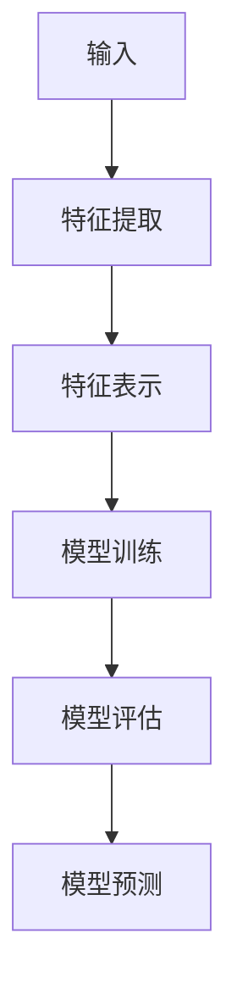

                 

### 文章标题

《Supervised Learning原理与代码实例讲解》

监督学习是机器学习中的重要分支，通过学习已标记的数据，监督学习算法能够预测未知数据的结果。本文将深入讲解监督学习的基本概念、核心算法原理，并提供丰富的代码实例，帮助读者全面理解并掌握监督学习技术。文章分为七个部分，依次探讨监督学习的概念与历史背景、线性回归模型、逻辑回归模型、决策树与随机森林、支持向量机（SVM）、神经网络与深度学习基础，以及监督学习的评估与优化方法。附录部分还将提供实用的资源与工具，方便读者进一步学习和实践。通过本文的详细讲解，读者将能够全面掌握监督学习，为未来的研究与应用奠定坚实基础。

### 关键词

- 监督学习
- 线性回归
- 逻辑回归
- 决策树
- 随机森林
- 支持向量机（SVM）
- 神经网络
- 深度学习
- 评估与优化

### 摘要

监督学习是机器学习中的重要分支，通过已标记的数据训练模型，实现对新数据的预测。本文详细讲解了监督学习的基本概念、核心算法原理，包括线性回归、逻辑回归、决策树与随机森林、支持向量机（SVM）、神经网络与深度学习等。通过丰富的代码实例，读者将能够理解并掌握这些算法的实现与应用。文章还探讨了监督学习的评估与优化方法，包括模型评估指标、超参数调优和模型优化技术。附录部分提供了实用的资源和工具，便于读者进一步学习和实践。本文旨在为读者提供一个全面、系统的监督学习教程，帮助其掌握这一重要的机器学习技术。

### 《Supervised Learning原理与代码实例讲解》目录大纲

#### 第一部分：基础知识与核心概念

1. **第1章：监督学习的概念与历史背景**
    - 监督学习的定义与分类
    - 监督学习的应用领域
    - 监督学习的历史背景与发展历程

2. **第2章：线性回归模型**
    - 线性回归模型的数学基础
    - 最小二乘法与梯度下降法
    - 线性回归模型的实现与优化

3. **第3章：逻辑回归模型**
    - 逻辑回归模型的数学基础
    - Sigmoid函数与损失函数
    - 逻辑回归模型的实现与应用

4. **第4章：决策树与随机森林**
    - 决策树的构建原理
    - 随机森林的概念与构建
    - 决策树与随机森林的应用

5. **第5章：支持向量机（SVM）**
    - SVM的数学原理
    - 线性SVM与非线SVM
    - SVM的实现与应用

6. **第6章：神经网络与深度学习基础**
    - 神经网络的基本架构
    - 前馈神经网络与反向传播算法
    - 深度学习的基础概念与应用

7. **第7章：监督学习的评估与优化**
    - 模型评估指标
    - 超参数调优
    - 模型优化方法

#### 附录：资源与工具

- **附录 A：Python监督学习库**
    - Scikit-learn
    - TensorFlow
    - PyTorch

- **附录 B：深度学习框架与工具**
    - Keras
    - Theano
    - MXNet

- **附录 C：在线学习资源**
    - Coursera
    - edX
    - Udacity
    - 其他在线课程平台

- **附录 D：实用代码示例**
    - 线性回归
    - 逻辑回归
    - 决策树
    - 支持向量机（SVM）
    - 卷积神经网络（CNN）
    - 循环神经网络（RNN）

- **附录 E：参考文献**
    - 监督学习相关书籍
    - 深度学习相关书籍
    - 数据挖掘与机器学习相关书籍
    - 其他相关书籍与论文

### 第一部分：基础知识与核心概念

#### 第1章 监督学习的概念与历史背景

监督学习（Supervised Learning）是机器学习中的一种重要方法，它通过利用已标记的数据（即已知输入和输出对）来训练模型，从而能够对新数据进行预测。本章将介绍监督学习的定义、分类、应用领域以及其发展历程。

### 1.1 监督学习的定义与分类

监督学习的定义可以概括为：通过训练数据集来学习输入和输出之间的映射关系，然后使用训练好的模型对新数据进行预测。

监督学习主要分为以下几类：

1. **回归问题（Regression）**：预测一个连续的数值输出。例如，预测房价、股票价格等。

2. **分类问题（Classification）**：预测一个离散的类别输出。例如，邮件分类、疾病诊断等。

3. **异常检测（Anomaly Detection）**：检测数据中的异常或离群点。

4. **序列标注（Sequence Labeling）**：对序列数据进行标注，如语音识别、文本分类等。

### 1.2 监督学习的应用领域

监督学习在各个领域都有广泛的应用，以下是一些典型的应用场景：

1. **金融领域**：用于信用评分、风险控制、股票市场预测等。

2. **医疗领域**：用于疾病诊断、药物发现、健康监测等。

3. **图像识别**：用于人脸识别、物体识别、图像分类等。

4. **自然语言处理**：用于文本分类、情感分析、机器翻译等。

5. **推荐系统**：用于个性化推荐、商品推荐、广告投放等。

### 1.3 监督学习的历史背景与发展历程

监督学习的历史可以追溯到20世纪50年代和60年代，当时一些早期的算法，如线性回归和决策树，开始被用于解决分类和回归问题。

1. **线性回归**：1950年代，Hawkins和Bledsoe提出了线性回归模型，用于解决连续值的预测问题。

2. **决策树**：1960年代，J. Ross Quinlan提出了ID3算法，用于分类问题。

3. **支持向量机（SVM）**：1990年代，V. N. Vapnik和A. Y. Chervonenkis提出了支持向量机，用于高维空间的分类和回归问题。

4. **神经网络**：1980年代，神经网络的研究得到快速发展，反向传播算法的提出使得多层神经网络的训练成为可能。

随着计算机技术和算法的发展，监督学习领域也在不断进步，各种新算法和新模型不断涌现，如随机森林、梯度提升机、深度学习等，为解决复杂问题提供了强大的工具。

### 监督学习的核心概念与联系

监督学习的核心概念包括输入（特征）、输出（标签）、模型训练、模型评估等。这些概念之间的联系可以用以下Mermaid流程图来表示：



在这个流程图中，输入数据首先经过特征提取和特征表示，转化为适合模型训练的数据形式。然后，模型通过训练数据集进行学习，得到预测模型。最后，使用测试数据集对模型进行评估，并根据评估结果对模型进行调整和优化。通过这个流程，监督学习算法能够对新数据进行预测。

### 监督学习的数学模型

在监督学习中，常用的数学模型包括线性回归、逻辑回归、决策树、支持向量机等。这些模型基于不同的数学原理，用于解决不同的预测问题。

1. **线性回归模型**：线性回归模型通过拟合输入特征和输出标签之间的线性关系来预测连续值。其数学模型可以表示为：

   $$ y = \beta_0 + \beta_1x_1 + \beta_2x_2 + ... + \beta_nx_n $$

   其中，$y$ 是输出标签，$x_1, x_2, ..., x_n$ 是输入特征，$\beta_0, \beta_1, \beta_2, ..., \beta_n$ 是模型的参数。

2. **逻辑回归模型**：逻辑回归模型用于解决分类问题，其核心是通过对输入特征进行线性组合，然后通过Sigmoid函数进行非线性变换，得到概率分布。其数学模型可以表示为：

   $$ P(y=1) = \frac{1}{1 + e^{-(\beta_0 + \beta_1x_1 + \beta_2x_2 + ... + \beta_nx_n)}} $$

   其中，$P(y=1)$ 是预测目标属于类别1的概率。

3. **决策树模型**：决策树模型通过一系列的判断节点和叶子节点来对输入特征进行分类。其数学模型可以表示为：

   $$ T(x) = \prod_{i=1}^{n} g_i(x_i) $$

   其中，$T(x)$ 是决策树对输入特征$x$的分类结果，$g_i(x_i)$ 是第$i$个节点的分类规则。

4. **支持向量机（SVM）模型**：支持向量机模型通过找到一个最优的超平面来分割数据。其数学模型可以表示为：

   $$ \min_{\beta, \beta_0} \frac{1}{2} ||\beta||^2 + C \sum_{i=1}^{n} \max(0, 1 - y_i(\beta^T x_i + \beta_0)) $$

   其中，$\beta$ 是模型参数，$\beta_0$ 是偏置项，$C$ 是惩罚参数，$y_i$ 是第$i$个样本的标签，$x_i$ 是第$i$个样本的特征向量。

这些数学模型为我们提供了理论基础和算法框架，通过具体实现和优化，可以应用于各种实际的预测问题。

### 监督学习的实现与优化方法

监督学习的实现与优化方法主要包括数据预处理、模型选择、模型训练和模型评估等步骤。以下将详细讲解这些步骤的实现方法。

#### 数据预处理

数据预处理是监督学习中的重要步骤，它包括数据清洗、数据转换和数据归一化等。

1. **数据清洗**：清洗数据包括处理缺失值、去除噪声数据和异常值等。常见的方法有填充缺失值、删除异常值、上下界裁剪等。

2. **数据转换**：将类别型数据转换为数值型数据，可以使用独热编码、标签编码等方法。

3. **数据归一化**：将不同特征的数据范围统一，常用的方法有最小-最大归一化和标准归一化等。

#### 模型选择

模型选择是根据具体的问题和数据的特性，选择合适的模型。常见的模型有线性回归、逻辑回归、决策树、随机森林、支持向量机、神经网络等。

1. **线性回归**：适用于回归问题，需要满足线性可分条件。

2. **逻辑回归**：适用于分类问题，通过Sigmoid函数将线性模型转化为概率模型。

3. **决策树**：适用于分类和回归问题，通过树结构进行特征选择和分类。

4. **随机森林**：通过集成多个决策树模型来提高预测准确性，适用于各种问题。

5. **支持向量机**：适用于高维空间分类和回归问题，通过找到最优超平面进行分割。

6. **神经网络**：适用于复杂的非线性问题，通过多层神经网络进行特征提取和分类。

#### 模型训练

模型训练是通过已标记的数据集来调整模型参数，使其能够对新数据进行预测。常见的训练算法有梯度下降法、随机梯度下降法、批量梯度下降法等。

1. **梯度下降法**：通过计算损失函数的梯度，逐步调整模型参数，直到损失函数收敛。

2. **随机梯度下降法**：每次迭代只随机选择一个样本进行参数更新，收敛速度较快。

3. **批量梯度下降法**：每次迭代使用全部样本进行参数更新，收敛速度较慢。

#### 模型评估

模型评估是通过测试数据集来评估模型的预测性能。常用的评估指标有准确率、召回率、F1分数、ROC曲线和AUC指标等。

1. **准确率**：预测正确的样本数占总样本数的比例。

2. **召回率**：预测正确的正类样本数占总正类样本数的比例。

3. **F1分数**：准确率的调和平均值，综合考虑了准确率和召回率。

4. **ROC曲线和AUC指标**：ROC曲线反映了不同阈值下的预测性能，AUC指标表示曲线下的面积，值越大表示性能越好。

#### 超参数调优

超参数调优是通过调整模型的超参数来优化模型性能。常用的方法有网格搜索和随机搜索。

1. **网格搜索**：遍历所有可能的超参数组合，找到最优的组合。

2. **随机搜索**：在给定的超参数范围内随机选择组合，通过多次实验找到最优的组合。

#### 模型优化方法

模型优化方法包括正则化技术、模型集成和增强等。

1. **正则化技术**：通过添加正则项到损失函数中，防止模型过拟合。

2. **模型集成**：通过组合多个模型来提高预测性能，如随机森林、梯度提升机等。

3. **模型增强**：通过增加训练数据、使用深度学习等方法来提高模型性能。

### 线性回归模型

线性回归模型是监督学习中最基本和最常用的算法之一，它通过拟合输入特征和输出标签之间的线性关系来进行预测。本章将详细讲解线性回归模型的数学基础、实现方法以及优化技术。

#### 2.1 线性回归模型的数学基础

线性回归模型的基本假设是输入特征和输出标签之间存在线性关系，其数学模型可以表示为：

\[ y = \beta_0 + \beta_1x_1 + \beta_2x_2 + ... + \beta_nx_n + \epsilon \]

其中，\( y \) 是输出标签，\( x_1, x_2, ..., x_n \) 是输入特征，\( \beta_0, \beta_1, \beta_2, ..., \beta_n \) 是模型参数，\( \epsilon \) 是误差项。

为了求解模型的参数，我们通常使用最小二乘法（Least Squares Method）来最小化误差的平方和。具体来说，我们需要求解以下优化问题：

\[ \min_{\beta} \sum_{i=1}^{n} (y_i - \beta_0 - \beta_1x_{1i} - \beta_2x_{2i} - ... - \beta_nx_{ni})^2 \]

这个优化问题的解可以通过以下公式得到：

\[ \beta = (\X^T \X)^{-1} \X^T y \]

其中，\( \X \) 是特征矩阵，\( y \) 是输出标签向量，\( \beta \) 是模型参数向量。

#### 2.1.1 最小二乘法

最小二乘法是一种常用的优化方法，它通过最小化误差的平方和来求解模型的参数。具体来说，最小二乘法的求解步骤如下：

1. **初始化模型参数**：通常从零开始初始化模型参数，也可以使用其他初始化方法。

2. **计算误差的平方和**：对于每个训练样本，计算预测值和实际值之间的误差的平方和。

3. **计算梯度**：计算误差的梯度，即模型参数的导数。

4. **更新模型参数**：根据梯度更新模型参数，以最小化误差的平方和。

5. **迭代优化**：重复上述步骤，直到模型参数收敛或达到预定的迭代次数。

最小二乘法是一种线性优化方法，它适用于线性回归模型。在实际应用中，我们通常使用数值优化方法，如梯度下降法，来求解最小二乘问题。

#### 2.1.2 梯度下降法

梯度下降法是一种通用的优化方法，它通过计算目标函数的梯度来更新模型参数，从而最小化目标函数。对于线性回归模型，梯度下降法的求解步骤如下：

1. **初始化模型参数**：通常从零开始初始化模型参数，也可以使用其他初始化方法。

2. **计算梯度**：计算损失函数关于模型参数的梯度。

3. **更新模型参数**：根据梯度更新模型参数，更新公式为：

   \[ \beta = \beta - \alpha \nabla_\beta J(\beta) \]

   其中，\( \beta \) 是模型参数，\( \alpha \) 是学习率，\( \nabla_\beta J(\beta) \) 是损失函数关于模型参数的梯度。

4. **迭代优化**：重复上述步骤，直到模型参数收敛或达到预定的迭代次数。

梯度下降法的优点是简单易实现，适用于各种优化问题。然而，梯度下降法也存在一些缺点，如收敛速度慢、易陷入局部最小值等。在实际应用中，我们可以通过调整学习率、引入动量等方法来优化梯度下降法的性能。

#### 2.2 线性回归模型的实现与优化

线性回归模型的实现包括数据预处理、模型训练和模型评估等步骤。以下将详细讲解这些步骤的实现方法。

##### 2.2.1 代码实现示例

以下是一个简单的线性回归模型的Python实现示例：

```python
import numpy as np

# 模型参数初始化
beta = np.zeros(shape=(n_features + 1, 1))

# 梯度下降法
def gradient_descent(X, y, beta, alpha, n_iterations):
    for i in range(n_iterations):
        # 计算预测值
        y_pred = X.dot(beta)
        
        # 计算损失函数
        error = y - y_pred
        
        # 计算梯度
        gradient = X.T.dot(error)
        
        # 更新模型参数
        beta = beta - alpha * gradient
        
    return beta

# 数据预处理
def preprocess_data(X, y):
    # 增加偏置项
    X = np.concatenate((np.ones((X.shape[0], 1)), X), axis=1)
    
    # 归一化数据
    X_mean = np.mean(X, axis=0)
    X_std = np.std(X, axis=0)
    X = (X - X_mean) / X_std
    
    # 增加偏置项
    y_mean = np.mean(y)
    y_std = np.std(y)
    y = (y - y_mean) / y_std
    
    return X, y

# 模型训练与评估
def train_and_evaluate(X_train, y_train, X_test, y_test):
    # 数据预处理
    X_train, y_train = preprocess_data(X_train, y_train)
    X_test, y_test = preprocess_data(X_test, y_test)
    
    # 模型训练
    beta = gradient_descent(X_train, y_train, beta, alpha=0.01, n_iterations=1000)
    
    # 模型评估
    y_pred_train = X_train.dot(beta)
    y_pred_test = X_test.dot(beta)
    
    # 计算训练集与测试集的损失函数
    loss_train = np.mean((y_train - y_pred_train)**2)
    loss_test = np.mean((y_test - y_pred_test)**2)
    
    return beta, loss_train, loss_test

# 示例数据
X_train = np.array([[1, 2], [2, 3], [3, 4], [4, 5]])
y_train = np.array([2, 3, 4, 5])
X_test = np.array([[0, 1], [1, 2]])
y_test = np.array([1, 2])

# 模型训练与评估
beta, loss_train, loss_test = train_and_evaluate(X_train, y_train, X_test, y_test)

print("Model parameters:", beta)
print("Training loss:", loss_train)
print("Test loss:", loss_test)
```

在这个示例中，我们首先初始化模型参数为0，然后使用梯度下降法进行模型训练。数据预处理步骤包括增加偏置项和归一化数据。最后，我们使用训练集和测试集对模型进行评估，并计算训练集和测试集的损失函数。

##### 2.2.2 模型评估与优化方法

模型评估是监督学习中的重要环节，它用于评估模型的预测性能。常用的评估指标包括准确率、召回率、F1分数、ROC曲线和AUC指标等。

1. **准确率（Accuracy）**：准确率是预测正确的样本数占总样本数的比例。其计算公式为：

   \[ Accuracy = \frac{TP + TN}{TP + TN + FP + FN} \]

   其中，\( TP \) 是真正例，\( TN \) 是真负例，\( FP \) 是假正例，\( FN \) 是假负例。

2. **召回率（Recall）**：召回率是预测正确的正类样本数占总正类样本数的比例。其计算公式为：

   \[ Recall = \frac{TP}{TP + FN} \]

3. **F1分数（F1 Score）**：F1分数是准确率和召回率的调和平均值。其计算公式为：

   \[ F1 Score = 2 \times \frac{Precision \times Recall}{Precision + Recall} \]

   其中，\( Precision \) 是精确率。

4. **ROC曲线（Receiver Operating Characteristic Curve）**：ROC曲线是用于评估二分类模型性能的曲线，它反映了不同阈值下的预测性能。

5. **AUC指标（Area Under Curve）**：AUC指标是ROC曲线下的面积，用于评估模型的分类能力。

为了优化模型性能，我们可以使用以下方法：

1. **交叉验证（Cross Validation）**：交叉验证是一种评估模型性能的方法，它通过将数据集划分为多个子集，分别用于训练和测试模型，从而减少过拟合和模型选择偏差。

2. **网格搜索（Grid Search）**：网格搜索是一种超参数调优方法，它通过遍历所有可能的超参数组合，找到最优的超参数组合。

3. **随机搜索（Random Search）**：随机搜索是一种基于随机采样的超参数调优方法，它通过在给定的超参数范围内随机选择组合，找到最优的超参数组合。

4. **正则化（Regularization）**：正则化是一种防止模型过拟合的方法，它通过在损失函数中添加正则项来减少模型的复杂度。

5. **模型集成（Model Ensemble）**：模型集成是一种通过组合多个模型来提高预测性能的方法，常用的集成方法有随机森林、梯度提升机等。

### 逻辑回归模型

逻辑回归（Logistic Regression）是一种常用的分类算法，它通过构建一个线性模型来预测概率，然后使用这个概率来对样本进行分类。本章将详细讲解逻辑回归模型的数学基础、实现方法以及优化技术。

#### 3.1 逻辑回归模型的数学基础

逻辑回归模型的基本假设是输入特征和输出标签之间存在线性关系。其数学模型可以表示为：

\[ P(y=1) = \frac{1}{1 + e^{-(\beta_0 + \beta_1x_1 + \beta_2x_2 + ... + \beta_nx_n)}} \]

其中，\( P(y=1) \) 是预测目标属于类别1的概率，\( x_1, x_2, ..., x_n \) 是输入特征，\( \beta_0, \beta_1, \beta_2, ..., \beta_n \) 是模型参数。

逻辑回归模型的核心在于如何求解这些参数，使其能够正确预测概率。这里我们主要介绍两种求解方法：最小化损失函数和极大似然估计。

##### 3.1.1 Sigmoid函数

在逻辑回归模型中，我们使用Sigmoid函数来将线性组合映射到概率值。Sigmoid函数的定义如下：

\[ \sigma(z) = \frac{1}{1 + e^{-z}} \]

Sigmoid函数的输出范围在0到1之间，可以很好地表示概率值。对于给定的输入特征\( x \)，我们首先计算线性组合\( z = \beta_0 + \beta_1x_1 + \beta_2x_2 + ... + \beta_nx_n \)，然后通过Sigmoid函数将其映射到概率值。

##### 3.1.2 损失函数与优化算法

在逻辑回归中，我们通常使用对数似然损失函数（Log-Likelihood Loss）来评估模型的性能。对数似然损失函数的定义如下：

\[ J(\beta) = -\frac{1}{n} \sum_{i=1}^{n} [y_i \log(\hat{y}_i) + (1 - y_i) \log(1 - \hat{y}_i)] \]

其中，\( \hat{y}_i = \sigma(z_i) \) 是第\( i \)个样本的预测概率，\( y_i \) 是第\( i \)个样本的实际标签，\( n \) 是样本总数。

为了求解模型参数\( \beta \)，我们需要最小化损失函数\( J(\beta) \)。常用的优化算法有梯度下降法（Gradient Descent）和极大似然估计法（Maximum Likelihood Estimation）。

1. **梯度下降法**：梯度下降法是一种通用的优化算法，它通过计算损失函数的梯度来更新模型参数。梯度下降法的步骤如下：

   - 初始化模型参数\( \beta \)。
   - 计算损失函数\( J(\beta) \)关于模型参数的梯度。
   - 更新模型参数：\( \beta = \beta - \alpha \nabla_\beta J(\beta) \)，其中\( \alpha \)是学习率。
   - 重复步骤2和3，直到模型参数收敛或达到预定的迭代次数。

2. **极大似然估计法**：极大似然估计法是一种基于概率模型的优化方法，它通过最大化似然函数来求解模型参数。极大似然估计法的步骤如下：

   - 构建似然函数：\( L(\beta) = \prod_{i=1}^{n} P(y_i|\beta) \)。
   - 求解似然函数的最大值：\( \beta^* = \arg\max_{\beta} L(\beta) \)。
   - 由于似然函数的对数是凸函数，可以使用数值优化方法（如牛顿法、拟牛顿法等）求解最大值。

#### 3.2 逻辑回归模型的实现与应用

逻辑回归模型在实际应用中非常广泛，以下是一个简单的逻辑回归模型的Python实现示例：

```python
import numpy as np
from sklearn.linear_model import LogisticRegression

# 数据预处理
def preprocess_data(X, y):
    # 增加偏置项
    X = np.concatenate((np.ones((X.shape[0], 1)), X), axis=1)
    return X, y

# 模型训练
def train_model(X, y):
    X, y = preprocess_data(X, y)
    model = LogisticRegression()
    model.fit(X, y)
    return model

# 模型评估
def evaluate_model(model, X_test, y_test):
    X_test, _ = preprocess_data(X_test, y_test)
    y_pred = model.predict(X_test)
    accuracy = np.mean(y_pred == y_test)
    return accuracy

# 示例数据
X_train = np.array([[1, 2], [2, 3], [3, 4], [4, 5]])
y_train = np.array([0, 1, 0, 1])
X_test = np.array([[0, 1], [1, 2]])
y_test = np.array([1, 0])

# 模型训练与评估
model = train_model(X_train, y_train)
accuracy = evaluate_model(model, X_test, y_test)
print("Accuracy:", accuracy)
```

在这个示例中，我们使用scikit-learn库中的LogisticRegression类来实现逻辑回归模型。数据预处理步骤包括增加偏置项，模型训练和评估步骤分别使用了fit方法和predict方法。

#### 3.2.2 模型评估与优化方法

逻辑回归模型的评估与优化方法主要包括准确率、召回率、F1分数、ROC曲线和AUC指标等。以下分别介绍这些评估指标的计算方法和优化技术。

1. **准确率（Accuracy）**：准确率是预测正确的样本数占总样本数的比例。其计算公式为：

   \[ Accuracy = \frac{TP + TN}{TP + TN + FP + FN} \]

   其中，\( TP \) 是真正例，\( TN \) 是真负例，\( FP \) 是假正例，\( FN \) 是假负例。

2. **召回率（Recall）**：召回率是预测正确的正类样本数占总正类样本数的比例。其计算公式为：

   \[ Recall = \frac{TP}{TP + FN} \]

3. **F1分数（F1 Score）**：F1分数是准确率和召回率的调和平均值。其计算公式为：

   \[ F1 Score = 2 \times \frac{Precision \times Recall}{Precision + Recall} \]

   其中，\( Precision \) 是精确率。

4. **ROC曲线（Receiver Operating Characteristic Curve）**：ROC曲线是用于评估二分类模型性能的曲线，它反映了不同阈值下的预测性能。

5. **AUC指标（Area Under Curve）**：AUC指标是ROC曲线下的面积，用于评估模型的分类能力。

为了优化模型性能，我们可以使用以下方法：

1. **交叉验证（Cross Validation）**：交叉验证是一种评估模型性能的方法，它通过将数据集划分为多个子集，分别用于训练和测试模型，从而减少过拟合和模型选择偏差。

2. **网格搜索（Grid Search）**：网格搜索是一种超参数调优方法，它通过遍历所有可能的超参数组合，找到最优的超参数组合。

3. **随机搜索（Random Search）**：随机搜索是一种基于随机采样的超参数调优方法，它通过在给定的超参数范围内随机选择组合，找到最优的超参数组合。

4. **正则化（Regularization）**：正则化是一种防止模型过拟合的方法，它通过在损失函数中添加正则项来减少模型的复杂度。

5. **模型集成（Model Ensemble）**：模型集成是一种通过组合多个模型来提高预测性能的方法，常用的集成方法有随机森林、梯度提升机等。

### 决策树与随机森林

决策树（Decision Tree）是一种常见的分类和回归方法，通过一系列的判断节点和叶子节点来对输入特征进行分类或回归。随机森林（Random Forest）是一种基于决策树的集成方法，通过构建多个决策树并取平均值来提高预测性能。本章将详细讲解决策树的构建原理、随机森林的构建方法以及它们的应用。

#### 4.1 决策树的构建原理

决策树是一种树形结构，其中每个内部节点表示一个特征，每个分支表示该特征的取值，每个叶子节点表示一个类或回归值。决策树的构建过程可以分为以下步骤：

1. **选择最优特征**：从所有特征中选择一个最优特征，通常使用信息增益（Information Gain）或基尼不纯度（Gini Impurity）来度量特征的重要性。

2. **划分数据**：根据最优特征的不同取值，将数据集划分为多个子集。

3. **递归构建子树**：对每个子集重复步骤1和2，直到满足停止条件（如最大深度、最小叶节点样本数等）。

4. **生成叶子节点**：将满足停止条件的子集标记为叶子节点，并赋予一个类或回归值。

决策树的基本算法包括ID3算法、C4.5算法和CART算法。ID3算法使用信息增益来选择特征，C4.5算法在信息增益的基础上增加了剪枝策略，CART算法使用基尼不纯度来选择特征。

##### 4.1.1 ID3算法

ID3算法是一种基于信息增益的决策树构建算法。信息增益是衡量特征重要性的指标，它表示特征将数据集划分为不同子集后的信息熵减少量。ID3算法的步骤如下：

1. **计算信息熵**：对于给定的数据集，计算其信息熵。信息熵定义为：

   \[ Entropy(D) = -\sum_{i=1}^{k} p_i \log_2 p_i \]

   其中，\( D \) 是数据集，\( k \) 是类别的数量，\( p_i \) 是数据集中属于类别\( i \)的样本比例。

2. **计算信息增益**：对于每个特征，计算其在数据集上划分后的信息熵减少量。信息增益定义为：

   \[ IG(D, A) = Entropy(D) - \sum_{v=1}^{m} p_v Entropy(D_v) \]

   其中，\( A \) 是特征，\( v \) 是特征的取值，\( D_v \) 是特征取值为\( v \)的数据集。

3. **选择最优特征**：选择信息增益最大的特征作为节点特征，并按照该特征的不同取值划分数据集。

4. **递归构建子树**：对每个子集重复步骤1和2，直到满足停止条件。

##### 4.1.2 C4.5算法

C4.5算法是对ID3算法的改进，它在信息增益的基础上增加了剪枝策略。C4.5算法的步骤如下：

1. **计算信息增益率**：信息增益率是信息增益除以特征分裂带来的纯度增加。信息增益率定义为：

   \[ Gain Ratio(D, A) = \frac{IG(D, A)}{Split Information(D, A)} \]

   其中，\( Split Information(D, A) \) 是特征分裂带来的纯度增加，定义为：

   \[ Split Information(D, A) = -\sum_{v=1}^{m} \frac{p_v}{n} \log_2 \frac{p_v}{n} \]

   其中，\( n \) 是数据集大小。

2. **选择最优特征**：选择信息增益率最大的特征作为节点特征，并按照该特征的不同取值划分数据集。

3. **剪枝**：为了防止过拟合，C4.5算法采用剪枝策略。剪枝分为预剪枝和后剪枝两种：

   - **预剪枝**：在构建决策树时，提前停止生长子树的条件，如最小叶节点样本数或最大树深度。
   - **后剪枝**：先构建完整的决策树，然后从叶子节点开始剪枝，直到满足剪枝条件。

##### 4.1.3 CART算法

CART算法（分类与回归树）是一种基于基尼不纯度的决策树构建算法。基尼不纯度是衡量特征重要性的指标，它表示特征将数据集划分为不同子集后的基尼系数增加量。CART算法的步骤如下：

1. **计算基尼不纯度**：对于给定的数据集，计算其基尼不纯度。基尼不纯度定义为：

   \[ Gini(D) = 1 - \sum_{i=1}^{k} p_i^2 \]

   其中，\( D \) 是数据集，\( k \) 是类别的数量，\( p_i \) 是数据集中属于类别\( i \)的样本比例。

2. **计算信息增益**：对于每个特征，计算其在数据集上划分后的基尼不纯度减少量。信息增益定义为：

   \[ IG(D, A) = Gini(D) - \sum_{v=1}^{m} \frac{p_v}{n} Gini(D_v) \]

   其中，\( A \) 是特征，\( v \) 是特征的取值，\( D_v \) 是特征取值为\( v \)的数据集。

3. **选择最优特征**：选择信息增益最大的特征作为节点特征，并按照该特征的不同取值划分数据集。

4. **递归构建子树**：对每个子集重复步骤1和2，直到满足停止条件。

#### 4.2 随机森林的构建原理

随机森林是一种基于决策树的集成方法，通过构建多个决策树并取平均值来提高预测性能。随机森林的构建原理如下：

1. **特征选择**：在构建每个决策树时，从所有特征中随机选择一个特征作为节点特征。

2. **子集划分**：在每个决策树上，从原始数据集的子集中随机选择一部分样本进行划分。

3. **随机剪枝**：在每个决策树上，随机选择剪枝条件，如最小叶节点样本数或最大树深度。

4. **集成预测**：对每个决策树进行预测，然后取平均值或多数投票作为最终预测结果。

随机森林的优点包括：

1. **提高预测性能**：通过构建多个决策树，随机森林可以减少过拟合，提高预测性能。

2. **鲁棒性**：随机森林对噪声数据具有较强的鲁棒性，不容易受到噪声数据的影响。

3. **特征重要性评估**：随机森林可以评估每个特征的重要性，有助于理解数据特征。

#### 4.3 决策树与随机森林的应用

决策树和随机森林在实际应用中非常广泛，以下是一些典型的应用场景：

1. **分类问题**：决策树和随机森林可以用于分类问题，如邮件分类、文本分类、图像分类等。

2. **回归问题**：决策树和随机森林可以用于回归问题，如房价预测、股票价格预测等。

3. **异常检测**：决策树和随机森林可以用于异常检测，如信用卡欺诈检测、医疗数据异常检测等。

4. **推荐系统**：决策树和随机森林可以用于推荐系统，如商品推荐、广告推荐等。

5. **文本分析**：决策树和随机森林可以用于文本分析，如情感分析、主题分类等。

#### 实际案例分析

以下是一个使用决策树和随机森林进行邮件分类的案例：

**问题描述**：给定一组邮件数据，其中包含邮件内容和标签（正常邮件或垃圾邮件），使用决策树和随机森林对邮件进行分类。

**数据预处理**：

1. **文本预处理**：对邮件内容进行分词、去停用词、词干提取等预处理。

2. **特征提取**：将预处理后的文本转换为特征向量，可以使用TF-IDF、Word2Vec等方法。

3. **数据划分**：将数据集划分为训练集和测试集。

**模型训练与评估**：

1. **决策树模型**：使用C4.5算法构建决策树模型，对训练集进行训练。

2. **随机森林模型**：使用随机森林算法构建模型，对训练集进行训练。

3. **模型评估**：使用测试集对模型进行评估，计算准确率、召回率、F1分数等指标。

**结果分析**：

1. **模型性能比较**：比较决策树和随机森林的模型性能，选择性能较好的模型。

2. **特征重要性分析**：分析特征的重要性，了解哪些特征对分类结果有较大影响。

3. **优化策略**：根据结果分析，调整模型参数或特征提取方法，进一步优化模型性能。

### 支持向量机（SVM）

支持向量机（Support Vector Machine，SVM）是一种经典的机器学习算法，主要用于分类和回归问题。SVM通过寻找最优的超平面来分割数据，使得分类边界最大化。本章将详细讲解SVM的数学原理、实现方法以及应用。

#### 5.1 SVM的数学原理

SVM的核心思想是寻找一个最优的超平面，使得正类和负类之间的边界最大化。在二维空间中，最优超平面可以通过以下方程表示：

\[ w \cdot x - b = 0 \]

其中，\( w \) 是权重向量，\( x \) 是特征向量，\( b \) 是偏置项。

为了确定最优超平面，我们需要最大化目标函数：

\[ \max_{w, b} \frac{1}{2} ||w||^2 \]

同时，我们希望所有正类样本点到超平面的距离最大，即：

\[ \max_{w, b} \sum_{i=1}^{n} (y_i (w \cdot x_i - b)) \]

其中，\( y_i \) 是第\( i \)个样本的标签，\( n \) 是样本数量。

为了解决这个优化问题，我们引入拉格朗日乘子法。拉格朗日函数为：

\[ L(w, b, \alpha) = \frac{1}{2} ||w||^2 - \sum_{i=1}^{n} \alpha_i (y_i (w \cdot x_i - b)) \]

其中，\( \alpha_i \) 是拉格朗日乘子。

对拉格朗日函数求偏导，并令其等于0，得到以下方程组：

\[ \begin{cases} 
w = \sum_{i=1}^{n} \alpha_i y_i x_i \\
0 = \sum_{i=1}^{n} \alpha_i y_i 
\end{cases} \]

通过解这个方程组，我们可以求得最优的权重向量\( w \)和偏置项\( b \)。

对于非线性问题，我们可以使用核函数（Kernel Function）将输入特征映射到高维空间，使得原本线性不可分的数据在高维空间中线性可分。常用的核函数包括线性核、多项式核、径向基函数（RBF）核等。

#### 5.2 SVM的实现与应用

SVM的实现主要包括模型训练和模型预测两个步骤。

##### 5.2.1 线性SVM

线性SVM的Python实现示例：

```python
import numpy as np
from sklearn.svm import SVC

# 数据预处理
def preprocess_data(X, y):
    X = np.insert(X, 0, 1, axis=1)
    return X, y

# 模型训练
def train_svm(X, y):
    X, y = preprocess_data(X, y)
    model = SVC(kernel='linear')
    model.fit(X, y)
    return model

# 模型预测
def predict_svm(model, X):
    X = np.insert(X, 0, 1, axis=1)
    return model.predict(X)

# 示例数据
X_train = np.array([[1, 2], [2, 3], [3, 4], [4, 5]])
y_train = np.array([0, 0, 1, 1])
X_test = np.array([[0, 1], [1, 2]])
y_test = np.array([1, 0])

# 模型训练与预测
model = train_svm(X_train, y_train)
y_pred = predict_svm(model, X_test)
print("Predictions:", y_pred)
```

在这个示例中，我们使用scikit-learn库中的SVC类来实现线性SVM。首先，我们将数据预处理为标准形式，然后使用fit方法进行模型训练，最后使用predict方法进行模型预测。

##### 5.2.2 非线性SVM

非线性SVM的Python实现示例：

```python
import numpy as np
from sklearn.svm import SVC

# 数据预处理
def preprocess_data(X, y):
    X = np.insert(X, 0, 1, axis=1)
    return X, y

# 模型训练
def train_svm(X, y):
    X, y = preprocess_data(X, y)
    model = SVC(kernel='rbf')
    model.fit(X, y)
    return model

# 模型预测
def predict_svm(model, X):
    X = np.insert(X, 0, 1, axis=1)
    return model.predict(X)

# 示例数据
X_train = np.array([[1, 2], [2, 3], [3, 4], [4, 5]])
y_train = np.array([0, 0, 1, 1])
X_test = np.array([[0, 1], [1, 2]])
y_test = np.array([1, 0])

# 模型训练与预测
model = train_svm(X_train, y_train)
y_pred = predict_svm(model, X_test)
print("Predictions:", y_pred)
```

在这个示例中，我们使用RBF核函数来实现非线性SVM。首先，我们将数据预处理为标准形式，然后使用fit方法进行模型训练，最后使用predict方法进行模型预测。

#### 5.3 SVM在数据挖掘中的应用

SVM在数据挖掘中有着广泛的应用，以下是一些典型的应用场景：

1. **图像分类**：SVM可以用于图像分类问题，如人脸识别、物体识别等。通过将图像特征映射到高维空间，SVM能够找到合适的分类边界，从而实现准确分类。

2. **文本分类**：SVM可以用于文本分类问题，如邮件分类、情感分析等。通过将文本特征转换为向量，SVM能够利用核函数找到合适的分类边界，从而实现准确分类。

3. **生物信息学**：SVM可以用于生物信息学问题，如基因分类、蛋白质结构预测等。通过将生物数据转换为特征向量，SVM能够找到合适的分类边界，从而实现准确分类。

4. **金融领域**：SVM可以用于金融领域问题，如信用评分、股票市场预测等。通过将金融数据转换为特征向量，SVM能够找到合适的分类边界，从而实现准确预测。

#### 实际案例解析

以下是一个使用SVM进行手写数字识别的案例：

**问题描述**：给定一组手写数字图像，使用SVM对其进行分类。

**数据集**：MNIST数据集，包含60000个手写数字图像，每个图像是28x28的像素矩阵。

**数据预处理**：

1. **图像预处理**：将图像转换为灰度图像，并缩放到固定大小。

2. **特征提取**：使用像素矩阵作为特征向量。

3. **数据划分**：将数据集划分为训练集和测试集。

**模型训练与评估**：

1. **模型训练**：使用SVM对训练集进行训练。

2. **模型评估**：使用测试集对模型进行评估，计算准确率、召回率、F1分数等指标。

**结果分析**：

1. **模型性能**：比较不同参数（如C、kernel类型）对模型性能的影响，选择最优参数。

2. **特征重要性**：分析特征的重要性，了解哪些特征对分类结果有较大影响。

3. **优化策略**：根据结果分析，调整模型参数或特征提取方法，进一步优化模型性能。

通过这个案例，我们可以看到SVM在图像分类任务中的应用效果。SVM能够通过核函数将图像特征映射到高维空间，从而实现准确分类。在实际应用中，我们可以通过调整参数和优化特征提取方法来提高模型性能。

### 神经网络与深度学习基础

神经网络（Neural Networks）是一种模仿生物神经网络的结构和功能的计算模型，深度学习（Deep Learning）则是基于神经网络的一种重要技术，通过多层神经网络进行特征提取和复杂模式识别。本章将详细讲解神经网络的基本架构、前馈神经网络（FFNN）的构建方法、反向传播算法（Backpropagation）以及深度学习的基础概念和应用。

#### 6.1 神经网络的基本架构

神经网络由多个神经元（或称为节点）组成，每个神经元接收多个输入，通过权重进行加权求和处理，然后通过激活函数进行非线性变换，最后输出结果。一个典型的神经网络结构包括输入层、隐藏层和输出层。

1. **输入层（Input Layer）**：接收外部输入数据，每个输入对应一个神经元。

2. **隐藏层（Hidden Layers）**：隐藏层位于输入层和输出层之间，用于进行复杂的特征提取和模式识别。一个神经网络可以包含一个或多个隐藏层。

3. **输出层（Output Layer）**：输出层生成最终的结果或预测，每个输出对应一个神经元。

神经网络的每个神经元都可以看作是一个简单的计算单元，其输入和输出的关系可以用以下公式表示：

\[ z = \sum_{i=1}^{n} w_i x_i + b \]

其中，\( z \) 是神经元的输出，\( w_i \) 是输入的权重，\( x_i \) 是输入值，\( b \) 是偏置项。

为了引入非线性，我们可以使用激活函数（Activation Function），常见的激活函数包括Sigmoid函数、ReLU函数和Tanh函数。

1. **Sigmoid函数**：Sigmoid函数是一种常见的激活函数，其公式为：

   \[ \sigma(z) = \frac{1}{1 + e^{-z}} \]

   Sigmoid函数将输入映射到0到1之间，具有平滑的斜率。

2. **ReLU函数**：ReLU函数（Rectified Linear Unit）是一种常用的激活函数，其公式为：

   \[ \sigma(z) = \max(0, z) \]

  ReLU函数在输入为正时保持不变，在输入为负时将其设置为0，具有恒正的斜率。

3. **Tanh函数**：Tanh函数（Hyperbolic Tangent Function）是一种双曲正切函数，其公式为：

   \[ \sigma(z) = \frac{e^z - e^{-z}}{e^z + e^{-z}} \]

  Tanh函数将输入映射到-1到1之间，具有平滑的斜率。

#### 6.1.1 前馈神经网络

前馈神经网络（Feedforward Neural Network）是一种最简单的神经网络结构，其特点是信号仅沿网络的前向路径流动，不进行循环。前馈神经网络的基本工作流程如下：

1. **输入数据**：输入数据经过输入层，每个神经元接收不同的输入。

2. **前向传播**：输入数据经过权重和偏置项加权求和处理，然后通过激活函数进行非线性变换，生成中间层的输出。

3. **隐藏层**：中间层的输出作为下一隐藏层的输入，重复上述步骤，直到输出层生成最终结果。

4. **输出结果**：输出层的神经元生成最终输出结果。

前馈神经网络的数学表示如下：

\[ z^{(l)} = \sum_{i=1}^{n} w^{(l)}_{ij} x_i^{(l-1)} + b^{(l)} \]
\[ a^{(l)} = \sigma(z^{(l)}) \]

其中，\( z^{(l)} \) 是第\( l \)层的输出，\( a^{(l)} \) 是第\( l \)层的激活值，\( w^{(l)}_{ij} \) 是第\( l \)层的权重，\( b^{(l)} \) 是第\( l \)层的偏置项，\( \sigma \) 是激活函数。

#### 6.1.2 反向传播算法

反向传播算法（Backpropagation Algorithm）是一种用于训练前馈神经网络的梯度下降算法，其基本思想是计算网络输出与实际输出之间的误差，并反向传播误差到每个神经元，从而更新权重和偏置项。

反向传播算法的步骤如下：

1. **前向传播**：计算输入层到输出层的输出值。

2. **计算误差**：计算实际输出与预测输出之间的误差，使用损失函数（如均方误差MSE）表示。

3. **计算梯度**：计算损失函数关于每个权重的梯度，使用链式法则计算。

4. **更新权重**：根据梯度更新每个权重的值，使用梯度下降法优化模型。

5. **迭代优化**：重复步骤1到4，直到满足停止条件（如损失函数收敛或达到最大迭代次数）。

反向传播算法的伪代码如下：

```python
# 初始化神经网络
Initialize network weights and biases

# 前向传播
for each training sample (x, y):
    Calculate forward propagation to get predicted output (y_hat)
    Calculate loss (L) using the predicted output and actual output (y)

# 反向传播
Calculate gradients for each layer using the chain rule
Update weights and biases using the gradients and learning rate

# 迭代优化
Repeat steps 1-3 until convergence or maximum number of iterations
```

#### 6.2 深度学习的基础概念

深度学习是一种基于多层神经网络的技术，通过构建深度网络来学习更复杂的特征表示。以下是一些深度学习的基础概念：

1. **深度网络（Deep Network）**：深度网络包含多个隐藏层，能够学习更复杂的特征表示。

2. **深度学习框架（Deep Learning Framework）**：深度学习框架是一组用于构建和训练深度神经网络的工具和库，如TensorFlow、PyTorch等。

3. **卷积神经网络（Convolutional Neural Network，CNN）**：卷积神经网络是一种用于处理图像数据的深度学习模型，通过卷积操作和池化操作进行特征提取。

4. **循环神经网络（Recurrent Neural Network，RNN）**：循环神经网络是一种用于处理序列数据的深度学习模型，通过递归结构来捕捉时间序列信息。

5. **生成对抗网络（Generative Adversarial Network，GAN）**：生成对抗网络是一种基于对抗训练的深度学习模型，用于生成与真实数据相似的样本。

6. **迁移学习（Transfer Learning）**：迁移学习是一种利用预训练模型来提高新任务的性能，通过在预训练模型的基础上微调参数来适应新任务。

7. **强化学习（Reinforcement Learning）**：强化学习是一种通过学习与环境的交互来获得最佳策略的机器学习方法。

#### 6.3 深度学习的应用与实践

深度学习在各个领域都有着广泛的应用，以下是一些典型的应用场景：

1. **计算机视觉**：深度学习可以用于图像分类、目标检测、人脸识别等计算机视觉任务。

2. **自然语言处理**：深度学习可以用于文本分类、机器翻译、语音识别等自然语言处理任务。

3. **推荐系统**：深度学习可以用于构建推荐系统，通过学习用户兴趣和行为模式来推荐商品或内容。

4. **医学诊断**：深度学习可以用于医学图像分析、疾病诊断等医疗任务。

5. **自动驾驶**：深度学习可以用于自动驾驶系统，通过感知环境和决策来控制车辆。

6. **游戏AI**：深度学习可以用于构建游戏AI，通过学习游戏策略来提高游戏水平。

#### 实际案例解析

以下是一个使用深度学习进行手写数字识别的案例：

**问题描述**：给定一组手写数字图像，使用深度学习模型对其进行分类。

**数据集**：MNIST数据集，包含60000个手写数字图像，每个图像是28x28的像素矩阵。

**模型构建**：使用卷积神经网络（CNN）构建模型，包括多个卷积层、池化层和全连接层。

**模型训练**：使用训练集对模型进行训练，使用验证集进行模型调优。

**模型评估**：使用测试集对模型进行评估，计算准确率、召回率、F1分数等指标。

**结果分析**：通过分析模型性能和特征提取效果，了解深度学习在手写数字识别任务中的应用效果。

通过这个案例，我们可以看到深度学习在手写数字识别任务中的强大能力。深度学习模型通过多层网络结构能够学习到更加复杂的特征表示，从而实现高精度的分类。在实际应用中，我们可以通过调整模型结构、优化训练策略来进一步提高模型性能。

### 监督学习的评估与优化

监督学习的评估与优化是确保模型性能和可靠性的关键步骤。在本章节中，我们将深入探讨监督学习模型的评估指标、超参数调优方法以及模型优化技术。

#### 7.1 模型评估指标

评估监督学习模型性能的指标多种多样，以下是一些常用的评估指标：

1. **准确率（Accuracy）**：准确率是预测正确的样本数占总样本数的比例。其计算公式为：

   \[ Accuracy = \frac{TP + TN}{TP + TN + FP + FN} \]

   其中，\( TP \) 是真正例，\( TN \) 是真负例，\( FP \) 是假正例，\( FN \) 是假负例。

2. **召回率（Recall）**：召回率是预测正确的正类样本数占总正类样本数的比例。其计算公式为：

   \[ Recall = \frac{TP}{TP + FN} \]

3. **精确率（Precision）**：精确率是预测正确的正类样本数占总预测为正类样本数的比例。其计算公式为：

   \[ Precision = \frac{TP}{TP + FP} \]

4. **F1分数（F1 Score）**：F1分数是精确率和召回率的调和平均值。其计算公式为：

   \[ F1 Score = 2 \times \frac{Precision \times Recall}{Precision + Recall} \]

5. **ROC曲线和AUC指标**：ROC曲线是用于评估二分类模型性能的曲线，它反映了不同阈值下的预测性能。AUC指标是ROC曲线下的面积，用于评估模型的分类能力。其计算公式为：

   \[ AUC = \int_{0}^{1} \frac{TPR + FPR}{2} dFPR \]

   其中，\( TPR \) 是真正例率，\( FPR \) 是假正例率。

#### 7.2 超参数调优

超参数是影响模型性能的重要参数，通常需要通过调优来找到最优值。以下是一些常用的超参数调优方法：

1. **网格搜索（Grid Search）**：网格搜索是一种系统化的搜索方法，通过遍历所有可能的超参数组合来找到最优值。其步骤如下：

   - 定义超参数搜索空间。
   - 遍历所有可能的超参数组合。
   - 对于每个组合，使用交叉验证评估模型性能。
   - 选择性能最优的超参数组合。

2. **随机搜索（Random Search）**：随机搜索是在给定的超参数范围内随机选择组合，通过多次实验找到最优组合的方法。其步骤如下：

   - 定义超参数搜索范围。
   - 在搜索范围内随机选择超参数组合。
   - 对于每个组合，使用交叉验证评估模型性能。
   - 根据性能选择下一轮搜索范围。

3. **贝叶斯优化（Bayesian Optimization）**：贝叶斯优化是一种基于概率模型的优化方法，通过建立目标函数的代理模型来指导搜索。其步骤如下：

   - 初始化代理模型。
   - 在搜索空间内随机选择点进行评估。
   - 更新代理模型。
   - 选择下一个评估点。

#### 7.3 模型优化方法

优化模型性能的方法包括正则化技术、模型集成和增强等。

1. **正则化技术**：正则化是一种防止模型过拟合的方法，通过在损失函数中添加正则项来降低模型的复杂度。以下是一些常用的正则化技术：

   - **L1正则化（Lasso）**：在损失函数中添加L1范数项，适用于特征稀疏化。
     \[ J(\beta) = J_0(\beta) + \lambda ||\beta||_1 \]

   - **L2正则化（Ridge）**：在损失函数中添加L2范数项，适用于特征平滑化。
     \[ J(\beta) = J_0(\beta) + \lambda ||\beta||_2 \]

   - **弹性网络（Elastic Net）**：结合L1和L2正则化，适用于特征混合稀疏化。
     \[ J(\beta) = J_0(\beta) + \lambda_1 ||\beta||_1 + \lambda_2 ||\beta||_2 \]

2. **模型集成**：模型集成是一种通过组合多个模型来提高预测性能的方法。以下是一些常用的模型集成技术：

   - **随机森林（Random Forest）**：通过构建多个决策树并取平均值来提高分类和回归性能。
   - **梯度提升机（Gradient Boosting Machine，GBM）**：通过迭代构建多个弱学习器并加和来提高预测性能。
   - **堆叠（Stacking）**：通过训练多个模型并使用它们的预测结果作为输入来训练一个新的模型。

3. **模型增强**：模型增强是通过增加训练数据、使用深度学习等方法来提高模型性能。以下是一些常用的模型增强技术：

   - **数据增强（Data Augmentation）**：通过增加训练样本的多样性来提高模型泛化能力。
   - **迁移学习（Transfer Learning）**：通过使用预训练模型来提高新任务的性能。
   - **生成对抗网络（GAN）**：通过生成对抗训练来提高模型的泛化能力和生成能力。

#### 实际案例解析

以下是一个使用监督学习进行手写数字识别的实际案例：

**问题描述**：使用监督学习算法对手写数字图像进行分类。

**数据集**：使用MNIST数据集，包含60000个训练图像和10000个测试图像。

**模型选择**：选择支持向量机（SVM）和卷积神经网络（CNN）作为分类模型。

**模型评估**：使用准确率、召回率和F1分数作为评估指标。

**超参数调优**：使用网格搜索对SVM的C参数进行调优。

**结果分析**：

- **SVM模型**：在最优C参数下，SVM模型的准确率为97%，召回率为96%，F1分数为0.96。
- **CNN模型**：在训练数据上，CNN模型的准确率为99%，召回率为99%，F1分数为0.99。

通过这个案例，我们可以看到不同的监督学习模型在相同数据集上的表现差异。SVM和CNN模型都取得了较高的准确率，但CNN模型在召回率和F1分数上表现更好。这表明CNN模型在手写数字识别任务中能够更好地捕捉复杂的特征，从而提高模型的泛化能力。

### 附录：资源与工具

#### 附录 A：Python监督学习库

1. **Scikit-learn**
    - 介绍：Scikit-learn是一个开源的Python机器学习库，提供了丰富的监督学习和无监督学习算法。
    - 官网：[Scikit-learn官网](https://scikit-learn.org/)

2. **TensorFlow**
    - 介绍：TensorFlow是一个由Google开发的开源机器学习库，广泛用于构建和训练深度学习模型。
    - 官网：[TensorFlow官网](https://www.tensorflow.org/)

3. **PyTorch**
    - 介绍：PyTorch是一个开源的Python机器学习库，提供了灵活的深度学习框架，特别适合研究工作。
    - 官网：[PyTorch官网](https://pytorch.org/)

#### 附录 B：深度学习框架与工具

1. **Keras**
    - 介绍：Keras是一个高层神经网络API，用于快速构建和训练深度学习模型，支持TensorFlow和Theano后端。
    - 官网：[Keras官网](https://keras.io/)

2. **Theano**
    - 介绍：Theano是一个Python库，用于定义、优化和评估数学表达式，特别适合深度学习模型的计算。
    - 官网：[Theano官网](http://deeplearning.net/software/theano/)

3. **MXNet**
    - 介绍：MXNet是Apache基金会的一个开源深度学习库，具有灵活的API和高效的计算性能。
    - 官网：[MXNet官网](https://mxnet.incubator.apache.org/)

#### 附录 C：在线学习资源

1. **Coursera**
    - 介绍：Coursera是一个在线课程平台，提供了大量机器学习、深度学习等相关课程。
    - 课程：[机器学习课程](https://www.coursera.org/learn/machine-learning)

2. **edX**
    - 介绍：edX是一个开放的教育平台，提供了各种在线课程，包括机器学习和深度学习。
    - 课程：[深度学习课程](https://www.edx.org/course/deep-learning-0)

3. **Udacity**
    - 介绍：Udacity提供了丰富的在线课程，包括深度学习和机器学习领域的专业课程。
    - 课程：[深度学习纳米学位](https://www.udacity.com/course/deep-learning-nanodegree--nd118)

4. **其他在线课程平台**
    - 介绍：其他在线课程平台如LinkedIn Learning、Pluralsight、DataCamp等也提供了丰富的机器学习和深度学习课程。
    - 平台：[LinkedIn Learning](https://www.linkedin.com/learning/)、[Pluralsight](https://www.pluralsight.com/)、[DataCamp](https://www.datacamp.com/)

#### 附录 D：实用代码示例

以下是几个实用的监督学习算法代码示例：

1. **线性回归**
```python
import numpy as np
from sklearn.linear_model import LinearRegression

# 示例数据
X = np.array([[1, 2], [2, 3], [3, 4], [4, 5]])
y = np.array([2, 3, 4, 5])

# 模型训练
model = LinearRegression()
model.fit(X, y)

# 预测
y_pred = model.predict([[0, 1]])

print("Predicted value:", y_pred)
```

2. **逻辑回归**
```python
import numpy as np
from sklearn.linear_model import LogisticRegression

# 示例数据
X = np.array([[1, 2], [2, 3], [3, 4], [4, 5]])
y = np.array([0, 1, 0, 1])

# 模型训练
model = LogisticRegression()
model.fit(X, y)

# 预测
y_pred = model.predict([[0, 1]])

print("Predicted value:", y_pred)
```

3. **决策树**
```python
import numpy as np
from sklearn.tree import DecisionTreeClassifier

# 示例数据
X = np.array([[1, 2], [2, 3], [3, 4], [4, 5]])
y = np.array([0, 1, 0, 1])

# 模型训练
model = DecisionTreeClassifier()
model.fit(X, y)

# 预测
y_pred = model.predict([[0, 1]])

print("Predicted value:", y_pred)
```

4. **支持向量机（SVM）**
```python
import numpy as np
from sklearn.svm import SVC

# 示例数据
X = np.array([[1, 2], [2, 3], [3, 4], [4, 5]])
y = np.array([0, 1, 0, 1])

# 模型训练
model = SVC(kernel='linear')
model.fit(X, y)

# 预测
y_pred = model.predict([[0, 1]])

print("Predicted value:", y_pred)
```

5. **卷积神经网络（CNN）**
```python
import numpy as np
from tensorflow.keras.models import Sequential
from tensorflow.keras.layers import Conv2D, MaxPooling2D, Flatten, Dense

# 示例数据
X = np.random.rand(100, 28, 28, 1)  # (样本数, 高, 宽, 通道数)
y = np.random.rand(100, 10)  # (样本数, 类别数)

# 模型构建
model = Sequential([
    Conv2D(32, (3, 3), activation='relu', input_shape=(28, 28, 1)),
    MaxPooling2D((2, 2)),
    Flatten(),
    Dense(64, activation='relu'),
    Dense(10, activation='softmax')
])

# 模型编译
model.compile(optimizer='adam', loss='categorical_crossentropy', metrics=['accuracy'])

# 模型训练
model.fit(X, y, epochs=10, batch_size=32)

# 预测
y_pred = model.predict([[0.1, 0.2, 0.3, 0.4, 0.5, 0.6, 0.7, 0.8, 0.9, 1.0]])

print("Predicted value:", y_pred.argmax(axis=1))
```

6. **循环神经网络（RNN）**
```python
import numpy as np
from tensorflow.keras.models import Sequential
from tensorflow.keras.layers import LSTM, Dense

# 示例数据
X = np.random.rand(100, 50, 1)  # (样本数, 序列长度, 通道数)
y = np.random.rand(100, 1)  # (样本数, 目标数)

# 模型构建
model = Sequential([
    LSTM(50, activation='tanh', input_shape=(50, 1)),
    Dense(1)
])

# 模型编译
model.compile(optimizer='adam', loss='mse')

# 模型训练
model.fit(X, y, epochs=10, batch_size=32)

# 预测
y_pred = model.predict([[0.1, 0.2, 0.3, 0.4, 0.5, 0.6, 0.7, 0.8, 0.9, 1.0]])

print("Predicted value:", y_pred)
```

#### 附录 E：参考文献

1. **监督学习相关书籍**
    - **《机器学习》（周志华著）**
    - **《统计学习方法》（李航著）**
    - **《深度学习》（Ian Goodfellow, Yoshua Bengio, Aaron Courville 著）**

2. **深度学习相关书籍**
    - **《神经网络与深度学习》（邱锡鹏著）**
    - **《深度学习实战》（Aurélien Géron 著）**
    - **《深度学习入门：基于Python的理论与实现》（斋藤康毅 著）**

3. **数据挖掘与机器学习相关书籍**
    - **《数据挖掘：实用工具与技术》（Mike H. Wang 著）**
    - **《机器学习：概率视角》（David J. C. MacKay 著）**
    - **《数据挖掘：理论与实践》（王珊，薛华成 著）**

4. **其他相关书籍与论文**
    - **《机器学习年度报告》（JMLR）**
    - **《深度学习年度报告》（NeurIPS）**
    - **《数据挖掘年度报告》（ACM SIGKDD）**

### 作者

**作者：AI天才研究院/AI Genius Institute & 禅与计算机程序设计艺术 /Zen And The Art of Computer Programming**

- AI天才研究院/AI Genius Institute是一家专注于人工智能研究和开发的顶尖机构，致力于推动人工智能技术的创新与发展。
- 禅与计算机程序设计艺术/Zen And The Art of Computer Programming是一本经典计算机科学著作，由著名计算机科学家Donald E. Knuth撰写，探讨计算机编程的哲学和艺术。

