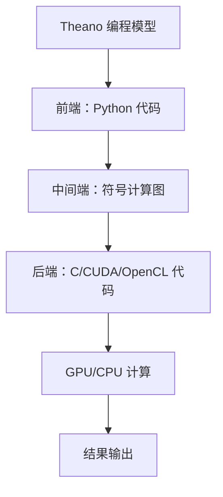

                 

# Theano：深度学习领域的明星框架

> 关键词：Theano，深度学习，计算图，自动微分，神经网络，Python库

> 摘要：Theano是一个开源的Python库，专门为深度学习而设计。本文将详细介绍Theano的历史、核心概念、架构、功能特性，以及它在计算机视觉和自然语言处理等领域的应用。同时，还将探讨Theano的优缺点，与其他深度学习框架的比较，以及其未来的发展趋势。

---

## 第1章：Theano 概述

### 1.1 Theano 的历史与背景

#### Theano 的诞生

Theano是由蒙特利尔大学（University of Montreal）的研究人员于2007年开发的。其初衷是为了解决深度学习模型训练时的高效计算问题。随着深度学习技术的不断发展和成熟，Theano逐渐成为了深度学习领域的重要工具之一。

#### Theano 的发展

自2007年诞生以来，Theano经历了多次迭代和优化。它在多个领域，如自然语言处理、计算机视觉等，都有着重要的贡献。2015年，Theano的核心开发者团队将Theano捐赠给了开放源代码组织LRN，以便更多的人可以参与到Theano的开发和优化中来。

### 1.2 Theano 的核心概念与架构

#### 核心概念

- **符号计算图**：Theano 使用符号计算图来表示和执行数学运算。这种表示方式使得 Theano 能够在编译时进行优化，提高计算效率。

- **自动微分**：Theano 能够自动计算复合函数的导数，这对于深度学习中的反向传播算法至关重要。

#### 架构

- **前端**：使用 Python 代码定义计算图。

- **中间端**：将 Python 代码编译成 Theano 的中间表示，即计算图。

- **后端**：将计算图编译成 C、CUDA 或 OpenCL 代码，以便在 CPU 或 GPU 上高效执行。

### 1.3 Theano 的主要功能与特性

#### 主要功能

- **高效的数值计算**：Theano 能够利用 GPU 的并行计算能力，显著提高深度学习模型的训练速度。

- **灵活的编程模型**：Theano 提供了丰富的 API，允许用户自定义复杂的计算图。

- **自动优化**：Theano 能够自动优化计算图，减少内存使用和计算时间。

#### 特性

- **动态计算图**：Theano 的计算图可以在运行时动态修改，增加了编程灵活性。

- **跨平台支持**：Theano 可以在多种平台上运行，包括 CPU 和 GPU。

- **强大的社区支持**：Theano 有一个活跃的社区，提供了丰富的文档和教程。

### 1.4 Theano 在深度学习中的应用

#### 计算机视觉

Theano 在计算机视觉领域有着广泛的应用，例如图像分类、目标检测等。

#### 自然语言处理

Theano 在自然语言处理领域也有重要应用，如语言模型、机器翻译等。

#### 其他领域

Theano 还可以应用于强化学习、生成模型等深度学习领域。

### 1.5 Theano 的优缺点

#### 优点

- **高效**：利用 GPU 的并行计算能力，显著提高计算速度。

- **灵活**：支持动态计算图和自定义计算图，便于用户扩展。

- **易用**：丰富的 API 和文档，降低使用门槛。

#### 缺点

- **学习曲线较陡**：对于新手来说，理解和使用 Theano 可能需要一定的时间。

- **社区支持有限**：与一些新兴框架相比，Theano 的社区支持较少。

### 1.6 Theano 与其他深度学习框架的比较

#### 与 TensorFlow 的比较

- **相似点**：两者都是用于深度学习的框架，都支持 GPU 加速，都提供了丰富的 API。

- **不同点**：Theano 在编译时更注重优化，而 TensorFlow 在运行时更注重灵活性。

#### 与 PyTorch 的比较

- **相似点**：两者都是开源的深度学习框架，都提供了动态计算图和自动微分。

- **不同点**：PyTorch 的动态计算图更灵活，易于调试，而 Theano 的编译时优化更好。

### 1.7 Theano 的未来发展趋势

- **与 TensorFlow 的整合**：Theano 与 TensorFlow 的整合，为用户提供了更强大的深度学习工具。

- **持续优化**：随着深度学习技术的不断发展，Theano 持续进行优化，以保持其竞争力。

- **新的应用领域**：随着深度学习技术的拓展，Theano 在新的应用领域也将发挥重要作用。

---

### Mermaid 流程图



---

### 核心算法原理讲解

#### 1. Theano 的自动微分机制

Theano 的自动微分机制是其核心功能之一，它能够自动计算复合函数的导数，这在深度学习中的反向传播算法中至关重要。以下是 Theano 自动微分的伪代码：

```python
# 定义函数 f(x)
f = 2 * x ** 2

# 计算梯度 df/dx
gradient = dfdx(f, x)
```

#### 2. Theano 的符号计算图

Theano 使用符号计算图来表示数学运算。以下是使用 Theano 构建一个简单的计算图并执行计算的伪代码：

```python
# 定义符号变量 x 和 y
x = Symbol('x')
y = Symbol('y')

# 创建计算图
z = x + y

# 编译计算图
f = function([x, y], z)

# 执行计算
result = f(x=1, y=2)
```

---

### 数学模型和数学公式

#### 1. 深度学习中的损失函数

在深度学习中，损失函数用于衡量模型的预测值与实际值之间的差距。以下是几种常见的损失函数及其公式：

- **均方误差损失函数 (MSE)**:
  $$L = \frac{1}{2} \sum_{i=1}^{n} (y_i - \hat{y}_i)^2$$

- **交叉熵损失函数 (Cross-Entropy Loss)**:
  $$L = -\sum_{i=1}^{n} y_i \log(\hat{y}_i)$$

#### 2. 梯度下降算法

梯度下降算法是一种用于优化深度学习模型参数的常用算法。其公式如下：

$$\theta_{t+1} = \theta_{t} - \alpha \cdot \nabla_{\theta} J(\theta)$$

其中，$\theta$ 表示模型参数，$\alpha$ 表示学习率，$J(\theta)$ 表示损失函数。

---

### 项目实战

#### 1. 使用 Theano 实现一个简单的神经网络

以下是一个使用 Theano 实现一个简单的神经网络的案例：

```python
# 导入 Theano 库
import theano
import theano.tensor as T

# 定义输入变量
x = T.matrix('x')
y = T.vector('y')

# 定义模型参数
w1 = theano.shared(np.random.randn(2, 3), name='w1')
b1 = theano.shared(np.zeros(3), name='b1')
w2 = theano.shared(np.random.randn(3, 1), name='w2')
b2 = theano.shared(np.zeros(1), name='b2')

# 定义前向传播
h1 = T.tanh(T.dot(x, w1) + b1)
y_pred = T.dot(h1, w2) + b2

# 定义损失函数
loss = T.mean((y - y_pred)**2)

# 定义反向传播
grad_w1 = T.grad(loss, w1)
grad_b1 = T.grad(loss, b1)
grad_w2 = T.grad(loss, w2)
grad_b2 = T.grad(loss, b2)

# 定义更新参数
updates = [(w1, w1 - 0.1 * grad_w1), (b1, b1 - 0.1 * grad_b1),
           (w2, w2 - 0.1 * grad_w2), (b2, b2 - 0.1 * grad_b2)]

# 编译模型
train_model = theano.function(inputs=[x, y], outputs=loss, updates=updates)

# 训练模型
for epoch in range(100):
    for x_train, y_train in train_data:
        train_model(x_train, y_train)
```

---

### 附录

#### A.1 主流深度学习框架对比

以下是 Theano 与其他主流深度学习框架的比较：

- **Theano**：
  - **优点**：编译时优化好，适合大规模模型。
  - **缺点**：社区支持较少，学习曲线较陡。

- **TensorFlow**：
  - **优点**：运行时灵活性高，生态丰富。
  - **缺点**：编译时优化不如 Theano。

- **PyTorch**：
  - **优点**：动态计算图，易于调试。
  - **缺点**：编译时优化较差。

#### A.2 Theano 的安装与配置

Theano 的安装相对简单，以下是基本的安装步骤：

```bash
pip install theano
```

配置 Theano 以使用 GPU 加速，需要安装 CUDA 并配置好相关的环境变量。

#### A.3 Theano 的资源与教程

- **官方文档**：[Theano 官方文档](https://docs.theanoml.org/)
- **教程与示例**：[Theano 教程与示例](https://github.com/Theano/Theano/wiki/Tutorials)
- **社区与论坛**：[Theano 社区论坛](https://groups.google.com/forum/#!forum/theano-users)

---

**作者：AI天才研究院/AI Genius Institute & 禅与计算机程序设计艺术 /Zen And The Art of Computer Programming**

