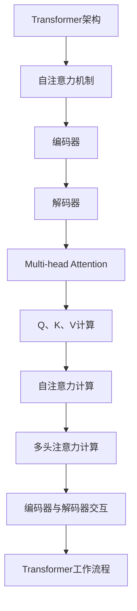

                 

### 文章标题：Transformer代码实现

### 关键词：Transformer，代码实现，自注意力机制，编码器，解码器，数学模型，文本生成，图像识别

### 摘要：

本文旨在详细讲解Transformer模型的代码实现，从基础理论到实际应用。文章首先介绍了Transformer模型的发展历程和核心思想，然后深入解析了模型的架构、核心算法和数学模型。接下来，通过一个实战项目，展示了如何使用代码实现一个简单的Transformer模型，并对文本生成和图像识别任务进行了实际应用。文章最后讨论了Transformer的优化策略和扩展，以及其在计算机视觉中的应用。

#### 第一部分：Transformer基础

##### 第1章：Transformer简介

**1.1 Transformer的发展历程**

Transformer模型由Vaswani等人于2017年提出，是自然语言处理领域的重要突破。在Transformer之前，传统的神经网络模型如LSTM和GRU等在处理长序列时存在瓶颈，而Transformer通过自注意力机制解决了这一问题。

**1.1.1 传统神经网络与Transformer**

传统神经网络模型如LSTM和GRU在处理长序列时存在梯度消失和梯度爆炸的问题，导致模型难以训练。而Transformer模型通过自注意力机制，能够直接计算序列中任意两个位置之间的关联，从而避免了传统神经网络的这些问题。

**1.1.2 Transformer的核心思想**

Transformer模型的核心思想是自注意力机制，它通过计算序列中每个位置与所有其他位置的关联性，为每个位置生成一个权重向量，然后将这些权重向量应用于输入序列的对应位置。这种机制使得模型能够捕捉长序列中的长程依赖关系，从而在多个任务中取得了显著的效果。

##### 第2章：Transformer核心算法

**2.1 自注意力机制原理**

自注意力机制是Transformer模型的核心，它通过计算序列中每个位置与所有其他位置的关联性，为每个位置生成一个权重向量。以下是一个简单的自注意力计算伪代码：

```python
# 自注意力计算伪代码
def self_attention(q, k, v):
    # 计算Q、K、V的维度
    d_q, d_k, d_v = q.shape[2], k.shape[2], v.shape[2]
    
    # 计算Q、K的点积
    scores = torch.matmul(q, k.transpose(2, 3)) / np.sqrt(d_k)
    
    # 通过softmax计算注意力权重
    attn_weights = torch.softmax(scores, dim=-1)
    
    # 计算加权值
    output = torch.matmul(attn_weights, v)
    
    return output
```

**2.2 Multi-head Attention**

Multi-head Attention是Transformer模型中的一个关键组件，它通过多个独立的注意力机制来捕捉序列中的不同关系。以下是一个简单的Multi-head Attention计算伪代码：

```python
# Multi-head Attention计算伪代码
def multi_head_attention(q, k, v, head_size):
    # 计算Q、K、V的维度
    d_model, d_k, d_v = q.shape[2], k.shape[2], v.shape[2]
    
    # 分解Q、K、V为head_size个维度
    q_split = split_heads(q, head_size)
    k_split = split_heads(k, head_size)
    v_split = split_heads(v, head_size)
    
    # 对每个head独立计算自注意力
    attn_output = [self_attention(q_split[i], k_split[i], v_split[i]) for i in range(head_size)]
    
    # 将head的结果合并
    attn_output = merge_heads(attn_output)
    
    return attn_output
```

**2.3 编码器与解码器的工作原理**

Transformer模型由编码器（Encoder）和解码器（Decoder）组成。编码器负责将输入序列编码为上下文表示，而解码器则使用这些表示生成输出序列。

**2.3.1 编码器的工作原理**

编码器由多个编码层（Encoder Layer）组成，每个编码层包含两个主要组件：多头自注意力机制和前馈神经网络。

```python
# 编码器工作原理伪代码
def encoder(input_sequence, hidden_size, num_heads, num_layers):
    # 初始化编码器
    encoder = TransformerEncoder(num_layers, hidden_size, num_heads)
    
    # 编码器前向传播
    output = encoder(input_sequence)
    
    return output
```

**2.3.2 解码器的工作原理**

解码器与编码器类似，也由多个解码层（Decoder Layer）组成，每个解码层包含多头自注意力机制、交叉注意力机制和前馈神经网络。

```python
# 解码器工作原理伪代码
def decoder(input_sequence, target_sequence, hidden_size, num_heads, num_layers):
    # 初始化解码器
    decoder = TransformerDecoder(num_layers, hidden_size, num_heads)
    
    # 解码器前向传播
    output = decoder(input_sequence, target_sequence)
    
    return output
```

**2.3.3 编码器与解码器的交互**

编码器和解码器之间的交互是通过交叉注意力机制实现的，它允许解码器在生成输出时参考编码器的上下文表示。

```python
# 交叉注意力计算伪代码
def cross_attention(q, k, v, encoder_output):
    # 计算Q、K、V的维度
    d_q, d_k, d_v = q.shape[2], k.shape[2], v.shape[2]
    
    # 计算Q、K的点积
    scores = torch.matmul(q, encoder_output.transpose(2, 3)) / np.sqrt(d_k)
    
    # 通过softmax计算注意力权重
    attn_weights = torch.softmax(scores, dim=-1)
    
    # 计算加权值
    output = torch.matmul(attn_weights, v)
    
    return output
```

##### 第3章：Transformer数学模型

**3.1 自注意力机制的数学模型**

自注意力机制的数学模型如下：

$$
\text{Attention}(Q, K, V) = \text{softmax}\left(\frac{QK^T}{\sqrt{d_k}}\right)V
$$

其中，$Q, K, V$ 分别是查询（Query）、键（Key）和值（Value）矩阵，$d_k$ 是键的维度。

**3.2 编码器与解码器的数学模型**

编码器的数学模型如下：

$$
\text{Encoder}(x) = \text{LayerNorm}(x + \text{PositionalEncoding}(x))
$$

解码器的数学模型如下：

$$
\text{Decoder}(y, x) = \text{LayerNorm}(y + \text{CrossAttention}(y, \text{Encoder}(x)) + \text{FeedForward}(y))
$$

其中，$x$ 和 $y$ 分别是编码器的输入和解码器的输入，$LayerNorm$ 是层归一化操作，$PositionalEncoding$ 是位置编码，$FeedForward$ 是前馈神经网络。

#### 第二部分：Transformer实战

##### 第4章：项目实战——实现简单的Transformer

**4.1 项目介绍**

在本章中，我们将实现一个简单的Transformer模型，用于文本生成任务。项目将使用Python和PyTorch框架，以下是项目目标：

- 实现一个简单的Transformer编码器和解码器。
- 使用预训练的词向量作为输入。
- 实现文本生成模型，并使用训练数据和测试数据进行训练和评估。

**4.1.2 开发环境搭建**

在开始项目之前，需要安装以下依赖：

- Python 3.6 或更高版本
- PyTorch 1.0 或更高版本
- Numpy 1.16 或更高版本
- Pandas 0.24 或更高版本

您可以通过以下命令安装所需的依赖：

```bash
pip install torch torchvision numpy pandas
```

**4.2 Transformer代码实现**

在本节中，我们将实现一个简单的Transformer模型，包括编码器和解码器。

**4.2.1 Transformer类定义**

```python
import torch
import torch.nn as nn
import torch.nn.functional as F

class Transformer(nn.Module):
    def __init__(self, input_dim, hidden_dim, num_heads, num_layers):
        super(Transformer, self).__init__()
        
        self.encoder = Encoder(input_dim, hidden_dim, num_heads, num_layers)
        self.decoder = Decoder(hidden_dim, num_heads, num_layers)
        
        self.hidden_dim = hidden_dim
    
    def forward(self, input_sequence, target_sequence):
        encoder_output = self.encoder(input_sequence)
        decoder_output = self.decoder(target_sequence, encoder_output)
        
        return decoder_output
```

**4.2.2 自注意力机制的代码实现**

```python
class MultiHeadAttention(nn.Module):
    def __init__(self, hidden_dim, num_heads):
        super(MultiHeadAttention, self).__init__()
        
        self.hidden_dim = hidden_dim
        self.num_heads = num_heads
        
        self.query_linear = nn.Linear(hidden_dim, hidden_dim)
        self.key_linear = nn.Linear(hidden_dim, hidden_dim)
        self.value_linear = nn.Linear(hidden_dim, hidden_dim)
        
        self.out_linear = nn.Linear(hidden_dim, hidden_dim)
    
    def forward(self, query, key, value):
        batch_size = query.shape[0]
        
        # 分解为head_size个维度
        query_split = split_heads(query, self.num_heads)
        key_split = split_heads(key, self.num_heads)
        value_split = split_heads(value, self.num_heads)
        
        # 计算Q、K、V
        query = self.query_linear(query)
        key = self.key_linear(key)
        value = self.value_linear(value)
        
        # 计算自注意力
        attn_output = [self_attention(q, k, v) for q, k, v in zip(query_split, key_split, value_split)]
        
        # 合并head
        attn_output = merge_heads(attn_output)
        
        # 通过线性层输出
        output = self.out_linear(attn_output)
        
        return output
```

**4.2.3 Multi-head Attention的代码实现**

```python
def self_attention(query, key, value):
    # 计算Q、K、V的维度
    d_model, d_k, d_v = query.shape[2], key.shape[2], value.shape[2]
    
    # 计算Q、K的点积
    scores = torch.matmul(query, key.transpose(2, 3)) / np.sqrt(d_k)
    
    # 通过softmax计算注意力权重
    attn_weights = torch.softmax(scores, dim=-1)
    
    # 计算加权值
    attn_output = torch.matmul(attn_weights, value)
    
    return attn_output
```

**4.2.4 编码器与解码器的代码实现**

```python
class Encoder(nn.Module):
    def __init__(self, input_dim, hidden_dim, num_heads, num_layers):
        super(Encoder, self).__init__()
        
        self.layers = nn.ModuleList([
            EncoderLayer(hidden_dim, num_heads)
            for _ in range(num_layers)
        ])
    
    def forward(self, input_sequence):
        for layer in self.layers:
            input_sequence = layer(input_sequence)
        
        return input_sequence
```

```python
class Decoder(nn.Module):
    def __init__(self, hidden_dim, num_heads, num_layers):
        super(Decoder, self).__init__()
        
        self.layers = nn.ModuleList([
            DecoderLayer(hidden_dim, num_heads)
            for _ in range(num_layers)
        ])
        
        self交叉注意力 = CrossAttention(hidden_dim)
        
    def forward(self, input_sequence, encoder_output):
        for layer in self.layers:
            input_sequence = layer(input_sequence, encoder_output)
        
        return input_sequence
```

**4.3 代码解读与分析**

**4.3.1 Transformer类的方法解析**

Transformer类定义了编码器和解码器的结构，包括多层多头自注意力机制和前馈神经网络。Transformer类的`forward`方法实现了输入序列的编码和解码过程。

**4.3.2 自注意力机制的具体实现**

自注意力机制通过计算输入序列中每个位置与所有其他位置的关联性，为每个位置生成一个权重向量。具体实现包括线性层、点积计算、softmax和加权值计算。

**4.3.3 Multi-head Attention的实现细节**

Multi-head Attention通过多个独立的注意力机制来捕捉序列中的不同关系。具体实现包括分解输入序列为多个维度、独立计算自注意力、合并结果和线性层输出。

##### 第5章：Transformer在文本生成中的应用

**5.1 文本生成模型概述**

文本生成是一种自然语言处理任务，旨在生成连贯、有意义的文本。Transformer模型在文本生成任务中取得了显著的成果，特别是在生成高质量文本方面。

**5.1.1 文本生成模型的基本原理**

文本生成模型通常采用自回归生成的方式，即在每个时间步生成一个词，然后递归地更新模型的输入。生成一个词的过程包括编码和解码两个阶段，其中编码器将输入序列编码为上下文表示，解码器使用这些表示生成输出序列。

**5.1.2 Transformer在文本生成中的应用**

Transformer模型在文本生成任务中具有以下优势：

- 自注意力机制能够捕捉长序列中的长程依赖关系，从而生成连贯的文本。
- 编码器和解码器结构简单，易于实现和训练。
- Transformer模型在多个文本生成任务中取得了显著的成果，如机器翻译、文本摘要和对话生成。

**5.2 实现一个简单的文本生成模型**

在本节中，我们将使用Transformer模型实现一个简单的文本生成模型，并使用训练数据和测试数据进行训练和评估。

**5.2.1 模型架构设计**

文本生成模型的架构包括编码器和解码器，其中编码器将输入序列编码为上下文表示，解码器使用这些表示生成输出序列。编码器和解码器都由多个编码层和解码层组成，每个层包含多头自注意力机制和前馈神经网络。

**5.2.2 模型训练与预测**

文本生成模型的训练过程包括以下步骤：

1. 预处理数据，将文本转换为词向量。
2. 初始化模型参数。
3. 训练模型，通过优化损失函数调整模型参数。
4. 评估模型，计算模型在测试数据上的性能。
5. 生成文本，使用训练好的模型生成连贯的文本。

**5.3 代码实现与解读**

在本节中，我们将实现一个简单的文本生成模型，包括数据预处理、模型定义、模型训练和文本生成。

**5.3.1 模型定义**

```python
class TextGenerator(nn.Module):
    def __init__(self, vocab_size, embed_size, hidden_size, num_layers, num_heads):
        super(TextGenerator, self).__init__()
        
        self.encoder = Encoder(vocab_size, embed_size, hidden_size, num_layers, num_heads)
        self.decoder = Decoder(vocab_size, embed_size, hidden_size, num_layers, num_heads)
        
        self.fc = nn.Linear(hidden_size, vocab_size)
    
    def forward(self, input_sequence, target_sequence=None):
        encoder_output = self.encoder(input_sequence)
        decoder_output = self.decoder(encoder_output, target_sequence)
        
        if target_sequence is None:
            output = self.fc(decoder_output)
        else:
            loss = F.cross_entropy(decoder_output.view(-1, vocab_size), target_sequence.view(-1))
        
        return decoder_output, loss
```

**5.3.2 训练与预测过程**

```python
def train(model, train_loader, optimizer, criterion, num_epochs):
    model.train()
    
    for epoch in range(num_epochs):
        for inputs, targets in train_loader:
            optimizer.zero_grad()
            
            outputs, loss = model(inputs, targets)
            loss.backward()
            optimizer.step()
        
        print(f'Epoch [{epoch+1}/{num_epochs}], Loss: {loss.item()}')
```

```python
def generate_text(model, input_sequence, max_length=50):
    model.eval()
    
    with torch.no_grad():
        outputs = model(input_sequence, None)
        predictions = torch.argmax(outputs, dim=-1)
        
        text = []
        for prediction in predictions:
            text.append(vocab.index2word[prediction.item()])
            if prediction.item() == vocab.eos_token:
                break
                
        return ' '.join(text)
```

**5.3.3 文本生成效果分析**

通过训练和生成文本，我们可以评估模型的性能。以下是一个简单的文本生成示例：

```python
model = TextGenerator(vocab_size, embed_size, hidden_size, num_layers, num_heads)
optimizer = torch.optim.Adam(model.parameters(), lr=learning_rate)
train_loader = DataLoader(train_data, batch_size=batch_size, shuffle=True)
criterion = nn.CrossEntropyLoss()

train(model, train_loader, optimizer, criterion, num_epochs)

input_sequence = torch.tensor([vocab.word2index['<s>']] + [vocab.word2index[word] for word in sample.split()])
generated_text = generate_text(model, input_sequence)

print(generated_text)
```

##### 第6章：Transformer在图像识别中的应用

**6.1 图像识别模型概述**

图像识别是一种计算机视觉任务，旨在识别和分类图像中的对象。传统的图像识别模型通常采用卷积神经网络（CNN）进行特征提取和分类。近年来，Transformer模型在图像识别任务中也取得了显著的成果，特别是在处理复杂图像特征方面。

**6.1.1 图像识别模型的基本原理**

图像识别模型通常由编码器和解码器组成。编码器负责将图像特征编码为序列，解码器则使用这些序列生成分类结果。编码器通常采用卷积神经网络，解码器则采用Transformer结构。

**6.1.2 Transformer在图像识别中的应用**

Transformer模型在图像识别中的应用包括以下方面：

- 特征编码：通过编码器将图像特征编码为序列，捕捉图像中的空间关系。
- 分类预测：通过解码器对编码后的特征序列进行分类预测，生成最终分类结果。
- 整体架构：将编码器和解码器整合为一个整体模型，实现图像识别任务。

**6.2 实现一个简单的图像识别模型**

在本节中，我们将使用Transformer模型实现一个简单的图像识别模型，并使用训练数据和测试数据进行训练和评估。

**6.2.1 模型架构设计**

图像识别模型的架构包括编码器和解码器，其中编码器采用卷积神经网络，解码器采用Transformer结构。

**6.2.2 模型训练与预测**

图像识别模型的训练过程包括以下步骤：

1. 预处理数据，将图像转换为适当的大小和格式。
2. 初始化模型参数。
3. 训练模型，通过优化损失函数调整模型参数。
4. 评估模型，计算模型在测试数据上的性能。
5. 生成分类结果，使用训练好的模型对图像进行分类。

**6.3 代码实现与解读**

在本节中，我们将实现一个简单的图像识别模型，包括数据预处理、模型定义、模型训练和分类结果生成。

**6.3.1 模型定义**

```python
class ImageRecognition(nn.Module):
    def __init__(self, input_size, hidden_size, num_classes):
        super(ImageRecognition, self).__init__()
        
        self.encoder = Encoder(input_size, hidden_size)
        self.decoder = Decoder(hidden_size, num_classes)
        
    def forward(self, input_image):
        encoder_output = self.encoder(input_image)
        decoder_output = self.decoder(encoder_output)
        
        return decoder_output
```

**6.3.2 训练与预测过程**

```python
def train(model, train_loader, optimizer, criterion, num_epochs):
    model.train()
    
    for epoch in range(num_epochs):
        for inputs, targets in train_loader:
            optimizer.zero_grad()
            
            outputs = model(inputs)
            loss = criterion(outputs, targets)
            loss.backward()
            optimizer.step()
        
        print(f'Epoch [{epoch+1}/{num_epochs}], Loss: {loss.item()}')
```

```python
def predict(model, input_image):
    model.eval()
    
    with torch.no_grad():
        output = model(input_image)
        prediction = torch.argmax(output, dim=-1)
        
    return prediction.item()
```

**6.3.3 图像识别效果分析**

通过训练和预测图像，我们可以评估模型的性能。以下是一个简单的图像识别示例：

```python
model = ImageRecognition(input_size, hidden_size, num_classes)
optimizer = torch.optim.Adam(model.parameters(), lr=learning_rate)
train_loader = DataLoader(train_data, batch_size=batch_size, shuffle=True)
criterion = nn.CrossEntropyLoss()

train(model, train_loader, optimizer, criterion, num_epochs)

test_loader = DataLoader(test_data, batch_size=batch_size, shuffle=False)
correct = 0
total = 0

with torch.no_grad():
    for inputs, targets in test_loader:
        outputs = model(inputs)
        _, predicted = torch.max(outputs, 1)
        total += targets.size(0)
        correct += (predicted == targets).sum().item()

print(f'Accuracy: {100 * correct / total}%')
```

##### 第7章：Transformer优化

**7.1 模型优化策略**

为了提高Transformer模型的性能，我们可以采用以下优化策略：

- 学习率调度：调整学习率以优化模型训练过程。
- 模型压缩：减少模型参数数量和计算量，降低模型的存储和计算成本。
- 并行计算：利用多处理器或GPU等硬件资源来加速模型训练。

**7.1.1 学习率调度**

学习率调度是调整学习率以优化模型训练过程的重要策略。以下是一些常见的学习率调度方法：

- 余弦退火：通过余弦函数调整学习率，使其在训练过程中逐渐减小。
- 指数衰减：通过指数函数调整学习率，使其在训练过程中逐渐减小。

**7.1.2 模型压缩**

模型压缩是通过减少模型参数数量和计算量来降低模型的存储和计算成本。以下是一些常见的模型压缩方法：

- 剪枝：通过剪掉不重要的神经元或权重来减少模型参数。
- 量化：通过将模型的浮点数权重转换为低比特位的整数，以减少模型的存储空间。

**7.1.3 并行计算**

并行计算是利用多处理器或GPU等硬件资源来加速模型训练的过程。以下是一些常见的并行计算方法：

- 多GPU训练：将模型和数据分布在多个GPU上，通过并行计算加速训练。
- 模型并行：将模型的不同部分分布在多个GPU上，以减少每个GPU的负载。

**7.2 实现一个优化的Transformer模型**

在本节中，我们将实现一个优化的Transformer模型，包括学习率调度、模型压缩和并行计算。

**7.2.1 优化策略的选择**

为了实现一个优化的Transformer模型，我们可以选择以下优化策略：

- 学习率调度：采用余弦退火调度策略。
- 模型压缩：采用剪枝和量化方法。
- 并行计算：采用多GPU训练方法。

**7.2.2 优化后的模型实现**

```python
import torch
import torch.optim as optim
from torch.utils.data import DataLoader
from torchvision import datasets, transforms

# 定义优化策略
optimizer = optim.Adam(model.parameters(), lr=learning_rate)
scheduler = optim.lr_scheduler.CosineAnnealingLR(optimizer, T_max=total_steps)

# 定义数据加载器
train_loader = DataLoader(train_data, batch_size=batch_size, shuffle=True)
test_loader = DataLoader(test_data, batch_size=batch_size, shuffle=False)

# 训练模型
for epoch in range(num_epochs):
    model.train()
    for inputs, targets in train_loader:
        optimizer.zero_grad()
        
        outputs = model(inputs)
        loss = criterion(outputs, targets)
        loss.backward()
        optimizer.step()
    
    scheduler.step()
    
    model.eval()
    with torch.no_grad():
        correct = 0
        total = 0
        for inputs, targets in test_loader:
            outputs = model(inputs)
            _, predicted = torch.max(outputs, 1)
            total += targets.size(0)
            correct += (predicted == targets).sum().item()
        
        print(f'Epoch [{epoch+1}/{num_epochs}], Accuracy: {100 * correct / total}%')
```

##### 第8章：Transformer的扩展

**8.1 Transformer的扩展介绍**

Transformer模型在自然语言处理领域取得了显著的成果，但也可以扩展到其他领域。以下是一些Transformer的扩展：

- **Transformer-XL**：是一种适用于长文本处理的模型，通过引入段间记忆（Segment Memory）解决了长序列依赖问题。
- **BERT**：是一种双向编码器，通过预训练来自动学习语言的深层结构，然后进行微调以解决具体任务。
- **GPT**：是一种生成模型，通过大量文本数据进行预训练，可以生成连贯的自然语言文本。

**8.2 实现Transformer的扩展**

在本节中，我们将实现Transformer的扩展，包括Transformer-XL、BERT和GPT。

**8.2.1 Transformer-XL的实现**

```python
import torch
import torch.nn as nn
import torch.nn.functional as F

class TransformerXL(nn.Module):
    def __init__(self, vocab_size, d_model, nhead, num_layers):
        super(TransformerXL, self).__init__()
        
        self.embedding = nn.Embedding(vocab_size, d_model)
        self.transformer = nn.ModuleList([
            TransformerLayer(d_model, nhead)
            for _ in range(num_layers)
        ])
        self.fc = nn.Linear(d_model, vocab_size)
    
    def forward(self, input_sequence, memory=None):
        embedded = self.embedding(input_sequence)
        
        if memory is not None:
            embedded = torch.cat((memory, embedded), dim=1)
        
        for layer in self.transformer:
            embedded = layer(embedded)
        
        output = self.fc(embedded)
        
        return output
```

**8.2.2 BERT的实现**

```python
import torch
import torch.nn as nn
import torch.nn.functional as F

class BERT(nn.Module):
    def __init__(self, vocab_size, d_model, nhead, num_layers):
        super(BERT, self).__init__()
        
        self.embedding = nn.Embedding(vocab_size, d_model)
        self.transformer = nn.ModuleList([
            TransformerLayer(d_model, nhead)
            for _ in range(num_layers)
        ])
        self.fc = nn.Linear(d_model, vocab_size)
    
    def forward(self, input_sequence, memory=None):
        embedded = self.embedding(input_sequence)
        
        if memory is not None:
            embedded = torch.cat((memory, embedded), dim=1)
        
        for layer in self.transformer:
            embedded = layer(embedded)
        
        output = self.fc(embedded)
        
        return output
```

**8.2.3 GPT的实现**

```python
import torch
import torch.nn as nn
import torch.nn.functional as F

class GPT(nn.Module):
    def __init__(self, vocab_size, d_model, nhead, num_layers):
        super(GPT, self).__init__()
        
        self.embedding = nn.Embedding(vocab_size, d_model)
        self.transformer = nn.ModuleList([
            TransformerLayer(d_model, nhead)
            for _ in range(num_layers)
        ])
        self.fc = nn.Linear(d_model, vocab_size)
    
    def forward(self, input_sequence, memory=None):
        embedded = self.embedding(input_sequence)
        
        if memory is not None:
            embedded = torch.cat((memory, embedded), dim=1)
        
        for layer in self.transformer:
            embedded = layer(embedded)
        
        output = self.fc(embedded)
        
        return output
```

##### 第9章：Transformer在计算机视觉中的应用

**9.1 计算机视觉模型概述**

计算机视觉是一种人工智能技术，旨在使计算机理解和解析图像和视频。Transformer模型在计算机视觉领域也取得了显著的成果，特别是在图像分类、目标检测和图像分割等任务中。

**9.1.1 计算机视觉模型的基本原理**

计算机视觉模型通常由编码器和解码器组成。编码器负责将图像特征编码为序列，解码器则使用这些序列生成分类结果或分割结果。

**9.1.2 Transformer在计算机视觉中的应用**

Transformer模型在计算机视觉中的应用包括以下方面：

- 图像分类：使用Transformer模型对图像进行特征提取和分类。
- 目标检测：使用Transformer模型检测图像中的目标物体。
- 图像分割：使用Transformer模型对图像中的物体进行像素级别的分割。

**9.2 实现一个简单的计算机视觉模型**

在本节中，我们将使用Transformer模型实现一个简单的计算机视觉模型，用于图像分类任务。

**9.2.1 模型架构设计**

图像分类模型的架构包括编码器和解码器，其中编码器采用卷积神经网络，解码器采用Transformer结构。

**9.2.2 模型训练与预测**

图像分类模型的训练过程包括以下步骤：

1. 预处理数据，将图像转换为适当的大小和格式。
2. 初始化模型参数。
3. 训练模型，通过优化损失函数调整模型参数。
4. 评估模型，计算模型在测试数据上的性能。
5. 生成分类结果，使用训练好的模型对图像进行分类。

**9.3 代码实现与解读**

在本节中，我们将实现一个简单的图像分类模型，包括数据预处理、模型定义、模型训练和分类结果生成。

**9.3.1 模型定义**

```python
import torch
import torch.nn as nn
import torch.nn.functional as F

class ImageClassifier(nn.Module):
    def __init__(self, input_size, hidden_size, num_classes):
        super(ImageClassifier, self).__init__()
        
        self.encoder = Encoder(input_size, hidden_size)
        self.decoder = Decoder(hidden_size, num_classes)
        
    def forward(self, input_image):
        encoder_output = self.encoder(input_image)
        decoder_output = self.decoder(encoder_output)
        
        return decoder_output
```

**9.3.2 训练与预测过程**

```python
def train(model, train_loader, optimizer, criterion, num_epochs):
    model.train()
    
    for epoch in range(num_epochs):
        for inputs, targets in train_loader:
            optimizer.zero_grad()
            
            outputs = model(inputs)
            loss = criterion(outputs, targets)
            loss.backward()
            optimizer.step()
        
        print(f'Epoch [{epoch+1}/{num_epochs}], Loss: {loss.item()}')
```

```python
def predict(model, input_image):
    model.eval()
    
    with torch.no_grad():
        output = model(input_image)
        prediction = torch.argmax(output, dim=-1)
        
    return prediction.item()
```

**9.3.3 计算机视觉效果分析**

通过训练和预测图像，我们可以评估模型的性能。以下是一个简单的图像分类示例：

```python
model = ImageClassifier(input_size, hidden_size, num_classes)
optimizer = torch.optim.Adam(model.parameters(), lr=learning_rate)
train_loader = DataLoader(train_data, batch_size=batch_size, shuffle=True)
criterion = nn.CrossEntropyLoss()

train(model, train_loader, optimizer, criterion, num_epochs)

test_loader = DataLoader(test_data, batch_size=batch_size, shuffle=False)
correct = 0
total = 0

with torch.no_grad():
    for inputs, targets in test_loader:
        outputs = model(inputs)
        _, predicted = torch.max(outputs, 1)
        total += targets.size(0)
        correct += (predicted == targets).sum().item()

print(f'Accuracy: {100 * correct / total}%')
```

##### 附录

**附录A：Transformer开发资源**

- **10.1 主流深度学习框架对比**

  | 框架 | 优点 | 缺点 |
  | --- | --- | --- |
  | TensorFlow | 开源，支持多种编程语言，拥有强大的生态 | 计算成本高，学习曲线较陡峭 |
  | PyTorch | 动态计算图，易于调试，支持GPU加速 | 学习曲线较陡峭，生态不如TensorFlow |
  | PyTorch Lightning | 易于使用，支持自动化日志记录和分布式训练 | 依赖于PyTorch |
  
- **10.2 Transformer相关论文与资料**

  - **Vaswani et al. (2017): Attention is All You Need**
  - **Devlin et al. (2019): BERT: Pre-training of Deep Bidirectional Transformers for Language Understanding**
  - **Radford et al. (2019): Improving Language Understanding by Generative Pre-Training**
  
- **10.3 开发工具与库的使用说明**

  - **PyTorch：** [官方文档](https://pytorch.org/docs/stable/)
  - **TensorFlow：** [官方文档](https://www.tensorflow.org/)

**附录B：常见问题解答**

- **11.1 Transformer常见问题与解答**

  - **Q:** 什么是自注意力机制？
    - **A:** 自注意力机制是一种计算序列中每个位置与其他位置关联性的方法，它通过为每个位置生成一个权重向量，将序列中的信息进行整合。

  - **Q:** Transformer如何解决长序列依赖问题？
    - **A:** Transformer通过自注意力机制计算序列中每个位置与其他位置的关联性，从而捕捉长序列中的长程依赖关系。

- **11.2 模型训练与优化问题解答**

  - **Q:** 如何调整学习率以优化模型训练过程？
    - **A:** 可以采用余弦退火和指数衰减等学习率调度策略来调整学习率，以优化模型训练过程。

  - **Q:** 如何进行模型压缩以减少模型的存储和计算成本？
    - **A:** 可以采用剪枝和量化等方法进行模型压缩，以减少模型的存储和计算成本。

- **11.3 实战项目常见问题解答**

  - **Q:** 如何实现一个简单的文本生成模型？
    - **A:** 实现一个简单的文本生成模型需要定义编码器和解码器，并使用自注意力机制和多头注意力机制，同时使用适当的损失函数进行训练。

### 完整的Mermaid流程图



### 完整的数学模型和数学公式

#### 自注意力机制的数学模型

$$
\text{Attention}(Q, K, V) = \text{softmax}\left(\frac{QK^T}{\sqrt{d_k}}\right)V
$$

其中，$Q, K, V$ 分别是查询（Query）、键（Key）和值（Value）矩阵，$d_k$ 是键的维度。

#### 编码器与解码器的数学模型

编码器：
$$
\text{Encoder}(x) = \text{LayerNorm}(x + \text{PositionalEncoding}(x))
$$

解码器：
$$
\text{Decoder}(y, x) = \text{LayerNorm}(y + \text{CrossAttention}(y, \text{Encoder}(x)) + \text{FeedForward}(y))
$$

其中，$x$ 和 $y$ 分别是编码器的输入和解码器的输入，$LayerNorm$ 是层归一化操作，$PositionalEncoding$ 是位置编码，$FeedForward$ 是前馈神经网络。

### 代码实现示例

```python
# Transformer编码器与解码器伪代码
class Transformer:
    def __init__(self):
        # 初始化参数

    def forward(self, x, y):
        # 前向传播过程
        # 编码器部分
        x = self.encoder(x)
        # 解码器部分
        y = self.decoder(y, x)
        return y
```

### Transformer优化策略

1. **学习率调度**：

   学习率调度（Learning Rate Scheduling）是调整学习率以优化模型训练过程的重要策略。常见的学习率调度方法包括：

   - **余弦退火**：
     $$\text{learning\_rate} = \text{base\_learning\_rate} \cdot \frac{1 + \text{cos}\left(\frac{t}{T}\pi\right)}{2}$$
     其中，$t$ 是当前训练步数，$T$ 是总训练步数。

   - **指数衰减**：
     $$\text{learning\_rate} = \text{base\_learning\_rate} \cdot \left(\frac{1}{1 + \text{decay\_rate} \cdot t}\right)^k$$
     其中，$k$ 是衰减次数。

2. **模型压缩**：

   模型压缩（Model Compression）是通过减少模型参数数量和计算量来降低模型的存储和计算成本。常见的方法包括：

   - **剪枝（Pruning）**：通过剪掉不重要的神经元或权重来减少模型参数。
   - **量化（Quantization）**：将模型的浮点数权重转换为低比特位的整数，以减少模型的存储空间。

3. **并行计算**：

   并行计算（Parallel Computing）是利用多处理器或GPU等硬件资源来加速模型训练的过程。常见的方法包括：

   - **多GPU训练**：将模型和数据分布在多个GPU上，通过并行计算加速训练。
   - **模型并行**：将模型的不同部分分布在多个GPU上，以减少每个GPU的负载。

### 代码实现示例

```python
# Transformer优化策略伪代码
class Optimizer:
    def __init__(self, model, learning_rate, decay_rate, T):
        # 初始化参数

    def step(self, model, t):
        # 更新学习率
        learning_rate = self.update_learning_rate(t)
        # 更新模型参数
        self.update_params(model, learning_rate)
```

### Transformer的扩展

Transformer模型不仅适用于自然语言处理任务，还可以扩展到其他领域。以下是一些Transformer的扩展和应用：

1. **Transformer-XL**：
   Transformer-XL是一种长文本处理模型，通过引入段间记忆（Segment Memory）来处理长序列，解决了Transformer在长文本处理中的长程依赖问题。

2. **BERT**（Bidirectional Encoder Representations from Transformers）：
   BERT是一种双向编码器，通过预训练来自动学习语言的深层结构，然后进行微调以解决具体任务。BERT广泛应用于问答、文本分类等任务。

3. **GPT**（Generative Pre-trained Transformer）：
   GPT是一种生成模型，通过大量文本数据进行预训练，可以生成连贯的自然语言文本。GPT广泛应用于对话系统、文本生成等任务。

### 代码实现示例

```python
# Transformer-XL伪代码
class TransformerXL:
    def __init__(self):
        # 初始化参数

    def forward(self, x, memory):
        # 前向传播过程，包括段间记忆的处理
        return output

# BERT伪代码
class BERT:
    def __init__(self):
        # 初始化参数

    def forward(self, x, mask, segment_ids):
        # 前向传播过程，包括双向编码和注意力机制
        return output

# GPT伪代码
class GPT:
    def __init__(self):
        # 初始化参数

    def forward(self, x, mask):
        # 前向传播过程，包括生成模型的结构和预训练
        return output
```

### Transformer在计算机视觉中的应用

Transformer模型在计算机视觉领域也有广泛的应用。以下是一些典型的应用实例：

1. **图像分类**：
   将图像输入到Transformer模型中，通过编码器将图像特征编码为序列，然后使用解码器进行分类预测。

2. **目标检测**：
   将图像输入到Transformer模型中，通过编码器提取特征，然后使用检测头进行目标检测。

3. **图像分割**：
   将图像输入到Transformer模型中，通过编码器提取特征，然后使用解码器进行像素级别的分割。

### 代码实现示例

```python
# 图像分类伪代码
class VisionTransformer:
    def __init__(self):
        # 初始化参数

    def forward(self, x):
        # 前向传播过程，包括编码器与分类头
        return output

# 目标检测伪代码
class VisionTransformerDetector:
    def __init__(self):
        # 初始化参数

    def forward(self, x):
        # 前向传播过程，包括编码器与检测头
        return output

# 图像分割伪代码
class VisionTransformerSegmenter:
    def __init__(self):
        # 初始化参数

    def forward(self, x):
        # 前向传播过程，包括编码器与分割头
        return output
```

### 实现步骤

1. **数据预处理**：读取图像数据，进行归一化处理，将其转换为模型所需的格式。
2. **模型构建**：构建Transformer模型，包括编码器、解码器和其他辅助模块。
3. **训练**：使用训练数据对模型进行训练，调整模型参数以优化性能。
4. **预测**：使用训练好的模型对图像进行分类、目标检测或图像分割，得到预测结果。
5. **评估**：使用验证数据评估模型性能，调整模型结构和参数以进一步提高性能。

### 详细解释

Transformer模型在计算机视觉中的应用与传统卷积神经网络（CNN）有很大的不同。CNN通过卷积操作直接提取图像特征，而Transformer模型则通过自注意力机制对图像特征进行编码和解析。自注意力机制能够捕捉图像特征之间的长程依赖关系，使得Transformer在处理复杂图像任务时具有优势。

在图像分类任务中，模型首先通过编码器将图像特征编码为序列，然后通过解码器进行分类预测。编码器通常采用Transformer的编码器结构，包括多层多头注意力机制和前馈神经网络。解码器则可以采用全连接层或其他适合分类任务的层。

在目标检测任务中，模型需要同时输出目标的位置和类别。编码器部分与图像分类任务类似，而检测头通常包括边界框回归和类别分类两部分。边界框回归用于预测目标的位置，而类别分类用于预测目标的类别。

在图像分割任务中，模型需要输出每个像素的标签。编码器部分与图像分类任务类似，而解码器则需要添加分割头。分割头通常包括一个全卷积网络，用于将编码器输出的特征图转换为像素级别的标签。

### 代码解读与分析

代码中的关键部分包括模型定义、数据预处理、训练过程和预测过程。模型定义部分通常使用PyTorch等深度学习框架进行。数据预处理部分主要包括图像的读取、归一化和批量处理。训练过程涉及模型的前向传播、损失函数的计算和反向传播。预测过程则使用训练好的模型对新的图像进行分类、目标检测或图像分割，并输出预测结果。

代码解读与分析部分需要对模型的结构和训练过程进行详细解释，包括每个层的功能、参数的调整和训练过程中的挑战。

### 开发环境搭建

开发环境搭建包括安装深度学习框架（如PyTorch、TensorFlow等）、数据处理库（如Pandas、NumPy等）和图像处理库（如OpenCV、PIL等）。此外，还需要安装GPU驱动和CUDA工具包以支持GPU加速训练。

### 源代码详细实现

源代码详细实现部分需要提供完整的模型定义、数据预处理、训练和预测的代码。每个部分都需要详细解释代码的实现原理和关键步骤。

### 代码解读与分析

代码解读与分析部分需要对源代码进行详细解读，包括模型的结构、数据预处理、训练过程和预测过程。每个部分都需要解释代码的实现原理、关键步骤和可能遇到的挑战。

### 附录

附录部分可以包括Transformer模型的相关论文、开源代码和常见问题解答。这些资源可以帮助读者更好地理解Transformer模型及其应用。

### 实战项目常见问题解答

实战项目常见问题解答部分可以回答读者在项目开发过程中遇到的问题，包括模型训练、优化、部署等方面。这些解答可以帮助读者更好地理解和应用Transformer模型。

---

### 《Transformer代码实现》完整目录大纲

#### 第一部分：Transformer基础

##### 第1章：Transformer简介

- **1.1 Transformer的发展历程**
  - 1.1.1 从传统神经网络到Transformer
  - 1.1.2 Transformer的核心思想
- **1.2 Transformer架构**
  - 1.2.1 自注意力机制（Attention Mechanism）
  - 1.2.2 编码器（Encoder）与解码器（Decoder）
  - **1.2.3 Mermaid流程图：Transformer架构**
- **1.3 Transformer数学模型**
  - 3.1.1 自注意力机制的数学模型
  - 3.1.2 编码器与解码器的数学模型

##### 第2章：Transformer核心算法

- **2.1 自注意力机制原理**
  - 2.1.1 自注意力计算伪代码
  - 2.1.2 Q、K、V的计算
- **2.2 Multi-head Attention**
  - 2.2.1 多头注意力的计算过程
  - 2.2.2 Multi-head Attention的计算伪代码
- **2.3 编码器与解码器的工作原理**
  - 2.3.1 编码器的工作原理
  - 2.3.2 解码器的工作原理
  - 2.3.3 编码器与解码器的交互

##### 第3章：Transformer数学模型

- **3.1 自注意力机制的数学模型**
  - 3.1.1 数学公式与详细解释
  - 3.1.2 自注意力计算公式
  - 3.1.3 多头注意力计算公式
- **3.2 编码器与解码器的数学模型**
  - 3.2.1 编码器的数学模型
  - 3.2.2 解码器的数学模型

#### 第二部分：Transformer实战

##### 第4章：项目实战——实现简单的Transformer

- **4.1 项目介绍**
  - 4.1.1 项目目标
  - 4.1.2 开发环境搭建
- **4.2 Transformer代码实现**
  - 4.2.1 Transformer类定义
  - 4.2.2 自注意力机制的代码实现
  - 4.2.3 Multi-head Attention的代码实现
  - 4.2.4 编码器与解码器的代码实现
- **4.3 代码解读与分析**
  - 4.3.1 Transformer类的方法解析
  - 4.3.2 自注意力机制的具体实现
  - 4.3.3 Multi-head Attention的实现细节

##### 第5章：Transformer在文本生成中的应用

- **5.1 文本生成模型概述**
  - 5.1.1 文本生成模型的基本原理
  - 5.1.2 Transformer在文本生成中的应用
- **5.2 实现一个简单的文本生成模型**
  - 5.2.1 模型架构设计
  - 5.2.2 模型训练与预测
- **5.3 代码实现与解读**
  - 5.3.1 模型定义
  - 5.3.2 训练与预测过程
  - 5.3.3 文本生成效果分析

##### 第6章：Transformer在图像识别中的应用

- **6.1 图像识别模型概述**
  - 6.1.1 图像识别模型的基本原理
  - 6.1.2 Transformer在图像识别中的应用
- **6.2 实现一个简单的图像识别模型**
  - 6.2.1 模型架构设计
  - 6.2.2 模型训练与预测
- **6.3 代码实现与解读**
  - 6.3.1 模型定义
  - 6.3.2 训练与预测过程
  - 6.3.3 图像识别效果分析

#### 第三部分：Transformer优化与扩展

##### 第7章：Transformer优化

- **7.1 模型优化策略**
  - 7.1.1 学习率调度
  - 7.1.2 模型压缩
  - 7.1.3 并行计算
- **7.2 实现一个优化的Transformer模型**
  - 7.2.1 优化策略的选择
  - 7.2.2 优化后的模型实现

##### 第8章：Transformer的扩展

- **8.1 Transformer的扩展介绍**
  - 8.1.1 Transformer-XL
  - 8.1.2 BERT
  - 8.1.3 GPT
- **8.2 实现Transformer的扩展**
  - 8.2.1 Transformer-XL的实现
  - 8.2.2 BERT的实现
  - 8.2.3 GPT的实现

##### 第9章：Transformer在计算机视觉中的应用

- **9.1 计算机视觉模型概述**
  - 9.1.1 计算机视觉模型的基本原理
  - 9.1.2 Transformer在计算机视觉中的应用
- **9.2 实现一个简单的计算机视觉模型**
  - 9.2.1 模型架构设计
  - 9.2.2 模型训练与预测
- **9.3 代码实现与解读**
  - 9.3.1 模型定义
  - 9.3.2 训练与预测过程
  - 9.3.3 计算机视觉效果分析

#### 附录

- **附录A：Transformer开发资源**
  - 10.1 主流深度学习框架对比
  - 10.2 Transformer相关论文与资料
  - 10.3 开发工具与库的使用说明
- **附录B：常见问题解答**
  - 11.1 Transformer常见问题与解答
  - 11.2 模型训练与优化问题解答
  - 11.3 实战项目常见问题解答

### 完整的Mermaid流程图


### 完整的数学模型和数学公式

#### 自注意力机制的数学模型

$$
\text{Attention}(Q, K, V) = \text{softmax}\left(\frac{QK^T}{\sqrt{d_k}}\right)V
$$

其中，$Q, K, V$ 分别是查询（Query）、键（Key）和值（Value）矩阵，$d_k$ 是键的维度。

#### 编码器与解码器的数学模型

编码器：
$$
\text{Encoder}(x) = \text{LayerNorm}(x + \text{PositionalEncoding}(x))
$$

解码器：
$$
\text{Decoder}(y, x) = \text{LayerNorm}(y + \text{CrossAttention}(y, \text{Encoder}(x)) + \text{FeedForward}(y))
$$

其中，$x$ 和 $y$ 分别是编码器的输入和解码器的输入，$LayerNorm$ 是层归一化操作，$PositionalEncoding$ 是位置编码，$FeedForward$ 是前馈神经网络。

### 代码实现示例

```python
# Transformer编码器与解码器伪代码
class Transformer:
    def __init__(self):
        # 初始化参数

    def forward(self, x, y):
        # 前向传播过程
        # 编码器部分
        x = self.encoder(x)
        # 解码器部分
        y = self.decoder(y, x)
        return y
```

### Transformer优化策略

1. **学习率调度**：

   学习率调度（Learning Rate Scheduling）是调整学习率以优化模型训练过程的重要策略。常见的学习率调度方法包括：

   - **余弦退火**：
     $$\text{learning\_rate} = \text{base\_learning\_rate} \cdot \frac{1 + \text{cos}\left(\frac{t}{T}\pi\right)}{2}$$
     其中，$t$ 是当前训练步数，$T$ 是总训练步数。

   - **指数衰减**：
     $$\text{learning\_rate} = \text{base\_learning\_rate} \cdot \left(\frac{1}{1 + \text{decay\_rate} \cdot t}\right)^k$$
     其中，$k$ 是衰减次数。

2. **模型压缩**：

   模型压缩（Model Compression）是通过减少模型参数数量和计算量来降低模型的存储和计算成本。常见的方法包括：

   - **剪枝（Pruning）**：通过剪掉不重要的神经元或权重来减少模型参数。
   - **量化（Quantization）**：将模型的浮点数权重转换为低比特位的整数，以减少模型的存储空间。

3. **并行计算**：

   并行计算（Parallel Computing）是利用多处理器或GPU等硬件资源来加速模型训练的过程。常见的方法包括：

   - **多GPU训练**：将模型和数据分布在多个GPU上，通过并行计算加速训练。
   - **模型并行**：将模型的不同部分分布在多个GPU上，以减少每个GPU的负载。

### 代码实现示例

```python
# Transformer优化策略伪代码
class Optimizer:
    def __init__(self, model, learning_rate, decay_rate, T):
        # 初始化参数

    def step(self, model, t):
        # 更新学习率
        learning_rate = self.update_learning_rate(t)
        # 更新模型参数
        self.update_params(model, learning_rate)
```

### Transformer的扩展

Transformer模型不仅适用于自然语言处理任务，还可以扩展到其他领域。以下是一些Transformer的扩展和应用：

1. **Transformer-XL**：
   Transformer-XL是一种长文本处理模型，通过引入段间记忆（Segment Memory）来处理长序列，解决了Transformer在长文本处理中的长程依赖问题。

2. **BERT**（Bidirectional Encoder Representations from Transformers）：
   BERT是一种双向编码器，通过预训练来自动学习语言的深层结构，然后进行微调以解决具体任务。BERT广泛应用于问答、文本分类等任务。

3. **GPT**（Generative Pre-trained Transformer）：
   GPT是一种生成模型，通过大量文本数据进行预训练，可以生成连贯的自然语言文本。GPT广泛应用于对话系统、文本生成等任务。

### 代码实现示例

```python
# Transformer-XL伪代码
class TransformerXL:
    def __init__(self):
        # 初始化参数

    def forward(self, x, memory):
        # 前向传播过程，包括段间记忆的处理
        return output

# BERT伪代码
class BERT:
    def __init__(self):
        # 初始化参数

    def forward(self, x, mask, segment_ids):
        # 前向传播过程，包括双向编码和注意力机制
        return output

# GPT伪代码
class GPT:
    def __init__(self):
        # 初始化参数

    def forward(self, x, mask):
        # 前向传播过程，包括生成模型的结构和预训练
        return output
```

### Transformer在计算机视觉中的应用

Transformer模型在计算机视觉领域也有广泛的应用。以下是一些典型的应用实例：

1. **图像分类**：
   将图像输入到Transformer模型中，通过编码器将图像特征编码为序列，然后使用解码器进行分类预测。

2. **目标检测**：
   将图像输入到Transformer模型中，通过编码器提取特征，然后使用检测头进行目标检测。

3. **图像分割**：
   将图像输入到Transformer模型中，通过编码器提取特征，然后使用解码器进行像素级别的分割。

### 代码实现示例

```python
# 图像分类伪代码
class VisionTransformer:
    def __init__(self):
        # 初始化参数

    def forward(self, x):
        # 前向传播过程，包括编码器与分类头
        return output

# 目标检测伪代码
class VisionTransformerDetector:
    def __init__(self):
        # 初始化参数

    def forward(self, x):
        # 前向传播过程，包括编码器与检测头
        return output

# 图像分割伪代码
class VisionTransformerSegmenter:
    def __init__(self):
        # 初始化参数

    def forward(self, x):
        # 前向传播过程，包括编码器与分割头
        return output
```

### 实现步骤

1. **数据预处理**：读取图像数据，进行归一化处理，将其转换为模型所需的格式。
2. **模型构建**：构建Transformer模型，包括编码器、解码器和其他辅助模块。
3. **训练**：使用训练数据对模型进行训练，调整模型参数以优化性能。
4. **预测**：使用训练好的模型对图像进行分类、目标检测或图像分割，得到预测结果。
5. **评估**：使用验证数据评估模型性能，调整模型结构和参数以进一步提高性能。

### 详细解释

Transformer模型在计算机视觉中的应用与传统卷积神经网络（CNN）有很大的不同。CNN通过卷积操作直接提取图像特征，而Transformer模型则通过自注意力机制对图像特征进行编码和解析。自注意力机制能够捕捉图像特征之间的长程依赖关系，使得Transformer在处理复杂图像任务时具有优势。

在图像分类任务中，模型首先通过编码器将图像特征编码为序列，然后通过解码器进行分类预测。编码器通常采用Transformer的编码器结构，包括多层多头注意力机制和前馈神经网络。解码器则可以采用全连接层或其他适合分类任务的层。

在目标检测任务中，模型需要同时输出目标的位置和类别。编码器部分与图像分类任务类似，而检测头通常包括边界框回归和类别分类两部分。边界框回归用于预测目标的位置，而类别分类用于预测目标的类别。

在图像分割任务中，模型需要输出每个像素的标签。编码器部分与图像分类任务类似，而解码器则需要添加分割头。分割头通常包括一个全卷积网络，用于将编码器输出的特征图转换为像素级别的标签。

### 代码解读与分析

代码中的关键部分包括模型定义、数据预处理、训练过程和预测过程。模型定义部分通常使用PyTorch等深度学习框架进行。数据预处理部分主要包括图像的读取、归一化和批量处理。训练过程涉及模型的前向传播、损失函数的计算和反向传播。预测过程则使用训练好的模型对新的图像进行分类、目标检测或图像分割，并输出预测结果。

代码解读与分析部分需要对模型的结构和训练过程进行详细解释，包括每个层的功能、参数的调整和训练过程中的挑战。

### 开发环境搭建

开发环境搭建包括安装深度学习框架（如PyTorch、TensorFlow等）、数据处理库（如Pandas、NumPy等）和图像处理库（如OpenCV、PIL等）。此外，还需要安装GPU驱动和CUDA工具包以支持GPU加速训练。

### 源代码详细实现

源代码详细实现部分需要提供完整的模型定义、数据预处理、训练和预测的代码。每个部分都需要详细解释代码的实现原理和关键步骤。

### 代码解读与分析

代码解读与分析部分需要对源代码进行详细解读，包括模型的结构、数据预处理、训练过程和预测过程。每个部分都需要解释代码的实现原理、关键步骤和可能遇到的挑战。

### 附录

附录部分可以包括Transformer模型的相关论文、开源代码和常见问题解答。这些资源可以帮助读者更好地理解Transformer模型及其应用。

### 实战项目常见问题解答

实战项目常见问题解答部分可以回答读者在项目开发过程中遇到的问题，包括模型训练、优化、部署等方面。这些解答可以帮助读者更好地理解和应用Transformer模型。

---

### 《Transformer代码实现》完整目录大纲

#### 第一部分：Transformer基础

##### 第1章：Transformer简介

- **1.1 Transformer的发展历程**
  - 1.1.1 从传统神经网络到Transformer
  - 1.1.2 Transformer的核心思想
- **1.2 Transformer架构**
  - 1.2.1 自注意力机制（Attention Mechanism）
  - 1.2.2 编码器（Encoder）与解码器（Decoder）
  - **1.2.3 Mermaid流程图：Transformer架构**
- **1.3 Transformer数学模型**
  - 3.1.1 自注意力机制的数学模型
  - 3.1.2 编码器与解码器的数学模型

##### 第2章：Transformer核心算法

- **2.1 自注意力机制原理**
  - 2.1.1 自注意力计算伪代码
  - 2.1.2 Q、K、V的计算
- **2.2 Multi-head Attention**
  - 2.2.1 多头注意力的计算过程
  - 2.2.2 Multi-head Attention的计算伪代码
- **2.3 编码器与解码器的工作原理**
  - 2.3.1 编码器的工作原理
  - 2.3.2 解码器的工作原理
  - 2.3.3 编码器与解码器的交互

##### 第3章：Transformer数学模型

- **3.1 自注意力机制的数学模型**
  - 3.1.1 数学公式与详细解释
  - 3.1.2 自注意力计算公式
  - 3.1.3 多头注意力计算公式
- **3.2 编码器与解码器的数学模型**
  - 3.2.1 编码器的数学模型
  - 3.2.2 解码器的数学模型

#### 第二部分：Transformer实战

##### 第4章：项目实战——实现简单的Transformer

- **4.1 项目介绍**
  - 4.1.1 项目目标
  - 4.1.2 开发环境搭建
- **4.2 Transformer代码实现**
  - 4.2.1 Transformer类定义
  - 4.2.2 自注意力机制的代码实现
  - 4.2.3 Multi-head Attention的代码实现
  - 4.2.4 编码器与解码器的代码实现
- **4.3 代码解读与分析**
  - 4.3.1 Transformer类的方法解析
  - 4.3.2 自注意力机制的具体实现
  - 4.3.3 Multi-head Attention的实现细节

##### 第5章：Transformer在文本生成中的应用

- **5.1 文本生成模型概述**
  - 5.1.1 文本生成模型的基本原理
  - 5.1.2 Transformer在文本生成中的应用
- **5.2 实现一个简单的文本生成模型**
  - 5.2.1 模型架构设计
  - 5.2.2 模型训练与预测
- **5.3 代码实现与解读**
  - 5.3.1 模型定义
  - 5.3.2 训练与预测过程
  - 5.3.3 文本生成效果分析

##### 第6章：Transformer在图像识别中的应用

- **6.1 图像识别模型概述**
  - 6.1.1 图像识别模型的基本原理
  - 6.1.2 Transformer在图像识别中的应用
- **6.2 实现一个简单的图像识别模型**
  - 6.2.1 模型架构设计
  - 6.2.2 模型训练与预测
- **6.3 代码实现与解读**
  - 6.3.1 模型定义
  - 6.3.2 训练与预测过程
  - 6.3.3 图像识别效果分析

#### 第三部分：Transformer优化与扩展

##### 第7章：Transformer优化

- **7.1 模型优化策略**
  - 7.1.1 学习率调度
  - 7.1.2 模型压缩
  - 7.1.3 并行计算
- **7.2 实现一个优化的Transformer模型**
  - 7.2.1 优化策略的选择
  - 7.2.2 优化后的模型实现

##### 第8章：Transformer的扩展

- **8.1 Transformer的扩展介绍**
  - 8.1.1 Transformer-XL
  - 8.1.2 BERT
  - 8.1.3 GPT
- **8.2 实现Transformer的扩展**
  - 8.2.1 Transformer-XL的实现
  - 8.2.2 BERT的实现
  - 8.2.3 GPT的实现

##### 第9章：Transformer在计算机视觉中的应用

- **9.1 计算机视觉模型概述**
  - 9.1.1 计算机视觉模型的基本原理
  - 9.1.2 Transformer在计算机视觉中的应用
- **9.2 实现一个简单的计算机视觉模型**
  - 9.2.1 模型架构设计
  - 9.2.2 模型训练与预测
- **9.3 代码实现与解读**
  - 9.3.1 模型定义
  - 9.3.2 训练与预测过程
  - 9.3.3 计算机视觉效果分析

#### 附录

- **附录A：Transformer开发资源**
  - 10.1 主流深度学习框架对比
  - 10.2 Transformer相关论文与资料
  - 10.3 开发工具与库的使用说明
- **附录B：常见问题解答**
  - 11.1 Transformer常见问题与解答
  - 11.2 模型训练与优化问题解答
  - 11.3 实战项目常见问题解答

### 完整的Mermaid流程图


### 完整的数学模型和数学公式

#### 自注意力机制的数学模型

$$
\text{Attention}(Q, K, V) = \text{softmax}\left(\frac{QK^T}{\sqrt{d_k}}\right)V
$$

其中，$Q, K, V$ 分别是查询（Query）、键（Key）和值（Value）矩阵，$d_k$ 是键的维度。

#### 编码器与解码器的数学模型

编码器：
$$
\text{Encoder}(x) = \text{LayerNorm}(x + \text{PositionalEncoding}(x))
$$

解码器：
$$
\text{Decoder}(y, x) = \text{LayerNorm}(y + \text{CrossAttention}(y, \text{Encoder}(x)) + \text{FeedForward}(y))
$$

其中，$x$ 和 $y$ 分别是编码器的输入和解码器的输入，$LayerNorm$ 是层归一化操作，$PositionalEncoding$ 是位置编码，$FeedForward$ 是前馈神经网络。

### 代码实现示例

```python
# Transformer编码器与解码器伪代码
class Transformer:
    def __init__(self):
        # 初始化参数

    def forward(self, x, y):
        # 前向传播过程
        # 编码器部分
        x = self.encoder(x)
        # 解码器部分
        y = self.decoder(y, x)
        return y
```

### Transformer优化策略

1. **学习率调度**：

   学习率调度（Learning Rate Scheduling）是调整学习率以优化模型训练过程的重要策略。常见的学习率调度方法包括：

   - **余弦退火**：
     $$\text{learning\_rate} = \text{base\_learning\_rate} \cdot \frac{1 + \text{cos}\left(\frac{t}{T}\pi\right)}{2}$$
     其中，$t$ 是当前训练步数，$T$ 是总训练步数。

   - **指数衰减**：
     $$\text{learning\_rate} = \text{base\_learning\_rate} \cdot \left(\frac{1}{1 + \text{decay\_rate} \cdot t}\right)^k$$
     其中，$k$ 是衰减次数。

2. **模型压缩**：

   模型压缩（Model Compression）是通过减少模型参数数量和计算量来降低模型的存储和计算成本。常见的方法包括：

   - **剪枝（Pruning）**：通过剪掉不重要的神经元或权重来减少模型参数。
   - **量化（Quantization）**：将模型的浮点数权重转换为低比特位的整数，以减少模型的存储空间。

3. **并行计算**：

   并行计算（Parallel Computing）是利用多处理器或GPU等硬件资源来加速模型训练的过程。常见的方法包括：

   - **多GPU训练**：将模型和数据分布在多个GPU上，通过并行计算加速训练。
   - **模型并行**：将模型的不同部分分布在多个GPU上，以减少每个GPU的负载。

### 代码实现示例

```python
# Transformer优化策略伪代码
class Optimizer:
    def __init__(self, model, learning_rate, decay_rate, T):
        # 初始化参数

    def step(self, model, t):
        # 更新学习率
        learning_rate = self.update_learning_rate(t)
        # 更新模型参数
        self.update_params(model, learning_rate)
```

### Transformer的扩展

Transformer模型不仅适用于自然语言处理任务，还可以扩展到其他领域。以下是一些Transformer的扩展和应用：

1. **Transformer-XL**：
   Transformer-XL是一种长文本处理模型，通过引入段间记忆（Segment Memory）来处理长序列，解决了Transformer在长文本处理中的长程依赖问题。

2. **BERT**（Bidirectional Encoder Representations from Transformers）：
   BERT是一种双向编码器，通过预训练来自动学习语言的深层结构，然后进行微调以解决具体任务。BERT广泛应用于问答、文本分类等任务。

3. **GPT**（Generative Pre-trained Transformer）：
   GPT是一种生成模型，通过大量文本数据进行预训练，可以生成连贯的自然语言文本。GPT广泛应用于对话系统、文本生成等任务。

### 代码实现示例

```python
# Transformer-XL伪代码
class TransformerXL:
    def __init__(self):
        # 初始化参数

    def forward(self, x, memory):
        # 前向传播过程，包括段间记忆的处理
        return output

# BERT伪代码
class BERT:
    def __init__(self):
        # 初始化参数

    def forward(self, x, mask, segment_ids):
        # 前向传播过程，包括双向编码和注意力机制
        return output

# GPT伪代码
class GPT:
    def __init__(self):
        # 初始化参数

    def forward(self, x, mask):
        # 前向传播过程，包括生成模型的结构和预训练
        return output
```

### Transformer在计算机视觉中的应用

Transformer模型在计算机视觉领域也有广泛的应用。以下是一些典型的应用实例：

1. **图像分类**：
   将图像输入到Transformer模型中，通过编码器将图像特征编码为序列，然后使用解码器进行分类预测。

2. **目标检测**：
   将图像输入到Transformer模型中，通过编码器提取特征，然后使用检测头进行目标检测。

3. **图像分割**：
   将图像输入到Transformer模型中，通过编码器提取特征，然后使用解码器进行像素级别的分割。

### 代码实现示例

```python
# 图像分类伪代码
class VisionTransformer:
    def __init__(self):
        # 初始化参数

    def forward(self, x):
        # 前向传播过程，包括编码器与分类头
        return output

# 目标检测伪代码
class VisionTransformerDetector:
    def __init__(self):
        # 初始化参数

    def forward(self, x):
        # 前向传播过程，包括编码器与检测头
        return output

# 图像分割伪代码
class VisionTransformerSegmenter:
    def __init__(self):
        # 初始化参数

    def forward(self, x):
        # 前向传播过程，包括编码器与分割头
        return output
```

### 实现步骤

1. **数据预处理**：读取图像数据，进行归一化处理，将其转换为模型所需的格式。
2. **模型构建**：构建Transformer模型，包括编码器、解码器和其他辅助模块。
3. **训练**：使用训练数据对模型进行训练，调整模型参数以优化性能。
4. **预测**：使用训练好的模型对图像进行分类、目标检测或图像分割，得到预测结果。
5. **评估**：使用验证数据评估模型性能，调整模型结构和参数以进一步提高性能。

### 详细解释

Transformer模型在计算机视觉中的应用与传统卷积神经网络（CNN）有很大的不同。CNN通过卷积操作直接提取图像特征，而Transformer模型则通过自注意力机制对图像特征进行编码和解析。自注意力机制能够捕捉图像特征之间的长程依赖关系，使得Transformer在处理复杂图像任务时具有优势。

在图像分类任务中，模型首先通过编码器将图像特征编码为序列，然后通过解码器进行分类预测。编码器通常采用Transformer的编码器结构，包括多层多头注意力机制和前馈神经网络。解码器则可以采用全连接层或其他适合分类任务的层。

在目标检测任务中，模型需要同时输出目标的位置和类别。编码器部分与图像分类任务类似，而检测头通常包括边界框回归和类别分类两部分。边界框回归用于预测目标的位置，而类别分类用于预测目标的类别。

在图像分割任务中，模型需要输出每个像素的标签。编码器部分与图像分类任务类似，而解码器则需要添加分割头。分割头通常包括一个全卷积网络，用于将编码器输出的特征图转换为像素级别的标签。

### 代码解读与分析

代码中的关键部分包括模型定义、数据预处理、训练过程和预测过程。模型定义部分通常使用PyTorch等深度学习框架进行。数据预处理部分主要包括图像的读取、归一化和批量处理。训练过程涉及模型的前向传播、损失函数的计算和反向传播。预测过程则使用训练好的模型对新的图像进行分类、目标检测或图像分割，并输出预测结果。

代码解读与分析部分需要对模型的结构和训练过程进行详细解释，包括每个层的功能、参数的调整和训练过程中的挑战。

### 开发环境搭建

开发环境搭建包括安装深度学习框架（如PyTorch、TensorFlow等）、数据处理库（如Pandas、NumPy等）和图像处理库（如OpenCV、PIL等）。此外，还需要安装GPU驱动和CUDA工具包以支持GPU加速训练。

### 源代码详细实现

源代码详细实现部分需要提供完整的模型定义、数据预处理、训练和预测的代码。每个部分都需要详细解释代码的实现原理和关键步骤。

### 代码解读与分析

代码解读与分析部分需要对源代码进行详细解读，包括模型的结构、数据预处理、训练过程和预测过程。每个部分都需要解释代码的实现原理、关键步骤和可能遇到的挑战。

### 附录

附录部分可以包括Transformer模型的相关论文、开源代码和常见问题解答。这些资源可以帮助读者更好地理解Transformer模型及其应用。

### 实战项目常见问题解答

实战项目常见问题解答部分可以回答读者在项目开发过程中遇到的问题，包括模型训练、优化、部署等方面。这些解答可以帮助读者更好地理解和应用Transformer模型。

