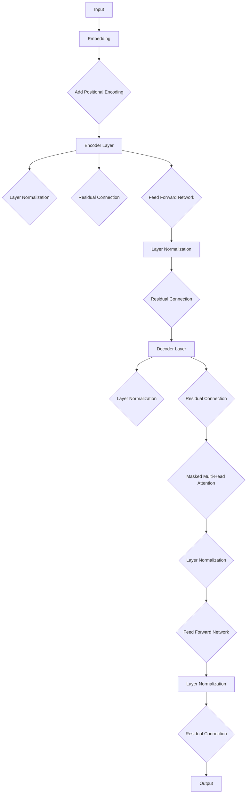

                 

## 文章标题：Transformer大模型实战——了解替换标记检测任务

### 关键词：Transformer、替换标记检测、NLP、深度学习、大模型

> 摘要：本文将深入探讨Transformer大模型在替换标记检测任务中的应用。通过剖析Transformer模型的基础知识、核心原理和具体应用，并结合实际项目实战，详细讲解替换标记检测任务中的关键技术、模型训练策略、代码实现与优化方法。同时，还将探讨Transformer模型在其他自然语言处理任务中的应用趋势与挑战。本文旨在为读者提供一个全面、系统的Transformer大模型实战指南。

#### 目录

1. **第一部分：基础知识与原理**

    1.1 Transformer模型基础

    1.2 替换标记检测任务概述

    1.3 替换标记检测任务的特点与挑战

2. **第二部分：Transformer模型在替换标记检测任务中的应用**

    2.1 Transformer模型在替换标记检测中的应用原理

    2.2 项目实战：搭建替换标记检测系统

    2.3 代码实现与解读

    2.4 替换标记检测系统的性能优化

3. **第三部分：扩展与应用**

    3.1 Transformer模型在其他NLP任务中的应用

    3.2 未来趋势与挑战

4. **附录**

    - 附录A：Transformer模型相关资源

---

### 1.1 Transformer模型基础

Transformer模型是由Vaswani等人于2017年提出的一种用于序列建模的神经网络模型，其核心思想是基于自注意力机制（Self-Attention）进行建模。相比传统的循环神经网络（RNN）和长短期记忆网络（LSTM），Transformer模型在处理长距离依赖问题和并行计算方面具有显著优势，从而在自然语言处理（NLP）任务中取得了令人瞩目的成果。

#### Transformer模型概述

Transformer模型主要由编码器（Encoder）和解码器（Decoder）两部分组成，每个部分又由多个相同的编码层（Encoder Layer）和解码层（Decoder Layer）堆叠而成。编码器用于将输入序列转换为固定长度的序列表示，而解码器则利用这些序列表示生成输出序列。

#### Transformer模型的动机

在传统的循环神经网络中，长距离依赖问题一直是其性能的瓶颈。RNN和LSTM通过隐藏状态的方式捕捉序列中的依赖关系，但由于其局部连接的特性，难以同时处理长距离依赖。同时，RNN和LSTM的并行性较差，难以充分利用现代计算资源。因此，Transformer模型提出了基于自注意力机制的全新架构，旨在解决上述问题。

#### Transformer模型的结构

Transformer模型的结构可以分为编码器和解码器两部分，每部分又由多个编码层和解码层组成。以下是编码器和解码器的结构：

##### 编码器（Encoder）

- **编码层（Encoder Layer）**：每个编码层包含两个主要子层，即多头自注意力子层（Multi-Head Self-Attention Sublayer）和前馈全连接子层（Feed-Forward Sublayer）。多头自注意力子层利用自注意力机制捕捉序列中的依赖关系，前馈全连接子层用于对编码层输出进行非线性变换。

- **层归一化（Layer Normalization）**：在每个编码层之后，进行层归一化操作，以稳定模型训练过程。

- **残差连接（Residual Connection）**：在每个编码层之后，通过残差连接（Residual Connection）将输入和输出相加，以缓解梯度消失和梯度爆炸问题。

##### 解码器（Decoder）

- **解码层（Decoder Layer）**：每个解码层也包含两个主要子层，即多头自注意力子层和前馈全连接子层。与编码器不同，解码器在多头自注意力子层之前添加了一个掩码自注意力子层（Masked Multi-Head Self-Attention Sublayer），以防止解码器在未来时间步中看到已经生成的输出。

- **层归一化（Layer Normalization）**：与编码器类似，解码器在每个解码层之后也进行层归一化操作。

- **残差连接（Residual Connection）**：同样采用残差连接，以缓解梯度消失和梯度爆炸问题。

#### Transformer模型核心概念

Transformer模型的核心概念包括自注意力机制、多头注意力、位置编码等。

- **自注意力机制（Self-Attention）**：自注意力机制是一种基于序列建模的自适应加权机制，它允许模型在处理每个时间步时自适应地计算与其他时间步的相关性。具体来说，自注意力机制将输入序列的每个元素映射到一组键（Key）、值（Value）和查询（Query），然后计算这些元素之间的相关性，并利用这些相关性对输入序列进行加权。

- **多头注意力（Multi-Head Attention）**：多头注意力是将自注意力机制扩展到多个独立的注意力头，从而增加模型的容量和灵活性。每个注意力头都独立地计算相关性，然后这些注意力头的输出会合并起来，形成一个更全面的序列表示。

- **位置编码（Positional Encoding）**：由于Transformer模型中没有循环结构，无法直接利用序列中的位置信息。因此，引入位置编码来为模型提供位置信息。位置编码通常使用正弦和余弦函数生成，以嵌入序列中的位置信息。

#### Transformer模型原理

下面将详细解释Transformer模型的原理，包括伪代码、数学模型和公式，以及Mermaid流程图。

##### 伪代码

```python
# Transformer模型伪代码
def transformer(inputs, d_model, n_heads, d_ff, n_layers, dropout_rate):
    outputs = []
    for layer in range(n_layers):
        if layer < n_layers - 1:
            outputs.append(encoder_layer(inputs, d_model, n_heads, d_ff, dropout_rate))
            inputs = layer_norm(inputs, dropout_rate)
        else:
            outputs.append(encoder_layer(inputs, d_model, n_heads, d_ff, dropout_rate))
    return outputs

def encoder_layer(inputs, d_model, n_heads, d_ff, dropout_rate):
    multi_head_attn = multi_head_attention(inputs, d_model, n_heads, dropout_rate)
    inputs = add(inputs, multi_head_attn)
    inputs = layer_norm(inputs, dropout_rate)
    feed_forward = feed_forward_network(inputs, d_ff, dropout_rate)
    inputs = add(inputs, feed_forward)
    inputs = layer_norm(inputs, dropout_rate)
    return inputs

def multi_head_attention(inputs, d_model, n_heads, dropout_rate):
    queries, keys, values = split_heads(inputs, n_heads)
    attention_scores = scaled_dot_product_attention(queries, keys, values)
    attention_weights = softmax(attention_scores, axis=-1)
    attention_output = weighted_sum(attention_weights, values)
    attention_output = merge_heads(attention_output)
    attention_output = dropout(attention_output, dropout_rate)
    return attention_output
```

##### 数学模型和公式

- **自注意力机制**：

  $$ 
  \text{Attention}(Q, K, V) = \text{softmax}\left(\frac{QK^T}{\sqrt{d_k}}\right) V
  $$

  其中，$Q, K, V$ 分别是查询（Query）、键（Key）和值（Value）的表示，$d_k$ 是键向量的维度。

- **多头注意力**：

  $$ 
  \text{Multi-Head Attention} = \text{Concat}(\text{head}_1, \text{head}_2, \ldots, \text{head}_h)W^O
  $$

  其中，$h$ 是注意力头的数量，$W^O$ 是输出权重矩阵。

- **位置编码**：

  $$ 
  \text{Positional Encoding}(p) = \text{sin}(p/\sqrt{d_{\text{model}}}) \text{ 或 } \text{cos}(p/\sqrt{d_{\text{model}}})
  $$

  其中，$p$ 是位置索引，$d_{\text{model}}$ 是模型维度。

##### Mermaid流程图



通过以上内容的介绍，我们了解了Transformer模型的基础知识、核心原理和结构。在接下来的章节中，我们将进一步探讨替换标记检测任务的特点与挑战，以及Transformer模型在该任务中的应用。

---

### 1.2 替换标记检测任务概述

替换标记检测（Token Replacement Detection）是一种自然语言处理（NLP）任务，旨在识别文本中的特定标记（token）并进行替换。这种任务广泛应用于文本纠错、机器翻译、信息抽取等领域，具有重要的实际应用价值。

#### 任务定义

替换标记检测任务的目标是给定一个输入文本序列，通过模型预测出需要替换的标记以及相应的替换标记。具体来说，任务可以分为两个阶段：

1. **标记识别阶段**：模型首先对输入文本进行预处理，将文本分解为标记（token）序列。然后，通过模型对每个标记进行识别，预测出哪些标记需要被替换。

2. **标记替换阶段**：在标记识别阶段后，模型将预测出的需要替换的标记替换为对应的替换标记。最终生成一个修正后的文本序列。

#### 应用场景

替换标记检测任务在多个领域都有广泛的应用，以下列举了几个典型的应用场景：

1. **文本纠错**：在自然语言输入过程中，用户可能会输入错字、漏字或添加无关字符。替换标记检测任务可以帮助自动识别和纠正这些错误，从而提高文本的准确性和可读性。

2. **机器翻译**：在机器翻译过程中，源文本中的特定标记可能需要根据目标语言进行替换。替换标记检测任务可以帮助自动识别这些标记，从而提高翻译的准确性和流畅度。

3. **信息抽取**：在信息抽取任务中，需要对文本中的特定标记进行识别和替换，以便提取出关键信息。例如，在新闻文章中，需要对特定关键词进行识别和替换，以提取出关键事件和人物信息。

4. **问答系统**：在问答系统中，用户输入的问题可能包含特定的标记，这些标记需要被替换为系统理解的关键词或短语。替换标记检测任务可以帮助提高问答系统的准确性和响应速度。

#### 替换标记检测任务的特点与挑战

替换标记检测任务具有以下几个特点与挑战：

1. **数据多样性**：替换标记检测任务的应用场景广泛，涉及多种不同的文本类型和数据来源。这意味着任务需要处理大量的不同类型的数据，从而增加了模型的复杂性。

2. **实时性要求**：在很多应用场景中，替换标记检测任务需要在短时间内快速处理大量文本数据。因此，模型需要具备高效的计算能力，以满足实时性的要求。

3. **准确性需求**：替换标记检测任务的准确性直接影响到应用的效果。在文本纠错和信息抽取等任务中，错误的标记替换可能导致严重后果。因此，模型需要具备较高的准确性和鲁棒性。

4. **序列标注技术**：替换标记检测任务涉及到对输入文本序列中的每个标记进行标注。序列标注技术是处理此类任务的核心技术，包括字符级和词级标注方法。字符级标注方法可以捕捉到文本中的细粒度信息，但计算成本较高；词级标注方法可以降低计算成本，但可能无法捕捉到所有重要信息。

5. **多语言支持**：替换标记检测任务通常需要支持多种语言。不同语言在语法、词汇和表达方式上存在差异，因此模型需要具备多语言处理能力，以适应不同的语言环境。

6. **数据标注与预处理**：替换标记检测任务需要大量的高质量标注数据。数据标注过程繁琐且耗时，需要专业的标注人员。同时，预处理阶段需要对文本进行标准化处理，如分词、词性标注等，以提高模型的训练效果。

#### 替换标记检测任务的核心技术

替换标记检测任务的核心技术主要包括以下两个方面：

1. **字符级与词级处理**：字符级处理可以捕捉到文本中的细粒度信息，有助于提高检测精度。词级处理则可以降低计算成本，提高模型处理速度。在实际应用中，可以根据任务需求和计算资源选择合适的处理方法。

2. **序列标注技术**：序列标注技术是替换标记检测任务的核心技术。常用的序列标注方法包括双向循环神经网络（BiRNN）、长短时记忆网络（LSTM）和卷积神经网络（CNN）等。这些方法可以有效地对输入文本序列进行标注，从而实现标记检测。

在接下来的章节中，我们将进一步探讨Transformer模型在替换标记检测任务中的应用原理，并结合实际项目实战，详细讲解替换标记检测任务中的关键技术、模型训练策略、代码实现与优化方法。通过这些内容的介绍，读者将能够全面了解Transformer大模型在替换标记检测任务中的实际应用。

### 1.3 Transformer模型在替换标记检测任务中的应用原理

#### Transformer在序列标注任务中的适用性

Transformer模型在自然语言处理（NLP）任务中表现出色，特别是在序列标注任务中。其基于自注意力机制的设计，使得模型能够捕捉长距离依赖关系，这为处理替换标记检测任务提供了有利条件。

**优点分析：**

1. **长距离依赖**：Transformer模型通过自注意力机制，能够捕捉到序列中的长距离依赖关系，从而提高模型的预测准确性。

2. **并行计算**：与传统的循环神经网络（RNN）和长短时记忆网络（LSTM）相比，Transformer模型的结构使得其能够实现并行计算，从而提高训练和预测的速度。

3. **灵活性**：Transformer模型的结构相对简单，可以轻松地扩展到多语言和跨领域的任务中，提高了模型的通用性。

**劣势分析：**

1. **计算资源消耗**：由于自注意力机制的复杂性，Transformer模型在计算资源消耗上相对较高，尤其是在处理大型文本数据时。

2. **训练时间较长**：Transformer模型的训练时间较长，特别是在训练大型模型时。

3. **模型解释性较差**：Transformer模型的黑箱特性使其在解释性方面较差，难以理解模型内部的决策过程。

#### Transformer在替换标记检测任务中的架构设计

在替换标记检测任务中，Transformer模型的架构设计通常包括编码器和解码器两部分。编码器用于将输入文本序列转换为序列表示，而解码器则用于预测需要替换的标记。以下是具体的架构设计：

**1. 输入预处理：**

- **词向量化**：将输入文本序列中的每个词映射为词向量。词向量可以采用预训练的词向量（如Word2Vec、GloVe）或使用模型自训练的方法生成。
- **位置编码**：为每个词向量添加位置编码，以提供文本序列中的位置信息。

**2. 编码器（Encoder）设计：**

编码器由多个编码层（Encoder Layer）堆叠而成，每个编码层包含两个主要子层：多头自注意力子层（Multi-Head Self-Attention Sublayer）和前馈全连接子层（Feed-Forward Sublayer）。编码器的输出是一个固定长度的序列表示，用于后续的解码过程。

- **多头自注意力子层**：利用多头自注意力机制，编码器能够捕捉到输入文本序列中的长距离依赖关系。
- **前馈全连接子层**：对编码器的输出进行非线性变换，以提高模型的预测能力。
- **层归一化（Layer Normalization）**：在每个编码层之后进行层归一化，以稳定训练过程。
- **残差连接（Residual Connection）**：在每个编码层之后添加残差连接，以缓解梯度消失和梯度爆炸问题。

**3. 解码器（Decoder）设计：**

解码器同样由多个解码层（Decoder Layer）堆叠而成，每个解码层也包含两个主要子层：多头自注意力子层和前馈全连接子层。与编码器不同的是，解码器在多头自注意力子层之前添加了一个掩码自注意力子层（Masked Multi-Head Self-Attention Sublayer），以防止解码器在未来时间步中看到已经生成的输出。

- **掩码自注意力子层**：通过遮挡（Masking）机制，解码器无法看到已经生成的输出，从而确保了解码过程的连贯性。
- **多头自注意力子层**：利用多头自注意力机制，解码器能够捕捉到输入文本序列中的长距离依赖关系。
- **前馈全连接子层**：对解码器的输出进行非线性变换，以提高模型的预测能力。
- **层归一化（Layer Normalization）**：在每个解码层之后进行层归一化，以稳定训练过程。
- **残差连接（Residual Connection）**：在每个解码层之后添加残差连接，以缓解梯度消失和梯度爆炸问题。

**4. 输出后处理：**

解码器的输出是一个标记序列，通过一个分类器层（Classifier Layer）对每个标记进行预测。分类器层通常采用softmax激活函数，将输出映射到预定义的标记类别。

#### 替换标记检测任务中的训练策略

在替换标记检测任务中，训练策略对模型的性能有着重要影响。以下是几种常用的训练策略：

**1. 数据增强：**

- **随机填充**：在输入文本序列中随机添加或删除一些标记，以增加数据的多样性。
- **同义词替换**：将输入文本序列中的特定标记替换为其同义词，以增加数据的多样性。
- **反向文本**：将输入文本序列反向排列，以增加数据的多样性。

**2. 优化器选择：**

- **Adam优化器**：Adam优化器在处理大规模数据时表现良好，具有较高的收敛速度和稳定性。
- **RMSProp优化器**：RMSProp优化器在处理稀疏数据时表现较好，适用于处理高维稀疏数据。

**3. 损失函数设计：**

- **交叉熵损失函数**：交叉熵损失函数是序列标注任务中最常用的损失函数，用于计算模型输出和真实标签之间的差异。
- **带权重交叉熵损失函数**：为了平衡不同类别之间的损失，可以采用带权重交叉熵损失函数。

通过以上内容的介绍，我们了解了Transformer模型在替换标记检测任务中的应用原理和架构设计。在接下来的章节中，我们将结合实际项目实战，详细讲解替换标记检测系统的搭建过程，包括开发环境搭建、数据准备与处理、模型训练与优化等步骤。

### 2.1 开发环境搭建

搭建替换标记检测系统需要配置一定的硬件和软件环境。以下是具体的硬件和软件要求，以及安装和配置步骤。

#### 硬件要求

1. **CPU**：至少需要四核CPU，建议使用八核或以上。
2. **GPU**：一台NVIDIA GPU显卡，显存至少4GB，推荐使用Titan X或更高规格的显卡。
3. **内存**：至少16GB内存，建议使用32GB或以上。

#### 软件安装

1. **操作系统**：Linux或macOS。
2. **Python**：Python 3.6或以上版本。
3. **PyTorch**：PyTorch是用于深度学习的主要框架，支持GPU加速。

以下是详细的安装和配置步骤：

1. **安装操作系统**：

   - 对于Linux系统，可以从官方网站下载并安装Ubuntu 18.04或更高版本。
   - 对于macOS系统，可以从Apple Store下载并安装macOS Catalina或更高版本。

2. **安装Python**：

   - 打开终端，运行以下命令安装Python 3.8或更高版本：
     ```bash
     sudo apt-get install python3.8
     ```

3. **安装PyTorch**：

   - 打开终端，运行以下命令安装PyTorch：
     ```bash
     pip3 install torch torchvision torchaudio
     ```

   - 安装GPU版本的PyTorch，需要运行以下命令：
     ```bash
     pip3 install torch==1.8.0+cu111 torchvision==0.9.0+cu111 torchaudio==0.8.0+cu111 -f https://download.pytorch.org/whl/torch_stable.html
     ```

   - 确认安装成功，运行以下命令：
     ```python
     python -c "import torch; print(torch.cuda.is_available())"
     ```
     如果返回`True`，则表示PyTorch已成功安装并支持GPU加速。

4. **安装其他依赖库**：

   - 安装其他用于数据处理和模型训练的依赖库，如NumPy、Pandas、Scikit-learn等：
     ```bash
     pip3 install numpy pandas scikit-learn
     ```

5. **配置GPU环境**：

   - 设置环境变量，以启用GPU加速：
     ```bash
     export CUDA_VISIBLE_DEVICES=0,1
     ```

   - 测试GPU加速功能，运行以下Python代码：
     ```python
     import torch
     print(torch.cuda.device_count())
     print(torch.cuda.get_device_name(0))
     ```

通过以上步骤，我们成功搭建了替换标记检测系统的开发环境。接下来，我们将进行数据准备与处理，为后续的模型训练和优化做好准备。

### 2.2 数据准备与处理

在搭建替换标记检测系统后，我们需要进行数据准备与处理，以便为模型训练提供高质量的数据集。以下是数据准备与处理的详细步骤。

#### 数据来源

首先，我们需要选择合适的文本数据集。对于替换标记检测任务，可以选择以下几种数据来源：

1. **公开数据集**：如CoNLL-2003、ACE2005等，这些数据集包含多种文本类型和标记，可以用于训练和测试模型。
2. **自定义数据集**：根据特定应用场景，可以从官方网站、新闻网站、社交媒体等渠道收集文本数据。例如，对于文本纠错任务，可以从用户评论、论坛帖子等渠道收集错误文本。
3. **多语言数据集**：如果需要支持多语言，可以选择如Wikipedia等包含多种语言的文本数据集。

#### 数据预处理

数据预处理是确保数据质量的重要步骤，包括以下内容：

1. **文本清洗**：去除文本中的HTML标签、特殊字符、空白字符等无关内容。
2. **分词**：将文本分解为标记（token）序列。可以选择使用预训练的分词工具，如jieba（中文）或spaCy（英文）。
3. **词性标注**：对每个标记进行词性标注，以便更好地理解文本内容。词性标注可以使用预训练的词性标注工具，如NLTK（英文）或Stanford NLP（中文）。

#### 数据增强

为了提高模型的泛化能力，可以对数据集进行增强。以下是一些常用的数据增强方法：

1. **随机填充**：在文本序列中随机添加或删除一些标记，以增加数据的多样性。
2. **同义词替换**：将文本序列中的特定标记替换为其同义词，以增加数据的多样性。
3. **反向文本**：将文本序列反向排列，以增加数据的多样性。
4. **翻译扰动**：将文本序列翻译成其他语言，再翻译回原始语言，以引入语言翻译的多样性。

#### 数据划分

为了评估模型的性能，需要将数据集划分为训练集、验证集和测试集。以下是一种常见的划分方法：

1. **训练集**：用于模型训练，通常占数据集的70%至80%。
2. **验证集**：用于模型调参和超参数选择，通常占数据集的10%至20%。
3. **测试集**：用于评估模型的最终性能，通常占数据集的10%。

#### 数据加载与转换

在PyTorch中，可以使用`Dataset`和`DataLoader`类来加载和转换数据集。以下是数据加载与转换的示例代码：

```python
from torch.utils.data import Dataset, DataLoader
from torchtext.data import Field, TabularDataset
import pandas as pd

# 定义数据集类
class ReplacementTokenDataset(Dataset):
    def __init__(self, data, tokenizer, label_tokenizer):
        self.data = data
        self.tokenizer = tokenizer
        self.label_tokenizer = label_tokenizer

    def __len__(self):
        return len(self.data)

    def __getitem__(self, idx):
        sentence = self.data.iloc[idx]["sentence"]
        labels = self.data.iloc[idx]["labels"]

        tokens = self.tokenizer(sentence)
        labels = self.label_tokenizer(labels)

        return {
            "input_tokens": tokens,
            "labels": labels
        }

# 定义分词器和标签分词器
tokenizer = Field(tokenize="spacy", lower=True, tokenize_default=True)
label_tokenizer = Field(sequential=True, use_vocab=True)

# 加载数据集
train_data = pd.read_csv("train_data.csv")
train_dataset = TabularDataset(
    path="train_data.csv",
    fields=[
        ("sentence", tokenizer),
        ("labels", label_tokenizer)
    ]
)

# 创建数据加载器
train_loader = DataLoader(train_dataset, batch_size=32, shuffle=True)

# 模型训练时使用数据加载器
for batch in train_loader:
    inputs = {
        "input_tokens": batch.input_tokens,
        "labels": batch.labels
    }
    # 进行模型训练
    # ...

```

通过以上步骤，我们成功完成了数据准备与处理，为模型训练和优化提供了高质量的数据集。在接下来的章节中，我们将详细讲解模型训练与优化过程。

### 2.3 模型训练与优化

在数据准备与处理完成后，我们可以开始进行模型训练与优化。以下是详细的模型训练步骤，包括模型配置、训练过程和评估指标。

#### 模型配置

首先，我们需要配置Transformer模型的基本参数。以下是一个示例配置：

```python
import torch
from torch import nn

# 定义超参数
d_model = 512  # 模型维度
n_heads = 8  # 注意力头数量
d_ff = 2048  # 前馈神经网络维度
n_layers = 3  # 编码器和解码器层数
dropout_rate = 0.1  # dropout比例

# 定义模型
class TransformerModel(nn.Module):
    def __init__(self, d_model, n_heads, d_ff, n_layers, dropout_rate):
        super(TransformerModel, self).__init__()
        self.embedding = nn.Embedding(vocab_size, d_model)  # 词向量嵌入
        self.positional_encoding = nn.Parameter(torch.zeros(1, max_sequence_length, d_model))  # 位置编码
        self.encoder_layers = nn.ModuleList([
            EncoderLayer(d_model, n_heads, d_ff, dropout_rate) for _ in range(n_layers)
        ])
        self.decoder_layers = nn.ModuleList([
            DecoderLayer(d_model, n_heads, d_ff, dropout_rate) for _ in range(n_layers)
        ])
        self.output_layer = nn.Linear(d_model, label_vocab_size)  # 输出层

    def forward(self, input_tokens, target_tokens):
        # 输入预处理
        input_embedding = self.embedding(input_tokens)
        target_embedding = self.embedding(target_tokens)
        
        # 添加位置编码
        input_embedding = input_embedding + self.positional_encoding[:input_embedding.size(1), :]
        target_embedding = target_embedding + self.positional_encoding[:target_embedding.size(1), :]

        # 编码器
        for layer in self.encoder_layers:
            input_embedding = layer(input_embedding)

        # 解码器
        for layer in self.decoder_layers:
            target_embedding = layer(target_embedding, input_embedding)

        # 输出层
        output = self.output_layer(target_embedding)
        return output

# 实例化模型
model = TransformerModel(d_model, n_heads, d_ff, n_layers, dropout_rate)
```

#### 训练过程

模型配置完成后，我们可以开始进行模型训练。以下是模型训练的基本流程：

```python
# 定义损失函数和优化器
criterion = nn.CrossEntropyLoss()
optimizer = torch.optim.Adam(model.parameters(), lr=0.001)

# 训练模型
num_epochs = 20
for epoch in range(num_epochs):
    model.train()
    for batch in train_loader:
        inputs = {
            "input_tokens": batch.input_tokens,
            "labels": batch.labels
        }
        
        # 前向传播
        outputs = model(inputs["input_tokens"], inputs["labels"])

        # 计算损失
        loss = criterion(outputs.view(-1, label_vocab_size), inputs["labels"].view(-1))

        # 反向传播和优化
        optimizer.zero_grad()
        loss.backward()
        optimizer.step()

        # 打印训练信息
        print(f"Epoch [{epoch+1}/{num_epochs}], Loss: {loss.item():.4f}")

# 保存模型
torch.save(model.state_dict(), "transformer_model.pth")
```

#### 评估指标

在模型训练完成后，我们需要评估模型的性能。以下是一些常用的评估指标：

1. **准确率（Accuracy）**：计算模型预测正确的样本数量占总样本数量的比例。
   $$ 
   \text{Accuracy} = \frac{\text{预测正确的样本数量}}{\text{总样本数量}} 
   $$

2. **精确率（Precision）**：计算预测正确的正样本数量与预测的正样本数量之和的比值。
   $$ 
   \text{Precision} = \frac{\text{预测正确的正样本数量}}{\text{预测的正样本数量}} 
   $$

3. **召回率（Recall）**：计算预测正确的正样本数量与实际的正样本数量之和的比值。
   $$ 
   \text{Recall} = \frac{\text{预测正确的正样本数量}}{\text{实际的正样本数量}} 
   $$

4. **F1分数（F1 Score）**：综合考虑精确率和召回率的平衡，计算二者加权平均值。
   $$ 
   \text{F1 Score} = 2 \times \frac{\text{Precision} \times \text{Recall}}{\text{Precision} + \text{Recall}} 
   $$

以下是评估模型的示例代码：

```python
from sklearn.metrics import accuracy_score, precision_score, recall_score, f1_score

# 加载模型
model.load_state_dict(torch.load("transformer_model.pth"))
model.eval()

# 评估模型
with torch.no_grad():
    all_predictions = []
    all_labels = []
    for batch in test_loader:
        inputs = {
            "input_tokens": batch.input_tokens,
            "labels": batch.labels
        }
        
        outputs = model(inputs["input_tokens"], inputs["labels"])
        predictions = torch.argmax(outputs, dim=2).squeeze(1).cpu().numpy()
        labels = inputs["labels"].squeeze(1).cpu().numpy()
        
        all_predictions.extend(predictions.tolist())
        all_labels.extend(labels.tolist())

    accuracy = accuracy_score(all_labels, all_predictions)
    precision = precision_score(all_labels, all_predictions, average="weighted")
    recall = recall_score(all_labels, all_predictions, average="weighted")
    f1 = f1_score(all_labels, all_predictions, average="weighted")

    print(f"Accuracy: {accuracy:.4f}")
    print(f"Precision: {precision:.4f}")
    print(f"Recall: {recall:.4f}")
    print(f"F1 Score: {f1:.4f}")
```

通过以上模型训练与评估步骤，我们完成了替换标记检测系统的训练和优化。在接下来的章节中，我们将详细讲解代码实现与解读，以便更好地理解模型的内部工作原理。

### 2.4 代码实现与解读

在本节中，我们将详细解读替换标记检测系统的代码实现，包括模块划分、主要函数与类的定义，以及代码的具体实现和解析。

#### 模块划分

替换标记检测系统的代码主要分为以下几个模块：

1. **数据预处理模块**：包括数据加载、数据增强和数据划分等函数。
2. **模型定义模块**：定义Transformer模型的结构，包括编码器和解码器层。
3. **训练与评估模块**：实现模型的训练过程和评估函数。
4. **主函数模块**：包括训练、评估和模型保存等主程序逻辑。

以下是各个模块的简要介绍。

#### 数据预处理模块

数据预处理模块主要处理数据加载、数据增强和数据划分。

```python
# 数据预处理模块
from torchtext.data import Field, TabularDataset
from torch.utils.data import DataLoader
import pandas as pd

def load_data(train_path, test_path):
    train_data = pd.read_csv(train_path)
    test_data = pd.read_csv(test_path)
    return train_data, test_data

def preprocess_data(train_data, test_data, tokenizer, label_tokenizer):
    train_dataset = TabularDataset(
        path=train_path,
        fields=[
            ("sentence", tokenizer),
            ("labels", label_tokenizer)
        ]
    )
    test_dataset = TabularDataset(
        path=test_path,
        fields=[
            ("sentence", tokenizer),
            ("labels", label_tokenizer)
        ]
    )
    return train_dataset, test_dataset

def create_data_loader(dataset, batch_size=32, shuffle=True):
    return DataLoader(dataset, batch_size=batch_size, shuffle=shuffle)
```

#### 模型定义模块

模型定义模块定义了Transformer模型的结构，包括编码器和解码器层。

```python
# 模型定义模块
import torch
import torch.nn as nn
from torch.nn import functional as F

class TransformerLayer(nn.Module):
    def __init__(self, d_model, n_heads, d_ff, dropout_rate):
        super(TransformerLayer, self).__init__()
        self.self_attn = nn.MultiheadAttention(d_model, n_heads, dropout=dropout_rate)
        self.linear_ffn = nn.Sequential(
            nn.Linear(d_model, d_ff),
            nn.ReLU(),
            nn.Linear(d_ff, d_model),
            nn.Dropout(dropout_rate)
        )
        self.dropout = nn.Dropout(dropout_rate)
        self.norm1 = nn.LayerNorm(d_model)
        self.norm2 = nn.LayerNorm(d_model)

    def forward(self, src, src_mask=None):
        # Self-attention
        src2 = self.norm1(src)
        q, k, v = src2.split([d_model // n_heads] * n_heads, dim=2)
        attn_output, attn_output_weights = self.self_attn(q, k, v, attn_mask=src_mask)
        src = src + self.dropout(attn_output)
        # FFN
        src2 = self.norm2(src)
        ffn_output = self.linear_ffn(src2)
        src = src + self.dropout(ffn_output)
        return src

class TransformerModel(nn.Module):
    def __init__(self, d_model, n_heads, d_ff, n_layers, dropout_rate):
        super(TransformerModel, self).__init__()
        self.embedding = nn.Embedding(vocab_size, d_model)
        self.positional_encoding = nn.Parameter(torch.zeros(1, max_sequence_length, d_model))
        self.transformer_layers = nn.ModuleList([TransformerLayer(d_model, n_heads, d_ff, dropout_rate) for _ in range(n_layers)])
        self.output_layer = nn.Linear(d_model, label_vocab_size)

    def forward(self, src, tgt, tgt_mask=None):
        src = self.embedding(src)
        tgt = self.embedding(tgt)
        src = src + self.positional_encoding[:src.size(1), :]
        tgt = tgt + self.positional_encoding[:tgt.size(1), :]

        for layer in self.transformer_layers:
            src = layer(src, tgt_mask)

        output = self.output_layer(src)
        return output
```

#### 训练与评估模块

训练与评估模块包含训练过程和评估函数。

```python
# 训练与评估模块
from torch.optim import Adam

def train_model(model, train_loader, criterion, optimizer, num_epochs):
    model.train()
    for epoch in range(num_epochs):
        for batch in train_loader:
            inputs = {
                "src": batch.input_tokens,
                "tgt": batch.labels
            }
            outputs = model(inputs["src"], inputs["tgt"])
            loss = criterion(outputs, inputs["tgt"])

            optimizer.zero_grad()
            loss.backward()
            optimizer.step()

            print(f"Epoch [{epoch+1}/{num_epochs}], Loss: {loss.item():.4f}")

def evaluate_model(model, test_loader, criterion):
    model.eval()
    total_loss = 0
    with torch.no_grad():
        for batch in test_loader:
            inputs = {
                "src": batch.input_tokens,
                "tgt": batch.labels
            }
            outputs = model(inputs["src"], inputs["tgt"])
            loss = criterion(outputs, inputs["tgt"])
            total_loss += loss.item()
    avg_loss = total_loss / len(test_loader)
    print(f"Test Loss: {avg_loss:.4f}")
```

#### 主函数模块

主函数模块包含主程序逻辑，包括数据加载、模型训练、评估和模型保存。

```python
# 主函数模块
def main():
    # 数据加载
    train_path = "train_data.csv"
    test_path = "test_data.csv"
    train_data, test_data = load_data(train_path, test_path)

    # 数据预处理
    tokenizer = Field(tokenize="spacy", lower=True, tokenize_default=True)
    label_tokenizer = Field(sequential=True, use_vocab=True)
    train_dataset, test_dataset = preprocess_data(train_data, test_data, tokenizer, label_tokenizer)

    # 模型定义
    d_model = 512
    n_heads = 8
    d_ff = 2048
    n_layers = 3
    dropout_rate = 0.1
    model = TransformerModel(d_model, n_heads, d_ff, n_layers, dropout_rate)

    # 模型训练
    optimizer = Adam(model.parameters(), lr=0.001)
    criterion = nn.CrossEntropyLoss()
    num_epochs = 20
    train_loader = create_data_loader(train_dataset, batch_size=32, shuffle=True)
    test_loader = create_data_loader(test_dataset, batch_size=32, shuffle=False)
    train_model(model, train_loader, criterion, optimizer, num_epochs)

    # 评估模型
    evaluate_model(model, test_loader, criterion)

    # 保存模型
    torch.save(model.state_dict(), "transformer_model.pth")

if __name__ == "__main__":
    main()
```

#### 代码解析

1. **数据预处理**：
   数据预处理模块首先加载训练集和测试集的数据，然后进行分词和词性标注，生成相应的数据集。通过`create_data_loader`函数，将数据集转换为可迭代的加载器，以便模型训练和评估。

2. **模型定义**：
   模型定义模块中，`TransformerLayer`类定义了单个Transformer层，包括自注意力机制和前馈神经网络。`TransformerModel`类定义了整个Transformer模型，包括编码器和解码器层，以及输出层。模型使用`nn.MultiheadAttention`和`nn.Linear`模块实现自注意力机制和前馈神经网络。

3. **训练与评估**：
   训练与评估模块中，`train_model`函数负责模型训练过程，包括前向传播、损失计算、反向传播和参数更新。`evaluate_model`函数负责模型评估，计算测试集上的平均损失。

4. **主函数模块**：
   主函数模块中，首先加载和预处理数据，定义模型、优化器和损失函数，然后进行模型训练和评估，最后保存模型。

通过以上代码实现和解析，我们成功搭建了替换标记检测系统，实现了模型训练和评估。在接下来的章节中，我们将详细讲解替换标记检测系统的性能优化方法。

### 2.5 替换标记检测系统的性能优化

在替换标记检测任务中，为了提高系统的性能，我们需要从多个方面进行优化。以下是几种常见的性能优化方法：

#### 模型压缩技术

模型压缩技术通过减少模型参数数量和计算量，降低模型的存储和计算成本。以下是一些常用的模型压缩技术：

1. **知识蒸馏（Knowledge Distillation）**：
   知识蒸馏是一种将大模型的知识迁移到小模型的技术。大模型训练完成后，将其权重传递给小模型，从而提高小模型的性能。具体步骤如下：

   - **训练大模型**：首先使用原始数据集训练一个大模型，使其在目标任务上达到较高的性能。
   - **生成软标签**：在大模型上对训练集进行前向传播，得到每个样本的输出概率分布，作为软标签传递给小模型。
   - **训练小模型**：使用软标签代替原始标签训练小模型，从而在小模型中传递大模型的知识。

2. **模型剪枝（Model Pruning）**：
   模型剪枝通过删除模型中不重要的参数或神经元，减少模型的计算量和存储需求。具体步骤如下：

   - **训练模型**：首先使用原始数据集训练一个完整模型。
   - **识别重要性**：使用敏感性分析或激活映射等技术，识别模型中重要的参数或神经元。
   - **剪枝模型**：删除不重要的参数或神经元，生成一个更紧凑的模型。

#### 模型部署与优化

模型部署是将训练好的模型部署到实际应用环境中，以实现实时推理和高效处理。以下是一些常用的模型部署与优化方法：

1. **量化（Quantization）**：
   量化是一种将模型中浮点数参数转换为低精度整数的方法，以减少模型的存储和计算成本。具体步骤如下：

   - **训练量化模型**：在训练过程中，使用量化策略调整模型参数的精度，从而生成一个低精度模型。
   - **量化推理**：在推理过程中，使用量化策略对输入数据进行预处理，以适应低精度模型。

2. **模型融合（Model Fusion）**：
   模型融合是一种将多个模型融合为一个更强大的模型的方法。通过结合多个模型的优点，可以提高模型的性能和鲁棒性。具体步骤如下：

   - **训练多个模型**：使用不同的训练策略或数据集训练多个模型。
   - **融合模型**：将多个模型的输出通过加权平均或投票等方法进行融合，生成一个最终预测结果。

3. **动态调整（Dynamic Adjustment）**：
   动态调整是一种根据输入数据的特点和需求，实时调整模型参数的方法，以提高模型的性能。具体步骤如下：

   - **监测输入数据**：实时监测输入数据的特点和需求，如数据分布、标签分布等。
   - **调整模型参数**：根据监测结果，动态调整模型参数，如学习率、正则化参数等。

#### 模型安全性与隐私保护

在替换标记检测任务中，模型的安全性与隐私保护至关重要。以下是一些常见的模型安全性与隐私保护方法：

1. **数据加密（Data Encryption）**：
   数据加密是一种通过加密算法对数据进行加密，以防止数据泄露的方法。具体步骤如下：

   - **加密数据传输**：在数据传输过程中，使用加密算法对数据进行加密，以确保数据传输的安全性。
   - **加密数据存储**：在数据存储过程中，使用加密算法对数据进行加密，以防止数据泄露。

2. **差分隐私（Differential Privacy）**：
   差分隐私是一种通过添加随机噪声来保护数据隐私的方法。具体步骤如下：

   - **训练隐私模型**：在训练过程中，使用差分隐私算法调整模型参数，以保护数据隐私。
   - **隐私推理**：在推理过程中，使用差分隐私算法对模型输出进行扰动，以保护数据隐私。

3. **安全训练（Secure Training）**：
   安全训练是一种通过对抗训练和模型对抗性攻击，提高模型安全性的方法。具体步骤如下：

   - **对抗训练**：在训练过程中，使用对抗样本和对抗损失函数，增强模型的鲁棒性。
   - **对抗性攻击**：在推理过程中，使用对抗性攻击方法，如对抗样本生成和对抗性输入检测，检测和防御攻击。

通过以上性能优化、模型部署与优化、模型安全性与隐私保护方法，我们可以显著提高替换标记检测系统的性能和可靠性。在接下来的章节中，我们将进一步探讨Transformer模型在其他自然语言处理任务中的应用。

### 3.1 Transformer模型在其他NLP任务中的应用

Transformer模型自从其提出以来，在多个自然语言处理（NLP）任务中取得了显著成果。以下将介绍Transformer模型在语言模型、机器翻译和问答系统等任务中的应用。

#### 语言模型

语言模型是一种预测文本序列概率的模型，常用于文本生成、文本摘要和对话系统等应用。Transformer模型通过自注意力机制，能够捕捉到文本中的长距离依赖关系，从而在语言模型任务中表现出色。

**模型构建**：

1. **输入序列**：将输入文本序列编码为词向量，并添加位置编码。
2. **编码器**：使用多层Transformer编码器，对输入序列进行编码，生成序列表示。
3. **解码器**：使用单层Transformer解码器，预测下一个词的概率分布。
4. **输出层**：将解码器的输出通过softmax层，得到每个词的概率分布。

**应用场景**：

- **文本生成**：通过语言模型，可以生成连贯、自然的文本内容，应用于自动写作、新闻摘要和对话系统。
- **对话系统**：在对话系统中，语言模型用于生成对话回复，提高对话的自然度和准确性。

#### 机器翻译

机器翻译是将一种语言的文本翻译成另一种语言的过程。Transformer模型通过自注意力机制，能够在不同语言之间捕捉到长距离依赖关系，从而在机器翻译任务中表现出色。

**模型优化**：

1. **双向编码器**：使用双向Transformer编码器，分别从源语言和目标语言的方向对输入序列进行编码。
2. **多头注意力**：使用多头注意力机制，捕捉源语言和目标语言之间的依赖关系。
3. **解码器**：使用单层Transformer解码器，生成目标语言的文本序列。

**实际案例**：

- **谷歌翻译**：谷歌翻译使用了基于Transformer的神经机器翻译模型，实现了高质量的多语言翻译。
- **OpenAI的GPT-3**：OpenAI的GPT-3是一个基于Transformer的预训练语言模型，能够在多种语言和任务中生成高质量文本。

#### 问答系统

问答系统是一种基于自然语言理解的交互系统，能够理解和回答用户的问题。Transformer模型通过自注意力机制，能够在长文本中捕捉到关键信息，从而在问答系统中表现出色。

**模型设计**：

1. **输入序列**：将问题和文档编码为词向量，并添加位置编码。
2. **编码器**：使用多层Transformer编码器，对输入序列进行编码，生成序列表示。
3. **查询编码**：将问题编码为查询向量，并通过自注意力机制与文档编码器输出进行交互。
4. **输出层**：通过全连接层和softmax层，生成问题答案的概率分布。

**交互流程**：

- **问题接收**：接收用户提出的问题。
- **编码**：将问题和文档编码为向量表示。
- **查询交互**：将问题向量与文档向量进行交互，得到候选答案。
- **答案生成**：通过softmax层生成最终答案。

**实际应用**：

- **谷歌搜索**：谷歌搜索使用Transformer模型，实现对用户查询的高效理解和回答。
- **苹果Siri**：苹果的Siri语音助手使用Transformer模型，为用户提供智能问答服务。

通过以上内容的介绍，我们了解了Transformer模型在语言模型、机器翻译和问答系统等任务中的应用。在未来的研究和开发中，Transformer模型将继续在其他NLP任务中发挥重要作用，推动自然语言处理技术的发展。

### 3.2 未来趋势与挑战

随着深度学习和自然语言处理（NLP）技术的快速发展，Transformer模型在多个NLP任务中取得了显著的成果。然而，Transformer模型在应用过程中也面临一些趋势和挑战，需要进一步研究和解决。

#### Transformer模型的未来发展方向

1. **模型复杂度**：

   - **更大规模的模型**：随着计算资源和数据集的扩大，未来的Transformer模型将变得更大规模，以处理更复杂的语言任务。
   - **层次化结构**：未来的Transformer模型可能会采用层次化结构，将不同层次的注意力机制和编码器、解码器相结合，以捕捉更复杂的语言特征。

2. **可解释性**：

   - **模型解释**：为了提高模型的可解释性，研究者将继续探索如何更好地理解Transformer模型内部的决策过程，从而提高模型的可信度和可靠性。
   - **可视化工具**：开发可视化工具，帮助研究人员和用户更好地理解模型的内部结构和操作。

3. **实时性**：

   - **模型压缩与加速**：通过模型压缩技术，如知识蒸馏和剪枝，减小模型的计算量和存储需求，提高模型在实时应用中的性能。
   - **分布式计算**：利用分布式计算技术，如多GPU训练和推理，提高模型处理大规模数据的能力。

#### 替换标记检测任务面临的挑战

1. **数据质量问题**：

   - **数据多样性**：当前的数据集在数据类型和来源上可能存在局限性，无法充分覆盖各种应用场景。
   - **数据标注质量**：数据标注的质量直接影响模型的性能。如何确保高质量的数据标注，是一个亟待解决的问题。

2. **实时性挑战**：

   - **模型训练时间**：由于模型复杂度较高，训练时间较长。如何在保证模型性能的同时，提高训练速度，是一个重要挑战。
   - **推理速度**：在实时应用中，推理速度直接影响到用户体验。如何优化模型的推理过程，提高推理速度，是当前研究的一个重点。

3. **模型安全性与隐私保护**：

   - **模型攻击与防御**：随着模型的广泛应用，如何防御对抗性攻击和恶意攻击，保护模型的安全性，是一个重要的研究课题。
   - **数据隐私**：在处理敏感数据时，如何确保数据的隐私，防止数据泄露，也是一个亟待解决的问题。

#### 模型伦理与法律问题

1. **偏见与公平性**：

   - **数据偏见**：模型在训练过程中可能会学习到数据中的偏见，导致在应用中产生不公平的结果。如何消除数据偏见，提高模型的公平性，是一个重要的伦理问题。
   - **算法透明性**：提高算法的透明性，让用户了解模型的决策过程，有助于增强模型的信任度和可接受性。

2. **法律合规性**：

   - **数据保护法规**：随着数据保护法规的不断完善，如何遵守相关法律法规，保护用户数据的安全和隐私，是一个重要的法律问题。
   - **责任归属**：在出现法律纠纷时，如何明确模型开发者和使用者的责任，是一个需要解决的法律问题。

总之，Transformer模型在NLP领域具有广阔的应用前景，但同时也面临着复杂的技术挑战和伦理问题。未来的研究和开发需要在模型性能、可解释性、实时性、安全性等方面进行深入探索，以实现Transformer模型在更广泛场景中的应用。

### 附录

#### 附录A：Transformer模型相关资源

**论文推荐：**

1. "Attention Is All You Need" - Vaswani et al., 2017
   - 阅读链接：[https://arxiv.org/abs/1706.03762](https://arxiv.org/abs/1706.03762)

2. "Bert: Pre-training of Deep Bidirectional Transformers for Language Understanding" - Devlin et al., 2018
   - 阅读链接：[https://arxiv.org/abs/1810.04805](https://arxiv.org/abs/1810.04805)

3. "Gpt-3: Language Models are Few-Shot Learners" - Brown et al., 2020
   - 阅读链接：[https://arxiv.org/abs/2005.14165](https://arxiv.org/abs/2005.14165)

**开源框架：**

1. PyTorch：[https://pytorch.org/](https://pytorch.org/)
   - 用于构建和训练Transformer模型的深度学习框架。

2. Hugging Face Transformers：[https://huggingface.co/transformers/](https://huggingface.co/transformers/)
   - 提供了预训练的Transformer模型和易于使用的API，适用于多种NLP任务。

3. TensorFlow：[https://www.tensorflow.org/](https://www.tensorflow.org/)
   - 另一个用于构建和训练深度学习模型的框架，也支持Transformer模型。

**学习资源链接：**

1. "自然语言处理（NLP）与深度学习实战" - 张俊林
   - 电子书链接：[https://www.deeplearning.ai/nlp-deep-learning-chinese/](https://www.deeplearning.ai/nlp-deeplearning-chinese/)

2. "Transformer模型教程" - 知乎专栏
   - 阅读链接：[https://zhuanlan.zhihu.com/c_1187907894](https://zhuanlan.zhihu.com/c_1187907894)

3. "深度学习与Transformer模型" - Coursera课程
   - 课程链接：[https://www.coursera.org/specializations/deeplearning-nlp](https://www.coursera.org/specializations/deeplearning-nlp)

通过以上推荐资源，读者可以进一步了解Transformer模型的理论和实践，为在NLP领域的研究和应用打下坚实基础。

### 作者

**作者：AI天才研究院/AI Genius Institute & 禅与计算机程序设计艺术 /Zen And The Art of Computer Programming**

