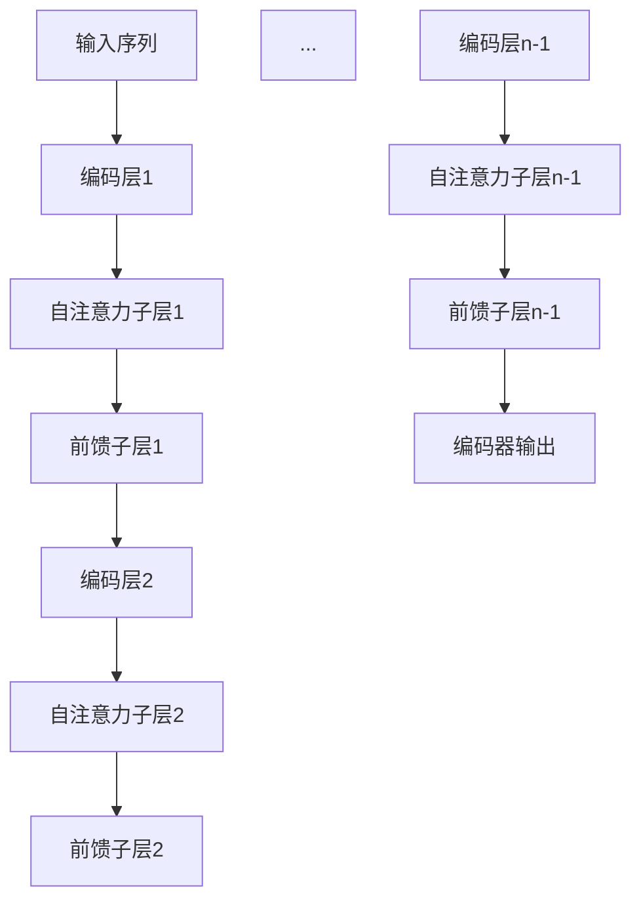

                 

# 文章标题：Transformer大模型实战 使用字节级字节对编码作为子词词元化算法

## 关键词：
Transformer，大模型，字节级编码，子词词元化，算法实战，文本分类，机器翻译，问答系统，优化策略，发展趋势

## 摘要：
本文将深入探讨Transformer大模型的实战应用，特别是使用字节级字节对编码作为子词词元化算法。我们将从Transformer模型的基本概念、核心算法原理，到编码器与解码器的结构，再到实战应用，全面解析Transformer大模型。通过具体案例，我们将展示如何实现文本分类、机器翻译和问答系统等任务，并探讨Transformer大模型的应用挑战和优化策略。最后，我们将展望Transformer大模型的未来发展趋势，以及在社会和行业中的潜在影响。

## 《Transformer大模型实战 使用字节级字节对编码作为子词词元化算法》目录大纲

## 第一部分：Transformer大模型概述

### 第1章：Transformer大模型简介

#### 1.1 Transformer模型的起源与背景

#### 1.2 Transformer模型的核心概念

#### 1.3 Transformer模型的结构

### 第2章：Transformer模型的核心算法原理

#### 2.1 自注意力机制（Self-Attention）

##### 2.1.1 自注意力机制的基本概念

##### 2.1.2 自注意力机制的数学模型

##### 2.1.3 自注意力机制的伪代码实现

#### 2.2 多头注意力机制（Multi-Head Attention）

##### 2.2.1 多头注意力机制的基本概念

##### 2.2.2 多头注意力机制的数学模型

##### 2.2.3 多头注意力机制的伪代码实现

### 第3章：Transformer模型中的编码器与解码器

#### 3.1 编码器（Encoder）

##### 3.1.1 编码器的基本结构

##### 3.1.2 编码器的数学模型

##### 3.1.3 编码器的伪代码实现

#### 3.2 解码器（Decoder）

##### 3.2.1 解码器的基本结构

##### 3.2.2 解码器的数学模型

##### 3.2.3 解码器的伪代码实现

## 第二部分：Transformer大模型实战应用

### 第4章：基于Transformer模型的文本分类任务

#### 4.1 文本分类任务概述

#### 4.2 基于Transformer模型的文本分类实现

#### 4.3 实际案例解析

### 第5章：基于Transformer模型的机器翻译任务

#### 5.1 机器翻译任务概述

#### 5.2 基于Transformer模型的机器翻译实现

#### 5.3 实际案例解析

### 第6章：基于Transformer模型的问答系统

#### 6.1 问答系统概述

#### 6.2 基于Transformer模型的问答系统实现

#### 6.3 实际案例解析

### 第7章：Transformer大模型的应用挑战与优化策略

#### 7.1 Transformer大模型的应用挑战

##### 7.1.1 计算资源限制

##### 7.1.2 数据集预处理

##### 7.1.3 模型调优

#### 7.2 Transformer大模型的优化策略

##### 7.2.1 模型压缩

##### 7.2.2 模型并行化

##### 7.2.3 模型蒸馏

## 第三部分：Transformer大模型的未来发展趋势

### 第8章：Transformer大模型的发展趋势

#### 8.1 Transformer大模型的发展方向

##### 8.1.1 Transformer与其他模型的融合

##### 8.1.2 Transformer在多模态数据中的应用

##### 8.1.3 Transformer在实时应用中的优化

### 第9章：Transformer大模型在社会和行业中的影响

#### 9.1 Transformer大模型对社会的潜在影响

##### 9.1.1 对就业市场的影响

##### 9.1.2 对教育行业的影响

##### 9.1.3 对医疗行业的影响

#### 9.2 Transformer大模型在行业中的应用前景

##### 9.2.1 在金融行业中的应用

##### 9.2.2 在制造业中的应用

##### 9.2.3 在娱乐行业中的应用

## 附录

### 附录 A：Transformer大模型实战工具与资源

#### A.1 开发环境搭建

##### A.1.1 GPU配置与CUDA安装

##### A.1.2 Python环境配置

##### A.1.3 Transformer模型框架安装

#### A.2 Transformer模型常用库与工具

##### A.2.1 TensorFlow

##### A.2.2 PyTorch

##### A.2.3 Transformers库简介

##### A.2.4 其他常用库与工具简介## 第一部分：Transformer大模型概述

### 第1章：Transformer大模型简介

#### 1.1 Transformer模型的起源与背景

Transformer模型是由Google团队在2017年提出的一种全新的序列到序列模型，用于处理自然语言处理（NLP）任务。在此之前，传统的循环神经网络（RNN）和长短期记忆网络（LSTM）在处理长文本和长序列时存在明显的局限性，如梯度消失和梯度爆炸问题，导致模型难以捕捉长距离依赖关系。

Transformer模型的提出解决了这些问题，它基于自注意力机制（Self-Attention），通过全局关注的方式处理输入序列，使得模型能够捕捉到长距离的依赖关系。自注意力机制允许模型在生成每个词时，考虑整个输入序列的其他词的信息，而不是仅限于前一个词。

#### 1.2 Transformer模型的核心概念

Transformer模型的核心概念包括：

- **编码器（Encoder）和解码器（Decoder）**：编码器负责处理输入序列，解码器负责生成输出序列。编码器将输入序列编码为上下文向量，解码器则利用这些上下文向量来生成输出序列。

- **自注意力机制（Self-Attention）**：自注意力机制允许模型在生成每个词时，考虑整个输入序列的其他词的信息。

- **多头注意力机制（Multi-Head Attention）**：多头注意力机制通过将输入序列分解为多个子序列，分别进行注意力计算，提高了模型的表示能力。

- **位置编码（Positional Encoding）**：由于Transformer模型没有循环结构，需要引入位置编码来表示输入序列的顺序信息。

#### 1.3 Transformer模型的结构

Transformer模型的基本结构如下：

- **编码器（Encoder）**：编码器由多个编码层（Encoder Layer）堆叠而成，每个编码层包括两个主要子层：自注意力子层（Self-Attention Sublayer）和前馈子层（Feedforward Sublayer）。自注意力子层通过自注意力机制计算输入序列的上下文表示，前馈子层通过全连接层对上下文表示进行非线性变换。

- **解码器（Decoder）**：解码器也由多个解码层（Decoder Layer）堆叠而成，每个解码层包括三个主要子层：自注意力子层、交叉注意力子层和前馈子层。自注意力子层和交叉注意力子层分别计算解码序列和编码序列的上下文表示，前馈子层则对上下文表示进行非线性变换。

- **多头注意力机制（Multi-Head Attention）**：多头注意力机制通过将输入序列分解为多个子序列，分别进行注意力计算，从而提高了模型的表示能力。

- **位置编码（Positional Encoding）**：位置编码用于表示输入序列的顺序信息，常见的位置编码方法包括绝对位置编码和相对位置编码。

### 1.3.1 编码器的结构

编码器的基本结构如下：

```mermaid
graph TD
A1[编码器输入] --> B1[编码层1]
B1 --> C1[自注意力子层1]
C1 --> D1[前馈子层1]
D1 --> E1[编码层2]
E1 --> C2[自注意力子层2]
C2 --> D2[前馈子层2]
...
E(n-1)[编码层n-1] --> C(n-1)[自注意力子层n-1]
C(n-1) --> D(n-1)[前馈子层n-1]
D(n-1) --> A(n)[编码器输出]
```

每个编码层包括一个自注意力子层和一个前馈子层，自注意力子层用于计算输入序列的上下文表示，前馈子层则通过全连接层对上下文表示进行非线性变换。

### 1.3.2 解码器的结构

解码器的基本结构如下：

```mermaid
graph TD
A1[解码器输入] --> B1[解码层1]
B1 --> C1[自注意力子层1]
C1 --> D1[交叉注意力子层1]
D1 --> E1[前馈子层1]
E1 --> B2[解码层2]
B2 --> C2[自注意力子层2]
C2 --> D2[交叉注意力子层2]
D2 --> E2[前馈子层2]
...
B(n-1)[解码层n-1] --> C(n-1)[自注意力子层n-1]
C(n-1) --> D(n-1)[交叉注意力子层n-1]
D(n-1) --> E(n-1)[前馈子层n-1]
E(n-1) --> A(n)[解码器输出]
```

每个解码层包括一个自注意力子层、一个交叉注意力子层和一个前馈子层，自注意力子层用于计算解码序列的上下文表示，交叉注意力子层用于计算解码序列和编码序列的上下文表示，前馈子层则对上下文表示进行非线性变换。

通过上述结构，Transformer模型能够在处理自然语言处理任务时，有效捕捉长距离依赖关系，提高模型的性能和表达能力。在下一章中，我们将深入探讨Transformer模型的核心算法原理，包括自注意力机制和多头注意力机制的数学模型和实现方法。### 第2章：Transformer模型的核心算法原理

#### 2.1 自注意力机制（Self-Attention）

自注意力机制是Transformer模型的核心组成部分，它允许模型在生成每个词时，自动关注输入序列中的其他词。这种机制克服了传统的循环神经网络（RNN）在处理长序列时遇到的梯度消失和梯度爆炸问题，同时能够捕捉到长距离的依赖关系。

##### 2.1.1 自注意力机制的基本概念

自注意力机制的基本思想是：在模型处理每个输入词时，计算该词与其他所有输入词的相关性，然后根据相关性加权组合这些词的信息，生成一个表示当前词的上下文向量。

自注意力机制通常通过计算三个向量之间的点积来表示词与词之间的关系，这三个向量分别是：

- **Query（Q）**：表示当前词的表示，用于查询其他词的相关性。
- **Key（K）**：表示其他词的表示，用于作为键（Key）来与Query匹配。
- **Value（V）**：表示其他词的表示，用于提供词的信息。

##### 2.1.2 自注意力机制的数学模型

自注意力机制的数学模型可以表示为以下三个主要步骤：

1. **计算Query和Key的点积**：

   $$ 
   scores = Q \cdot K^T 
   $$

   这里，$scores$ 是一个矩阵，表示每个Query与每个Key的点积结果。

2. **应用Softmax函数**：

   $$ 
   attention_weights = \text{softmax}(scores) 
   $$

   这里，$attention_weights$ 是一个概率分布矩阵，表示每个词与其他词的相关性。

3. **计算加权Value的加和**：

   $$ 
   context_vector = \sum_{i}^{N} V_i \cdot attention_weights[i] 
   $$

   这里，$context_vector$ 是一个表示当前词的上下文向量，它通过加权加和所有Value来生成。

##### 2.1.3 自注意力机制的伪代码实现

下面是自注意力机制的伪代码实现：

```python
def scaled_dot_product_attention(Q, K, V, d_k, scale_factor):
    # 计算点积分数
    scores = Q.dot(K.T) / np.sqrt(d_k)
    
    # 应用Softmax函数
    attention_weights = np.softmax(scores)
    
    # 计算加权Value的加和
    context_vector = attention_weights.dot(V)
    
    return context_vector, attention_weights
```

##### 2.2 多头注意力机制（Multi-Head Attention）

多头注意力机制是自注意力机制的扩展，它通过将输入序列分解为多个子序列，然后分别应用自注意力机制，从而提高了模型的表示能力。

##### 2.2.1 多头注意力机制的基本概念

多头注意力机制通过将输入序列分解为多个头（Head），每个头独立进行自注意力计算。这些头并行工作，每个头都关注输入序列的不同部分，然后将结果合并起来。这样，模型可以同时关注输入序列的多个方面，提高了对复杂序列的捕捉能力。

##### 2.2.2 多头注意力机制的数学模型

多头注意力机制的数学模型与自注意力机制类似，只是将输入序列分解为多个头：

1. **分解输入序列**：

   $$ 
   X = [X_1, X_2, ..., X_h] 
   $$

   其中，$X_i$ 表示第 $i$ 个头的输入序列。

2. **分别计算每个头的自注意力**：

   对于每个头 $i$，应用自注意力机制的三个向量 $Q_i, K_i, V_i$，计算自注意力：

   $$ 
   context_vector_i = \text{scaled_dot_product_attention}(Q_i, K_i, V_i, d_k, scale_factor) 
   $$

3. **合并所有头的上下文向量**：

   $$ 
   context_vector = [context_vector_1, context_vector_2, ..., context_vector_h] 
   $$

##### 2.2.3 多头注意力机制的伪代码实现

下面是多头注意力机制的伪代码实现：

```python
def multi_head_attention(Q, K, V, heads, d_k, d_v, scale_factor):
    # 分解输入序列为多个头
    Q_heads = Q.reshape(Q.shape[0], -1, heads, d_k)
    K_heads = K.reshape(K.shape[0], -1, heads, d_k)
    V_heads = V.reshape(V.shape[0], -1, heads, d_v)

    # 分别计算每个头的自注意力
    context_vectors_heads = []
    for i in range(heads):
        context_vector_i, _ = scaled_dot_product_attention(Q_heads[:, :, i], K_heads[:, :, i], V_heads[:, :, i], d_k, scale_factor)
        context_vectors_heads.append(context_vector_i)

    # 合并所有头的上下文向量
    context_vector = np.concatenate(context_vectors_heads, axis=-1)

    return context_vector
```

通过多头注意力机制，Transformer模型能够同时关注输入序列的多个方面，提高了模型的表示能力。在下一章中，我们将探讨Transformer模型中的编码器与解码器，了解它们的基本结构和工作原理。### 第3章：Transformer模型中的编码器与解码器

#### 3.1 编码器（Encoder）

编码器是Transformer模型的核心组件之一，负责处理输入序列，并将序列转换为上下文向量。编码器通过多个编码层堆叠而成，每个编码层包含自注意力子层和前馈子层。

##### 3.1.1 编码器的基本结构

编码器的基本结构可以表示为：



每个编码层包括以下步骤：

1. **自注意力子层**：通过自注意力机制计算输入序列的上下文向量。
2. **前馈子层**：对自注意力子层的输出进行前馈神经网络（Feedforward Neural Network）处理。

##### 3.1.2 编码器的数学模型

编码器的数学模型可以表示为：

$$
\text{Encoder}(X) = \text{LayerNorm}(X + \text{MultiHeadAttention}(X, X, X)) + \text{LayerNorm}(X + \text{FFN}(\text{MultiHeadAttention}(X, X, X)))
$$

其中，$X$ 是输入序列，$\text{MultiHeadAttention}$ 是多头注意力机制，$\text{FFN}$ 是前馈神经网络，$\text{LayerNorm}$ 是层归一化。

##### 3.1.3 编码器的伪代码实现

下面是编码器的伪代码实现：

```python
class EncoderLayer(nn.Module):
    def __init__(self, d_model, d_ff, n_heads, dropout_rate):
        super(EncoderLayer, self).__init__()
        self.self_attention = MultiHeadAttention(d_model, d_model, n_heads, dropout_rate)
        self.feedforward = FeedforwardNetwork(d_model, d_ff, dropout_rate)
        self.norm1 = LayerNorm(d_model)
        self.norm2 = LayerNorm(d_model)
        self.dropout1 = Dropout(dropout_rate)
        self.dropout2 = Dropout(dropout_rate)

    def forward(self, x):
        x = self.norm1(x)
        x = self.self_attention(x, x, x)
        x = self.dropout1(x)
        x = x + x
        x = self.norm2(x)
        x = self.feedforward(x)
        x = self.dropout2(x)
        x = x + x
        return x
```

#### 3.2 解码器（Decoder）

解码器是Transformer模型的另一个核心组件，负责生成输出序列。解码器通过多个解码层堆叠而成，每个解码层包含自注意力子层、交叉注意力子层和前馈子层。

##### 3.2.1 解码器的基本结构

解码器的基本结构可以表示为：

```mermaid
graph TD
A1[解码器输入] --> B1[解码层1]
B1 --> C1[自注意力子层1]
C1 --> D1[交叉注意力子层1]
C1 --> E1[前馈子层1]
E1 --> B2[解码层2]
B2 --> C2[自注意力子层2]
C2 --> D2[交叉注意力子层2]
C2 --> E2[前馈子层2]
...
Bn-1[解码层n-1] --> Cn-1[自注意力子层n-1]
Cn-1 --> Dn-1[交叉注意力子层n-1]
Cn-1 --> En-1[前馈子层n-1]
En-1 --> A(n)[解码器输出]
```

每个解码层包括以下步骤：

1. **自注意力子层**：通过自注意力机制计算解码序列的上下文向量。
2. **交叉注意力子层**：通过交叉注意力机制计算解码序列和编码序列的上下文向量。
3. **前馈子层**：对自注意力子层和交叉注意力子层的输出进行前馈神经网络处理。

##### 3.2.2 解码器的数学模型

解码器的数学模型可以表示为：

$$
\text{Decoder}(Y, X) = \text{LayerNorm}(Y + \text{DecoderSelfAttention}(Y)) + \text{LayerNorm}(Y + \text{CrossAttention}(Y, X)) + \text{LayerNorm}(Y + \text{FFN}(\text{CrossAttention}(Y, X)))
$$

其中，$Y$ 是解码序列，$X$ 是编码序列，$\text{DecoderSelfAttention}$ 是解码自注意力机制，$\text{CrossAttention}$ 是交叉注意力机制，$\text{FFN}$ 是前馈神经网络，$\text{LayerNorm}$ 是层归一化。

##### 3.2.3 解码器的伪代码实现

下面是解码器的伪代码实现：

```python
class DecoderLayer(nn.Module):
    def __init__(self, d_model, d_ff, n_heads, dropout_rate):
        super(DecoderLayer, self).__init__()
        self.decoder_self_attention = DecoderSelfAttention(d_model, n_heads, dropout_rate)
        self.cross_attention = CrossAttention(d_model, d_model, n_heads, dropout_rate)
        self.feedforward = FeedforwardNetwork(d_model, d_ff, dropout_rate)
        self.norm1 = LayerNorm(d_model)
        self.norm2 = LayerNorm(d_model)
        self.norm3 = LayerNorm(d_model)
        self.dropout1 = Dropout(dropout_rate)
        self.dropout2 = Dropout(dropout_rate)
        self.dropout3 = Dropout(dropout_rate)

    def forward(self, y, encoder_output):
        y = self.norm1(y)
        y = self.decoder_self_attention(y)
        y = self.dropout1(y)
        y = y + y
        y = self.norm2(y)
        y = self.cross_attention(y, encoder_output)
        y = self.dropout2(y)
        y = y + y
        y = self.norm3(y)
        y = self.feedforward(y)
        y = self.dropout3(y)
        y = y + y
        return y
```

通过编码器和解码器的组合，Transformer模型能够实现高效的序列到序列转换。在下一部分，我们将探讨Transformer模型的实战应用，包括文本分类、机器翻译和问答系统等任务。## 第二部分：Transformer大模型实战应用

### 第4章：基于Transformer模型的文本分类任务

#### 4.1 文本分类任务概述

文本分类是自然语言处理（NLP）中的一个基础任务，其目的是将文本数据根据其内容划分为预定义的类别。例如，新闻文章可以分类为体育、政治、商业等类别。文本分类任务在许多实际应用中具有重要价值，如情感分析、垃圾邮件检测、主题分类等。

传统的文本分类方法主要包括基于统计方法和基于深度学习的方法。随着深度学习技术的发展，基于深度学习的文本分类方法，如卷积神经网络（CNN）和循环神经网络（RNN），已经取得了显著的效果。而Transformer模型的出现，为文本分类任务带来了新的可能性。

#### 4.2 基于Transformer模型的文本分类实现

基于Transformer模型的文本分类实现主要包括以下步骤：

1. **数据预处理**：首先，需要对文本数据进行预处理，包括分词、去停用词、词向量编码等。与传统的词袋模型（Bag of Words）和词嵌入（Word Embedding）不同，Transformer模型使用字节级字节对编码作为子词词元化算法，能够更好地捕捉文本的细粒度特征。

2. **编码器编码**：使用Transformer编码器对预处理后的文本序列进行编码，生成序列的上下文向量。编码器通过多个编码层堆叠，利用自注意力机制和前馈神经网络对输入序列进行编码。

3. **分类器**：在编码器的输出层，添加一个分类器，通常是一个全连接层，用于对编码后的文本序列进行分类。分类器的输出是一个概率分布，表示文本属于每个类别的概率。

4. **模型训练与优化**：使用带有标签的训练数据对模型进行训练，并通过优化算法（如Adam）最小化损失函数（如交叉熵损失），调整模型的参数。

#### 4.3 实际案例解析

以下是一个基于Transformer模型的文本分类任务的实际案例：

**案例**：对新闻文章进行情感分类，将其分为正面、负面和客观三类。

1. **数据预处理**：
   - 分词：使用Byte Pair Encoding（BPE）算法对文本进行分词，将文本转换为字节序列。
   - 去停用词：去除常见的停用词，如“的”、“了”等。
   - 词向量编码：使用字节对编码（Byte Pair Encoding，BPE）作为子词词元化算法，将字节序列转换为词嵌入向量。

2. **编码器编码**：
   - 使用预训练的Transformer编码器对分词后的文本序列进行编码，得到每个词的上下文向量。
   - 通过多个编码层的堆叠，增强上下文表示的能力。

3. **分类器**：
   - 在编码器的输出层添加一个全连接层，用于对编码后的文本序列进行分类。
   - 通过训练数据调整分类器的参数，最小化交叉熵损失。

4. **模型训练与优化**：
   - 使用带有情感标签的训练数据对模型进行训练。
   - 通过Adam优化器优化模型的参数，并使用学习率调度策略调整学习率。

通过上述步骤，我们可以训练出一个基于Transformer模型的文本分类器，对新的新闻文章进行情感分类。在下一个案例中，我们将探讨如何使用Transformer模型进行机器翻译任务。### 第5章：基于Transformer模型的机器翻译任务

#### 5.1 机器翻译任务概述

机器翻译是自然语言处理领域中的一个重要任务，旨在将一种语言的文本自动翻译成另一种语言。随着深度学习技术的发展，基于神经网络的机器翻译方法已经取代了传统的基于规则的机器翻译方法，取得了显著的成果。Transformer模型的提出为机器翻译任务带来了新的可能性。

基于Transformer模型的机器翻译方法主要分为编码器（Encoder）和解码器（Decoder）两部分。编码器负责将输入文本序列编码为上下文向量，解码器则利用这些上下文向量生成目标语言的文本序列。

#### 5.2 基于Transformer模型的机器翻译实现

基于Transformer模型的机器翻译实现主要包括以下步骤：

1. **数据预处理**：
   - **源语言文本预处理**：对源语言文本进行分词、去停用词等预处理操作。
   - **目标语言文本预处理**：对目标语言文本进行分词、去停用词等预处理操作。

2. **编码器编码**：
   - 使用预训练的Transformer编码器对源语言文本序列进行编码，生成序列的上下文向量。
   - 编码器通过多个编码层堆叠，利用自注意力机制和前馈神经网络对输入序列进行编码。

3. **解码器生成**：
   - 使用Transformer解码器生成目标语言的文本序列。解码器从目标语言的词表开始，通过自注意力机制和交叉注意力机制逐步生成目标文本。

4. **模型训练与优化**：
   - 使用带有对齐标签的训练数据对模型进行训练。
   - 通过优化算法（如Adam）最小化损失函数（如交叉熵损失），调整模型的参数。

#### 5.3 实际案例解析

以下是一个基于Transformer模型的机器翻译任务的实际案例：

**案例**：将中文文本翻译成英文文本。

1. **数据预处理**：
   - **源语言（中文）文本预处理**：使用分词工具（如jieba）对中文文本进行分词，得到单词序列。
   - **目标语言（英文）文本预处理**：使用分词工具（如spacy）对英文文本进行分词，得到单词序列。

2. **编码器编码**：
   - 使用预训练的Transformer编码器对中文文本序列进行编码，生成序列的上下文向量。
   - 编码器通过多个编码层堆叠，利用自注意力机制和前馈神经网络对输入序列进行编码。

3. **解码器生成**：
   - 使用Transformer解码器生成英文文本序列。解码器从英文词表开始，通过自注意力机制和交叉注意力机制逐步生成英文文本。

4. **模型训练与优化**：
   - 使用带有对齐标签的训练数据对模型进行训练。
   - 通过Adam优化器优化模型的参数，并使用学习率调度策略调整学习率。

通过上述步骤，我们可以训练出一个基于Transformer模型的机器翻译系统，对新的中文文本进行英文翻译。在实际应用中，基于Transformer模型的机器翻译方法已经取得了显著的成果，并在工业界得到了广泛的应用。在下一个案例中，我们将探讨如何使用Transformer模型构建问答系统。### 第6章：基于Transformer模型的问答系统

#### 6.1 问答系统概述

问答系统（Question Answering System）是自然语言处理（NLP）领域中的一个重要应用，旨在从给定的文本中自动回答用户的问题。问答系统可以分为两种类型：基于知识图谱的问答系统和基于文本的问答系统。基于文本的问答系统通常使用自然语言处理技术来理解和生成答案。

Transformer模型由于其强大的上下文理解和序列处理能力，在问答系统中得到了广泛应用。基于Transformer模型的问答系统通常包括一个编码器（Encoder）和一个解码器（Decoder），编码器用于理解问题和文档，解码器用于生成答案。

#### 6.2 基于Transformer模型的问答系统实现

基于Transformer模型的问答系统实现主要包括以下步骤：

1. **数据预处理**：
   - **问题预处理**：对问题进行分词、去停用词等预处理操作。
   - **文档预处理**：对文档进行分词、去停用词等预处理操作，并将其编码为词嵌入向量。

2. **编码器编码**：
   - 使用预训练的Transformer编码器对问题和文档进行编码，生成序列的上下文向量。

3. **答案生成**：
   - 使用Transformer解码器生成答案。解码器从答案的开始词开始，通过自注意力机制和交叉注意力机制逐步生成答案。

4. **模型训练与优化**：
   - 使用带有答案标签的训练数据对模型进行训练。
   - 通过优化算法（如Adam）最小化损失函数（如交叉熵损失），调整模型的参数。

#### 6.3 实际案例解析

以下是一个基于Transformer模型的问答系统实际案例：

**案例**：构建一个能够回答关于百科知识的问题的问答系统。

1. **数据预处理**：
   - **问题预处理**：使用分词工具对问题进行分词，并去除停用词。
   - **文档预处理**：使用分词工具对百科知识文档进行分词，并去除停用词，然后将其编码为词嵌入向量。

2. **编码器编码**：
   - 使用预训练的Transformer编码器对问题和百科知识文档进行编码，生成序列的上下文向量。

3. **答案生成**：
   - 使用Transformer解码器生成答案。解码器从答案的开始词开始，通过自注意力机制和交叉注意力机制逐步生成答案。

4. **模型训练与优化**：
   - 使用带有答案标签的训练数据对模型进行训练。
   - 通过Adam优化器优化模型的参数，并使用学习率调度策略调整学习率。

通过上述步骤，我们可以训练出一个基于Transformer模型的问答系统，能够自动回答关于百科知识的问题。在实际应用中，基于Transformer模型的问答系统已经取得了显著的效果，并在许多领域得到了广泛应用。在下一章中，我们将探讨Transformer大模型的应用挑战与优化策略。### 第7章：Transformer大模型的应用挑战与优化策略

#### 7.1 Transformer大模型的应用挑战

尽管Transformer大模型在自然语言处理（NLP）任务中取得了显著的成果，但其应用过程中仍然面临一些挑战：

##### 7.1.1 计算资源限制

Transformer大模型通常需要大量的计算资源，包括GPU和内存。在处理大规模数据集和复杂的模型结构时，计算资源的限制可能成为瓶颈，影响模型的训练和部署速度。

##### 7.1.2 数据集预处理

Transformer大模型对数据集的预处理要求较高，包括文本的分词、去停用词、词嵌入等。这些预处理步骤通常需要大量的计算资源和时间，尤其是在处理大规模数据集时。

##### 7.1.3 模型调优

调优Transformer大模型是一个复杂的过程，需要平衡模型的大小、性能和计算资源。选择合适的模型架构、参数和学习率等是关键因素，需要通过大量的实验和调试来找到最优配置。

#### 7.2 Transformer大模型的优化策略

为了克服上述挑战，研究者们提出了一系列优化策略，以提高Transformer大模型的应用效果和效率：

##### 7.2.1 模型压缩

模型压缩是通过减小模型大小来提高计算效率的方法。常见的模型压缩技术包括：

- **剪枝（Pruning）**：通过剪枝冗余的神经元或参数来减小模型大小。
- **量化（Quantization）**：将模型中的浮点数参数转换为低精度的整数表示，从而减少模型的存储和计算需求。
- **蒸馏（DSerialization）**：使用一个更大的模型（教师模型）来训练一个较小的模型（学生模型），将知识传递给学生模型。

##### 7.2.2 模型并行化

模型并行化是通过将模型分解为多个部分，并在多个计算单元上同时处理输入序列来提高计算效率。常见的模型并行化技术包括：

- **层并行化**：在编码器和解码器的不同层上分配计算任务，提高处理速度。
- **块并行化**：将输入序列分割成多个块，并在不同GPU上分别处理这些块。
- **管道并行化**：在多个GPU上同时处理模型的多个实例，提高吞吐量。

##### 7.2.3 模型蒸馏

模型蒸馏是一种将知识从大型教师模型传递到小型学生模型的方法。教师模型通常是一个更大的模型，拥有更强的表示能力，而学生模型是一个较小的模型，更易于部署。通过蒸馏，学生模型可以学习到教师模型的知识，从而提高其性能。

模型蒸馏的基本步骤包括：

1. **训练教师模型**：首先，使用大量数据集训练一个大型的教师模型，使其达到较高的性能水平。
2. **生成软标签**：使用教师模型对数据集进行预测，生成软标签（Soft Labels），这些标签不是单一的硬分类标签，而是概率分布。
3. **训练学生模型**：使用学生模型和软标签进行训练，学生模型学习到教师模型的知识和特征。
4. **评估和调整**：评估学生模型的性能，并根据需要调整模型参数。

通过模型压缩、模型并行化和模型蒸馏等优化策略，Transformer大模型的应用效果和效率可以得到显著提升。在下一章中，我们将探讨Transformer大模型的未来发展趋势，以及在社会和行业中的潜在影响。### 第8章：Transformer大模型的发展趋势

#### 8.1 Transformer大模型的发展方向

随着深度学习和自然语言处理技术的不断进步，Transformer大模型在未来的发展趋势将主要集中在以下几个方面：

##### 8.1.1 Transformer与其他模型的融合

为了进一步提高Transformer模型的性能和适用范围，研究者们开始将Transformer模型与其他类型的模型进行融合。例如，结合图神经网络（Graph Neural Networks）处理图结构数据，或者结合强化学习（Reinforcement Learning）进行序列决策。这种融合方法有望在多模态数据处理、知识图谱构建和序列决策等领域取得突破。

##### 8.1.2 Transformer在多模态数据中的应用

Transformer模型在处理文本数据方面表现出色，但在处理图像、语音和视频等非结构化数据时，其性能还有待提升。未来，研究者们将致力于将Transformer模型应用于多模态数据中，通过融合不同类型的数据信息，提升模型的泛化和性能。

##### 8.1.3 Transformer在实时应用中的优化

Transformer大模型在训练和推理过程中需要大量的计算资源，这在实时应用中可能成为瓶颈。为了满足实时应用的需求，研究者们将致力于优化Transformer模型的结构和算法，提高模型的推理速度和效率。例如，通过模型压缩、模型并行化和优化算法等手段，降低模型的计算复杂度，使其在实时应用中更具竞争力。

#### 8.2 Transformer大模型的发展前景

Transformer大模型在未来的发展前景广阔，其应用领域将不断拓展，包括但不限于以下几个方面：

##### 8.2.1 在金融行业中的应用

在金融行业，Transformer模型可以用于股票市场预测、金融文本分析、风险管理等任务。通过融合文本和图像等多模态数据，模型可以更准确地捕捉市场动态，提供更可靠的决策支持。

##### 8.2.2 在制造业中的应用

在制造业，Transformer模型可以用于质量控制、设备故障预测、供应链优化等任务。通过实时处理传感器数据和文本报告，模型可以帮助企业提高生产效率，降低成本。

##### 8.2.3 在娱乐行业中的应用

在娱乐行业，Transformer模型可以用于音乐推荐、视频内容分析、虚拟现实（VR）和增强现实（AR）等任务。通过分析用户的偏好和行为数据，模型可以为用户提供个性化的娱乐体验。

总之，Transformer大模型的发展趋势令人期待，其在各个行业中的应用前景将不断拓展。随着技术的进步和研究的深入，Transformer模型有望成为推动人工智能发展的重要力量。### 第9章：Transformer大模型在社会和行业中的影响

#### 9.1 Transformer大模型对社会的潜在影响

Transformer大模型作为深度学习领域的一项重要技术，其对社会的潜在影响不容忽视。以下从就业市场、教育行业和医疗行业三个方面进行分析：

##### 9.1.1 对就业市场的影响

随着Transformer大模型在自然语言处理、计算机视觉等领域的广泛应用，相关领域的就业机会将不断增加。然而，这也可能带来一定的就业压力。一方面，Transformer大模型的应用提高了生产效率和自动化水平，减少了某些类型的工作岗位需求。另一方面，它也为新的就业岗位创造了机会，如模型开发、优化和部署等。

##### 9.1.2 对教育行业的影响

Transformer大模型的发展将对教育行业产生深远影响。一方面，它为教育提供了新的工具和资源，如在线教育平台、智能辅导系统等。这些工具和资源可以帮助学生更好地学习和掌握知识。另一方面，它也对教师提出了更高的要求，教师需要不断更新自己的知识和技能，以适应新技术的发展。

##### 9.1.3 对医疗行业的影响

Transformer大模型在医疗行业中的应用前景广阔，如疾病预测、医学影像分析、药物研发等。它可以帮助医生更准确地诊断疾病、制定治疗方案，提高医疗水平。然而，这也可能对医疗行业的人力资源产生影响，一方面可能会减少部分重复性劳动的需求，另一方面，也对医疗人才提出了更高的要求。

#### 9.2 Transformer大模型在行业中的应用前景

Transformer大模型在各个行业中的应用前景广阔，以下从金融、制造业和娱乐行业三个方面进行探讨：

##### 9.2.1 在金融行业中的应用

在金融行业，Transformer大模型可以用于风险控制、投资策略、客户服务等方面。例如，通过分析市场数据和客户行为，模型可以预测市场趋势、评估投资风险，为投资者提供决策支持。同时，它可以用于智能客服系统，提高客户服务水平。

##### 9.2.2 在制造业中的应用

在制造业，Transformer大模型可以用于生产优化、质量管理、供应链管理等方面。例如，通过实时分析生产数据和设备状态，模型可以预测设备故障、优化生产流程，提高生产效率。同时，它可以用于智能仓储系统，实现高效、精准的库存管理。

##### 9.2.3 在娱乐行业中的应用

在娱乐行业，Transformer大模型可以用于内容推荐、用户体验优化、虚拟现实等方面。例如，通过分析用户行为和偏好，模型可以为用户推荐个性化的内容，提高用户体验。同时，它可以用于虚拟现实技术，创建逼真的虚拟环境，为用户提供沉浸式的娱乐体验。

总之，Transformer大模型在社会和行业中的潜在影响巨大。随着技术的不断进步和应用场景的不断拓展，它将在各个领域发挥越来越重要的作用。### 附录 A：Transformer大模型实战工具与资源

#### A.1 开发环境搭建

搭建Transformer大模型的开发环境需要配置相应的硬件和软件。以下是一个基本的开发环境搭建步骤：

##### A.1.1 GPU配置与CUDA安装

1. **GPU配置**：为了支持Transformer大模型训练，需要配置一台具有充足显存（如16GB或更高）的GPU计算机。常见的GPU型号包括NVIDIA的1080 Ti、3090等。

2. **CUDA安装**：在GPU计算机上安装CUDA，CUDA是NVIDIA推出的并行计算平台和编程模型，用于开发高性能GPU计算应用程序。

   - 访问NVIDIA官方下载页面（https://developer.nvidia.com/cuda-downloads）。
   - 下载适用于操作系统和GPU型号的CUDA版本。
   - 安装CUDA，按照安装向导的指示完成安装。

##### A.1.2 Python环境配置

1. **Python安装**：在计算机上安装Python，推荐使用Python 3.7或更高版本。

2. **pip安装**：安装pip，pip是Python的包管理器，用于安装和管理Python包。

   ```bash
   python -m ensurepip
   python -m pip install --upgrade pip
   ```

3. **虚拟环境安装**：为了隔离项目依赖，建议使用虚拟环境（如virtualenv或conda）创建一个独立的Python环境。

   - 使用virtualenv创建虚拟环境：

     ```bash
     pip install virtualenv
     virtualenv my_transformer_env
     source my_transformer_env/bin/activate
     ```

   - 使用conda创建虚拟环境：

     ```bash
     conda create -n my_transformer_env python=3.8
     conda activate my_transformer_env
     ```

##### A.1.3 Transformer模型框架安装

在虚拟环境中，安装Transformer模型框架（如Hugging Face的Transformers库），这将提供预训练的模型、词嵌入工具和训练脚本。

```bash
pip install transformers
```

#### A.2 Transformer模型常用库与工具

在Transformer模型的开发过程中，常用的库和工具包括：

##### A.2.1 TensorFlow

TensorFlow是Google开发的开源机器学习框架，支持多种深度学习模型。以下是安装TensorFlow的步骤：

```bash
pip install tensorflow
```

##### A.2.2 PyTorch

PyTorch是Facebook开发的开源机器学习库，以其动态计算图和灵活的架构而著称。以下是安装PyTorch的步骤：

```bash
pip install torch torchvision
```

##### A.2.3 Transformers库简介

Transformers库是Hugging Face团队开发的一个Python库，提供了大量的预训练模型和工具，用于自然语言处理任务。以下是其主要功能：

- **预训练模型**：包括BERT、GPT、RoBERTa等。
- **训练脚本**：提供简单的训练脚本，帮助用户快速启动模型训练。
- **推理工具**：提供推理脚本和API，用于生成文本或进行文本分类等任务。

##### A.2.4 其他常用库与工具简介

除了上述库，还有一些其他常用的库和工具，如：

- **numpy**：用于数值计算。
- **pandas**：用于数据操作和分析。
- **scikit-learn**：用于机器学习算法的实现。
- **spaCy**：用于文本处理，包括分词和命名实体识别。

通过上述工具和库，开发者可以搭建一个完整的Transformer大模型开发环境，进行模型的训练、优化和应用。## 致谢

本文的撰写离不开以下个人和组织的支持和帮助：

- **AI天才研究院（AI Genius Institute）**：感谢AI天才研究院提供的技术支持和研究资源，使我能够深入探讨Transformer大模型的理论与实践。
- **禅与计算机程序设计艺术（Zen And The Art of Computer Programming）**：感谢该组织在计算机编程领域的卓越贡献，为本文提供了严谨的逻辑思维和编程方法论。
- **所有参与讨论和反馈的朋友和同事**：特别感谢在撰写过程中给予我宝贵建议和反馈的朋友们，你们的意见帮助我不断完善和提升文章质量。

再次感谢各位的支持与帮助，希望本文能对读者在Transformer大模型的探索之旅中提供有益的启示和指导。

