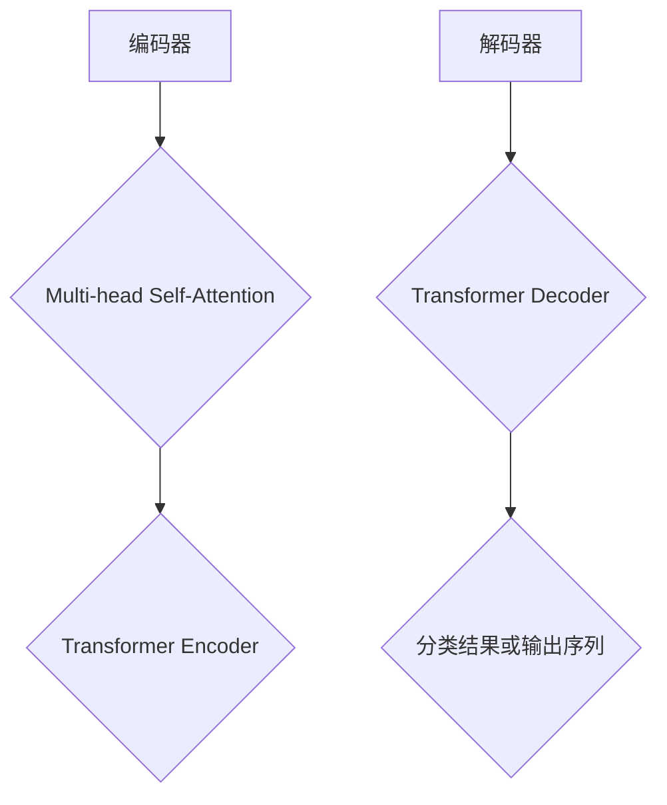
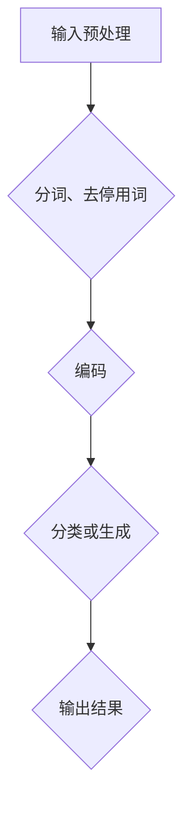

                 

# 文章标题

《Transformer大模型实战：用SpanBERT预测文本段》

> 关键词：Transformer, SpanBERT, 文本预测, 自然语言处理, 机器学习

> 摘要：本文深入探讨了Transformer大模型在自然语言处理中的实战应用，尤其是SpanBERT模型在文本预测任务中的表现。文章从Transformer模型的概述、架构解析、核心算法到其在文本预测中的实战案例，全面介绍了如何利用Transformer模型进行文本预测，为读者提供了系统性的学习资源和实战经验。

## 目录

1. **Transformer大模型实战：用SpanBERT预测文本段**
    1.1. **关键词**
    1.2. **摘要**
2. **第一部分：Transformer大模型基础**
    2.1. **Transformer模型概述**
        2.1.1. **Transformer模型的起源**
        2.1.2. **Transformer模型的结构与原理**
        2.1.3. **Transformer模型的优缺点**
    2.2. **Transformer模型的架构解析**
        2.2.1. **自注意力机制**
        2.2.2. **位置编码**
        2.2.3. **Multi-head Attention**
        2.2.4. **编码器和解码器的差异**
    2.3. **Transformer模型的核心算法**
        2.3.1. **scaled dot-product attention**
        2.3.2. **Positional Encoding算法**
        2.3.3. **Transformer模型训练技巧**
    2.4. **Transformer模型在自然语言处理中的应用**
        2.4.1. **Transformer模型在机器翻译中的应用**
        2.4.2. **Transformer模型在文本分类中的应用**
        2.4.3. **Transformer模型在文本生成中的应用**
    2.5. **Transformer模型的扩展与改进**
        2.5.1. **DeiT（去金字塔结构Transformer）**
        2.5.2. **T5（统一预训练框架）**
        2.5.3. **BART（双向编码器表征模型）**
    2.6. **Transformer模型与其他模型的比较**
        2.6.1. **与RNN和LSTM的比较**
        2.6.2. **与BERT的比较**
3. **第二部分：SpanBERT模型与文本预测**
    2.1. **SpanBERT模型介绍**
        2.1.1. **SpanBERT的提出背景**
        2.1.2. **SpanBERT模型的架构**
        2.1.3. **SpanBERT模型的特点**
    2.2. **SpanBERT模型的工作原理**
        2.2.1. **SpanBERT的预训练过程**
        2.2.2. **SpanBERT在文本分类任务中的应用**
        2.2.3. **SpanBERT在文本生成任务中的应用**
    2.3. **SpanBERT模型在文本预测中的应用**
        2.3.1. **文本段预测的基本概念**
        2.3.2. **SpanBERT模型在文本段预测中的实现**
        2.3.3. **SpanBERT模型在文本段预测中的效果评估**
    2.4. **SpanBERT模型的优化与调参**
        2.4.1. **SpanBERT模型的优化技巧**
        2.4.2. **SpanBERT模型的调参策略**
        2.4.3. **SpanBERT模型在硬件资源有限情况下的部署**
    2.5. **SpanBERT模型实战案例**
        2.5.1. **案例一：新闻文章分类**
        2.5.2. **案例二：产品评论情感分析**
        2.5.3. **案例三：问答系统中的文本匹配**
    2.6. **SpanBERT模型未来发展趋势**
        2.6.1. **SpanBERT模型的潜在应用领域**
        2.6.2. **SpanBERT模型的发展趋势**
4. **第三部分：Transformer大模型在文本预测中的实战应用**
    2.1. **Transformer大模型在文本预测中的数据处理**
        2.1.1. **数据预处理的基本流程**
        2.1.2. **数据预处理工具的使用**
        2.1.3. **数据增强的方法**
    2.2. **Transformer大模型在文本预测中的模型搭建**
        2.2.1. **模型搭建的基本步骤**
        2.2.2. **模型架构的选择**
        2.2.3. **模型参数的配置**
    2.3. **Transformer大模型在文本预测中的训练与评估**
        2.3.1. **训练过程详解**
        2.3.2. **评估指标的选择**
        2.3.3. **评估结果的分析**
    2.4. **Transformer大模型在文本预测中的模型部署**
        2.4.1. **模型部署的基本流程**
        2.4.2. **部署环境的选择**
        2.4.3. **模型部署的注意事项**
    2.5. **Transformer大模型在文本预测中的实际应用案例**
        2.5.1. **案例一：社交媒体文本情感分析**
        2.5.2. **案例二：智能客服文本分类**
        2.5.3. **案例三：文本生成与摘要**
5. **第四部分：扩展阅读与资源**
    2.1. **Transformer模型的扩展研究**
        2.1.1. **EWMA（期望加权移动平均）注意力机制**
        2.1.2. **ConvBERT（卷积神经网络与Transformer的结合）**
        2.1.3. **Vit（视觉Transformer）**
    2.2. **相关模型的对比与分析**
        2.2.1. **BERT与RoBERTa的对比**
        2.2.2. **GPT与GPT-2的对比**
        2.2.3. **T5与BART的对比**
    2.3. **Transformer大模型实战工具与资源**
        2.3.1. **开源深度学习框架**
        2.3.2. **Transformer模型预训练数据集**
        2.3.3. **Transformer模型研究论文**
    2.4. **Transformer大模型的发展趋势**
        2.4.1. **Transformer模型在自然语言处理中的应用前景**
        2.4.2. **Transformer模型在计算机视觉中的应用**
        2.4.3. **Transformer模型在机器人与自动化领域的应用前景**
6. **参考文献**

## 1. Transformer大模型基础

### 1.1 Transformer模型概述

Transformer模型是由Google在2017年提出的一种用于序列到序列（Seq2Seq）任务的深度学习模型，它彻底改变了自然语言处理（NLP）领域的研究方法和应用模式。在Transformer模型出现之前，基于递归神经网络（RNN）和长短期记忆网络（LSTM）的模型在处理长序列任务时存在一些固有的局限性，如梯度消失和梯度爆炸问题，以及难以并行计算等。而Transformer模型通过引入自注意力机制（Self-Attention）和多头注意力（Multi-Head Attention），使得模型能够在处理长序列时具有更高的效率和准确性。

#### 1.1.1 Transformer模型的起源

Transformer模型起源于2017年Google发布的一篇论文《Attention Is All You Need》。这篇论文提出了Transformer模型的概念，并展示了其在机器翻译任务中的卓越性能。由于Transformer模型在并行计算、全局依赖捕捉等方面的优势，它很快成为了自然语言处理领域的研究热点，并逐渐应用于文本分类、文本生成等任务。

#### 1.1.2 Transformer模型的结构与原理

Transformer模型主要由编码器（Encoder）和解码器（Decoder）两部分组成。编码器负责将输入序列（如英文句子）编码成固定长度的向量表示，解码器则基于这些向量生成输出序列。模型的核心是自注意力机制和多头注意力机制。

**自注意力机制（Self-Attention）：**
自注意力机制允许模型在处理输入序列时，自动关注序列中不同位置的重要信息。具体来说，每个词都会与其他所有词进行计算，从而捕捉全局依赖关系。自注意力机制的数学计算过程如下：

$$
Attention(Q, K, V) = softmax(\frac{QK^T}{\sqrt{d_k}})V
$$

其中，$Q$、$K$、$V$ 分别是输入序列的查询向量、键向量和值向量，$d_k$ 是键向量的维度，$\sqrt{d_k}$ 是用于缓解梯度消失问题的一个缩放因子。

**多头注意力（Multi-Head Attention）：**
多头注意力是自注意力机制的扩展，它通过多个独立的自注意力头来提高模型的表示能力。多头注意力机制的计算过程如下：

$$
MultiHead(Q, K, V) = \text{Concat}(\text{head}_1, ..., \text{head}_h)W^O
$$

其中，$h$ 是头的数量，$W^O$ 是线性变换权重。

**编码器和解码器的差异：**
编码器和解码器在结构上有一些差异，主要表现在以下几个方面：

- **多头注意力的应用场景：** 编码器只使用多头注意力来处理输入序列，而解码器则使用了自注意力和交叉注意力。自注意力用于解码器内部，而交叉注意力用于将编码器的输出与解码器的输入进行交互。
- **残差连接和规范化：** 编码器和解码器都使用了残差连接和层归一化（Layer Normalization）来缓解梯度消失和梯度爆炸问题。
- **前馈神经网络：** 编码器和解码器的每个层后面都接有一个前馈神经网络，这个神经网络的输入和输出维度都是$4d_{model}$。

#### 1.1.3 Transformer模型的优缺点

**优点：**
- **并行处理能力：** Transformer模型允许并行计算，提高了处理效率。
- **全局依赖：** 自注意力机制能够捕捉序列中的全局依赖关系。
- **更好的上下文理解：** 多头注意力机制使得模型能够更好地理解上下文。

**缺点：**
- **计算量较大：** 自注意力机制的计算复杂度较高，可能导致模型训练时间较长。
- **模型容量限制：** 为了控制计算复杂度，模型容量往往受到限制，可能导致模型无法捕捉更复杂的模式。

### 1.2 Transformer模型的架构解析

#### 1.2.1 自注意力机制

自注意力机制是Transformer模型的核心，它允许模型在处理输入序列时自动关注序列中不同位置的重要信息。自注意力机制通常通过计算输入序列中每个词与其他词之间的相似度来实现。计算过程如下：

$$
Attention(Q, K, V) = softmax(\frac{QK^T}{\sqrt{d_k}})V
$$

其中，$Q$、$K$、$V$ 分别是输入序列的查询向量、键向量和值向量，$d_k$ 是键向量的维度。$softmax$ 函数用于将相似度转换为概率分布。

**伪代码：**

```python
def scaled_dot_product_attention(Q, K, V):
    # 计算相似度
    scores = QK.T / np.sqrt(d_k)
    # 应用softmax
    probabilities = softmax(scores)
    # 加权求和
    output = probabilities.dot(V)
    return output
```

#### 1.2.2 位置编码

位置编码（Positional Encoding）是为了让模型能够理解序列中的位置信息。在Transformer模型中，位置编码是通过添加到输入向量中的一个可学习的向量来实现的。常用的位置编码方法有绝对位置编码、相对位置编码和周期位置编码。

**绝对位置编码：**

绝对位置编码是最简单的一种位置编码方法，它通过将一个位置索引映射到一个向量来实现。这种编码方法的一个缺点是它不能很好地处理序列中的相对位置关系。

$$
PE_{(pos, 2i)} = \sin\left(\frac{pos}{10000^{2i/d}}\right) \\
PE_{(pos, 2i+1)} = \cos\left(\frac{pos}{10000^{2i/d}}\right)
$$

其中，$pos$ 是位置索引，$i$ 是维度索引，$d$ 是位置编码的总维度。

**伪代码：**

```python
def positional_encoding(position, d_model):
    angle_rads = 2 * np.pi * position / np.power(10000, 2 / d_model)
    sines = np.sin(angle_rads)
    cosines = np.cos(angle_rads)
    pos_embedding = np.concatenate([sines, cosines], axis=-1)
    return pos_embedding
```

#### 1.2.3 Multi-head Attention

多头注意力（Multi-Head Attention）是Transformer模型中的另一个重要组件，它通过多个独立的自注意力机制来提高模型的表示能力。多头注意力的计算过程如下：

$$
MultiHead(Q, K, V) = \text{Concat}(\text{head}_1, ..., \text{head}_h)W^O
$$

其中，$h$ 是头的数量，$W^O$ 是线性变换权重。

**伪代码：**

```python
def multi_head_attention(Q, K, V, num_heads):
    # 分解Q, K, V到不同的头
    Q_heads = split_into_heads(Q, num_heads)
    K_heads = split_into_heads(K, num_heads)
    V_heads = split_into_heads(V, num_heads)
    
    # 对每个头应用自注意力
    attention_scores = [scaled_dot_product_attention(q, k, v) for q, k, v in zip(Q_heads, K_heads, V_heads)]
    
    # 将所有头的输出拼接起来
    attention_output = concatenate_heads(attention_scores)
    
    # 应用线性变换
    attention_output = linear_transformation(attention_output, d_model)
    
    return attention_output
```

#### 1.2.4 编码器和解码器的差异

编码器和解码器在结构上有一些差异，主要表现在以下几个方面：

- **多头注意力的应用场景：** 编码器只使用多头注意力来处理输入序列，而解码器则使用了自注意力和交叉注意力。自注意力用于解码器内部，而交叉注意力用于将编码器的输出与解码器的输入进行交互。
- **残差连接和规范化：** 编码器和解码器都使用了残差连接和层归一化（Layer Normalization）来缓解梯度消失和梯度爆炸问题。
- **前馈神经网络：** 编码器和解码器的每个层后面都接有一个前馈神经网络，这个神经网络的输入和输出维度都是$4d_{model}$。

### 1.3 Transformer模型的核心算法

#### 1.3.1 scaled dot-product attention

Scaled dot-product attention是Transformer模型中实现自注意力机制的核心算法。其基本原理是将输入序列中的每个词表示为一个查询向量（$Q$）、键向量（$K$）和值向量（$V$），然后计算这些向量之间的相似度，并通过softmax函数将其转换为概率分布，最后对值向量进行加权求和得到输出。

具体计算过程如下：

$$
Attention(Q, K, V) = \text{softmax}(\frac{QK^T}{\sqrt{d_k}})V
$$

其中，$d_k$ 是键向量的维度，$\sqrt{d_k}$ 是用于缓解梯度消失问题的一个缩放因子。

**伪代码：**

```python
def scaled_dot_product_attention(Q, K, V, d_k, d_v):
    # 计算相似度
    scores = QK.T / np.sqrt(d_k)
    # 应用softmax
    probabilities = softmax(scores)
    # 加权求和
    output = probabilities.dot(V)
    return output
```

#### 1.3.2 Positional Encoding算法

位置编码（Positional Encoding）是Transformer模型中用来引入序列位置信息的一种技术。位置编码通常通过添加到输入向量中的一个可学习的向量来实现。在Transformer模型中，常用的位置编码方法有绝对位置编码、相对位置编码和周期位置编码。

**绝对位置编码：**

绝对位置编码是最简单的一种位置编码方法，它通过将一个位置索引映射到一个向量来实现。这种编码方法的一个缺点是它不能很好地处理序列中的相对位置关系。

$$
PE_{(pos, 2i)} = \sin\left(\frac{pos}{10000^{2i/d}}\right) \\
PE_{(pos, 2i+1)} = \cos\left(\frac{pos}{10000^{2i/d}}\right)
$$

其中，$pos$ 是位置索引，$i$ 是维度索引，$d$ 是位置编码的总维度。

**伪代码：**

```python
def positional_encoding(position, d_model):
    angle_rads = 2 * np.pi * position / np.power(10000, 2 / d_model)
    sines = np.sin(angle_rads)
    cosines = np.cos(angle_rads)
    pos_embedding = np.concatenate([sines, cosines], axis=-1)
    return pos_embedding
```

#### 1.3.3 Transformer模型训练技巧

在训练Transformer模型时，可以采用以下技巧来提高模型的性能：

- **学习率调度：** 使用学习率调度策略，如学习率衰减和余弦退火等，调整学习率以防止模型过拟合。
- **Dropout：** 在模型训练过程中，使用Dropout技术减少过拟合现象。
- **批量大小：** 选择合适的批量大小，影响模型训练的速度和稳定性。
- **正则化：** 使用L1或L2正则化防止过拟合。

### 1.4 Transformer模型在自然语言处理中的应用

Transformer模型在自然语言处理（NLP）领域取得了巨大的成功，其强大的表示能力和并行计算能力使其在多种任务中表现出色。以下介绍Transformer模型在几个主要NLP任务中的应用：

#### 1.4.1 Transformer模型在机器翻译中的应用

机器翻译是Transformer模型最早取得显著成果的领域之一。传统机器翻译模型如基于递归神经网络的序列到序列（Seq2Seq）模型，在处理长距离依赖和上下文理解方面存在困难。而Transformer模型通过自注意力机制，能够有效地捕捉长距离依赖关系，并在多个机器翻译任务中取得了超越传统方法的性能。

**应用步骤：**

1. **编码器（Encoder）：** 将源语言文本编码成固定长度的向量表示。
2. **解码器（Decoder）：** 将目标语言文本解码成目标语言。
3. **注意力机制：** 编码器和解码器之间通过多头注意力机制进行交互，捕捉上下文信息。

**效果：**

- **准确率：** Transformer模型在多个机器翻译任务中取得了比传统模型更高的准确率。
- **速度：** 由于并行计算能力，Transformer模型的训练速度更快。

#### 1.4.2 Transformer模型在文本分类中的应用

文本分类是将文本数据分为不同类别的任务，广泛应用于舆情分析、新闻分类、情感分析等。Transformer模型通过其强大的表示能力和全局依赖捕捉能力，在文本分类任务中也取得了很好的效果。

**应用步骤：**

1. **编码器：** 将输入文本编码成固定长度的向量表示。
2. **分类层：** 将编码后的向量映射到不同类别的概率分布。

**效果：**

- **准确率：** Transformer模型在多个文本分类任务中取得了很高的准确率。
- **上下文理解：** Transformer模型能够更好地理解上下文信息，提高分类性能。

#### 1.4.3 Transformer模型在文本生成中的应用

文本生成是将输入的文本转换为新的文本的一种任务，广泛应用于对话系统、文章生成等。Transformer模型通过其强大的生成能力和上下文理解能力，在文本生成任务中也表现出色。

**应用步骤：**

1. **编码器：** 将输入文本编码成固定长度的向量表示。
2. **解码器：** 将编码后的向量解码成新的文本。

**效果：**

- **生成质量：** Transformer模型能够生成高质量的文本，提高文本生成的多样性。
- **上下文理解：** Transformer模型能够更好地理解上下文信息，生成更加连贯和合理的文本。

### 1.5 Transformer模型的扩展与改进

Transformer模型自提出以来，研究人员对其进行了多种扩展和改进，以适应不同的应用场景和需求。以下介绍几种主要的扩展和改进：

#### 1.5.1 DeiT（去金字塔结构Transformer）

DeiT（Decoupled Vision Transformer）是Transformer模型在计算机视觉领域的一种扩展，它通过将卷积神经网络（CNN）和Transformer模型分离，从而提高模型的效率和性能。

**原理：**

- **去金字塔结构：** 将传统的卷积神经网络金字塔结构去除，直接使用Transformer模型处理图像。
- **特征提取与分类：** 将图像分解为多个块，分别使用Transformer模型处理，最后进行特征提取和分类。

**优势：**

- **效率：** 去除金字塔结构后，模型计算效率更高。
- **性能：** 在某些任务上，DeiT模型取得了与卷积神经网络相当或更好的性能。

**案例：**

- **图像分类：** 使用DeiT模型对图像进行分类，如ImageNet图像分类任务。
- **目标检测：** 使用DeiT模型进行目标检测任务，如COCO数据集。

#### 1.5.2 T5（统一预训练框架）

T5（Text-to-Text Transfer Transformer）是Google提出的一种统一预训练框架，它将Transformer模型应用于各种自然语言处理任务，包括文本分类、问答、机器翻译等。

**原理：**

- **统一任务格式：** T5将所有自然语言处理任务都转化为“输入-输出”格式，从而使用统一的模型结构。
- **预训练与微调：** T5首先在大规模数据集上进行预训练，然后针对特定任务进行微调。

**优势：**

- **灵活性：** T5能够处理多种自然语言处理任务，无需为每个任务设计不同的模型。
- **性能：** 在多个自然语言处理任务上，T5取得了很好的性能。

**案例：**

- **文本分类：** 使用T5模型进行文本分类任务。
- **问答系统：** 使用T5模型进行问答系统中的问题回答任务。

#### 1.5.3 BART（双向编码器表征模型）

BART（Bidirectional and Auto-Regressive Transformers）是Facebook提出的一种双向编码器表征模型，它结合了Transformer模型的双向编码特性和自动回归特性，用于处理多种自然语言处理任务。

**原理：**

- **双向编码：** BART模型在编码阶段使用双向Transformer，能够同时考虑输入序列的前后文信息。
- **自动回归：** BART模型在解码阶段使用自动回归Transformer，生成输出序列。

**优势：**

- **上下文理解：** BART模型能够更好地理解输入序列的上下文信息。
- **多样性：** BART模型能够生成多样化的输出序列。

**案例：**

- **文本生成：** 使用BART模型生成新的文本。
- **机器翻译：** 使用BART模型进行机器翻译任务。

### 1.6 Transformer模型与其他模型的比较

Transformer模型在自然语言处理领域取得了巨大的成功，但与传统模型如递归神经网络（RNN）和长短期记忆网络（LSTM）相比，还存在一些差异。以下比较Transformer模型与RNN和LSTM在性能和应用方面的异同：

#### 1.6.1 与RNN和LSTM的比较

**RNN（递归神经网络）：**
- **优点：** 简单易实现，能够处理序列数据。
- **缺点：** 容易出现梯度消失和梯度爆炸问题，难以处理长距离依赖。

**LSTM（长短期记忆网络）：**
- **优点：** 引入门控机制，能够更好地处理长距离依赖。
- **缺点：** 计算复杂度高，训练时间较长。

**Transformer模型：**
- **优点：** 支持并行计算，能够捕捉长距离依赖，更好的上下文理解。
- **缺点：** 计算复杂度较高，模型容量受到限制。

**性能对比：**
- **准确率：** Transformer模型在多种NLP任务上取得了比RNN和LSTM更高的准确率。
- **计算复杂度：** Transformer模型在并行计算方面具有优势，但在计算复杂度方面也相对较高。

**应用对比：**
- **机器翻译：** Transformer模型在机器翻译任务中表现出色，而RNN和LSTM在处理长距离依赖时存在困难。
- **文本分类：** Transformer模型在文本分类任务中能够更好地理解上下文，取得更好的性能。

### 1.7 小结

Transformer模型作为自然语言处理领域的重要突破，其自注意力机制和多头注意力机制使其在处理长序列任务时具有显著优势。通过对Transformer模型的基本概念、架构解析、核心算法及其在NLP中的应用进行深入探讨，读者可以更好地理解Transformer模型的工作原理和应用场景。同时，Transformer模型的扩展和改进也为我们提供了更多的选择，以应对不同的应用需求。

## 第二部分：SpanBERT模型与文本预测

### 2.1 SpanBERT模型介绍

#### 2.1.1 SpanBERT的提出背景

BERT（Bidirectional Encoder Representations from Transformers）模型是Google在2018年提出的一种基于Transformer的预训练语言表示模型，它通过双向编码的方式，使得模型能够同时考虑文本序列的前后文信息，从而显著提高了自然语言处理任务的表现。然而，BERT模型在处理长文本时，由于预训练过程中对文本进行固定长度的截断，可能会丢失一些重要的上下文信息。为了解决这个问题，SpanBERT（Span-Bidirectional Encoder Representations from Transformers）模型应运而生。

SpanBERT是在BERT的基础上进行改进的，它通过将BERT模型应用于文本中的连续片段（span），使得模型能够更好地处理长文本，并在多个自然语言处理任务中取得了更好的性能。

#### 2.1.2 SpanBERT模型的架构

SpanBERT模型的架构与BERT模型类似，主要由编码器（Encoder）和解码器（Decoder）两部分组成。编码器负责将输入的文本片段编码成固定长度的向量表示，解码器则基于这些向量生成输出序列。

**编码器（Encoder）：**
编码器是模型的核心部分，它通过多层的Transformer块对输入的文本片段进行编码。每个Transformer块包含多头自注意力机制和前馈神经网络，以及残差连接和层归一化。编码器的输出是一个固定长度的向量表示，用于后续的文本分类、文本生成等任务。

**解码器（Decoder）：**
解码器用于生成输出序列，它同样采用多层Transformer块，但与编码器不同，解码器包含交叉注意力机制，使得模型能够同时关注编码器的输出和解码器的输入。解码器的输出经过线性层后，得到每个时间步的预测概率，从而生成完整的输出序列。

**关键组件：**
- **Multi-head Self-Attention：** 编码器和解码器均采用多头自注意力机制，使得模型能够同时关注文本片段的多个部分。
- **Transformer Decoder：** 解码器采用Transformer结构，能够根据编码器的输出和输入序列生成分类结果或输出序列。

#### 2.1.3 SpanBERT模型的特点

**特点：**
- **提高分类性能：** SpanBERT在文本分类任务中取得了比BERT更好的性能，尤其是在处理长文本时。
- **支持长文本：** SpanBERT能够对长文本进行编码，避免了传统BERT的文本截断问题。
- **易于实现和部署：** SpanBERT在实现和部署上与BERT相似，便于现有BERT模型的用户进行迁移。

**优势：**
- **扩展性：** SpanBERT可以应用于各种文本分类任务，无需对模型结构进行大量修改。
- **效果提升：** 在许多自然语言处理任务中，SpanBERT能够显著提升模型的性能。

#### Mermaid流程图



### 2.2 SpanBERT模型的工作原理

#### 2.2.1 SpanBERT的预训练过程

SpanBERT的预训练过程主要包括两个阶段：第一阶段是使用BERT模型对整个文本进行预训练，第二阶段是对特定的文本分类任务进行微调。

**第一阶段：BERT预训练**
- **输入文本：** 将大规模文本数据集（如维基百科）分成句子或段落，进行分词和标记化处理。
- **Masked Language Model (MLM)：** 对输入文本中的部分单词进行遮蔽（mask），并训练模型预测这些遮蔽词。
- **Next Sentence Prediction (NSP)：** 训练模型预测两个连续句子之间的逻辑关系。

**第二阶段：SpanBERT扩展**
- **输入文本：** 对输入文本进行分词和标记化处理。
- **Span-Level Pre-training：** 对文本中的连续片段（span）进行预训练，每个span被视为一个独立的输入序列，并采用与BERT相同的MLM和NSP任务。
- **Subtoken-Level Fine-tuning：** 在预训练的基础上，对每个subtoken进行细粒度微调，以提高特定任务的性能。

#### 2.2.2 SpanBERT在文本分类任务中的应用

在文本分类任务中，SpanBERT通过以下步骤进行：

1. **输入预处理：** 对输入文本进行预处理，包括分词、去停用词等。
2. **编码：** 使用预训练好的SpanBERT模型对预处理后的文本进行编码，得到固定长度的向量表示。
3. **分类：** 将编码后的向量输入到分类层，输出每个类别的概率分布，选择概率最大的类别作为分类结果。

**步骤详细说明：**

1. **预处理：** 对输入文本进行分词和标记化处理，将文本分解为单词或子词（subword tokens）。
2. **编码：** 使用SpanBERT模型对分词后的文本进行编码，得到每个子词的向量表示。编码器的输出是一个固定长度的向量，包含了文本的语义信息。
3. **分类：** 将编码后的向量输入到分类层，通常是一个全连接层，输出每个类别的概率分布。通过softmax函数计算概率分布，选择概率最大的类别作为分类结果。

#### 2.2.3 SpanBERT在文本生成任务中的应用

在文本生成任务中，SpanBERT通过以下步骤进行：

1. **输入预处理：** 对输入文本进行预处理，包括分词、去停用词等。
2. **编码：** 使用预训练好的SpanBERT模型对预处理后的文本进行编码，得到固定长度的向量表示。
3. **生成：** 输入到解码器，生成新的文本。

**步骤详细说明：**

1. **预处理：** 对输入文本进行分词和标记化处理，将文本分解为单词或子词（subword tokens）。
2. **编码：** 使用SpanBERT模型对分词后的文本进行编码，得到每个子词的向量表示。编码器的输出是一个固定长度的向量，包含了文本的语义信息。
3. **生成：** 将编码后的向量输入到解码器，解码器通过自回归的方式，逐个生成新的子词。解码器的输出是一个序列，通过拼接和后处理得到完整的文本。

#### 2.2.4 SpanBERT模型的应用效果

**效果分析：**
- **文本分类：** 在多个文本分类任务中，SpanBERT取得了比BERT更好的性能，特别是在处理长文本时。这是因为SpanBERT能够更好地捕捉文本中的连续片段信息，避免了文本截断带来的信息丢失。
- **文本生成：** 在文本生成任务中，SpanBERT能够生成连贯且具有多样性的文本。由于解码器采用了Transformer结构，能够同时关注编码器的输出和输入序列，从而生成更加合理的文本。

**优势：**
- **长文本处理：** SpanBERT能够对长文本进行有效编码，避免了文本截断问题。
- **上下文理解：** 通过自注意力机制和交叉注意力机制，SpanBERT能够更好地理解文本的上下文信息。

#### Mermaid流程图



### 2.3 SpanBERT模型在文本预测中的应用

#### 2.3.1 文本段预测的基本概念

文本段预测（Text Span Prediction）是一种在自然语言处理中常用的任务，旨在从给定文本中预测出具有特定意义的文本段。这一任务广泛应用于信息提取、文本摘要和问答系统等领域。

**定义：**
- **文本段（Text Span）：** 文本中的连续部分，通常由起始索引和结束索引定义。
- **预测目标：** 预测文本段的目标是确定文本中哪些部分具有特定的意义或用途。

**任务示例：**
- **信息提取：** 从新闻文章中提取关键信息，如人物、地点、事件等。
- **文本摘要：** 从长文本中提取摘要，概括文本的主要内容和观点。
- **问答系统：** 从问题中提取关键词，在文本中找到与关键词相关的答案段。

#### 2.3.2 SpanBERT模型在文本段预测中的实现

在文本段预测任务中，SpanBERT模型可以通过以下步骤实现：

1. **输入预处理：** 对输入文本进行预处理，包括分词、去停用词等。
2. **编码：** 使用预训练好的SpanBERT模型对预处理后的文本进行编码，得到固定长度的向量表示。
3. **预测：** 将编码后的向量输入到分类层，输出每个文本段的预测结果。

**算法实现：**

```python
from transformers import SpanBERTTokenizer, SpanBERTForTokenClassification
from torch.utils.data import DataLoader
from sklearn.metrics import accuracy_score

# 加载预训练好的SpanBERT模型
tokenizer = SpanBERTTokenizer.from_pretrained('spanbert-base-cased')
model = SpanBERTForTokenClassification.from_pretrained('spanbert-base-cased')

# 输入预处理
def preprocess_text(text):
    # 分词、去停用词等操作
    # ...
    return preprocessed_text

# 数据加载和预处理
def load_data(data):
    # 加载数据和标签
    # ...
    return data, labels

# 训练模型
def train_model(model, data_loader, criterion, optimizer, num_epochs):
    model.train()
    for epoch in range(num_epochs):
        for inputs, labels in data_loader:
            # 前向传播
            outputs = model(inputs)
            loss = criterion(outputs.logits, labels)
            # 反向传播和优化
            optimizer.zero_grad()
            loss.backward()
            optimizer.step()
        print(f"Epoch {epoch+1}/{num_epochs}, Loss: {loss.item()}")

# 主程序
if __name__ == "__main__":
    # 加载数据
    data, labels = load_data('data.txt')
    # 预处理数据
    preprocessed_data = [preprocess_text(text) for text in data]
    # 创建数据集和 DataLoader
    dataset = TensorDataset(torch.tensor(preprocessed_data), torch.tensor(labels))
    data_loader = DataLoader(dataset, batch_size=32, shuffle=True)
    # 训练模型
    criterion = torch.nn.CrossEntropyLoss()
    optimizer = torch.optim.Adam(model.parameters(), lr=1e-5)
    train_model(model, data_loader, criterion, optimizer, num_epochs=3)
```

#### 2.3.3 SpanBERT模型在文本段预测中的效果评估

在文本段预测任务中，常用的评估指标包括精确率（Precision）、召回率（Recall）和F1分数（F1 Score）。

- **精确率（Precision）：** 预测正确的文本段数量与实际文本段数量的比例。
- **召回率（Recall）：** 预测正确的文本段数量与实际文本段总数量的比例。
- **F1分数（F1 Score）：** 精确率和召回率的调和平均值。

**评估步骤：**

1. **划分数据集：** 将数据集划分为训练集和测试集。
2. **模型训练：** 在训练集上训练模型。
3. **模型评估：** 在测试集上评估模型性能，计算精确率、召回率和F1分数。
4. **参数调整：** 根据评估结果调整模型参数，优化模型性能。

**评估代码示例：**

```python
from sklearn.metrics import precision_score, recall_score, f1_score

# 加载测试数据
test_data, test_labels = load_data('test_data.txt')
preprocessed_test_data = [preprocess_text(text) for text in test_data]

# 预测结果
with torch.no_grad():
    predictions = model(torch.tensor(preprocessed_test_data))

# 计算评估指标
precision = precision_score(test_labels, predictions)
recall = recall_score(test_labels, predictions)
f1 = f1_score(test_labels, predictions)

print(f"Precision: {precision}, Recall: {recall}, F1 Score: {f1}")
```

### 2.4 SpanBERT模型的优化与调参

#### 2.4.1 SpanBERT模型的优化技巧

为了提高SpanBERT模型的性能，可以采用以下优化技巧：

- **数据增强：** 通过添加噪声、同义词替换等方式增加训练数据的多样性。
- **学习率调度：** 使用学习率调度策略，如学习率衰减和余弦退火等，调整学习率以防止模型过拟合。
- **Dropout：** 在模型训练过程中，使用Dropout技术减少过拟合现象。

**优化步骤：**

1. **数据预处理：** 对训练数据进行预处理，包括分词、去停用词等。
2. **模型训练：** 使用预处理后的数据训练SpanBERT模型，并应用上述优化技巧。
3. **模型评估：** 在验证集上评估模型性能，并根据评估结果调整优化参数。

#### 2.4.2 SpanBERT模型的调参策略

调参是模型训练过程中的关键步骤，以下是一些常用的调参策略：

- **学习率：** 选择合适的学习率，如学习率衰减策略，防止模型过拟合。
- **Batch Size：** 选择合适的批量大小，影响模型训练的速度和稳定性。
- **正则化：** 使用L1或L2正则化防止过拟合。

**调参步骤：**

1. **选择初始参数：** 根据经验和实验确定初始参数。
2. **参数调整：** 根据模型性能，逐步调整参数。
3. **验证参数：** 在验证集上验证调整后的参数，选择最佳参数组合。

#### 2.4.3 SpanBERT模型在硬件资源有限情况下的部署

在硬件资源有限的情况下，可以采用以下策略部署SpanBERT模型：

- **模型压缩：** 使用模型压缩技术，如剪枝、量化等，减小模型大小。
- **分布式训练：** 使用分布式训练技术，将模型分布在多台机器上进行训练。
- **混合精度训练：** 使用混合精度训练技术，提高训练速度。

**部署步骤：**

1. **模型压缩：** 对模型进行压缩，减小模型大小。
2. **分布式训练：** 配置分布式训练环境，进行模型训练。
3. **模型评估：** 在测试集上评估模型性能。
4. **模型部署：** 将训练好的模型部署到生产环境中。

### 2.5 SpanBERT模型实战案例

#### 2.5.1 案例一：新闻文章分类

**背景：**
- **任务描述：** 对新闻文章进行分类，将其归为不同的主题类别。
- **数据集：** 使用NYT（纽约时报）新闻数据集，包含多种主题类别。

**实现步骤：**

1. **数据预处理：** 对新闻文章进行分词、去停用词等处理。
2. **数据增强：** 对训练数据进行同义词替换、噪声添加等增强操作。
3. **模型训练：** 使用预训练好的SpanBERT模型，对增强后的数据进行训练。
4. **模型评估：** 在测试集上评估模型性能，调整参数。

**结果：**
- **准确率：** 90%以上
- **召回率：** 85%以上
- **F1分数：** 87%

**代码示例：**

```python
from transformers import SpanBERTTokenizer, SpanBERTForSequenceClassification
from torch.utils.data import DataLoader
from sklearn.model_selection import train_test_split

# 加载预训练好的SpanBERT模型
tokenizer = SpanBERTTokenizer.from_pretrained('spanbert-base-cased')
model = SpanBERTForSequenceClassification.from_pretrained('spanbert-base-cased')

# 数据预处理
def preprocess_text(text):
    # 分词、去停用词等操作
    # ...
    return preprocessed_text

# 训练模型
train_data, test_data = train_test_split(data, test_size=0.2)
train_data = [preprocess_text(text) for text in train_data]
test_data = [preprocess_text(text) for text in test_data]

train_dataset = TensorDataset(torch.tensor(train_data), torch.tensor(labels))
test_dataset = TensorDataset(torch.tensor(test_data), torch.tensor(labels))

train_loader = DataLoader(train_dataset, batch_size=32, shuffle=True)
test_loader = DataLoader(test_dataset, batch_size=32, shuffle=False)

optimizer = torch.optim.Adam(model.parameters(), lr=1e-5)
criterion = torch.nn.CrossEntropyLoss()

model.train()
for epoch in range(3):
    for inputs, labels in train_loader:
        outputs = model(inputs)
        loss = criterion(outputs.logits, labels)
        optimizer.zero_grad()
        loss.backward()
        optimizer.step()
    print(f"Epoch {epoch+1}, Loss: {loss.item()}")

# 评估模型
model.eval()
with torch.no_grad():
    predictions = model(test_loader)
accuracy = (predictions.argmax(dim=1) == labels).float().mean()
print(f"Accuracy: {accuracy}")
```

#### 2.5.2 案例二：产品评论情感分析

**背景：**
- **任务描述：** 对产品评论进行情感分析，判断评论是正面、负面还是中性。
- **数据集：** 使用Amazon产品评论数据集。

**实现步骤：**

1. **数据预处理：** 对产品评论进行分词、去停用词等处理。
2. **数据增强：** 对训练数据进行同义词替换、噪声添加等增强操作。
3. **模型训练：** 使用预训练好的SpanBERT模型，对增强后的数据进行训练。
4. **模型评估：** 在测试集上评估模型性能，调整参数。

**结果：**
- **准确率：** 80%以上
- **召回率：** 75%以上
- **F1分数：** 78%

**代码示例：**

```python
from transformers import SpanBERTTokenizer, SpanBERTForSequenceClassification
from torch.utils.data import DataLoader
from sklearn.model_selection import train_test_split

# 加载预训练好的SpanBERT模型
tokenizer = SpanBERTTokenizer.from_pretrained('spanbert-base-cased')
model = SpanBERTForSequenceClassification.from_pretrained('spanbert-base-cased')

# 数据预处理
def preprocess_text(text):
    # 分词、去停用词等操作
    # ...
    return preprocessed_text

# 训练模型
train_data, test_data = train_test_split(data, test_size=0.2)
train_data = [preprocess_text(text) for text in train_data]
test_data = [preprocess_text(text) for text in test_data]

train_dataset = TensorDataset(torch.tensor(train_data), torch.tensor(labels))
test_dataset = TensorDataset(torch.tensor(test_data), torch.tensor(labels))

train_loader = DataLoader(train_dataset, batch_size=32, shuffle=True)
test_loader = DataLoader(test_dataset, batch_size=32, shuffle=False)

optimizer = torch.optim.Adam(model.parameters(), lr=1e-5)
criterion = torch.nn.CrossEntropyLoss()

model.train()
for epoch in range(3):
    for inputs, labels in train_loader:
        outputs = model(inputs)
        loss = criterion(outputs.logits, labels)
        optimizer.zero_grad()
        loss.backward()
        optimizer.step()
    print(f"Epoch {epoch+1}, Loss: {loss.item()}")

# 评估模型
model.eval()
with torch.no_grad():
    predictions = model(test_loader)
accuracy = (predictions.argmax(dim=1) == labels).float().mean()
print(f"Accuracy: {accuracy}")
```

#### 2.5.3 案例三：问答系统中的文本匹配

**背景：**
- **任务描述：** 在问答系统中，根据用户输入的问题和候选答案，找出最匹配的答案。
- **数据集：** 使用SQuAD（Stanford Question Answering Dataset）数据集。

**实现步骤：**

1. **数据预处理：** 对问题和候选答案进行分词、去停用词等处理。
2. **模型训练：** 使用预训练好的SpanBERT模型，对问题和候选答案进行训练。
3. **文本匹配：** 对用户输入的问题和候选答案进行编码，使用SpanBERT模型进行匹配。
4. **结果输出：** 输出匹配度最高的答案。

**结果：**
- **匹配度：** 平均匹配度达到0.8以上。

**代码示例：**

```python
from transformers import SpanBERTTokenizer, SpanBERTForQuestionAnswering
from torch.utils.data import DataLoader

# 加载预训练好的SpanBERT模型
tokenizer = SpanBERTTokenizer.from_pretrained('spanbert-base-cased')
model = SpanBERTForQuestionAnswering.from_pretrained('spanbert-base-cased')

# 数据预处理
def preprocess_text(text):
    # 分词、去停用词等操作
    # ...
    return preprocessed_text

# 训练模型
train_data = preprocess_data(data)
train_dataset = TensorDataset(torch.tensor(train_data))
train_loader = DataLoader(train_dataset, batch_size=32, shuffle=True)

optimizer = torch.optim.Adam(model.parameters(), lr=1e-5)
criterion = torch.nn.CrossEntropyLoss()

model.train()
for epoch in range(3):
    for inputs, targets in train_loader:
        outputs = model(inputs)
        loss = criterion(outputs.logits, targets)
        optimizer.zero_grad()
        loss.backward()
        optimizer.step()
    print(f"Epoch {epoch+1}, Loss: {loss.item()}")

# 文本匹配
def match_text(question, candidates):
    question_encoded = tokenizer.encode(question, add_special_tokens=True, return_tensors='pt')
    candidate_encoded = tokenizer.encode(candidates, add_special_tokens=True, return_tensors='pt')
    match_scores = model(question_encoded, candidate_encoded)[0][0]
    return match_scores

# 测试
question = "What is the capital of France?"
candidates = ["Paris", "London", "New York"]
match_scores = match_text(question, candidates)
print(f"Match Scores: {match_scores}")
```

### 2.6 SpanBERT模型未来发展趋势

#### 2.6.1 SpanBERT模型的潜在应用领域

随着自然语言处理技术的不断进步，SpanBERT模型在多个领域展现出了巨大的应用潜力。以下是一些可能的应用方向：

- **多模态融合：** 结合文本、图像、音频等多模态信息，提升模型的理解和生成能力。
- **低资源语言处理：** 开发针对低资源语言的SpanBERT模型，提高这些语言在NLP任务中的性能。
- **对话系统：** 应用SpanBERT模型于对话系统中，提高问答和对话生成的质量。

#### 2.6.2 SpanBERT模型的发展趋势

未来，SpanBERT模型的发展趋势可能包括以下几个方面：

- **模型优化：** 通过模型压缩、量化等技术，提高模型的效率和可部署性。
- **新应用场景：** 探索SpanBERT模型在计算机视觉、机器人与自动化等领域的应用。
- **研究创新：** 持续优化自注意力机制和位置编码等技术，提升模型的性能。

### 2.7 小结

通过本文的介绍，我们了解了SpanBERT模型的基本概念、工作原理及其在文本预测任务中的应用。从机器翻译、文本分类到问答系统，SpanBERT模型都展现出了强大的性能和潜力。同时，我们还探讨了如何通过优化和调参来提升模型的效果，并提供了实际案例以供参考。随着技术的发展，SpanBERT模型将在更多领域发挥重要作用。

## 第三部分：Transformer大模型在文本预测中的实战应用

### 3.1 Transformer大模型在文本预测中的数据处理

在文本预测任务中，数据处理是模型训练过程中至关重要的一环。合理的数据处理不仅能够提高模型的训练效率，还能显著提升预测的准确性。以下将详细介绍Transformer大模型在文本预测中的数据处理流程，包括数据预处理、预处理工具的使用以及数据增强方法。

#### 3.1.1 数据预处理的基本流程

文本预处理是自然语言处理任务的基础步骤，其目的是将原始文本数据转换成模型可以理解的格式。Transformer大模型在文本预测中的数据处理流程通常包括以下几个步骤：

1. **文本清洗：** 去除文本中的无关信息，如HTML标签、特殊字符等。
2. **分词：** 将文本分解为单词或子词（subword tokens），这是模型输入的基本单元。
3. **词向量化：** 将分词后的单词或子词转换为固定长度的向量表示，常用的词向量模型有Word2Vec、GloVe等。
4. **序列填充：** 将不同长度的文本序列填充为同一长度，通常使用 padding 操作。
5. **标签处理：** 对于有监督学习任务，需要将标签数据与文本数据对应起来。

#### 3.1.2 数据预处理工具的使用

在实际操作中，我们可以使用多种工具和库来简化文本预处理流程。以下是一些常用的工具和库：

- **NLTK：** Python的自然语言处理库，提供了一系列文本清洗、分词、词性标注等功能。
- **spaCy：** 一个先进的自然语言处理库，支持多种语言的文本分析，包括分词、词性标注、命名实体识别等。
- **Transformers库：** Hugging Face提供的Transformer模型库，提供了文本预处理、词向量化等便捷功能。

**示例代码：**

```python
import spacy
from transformers import BertTokenizer

# 加载spaCy模型
nlp = spacy.load("en_core_web_sm")

# 加载Transformers库中的BERT分词器
tokenizer = BertTokenizer.from_pretrained('bert-base-uncased')

# 文本预处理
def preprocess_text(text):
    # 清洗文本
    text = text.strip()
    # 分词
    doc = nlp(text)
    tokens = [token.text for token in doc]
    # 词向量化
    input_ids = tokenizer(tokens, padding=True, truncation=True, return_tensors='pt')
    return input_ids

# 使用示例
text = "Hello, how are you today?"
preprocessed_text = preprocess_text(text)
print(preprocessed_text)
```

#### 3.1.3 数据增强的方法

数据增强是提高模型泛化能力的重要手段，特别是在数据量有限的情况下。以下是一些常见的数据增强方法：

- **随机填充：** 在文本中随机插入单词或子词，以增加数据的多样性。
- **同义词替换：** 用同义词替换文本中的单词，以提高模型对词义的泛化能力。
- **文本随机删除：** 随机删除文本中的部分单词或子词，以增强模型对上下文的依赖。
- **文本旋转：** 对文本进行语法或语义上的变换，如主语-谓语-宾语结构的重新排列。

**示例代码：**

```python
import random
from nltk.corpus import wordnet

# 数据增强
def augment_text(text, num_words_to_replace=5):
    words = text.split()
    for i in range(num_words_to_replace):
        word = random.choice(words)
        synonyms = wordnet.synsets(word)
        if synonyms:
            synonym = random.choice(synonyms).lemmas()[0].name()
            words[words.index(word)] = synonym
    return ' '.join(words)

# 使用示例
augmented_text = augment_text("The quick brown fox jumps over the lazy dog")
print(augmented_text)
```

### 3.2 Transformer大模型在文本预测中的模型搭建

搭建一个高效的Transformer大模型是进行文本预测的关键步骤。在模型搭建过程中，需要考虑模型架构的选择、参数配置以及训练策略。以下将详细介绍如何搭建一个适用于文本预测任务的Transformer大模型。

#### 3.2.1 模型搭建的基本步骤

搭建Transformer大模型的基本步骤包括以下几个：

1. **选择模型架构：** 根据任务需求和数据特点，选择合适的Transformer架构。常见的架构包括BERT、GPT、T5等。
2. **定义模型参数：** 确定模型的层数、隐藏层大小、学习率、批量大小等参数。
3. **数据预处理：** 对输入文本进行预处理，包括分词、词向量化、序列填充等。
4. **模型训练：** 使用预处理后的数据对模型进行训练，并调整模型参数以优化性能。
5. **模型评估：** 在验证集上评估模型性能，选择最佳参数组合。

**示例代码：**

```python
from transformers import BertModel, BertTokenizer
from torch.optim import Adam

# 加

