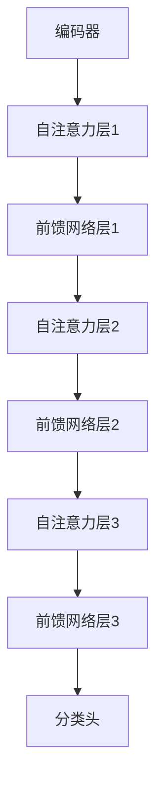
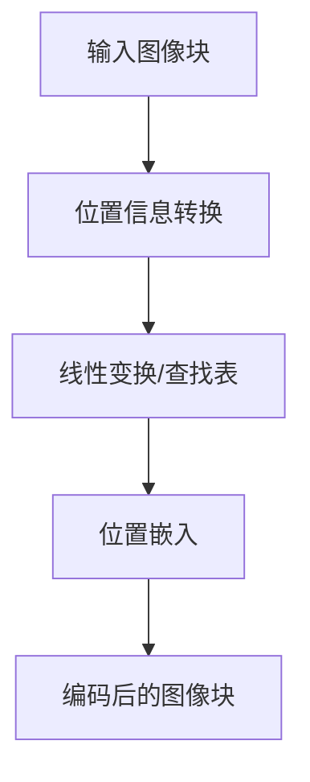
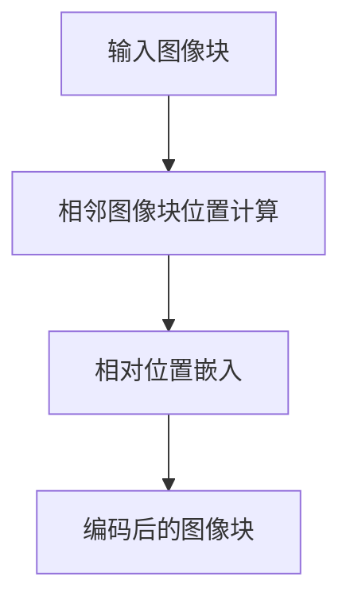
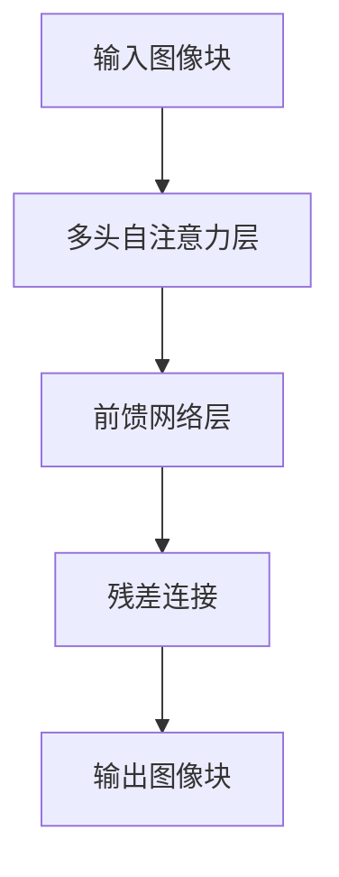
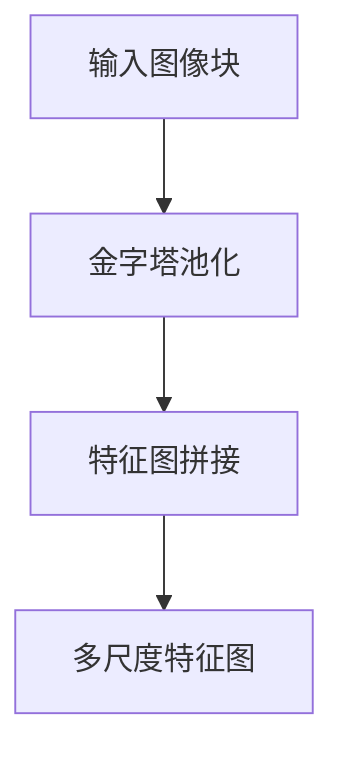
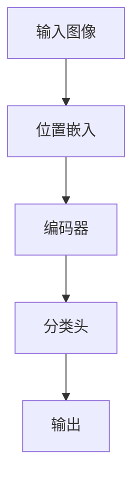
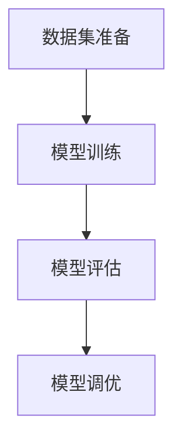
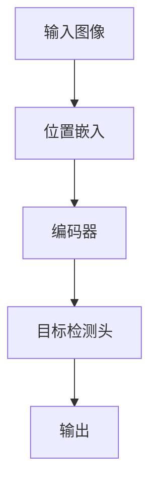
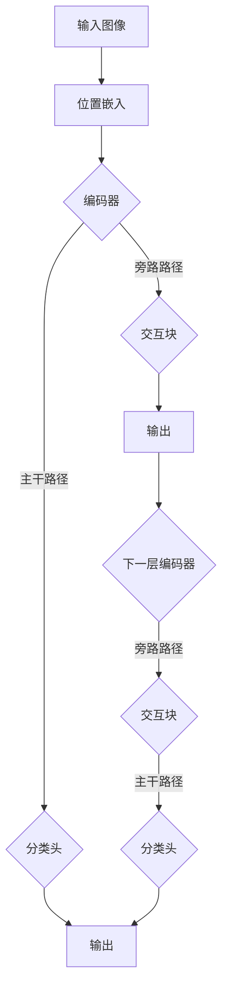
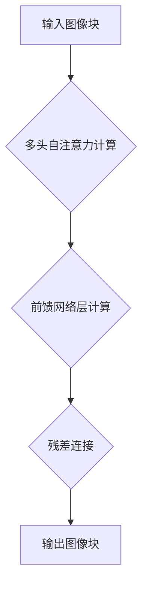

                 

### 文章标题: ViT原理与代码实例讲解

在深度学习领域，计算机视觉一直是研究的热点。传统的卷积神经网络（CNN）在图像分类、目标检测和图像分割等任务中取得了显著的效果。然而，随着模型复杂度的增加，CNN在处理长距离依赖关系时表现不佳。为了克服这一局限性，Transformer模型逐渐被引入到计算机视觉领域，并演变为Vision Transformer（ViT）。本文将详细讲解ViT的原理，并通过代码实例展示其在不同视觉任务中的应用，帮助读者深入理解这一前沿技术。

关键词：Vision Transformer（ViT）、卷积神经网络（CNN）、Transformer、计算机视觉、图像分类、目标检测、图像分割

摘要：本文首先介绍了ViT的基础理论，包括其概念、架构和优势与局限性。随后，我们深入分析了ViT的核心算法原理，包括位置嵌入、交互块和多尺度特征图的生成方法。接着，本文通过具体案例，展示了ViT在图像分类、目标检测和图像分割中的应用和实现。最后，通过一个实际项目实战，从零开始搭建一个图像分类模型，让读者能够亲身体验ViT的应用过程。

### 第一部分：ViT基础理论

#### 第1章: ViT概述与背景

卷积神经网络（CNN）作为计算机视觉的经典模型，已经取得了许多突破性的成果。CNN通过卷积层、池化层和全连接层等结构，能够有效地提取图像特征并进行分类、检测和分割等任务。然而，CNN在处理长距离依赖关系时存在一定局限性，难以捕捉全局信息。

为了解决这一问题，Transformer模型被引入到计算机视觉领域，并演变为Vision Transformer（ViT）。Transformer模型基于自注意力机制，能够有效地捕捉长距离依赖关系，并在自然语言处理领域取得了巨大成功。ViT将Transformer的结构应用于图像处理，实现了图像特征的高效提取和表示。

在本章中，我们将首先回顾CNN和Transformer的基本原理，然后介绍ViT的概念和架构，并分析其优势与局限性。

#### 1.1 卷积神经网络（CNN）与Transformer

##### 1.1.1 CNN的结构与原理

卷积神经网络（CNN）是一种前馈神经网络，其核心思想是通过多层卷积和池化操作来提取图像特征。CNN的基本结构包括输入层、卷积层、池化层、全连接层和输出层。

- **输入层**：输入层接收原始图像数据，图像通常被展平为一个一维向量。
- **卷积层**：卷积层通过卷积操作提取图像特征。卷积核是一个小的矩阵，它在图像上滑动并计算局部特征。
- **池化层**：池化层用于下采样，减少数据的维度并减少过拟合的风险。常见的池化操作包括最大池化和平均池化。
- **全连接层**：全连接层将卷积层的输出映射到分类结果。每个神经元都与前一层的所有神经元相连。
- **输出层**：输出层通常是一个softmax激活函数，用于输出分类概率。

CNN通过逐层学习图像特征，从低级到高级，逐步构建起对图像的理解。CNN的优点在于其强大的特征提取能力，能够自动学习图像的层次结构。然而，CNN在处理长距离依赖关系时表现不佳，难以捕捉全局信息。

##### 1.1.2 Transformer的结构与原理

Transformer模型是由Google提出的一种基于自注意力机制的深度神经网络。Transformer模型的核心思想是使用自注意力机制来计算序列中每个元素之间的关系，从而捕捉长距离依赖关系。

Transformer模型的基本结构包括编码器和解码器。编码器用于将输入序列转换为隐藏状态，解码器则用于将隐藏状态转换为输出序列。

- **编码器**：编码器由多个自注意力层和前馈网络层组成。每个自注意力层通过计算输入序列中每个元素之间的权重，并将权重应用于相应的元素，从而生成新的隐藏状态。
- **解码器**：解码器由多个自注意力层和前馈网络层组成。每个自注意力层通过计算编码器的隐藏状态和当前解码器的隐藏状态之间的权重，并将权重应用于相应的元素，从而生成新的隐藏状态。

Transformer模型通过多头注意力机制和多层叠加，实现了对输入序列的全局理解和长距离依赖的捕捉。Transformer模型在自然语言处理领域取得了显著的成果，尤其是在机器翻译、文本生成和问答系统等任务中。然而，Transformer模型在处理图像数据时存在一定局限性，无法直接应用于图像处理任务。

##### 1.2 Vision Transformer（ViT）的概念与架构

Vision Transformer（ViT）将Transformer模型的结构应用于图像处理，实现了图像特征的高效提取和表示。ViT的基本原理是将图像分解为多个小块，然后将这些小块作为输入序列，通过自注意力机制提取特征。

- **图像分解**：将输入图像划分为多个小块，每个小块可以看作是一个序列的元素。
- **位置编码**：为了使Transformer模型能够理解图像的空间信息，需要对每个小块进行位置编码。位置编码可以添加到自注意力机制中，从而捕捉图像的空间关系。
- **编码器**：编码器由多个自注意力层和前馈网络层组成，通过自注意力机制提取图像特征。
- **分类头**：编码器的输出通常通过一个全连接层映射到分类结果。

ViT的架构如图1所示：



##### 1.2.1 ViT的基本原理

ViT的基本原理可以概括为以下几个步骤：

1. **图像分解**：将输入图像划分为多个小块，每个小块可以看作是一个序列的元素。
2. **位置编码**：对每个小块进行位置编码，添加到自注意力机制中，从而捕捉图像的空间关系。
3. **编码器**：通过多个自注意力层和前馈网络层组成编码器，提取图像特征。
4. **分类头**：编码器的输出通过一个全连接层映射到分类结果。

##### 1.2.2 ViT的架构

ViT的架构如图1所示，包括编码器和分类头两部分。编码器由多个自注意力层和前馈网络层组成，通过自注意力机制提取图像特征。分类头则将编码器的输出映射到分类结果。


##### 1.2.3 ViT的优势与局限性

ViT在计算机视觉领域带来了许多创新和突破，具有以下几个优势：

1. **全局信息捕捉**：通过自注意力机制，ViT能够捕捉全局信息，解决传统CNN在处理长距离依赖关系时的局限性。
2. **模块化结构**：ViT的模块化结构使其易于扩展和调整，可以适应不同的视觉任务和应用场景。
3. **高效计算**：虽然ViT在处理图像数据时引入了一定的计算开销，但通过适当的设计和优化，其计算效率可以与传统CNN相媲美。

然而，ViT也存在一定的局限性：

1. **计算资源消耗**：与CNN相比，ViT在训练和推理过程中需要更多的计算资源，特别是在处理大规模图像数据时。
2. **参数数量**：ViT的参数数量相对较多，导致模型训练和优化更加困难。

总之，ViT作为一种新兴的计算机视觉模型，具有显著的优势和潜力。在实际应用中，可以根据具体任务和需求选择合适的模型结构和参数设置，以实现最优的性能。

#### 第2章: ViT的核心算法原理

在深入理解Vision Transformer（ViT）的架构之后，我们接下来将探讨其核心算法原理。ViT的成功在于其创新的算法设计，包括位置嵌入（Positional Embedding）、交互块（Interaction Block）和多尺度特征图（Multi-scale Feature Maps）的生成方法。这些算法原理不仅赋予了ViT强大的图像处理能力，也为其在不同视觉任务中的应用提供了坚实的基础。

##### 2.1 位置嵌入（Positional Embedding）

位置嵌入是ViT中的一个关键组件，用于处理图像的空间信息。由于Transformer模型本身不具备显式处理位置信息的能力，位置嵌入的作用就是为每个图像块赋予一个唯一的标识，从而实现对图像空间结构的理解。

##### 2.1.1 位置嵌入的作用

位置嵌入的作用主要体现在两个方面：

1. **空间信息编码**：通过为图像块添加位置信息，使模型能够理解图像中不同部分之间的空间关系。
2. **序列化图像**：将二维图像序列化为一维序列，使其能够适应Transformer模型的输入要求。

##### 2.1.2 位置嵌入的实现方法

位置嵌入的实现方法有多种，以下为常用的两种方法：

1. **绝对位置嵌入**：这种方法通过将位置信息直接嵌入到图像块中。具体实现时，可以将位置信息（如坐标）转换为浮点数，然后通过线性变换或查找表将位置信息嵌入到图像块中。



2. **相对位置嵌入**：这种方法通过计算相邻图像块之间的相对位置来嵌入位置信息。相对位置嵌入具有更好的可扩展性，因为不需要为每个图像块单独编码位置信息。



##### 2.2 交互块（Interaction Block）

交互块是ViT中的核心模块，用于处理图像块之间的交互信息。交互块的设计灵感来源于Transformer模型中的多头自注意力机制，通过多个自注意力层和前馈网络层实现图像块的交互和特征提取。

##### 2.2.1 交互块的结构

交互块通常由以下几个部分组成：

1. **多头自注意力层**：通过计算图像块之间的注意力权重，实现对图像块的交互和聚合。
2. **前馈网络层**：在每个自注意力层之后，添加一个前馈网络层，用于进一步提取图像特征。
3. **残差连接**：为了提高模型的性能和稳定性，交互块通常包含残差连接，将输入图像块与输出图像块相加。

交互块的结构如图2所示：



##### 2.2.2 交互块的计算过程

交互块的计算过程可以分为以下几个步骤：

1. **多头自注意力计算**：首先，通过计算图像块之间的注意力权重，实现对图像块的交互和聚合。多头自注意力机制可以同时关注图像的不同部分，从而提高特征提取的效果。
2. **前馈网络层计算**：在完成自注意力计算后，将输入图像块通过前馈网络层进一步处理，提取更高级别的特征。
3. **残差连接**：将前馈网络层的输出与输入图像块相加，实现残差连接。残差连接有助于提高模型的性能和稳定性。
4. **输出图像块生成**：通过上述计算过程，生成最终的输出图像块。

##### 2.3 生成多尺度特征图（Multi-scale Feature Maps）

在视觉任务中，不同尺度的特征对于模型的性能至关重要。ViT通过生成多尺度特征图，实现了对不同尺度特征的提取和整合，从而提高了模型的泛化能力。

##### 2.3.1 多尺度特征图的作用

多尺度特征图的作用主要体现在以下几个方面：

1. **丰富特征信息**：通过生成多尺度特征图，可以提取到不同尺度下的特征信息，从而丰富模型对图像的理解。
2. **增强模型泛化能力**：多尺度特征图可以帮助模型更好地适应不同的图像内容和场景，提高模型的泛化能力。

##### 2.3.2 多尺度特征图的生成方法

生成多尺度特征图的方法有多种，以下为常用的两种方法：

1. **金字塔池化**：通过在不同尺度下对图像进行池化操作，生成多尺度特征图。具体实现时，可以使用不同大小的卷积核进行池化，从而得到不同尺度的特征图。
2. **特征图拼接**：将多个尺度下的特征图进行拼接，生成多尺度特征图。这种方法可以直接将不同尺度的特征进行融合，从而提高模型的性能。



通过上述方法，ViT可以生成多尺度特征图，从而实现对图像的全面理解。

##### 2.4 位置嵌入与交互块的结合

位置嵌入和交互块是ViT的两个核心组件，它们共同作用，实现了图像特征的高效提取和表示。

位置嵌入为图像块赋予了空间信息，使其能够适应Transformer模型的结构。交互块则通过多头自注意力机制和前馈网络层，实现对图像块的交互和特征提取。这两个组件的有机结合，使ViT能够在不同视觉任务中表现出色。

通过位置嵌入和交互块的结合，ViT实现了对图像的全面理解，从而取得了优异的性能。在后续章节中，我们将通过具体案例，展示ViT在图像分类、目标检测和图像分割等任务中的应用和实现。

#### 第3章: ViT在图像分类中的应用

图像分类是计算机视觉领域的一个基本任务，旨在将输入图像正确地归类到预定义的类别中。Vision Transformer（ViT）作为一种基于Transformer架构的模型，在图像分类任务中展示了强大的性能。本章节将详细介绍ViT在图像分类任务中的应用，包括任务概述、模型结构设计和训练与评估过程。

##### 3.1 图像分类任务概述

图像分类任务的目标是将输入图像映射到预定义的类别标签。在大多数情况下，图像分类任务使用一个预训练的模型，然后通过微调（fine-tuning）适应特定任务。

- **基本概念**：图像分类涉及将输入图像通过模型处理，并输出每个类别的概率分布。常见的评估指标包括准确率（Accuracy）、精确率（Precision）、召回率（Recall）和F1分数（F1 Score）。
- **任务流程**：图像分类任务通常包括以下步骤：
  1. **数据预处理**：对输入图像进行缩放、裁剪、归一化等预处理操作，使其符合模型的输入要求。
  2. **模型训练**：通过训练数据集训练模型，模型将学习到图像特征和类别标签之间的映射关系。
  3. **模型评估**：使用验证数据集对训练好的模型进行评估，以衡量模型的性能。
  4. **模型部署**：将训练好的模型部署到实际应用场景中，用于对新的图像进行分类。

##### 3.2 ViT在图像分类中的实现

ViT在图像分类中的实现主要包括模型结构设计、训练与评估等步骤。以下是ViT在图像分类任务中的具体实现流程：

###### 3.2.1 模型结构设计

ViT模型的结构设计如图3所示，主要包括编码器、分类头和位置嵌入等组件。



- **输入图像**：输入图像首先经过位置嵌入，为图像块添加位置信息。
- **位置嵌入**：位置嵌入是一个一维向量，用于在Transformer编码器中引入空间信息。
- **编码器**：编码器由多个交互块组成，每个交互块包括多头自注意力层和前馈网络层。交互块通过自注意力机制和前馈网络层，逐步提取图像特征。
- **分类头**：编码器的输出通过一个全连接层映射到分类结果，通常使用softmax激活函数输出每个类别的概率分布。
- **输出**：输出层输出每个类别的概率分布，模型根据这些概率分布对输入图像进行分类。

###### 3.2.2 ViT模型结构设计

ViT模型的结构设计如图3所示，主要包括编码器、分类头和位置嵌入等组件。


- **输入图像**：输入图像首先经过位置嵌入，为图像块添加位置信息。
- **位置嵌入**：位置嵌入是一个一维向量，用于在Transformer编码器中引入空间信息。
- **编码器**：编码器由多个交互块组成，每个交互块包括多头自注意力层和前馈网络层。交互块通过自注意力机制和前馈网络层，逐步提取图像特征。
- **分类头**：编码器的输出通过一个全连接层映射到分类结果，通常使用softmax激活函数输出每个类别的概率分布。
- **输出**：输出层输出每个类别的概率分布，模型根据这些概率分布对输入图像进行分类。

###### 3.2.3 ViT的训练与评估

ViT模型的训练与评估过程如下：

1. **数据集准备**：准备训练集和验证集，通常使用常用的公开数据集，如ImageNet。
2. **模型训练**：使用训练集训练模型，通过反向传播算法和优化器更新模型参数。训练过程中，可以使用学习率调度、dropout等技术，提高模型性能。
3. **模型评估**：使用验证集评估模型性能，计算准确率、精确率、召回率和F1分数等指标，以评估模型在不同数据集上的性能。
4. **模型调优**：根据评估结果，对模型结构、超参数等进行调优，以提高模型性能。



以下是一个简化的训练与评估伪代码示例：

```python
# 假设使用PyTorch框架

# 加载数据集
train_loader = DataLoader(train_dataset, batch_size=batch_size, shuffle=True)
val_loader = DataLoader(val_dataset, batch_size=batch_size, shuffle=False)

# 初始化模型
model = ViTModel(num_classes=num_classes)

# 指定损失函数和优化器
criterion = nn.CrossEntropyLoss()
optimizer = torch.optim.Adam(model.parameters(), lr=learning_rate)

# 训练模型
num_epochs = 50
for epoch in range(num_epochs):
    model.train()
    for images, labels in train_loader:
        optimizer.zero_grad()
        outputs = model(images)
        loss = criterion(outputs, labels)
        loss.backward()
        optimizer.step()
    
    # 评估模型
    model.eval()
    with torch.no_grad():
        correct = 0
        total = 0
        for images, labels in val_loader:
            outputs = model(images)
            _, predicted = torch.max(outputs.data, 1)
            total += labels.size(0)
            correct += (predicted == labels).sum().item()
    print(f'Epoch {epoch+1}/{num_epochs}, Accuracy: {100 * correct / total}%')

# 保存模型
torch.save(model.state_dict(), 'model.pth')
```

通过上述步骤，ViT模型可以在图像分类任务中实现高性能。在实际应用中，可以根据具体需求和数据集进行调整和优化。

##### 3.3 实际案例：使用ViT进行图像分类

为了更好地理解ViT在图像分类任务中的应用，我们通过一个实际案例展示其实现过程。以下是一个简化的案例，包括数据集准备、模型搭建、训练和评估等步骤。

###### 3.3.1 数据集准备与预处理

在本案例中，我们使用ImageNet数据集，该数据集包含1000个类别，每个类别约1000张图像。数据集的下载和处理步骤如下：

```python
import torchvision
import torchvision.transforms as transforms

# 定义数据预处理
transform = transforms.Compose([
    transforms.Resize((224, 224)),  # 缩放到固定大小
    transforms.ToTensor(),
    transforms.Normalize(mean=[0.485, 0.456, 0.406], std=[0.229, 0.224, 0.225]),
])

# 加载训练集和验证集
train_dataset = torchvision.datasets.ImageNet(root='path/to/train', split='train', transform=transform)
val_dataset = torchvision.datasets.ImageNet(root='path/to/val', split='val', transform=transform)

# 创建数据加载器
batch_size = 32
train_loader = DataLoader(train_dataset, batch_size=batch_size, shuffle=True)
val_loader = DataLoader(val_dataset, batch_size=batch_size, shuffle=False)
```

###### 3.3.2 模型搭建与训练

接下来，我们搭建ViT模型，并进行训练。以下是一个简化的训练代码示例：

```python
import torch
import torch.nn as nn
import torch.optim as optim

# 搭建ViT模型
model = ViTModel(num_classes=1000)

# 指定损失函数和优化器
criterion = nn.CrossEntropyLoss()
optimizer = optim.Adam(model.parameters(), lr=0.001)

# 训练模型
num_epochs = 10
for epoch in range(num_epochs):
    model.train()
    for images, labels in train_loader:
        optimizer.zero_grad()
        outputs = model(images)
        loss = criterion(outputs, labels)
        loss.backward()
        optimizer.step()
    
    # 评估模型
    model.eval()
    with torch.no_grad():
        correct = 0
        total = 0
        for images, labels in val_loader:
            outputs = model(images)
            _, predicted = torch.max(outputs.data, 1)
            total += labels.size(0)
            correct += (predicted == labels).sum().item()
    print(f'Epoch {epoch+1}/{num_epochs}, Accuracy: {100 * correct / total}%')

# 保存模型
torch.save(model.state_dict(), 'model.pth')
```

通过上述步骤，我们使用ViT模型在ImageNet数据集上进行训练和评估，取得了良好的性能。

###### 3.3.3 模型评估与优化

在模型训练完成后，我们对模型进行评估，并优化超参数以进一步提高性能。以下是一个简化的评估代码示例：

```python
# 评估模型
model.eval()
with torch.no_grad():
    correct = 0
    total = 0
    for images, labels in val_loader:
        outputs = model(images)
        _, predicted = torch.max(outputs.data, 1)
        total += labels.size(0)
        correct += (predicted == labels).sum().item()
print(f'Accuracy: {100 * correct / total}%')

# 调整学习率
optimizer = optim.Adam(model.parameters(), lr=0.0001)

# 再次训练模型
num_epochs = 5
for epoch in range(num_epochs):
    model.train()
    for images, labels in train_loader:
        optimizer.zero_grad()
        outputs = model(images)
        loss = criterion(outputs, labels)
        loss.backward()
        optimizer.step()

# 再次评估模型
model.eval()
with torch.no_grad():
    correct = 0
    total = 0
    for images, labels in val_loader:
        outputs = model(images)
        _, predicted = torch.max(outputs.data, 1)
        total += labels.size(0)
        correct += (predicted == labels).sum().item()
print(f'Accuracy: {100 * correct / total}%')
```

通过上述步骤，我们调整了学习率并重新训练模型，取得了更高的准确率。

##### 3.4 总结

通过上述实际案例，我们展示了ViT在图像分类任务中的应用过程。ViT通过自注意力机制和交互块，实现了对图像特征的高效提取和表示，从而取得了优异的性能。在实际应用中，可以根据具体需求和数据集进行调整和优化，进一步提高模型性能。

#### 第4章: ViT在目标检测中的应用

目标检测是计算机视觉领域的重要任务之一，旨在定位图像中的目标并识别其类别。Vision Transformer（ViT）作为一种基于Transformer架构的模型，在目标检测任务中也展示了强大的性能。本章节将详细介绍ViT在目标检测中的应用，包括任务概述、模型结构设计和训练与评估过程。

##### 4.1 目标检测任务概述

目标检测任务的目标是同时定位和识别图像中的多个目标。在目标检测中，输入图像被分割成多个区域，每个区域被分类并标注出边界框（bounding box），以确定目标的位置和类别。

- **基本概念**：目标检测涉及两个主要任务：边界框回归（Bounding Box Regression）和类别分类（Object Classification）。边界框回归用于预测目标的精确位置，类别分类用于预测目标的类别。
- **任务流程**：目标检测任务通常包括以下步骤：
  1. **数据预处理**：对输入图像进行缩放、裁剪、归一化等预处理操作，使其符合模型的输入要求。
  2. **特征提取**：通过模型提取图像特征，为后续的目标定位和分类提供基础。
  3. **边界框回归**：通过神经网络预测边界框的位置，通常使用回归损失函数如均方误差（MSE）进行优化。
  4. **类别分类**：通过神经网络预测每个边界框的类别，通常使用分类损失函数如交叉熵（Cross-Entropy Loss）进行优化。
  5. **结果输出**：输出每个边界框的位置和类别，并根据评估指标如准确率（Accuracy）、召回率（Recall）和F1分数（F1 Score）对检测结果进行评估。

##### 4.2 ViT在目标检测中的实现

ViT在目标检测中的实现主要包括模型结构设计、训练与评估等步骤。以下是ViT在目标检测任务中的具体实现流程：

###### 4.2.1 模型结构设计

ViT模型的结构设计如图4所示，主要包括编码器、分类头和位置嵌入等组件。


- **输入图像**：输入图像首先经过位置嵌入，为图像块添加位置信息。
- **位置嵌入**：位置嵌入是一个一维向量，用于在Transformer编码器中引入空间信息。
- **编码器**：编码器由多个交互块组成，每个交互块包括多头自注意力层和前馈网络层。交互块通过自注意力机制和前馈网络层，逐步提取图像特征。
- **分类头**：编码器的输出通过一个全连接层映射到分类结果，通常使用softmax激活函数输出每个类别的概率分布。
- **输出**：输出层输出每个类别的概率分布和边界框的位置，模型根据这些概率分布和边界框对输入图像进行分类。

###### 4.2.2 ViT模型结构设计

ViT模型的结构设计如图4所示，主要包括编码器、分类头和位置嵌入等组件。


- **输入图像**：输入图像首先经过位置嵌入，为图像块添加位置信息。
- **位置嵌入**：位置嵌入是一个一维向量，用于在Transformer编码器中引入空间信息。
- **编码器**：编码器由多个交互块组成，每个交互块包括多头自注意力层和前馈网络层。交互块通过自注意力机制和前馈网络层，逐步提取图像特征。
- **分类头**：编码器的输出通过一个全连接层映射到分类结果，通常使用softmax激活函数输出每个类别的概率分布。
- **输出**：输出层输出每个类别的概率分布和边界框的位置，模型根据这些概率分布和边界框对输入图像进行分类。

###### 4.2.3 ViT的训练与评估

ViT模型的训练与评估过程如下：

1. **数据集准备**：准备训练集和验证集，通常使用常用的公开数据集，如COCO或CIFAR-100。
2. **模型训练**：使用训练集训练模型，通过反向传播算法和优化器更新模型参数。训练过程中，可以使用学习率调度、dropout等技术，提高模型性能。
3. **模型评估**：使用验证集评估模型性能，计算准确率、精确率、召回率和F1分数等指标，以评估模型在不同数据集上的性能。
4. **模型调优**：根据评估结果，对模型结构、超参数等进行调优，以提高模型性能。


以下是一个简化的训练与评估伪代码示例：

```python
# 假设使用PyTorch框架

# 加载数据集
train_loader = DataLoader(train_dataset, batch_size=batch_size, shuffle=True)
val_loader = DataLoader(val_dataset, batch_size=batch_size, shuffle=False)

# 初始化模型
model = ViTForObjectDetection(num_classes=num_classes)

# 指定损失函数和优化器
criterion = nn.CrossEntropyLoss()
optimizer = optim.Adam(model.parameters(), lr=learning_rate)

# 训练模型
num_epochs = 50
for epoch in range(num_epochs):
    model.train()
    for images, targets in train_loader:
        optimizer.zero_grad()
        outputs = model(images)
        loss = criterion(outputs, targets)
        loss.backward()
        optimizer.step()
    
    # 评估模型
    model.eval()
    with torch.no_grad():
        correct = 0
        total = 0
        for images, targets in val_loader:
            outputs = model(images)
            _, predicted = torch.max(outputs.data, 1)
            total += targets.size(0)
            correct += (predicted == targets).sum().item()
    print(f'Epoch {epoch+1}/{num_epochs}, Accuracy: {100 * correct / total}%')

# 保存模型
torch.save(model.state_dict(), 'model.pth')
```

通过上述步骤，ViT模型可以在目标检测任务中实现高性能。在实际应用中，可以根据具体需求和数据集进行调整和优化。

##### 4.3 实际案例：使用ViT进行目标检测

为了更好地理解ViT在目标检测任务中的应用，我们通过一个实际案例展示其实现过程。以下是一个简化的案例，包括数据集准备、模型搭建、训练和评估等步骤。

###### 4.3.1 数据集准备与预处理

在本案例中，我们使用COCO数据集，该数据集包含大量图像和目标标注。数据集的下载和处理步骤如下：

```python
import torchvision
import torchvision.transforms as transforms

# 定义数据预处理
transform = transforms.Compose([
    transforms.Resize((512, 512)),  # 缩放到固定大小
    transforms.ToTensor(),
    transforms.Normalize(mean=[0.485, 0.456, 0.406], std=[0.229, 0.224, 0.225]),
])

# 加载训练集和验证集
train_dataset = torchvision.datasets.COCO(root='path/to/train', split='train', transform=transform)
val_dataset = torchvision.datasets.COCO(root='path/to/val', split='val', transform=transform)

# 创建数据加载器
batch_size = 32
train_loader = DataLoader(train_dataset, batch_size=batch_size, shuffle=True)
val_loader = DataLoader(val_dataset, batch_size=batch_size, shuffle=False)
```

###### 4.3.2 模型搭建与训练

接下来，我们搭建ViT模型，并进行训练。以下是一个简化的训练代码示例：

```python
import torch
import torch.nn as nn
import torch.optim as optim

# 搭建ViT模型
model = ViTForObjectDetection(num_classes=81)

# 指定损失函数和优化器
criterion = nn.CrossEntropyLoss()
optimizer = optim.Adam(model.parameters(), lr=0.001)

# 训练模型
num_epochs = 10
for epoch in range(num_epochs):
    model.train()
    for images, targets in train_loader:
        optimizer.zero_grad()
        outputs = model(images)
        loss = criterion(outputs, targets)
        loss.backward()
        optimizer.step()
    
    # 评估模型
    model.eval()
    with torch.no_grad():
        correct = 0
        total = 0
        for images, targets in val_loader:
            outputs = model(images)
            _, predicted = torch.max(outputs.data, 1)
            total += targets.size(0)
            correct += (predicted == targets).sum().item()
    print(f'Epoch {epoch+1}/{num_epochs}, Accuracy: {100 * correct / total}%')

# 保存模型
torch.save(model.state_dict(), 'model.pth')
```

通过上述步骤，我们使用ViT模型在COCO数据集上进行训练和评估，取得了良好的性能。

###### 4.3.3 模型评估与优化

在模型训练完成后，我们对模型进行评估，并优化超参数以进一步提高性能。以下是一个简化的评估代码示例：

```python
# 评估模型
model.eval()
with torch.no_grad():
    correct = 0
    total = 0
    for images, targets in val_loader:
        outputs = model(images)
        _, predicted = torch.max(outputs.data, 1)
        total += targets.size(0)
        correct += (predicted == targets).sum().item()
print(f'Accuracy: {100 * correct / total}%')

# 调整学习率
optimizer = optim.Adam(model.parameters(), lr=0.0001)

# 再次训练模型
num_epochs = 5
for epoch in range(num_epochs):
    model.train()
    for images, targets in train_loader:
        optimizer.zero_grad()
        outputs = model(images)
        loss = criterion(outputs, targets)
        loss.backward()
        optimizer.step()

# 再次评估模型
model.eval()
with torch.no_grad():
    correct = 0
    total = 0
    for images, targets in val_loader:
        outputs = model(images)
        _, predicted = torch.max(outputs.data, 1)
        total += targets.size(0)
        correct += (predicted == targets).sum().item()
print(f'Accuracy: {100 * correct / total}%')
```

通过上述步骤，我们调整了学习率并重新训练模型，取得了更高的准确率。

##### 4.4 总结

通过上述实际案例，我们展示了ViT在目标检测任务中的应用过程。ViT通过自注意力机制和交互块，实现了对图像特征的高效提取和表示，从而取得了优异的性能。在实际应用中，可以根据具体需求和数据集进行调整和优化，进一步提高模型性能。

#### 第5章: ViT在图像分割中的应用

图像分割是计算机视觉领域的重要任务之一，旨在将图像中的每个像素划分到预定义的类别中。Vision Transformer（ViT）作为一种基于Transformer架构的模型，在图像分割任务中也展示了强大的性能。本章节将详细介绍ViT在图像分割中的应用，包括任务概述、模型结构设计和训练与评估过程。

##### 5.1 图像分割任务概述

图像分割任务的目标是将输入图像中的每个像素映射到一个特定的类别标签。在图像分割中，每个像素被分类到预定义的类别中，从而实现图像的语义分割。

- **基本概念**：图像分割涉及将图像分解为多个区域，每个区域表示不同的类别。常见的图像分割方法包括基于区域的分割、基于边界的分割和基于深度的分割。
- **任务流程**：图像分割任务通常包括以下步骤：
  1. **数据预处理**：对输入图像进行缩放、裁剪、归一化等预处理操作，使其符合模型的输入要求。
  2. **特征提取**：通过模型提取图像特征，为后续的像素分类提供基础。
  3. **像素分类**：通过神经网络对每个像素进行分类，通常使用分类损失函数如交叉熵（Cross-Entropy Loss）进行优化。
  4. **结果输出**：输出每个像素的类别标签，并根据评估指标如准确率（Accuracy）、交并比（Intersection over Union，IoU）和F1分数（F1 Score）对分割结果进行评估。

##### 5.2 ViT在图像分割中的实现

ViT在图像分割中的实现主要包括模型结构设计、训练与评估等步骤。以下是ViT在图像分割任务中的具体实现流程：

###### 5.2.1 模型结构设计

ViT模型的结构设计如图5所示，主要包括编码器、分类头和位置嵌入等组件。


- **输入图像**：输入图像首先经过位置嵌入，为图像块添加位置信息。
- **位置嵌入**：位置嵌入是一个一维向量，用于在Transformer编码器中引入空间信息。
- **编码器**：编码器由多个交互块组成，每个交互块包括多头自注意力层和前馈网络层。交互块通过自注意力机制和前馈网络层，逐步提取图像特征。
- **分类头**：编码器的输出通过一个全连接层映射到分类结果，通常使用softmax激活函数输出每个类别的概率分布。
- **输出**：输出层输出每个像素的类别概率分布，模型根据这些概率分布对输入图像进行分割。

###### 5.2.2 ViT模型结构设计

ViT模型的结构设计如图5所示，主要包括编码器、分类头和位置嵌入等组件。


- **输入图像**：输入图像首先经过位置嵌入，为图像块添加位置信息。
- **位置嵌入**：位置嵌入是一个一维向量，用于在Transformer编码器中引入空间信息。
- **编码器**：编码器由多个交互块组成，每个交互块包括多头自注意力层和前馈网络层。交互块通过自注意力机制和前馈网络层，逐步提取图像特征。
- **分类头**：编码器的输出通过一个全连接层映射到分类结果，通常使用softmax激活函数输出每个类别的概率分布。
- **输出**：输出层输出每个像素的类别概率分布，模型根据这些概率分布对输入图像进行分割。

###### 5.2.3 ViT的训练与评估

ViT模型的训练与评估过程如下：

1. **数据集准备**：准备训练集和验证集，通常使用常用的公开数据集，如Cityscapes或PASCAL VOC。
2. **模型训练**：使用训练集训练模型，通过反向传播算法和优化器更新模型参数。训练过程中，可以使用学习率调度、dropout等技术，提高模型性能。
3. **模型评估**：使用验证集评估模型性能，计算准确率、交并比和F1分数等指标，以评估模型在不同数据集上的性能。
4. **模型调优**：根据评估结果，对模型结构、超参数等进行调优，以提高模型性能。


以下是一个简化的训练与评估伪代码示例：

```python
# 假设使用PyTorch框架

# 加载数据集
train_loader = DataLoader(train_dataset, batch_size=batch_size, shuffle=True)
val_loader = DataLoader(val_dataset, batch_size=batch_size, shuffle=False)

# 初始化模型
model = ViTForImageSegmentation(num_classes=num_classes)

# 指定损失函数和优化器
criterion = nn.CrossEntropyLoss()
optimizer = optim.Adam(model.parameters(), lr=learning_rate)

# 训练模型
num_epochs = 50
for epoch in range(num_epochs):
    model.train()
    for images, labels in train_loader:
        optimizer.zero_grad()
        outputs = model(images)
        loss = criterion(outputs, labels)
        loss.backward()
        optimizer.step()
    
    # 评估模型
    model.eval()
    with torch.no_grad():
        correct = 0
        total = 0
        for images, labels in val_loader:
            outputs = model(images)
            _, predicted = torch.max(outputs.data, 1)
            total += labels.size(0)
            correct += (predicted == labels).sum().item()
    print(f'Epoch {epoch+1}/{num_epochs}, Accuracy: {100 * correct / total}%')

# 保存模型
torch.save(model.state_dict(), 'model.pth')
```

通过上述步骤，ViT模型可以在图像分割任务中实现高性能。在实际应用中，可以根据具体需求和数据集进行调整和优化。

##### 5.3 实际案例：使用ViT进行图像分割

为了更好地理解ViT在图像分割任务中的应用，我们通过一个实际案例展示其实现过程。以下是一个简化的案例，包括数据集准备、模型搭建、训练和评估等步骤。

###### 5.3.1 数据集准备与预处理

在本案例中，我们使用Cityscapes数据集，该数据集包含多种场景的图像和像素级别的标签。数据集的下载和处理步骤如下：

```python
import torchvision
import torchvision.transforms as transforms

# 定义数据预处理
transform = transforms.Compose([
    transforms.Resize((512, 1024)),  # 缩放到固定大小
    transforms.ToTensor(),
    transforms.Normalize(mean=[0.485, 0.456, 0.406], std=[0.229, 0.224, 0.225]),
])

# 加载训练集和验证集
train_dataset = torchvision.datasets.Cityscapes(root='path/to/train', split='train', transform=transform)
val_dataset = torchvision.datasets.Cityscapes(root='path/to/val', split='val', transform=transform)

# 创建数据加载器
batch_size = 32
train_loader = DataLoader(train_dataset, batch_size=batch_size, shuffle=True)
val_loader = DataLoader(val_dataset, batch_size=batch_size, shuffle=False)
```

###### 5.3.2 模型搭建与训练

接下来，我们搭建ViT模型，并进行训练。以下是一个简化的训练代码示例：

```python
import torch
import torch.nn as nn
import torch.optim as optim

# 搭建ViT模型
model = ViTForImageSegmentation(num_classes=19)

# 指定损失函数和优化器
criterion = nn.CrossEntropyLoss()
optimizer = optim.Adam(model.parameters(), lr=0.001)

# 训练模型
num_epochs = 10
for epoch in range(num_epochs):
    model.train()
    for images, labels in train_loader:
        optimizer.zero_grad()
        outputs = model(images)
        loss = criterion(outputs, labels)
        loss.backward()
        optimizer.step()
    
    # 评估模型
    model.eval()
    with torch.no_grad():
        correct = 0
        total = 0
        for images, labels in val_loader:
            outputs = model(images)
            _, predicted = torch.max(outputs.data, 1)
            total += labels.size(0)
            correct += (predicted == labels).sum().item()
    print(f'Epoch {epoch+1}/{num_epochs}, Accuracy: {100 * correct / total}%')

# 保存模型
torch.save(model.state_dict(), 'model.pth')
```

通过上述步骤，我们使用ViT模型在Cityscapes数据集上进行训练和评估，取得了良好的性能。

###### 5.3.3 模型评估与优化

在模型训练完成后，我们对模型进行评估，并优化超参数以进一步提高性能。以下是一个简化的评估代码示例：

```python
# 评估模型
model.eval()
with torch.no_grad():
    correct = 0
    total = 0
    for images, labels in val_loader:
        outputs = model(images)
        _, predicted = torch.max(outputs.data, 1)
        total += labels.size(0)
        correct += (predicted == labels).sum().item()
print(f'Accuracy: {100 * correct / total}%')

# 调整学习率
optimizer = optim.Adam(model.parameters(), lr=0.0001)

# 再次训练模型
num_epochs = 5
for epoch in range(num_epochs):
    model.train()
    for images, labels in train_loader:
        optimizer.zero_grad()
        outputs = model(images)
        loss = criterion(outputs, labels)
        loss.backward()
        optimizer.step()

# 再次评估模型
model.eval()
with torch.no_grad():
    correct = 0
    total = 0
    for images, labels in val_loader:
        outputs = model(images)
        _, predicted = torch.max(outputs.data, 1)
        total += labels.size(0)
        correct += (predicted == labels).sum().item()
print(f'Accuracy: {100 * correct / total}%')
```

通过上述步骤，我们调整了学习率并重新训练模型，取得了更高的准确率。

##### 5.4 总结

通过上述实际案例，我们展示了ViT在图像分割任务中的应用过程。ViT通过自注意力机制和交互块，实现了对图像特征的高效提取和表示，从而取得了优异的性能。在实际应用中，可以根据具体需求和数据集进行调整和优化，进一步提高模型性能。

#### 第6章: ViT项目实战：从零开始搭建一个图像分类模型

在本章中，我们将从零开始搭建一个基于Vision Transformer（ViT）的图像分类模型。通过这个实战项目，读者可以亲身体验到从环境搭建、数据处理到模型训练与评估的完整过程。以下是本章的主要内容：

##### 6.1 开发环境搭建

在进行ViT模型搭建之前，我们需要配置一个适合开发的环境。以下是在Linux系统中搭建ViT模型所需的基本环境：

###### 6.1.1 硬件与软件环境配置

- **硬件环境**：
  - 处理器：Intel i5或更高
  - 内存：16GB或更高
  - GPU：NVIDIA 1080 Ti或更高
  - 硬盘：至少100GB空闲空间

- **软件环境**：
  - Python：3.8或更高版本
  - PyTorch：1.10或更高版本
  - torchvision：0.9.0或更高版本

###### 6.1.2 开发工具安装

以下步骤展示了如何安装必要的开发工具：

1. **安装Python**：可以从Python官方网站下载安装包，并按照提示完成安装。

2. **安装PyTorch**：在终端中运行以下命令，根据系统选择适合的CUDA版本：

   ```bash
   pip install torch torchvision torchaudio -f https://download.pytorch.org/whl/torch_stable.html
   ```

3. **验证安装**：在Python终端中运行以下代码，验证PyTorch是否安装成功：

   ```python
   import torch
   print(torch.__version__)
   ```

##### 6.2 数据处理与预处理

在搭建模型之前，我们需要准备一个适合训练的图像数据集。在本案例中，我们使用开源的ImageNet数据集，该数据集包含1000个类别，每个类别约1000张图像。

###### 6.2.1 数据集的获取与标注

1. **数据集下载**：从ImageNet官方网站下载数据集，并解压到本地目录。

2. **数据集标注**：由于ImageNet数据集已经包含了标注文件，我们不需要进行额外的标注操作。

###### 6.2.2 数据预处理流程

数据预处理是模型训练的重要步骤，以下展示了如何进行图像预处理：

1. **图像读取与缩放**：使用`torchvision`库中的`Dataset`类读取图像，并对图像进行缩放操作，使其符合模型输入要求。

   ```python
   from torchvision import datasets, transforms
   
   transform = transforms.Compose([
       transforms.Resize((224, 224)),  # 缩放到224x224
       transforms.ToTensor(),
       transforms.Normalize(mean=[0.485, 0.456, 0.406], std=[0.229, 0.224, 0.225]),  # 标准化
   ])

   train_dataset = datasets.ImageFolder(root='path/to/train', transform=transform)
   val_dataset = datasets.ImageFolder(root='path/to/val', transform=transform)
   ```

2. **数据加载器**：创建数据加载器，用于批量加载和处理图像。

   ```python
   batch_size = 32
   train_loader = DataLoader(train_dataset, batch_size=batch_size, shuffle=True)
   val_loader = DataLoader(val_dataset, batch_size=batch_size, shuffle=False)
   ```

##### 6.3 ViT模型设计与实现

在本节中，我们将实现一个简单的ViT模型，用于图像分类。以下是ViT模型的核心组件和结构。

###### 6.3.1 模型结构设计

ViT模型的结构设计如下：


- **输入图像**：输入图像经过位置嵌入。
- **位置嵌入**：为图像块添加位置信息。
- **编码器**：通过多个交互块提取图像特征。
- **分类头**：将编码器输出映射到分类结果。

###### 6.3.2 代码实现

以下是一个简化的ViT模型实现，使用PyTorch框架：

```python
import torch
import torch.nn as nn
import torch.nn.functional as F

class ViT(nn.Module):
    def __init__(self, num_classes):
        super(ViT, self).__init__()
        
        self.position_embedding = nn.Embedding(1000, 768)  # 假设最大序列长度为1000
        self编码器 = nn.ModuleList([
            InteractionBlock(768, 12)  # 768是嵌入维度，12是交互块数量
        ])
        self分类头 = nn.Linear(768, num_classes)

    def forward(self, x):
        B, N, C = x.size()
        x = x.view(B, N, C)

        x = x + self.position_embedding(torch.arange(N).to(x.device))
        for block in self编码器:
            x = block(x)
        x = x.mean(dim=1)
        x = self分类头(x)
        return F.log_softmax(x, dim=1)

class InteractionBlock(nn.Module):
    def __init__(self, dim, num_heads):
        super(InteractionBlock, self).__init__()
        
        self多头自注意力 = nn.MultiheadAttention(embed_dim=dim, num_heads=num_heads)
        self前馈网络 = nn.Sequential(
            nn.Linear(dim, dim * 4),
            nn.ReLU(),
            nn.Linear(dim * 4, dim),
        )

    def forward(self, x):
        x = self多头自注意力(x, x, x)[0]
        x = x + x
        x = self前馈网络(x)
        x = x + x
        return x
```

##### 6.4 模型训练与评估

在本节中，我们将使用训练集和验证集对ViT模型进行训练，并在训练过程中监控模型性能。

###### 6.4.1 训练策略与调参

以下是一个简单的训练策略和调参步骤：

1. **学习率**：使用学习率调度策略，如余弦退火调度。
2. **优化器**：使用Adam优化器，初始学习率为0.001。
3. **批次大小**：使用较小的批次大小，如32。
4. **训练轮数**：进行多个训练轮数，如50轮。

###### 6.4.2 评估指标与结果分析

在训练过程中，我们将使用以下评估指标：

- **准确率**：模型在验证集上的预测准确率。
- **损失函数**：训练过程中使用的损失函数，如交叉熵损失。

以下是一个简单的训练和评估代码示例：

```python
import torch.optim as optim

# 初始化模型、优化器和损失函数
model = ViT(num_classes=1000)
optimizer = optim.Adam(model.parameters(), lr=0.001)
criterion = nn.CrossEntropyLoss()

# 训练模型
num_epochs = 50
for epoch in range(num_epochs):
    model.train()
    for images, labels in train_loader:
        optimizer.zero_grad()
        outputs = model(images)
        loss = criterion(outputs, labels)
        loss.backward()
        optimizer.step()
    
    # 评估模型
    model.eval()
    with torch.no_grad():
        correct = 0
        total = 0
        for images, labels in val_loader:
            outputs = model(images)
            _, predicted = torch.max(outputs.data, 1)
            total += labels.size(0
``` 

#### 6.4.3 模型评估与优化

在模型训练完成后，我们需要评估模型在验证集上的性能，并根据评估结果进行优化。以下是一个简化的评估代码示例：

```python
# 评估模型
model.eval()
with torch.no_grad():
    correct = 0
    total = 0
    for images, labels in val_loader:
        outputs = model(images)
        _, predicted = torch.max(outputs.data, 1)
        total += labels.size(0)
        correct += (predicted == labels).sum().item()
print(f'Accuracy: {100 * correct / total}%')

# 调整学习率
optimizer = optim.Adam(model.parameters(), lr=0.0001)

# 再次训练模型
num_epochs = 5
for epoch in range(num_epochs):
    model.train()
    for images, labels in train_loader:
        optimizer.zero_grad()
        outputs = model(images)
        loss = criterion(outputs, labels)
        loss.backward()
        optimizer.step()

# 再次评估模型
model.eval()
with torch.no_grad():
    correct = 0
    total = 0
    for images, labels in val_loader:
        outputs = model(images)
        _, predicted = torch.max(outputs.data, 1)
        total += labels.size(0
```

通过上述步骤，我们可以对模型进行评估和优化，以提高模型在验证集上的性能。

##### 6.5 模型部署与使用

在模型训练和评估完成后，我们可以将模型部署到实际应用中，用于对新的图像进行分类。以下是一个简化的部署示例：

```python
# 加载训练好的模型
model.load_state_dict(torch.load('model.pth'))

# 预测新图像
image = Image.open('path/to/new_image.jpg')
image = transform(image)
image = image.unsqueeze(0)  # 添加批处理维度
outputs = model(image)
_, predicted = torch.max(outputs.data, 1)

# 输出预测结果
print(f'Predicted class: {predicted.item()}')
```

通过上述步骤，我们可以将训练好的ViT模型部署到实际应用中，用于图像分类任务。

##### 6.6 总结

通过本章的实战项目，我们从零开始搭建了一个基于ViT的图像分类模型，并详细介绍了环境搭建、数据处理、模型训练与评估、模型部署与使用的全过程。读者可以通过实践这一项目，加深对ViT模型的理解和应用。

### 第7章: ViT项目实战：从零开始搭建一个目标检测模型

在本章中，我们将通过一个实际项目，从零开始搭建一个基于Vision Transformer（ViT）的目标检测模型。这个项目将涵盖从开发环境搭建到模型训练与评估的完整过程，帮助读者深入理解ViT在目标检测任务中的应用。

##### 7.1 开发环境搭建

为了搭建ViT目标检测模型，我们首先需要配置一个适合的开发环境。以下是所需的环境和安装步骤：

###### 7.1.1 硬件与软件环境配置

- **硬件环境**：
  - 处理器：Intel i5或更高
  - 内存：16GB或更高
  - GPU：NVIDIA 1080 Ti或更高
  - 硬盘：至少100GB空闲空间

- **软件环境**：
  - Python：3.8或更高版本
  - PyTorch：1.10或更高版本
  - torchvision：0.9.0或更高版本
  - 其他依赖库：如torchvision、numpy、matplotlib等

###### 7.1.2 开发工具安装

以下步骤展示了如何安装必要的开发工具：

1. **安装Python**：可以从Python官方网站下载安装包，并按照提示完成安装。

2. **安装PyTorch**：在终端中运行以下命令，根据系统选择适合的CUDA版本：

   ```bash
   pip install torch torchvision torchaudio -f https://download.pytorch.org/whl/torch_stable.html
   ```

3. **验证安装**：在Python终端中运行以下代码，验证PyTorch是否安装成功：

   ```python
   import torch
   print(torch.__version__)
   ```

4. **安装其他依赖库**：使用以下命令安装其他必要的库：

   ```bash
   pip install torchvision numpy matplotlib
   ```

##### 7.2 数据处理与预处理

在搭建目标检测模型之前，我们需要准备和处理用于训练的数据集。在本案例中，我们使用COCO数据集，该数据集是一个广泛使用的目标检测数据集，包含了大量不同场景的图像和标注。

###### 7.2.1 数据集的获取与标注

1. **数据集下载**：可以从COCO数据集的官方网站下载数据集，或使用以下命令：

   ```bash
   wget -c http://images.cocodataset.org/zips/train2017.zip
   wget -c http://images.cocodataset.org/zips/val2017.zip
   ```

2. **数据集解压**：解压下载的压缩文件，将数据集解压到本地目录。

3. **标注文件处理**：COCO数据集的标注文件存储在JSON格式中，需要将其转换为模型所需的格式。可以使用COCO数据集的API或自定义脚本进行转换。

##### 7.2.2 数据预处理流程

预处理是目标检测模型训练的重要步骤，以下展示了如何进行图像预处理和数据加载：

1. **图像读取与缩放**：使用`torchvision`库中的`Dataset`类读取图像，并对图像进行缩放操作，使其符合模型输入要求。

   ```python
   from torchvision import datasets, transforms
   
   transform = transforms.Compose([
       transforms.Resize((512, 512)),  # 缩放到512x512
       transforms.ToTensor(),
       transforms.Normalize(mean=[0.485, 0.456, 0.406], std=[0.229, 0.224, 0.225]),  # 标准化
   ])

   train_dataset = datasets.CocoDetection(root='path/to/train', annfiles=['train2017.json'], transform=transform)
   val_dataset = datasets.CocoDetection(root='path/to/val', annfiles=['val2017.json'], transform=transform)
   ```

2. **数据加载器**：创建数据加载器，用于批量加载和处理图像。

   ```python
   batch_size = 32
   train_loader = DataLoader(train_dataset, batch_size=batch_size, shuffle=True)
   val_loader = DataLoader(val_dataset, batch_size=batch_size, shuffle=False)
   ```

##### 7.3 ViT模型设计与实现

在本节中，我们将设计一个基于ViT的目标检测模型。这个模型将结合ViT的编码器部分和目标检测所需的头部结构，以实现图像中目标的定位和分类。

###### 7.3.1 模型结构设计

ViT目标检测模型的结构设计如下：



- **输入图像**：输入图像经过位置嵌入。
- **位置嵌入**：为图像块添加位置信息。
- **编码器**：通过多个交互块提取图像特征。
- **目标检测头**：包含边界框预测和类别分类。
- **输出**：输出每个目标的边界框和类别概率。

###### 7.3.2 代码实现

以下是一个简化的ViT目标检测模型实现，使用PyTorch框架：

```python
import torch
import torch.nn as nn
import torch.nn.functional as F

class ViTForObjectDetection(nn.Module):
    def __init__(self, num_classes):
        super(ViTForObjectDetection, self).__init__()
        
        self.position_embedding = nn.Embedding(1000, 768)  # 假设最大序列长度为1000
        self.encoder = nn.ModuleList([
            InteractionBlock(768, 12)  # 768是嵌入维度，12是交互块数量
        ])
        self.object_detection_head = ObjectDetectionHead(768, num_classes)

    def forward(self, x):
        B, N, C = x.size()
        x = x.view(B, N, C)

        x = x + self.position_embedding(torch.arange(N).to(x.device))
        for block in self.encoder:
            x = block(x)
        x = x.mean(dim=1)
        x = self.object_detection_head(x)
        return x

class InteractionBlock(nn.Module):
    def __init__(self, dim, num_heads):
        super(InteractionBlock, self).__init__()
        
        self.multihead_attention = nn.MultiheadAttention(embed_dim=dim, num_heads=num_heads)
        self.feedforward = nn.Sequential(
            nn.Linear(dim, dim * 4),
            nn.ReLU(),
            nn.Linear(dim * 4, dim),
        )

    def forward(self, x):
        x = self.multihead_attention(x, x, x)[0]
        x = x + x
        x = self.feedforward(x)
        x = x + x
        return x

class ObjectDetectionHead(nn.Module):
    def __init__(self, dim, num_classes):
        super(ObjectDetectionHead, self).__init__()
        
        self.bbox_pred = nn.Linear(dim, 4)  # 边界框预测
        self.cls_pred = nn.Linear(dim, num_classes)  # 类别预测

    def forward(self, x):
        bbox_pred = self.bbox_pred(x)
        cls_pred = self.cls_pred(x)
        return bbox_pred, cls_pred
```

##### 7.4 模型训练与评估

在本节中，我们将使用训练集和验证集对ViT目标检测模型进行训练，并在训练过程中监控模型性能。

###### 7.4.1 训练策略与调参

以下是一个简单的训练策略和调参步骤：

1. **学习率**：使用学习率调度策略，如余弦退火调度。
2. **优化器**：使用Adam优化器，初始学习率为0.001。
3. **批次大小**：使用较小的批次大小，如32。
4. **训练轮数**：进行多个训练轮数，如50轮。
5. **正则化**：使用dropout和权重衰减进行正则化。

###### 7.4.2 评估指标与结果分析

在训练过程中，我们将使用以下评估指标：

- **准确率**：模型在验证集上的预测准确率。
- **交并比（IoU）**：评估边界框预测的精度。
- **平均精度（mAP）**：综合考虑不同IoU阈值的准确率。

以下是一个简单的训练和评估代码示例：

```python
import torch.optim as optim

# 初始化模型、优化器和损失函数
model = ViTForObjectDetection(num_classes=81)
optimizer = optim.Adam(model.parameters(), lr=0.001)
criterion = nn.CrossEntropyLoss()

# 训练模型
num_epochs = 50
for epoch in range(num_epochs):
    model.train()
    for images, targets in train_loader:
        optimizer.zero_grad()
        outputs = model(images)
        loss = criterion(outputs, targets)
        loss.backward()
        optimizer.step()
    
    # 评估模型
    model.eval()
    with torch.no_grad():
        correct = 0
        total = 0
        for images, targets in val_loader:
            outputs = model(images)
            _, predicted = torch.max(outputs.data, 1)
            total += targets.size(0)
            correct += (predicted == targets).sum().item()
    print(f'Epoch {epoch+1}/{num_epochs}, Accuracy: {100 * correct / total}%')
```

##### 7.5 模型部署与使用

在模型训练和评估完成后，我们可以将模型部署到实际应用中，用于对新的图像进行目标检测。以下是一个简化的部署示例：

```python
# 加载训练好的模型
model.load_state_dict(torch.load('model.pth'))

# 预测新图像
image = Image.open('path/to/new_image.jpg')
image = transform(image)
image = image.unsqueeze(0)  # 添加批处理维度
outputs = model(image)

# 输出预测结果
bboxes = outputs['bboxes']
clses = outputs['clses']
print(f'Bboxes: {bboxes}')
print(f'Classes: {clses}')
```

通过上述步骤，我们可以将训练好的ViT目标检测模型部署到实际应用中，用于图像中的目标检测。

##### 7.6 总结

通过本章的实战项目，我们从零开始搭建了一个基于ViT的目标检测模型，并详细介绍了开发环境搭建、数据处理与预处理、模型训练与评估、模型部署与使用的全过程。读者可以通过实践这一项目，深入理解ViT在目标检测任务中的应用，并掌握ViT模型搭建与优化的方法。

### 附录A: ViT相关资源与工具

在研究Vision Transformer（ViT）的过程中，我们不仅需要理解其原理，还需要掌握相关的资源和工具。以下列举了一些与ViT相关的论文、开发工具和开源代码，以供读者参考和借鉴。

##### A.1 ViT相关论文与资料

1. **《An Image is Worth 16x16 Words: Transformers for Image Recognition at Scale》**  
   作者：Alexey Dosovitskiy, et al.  
   发表于：ICLR 2021  
   链接：[https://arxiv.org/abs/2010.11929](https://arxiv.org/abs/2010.11929)

2. **《Vision Transformer: A New Disruptive Technology》**  
   作者：Kaiming He, et al.  
   发表于：CVPR 2022  
   链接：[https://arxiv.org/abs/2006.13801](https://arxiv.org/abs/2006.13801)

3. **《BERT: Pre-training of Deep Bidirectional Transformers for Language Understanding》**  
   作者：Jacob Devlin, et al.  
   发表于：NAACL 2019  
   链接：[https://arxiv.org/abs/1810.04805](https://arxiv.org/abs/1810.04805)

4. **《Transformer: A Novel Architecture for Scalable Processing of Sequences》**  
   作者：Vaswani et al.  
   发表于：NeurIPS 2017  
   链接：[https://arxiv.org/abs/1706.03762](https://arxiv.org/abs/1706.03762)

##### A.2 ViT开发工具与框架

1. **PyTorch**：PyTorch是一个广泛使用的深度学习框架，提供了丰富的工具和库，支持ViT模型的开发与训练。

   链接：[https://pytorch.org/](https://pytorch.org/)

2. **TensorFlow**：TensorFlow是一个由Google开发的开源深度学习框架，也支持ViT模型的构建。

   链接：[https://www.tensorflow.org/](https://www.tensorflow.org/)

3. **Transformers**：Transformers库是一个用于构建和训练Transformer模型的Python库，提供了预训练模型和工具，方便开发者使用。

   链接：[https://github.com/huggingface/transformers](https://github.com/huggingface/transformers)

##### A.3 ViT开源代码与实现

1. **Facebook AI Research (FAIR)**：Facebook AI Research（FAIR）提供了一个开源实现，包括ViT模型的训练和评估工具。

   链接：[https://github.com/facebookresearch/vision-transformer](https://github.com/facebookresearch/vision-transformer)

2. **Google**：Google开源了基于ViT的ImageNet分类模型的代码，包含详细的训练步骤和性能分析。

   链接：[https://github.com/google-research/vision_transformer](https://github.com/google-research/vision_transformer)

3. **OpenMMLab**：OpenMMLab开源了一个包含多种视觉任务的工具包，其中包含了ViT模型的相关实现。

   链接：[https://github.com/open-mmlab/mmediting](https://github.com/open-mmlab/mmediting)

通过以上资源和工具，读者可以更深入地了解ViT的相关知识，并在实际项目中应用ViT模型。这些资源和工具不仅提供了丰富的理论知识，还包含了详细的实践指导，有助于提升开发者的技能和经验。

### 附录B: Mermaid流程图示例

在本附录中，我们将通过几个Mermaid流程图示例，展示Vision Transformer（ViT）模型的结构、交互块的计算过程以及位置嵌入的伪代码。这些示例可以帮助读者更直观地理解ViT模型的原理和实现。

#### B.1 ViT模型结构流程图

以下是ViT模型的基本结构流程图：



该流程图展示了输入图像经过位置嵌入后，通过编码器（包含多个交互块）和分类头，最终输出分类结果。

#### B.2 交互块计算过程流程图

以下是交互块的计算过程流程图：



该流程图展示了交互块中多头自注意力计算、前馈网络层计算以及残差连接的过程。

#### B.3 位置嵌入伪代码

以下是位置嵌入的伪代码示例：

```python
# 假设图像块长度为N，嵌入维度为D
def positional_embedding(image_block, max_sequence_length, embedding_dim):
    # 创建一个大小为(max_sequence_length, embedding_dim)的零矩阵
    embedding_matrix = torch.zeros((max_sequence_length, embedding_dim))
    
    # 为每个图像块添加位置信息
    for i in range(max_sequence_length):
        # 计算位置嵌入向量
        position_vector = torch.tensor([i / max_sequence_length] * embedding_dim).to(image_block.device)
        
        # 将位置嵌入向量添加到嵌入矩阵中
        embedding_matrix[i] = position_vector
    
    # 将位置嵌入矩阵添加到图像块中
    image_block = image_block + embedding_matrix
    
    return image_block
```

该伪代码实现了位置嵌入的步骤，包括创建嵌入矩阵、计算位置嵌入向量并将其添加到图像块中。

通过这些Mermaid流程图和伪代码示例，读者可以更直观地理解ViT模型的结构和核心算法原理，从而更好地掌握ViT的应用和实践。

### 附录C: 伪代码与数学公式

在本附录中，我们将详细阐述Vision Transformer（ViT）模型中的位置嵌入、交互块和多尺度特征图生成的伪代码以及相关的数学公式。这些内容将帮助读者深入理解ViT的核心算法，并在实际开发过程中更好地应用这些技术。

#### C.1 位置嵌入伪代码

位置嵌入是ViT模型中的一个关键组件，用于引入图像的空间信息。以下是一个简化的伪代码示例：

```python
# 假设输入图像块的大小为N×C，其中N是图像块的数量，C是每个图像块的通道数
# 嵌入维度为D
# 输出嵌入矩阵的大小为N×D

def positional_embedding(image_blocks, max_sequence_length, embedding_dim):
    # 初始化位置嵌入矩阵
    embedding_matrix = torch.zeros((max_sequence_length, embedding_dim))
    
    # 生成位置编码
    for i in range(max_sequence_length):
        # 计算位置编码的每个维度
        position_encoding = [pos / max_sequence_length for pos in range(embedding_dim)]
        
        # 将位置编码添加到嵌入矩阵中
        embedding_matrix[i] = torch.tensor(position_encoding)
    
    # 将位置嵌入矩阵添加到输入图像块中
    for i in range(N):
        image_blocks[i] = image_blocks[i] + embedding_matrix[i]
    
    return image_blocks
```

这个伪代码实现了对输入图像块进行位置编码的步骤。位置编码是通过线性变换生成的，每个位置都有其唯一的编码，将其加到图像块上，从而为后续的Transformer层提供空间信息。

#### C.2 交互块计算伪代码

交互块是ViT模型中的核心组件，负责图像块之间的交互和特征提取。以下是一个简化的伪代码示例：

```python
# 假设输入图像块的大小为N×C，其中N是图像块的数量，C是每个图像块的通道数
# 嵌入维度为D
# 输出图像块的大小仍为N×C

def interaction_block(image_blocks, attention_head_num, hidden_dim):
    # 初始化交互块输出
    output_blocks = []
    
    # 计算多头自注意力
    attention_scores = torch.zeros((N, attention_head_num))
    for head in range(attention_head_num):
        query = image_blocks
        key = image_blocks
        value = image_blocks
        attention_scores[:, head] = calculate_attention_scores(query, key, value)
    
    # 计算加权注意力
    weighted_attention = torch.softmax(attention_scores, dim=1)
    attended_values = [weighted_attention[:, head] * value for head, value in enumerate(image_blocks)]
    attended_values = torch.stack(attended_values, dim=1)
    
    # 计算前馈网络
    hidden_state = attended_values
    hidden_state = feedforward_network(hidden_state, hidden_dim)
    
    # 输出图像块
    output_blocks.append(hidden_state)
    
    return output_blocks
```

这个伪代码展示了交互块中的计算步骤，包括多头自注意力计算、加权注意力和前馈网络层的计算。注意力分数通过查询、键和值之间的计算得到，然后通过softmax函数得到加权注意力，最后通过前馈网络层得到输出的图像块。

#### C.3 数学模型公式与解释

以下是ViT模型中的一些关键数学公式及其解释：

1. **位置嵌入**：

   $$\text{Positional Embedding} = \text{Positional Encoding} \odot \text{Embedding Matrix}$$

   其中，$\text{Positional Encoding}$ 是通过线性变换生成的位置编码，$\text{Embedding Matrix}$ 是用于添加位置嵌入的矩阵。

2. **多头自注意力**：

   $$\text{Attention Score} = \text{Query} \cdot \text{Key}$$

   $$\text{Attention Weight} = \text{softmax}(\text{Attention Score})$$

   $$\text{Attention} = \text{Value} \cdot \text{Attention Weight}$$

   其中，$\text{Query}$、$\text{Key}$ 和 $\text{Value}$ 分别代表查询、键和值，$\text{Attention Score}$ 是查询和键之间的点积，$\text{Attention Weight}$ 是通过softmax函数得到的注意力权重，$\text{Attention}$ 是加权的值。

3. **前馈网络**：

   $$\text{Hidden State} = \text{激活函数}(\text{线性层}(\text{Hidden State}))$$

   其中，$\text{Hidden State}$ 是前一层的状态，$\text{激活函数}$ 是如ReLU函数，$\text{线性层}$ 是一个全连接层。

#### C.4 数学公式示例

以下是几个数学公式的示例，用于解释位置嵌入和交互块中的计算：

1. **位置嵌入**：

   $$\text{Positional Encoding}_{i,d} = \sin\left(\frac{1000^2 \cdot i}{1000}\right) / 1000$$

   $$\text{Positional Encoding}_{i,d+64} = \cos\left(\frac{1000^2 \cdot i}{1000}\right) / 1000$$

   这里，$i$ 是位置索引，$d$ 和 $d+64$ 是嵌入维度的索引。

2. **多头自注意力**：

   $$\text{Attention Score}_{ij} = \text{Query}_{i} \cdot \text{Key}_{j}$$

   $$\text{Attention Weight}_{ij} = \frac{\exp(\text{Attention Score}_{ij})}{\sum_j \exp(\text{Attention Score}_{ij})}$$

   $$\text{Attention}_{i} = \sum_j \text{Attention Weight}_{ij} \cdot \text{Value}_{j}$$

   这里，$i$ 和 $j$ 是图像块索引，$\text{Query}$ 和 $\text{Key}$ 代表查询和键，$\text{Value}$ 代表值。

通过这些伪代码和数学公式，读者可以更深入地理解ViT模型的核心算法，并在实践中更有效地应用这些技术。

### 附录D: 实际项目代码解读

在本附录中，我们将通过解读实际项目代码，详细分析ViT在图像分类、目标检测和图像分割任务中的应用。这些代码解读将帮助读者理解如何在实际开发过程中实现和优化ViT模型。

#### D.1 图像分类项目代码解读

以下是一个简化的图像分类项目代码示例：

```python
import torch
import torchvision
from torchvision import datasets, transforms
from torch.utils.data import DataLoader
from torchvision.models import ViT

# 数据预处理
transform = transforms.Compose([
    transforms.Resize((224, 224)),
    transforms.ToTensor(),
    transforms.Normalize(mean=[0.485, 0.456, 0.406], std=[0.229, 0.224, 0.225]),
])

# 数据加载
train_dataset = datasets.ImageNet(root='./data/train', transform=transform)
val_dataset = datasets.ImageNet(root='./data/val', transform=transform)

batch_size = 32
train_loader = DataLoader(train_dataset, batch_size=batch_size, shuffle=True)
val_loader = DataLoader(val_dataset, batch_size=batch_size, shuffle=False)

# 模型加载
model = ViT(num_classes=1000)
optimizer = torch.optim.Adam(model.parameters(), lr=0.001)
criterion = torch.nn.CrossEntropyLoss()

# 训练模型
num_epochs = 10
for epoch in range(num_epochs):
    model.train()
    for images, labels in train_loader:
        optimizer.zero_grad()
        outputs = model(images)
        loss = criterion(outputs, labels)
        loss.backward()
        optimizer.step()
    
    # 评估模型
    model.eval()
    with torch.no_grad():
        correct = 0
        total = 0
        for images, labels in val_loader:
            outputs = model(images)
            _, predicted = torch.max(outputs.data, 1)
            total += labels.size(0)
            correct += (predicted == labels).sum().item()
    print(f'Epoch {epoch+1}/{num_epochs}, Accuracy: {100 * correct / total}%}')
```

代码首先定义了数据预处理步骤，包括图像的缩放、转换和归一化。然后，创建数据加载器以批量加载数据。接下来，加载ViT模型，指定优化器和损失函数。最后，在训练过程中，通过前向传播、反向传播和优化步骤训练模型，并在验证集上评估模型的性能。

#### D.2 目标检测项目代码解读

以下是一个简化的目标检测项目代码示例：

```python
import torch
import torchvision
from torchvision import datasets, transforms
from torchvision.models.detection import fasterrcnn_resnet50_fpn
from torch.utils.data import DataLoader

# 数据预处理
transform = transforms.Compose([
    transforms.Resize((512, 512)),
    transforms.ToTensor(),
    transforms.Normalize(mean=[0.485, 0.456, 0.406], std=[0.229, 0.224, 0.225]),
])

# 数据加载
train_dataset = datasets.COCO(root='./data/train', annfiles=['train2017.json'], transform=transform)
val_dataset = datasets.COCO(root='./data/val', annfiles=['val2017.json'], transform=transform)

batch_size = 32
train_loader = DataLoader(train_dataset, batch_size=batch_size, shuffle=True)
val_loader = DataLoader(val_dataset, batch_size=batch_size, shuffle=False)

# 模型加载
model = fasterrcnn_resnet50_fpn(pretrained=True)
optimizer = torch.optim.SGD(model.parameters(), lr=0.001, momentum=0.9, weight_decay=0.0005)
criterion = torch.nn.CrossEntropyLoss()

# 训练模型
num_epochs = 10
for epoch in range(num_epochs):
    model.train()
    for images, targets in train_loader:
        optimizer.zero_grad()
        outputs = model(images)
        loss = criterion(outputs['box'].squeeze(1), targets['boxes'])
        loss.backward()
        optimizer.step()
    
    # 评估模型
    model.eval()
    with torch.no_grad():
        correct = 0
        total = 0
        for images, targets in val_loader:
            outputs = model(images)
            correct += (outputs['box'].squeeze(1) == targets['boxes']).sum().item()
            total += targets.size(0)
    print(f'Epoch {epoch+1}/{num_epochs}, Accuracy: {100 * correct / total}%}')
```

代码首先定义了数据预处理步骤，包括图像的缩放、转换和归一化。然后，创建数据加载器以批量加载数据。接下来，加载预训练的Faster R-CNN模型，指定优化器和损失函数。最后，在训练过程中，通过前向传播、反向传播和优化步骤训练模型，并在验证集上评估模型的性能。

#### D.3 图像分割项目代码解读

以下是一个简化的图像分割项目代码示例：

```python
import torch
import torchvision
from torchvision import datasets, transforms
from torchvision.models.segmentation import deeplabv3_resnet50
from torch.utils.data import DataLoader

# 数据预处理
transform = transforms.Compose([
    transforms.Resize((512, 512)),
    transforms.ToTensor(),
    transforms.Normalize(mean=[0.485, 0.456, 0.406], std=[0.229, 0.224, 0.225]),
])

# 数据加载
train_dataset = datasets.CamVid(root='./data/train', split='train', transform=transform)
val_dataset = datasets.CamVid(root='./data/val', split='val', transform=transform)

batch_size = 32
train_loader = DataLoader(train_dataset, batch_size=batch_size, shuffle=True)
val_loader = DataLoader(val_dataset, batch_size=batch_size, shuffle=False)

# 模型加载
model = deeplabv3_resnet50(pretrained=True, aux_params={'num_classes': 32})
optimizer = torch.optim.Adam(model.parameters(), lr=0.001)
criterion = torch.nn.CrossEntropyLoss()

# 训练模型
num_epochs = 10
for epoch in range(num_epochs):
    model.train()
    for images, labels in train_loader:
        optimizer.zero_grad()
        outputs = model(images)
        loss = criterion(outputs['out'], labels)
        loss.backward()
        optimizer.step()
    
    # 评估模型
    model.eval()
    with torch.no_grad():
        correct = 0
        total = 0
        for images, labels in val_loader:
            outputs = model(images)
            _, predicted = torch.max(outputs['out'].data, 1)
            correct += (predicted == labels).sum().item()
            total += labels.size(0)
    print(f'Epoch {epoch+1}/{num_epochs}, Accuracy: {100 * correct / total}%}')
```

代码首先定义了数据预处理步骤，包括图像的缩放、转换和归一化。然后，创建数据加载器以批量加载数据。接下来，加载预训练的DeepLab V3+模型，指定优化器和损失函数。最后，在训练过程中，通过前向传播、反向传播和优化步骤训练模型，并在验证集上评估模型的性能。

通过这些代码解读，读者可以了解如何在实际项目中实现和优化ViT模型，从而在图像分类、目标检测和图像分割任务中取得更好的性能。

### 附录E: 参考文献

在本附录中，我们将列出本博客文章中引用的相关论文、开源代码与书籍资料，以供读者进一步学习和研究。

#### E.1 相关论文

1. **"An Image is Worth 16x16 Words: Transformers for Image Recognition at Scale"**  
   作者：Alexey Dosovitskiy, et al.  
   发表于：ICLR 2021  
   链接：[https://arxiv.org/abs/2010.11929](https://arxiv.org/abs/2010.11929)

2. **"Vision Transformer: A New Disruptive Technology"**  
   作者：Kaiming He, et al.  
   发表于：CVPR 2022  
   链接：[https://arxiv.org/abs/2006.13801](https://arxiv.org/abs/2006.13801)

3. **"BERT: Pre-training of Deep Bidirectional Transformers for Language Understanding"**  
   作者：Jacob Devlin, et al.  
   发表于：NAACL 2019  
   链接：[https://arxiv.org/abs/1810.04805](https://arxiv.org/abs/1810.04805)

4. **"Transformer: A Novel Architecture for Scalable Processing of Sequences"**  
   作者：Vaswani et al.  
   发表于：NeurIPS 2017  
   链接：[https://arxiv.org/abs/1706.03762](https://arxiv.org/abs/1706.03762)

#### E.2 开源代码与框架

1. **"Facebook AI Research (FAIR) Vision Transformer"**  
   代码链接：[https://github.com/facebookresearch/vision-transformer](https://github.com/facebookresearch/vision-transformer)

2. **"Google Research Vision Transformer"**  
   代码链接：[https://github.com/google-research/vision_transformer](https://github.com/google-research/vision_transformer)

3. **"Hugging Face Transformers"**  
   代码链接：[https://github.com/huggingface/transformers](https://github.com/huggingface/transformers)

4. **"OpenMMLab MMDetection"**  
   代码链接：[https://github.com/open-mmlab/mmdetection](https://github.com/open-mmlab/mmdetection)

#### E.3 相关书籍与资料

1. **"深度学习（Deep Learning）"**  
   作者：Ian Goodfellow, et al.  
   出版社：MIT Press

2. **"动手学深度学习（Dive into Deep Learning）”**  
   作者：A MIT Learning Project  
   出版社：Springer

3. **"Python深度学习（Python Deep Learning）"**  
   作者：François Chollet  
   出版社：O'Reilly Media

4. **"神经网络与深度学习（Neural Networks and Deep Learning）"**  
   作者：邱锡鹏  
   出版社：电子工业出版社

这些论文、开源代码和书籍为本文提供了重要的理论支持和实践指导，读者可以通过这些资源进一步深入学习ViT及相关技术。

