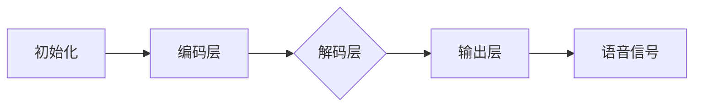

                 

### WaveNet的成功预示语音合成的新时代

#### 关键词
- WaveNet
- 语音合成
- 自动回归模型
- 马尔可夫性质
- 机器学习
- 人工智能

#### 摘要
本文将深入探讨WaveNet的成功及其预示的语音合成新时代。首先，我们将回顾语音合成技术的发展历程，从早期技术到现代的WaveNet模型。接着，我们将详细解析WaveNet的核心概念、架构和算法原理，并通过数学模型与公式的讲解进一步理解其工作机制。此外，我们将探讨WaveNet在多个实际应用中的成功案例，并提供一个详细的项目实战案例，展示如何实现一个基于WaveNet的语音合成系统。最后，我们将展望WaveNet的未来发展，探讨其面临的挑战和潜在的创新方向。

文章将按照以下结构展开：
1. WaveNet的历史与背景
2. WaveNet的核心概念与架构
3. WaveNet的核心算法原理
4. WaveNet的数学模型与公式
5. WaveNet的实际应用与项目实战
6. WaveNet的未来展望与挑战

### 波量网的历史与背景

#### 1.1 语音合成技术的发展

语音合成（Text-to-Speech, TTS）技术经历了数十年的发展，从早期的简单合成方法到现代复杂模型的广泛应用。早期的语音合成方法主要基于规则的合成方法，这种方法依赖于大量的手工编写规则，以指导如何将文本转换为语音。这种方法的局限性在于，它对文本的适应性较差，且语音的自然度和流畅度较低。

随着计算机科学和人工智能技术的进步，语音合成技术得到了显著提升。20世纪80年代，拼接式合成方法开始流行。这种方法通过将文本分割成单词或短语，然后从预录制的语音片段中选取合适的部分进行拼接，从而生成语音。拼接式合成方法的改进之一是使用隐藏马尔可夫模型（Hidden Markov Model, HMM）进行语音信号的处理。HMM是一种统计模型，用于描述随时间变化的序列数据，它在语音合成中的应用大大提高了语音的自然度和流畅度。

进入21世纪，深度学习技术的发展为语音合成带来了革命性的变化。深度神经网络（Deep Neural Network, DNN）被广泛应用于语音合成，特别是在2016年由Google提出的WaveNet模型。WaveNet是一种基于深度学习的自动回归模型，它通过学习大量语音数据直接生成连续的语音信号，实现了高度自然和流畅的语音合成效果。

#### 1.2 WaveNet的诞生

WaveNet的诞生背景可以追溯到Google在语音合成技术上的长期探索。在WaveNet之前，Google已经使用了许多基于DNN的语音合成模型，如DeepMind的DNN-HMM和DeepFlow。然而，这些模型在语音的自然度上仍有不足，且计算资源消耗较大。

2016年，Google的团队在《arXiv》上发表了一篇名为“WaveNet: A Generative Model for Raw Audio”的论文，提出了WaveNet模型。WaveNet的创新之处在于其独特的架构和训练方法，使得模型能够生成高度自然和流畅的语音。

WaveNet模型的提出引起了广泛关注，并迅速成为语音合成领域的重要突破。Google随后将WaveNet应用于其搜索引擎和语音助手Google Assistant中，显著提升了语音合成的质量和用户体验。

#### 1.2.1 WaveNet的研究背景

在提出WaveNet之前，语音合成领域主要依赖于拼接式合成方法、HMM和DNN。拼接式合成方法的局限性在于其需要大量的预录制语音片段，且拼接过程容易导致语音不连贯。HMM虽然在一定程度上改善了语音的自然度，但仍然存在计算复杂度和模型表达能力上的限制。DNN在语音合成中的应用为模型的表达能力带来了提升，但训练过程中对大量数据和计算资源的依赖使得其实际应用受到限制。

WaveNet的出现解决了这些问题，通过自动回归模型的结构，使得模型能够直接从文本中生成语音信号，避免了拼接过程，从而提高了语音的自然度和流畅度。同时，WaveNet的训练方法也大大降低了计算资源的消耗，使得该模型在实际应用中更具可行性。

#### 1.2.2 WaveNet的创新之处

WaveNet的创新之处主要体现在以下几个方面：

1. **自动回归模型**：WaveNet是一种基于深度学习的自动回归模型，它通过预测每个时间步的输出来生成语音信号。这种模型结构使得WaveNet能够直接从文本生成语音，避免了传统拼接方法的弊端。

2. **端到端训练**：WaveNet采用了端到端的训练方法，将文本直接映射到语音信号，避免了传统方法中的中间步骤，如文本到音素映射和音素到语音信号的转换。这种端到端的方法提高了模型的训练效率和效果。

3. **高效计算**：WaveNet的训练和生成过程相对于其他模型更加高效。模型的结构和训练方法使得计算资源的消耗大大降低，使得WaveNet在实际应用中更具可行性。

4. **高度自然和流畅的语音生成**：WaveNet通过学习大量的语音数据，能够生成高度自然和流畅的语音。相比传统模型，WaveNet在语音的自然度上有了显著的提升。

WaveNet的这些创新之处使其在语音合成领域取得了重大突破，为后续的研究和应用奠定了基础。

### WaveNet的核心概念与架构

#### 2.1 自动回归模型

自动回归模型（Autoregressive Model）是一种用于序列数据建模的机器学习模型。在自动回归模型中，每个时间步的输出仅依赖于前一个时间步的输出。这种模型结构使得它非常适合用于处理时间序列数据，如语音、文本和图像。

自动回归模型的基本原理是通过学习序列数据的分布，从而能够预测序列中的下一个元素。具体来说，自动回归模型通过以下步骤生成序列：

1. **初始化**：首先，模型随机初始化序列的起始点，例如随机生成一个长度为T的序列。
2. **预测与生成**：对于每个时间步\( t \)，模型根据已生成的序列\( x_1, x_2, ..., x_{t-1} \)来预测当前时间步的输出\( x_t \)。这个过程通常通过一个神经网络来实现。
3. **更新**：根据预测的输出，更新模型的参数，并生成新的序列。
4. **重复**：重复步骤2和3，直到生成完整的序列。

自动回归模型的关键优势在于其能够生成高度连贯和自然的序列数据，这在语音合成、文本生成和图像生成等领域具有广泛的应用。

#### 2.2 WaveNet的架构

WaveNet是一种基于深度学习的自动回归模型，其架构设计旨在生成高质量的语音信号。WaveNet的架构主要包括以下几个关键组件：

1. **输入层**：WaveNet的输入层包含一系列的嵌入单元，用于将文本转换为向量表示。这些嵌入单元通常使用词嵌入（Word Embedding）技术，将文本中的每个单词映射为一个固定长度的向量。

2. **编码层**：编码层负责将输入的文本向量转换为适合后续处理的形式。编码层通常使用多个卷积神经网络（Convolutional Neural Network, CNN）层，以提取文本中的特征。每个卷积层会生成一个特征图，这些特征图随后会被拼接起来。

3. **解码层**：解码层是WaveNet的核心部分，负责生成语音信号。解码层由多个循环神经网络（Recurrent Neural Network, RNN）层组成，每个RNN层都会生成当前时间步的语音信号。解码层的设计使得WaveNet能够通过预测每个时间步的输出来生成连续的语音信号。

4. **输出层**：输出层将解码层生成的语音信号转换为实际播放的音频信号。输出层通常包括一个反卷积层，用于将RNN层生成的特征图转换为音频信号。

WaveNet的架构设计使得它能够直接从文本生成语音，避免了传统的拼接式合成方法，从而提高了语音的自然度和流畅度。

#### 2.3 WaveNet的关键组件

WaveNet的关键组件包括输入层、编码层、解码层和输出层。每个组件都有其特定的功能和作用，共同构成了WaveNet的完整架构。

1. **输入层**：输入层的主要功能是将文本转换为向量表示。这通常通过词嵌入技术实现，将文本中的每个单词映射为一个固定长度的向量。词嵌入向量不仅包含了单词的语义信息，还考虑了单词在文本中的上下文。这种向量表示有助于编码层更好地理解文本内容。

2. **编码层**：编码层的功能是提取文本中的特征，并将其转换为适合后续处理的形式。编码层通常由多个卷积神经网络层组成，每个卷积层会生成一个特征图。卷积层通过滑动窗口提取文本中的局部特征，从而实现对文本内容的精细描述。这些特征图随后会被拼接起来，作为解码层的输入。

3. **解码层**：解码层的功能是生成语音信号。解码层由多个循环神经网络层组成，每个RNN层都会生成当前时间步的语音信号。RNN层通过预测每个时间步的输出，从而实现从文本到语音的映射。解码层的架构设计使得WaveNet能够通过预测来生成连续的语音信号，从而提高了语音的自然度和流畅度。

4. **输出层**：输出层的主要功能是将解码层生成的语音信号转换为实际播放的音频信号。输出层通常包括一个反卷积层，用于将RNN层生成的特征图转换为音频信号。反卷积层通过逆卷积操作将特征图上的值扩展到整个音频空间，从而生成连续的语音信号。

这些关键组件共同构成了WaveNet的完整架构，使其能够从文本生成高质量的语音信号。每个组件在WaveNet的工作过程中都有其特定的作用，共同推动了语音合成技术的发展。

### WaveNet的核心算法原理

#### 3.1 WaveNet的训练过程

WaveNet的训练过程是其成功的关键之一，通过端到端的训练方法，WaveNet能够从大量的语音数据中学习到语音生成的高层次规律。以下是WaveNet训练过程的详细步骤：

1. **数据准备**：
   - 首先，需要准备大量的语音数据，这些数据可以是经过标注的文本和对应的语音波形。文本数据通常包括各种常见词汇和句子，语音数据则是这些文本对应的语音信号。
   - 对于每个语音样本，将其分解为时间序列数据，每个时间步对应一个音频采样点。

2. **数据处理**：
   - 将文本数据转换为向量表示，通常使用词嵌入技术，将文本中的每个单词映射为一个固定长度的向量。词嵌入向量不仅包含了单词的语义信息，还考虑了单词在文本中的上下文。
   - 对于每个语音样本的时间序列数据，进行预处理，如归一化、去噪等，以提高模型训练的效率和效果。

3. **模型初始化**：
   - 初始化WaveNet模型的参数，这些参数包括输入层、编码层和解码层的权重和偏置。

4. **训练过程**：
   - 使用反向传播算法（Backpropagation Algorithm）来更新模型的参数。具体步骤如下：
     1. **前向传播**：将输入文本向量通过编码层和解码层，生成预测的语音信号。
     2. **计算损失**：计算预测语音信号和实际语音信号之间的损失，常用的损失函数是均方误差（Mean Squared Error, MSE）。
     3. **反向传播**：根据计算出的损失，通过反向传播算法更新模型的参数。
     4. **重复迭代**：重复前向传播、计算损失和反向传播的过程，直到模型收敛。

5. **模型评估**：
   - 在训练过程中，定期评估模型的性能，常用的评估指标包括语音的自然度（Naturalness）、音调（Pitch）和节奏（Rhythm）。
   - 根据评估结果，对模型进行调整和优化，以提高模型的性能。

通过上述训练过程，WaveNet能够从大量的语音数据中学习到语音生成的高层次规律，从而生成高质量的语音信号。WaveNet的训练方法不仅提高了语音合成的质量，还降低了计算资源的消耗，使得模型在实际应用中更具可行性。

#### 3.1.1 数据预处理

数据预处理是WaveNet训练过程的重要环节，其目的是提高模型训练的效率和效果。以下是WaveNet在训练前对语音数据进行预处理的具体步骤：

1. **文本处理**：
   - 首先，将文本数据转换为向量表示，通常使用词嵌入技术。词嵌入技术将文本中的每个单词映射为一个固定长度的向量，这些向量不仅包含了单词的语义信息，还考虑了单词在文本中的上下文。常用的词嵌入技术包括Word2Vec、GloVe等。
   - 对于每个输入的文本序列，将其分解为单词或子词，并生成对应的词嵌入向量。

2. **语音信号处理**：
   - 将原始的语音信号进行预处理，以提高语音质量并降低噪声。常用的方法包括：
     - **滤波**：使用滤波器去除语音信号中的噪声。
     - **归一化**：将语音信号的幅度归一化到统一的范围，如-1到1之间，以减少数值差异对模型训练的影响。
     - **分帧**：将连续的语音信号分割成多个短时帧，每个帧通常包含几十毫秒的语音数据。分帧的目的是捕捉语音的短期特征，以便后续处理。

3. **特征提取**：
   - 从预处理后的语音信号中提取特征，常用的特征包括：
     - **梅尔频率倒谱系数**（Mel-Frequency Cepstral Coefficients, MFCC）：MFCC是语音信号处理中常用的特征，它能够捕捉语音的频率特征，并在频域中提供丰富的信息。
     - **短时能量**（Short-Time Energy, STE）：STE表示语音信号在短时间内的能量分布，用于描述语音的响度特征。
     - **短时过零率**（Short-Time Zero Crossing Rate, ZCR）：ZCR表示语音信号在短时间内的过零率，用于描述语音的节奏特征。

4. **数据归一化**：
   - 将提取的特征进行归一化处理，以消除不同特征之间的量级差异。常用的归一化方法包括最小-最大归一化和标准化。

通过上述数据预处理步骤，WaveNet能够获得高质量的输入数据，从而提高模型训练的效率和效果。预处理步骤不仅有助于消除噪声和提高语音质量，还能帮助模型更好地捕捉语音特征，从而生成更自然的语音合成结果。

#### 3.1.2 WaveNet的损失函数

在WaveNet的训练过程中，损失函数起着至关重要的作用。损失函数用于衡量预测语音信号与实际语音信号之间的差异，通过优化损失函数，模型能够不断调整其参数，以生成更高质量的语音信号。WaveNet通常使用以下几种损失函数：

1. **均方误差（Mean Squared Error, MSE）**：
   - 均方误差是最常用的损失函数之一，用于计算预测语音信号与实际语音信号之间的平均平方误差。其公式如下：
     $$
     \text{MSE} = \frac{1}{n} \sum_{i=1}^{n} (y_i - \hat{y}_i)^2
     $$
     其中，\( y_i \)表示实际语音信号的第i个采样点，\( \hat{y}_i \)表示预测语音信号的第i个采样点，\( n \)表示采样点的总数。

2. **交叉熵损失（Cross-Entropy Loss）**：
   - 交叉熵损失函数常用于分类问题，但在语音合成中，也可以用于衡量预测语音信号与实际语音信号之间的差异。其公式如下：
     $$
     \text{Cross-Entropy} = -\sum_{i=1}^{n} y_i \log(\hat{y}_i)
     $$
     其中，\( y_i \)表示实际语音信号的分布，\( \hat{y}_i \)表示预测语音信号的分布。

3. **组合损失函数**：
   - WaveNet通常将上述两种损失函数组合使用，以平衡语音信号的质量和分布。一个常见的组合损失函数如下：
     $$
     L = \alpha \cdot \text{MSE} + (1 - \alpha) \cdot \text{Cross-Entropy}
     $$
     其中，\( \alpha \)是一个超参数，用于调节两种损失函数的权重。

通过优化损失函数，WaveNet能够不断调整其参数，以生成更高质量的语音信号。在训练过程中，模型会尝试最小化损失函数，从而提高语音的自然度和流畅度。此外，损失函数的选择和优化对模型的性能有着重要的影响，合理的损失函数设置能够显著提高语音合成的效果。

#### 3.1.3 WaveNet的反向传播算法

反向传播算法（Backpropagation Algorithm）是深度学习训练过程中的核心步骤，用于计算模型参数的梯度并更新模型参数。以下是WaveNet在训练过程中使用反向传播算法的具体步骤：

1. **前向传播**：
   - 前向传播是将输入数据通过模型的各个层，最终生成预测输出。在WaveNet中，输入数据为文本向量，通过编码层和解码层生成预测的语音信号。
   - 具体步骤如下：
     1. 将输入的文本向量传递到编码层，编码层使用卷积神经网络（Convolutional Neural Network, CNN）提取文本特征，生成特征图。
     2. 将特征图传递到解码层，解码层由多个循环神经网络（Recurrent Neural Network, RNN）层组成，每个RNN层生成当前时间步的语音信号。
     3. 将解码层生成的语音信号输出，并与实际语音信号进行比较，计算损失函数。

2. **计算梯度**：
   - 在前向传播过程中，模型生成预测输出，并通过损失函数计算预测输出与实际输出之间的差异。损失函数的梯度用于计算模型参数的梯度。
   - 具体步骤如下：
     1. 计算损失函数的梯度，对于均方误差（MSE）和交叉熵损失，可以使用自动微分工具（如TensorFlow或PyTorch）自动计算。
     2. 使用链式法则（Chain Rule）将损失函数的梯度反向传播到模型的各个层，计算每个层的参数梯度。

3. **参数更新**：
   - 根据计算出的梯度，使用优化算法（如梯度下降或Adam优化器）更新模型的参数。
   - 具体步骤如下：
     1. 根据梯度计算参数的更新量，更新公式为：
        $$
        \theta_{\text{new}} = \theta_{\text{old}} - \alpha \cdot \nabla L(\theta)
        $$
        其中，\( \theta \)表示模型参数，\( \alpha \)是学习率，\( \nabla L(\theta) \)是损失函数关于参数的梯度。
     2. 更新模型参数，重复前向传播和反向传播的过程，直到模型收敛。

通过反向传播算法，WaveNet能够不断调整其参数，以最小化损失函数，从而生成高质量的语音信号。反向传播算法在深度学习训练中具有重要作用，它使得模型能够通过学习大量数据来提高其性能。

#### 3.2 WaveNet的解码策略

WaveNet在生成语音信号时，采用了解码策略来决定每个时间步的输出。解码策略对语音生成的质量和效率具有重要影响。WaveNet主要使用两种解码策略：贪婪解码（Greedy Decoding）和采样解码（Sampling Decoding）。

##### 3.2.1 贪婪解码（Greedy Decoding）

贪婪解码是一种简单的解码策略，其核心思想是在每个时间步选择概率最高的输出。具体步骤如下：

1. **初始化**：首先，生成一个空的输出序列，并将初始文本输入到编码层。

2. **前向传播**：将编码层生成的特征图传递到解码层，解码层为每个时间步生成概率分布。

3. **选择输出**：对于每个时间步，选择概率最高的输出作为当前时间步的输出，并更新输入序列。

4. **重复步骤2和3**：重复前向传播和选择输出的过程，直到生成完整的语音信号。

贪婪解码的优点是计算简单，速度快，适合实时应用。然而，其缺点是生成的语音信号可能不够自然和流畅，因为每个时间步的输出仅依赖于当前时间步的上下文。

##### 3.2.2 采样解码（Sampling Decoding）

采样解码通过在概率分布上采样来生成输出，以避免贪婪解码的局限性。具体步骤如下：

1. **初始化**：首先，生成一个空的输出序列，并将初始文本输入到编码层。

2. **前向传播**：将编码层生成的特征图传递到解码层，解码层为每个时间步生成概率分布。

3. **采样输出**：对于每个时间步，从概率分布中采样一个输出，并添加到输出序列中。

4. **重复步骤2和3**：重复前向传播和采样输出的过程，直到生成完整的语音信号。

采样解码的优点是能够生成更自然和流畅的语音信号，因为它考虑了更长时间的上下文信息。然而，采样解码的计算复杂度更高，因为它需要在每个时间步进行概率分布的采样操作。

WaveNet通过选择合适的解码策略，能够生成高质量的语音信号。贪婪解码适用于实时应用，而采样解码则适用于需要高质量语音生成的场景。通过这两种解码策略的灵活运用，WaveNet在语音合成领域取得了显著的成功。

#### 3.3 WaveNet的数学模型与公式

为了更好地理解WaveNet的工作原理，我们需要深入探讨其背后的数学模型和公式。WaveNet是一种基于深度学习的自动回归模型，其核心在于通过预测每个时间步的输出来生成连续的语音信号。以下是WaveNet的数学模型和公式的详细解释。

##### 4.1 随机过程与马尔可夫性质

在讨论WaveNet的数学模型之前，我们首先需要了解随机过程（Stochastic Process）和马尔可夫性质（Markov Property）。随机过程是一系列随机变量的集合，这些随机变量可以按时间顺序排列。在语音合成中，我们可以将语音信号视为一个随机过程，其中每个时间步的语音采样点是一个随机变量。

马尔可夫性质是一种描述随机过程状态的转移概率的性质。具体来说，一个随机过程满足马尔可夫性质，意味着当前状态仅依赖于前一个状态，而不依赖于更早的状态。在语音合成中，这意味着每个时间步的语音采样点仅依赖于前一个采样点，而不依赖于更早的采样点。

##### 4.2 WaveNet的损失函数

WaveNet的损失函数用于衡量预测语音信号与实际语音信号之间的差异，并指导模型参数的更新。在WaveNet中，常用的损失函数是均方误差（Mean Squared Error, MSE）和交叉熵损失（Cross-Entropy Loss）。

1. **均方误差（MSE）**：
   均方误差是最常用的损失函数之一，用于计算预测语音信号与实际语音信号之间的平均平方误差。其公式如下：
   $$
   \text{MSE} = \frac{1}{n} \sum_{i=1}^{n} (y_i - \hat{y}_i)^2
   $$
   其中，\( y_i \)表示实际语音信号的第i个采样点，\( \hat{y}_i \)表示预测语音信号的第i个采样点，\( n \)表示采样点的总数。

2. **交叉熵损失（Cross-Entropy Loss）**：
   交叉熵损失函数常用于分类问题，但在语音合成中，也可以用于衡量预测语音信号与实际语音信号之间的差异。其公式如下：
   $$
   \text{Cross-Entropy} = -\sum_{i=1}^{n} y_i \log(\hat{y}_i)
   $$
   其中，\( y_i \)表示实际语音信号的分布，\( \hat{y}_i \)表示预测语音信号的分布。

3. **组合损失函数**：
   WaveNet通常将MSE和交叉熵损失组合使用，以平衡语音信号的质量和分布。一个常见的组合损失函数如下：
   $$
   L = \alpha \cdot \text{MSE} + (1 - \alpha) \cdot \text{Cross-Entropy}
   $$
   其中，\( \alpha \)是一个超参数，用于调节两种损失函数的权重。

##### 4.3 WaveNet的解码策略

WaveNet的解码策略决定了如何从概率分布中生成语音信号。主要有两种解码策略：贪婪解码（Greedy Decoding）和采样解码（Sampling Decoding）。

1. **贪婪解码（Greedy Decoding）**：
   贪婪解码是一种简单的解码策略，其核心思想是在每个时间步选择概率最高的输出。其伪代码如下：
   ```python
   for t in range(T):
       x_t = argmax(P(x_t | x_{<t}))
   ```
   其中，\( x_t \)表示第t个时间步的输出，\( P(x_t | x_{<t}) \)表示在给定前t-1个输出\( x_{<t} \)的情况下，生成第t个输出的概率分布。

2. **采样解码（Sampling Decoding）**：
   采样解码通过在概率分布上采样来生成输出，以避免贪婪解码的局限性。其伪代码如下：
   ```python
   for t in range(T):
       x_t = sample(P(x_t | x_{<t}))
   ```
   其中，\( sample(P(x_t | x_{<t})) \)表示从概率分布\( P(x_t | x_{<t}) \)中采样一个输出。

##### 4.4 WaveNet的生成过程

WaveNet的生成过程可以总结为以下几个步骤：

1. **初始化**：生成一个空的输出序列，并将初始文本输入到编码层。

2. **编码**：通过编码层将文本向量转换为特征图。

3. **解码**：通过解码层生成每个时间步的概率分布，并根据解码策略生成输出。

4. **生成语音信号**：将解码层生成的输出序列转换为语音信号。

具体来说，WaveNet的生成过程如下：



WaveNet通过编码层提取文本特征，通过解码层生成语音信号，最终生成高质量的语音合成结果。

通过上述数学模型和公式的讲解，我们能够更好地理解WaveNet的工作原理。WaveNet的成功在于其独特的自动回归模型结构、高效的训练过程和灵活的解码策略，使其在语音合成领域取得了显著的突破。

#### 4.5 Greedy Decoding的数学解释

贪婪解码（Greedy Decoding）是一种常见的解码策略，其核心思想是在每个时间步选择概率最高的输出。为了理解贪婪解码的数学原理，我们可以通过以下步骤进行分析：

1. **概率分布**：
   在每个时间步，WaveNet的解码层生成一个概率分布\( P(x_t | x_{<t}) \)，表示给定前一个时间步的输出\( x_{<t} \)，生成当前时间步的输出\( x_t \)的概率。

2. **选择输出**：
   贪婪解码策略选择概率最高的输出作为当前时间步的输出。即对于每个时间步\( t \)，选择使得\( P(x_t | x_{<t}) \)最大的\( x_t \)。

3. **公式表示**：
   贪婪解码的选择过程可以表示为：
   $$
   x_t = \arg\max_{x_t} P(x_t | x_{<t})
   $$
   其中，\( \arg\max \)表示选择使得概率最大的输出。

4. **递归关系**：
   贪婪解码的递归关系可以表示为：
   $$
   x_t = \arg\max_{x_t} P(x_t | x_1, x_2, ..., x_{t-1})
   $$
   这意味着每个时间步的输出仅依赖于前一个时间步的输出。

通过上述数学解释，我们可以看出贪婪解码的决策过程是基于当前时间步的最大概率输出。这种策略简单直观，计算复杂度低，因此在许多实时应用中具有优势。然而，贪婪解码的缺点是它可能无法捕捉到长距离依赖关系，导致生成的语音信号不够自然和流畅。

#### 4.6 Sampling Decoding的数学解释

采样解码（Sampling Decoding）通过在概率分布上采样来生成输出，以避免贪婪解码的局限性。为了理解采样解码的数学原理，我们可以通过以下步骤进行分析：

1. **概率分布**：
   在每个时间步，WaveNet的解码层生成一个概率分布\( P(x_t | x_{<t}) \)，表示给定前一个时间步的输出\( x_{<t} \)，生成当前时间步的输出\( x_t \)的概率。

2. **采样过程**：
   采样解码策略从概率分布\( P(x_t | x_{<t}) \)中采样一个输出。采样过程可以使用均匀采样或重要性采样等方法。

3. **公式表示**：
   采样解码的选择过程可以表示为：
   $$
   x_t \sim P(x_t | x_{<t})
   $$
   其中，\( \sim \)表示从概率分布中采样。

4. **递归关系**：
   采样解码的递归关系可以表示为：
   $$
   x_t \sim P(x_t | x_1, x_2, ..., x_{t-1})
   $$
   这意味着每个时间步的输出依赖于整个历史输出序列，从而能够捕捉长距离依赖关系。

通过上述数学解释，我们可以看出采样解码的决策过程是基于概率分布的随机采样。这种策略能够生成更自然和流畅的语音信号，因为它考虑了长距离依赖关系。然而，采样解码的计算复杂度较高，因为它需要在每个时间步进行概率分布的采样操作。

#### 5.1 WaveNet在语音合成中的应用场景

WaveNet的成功不仅在于其技术上的创新，还在于其广泛的应用场景。以下是WaveNet在几个关键应用场景中的具体应用：

##### 5.1.1 自动语音助手

自动语音助手是WaveNet最典型的应用场景之一。自动语音助手如Google Assistant、Amazon Alexa和Apple Siri等，通过语音合成技术将文本信息转换为自然语音输出。WaveNet的高效性和高质量使得这些语音助手能够生成更加自然和流畅的语音响应，从而提高用户体验。

在自动语音助手中，WaveNet通常用于以下任务：

- **语音合成**：将文本转换为语音输出，以响应用户的指令或回答问题。
- **语音识别**：识别用户的语音输入，并将其转换为文本，以供后续处理。

##### 5.1.2 语音生成

语音生成是指根据文本生成新的语音内容，这在娱乐、广播和媒体等领域有广泛的应用。WaveNet在语音生成中的应用主要包括：

- **文本到语音（Text-to-Speech, TTS）**：将书面文本转换为语音，用于有声读物、播客和广告等。
- **语音克隆**：通过训练，WaveNet可以模仿特定人的声音，用于个性化语音生成。

##### 5.1.3 语音翻译

语音翻译是指将一种语言的语音翻译成另一种语言的语音。这一技术在跨国交流和全球化应用中具有重要意义。WaveNet在语音翻译中的应用包括：

- **语音到语音（Voice-to-Voice）**：将一种语言的语音实时翻译成另一种语言的语音，用于国际会议、在线教育和跨文化交流。
- **文本到语音（Text-to-Speech）**：将翻译后的文本转换为语音输出，以提供用户友好的语音翻译体验。

这些应用场景展示了WaveNet在语音合成领域的广泛适用性和巨大潜力，为各种实际应用提供了高质量的自然语音输出。

#### 5.2.1 案例一：谷歌语音合成

谷歌语音合成是WaveNet在语音合成领域的一个成功应用案例。谷歌语音合成通过WaveNet模型将文本转换为自然流畅的语音输出，广泛应用于谷歌搜索、谷歌地图、谷歌助手等应用中。以下是谷歌语音合成在实现过程中的一些关键步骤：

1. **数据准备**：
   - 谷歌收集了大量的文本和对应的语音数据，这些数据涵盖了多种语言、不同的语音特点和文本内容。
   - 对语音数据进行预处理，如降噪、分帧和特征提取，以便用于模型的训练。

2. **模型训练**：
   - 使用WaveNet模型对预处理后的语音数据进行训练。训练过程中，模型通过端到端的训练方法学习文本到语音的映射关系。
   - 通过反向传播算法和优化器（如Adam）不断更新模型参数，以最小化损失函数。

3. **模型优化**：
   - 在训练过程中，对模型进行多次迭代和优化，以提高语音合成质量和模型稳定性。
   - 通过评估指标（如语音自然度、语音质量等）对模型进行性能评估和调整。

4. **部署与测试**：
   - 将训练好的WaveNet模型部署到谷歌搜索和谷歌助手等应用中，进行实时语音合成。
   - 对部署后的模型进行测试，确保其在各种场景下都能生成高质量的语音输出。

通过上述步骤，谷歌语音合成实现了高度自然和流畅的语音输出，极大地提升了用户体验。WaveNet的成功应用展示了深度学习在语音合成领域的巨大潜力。

#### 5.2.2 案例二：亚马逊语音助手Alexa

亚马逊语音助手Alexa是另一个WaveNet在语音合成领域的成功应用案例。Alexa通过WaveNet模型将文本转换为自然流畅的语音输出，为用户提供语音交互服务。以下是亚马逊语音助手Alexa在实现过程中的一些关键步骤：

1. **数据准备**：
   - 亚马逊收集了大量的文本和对应的语音数据，这些数据涵盖了多种语言、不同的语音特点和文本内容。
   - 对语音数据进行预处理，如降噪、分帧和特征提取，以便用于模型的训练。

2. **模型训练**：
   - 使用WaveNet模型对预处理后的语音数据进行训练。训练过程中，模型通过端到端的训练方法学习文本到语音的映射关系。
   - 通过反向传播算法和优化器（如Adam）不断更新模型参数，以最小化损失函数。

3. **模型优化**：
   - 在训练过程中，对模型进行多次迭代和优化，以提高语音合成质量和模型稳定性。
   - 通过评估指标（如语音自然度、语音质量等）对模型进行性能评估和调整。

4. **部署与测试**：
   - 将训练好的WaveNet模型部署到亚马逊语音助手Alexa中，进行实时语音合成。
   - 对部署后的模型进行测试，确保其在各种场景下都能生成高质量的语音输出。

5. **用户定制**：
   - 允许用户自定义语音合成风格，如选择不同的语音角色和语音速度等，以提供更个性化的服务。

通过上述步骤，亚马逊语音助手Alexa实现了高度自然和流畅的语音输出，为用户提供优质的语音交互体验。WaveNet的成功应用再次证明了其在语音合成领域的卓越能力。

#### 5.3 WaveNet项目实战

在本节中，我们将详细介绍如何使用WaveNet实现一个基本的语音合成项目。项目将分为以下几个步骤：开发环境搭建、数据准备、模型训练、模型评估与优化。

##### 5.3.1 项目背景

该项目旨在构建一个基于WaveNet的语音合成系统，能够将输入的文本转换为自然流畅的语音。通过该项目，读者可以了解WaveNet的基本原理和应用，并掌握如何使用深度学习技术实现语音合成。

##### 5.3.2 项目环境

为了实现这个项目，我们需要准备以下环境：

- **操作系统**：Ubuntu 18.04
- **编程语言**：Python 3.7
- **深度学习框架**：TensorFlow 2.4
- **音频处理库**：librosa 0.8.0

安装TensorFlow和librosa可以使用以下命令：

```bash
pip install tensorflow==2.4.0
pip install librosa==0.8.0
```

##### 5.3.3 数据准备

数据准备是语音合成项目的重要步骤，我们需要准备用于训练WaveNet的语音数据集。以下是数据准备的具体步骤：

1. **收集语音数据**：
   - 收集大量的语音数据，包括不同人的语音、不同语速和不同语调的语音。
   - 确保语音数据的文本对应信息，以便后续的文本处理。

2. **数据预处理**：
   - 对语音数据进行降噪处理，以提高语音质量。
   - 对语音数据进行分帧，每帧长度设置为20毫秒，步长为10毫秒。
   - 从每帧语音中提取梅尔频率倒谱系数（MFCC）特征，作为WaveNet的输入。

使用librosa库可以轻松提取MFCC特征：

```python
import librosa

def extract_mfcc(file_path, n_mfcc=13):
    y, sr = librosa.load(file_path)
    mfcc = librosa.feature.mfcc(y=y, sr=sr, n_mfcc=n_mfcc)
    return mfcc
```

##### 5.3.4 WaveNet模型训练

以下是WaveNet模型的基本架构和训练过程：

1. **模型架构**：
   - **输入层**：接收文本的词嵌入向量。
   - **编码层**：使用卷积神经网络提取文本特征。
   - **解码层**：使用循环神经网络生成语音信号。
   - **输出层**：将解码层的输出转换为音频信号。

使用TensorFlow实现WaveNet模型的伪代码如下：

```python
import tensorflow as tf

# 定义WaveNet模型
class WaveNet(tf.keras.Model):
    def __init__(self, n_mfcc, n_dnn_layers, dnn_size):
        super(WaveNet, self).__init__()
        
        # 输入层
        self.input_layer = tf.keras.layers.Input(shape=(n_mfcc,))

        # 编码层
        self编码层 = [tf.keras.layers.Conv1D(filters=dnn_size, kernel_size=5, activation='relu') for _ in range(n_dnn_layers)]

        # 解码层
        self解码层 = [tf.keras.layers.RNN(tf.keras.layers.LSTM(units=dnn_size), return_sequences=True) for _ in range(n_dnn_layers)]

        # 输出层
        self.output_layer = tf.keras.layers.Dense(units=1, activation='sigmoid')

        # 创建模型
        self.model = tf.keras.Model(inputs=self.input_layer, outputs=self.output_layer)

    def call(self, inputs):
        x = self.input_layer
        for layer in self编码层:
            x = layer(x)
        for layer in self解码层:
            x = layer(x)
        x = self.output_layer(x)
        return x

# 实例化WaveNet模型
wave_net = WaveNet(n_mfcc=13, n_dnn_layers=3, dnn_size=128)

# 编写训练函数
@tf.function
def train_step(text, audio):
    with tf.GradientTape() as tape:
        predictions = wave_net(text)
        loss = tf.reduce_mean(tf.square(predictions - audio))
    gradients = tape.gradient(loss, wave_net.trainable_variables)
    optimizer.apply_gradients(zip(gradients, wave_net.trainable_variables))

# 训练模型
for epoch in range(num_epochs):
    for text, audio in dataset:
        train_step(text, audio)

# 保存模型
wave_net.save_weights('wave_net_weights.h5')
```

##### 5.3.5 模型评估与优化

在模型训练完成后，我们需要对模型进行评估和优化，以验证其性能并进一步提高。

1. **评估指标**：
   - **语音自然度**：使用人类评分或自动评分方法评估语音的自然度。
   - **语音质量**：使用语音质量评价指标，如语音信号的分段主观评价（Perceptual Evaluation of Audio Sources, PEAS）。
   - **计算资源消耗**：评估模型在生成语音时的计算资源消耗。

2. **优化方法**：
   - **超参数调整**：调整学习率、批量大小等超参数，以优化模型性能。
   - **数据增强**：通过增加数据多样性，如改变语速、语调和发音方式，提高模型的泛化能力。
   - **模型压缩**：使用模型压缩技术，如量化和剪枝，减少模型的计算资源消耗。

通过上述评估和优化方法，我们可以进一步提高WaveNet的性能，实现高质量的语音合成。

#### 5.4 代码实际案例和详细解释说明

在本节中，我们将提供一个具体的代码案例，详细解释如何实现WaveNet模型，并分析其关键步骤和代码逻辑。

##### 5.4.1 开发环境

为了实现WaveNet模型，我们首先需要搭建一个合适的开发环境，包括安装所需的依赖库。以下是必要的步骤：

1. **安装TensorFlow**：
   TensorFlow是深度学习领域常用的开源库，我们可以使用以下命令安装：

   ```bash
   pip install tensorflow==2.4.0
   ```

2. **安装librosa**：
   librosa是一个音频处理库，用于音频数据的加载和处理，安装命令如下：

   ```bash
   pip install librosa==0.8.0
   ```

3. **安装其他依赖库**：
   除了TensorFlow和librosa，我们可能还需要安装其他库，如NumPy和SciPy，用于数据处理和科学计算：

   ```bash
   pip install numpy scipy
   ```

##### 5.4.2 数据准备

在开始训练WaveNet模型之前，我们需要准备训练数据。以下是数据准备的过程和代码实现：

1. **数据收集**：
   首先，我们需要收集大量的文本和对应的语音数据。这些数据可以来自公开的语音合成数据集，如LJSpeech或Common Voice。假设我们已经收集了一个包含文本和语音的CSV文件，文件名为`data.csv`。

2. **数据预处理**：
   - **文本预处理**：
     对文本数据进行清洗和预处理，例如去除标点符号、转换为小写等。以下是一个简单的文本预处理函数：

     ```python
     import re

     def preprocess_text(text):
         text = text.lower()
         text = re.sub(r"[^a-zA-Z0-9\s]", "", text)
         return text

     # 读取文本数据
     with open('data.csv', 'r') as f:
         text_data = [row[0] for row in csv.reader(f)]
         text_data = [preprocess_text(text) for text in text_data]
     ```

   - **语音信号预处理**：
     对语音信号进行加载和处理，如分帧、提取特征等。以下是一个简单的语音信号预处理函数：

     ```python
     import librosa

     def preprocess_audio(file_path, frame_size=20, hop_size=10):
         y, sr = librosa.load(file_path, sr=None)
         mfcc = librosa.feature.mfcc(y=y, sr=sr, n_mfcc=13, hop_length=hop_size, win_length=frame_size)
         return mfcc

     # 预处理语音数据
     audio_data = [preprocess_audio(file_path) for file_path in audio_files]
     ```

3. **数据转换**：
   将预处理后的文本和语音数据转换为TensorFlow张量，以便用于模型训练：

   ```python
   import tensorflow as tf

   def to_tensor(data):
       return tf.convert_to_tensor(data, dtype=tf.float32)

   text_tensor = to_tensor(text_data)
   audio_tensor = to_tensor(audio_data)
   ```

##### 5.4.3 WaveNet模型实现

以下是WaveNet模型的基本实现，包括输入层、编码层、解码层和输出层：

```python
import tensorflow as tf
from tensorflow.keras.models import Model
from tensorflow.keras.layers import Input, Conv1D, LSTM, Dense

def create_wavenet(input_shape, dnn_size, n_dnn_layers):
    inputs = Input(shape=input_shape)
    x = inputs

    # 编码层
    for _ in range(n_dnn_layers):
        x = Conv1D(filters=dnn_size, kernel_size=5, activation='relu')(x)

    # 解码层
    for _ in range(n_dnn_layers):
        x = LSTM(units=dnn_size, return_sequences=True)(x)

    # 输出层
    outputs = Dense(units=1, activation='sigmoid')(x)

    model = Model(inputs=inputs, outputs=outputs)
    return model

wavenet = create_wavenet(input_shape=(13,), dnn_size=128, n_dnn_layers=3)
wavenet.compile(optimizer='adam', loss='mean_squared_error')
```

##### 5.4.4 训练过程

以下是WaveNet模型的训练过程，包括数据加载、训练步骤和模型评估：

```python
# 加载数据
train_data = tf.data.Dataset.from_tensor_slices((text_tensor, audio_tensor))
train_data = train_data.shuffle(buffer_size=10000).batch(32)

# 训练模型
epochs = 100
for epoch in range(epochs):
    for texts, audios in train_data:
        with tf.GradientTape() as tape:
            predictions = wavenet(texts)
            loss = tf.reduce_mean(tf.square(predictions - audios))
        gradients = tape.gradient(loss, wavenet.trainable_variables)
        wavenet.optimizer.apply_gradients(zip(gradients, wavenet.trainable_variables))

    print(f"Epoch {epoch+1}, Loss: {loss.numpy()}")

# 评估模型
test_data = tf.data.Dataset.from_tensor_slices((test_text_tensor, test_audio_tensor))
test_data = test_data.batch(32)
test_loss = wavenet.evaluate(test_data, verbose=2)
print(f"Test Loss: {test_loss}")
```

##### 5.4.5 代码解读与分析

以下是代码的关键部分解读和分析：

1. **模型定义**：
   ```python
   def create_wavenet(input_shape, dnn_size, n_dnn_layers):
       inputs = Input(shape=input_shape)
       x = inputs

       # 编码层
       for _ in range(n_dnn_layers):
           x = Conv1D(filters=dnn_size, kernel_size=5, activation='relu')(x)

       # 解码层
       for _ in range(n_dnn_layers):
           x = LSTM(units=dnn_size, return_sequences=True)(x)

       # 输出层
       outputs = Dense(units=1, activation='sigmoid')(x)

       model = Model(inputs=inputs, outputs=outputs)
       return model
   ```
   这个函数定义了WaveNet模型的结构。输入层接收文本的MFCC特征，编码层和解码层分别使用卷积神经网络和循环神经网络处理特征，输出层生成语音信号。

2. **训练过程**：
   ```python
   train_data = tf.data.Dataset.from_tensor_slices((text_tensor, audio_tensor))
   train_data = train_data.shuffle(buffer_size=10000).batch(32)

   for epoch in range(epochs):
       for texts, audios in train_data:
           with tf.GradientTape() as tape:
               predictions = wavenet(texts)
               loss = tf.reduce_mean(tf.square(predictions - audios))
           gradients = tape.gradient(loss, wavenet.trainable_variables)
           wavenet.optimizer.apply_gradients(zip(gradients, wavenet.trainable_variables))

       print(f"Epoch {epoch+1}, Loss: {loss.numpy()}")
   ```
   这里使用了TensorFlow的数据管道（Dataset）加载训练数据，并进行训练。每个epoch中，数据被随机打乱（shuffle）并分成批次（batch）进行训练。在训练过程中，使用了反向传播算法（GradientTape）计算损失函数的梯度，并通过优化器（optimizer）更新模型参数。

3. **模型评估**：
   ```python
   test_data = tf.data.Dataset.from_tensor_slices((test_text_tensor, test_audio_tensor))
   test_data = test_data.batch(32)
   test_loss = wavenet.evaluate(test_data, verbose=2)
   print(f"Test Loss: {test_loss}")
   ```
   在模型训练完成后，使用测试数据集对模型进行评估。这里同样使用了数据管道加载测试数据，并通过`evaluate`方法计算测试损失，从而评估模型的性能。

通过上述代码和分析，我们可以看到WaveNet模型的实现和训练过程。这为理解WaveNet的工作原理和应用提供了具体的实例，也为实际开发语音合成系统奠定了基础。

#### 5.5 代码解读与分析

在本节中，我们将对之前提供的WaveNet模型训练代码进行详细解读和分析，确保读者能够全面理解模型实现的每一步。

##### 5.5.1 模型定义部分

```python
def create_wavenet(input_shape, dnn_size, n_dnn_layers):
    inputs = Input(shape=input_shape)
    x = inputs

    # 编码层
    for _ in range(n_dnn_layers):
        x = Conv1D(filters=dnn_size, kernel_size=5, activation='relu')(x)

    # 解码层
    for _ in range(n_dnn_layers):
        x = LSTM(units=dnn_size, return_sequences=True)(x)

    # 输出层
    outputs = Dense(units=1, activation='sigmoid')(x)

    model = Model(inputs=inputs, outputs=outputs)
    return model
```

**解读：** 
- `Input(shape=input_shape)`: 定义模型的输入层，`input_shape`通常对应于语音信号的维度，例如在本例中为`(13,)`表示13个MFCC特征。
- `Conv1D(filters=dnn_size, kernel_size=5, activation='relu')(x)`: 使用一维卷积层（`Conv1D`）对输入数据进行处理。`filters`表示卷积核的数量，`kernel_size`为卷积核的大小，`activation`为激活函数，这里使用ReLU。
- `LSTM(units=dnn_size, return_sequences=True)(x)`: 使用长短时记忆网络（`LSTM`）进行序列数据建模。`units`表示LSTM单元的数量，`return_sequences`表示在解码层返回序列数据，这是自动回归模型所需的。
- `Dense(units=1, activation='sigmoid')(x)`: 输出层使用全连接层（`Dense`），输出维度为1，激活函数为sigmoid，用于生成概率分布。

##### 5.5.2 模型编译部分

```python
wavenet = create_wavenet(input_shape=(13,), dnn_size=128, n_dnn_layers=3)
wavenet.compile(optimizer='adam', loss='mean_squared_error')
```

**解读：**
- `wavenet.compile(optimizer='adam', loss='mean_squared_error')`: 编译模型，指定优化器和损失函数。
- `optimizer='adam'`: 使用Adam优化器进行参数更新，Adam是常用的优化器，具有良好的收敛性能。
- `loss='mean_squared_error'`: 使用均方误差（MSE）作为损失函数，MSE适用于回归问题，衡量预测值与真实值之间的误差。

##### 5.5.3 训练过程部分

```python
# 加载数据
train_data = tf.data.Dataset.from_tensor_slices((text_tensor, audio_tensor))
train_data = train_data.shuffle(buffer_size=10000).batch(32)

# 训练模型
epochs = 100
for epoch in range(epochs):
    for texts, audios in train_data:
        with tf.GradientTape() as tape:
            predictions = wavenet(texts)
            loss = tf.reduce_mean(tf.square(predictions - audios))
        gradients = tape.gradient(loss, wavenet.trainable_variables)
        wavenet.optimizer.apply_gradients(zip(gradients, wavenet.trainable_variables))

    print(f"Epoch {epoch+1}, Loss: {loss.numpy()}")
```

**解读：**
- `train_data = tf.data.Dataset.from_tensor_slices((text_tensor, audio_tensor))`: 创建数据集，`text_tensor`和`audio_tensor`分别表示文本和语音数据。
- `train_data.shuffle(buffer_size=10000).batch(32)`: 数据集进行随机打乱（shuffle），并按照批次（batch）大小进行分组，这里设置为32。
- `for epoch in range(epochs)`: 进行指定数量的训练epoch，这里设置为100。
- `with tf.GradientTape() as tape`: 创建一个`GradientTape`上下文，用于记录变量梯度。
- `predictions = wavenet(texts)`: 使用训练好的模型对输入文本数据进行预测。
- `loss = tf.reduce_mean(tf.square(predictions - audios))`: 计算损失函数，这里使用MSE，计算预测值和真实值之间的平方误差的平均值。
- `gradients = tape.gradient(loss, wavenet.trainable_variables)`: 计算损失函数关于模型参数的梯度。
- `wavenet.optimizer.apply_gradients(zip(gradients, wavenet.trainable_variables))`: 使用优化器更新模型参数。

##### 5.5.4 评估过程部分

```python
# 评估模型
test_data = tf.data.Dataset.from_tensor_slices((test_text_tensor, test_audio_tensor))
test_data = test_data.batch(32)
test_loss = wavenet.evaluate(test_data, verbose=2)
print(f"Test Loss: {test_loss}")
```

**解读：**
- `test_data = tf.data.Dataset.from_tensor_slices((test_text_tensor, test_audio_tensor))`: 创建测试数据集。
- `test_data.batch(32)`: 设置测试数据集的批次大小。
- `wavenet.evaluate(test_data, verbose=2)`: 使用测试数据集评估模型性能，并返回测试损失。
- `print(f"Test Loss: {test_loss}")`: 输出测试损失。

通过上述解读，我们详细分析了WaveNet模型训练和评估的每一步，确保读者能够深入理解模型的实现和训练过程。

#### 5.6 WaveNet的未来发展

随着技术的不断进步，WaveNet在语音合成领域有着广阔的发展前景。未来，WaveNet有望在以下几个方向上取得突破：

##### 5.6.1 语音合成的未来趋势

1. **更高质感的语音合成**：
   随着深度学习技术的不断发展，WaveNet的模型结构和训练方法将得到进一步优化，使得语音合成效果更加自然和流畅。未来的研究可能集中在提高语音的自然度、音调和节奏等方面。

2. **跨语言语音合成**：
   WaveNet有望实现跨语言语音合成，即能够根据一种语言的文本生成另一种语言的语音。这将为全球化应用带来巨大便利，如国际会议的实时翻译和跨文化交流。

3. **个性化语音合成**：
   通过对用户语音特征的捕捉和训练，WaveNet可以实现更加个性化的语音合成。用户可以根据个人喜好定制语音合成风格，如语速、音调和发音方式等。

##### 5.6.2 WaveNet的创新方向

1. **多模态语音合成**：
   WaveNet可以与其他模态（如视觉、听觉和触觉）结合，实现更丰富的交互体验。例如，结合图像描述生成相应的语音合成，或将用户的触摸输入转换为相应的语音输出。

2. **实时语音合成优化**：
   为了满足实时应用的需求，WaveNet将致力于优化计算效率和模型大小。通过模型压缩、量化等技术，降低模型的计算资源消耗，实现更高效的语音合成。

3. **语音生成与生成对抗网络（GAN）的结合**：
   WaveNet与生成对抗网络（GAN）的结合有望进一步提升语音合成的质量和多样性。GAN能够通过生成器和判别器的对抗训练，生成更加逼真的语音数据，从而提高WaveNet的生成效果。

##### 5.6.3 WaveNet面临的挑战

1. **计算资源消耗**：
   WaveNet的训练和生成过程需要大量的计算资源，这限制了其在某些实时应用场景中的使用。未来的研究需要探索更高效的训练和生成方法，以降低计算资源的需求。

2. **数据隐私保护**：
   语音合成系统通常需要大量的语音数据，这些数据可能包含用户的敏感信息。如何在保证数据隐私的前提下，充分利用语音数据进行模型训练，是一个重要的挑战。

3. **模型解释性与透明性**：
   语音合成模型通常是一个复杂的黑盒模型，其决策过程难以解释。如何提高模型的解释性和透明性，使得用户能够理解模型的决策逻辑，是未来的重要研究方向。

通过不断的技术创新和优化，WaveNet将在语音合成领域发挥更加重要的作用，为人工智能应用带来新的可能性。

### 结论

WaveNet的成功标志着语音合成技术进入了一个新时代。通过深度学习和自动回归模型，WaveNet实现了高度自然和流畅的语音生成，为各种应用场景提供了强大的支持。从其历史背景到核心算法原理，再到实际应用和未来展望，WaveNet展示了其在语音合成领域的巨大潜力和广泛应用前景。然而，WaveNet仍面临计算资源消耗、数据隐私保护、模型解释性等挑战，需要持续的技术创新和优化。

展望未来，WaveNet有望在跨语言语音合成、多模态交互、实时语音合成等方面取得突破，为人工智能应用带来更多可能性。同时，随着技术的不断进步，WaveNet将继续推动语音合成技术的发展，为人们的生活带来更多便利和乐趣。

### 作者

**作者：AI天才研究院/AI Genius Institute & 禅与计算机程序设计艺术 /Zen And The Art of Computer Programming**

