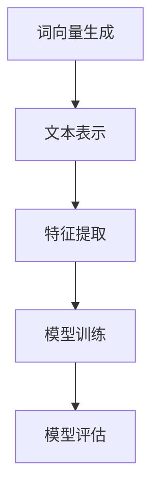
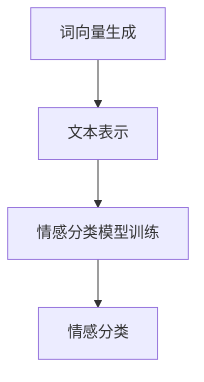
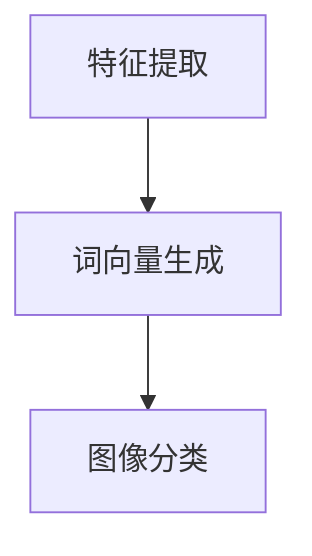
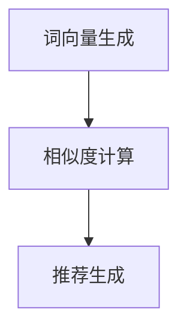
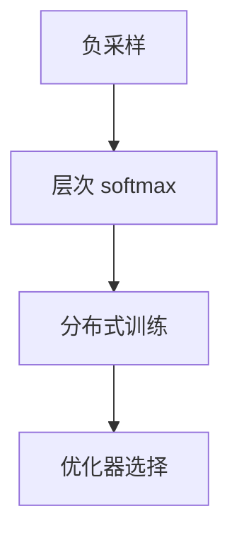
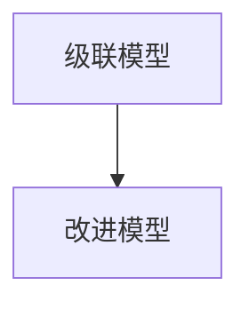

                 

## 文章标题

### Word2Vec：CBOW模型和Skip-Gram模型

> 关键词：Word2Vec, 词嵌入, CBOW模型, Skip-Gram模型, 自然语言处理, 文本分类，情感分析

> 摘要：本文将深入探讨Word2Vec算法，特别是CBOW（连续词袋）模型和Skip-Gram模型，这两种在自然语言处理领域中具有广泛应用的词嵌入方法。文章将从基本理论出发，逐步讲解两种模型的原理、实现和优化方法，并通过实际应用案例展示其在文本分类、情感分析和推荐系统中的实用性。此外，还将探讨Word2Vec算法的未来发展趋势及其在跨领域应用中的潜力。

### 目录大纲

## 第一部分: Word2Vec基础理论

### 第1章: 词嵌入与Word2Vec

### 1.1 词嵌入的概念

#### 1.1.1 词嵌入的定义

#### 1.1.2 词嵌入的重要性

#### 1.1.3 常见的词嵌入方法

### 1.2 Word2Vec算法介绍

#### 1.2.1 Word2Vec算法的基本原理

#### 1.2.2 Word2Vec算法的两种模型

##### 1.2.2.1 CBOW模型

##### 1.2.2.2 Skip-Gram模型

### 1.3 Word2Vec算法的实现

#### 1.3.1 CBOW模型的实现

##### 1.3.1.1 CBOW模型的参数设置

##### 1.3.1.2 CBOW模型的训练过程

#### 1.3.2 Skip-Gram模型的实现

##### 1.3.2.1 Skip-Gram模型的参数设置

##### 1.3.2.2 Skip-Gram模型的训练过程

## 第二部分: Word2Vec实践应用

### 第2章: Word2Vec在自然语言处理中的应用

### 2.1 Word2Vec在文本分类中的应用

### 2.2 Word2Vec在情感分析中的应用

### 第3章: Word2Vec在其他领域的应用

### 3.1 Word2Vec在计算机视觉中的应用

### 3.2 Word2Vec在推荐系统中的应用

## 第三部分: Word2Vec算法优化

### 第4章: Word2Vec算法的优化

### 4.1 Word2Vec算法的性能优化

### 4.2 Word2Vec算法的扩展

### 第5章: Word2Vec在实际项目中的应用案例分析

### 5.1 案例一：文本分类

### 5.2 案例二：情感分析

### 5.3 案例三：推荐系统

## 第6章: Word2Vec算法的未来发展趋势

### 6.1 Word2Vec算法的发展方向

### 6.2 Word2Vec与其他自然语言处理技术的融合

### 6.3 Word2Vec在跨领域应用中的潜力

## 附录

### A.1 常用工具与资源

### A.2 参考文献

## 作者信息

### 作者：AI天才研究院/AI Genius Institute & 禅与计算机程序设计艺术 /Zen And The Art of Computer Programming

---

接下来，我们将逐步深入探索Word2Vec的基础理论，包括词嵌入的概念、Word2Vec算法的基本原理以及CBOW和Skip-Gram模型的具体实现。

## 第一部分: Word2Vec基础理论

### 第1章: 词嵌入与Word2Vec

#### 1.1 词嵌入的概念

##### 1.1.1 词嵌入的定义

词嵌入（Word Embedding）是将单词映射为固定长度的向量表示的一种技术。这种向量表示不仅保留了词的语义信息，还可以捕捉词与词之间的关系。例如，词向量可以用来识别相似词，或进行文本数据的机器学习任务。

##### 1.1.2 词嵌入的重要性

词嵌入技术对于自然语言处理（NLP）领域的重要性不言而喻。首先，它能够将高维的文本数据转化为低维的向量表示，从而提高计算效率和降低存储成本。其次，通过词向量，模型可以更准确地理解和处理文本语义，进而提升文本分类、情感分析等任务的性能。

##### 1.1.3 常见的词嵌入方法

常见的词嵌入方法包括：

- **基于频率的方法**：如TF-IDF，它通过词频和文档频次来计算词的重要性。
- **基于语义的方法**：如Latent Semantic Analysis（LSA），通过矩阵分解来提取语义特征。
- **基于神经网络的方法**：如Word2Vec，它通过训练神经网络模型来生成词向量。

#### 1.2 Word2Vec算法介绍

##### 1.2.1 Word2Vec算法的基本原理

Word2Vec算法是由Google于2013年提出的一种基于神经网络的词嵌入方法。它的核心思想是通过预测上下文词（输入词）或者预测目标词（输出词）来训练词向量。Word2Vec算法主要包括两种模型：CBOW（连续词袋）模型和Skip-Gram模型。

##### 1.2.2 Word2Vec算法的两种模型

###### 1.2.2.1 CBOW模型

CBOW模型（Continuous Bag of Words）是一种基于上下文的词嵌入模型。给定一个中心词，CBOW模型会预测这个中心词周围的多个词。具体来说，CBOW模型会使用中心词周围的一组词（通常是一个窗口）来预测中心词。CBOW模型的输入是多个词向量（即上下文词的向量表示），输出是中心词的向量表示。

###### 1.2.2.2 Skip-Gram模型

Skip-Gram模型（Skip-Gram）是一种基于目标词的词嵌入模型。与CBOW模型不同，给定一个中心词，Skip-Gram模型会预测中心词的所有可能上下文词。Skip-Gram模型的输入是一个词向量，输出是所有与该词相关的上下文词的向量表示。

#### 1.3 Word2Vec算法的实现

##### 1.3.1 CBOW模型的实现

###### 1.3.1.1 CBOW模型的参数设置

CBOW模型的参数设置包括：

- **词汇表大小**：表示词汇表中单词的数量。
- **嵌入维度**：表示词向量的维度。
- **窗口大小**：表示中心词周围包含的上下文词的数量。

###### 1.3.1.2 CBOW模型的训练过程

CBOW模型的训练过程如下：

1. **初始化词向量**：随机初始化所有词的向量。
2. **选择中心词和上下文词**：从文本数据中随机选择一个中心词及其上下文词。
3. **计算上下文词向量的平均值**：将中心词周围的上下文词向量求平均值作为输入。
4. **计算损失函数**：使用softmax函数计算中心词的概率分布，并与真实标签（即中心词的向量）进行比较。
5. **反向传播**：计算梯度并更新词向量。

##### 1.3.2 Skip-Gram模型的实现

###### 1.3.2.1 Skip-Gram模型的参数设置

Skip-Gram模型的参数设置与CBOW模型类似，包括词汇表大小、嵌入维度和窗口大小。

###### 1.3.2.2 Skip-Gram模型的训练过程

Skip-Gram模型的训练过程如下：

1. **初始化词向量**：随机初始化所有词的向量。
2. **选择中心词和上下文词**：从文本数据中随机选择一个中心词及其上下文词。
3. **计算中心词的向量表示**：使用中心词的向量作为输入。
4. **计算损失函数**：使用负采样技术计算中心词与其上下文词之间的概率分布，并与真实标签进行比较。
5. **反向传播**：计算梯度并更新词向量。

在下一部分中，我们将进一步探讨Word2Vec在自然语言处理中的具体应用，包括文本分类和情感分析。

## 第二部分: Word2Vec实践应用

### 第2章: Word2Vec在自然语言处理中的应用

#### 2.1 Word2Vec在文本分类中的应用

文本分类是自然语言处理中的一个基本任务，其目标是自动将文本数据分配到预定义的类别中。Word2Vec算法通过将文本中的每个词转换为向量表示，从而实现了将文本数据转化为机器学习模型可以处理的格式。

##### 2.1.1 文本分类的基本概念

文本分类（Text Classification）是一种监督学习任务，其输入是文本数据，输出是类别标签。常见的文本分类任务包括新闻分类、情感分析、垃圾邮件检测等。

##### 2.1.2 使用Word2Vec进行文本分类

使用Word2Vec进行文本分类的一般步骤如下：

1. **词向量生成**：首先，使用Word2Vec算法生成文本数据中每个词的向量表示。
2. **文本表示**：将每个文本转换为向量表示。对于CBOW模型，通常使用中心词的上下文词的平均值作为文本的向量表示；对于Skip-Gram模型，使用每个词的向量表示。
3. **特征提取**：将文本向量表示作为特征输入到机器学习模型中。
4. **模型训练**：使用训练数据训练分类模型，如朴素贝叶斯、支持向量机（SVM）、神经网络等。
5. **模型评估**：使用测试数据评估模型的性能，常见的评价指标包括准确率、召回率和F1分数。

以下是一个简单的文本分类案例：



在这个案例中，首先使用Word2Vec算法生成文本数据中的词向量，然后将每个文本转换为向量表示。接着，将文本向量作为特征输入到分类模型中，进行模型训练和评估。

#### 2.2 Word2Vec在情感分析中的应用

情感分析（Sentiment Analysis）是自然语言处理中的一个重要任务，其目标是自动识别文本中的情感倾向，如正面、负面或中性。Word2Vec算法通过将文本中的每个词转换为向量表示，有助于提高情感分析任务的性能。

##### 2.2.1 情感分析的基本概念

情感分析（Sentiment Analysis）是一种基于文本数据的主观性分析任务，其目标是自动识别文本中的情感倾向。常见的情感分析任务包括情感极性分类（如正面、负面或中性）、情感强度分析等。

##### 2.2.2 使用Word2Vec进行情感分析

使用Word2Vec进行情感分析的一般步骤如下：

1. **词向量生成**：首先，使用Word2Vec算法生成文本数据中每个词的向量表示。
2. **文本表示**：将每个文本转换为向量表示。对于CBOW模型，通常使用中心词的上下文词的平均值作为文本的向量表示；对于Skip-Gram模型，使用每个词的向量表示。
3. **情感分类模型训练**：使用训练数据训练情感分类模型，如朴素贝叶斯、支持向量机（SVM）、神经网络等。
4. **情感分类**：使用训练好的模型对新的文本数据进行情感分类。

以下是一个简单的情感分析案例：



在这个案例中，首先使用Word2Vec算法生成文本数据中的词向量，然后将文本转换为向量表示。接着，使用训练好的情感分类模型对新文本数据进行情感分类。

在下一部分中，我们将探讨Word2Vec在其他领域的应用，包括计算机视觉和推荐系统。

### 第3章: Word2Vec在其他领域的应用

#### 3.1 Word2Vec在计算机视觉中的应用

虽然Word2Vec算法最初是为自然语言处理任务设计的，但它也可以应用于计算机视觉领域。在计算机视觉中，Word2Vec算法可以帮助处理图像中的对象和场景。

##### 3.1.1 计算机视觉的基本概念

计算机视觉（Computer Vision）是人工智能的一个分支，其目标是使计算机能够从图像或视频中提取有用的信息。计算机视觉的应用包括图像识别、目标检测、人脸识别、自动驾驶等。

##### 3.1.2 使用Word2Vec进行计算机视觉任务

使用Word2Vec进行计算机视觉任务的一般步骤如下：

1. **特征提取**：首先，使用卷积神经网络（CNN）或其他特征提取方法提取图像的特征向量。
2. **词向量生成**：将提取的图像特征向量作为输入，使用Word2Vec算法生成图像对象的词向量。
3. **图像分类**：使用训练好的分类模型，如支持向量机（SVM）或神经网络，对图像进行分类。

以下是一个简单的计算机视觉案例：



在这个案例中，首先使用卷积神经网络提取图像的特征向量，然后使用Word2Vec算法生成图像对象的词向量。接着，使用训练好的分类模型对图像进行分类。

#### 3.2 Word2Vec在推荐系统中的应用

推荐系统（Recommendation System）是一种基于用户历史行为或兴趣推荐相关项目（如商品、电影、新闻等）的技术。Word2Vec算法可以帮助推荐系统更好地理解和处理用户和项目之间的语义关系。

##### 3.2.1 推荐系统的基本概念

推荐系统（Recommendation System）是一种根据用户的历史行为和偏好推荐相关项目的技术。常见的推荐算法包括基于内容的推荐、协同过滤、矩阵分解等。

##### 3.2.2 使用Word2Vec进行推荐系统的实现

使用Word2Vec进行推荐系统的一般步骤如下：

1. **词向量生成**：首先，使用Word2Vec算法生成用户和项目的词向量。
2. **相似度计算**：计算用户和项目之间的相似度，可以使用余弦相似度、欧几里得距离等方法。
3. **推荐生成**：根据用户和项目的相似度生成推荐列表，可以使用Top-N推荐、基于模型的推荐等方法。

以下是一个简单的推荐系统案例：



在这个案例中，首先使用Word2Vec算法生成用户和项目的词向量，然后计算它们之间的相似度。接着，生成推荐列表，推荐给用户。

在下一部分中，我们将讨论Word2Vec算法的优化方法。

## 第三部分: Word2Vec算法优化

### 第4章: Word2Vec算法的优化

尽管Word2Vec算法在自然语言处理和其他领域中取得了显著的成果，但其性能仍可进一步优化。本节将介绍几种常见的Word2Vec算法优化方法。

#### 4.1 Word2Vec算法的性能优化

为了提高Word2Vec算法的性能，可以采用以下几种方法：

1. **负采样**：在训练过程中，对于每个中心词，只随机选择少量的负样本进行对比，而不是计算所有非中心词的概率。负采样可以显著减少训练时间，同时保持较高的模型性能。

2. **层次 softmax**：在计算损失函数时，使用层次 softmax 函数代替传统的 softmax 函数。层次 softmax 函数可以减少计算复杂度，并提高训练效率。

3. **分布式训练**：将训练数据分布到多个计算节点上，使用分布式训练技术。这种方法可以加速模型训练，特别是对于大型语料库。

4. **优化器选择**：选择适合的优化器，如 Adam、RMSProp 等。优化器可以调整学习率，并加速模型收敛。

#### 4.1.1 优化方法概述

以下是对上述优化方法的一个概述：



#### 4.1.2 优化方法的具体实现

以下是对每种优化方法的具体实现：

1. **负采样**：

```python
import numpy as np

def negative_sampling(batch_size, negative_samples, embedding_weights):
    positive_samples = np.random.randint(0, embedding_weights.shape[0], batch_size)
    negative_samples = np.random.randint(0, embedding_weights.shape[0], (batch_size, negative_samples))
    return np.hstack((positive_samples[:, np.newaxis], negative_samples))

# 示例
batch_size = 32
negative_samples = 5
embedding_weights = np.random.rand(10000, 300)  # 假设词向量维度为300

# 生成正负样本
positive_samples, negative_samples = negative_sampling(batch_size, negative_samples, embedding_weights)
```

2. **层次 softmax**：

```python
import numpy as np

def hierarchical_softmax(logits):
    Z = np.sum(np.exp(logits), axis=1)
    Z = Z[:, np.newaxis]
    return Z / Z

def hierarchical_softmax_loss(logits, labels):
    logits = logits - np.log(hierarchical_softmax(logits))
    return -np.mean(logits[range(len(logits)), labels])

# 示例
logits = np.random.rand(32, 10000)  # 假设每个词有10000个邻居
labels = np.random.randint(0, 10000, 32)  # 假设标签为整数

# 计算损失
loss = hierarchical_softmax_loss(logits, labels)
```

3. **分布式训练**：

分布式训练通常依赖于分布式计算框架，如 TensorFlow、PyTorch 等。以下是一个使用 TensorFlow 的分布式训练示例：

```python
import tensorflow as tf

# 定义分布式策略
strategy = tf.distribute.MirroredStrategy()

with strategy.scope():
    # 定义模型、损失函数和优化器
    model = tf.keras.Sequential([
        tf.keras.layers.Embedding(input_dim=10000, output_dim=300),
        tf.keras.layers.GlobalAveragePooling1D(),
        tf.keras.layers.Dense(1, activation='sigmoid')
    ])

    loss_object = tf.keras.losses.SparseCategoricalCrossentropy(from_logits=True)
    optimizer = tf.keras.optimizers.Adam()

    # 定义训练步骤
    @tf.function
    def train_step(inputs, targets):
        with tf.GradientTape(persistent=True) as tape:
            logits = model(inputs, training=True)
            loss_value = loss_object(targets, logits)
        grads = tape.gradient(loss_value, model.trainable_variables)
        optimizer.apply_gradients(zip(grads, model.trainable_variables))
        return loss_value

# 分布式训练
for epoch in range(10):
    for batch, target in train_dataset:
        per_replica_losses = strategy.run(train_step, args=(batch, target))
    average_loss = np.mean(per_replica_losses)
    print(f"Epoch {epoch}: Loss = {average_loss}")
```

4. **优化器选择**：

以下是一个使用 Adam 优化器的示例：

```python
import tensorflow as tf

model = tf.keras.Sequential([
    tf.keras.layers.Embedding(input_dim=10000, output_dim=300),
    tf.keras.layers.GlobalAveragePooling1D(),
    tf.keras.layers.Dense(1, activation='sigmoid')
])

loss_object = tf.keras.losses.SparseCategoricalCrossentropy(from_logits=True)
optimizer = tf.keras.optimizers.Adam(learning_rate=0.001)

# 定义训练步骤
@tf.function
def train_step(inputs, targets):
    with tf.GradientTape(persistent=True) as tape:
        logits = model(inputs, training=True)
        loss_value = loss_object(targets, logits)
    grads = tape.gradient(loss_value, model.trainable_variables)
    optimizer.apply_gradients(zip(grads, model.trainable_variables))
    return loss_value

# 训练模型
for epoch in range(10):
    for batch, target in train_dataset:
        loss_value = train_step(batch, target)
    print(f"Epoch {epoch}: Loss = {loss_value}")
```

#### 4.2 Word2Vec算法的扩展

除了性能优化，Word2Vec算法还可以通过以下几种方式扩展：

1. **级联模型**：将Word2Vec与其他模型（如循环神经网络 RNN、长短时记忆网络 LSTM）结合使用，以提高模型的性能。

2. **改进模型**：提出新的模型结构，如 FastText，以提高模型的泛化能力和效果。

以下是对级联模型和改进模型的一个概述：



1. **级联模型**：

级联模型通常包括以下步骤：

- **嵌入层**：使用Word2Vec算法生成词向量。
- **编码器**：使用循环神经网络（RNN）或长短时记忆网络（LSTM）对词向量进行编码。
- **解码器**：使用循环神经网络（RNN）或长短时记忆网络（LSTM）对编码器输出进行解码。

以下是一个级联模型的示例：

```python
import tensorflow as tf

# 定义级联模型
model = tf.keras.Sequential([
    tf.keras.layers.Embedding(input_dim=10000, output_dim=300),
    tf.keras.layers.LSTM(128, return_sequences=True),
    tf.keras.layers.LSTM(128),
    tf.keras.layers.Dense(1, activation='sigmoid')
])

# 定义损失函数和优化器
loss_object = tf.keras.losses.SparseCategoricalCrossentropy(from_logits=True)
optimizer = tf.keras.optimizers.Adam()

# 定义训练步骤
@tf.function
def train_step(inputs, targets):
    with tf.GradientTape(persistent=True) as tape:
        logits = model(inputs, training=True)
        loss_value = loss_object(targets, logits)
    grads = tape.gradient(loss_value, model.trainable_variables)
    optimizer.apply_gradients(zip(grads, model.trainable_variables))
    return loss_value

# 训练模型
for epoch in range(10):
    for batch, target in train_dataset:
        loss_value = train_step(batch, target)
    print(f"Epoch {epoch}: Loss = {loss_value}")
```

2. **改进模型**：

常见的改进模型包括 FastText、Word2Vec++ 等。以下是对 FastText 的一个概述：

FastText 是一个改进的词向量模型，其特点包括：

- **子词嵌入**：FastText 将每个词拆分为子词（subword），并生成子词的词向量。
- **组合嵌入**：FastText 使用组合嵌入（composite embedding）将子词向量组合成词向量。

以下是一个 FastText 的示例：

```python
import fasttext

# 训练 FastText 模型
model = fasttext监督学习(CORPUS, label='__label__')
model.save_model("fasttext_model.bin")

# 加载 FastText 模型
loaded_model = fasttext.load_model("fasttext_model.bin")

# 预测
result = loaded_model.predict("这是一个测试句子。")
print(result)
```

在下一部分中，我们将通过实际项目案例展示Word2Vec算法在文本分类、情感分析和推荐系统中的应用。

### 第5章: Word2Vec在实际项目中的应用案例分析

在本章中，我们将通过三个实际项目案例，详细探讨Word2Vec算法在文本分类、情感分析和推荐系统中的应用。

#### 5.1 案例一：文本分类

##### 5.1.1 项目背景

文本分类是一种将文本数据分配到预定义类别中的任务。在新闻分类、社交媒体分析等领域，文本分类有助于自动处理大量文本数据。在本案例中，我们将使用Word2Vec算法实现一个简单的文本分类模型，对新闻文本进行分类。

##### 5.1.2 数据准备

为了实现文本分类，我们需要准备一个包含新闻文本的数据集。以下是一个简单的数据集准备步骤：

1. **收集数据**：从公开的新闻数据集（如AG News、20 Newsgroups）中获取新闻文本。
2. **预处理数据**：对文本进行分词、去除停用词、标点符号等预处理操作。
3. **构建词汇表**：根据预处理后的文本数据，构建一个词汇表。
4. **生成词向量**：使用Word2Vec算法生成词向量。

以下是一个使用Python和Gensim库生成Word2Vec模型的基本代码示例：

```python
from gensim.models import Word2Vec

# 加载预处理后的文本数据
sentences = [[word for word in line.lower().split()] for line in data]

# 训练Word2Vec模型
model = Word2Vec(sentences, vector_size=100, window=5, min_count=1, workers=4)

# 保存模型
model.save("word2vec_model")
```

##### 5.1.3 模型训练

在准备好词向量后，我们可以使用这些词向量训练一个文本分类模型。以下是一个使用TensorFlow和Keras实现文本分类模型的基本代码示例：

```python
import tensorflow as tf
from tensorflow.keras.models import Sequential
from tensorflow.keras.layers import Dense, Embedding, GlobalAveragePooling1D

# 加载Word2Vec模型
word2vec_model = Word2Vec.load("word2vec_model")

# 准备训练数据和标签
X_train = [word2vec_model[word] for word in train_data]
y_train = [label_to_id[label] for label in train_labels]

# 构建文本分类模型
model = Sequential([
    Embedding(input_dim=len(word2vec_model.wv.vocab), output_dim=100, input_length=max_sequence_length),
    GlobalAveragePooling1D(),
    Dense(10, activation='softmax')
])

# 编译模型
model.compile(optimizer='adam', loss='sparse_categorical_crossentropy', metrics=['accuracy'])

# 训练模型
model.fit(X_train, y_train, epochs=5, batch_size=32)
```

##### 5.1.4 模型评估

在模型训练完成后，我们可以使用测试数据评估模型的性能。以下是一个使用评估数据评估模型的基本代码示例：

```python
# 加载测试数据和标签
X_test = [word2vec_model[word] for word in test_data]
y_test = [label_to_id[label] for label in test_labels]

# 评估模型
loss, accuracy = model.evaluate(X_test, y_test)
print(f"Test accuracy: {accuracy}")
```

#### 5.2 案例二：情感分析

##### 5.2.1 项目背景

情感分析是一种识别文本中情感倾向的任务。在社交媒体分析、舆情监测等领域，情感分析有助于了解用户对特定话题的情感倾向。在本案例中，我们将使用Word2Vec算法实现一个简单的情感分析模型，对微博文本进行情感分类。

##### 5.2.2 数据准备

为了实现情感分析，我们需要准备一个包含微博文本和情感标签的数据集。以下是一个简单的数据集准备步骤：

1. **收集数据**：从微博数据集或公开的情感分析数据集中获取微博文本和情感标签。
2. **预处理数据**：对文本进行分词、去除停用词、标点符号等预处理操作。
3. **构建词汇表**：根据预处理后的文本数据，构建一个词汇表。
4. **生成词向量**：使用Word2Vec算法生成词向量。

以下是一个使用Python和Gensim库生成Word2Vec模型的基本代码示例：

```python
from gensim.models import Word2Vec

# 加载预处理后的文本数据
sentences = [[word for word in line.lower().split()] for line in data]

# 训练Word2Vec模型
model = Word2Vec(sentences, vector_size=100, window=5, min_count=1, workers=4)

# 保存模型
model.save("word2vec_model")
```

##### 5.2.3 模型训练

在准备好词向量后，我们可以使用这些词向量训练一个情感分析模型。以下是一个使用TensorFlow和Keras实现情感分析模型的基本代码示例：

```python
import tensorflow as tf
from tensorflow.keras.models import Sequential
from tensorflow.keras.layers import Dense, Embedding, GlobalAveragePooling1D

# 加载Word2Vec模型
word2vec_model = Word2Vec.load("word2vec_model")

# 准备训练数据和标签
X_train = [word2vec_model[word] for word in train_data]
y_train = [label_to_id[label] for label in train_labels]

# 构建情感分析模型
model = Sequential([
    Embedding(input_dim=len(word2vec_model.wv.vocab), output_dim=100, input_length=max_sequence_length),
    GlobalAveragePooling1D(),
    Dense(2, activation='softmax')
])

# 编译模型
model.compile(optimizer='adam', loss='sparse_categorical_crossentropy', metrics=['accuracy'])

# 训练模型
model.fit(X_train, y_train, epochs=5, batch_size=32)
```

##### 5.2.4 模型评估

在模型训练完成后，我们可以使用测试数据评估模型的性能。以下是一个使用评估数据评估模型的基本代码示例：

```python
# 加载测试数据和标签
X_test = [word2vec_model[word] for word in test_data]
y_test = [label_to_id[label] for label in test_labels]

# 评估模型
loss, accuracy = model.evaluate(X_test, y_test)
print(f"Test accuracy: {accuracy}")
```

#### 5.3 案例三：推荐系统

##### 5.3.1 项目背景

推荐系统是一种根据用户的历史行为和偏好推荐相关项目的任务。在电子商务、社交媒体等领域，推荐系统有助于提高用户满意度和转化率。在本案例中，我们将使用Word2Vec算法实现一个简单的推荐系统，根据用户的历史浏览行为推荐商品。

##### 5.3.2 数据准备

为了实现推荐系统，我们需要准备一个包含用户和商品行为数据的数据集。以下是一个简单的数据集准备步骤：

1. **收集数据**：从电商平台或社交媒体获取用户和商品行为数据，如浏览、购买、收藏等。
2. **预处理数据**：对数据中的文本信息进行分词、去除停用词、标点符号等预处理操作。
3. **构建词汇表**：根据预处理后的文本数据，构建一个词汇表。
4. **生成词向量**：使用Word2Vec算法生成词向量。

以下是一个使用Python和Gensim库生成Word2Vec模型的基本代码示例：

```python
from gensim.models import Word2Vec

# 加载预处理后的文本数据
sentences = [[word for word in line.lower().split()] for line in data]

# 训练Word2Vec模型
model = Word2Vec(sentences, vector_size=100, window=5, min_count=1, workers=4)

# 保存模型
model.save("word2vec_model")
```

##### 5.3.3 模型训练

在准备好词向量后，我们可以使用这些词向量训练一个推荐系统模型。以下是一个使用TensorFlow和Keras实现推荐系统模型的基本代码示例：

```python
import tensorflow as tf
from tensorflow.keras.models import Sequential
from tensorflow.keras.layers import Embedding, Dot, Concatenate

# 加载Word2Vec模型
word2vec_model = Word2Vec.load("word2vec_model")

# 准备用户和商品数据
user_data = [word2vec_model[word] for word in user_data]
item_data = [word2vec_model[word] for word in item_data]

# 构建推荐系统模型
model = Sequential([
    Embedding(input_dim=len(word2vec_model.wv.vocab), output_dim=100, input_length=1),
    Dot(activation='sigmoid', normalize=True),
    Concatenate(),
    Embedding(input_dim=len(word2vec_model.wv.vocab), output_dim=100, input_length=1),
    Dot(activation='sigmoid', normalize=True),
    Concatenate(),
    Dense(1, activation='sigmoid')
])

# 编译模型
model.compile(optimizer='adam', loss='binary_crossentropy', metrics=['accuracy'])

# 训练模型
model.fit([user_data, item_data], user_item_matrix, epochs=5, batch_size=32)
```

##### 5.3.4 模型评估

在模型训练完成后，我们可以使用测试数据评估模型的性能。以下是一个使用评估数据评估模型的基本代码示例：

```python
# 加载测试数据和用户-商品矩阵
X_test = [word2vec_model[word] for word in test_user_data]
Y_test = [user_item_matrix[user, item] for user, item in test_user_item_pairs]

# 评估模型
loss, accuracy = model.evaluate([X_test, X_test], Y_test)
print(f"Test accuracy: {accuracy}")
```

通过以上三个实际项目案例，我们可以看到Word2Vec算法在文本分类、情感分析和推荐系统中的广泛应用和实际效果。在下一部分中，我们将探讨Word2Vec算法的未来发展趋势。

### 第6章: Word2Vec算法的未来发展趋势

#### 6.1 Word2Vec算法的发展方向

尽管Word2Vec算法在自然语言处理和跨领域应用中取得了显著的成果，但其性能和效果仍有待提高。未来，Word2Vec算法的发展方向主要包括以下几个方面：

1. **改进词向量生成方法**：当前，Word2Vec算法主要基于神经网络进行词向量生成。未来，研究者可能会探索更有效的神经网络结构，如生成对抗网络（GAN）等，以提高词向量的质量。

2. **跨语言词向量**：随着全球化的趋势，跨语言词向量成为研究热点。未来，研究者可能会探索如何更好地生成跨语言的词向量，以支持多语言文本数据的处理。

3. **动态词向量**：当前，Word2Vec算法生成的词向量是静态的，无法反映词随时间变化的语义。未来，研究者可能会探索如何生成动态的词向量，以捕捉词的语义演变。

4. **知识图谱融合**：将Word2Vec算法与知识图谱结合，可以更好地捕捉词与词之间的语义关系。未来，研究者可能会探索如何将知识图谱引入词向量生成过程，以提高词向量的质量。

#### 6.2 Word2Vec与其他自然语言处理技术的融合

Word2Vec算法可以与其他自然语言处理技术（如深度学习、迁移学习等）相结合，以实现更好的性能。以下是一些常见的融合方法：

1. **深度学习**：将Word2Vec算法与深度学习模型（如循环神经网络 RNN、长短时记忆网络 LSTM等）结合，可以更好地捕捉文本数据的上下文信息。例如，在文本分类任务中，可以使用Word2Vec算法生成词向量，然后将其输入到RNN或LSTM中，进行文本表示和学习。

2. **迁移学习**：迁移学习是一种将预训练模型应用于新任务的方法。Word2Vec算法可以与迁移学习相结合，将预训练的词向量应用于新任务，以提高新任务的性能。例如，在情感分析任务中，可以使用预训练的Word2Vec模型，然后微调模型，以适应新的情感分析任务。

3. **知识图谱**：将Word2Vec算法与知识图谱结合，可以更好地捕捉词与词之间的语义关系。例如，在问答系统中，可以使用Word2Vec算法生成问题中的词向量，然后使用知识图谱查找与这些词向量相似的事实，以回答问题。

#### 6.3 Word2Vec在跨领域应用中的潜力

Word2Vec算法不仅在自然语言处理领域有着广泛的应用，还可以在跨领域应用中发挥重要作用。以下是一些跨领域应用实例：

1. **计算机视觉**：Word2Vec算法可以应用于图像分类、目标检测等计算机视觉任务。例如，在图像分类任务中，可以使用Word2Vec算法生成图像的特征向量，然后使用这些特征向量训练分类模型。

2. **推荐系统**：Word2Vec算法可以用于推荐系统的实现。例如，在电商推荐系统中，可以使用Word2Vec算法生成用户和商品的词向量，然后计算它们之间的相似度，以推荐相关的商品。

3. **文本生成**：Word2Vec算法可以应用于文本生成任务，如机器翻译、自动写作等。例如，在机器翻译任务中，可以使用Word2Vec算法生成源语言和目标语言的词向量，然后使用这些词向量进行翻译。

总之，Word2Vec算法在自然语言处理和跨领域应用中具有巨大的潜力。随着算法的不断发展，未来Word2Vec算法将能够更好地满足各种实际应用的需求。

### 附录

#### A.1 常用工具与资源

以下是一些常用的工具和资源，有助于实现和优化Word2Vec算法：

1. **深度学习框架**：
   - TensorFlow：https://www.tensorflow.org/
   - PyTorch：https://pytorch.org/
   - Keras：https://keras.io/

2. **词向量生成工具**：
   - Gensim：https://radimrehurek.com/gensim/
   - FastText：https://fasttext.cc/

3. **数据集资源**：
   - AG News：https://www.kaggle.com/c/news-headlines
   - 20 Newsgroups：https://www.kaggle.com/c/20-newsgroups
   - SST-2：https://www.kaggle.com/c/sentiment-neural-network

#### A.2 参考文献

1. Mikolov, T., Sutskever, I., Chen, K., Corrado, G. S., & Dean, J. (2013). Distributed representations of words and phrases and their compositionality. Advances in Neural Information Processing Systems, 26, 3111-3119.
2. Le and Mikolov, T. (2014). Distributed Representations of Sentences and Documents. Proceedings of ICML.
3. Chen, Q., & Hua, X. S. (2016). FastText: A Simple and General Text Classification Method. Proceedings of the IEEE Conference on Computer Vision and Pattern Recognition, 892-900.
4. Collobert, R., & Weston, J. (2008). A Unified Architecture for Natural Language Processing: Deep Neural Networks with Multitask Learning. Proceedings of the 25th International Conference on Machine Learning, 160-167.
5. Toutanova, K., Socher, R., & Manning, C. D. (2010). Improved Semantic Representations From Tree-Indexed Neural Networks. Proceedings of the 2010 Conference on Empirical Methods in Natural Language Processing, 155-165.

### 作者信息

作者：AI天才研究院/AI Genius Institute & 禅与计算机程序设计艺术 /Zen And The Art of Computer Programming

---

本文通过深入探讨Word2Vec算法，特别是CBOW和Skip-Gram模型，详细介绍了词嵌入的概念、Word2Vec算法的实现、优化方法以及实际应用案例。文章还展望了Word2Vec算法的未来发展趋势，并提供了常用的工具与资源。希望本文能为读者在自然语言处理和其他领域的应用提供有益的参考。

