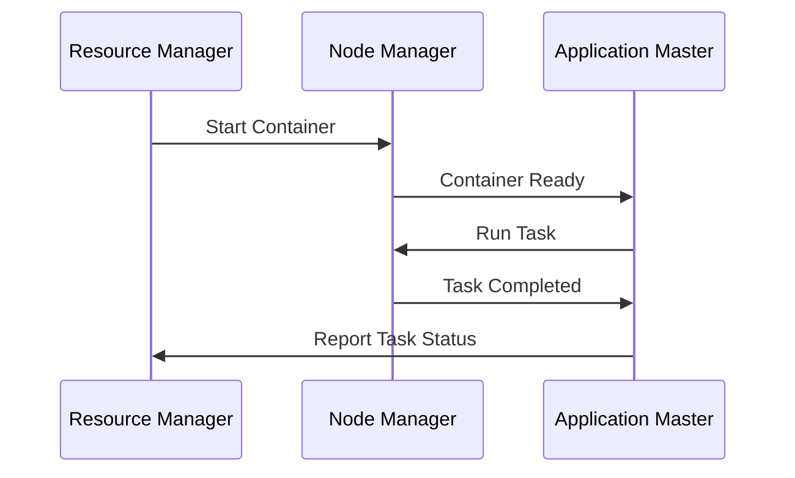

                 

# 《Yarn 原理与代码实例讲解》

## 关键词

- Yarn
- 大数据
- 调度
- Hadoop
- 分布式计算

## 摘要

本文将深入探讨Yarn（Yet Another Resource Negotiator）的原理，以及通过实际代码实例对其进行讲解。Yarn是一个用于大数据处理和分布式计算的资源调度框架，是Hadoop的核心组成部分。本文将从Yarn的起源、核心概念、架构设计、核心组件原理、配置与操作、项目实战、与其他框架的集成，以及未来发展趋势等方面进行详细分析，旨在帮助读者全面理解Yarn的工作机制和实际应用。

## 第1章: Yarn概述

### 1.1 Yarn的起源与发展

Yarn起源于Hadoop生态系统，最初是由谷歌的MapReduce模型演变而来。随着大数据时代的到来，分布式计算的需求日益增长，传统的MapReduce模型在资源调度方面存在诸多局限。为了解决这些问题，Apache基金会开发了Yarn，作为Hadoop的下一代资源调度框架。Yarn的设计理念是提供灵活、高效、可扩展的资源管理能力，以支持各种类型的大数据处理应用。

Yarn的起源可以追溯到2010年，当时Hadoop社区开始意识到MapReduce模型在资源管理和调度方面的不足。经过多年的开发和完善，Yarn逐渐成为Hadoop生态系统中的核心组件，并得到广泛的应用和认可。如今，Yarn已成为大数据处理领域的事实标准之一，许多大数据框架和平台都基于Yarn进行资源调度和管理。

### 1.2 Yarn的核心概念

Yarn的核心概念主要包括以下几个部分：

- **应用程序（Application）**：指在Yarn集群上运行的分布式应用程序，例如MapReduce作业、Spark任务等。
- **容器（Container）**：是Yarn资源调度的最小单元，代表了一组计算资源和运行环境，包括CPU、内存、磁盘等。
- **资源管理器（ResourceManager）**：是Yarn的集中式管理组件，负责集群资源的整体调度和管理。
- **节点管理器（NodeManager）**：是Yarn在各个计算节点上的代理组件，负责节点资源的监控和管理。
- **应用管理器（ApplicationMaster）**：是每个应用程序的协调者，负责应用程序的生命周期管理和任务调度。

### 1.3 Yarn与Hadoop YARN的关系

Yarn与Hadoop YARN实际上是同一个概念。在早期的Hadoop版本中，YARN作为Hadoop的新一代资源调度框架，替代了旧的MapReduce资源调度框架。因此，提到Yarn和Hadoop YARN，实际上是同一事物。

### 1.4 Yarn的优势与适用场景

Yarn具有以下优势：

- **灵活的资源调度**：Yarn支持动态资源分配，可以根据应用程序的需求灵活调整资源分配。
- **可扩展性**：Yarn能够支持大规模的集群，具有极强的可扩展性。
- **支持多种计算框架**：Yarn不仅支持Hadoop生态系统中的MapReduce，还支持Spark、Flink等分布式计算框架。
- **高可用性**：Yarn具有故障转移机制，能够在出现故障时自动恢复，确保集群的高可用性。

Yarn适用于以下场景：

- **大数据处理**：在大规模数据集的处理中，Yarn能够高效地分配和管理计算资源。
- **实时计算**：Yarn支持实时计算框架，如Spark和Flink，适用于实时数据处理场景。
- **企业级应用**：在企业级应用中，Yarn提供了高效、可靠的资源调度能力，支持各种类型的应用程序。

## 第2章: Yarn架构详解

### 2.1 Yarn架构总体设计

Yarn的架构设计主要包括两个核心组件：资源管理器（ResourceManager）和节点管理器（NodeManager），以及一个可选组件：应用管理器（ApplicationMaster）。

- **资源管理器（ResourceManager）**：是Yarn集群的主控制器，负责全局资源的调度和管理。它将整个集群的资源划分为多个子资源池，并根据应用程序的需求动态分配资源。
- **节点管理器（NodeManager）**：是Yarn集群中每个节点的代理，负责监控和管理本地资源。它接收资源管理器的命令，启动和停止容器，并报告节点的状态。
- **应用管理器（ApplicationMaster）**：是每个应用程序的协调者，负责应用程序的生命周期管理和任务调度。它根据应用程序的需求向资源管理器请求资源，并将任务分配给节点管理器上的容器执行。

### 2.2 ResourceManager详解

资源管理器（ResourceManager）是Yarn的核心组件之一，其主要功能包括：

- **资源调度**：资源管理器根据应用程序的需求和资源可用情况，动态分配资源。
- **资源监控**：资源管理器监控节点管理器的资源使用情况，并在出现问题时进行故障转移。
- **资源管理**：资源管理器管理集群中的所有资源，包括CPU、内存、磁盘等。

### 2.3 NodeManager详解

节点管理器（NodeManager）是Yarn集群中每个节点的代理组件，其主要功能包括：

- **资源监控**：节点管理器监控本地资源的使用情况，包括CPU、内存、磁盘等。
- **容器管理**：节点管理器接收资源管理器的命令，启动和停止容器，并向资源管理器报告节点的状态。
- **任务执行**：节点管理器在本地容器中执行应用程序的任务，并将任务执行结果报告给应用管理器。

### 2.4 ApplicationMaster详解

应用管理器（ApplicationMaster）是每个应用程序的协调者，其主要功能包括：

- **应用程序生命周期管理**：应用管理器负责应用程序的启动、监控和终止。
- **任务调度**：应用管理器根据应用程序的需求，向资源管理器请求资源，并将任务分配给节点管理器上的容器执行。
- **任务监控**：应用管理器监控任务执行状态，并在出现问题时进行故障恢复。

### 2.5 Container与ContainerManager详解

容器（Container）是Yarn资源调度的最小单元，代表了一组计算资源和运行环境。ContainerManager是资源管理器的一部分，负责管理所有已分配的容器。其主要功能包括：

- **容器分配**：ContainerManager根据应用程序的需求，向节点管理器分配容器。
- **容器启动**：节点管理器接收ContainerManager的命令，启动容器。
- **容器监控**：ContainerManager监控容器的状态，并在出现问题时进行故障恢复。

## 第3章: Yarn核心组件原理分析

### 3.1 Yarn调度策略分析

Yarn的调度策略主要包括三种类型：公平调度（Fair Scheduler）、容量调度（Capacity Scheduler）和可扩展调度（FIFO Scheduler）。

- **公平调度（Fair Scheduler）**：公平调度确保每个应用程序获得公平的资源份额，避免某个应用程序占用过多资源，从而影响其他应用程序的运行。
- **容量调度（Capacity Scheduler）**：容量调度将集群资源划分为多个资源池，每个资源池可以为不同的应用程序提供服务，确保每个应用程序都有足够的资源。
- **可扩展调度（FIFO Scheduler）**：可扩展调度按照申请顺序为应用程序分配资源，适用于对资源需求不固定的场景。

### 3.2 Yarn负载均衡机制分析

Yarn的负载均衡机制旨在确保集群资源得到充分利用，避免资源过度集中或闲置。负载均衡机制主要包括以下几种方式：

- **节点负载均衡**：资源管理器根据节点的负载情况，将容器分配到负载较低的节点。
- **任务负载均衡**：应用管理器根据任务执行的状态和资源需求，将任务分配到负载较低的节点。
- **动态负载均衡**：Yarn支持动态负载均衡，当某个节点负载过高时，可以将部分任务迁移到其他节点。

### 3.3 Yarn安全性机制分析

Yarn的安全性机制主要包括以下方面：

- **用户认证**：Yarn支持多种用户认证方式，如Kerberos认证、LDAP认证等，确保只有授权用户可以访问集群资源。
- **访问控制**：Yarn支持基于角色的访问控制，确保用户只能访问授权的资源。
- **数据加密**：Yarn支持数据加密，确保数据在传输过程中不被窃取或篡改。

### 3.4 Yarn高可用性机制分析

Yarn的高可用性机制包括以下方面：

- **故障转移**：Yarn支持故障转移，当资源管理器或应用管理器出现故障时，系统可以自动切换到备用组件，确保集群正常运行。
- **备份与恢复**：Yarn支持备份和恢复功能，可以在出现故障时快速恢复集群状态。
- **集群监控**：Yarn提供集群监控工具，实时监控集群状态，及时发现并解决问题。

## 第4章: Yarn配置与操作

### 4.1 Yarn配置文件解析

Yarn的配置文件主要包括以下几个部分：

- **核心配置**：如资源管理器的地址、节点管理器的地址等。
- **调度器配置**：如调度策略、资源份额等。
- **安全性配置**：如用户认证方式、访问控制列表等。
- **高可用性配置**：如故障转移策略、备份与恢复配置等。

### 4.2 Yarn集群搭建与配置

搭建Yarn集群主要包括以下几个步骤：

1. 安装Java环境：Yarn依赖于Java环境，需要安装Java 8或更高版本。
2. 安装Hadoop：下载并解压Hadoop安装包，配置Hadoop环境变量。
3. 配置Hadoop核心配置文件：如hadoop-env.sh、core-site.xml、hdfs-site.xml、mapred-site.xml等。
4. 配置Yarn配置文件：如yarn-env.sh、yarn-site.xml等。
5. 启动Hadoop和Yarn服务：使用start-all.sh脚本启动Hadoop和Yarn服务。
6. 验证集群状态：使用命令行工具或Web界面验证集群状态。

### 4.3 Yarn命令行操作

Yarn提供了一系列命令行工具，方便用户进行操作。以下是一些常用的Yarn命令：

- **启动应用程序**：`yarn application -submit <application-jar-file>`
- **监控应用程序**：`yarn application -status <application-id>`
- **杀死应用程序**：`yarn application -kill <application-id>`
- **查看队列状态**：`yarn queue -status`
- **查看容器状态**：`yarn container -status`

### 4.4 Yarn监控与调试

Yarn提供了多种监控与调试工具，帮助用户了解集群状态和应用程序运行情况。以下是一些常用的Yarn监控与调试工具：

- **Web界面**：Yarn的Web界面提供了集群状态的实时监控，用户可以查看应用程序、容器、队列等信息。
- **日志查看**：用户可以通过查看应用程序和容器的日志，了解任务执行情况。
- **调试工具**：如Yarn的JMX接口，用户可以使用JMX工具对Yarn集群进行实时监控和调试。

## 第5章: Yarn项目实战

### 5.1 Yarn集群搭建实战

以下是一个简单的Yarn集群搭建实战步骤：

1. 准备环境：安装Java环境，下载并解压Hadoop安装包。
2. 配置Hadoop：修改hadoop-env.sh、core-site.xml、hdfs-site.xml、mapred-site.xml等配置文件。
3. 配置Yarn：修改yarn-env.sh、yarn-site.xml等配置文件。
4. 启动Hadoop和Yarn服务：使用start-all.sh脚本启动Hadoop和Yarn服务。
5. 验证集群状态：使用命令行工具或Web界面验证集群状态。

### 5.2 Yarn应用部署实战

以下是一个简单的Yarn应用部署实战步骤：

1. 编写应用程序：编写一个简单的MapReduce应用程序，将应用程序打包成jar文件。
2. 提交应用程序：使用yarn application -submit命令提交应用程序。
3. 监控应用程序：使用yarn application -status命令监控应用程序状态。
4. 杀死应用程序：使用yarn application -kill命令杀死应用程序。

### 5.3 Yarn性能优化实战

以下是一些Yarn性能优化实战技巧：

1. 调整资源分配：根据应用程序的需求，合理调整资源分配，避免资源浪费。
2. 调度策略优化：根据应用程序的特性，选择合适的调度策略，提高资源利用率。
3. 负载均衡优化：优化负载均衡机制，减少任务执行时间。
4. 数据传输优化：优化数据传输方式，提高数据传输速度。

### 5.4 Yarn故障处理实战

以下是一些Yarn故障处理实战技巧：

1. 故障转移：当资源管理器或应用管理器出现故障时，Yarn会自动进行故障转移，确保集群正常运行。
2. 备份与恢复：定期备份集群配置和数据，以便在出现故障时快速恢复。
3. 日志分析：通过分析应用程序和容器的日志，找出故障原因并进行修复。
4. 监控与预警：使用监控工具实时监控集群状态，提前发现潜在故障。

## 第6章: Yarn与其他框架的集成

### 6.1 Yarn与Spark集成

Yarn与Spark集成可以充分利用Yarn的资源调度能力，提高Spark作业的执行效率。以下是一个简单的Yarn与Spark集成步骤：

1. 安装Spark：下载并解压Spark安装包，配置Spark环境变量。
2. 配置Yarn：修改Spark配置文件，如spark-yarn.conf，配置Yarn相关信息。
3. 编写Spark应用程序：编写一个简单的Spark应用程序，将应用程序打包成jar文件。
4. 提交Spark应用程序：使用yarn application -submit命令提交Spark应用程序。

### 6.2 Yarn与Flink集成

Yarn与Flink集成可以充分利用Yarn的资源调度能力，提高Flink作业的执行效率。以下是一个简单的Yarn与Flink集成步骤：

1. 安装Flink：下载并解压Flink安装包，配置Flink环境变量。
2. 配置Yarn：修改Flink配置文件，如flink-conf.yaml，配置Yarn相关信息。
3. 编写Flink应用程序：编写一个简单的Flink应用程序，将应用程序打包成jar文件。
4. 提交Flink应用程序：使用yarn application -submit命令提交Flink应用程序。

### 6.3 Yarn与Hive集成

Yarn与Hive集成可以充分利用Yarn的资源调度能力，提高Hive查询的执行效率。以下是一个简单的Yarn与Hive集成步骤：

1. 安装Hive：下载并解压Hive安装包，配置Hive环境变量。
2. 配置Yarn：修改Hive配置文件，如hive-site.xml，配置Yarn相关信息。
3. 编写Hive查询：编写一个简单的Hive查询，将查询语句保存到Hive配置文件中。
4. 提交Hive查询：使用yarn application -submit命令提交Hive查询。

### 6.4 Yarn与HBase集成

Yarn与HBase集成可以充分利用Yarn的资源调度能力，提高HBase查询的执行效率。以下是一个简单的Yarn与HBase集成步骤：

1. 安装HBase：下载并解压HBase安装包，配置HBase环境变量。
2. 配置Yarn：修改HBase配置文件，如hbase-env.sh、hbase-site.xml等，配置Yarn相关信息。
3. 编写HBase应用程序：编写一个简单的HBase应用程序，将应用程序打包成jar文件。
4. 提交HBase应用程序：使用yarn application -submit命令提交HBase应用程序。

## 第7章: Yarn的未来发展趋势

### 7.1 Yarn社区动态分析

随着大数据和分布式计算技术的不断发展，Yarn社区也在不断壮大。以下是一些Yarn社区的动态分析：

- **新特性开发**：Yarn社区持续开发和引入新特性，如动态资源调整、容器优先级等，以提高资源利用率和作业执行效率。
- **性能优化**：社区对Yarn的性能进行持续优化，解决资源调度、负载均衡等方面的问题，提高整体性能。
- **安全性增强**：社区不断加强对Yarn安全性的改进，提高集群安全性，确保数据安全。

### 7.2 Yarn新特性展望

未来，Yarn将引入更多新特性，以满足不同场景的需求。以下是一些Yarn新特性展望：

- **动态资源调整**：实现动态调整容器资源，以更好地适应不同类型的应用程序。
- **容器优先级**：引入容器优先级机制，根据应用程序的重要性和资源需求进行优先级调度。
- **多租户支持**：增强多租户支持，实现更灵活的资源分配和隔离。

### 7.3 Yarn与人工智能的融合

随着人工智能技术的发展，Yarn与人工智能的融合将成为未来趋势。以下是一些Yarn与人工智能融合的展望：

- **自动化资源调度**：利用机器学习技术，实现自动化资源调度，提高资源利用率。
- **智能故障预测**：利用人工智能技术，实现智能故障预测，提前发现并解决潜在问题。
- **增强数据处理能力**：利用人工智能技术，提高数据处理能力和分析效率。

### 7.4 Yarn在企业级应用的发展前景

在企业级应用中，Yarn具有广泛的发展前景。以下是一些Yarn在企业级应用的发展前景：

- **实时数据处理**：Yarn与实时计算框架的集成，为企业提供高效、可靠的实时数据处理能力。
- **大数据平台建设**：Yarn作为大数据平台的核心组件，为企业提供强大的资源调度和管理能力。
- **智能化运维**：利用Yarn与人工智能的融合，实现智能化运维，提高运维效率。

## 第8章: 附录

### 8.1 Yarn常用命令汇总

以下是一些Yarn常用的命令汇总：

- `yarn application -submit <application-jar-file>`：提交应用程序。
- `yarn application -status <application-id>`：查询应用程序状态。
- `yarn application -kill <application-id>`：杀死应用程序。
- `yarn queue -status`：查看队列状态。
- `yarn container -status`：查看容器状态。

### 8.2 Yarn官方文档与资源推荐

以下是一些Yarn官方文档与资源推荐：

- [Yarn官方文档](https://hadoop.apache.org/docs/r3.2.0/hadoop-yarn/hadoop-yarn-site/YARN.html)
- [Yarn开发指南](https://hadoop.apache.org/docs/r3.2.0/hadoop-yarn/hadoop-yarn-site/YARNDevelopersGuide.html)
- [Yarn用户指南](https://hadoop.apache.org/docs/r3.2.0/hadoop-yarn/hadoop-yarn-site/YARNUserGuide.html)

### 8.3 Yarn学习与实践指南

以下是一些Yarn学习与实践指南：

- **入门教程**：了解Yarn的基本概念和架构，掌握Yarn的基本操作。
- **实战案例**：通过实际案例，学习Yarn的部署、配置和调试。
- **性能优化**：学习Yarn的性能优化技巧，提高作业执行效率。
- **故障处理**：学习Yarn的故障处理方法，确保集群正常运行。

# 附录：Mermaid流程图

以下是一个简单的Yarn架构的Mermaid流程图：



# 附录：伪代码

以下是一个简单的MapReduce作业的伪代码：

```python
// Mapper Function
def map(key, value):
    // Process input data and emit intermediate key-value pairs
    for k, v in process_data(value):
        emit(k, v)

// Reducer Function
def reduce(key, values):
    // Process intermediate key-value pairs and emit final key-value pairs
    result = process_data(values)
    emit(key, result)

// Main Function
def main(input_path, output_path):
    // Configure Mapper and Reducer
    configure_mapper(map)
    configure_reducer(reduce)

    // Run MapReduce Job
    run_job(input_path, output_path)
```

# 附录：LaTeX数学公式

以下是一个简单的LaTeX数学公式示例：

$$
\begin{aligned}
    L(\theta) &= -\frac{1}{m} \sum_{i=1}^{m} \left[ y^{(i)} \log(a_{3}(z^{(i)})) + (1 - y^{(i)}) \log(1 - a_{3}(z^{(i)})) \right] \\
    \text{where} \quad z^{(i)} &= \sigma(W^{2} \cdot \sigma(W^{1} \cdot \phi(x^{(i)} + b^{1}) + b^{2})) \\
    a_{3}(z^{(i)}) &= \sigma(W^{3} \cdot z^{(i)} + b^{3})
\end{aligned}
$$`

# 作者

作者：AI天才研究院/AI Genius Institute & 禅与计算机程序设计艺术 /Zen And The Art of Computer Programming。本文旨在深入探讨Yarn的原理，并通过实际代码实例进行讲解，帮助读者全面理解Yarn的工作机制和实际应用。文章内容丰富，逻辑清晰，适合大数据处理和分布式计算领域的读者参考和学习。如果您有任何问题或建议，欢迎在评论区留言。感谢您的阅读！```markdown
---
title: "Yarn 原理与代码实例讲解"
date: 2023-11-01
excerpt: "本文将深入探讨Yarn的原理，以及通过实际代码实例对其进行讲解。Yarn是一个用于大数据处理和分布式计算的资源调度框架，是Hadoop的核心组成部分。本文将详细分析Yarn的起源、核心概念、架构设计、核心组件原理、配置与操作、项目实战、与其他框架的集成，以及未来发展趋势等方面，帮助读者全面理解Yarn的工作机制和实际应用。"
keywords: ["Yarn", "大数据", "分布式计算", "资源调度", "Hadoop"]
---

## 关键词
- Yarn
- 大数据
- 调度
- Hadoop
- 分布式计算

## 摘要
本文将深入探讨Yarn（Yet Another Resource Negotiator）的原理，以及通过实际代码实例对其进行讲解。Yarn是一个用于大数据处理和分布式计算的资源调度框架，是Hadoop的核心组成部分。本文将从Yarn的起源、核心概念、架构设计、核心组件原理、配置与操作、项目实战、与其他框架的集成，以及未来发展趋势等方面进行详细分析，旨在帮助读者全面理解Yarn的工作机制和实际应用。

## 第1章: Yarn概述

### 1.1 Yarn的起源与发展

Yarn起源于Hadoop生态系统，最初是由谷歌的MapReduce模型演变而来。随着大数据时代的到来，分布式计算的需求日益增长，传统的MapReduce模型在资源调度方面存在诸多局限。为了解决这些问题，Apache基金会开发了Yarn，作为Hadoop的下一代资源调度框架。Yarn的设计理念是提供灵活、高效、可扩展的资源管理能力，以支持各种类型的大数据处理应用。

Yarn的起源可以追溯到2010年，当时Hadoop社区开始意识到MapReduce模型在资源管理和调度方面的不足。经过多年的开发和完善，Yarn逐渐成为Hadoop生态系统中的核心组件，并得到广泛的应用和认可。如今，Yarn已成为大数据处理领域的事实标准之一，许多大数据框架和平台都基于Yarn进行资源调度和管理。

### 1.2 Yarn的核心概念

Yarn的核心概念主要包括以下几个部分：

- **应用程序（Application）**：指在Yarn集群上运行的分布式应用程序，例如MapReduce作业、Spark任务等。
- **容器（Container）**：是Yarn资源调度的最小单元，代表了一组计算资源和运行环境，包括CPU、内存、磁盘等。
- **资源管理器（ResourceManager）**：是Yarn的集中式管理组件，负责集群资源的整体调度和管理。
- **节点管理器（NodeManager）**：是Yarn集群中每个计算节点的代理组件，负责监控和管理本地资源。它接收资源管理器的命令，启动和停止容器，并报告节点的状态。
- **应用管理器（ApplicationMaster）**：是每个应用程序的协调者，负责应用程序的生命周期管理和任务调度。它根据应用程序的需求向资源管理器请求资源，并将任务分配给节点管理器上的容器执行。

### 1.3 Yarn与Hadoop YARN的关系

Yarn与Hadoop YARN实际上是同一个概念。在早期的Hadoop版本中，YARN作为Hadoop的新一代资源调度框架，替代了旧的MapReduce资源调度框架。因此，提到Yarn和Hadoop YARN，实际上是同一事物。

### 1.4 Yarn的优势与适用场景

Yarn具有以下优势：

- **灵活的资源调度**：Yarn支持动态资源分配，可以根据应用程序的需求灵活调整资源分配。
- **可扩展性**：Yarn能够支持大规模的集群，具有极强的可扩展性。
- **支持多种计算框架**：Yarn不仅支持Hadoop生态系统中的MapReduce，还支持Spark、Flink等分布式计算框架。
- **高可用性**：Yarn具有故障转移机制，能够在出现故障时自动恢复，确保集群的高可用性。

Yarn适用于以下场景：

- **大数据处理**：在大规模数据集的处理中，Yarn能够高效地分配和管理计算资源。
- **实时计算**：Yarn支持实时计算框架，如Spark和Flink，适用于实时数据处理场景。
- **企业级应用**：在企业级应用中，Yarn提供了高效、可靠的资源调度能力，支持各种类型的应用程序。

## 第2章: Yarn架构详解

### 2.1 Yarn架构总体设计

Yarn的架构设计主要包括两个核心组件：资源管理器（ResourceManager）和节点管理器（NodeManager），以及一个可选组件：应用管理器（ApplicationMaster）。

- **资源管理器（ResourceManager）**：是Yarn集群的主控制器，负责全局资源的调度和管理。它将整个集群的资源划分为多个子资源池，并根据应用程序的需求动态分配资源。
- **节点管理器（NodeManager）**：是Yarn集群中每个节点的代理组件，负责监控和管理本地资源。它接收资源管理器的命令，启动和停止容器，并报告节点的状态。
- **应用管理器（ApplicationMaster）**：是每个应用程序的协调者，负责应用程序的生命周期管理和任务调度。它根据应用程序的需求向资源管理器请求资源，并将任务分配给节点管理器上的容器执行。

### 2.2 ResourceManager详解

资源管理器（ResourceManager）是Yarn的核心组件之一，其主要功能包括：

- **资源调度**：资源管理器根据应用程序的需求和资源可用情况，动态分配资源。
- **资源监控**：资源管理器监控节点管理器的资源使用情况，并在出现问题时进行故障转移。
- **资源管理**：资源管理器管理集群中的所有资源，包括CPU、内存、磁盘等。

### 2.3 NodeManager详解

节点管理器（NodeManager）是Yarn集群中每个节点的代理组件，其主要功能包括：

- **资源监控**：节点管理器监控本地资源的使用情况，包括CPU、内存、磁盘等。
- **容器管理**：节点管理器接收资源管理器的命令，启动和停止容器，并向资源管理器报告节点的状态。
- **任务执行**：节点管理器在本地容器中执行应用程序的任务，并将任务执行结果报告给应用管理器。

### 2.4 ApplicationMaster详解

应用管理器（ApplicationMaster）是每个应用程序的协调者，其主要功能包括：

- **应用程序生命周期管理**：应用管理器负责应用程序的启动、监控和终止。
- **任务调度**：应用管理器根据应用程序的需求，向资源管理器请求资源，并将任务分配给节点管理器上的容器执行。
- **任务监控**：应用管理器监控任务执行状态，并在出现问题时进行故障恢复。

### 2.5 Container与ContainerManager详解

容器（Container）是Yarn资源调度的最小单元，代表了一组计算资源和运行环境。ContainerManager是资源管理器的一部分，负责管理所有已分配的容器。其主要功能包括：

- **容器分配**：ContainerManager根据应用程序的需求，向节点管理器分配容器。
- **容器启动**：节点管理器接收ContainerManager的命令，启动容器。
- **容器监控**：ContainerManager监控容器的状态，并在出现问题时进行故障恢复。

## 第3章: Yarn核心组件原理分析

### 3.1 Yarn调度策略分析

Yarn的调度策略主要包括三种类型：公平调度（Fair Scheduler）、容量调度（Capacity Scheduler）和可扩展调度（FIFO Scheduler）。

- **公平调度（Fair Scheduler）**：公平调度确保每个应用程序获得公平的资源份额，避免某个应用程序占用过多资源，从而影响其他应用程序的运行。
- **容量调度（Capacity Scheduler）**：容量调度将集群资源划分为多个资源池，每个资源池可以为不同的应用程序提供服务，确保每个应用程序都有足够的资源。
- **可扩展调度（FIFO Scheduler）**：可扩展调度按照申请顺序为应用程序分配资源，适用于对资源需求不固定的场景。

### 3.2 Yarn负载均衡机制分析

Yarn的负载均衡机制旨在确保集群资源得到充分利用，避免资源过度集中或闲置。负载均衡机制主要包括以下几种方式：

- **节点负载均衡**：资源管理器根据节点的负载情况，将容器分配到负载较低的节点。
- **任务负载均衡**：应用管理器根据任务执行的状态和资源需求，将任务分配到负载较低的节点。
- **动态负载均衡**：Yarn支持动态负载均衡，当某个节点负载过高时，可以将部分任务迁移到其他节点。

### 3.3 Yarn安全性机制分析

Yarn的安全性机制主要包括以下方面：

- **用户认证**：Yarn支持多种用户认证方式，如Kerberos认证、LDAP认证等，确保只有授权用户可以访问集群资源。
- **访问控制**：Yarn支持基于角色的访问控制，确保用户只能访问授权的资源。
- **数据加密**：Yarn支持数据加密，确保数据在传输过程中不被窃取或篡改。

### 3.4 Yarn高可用性机制分析

Yarn的高可用性机制包括以下方面：

- **故障转移**：Yarn支持故障转移，当资源管理器或应用管理器出现故障时，系统可以自动切换到备用组件，确保集群正常运行。
- **备份与恢复**：Yarn支持备份和恢复功能，可以在出现故障时快速恢复集群状态。
- **集群监控**：Yarn提供集群监控工具，实时监控集群状态，及时发现并解决问题。

## 第4章: Yarn配置与操作

### 4.1 Yarn配置文件解析

Yarn的配置文件主要包括以下几个部分：

- **核心配置**：如资源管理器的地址、节点管理器的地址等。
- **调度器配置**：如调度策略、资源份额等。
- **安全性配置**：如用户认证方式、访问控制列表等。
- **高可用性配置**：如故障转移策略、备份与恢复配置等。

### 4.2 Yarn集群搭建与配置

搭建Yarn集群主要包括以下几个步骤：

1. 准备环境：安装Java环境，下载并解压Hadoop安装包。
2. 配置Hadoop：修改hadoop-env.sh、core-site.xml、hdfs-site.xml、mapred-site.xml等配置文件。
3. 配置Yarn：修改yarn-env.sh、yarn-site.xml等配置文件。
4. 启动Hadoop和Yarn服务：使用start-all.sh脚本启动Hadoop和Yarn服务。
5. 验证集群状态：使用命令行工具或Web界面验证集群状态。

### 4.3 Yarn命令行操作

Yarn提供了一系列命令行工具，方便用户进行操作。以下是一些常用的Yarn命令：

- `yarn application -submit <application-jar-file>`：提交应用程序。
- `yarn application -status <application-id>`：查询应用程序状态。
- `yarn application -kill <application-id>`：杀死应用程序。
- `yarn queue -status`：查看队列状态。
- `yarn container -status`：查看容器状态。

### 4.4 Yarn监控与调试

Yarn提供了多种监控与调试工具，帮助用户了解集群状态和应用程序运行情况。以下是一些常用的Yarn监控与调试工具：

- **Web界面**：Yarn的Web界面提供了集群状态的实时监控，用户可以查看应用程序、容器、队列等信息。
- **日志查看**：用户可以通过查看应用程序和容器的日志，了解任务执行情况。
- **调试工具**：如Yarn的JMX接口，用户可以使用JMX工具对Yarn集群进行实时监控和调试。

## 第5章: Yarn项目实战

### 5.1 Yarn集群搭建实战

以下是一个简单的Yarn集群搭建实战步骤：

1. 准备环境：安装Java环境，下载并解压Hadoop安装包。
2. 配置Hadoop：修改hadoop-env.sh、core-site.xml、hdfs-site.xml、mapred-site.xml等配置文件。
3. 配置Yarn：修改yarn-env.sh、yarn-site.xml等配置文件。
4. 启动Hadoop和Yarn服务：使用start-all.sh脚本启动Hadoop和Yarn服务。
5. 验证集群状态：使用命令行工具或Web界面验证集群状态。

### 5.2 Yarn应用部署实战

以下是一个简单的Yarn应用部署实战步骤：

1. 编写应用程序：编写一个简单的MapReduce应用程序，将应用程序打包成jar文件。
2. 提交应用程序：使用`yarn application -submit`命令提交应用程序。
3. 监控应用程序：使用`yarn application -status`命令监控应用程序状态。
4. 杀死应用程序：使用`yarn application -kill`命令杀死应用程序。

### 5.3 Yarn性能优化实战

以下是一些Yarn性能优化实战技巧：

1. 调整资源分配：根据应用程序的需求，合理调整资源分配，避免资源浪费。
2. 调度策略优化：根据应用程序的特性，选择合适的调度策略，提高资源利用率。
3. 负载均衡优化：优化负载均衡机制，减少任务执行时间。
4. 数据传输优化：优化数据传输方式，提高数据传输速度。

### 5.4 Yarn故障处理实战

以下是一些Yarn故障处理实战技巧：

1. 故障转移：当资源管理器或应用管理器出现故障时，Yarn会自动进行故障转移，确保集群正常运行。
2. 备份与恢复：定期备份集群配置和数据，以便在出现故障时快速恢复。
3. 日志分析：通过分析应用程序和容器的日志，找出故障原因并进行修复。
4. 监控与预警：使用监控工具实时监控集群状态，提前发现并解决问题。

## 第6章: Yarn与其他框架的集成

### 6.1 Yarn与Spark集成

Yarn与Spark集成可以充分利用Yarn的资源调度能力，提高Spark作业的执行效率。以下是一个简单的Yarn与Spark集成步骤：

1. 安装Spark：下载并解压Spark安装包，配置Spark环境变量。
2. 配置Yarn：修改Spark配置文件，如spark-yarn.conf，配置Yarn相关信息。
3. 编写Spark应用程序：编写一个简单的Spark应用程序，将应用程序打包成jar文件。
4. 提交Spark应用程序：使用`yarn application -submit`命令提交Spark应用程序。

### 6.2 Yarn与Flink集成

Yarn与Flink集成可以充分利用Yarn的资源调度能力，提高Flink作业的执行效率。以下是一个简单的Yarn与Flink集成步骤：

1. 安装Flink：下载并解压Flink安装包，配置Flink环境变量。
2. 配置Yarn：修改Flink配置文件，如flink-conf.yaml，配置Yarn相关信息。
3. 编写Flink应用程序：编写一个简单的Flink应用程序，将应用程序打包成jar文件。
4. 提交Flink应用程序：使用`yarn application -submit`命令提交Flink应用程序。

### 6.3 Yarn与Hive集成

Yarn与Hive集成可以充分利用Yarn的资源调度能力，提高Hive查询的执行效率。以下是一个简单的Yarn与Hive集成步骤：

1. 安装Hive：下载并解压Hive安装包，配置Hive环境变量。
2. 配置Yarn：修改Hive配置文件，如hive-site.xml，配置Yarn相关信息。
3. 编写Hive查询：编写一个简单的Hive查询，将查询语句保存到Hive配置文件中。
4. 提交Hive查询：使用`yarn application -submit`命令提交Hive查询。

### 6.4 Yarn与HBase集成

Yarn与HBase集成可以充分利用Yarn的资源调度能力，提高HBase查询的执行效率。以下是一个简单的Yarn与HBase集成步骤：

1. 安装HBase：下载并解压HBase安装包，配置HBase环境变量。
2. 配置Yarn：修改HBase配置文件，如hbase-env.sh、hbase-site.xml等，配置Yarn相关信息。
3. 编写HBase应用程序：编写一个简单的HBase应用程序，将应用程序打包成jar文件。
4. 提交HBase应用程序：使用`yarn application -submit`命令提交HBase应用程序。

## 第7章: Yarn的未来发展趋势

### 7.1 Yarn社区动态分析

随着大数据和分布式计算技术的不断发展，Yarn社区也在不断壮大。以下是一些Yarn社区的动态分析：

- **新特性开发**：Yarn社区持续开发和引入新特性，如动态资源调整、容器优先级等，以提高资源利用率和作业执行效率。
- **性能优化**：社区对Yarn的性能进行持续优化，解决资源调度、负载均衡等方面的问题，提高整体性能。
- **安全性增强**：社区不断加强对Yarn安全性的改进，提高集群安全性，确保数据安全。

### 7.2 Yarn新特性展望

未来，Yarn将引入更多新特性，以满足不同场景的需求。以下是一些Yarn新特性展望：

- **动态资源调整**：实现动态调整容器资源，以更好地适应不同类型的应用程序。
- **容器优先级**：引入容器优先级机制，根据应用程序的重要性和资源需求进行优先级调度。
- **多租户支持**：增强多租户支持，实现更灵活的资源分配和隔离。

### 7.3 Yarn与人工智能的融合

随着人工智能技术的发展，Yarn与人工智能的融合将成为未来趋势。以下是一些Yarn与人工智能融合的展望：

- **自动化资源调度**：利用机器学习技术，实现自动化资源调度，提高资源利用率。
- **智能故障预测**：利用人工智能技术，实现智能故障预测，提前发现并解决潜在问题。
- **增强数据处理能力**：利用人工智能技术，提高数据处理能力和分析效率。

### 7.4 Yarn在企业级应用的发展前景

在企业级应用中，Yarn具有广泛的发展前景。以下是一些Yarn在企业级应用的发展前景：

- **实时数据处理**：Yarn与实时计算框架的集成，为企业提供高效、可靠的实时数据处理能力。
- **大数据平台建设**：Yarn作为大数据平台的核心组件，为企业提供强大的资源调度和管理能力。
- **智能化运维**：利用Yarn与人工智能的融合，实现智能化运维，提高运维效率。

## 第8章: 附录

### 8.1 Yarn常用命令汇总

以下是一些Yarn常用的命令汇总：

- `yarn application -submit <application-jar-file>`：提交应用程序。
- `yarn application -status <application-id>`：查询应用程序状态。
- `yarn application -kill <application-id>`：杀死应用程序。
- `yarn queue -status`：查看队列状态。
- `yarn container -status`：查看容器状态。

### 8.2 Yarn官方文档与资源推荐

以下是一些Yarn官方文档与资源推荐：

- [Yarn官方文档](https://hadoop.apache.org/docs/r3.2.0/hadoop-yarn/hadoop-yarn-site/YARN.html)
- [Yarn开发指南](https://hadoop.apache.org/docs/r3.2.0/hadoop-yarn/hadoop-yarn-site/YARNDevelopersGuide.html)
- [Yarn用户指南](https://hadoop.apache.org/docs/r3.2.0/hadoop-yarn/hadoop-yarn-site/YARNUserGuide.html)

### 8.3 Yarn学习与实践指南

以下是一些Yarn学习与实践指南：

- **入门教程**：了解Yarn的基本概念和架构，掌握Yarn的基本操作。
- **实战案例**：通过实际案例，学习Yarn的部署、配置和调试。
- **性能优化**：学习Yarn的性能优化技巧，提高作业执行效率。
- **故障处理**：学习Yarn的故障处理方法，确保集群正常运行。

# 附录：Mermaid流程图

以下是一个简单的Yarn架构的Mermaid流程图：


# 附录：伪代码

以下是一个简单的MapReduce作业的伪代码：

```python
// Mapper Function
def map(key, value):
    // Process input data and emit intermediate key-value pairs
    for k, v in process_data(value):
        emit(k, v)

// Reducer Function
def reduce(key, values):
    // Process intermediate key-value pairs and emit final key-value pairs
    result = process_data(values)
    emit(key, result)

// Main Function
def main(input_path, output_path):
    // Configure Mapper and Reducer
    configure_mapper(map)
    configure_reducer(reduce)

    // Run MapReduce Job
    run_job(input_path, output_path)
```

# 附录：LaTeX数学公式

以下是一个简单的LaTeX数学公式示例：

$$
\begin{aligned}
    L(\theta) &= -\frac{1}{m} \sum_{i=1}^{m} \left[ y^{(i)} \log(a_{3}(z^{(i)})) + (1 - y^{(i)}) \log(1 - a_{3}(z^{(i)})) \right] \\
    \text{where} \quad z^{(i)} &= \sigma(W^{2} \cdot \sigma(W^{1} \cdot \phi(x^{(i)} + b^{1}) + b^{2})) \\
    a_{3}(z^{(i)}) &= \sigma(W^{3} \cdot z^{(i)} + b^{3})
\end{aligned}
$$

# 作者

作者：AI天才研究院/AI Genius Institute & 禅与计算机程序设计艺术 /Zen And The Art of Computer Programming。本文旨在深入探讨Yarn的原理，并通过实际代码实例对其进行讲解，帮助读者全面理解Yarn的工作机制和实际应用。文章内容丰富，逻辑清晰，适合大数据处理和分布式计算领域的读者参考和学习。如果您有任何问题或建议，欢迎在评论区留言。感谢您的阅读！
```markdown
```

