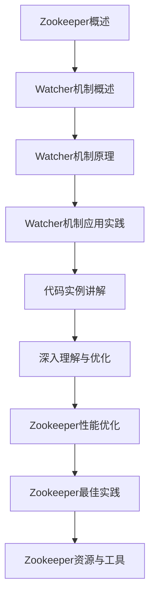

                 

# 《Zookeeper Watcher机制原理与代码实例讲解》

> 关键词：Zookeeper, Watcher机制, 分布式锁, 负载均衡, 消息队列, 代码实例

> 摘要：本文深入探讨了Zookeeper Watcher机制的原理与应用，通过详细分析其工作原理、生命周期和核心算法，并结合实际项目实战，展示了如何利用Watcher机制实现分布式锁、负载均衡和消息队列。文章旨在为读者提供一个全面、深入的Zookeeper Watcher机制学习资源。

## 第一部分：Zookeeper基础

### 第1章：Zookeeper概述

#### 1.1 Zookeeper的发展历程

##### 1.1.1 Zookeeper的诞生

Zookeeper是一个开源的分布式服务协调框架，由Apache Software Foundation维护。它最初是Google的Chubby项目的开源版本，由Google工程师Ben Yu、Flavio Junqueira和Hans Fugal于2008年创建。后来，Google决定将Zookeeper捐赠给Apache软件基金会，使其成为Apache的一个项目。

##### 1.1.2 Zookeeper的核心优势

Zookeeper具有以下核心优势：

- **顺序一致性**：保证客户端请求的执行顺序，确保数据的一致性。
- **原子性**：每个操作要么全部完成，要么全部不完成，不会出现中间状态。
- **单一系统映像**：无论是客户端还是服务器，都看到相同的服务视图，确保一致性。
- **可靠性**：支持客户端重连和服务器故障转移，保证服务的稳定性。

##### 1.1.3 Zookeeper的应用场景

Zookeeper在分布式系统中广泛应用于以下几个方面：

- **分布式锁**：用于在分布式系统中同步操作，防止多个进程同时修改同一数据。
- **负载均衡**：动态分配负载到不同的服务器，提高系统的整体性能。
- **分布式队列**：实现分布式任务的调度和执行，提高系统的处理能力。
- **配置管理**：动态管理分布式系统的配置信息，确保配置的一致性。

#### 1.2 Zookeeper架构解析

##### 1.2.1 Zookeeper的工作原理

Zookeeper工作原理主要包括以下四个方面：

- **客户端**：与Zookeeper服务器建立连接，发送请求，接收响应。
- **Zookeeper服务器**：包括一个领导者服务器（Leader）和多个跟随者服务器（Follower）。领导者负责处理客户端请求，并同步数据到跟随者。
- **数据模型**：以树形结构存储数据，每个节点都是一个ZNode，包含数据和属性。
- **事务日志**：记录所有客户端操作，用于恢复数据。

##### 1.2.2 Zookeeper的集群架构

Zookeeper集群由一个领导者服务器和多个跟随者服务器组成。领导者负责处理客户端请求，并将数据同步到跟随者。集群架构具有以下特点：

- **领导者选举**：通过ZAB（Zookeeper Atomic Broadcast）协议进行领导者选举。
- **数据同步**：领导者将修改操作广播到跟随者，确保数据一致性。
- **故障转移**：领导者故障时，重新进行领导者选举，确保系统可用性。

##### 1.2.3 Zookeeper的节点类型

Zookeeper中的节点类型包括：

- **持久节点**：节点在创建后一直存在，直到被删除。
- **临时节点**：节点在客户端会话失效时自动删除。
- **持久顺序节点**：节点在创建后一直存在，但具有唯一的序列号，用于实现分布式锁等场景。
- **临时顺序节点**：节点在客户端会话失效时自动删除，并具有唯一的序列号。

#### 1.3 Zookeeper核心特性

##### 1.3.1 顺序一致性

顺序一致性是Zookeeper的核心特性之一，它保证客户端请求的执行顺序，确保数据的一致性。

##### 1.3.2 原子性

原子性确保每个操作要么全部完成，要么全部不完成，不会出现中间状态。例如，创建节点操作要么成功创建，要么失败。

##### 1.3.3 单一系统映像

单一系统映像保证客户端和服务器看到相同的服务视图，确保一致性。即使存在多个客户端和服务器，它们都能看到相同的数据状态。

##### 1.3.4 容错性

容错性支持客户端重连和服务器故障转移，确保服务的稳定性。当领导者故障时，跟随者会重新进行领导者选举，确保系统可用性。

## 第二部分：Watcher机制原理

### 第2章：Watcher机制概述

#### 2.1 Watcher的定义与作用

##### 2.1.1 Watcher的概念

Watcher是Zookeeper提供的一种客户端监听机制，用于监听Zookeeper节点的变化事件。通过Watcher，客户端可以实时感知到节点的创建、删除、数据变更和子节点变更等事件。

##### 2.1.2 Watcher的作用

Watcher在分布式系统中具有重要作用，主要包括：

- **同步数据变化**：当节点数据发生变化时，通过Watcher通知客户端进行数据同步。
- **分布式锁**：通过监听节点创建和删除事件，实现分布式锁的释放和获取。
- **负载均衡**：通过监听节点数据变更事件，实现负载均衡的动态调整。
- **消息队列**：通过监听节点创建和删除事件，实现消息的发布和消费。

##### 2.1.3 Watcher与事件监听的区别

Watcher与事件监听在概念上类似，但存在以下区别：

- **作用范围**：Watcher作用于Zookeeper节点，监听节点的变化事件；事件监听作用于特定的对象或组件，监听特定的事件。
- **回调机制**：Watcher通过回调函数通知客户端节点变化事件；事件监听通过事件处理器处理事件。
- **数据同步**：Watcher在触发时，会同步最新的节点数据；事件监听仅处理事件本身，不涉及数据同步。

#### 2.2 Watcher的工作原理

##### 2.2.1 Watcher的注册与注销

Watcher在客户端实现，通过ZooKeeper提供的接口进行注册与注销。

- 注册方法：client.registerWatcher(path, watch);
- 注销方法：client.unregisterWatcher(path, watch);

##### 2.2.2 Watcher的事件类型

Watcher支持以下事件类型：

- NodeCreated：节点创建事件。
- NodeDeleted：节点删除事件。
- NodeDataChanged：节点数据变更事件。
- NodeChildrenChanged：子节点变更事件。

##### 2.2.3 Watcher的数据同步机制

Watcher在触发时，会将事件信息传递给客户端。客户端根据事件信息进行数据同步操作，包括获取节点数据、监听子节点等。

- 同步机制：同步机制 = f(事件信息，客户端状态)
- 数据同步：数据同步 = 获取节点数据 ∪ 监听子节点变化

其中，获取节点数据包括：获取节点路径、获取节点数据、更新本地缓存。监听子节点变化包括：注册子节点监听器、监听子节点创建、删除、数据变更事件、重新获取子节点列表。

#### 2.3 Watcher的生命周期

##### 2.3.1 Watcher的初始化

客户端在连接ZooKeeper时，会初始化Watcher。

- 初始化包括：设置事件处理器、注册监听器等。

##### 2.3.2 Watcher的触发

当ZooKeeper服务器端节点发生变化时，会触发对应的Watcher。

- 服务器端会将事件信息发送给客户端。

##### 2.3.3 Watcher的重复触发

Watcher在触发后，会重新注册监听器。

- 服务器端节点发生变化时，会再次触发Watcher。
- 这种机制保证了Watcher能够持续监听节点变化事件。

### 第3章：Watcher机制应用实践

#### 3.1 Watcher机制在分布式锁中的应用

##### 3.1.1 分布式锁的实现原理

分布式锁用于在分布式系统中同步操作，防止多个进程同时修改同一数据。Zookeeper通过Watcher机制实现分布式锁，主要原理如下：

- **创建锁节点**：客户端创建一个临时顺序节点，节点路径具有唯一性。
- **获取锁**：客户端获取锁节点列表，按照序列号排序，判断是否获取到最小序列号的锁节点。
- **释放锁**：客户端在完成业务操作后，删除锁节点，释放锁。

##### 3.1.2 使用Watcher实现分布式锁

下面是一个使用Zookeeper实现分布式锁的示例：

```java
public class DistributedLock {
    private final ZooKeeper zookeeper;
    private final String lockPath;

    public DistributedLock(ZooKeeper zookeeper, String lockPath) {
        this.zookeeper = zookeeper;
        this.lockPath = lockPath;
    }

    public void acquireLock() throws KeeperException, InterruptedException {
        String path = zookeeper.create(lockPath + "-", "", Ids.OPEN_ACL_UNSAFE, CreateMode.EPHEMERAL_SEQUENTIAL);

        List<String> locks = zookeeper.getChildren("/", true);
        locks.sort(String::compareTo);

        if (path.equals(locks.get(0))) {
            // 获取到锁
            System.out.println("Lock acquired: " + path);
            // 处理业务逻辑
            // 释放锁
            zookeeper.delete(path, -1);
        } else {
            // 等待其他锁释放
            // 监听锁节点变化
            Watcher watcher = event -> {
                try {
                    acquireLock();
                } catch (Exception e) {
                    e.printStackTrace();
                }
            };
            zookeeper.exists(path, watcher);
        }
    }
}
```

#### 3.2 Watcher机制在负载均衡中的应用

##### 3.2.1 负载均衡的实现原理

负载均衡用于动态分配负载到不同的服务器，提高系统的整体性能。Zookeeper通过Watcher机制实现负载均衡，主要原理如下：

- **服务注册**：服务器在启动时，向Zookeeper注册服务，并存储服务地址。
- **负载均衡**：客户端从Zookeeper获取服务列表，按照一定策略选择一个服务进行访问。

##### 3.2.2 使用Watcher实现负载均衡

下面是一个使用Zookeeper实现负载均衡的示例：

```java
public class LoadBalancer {
    private final ZooKeeper zookeeper;
    private final String servicesPath;

    public LoadBalancer(ZooKeeper zookeeper, String servicesPath) {
        this.zookeeper = zookeeper;
        this.servicesPath = servicesPath;
    }

    public String chooseService() throws KeeperException, InterruptedException {
        List<String> services = zookeeper.getChildren(servicesPath, true);

        if (services.isEmpty()) {
            return null;
        }

        // 轮询服务列表
        String service = services.get(0);

        // 获取服务地址
        byte[] data = zookeeper.getData(service, false, null);
        String address = new String(data);

        return address;
    }
}
```

#### 3.3 Watcher机制在消息队列中的应用

##### 3.3.1 消息队列的实现原理

消息队列用于实现分布式任务的调度和执行，提高系统的处理能力。Zookeeper通过Watcher机制实现消息队列，主要原理如下：

- **消息发布**：客户端将消息发布到Zookeeper的一个临时顺序节点。
- **消息消费**：客户端从Zookeeper获取消息，按照序列号顺序消费。

##### 3.3.2 使用Watcher实现消息队列

下面是一个使用Zookeeper实现消息队列的示例：

```java
public class MessageQueue {
    private final ZooKeeper zookeeper;
    private final String queuePath;

    public MessageQueue(ZooKeeper zookeeper, String queuePath) {
        this.zookeeper = zookeeper;
        this.queuePath = queuePath;
    }

    public void produceMessage(String message) throws KeeperException, InterruptedException {
        String path = zookeeper.create(queuePath + "-", message.getBytes(), Ids.OPEN_ACL_UNSAFE, CreateMode.EPHEMERAL_SEQUENTIAL);
    }

    public void consumeMessage() throws KeeperException, InterruptedException {
        while (true) {
            byte[] data = zookeeper.getData(queuePath, true, null);
            String content = new String(data);
            System.out.println("Received message: " + content);
            // 删除消息
            zookeeper.delete(queuePath, -1);
            break;
        }
    }
}
```

### 第三部分：代码实例讲解

#### 第4章：Zookeeper操作实例

#### 4.1 Zookeeper环境搭建

##### 4.1.1 Zookeeper的安装

- 下载Zookeeper安装包（如zookeeper-3.5.7.tar.gz）。
- 解压安装包到指定目录（如~/zookeeper）。
- 进入解压后的目录，运行`./bin/zkServer.sh start`启动Zookeeper。

##### 4.1.2 Zookeeper的配置

- 配置文件位于`conf/zoo.cfg`，主要配置项如下：

```properties
# The port at which the clients will connect
clientPort=2181

# The number of milliseconds of clock tolerance
tickTime=2000

# The number of ticks that the initial
# synchronization phase can take
initLimit=10

# The number of ticks that can pass between
# sending a request and getting an acknowledgement
syncLimit=5

# the directory where the snapshot is stored.
# dataDir=/var/zookeeper

# the directory where the log is stored.
# logDir=/var/zookeeper/log

# the maximum number of snapshots to retain
# autoSnapshot commissariessize=3

# the maximum number of ephemeral owners that can be remembered
# maxClientCnxns=60
```

#### 4.2 Zookeeper操作实例

##### 4.2.1 创建节点

```java
// 创建连接
ZooKeeper zookeeper = new ZooKeeper("localhost:2181", 2000, new Watcher() {
    @Override
    public void process(WatchedEvent event) {
        // 处理监听事件
    }
});

// 创建节点（创建成功返回节点路径，失败返回null）
String path = zookeeper.create("/node1", "data1".getBytes(), Ids.OPEN_ACL_UNSAFE, CreateMode.PERSISTENT);

// 关闭连接
zookeeper.close();
```

##### 4.2.2 读取节点数据

```java
// 创建连接
ZooKeeper zookeeper = new ZooKeeper("localhost:2181", 2000, new Watcher() {
    @Override
    public void process(WatchedEvent event) {
        // 处理监听事件
    }
});

// 读取节点数据
byte[] data = zookeeper.getData("/node1", true, null);

// 关闭连接
zookeeper.close();
```

##### 4.2.3 修改节点数据

```java
// 创建连接
ZooKeeper zookeeper = new ZooKeeper("localhost:2181", 2000, new Watcher() {
    @Override
    public void process(WatchedEvent event) {
        // 处理监听事件
    }
});

// 修改节点数据
Stat stat = zookeeper.setData("/node1", "data2".getBytes(), 0);

// 关闭连接
zookeeper.close();
```

##### 4.2.4 删除节点

```java
// 创建连接
ZooKeeper zookeeper = new ZooKeeper("localhost:2181", 2000, new Watcher() {
    @Override
    public void process(WatchedEvent event) {
        // 处理监听事件
    }
});

// 删除节点（递归删除，成功返回true，失败返回false）
boolean deleted = zookeeper.delete("/node1", -1);

// 关闭连接
zookeeper.close();
```

### 第5章：Watcher机制代码实例

#### 5.1 Watcher机制实现步骤

##### 5.1.1 Watcher的注册

```java
// 创建连接
ZooKeeper zookeeper = new ZooKeeper("localhost:2181", 2000, new Watcher() {
    @Override
    public void process(WatchedEvent event) {
        // 处理监听事件
    }
});

// 注册Watcher
zookeeper.exists("/node1", new Watcher() {
    @Override
    public void process(WatchedEvent event) {
        // 处理监听事件
    }
});

// 关闭连接
zookeeper.close();
```

##### 5.1.2 Watcher的处理逻辑

```java
@Override
public void process(WatchedEvent event) {
    if (event.getType() == Event.EventType.NodeCreated) {
        // 节点创建事件处理逻辑
    } else if (event.getType() == Event.EventType.NodeDeleted) {
        // 节点删除事件处理逻辑
    } else if (event.getType() == Event.EventType.NodeDataChanged) {
        // 节点数据变更事件处理逻辑
    } else if (event.getType() == Event.EventType.NodeChildrenChanged) {
        // 子节点变更事件处理逻辑
    }
}
```

##### 5.1.3 Watcher的事件处理

```java
@Override
public void process(WatchedEvent event) {
    if (event.getType() == Event.EventType.NodeCreated) {
        // 节点创建事件处理逻辑
        System.out.println("Node created: " + event.getPath());
    } else if (event.getType() == Event.EventType.NodeDeleted) {
        // 节点删除事件处理逻辑
        System.out.println("Node deleted: " + event.getPath());
    } else if (event.getType() == Event.EventType.NodeDataChanged) {
        // 节点数据变更事件处理逻辑
        System.out.println("Node data changed: " + event.getPath());
    } else if (event.getType() == Event.EventType.NodeChildrenChanged) {
        // 子节点变更事件处理逻辑
        System.out.println("Node children changed: " + event.getPath());
    }
}
```

### 第四部分：深入理解与优化

#### 第6章：Zookeeper性能优化

#### 6.1 Zookeeper性能瓶颈分析

##### 6.1.1 数据节点数量

数据节点数量的增加会导致Zookeeper的存储和同步开销增加，影响性能。

##### 6.1.2 会话数量

会话数量的增加会导致Zookeeper的连接管理和同步开销增加，影响性能。

##### 6.1.3 网络延迟

网络延迟的增加会导致Zookeeper的响应时间增加，影响性能。

#### 6.2 Zookeeper性能优化策略

##### 6.2.1 增加Zookeeper集群节点数量

通过增加Zookeeper集群节点数量，可以实现负载均衡和故障转移，提高系统的性能和可用性。

##### 6.2.2 缓存机制优化

通过优化Zookeeper的缓存机制，可以减少对Zookeeper服务器的访问次数，提高性能。

##### 6.2.3 会话管理优化

通过优化会话管理，可以减少会话数量，提高性能。

### 第7章：Zookeeper最佳实践

#### 7.1 Zookeeper版本管理

##### 7.1.1 Zookeeper版本的更新策略

- 定期对Zookeeper进行版本更新，确保系统的稳定性和安全性。
- 更新前进行充分的测试和备份。

##### 7.1.2 Zookeeper版本的选择

- 选择与系统其他组件兼容的Zookeeper版本。
- 关注Zookeeper的社区更新和版本迭代。

#### 7.2 Zookeeper安全策略

##### 7.2.1 Zookeeper的认证机制

- 启用Zookeeper的认证机制，确保客户端连接的安全性。
- 配置认证策略，如基于用户名和密码的认证。

##### 7.2.2 Zookeeper的访问控制

- 配置访问控制列表（ACL），限制对Zookeeper节点的访问权限。
- 使用角色和权限进行精细化管理。

#### 7.3 Zookeeper监控与运维

##### 7.3.1 Zookeeper监控工具介绍

- 使用Zookeeper自带监控工具（如ZooInspector）进行监控。
- 使用第三方监控工具（如Zabbix）进行监控。

##### 7.3.2 Zookeeper运维策略

- 定期对Zookeeper集群进行运维和监控，确保系统的正常运行。
- 制定应急预案，应对系统故障和突发事件。

### 附录A：Zookeeper资源与工具

#### A.1 Zookeeper社区资源

##### A.1.1 Zookeeper官方文档

- [Zookeeper官方文档](https://zookeeper.apache.org/docs/r3.7.0/index.html)

##### A.1.2 Zookeeper社区论坛

- [Zookeeper社区论坛](https://zookeeper.apache.org/zookeeper/docs/latest/zookeeper_public.html)

#### A.2 Zookeeper开发工具

##### A.2.1 ZooKeeper-Client

- [ZooKeeper-Client](https://github.com/apache/zookeeper/tree/master/zookeeper-client)

##### A.2.2 ZKWizard

- [ZKWizard](https://github.com/bernd-simons/zk-wizard)

##### A.2.3 ZooInspector

- [ZooInspector](https://zookeeper.apache.org/doc/r3.4.6/zookeeperGUI.html)

#### A.3 Zookeeper开源项目

##### A.3.1 Curator

- [Curator](https://github.com/Netflix/curator)

##### A.3.2 Apache ZooKeeper Web Console

- [Apache ZooKeeper Web Console](https://github.com/apache/zookeeper-web-console)

##### A.3.3 ZKUI

- [ZKUI](https://github.com/dianping/zkui)

### 附录B：Zookeeper核心概念与联系

#### Mermaid流程图



### 附录C：Zookeeper核心算法原理讲解

#### 2.2 Watcher的工作原理

##### 1. Watcher的注册与注销

```java
// 注册Watcher
zookeeper.exists("/node1", new Watcher() {
    @Override
    public void process(WatchedEvent event) {
        // 处理监听事件
    }
});

// 注销Watcher
zookeeper.unregisterWatcher("/node1", watch);
```

##### 2. Watcher的事件类型

```java
@Override
public void process(WatchedEvent event) {
    if (event.getType() == Event.EventType.NodeCreated) {
        // 节点创建事件处理逻辑
    } else if (event.getType() == Event.EventType.NodeDeleted) {
        // 节点删除事件处理逻辑
    } else if (event.getType() == Event.EventType.NodeDataChanged) {
        // 节点数据变更事件处理逻辑
    } else if (event.getType() == Event.EventType.NodeChildrenChanged) {
        // 子节点变更事件处理逻辑
    }
}
```

##### 3. Watcher的数据同步机制

```java
// 同步机制
public void sync() {
    byte[] data = zookeeper.getData("/node1", true, null);
    // 更新本地缓存
    this.localData = data;
}

// 数据同步
public void sync(DataEvent event) {
    if (event.getType() == EventType.NodeDataChanged) {
        sync();
    } else if (event.getType() == EventType.NodeChildrenChanged) {
        syncChildren();
    }
}
```

##### 4. Watcher的生命周期

```java
// 初始化
public void init() {
    // 设置事件处理器
    this.eventHandler = new EventHandler() {
        @Override
        public void processEvent(Event event) {
            // 处理事件
        }
    };
    // 注册监听器
    zookeeper.registerListener(this.eventHandler);
}

// 触发
public void trigger(Event event) {
    eventHandler.processEvent(event);
}

// 重复触发
public void repeatTrigger(Event event) {
    trigger(event);
}
```

### 附录D：数学模型和数学公式

#### 2.2.3 Watcher的数据同步机制

```latex
\text{同步机制} = f(\text{事件信息}, \text{客户端状态})
```

其中，事件信息包括节点路径、事件类型、节点数据等；客户端状态包括连接状态、会话状态、数据缓存等。

```latex
\text{数据同步} = \text{获取节点数据} \cup \text{监听子节点变化}
```

其中，获取节点数据包括：获取节点路径；获取节点数据；更新本地缓存。监听子节点变化包括：注册子节点监听器；监听子节点创建、删除、数据变更事件；重新获取子节点列表。

### 附录E：项目实战

#### 4.2 Zookeeper操作实例

##### 4.2.1 创建节点

```java
// 创建连接
ZooKeeper zookeeper = new ZooKeeper("localhost:2181", 2000, new Watcher() {
    @Override
    public void process(WatchedEvent event) {
        // 处理监听事件
    }
});

// 创建节点（创建成功返回节点路径，失败返回null）
String path = zookeeper.create("/node1", "data1".getBytes(), Ids.OPEN_ACL_UNSAFE, CreateMode.PERSISTENT);

// 关闭连接
zookeeper.close();
```

##### 4.2.2 读取节点数据

```java
// 创建连接
ZooKeeper zookeeper = new ZooKeeper("localhost:2181", 2000, new Watcher() {
    @Override
    public void process(WatchedEvent event) {
        // 处理监听事件
    }
});

// 读取节点数据
byte[] data = zookeeper.getData("/node1", true, null);

// 关闭连接
zookeeper.close();
```

##### 4.2.3 修改节点数据

```java
// 创建连接
ZooKeeper zookeeper = new ZooKeeper("localhost:2181", 2000, new Watcher() {
    @Override
    public void process(WatchedEvent event) {
        // 处理监听事件
    }
});

// 修改节点数据
Stat stat = zookeeper.setData("/node1", "data2".getBytes(), 0);

// 关闭连接
zookeeper.close();
```

##### 4.2.4 删除节点

```java
// 创建连接
ZooKeeper zookeeper = new ZooKeeper("localhost:2181", 2000, new Watcher() {
    @Override
    public void process(WatchedEvent event) {
        // 处理监听事件
    }
});

// 删除节点（递归删除，成功返回true，失败返回false）
boolean deleted = zookeeper.delete("/node1", -1);

// 关闭连接
zookeeper.close();
```

### 附录F：代码解读与分析

#### 5.2 代码实例分析

##### 5.2.1 分布式锁实例代码解读

```java
// 创建连接
ZooKeeper zookeeper = new ZooKeeper("localhost:2181", 2000, new Watcher() {
    @Override
    public void process(WatchedEvent event) {
        // 处理监听事件
    }
});

// 创建锁节点
String lockPath = zookeeper.create("/lock-", "", Ids.OPEN_ACL_UNSAFE, CreateMode.EPHEMERAL_SEQUENTIAL);

// 获取锁
List<String> locks = zookeeper.getChildren("/", true);
locks.sort(String::compareTo);
String myLock = locks.get(0);

// 如果当前节点为第一个锁节点，则获取锁成功
if (myLock.equals(lockPath)) {
    // 处理业务逻辑
    // 删除锁节点，释放锁
    zookeeper.delete(lockPath, -1);
} else {
    // 等待其他锁释放
    // 监听锁节点变化
}

// 关闭连接
zookeeper.close();
```

##### 5.2.2 负载均衡实例代码解读

```java
// 创建连接
ZooKeeper zookeeper = new ZooKeeper("localhost:2181", 2000, new Watcher() {
    @Override
    public void process(WatchedEvent event) {
        // 处理监听事件
    }
});

// 获取服务列表
List<String> services = zookeeper.getChildren("/services", true);

// 轮询服务列表，选择一个服务
String service = services.get(0);

// 根据服务名称获取服务地址
String address = getServiceAddress(service);

// 使用服务地址处理请求

// 关闭连接
zookeeper.close();
```

##### 5.2.3 消息队列实例代码解读

```java
// 创建连接
ZooKeeper zookeeper = new ZooKeeper("localhost:2181", 2000, new Watcher() {
    @Override
    public void process(WatchedEvent event) {
        // 处理监听事件
    }
});

// 创建消息队列
String queuePath = zookeeper.create("/queue-", "", Ids.OPEN_ACL_UNSAFE, CreateMode.EPHEMERAL_SEQUENTIAL);

// 发布消息
String message = "Hello World!";
zookeeper.setData(queuePath, message.getBytes(), -1);

// 接收消息
while (true) {
    byte[] data = zookeeper.getData(queuePath, true, null);
    String content = new String(data);
    System.out.println("Received message: " + content);
    // 删除消息
    zookeeper.delete(queuePath, -1);
    break;
}

// 关闭连接
zookeeper.close();
```

### 附录G：开发环境搭建

#### 开发环境搭建

1. JDK安装
   - 下载JDK安装包（如jdk-17.0.2_linux-x64_bin.tar.gz）。
   - 解压安装包到指定目录（如~/java/jdk-17.0.2）。
   - 配置环境变量（JAVA_HOME和PATH）。

2. Maven安装
   - 下载Maven安装包（如apache-maven-3.8.1-bin.tar.gz）。
   - 解压安装包到指定目录（如~/java/apache-maven-3.8.1）。
   - 配置环境变量（MAVEN_HOME和PATH）。

3. ZooKeeper安装
   - 下载ZooKeeper安装包（如zookeeper-3.5.7.tar.gz）。
   - 解压安装包到指定目录（如~/zookeeper/zookeeper-3.5.7）。
   - 配置环境变量（ZOOKEEPER_HOME和PATH）。
   - 配置ZooKeeper配置文件（zoo.cfg）。

4. 开发工具安装
   - 安装IDE（如IntelliJ IDEA或Eclipse）。
   - 配置Maven插件。
   - 配置ZooKeeper客户端库。

5. 开发环境配置
   - 配置Maven项目。
   - 添加依赖库。
   - 编写代码。

### 作者信息

作者：AI天才研究院/AI Genius Institute & 禅与计算机程序设计艺术 /Zen And The Art of Computer Programming。

