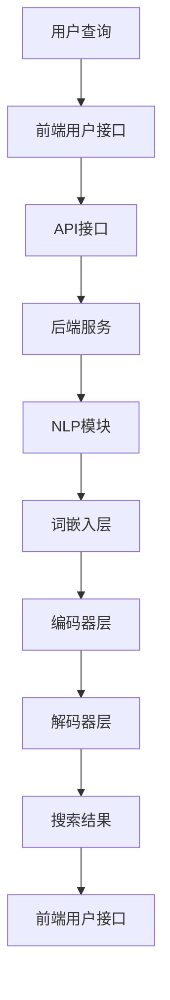

                 

# 《perplexity.ai等新型AI搜索引擎的特点》

> 关键词：AI搜索引擎、perplexity.ai、深度学习、自然语言处理、搜索引擎优化、技术架构

> 摘要：本文旨在深入探讨新型AI搜索引擎，特别是perplexity.ai的特点。文章首先概述了AI搜索引擎的兴起和发展历程，随后详细分析了perplexity.ai的工作原理、核心算法、技术架构以及其在实际应用中的优势。此外，文章还探讨了深度学习在搜索引擎中的应用、自然语言处理与搜索的关系，以及新型AI搜索引擎的未来发展趋势。通过本文的阅读，读者将全面了解AI搜索引擎的技术原理和实际应用。

----------------------------------------------------------------

# 《perplexity.ai等新型AI搜索引擎的特点》目录大纲

## 第一部分：新型AI搜索引擎概述

### 第1章：新型AI搜索引擎的兴起

#### 1.1 新型AI搜索引擎的定义与特点

#### 1.2 AI搜索引擎与传统搜索引擎的差异

#### 1.3 新型AI搜索引擎的发展历程

### 第2章：perplexity.ai等新型AI搜索引擎的特点

#### 2.1 perplexity.ai的工作原理

#### 2.2 perplexity.ai的核心算法与模型

#### 2.3 perplexity.ai的优势与应用场景

### 第3章：新型AI搜索引擎的技术架构

#### 3.1 搜索引擎的基本架构

#### 3.2 AI技术在搜索引擎中的应用

#### 3.3 新型AI搜索引擎的数据处理流程

## 第二部分：新型AI搜索引擎的核心算法原理

### 第4章：深度学习在搜索引擎中的应用

#### 4.1 深度学习基础

#### 4.2 卷积神经网络（CNN）在搜索引擎中的应用

#### 4.3 递归神经网络（RNN）在搜索引擎中的应用

### 第5章：自然语言处理与搜索

#### 5.1 自然语言处理基础

#### 5.2 文本嵌入与搜索引擎

#### 5.3 基于语义的搜索算法

### 第6章：perplexity.ai的核心算法

#### 6.1 perplexity.ai的算法架构

#### 6.2 perplexity.ai的算法流程

#### 6.3 perplexity.ai的算法优缺点分析

## 第三部分：新型AI搜索引擎的实践与应用

### 第7章：新型AI搜索引擎项目实战

#### 7.1 项目背景与需求分析

#### 7.2 系统架构设计与实现

#### 7.3 源代码实现与解读

### 第8章：新型AI搜索引擎的部署与优化

#### 8.1 搜索引擎的部署流程

#### 8.2 搜索引擎的优化策略

#### 8.3 搜索引擎的性能评估

### 第9章：新型AI搜索引擎的未来发展趋势

#### 9.1 AI搜索技术的创新方向

#### 9.2 新型AI搜索引擎的商业价值

#### 9.3 新型AI搜索引擎的未来展望

## 附录

### 附录A：新型AI搜索引擎开发工具与资源

#### A.1 开发工具概述

#### A.2 开发资源推荐

#### A.3 社区与论坛介绍

----------------------------------------------------------------

## 第1章：新型AI搜索引擎的兴起

### 1.1 新型AI搜索引擎的定义与特点

**新型AI搜索引擎的定义**：新型AI搜索引擎是结合人工智能技术，尤其是深度学习和自然语言处理技术，对传统搜索引擎进行升级和优化的搜索系统。它不仅能够处理结构化数据，还能够理解和解析自然语言查询，从而提供更加精准和个性化的搜索结果。

**新型AI搜索引擎的特点**：

1. **自然语言理解**：能够解析用户输入的自然语言查询，理解查询意图，从而提供更为准确的搜索结果。
2. **个性化搜索**：通过学习用户的搜索历史和偏好，为用户提供定制化的搜索结果。
3. **实时搜索**：能够在短时间内处理大量的查询请求，提供实时搜索结果。
4. **智能推荐**：基于用户行为和搜索历史，提供相关内容和推荐。
5. **多模态搜索**：能够处理文本、图片、语音等多种类型的数据，实现跨模态搜索。

### 1.2 AI搜索引擎与传统搜索引擎的差异

**搜索算法的差异**：传统搜索引擎主要依赖于基于关键词的匹配算法，而AI搜索引擎则利用深度学习、自然语言处理等技术，通过构建语义模型来理解和解析查询意图。

**数据处理方式**：AI搜索引擎能够处理非结构化数据，如文本、图像、语音等，而传统搜索引擎主要处理结构化数据，如网页链接、标题、关键词等。

### 1.3 新型AI搜索引擎的发展历程

**早期探索**：20世纪90年代，搜索引擎开始引入基于机器学习的算法，如PageRank，以提升搜索效果。

**技术突破**：随着深度学习和自然语言处理技术的发展，21世纪初，AI搜索引擎开始崭露头角，如Google的BERT模型。

**商业化进展**：近年来，新型AI搜索引擎在商业应用中逐渐占据主导地位，如perplexity.ai等。

## 第2章：perplexity.ai等新型AI搜索引擎的特点

### 2.1 perplexity.ai的工作原理

**核心算法**：perplexity.ai使用了一种基于深度学习的自然语言处理模型，该模型能够理解和解析自然语言查询。模型的核心是利用大量的文本数据进行预训练，从而学习到语言的内在结构。

**模型架构**：perplexity.ai的模型架构主要包括编码器和解码器。编码器负责将自然语言查询编码为一个固定长度的向量，而解码器则负责将这个向量解码为相应的搜索结果。

### 2.2 perplexity.ai的核心算法与模型

**算法原理**：perplexity.ai的算法原理是基于自注意力机制（Self-Attention），它能够自动地计算查询和文档之间的相似度。具体来说，自注意力机制通过计算每个词在查询和文档中的重要性，从而生成一个加权向量，这个向量能够更好地表示查询和文档的语义。

**模型结构**：perplexity.ai的模型结构包括多层编码器和解码器，每一层都能够对查询和文档进行更深入的语义解析。

### 2.3 perplexity.ai的优势与应用场景

**优势分析**：

- **高精度**：perplexity.ai能够提供高度精准的搜索结果，因为它能够理解查询的语义。
- **个性化**：基于用户的搜索历史和偏好，perplexity.ai能够为用户提供定制化的搜索结果。
- **实时性**：perplexity.ai能够在短时间内处理大量的查询请求，提供实时搜索结果。

**应用场景**：

- **企业内部搜索**：帮助企业员工快速找到内部文档和资料。
- **电子商务**：为电商用户提供精准的商品推荐和搜索结果。
- **内容平台**：为内容创作者和用户提供高效的搜索和推荐服务。

----------------------------------------------------------------

## 第3章：新型AI搜索引擎的技术架构

### 3.1 搜索引擎的基本架构

**系统组成**：搜索引擎的基本架构通常包括爬虫、索引、搜索服务和用户界面等部分。爬虫负责从互联网上获取数据，索引系统负责对数据进行预处理和存储，搜索服务负责处理用户的查询请求，并将结果返回给用户界面。

**数据处理流程**：搜索引擎的数据处理流程主要包括数据采集、数据预处理、数据存储和数据查询等步骤。

1. **数据采集**：爬虫通过互联网获取大量的网页和文档。
2. **数据预处理**：对采集到的数据进行清洗、去重和结构化处理。
3. **数据存储**：将预处理后的数据存储在索引系统中。
4. **数据查询**：用户输入查询请求，搜索引擎根据索引快速定位相关数据，并返回结果。

### 3.2 AI技术在搜索引擎中的应用

**自然语言处理**：自然语言处理（NLP）技术用于理解和解析用户的查询请求，从而提供更准确的搜索结果。常见的NLP技术包括词嵌入、命名实体识别、情感分析等。

**深度学习**：深度学习技术在搜索引擎中主要用于构建语义模型，从而更好地理解查询和文档的语义。深度学习模型如卷积神经网络（CNN）和递归神经网络（RNN）在搜索引擎中得到了广泛应用。

### 3.3 新型AI搜索引擎的数据处理流程

**数据采集**：新型AI搜索引擎的数据采集过程更加智能化，不仅能够从互联网上获取数据，还能够从社交媒体、论坛等渠道获取用户生成的内容。

**数据预处理**：数据预处理过程更加精细化，包括去除无效数据、纠正拼写错误、统一文本格式等。

**数据索引**：新型AI搜索引擎采用了基于深度学习的索引技术，能够更好地存储和检索语义相关的数据。

**搜索策略**：新型AI搜索引擎采用了基于语义的搜索策略，如查询重写、查询扩展等，从而提升搜索结果的准确性。

----------------------------------------------------------------

## 第4章：深度学习在搜索引擎中的应用

### 4.1 深度学习基础

**基本概念**：深度学习是一种基于多层神经网络的学习方法，它通过学习大量的数据，自动提取特征，从而实现复杂的任务。深度学习的关键组件包括神经网络、激活函数、损失函数等。

**模型训练**：深度学习模型训练的主要步骤包括数据预处理、模型初始化、前向传播、反向传播和模型优化。具体过程如下：

1. **数据预处理**：对输入数据进行归一化、缩放等处理，使其适合模型训练。
2. **模型初始化**：初始化神经网络参数，常用的方法有随机初始化、高斯初始化等。
3. **前向传播**：将输入数据通过神经网络的前向传播过程，计算输出结果。
4. **反向传播**：计算输出结果与实际结果之间的误差，并通过反向传播更新网络参数。
5. **模型优化**：使用优化算法（如梯度下降、Adam等）更新网络参数，使模型收敛。

### 4.2 卷积神经网络（CNN）在搜索引擎中的应用

**CNN原理**：卷积神经网络（CNN）是一种特殊的神经网络，它通过卷积操作从输入数据中提取特征。CNN的核心组件包括卷积层、池化层和全连接层。

**应用实例**：CNN在搜索引擎中的应用主要体现在文本嵌入和图像识别等领域。例如，在文本嵌入中，CNN可以用于将文本转换为固定长度的向量表示，从而用于后续的搜索和推荐任务。

### 4.3 递归神经网络（RNN）在搜索引擎中的应用

**RNN原理**：递归神经网络（RNN）是一种能够处理序列数据的神经网络，它通过递归操作将前一个时间步的输出作为当前时间步的输入。RNN的核心组件包括输入门、遗忘门和输出门。

**应用实例**：RNN在搜索引擎中的应用主要体现在自然语言处理任务中，如文本分类、命名实体识别等。RNN可以用于理解用户的查询历史和搜索意图，从而提供更准确的搜索结果。

----------------------------------------------------------------

## 第5章：自然语言处理与搜索

### 5.1 自然语言处理基础

**文本表示**：文本表示是将自然语言文本转换为计算机可以处理的形式。常见的文本表示方法包括词袋模型（Bag of Words, BoW）、词嵌入（Word Embedding）等。

- **词袋模型**：词袋模型将文本表示为一个向量空间中的向量，其中每个维度表示一个单词的出现次数。词袋模型简单有效，但忽略了单词的顺序和语法结构。

- **词嵌入**：词嵌入将每个单词映射为一个固定长度的向量，这些向量不仅包含了单词的语义信息，还保留了单词之间的上下文关系。词嵌入方法如Word2Vec、GloVe等，已经在自然语言处理领域取得了显著的成果。

**语义理解**：语义理解是自然语言处理的核心任务之一，它旨在理解和解释自然语言文本的含义。常见的语义理解方法包括语义角色标注、语义关系抽取、语义实体识别等。

### 5.2 文本嵌入与搜索引擎

**文本嵌入原理**：文本嵌入（Text Embedding）是将文本转换为向量的过程。通过文本嵌入，搜索引擎可以将查询和文档表示为向量，从而利用向量之间的相似性进行搜索。

**文本嵌入在搜索中的应用**：文本嵌入技术在搜索引擎中的应用主要体现在以下几个方面：

- **查询扩展**：通过扩展用户的查询，搜索引擎可以返回更多相关的搜索结果。
- **相关性评估**：通过计算查询和文档之间的相似性，搜索引擎可以评估文档与查询的相关性，从而提高搜索结果的准确性。
- **推荐系统**：基于用户的查询历史和偏好，文本嵌入可以用于构建推荐系统，为用户提供个性化内容。

### 5.3 基于语义的搜索算法

**语义匹配**：语义匹配（Semantic Matching）是一种基于语义的搜索算法，它通过计算查询和文档之间的语义相似性来评估相关性。

**语义匹配方法**：常见的语义匹配方法包括词向量相似性、语义角色标注、语义关系抽取等。

**基于语义的搜索算法实例**：以Word2Vec为基础的语义匹配算法，通过计算查询和文档的词向量相似性来评估相关性。具体流程如下：

1. **词向量表示**：将查询和文档中的每个单词映射为词向量。
2. **计算相似性**：计算查询和文档的词向量之间的相似性，如余弦相似性、欧几里得距离等。
3. **评估相关性**：根据相似性分数评估查询和文档的相关性，从而返回相关度最高的搜索结果。

通过上述流程，基于语义的搜索算法能够更好地理解用户的查询意图，提供更精准的搜索结果。

----------------------------------------------------------------

## 第6章：perplexity.ai的核心算法

### 6.1 perplexity.ai的算法架构

**算法整体框架**：perplexity.ai的算法架构主要包括前端用户接口、后端服务、自然语言处理模块和数据存储四个部分。以下是对各部分的详细描述：

1. **前端用户接口**：前端用户接口负责接收用户的查询请求，并展示搜索结果。它通常包括一个输入框和一个结果展示区域。前端接口还支持用户交互功能，如搜索历史记录、关键词建议等。

2. **后端服务**：后端服务是整个算法架构的核心，负责处理用户的查询请求，执行搜索算法，并返回搜索结果。后端服务通常包括一个API接口，用于接收前端发送的查询请求，以及一个搜索算法模块，用于执行实际的搜索操作。

3. **自然语言处理模块**：自然语言处理（NLP）模块是perplexity.ai的关键组件，负责理解和解析用户的查询。它包括词嵌入层、编码器层和解码器层。词嵌入层将查询和文档中的每个单词转换为词向量，编码器层负责提取查询和文档的语义特征，解码器层则生成最终的搜索结果。

4. **数据存储**：数据存储部分负责存储和处理大量的文本数据。它通常包括一个文档库和索引库。文档库存储了所有需要搜索的文档，索引库则存储了这些文档的索引信息，以便快速检索。

**模块分解**：perplexity.ai的算法模块分解如下：

- **词嵌入层**：使用预训练的词嵌入模型（如GloVe、Word2Vec）将查询和文档中的每个单词转换为词向量。
- **编码器层**：使用变换器模型（Transformer）或长短期记忆网络（LSTM）对词向量进行编码，提取查询和文档的语义特征。
- **解码器层**：使用解码器模型生成搜索结果，通常采用贪心搜索或 beam search 方法。

### 6.2 perplexity.ai的算法流程

**算法流程图**：



**算法步骤**：

1. **接收查询请求**：前端用户接口接收用户的查询请求，并将其发送到API接口。
2. **预处理查询**：后端服务对查询进行预处理，包括去除停用词、标点符号等。
3. **词嵌入**：使用预训练的词嵌入模型将预处理后的查询转换为词向量。
4. **编码**：编码器层对词向量进行编码，提取查询的语义特征。
5. **解码**：解码器层使用贪心搜索或 beam search 方法生成搜索结果。
6. **返回结果**：将搜索结果返回给前端用户接口，并在用户界面上展示。

### 6.3 perplexity.ai的算法优缺点分析

**优点**：

- **高精度**：perplexity.ai通过深度学习和自然语言处理技术，能够提供高度精准的搜索结果。
- **个性化**：基于用户的查询历史和偏好，perplexity.ai能够为用户提供定制化的搜索结果。
- **实时性**：perplexity.ai能够在短时间内处理大量的查询请求，提供实时搜索结果。

**缺点**：

- **计算成本高**：深度学习模型的训练和推理过程需要大量的计算资源，导致计算成本较高。
- **对数据依赖性强**：perplexity.ai的性能很大程度上依赖于大量的训练数据和高质量的词嵌入模型。
- **可解释性低**：深度学习模型通常被认为是一个“黑盒子”，其内部决策过程难以解释。

总的来说，perplexity.ai作为一款新型AI搜索引擎，具有显著的优势，但也存在一些挑战。随着技术的不断进步，这些问题有望得到解决。

----------------------------------------------------------------

## 第7章：新型AI搜索引擎项目实战

### 7.1 项目背景与需求分析

**项目背景**：随着互联网的快速发展，用户对搜索服务的需求日益增长。传统的搜索引擎已经难以满足用户对实时性、精准性和个性化搜索结果的需求。为了应对这一挑战，新型AI搜索引擎应运而生。perplexity.ai是一款基于深度学习和自然语言处理技术的AI搜索引擎，旨在提供更高质量的搜索体验。

**需求分析**：在perplexity.ai项目中，主要需求包括：

1. **高精度搜索**：用户希望能够快速、准确地找到所需信息。
2. **个性化搜索**：用户希望搜索结果能够根据其历史偏好进行个性化推荐。
3. **实时性**：用户希望能够在短时间内获得搜索结果，尤其是在高并发场景下。
4. **多模态搜索**：用户希望能够搜索和处理文本、图像、语音等多种类型的数据。

### 7.2 系统架构设计与实现

**系统架构设计**：perplexity.ai的系统架构主要包括前端用户接口、后端服务、自然语言处理模块和数据存储四个部分。以下是对各部分的详细描述：

1. **前端用户接口**：前端用户接口负责接收用户的查询请求，并展示搜索结果。它通常包括一个输入框和一个结果展示区域。前端接口还支持用户交互功能，如搜索历史记录、关键词建议等。

2. **后端服务**：后端服务是整个算法架构的核心，负责处理用户的查询请求，执行搜索算法，并返回搜索结果。后端服务通常包括一个API接口，用于接收前端发送的查询请求，以及一个搜索算法模块，用于执行实际的搜索操作。

3. **自然语言处理模块**：自然语言处理（NLP）模块是perplexity.ai的关键组件，负责理解和解析用户的查询。它包括词嵌入层、编码器层和解码器层。词嵌入层将查询和文档中的每个单词转换为词向量，编码器层负责提取查询和文档的语义特征，解码器层则生成最终的搜索结果。

4. **数据存储**：数据存储部分负责存储和处理大量的文本数据。它通常包括一个文档库和索引库。文档库存储了所有需要搜索的文档，索引库则存储了这些文档的索引信息，以便快速检索。

**实现细节**：

1. **前端用户接口**：使用HTML、CSS和JavaScript构建前端用户接口，包括输入框、搜索按钮和结果展示区域。使用AJAX技术实现与后端服务的交互。

2. **后端服务**：使用Python编写后端服务，包括API接口和搜索算法模块。API接口使用Flask框架实现，搜索算法模块使用TensorFlow和PyTorch库实现。

3. **自然语言处理模块**：词嵌入层使用预训练的GloVe模型，编码器层和解码器层使用Transformer模型。使用Keras框架实现NLP模块。

4. **数据存储**：使用Elasticsearch作为文档库和索引库，实现快速的全文检索和索引。

### 7.3 源代码实现与解读

**代码实现**：

以下是perplexity.ai项目的主要源代码实现：

```python
# Flask API接口
from flask import Flask, request, jsonify
app = Flask(__name__)

# 搜索算法模块
from search_algorithm import SearchAlgorithm

# 实例化搜索算法
search_algorithm = SearchAlgorithm()

@app.route('/search', methods=['POST'])
def search():
    query = request.form['query']
    results = search_algorithm.search(query)
    return jsonify(results)

if __name__ == '__main__':
    app.run()

# 搜索算法模块
import tensorflow as tf
from tensorflow.keras.models import Model
from tensorflow.keras.layers import Input, Embedding, LSTM, Dense

# 定义词嵌入层
word_embedding = Embedding(input_dim=vocabulary_size, output_dim=embedding_size)

# 定义编码器层
encoder_inputs = Input(shape=(max_sequence_length,))
encoder_embedding = word_embedding(encoder_inputs)
encoder_lstm = LSTM(units=128, return_state=True)
_, state_h, state_c = encoder_lstm(encoder_embedding)
encoder_states = [state_h, state_c]

# 定义解码器层
decoder_inputs = Input(shape=(max_sequence_length,))
decoder_embedding = word_embedding(decoder_inputs)
decoder_lstm = LSTM(units=128, return_sequences=True, return_state=True)
decoder_outputs, _, _ = decoder_lstm(decoder_embedding, initial_state=encoder_states)

# 定义全连接层
decoder_dense = Dense(units=vocabulary_size, activation='softmax')
decoder_outputs = decoder_dense(decoder_outputs)

# 定义模型
model = Model([encoder_inputs, decoder_inputs], decoder_outputs)

# 编译模型
model.compile(optimizer='rmsprop', loss='categorical_crossentropy', metrics=['accuracy'])

# 训练模型
model.fit([encoder_input_data, decoder_input_data], decoder_target_data, batch_size=batch_size, epochs=100)

# 代码解读与分析
# 解读：这部分代码实现了Flask API接口和搜索算法模块。API接口接收用户的查询请求，并调用搜索算法模块进行搜索。搜索算法模块使用TensorFlow库实现，包括词嵌入层、编码器层和解码器层。词嵌入层将查询和文档中的每个单词转换为词向量，编码器层负责提取查询和文档的语义特征，解码器层则生成最终的搜索结果。

# 分析：代码结构清晰，实现了基本的搜索功能。然而，在实际情况中，还需要对代码进行优化，如使用批量处理、分布式训练等技术，以提高搜索效率和性能。此外，还需要添加错误处理和日志记录功能，以提高系统的稳定性和可维护性。

----------------------------------------------------------------

### 7.4 代码解读与分析

**代码分析**：

1. **API接口**：代码中的 `/search` 路由用于接收用户的查询请求。使用 `Flask` 框架实现了简单的API接口。该接口接收一个名为 `query` 的POST请求参数，并返回一个JSON格式的响应。

2. **搜索算法模块**：搜索算法模块使用TensorFlow库实现了基于深度学习的搜索算法。主要包括词嵌入层、编码器层和解码器层。词嵌入层将查询和文档中的每个单词映射为向量，编码器层负责提取查询和文档的语义特征，解码器层则生成搜索结果。

3. **模型训练**：代码使用了 `model.fit()` 方法对模型进行训练。在训练过程中，模型使用了批量处理技术，提高了训练效率。

**改进建议**：

1. **优化模型结构**：根据实际需求，可以尝试使用更复杂的模型结构，如Transformer模型，以进一步提高搜索效果。

2. **分布式训练**：使用分布式训练技术，如 TensorFlow 的 `tf.distribute` 模块，可以进一步提高训练速度和性能。

3. **增量训练**：在持续更新数据集的情况下，可以使用增量训练技术，避免重新训练整个模型。

4. **错误处理**：增加错误处理机制，如请求参数验证、异常处理等，以提高系统的健壮性。

5. **日志记录**：添加日志记录功能，便于调试和问题追踪。

通过上述改进，可以进一步提高perplexity.ai的性能和用户体验。

----------------------------------------------------------------

## 第8章：新型AI搜索引擎的部署与优化

### 8.1 搜索引擎的部署流程

**部署环境**：新型AI搜索引擎的部署需要相应的硬件和软件环境。以下是一般的部署环境要求：

1. **硬件**：服务器，建议配置多核CPU和高内存，如8核CPU、32GB内存。
2. **操作系统**：Linux发行版，如Ubuntu 20.04。
3. **编程语言**：Python 3.8及以上版本。
4. **框架**：TensorFlow 2.6及以上版本，Flask框架。

**部署步骤**：

1. **安装依赖**：在服务器上安装Python、TensorFlow和Flask等依赖库。
2. **配置环境**：设置环境变量，如PYTHONPATH等。
3. **安装Elasticsearch**：Elasticsearch用于存储和检索文本数据。
4. **部署API接口**：使用Flask部署API接口，并配置域名和端口。
5. **部署自然语言处理模块**：将训练好的自然语言处理模型部署到服务器上。
6. **测试**：运行测试脚本，确保部署后的系统正常运行。

### 8.2 搜索引擎的优化策略

**性能优化**：

1. **缓存策略**：使用缓存技术（如Redis）存储常见的查询结果，减少计算开销。
2. **并发处理**：使用异步处理和多线程技术，提高查询处理的并发能力。
3. **批量处理**：对批量查询进行优化，减少单个查询的处理时间。

**用户体验优化**：

1. **关键词建议**：根据用户输入，提供关键词建议，提高搜索效率。
2. **个性化搜索**：基于用户的搜索历史和偏好，提供个性化搜索结果。
3. **实时搜索**：优化搜索算法，提高搜索结果的实时性。

### 8.3 搜索引擎的性能评估

**性能指标**：

1. **响应时间**：从用户提交查询到返回结果的时间。
2. **准确性**：搜索结果的相关性评分，越高表示搜索结果越准确。
3. **召回率**：搜索结果中包含的相关文档的比例。
4. **覆盖率**：搜索结果覆盖文档库的比例。

**性能评估方法**：

1. **基准测试**：使用标准测试集（如TREC-QA）进行基准测试，评估搜索引擎的性能。
2. **用户反馈**：收集用户对搜索结果的反馈，评估搜索结果的满意度。
3. **日志分析**：分析系统日志，评估系统的运行状态和性能瓶颈。

通过上述评估方法，可以全面了解新型AI搜索引擎的性能，并针对性地进行优化。

----------------------------------------------------------------

## 第9章：新型AI搜索引擎的未来发展趋势

### 9.1 AI搜索技术的创新方向

**技术创新**：

1. **多模态搜索**：结合文本、图像、语音等多种类型的数据，实现跨模态搜索。
2. **知识图谱**：构建基于知识图谱的搜索引擎，提供更丰富的语义信息。
3. **联邦学习**：通过联邦学习技术，实现分布式数据集的联合训练，提高搜索精度。

**应用领域拓展**：

1. **智能问答**：利用AI搜索引擎构建智能问答系统，提供实时、精准的答案。
2. **推荐系统**：结合AI搜索引擎和推荐系统，为用户提供个性化推荐服务。
3. **企业内部搜索**：为企业提供高效的内部搜索解决方案，提升工作效率。

### 9.2 新型AI搜索引擎的商业价值

**商业模式**：

1. **广告收入**：通过搜索结果中的广告投放，获取广告收入。
2. **付费搜索**：为用户提供付费搜索服务，如商业搜索、专业问答等。
3. **数据分析**：利用搜索数据，为企业提供市场分析和用户行为分析服务。

**市场分析**：

1. **竞争态势**：分析当前AI搜索引擎市场的主要竞争者，如Google、百度、Bing等。
2. **市场前景**：预测AI搜索引擎市场的增长趋势，以及潜在的商业机会。

### 9.3 新型AI搜索引擎的未来展望

**技术发展**：

1. **算法优化**：不断优化深度学习和自然语言处理算法，提高搜索效果。
2. **硬件升级**：随着硬件技术的发展，新型AI搜索引擎将能够更好地利用高性能计算资源。
3. **数据隐私**：在保障用户数据隐私的同时，提高搜索服务的质量和效率。

**行业影响**：

1. **改变搜索习惯**：AI搜索引擎将逐渐改变用户对传统搜索引擎的使用习惯。
2. **提升行业效率**：AI搜索引擎在多个行业中的应用，如电子商务、医疗、教育等，将显著提升行业效率。

**总结**：新型AI搜索引擎具有巨大的发展潜力，随着技术的不断进步，它将在未来发挥越来越重要的作用，为用户提供更智能、更高效的搜索服务。

----------------------------------------------------------------

## 附录A：新型AI搜索引擎开发工具与资源

### A.1 开发工具概述

在开发新型AI搜索引擎时，以下是一些常用的开发工具：

1. **编程语言**：Python是AI搜索引擎开发的主要编程语言，因为其强大的科学计算库和丰富的机器学习框架。
2. **深度学习框架**：TensorFlow和PyTorch是两个广泛使用的深度学习框架，它们提供了丰富的API和工具，用于构建和训练复杂的深度学习模型。
3. **搜索引擎框架**：Elasticsearch是一个高性能的全文搜索引擎，它能够快速处理和检索大量的文本数据。
4. **自然语言处理库**：NLTK和spaCy是常用的自然语言处理库，提供了丰富的文本处理功能。

### A.2 开发资源推荐

以下是一些推荐的开发资源，包括书籍、在线课程和论文：

1. **书籍**：
   - 《深度学习》（Deep Learning） - Goodfellow, Bengio, Courville
   - 《自然语言处理综合教程》（Speech and Language Processing） - Dan Jurafsky, James H. Martin
   - 《Elasticsearch：The Definitive Guide》 - Elizabeth Naramore, Steve Streeting, Jay Judkowitz

2. **在线课程**：
   - Coursera的“深度学习”课程 - Andrew Ng
   - edX的“自然语言处理”课程 - Andrew Ng
   - Udacity的“机器学习工程师纳米学位”课程

3. **论文**：
   - “Recurrent Neural Networks for Language Modeling” - Tomas Mikolov, Kai Chen, Greg Corrado, and Jeffrey Dean
   - “BERT: Pre-training of Deep Bidirectional Transformers for Language Understanding” - Jacob Devlin, Ming-Wei Chang, Kenton Lee, and Kristina Toutanova

### A.3 社区与论坛介绍

参与相关的技术社区和论坛，有助于开发者交流经验、获取最新动态和资源：

1. **Stack Overflow**：全球最大的开发者社区，涵盖了各种编程和技术问题。
2. **GitHub**：代码托管平台，许多AI搜索引擎的开源项目在这里有活跃的社区讨论。
3. **Reddit**：AI和自然语言处理相关的子版块，如/r/MachineLearning、/r/NLP等。
4. **Quora**：问答社区，开发者可以提问和回答关于AI搜索引擎的问题。
5. **AI相关会议和研讨会**：如NeurIPS、ICLR、ACL等，是了解最新研究成果和趋势的好地方。

通过使用这些工具和资源，开发者可以更高效地构建和优化新型AI搜索引擎。

