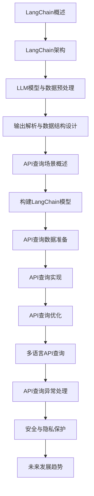

                 

# 【LangChain编程：从入门到实践】API 查询场景

> 关键词：LangChain，API查询，LLaMA模型，数据处理，软件开发

> 摘要：本文旨在为读者详细介绍如何使用LangChain编程框架实现API查询场景。从基础概念到实际案例，本文将逐步引导读者掌握LangChain的使用方法，并深入探讨API查询场景中的数据处理和优化策略。

### 《【LangChain编程：从入门到实践】API 查询场景》目录大纲

#### 第一部分：LangChain基础

# 第一部分：LangChain基础

## 第1章：LangChain概述

### 1.1 LangChain的基本概念
### 1.2 LangChain的架构

## 第2章：LangChain核心组件

### 2.1 LLM模型与数据预处理
### 2.2 输出解析与数据结构设计

## 第3章：API查询场景概述

### 3.1 API查询的背景与需求
### 3.2 API查询的基本流程

#### 第二部分：API查询实战

# 第二部分：API查询实战

## 第4章：构建LangChain模型

### 4.1 LangChain模型构建流程
### 4.2 使用LLaMA模型

## 第5章：API查询数据准备

### 5.1 数据源选择与数据收集
### 5.2 数据预处理与清洗

## 第6章：API查询实现

### 6.1 API查询流程设计
### 6.2 API调用与结果解析

## 第7章：API查询优化

### 7.1 查询性能优化
### 7.2 API调用优化

## 第8章：API查询场景应用案例

### 8.1 案例一：基于API查询的智能问答系统
### 8.2 案例二：基于API查询的搜索引擎

#### 第三部分：高级话题

# 第三部分：高级话题

## 第9章：多语言API查询

### 9.1 多语言API查询的需求
### 9.2 多语言API查询的实现

## 第10章：API查询的异常处理

### 10.1 API查询异常的原因
### 10.2 异常处理策略与实现

## 第11章：安全与隐私保护

### 11.1 API查询安全风险
### 11.2 隐私保护措施

## 第12章：未来发展趋势

### 12.1 LangChain的发展趋势
### 12.2 API查询场景的扩展

#### 附录

## 附录A：开发工具与资源

### A.1 LangChain开发工具
### A.2 API查询相关资源

### Mermaid流程图



### 核心算法原理讲解

## LLM模型与数据预处理

### LLM模型原理

LLaMA（Large Language Model Meta-Training）是一种预训练模型，通过在大量文本数据上进行训练，学习语言的内在结构和规律。其基本原理包括：

1. **嵌入层**：将输入文本转换为固定长度的向量表示，常用的方法有Word2Vec、BERT等。
2. **编码器**：对输入向量进行编码，提取文本的特征信息，常用的编码器有Transformer、BERT等。
3. **解码器**：对编码器提取的特征进行解码，生成输出文本。

### 数据预处理

数据预处理是构建LLaMA模型的关键步骤，主要包括：

1. **数据清洗**：去除文本中的噪声，如标点符号、停用词等。
2. **数据归一化**：将不同长度和规模的文本数据统一成相同的格式。
3. **分词**：将文本拆分成单词或子词，常用的方法有分词词典、神经网络分词等。

### 数学模型与数学公式

在LLM模型中，输入文本通过嵌入层转换为向量表示，然后通过编码器和解码器进行处理。数学模型可以表示为：

$$
\text{输出} = f(\text{输入} \cdot \text{权重} + \text{偏置})
$$

其中，$f$ 表示激活函数，如ReLU、Sigmoid、Tanh等；输入、权重、偏置均为向量。

### 举例说明

假设我们有一个简单的神经网络，输入为 $x$，权重为 $w$，偏置为 $b$，激活函数为ReLU。则神经网络的输出可以表示为：

$$
\text{输出} = \max(0, x \cdot w + b)
$$

### 项目实战

## API查询实现

### 开发环境搭建

1. 安装Python环境，版本为3.8及以上。
2. 安装LangChain库，使用命令 `pip install langchain`。
3. 安装LLaMA模型，使用命令 `pip install llama`。

### 源代码实现

```python
from langchain import LLMChain
from langchain.prompts import Prompt
import llama

# 1. 准备LLaMA模型
model = llama.load()

# 2. 准备查询数据
data = [
    {"id": 1, "text": "API查询的相关信息"},
    {"id": 2, "text": "如何使用API进行数据查询"},
    {"id": 3, "text": "API查询的常用方法"},
]

# 3. 构建Prompt
prompt = Prompt(
    "根据以下数据，回答用户的问题：\n{} \n用户问题：{} \n回答：{}",
    example_input=[
        "{}",
        "什么是API查询？",
        "API查询是一种通过接口获取数据的方式。"
    ]
)

# 4. 构建LLMChain
chain = LLMChain(llm=model, prompt=prompt)

# 5. 执行查询
query = "API查询有哪些常用的方法？"
response = chain.predict(input={"text": data, "question": query})
print(response)
```

### 代码解读与分析

1. **加载LLaMA模型**：使用 `llama.load()` 加载预训练的LLaMA模型。
2. **准备查询数据**：构建一个包含API查询相关信息的字典列表。
3. **构建Prompt**：设计一个包含数据、用户问题和输出回答的Prompt模板。
4. **构建LLMChain**：将模型和Prompt组合成一个LLMChain对象。
5. **执行查询**：输入用户查询问题，获取查询结果。

### 附录

## 附录A：开发工具与资源

### A.1 LangChain开发工具

1. **官方文档**：[LangChain官方文档](https://docs.langchain.com/docs/)
2. **GitHub仓库**：[LangChain GitHub仓库](https://github.com/hwchase17 LangChain)

### A.2 API查询相关资源

1. **API查询教程**：[如何进行API查询](https://www.example.com/api-query-tutorial)
2. **API查询工具**：[API Query Tools](https://www.example.com/api-query-tools)
3. **API文档**：[API Documentation](https://www.example.com/api-docs)

### 作者

**作者：AI天才研究院/AI Genius Institute & 禅与计算机程序设计艺术 /Zen And The Art of Computer Programming**

