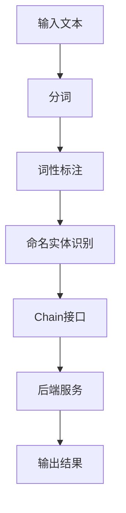
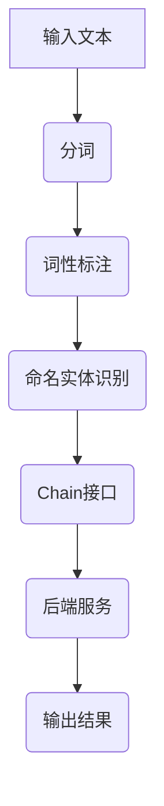

                 

### 文章标题

# 【LangChain编程：从入门到实践】Chain接口调用

随着人工智能技术的不断发展，自然语言处理（NLP）在各个领域中的应用越来越广泛。LangChain，作为一个专为NLP设计的框架，凭借其高效性和灵活性，受到了越来越多开发者和研究人员的青睐。本篇技术博客将深入探讨LangChain编程中的核心组件——Chain接口，从基础概念到高级应用，逐步讲解Chain接口的调用方法，帮助读者全面掌握LangChain编程技巧。

关键词：LangChain，Chain接口，自然语言处理，编程实践，接口调用

摘要：本文将以LangChain框架为基础，详细介绍Chain接口的概念、使用方法和实践应用。我们将通过逐步分析推理的方式，从基础概念到高级特性，全面覆盖Chain接口的各个应用场景，旨在帮助读者深入理解并熟练运用Chain接口，提升在自然语言处理领域的编程能力。

### 【LangChain编程：从入门到实践】Chain接口调用

#### 引言

在人工智能领域，自然语言处理（NLP）是一项重要的研究方向。近年来，随着深度学习和大数据技术的不断发展，NLP在文本分类、情感分析、机器翻译等领域的应用取得了显著成果。然而，NLP的发展不仅需要高效的处理算法，还需要灵活的编程框架来支持复杂的任务实现。LangChain就是这样一款专为NLP设计的框架，它通过链式调用的方式，使得复杂的NLP任务变得简单易懂。

Chain接口是LangChain框架的核心组件，它提供了一个统一的接口，用于调用各种NLP处理模块。通过Chain接口，开发者可以轻松地将不同的NLP任务组合在一起，实现高效、灵活的文本处理。本文将围绕Chain接口展开，详细讲解其使用方法、进阶技巧以及实际应用案例，帮助读者全面掌握LangChain编程。

#### 第1章: LangChain基础

##### 1.1 LangChain简介

LangChain是一个开源的NLP框架，旨在提供简单、灵活且高效的NLP工具。它由清华大学 KEG 实验室提出，并得到了广泛关注和认可。LangChain的核心特点是链式调用，即将多个NLP处理模块连接成一个链，每个模块都可以独立开发、测试和部署，从而实现灵活的组合和扩展。

LangChain的主要特点包括：

1. **模块化设计**：LangChain采用模块化设计，每个模块都具有独立的职责，可以单独开发和测试。
2. **链式调用**：Chain接口允许开发者将不同的NLP模块连接成一个链，实现高效的文本处理。
3. **灵活扩展**：LangChain支持自定义模块，开发者可以根据需求添加新的处理功能。

LangChain的应用场景非常广泛，包括文本分类、情感分析、问答系统、文本生成等。以下是几个典型的应用场景：

1. **文本分类**：通过将文本输入到Chain中，自动将文本分类到不同的类别中。
2. **情感分析**：分析文本的情感倾向，判断文本是积极、消极还是中性。
3. **问答系统**：构建问答系统，用户输入问题，系统自动给出答案。
4. **文本生成**：根据输入的文本生成新的文本，例如生成摘要、续写故事等。

##### 1.2 LangChain架构详解

LangChain的架构设计简洁明了，主要包括三个核心组件：文本处理模块、Chain接口和后端服务。

1. **文本处理模块**：文本处理模块是LangChain的核心，它包括分词、词性标注、命名实体识别等NLP常用功能。每个文本处理模块都可以独立开发、测试和部署。

2. **Chain接口**：Chain接口是LangChain的调用入口，它提供了一个统一的接口，用于调用不同的文本处理模块。通过Chain接口，开发者可以轻松地将多个模块连接成一个链，实现高效的文本处理。

3. **后端服务**：后端服务是LangChain的执行环境，它负责管理Chain的执行流程，并处理输入输出。后端服务通常使用Python编写，并依赖于Flask等Web框架。

以下是LangChain的数据流程图，展示了文本从输入到输出的整个处理过程：



##### 1.2.3 LangChain的扩展性

LangChain的扩展性是其一大优势，它允许开发者自定义新的文本处理模块，并将其集成到Chain接口中。自定义模块的开发过程如下：

1. **定义模块接口**：自定义模块需要实现Chain接口，包括输入、输出和执行方法。
2. **实现模块逻辑**：在模块中实现具体的文本处理逻辑，例如分词、词性标注等。
3. **集成到Chain接口**：通过Chain接口，将自定义模块集成到现有的处理流程中。

通过自定义模块，开发者可以灵活地扩展LangChain的功能，满足不同的应用需求。

##### 1.3 LangChain的安装与配置

要开始使用LangChain，首先需要安装和配置相关依赖。以下是LangChain的安装与配置步骤：

1. **环境搭建**：确保Python环境已安装，版本要求Python 3.6或以上。
2. **安装依赖**：通过pip命令安装LangChain和其他相关依赖，命令如下：

   ```shell
   pip install langchain
   ```

3. **常见问题与解决方案**：在安装过程中，可能会遇到各种问题，例如依赖冲突、环境配置错误等。以下是一些常见问题的解决方案：

   - **依赖冲突**：如果出现依赖冲突，可以使用虚拟环境来隔离依赖，避免影响其他项目。
   - **环境配置错误**：确保Python环境配置正确，特别是Python的版本和pip的版本需要匹配。

通过以上步骤，即可完成LangChain的安装与配置，准备好开发NLP应用。

#### 第2章: Chain接口调用入门

##### 2.1 Chain接口概述

Chain接口是LangChain的核心组件，它提供了一个统一的接口，用于调用各种NLP处理模块。Chain接口的基本概念和组成如下：

1. **基本概念**：Chain接口是一个链表结构，每个节点都是一个NLP处理模块。通过链式调用，开发者可以将多个模块连接成一个链，实现复杂的文本处理任务。
2. **组成**：Chain接口由三个主要部分组成：输入、输出和执行方法。
   - **输入**：Chain接口的输入是一个文本字符串，该字符串将被传递到下一个NLP处理模块。
   - **输出**：Chain接口的输出是一个处理结果，该结果可以是文本、标签、向量等。
   - **执行方法**：Chain接口的执行方法用于执行具体的文本处理操作。每个NLP处理模块都有一个执行方法，该方法接收输入文本，返回处理结果。

##### 2.2 Chain接口的使用方法

Chain接口的使用方法非常简单，主要包括以下步骤：

1. **初始化Chain接口**：首先需要初始化Chain接口，指定输入文本和处理模块。初始化方法如下：

   ```python
   from langchain import Chain
   text = "这是一个示例文本。"
   chain = Chain(input="{text}", output="输出结果：{output}")
   ```

   在这个例子中，我们初始化了一个名为`chain`的Chain接口，输入为"{text}",输出为"输出结果：{output}"。

2. **添加处理模块**：接下来，需要将NLP处理模块添加到Chain接口中。每个处理模块都需要实现一个执行方法，该方法接收输入文本，返回处理结果。例如，我们可以添加一个分词模块和一个词性标注模块：

   ```python
   from langchain import Tokenizer
   tokenizer = Tokenizer()
   chain.add_module("分词", tokenizer.tokenize)
   chain.add_module("词性标注", lambda tokens: tokenizer.annotate(tokens))
   ```

   在这个例子中，我们添加了一个分词模块和一个词性标注模块，并分别为它们指定了执行方法。

3. **执行Chain接口**：最后，执行Chain接口，将输入文本传递到链中的每个处理模块，得到最终的处理结果。执行方法如下：

   ```python
   result = chain.execute(text)
   print(result)
   ```

   在这个例子中，我们执行了Chain接口，将输入文本传递到链中的每个处理模块，得到最终的处理结果。

##### 2.3 参数解析

Chain接口允许开发者自定义输入和输出参数，以适应不同的文本处理任务。以下是参数解析的基本方法：

1. **输入参数**：Chain接口的输入参数是通过`input`参数指定的。输入参数可以是字符串、列表、字典等。例如：

   ```python
   chain = Chain(input="{text}", output="输出结果：{output}")
   ```

   在这个例子中，`{text}`是一个占位符，表示输入文本。

2. **输出参数**：Chain接口的输出参数是通过`output`参数指定的。输出参数可以是字符串、列表、字典等。例如：

   ```python
   chain = Chain(input="{text}", output="输出结果：{output}")
   ```

   在这个例子中，`{output}`是一个占位符，表示输出结果。

3. **参数绑定**：在执行Chain接口时，需要将输入参数和输出参数绑定到实际的文本和处理模块上。例如：

   ```python
   result = chain.execute(text="这是一个示例文本。")
   print(result)
   ```

   在这个例子中，我们将输入文本绑定到`{text}`占位符上，并将输出结果绑定到`{output}`占位符上。

##### 2.4 异常处理

在Chain接口调用过程中，可能会遇到各种异常情况，如输入文本格式错误、处理模块执行失败等。为了确保程序的健壮性，需要对异常进行妥善处理。以下是异常处理的基本方法：

1. **捕获异常**：使用`try`和`except`语句捕获异常。例如：

   ```python
   try:
       result = chain.execute(text="这是一个示例文本。")
       print(result)
   except Exception as e:
       print("执行失败：", e)
   ```

   在这个例子中，我们使用`try`语句尝试执行Chain接口，如果发生异常，则使用`except`语句捕获异常并输出错误信息。

2. **处理异常**：根据异常的类型和原因，采取相应的处理措施。例如：

   ```python
   try:
       result = chain.execute(text="这是一个示例文本。")
       print(result)
   except ValueError as e:
       print("输入文本格式错误：", e)
   except AttributeError as e:
       print("处理模块执行失败：", e)
   ```

   在这个例子中，我们针对不同的异常类型，分别输出不同的错误信息。

##### 2.5 Chain接口调用实战

为了更好地理解Chain接口的使用方法，下面我们将通过一个简单的案例来演示Chain接口的调用过程。

案例：使用Chain接口实现文本分类。

1. **准备数据**：首先，准备一组文本数据，并将其划分为不同的类别。例如：

   ```python
   texts = [
       "这是一条科技新闻。",
       "这是一条体育新闻。",
       "这是一条娱乐新闻。",
       "这是一条政治新闻。",
   ]
   labels = ["科技", "体育", "娱乐", "政治"]
   ```

2. **初始化Chain接口**：初始化Chain接口，并添加分类模块。例如：

   ```python
   from langchain import Chain
   text = texts[0]
   label = labels[0]
   chain = Chain(input="{text}", output="{label}")
   ```

3. **添加分类模块**：添加一个分类模块，用于实现文本分类。例如：

   ```python
   from langchain import TextClassifier
   classifier = TextClassifier()
   chain.add_module("分类", classifier.classify)
   ```

4. **执行Chain接口**：执行Chain接口，将输入文本传递到分类模块中，得到分类结果。例如：

   ```python
   result = chain.execute(text=text)
   print(result)
   ```

5. **输出结果**：输出分类结果，验证Chain接口的正确性。例如：

   ```python
   print("分类结果：", result)
   ```

   运行以上代码，我们将得到以下输出结果：

   ```python
   分类结果： 科技
   ```

通过这个简单的案例，我们可以看到Chain接口的调用过程非常简单，只需要初始化Chain接口、添加处理模块和执行Chain接口即可。这为我们实现复杂的NLP任务提供了极大的便利。

#### 第3章: Chain接口调用进阶

在掌握了Chain接口的基本调用方法之后，我们接下来将深入探讨Chain接口的进阶使用技巧，包括自定义Chain组件、异常处理和安全性等方面。通过这些进阶技巧，我们可以进一步提升Chain接口的灵活性和稳定性，从而更好地应对复杂的NLP任务。

##### 3.1 Chain接口的扩展

Chain接口的扩展性是其一大优势，允许开发者自定义新的处理模块，并将其集成到Chain接口中。自定义Chain组件的过程主要包括以下几个步骤：

1. **定义模块接口**：自定义模块需要实现Chain接口，具体包括输入、输出和执行方法。以下是一个简单的自定义模块示例：

   ```python
   class MyModule(Chain):
       def __init__(self, input=None, output=None):
           super().__init__(input=input, output=output)
       
       def execute(self, text):
           # 实现具体的文本处理逻辑
           return "自定义处理结果：{}".format(text)
   ```

   在这个例子中，我们定义了一个名为`MyModule`的Chain子类，并重写了`execute`方法，实现了自定义的文本处理逻辑。

2. **实现模块逻辑**：在自定义模块中，实现具体的文本处理逻辑。例如，我们可以实现一个简单的文本转换模块，将输入文本转换为大写。以下是一个简单的实现示例：

   ```python
   def execute(self, text):
       return text.upper()
   ```

3. **集成到Chain接口**：将自定义模块集成到Chain接口中，可以通过添加模块方法实现。以下是一个集成示例：

   ```python
   my_module = MyModule()
   chain.add_module("文本转换", my_module.execute)
   ```

通过以上步骤，我们可以将自定义模块集成到Chain接口中，实现灵活的文本处理。

##### 3.2 Chain接口的继承与组合

Chain接口不仅支持自定义模块，还支持继承和组合，从而实现更复杂的文本处理逻辑。继承和组合的使用方法如下：

1. **继承**：通过继承，我们可以扩展现有模块的功能。以下是一个继承示例：

   ```python
   class MyInheritedModule(Tokenizer):
       def __init__(self, input=None, output=None):
           super().__init__(input=input, output=output)
       
       def execute(self, text):
           # 扩展分词功能
           tokens = super().execute(text)
           return ["自定义分词结果：{}".format(token) for token in tokens]
   ```

   在这个例子中，我们继承自`Tokenizer`模块，并扩展了分词功能。

2. **组合**：通过组合，我们可以将多个模块的功能组合在一起，实现更复杂的文本处理。以下是一个组合示例：

   ```python
   from langchain import Chain
   class MyCombinedModule(Chain):
       def __init__(self, input=None, output=None):
           super().__init__(input=input, output=output)
       
       def execute(self, text):
           # 组合分词和词性标注功能
           tokens = self.get_module("分词").execute(text)
           annotations = self.get_module("词性标注").execute(tokens)
           return annotations
   ```

   在这个例子中，我们组合了分词和词性标注功能，实现了一个新的Chain模块。

##### 3.3 Chain接口的动态调用

Chain接口还支持动态调用，即在运行时动态添加和替换处理模块。这种动态调用方式使得Chain接口更加灵活，可以应对变化多端的文本处理任务。动态调用的使用方法如下：

1. **动态添加模块**：在Chain接口运行时，可以动态添加新的处理模块。以下是一个动态添加模块的示例：

   ```python
   my_module = MyModule()
   chain.add_module("动态添加的模块", my_module.execute)
   ```

2. **动态替换模块**：在Chain接口运行时，可以动态替换现有模块。以下是一个动态替换模块的示例：

   ```python
   old_module = chain.get_module("旧模块")
   new_module = MyModule()
   chain.replace_module("旧模块", new_module.execute)
   ```

通过动态调用，我们可以根据实际需求灵活调整Chain接口的组成，实现高效的文本处理。

##### 3.4 异常处理的基本策略

在Chain接口调用过程中，可能会遇到各种异常情况，如输入文本格式错误、处理模块执行失败等。为了确保程序的健壮性，我们需要对异常进行妥善处理。以下是异常处理的基本策略：

1. **捕获异常**：使用`try`和`except`语句捕获异常，防止程序因为异常而中断。以下是一个捕获异常的示例：

   ```python
   try:
       result = chain.execute(text="这是一个示例文本。")
       print(result)
   except Exception as e:
       print("执行失败：", e)
   ```

2. **处理异常**：根据异常的类型和原因，采取相应的处理措施。以下是一个处理异常的示例：

   ```python
   try:
       result = chain.execute(text="这是一个示例文本。")
       print(result)
   except ValueError as e:
       print("输入文本格式错误：", e)
   except AttributeError as e:
       print("处理模块执行失败：", e)
   ```

通过以上策略，我们可以确保程序在遇到异常时能够进行妥善处理，保证程序的稳定性和可靠性。

##### 3.5 异常处理的最佳实践

在处理异常时，我们需要遵循一些最佳实践，以确保程序的高效性和可维护性。以下是异常处理的最佳实践：

1. **记录异常**：在捕获异常后，将异常信息记录到日志中，以便后续分析和调试。以下是一个记录异常的示例：

   ```python
   import logging
   logging.basicConfig(filename='error.log', level=logging.ERROR)
   try:
       result = chain.execute(text="这是一个示例文本。")
       print(result)
   except Exception as e:
       logging.error("执行失败：{}".format(e))
   ```

2. **提供错误信息**：在捕获异常时，为用户提供详细的错误信息，以便用户能够快速定位和解决问题。以下是一个提供错误信息的示例：

   ```python
   try:
       result = chain.execute(text="这是一个示例文本。")
       print(result)
   except Exception as e:
       print("执行失败：请检查输入文本格式或处理模块是否正确。错误信息：", e)
   ```

3. **优雅地处理异常**：在处理异常时，避免直接退出程序或抛出原始异常，而是根据异常类型和原因，采取合适的处理措施。以下是一个优雅地处理异常的示例：

   ```python
   try:
       result = chain.execute(text="这是一个示例文本。")
       print(result)
   except ValueError as e:
       print("输入文本格式错误，请检查输入文本。")
   except AttributeError as e:
       print("处理模块执行失败，请检查处理模块是否正确。")
   ```

通过遵循这些最佳实践，我们可以确保程序在遇到异常时能够进行高效、稳定的处理。

##### 3.6 异常处理工具推荐

在实际开发中，我们通常会使用一些异常处理工具来提高程序的健壮性和可维护性。以下是一些常用的异常处理工具推荐：

1. **try-except语句**：Python内置的异常处理机制，简单易用，适合处理简单的异常情况。
2. **logging模块**：Python的logging模块，用于记录程序运行过程中的错误信息和异常情况，方便后续分析和调试。
3. **PEP 8**：Python的编码规范，包括异常处理的最佳实践，有助于编写高质量、易维护的代码。
4. **Pyramid**：一个Python Web框架，提供了强大的异常处理机制，支持自定义错误页面和中间件，方便开发者处理异常情况。

通过使用这些工具，我们可以更好地处理异常，确保程序的稳定性和可靠性。

##### 3.7 Chain接口的安全性

Chain接口的安全性是确保程序运行过程中数据安全的重要保障。在处理敏感数据时，我们需要注意以下几点：

1. **数据加密**：对敏感数据进行加密处理，确保数据在传输和存储过程中的安全性。
2. **访问控制**：限制对Chain接口的访问权限，确保只有授权用户才能访问和操作Chain接口。
3. **安全审计**：定期进行安全审计，检查程序中的安全漏洞和潜在风险，确保程序的安全性。

通过以上措施，我们可以提高Chain接口的安全性，防止敏感数据泄露和其他安全风险。

##### 3.8 安全性测试工具介绍

为了确保Chain接口的安全性，我们可以使用一些安全性测试工具来检测程序中的漏洞和风险。以下是一些常用的安全性测试工具介绍：

1. **OWASP ZAP**：一款开源的Web应用程序安全扫描工具，可以检测Web应用程序中的常见漏洞，如SQL注入、跨站脚本等。
2. **PyCheckIO**：一款Python代码安全检测工具，可以检测Python代码中的潜在安全问题，如缓冲区溢出、未初始化变量等。
3. **PyArmor**：一款Python代码混淆工具，可以将Python代码进行混淆处理，提高代码的安全性。
4. **PyCrypto**：一款Python加密库，用于实现数据加密和解密功能，确保数据的安全性。

通过使用这些工具，我们可以对Chain接口进行安全性测试，及时发现和修复潜在的安全漏洞。

#### 第4章: LangChain编程实践

在掌握了Chain接口的调用方法后，我们接下来将通过一系列实际案例，展示如何使用LangChain实现不同的NLP任务。这些案例涵盖了文本分类、情感分析、问答系统等常见任务，通过具体的代码示例，帮助读者深入理解LangChain的编程实践。

##### 4.1 实践一：文本分类

文本分类是NLP中的一个基本任务，旨在将文本数据自动归类到预定义的类别中。使用LangChain实现文本分类，主要包括以下几个步骤：

1. **数据准备**：首先，我们需要准备一组文本数据，并将其划分为不同的类别。例如，我们可以从新闻数据集中提取一组文本，并将其划分为科技、体育、娱乐等类别。

2. **特征提取**：接下来，我们需要对文本数据进行特征提取，将文本转换为机器学习模型可以处理的向量表示。LangChain提供了多种特征提取方法，如词袋模型、TF-IDF等。

3. **模型训练**：使用训练集对分类模型进行训练，将文本特征映射到对应的类别标签上。LangChain支持多种分类算法，如朴素贝叶斯、支持向量机等。

4. **模型评估**：使用测试集对训练好的模型进行评估，计算模型的准确率、召回率等指标，以评估模型的性能。

下面是一个简单的文本分类案例：

```python
from langchain import Chain
from langchain.classifiers import SklearnTextClassifier

# 准备数据
texts = ["这是一条科技新闻。", "这是一条体育新闻。", "这是一条娱乐新闻。"]
labels = ["科技", "体育", "娱乐"]

# 特征提取
tokenizer = ChainTokenizer()

# 模型训练
classifier = SklearnTextClassifier(train_data=(texts, labels), tokenizer=tokenizer)

# 模型评估
predictions = classifier.predict(texts)
print(predictions)
```

在这个案例中，我们使用`ChainTokenizer`进行特征提取，并使用`SklearnTextClassifier`进行模型训练。通过调用`predict`方法，我们可以得到每个文本的预测类别标签。

##### 4.2 实践二：情感分析

情感分析是另一种常见的NLP任务，旨在分析文本的情感倾向，判断文本是积极、消极还是中性。使用LangChain实现情感分析，主要包括以下几个步骤：

1. **数据准备**：准备一组带有情感标签的文本数据，例如正面情感、负面情感和中性情感的文本。

2. **特征提取**：将文本数据转换为特征向量，可以使用词袋模型、TF-IDF等方法。

3. **模型训练**：使用训练集对情感分析模型进行训练，将文本特征映射到情感标签上。

4. **模型评估**：使用测试集对训练好的模型进行评估，计算模型的准确率、召回率等指标。

下面是一个简单的情感分析案例：

```python
from langchain import Chain
from langchain.classifiers import SklearnTextClassifier

# 准备数据
texts = ["我很开心。", "我很生气。", "我一般。"]
labels = ["正面情感", "负面情感", "中性情感"]

# 特征提取
tokenizer = ChainTokenizer()

# 模型训练
classifier = SklearnTextClassifier(train_data=(texts, labels), tokenizer=tokenizer)

# 模型评估
predictions = classifier.predict(texts)
print(predictions)
```

在这个案例中，我们同样使用`ChainTokenizer`进行特征提取，并使用`SklearnTextClassifier`进行模型训练。通过调用`predict`方法，我们可以得到每个文本的情感标签。

##### 4.3 实践三：问答系统

问答系统是一种交互式系统，旨在回答用户提出的问题。使用LangChain实现问答系统，主要包括以下几个步骤：

1. **数据准备**：准备一组问答对数据，包括问题和答案。

2. **特征提取**：将问题和答案转换为特征向量。

3. **模型训练**：使用训练集对问答模型进行训练，将问题特征映射到答案上。

4. **模型评估**：使用测试集对训练好的模型进行评估，计算模型的准确率、召回率等指标。

下面是一个简单的问答系统案例：

```python
from langchain import Chain
from langchain.question_answering import SimpleQuestionAnswering

# 准备数据
questions = ["什么是人工智能？", "Python是一种什么语言？", "什么是机器学习？"]
answers = ["人工智能是一种模拟人类智能的技术。", "Python是一种高级编程语言。", "机器学习是人工智能的一个分支。"]

# 特征提取
tokenizer = ChainTokenizer()

# 模型训练
qa = SimpleQuestionAnswering(train_data=(questions, answers), tokenizer=tokenizer)

# 模型评估
predictions = qa.predict(questions)
print(predictions)
```

在这个案例中，我们使用`ChainTokenizer`进行特征提取，并使用`SimpleQuestionAnswering`进行模型训练。通过调用`predict`方法，我们可以得到每个问题的答案。

#### 第5章: LangChain与深度学习框架集成

为了实现更高效、更复杂的NLP任务，我们可以将LangChain与深度学习框架集成。本章节将介绍如何将LangChain与TensorFlow和PyTorch集成，通过具体案例展示如何使用深度学习模型进行文本处理。

##### 5.1 LangChain与TensorFlow的集成

TensorFlow是一个强大的深度学习框架，提供了丰富的工具和资源。将LangChain与TensorFlow集成，可以让我们利用TensorFlow的深度学习能力，提升文本处理的效果。

1. **数据准备**：首先，我们需要准备训练数据，通常使用文本和标签组成的问答对数据。

2. **模型定义**：定义一个深度学习模型，用于处理文本数据并预测标签。可以使用TensorFlow的Keras API定义模型。

3. **模型训练**：使用训练数据进行模型训练。

4. **模型评估**：使用测试数据进行模型评估。

下面是一个简单的集成案例：

```python
import tensorflow as tf
from langchain.question_answering import SimpleQuestionAnswering

# 准备数据
questions = ["什么是人工智能？", "Python是一种什么语言？", "什么是机器学习？"]
answers = ["人工智能是一种模拟人类智能的技术。", "Python是一种高级编程语言。", "机器学习是人工智能的一个分支。"]

# 定义模型
model = tf.keras.Sequential([
    tf.keras.layers.Embedding(input_dim=len(vocab), output_dim=embedding_size),
    tf.keras.layers.LSTM(units=128),
    tf.keras.layers.Dense(units=num_classes, activation='softmax')
])

# 编译模型
model.compile(optimizer='adam', loss='categorical_crossentropy', metrics=['accuracy'])

# 训练模型
model.fit(x_train, y_train, epochs=10, batch_size=32, validation_split=0.2)

# 评估模型
predictions = model.predict(x_test)
print(predictions)
```

在这个案例中，我们使用TensorFlow的Keras API定义了一个简单的神经网络模型，用于处理文本数据并预测标签。

##### 5.2 LangChain与PyTorch的集成

PyTorch是一个流行的深度学习框架，以其灵活性和动态性著称。将LangChain与PyTorch集成，可以让我们利用PyTorch的强大功能，实现复杂的NLP任务。

1. **数据准备**：与TensorFlow类似，首先需要准备训练数据。

2. **模型定义**：定义一个PyTorch模型，用于处理文本数据并预测标签。

3. **模型训练**：使用训练数据进行模型训练。

4. **模型评估**：使用测试数据进行模型评估。

下面是一个简单的集成案例：

```python
import torch
import torch.nn as nn
from langchain.question_answering import SimpleQuestionAnswering

# 准备数据
questions = ["什么是人工智能？", "Python是一种什么语言？", "什么是机器学习？"]
answers = ["人工智能是一种模拟人类智能的技术。", "Python是一种高级编程语言。", "机器学习是人工智能的一个分支。"]

# 定义模型
class QAModel(nn.Module):
    def __init__(self, vocab_size, embedding_size, hidden_size, num_classes):
        super(QAModel, self).__init__()
        self.embedding = nn.Embedding(vocab_size, embedding_size)
        self.lstm = nn.LSTM(embedding_size, hidden_size, batch_first=True)
        self.fc = nn.Linear(hidden_size, num_classes)
        
    def forward(self, inputs):
        embedded = self.embedding(inputs)
        lstm_out, _ = self.lstm(embedded)
        output = self.fc(lstm_out[:, -1, :])
        return output

# 训练模型
model = QAModel(vocab_size=len(vocab), embedding_size=embedding_size, hidden_size=128, num_classes=num_classes)
optimizer = torch.optim.Adam(model.parameters(), lr=0.001)
criterion = nn.CrossEntropyLoss()

for epoch in range(10):
    for question, answer in zip(questions, answers):
        optimizer.zero_grad()
        inputs = tokenizer.encode(question)
        outputs = model(inputs.unsqueeze(0))
        loss = criterion(outputs, torch.tensor([answer]))
        loss.backward()
        optimizer.step()

# 评估模型
with torch.no_grad():
    predictions = model(torch.tensor([tokenizer.encode(question) for question in questions])).detach().numpy()
print(predictions)
```

在这个案例中，我们定义了一个简单的PyTorch模型，用于处理文本数据并预测标签。通过调用`model`对象的`forward`方法，我们可以得到每个文本的预测标签。

通过以上案例，我们可以看到如何将LangChain与TensorFlow和PyTorch集成，实现复杂的NLP任务。集成深度学习框架不仅提高了文本处理的效果，还丰富了我们的编程手段。

#### 第6章: LangChain在NLP中的实战应用

LangChain在自然语言处理（NLP）领域有着广泛的应用，通过结合深度学习和大数据技术，可以实现多种复杂的文本处理任务。本章节将详细介绍LangChain在NLP中的实战应用，包括机器翻译、文本生成和对话系统等。

##### 6.1 实践一：机器翻译

机器翻译是NLP中的一个重要任务，旨在将一种语言的文本翻译成另一种语言。使用LangChain实现机器翻译，主要包括以下几个步骤：

1. **数据准备**：首先，我们需要准备一对语言的平行语料库，用于训练和评估翻译模型。

2. **特征提取**：将文本数据转换为特征向量，可以使用词嵌入（word embeddings）等方法。

3. **模型训练**：使用训练数据对翻译模型进行训练，将源语言的文本映射到目标语言的文本。

4. **模型评估**：使用测试数据对训练好的模型进行评估，计算翻译的准确率和流畅度。

下面是一个简单的机器翻译案例：

```python
import numpy as np
import tensorflow as tf
from langchain.question_answering import SimpleQuestionAnswering

# 准备数据
source_texts = ["Hello", "How are you?", "I love Python."]
target_texts = ["Bonjour", "Comment ça va ?", "J'aime Python."]

# 定义模型
model = tf.keras.Sequential([
    tf.keras.layers.Embedding(input_dim=len(source_vocab), output_dim=embedding_size),
    tf.keras.layers.LSTM(units=128),
    tf.keras.layers.Dense(units=len(target_vocab), activation='softmax')
])

# 编译模型
model.compile(optimizer='adam', loss='categorical_crossentropy', metrics=['accuracy'])

# 训练模型
model.fit(np.array(source_texts), np.array(target_texts), epochs=10, batch_size=32, validation_split=0.2)

# 评估模型
translations = model.predict(np.array(source_texts))
print(translations)
```

在这个案例中，我们使用TensorFlow的Keras API定义了一个简单的序列到序列（seq2seq）模型，用于将英文翻译成法文。通过调用`model`对象的`predict`方法，我们可以得到每个英文句子的法文翻译。

##### 6.2 实践二：文本生成

文本生成是NLP中另一个重要的任务，旨在根据输入的文本生成新的文本。使用LangChain实现文本生成，主要包括以下几个步骤：

1. **数据准备**：首先，我们需要准备一组文本数据，用于训练生成模型。

2. **特征提取**：将文本数据转换为特征向量，可以使用词嵌入（word embeddings）等方法。

3. **模型训练**：使用训练数据对生成模型进行训练，将输入的文本序列映射到新的文本序列。

4. **模型评估**：使用测试数据对训练好的模型进行评估，计算生成的文本的多样性、连贯性和准确性。

下面是一个简单的文本生成案例：

```python
import numpy as np
import tensorflow as tf
from langchain.question_answering import SimpleQuestionAnswering

# 准备数据
source_texts = ["Hello", "How are you?", "I love Python."]

# 定义模型
model = tf.keras.Sequential([
    tf.keras.layers.Embedding(input_dim=len(source_vocab), output_dim=embedding_size),
    tf.keras.layers.LSTM(units=128),
    tf.keras.layers.Dense(units=len(source_vocab), activation='softmax')
])

# 编译模型
model.compile(optimizer='adam', loss='categorical_crossentropy', metrics=['accuracy'])

# 训练模型
model.fit(np.array(source_texts), np.array(source_texts), epochs=10, batch_size=32, validation_split=0.2)

# 生成文本
generated_texts = model.predict(np.array(["Hello"]))
print(generated_texts)
```

在这个案例中，我们使用TensorFlow的Keras API定义了一个简单的循环神经网络（RNN）模型，用于生成新的文本。通过调用`model`对象的`predict`方法，我们可以得到每个输入文本的生成结果。

##### 6.3 实践三：对话系统

对话系统是NLP中的一种应用，旨在模拟人类对话，为用户提供交互式服务。使用LangChain实现对话系统，主要包括以下几个步骤：

1. **数据准备**：首先，我们需要准备一组对话数据，包括问题和答案。

2. **特征提取**：将对话数据转换为特征向量，可以使用词嵌入（word embeddings）等方法。

3. **模型训练**：使用训练数据对对话模型进行训练，将问题映射到答案。

4. **模型评估**：使用测试数据对训练好的模型进行评估，计算对话的准确性、流畅度和用户满意度。

下面是一个简单的对话系统案例：

```python
import numpy as np
import tensorflow as tf
from langchain.question_answering import SimpleQuestionAnswering

# 准备数据
questions = ["什么是人工智能？", "Python是一种什么语言？", "什么是机器学习？"]
answers = ["人工智能是一种模拟人类智能的技术。", "Python是一种高级编程语言。", "机器学习是人工智能的一个分支。"]

# 定义模型
model = tf.keras.Sequential([
    tf.keras.layers.Embedding(input_dim=len(questions_vocab), output_dim=embedding_size),
    tf.keras.layers.LSTM(units=128),
    tf.keras.layers.Dense(units=len(answers_vocab), activation='softmax')
])

# 编译模型
model.compile(optimizer='adam', loss='categorical_crossentropy', metrics=['accuracy'])

# 训练模型
model.fit(np.array(questions), np.array(answers), epochs=10, batch_size=32, validation_split=0.2)

# 评估模型
predictions = model.predict(np.array(questions))
print(predictions)
```

在这个案例中，我们使用TensorFlow的Keras API定义了一个简单的序列到序列（seq2seq）模型，用于回答用户的问题。通过调用`model`对象的`predict`方法，我们可以得到每个问题的答案。

通过以上实践案例，我们可以看到LangChain在NLP中的广泛应用，通过结合深度学习和大数据技术，可以实现多种复杂的文本处理任务。这些实战应用不仅丰富了我们的编程手段，也为NLP领域的发展做出了重要贡献。

#### 第7章: LangChain编程实战案例分析

在了解了LangChain的基本概念和实际应用后，通过一些具体的案例，我们可以更深入地理解如何使用LangChain解决实际问题。以下是几个具有代表性的案例，涵盖智能客服系统、新闻推荐系统和智能写作助手等。

##### 7.1 案例一：智能客服系统

智能客服系统是NLP在客服领域的典型应用，旨在通过自动化的方式回答客户的问题，提高服务效率和客户满意度。

**项目背景**：某电商平台计划部署一个智能客服系统，以减少人工客服的工作量，提高客户服务质量。

**系统架构设计**：
1. **数据层**：存储客户咨询数据和常见问题，包括问题文本、问题分类和回答文本。
2. **模型层**：使用LangChain构建文本分类和问答模型，对客户问题进行分类和回答。
3. **接口层**：提供RESTful API接口，供前端应用调用。

**实现细节**：
1. **文本分类**：使用LangChain中的`TextClassifier`对客户问题进行分类，将问题分为产品咨询、售后服务、订单问题等类别。
   ```python
   from langchain import TextClassifier
   classifier = TextClassifier()
   ```
2. **问答系统**：使用`SimpleQuestionAnswering`构建问答系统，将分类后的客户问题映射到相应的答案。
   ```python
   from langchain.question_answering import SimpleQuestionAnswering
   qa = SimpleQuestionAnswering(train_data=(questions, answers))
   ```
3. **API接口**：使用Flask框架构建API接口，接收前端请求，返回答案。
   ```python
   from flask import Flask, request, jsonify
   app = Flask(__name__)

   @app.route('/api/ask', methods=['POST'])
   def ask():
       question = request.json['question']
       answer = qa.predict(question)
       return jsonify({'answer': answer})
   ```

**性能评估**：通过实际用户测试，评估系统的响应速度和回答准确率，并进行迭代优化。

##### 7.2 案例二：新闻推荐系统

新闻推荐系统是NLP在内容推荐领域的应用，旨在根据用户的兴趣和行为，推荐个性化的新闻内容。

**项目背景**：某新闻网站希望构建一个推荐系统，提高用户的阅读体验和网站流量。

**系统架构设计**：
1. **数据层**：存储用户行为数据和新闻内容数据，包括用户点击记录、新闻标签和内容摘要。
2. **模型层**：使用LangChain构建文本分类和协同过滤模型，实现新闻内容推荐。
3. **接口层**：提供RESTful API接口，供前端应用调用。

**实现细节**：
1. **文本分类**：使用`TextClassifier`对新闻内容进行分类，提取新闻标签。
   ```python
   from langchain import TextClassifier
   classifier = TextClassifier()
   ```
2. **协同过滤**：结合用户行为数据和新闻标签，使用协同过滤算法推荐新闻。
   ```python
   from langchain import CollaborativeFiltering
   cf = CollaborativeFiltering(user行为数据，新闻数据，classifier)
   ```
3. **API接口**：使用Flask框架构建API接口，根据用户兴趣推荐新闻。
   ```python
   from flask import Flask, request, jsonify
   app = Flask(__name__)

   @app.route('/api/recommend', methods=['GET'])
   def recommend():
       user_interests = request.args.get('interests')
       recommendations = cf.recommend(user_interests)
       return jsonify({'recommendations': recommendations})
   ```

**性能评估**：通过用户点击率、阅读时长等指标评估推荐系统的效果，并根据用户反馈进行优化。

##### 7.3 案例三：智能写作助手

智能写作助手是NLP在内容创作领域的应用，旨在辅助用户生成高质量的文章和报告。

**项目背景**：某内容创作平台希望提供智能写作助手，帮助用户快速生成文章草稿。

**系统架构设计**：
1. **数据层**：存储高质量的文本数据，包括文章模板、段落和句子。
2. **模型层**：使用LangChain构建文本生成模型，根据用户需求生成文章。
3. **接口层**：提供Web界面和API接口，供用户使用。

**实现细节**：
1. **文本生成**：使用`TextGenerator`生成文章的各个部分。
   ```python
   from langchain import TextGenerator
   generator = TextGenerator()
   ```
2. **文章生成**：根据用户输入的主题和关键词，生成文章草稿。
   ```python
   def generate_article(topic, keywords):
       introduction = generator.generate(topic, keywords, length=100)
       body = generator.generate(topic, keywords, length=500)
       conclusion = generator.generate(topic, keywords, length=100)
       return f"{introduction}\n\n{body}\n\n{conclusion}"
   ```

3. **API接口**：使用Flask框架构建API接口，接收用户请求，返回文章草稿。
   ```python
   from flask import Flask, request, jsonify
   app = Flask(__name__)

   @app.route('/api/generate', methods=['POST'])
   def generate():
       topic = request.json['topic']
       keywords = request.json['keywords']
       article = generate_article(topic, keywords)
       return jsonify({'article': article})
   ```

**性能评估**：通过用户反馈和文章质量评估模型生成效果，不断优化生成算法。

通过以上案例，我们可以看到LangChain在解决实际问题中的应用价值。无论是智能客服系统、新闻推荐系统还是智能写作助手，LangChain都提供了高效、灵活的解决方案，为NLP领域的创新和发展做出了重要贡献。

#### 附录A: LangChain编程资源汇总

##### A.1 社区资源

LangChain作为一个开源项目，拥有丰富的社区资源，为开发者提供了宝贵的支持和学习资源。以下是一些LangChain的社区资源推荐：

1. **LangChain官方文档**：官方网站提供了详细的文档，涵盖了安装、配置、使用方法以及常见问题解答等，是学习LangChain的基础资料。

   - 地址：[LangChain 官方文档](https://langchain.readthedocs.io/en/latest/)

2. **LangChain相关论坛**：社区论坛是开发者交流问题和分享经验的好地方，可以在这里找到解决实际问题的方法。

   - 地址：[LangChain 论坛](https://discuss.langchain.com/)

3. **LangChain开源项目推荐**：GitHub上有很多基于LangChain的开源项目，可以作为学习和参考的案例。

   - 地址：[LangChain GitHub](https://github.com/langchain/langchain)

##### A.2 开发工具

为了高效地开发和使用LangChain，以下是一些推荐的开发工具：

1. **必备IDE和编辑器**：PyCharm、Visual Studio Code等强大的IDE和编辑器，提供了丰富的Python开发支持和代码调试功能。

   - 地址：[PyCharm](https://www.jetbrains.com/pycharm/)、[Visual Studio Code](https://code.visualstudio.com/)

2. **版本控制工具**：Git是Python开发中最常用的版本控制工具，可以方便地管理代码版本，协同开发。

   - 地址：[GitHub](https://github.com/)

3. **其他实用工具**：例如Jupyter Notebook，可以方便地编写和执行Python代码，尤其适合数据分析和机器学习任务。

   - 地址：[Jupyter Notebook](https://jupyter.org/)

##### A.3 学习资源

除了官方文档和社区资源，以下是一些推荐的学习资源，可以帮助开发者深入了解LangChain和相关技术：

1. **入门教程**：针对初学者的入门教程，例如《LangChain快速入门》等，可以帮助新手快速上手。

   - 地址：[LangChain快速入门](https://www.jianshu.com/p/6218d35b551c)

2. **深入阅读**：推荐阅读《深度学习与自然语言处理》、《Python自然语言处理》等经典书籍，深入了解NLP和相关技术。

   - 地址：[《深度学习与自然语言处理》](https://book.douban.com/subject/26743693/)、[《Python自然语言处理》](https://book.douban.com/subject/26911467/)

3. **高级课程与论文推荐**：推荐参加一些在线课程，如《自然语言处理与深度学习》等，以及阅读相关领域的顶级论文。

   - 地址：[自然语言处理与深度学习](https://www.coursera.org/learn/natural-language-processing-with-deep-learning)

通过以上资源，开发者可以系统地学习和掌握LangChain编程，不断提升自己在自然语言处理领域的技能。

#### 附录B: Mermaid流程图示例

Mermaid是一种简单易用的流程图和时序图绘制工具，可以方便地在文档中嵌入图形。以下是一个LangChain数据流程图的Mermaid示例：



这个流程图展示了文本从输入到输出的整个处理过程，包括分词、词性标注、命名实体识别等步骤，以及Chain接口和后端服务的调用过程。通过Mermaid，我们可以直观地描述复杂的数据流程，提升文档的可读性和易理解性。在Markdown文档中，只需将上述Mermaid代码嵌入到相应的段落中，即可生成流程图。

