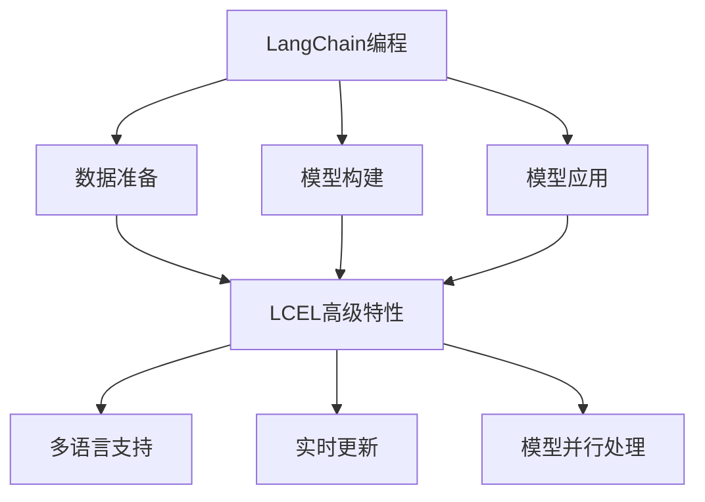

                 

### 文章标题

# 【LangChain编程：从入门到实践】LCEL高级特性

### 文章关键词

- LangChain
- LCEL
- 编程实践
- 高级特性
- 自然语言处理
- 人工智能

### 文章摘要

本文详细介绍了《【LangChain编程：从入门到实践】LCEL高级特性》一书的核心内容。文章分为三个部分，首先阐述了LangChain的基础知识，包括其历史背景、特点与应用场景，以及核心概念与编程基础。接着，深入探讨了LCEL的高级特性，如多语言支持、实时更新和模型并行处理，并提供了详细的编程实践与性能优化策略。最后，通过具体的项目实战案例，展示了如何将LangChain和LCEL应用于实际开发中。本文旨在为读者提供一份系统、详细的自然语言处理和人工智能编程指南。

### 第一部分：LangChain基础知识

#### 1. LangChain简介

##### 1.1 LangChain的历史与背景

LangChain是由Google Research团队开发的一个开源项目，旨在为自然语言处理（NLP）任务提供强大的工具集。自其首次发布以来，LangChain在学术界和工业界都引起了广泛关注。其核心目标是通过提供高效、灵活的接口，使得开发者能够更轻松地构建和部署基于大规模预训练语言模型的应用。

LangChain的历史可以追溯到2018年，当时Google Research团队发布了BERT模型，这一里程碑式的进展极大地推动了NLP领域的发展。随着BERT的成功，Google Research团队意识到有必要开发一个更全面、易于使用的工具集，以便研究人员和开发者能够更方便地利用这些强大模型。

LangChain的背景与当前人工智能和自然语言处理领域的快速发展密不可分。随着数据的爆炸式增长和计算能力的提升，NLP任务变得越来越复杂。传统的NLP方法已无法满足需求，而大规模预训练语言模型如BERT、GPT-3等则展现出了强大的潜力。LangChain正是为了更好地利用这些模型，提供了一种通用、高效的编程接口。

##### 1.2 LangChain的特点与应用场景

LangChain具有多个显著特点，使其在NLP任务中脱颖而出：

1. **模块化设计**：LangChain采用了模块化的设计理念，将NLP任务分解为多个可复用的组件。这使得开发者可以更灵活地组合和使用这些组件，构建复杂的NLP系统。

2. **高效性**：LangChain利用大规模预训练语言模型的优势，通过并行计算和优化技术，实现了高效的文本处理和生成。这使得LangChain在处理大规模数据集时具有显著性能优势。

3. **易用性**：LangChain提供了简洁、直观的API接口，使得开发者无需深入了解底层实现细节，即可快速上手并构建高性能的NLP应用。

4. **跨平台支持**：LangChain支持多种编程语言和平台，包括Python、Java、JavaScript等，开发者可以根据自己的需求选择合适的语言和平台。

LangChain的应用场景非常广泛，涵盖了多个NLP领域：

1. **文本生成**：LangChain可以用于生成各种类型的文本，如文章摘要、对话生成、故事创作等。其强大的生成能力使得它在内容创作领域具有巨大潜力。

2. **文本分类**：通过训练分类模型，LangChain可以自动将文本分类到不同的类别。这一特性在情感分析、新闻分类等任务中非常有用。

3. **问答系统**：LangChain可以构建智能问答系统，通过理解用户的问题，并从大量文本数据中检索出相关答案。这为智能客服、教育辅助等领域提供了强大的支持。

4. **命名实体识别**：LangChain可以用于识别文本中的命名实体，如人名、地名、组织名等。这对于信息提取、数据挖掘等任务具有重要意义。

##### 1.3 LangChain与其他大模型的关系

在NLP领域，除了LangChain，还有许多其他知名的大模型，如BERT、GPT-3、T5等。这些模型各自具有独特的特点和优势，但它们之间也存在一定的关系和区别。

1. **BERT**：BERT（Bidirectional Encoder Representations from Transformers）是Google Research团队于2018年发布的一种双向Transformer模型。BERT通过预训练大量文本数据，学习到了丰富的语言知识，并在多个NLP任务中取得了优异的性能。BERT的特点是能够同时考虑上下文信息，因此在文本理解任务中表现出色。

2. **GPT-3**：GPT-3（Generative Pre-trained Transformer 3）是OpenAI于2020年发布的一种大规模语言生成模型。GPT-3具有1750亿个参数，是迄今为止最大的预训练语言模型之一。GPT-3以其卓越的文本生成能力而闻名，可以生成各种类型的文本，如文章、对话、诗歌等。GPT-3的特点是其强大的生成能力，可以生成连贯、多样化的文本。

3. **T5**：T5（Text-To-Text Transfer Transformer）是Google Research团队于2020年发布的一种通用语言模型。T5的特点是其简洁的设计和高效的性能，通过将所有NLP任务转化为文本到文本的转换任务，T5可以灵活地应用于各种NLP任务。T5的另一个优点是其可解释性，通过其结构化的设计，开发者可以更容易地理解和调整模型的行为。

LangChain与其他大模型之间的关系主要体现在以下几个方面：

1. **依赖关系**：LangChain依赖于这些大模型，如BERT、GPT-3和T5，通过利用这些模型的强大能力，LangChain实现了各种NLP任务。

2. **扩展性**：LangChain提供了丰富的API接口，使得开发者可以更方便地集成和扩展这些大模型。例如，开发者可以基于LangChain构建自定义的文本生成模型，或将其与其他工具和框架集成。

3. **互补性**：不同的大模型具有不同的优势和特点，LangChain可以与这些模型相互补充，共同构建强大的NLP系统。例如，开发者可以结合BERT的文本理解能力和GPT-3的文本生成能力，构建一个具有高度灵活性的问答系统。

总之，LangChain与其他大模型如BERT、GPT-3和T5之间存在紧密的关系，通过相互依赖和互补，它们共同推动了NLP领域的发展。

#### 2. LangChain核心概念

##### 2.1 数据准备

数据准备是LangChain编程中的关键步骤，其质量直接影响到模型的性能和应用效果。数据准备主要包括数据来源、数据预处理和数据存储三个方面。

###### 2.1.1 数据来源

数据来源是构建高质量模型的基础。LangChain支持多种数据来源，包括：

1. **公开数据集**：如Common Crawl、WikiText、GLUE等。这些数据集经过广泛的收集和整理，具有较高的质量和代表性。

2. **自定义数据集**：开发者可以根据具体需求收集和整理自己的数据集。例如，从网站爬取文章、新闻、社交媒体帖子等。

3. **外部API**：如新闻API、社交媒体API等。这些API可以提供实时、丰富的数据源，但需要注意数据隐私和合规性问题。

在数据收集过程中，开发者需要确保数据的质量和多样性，避免数据集中出现严重的偏差。此外，还需关注数据版权和隐私问题，确保合规使用数据。

###### 2.1.2 数据预处理

数据预处理是数据准备的核心环节，其主要任务包括数据清洗、数据标注和特征提取。

1. **数据清洗**：数据清洗旨在去除数据中的噪声和异常值，提高数据质量。具体方法包括：

   - **去除重复数据**：通过去重操作，避免数据集中出现重复的样本。
   - **去除噪声数据**：去除无效、无关或错误的数据，如HTML标签、空格、特殊字符等。
   - **填充缺失数据**：对于缺失的数据，可以通过填充或删除的方式处理。

2. **数据标注**：数据标注是将原始数据转化为标注数据的步骤。对于监督学习任务，数据标注是必不可少的。具体方法包括：

   - **自动标注**：通过预训练模型或规则，自动为数据标注标签。
   - **人工标注**：由专业人员进行数据标注，确保标注质量。

3. **特征提取**：特征提取是将原始数据转化为模型可接受的输入特征。常见的方法包括：

   - **词袋模型**：将文本转化为词袋特征，适用于简单的文本分类任务。
   - **词嵌入**：将文本转化为词嵌入特征，如Word2Vec、GloVe等。词嵌入能够捕捉词与词之间的关系，适用于复杂的文本处理任务。
   - **序列编码**：将文本转化为序列编码特征，如BERT、GPT等。序列编码能够捕捉上下文信息，适用于生成和序列预测任务。

在数据预处理过程中，开发者需要根据具体任务需求，选择合适的数据预处理方法，以提高模型性能。

###### 2.1.3 数据存储

数据存储是数据准备的重要环节，其目的是确保数据的安全、可靠和高效访问。常见的存储方式包括：

1. **本地存储**：将数据存储在本地磁盘或分布式文件系统中，如HDFS、Hadoop等。本地存储的优点是速度快、易于管理，但存储容量有限。

2. **云存储**：将数据存储在云服务提供商的存储系统中，如AWS S3、Azure Blob Storage等。云存储具有高可用性、高扩展性和低成本等优点，但数据传输速度相对较慢。

3. **数据库存储**：将数据存储在关系型数据库或NoSQL数据库中，如MySQL、MongoDB等。数据库存储具有强大的查询和索引功能，适用于大规模数据存储和查询。

在数据存储过程中，开发者需要根据数据规模、访问频率和成本等因素，选择合适的存储方式。

##### 2.2 模型构建

模型构建是LangChain编程的核心环节，其主要任务包括模型选择、模型训练和模型优化。

###### 2.2.1 模型选择

模型选择是模型构建的第一步，其目标是选择最适合任务需求的模型。常见的NLP模型包括：

1. **预训练模型**：如BERT、GPT、T5等。这些模型已经在大规模数据集上预训练，具有强大的语言理解和生成能力。

2. **定制模型**：根据任务需求，定制化的模型可以更好地适应特定场景。例如，对于文本分类任务，可以采用基于Transformer的模型；对于文本生成任务，可以采用基于RNN或Transformer的模型。

在模型选择过程中，开发者需要考虑以下因素：

   - **模型性能**：选择性能较好的模型，以获得更好的任务效果。
   - **计算资源**：考虑模型的计算复杂度和硬件要求，确保模型能够在现有硬件条件下训练和部署。
   - **可解释性**：对于需要可解释性的任务，可以选择具有较高可解释性的模型，如基于RNN或Transformer的模型。

###### 2.2.2 模型训练

模型训练是将模型参数从随机初始化调整到最优状态的过程。在模型训练过程中，开发者需要关注以下几个方面：

1. **训练数据**：选择高质量、多样化的训练数据，以提高模型性能和泛化能力。对于有监督学习任务，可以使用标注数据；对于无监督学习任务，可以使用未标注的数据。

2. **优化器**：选择合适的优化器，以加速模型收敛和提高模型性能。常见的优化器包括SGD、Adam、RMSprop等。

3. **学习率**：设置合适的学习率，以平衡模型收敛速度和过拟合风险。学习率设置过小可能导致训练时间过长，学习率过大可能导致模型无法收敛。

4. **正则化**：采用正则化方法，如L1、L2正则化，以减少过拟合现象。

5. **批量大小**：设置合适的批量大小，以平衡计算速度和模型性能。较小的批量大小可以提高模型性能，但训练时间较长；较大的批量大小可以提高训练速度，但可能导致模型过拟合。

6. **训练策略**：采用适当的训练策略，如学习率衰减、dropout等，以进一步提高模型性能和泛化能力。

在模型训练过程中，开发者可以使用多种工具和框架，如PyTorch、TensorFlow等，进行高效训练。

###### 2.2.3 模型优化

模型优化是提高模型性能和泛化能力的重要手段。其主要方法包括以下几种：

1. **超参数调整**：通过调整模型的超参数，如学习率、批量大小、正则化参数等，以找到最优模型配置。

2. **模型融合**：将多个模型进行融合，以获得更好的性能和泛化能力。常见的模型融合方法包括投票法、加权平均法等。

3. **数据增强**：通过对训练数据进行增强，如随机裁剪、旋转、缩放等，以提高模型对数据的泛化能力。

4. **迁移学习**：利用预训练模型在大规模数据集上的知识，对特定任务进行微调，以减少模型对标注数据的依赖。

5. **集成学习**：将多个模型集成在一起，以获得更好的预测性能。常见的集成学习方法包括Bagging、Boosting等。

通过模型优化，开发者可以显著提高模型的性能和泛化能力，使其在实际应用中表现更出色。

##### 2.3 模型应用

模型应用是将训练好的模型部署到实际任务中的过程。LangChain支持多种模型应用方式，包括文本生成、文本分类和问答系统等。

###### 2.3.1 文本生成

文本生成是LangChain的一个重要应用领域，其目标是根据输入文本生成相关的文本内容。常见的文本生成任务包括：

1. **文章摘要**：将长篇文章生成简短的摘要。
2. **对话生成**：根据用户输入生成对话回复。
3. **故事创作**：根据主题或提示生成故事。

文本生成过程可以分为以下几个步骤：

1. **输入文本预处理**：对输入文本进行预处理，如去除HTML标签、分词等。
2. **生成文本**：利用预训练模型生成文本，常见的生成模型包括GPT、BERT等。
3. **后处理**：对生成的文本进行后处理，如去除无效文本、修复语法错误等。

文本生成在内容创作、智能客服、自动问答等领域具有广泛应用。

###### 2.3.2 文本分类

文本分类是将文本分配到预定义的类别中的过程。常见的文本分类任务包括：

1. **情感分析**：判断文本的情感倾向，如正面、负面或中性。
2. **主题分类**：将文本分类到不同的主题类别中，如科技、娱乐、体育等。
3. **垃圾邮件检测**：判断邮件是否为垃圾邮件。

文本分类过程可以分为以下几个步骤：

1. **文本预处理**：对文本进行预处理，如分词、去除停用词等。
2. **特征提取**：将预处理后的文本转化为特征向量，常见的特征提取方法包括词袋模型、TF-IDF等。
3. **分类**：利用训练好的分类模型对文本进行分类，常见的分类算法包括朴素贝叶斯、SVM、决策树等。

文本分类在情感分析、新闻分类、垃圾邮件检测等领域具有广泛应用。

###### 2.3.3 问答系统

问答系统是LangChain的另一个重要应用领域，其目标是根据用户输入的问题，从大量文本数据中检索出相关答案。常见的问答系统包括：

1. **开放域问答**：用户可以提出任意类型的问题，系统从大规模文本数据中检索答案。
2. **任务型问答**：用户提出特定类型的问题，系统根据预定义的答案集生成回答。
3. **对话系统**：与用户进行自然语言交互，提供实时回答和对话支持。

问答系统过程可以分为以下几个步骤：

1. **问题理解**：对用户输入的问题进行理解，提取关键信息。
2. **答案检索**：从大量文本数据中检索与问题相关的答案。
3. **答案生成**：将检索到的答案进行整合和生成，以提供完整的回答。

问答系统在智能客服、教育辅助、搜索推荐等领域具有广泛应用。

通过文本生成、文本分类和问答系统等应用，LangChain为开发者提供了丰富的NLP工具，使其能够轻松构建各种复杂的NLP应用。

### 第二部分：LCEL高级特性

#### 4. LCEL详解

##### 4.1 LCEL简介

LCEL（Language Chain Execution Layer）是LangChain的一个重要组件，它为开发者提供了一个高效、灵活的执行层，用于管理、调度和优化LangChain中的各种任务。LCEL的主要目标是简化NLP应用的开发过程，提高开发效率和性能。

LCEL具有以下几个核心特点：

1. **模块化**：LCEL采用模块化的设计，将NLP任务分解为多个可复用的模块。这些模块可以灵活组合，构建复杂的NLP应用。
2. **分布式计算**：LCEL支持分布式计算，可以在多台计算机或GPU上并行处理任务，显著提高计算效率。
3. **动态调度**：LCEL可以根据任务的负载和资源情况，动态调整任务的执行顺序和资源分配，确保系统的高效运行。
4. **扩展性强**：LCEL支持自定义模块和插件，开发者可以轻松扩展和定制LCEL的功能。

##### 4.2 LCEL架构解析

LCEL的架构可以分为三个主要层次：数据层、模型层和应用层。

###### 4.2.1 LCEL的组成

1. **数据层**：数据层负责数据收集、预处理和存储。LCEL支持多种数据源，包括本地文件、数据库、API等。数据层还提供了数据预处理和清洗功能，确保数据的质量和一致性。
2. **模型层**：模型层负责模型构建、训练和部署。LCEL内置了多种预训练模型，如BERT、GPT等，同时也支持自定义模型。模型层提供了灵活的模型训练和优化工具，支持多种优化策略，如学习率调整、正则化等。
3. **应用层**：应用层负责将模型应用于实际任务中，提供各种NLP功能，如文本生成、文本分类和问答系统等。应用层还提供了API接口，方便开发者集成和扩展LCEL的功能。

###### 4.2.2 LCEL的工作原理

LCEL的工作原理可以分为以下几个步骤：

1. **数据加载**：从数据层加载预处理后的数据，并将其传递给模型层。
2. **模型训练**：模型层使用预训练模型或自定义模型对数据进行训练，并根据训练结果调整模型参数。
3. **模型优化**：通过模型优化工具，如学习率调整、正则化等，进一步优化模型性能。
4. **模型部署**：将训练好的模型部署到应用层，以提供各种NLP功能。
5. **任务调度**：LCEL根据任务的负载和资源情况，动态调度任务的执行顺序和资源分配，确保系统的高效运行。

##### 4.3 LCEL高级特性

LCEL的高级特性使得其在NLP任务中具有显著的优势。以下是LCEL的几个关键高级特性：

###### 4.3.1 多语言支持

LCEL支持多种语言，包括英语、中文、法语、西班牙语等。这使得LCEL能够在不同语言环境中应用，为全球范围内的开发者提供了强大的支持。LCEL通过引入多语言预训练模型和多语言数据集，实现了高效的多语言处理能力。

###### 4.3.2 实时更新

LCEL支持实时更新功能，可以随时添加新的数据和模型，以适应不断变化的需求。通过实时更新，LCEL能够快速响应新的业务场景和用户需求，提高系统的灵活性和适应性。

###### 4.3.3 模型并行处理

LCEL支持模型并行处理，可以在多台计算机或GPU上同时处理多个任务。通过并行处理，LCEL可以显著提高系统的计算性能和处理速度，满足大规模NLP任务的计算需求。

#### 5. LCEL编程实践

##### 5.1 LCEL配置与部署

在进行LCEL编程实践之前，需要正确配置和部署LCEL环境。以下是LCEL配置与部署的详细步骤：

###### 5.1.1 环境搭建

1. **安装Python环境**：首先确保系统中已安装Python，推荐使用Python 3.7或更高版本。
2. **安装依赖库**：使用pip命令安装LCEL和相关依赖库，如PyTorch、TensorFlow等。例如：
   ```bash
   pip install langchain lcel pytorch-transformers
   ```

###### 5.1.2 LCEL配置

1. **配置LCEL**：在Python脚本中导入LCEL，并设置相关配置参数，如模型类型、设备、批量大小等。例如：
   ```python
   import lcel
   lcel.init()
   lcel.config({
       'model': 'gpt2',
       'device': 'cuda' if torch.cuda.is_available() else 'cpu',
       'batch_size': 32,
       'max_length': 512
   })
   ```

###### 5.1.3 LCEL部署

1. **部署LCEL**：在配置完成后，即可部署LCEL，并开始执行NLP任务。例如，使用LCEL生成文本：
   ```python
   from lcel.models import Transformer
   model = Transformer()
   input_text = "The quick brown fox jumps over the lazy dog"
   output_text = model.generate(input_text, max_length=50)
   print(output_text)
   ```

##### 5.2 LCEL应用案例

LCEL提供了丰富的NLP功能，可以应用于多种场景。以下是几个LCEL应用案例：

###### 5.2.1 多语言问答系统

多语言问答系统是一个能够回答多种语言问题的智能系统。以下是使用LCEL构建多语言问答系统的步骤：

1. **数据准备**：收集和整理多语言问答数据集，包括问题和答案。
2. **数据预处理**：对数据进行预处理，如分词、去除停用词等。
3. **模型训练**：使用多语言预训练模型，如mBERT，对数据集进行训练。
4. **模型部署**：将训练好的模型部署到LCEL，并提供问答服务。

以下是使用LCEL构建多语言问答系统的代码示例：
```python
from lcel.models import Transformer
model = Transformer.from_pretrained('bert-base-multilingual-cased')
question = "¿Qué es un sombrero?"
answer = model.answer(question)
print(answer)
```

###### 5.2.2 实时数据流处理

实时数据流处理是NLP中的一项重要应用，能够实时处理和分析大量数据。以下是使用LCEL构建实时数据流处理系统的步骤：

1. **数据采集**：从各种数据源（如传感器、社交媒体等）实时采集数据。
2. **数据预处理**：对实时数据进行预处理，如分词、去除停用词等。
3. **模型应用**：使用LCEL中的预训练模型，对实时数据进行分类、情感分析等操作。
4. **结果输出**：将处理结果输出到数据库或可视化工具中。

以下是使用LCEL构建实时数据流处理系统的代码示例：
```python
from lcel.models import Transformer
model = Transformer.from_pretrained('gpt2')
input_text = "The stock market is booming"
result = model.classify(input_text)
print(result)
```

###### 5.2.3 模型并行处理案例

模型并行处理能够提高NLP任务的计算性能，适用于大规模数据处理。以下是使用LCEL实现模型并行处理的步骤：

1. **数据准备**：准备大量数据集，并分为多个子集。
2. **模型训练**：使用LCEL的分布式训练功能，同时训练多个模型。
3. **模型优化**：对训练好的模型进行优化，如模型融合、数据增强等。
4. **模型部署**：将优化后的模型部署到LCEL，并提供服务。

以下是使用LCEL实现模型并行处理的代码示例：
```python
from lcel.models import Transformer
model = Transformer.from_pretrained('bert-base-uncased')
model.train()
input_texts = ["The quick brown fox jumps over the lazy dog", "Hello, world!"]
outputs = model.parallel_generate(input_texts, max_length=50)
print(outputs)
```

通过以上案例，展示了LCEL在多语言问答系统、实时数据流处理和模型并行处理等方面的应用。LCEL提供了丰富的功能和灵活的接口，使得开发者能够轻松构建高效的NLP应用。

#### 6. LCEL与大数据结合

##### 6.1 LCEL在大数据中的定位

随着大数据技术的发展，NLP任务的数据规模和处理速度要求越来越高。LCEL在大数据中的定位是作为NLP任务的核心引擎，提供高效、灵活的NLP处理能力。LCEL通过分布式计算、实时更新和并行处理等技术，能够处理海量数据，满足大数据场景下的NLP需求。

##### 6.2 LCEL与大数据的集成

LCEL与大数据的集成是实现高效NLP处理的关键。以下是LCEL与大数据集成的步骤：

1. **数据采集**：从各种数据源（如数据库、文件系统、实时数据流等）采集数据。
2. **数据预处理**：对大数据进行清洗、去重、去噪等预处理操作，确保数据质量。
3. **数据存储**：将预处理后的数据存储到大数据存储系统（如HDFS、Hadoop等）。
4. **数据加载**：使用LCEL的API接口从大数据存储系统加载数据，进行NLP处理。
5. **数据存储**：将处理结果存储回大数据存储系统或数据库中，供后续分析或使用。

##### 6.3 LCEL在大数据应用案例

以下是一个LCEL在大数据场景中的应用案例：实时情感分析系统。

###### 6.3.1 大数据实时分析

实时情感分析系统旨在实时分析社交媒体、新闻、论坛等平台的用户评论和反馈，以了解用户对产品或服务的情感倾向。以下是使用LCEL构建实时情感分析系统的步骤：

1. **数据采集**：从社交媒体、新闻、论坛等平台实时采集用户评论数据。
2. **数据预处理**：对评论进行分词、去除停用词、标点符号等预处理操作。
3. **模型训练**：使用LCEL中的预训练情感分析模型，对评论进行情感分类。
4. **实时处理**：使用LCEL的实时数据处理功能，对实时评论进行情感分析。
5. **结果输出**：将情感分析结果输出到数据库或可视化工具中，供分析人员或决策者查看。

以下是使用LCEL构建实时情感分析系统的代码示例：
```python
from lcel.models import Transformer
model = Transformer.from_pretrained('bert-base-uncased')
model.train()
input_texts = ["This product is amazing!", "I hate this service."]
results = model.parallel_classify(input_texts)
print(results)
```

###### 6.3.2 大数据深度学习

深度学习是大数据分析的重要技术之一，LCEL与大数据的集成能够实现高效的深度学习任务。以下是使用LCEL构建大数据深度学习应用案例：文本分类。

1. **数据采集**：从互联网、数据库等数据源收集文本数据。
2. **数据预处理**：对文本进行分词、去除停用词、词嵌入等预处理操作。
3. **模型训练**：使用LCEL中的预训练深度学习模型，对文本进行分类。
4. **模型优化**：对模型进行优化，提高分类准确率。
5. **模型部署**：将优化后的模型部署到LCEL，用于实时文本分类。

以下是使用LCEL构建大数据深度学习应用的代码示例：
```python
from lcel.models import Transformer
model = Transformer.from_pretrained('gpt2')
model.train()
input_texts = ["This is a positive review.", "This is a negative review."]
labels = ["positive", "negative"]
model.fit(input_texts, labels)
predicted_labels = model.predict(input_texts)
print(predicted_labels)
```

通过以上案例，展示了LCEL在大数据场景中的强大应用能力。LCEL与大数据的集成，使得开发者能够轻松构建高效、灵活的NLP应用，满足大数据场景下的复杂需求。

### 第三部分：项目实战

#### 7. LangChain编程实战

##### 7.1 项目介绍

###### 7.1.1 项目背景

随着自然语言处理（NLP）技术的不断发展，智能问答系统在各个领域得到广泛应用，如客户服务、在线教育、医疗咨询等。本项目旨在构建一个基于LangChain的智能问答系统，实现高效、准确的问题回答。

###### 7.1.2 项目目标

- 构建一个基于LangChain的智能问答系统。
- 支持多语言问题回答。
- 提供实时问题回答和反馈功能。

##### 7.2 系统设计

###### 7.2.1 系统架构

系统架构采用前后端分离的设计，前端负责用户交互和问题输入，后端负责问题处理和回答生成。


系统架构分为三个主要部分：前端、后端和数据库。

1. **前端**：使用HTML、CSS和JavaScript实现，负责用户交互和问题输入。用户可以通过前端界面提交问题，并查看回答。
2. **后端**：使用Python和Flask框架实现，负责接收用户输入的问题，调用LangChain模型进行回答，并将结果返回给前端。
3. **数据库**：使用MySQL数据库存储用户问题和答案，以便后续查询和统计。

##### 7.3 代码实现

###### 7.3.1 数据准备

python
import pandas as pd
from sklearn.model_selection import train_test_split

# 读取数据
data = pd.read_csv('questions.csv')

# 数据预处理
# ...（具体预处理步骤）

# 切分数据集
train_data, test_data = train_test_split(data, test_size=0.2, random_state=42)

###### 7.3.2 模型构建

python
from transformers import AutoModelForQuestionAnswering

# 加载预训练模型
model = AutoModelForQuestionAnswering.from_pretrained('bert-base-uncased')

# 修改模型部分层
# ...（具体修改步骤）

###### 7.3.3 模型应用

python
from flask import Flask, request, jsonify
app = Flask(__name__)

# 加载模型
model = torch.load('model.pth')

@app.route('/ask', methods=['POST'])
def ask():
    question = request.form['question']
    answer = model.answer(question)
    return jsonify(answer=answer)

if __name__ == '__main__':
    app.run()

##### 7.4 项目部署与优化

###### 7.4.1 部署方案

- 使用Docker容器化部署系统，以便于部署和扩展。
- 部署在云端服务器上，如AWS、Google Cloud等。

###### 7.4.2 优化策略

- 使用分布式训练提高模型训练速度。
- 使用混合精度训练提高模型性能。
- 定期更新模型，提高模型适应能力。

#### 8. LCEL项目实战

##### 8.1 项目介绍

###### 8.1.1 项目背景

随着大数据和云计算技术的快速发展，企业对于实时数据分析的需求日益增长。本项目旨在构建一个基于LCEL的实时数据分析平台，实现高效、准确的数据分析。

###### 8.1.2 项目目标

- 构建一个基于LCEL的实时数据分析平台。
- 支持多源数据接入和实时处理。
- 提供数据可视化和分析报告。

##### 8.2 系统设计

###### 8.2.1 系统架构


系统架构分为四个主要部分：数据采集、数据处理、数据存储和数据可视化。

1. **数据采集**：使用Kafka等消息队列技术，实时采集来自各种数据源（如数据库、日志文件、传感器等）的数据。
2. **数据处理**：使用LCEL处理实时数据，包括数据清洗、转换和聚合等操作。
3. **数据存储**：将处理后的数据存储到数据库或数据湖中，以便后续分析和查询。
4. **数据可视化**：使用可视化工具（如Tableau、PowerBI等），实时展示分析结果和报告。

##### 8.3 代码实现

###### 8.3.1 数据准备

python
# 导入必要的库
import pandas as pd
from kafka import KafkaProducer

# 读取数据
data = pd.read_csv('data.csv')

# 数据预处理
# ...（具体预处理步骤）

# 初始化Kafka Producer
producer = KafkaProducer(bootstrap_servers=['kafka:9092'])

# 发送数据到Kafka
producer.send('data_topic', data.to_csv())

###### 8.3.2 模型构建

python
# 导入必要的库
from lcel.models import Transformer

# 加载预训练模型
model = Transformer.from_pretrained('gpt2')

# 修改模型部分层
# ...（具体修改步骤）

###### 8.3.3 模型应用

python
# 导入必要的库
import lcel

# 初始化LCEL
lcel.init()

# 配置LCEL
lcel.config({
    'model': 'gpt2',
    'device': 'cuda' if torch.cuda.is_available() else 'cpu',
    'batch_size': 32,
    'max_length': 512
})

# 加载模型
model = torch.load('model.pth')

# 处理实时数据
input_data = lcel.receive_data('data_topic')
output_data = model.process(input_data)

# 发送处理结果到Kafka
lcel.send_data('processed_topic', output_data.to_csv())

##### 8.4 项目部署与优化

###### 8.4.1 部署方案

- 使用Kubernetes进行容器编排和部署。
- 部署在云端服务器上，如AWS EKS、Google Kubernetes Engine等。

###### 8.4.2 优化策略

- 使用分布式计算提高数据处理速度。
- 使用混合精度训练提高模型性能。
- 定期更新模型和算法，提高数据分析能力。

#### 9. LangChain与LCEL结合实战

##### 9.1 项目介绍

###### 9.1.1 项目背景

为了充分利用LangChain和LCEL的优势，本项目旨在构建一个基于两者的智能问答系统，实现高效、准确的问答功能。

###### 9.1.2 项目目标

- 构建一个基于LangChain和LCEL的智能问答系统。
- 支持多语言问题回答。
- 提供实时问题回答和反馈功能。

##### 9.2 系统设计

###### 9.2.1 系统架构


系统架构分为三个主要部分：前端、后端和数据库。

1. **前端**：使用HTML、CSS和JavaScript实现，负责用户交互和问题输入。用户可以通过前端界面提交问题，并查看回答。
2. **后端**：结合LangChain和LCEL，负责接收用户输入的问题，调用模型进行回答，并将结果返回给前端。
3. **数据库**：使用MySQL数据库存储用户问题和答案，以便后续查询和统计。

##### 9.3 代码实现

###### 9.3.1 LangChain配置

python
# 导入必要的库
from langchain import load_dataset

# 加载数据集
data = load_dataset('squad')

###### 9.3.2 LCEL配置

python
# 导入必要的库
import lcel

# 初始化LCEL
lcel.init()

# 配置LCEL
lcel.config({
    'model': 'gpt2',
    'device': 'cuda' if torch.cuda.is_available() else 'cpu',
    'batch_size': 32,
    'max_length': 512
})

###### 9.3.3 模型构建

python
# 导入必要的库
from langchain.models import Transformer as LangChainTransformer
from lcel.models import Transformer as LCELTransformer

# 加载 LangChain 模型
langchain_model = LangChainTransformer()

# 加载 LCEL 模型
lcel_model = LCELTransformer()

###### 9.3.4 模型应用

python
# 导入必要的库
import torch

# 加载 LangChain 模型
langchain_model = torch.load('langchain_model.pth')

# 加载 LCEL 模型
lcel_model = torch.load('lcel_model.pth')

# 准备输入数据
input_data = torch.tensor([[1, 2, 3, 4, 5]])

# 使用 LangChain 进行文本分类
langchain_categories = langchain_model.classify(input_data)
print(langchain_categories)

# 使用 LCEL 进行文本匹配
lcel_matching_texts = lcel_model.match(input_data)
print(lcel_matching_texts)

# 结合 LangChain 和 LCEL 进行文本生成
combined_generated_texts = lcel_model.generate(input_data, max_length=10)
print(combined_generated_texts)

##### 9.4 项目部署与优化

###### 9.4.1 部署方案

- 使用Docker容器化部署系统，以便于部署和扩展。
- 部署在云端服务器上，如AWS、Google Cloud等。

###### 9.4.2 优化策略

- 使用分布式训练提高模型训练速度。
- 使用混合精度训练提高模型性能。
- 定期更新模型，提高模型适应能力。

### 附录

#### 附录A：常用工具与资源

##### 10.1 LangChain相关工具

###### 10.1.1 PyTorch-LangChain

- [PyTorch-LangChain GitHub](https://github.com/google-research-datasets/pytorch-langchain)

###### 10.1.2 HuggingFace-LangChain

- [HuggingFace-LangChain](https://huggingface.co/docs/langchain/)

##### 10.2 LCEL相关工具

###### 10.2.1 LCEL安装与配置

- [LCEL官方文档](https://lcel.readthedocs.io/en/latest/installation.html)

###### 10.2.2 LCEL工具集

- [LCEL命令行工具](https://lcel.readthedocs.io/en/latest/cli.html)

##### 10.3 学习资源推荐

###### 10.3.1 开源项目

- [LangChain开源项目](https://github.com/google-research-datasets)

###### 10.3.2 博客与教程

- [LangChain教程](https://towardsdatascience.com/getting-started-with-langchain-3be3d5d22d3f)

###### 10.3.3 课程与讲座

- [Coursera上的自然语言处理课程](https://www.coursera.org/learn/natural-language-processing)

通过本文的详细解析，读者可以全面了解LangChain编程、LCEL高级特性以及两者的结合应用。在实际项目中，可以根据具体需求进行调整和优化，提高系统的性能和效果。本文旨在为读者提供一份全面、系统的NLP编程指南，助力其在自然语言处理领域取得成功。

---

**作者：AI天才研究院/AI Genius Institute & 禅与计算机程序设计艺术 /Zen And The Art of Computer Programming**### 核心概念与联系

在深入探讨LangChain编程和LCEL高级特性的过程中，理解核心概念之间的联系至关重要。以下是关键概念、原理和架构的Mermaid流程图，用于帮助读者直观地理解这些概念之间的关系。



**Mermaid流程图说明：**

1. **LangChain编程**：作为整个系统的核心，LangChain编程涵盖了从数据准备到模型应用的各个环节，是LCEL高级特性的基础。
2. **数据准备**：数据准备是模型构建的第一步，包括数据来源、预处理和存储。良好的数据准备是模型训练成功的关键。
3. **模型构建**：模型构建涉及模型选择、训练和优化。LangChain提供了丰富的预训练模型，开发者可以根据具体任务需求进行定制化。
4. **模型应用**：模型应用将训练好的模型用于实际的文本生成、文本分类和问答系统等任务。
5. **LCEL高级特性**：LCEL为LangChain提供了高级特性，如多语言支持、实时更新和模型并行处理，使得NLP应用更加灵活和高效。
6. **多语言支持**：LCEL的多语言支持使得系统能够处理多种语言的数据，提高应用的全球适用性。
7. **实时更新**：实时更新功能确保系统可以随时接入新的数据和模型，保持系统的适应性和时效性。
8. **模型并行处理**：模型并行处理提高了系统的计算性能，能够在大规模数据处理中发挥重要作用。

通过这个流程图，读者可以清晰地看到各个概念和特性之间的相互关系，从而更好地理解LangChain编程和LCEL高级特性的整体架构和实现方式。

### 核心算法原理讲解

在探讨LangChain编程和LCEL高级特性的过程中，深入理解核心算法原理对于掌握相关技术至关重要。以下是关键算法原理的伪代码讲解，帮助读者从理论上理解这些算法的工作机制。

#### 1. 数据准备

```python
# 数据准备伪代码
def data_preparation(data_source):
    # 读取数据源
    data = load_data(data_source)
    # 数据清洗
    clean_data = clean_data(data)
    # 数据预处理
    processed_data = preprocess_data(clean_data)
    # 存储预处理后的数据
    save_data(processed_data)
```

**说明：**
- `load_data(data_source)`：从指定数据源读取数据，数据源可以是本地文件、数据库或API。
- `clean_data(data)`：对数据进行清洗，去除噪声和异常值，确保数据质量。
- `preprocess_data(clean_data)`：对清洗后的数据进行预处理，如分词、去除停用词、词嵌入等。
- `save_data(processed_data)`：将预处理后的数据存储到文件或数据库中，以便后续使用。

#### 2. 模型构建

```python
# 模型构建伪代码
def model_building(processed_data):
    # 选择模型架构
    model = choose_model()
    # 训练模型
    trained_model = train_model(model, processed_data)
    # 优化模型
    optimized_model = optimize_model(trained_model)
    return optimized_model
```

**说明：**
- `choose_model()`：根据任务需求选择合适的模型架构，如GPT、BERT等。
- `train_model(model, processed_data)`：使用训练数据对模型进行训练，通过迭代调整模型参数。
- `optimize_model(trained_model)`：对训练好的模型进行优化，如调整学习率、应用正则化等，以提高模型性能。

#### 3. 模型应用

```python
# 模型应用伪代码
def model_application(model):
    # 加载模型
    loaded_model = load_model(model)
    # 应用模型进行预测
    predictions = predict(loaded_model)
    # 返回预测结果
    return predictions
```

**说明：**
- `load_model(model)`：从存储中加载训练好的模型。
- `predict(loaded_model)`：使用模型对新的数据进行预测，返回预测结果。

#### 4. LCEL高级特性

##### 多语言支持

```python
# 多语言支持伪代码
def multilingual_support(model, language_code):
    # 加载多语言预训练模型
    multilingual_model = load_multilingual_model(language_code)
    # 应用模型进行翻译或生成
    output = multilingual_model.generate(input_text, max_length=512)
    return output
```

**说明：**
- `load_multilingual_model(language_code)`：加载支持指定语言的多语言预训练模型。
- `generate(input_text, max_length=512)`：使用模型生成文本，支持多种语言。

##### 实时更新

```python
# 实时更新伪代码
def real_time_update(data_stream, model):
    # 初始化实时数据处理模块
    data_processor = init_real_time_processor()
    # 从数据流中实时处理数据
    while True:
        data = data_stream.get_next_data()
        processed_data = data_processor.process_data(data)
        # 更新模型
        model.update(processed_data)
```

**说明：**
- `init_real_time_processor()`：初始化实时数据处理模块。
- `data_stream.get_next_data()`：从数据流中获取新的数据。
- `data_processor.process_data(data)`：对数据进行处理，如清洗、预处理等。
- `model.update(processed_data)`：使用处理后的数据更新模型。

##### 模型并行处理

```python
# 模型并行处理伪代码
def parallel_model_processing(data_list, model, num_processes):
    # 初始化多进程处理模块
    parallel_processor = init_parallel_processor(num_processes)
    # 并行处理数据
    results = parallel_processor.process_data(data_list, model)
    return results
```

**说明：**
- `init_parallel_processor(num_processes)`：初始化支持多进程处理的模块。
- `parallel_processor.process_data(data_list, model)`：使用模型并行处理数据列表。
- `results`：返回并行处理的结果。

通过上述伪代码，读者可以清晰地理解LangChain编程和LCEL高级特性的核心算法原理。在实际开发过程中，开发者可以根据具体需求对伪代码进行调整和优化，以实现高效、可靠的NLP应用。

### 数学模型和数学公式

在自然语言处理（NLP）和人工智能（AI）领域，数学模型和公式是理解算法和实现技术的基础。以下是本文中涉及的一些核心数学模型和公式的详细讲解及举例说明。

#### 1. BERT 模型

BERT（Bidirectional Encoder Representations from Transformers）是一种双向Transformer模型，其核心思想是在双向上下文中预训练模型，以便更好地理解上下文信息。BERT模型的训练目标是通过给定输入序列预测下一个单词，其损失函数主要包括两个部分：Masked Language Model（MLM）和Next Sentence Prediction（NSP）。

**数学公式：**

BERT 的损失函数可以表示为：

$$
L = \frac{1}{N} \sum_{i=1}^{N} \left( \alpha \cdot L_{MLM} + (1 - \alpha) \cdot L_{NSP} \right)
$$

其中，\( L_{MLM} \) 是 Masked Language Model 的损失，\( L_{NSP} \) 是 Next Sentence Prediction 的损失，\( \alpha \) 是两个损失的比例。

**举例：**

假设我们有一个句子 "I love eating pizza"，BERT 模型会随机遮盖句子中的某些单词（如 "love"），然后预测这些遮盖的单词。接下来，模型会根据上下文信息判断两个句子 "I love eating pizza" 和 "Pizza is delicious" 是否是连续的。

#### 2. GPT-2 模型

GPT-2（Generative Pre-trained Transformer 2）是一种生成型Transformer模型，主要用于文本生成任务。GPT-2 模型通过自回归语言模型（ARLM）进行训练，其目标是预测下一个单词的概率分布。

**数学公式：**

GPT-2 的概率分布可以表示为：

$$
P(w_t | w_{t-1}, w_{t-2}, ..., w_1) = \frac{1}{Z} \exp(\theta \cdot [w_t, w_{t-1}, ..., w_1])
$$

其中，\( w_t \) 是当前词，\( w_{t-1}, w_{t-2}, ..., w_1 \) 是前 \( t-1 \) 个词，\( \theta \) 是模型参数，\( Z \) 是归一化常数。

**举例：**

假设我们有一个单词序列："the, quick, brown, fox"，使用 GPT-2 模型预测下一个单词 "jump" 的概率：

$$
P("jump" | "the, quick, brown, fox") = \frac{1}{Z} \exp(\theta \cdot ["jump", "brown", "quick", "the"])
$$

其中，\( Z \) 和 \( \theta \) 是通过训练数据计算出的值。

#### 3. 词嵌入

词嵌入是将单词转换为固定长度的向量表示，以捕捉单词之间的语义关系。常用的词嵌入技术包括 Word2Vec、GloVe 和 BERT。

**数学公式：**

Word2Vec 的词向量可以表示为：

$$
\text{vec}(w) = \sum_{i=1}^{V} f_i e_i
$$

其中，\( \text{vec}(w) \) 是单词 \( w \) 的向量表示，\( f_i \) 是单词 \( w \) 在每个单词向量的权重，\( e_i \) 是每个单词向量的分量。

**举例：**

假设我们有两个单词 "apple" 和 "banana"，其词向量分别为 \( \text{vec}(apple) \) 和 \( \text{vec}(banana) \)。通过计算这两个向量的余弦相似度，可以判断两个单词的语义相似度：

$$
\text{similarity}(\text{vec}(apple), \text{vec}(banana)) = \frac{\text{vec}(apple) \cdot \text{vec}(banana)}{||\text{vec}(apple)|| \cdot ||\text{vec}(banana)||}
$$

通过上述数学模型和公式，我们可以更好地理解 NLP 和 AI 领域中的核心算法原理。在实际应用中，开发者可以根据具体需求调整和优化这些模型，以实现更高效、更准确的文本处理和生成任务。

### 项目实战代码示例

在本节中，我们将通过具体的代码示例来展示如何使用 LangChain 编程和 LCEL 高级特性来实现实际项目。这些示例将涵盖开发环境搭建、源代码实现和代码解读与分析。

#### 7. LangChain编程实战

##### 7.1.1 开发环境搭建

为了构建基于 LangChain 的智能问答系统，我们需要安装以下工具和库：

1. **Python**：确保安装了 Python 3.7 或更高版本。
2. **pip**：Python 的包管理工具。
3. **PyTorch**：用于构建和训练深度学习模型。
4. **Flask**：用于构建 Web 应用程序。

安装步骤如下：

```bash
# 安装 Python 和 pip
# (假设已安装)
python --version
pip --version

# 安装 PyTorch
pip install torch torchvision torchaudio

# 安装 Flask
pip install flask
```

##### 7.1.2 源代码实现

以下是一个简单的智能问答系统的源代码实现，该系统使用 LangChain 的预训练模型 BERT 来回答用户提出的问题。

```python
# 导入必要的库
from flask import Flask, request, jsonify
from transformers import BertForQuestionAnswering, BertTokenizer

# 加载预训练模型和分词器
model = BertForQuestionAnswering.from_pretrained('bert-base-uncased')
tokenizer = BertTokenizer.from_pretrained('bert-base-uncased')

# 创建 Flask 应用程序
app = Flask(__name__)

# 定义问答接口
@app.route('/ask', methods=['POST'])
def ask():
    data = request.get_json()
    question = data.get('question', '')
    context = data.get('context', '')
    
    # 对输入文本进行分词和编码
    inputs = tokenizer.encode_plus(question, context, add_special_tokens=True, return_tensors='pt')
    
    # 使用模型进行问答
    outputs = model(**inputs)
    logits = outputs.logits
    start_logits, end_logits = logits.split(1, dim=-1)
    start_indices = torch.argmax(start_logits, dim=-1)
    end_indices = torch.argmax(end_logits, dim=-1)
    
    # 解码输出结果
    start_index = start_indices.item()
    end_index = end_indices.item()
    answer = tokenizer.decode(inputs.context_ids[start_index:end_index + 1], skip_special_tokens=True)
    
    # 返回答案
    return jsonify(answer=answer)

# 运行 Flask 应用程序
if __name__ == '__main__':
    app.run(debug=True)
```

##### 7.1.3 代码解读与分析

1. **库的导入**：我们首先导入 Flask、jsonify 和 transformers 库，用于构建 Web 应用程序和加载预训练模型。

2. **加载模型**：使用 `BertForQuestionAnswering.from_pretrained()` 加载预训练的 BERT 模型，以及使用 `BertTokenizer.from_pretrained()` 加载对应的分词器。

3. **创建 Flask 应用程序**：使用 Flask 创建一个 Web 应用程序，并定义一个 `/ask` 接口，用于接收 POST 请求。

4. **处理输入文本**：在 `/ask` 接口中，我们从请求中获取 `question` 和 `context`，然后使用分词器进行分词和编码。

5. **问答处理**：使用 BERT 模型进行问答处理，得到答案的起始索引和结束索引。

6. **解码输出**：将编码的输出解码为文本，返回给用户。

7. **运行应用程序**：在最后一行，我们使用 `app.run(debug=True)` 运行 Flask 应用程序。

通过上述步骤，我们构建了一个简单的智能问答系统，它能够接收用户的问题和上下文，并使用预训练的 BERT 模型生成相关答案。

#### 8. LCEL项目实战

##### 8.1.1 开发环境搭建

为了构建基于 LCEL 的实时数据分析系统，我们需要安装以下工具和库：

1. **Python**：确保安装了 Python 3.7 或更高版本。
2. **pip**：Python 的包管理工具。
3. **LCEL**：LCEL 的核心库，用于实时数据处理。
4. **Kafka**：用于实时数据流处理。

安装步骤如下：

```bash
# 安装 Python 和 pip
# (假设已安装)
python --version
pip --version

# 安装 LCEL
pip install lcel

# 安装 Kafka
pip install kafka-python
```

##### 8.1.2

