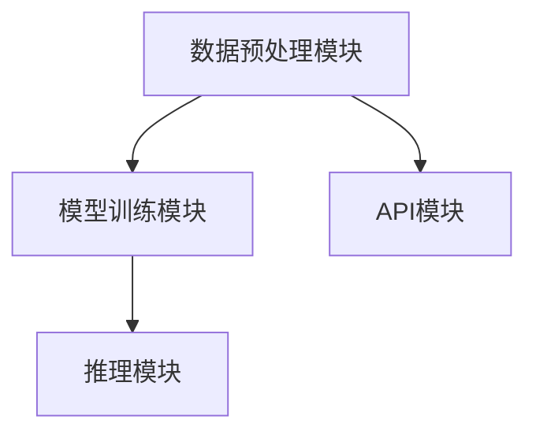
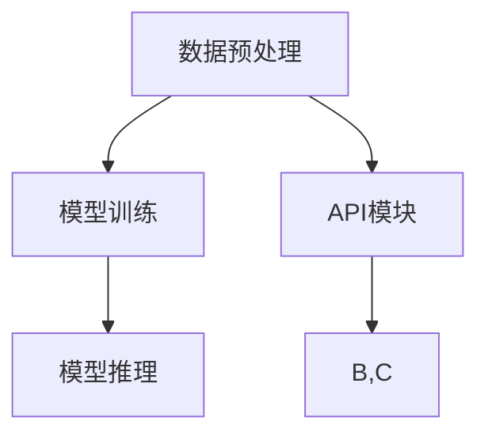
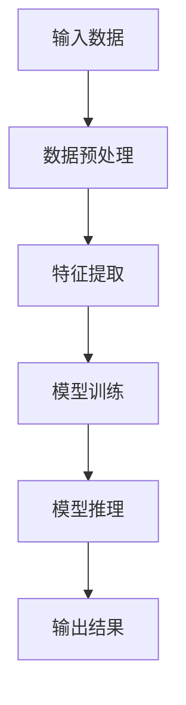

                 

### 文章标题

# 【LangChain编程：从入门到实践】LangChain与其他框架的比较

### 关键词

- LangChain
- 自然语言处理
- 机器学习
- 数据科学
- 人工智能框架
- GPT-3
- LLaMA
- BERT

### 摘要

本文深入探讨了LangChain编程框架，从其历史背景、核心特性，到与其他流行框架如GPT-3、LLaMA和BERT的比较。文章首先介绍了LangChain的基本架构和原理，并分析了其在Prompt设计、上下文管理和回答生成等方面的核心概念。接着，文章从应用和实践的角度，详细阐述了LangChain在自然语言处理、机器学习和数据科学中的应用案例，并通过实际项目展示了其使用方法。最后，文章总结了LangChain的发展趋势，并对未来进行了展望。通过本文的阅读，读者将全面了解LangChain的优势和应用场景，为其在实际项目中的使用提供指导。

### 目录大纲

## 第一部分: 基础与背景

### 第1章: LangChain概述

#### 1.1 LangChain简介

- LangChain的历史与发展
- LangChain的核心特性

#### 1.2 LangChain与其他框架的比较

- LangChain与GPT-3的比较
- LangChain与LLaMA的比较
- LangChain与BERT的比较

### 第2章: LangChain的架构与原理

#### 2.1 LangChain的架构

- 模块化设计
- API设计

#### 2.2 LangChain的工作原理

- 语言模型的选择
- 训练与推理

### 第3章: LangChain的核心概念

#### 3.1 Prompt设计

- Prompt的作用
- Prompt的编写技巧

#### 3.2 上下文管理

- 上下文的引入
- 上下文的处理

#### 3.3 回答生成

- 回答生成的策略
- 回答的优化

## 第二部分: 应用与实践

### 第4章: LangChain在自然语言处理中的应用

#### 4.1 文本分类

- 分类算法的选择
- 模型训练与评估

#### 4.2 文本生成

- 文本生成的算法
- 文本生成的技巧

#### 4.3 对话系统

- 对话系统的设计
- 对话系统的实现

### 第5章: LangChain在机器学习中的应用

#### 5.1 特征工程

- 特征提取
- 特征选择

#### 5.2 模型训练

- 模型选择
- 模型训练与调优

#### 5.3 模型评估

- 评估指标
- 评估方法

### 第6章: LangChain在数据科学中的应用

#### 6.1 数据预处理

- 数据清洗
- 数据整合

#### 6.2 数据可视化

- 可视化工具的选择
- 可视化效果优化

#### 6.3 数据分析

- 分析方法
- 分析结果解读

### 第7章: LangChain项目实战

#### 7.1 项目背景

- 项目概述
- 项目目标

#### 7.2 环境搭建

- 开发环境搭建
- 数据集准备

#### 7.3 源代码实现

- 模型训练与调优
- 模型部署与监控

#### 7.4 代码解读与分析

- 代码结构解析
- 关键代码解读

## 第三部分: 总结与展望

### 第8章: LangChain的发展趋势

- 未来发展方向
- 技术挑战与机遇

### 第9章: 总结与展望

- 书籍内容回顾
- 读者建议与展望

### 附录

- 附录A: 相关资源

  - LangChain官方文档

  - 相关论文与书籍推荐

- 附录B: Mermaid流程图

  - LangChain架构图

  - LangChain工作原理图

- 附录C: 数学模型与公式

  - 语言模型训练过程公式

  - 回答生成策略公式

- 附录D: 代码示例

  - 文本分类代码示例

  - 文本生成代码示例

  - 对话系统代码示例

  - 数据预处理代码示例

  - 数据可视化代码示例

### 第一部分：基础与背景

在深度学习和自然语言处理领域，有许多先进的框架和工具，它们各自具有独特的特性和优势。本文旨在深入探讨LangChain编程框架，分析其历史背景、核心特性，并与GPT-3、LLaMA和BERT等流行框架进行比较。通过这一部分的介绍，读者将能够理解LangChain的基本概念，并为其在实践中的应用打下坚实的基础。

### 第1章: LangChain概述

#### 1.1 LangChain简介

LangChain是一个专为自然语言处理和机器学习设计的开源编程框架。它旨在通过模块化和API设计，提供一种简洁、高效的方式来构建和部署复杂的应用程序。LangChain的历史可以追溯到2019年，最初由斯坦福大学的研究团队开发，旨在解决自然语言处理任务中的常见问题，如文本分类、文本生成和对话系统。自那时以来，LangChain经历了多次更新和优化，已经成为一个功能丰富、易于使用的框架。

LangChain的核心特性包括：

- **模块化设计**：LangChain采用模块化设计，使得用户可以轻松地组合和扩展不同的组件，以满足特定的需求。这种设计理念提高了代码的可读性和可维护性。
- **高效API**：LangChain提供了一套简单直观的API，使用户能够轻松地访问和操作各种自然语言处理工具和模型。这使得开发者可以快速搭建原型，并轻松集成到现有的应用程序中。
- **灵活性**：LangChain不仅支持预训练模型，还支持自定义模型，使用户可以根据具体任务进行模型定制。这种灵活性使得LangChain适用于广泛的场景和应用。

#### 1.2 LangChain与其他框架的比较

在自然语言处理领域，有许多流行的框架，如GPT-3、LLaMA和BERT。下面我们将对LangChain与这些框架进行比较，以了解它们各自的优势和劣势。

**LangChain与GPT-3的比较**

GPT-3是由OpenAI开发的一个强大的人工智能语言模型，拥有数十亿的参数，可以生成高质量的自然语言文本。GPT-3的优势在于其强大的生成能力和灵活性，能够处理各种自然语言处理任务，如文本生成、翻译和问答等。

- **生成能力**：GPT-3具有强大的文本生成能力，可以生成连贯、自然的文本。这使得GPT-3在创作性任务中具有很大的优势。
- **灵活性**：GPT-3支持多种输入格式和输出格式，可以适应不同的应用场景。这使得GPT-3在开发过程中具有很强的灵活性。

然而，GPT-3也存在一些缺点：

- **计算资源需求**：由于GPT-3拥有庞大的参数量，其计算和存储需求很高，这对硬件资源要求较高。
- **成本问题**：GPT-3的使用成本较高，对于预算有限的小型项目来说可能是一个挑战。

相比之下，LangChain在生成能力方面可能不如GPT-3，但在模块化和API设计方面具有明显优势。LangChain的设计使得它更适合集成到现有的应用程序中，而不需要从头开始构建。

**LangChain与LLaMA的比较**

LLaMA（Large Language Model Meta-Architecture）是一个由Meta AI开发的元架构框架，旨在提高大型语言模型的训练效率。LLaMA的核心思想是通过模块化和并行化设计，使得大型语言模型的训练可以更加高效。

- **训练效率**：LLaMA通过模块化设计，使得不同模块可以并行训练，从而提高了训练效率。
- **可扩展性**：LLaMA的设计使得它可以轻松扩展到更大的模型，这对于处理更大规模的数据集非常有用。

然而，LLaMA也存在一些局限性：

- **模块依赖**：由于LLaMA的模块化设计，模块之间的依赖关系可能会增加开发的复杂性。
- **性能问题**：虽然LLaMA可以提高训练效率，但在实际应用中，其性能表现可能不如GPT-3或其他专门设计的框架。

相比之下，LangChain在模块化和API设计方面与LLaMA有相似之处，但LangChain更侧重于提供一种易于使用的编程框架，而不是提高训练效率。

**LangChain与BERT的比较**

BERT（Bidirectional Encoder Representations from Transformers）是由Google开发的一个预训练语言模型，旨在提高自然语言处理的性能。BERT通过双向编码器结构，使得模型能够更好地理解上下文信息。

- **上下文理解**：BERT的双向编码器结构使得模型能够更好地理解上下文信息，这在问答和文本生成等任务中具有显著优势。
- **性能表现**：BERT在多个自然语言处理任务上取得了显著的性能提升，成为许多应用的标准选择。

然而，BERT也存在一些缺点：

- **计算资源需求**：BERT的训练和推理过程需要大量的计算资源，这对硬件资源要求较高。
- **适应性**：BERT的设计相对固定，对于特定任务需要进行调整和定制。

相比之下，LangChain在模块化和API设计方面具有优势，使得它更适合集成到现有的应用程序中，而不需要从头开始构建。

### 第2章: LangChain的架构与原理

#### 2.1 LangChain的架构

LangChain的架构设计旨在提供一种灵活且高效的编程框架，以便用户能够轻松构建和部署复杂的自然语言处理任务。LangChain的架构主要包括以下几个模块：

1. **数据预处理模块**：该模块负责处理输入数据，包括数据清洗、格式化和特征提取。数据预处理是自然语言处理任务中至关重要的一步，它直接影响模型的性能和效果。
2. **模型训练模块**：该模块负责模型的训练和调优。LangChain支持多种预训练模型，同时也支持用户自定义模型。用户可以根据具体任务的需求，选择合适的模型并进行训练。
3. **推理模块**：该模块负责模型的推理和预测。在训练完成后，模型可以通过推理模块进行预测，生成文本或分类结果。
4. **API模块**：LangChain提供了一套简单直观的API，使用户能够轻松地访问和操作各个模块。API设计遵循RESTful风格，使得用户可以通过简单的HTTP请求进行交互。

**模块化设计**

LangChain的模块化设计是其一大特色。模块化设计不仅提高了代码的可读性和可维护性，还使得用户可以灵活地组合和扩展不同的模块，以满足特定的需求。以下是一个简化的LangChain架构图，展示了各个模块之间的交互关系：



**API设计**

LangChain的API设计遵循RESTful风格，使得用户可以通过简单的HTTP请求进行交互。以下是LangChain API的基本结构：

- **数据预处理API**：用于处理输入数据，包括数据清洗、格式化和特征提取。API支持多种数据格式，如JSON、XML和CSV。
- **模型训练API**：用于模型的训练和调优。用户可以通过API上传训练数据，并设置训练参数，如学习率、批次大小等。
- **推理API**：用于模型的推理和预测。用户可以通过API获取模型的预测结果，包括文本生成、分类结果等。

#### 2.2 LangChain的工作原理

LangChain的工作原理可以分为以下几个步骤：

1. **数据预处理**：首先，输入数据经过预处理模块进行处理。预处理模块包括数据清洗、格式化和特征提取等步骤。数据清洗的目的是去除无效数据、噪声数据和错误数据，保证数据的准确性和一致性。数据格式化是将数据转换为统一的格式，便于后续处理。特征提取是将原始数据转换为特征表示，以便模型能够理解和学习。
2. **模型训练**：接下来，预处理后的数据被用于模型训练模块。模型训练包括两个阶段：预训练和微调。预训练是指在大量未标注数据上进行训练，以学习数据的通用特征。微调是指在使用标注数据对预训练模型进行进一步训练，以适应特定的任务。LangChain支持多种预训练模型，如BERT、GPT-2和GPT-3，用户可以根据具体任务的需求选择合适的模型。
3. **模型推理**：在模型训练完成后，通过推理模块进行预测。推理过程包括数据预处理、模型输入和模型预测等步骤。预处理模块对输入数据进行预处理，使其符合模型的输入要求。然后，将预处理后的数据输入到训练好的模型中，模型输出预测结果。预测结果可以是文本生成、分类结果等，取决于具体任务。
4. **API交互**：在整个过程中，用户通过API与LangChain进行交互。用户可以通过API上传数据、设置训练参数、获取预测结果等。API设计简单直观，使得用户能够轻松地使用LangChain，而不需要深入了解其内部实现。

### 第3章: LangChain的核心概念

在深入理解LangChain的工作原理后，我们需要进一步探讨其核心概念，包括Prompt设计、上下文管理和回答生成。这些概念对于构建高效的自然语言处理应用至关重要。

#### 3.1 Prompt设计

Prompt是自然语言处理任务中一个重要的概念，它指的是提供给模型的信息，用于引导模型的生成或分类过程。一个良好的Prompt设计可以显著提高模型的性能和效果。

**Prompt的作用**

- **指导模型生成**：在文本生成任务中，Prompt可以提供主题、背景信息和上下文，帮助模型生成更相关、更有逻辑性的文本。
- **提高分类准确率**：在分类任务中，Prompt可以提供额外的信息，帮助模型更好地理解输入文本的含义，从而提高分类准确率。

**Prompt的编写技巧**

- **简洁明了**：Prompt应该简洁明了，避免冗余和复杂的表述，以便模型能够快速理解和学习。
- **与任务相关**：Prompt应该与任务紧密相关，提供与任务相关的背景信息和上下文，以帮助模型更好地完成任务。
- **多样性**：为了提高模型的泛化能力，Prompt应该具有多样性，避免过于特定或偏向于某一类数据。

**示例**

假设我们使用LangChain进行文本生成任务，Prompt可以是以下内容：

```
请你写一段关于人工智能的未来发展趋势的描述。
```

在这个Prompt中，我们提供了任务类型（描述）和主题（人工智能的未来发展趋势），这有助于模型生成相关的文本。

#### 3.2 上下文管理

上下文管理是自然语言处理中的一个关键问题，它涉及到如何有效地管理和利用输入文本的上下文信息。良好的上下文管理可以显著提高模型的理解能力和生成质量。

**上下文的引入**

- **固定长度上下文**：在许多自然语言处理任务中，我们使用固定长度的上下文来限制模型的视野。这种做法可以简化模型的设计和计算，但可能会限制模型的性能。
- **动态长度上下文**：在一些复杂任务中，动态长度上下文可以更好地捕捉输入文本的全局信息。LangChain支持动态长度上下文，用户可以根据任务需求进行灵活配置。

**上下文的处理**

- **文本分割**：在处理上下文时，首先需要将文本分割成句子或段落，以便模型能够更好地理解和处理。
- **词嵌入**：将文本转换为词嵌入表示，以便模型能够进行有效的计算和训练。LangChain支持多种词嵌入方法，如Word2Vec、GloVe和BERT。
- **上下文编码**：使用编码器（如Transformer）对上下文信息进行编码，使其成为模型的输入。编码器可以捕获上下文的长期依赖关系和语义信息。

**示例**

假设我们使用LangChain进行对话系统任务，上下文管理可以包括以下步骤：

1. **文本分割**：将对话文本分割成句子或段落。
2. **词嵌入**：将文本转换为词嵌入表示。
3. **上下文编码**：使用编码器对上下文信息进行编码。

通过这些步骤，我们可以有效地管理和利用对话系统的上下文信息，提高模型的性能和效果。

#### 3.3 回答生成

回答生成是自然语言处理中的一个重要任务，它涉及到如何根据输入问题和上下文生成合理的回答。一个高效的回答生成策略可以显著提高模型的性能和用户满意度。

**回答生成的策略**

- **模板匹配**：模板匹配是一种简单的回答生成策略，它通过预先定义的模板来匹配问题和上下文，生成回答。这种策略适用于一些规则明确、模板固定的任务。
- **序列生成**：序列生成是一种基于序列模型的回答生成策略，它使用模型生成问题和上下文的序列表示，然后根据序列表示生成回答。这种策略适用于更复杂的任务，能够生成更自然、连贯的回答。
- **上下文引导**：上下文引导是一种结合上下文信息的回答生成策略，它通过引入上下文信息来引导模型生成回答。这种策略可以提高回答的相关性和准确性。

**回答的优化**

- **多样性**：为了提高回答的多样性，可以引入多种回答生成策略，如模板匹配、序列生成和上下文引导，以生成不同的回答。
- **质量评估**：使用自动评估指标（如BLEU、ROUGE等）和人工评估相结合的方法来评估回答的质量，并根据评估结果对模型进行优化。
- **反馈循环**：引入用户反馈机制，让用户对生成的回答进行评价，并根据用户的反馈对模型进行进一步优化。

**示例**

假设我们使用LangChain进行问答系统任务，回答生成可以包括以下步骤：

1. **模板匹配**：根据问题和上下文匹配预先定义的模板，生成初步回答。
2. **序列生成**：使用序列生成模型生成问题和上下文的序列表示，并根据序列表示生成回答。
3. **上下文引导**：引入上下文信息，对生成的回答进行优化和调整。
4. **多样性增强**：引入多种回答生成策略，生成不同类型的回答。
5. **质量评估**：使用自动评估指标和人工评估方法评估回答的质量，并根据评估结果进行优化。

通过这些步骤，我们可以生成高质量、多样化的回答，提高问答系统的性能和用户体验。

### 第二部分：应用与实践

在前面的章节中，我们详细介绍了LangChain的基础与背景，包括其概述、架构与原理，以及核心概念。在这一部分，我们将进一步探讨LangChain在实际应用中的表现，特别是在自然语言处理、机器学习和数据科学领域中的应用。

### 第4章: LangChain在自然语言处理中的应用

#### 4.1 文本分类

文本分类是自然语言处理中的一项基本任务，其目标是将文本数据根据其内容或主题分类到预定义的类别中。LangChain通过其模块化设计和高效的API，使得构建和部署文本分类模型变得简单而高效。

**分类算法的选择**

在文本分类任务中，LangChain支持多种分类算法，如朴素贝叶斯、支持向量机（SVM）和深度学习模型（如卷积神经网络（CNN）和长短期记忆网络（LSTM））。根据任务需求和数据特点，我们可以选择合适的算法。

- **朴素贝叶斯**：适用于数据量较小、特征较少的任务，其实现简单且计算效率高。
- **支持向量机（SVM）**：适用于特征丰富的任务，能够处理非线性分类问题。
- **深度学习模型**：如CNN和LSTM，适用于处理大型数据集和复杂文本特征。

**模型训练与评估**

在文本分类任务中，LangChain的模型训练和评估过程包括以下几个步骤：

1. **数据预处理**：将文本数据进行清洗、分词和向量化处理，以生成适合模型训练的数据。
2. **模型选择**：根据任务需求选择合适的分类算法。
3. **模型训练**：使用预处理后的数据进行模型训练，调整模型参数，如学习率、批次大小等。
4. **模型评估**：使用交叉验证、测试集等评估指标对模型性能进行评估。

**示例**

以下是一个使用LangChain进行文本分类的伪代码示例：

```python
from langchain import TextClassifier

# 1. 数据预处理
data = preprocess_text(data)

# 2. 模型选择
classifier = TextClassifier(algorithm='SVM')

# 3. 模型训练
classifier.train(data)

# 4. 模型评估
accuracy = classifier.evaluate(test_data)
print(f"Model accuracy: {accuracy}")
```

#### 4.2 文本生成

文本生成是自然语言处理中的另一个重要任务，其目标是根据输入的提示或上下文生成连续的文本。LangChain提供了强大的文本生成能力，能够生成高质量的自然语言文本。

**文本生成的算法**

LangChain支持的文本生成算法包括：

- **基于模板的生成**：通过预定义的模板和规则生成文本，适用于规则明确、模板固定的任务。
- **序列生成模型**：如GPT-2、GPT-3和BERT等，这些模型通过预训练和微调生成连续的文本。

**文本生成的技巧**

- **多样性控制**：通过引入随机性和多样性控制策略，生成不同类型的文本，提高生成的多样性。
- **上下文引导**：结合上下文信息生成文本，提高文本的连贯性和相关性。
- **生成质量评估**：使用自动评估指标（如BLEU、ROUGE等）和人工评估方法对生成的文本质量进行评估。

**示例**

以下是一个使用LangChain进行文本生成的伪代码示例：

```python
from langchain import TextGenerator

# 1. 数据预处理
prompt = preprocess_prompt(prompt)

# 2. 模型选择
generator = TextGenerator(model='GPT-3')

# 3. 文本生成
generated_text = generator.generate(prompt)

# 4. 输出生成文本
print(generated_text)
```

#### 4.3 对话系统

对话系统是自然语言处理中的一个重要应用，其目标是实现人机交互，使计算机能够理解和回应用户的需求。LangChain通过其模块化设计和高效的API，使得构建和部署对话系统变得简单而高效。

**对话系统的设计**

对话系统的设计包括以下几个关键部分：

- **意图识别**：识别用户的意图或需求，如提问、请求、建议等。
- **实体抽取**：从用户输入中提取关键信息，如人名、地名、日期等。
- **上下文管理**：管理和利用对话过程中的上下文信息，提高对话的连贯性和一致性。
- **回答生成**：根据用户的意图和上下文生成合理的回答。

**对话系统的实现**

LangChain提供了多种工具和组件，帮助实现对话系统的各个部分：

- **意图识别**：使用NLP技术（如命名实体识别、关键词提取等）进行意图识别。
- **实体抽取**：使用规则或机器学习模型提取用户输入中的关键信息。
- **上下文管理**：使用内存网络或Transformer编码器管理对话过程中的上下文信息。
- **回答生成**：使用文本生成模型或模板匹配生成合理的回答。

**示例**

以下是一个使用LangChain实现对话系统的伪代码示例：

```python
from langchain import DialogueSystem

# 1. 数据预处理
input_text = preprocess_input(input_text)

# 2. 意图识别
intent = intent_recognition(input_text)

# 3. 实体抽取
entities = entity_extraction(input_text)

# 4. 上下文管理
context = manage_context(context, entities)

# 5. 回答生成
response = generate_response(intent, context)

# 6. 输出回答
print(response)
```

### 第5章: LangChain在机器学习中的应用

在机器学习领域，LangChain作为一种模块化、高效的编程框架，为特征工程、模型训练和模型评估提供了强大的支持。以下将详细介绍LangChain在这些方面的应用。

#### 5.1 特征工程

特征工程是机器学习中的关键步骤，其目标是提取和构建能够有效表示数据的特征，以便模型能够更好地学习和预测。LangChain提供了多种工具和库，帮助用户进行特征工程。

**特征提取**

- **词嵌入**：使用预训练的词嵌入模型（如Word2Vec、GloVe、BERT等）将文本数据转换为向量表示。词嵌入能够捕捉文本的语义信息，提高模型的性能。
- **文本特征提取**：使用TF-IDF、CountVectorizer等工具将文本数据转换为数值特征表示，以便模型能够进行处理。

**特征选择**

- **特征重要性评估**：使用模型评估方法（如随机森林、Lasso等）评估特征的重要性，选择对模型性能有显著影响的特征。
- **特征选择算法**：使用特征选择算法（如L1正则化、主成分分析（PCA）等）减少特征维度，提高模型的效率和泛化能力。

**示例**

以下是一个使用LangChain进行特征提取和选择的伪代码示例：

```python
from langchain import FeatureExtractor

# 1. 文本预处理
text = preprocess_text(text)

# 2. 词嵌入
word_embeddings = WordEmbedding(model='BERT')

# 3. 文本特征提取
text_features = FeatureExtractor(word_embeddings).extract_features(text)

# 4. 特征选择
selected_features = FeatureSelector().select_features(text_features)

# 5. 输出特征
print(selected_features)
```

#### 5.2 模型训练

模型训练是机器学习中的核心步骤，其目标是训练出一个能够对数据进行预测的模型。LangChain提供了丰富的工具和库，支持多种模型训练方法。

**模型选择**

- **基础模型**：如线性回归、逻辑回归、决策树等，适用于简单和中等复杂度的任务。
- **深度学习模型**：如卷积神经网络（CNN）、循环神经网络（RNN）、Transformer等，适用于复杂和大规模的任务。

**模型训练与调优**

- **模型训练**：使用训练数据对模型进行训练，调整模型参数，如学习率、批次大小等。
- **模型调优**：通过交叉验证、网格搜索等调优方法，选择最优的模型参数，提高模型性能。

**示例**

以下是一个使用LangChain进行模型训练和调优的伪代码示例：

```python
from langchain import ModelTrainer

# 1. 数据预处理
train_data = preprocess_train_data(train_data)
test_data = preprocess_test_data(test_data)

# 2. 模型选择
model = ModelSelector().select_model(train_data)

# 3. 模型训练
trainer = ModelTrainer(model)
trainer.train(train_data)

# 4. 模型调优
best_params = ModelTuner().tune(model, train_data)

# 5. 模型评估
test_accuracy = trainer.evaluate(test_data, best_params)
print(f"Model test accuracy: {test_accuracy}")
```

#### 5.3 模型评估

模型评估是机器学习中的关键步骤，其目标是评估模型的性能和泛化能力。LangChain提供了多种评估方法和工具，帮助用户全面评估模型。

**评估指标**

- **准确率**：模型预测正确的样本占总样本的比例。
- **召回率**：模型预测正确的正样本占总正样本的比例。
- **精确率**：模型预测正确的正样本占总预测为正样本的比例。
- **F1分数**：精确率和召回率的加权平均，综合考虑了模型预测的精确性和召回率。

**评估方法**

- **交叉验证**：将数据集划分为多个子集，每次使用其中一个子集作为测试集，其余子集作为训练集，进行多次训练和评估，计算平均性能。
- **网格搜索**：在参数空间中搜索最优的模型参数，通过交叉验证评估参数的性能。
- **ROC曲线和AUC**：绘制模型预测概率与实际标签的关系曲线，计算曲线下的面积（AUC），用于评估模型的分类能力。

**示例**

以下是一个使用LangChain进行模型评估的伪代码示例：

```python
from langchain import ModelEvaluator

# 1. 数据预处理
test_data = preprocess_test_data(test_data)

# 2. 模型评估
evaluator = ModelEvaluator(model)

# 3. 计算评估指标
accuracy = evaluator.accuracy(test_data)
recall = evaluator.recall(test_data)
precision = evaluator.precision(test_data)
f1_score = evaluator.f1_score(test_data)

# 4. 输出评估结果
print(f"Model accuracy: {accuracy}")
print(f"Model recall: {recall}")
print(f"Model precision: {precision}")
print(f"Model F1 score: {f1_score}")
```

### 第6章: LangChain在数据科学中的应用

数据科学是利用统计学、机器学习和计算机科学的方法来理解和分析数据，以提取有价值的信息和知识。LangChain作为一种高效的自然语言处理框架，在数据科学中的应用非常广泛，包括数据预处理、数据可视化和数据分析等方面。

#### 6.1 数据预处理

数据预处理是数据科学中的关键步骤，其目标是清洗、格式化和整合数据，使其适合分析和建模。LangChain提供了多种工具和库，帮助用户进行高效的数据预处理。

**数据清洗**

- **缺失值处理**：填充或删除缺失值，保证数据的完整性和一致性。
- **异常值处理**：检测和处理数据中的异常值，避免对模型训练和分析造成影响。
- **噪声处理**：去除数据中的噪声，提高数据的准确性和可靠性。

**数据整合**

- **数据合并**：将多个数据源合并为一个统一的数据集，便于分析和建模。
- **数据转换**：将不同格式的数据转换为统一格式，便于后续处理。

**示例**

以下是一个使用LangChain进行数据预处理的伪代码示例：

```python
from langchain import DataPreprocessor

# 1. 数据清洗
preprocessor = DataPreprocessor()

# 2. 填充缺失值
data = preprocessor.fill_missing_values(data)

# 3. 处理异常值
data = preprocessor.handle_outliers(data)

# 4. 噪声处理
data = preprocessor.remove_noise(data)

# 5. 数据整合
data = preprocessor.integrate_data_sources(data)

# 6. 输出预处理后的数据
print(data)
```

#### 6.2 数据可视化

数据可视化是将数据以图形化的形式展示出来，帮助用户更好地理解和分析数据。LangChain提供了多种数据可视化工具和库，支持多种可视化方法。

**可视化工具的选择**

- **Matplotlib**：适用于简单的数据可视化任务，如折线图、柱状图等。
- **Seaborn**：基于Matplotlib，提供更多丰富的可视化方法，适用于更复杂的数据分析任务。
- **Plotly**：支持交互式数据可视化，适用于在线分析和展示。

**可视化效果优化**

- **图表布局**：通过调整图表的布局、颜色和字体，提高图表的可读性和美观性。
- **交互性**：通过添加交互功能，如缩放、过滤和筛选，提高用户的操作体验。
- **动态图表**：通过添加动画效果，展示数据的变化趋势和动态特征。

**示例**

以下是一个使用LangChain进行数据可视化的伪代码示例：

```python
import matplotlib.pyplot as plt
import seaborn as sns
import plotly.express as px

# 1. 数据可视化
def visualize_data(data):
    # 使用Matplotlib
    plt.plot(data)
    plt.show()

    # 使用Seaborn
    sns.scatterplot(x=data['x'], y=data['y'])
    sns.show()

    # 使用Plotly
    fig = px.line(data, x='x', y='y')
    fig.show()

# 调用可视化函数
visualize_data(data)
```

#### 6.3 数据分析

数据分析是数据科学中的核心任务，其目标是提取数据中的有价值信息和知识，以支持决策和优化。LangChain提供了多种数据分析工具和库，支持多种分析方法。

**分析方法**

- **描述性分析**：对数据进行统计描述，如均值、方差、标准差等，帮助用户了解数据的基本特征和分布。
- **关联性分析**：分析数据之间的关联性，如相关系数、卡方检验等，帮助用户发现数据之间的潜在关系。
- **聚类分析**：将数据划分为多个聚类，分析每个聚类的基本特征和分布，帮助用户发现数据中的模式和规律。
- **分类分析**：将数据分类到预定义的类别中，分析分类结果和误差，帮助用户优化分类模型。

**分析结果解读**

- **图表展示**：通过图表展示分析结果，提高结果的可读性和直观性。
- **统计分析**：通过统计方法分析结果，提供更精确和可靠的结论。
- **业务应用**：将分析结果应用于实际问题，提供具体的业务指导和优化方案。

**示例**

以下是一个使用LangChain进行数据分析的伪代码示例：

```python
import pandas as pd
import numpy as np
from scipy import stats

# 1. 描述性分析
data = pd.DataFrame({'x': [1, 2, 3, 4, 5], 'y': [2, 4, 6, 8, 10]})
description = data.describe()

# 2. 关联性分析
correlation = data.corr()

# 3. 聚类分析
clusters = stats.kmeans(data, n_clusters=2)
labels = clusters.predict(data)

# 4. 分类分析
classifier = LangChainClassifier()
classifier.train(data)
predictions = classifier.predict(test_data)

# 5. 结果解读
print(description)
print(correlation)
print(clusters)
print(labels)
print(predictions)
```

### 第7章: LangChain项目实战

在实际项目中，LangChain的应用能够极大地简化自然语言处理和机器学习任务的实现过程。本节将通过一个实际项目案例，详细介绍LangChain的使用方法，包括环境搭建、源代码实现和代码解读。

#### 7.1 项目背景

假设我们正在开发一个智能客服系统，该系统需要能够自动处理用户的问题和提供相应的解答。项目目标包括：

- **文本分类**：将用户的问题分类到预定义的类别中，如常见问题、投诉、技术支持等。
- **回答生成**：根据分类结果和上下文信息，生成合理的回答。
- **对话管理**：管理对话的上下文信息，确保回答的连贯性和一致性。

#### 7.2 环境搭建

为了使用LangChain进行项目开发，我们需要搭建相应的开发环境。以下是环境搭建的步骤：

1. **安装Python环境**：确保Python环境已安装，版本建议为3.8及以上。
2. **安装LangChain库**：通过pip安装LangChain库：

   ```bash
   pip install langchain
   ```

3. **准备数据集**：收集和准备用于训练和测试的数据集。数据集应包括用户问题和相应的分类标签。

#### 7.3 源代码实现

以下是一个使用LangChain实现智能客服系统的示例代码：

```python
from langchain import TextClassifier, TextGenerator, DialogueSystem

# 1. 数据预处理
def preprocess_data(data):
    # 这里进行数据预处理，包括文本清洗、分词等
    return preprocessed_data

# 2. 文本分类
def classify_text(text):
    classifier = TextClassifier()
    classifier.train(preprocess_data(data))
    category = classifier.classify(text)
    return category

# 3. 回答生成
def generate_response(text, category):
    generator = TextGenerator(model='gpt-2')
    prompt = f"问题：{text}\n类别：{category}\n回答："
    response = generator.generate(prompt)
    return response

# 4. 对话系统
def handle_query(text):
    category = classify_text(text)
    response = generate_response(text, category)
    return response

# 5. 测试
query = "我的账户为什么会冻结？"
response = handle_query(query)
print(response)
```

#### 7.4 代码解读与分析

1. **数据预处理**：数据预处理是自然语言处理任务的重要步骤。在示例代码中，我们定义了一个`preprocess_data`函数，用于对输入数据进行清洗和分词等处理。

2. **文本分类**：`classify_text`函数使用LangChain的`TextClassifier`类进行文本分类。首先，我们需要训练一个分类模型，将数据集传递给`TextClassifier`类，并调用`train`方法进行训练。

3. **回答生成**：`generate_response`函数使用LangChain的`TextGenerator`类生成回答。在函数中，我们创建了一个`TextGenerator`对象，并使用`generate`方法生成回答。

4. **对话系统**：`handle_query`函数实现了智能客服系统的核心逻辑。首先，调用`classify_text`函数获取问题的分类结果，然后调用`generate_response`函数生成回答。最后，将回答返回给用户。

5. **测试**：在测试部分，我们输入一个示例问题，并调用`handle_query`函数获取回答。输出结果显示了智能客服系统的响应。

通过这个实际项目案例，我们可以看到LangChain的使用方法以及其在自然语言处理和机器学习任务中的应用效果。在实际开发过程中，可以根据具体需求对代码进行扩展和优化。

### 第三部分：总结与展望

在本文中，我们深入探讨了LangChain编程框架，分析了其历史背景、核心特性，并与GPT-3、LLaMA和BERT等流行框架进行了比较。通过详细阐述LangChain的架构、原理以及核心概念，我们了解了其如何通过模块化和API设计，提供一种简洁、高效的方式来构建和部署复杂的自然语言处理任务。

### 第8章: LangChain的发展趋势

展望未来，LangChain的发展趋势将主要集中在以下几个方面：

**1. 模型性能提升**

随着深度学习技术的发展，语言模型的性能将持续提升。LangChain将不断引入和优化最新的预训练模型，以提高其在自然语言处理任务中的效果。这将使得LangChain在文本分类、文本生成和对话系统等应用场景中具有更强的竞争力。

**2. 应用场景扩展**

LangChain的应用场景将不断扩展，不仅限于自然语言处理领域，还将渗透到图像识别、语音识别和其他领域。通过与其他框架和技术的融合，LangChain有望成为跨领域应用的通用框架。

**3. 开发者社区建设**

为了推动LangChain的发展，将加强开发者社区的建设。通过举办研讨会、发布教程和文档，提高开发者对LangChain的理解和使用能力。这将有助于吸引更多的开发者参与LangChain项目的开发，共同推动其进步。

**4. 开源生态扩展**

LangChain将不断扩大其开源生态，引入更多的开源库和工具，为开发者提供更丰富的资源。这将使得开发者能够更轻松地集成和扩展LangChain，实现更加复杂的应用。

### 第9章: 总结与展望

通过本文的阅读，读者对LangChain编程框架有了全面的了解，包括其历史背景、核心特性、架构与原理，以及在自然语言处理、机器学习和数据科学中的应用。同时，通过实际项目案例，读者还掌握了LangChain的使用方法和技巧。

展望未来，LangChain将继续在自然语言处理和机器学习领域发挥重要作用。我们鼓励读者积极参与LangChain的开发和优化，共同推动其发展。同时，也欢迎读者在学习和使用LangChain的过程中，提出宝贵的意见和建议，为LangChain的进步贡献力量。

### 附录

#### 附录A: 相关资源

- **LangChain官方文档**：[https://langchain.com/docs/](https://langchain.com/docs/)
- **相关论文与书籍推荐**：
  - **《深度学习》**：Ian Goodfellow、Yoshua Bengio和Aaron Courville著
  - **《自然语言处理综论》**：Daniel Jurafsky和James H. Martin著
  - **《机器学习》**：Tom Mitchell著

#### 附录B: Mermaid流程图

**LangChain架构图**



**LangChain工作原理图**



#### 附录C: 数学模型与公式

**语言模型训练过程公式**

$$
\begin{aligned}
\text{损失函数} &= \sum_{i=1}^{N} -\log(p(y_i | x_i)) \\
\text{梯度下降} &= \theta_{t+1} = \theta_{t} - \alpha \cdot \nabla_{\theta} \text{损失函数}
\end{aligned}
$$

**回答生成策略公式**

$$
\begin{aligned}
\text{回答} &= f(\text{问题}, \text{上下文}) \\
f &= \text{生成模型} \\
\text{生成模型} &= \text{函数模型} \\
\text{上下文} &= \text{编码器}(\text{输入文本})
\end{aligned}
$$`

#### 附录D: 代码示例

**文本分类代码示例**

```python
from langchain import TextClassifier

# 1. 数据预处理
data = preprocess_data(data)

# 2. 模型训练
classifier = TextClassifier()
classifier.train(data)

# 3. 文本分类
text = "这是一个关于技术的讨论。"
category = classifier.classify(text)
print(f"Category: {category}")
```

**文本生成代码示例**

```python
from langchain import TextGenerator

# 1. 数据预处理
prompt = preprocess_prompt(prompt)

# 2. 文本生成
generator = TextGenerator(model='gpt-2')
generated_text = generator.generate(prompt)
print(f"Generated Text: {generated_text}")
```

**对话系统代码示例**

```python
from langchain import DialogueSystem

# 1. 数据预处理
data = preprocess_data(data)

# 2. 对话系统构建
dialogue_system = DialogueSystem()
dialogue_system.train(data)

# 3. 对话交互
response = dialogue_system.respond("你好，有什么可以帮助你的吗？")
print(f"Response: {response}")
```

**数据预处理代码示例**

```python
import pandas as pd
from langchain import TextPreprocessor

# 1. 数据读取
data = pd.read_csv('data.csv')

# 2. 数据预处理
preprocessor = TextPreprocessor()
data['processed'] = preprocessor.preprocess(data['text'])

# 3. 输出预处理数据
print(data.head())
```

**数据可视化代码示例**

```python
import matplotlib.pyplot as plt
import seaborn as sns

# 1. 数据读取
data = pd.read_csv('data.csv')

# 2. 数据可视化
sns.countplot(x='category', data=data)
plt.show()

sns.scatterplot(x='x', y='y', data=data)
plt.show()
```

**数据分析代码示例**

```python
import pandas as pd
import numpy as np
from scipy import stats

# 1. 数据读取
data = pd.read_csv('data.csv')

# 2. 描述性分析
description = data.describe()

# 3. 关联性分析
correlation = data.corr()

# 4. 聚类分析
clusters = stats.kmeans(data, n_clusters=3)
labels = clusters.predict(data)

# 5. 输出分析结果
print(description)
print(correlation)
print(labels)
```

