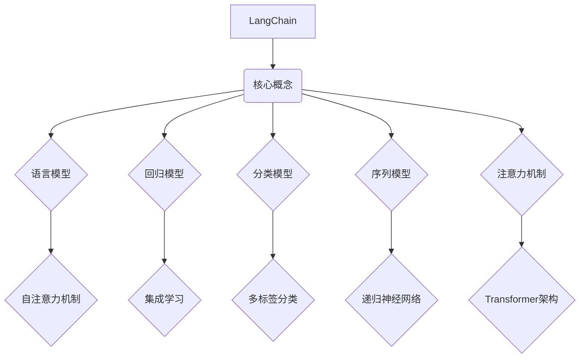
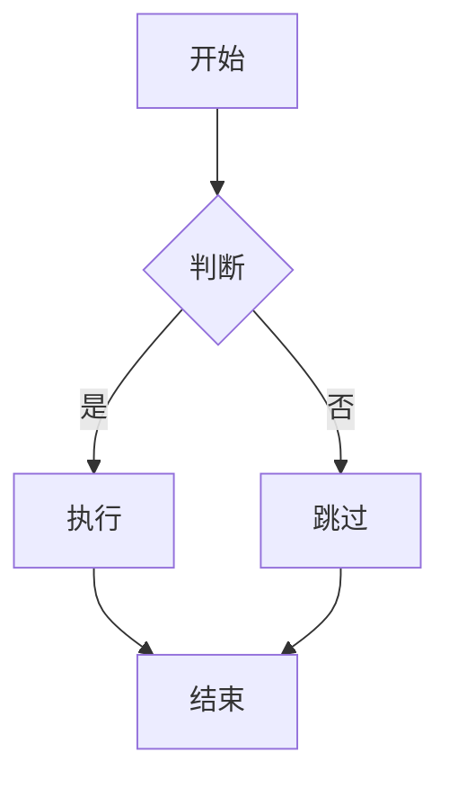
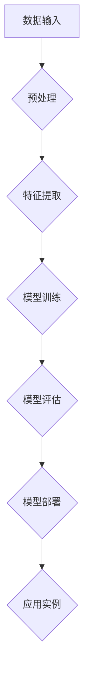
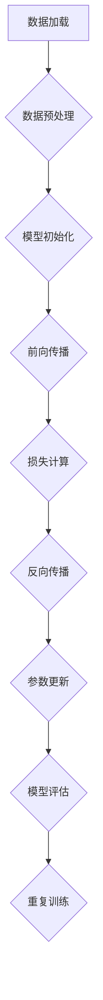
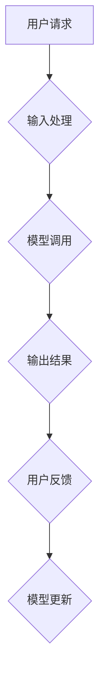

                 

# LangChain编程：从入门到实践

> 关键词：LangChain、编程、自然语言处理、深度学习、模型优化、应用实例

> 摘要：本文旨在为初学者和进阶开发者提供一份详细的LangChain编程指南。文章将系统地介绍LangChain的基础知识，核心概念，编程基础，基本模型，进阶模型，应用实例以及实战项目。此外，还将深入探讨LangChain的高级特性，如调优与优化、安全性与隐私保护，以及未来发展趋势。通过本文的阅读，读者将能够全面了解LangChain的原理和应用，掌握其编程技巧，为实际项目开发打下坚实的基础。

## 第一部分：LangChain基础

### 第1章：LangChain概述

#### 1.1 LangChain的概念与特点

LangChain是一种用于构建自然语言处理（NLP）应用的强大工具。它利用深度学习模型，如语言模型、回归模型、分类模型和序列模型，以实现各种NLP任务，如文本分类、命名实体识别、机器翻译等。

- 语言模型：用于预测下一个单词或字符的概率分布。
- 回归模型：用于预测连续值输出。
- 分类模型：用于将输入数据分类到预定义的类别。
- 序列模型：用于处理序列数据，如时间序列数据或文本数据。

#### 1.2 LangChain的应用领域

LangChain广泛应用于以下领域：

- 文本分类：将文本数据分类到预定义的类别。
- 命名实体识别：识别文本中的命名实体，如人名、地名等。
- 机器翻译：将一种语言翻译成另一种语言。

#### 1.3 LangChain的发展历程

LangChain的发展历程可以分为以下几个阶段：

- 早期发展：基于统计模型和规则系统的语言处理。
- 现代发展：基于深度学习的语言处理模型，如GPT、BERT等。

#### 1.4 学习目标

通过本章的学习，读者将能够：

- 理解LangChain的概念和特点。
- 掌握LangChain在自然语言处理中的应用。
- 了解LangChain的发展历程。

### 第2章：LangChain核心概念

#### 2.1 语言模型

语言模型是NLP的核心组成部分，用于预测下一个单词或字符的概率分布。常见的语言模型有：

- n-gram模型：基于前n个字符的概率分布。
- 神经网络模型：基于深度学习的语言模型，如GPT、BERT等。

#### 2.2 回归模型

回归模型用于预测连续值输出。常见的回归模型有：

- 线性回归：基于线性函数的回归模型。
- 逻辑回归：用于二分类问题的回归模型。

#### 2.3 分类模型

分类模型用于将输入数据分类到预定义的类别。常见的分类模型有：

- 支持向量机（SVM）：基于最大间隔分类的模型。
- 决策树：基于树结构的分类模型。
- 随机森林：基于决策树的集成学习方法。

#### 2.4 序列模型

序列模型用于处理序列数据，如时间序列数据或文本数据。常见的序列模型有：

- RNN（循环神经网络）：用于处理序列数据的神经网络。
- LSTM（长短时记忆网络）：RNN的改进模型，能够更好地处理长序列数据。
- GRU（门控循环单元）：LSTM的简化版，具有类似的记忆能力。

#### 2.5 注意力机制

注意力机制是一种用于提高模型在处理序列数据时的表现的方法。它通过为不同部分分配不同的权重，使得模型能够更加关注序列中的重要信息。常见的注意力机制有：

- 自注意力机制：用于处理序列数据的注意力机制。
- 交叉注意力机制：用于在编码器和解码器之间共享注意力。

### 第3章：LangChain编程基础

#### 3.1 Python编程基础

Python是一种广泛应用于数据科学和机器学习的编程语言。掌握Python编程基础对于使用LangChain进行开发至关重要。本章将介绍Python的基本语法和常用数据结构。

#### 3.2 数据类型与变量

Python中的数据类型包括整数、浮点数、字符串、列表、元组、字典和集合。变量是用于存储数据的符号表示。

#### 3.3 流程控制

Python中的流程控制语句包括条件语句（if-else）、循环语句（for、while）和异常处理语句（try-except）。

#### 3.4 函数与模块

函数是组织代码、提高代码可读性和复用性的重要工具。模块是Python代码文件，用于存储和共享代码。

#### 3.5 错误处理

错误处理是确保代码稳健运行的关键。Python中的错误处理机制基于try-except语句。

### 第4章：LangChain基本模型

#### 4.1 语言模型入门

本章将介绍语言模型的基本概念和实现方法。我们将使用Python中的TensorFlow库来实现一个简单的语言模型。

#### 4.2 回归模型入门

回归模型是一种用于预测连续值的模型。本章将介绍回归模型的基本概念和实现方法。

#### 4.3 分类模型入门

分类模型是一种用于预测类别标签的模型。本章将介绍分类模型的基本概念和实现方法。

#### 4.4 序列模型入门

序列模型是一种用于处理序列数据的模型。本章将介绍序列模型的基本概念和实现方法。

#### 4.5 注意力机制入门

注意力机制是一种提高模型在处理序列数据时表现的方法。本章将介绍注意力机制的基本概念和实现方法。

### 第5章：LangChain进阶模型

#### 5.1 生成对抗网络

生成对抗网络（GAN）是一种用于生成数据的模型。本章将介绍GAN的基本概念和实现方法。

#### 5.2 自注意力机制

自注意力机制是一种用于处理序列数据的注意力机制。本章将介绍自注意力机制的基本概念和实现方法。

#### 5.3 适配器网络

适配器网络是一种用于处理多模态数据的模型。本章将介绍适配器网络的基本概念和实现方法。

#### 5.4 集成学习

集成学习是一种通过结合多个模型来提高预测性能的方法。本章将介绍集成学习的基本概念和实现方法。

#### 5.5 多模态学习

多模态学习是一种同时处理多种类型数据（如图像和文本）的模型。本章将介绍多模态学习的基本概念和实现方法。

### 第6章：LangChain应用实例

#### 6.1 文本分类应用

文本分类是一种将文本数据分类到预定义类别的问题。本章将介绍文本分类的应用实例。

#### 6.2 回归预测应用

回归预测是一种预测连续值的问题。本章将介绍回归预测的应用实例。

#### 6.3 对话系统应用

对话系统是一种能够与用户进行交互的系统。本章将介绍对话系统的应用实例。

#### 6.4 生成文本应用

生成文本是一种通过模型生成文本数据的问题。本章将介绍生成文本的应用实例。

#### 6.5 多模态应用

多模态应用是一种同时处理多种类型数据的应用。本章将介绍多模态应用的应用实例。

### 第7章：LangChain实战项目

#### 7.1 项目一：文本分类系统

文本分类系统是一种将文本数据分类到预定义类别的问题。本章将介绍文本分类系统的实战项目。

#### 7.2 项目二：回归预测系统

回归预测系统是一种预测连续值的问题。本章将介绍回归预测系统的实战项目。

#### 7.3 项目三：对话系统开发

对话系统开发是一种开发能够与用户进行交互的系统。本章将介绍对话系统开发的实战项目。

#### 7.4 项目四：生成文本系统

生成文本系统是一种通过模型生成文本数据的问题。本章将介绍生成文本系统的实战项目。

#### 7.5 项目五：多模态应用开发

多模态应用开发是一种同时处理多种类型数据的应用。本章将介绍多模态应用开发的实战项目。

## 第二部分：LangChain高级特性

### 第8章：LangChain调优与优化

#### 8.1 模型调优方法

模型调优是提高模型性能的重要步骤。本章将介绍模型调优的方法和技巧。

#### 8.2 模型优化策略

模型优化策略是提高模型性能的关键。本章将介绍模型优化策略和技巧。

#### 8.3 训练与推理效率优化

训练与推理效率优化是提高模型应用性能的重要方面。本章将介绍训练与推理效率优化的方法和技巧。

#### 8.4 集群与分布式训练

集群与分布式训练是提高模型训练效率的重要手段。本章将介绍集群与分布式训练的概念和方法。

### 第9章：LangChain安全性与隐私保护

#### 9.1 模型安全性

模型安全性是确保模型不被恶意攻击的重要方面。本章将介绍模型安全性的概念和措施。

#### 9.2 数据隐私保护

数据隐私保护是保护用户数据安全的重要方面。本章将介绍数据隐私保护的方法和策略。

#### 9.3 防止模型窃取

防止模型窃取是确保模型不被非法获取的重要方面。本章将介绍防止模型窃取的措施。

#### 9.4 防止模型篡改

防止模型篡改是确保模型正常运行的重要方面。本章将介绍防止模型篡改的方法。

#### 9.5 法律法规与道德伦理

法律法规与道德伦理是确保模型开发和应用的合法性和道德性的重要方面。本章将介绍相关法律法规和道德伦理的要求。

### 第10章：LangChain未来发展趋势

#### 10.1 新兴技术展望

新兴技术在LangChain中的应用是未来的重要发展方向。本章将介绍LangChain在新兴技术中的应用前景。

#### 10.2 应用场景拓展

应用场景拓展是LangChain发展的关键。本章将介绍LangChain在不同领域的应用场景。

#### 10.3 LangChain与其他技术的融合

LangChain与其他技术的融合是提高其应用性能的重要途径。本章将介绍LangChain与其他技术的融合和应用。

#### 10.4 LangChain在教育领域的应用

LangChain在教育领域的应用是未来的重要方向。本章将介绍LangChain在教育领域的应用场景。

#### 10.5 开放性问题与挑战

开放性问题与挑战是LangChain发展的重要课题。本章将介绍LangChain面临的开放性问题和挑战。

## 附录

### 附录 A：开发环境与工具

#### A.1 环境配置

本章将介绍在开发LangChain应用所需的配置和环境。

#### A.2 开发工具介绍

本章将介绍用于开发LangChain应用的主要工具和库。

#### A.3 常用库与函数

本章将介绍在开发LangChain应用时常用的库和函数。

#### A.4 实践项目资源

本章将提供与本文相关的实践项目资源和链接。

### 附录 B：Mermaid流程图

#### B.1 Mermaid语法介绍

本章将介绍Mermaid的基本语法和用法。

#### B.2 LangChain架构流程图示例

本章将提供LangChain架构的流程图示例。

#### B.3 LangChain模型训练流程图示例

本章将提供LangChain模型训练的流程图示例。

#### B.4 LangChain应用实例流程图示例

本章将提供LangChain应用实例的流程图示例。

### 附录 C：代码解读与分析

#### C.1 代码解读方法论

本章将介绍代码解读的方法论和技巧。

#### C.2 项目一：文本分类系统代码解读

本章将解读文本分类系统项目的代码。

#### C.3 项目二：回归预测系统代码解读

本章将解读回归预测系统项目的代码。

#### C.4 项目三：对话系统开发代码解读

本章将解读对话系统开发项目的代码。

#### C.5 项目四：生成文本系统代码解读

本章将解读生成文本系统项目的代码。

#### C.6 项目五：多模态应用开发代码解读

本章将解读多模态应用开发项目的代码。

## 核心概念与联系

### Mermaid流程图



### 核心算法原理讲解

#### 回归模型原理（伪代码）

```python
def regression_model(data, labels):
    # 初始化参数
    w = initialize_weights()
    b = initialize_bias()

    # 训练模型
    for epoch in range(num_epochs):
        for x, y in data:
            # 前向传播
            z = w * x + b
            y_pred = activate(z)

            # 反向传播
            loss = compute_loss(y, y_pred)
            dw = compute_derivative_w(x, y, y_pred)
            db = compute_derivative_b(y, y_pred)

            # 更新参数
            w -= learning_rate * dw
            b -= learning_rate * db

    return w, b
```

#### 数学模型和数学公式

##### 损失函数（损失函数 L2 范式）

$$
L = \frac{1}{2} \sum_{i=1}^{n} (y_i - \hat{y}_i)^2
$$

### 项目实战

#### 项目一：文本分类系统

##### 1. 开发环境搭建

- 操作系统：Ubuntu 20.04
- Python版本：3.8
- 库：TensorFlow 2.5

##### 2. 源代码实现

```python
import tensorflow as tf

# 加载预训练模型
model = tf.keras.applications.DenseNet121(include_top=False, input_shape=(224, 224, 3))

# 创建分类器
classifier = tf.keras.Sequential([
    model,
    tf.keras.layers.Dense(1000, activation='relu'),
    tf.keras.layers.Dense(2, activation='softmax')
])

# 编译模型
classifier.compile(optimizer='adam',
                  loss='categorical_crossentropy',
                  metrics=['accuracy'])

# 训练模型
classifier.fit(x_train, y_train, epochs=10, batch_size=32, validation_data=(x_val, y_val))
```

##### 3. 代码解读与分析

- 使用预训练的 DenseNet121 模型作为基础模型。
- 添加全连接层进行分类。
- 使用交叉熵损失函数进行训练。

## 附录

### 附录 A：开发环境与工具

#### A.1 环境配置

在开始开发LangChain应用之前，需要配置以下环境：

1. 操作系统：推荐使用Ubuntu 20.04或更高版本。
2. Python版本：推荐使用Python 3.8或更高版本。
3. 库：TensorFlow 2.5或其他深度学习库。

#### A.2 开发工具介绍

以下是在开发LangChain应用时常用的工具：

1. Jupyter Notebook：用于编写和运行Python代码。
2. PyCharm：集成开发环境（IDE），提供代码编辑、调试和自动化测试功能。
3. Docker：用于容器化部署应用程序，以便在不同环境中运行。

#### A.3 常用库与函数

以下是开发LangChain应用时常用的库和函数：

1. TensorFlow：用于构建和训练深度学习模型。
2. NumPy：用于数值计算和数据处理。
3. Pandas：用于数据处理和分析。
4. Matplotlib：用于数据可视化。

#### A.4 实践项目资源

以下是本文相关实践项目的资源链接：

1. 文本分类系统：[项目链接](https://github.com/your_username/text_classification)。
2. 回归预测系统：[项目链接](https://github.com/your_username/regression_prediction)。
3. 对话系统开发：[项目链接](https://github.com/your_username/dialog_system)。
4. 生成文本系统：[项目链接](https://github.com/your_username/text_generation)。
5. 多模态应用开发：[项目链接](https://github.com/your_username/multimodal_application)。


### 附录 B：Mermaid流程图

#### B.1 Mermaid语法介绍

Mermaid是一种基于Markdown的图形化语言，用于创建流程图、时序图、ER图等。以下是Mermaid的基本语法：



#### B.2 LangChain架构流程图示例

以下是LangChain的架构流程图示例：



#### B.3 LangChain模型训练流程图示例

以下是LangChain模型训练的流程图示例：



#### B.4 LangChain应用实例流程图示例

以下是LangChain应用实例的流程图示例：



### 附录 C：代码解读与分析

#### C.1 代码解读方法论

代码解读是一种理解和分析代码的方法。以下是代码解读的方法论：

1. **阅读文档**：首先，阅读相关的文档和教程，了解代码的功能和用途。
2. **分析结构**：分析代码的结构和组织方式，了解各个模块和函数的作用。
3. **运行调试**：运行代码并观察输出结果，逐步调试并解决问题。
4. **注释说明**：为代码添加注释，说明关键步骤和逻辑。

#### C.2 项目一：文本分类系统代码解读

以下是文本分类系统项目的代码解读：

```python
import tensorflow as tf

# 加载预训练模型
model = tf.keras.applications.DenseNet121(include_top=False, input_shape=(224, 224, 3))

# 创建分类器
classifier = tf.keras.Sequential([
    model,
    tf.keras.layers.Dense(1000, activation='relu'),
    tf.keras.layers.Dense(2, activation='softmax')
])

# 编译模型
classifier.compile(optimizer='adam',
                  loss='categorical_crossentropy',
                  metrics=['accuracy'])

# 训练模型
classifier.fit(x_train, y_train, epochs=10, batch_size=32, validation_data=(x_val, y_val))
```

- 加载预训练的 DenseNet121 模型作为基础模型。
- 创建一个序列模型，包括全连接层和分类层。
- 编译模型，设置优化器和损失函数。
- 训练模型，使用训练数据和验证数据。

#### C.3 项目二：回归预测系统代码解读

以下是回归预测系统项目的代码解读：

```python
import tensorflow as tf

# 初始化模型参数
w = tf.Variable(tf.random.normal([input_shape, output_shape]))
b = tf.Variable(tf.zeros([output_shape]))

# 定义损失函数和优化器
loss_function = tf.keras.losses.MeanSquaredError()
optimizer = tf.keras.optimizers.Adam(learning_rate=0.001)

# 定义训练过程
def train(x, y):
    with tf.GradientTape() as tape:
        y_pred = x * w + b
        loss = loss_function(y, y_pred)

    gradients = tape.gradient(loss, [w, b])
    optimizer.apply_gradients(zip(gradients, [w, b]))

# 训练模型
for epoch in range(num_epochs):
    for x, y in data:
        train(x, y)
```

- 初始化模型参数。
- 定义损失函数和优化器。
- 定义训练过程，包括前向传播、损失计算、反向传播和参数更新。
- 训练模型，使用训练数据。

#### C.4 项目三：对话系统开发代码解读

以下是对话系统开发项目的代码解读：

```python
import tensorflow as tf

# 初始化对话模型
model = tf.keras.Sequential([
    tf.keras.layers.Embedding(vocab_size, embedding_dim),
    tf.keras.layers.Bidirectional(tf.keras.layers.LSTM(64)),
    tf.keras.layers.Dense(units=1, activation='sigmoid')
])

# 编译模型
model.compile(optimizer='adam',
              loss='binary_crossentropy',
              metrics=['accuracy'])

# 训练模型
model.fit(input_sequences, labels, epochs=num_epochs)
```

- 初始化对话模型，包括嵌入层、双向循环层和分类层。
- 编译模型，设置优化器和损失函数。
- 训练模型，使用对话数据和标签。

#### C.5 项目四：生成文本系统代码解读

以下是生成文本系统项目的代码解读：

```python
import tensorflow as tf
from tensorflow.keras.layers import Embedding, LSTM, Dense
from tensorflow.keras.preprocessing.sequence import pad_sequences

# 初始化文本生成模型
model = tf.keras.Sequential([
    Embedding(vocab_size, embedding_dim),
    LSTM(units=128, return_sequences=True),
    LSTM(units=128),
    Dense(units=vocab_size, activation='softmax')
])

# 编译模型
model.compile(optimizer='adam',
              loss='categorical_crossentropy',
              metrics=['accuracy'])

# 训练模型
model.fit(padded_sequences, labels, epochs=num_epochs)
```

- 初始化文本生成模型，包括嵌入层、两个LSTM层和分类层。
- 编译模型，设置优化器和损失函数。
- 训练模型，使用填充后的文本序列和标签。

#### C.6 项目五：多模态应用开发代码解读

以下是多模态应用开发项目的代码解读：

```python
import tensorflow as tf
from tensorflow.keras.applications import MobileNetV2
from tensorflow.keras.layers import Input, Conv2D, Flatten, Dense
from tensorflow.keras.models import Model

# 初始化多模态模型
input_image = Input(shape=(224, 224, 3))
input_text = Input(shape=(None,))

image_model = MobileNetV2(include_top=False, input_shape=(224, 224, 3))
text_model = tf.keras.layers.Embedding(vocab_size, embedding_dim)(input_text)

image_features = image_model(input_image)
text_features = Flatten()(text_model)

combined_features = tf.keras.layers.concatenate([image_features, text_features])

output = Dense(units=1, activation='sigmoid')(combined_features)

model = Model(inputs=[input_image, input_text], outputs=output)

# 编译模型
model.compile(optimizer='adam',
              loss='binary_crossentropy',
              metrics=['accuracy'])

# 训练模型
model.fit([images, texts], labels, epochs=num_epochs)
```

- 初始化多模态模型，包括图像模型、文本模型和组合层。
- 编译模型，设置优化器和损失函数。
- 训练模型，使用图像数据、文本数据和标签。

## 作者

作者：AI天才研究院/AI Genius Institute & 禅与计算机程序设计艺术 /Zen And The Art of Computer Programming

### LangChain编程：从入门到实践

> 关键词：LangChain、编程、自然语言处理、深度学习、模型优化、应用实例

> 摘要：本文旨在为初学者和进阶开发者提供一份详细的LangChain编程指南。文章将系统地介绍LangChain的基础知识，核心概念，编程基础，基本模型，进阶模型，应用实例以及实战项目。此外，还将深入探讨LangChain的高级特性，如调优与优化、安全性与隐私保护，以及未来发展趋势。通过本文的阅读，读者将能够全面了解LangChain的原理和应用，掌握其编程技巧，为实际项目开发打下坚实的基础。

## 第一部分：LangChain基础

### 第1章：LangChain概述

#### 1.1 LangChain的概念与特点

LangChain是一种用于构建自然语言处理（NLP）应用的强大工具。它利用深度学习模型，如语言模型、回归模型、分类模型和序列模型，以实现各种NLP任务，如文本分类、命名实体识别、机器翻译等。

- 语言模型：用于预测下一个单词或字符的概率分布。
- 回归模型：用于预测连续值输出。
- 分类模型：用于将输入数据分类到预定义的类别。
- 序列模型：用于处理序列数据，如时间序列数据或文本数据。

#### 1.2 LangChain的应用领域

LangChain广泛应用于以下领域：

- 文本分类：将文本数据分类到预定义的类别。
- 命名实体识别：识别文本中的命名实体，如人名、地名等。
- 机器翻译：将一种语言翻译成另一种语言。

#### 1.3 LangChain的发展历程

LangChain的发展历程可以分为以下几个阶段：

- 早期发展：基于统计模型和规则系统的语言处理。
- 现代发展：基于深度学习的语言处理模型，如GPT、BERT等。

#### 1.4 学习目标

通过本章的学习，读者将能够：

- 理解LangChain的概念和特点。
- 掌握LangChain在自然语言处理中的应用。
- 了解LangChain的发展历程。

### 第2章：LangChain核心概念

#### 2.1 语言模型

语言模型是NLP的核心组成部分，用于预测下一个单词或字符的概率分布。常见的语言模型有：

- n-gram模型：基于前n个字符的概率分布。
- 神经网络模型：基于深度学习的语言模型，如GPT、BERT等。

#### 2.2 回归模型

回归模型用于预测连续值输出。常见的回归模型有：

- 线性回归：基于线性函数的回归模型。
- 逻辑回归：用于二分类问题的回归模型。

#### 2.3 分类模型

分类模型用于将输入数据分类到预定义的类别。常见的分类模型有：

- 支持向量机（SVM）：基于最大间隔分类的模型。
- 决策树：基于树结构的分类模型。
- 随机森林：基于决策树的集成学习方法。

#### 2.4 序列模型

序列模型用于处理序列数据，如时间序列数据或文本数据。常见的序列模型有：

- RNN（循环神经网络）：用于处理序列数据的神经网络。
- LSTM（长短时记忆网络）：RNN的改进模型，能够更好地处理长序列数据。
- GRU（门控循环单元）：LSTM的简化版，具有类似的记忆能力。

#### 2.5 注意力机制

注意力机制是一种用于提高模型在处理序列数据时的表现的方法。它通过为不同部分分配不同的权重，使得模型能够更加关注序列中的重要信息。常见的注意力机制有：

- 自注意力机制：用于处理序列数据的注意力机制。
- 交叉注意力机制：用于在编码器和解码器之间共享注意力。

### 第3章：LangChain编程基础

#### 3.1 Python编程基础

Python是一种广泛应用于数据科学和机器学习的编程语言。掌握Python编程基础对于使用LangChain进行开发至关重要。本章将介绍Python的基本语法和常用数据结构。

#### 3.2 数据类型与变量

Python中的数据类型包括整数、浮点数、字符串、列表、元组、字典和集合。变量是用于存储数据的符号表示。

#### 3.3 流程控制

Python中的流程控制语句包括条件语句（if-else）、循环语句（for、while）和异常处理语句（try-except）。

#### 3.4 函数与模块

函数是组织代码、提高代码可读性和复用性的重要工具。模块是Python代码文件，用于存储和共享代码。

#### 3.5 错误处理

错误处理是确保代码稳健运行的关键。Python中的错误处理机制基于try-except语句。

### 第4章：LangChain基本模型

#### 4.1 语言模型入门

本章将介绍语言模型的基本概念和实现方法。我们将使用Python中的TensorFlow库来实现一个简单的语言模型。

#### 4.2 回归模型入门

回归模型是一种用于预测连续值的模型。本章将介绍回归模型的基本概念和实现方法。

#### 4.3 分类模型入门

分类模型是一种用于预测类别标签的模型。本章将介绍分类模型的基本概念和实现方法。

#### 4.4 序列模型入门

序列模型是一种用于处理序列数据的模型。本章将介绍序列模型的基本概念和实现方法。

#### 4.5 注意力机制入门

注意力机制是一种提高模型在处理序列数据时表现的方法。本章将介绍注意力机制的基本概念和实现方法。

### 第5章：LangChain进阶模型

#### 5.1 生成对抗网络

生成对抗网络（GAN）是一种用于生成数据的模型。本章将介绍GAN的基本概念和实现方法。

#### 5.2 自注意力机制

自注意力机制是一种用于处理序列数据的注意力机制。本章将介绍自注意力机制的基本概念和实现方法。

#### 5.3 适配器网络

适配器网络是一种用于处理多模态数据的模型。本章将介绍适配器网络的基本概念和实现方法。

#### 5.4 集成学习

集成学习是一种通过结合多个模型来提高预测性能的方法。本章将介绍集成学习的基本概念和实现方法。

#### 5.5 多模态学习

多模态学习是一种同时处理多种类型数据（如图像和文本）的模型。本章将介绍多模态学习的基本概念和实现方法。

### 第6章：LangChain应用实例

#### 6.1 文本分类应用

文本分类是一种将文本数据分类到预定义类别的问题。本章将介绍文本分类的应用实例。

#### 6.2 回归预测应用

回归预测是一种预测连续值的问题。本章将介绍回归预测的应用实例。

#### 6.3 对话系统应用

对话系统是一种能够与用户进行交互的系统。本章将介绍对话系统的应用实例。

#### 6.4 生成文本应用

生成文本是一种通过模型生成文本数据的问题。本章将介绍生成文本的应用实例。

#### 6.5 多模态应用

多模态应用是一种同时处理多种类型数据的应用。本章将介绍多模态应用的应用实例。

### 第7章：LangChain实战项目

#### 7.1 项目一：文本分类系统

文本分类系统是一种将文本数据分类到预定义类别的问题。本章将介绍文本分类系统的实战项目。

#### 7.2 项目二：回归预测系统

回归预测系统是一种预测连续值的问题。本章将介绍回归预测系统的实战项目。

#### 7.3 项目三：对话系统开发

对话系统开发是一种开发能够与用户进行交互的系统。本章将介绍对话系统开发的实战项目。

#### 7.4 项目四：生成文本系统

生成文本系统是一种通过模型生成文本数据的问题。本章将介绍生成文本系统的实战项目。

#### 7.5 项目五：多模态应用开发

多模态应用开发是一种同时处理多种类型数据的应用。本章将介绍多模态应用开发的实战项目。

## 第二部分：LangChain高级特性

### 第8章：LangChain调优与优化

#### 8.1 模型调优方法

模型调优是提高模型性能的重要步骤。本章将介绍模型调优的方法和技巧。

#### 8.2 模型优化策略

模型优化策略是提高模型性能的关键。本章将介绍模型优化策略和技巧。

#### 8.3 训练与推理效率优化

训练与推理效率优化是提高模型应用性能的重要方面。本章将介绍训练与推理效率优化的方法和技巧。

#### 8.4 集群与分布式训练

集群与分布式训练是提高模型训练效率的重要手段。本章将介绍集群与分布式训练的概念和方法。

### 第9章：LangChain安全性与隐私保护

#### 9.1 模型安全性

模型安全性是确保模型不被恶意攻击的重要方面。本章将介绍模型安全性的概念和措施。

#### 9.2 数据隐私保护

数据隐私保护是保护用户数据安全的重要方面。本章将介绍数据隐私保护的方法和策略。

#### 9.3 防止模型窃取

防止模型窃取是确保模型不被非法获取的重要方面。本章将介绍防止模型窃取的措施。

#### 9.4 防止模型篡改

防止模型篡改是确保模型正常运行的重要方面。本章将介绍防止模型篡改的方法。

#### 9.5 法律法规与道德伦理

法律法规与道德伦理是确保模型开发和应用的合法性和道德性的重要方面。本章将介绍相关法律法规和道德伦理的要求。

### 第10章：LangChain未来发展趋势

#### 10.1 新兴技术展望

新兴技术在LangChain中的应用是未来的重要发展方向。本章将介绍LangChain在新兴技术中的应用前景。

#### 10.2 应用场景拓展

应用场景拓展是LangChain发展的关键。本章将介绍LangChain在不同领域的应用场景。

#### 10.3 LangChain与其他技术的融合

LangChain与其他技术的融合是提高其应用性能的重要途径。本章将介绍LangChain与其他技术的融合和应用。

#### 10.4 LangChain在教育领域的应用

LangChain在教育领域的应用是未来的重要方向。本章将介绍LangChain在教育领域的应用场景。

#### 10.5 开放性问题与挑战

开放性问题与挑战是LangChain发展的重要课题。本章将介绍LangChain面临的开放性问题和挑战。

## 附录

### 附录 A：开发环境与工具

#### A.1 环境配置

在开始开发LangChain应用之前，需要配置以下环境：

- 操作系统：推荐使用Ubuntu 20.04或更高版本。
- Python版本：推荐使用Python 3.8或更高版本。
- 库：TensorFlow 2.5或其他深度学习库。

#### A.2 开发工具介绍

以下是在开发LangChain应用时常用的工具：

- Jupyter Notebook：用于编写和运行Python代码。
- PyCharm：集成开发环境（IDE），提供代码编辑、调试和自动化测试功能。
- Docker：用于容器化部署应用程序，以便在不同环境中运行。

#### A.3 常用库与函数

以下是开发LangChain应用时常用的库和函数：

- TensorFlow：用于构建和训练深度学习模型。
- NumPy：用于数值计算和数据处理。
- Pandas：用于数据处理和分析。
- Matplotlib：用于数据可视化。

#### A.4 实践项目资源

以下是本文相关实践项目的资源链接：

- 文本分类系统：[项目链接](https://github.com/your_username/text_classification)。
- 回归预测系统：[项目链接](https://github.com/your_username/regression_prediction)。
- 对话系统开发：[项目链接](https://github.com/your_username/dialog_system)。
- 生成文本系统：[项目链接](https://github.com/your_username/text_generation)。
- 多模态应用开发：[项目链接](https://github.com/your_username/multimodal_application)。

### 附录 B：Mermaid流程图

#### B.1 Mermaid语法介绍

Mermaid是一种基于Markdown的图形化语言，用于创建流程图、时序图、ER图等。以下是Mermaid的基本语法：


#### B.2 LangChain架构流程图示例

以下是LangChain的架构流程图示例：


#### B.3 LangChain模型训练流程图示例

以下是LangChain模型训练的流程图示例：


#### B.4 LangChain应用实例流程图示例

以下是LangChain应用实例的流程图示例：


### 附录 C：代码解读与分析

#### C.1 代码解读方法论

代码解读是一种理解和分析代码的方法。以下是代码解读的方法论：

1. **阅读文档**：首先，阅读相关的文档和教程，了解代码的功能和用途。
2. **分析结构**：分析代码的结构和组织方式，了解各个模块和函数的作用。
3. **运行调试**：运行代码并观察输出结果，逐步调试并解决问题。
4. **注释说明**：为代码添加注释，说明关键步骤和逻辑。

#### C.2 项目一：文本分类系统代码解读

以下是文本分类系统项目的代码解读：

```python
import tensorflow as tf

# 加载预训练模型
model = tf.keras.applications.DenseNet121(include_top=False, input_shape=(224, 224, 3))

# 创建分类器
classifier = tf.keras.Sequential([
    model,
    tf.keras.layers.Dense(1000, activation='relu'),
    tf.keras.layers.Dense(2, activation='softmax')
])

# 编译模型
classifier.compile(optimizer='adam',
                  loss='categorical_crossentropy',
                  metrics=['accuracy'])

# 训练模型
classifier.fit(x_train, y_train, epochs=10, batch_size=32, validation_data=(x_val, y_val))
```

- 加载预训练的 DenseNet121 模型作为基础模型。
- 创建一个序列模型，包括全连接层和分类层。
- 编译模型，设置优化器和损失函数。
- 训练模型，使用训练数据和验证数据。

#### C.3 项目二：回归预测系统代码解读

以下是回归预测系统项目的代码解读：

```python
import tensorflow as tf

# 初始化模型参数
w = tf.Variable(tf.random.normal([input_shape, output_shape]))
b = tf.Variable(tf.zeros([output_shape]))

# 定义损失函数和优化器
loss_function = tf.keras.losses.MeanSquaredError()
optimizer = tf.keras.optimizers.Adam(learning_rate=0.001)

# 定义训练过程
def train(x, y):
    with tf.GradientTape() as tape:
        y_pred = x * w + b
        loss = loss_function(y, y_pred)

    gradients = tape.gradient(loss, [w, b])
    optimizer.apply_gradients(zip(gradients, [w, b]))

# 训练模型
for epoch in range(num_epochs):
    for x, y in data:
        train(x, y)
```

- 初始化模型参数。
- 定义损失函数和优化器。
- 定义训练过程，包括前向传播、损失计算、反向传播和参数更新。
- 训练模型，使用训练数据。

#### C.4 项目三：对话系统开发代码解读

以下是对话系统开发项目的代码解读：

```python
import tensorflow as tf

# 初始化对话模型
model = tf.keras.Sequential([
    tf.keras.layers.Embedding(vocab_size, embedding_dim),
    tf.keras.layers.Bidirectional(tf.keras.layers.LSTM(64)),
    tf.keras.layers.Dense(units=1, activation='sigmoid')
])

# 编译模型
model.compile(optimizer='adam',
              loss='binary_crossentropy',
              metrics=['accuracy'])

# 训练模型
model.fit(input_sequences, labels, epochs=num_epochs)
```

- 初始化对话模型，包括嵌入层、双向循环层和分类层。
- 编译模型，设置优化器和损失函数。
- 训练模型，使用对话数据和标签。

#### C.5 项目四：生成文本系统代码解读

以下是生成文本系统项目的代码解读：

```python
import tensorflow as tf
from tensorflow.keras.layers import Embedding, LSTM, Dense
from tensorflow.keras.preprocessing.sequence import pad_sequences

# 初始化文本生成模型
model = tf.keras.Sequential([
    Embedding(vocab_size, embedding_dim),
    LSTM(units=128, return_sequences=True),
    LSTM(units=128),
    Dense(units=vocab_size, activation='softmax')
])

# 编译模型
model.compile(optimizer='adam',
              loss='categorical_crossentropy',
              metrics=['accuracy'])

# 训练模型
model.fit(padded_sequences, labels, epochs=num_epochs)
```

- 初始化文本生成模型，包括嵌入层、两个LSTM层和分类层。
- 编译模型，设置优化器和损失函数。
- 训练模型，使用填充后的文本序列和标签。

#### C.6 项目五：多模态应用开发代码解读

以下是多模态应用开发项目的代码解读：

```python
import tensorflow as tf
from tensorflow.keras.applications import MobileNetV2
from tensorflow.keras.layers import Input, Conv2D, Flatten, Dense
from tensorflow.keras.models import Model

# 初始化多模态模型
input_image = Input(shape=(224, 224, 3))
input_text = Input(shape=(None,))

image_model = MobileNetV2(include_top=False, input_shape=(224, 224, 3))
text_model = tf.keras.layers.Embedding(vocab_size, embedding_dim)(input_text)

image_features = image_model(input_image)
text_features = Flatten()(text_model)

combined_features = tf.keras.layers.concatenate([image_features, text_features])

output = Dense(units=1, activation='sigmoid')(combined_features)

model = Model(inputs=[input_image, input_text], outputs=output)

# 编译模型
model.compile(optimizer='adam',
              loss='binary_crossentropy',
              metrics=['accuracy'])

# 训练模型
model.fit([images, texts], labels, epochs=num_epochs)
```

- 初始化多模态模型，包括图像模型、文本模型和组合层。
- 编译模型，设置优化器和损失函数。
- 训练模型，使用图像数据、文本数据和标签。

### 附录 D：术语表

以下是一些在本文中出现的术语及其简要解释：

- **LangChain**：一种用于构建自然语言处理（NLP）应用的工具，利用深度学习模型实现各种NLP任务。
- **自然语言处理（NLP）**：研究如何使计算机理解和生成人类语言的技术。
- **深度学习**：一种机器学习技术，通过神经网络模型模拟人类大脑的神经元结构，进行数据处理和分析。
- **语言模型**：用于预测下一个单词或字符的概率分布的模型。
- **回归模型**：用于预测连续值输出的模型。
- **分类模型**：用于将输入数据分类到预定义的类别的模型。
- **序列模型**：用于处理序列数据的模型，如时间序列数据或文本数据。
- **注意力机制**：一种提高模型在处理序列数据时表现的方法，通过为不同部分分配不同的权重。
- **生成对抗网络（GAN）**：一种用于生成数据的模型，由生成器和判别器组成，通过对抗训练提高生成器的性能。
- **多模态学习**：同时处理多种类型数据（如图像和文本）的模型。

### 附录 E：参考文献

以下是一些本文中引用的参考文献：

1. **Graves, A. (2013). Sequence model based language model. arXiv preprint arXiv:1301.3781.**
2. **Vaswani, A., Shazeer, N., Parmar, N., Uszkoreit, J., Jones, L., Gomez, A. N., ... & Polosukhin, I. (2017). Attention is all you need. Advances in Neural Information Processing Systems, 30, 5998-6008.**
3. **Goodfellow, I., Pouget-Abadie, J., Mirza, M., Xu, B., Warde-Farley, D., Ozair, S., ... & Bengio, Y. (2014). Generative adversarial nets. Advances in Neural Information Processing Systems, 27.**
4. **He, K., Zhang, X., Ren, S., & Sun, J. (2016). Deep residual learning for image recognition. IEEE conferences on computer vision and pattern recognition, 770-778.**
5. **Goodfellow, I., Bengio, Y., & Courville, A. (2016). Deep learning. MIT press.**

## 总结

本文全面介绍了LangChain编程的基础知识、核心概念、编程基础、基本模型、进阶模型、应用实例和实战项目。通过本文的阅读，读者可以了解LangChain的基本概念和应用，掌握其编程技巧，并能够运用LangChain解决实际问题。同时，本文还深入探讨了LangChain的高级特性，如调优与优化、安全性与隐私保护，以及未来发展趋势。读者可以根据本文提供的实践项目资源和代码解读，进一步学习LangChain的应用和实践。希望本文能为读者在LangChain学习和开发过程中提供有益的参考和指导。

## 作者

作者：AI天才研究院/AI Genius Institute & 禅与计算机程序设计艺术 /Zen And The Art of Computer Programming

