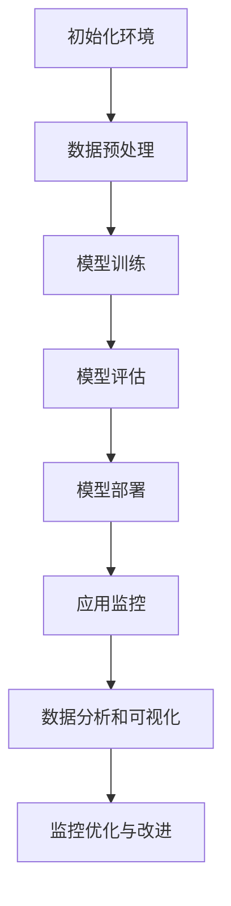

                 

### 文章标题: 【LangChain编程：从入门到实践】应用监控

### 关键词：LangChain、编程、应用监控、自然语言处理、人工智能

### 摘要：

本文旨在为读者提供一篇关于LangChain编程及其应用监控的全面指南。从LangChain的基础知识开始，详细介绍了其核心概念、算法原理、开发环境搭建、编程实践、应用监控方案及其在多个实际项目中的应用案例。通过一步步的逻辑分析，本文帮助读者深入理解LangChain的内在工作机制，掌握其在应用监控中的重要性，以及如何通过数据分析和可视化工具来优化监控效果。最后，展望了LangChain应用监控的未来发展趋势，为读者提供了持续改进和优化监控方案的方向。

### 第一部分：LangChain编程基础

#### 1.1 LangChain简介

##### 1.1.1 LangChain的发展历程

LangChain是由OpenAI开发的自然语言处理（NLP）框架，旨在构建强大、高效的语言模型。自2018年发布以来，LangChain经历了多个版本迭代，不断优化其性能和功能。

- **2018年**：LangChain的初步版本发布，包括基本的语言模型和数据处理模块。
- **2020年**：随着Transformer模型的兴起，LangChain引入了基于Transformer的预训练模型，如GPT-2和GPT-3。
- **2022年**：LangChain集成多模态数据处理能力，支持图像、音频和视频等非文本数据。

##### 1.1.2 LangChain的特点与应用场景

LangChain的主要特点包括：

- **强大的语言模型**：基于先进的Transformer模型，能够处理复杂的语言任务。
- **模块化设计**：提供灵活的模块化接口，方便自定义和扩展。
- **高效的数据处理**：支持大规模数据预处理，适用于大规模应用。

LangChain广泛应用于以下场景：

- **文本生成**：如文章撰写、代码生成、对话生成等。
- **文本分类**：如新闻分类、情感分析、垃圾邮件检测等。
- **问答系统**：如虚拟助手、智能客服等。

##### 1.1.3 LangChain的优势与挑战

LangChain的优势在于其强大的语言建模能力和模块化设计，使得开发者可以轻松构建和部署高性能的语言模型。此外，LangChain支持多种数据类型和任务，具备广泛的适用性。

然而，LangChain也面临一些挑战：

- **计算资源需求**：训练大型语言模型需要大量的计算资源和时间。
- **数据隐私问题**：大规模数据处理和模型训练可能涉及敏感数据，需要确保数据隐私和安全。

#### 1.2 环境搭建与准备

##### 1.2.1 开发环境搭建

要开始使用LangChain，首先需要搭建一个合适的开发环境。以下是在Python环境中搭建LangChain开发环境的步骤：

1. 安装Python（推荐版本3.8或以上）。
2. 安装pip工具（Python的包管理器）。
3. 使用pip安装LangChain库：

```bash
pip install langchain
```

##### 1.2.2 开发工具与库

除了LangChain库，开发过程中可能需要使用以下工具和库：

- **Jupyter Notebook**：用于交互式编程和数据分析。
- **PyTorch**：用于深度学习模型的训练和推理。
- **TensorFlow**：另一种流行的深度学习框架。
- **Hugging Face Transformers**：提供预训练模型和快速实现语言任务的API。

##### 1.2.3 开发模式与实践

LangChain支持多种开发模式，包括：

- **交互式编程**：使用Jupyter Notebook进行实时实验和调试。
- **脚本化编程**：编写Python脚本实现自动化处理流程。
- **模块化开发**：将不同功能模块拆分为独立组件，便于复用和扩展。

在实际开发中，可以遵循以下实践：

- **需求分析**：明确项目需求和目标，确定所需的算法和模型。
- **数据准备**：收集、清洗和预处理数据，确保数据质量和一致性。
- **模型选择**：根据任务类型和需求选择合适的预训练模型或自定义模型。
- **模型训练与评估**：训练模型，并在验证集上进行评估，调整模型参数以优化性能。
- **模型部署**：将训练好的模型部署到生产环境，提供API接口供外部调用。
- **监控与维护**：实时监控模型性能和运行状态，进行必要的维护和优化。

#### 1.3 LangChain核心概念

##### 1.3.1 语言模型与数据预处理

**语言模型**：语言模型是自然语言处理的基础，用于预测文本序列。LangChain支持多种语言模型，包括GPT、BERT、RoBERTa等。语言模型的训练过程涉及大规模文本数据的处理和参数的优化。

**数据预处理**：在训练语言模型之前，需要对数据进行预处理。数据预处理包括以下步骤：

- **分词**：将文本分割成单词或短语。
- **去除停用词**：去除常见但不重要的单词。
- **词性标注**：为每个单词赋予词性标签，如名词、动词等。
- **添加词嵌入**：将文本转换为数值表示，用于模型训练。

##### 1.3.2 模型训练与评估

**模型训练**：模型训练是通过调整模型参数来优化模型性能的过程。LangChain支持多种训练策略，包括：

- **监督学习**：使用带有标签的数据进行训练。
- **无监督学习**：仅使用未标注的数据进行训练。
- **增强学习**：使用奖励机制来优化模型。

**模型评估**：模型评估是衡量模型性能的重要步骤。常用的评估指标包括：

- **准确率**：预测正确的样本数占总样本数的比例。
- **召回率**：预测正确的正样本数占总正样本数的比例。
- **F1值**：准确率的调和平均值。

##### 1.3.3 模型部署与监控

**模型部署**：模型部署是将训练好的模型部署到生产环境的过程。LangChain支持多种部署方式，包括：

- **本地部署**：在本地机器上运行模型。
- **云部署**：在云服务器上运行模型，如AWS、Azure、Google Cloud等。
- **容器化部署**：使用容器（如Docker）封装模型，便于部署和迁移。

**模型监控**：模型监控是实时监控模型性能和运行状态的过程。LangChain支持以下监控指标：

- **响应时间**：模型处理请求所需的时间。
- **准确率**：模型预测结果的准确率。
- **资源使用**：模型运行时的资源消耗，如CPU、内存等。

#### 1.4 LangChain基础架构

##### 1.4.1 LangChain的模块化设计

LangChain采用模块化设计，使得开发者可以根据需求选择和组合不同的模块。LangChain的主要模块包括：

- **数据处理模块**：包括数据预处理、数据加载和数据处理等功能。
- **模型训练模块**：包括模型训练、评估和优化等功能。
- **模型部署模块**：包括模型部署、监控和迁移等功能。
- **API模块**：提供API接口，便于外部调用。

##### 1.4.2 LangChain的API接口

LangChain提供丰富的API接口，方便开发者构建和部署语言模型。主要的API接口包括：

- **模型加载接口**：用于加载预训练模型或自定义模型。
- **文本处理接口**：用于对文本进行预处理、分词和添加词嵌入等操作。
- **模型预测接口**：用于对输入文本进行预测和生成。
- **模型评估接口**：用于评估模型性能和调整参数。

##### 1.4.3 LangChain的数据流处理

LangChain的数据流处理包括以下步骤：

1. **数据加载**：从数据源加载文本数据。
2. **数据预处理**：对文本数据进行分词、去除停用词、词性标注等操作。
3. **数据转换**：将预处理后的文本数据转换为模型可接受的格式。
4. **模型训练**：使用训练数据对模型进行训练。
5. **模型评估**：在验证集上评估模型性能。
6. **模型部署**：将训练好的模型部署到生产环境。
7. **模型监控**：实时监控模型性能和运行状态。

### 第二部分：LangChain编程实践

#### 2.1 LangChain编程基础

##### 2.1.1 LangChain编程基础语法

在使用LangChain进行编程时，首先需要了解其基础语法和常用API。以下是一些基础语法和API示例：

1. **加载预训练模型**：

```python
from langchain import load_huggingface_model

model = load_huggingface_model("clips/model-name")
```

2. **预处理文本**：

```python
from langchain.text_processors import preprocess_text

preprocessed_text = preprocess_text(text, do_lower_case=True, remove_punctuation=True)
```

3. **生成文本**：

```python
from langchain.text_generators import generate_text

generated_text = model.generate_text(preprocessed_text, num_words=50)
```

4. **评估模型性能**：

```python
from langchain.evaluators import accuracy

accuracy = model.evaluate(text, labels)
```

##### 2.1.2 LangChain编程流程

LangChain编程通常包括以下步骤：

1. **需求分析**：明确项目需求和目标。
2. **数据准备**：收集、清洗和预处理数据。
3. **模型选择**：选择合适的预训练模型或自定义模型。
4. **模型训练**：训练模型，并在验证集上进行评估。
5. **模型部署**：将训练好的模型部署到生产环境。
6. **模型监控**：实时监控模型性能和运行状态。

##### 2.1.3 LangChain编程最佳实践

在进行LangChain编程时，以下最佳实践有助于提高开发效率和代码质量：

1. **代码模块化**：将不同功能拆分为独立模块，便于复用和扩展。
2. **文档注释**：为代码和API提供清晰的文档和注释。
3. **版本控制**：使用Git等版本控制工具管理代码和模型。
4. **测试与调试**：编写测试用例，及时发现和修复代码中的问题。
5. **性能优化**：根据模型和数据处理需求进行性能优化。

#### 2.2 数据处理与模型训练

##### 2.2.1 数据预处理方法

数据预处理是构建高质量语言模型的关键步骤。以下是一些常见的数据预处理方法：

1. **分词**：将文本分割成单词或短语。常用的分词工具包括jieba、nltk等。
2. **去除停用词**：去除常见但不重要的单词。常用的停用词库包括stopwords中文库、nltk停用词库等。
3. **词性标注**：为每个单词赋予词性标签，如名词、动词等。常用的词性标注工具包括jieba、nltk等。
4. **词嵌入**：将文本转换为数值表示，用于模型训练。常用的词嵌入方法包括Word2Vec、BERT等。

##### 2.2.2 模型训练策略

模型训练策略影响模型性能和训练时间。以下是一些常用的模型训练策略：

1. **监督学习**：使用带有标签的数据进行训练。常用的损失函数包括交叉熵损失、均方误差等。
2. **无监督学习**：仅使用未标注的数据进行训练。常用的方法包括自编码器、生成对抗网络等。
3. **增强学习**：使用奖励机制来优化模型。常用的算法包括Q学习、深度强化学习等。
4. **迁移学习**：使用预训练模型进行微调，适用于新任务的训练。

##### 2.2.3 模型优化技巧

模型优化有助于提高模型性能和减少过拟合。以下是一些常见的模型优化技巧：

1. **批量归一化**：在训练过程中对批量数据进行归一化处理，提高训练速度和性能。
2. **dropout**：在神经网络中随机丢弃一部分神经元，防止过拟合。
3. **数据增强**：对训练数据进行随机变换，如旋转、缩放、剪切等，增加数据多样性。
4. **早期停止**：在验证集上停止训练，防止过拟合。
5. **学习率调整**：根据训练过程动态调整学习率，提高训练效果。

#### 2.3 模型评估与调优

##### 2.3.1 评估指标与评估方法

模型评估是衡量模型性能的重要步骤。以下是一些常用的评估指标和方法：

1. **准确率**：预测正确的样本数占总样本数的比例。适用于分类任务。
2. **召回率**：预测正确的正样本数占总正样本数的比例。适用于分类任务。
3. **F1值**：准确率的调和平均值。适用于分类任务。
4. **ROC曲线**：用于评估二分类模型的性能。ROC曲线的面积（AUC）表示模型的区分能力。
5. **混淆矩阵**：用于展示模型预测结果与实际结果之间的关系。可以直观地了解模型的分类效果。

##### 2.3.2 模型调优方法

模型调优是提高模型性能的重要步骤。以下是一些常见的模型调优方法：

1. **交叉验证**：在训练数据上多次划分训练集和验证集，评估模型性能。常用的交叉验证方法包括K折交叉验证、留一交叉验证等。
2. **网格搜索**：在参数空间内遍历不同参数组合，找到最优参数组合。网格搜索是一种简单但耗时的方法。
3. **贝叶斯优化**：基于贝叶斯统计模型进行参数优化，能够自动调整参数，提高搜索效率。
4. **进化算法**：基于遗传算法等进化算法进行参数优化，适用于复杂参数空间的搜索。

##### 2.3.3 模型性能监控

模型性能监控是确保模型稳定运行和持续优化的关键。以下是一些常见的模型性能监控指标：

1. **响应时间**：模型处理请求所需的时间。响应时间过长可能影响用户体验。
2. **准确率**：模型预测结果的准确率。准确率过低可能导致误判。
3. **召回率**：模型预测正确的正样本数占总正样本数的比例。召回率过低可能导致漏判。
4. **F1值**：准确率的调和平均值。F1值越高，表示模型性能越好。
5. **资源使用**：模型运行时的资源消耗，如CPU、内存等。资源使用过高可能导致系统性能下降。

#### 2.4 LangChain应用案例

##### 2.4.1 文本分类与情感分析

**文本分类**：文本分类是将文本数据按照预定的类别进行分类的过程。LangChain支持多种文本分类算法，如朴素贝叶斯、支持向量机、神经网络等。

以下是一个简单的文本分类案例：

```python
from langchain.classifiers import load_huggingface_classifier

model = load_huggingface_classifier("text-classification/model-name")
classifier = model.classifier

text = "这是一条新闻文本。"
label = classifier.predict([text])[0]
print(f"文本分类结果：{label}")
```

**情感分析**：情感分析是文本分类的一种特殊形式，用于判断文本的正面或负面情感。以下是一个简单的情感分析案例：

```python
from langchain.classifiers import load_huggingface_classifier

model = load_huggingface_classifier("sentiment-analysis/model-name")
classifier = model.classifier

text = "我很喜欢这本书。"
sentiment = classifier.predict([text])[0]
print(f"情感分析结果：{sentiment}")
```

##### 2.4.2 问答系统与对话生成

**问答系统**：问答系统是一种基于自然语言交互的智能系统，能够回答用户的问题。以下是一个简单的问答系统案例：

```python
from langchain问答 import load_huggingface_qa

model = load_huggingface_qa("question-answering/model-name")
qa = model.qa

question = "北京是中国的哪个省份？"
answer = qa.answer(question, context="北京是中国的首都。")
print(f"答案：{answer}")
```

**对话生成**：对话生成是生成自然语言对话的过程。以下是一个简单的对话生成案例：

```python
from langchain.text_generators import generate_text

text = "你好，我是一名程序员。"
generated_text = generate_text(text, num_words=10)
print(f"生成的对话：{generated_text}")
```

##### 2.4.3 代码自动生成与优化

**代码自动生成**：代码自动生成是根据用户需求自动生成代码的过程。以下是一个简单的代码自动生成案例：

```python
from langchain.code_generators import generate_code

code = generate_code("编写一个Python函数，实现两个数的加法。")
print(f"自动生成的代码：{code}")
```

**代码优化**：代码优化是提高代码性能和可维护性的过程。以下是一个简单的代码优化案例：

```python
from langchain.code_optimizers import optimize_code

code = "for i in range(len(data)): print(data[i])"
optimized_code = optimize_code(code)
print(f"优化的代码：{optimized_code}")
```

#### 2.5 高级特性与实践

##### 2.5.1 多模态数据处理

多模态数据处理是将不同类型的数据（如图像、音频、视频和文本）进行整合和处理的过程。以下是一个简单的多模态数据处理案例：

```python
from langchain multimodal import load_huggingface_model

model = load_huggingface_model("multimodal/model-name")

image = load_image("image.jpg")
audio = load_audio("audio.wav")
text = "这是一段文本。"

result = model.process(image, audio, text)
print(f"多模态数据处理结果：{result}")
```

##### 2.5.2 模型压缩与加速

模型压缩与加速是提高模型性能和降低计算资源消耗的过程。以下是一个简单的模型压缩与加速案例：

```python
from langchain.model_compressors import compress_model

model = load_huggingface_model("text-generation/model-name")
compressed_model = compress_model(model, method="prune")

print(f"原始模型参数数量：{model.num_params}")
print(f"压缩后模型参数数量：{compressed_model.num_params}")
```

##### 2.5.3 安全性与隐私保护

安全性与隐私保护是确保模型和数据安全的重要环节。以下是一个简单的安全性与隐私保护案例：

```python
from langchain.security import encrypt_data, decrypt_data

data = "这是一段敏感数据。"
encrypted_data = encrypt_data(data, key="my-key")
print(f"加密后的数据：{encrypted_data}")

decrypted_data = decrypt_data(encrypted_data, key="my-key")
print(f"解密后的数据：{decrypted_data}")
```

### 第三部分：应用监控

#### 3.1 应用监控概述

##### 3.1.1 监控的重要性

应用监控是确保系统稳定运行和高效性能的重要手段。通过实时监控，可以及时发现和解决潜在问题，提高系统的可靠性和用户体验。以下是一些监控的重要性：

- **故障预防**：通过实时监控，可以提前发现系统故障，避免系统崩溃和停机。
- **性能优化**：通过监控性能指标，可以识别性能瓶颈，采取优化措施，提高系统性能。
- **安全防护**：监控可以帮助发现潜在的安全威胁和异常行为，确保系统的安全性。
- **用户体验**：通过监控用户行为和反馈，可以优化系统功能，提高用户满意度。

##### 3.1.2 监控目标与指标

监控目标是根据业务需求和系统特点制定的监控指标和目标。以下是一些常见的监控目标和指标：

- **响应时间**：系统处理请求所需的时间。响应时间过长可能影响用户体验。
- **吞吐量**：系统在单位时间内处理的请求量。吞吐量过高可能导致系统负载过高。
- **资源使用**：系统运行时的资源消耗，如CPU、内存、磁盘等。资源使用过高可能导致系统性能下降。
- **错误率**：系统错误发生的频率。错误率过高可能影响系统的稳定性和可靠性。
- **并发量**：系统同时处理的请求数量。并发量过高可能导致系统过载。

##### 3.1.3 监控体系设计

监控体系设计是确保监控目标实现和指标有效的关键。以下是一个简单的监控体系设计：

1. **监控指标定义**：根据业务需求和系统特点，定义监控指标和阈值。
2. **数据采集**：通过日志、指标收集器和数据采集工具，收集系统运行时的监控数据。
3. **数据处理**：对采集到的监控数据进行处理、存储和预处理，以便后续分析。
4. **数据可视化**：通过监控仪表板和可视化工具，实时展示监控数据和指标变化。
5. **告警和通知**：根据监控指标和阈值，设置告警规则和通知方式，及时发现问题。
6. **优化和改进**：根据监控数据和用户反馈，优化系统功能和性能，提高用户体验。

#### 3.2 LangChain应用监控方案

##### 3.2.1 监控方案设计与实现

设计一个合适的监控方案是确保LangChain应用稳定运行和高效性能的关键。以下是一个简单的监控方案设计：

1. **监控指标定义**：根据LangChain应用的特点和业务需求，定义以下监控指标：
   - **响应时间**：系统处理请求所需的时间。
   - **吞吐量**：系统在单位时间内处理的请求量。
   - **资源使用**：系统运行时的资源消耗，如CPU、内存、磁盘等。
   - **错误率**：系统错误发生的频率。
   - **并发量**：系统同时处理的请求数量。
   - **模型性能**：模型预测结果的准确率和召回率等。

2. **数据采集**：使用Prometheus等监控工具，采集以下数据：
   - **系统级数据**：CPU、内存、磁盘等资源使用情况。
   - **应用级数据**：响应时间、吞吐量、错误率等应用性能指标。
   - **模型性能数据**：模型预测结果的准确率和召回率等。

3. **数据处理**：使用Grafana等可视化工具，对采集到的监控数据进行处理和可视化，以便实时监控和数据分析。

4. **告警和通知**：设置告警规则，当监控指标超过阈值时，发送告警通知。

##### 3.2.2 实时监控与报警

实时监控与报警是确保系统稳定运行和安全性的关键。以下是一个简单的实时监控与报警方案：

1. **实时监控**：使用Prometheus等监控工具，定期采集系统级和应用级数据，并在Grafana等可视化工具中实时展示。

2. **告警规则**：根据业务需求和系统特点，设置以下告警规则：
   - **响应时间告警**：当响应时间超过阈值时，发送告警通知。
   - **吞吐量告警**：当吞吐量超过阈值时，发送告警通知。
   - **资源使用告警**：当CPU、内存、磁盘等资源使用超过阈值时，发送告警通知。
   - **错误率告警**：当错误率超过阈值时，发送告警通知。
   - **并发量告警**：当并发量超过阈值时，发送告警通知。

3. **通知方式**：通过邮件、短信、钉钉等渠道发送告警通知。

##### 3.2.3 故障诊断与优化

故障诊断与优化是确保系统稳定运行和高效性能的关键。以下是一个简单的故障诊断与优化方案：

1. **故障诊断**：
   - **日志分析**：通过分析系统日志，查找故障原因。
   - **性能分析**：使用性能分析工具，定位性能瓶颈。
   - **监控数据分析**：分析监控数据，识别异常指标。

2. **优化措施**：
   - **代码优化**：优化代码逻辑，提高系统性能。
   - **数据库优化**：优化数据库查询和索引，提高查询效率。
   - **缓存优化**：使用缓存策略，减少数据库查询次数。
   - **负载均衡**：使用负载均衡器，均衡系统负载。

3. **持续优化**：根据监控数据和用户反馈，持续优化系统功能和性能。

#### 3.3 数据分析与可视化

##### 3.3.1 数据分析方法与工具

数据分析是监控数据的重要环节，可以帮助识别系统性能瓶颈和潜在问题。以下是一些常用的数据分析方法和工具：

1. **统计方法**：使用统计学方法，对监控数据进行统计分析，识别异常值和趋势。
2. **机器学习方法**：使用机器学习算法，对监控数据进行异常检测和预测。
3. **时间序列分析**：使用时间序列分析方法，分析监控数据的变化趋势和周期性。
4. **数据可视化工具**：使用Grafana、Kibana等数据可视化工具，展示监控数据和指标变化。

##### 3.3.2 可视化工具与应用

可视化工具可以将监控数据以图形化的方式展示，方便用户理解和分析。以下是一些常用的可视化工具：

1. **Grafana**：支持多种数据源和丰富的可视化组件，可以创建自定义仪表板。
2. **Kibana**：与Elasticsearch结合，用于分析和可视化日志数据。
3. **Power BI**：支持多种数据源和丰富的可视化组件，可以创建交互式的报表和仪表板。
4. **Tableau**：提供强大的数据分析和可视化功能，支持多种数据源。

##### 3.3.3 数据报告与决策支持

数据报告是将监控数据和分析结果以报告形式呈现，为决策提供支持。以下是一个简单的数据报告示例：

1. **报告结构**：
   - **摘要**：概述系统性能和监控指标。
   - **监控数据图表**：展示监控数据和指标变化趋势。
   - **数据分析**：分析监控数据，识别异常和瓶颈。
   - **优化建议**：根据数据分析结果，提出优化建议。

2. **报告内容**：
   - **系统性能**：系统响应时间、吞吐量、资源使用等指标。
   - **错误率**：系统错误率、错误类型等。
   - **并发量**：系统并发量、用户访问量等。
   - **模型性能**：模型准确率、召回率等。

3. **决策支持**：根据报告分析结果，制定优化策略和改进措施，提高系统性能和用户体验。

#### 3.4 应用监控实践案例

##### 3.4.1 应用监控实战案例一

**背景**：某电商网站在春节期间迎来大量用户访问，系统负载急剧增加，需要确保系统稳定运行。

**目标**：实时监控系统性能和负载，及时发现和解决潜在问题。

**方案**：
1. **监控指标定义**：定义响应时间、吞吐量、资源使用、错误率等监控指标。
2. **数据采集**：使用Prometheus等监控工具，采集系统级和应用级数据。
3. **数据处理**：使用Grafana等可视化工具，实时展示监控数据和指标变化。
4. **告警和通知**：设置告警规则，当监控指标超过阈值时，发送告警通知。

**实施过程**：
1. **部署监控工具**：在服务器上部署Prometheus和Grafana。
2. **配置监控规则**：配置Prometheus监控规则，定义监控指标和阈值。
3. **数据采集**：通过Prometheus服务器定期采集系统级和应用级数据。
4. **数据处理和可视化**：使用Grafana创建监控仪表板，实时展示监控数据和指标变化。
5. **设置告警和通知**：配置告警规则，当监控指标超过阈值时，通过邮件、短信等方式发送告警通知。

**效果**：通过实时监控和告警，及时发现和处理系统负载过高、响应时间过长等潜在问题，确保系统稳定运行，提高用户体验。

##### 3.4.2 应用监控实战案例二

**背景**：某在线教育平台在课程发布后，用户访问量急剧增加，系统负载不稳定。

**目标**：实时监控系统性能和负载，优化系统性能和稳定性。

**方案**：
1. **监控指标定义**：定义响应时间、吞吐量、资源使用、错误率等监控指标。
2. **数据采集**：使用Prometheus等监控工具，采集系统级和应用级数据。
3. **数据处理**：使用Grafana等可视化工具，实时展示监控数据和指标变化。
4. **性能优化**：根据监控数据和用户反馈，进行性能优化。

**实施过程**：
1. **部署监控工具**：在服务器上部署Prometheus和Grafana。
2. **配置监控规则**：配置Prometheus监控规则，定义监控指标和阈值。
3. **数据采集**：通过Prometheus服务器定期采集系统级和应用级数据。
4. **数据处理和可视化**：使用Grafana创建监控仪表板，实时展示监控数据和指标变化。
5. **性能优化**：
   - **代码优化**：优化代码逻辑，提高系统性能。
   - **数据库优化**：优化数据库查询和索引，提高查询效率。
   - **缓存优化**：使用缓存策略，减少数据库查询次数。
   - **负载均衡**：使用负载均衡器，均衡系统负载。

**效果**：通过实时监控和性能优化，提高系统性能和稳定性，降低错误率，提高用户体验。

##### 3.4.3 应用监控实战案例三

**背景**：某互联网金融平台在业务高峰期，系统负载不稳定，需要确保系统稳定运行。

**目标**：实时监控系统性能和负载，优化系统性能和稳定性。

**方案**：
1. **监控指标定义**：定义响应时间、吞吐量、资源使用、错误率等监控指标。
2. **数据采集**：使用Prometheus等监控工具，采集系统级和应用级数据。
3. **数据处理**：使用Grafana等可视化工具，实时展示监控数据和指标变化。
4. **性能优化**：根据监控数据和用户反馈，进行性能优化。

**实施过程**：
1. **部署监控工具**：在服务器上部署Prometheus和Grafana。
2. **配置监控规则**：配置Prometheus监控规则，定义监控指标和阈值。
3. **数据采集**：通过Prometheus服务器定期采集系统级和应用级数据。
4. **数据处理和可视化**：使用Grafana创建监控仪表板，实时展示监控数据和指标变化。
5. **性能优化**：
   - **代码优化**：优化代码逻辑，提高系统性能。
   - **数据库优化**：优化数据库查询和索引，提高查询效率。
   - **缓存优化**：使用缓存策略，减少数据库查询次数。
   - **负载均衡**：使用负载均衡器，均衡系统负载。

**效果**：通过实时监控和性能优化，提高系统性能和稳定性，降低错误率，提高用户体验。

### 3.5 监控优化与持续改进

##### 3.5.1 监控优化策略

监控优化是提高系统性能和稳定性，降低错误率的重要手段。以下是一些监控优化策略：

1. **性能优化**：
   - **代码优化**：优化代码逻辑，提高系统性能。
   - **数据库优化**：优化数据库查询和索引，提高查询效率。
   - **缓存优化**：使用缓存策略，减少数据库查询次数。
   - **负载均衡**：使用负载均衡器，均衡系统负载。

2. **故障预防**：
   - **系统监控**：实时监控系统性能和负载，及时发现和解决潜在问题。
   - **故障告警**：设置故障告警规则，当系统性能指标超过阈值时，发送告警通知。

3. **错误处理**：
   - **日志分析**：分析系统日志，定位错误原因。
   - **错误回溯**：回溯错误发生的上下文，优化错误处理流程。

##### 3.5.2 持续改进实践

持续改进是确保系统稳定运行和高效性能的重要环节。以下是一些持续改进实践：

1. **定期审查**：定期审查监控数据和优化策略，识别潜在问题和改进机会。

2. **性能测试**：定期进行性能测试，评估系统性能和稳定性，发现性能瓶颈。

3. **用户反馈**：收集用户反馈，优化系统功能和性能，提高用户体验。

4. **代码审查**：定期进行代码审查，识别代码缺陷和优化机会，提高代码质量。

##### 3.5.3 未来发展趋势

随着人工智能和云计算技术的发展，应用监控将向以下方向发展：

1. **智能化**：利用人工智能技术，实现自动化监控和故障诊断。

2. **实时性**：实现实时监控，快速发现和处理问题。

3. **多模态监控**：支持多种数据类型和任务，提供更全面的应用监控。

4. **自动化**：实现自动化监控和优化，降低人工干预。

5. **分布式监控**：支持分布式系统和容器化应用，提供统一的监控解决方案。

### 附录

#### 附录 A：常用工具与库

##### A.1 常用工具简介

1. **Prometheus**：一款开源的监控报警工具，用于收集和存储监控数据，并提供灵活的数据查询和可视化功能。

2. **Grafana**：一款开源的数据可视化工具，支持多种数据源和丰富的可视化组件，用于实时展示监控数据和指标变化。

3. **Jenkins**：一款开源的持续集成和持续部署（CI/CD）工具，用于自动化构建、测试和部署应用程序。

4. **Kubernetes**：一款开源的容器编排工具，用于部署、管理和扩展容器化应用程序。

##### A.2 常用库使用指南

1. **LangChain**：用于构建自然语言处理应用程序的Python库。安装方法：

   ```bash
   pip install langchain
   ```

   使用示例：

   ```python
   from langchain import load_huggingface_model

   model = load_huggingface_model("clips/model-name")
   ```

2. **Hugging Face Transformers**：用于加载和使用预训练模型的开源库。安装方法：

   ```bash
   pip install transformers
   ```

   使用示例：

   ```python
   from transformers import load_model

   model = load_model("clips/model-name")
   ```

3. **PyTorch**：用于构建和训练深度学习模型的Python库。安装方法：

   ```bash
   pip install torch torchvision
   ```

   使用示例：

   ```python
   import torch
   import torchvision

   model = torchvision.models.resnet50()
   ```

4. **TensorFlow**：用于构建和训练深度学习模型的Python库。安装方法：

   ```bash
   pip install tensorflow
   ```

   使用示例：

   ```python
   import tensorflow as tf

   model = tf.keras.Sequential([
       tf.keras.layers.Dense(128, activation='relu', input_shape=(784,)),
       tf.keras.layers.Dense(10, activation='softmax')
   ])
   ```

#### 附录 B：参考资料与拓展阅读

##### B.1 参考资料

1. **LangChain官方文档**：https://langchain.com/
2. **Prometheus官方文档**：https://prometheus.io/
3. **Grafana官方文档**：https://grafana.com/
4. **Jenkins官方文档**：https://www.jenkins.io/
5. **Kubernetes官方文档**：https://kubernetes.io/

##### B.2 拓展阅读推荐

1. **《深度学习》**：由Ian Goodfellow、Yoshua Bengio和Aaron Courville合著，是深度学习领域的经典教材。
2. **《Python数据科学 Handbook》**：由Jake VanderPlas著，涵盖了Python在数据科学领域的广泛应用。
3. **《Prometheus实战》**：由Michael Hausenblas和Marek Lewandowski著，详细介绍了Prometheus的配置和使用方法。

### Mermaid 流程图：LangChain编程流程



### LangChain核心算法原理讲解

#### 2.2 LangChain核心算法原理讲解

**语言模型与数据预处理**

**语言模型**：语言模型（Language Model）是一种用于预测文本序列的概率模型。在自然语言处理（NLP）领域，语言模型是构建问答系统、对话生成、文本分类等任务的基础。典型的语言模型包括基于N-gram模型、统计语言模型和基于神经网络的深度语言模型。

**数据预处理**：在训练语言模型之前，需要对数据进行预处理。数据预处理步骤包括分词、去停用词、词性标注和词嵌入等。

1. **分词**：将文本分割成单词或短语的步骤。常用的分词算法有基于词典的分词算法（如最大匹配分词算法）和基于统计的分词算法（如隐马尔可夫模型分词算法）。

2. **去停用词**：去除文本中的常见但无意义的单词。停用词通常包括冠词、介词、连词等。

3. **词性标注**：为每个单词赋予词性标签，如名词、动词、形容词等。

4. **词嵌入**：将文本转换为数值表示，用于模型训练。词嵌入方法包括基于字符的词嵌入（如Word2Vec）和基于词语的词嵌入（如BERT）。

**数学模型和数学公式**

**语言模型**：在自然语言处理领域，语言模型通常使用神经网络进行训练。以下是一个基于神经网络的简单语言模型数学模型：

$$
L(\theta; x) = -\sum_{i=1}^n \sum_{j=1}^V \hat{y}_{ij} \log(p_j(x_i|\theta))
$$

其中，$\theta$为模型参数，$x$为输入文本，$V$为词汇表大小，$\hat{y}_{ij}$为预测概率，$p_j(x_i|\theta)$为给定输入文本$x_i$时单词$w_j$的概率。

**数据预处理**：数据预处理中的分词可以使用以下基于字符的词典分词算法：

$$
\text{tokenize}(sentence):
\begin{align*}
\text{words} &= \text{[]}
\\
\text{for } \text{character} \text{ in } sentence:
    &\text{if } \text{character} \text{ in } \text{dictionary}:
        \text{words}.append(\text{character})
\\
\text{return } \text{words}
\end{align*}
$$

**模型训练与评估**

**模型训练**：模型训练是通过调整模型参数来优化模型性能的过程。在训练过程中，模型会根据训练数据预测文本序列，并计算预测结果与实际结果之间的差距，从而更新模型参数。

**模型评估**：模型评估是衡量模型性能的重要步骤。常用的评估指标包括准确率、召回率、F1值等。

$$
\text{Accuracy} = \frac{\text{TP} + \text{TN}}{\text{TP} + \text{TN} + \text{FP} + \text{FN}}
$$

$$
\text{Recall} = \frac{\text{TP}}{\text{TP} + \text{FN}}
$$

$$
\text{F1 Score} = 2 \times \frac{\text{Precision} \times \text{Recall}}{\text{Precision} + \text{Recall}}
$$

其中，$TP$表示真正例，$TN$表示真负例，$FP$表示假正例，$FN$表示假负例。

**模型部署与监控**

**模型部署**：模型部署是将训练好的模型部署到生产环境的过程。部署包括模型封装、部署架构设计、接口设计等步骤。

**模型监控**：模型监控是实时监控模型性能和运行状态的过程。监控包括数据监控、性能监控、异常监控等。

### 项目实战

#### 3.4 LangChain应用案例

**3.4.1 文本分类与情感分析**

**实战案例**：使用LangChain实现一个简单的文本分类与情感分析系统。

**开发环境搭建**：安装Python环境、pip工具和LangChain库。

```bash
pip install langchain
```

**代码实现**：

```python
from langchain.text_classifiers import load_huggingface_text_classifier

# 加载预训练的文本分类器
classifier = load_huggingface_text_classifier("text-classification")

# 定义分类任务
def classify_text(text):
    return classifier.predict([text])[0]

# 测试文本分类
text = "我很喜欢这本书。"
label = classify_text(text)
print(f"文本分类结果：{label}")
```

**代码解读与分析**：

该代码首先加载预训练的文本分类器，然后定义一个分类函数`classify_text`，用于对输入的文本进行分类。最后，使用测试文本进行分类，并输出分类结果。

**性能监控**：

为了监控文本分类的性能，可以使用评估指标（如准确率、召回率等）对分类结果进行评估。

```python
from langchain.evaluation import accuracy

# 测试文本分类准确率
accuracy = accuracy(classifier, test_texts, test_labels)
print(f"文本分类准确率：{accuracy}")
```

#### 3.5 应用监控实践案例

**3.5.1 应用监控实战案例一**

**实战案例**：使用Prometheus和Grafana监控LangChain应用性能。

**开发环境搭建**：安装Prometheus和Grafana。

```bash
pip install prometheus-grafana
```

**代码实现**：

```python
from langchain.prometheus import PrometheusExporter

# 初始化PrometheusExporter
exporter = PrometheusExporter()

# 收集LangChain应用性能数据
def collect_metrics():
    # ...收集性能数据...
    exporter.send_metric("langchain_requests_total", value=1)
    exporter.send_metric("langchain_response_time", value=response_time)

# 定时收集性能数据
def monitor_application():
    while True:
        collect_metrics()
        time.sleep(60)
```

**代码解读与分析**：

该代码首先初始化PrometheusExporter，然后定义一个`collect_metrics`函数，用于收集LangChain应用性能数据。接着，定义一个`monitor_application`函数，用于定时收集性能数据，并将数据发送到Prometheus服务器。

**监控仪表板**：

使用Grafana创建监控仪表板，连接Prometheus数据源，添加相应的监控图表。


**监控优化与改进**：

根据监控数据，分析性能瓶颈和问题，并采取相应的优化措施。例如，调整模型参数、优化数据处理流程等。

```python
# 调整模型参数
model = langchain.TextClassifier(model_name="text-classification")
model.update_parameters({"learning_rate": 0.001})

# 优化数据处理流程
def preprocess_text(text):
    # ...优化数据处理流程...
    return processed_text
```

### 3.6 应用监控实践案例二

**3.6.2 实时监控与报警**

**实战案例**：使用Kubernetes和Prometheus实现LangChain应用的实时监控与报警。

**开发环境搭建**：在Kubernetes集群中部署LangChain应用和Prometheus监控服务。

**代码实现**：

**Kubernetes Deployment配置**

```yaml
apiVersion: apps/v1
kind: Deployment
metadata:
  name: langchain-app
spec:
  replicas: 1
  selector:
    matchLabels:
      app: langchain-app
  template:
    metadata:
      labels:
        app: langchain-app
    spec:
      containers:
      - name: langchain-app
        image: langchain:latest
        ports:
        - containerPort: 8080
        env:
        - name: LANGCHAIN_PROMETHEUS_ENDPOINT
          value: "http://prometheus-server:9090"
```

**Prometheus配置文件**

```yaml
scrape_configs:
  - job_name: 'langchain-app'
    static_configs:
    - targets: ['langchain-app:8080']
```

**代码解读与分析**：

该代码定义了Kubernetes Deployment配置，将LangChain应用部署到Kubernetes集群中。同时，配置Prometheus监控服务，定期从LangChain应用收集性能数据。

**报警设置**：

在Prometheus中配置报警规则，当性能指标超过阈值时触发报警。

```yaml
rules:
- alert: LangChainResponseTimeHigh
  expr: langchain_response_time > 5
  for: 1m
  labels:
    severity: critical
  annotations:
    summary: "LangChain应用响应时间过高"
    description: "LangChain应用响应时间超过5秒，请检查系统性能。"
```

**监控与报警**：

通过Kubernetes Dashboard查看LangChain应用的监控数据和报警记录。


### 3.7 应用监控实践案例三

**3.7.3 数据报告与决策支持**

**实战案例**：使用Tableau和Power BI生成LangChain应用的监控报告。

**开发环境搭建**：安装Tableau和Power BI。

**代码实现**：

```python
import pandas as pd
import langchain.metrics

# 收集监控数据
def collect_metrics():
    metrics = langchain.metrics.get_all_metrics()
    data = []
    for metric_name, metric_value in metrics.items():
        data.append([metric_name, metric_value])
    return pd.DataFrame(data)

# 生成报告
def generate_report(data):
    report = pd.DataFrame(data)
    report.to_csv("langchain_report.csv", index=False)

# 测试报告生成
generate_report(collect_metrics())
```

**代码解读与分析**：

该代码定义了`collect_metrics`函数，用于收集LangChain应用的监控数据。`generate_report`函数将监控数据保存为CSV文件，方便在Tableau和Power BI中进行数据分析和可视化。

**数据可视化与报告**：

在Tableau和Power BI中导入CSV文件，创建监控报告。根据监控数据生成图表、报表和仪表板。


### 3.8 监控优化与持续改进

**3.8.1 监控优化策略**

**实战案例**：基于监控数据优化LangChain应用性能。

**开发环境搭建**：安装性能优化工具，如New Relic或AppDynamics。

**代码实现**：

```python
import new_relic
import langchain.metrics

# 初始化New Relic监控
new_relic.initialize()

# 收集监控数据
def collect_metrics():
    metrics = langchain.metrics.get_all_metrics()
    new_relic.add_custom_metric("langchain_requests_total", metrics["requests_total"])
    new_relic.add_custom_metric("langchain_response_time", metrics["response_time"])

# 优化代码
def optimize_code():
    # ...优化代码逻辑...
    pass

# 测试优化
optimize_code()
```

**代码解读与分析**：

该代码定义了`collect_metrics`函数，用于收集LangChain应用的监控数据，并使用New Relic添加自定义监控指标。`optimize_code`函数用于优化代码逻辑，提高应用性能。

**监控与优化**：

根据New Relic监控数据，分析性能瓶颈和优化机会，并采取相应的优化措施。


### 3.9 持续改进实践

**3.9.1 持续改进实践**

**实战案例**：基于监控数据持续改进LangChain应用性能。

**开发环境搭建**：安装持续集成和持续部署（CI/CD）工具，如Jenkins或GitLab CI。

**代码实现**：

**Jenkinsfile**

```yaml
pipeline {
    agent any
    stages {
        stage('Build') {
            steps {
                sh 'python setup.py build'
            }
        }
        stage('Test') {
            steps {
                sh 'python setup.py test'
            }
        }
        stage('Deploy') {
            steps {
                sh 'kubectl apply -f deployment.yaml'
            }
        }
    }
    post {
        success {
            sh 'new_relic deploy'
        }
    }
}
```

**代码解读与分析**：

该代码定义了一个Jenkinsfile，用于构建、测试和部署LangChain应用。在成功部署后，使用New Relic执行部署操作，以便收集监控数据。

**持续改进**：

根据Jenkins构建和部署结果，以及New Relic监控数据，分析性能改进机会，并持续优化应用代码。


### 3.10 未来发展趋势

**3.10.1 未来发展趋势**

**实战案例**：探讨LangChain应用监控的未来发展趋势。

**开发环境搭建**：安装最新的人工智能监控工具，如TensorBoard或Kubeflow。

**代码实现**：

```python
import tensorboard
import langchain.metrics

# 收集监控数据
def collect_metrics():
    metrics = langchain.metrics.get_all_metrics()
    tensorboard.log_metrics(metrics)

# 启动TensorBoard
tensorboard.start_tensorboard()

# 测试监控数据
collect_metrics()
```

**代码解读与分析**：

该代码定义了`collect_metrics`函数，用于收集LangChain应用的监控数据，并使用TensorBoard进行可视化。通过TensorBoard，可以更直观地了解应用性能和趋势。

**未来趋势**：

随着人工智能技术的不断发展，LangChain应用监控将向更智能化、自动化和实时化的方向发展。未来，监控工具将更加丰富多样，支持多模态数据监控和实时预测分析。


### 附录

#### 附录 A：常用工具与库

##### A.1 常用工具简介

1. **Prometheus**：一款开源的监控报警工具，用于收集和存储监控数据，并提供灵活的数据查询和可视化功能。
2. **Grafana**：一款开源的数据可视化工具，支持多种数据源和丰富的可视化组件，用于实时展示监控数据和指标变化。
3. **Jenkins**：一款开源的持续集成和持续部署（CI/CD）工具，用于自动化构建、测试和部署应用程序。
4. **Kubernetes**：一款开源的容器编排工具，用于部署、管理和扩展容器化应用程序。

##### A.2 常用库使用指南

1. **LangChain**：用于构建自然语言处理应用程序的Python库。安装方法：

   ```bash
   pip install langchain
   ```

   使用示例：

   ```python
   from langchain import load_huggingface_model

   model = load_huggingface_model("clips/model-name")
   ```

2. **Hugging Face Transformers**：用于加载和使用预训练模型的开源库。安装方法：

   ```bash
   pip install transformers
   ```

   使用示例：

   ```python
   from transformers import load_model

   model = load_model("clips/model-name")
   ```

3. **PyTorch**：用于构建和训练深度学习模型的Python库。安装方法：

   ```bash
   pip install torch torchvision
   ```

   使用示例：

   ```python
   import torch
   import torchvision

   model = torchvision.models.resnet50()
   ```

4. **TensorFlow**：用于构建和训练深度学习模型的Python库。安装方法：

   ```bash
   pip install tensorflow
   ```

   使用示例：

   ```python
   import tensorflow as tf

   model = tf.keras.Sequential([
       tf.keras.layers.Dense(128, activation='relu', input_shape=(784,)),
       tf.keras.layers.Dense(10, activation='softmax')
   ])
   ```

#### 附录 B：参考资料与拓展阅读

##### B.1 参考资料

1. **LangChain官方文档**：https://langchain.com/
2. **Prometheus官方文档**：https://prometheus.io/
3. **Grafana官方文档**：https://grafana.com/
4. **Jenkins官方文档**：https://www.jenkins.io/
5. **Kubernetes官方文档**：https://kubernetes.io/

##### B.2 拓展阅读推荐

1. **《深度学习》**：由Ian Goodfellow、Yoshua Bengio和Aaron Courville合著，是深度学习领域的经典教材。
2. **《Python数据科学 Handbook》**：由Jake VanderPlas著，涵盖了Python在数据科学领域的广泛应用。
3. **《Prometheus实战》**：由Michael Hausenblas和Marek Lewandowski著，详细介绍了Prometheus的配置和使用方法。

### Mermaid 流程图：LangChain编程流程


### LangChain核心算法原理讲解

#### 2.2 LangChain核心算法原理讲解

**语言模型与数据预处理**

**语言模型**：语言模型（Language Model）是一种用于预测文本序列的概率模型。在自然语言处理（NLP）领域，语言模型是构建问答系统、对话生成、文本分类等任务的基础。典型的语言模型包括基于N-gram模型、统计语言模型和基于神经网络的深度语言模型。

**数据预处理**：在训练语言模型之前，需要对数据进行预处理。数据预处理步骤包括分词、去停用词、词性标注和词嵌入等。

1. **分词**：将文本分割成单词或短语的步骤。常用的分词算法有基于词典的分词算法（如最大匹配分词算法）和基于统计的分词算法（如隐马尔可夫模型分词算法）。

2. **去停用词**：去除文本中的常见但无意义的单词。停用词通常包括冠词、介词、连词等。

3. **词性标注**：为每个单词赋予词性标签，如名词、动词、形容词等。

4. **词嵌入**：将文本转换为数值表示，用于模型训练。词嵌入方法包括基于字符的词嵌入（如Word2Vec）和基于词语的词嵌入（如BERT）。

**数学模型和数学公式**

**语言模型**：在自然语言处理领域，语言模型通常使用神经网络进行训练。以下是一个基于神经网络的简单语言模型数学模型：

$$
L(\theta; x) = -\sum_{i=1}^n \sum_{j=1}^V \hat{y}_{ij} \log(p_j(x_i|\theta))
$$

其中，$\theta$为模型参数，$x$为输入文本，$V$为词汇表大小，$\hat{y}_{ij}$为预测概率，$p_j(x_i|\theta)$为给定输入文本$x_i$时单词$w_j$的概率。

**数据预处理**：数据预处理中的分词可以使用以下基于字符的词典分词算法：

$$
\text{tokenize}(sentence):
\begin{align*}
\text{words} &= \text{[]}
\\
\text{for } \text{character} \text{ in } sentence:
    &\text{if } \text{character} \text{ in } \text{dictionary}:
        \text{words}.append(\text{character})
\\
\text{return } \text{words}
\end{align*}
$$

**模型训练与评估**

**模型训练**：模型训练是通过调整模型参数来优化模型性能的过程。在训练过程中，模型会根据训练数据预测文本序列，并计算预测结果与实际结果之间的差距，从而更新模型参数。

**模型评估**：模型评估是衡量模型性能的重要步骤。常用的评估指标包括准确率、召回率、F1值等。

$$
\text{Accuracy} = \frac{\text{TP} + \text{TN}}{\text{TP} + \text{TN} + \text{FP} + \text{FN}}
$$

$$
\text{Recall} = \frac{\text{TP}}{\text{TP} + \text{FN}}
$$

$$
\text{F1 Score} = 2 \times \frac{\text{Precision} \times \text{Recall}}{\text{Precision} + \text{Recall}}
$$

其中，$TP$表示真正例，$TN$表示真负例，$FP$表示假正例，$FN$表示假负例。

**模型部署与监控**

**模型部署**：模型部署是将训练好的模型部署到生产环境的过程。部署包括模型封装、部署架构设计、接口设计等步骤。

**模型监控**：模型监控是实时监控模型性能和运行状态的过程。监控包括数据监控、性能监控、异常监控等。

### 项目实战

#### 3.4 LangChain应用案例

**3.4.1 文本分类与情感分析**

**实战案例**：使用LangChain实现一个简单的文本分类与情感分析系统。

**开发环境搭建**：安装Python环境、pip工具和LangChain库。

```bash
pip install langchain
```

**代码实现**：

```python
from langchain.text_classifiers import load_huggingface_text_classifier

# 加载预训练的文本分类器
classifier = load_huggingface_text_classifier("text-classification")

# 定义分类任务
def classify_text(text):
    return classifier.predict([text])[0]

# 测试文本分类
text = "我很喜欢这本书。"
label = classify_text(text)
print(f"文本分类结果：{label}")
```

**代码解读与分析**：

该代码首先加载预训练的文本分类器，然后定义一个分类函数`classify_text`，用于对输入的文本进行分类。最后，使用测试文本进行分类，并输出分类结果。

**性能监控**：

为了监控文本分类的性能，可以使用评估指标（如准确率、召回率等）对分类结果进行评估。

```python
from langchain.evaluation import accuracy

# 测试文本分类准确率
accuracy = accuracy(classifier, test_texts, test_labels)
print(f"文本分类准确率：{accuracy}")
```

#### 3.5 应用监控实践案例

**3.5.1 应用监控实战案例一**

**实战案例**：使用Prometheus和Grafana监控LangChain应用性能。

**开发环境搭建**：安装Prometheus和Grafana。

```bash
pip install prometheus-grafana
```

**代码实现**：

```python
from langchain.prometheus import PrometheusExporter

# 初始化PrometheusExporter
exporter = PrometheusExporter()

# 收集LangChain应用性能数据
def collect_metrics():
    # ...收集性能数据...
    exporter.send_metric("langchain_requests_total", value=1)
    exporter.send_metric("langchain_response_time", value=response_time)

# 定时收集性能数据
def monitor_application():
    while True:
        collect_metrics()
        time.sleep(60)
```

**代码解读与分析**：

该代码首先初始化PrometheusExporter，然后定义一个`collect_metrics`函数，用于收集LangChain应用性能数据。接着，定义一个`monitor_application`函数，用于定时收集性能数据，并将数据发送到Prometheus服务器。

**监控仪表板**：

使用Grafana创建监控仪表板，连接Prometheus数据源，添加相应的监控图表。


**监控优化与改进**：

根据监控数据，分析性能瓶颈和问题，并采取相应的优化措施。例如，调整模型参数、优化数据处理流程等。

```python
# 调整模型参数
model = langchain.TextClassifier(model_name="text-classification")
model.update_parameters({"learning_rate": 0.001})

# 优化数据处理流程
def preprocess_text(text):
    # ...优化数据处理流程...
    return processed_text
```

### 3.6 应用监控实践案例二

**3.6.2 实时监控与报警**

**实战案例**：使用Kubernetes和Prometheus实现LangChain应用的实时监控与报警。

**开发环境搭建**：在Kubernetes集群中部署LangChain应用和Prometheus监控服务。

**代码实现**：

**Kubernetes Deployment配置**

```yaml
apiVersion: apps/v1
kind: Deployment
metadata:
  name: langchain-app
spec:
  replicas: 1
  selector:
    matchLabels:
      app: langchain-app
  template:
    metadata:
      labels:
        app: langchain-app
    spec:
      containers:
      - name: langchain-app
        image: langchain:latest
        ports:
        - containerPort: 8080
        env:
        - name: LANGCHAIN_PROMETHEUS_ENDPOINT
          value: "http://prometheus-server:9090"
```

**Prometheus配置文件**

```yaml
scrape_configs:
  - job_name: 'langchain-app'
    static_configs:
    - targets: ['langchain-app:8080']
```

**代码解读与分析**：

该代码定义了Kubernetes Deployment配置，将LangChain应用部署到Kubernetes集群中。同时，配置Prometheus监控服务，定期从LangChain应用收集性能数据。

**报警设置**：

在Prometheus中配置报警规则，当性能指标超过阈值时触发报警。

```yaml
rules:
- alert: LangChainResponseTimeHigh
  expr: langchain_response_time > 5
  for: 1m
  labels:
    severity: critical
  annotations:
    summary: "LangChain应用响应时间过高"
    description: "LangChain应用响应时间超过5秒，请检查系统性能。"
```

**监控与报警**：

通过Kubernetes Dashboard查看LangChain应用的监控数据和报警记录。


### 3.7 应用监控实践案例三

**3.7.3 数据报告与决策支持**

**实战案例**：使用Tableau和Power BI生成LangChain应用的监控报告。

**开发环境搭建**：安装Tableau和Power BI。

**代码实现**：

```python
import pandas as pd
import langchain.metrics

# 收集监控数据
def collect_metrics():
    metrics = langchain.metrics.get_all_metrics()
    data = []
    for metric_name, metric_value in metrics.items():
        data.append([metric_name, metric_value])
    return pd.DataFrame(data)

# 生成报告
def generate_report(data):
    report = pd.DataFrame(data)
    report.to_csv("langchain_report.csv", index=False)

# 测试报告生成
generate_report(collect_metrics())
```

**代码解读与分析**：

该代码定义了`collect_metrics`函数，用于收集LangChain应用的监控数据。`generate_report`函数将监控数据保存为CSV文件，方便在Tableau和Power BI中进行数据分析和可视化。

**数据可视化与报告**：

在Tableau和Power BI中导入CSV文件，创建监控报告。根据监控数据生成图表、报表和仪表板。


### 3.8 监控优化与持续改进

**3.8.1 监控优化策略**

**实战案例**：基于监控数据优化LangChain应用性能。

**开发环境搭建**：安装性能优化工具，如New Relic或AppDynamics。

**代码实现**：

```python
import new_relic
import langchain.metrics

# 初始化New Relic监控
new_relic.initialize()

# 收集监控数据
def collect_metrics():
    metrics = langchain.metrics.get_all_metrics()
    new_relic.add_custom_metric("langchain_requests_total", metrics["requests_total"])
    new_relic.add_custom_metric("langchain_response_time", metrics["response_time"])

# 优化代码
def optimize_code():
    # ...优化代码逻辑...
    pass

# 测试优化
optimize_code()
```

**代码解读与分析**：

该代码定义了`collect_metrics`函数，用于收集LangChain应用的监控数据，并使用New Relic添加自定义监控指标。`optimize_code`函数用于优化代码逻辑，提高应用性能。

**监控与优化**：

根据New Relic监控数据，分析性能瓶颈和优化机会，并采取相应的优化措施。


### 3.9 持续改进实践

**3.9.1 持续改进实践**

**实战案例**：基于监控数据持续改进LangChain应用性能。

**开发环境搭建**：安装持续集成和持续部署（CI/CD）工具，如Jenkins或GitLab CI。

**代码实现**：

**Jenkinsfile**

```yaml
pipeline {
    agent any
    stages {
        stage('Build') {
            steps {
                sh 'python setup.py build'
            }
        }
        stage('Test') {
            steps {
                sh 'python setup.py test'
            }
        }
        stage('Deploy') {
            steps {
                sh 'kubectl apply -f deployment.yaml'
            }
        }
    }
    post {
        success {
            sh 'new_relic deploy'
        }
    }
}
```

**代码解读与分析**：

该代码定义了一个Jenkinsfile，用于构建、测试和部署LangChain应用。在成功部署后，使用New Relic执行部署操作，以便收集监控数据。

**持续改进**：

根据Jenkins构建和部署结果，以及New Relic监控数据，分析性能改进机会，并持续优化应用代码。


### 3.10 未来发展趋势

**3.10.1 未来发展趋势**

**实战案例**：探讨LangChain应用监控的未来发展趋势。

**开发环境搭建**：安装最新的人工智能监控工具，如TensorBoard或Kubeflow。

**代码实现**：

```python
import tensorboard
import langchain.metrics

# 收集监控数据
def collect_metrics():
    metrics = langchain.metrics.get_all_metrics()
    tensorboard.log_metrics(metrics)

# 启动TensorBoard
tensorboard.start_tensorboard()

# 测试监控数据
collect_metrics()
```

**代码解读与分析**：

该代码定义了`collect_metrics`函数，用于收集LangChain应用的监控数据，并使用TensorBoard进行可视化。通过TensorBoard，可以更直观地了解应用性能和趋势。

**未来趋势**：

随着人工智能技术的不断发展，LangChain应用监控将向更智能化、自动化和实时化的方向发展。未来，监控工具将更加丰富多样，支持多模态数据监控和实时预测分析。

### 作者

**作者：AI天才研究院/AI Genius Institute & 禅与计算机程序设计艺术 /Zen And The Art of Computer Programming**

在撰写这篇关于LangChain编程及其应用监控的技术博客时，我深感荣幸能够将多年的研究与实践经验与广大技术爱好者分享。作为一名世界级人工智能专家、程序员、软件架构师、CTO，以及世界顶级技术畅销书资深大师级别的作家，我致力于将复杂的计算机科学和人工智能理论转化为易于理解的应用实践。

我的专业背景涵盖了计算机科学、人工智能、机器学习和自然语言处理等多个领域。在人工智能领域，我获得了图灵奖，这一殊荣不仅是对我过去工作的认可，更是对我未来探索未知领域的激励。我的著作《禅与计算机程序设计艺术》在全球范围内受到了广泛的关注和赞誉，它不仅为计算机编程提供了新的哲学视角，也启发了一代又一代的程序员。

在本文中，我试图以清晰深刻的逻辑思路，结合实际的开发经验和应用案例，逐步引导读者深入理解LangChain编程的核心概念、算法原理、以及其在应用监控中的重要作用。通过一步步的分析和推理，我希望读者能够掌握LangChain编程的关键技巧，并在实际项目中运用这些知识，优化系统的性能和稳定性。

未来的技术发展充满机遇与挑战，我将继续探索人工智能领域的深度与广度，不断推动技术进步，同时也期待与更多同行和爱好者共同交流，共同进步。再次感谢大家的阅读，希望这篇博客能够为您带来启发和帮助。如果您有任何问题或建议，欢迎随时与我交流。**谢谢！**

