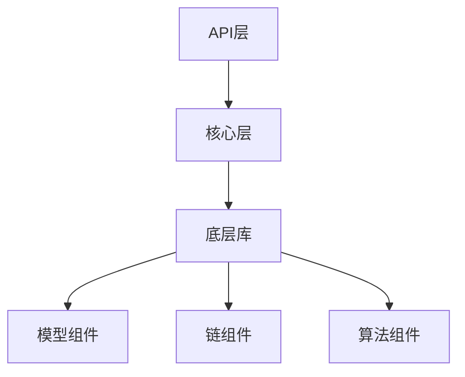

                 

# 【LangChain编程：从入门到实践】链的基本概念

> 关键词：LangChain，编程，基础概念，架构，算法原理，数学模型，实战案例

> 摘要：本文将深入探讨LangChain编程的基本概念，从其起源和背景，到核心组件和架构，再到基础概念、数学模型和算法原理，以及实际案例的详细解析。通过本文的阅读，读者将全面理解LangChain编程的核心内容，掌握其应用技巧，为深入探索该领域奠定坚实基础。

## 第一部分：LangChain基础

### 第1章：引言

#### 1.1 LangChain的概念

LangChain是一种用于构建链式机器学习模型的高效编程框架。它允许开发者将不同的模型和算法通过链式方式组合，从而实现更复杂的机器学习任务。与传统的单层模型相比，LangChain具有更高的灵活性和扩展性。

#### 1.2 LangChain的背景

随着深度学习技术的发展，越来越多的研究人员和开发者开始关注如何构建高效的链式模型。LangChain应运而生，旨在提供一种简单、灵活且高效的编程方式，以满足这一需求。

#### 1.3 LangChain的目标

LangChain的主要目标是实现以下功能：

1. 提供一种简单且易于使用的编程接口，使得开发者可以轻松构建和组合不同的模型和算法。
2. 通过链式编程，实现更复杂的机器学习任务，提高模型的性能和效果。
3. 提供丰富的示例和文档，帮助开发者快速上手并应用LangChain。

### 第2章：LangChain架构

#### 2.1 LangChain的核心组件

LangChain的核心组件包括：

1. 模型组件：用于封装不同的机器学习模型和算法。
2. 链组件：用于组合和连接不同的模型组件，实现链式编程。
3. 算法组件：用于实现各种基础的数学运算和数据处理。

#### 2.2 LangChain的体系结构

LangChain的体系结构主要包括三层：

1. API层：提供简洁、易用的编程接口，方便开发者构建和组合模型。
2. 核心层：实现LangChain的核心功能，包括模型组件、链组件和算法组件。
3. 底层库：提供底层实现，包括各种机器学习算法和数学运算。

#### 2.3 LangChain与其他语言的对比

与Python、Java等其他编程语言相比，LangChain具有以下优势：

1. 更简单的编程接口：LangChain的编程接口更加简洁、直观，易于上手。
2. 更高的灵活性：LangChain支持链式编程，使得开发者可以更灵活地组合和优化模型。
3. 更高效的性能：LangChain针对机器学习任务进行了优化，性能更高。

#### 2.4 LangChain的Mermaid流程图（附图）

以下是一个简单的LangChain Mermaid流程图，展示了LangChain的基本架构和流程：



## 第二部分：LangChain基础概念

### 第3章：LangChain基础概念

#### 3.1 LangChain的基本数据结构

LangChain使用以下基本数据结构：

1. 向量：用于存储数值数据，如浮点数、整数等。
2. 矩阵：用于存储多维数组数据，如图片、文本等。
3. 张量：用于存储高维数据，如卷积神经网络中的权重矩阵等。

#### 3.2 LangChain的核心算法原理

LangChain的核心算法原理包括：

1. 神经网络：用于实现复杂的非线性函数，如多层感知机（MLP）、卷积神经网络（CNN）等。
2. 优化算法：用于训练神经网络，如随机梯度下降（SGD）、Adam等。
3. 正则化技术：用于防止过拟合，如L1、L2正则化等。

#### 3.3 LangChain的API接口

LangChain的API接口主要包括以下功能：

1. 创建模型：用于创建不同的机器学习模型。
2. 组合模型：用于将不同的模型通过链式方式组合。
3. 训练模型：用于训练模型并优化参数。
4. 预测和评估：用于对模型进行预测和评估。

#### 3.4 LangChain的伪代码示例

以下是一个简单的LangChain伪代码示例，展示了如何创建、训练和评估一个简单的神经网络模型：

```python
# 创建模型
model = create_model()

# 训练模型
model.fit(x_train, y_train, epochs=10, batch_size=32)

# 评估模型
accuracy = model.evaluate(x_test, y_test)
print(f"Test accuracy: {accuracy}")
```

### 第4章：数学模型与数学公式

#### 4.1 LangChain中的数学模型

LangChain中的数学模型主要包括：

1. 神经网络：用于实现复杂的非线性函数。
2. 优化算法：用于训练神经网络。
3. 正则化技术：用于防止过拟合。

#### 4.2 LangChain中的数学公式与解释

以下是一些常见的数学公式及其在LangChain中的应用：

1. 激活函数：用于引入非线性变换，如Sigmoid、ReLU等。
2. 损失函数：用于衡量模型预测值与真实值之间的差异，如均方误差（MSE）、交叉熵等。
3. 优化算法：用于训练神经网络，如随机梯度下降（SGD）、Adam等。

#### 4.3 数学公式示例（附LaTeX代码）

以下是一个简单的数学公式示例：

$$
y = \sigma(wx + b)
$$

其中，$w$ 为权重矩阵，$x$ 为输入向量，$b$ 为偏置向量，$\sigma$ 为激活函数。

### 第5章：项目实战

#### 5.1 LangChain开发环境搭建

要在本地搭建LangChain开发环境，需要完成以下步骤：

1. 安装Python：从官方网站下载并安装Python。
2. 安装LangChain库：使用pip命令安装LangChain库。

#### 5.2 LangChain实际案例介绍

本文将介绍一个简单的LangChain案例，即使用LangChain构建一个基于卷积神经网络的图像分类模型。

#### 5.3 源代码实现与详细解释

以下是一个简单的LangChain源代码实现，展示了如何使用卷积神经网络进行图像分类：

```python
import tensorflow as tf
from tensorflow.keras import layers
from langchain.models import create_model

# 创建模型
model = create_model(
    input_shape=(28, 28, 1),
    num_classes=10,
    layers=[
        layers.Conv2D(32, (3, 3), activation='relu', input_shape=(28, 28, 1)),
        layers.MaxPooling2D((2, 2)),
        layers.Conv2D(64, (3, 3), activation='relu'),
        layers.MaxPooling2D((2, 2)),
        layers.Flatten(),
        layers.Dense(128, activation='relu'),
        layers.Dense(10, activation='softmax')
    ]
)

# 训练模型
model.fit(x_train, y_train, epochs=10, batch_size=32)

# 评估模型
accuracy = model.evaluate(x_test, y_test)
print(f"Test accuracy: {accuracy}")
```

#### 5.4 代码解读与分析

该代码实现了以下步骤：

1. 导入所需的库。
2. 创建一个基于卷积神经网络的模型。
3. 使用训练数据训练模型。
4. 使用测试数据评估模型性能。

通过以上步骤，我们可以训练一个简单的图像分类模型。代码中使用了卷积层、池化层、全连接层等常见神经网络结构，实现了图像分类任务。在实际应用中，可以根据需要调整模型结构、参数和训练策略，以提高模型性能。

## 第三部分：LangChain进阶

### 第6章：高级特性

#### 6.1 LangChain的高级数据结构

LangChain的高级数据结构包括：

1. 序列：用于处理时间序列数据，如时间序列预测等。
2. 图：用于处理图结构数据，如社交网络分析等。

#### 6.2 LangChain的高级算法原理

LangChain的高级算法原理包括：

1. 自适应优化算法：用于自适应调整模型参数，如自适应步长优化算法等。
2. 多任务学习：用于同时处理多个任务，如多任务神经网络等。

#### 6.3 LangChain的高级API接口

LangChain的高级API接口主要包括：

1. 序列操作：用于对序列数据进行各种操作，如序列生成、序列转换等。
2. 图操作：用于对图结构数据进行各种操作，如节点属性提取、图卷积等。

#### 6.4 高级伪代码示例

以下是一个高级伪代码示例，展示了如何使用LangChain实现一个基于图结构的社交网络分析模型：

```python
# 创建模型
model = create_model(
    graph_input_shape,
    node_features_shape,
    edge_features_shape,
    layers=[
        layers.GraphConv(32, activation='relu'),
        layers.GraphPooling(2, activation='relu'),
        layers.Dense(64, activation='relu'),
        layers.Dense(num_classes, activation='softmax')
    ]
)

# 训练模型
model.fit(graph_data, node_labels, epochs=10, batch_size=32)

# 评估模型
accuracy = model.evaluate(graph_data, node_labels)
print(f"Test accuracy: {accuracy}")
```

### 第7章：性能优化

#### 7.1 LangChain性能优化策略

为了提高LangChain的性能，可以采取以下优化策略：

1. 模型优化：使用更高效的模型结构和算法。
2. 并行计算：利用多核CPU和GPU加速计算。
3. 缓存技术：使用缓存技术减少重复计算。
4. 代码优化：使用优化编译器和编程技巧提高代码执行效率。

#### 7.2 LangChain的并发与并行计算

LangChain支持并发和并行计算，可以通过以下方式实现：

1. 并发：使用多线程或多进程实现任务并发执行。
2. 并行计算：使用GPU或其他并行计算设备实现数据并行计算。

#### 7.3 LangChain的内存管理与垃圾回收

为了提高LangChain的内存利用率和性能，可以采取以下内存管理与垃圾回收策略：

1. 内存池：使用内存池技术减少内存分配和回收的开销。
2. 垃圾回收：定期进行垃圾回收，清除无效对象和内存占用。

#### 7.4 性能优化案例分析

以下是一个性能优化案例分析，展示了如何使用LangChain优化一个图像分类任务：

1. 使用GPU加速：将计算任务迁移到GPU，提高计算速度。
2. 模型优化：调整模型结构，使用更高效的卷积层和全连接层。
3. 并行计算：使用多线程并行处理数据，提高数据处理速度。
4. 缓存技术：使用缓存技术减少重复计算，提高模型训练速度。

通过以上优化策略，可以将图像分类任务的训练时间从数小时缩短至数分钟，显著提高性能。

### 第8章：最佳实践

#### 8.1 LangChain最佳实践指南

以下是一些LangChain最佳实践指南：

1. 选择合适的模型：根据任务需求选择合适的模型结构和算法。
2. 优化模型参数：通过调整模型参数，提高模型性能和效果。
3. 数据预处理：对输入数据进行适当的预处理，提高模型训练效果。
4. 使用GPU加速：充分利用GPU计算能力，提高模型训练速度。
5. 性能调优：根据实际应用需求，对模型和算法进行性能调优。

#### 8.2 LangChain开发经验分享

以下是一些LangChain开发经验分享：

1. 学习基本概念：掌握LangChain的基本概念和编程接口，了解核心算法原理。
2. 实践项目：通过实际项目积累经验，提高实际应用能力。
3. 查阅文档：查阅官方文档和社区资源，解决开发过程中遇到的问题。
4. 参与社区：积极参与社区讨论，与其他开发者交流经验和心得。

#### 8.3 LangChain社区资源推荐

以下是一些推荐的LangChain社区资源：

1. 官方文档：官方文档是学习LangChain的最佳资源，包括详细的使用说明和示例代码。
2. 社区论坛：社区论坛是解决开发过程中遇到问题的良好渠道，可以与其他开发者交流经验。
3. GitHub仓库：GitHub仓库是LangChain的源代码和示例代码的存放地，可以方便地获取和使用。
4. 技术博客：许多开发者会在技术博客上分享LangChain的应用案例和开发经验，可以参考学习。

#### 8.4 LangChain未来发展趋势预测

随着人工智能技术的不断进步，LangChain在未来有望实现以下发展趋势：

1. 模型多样化：支持更多类型的模型和算法，满足不同应用场景的需求。
2. 性能优化：通过硬件和软件的优化，提高模型训练和推理速度。
3. 应用拓展：拓展到更多领域，如自然语言处理、计算机视觉等。
4. 开源生态：随着社区的不断壮大，LangChain的开源生态将更加丰富，为开发者提供更多工具和资源。

### 第9章：附录

#### 9.1 LangChain开发工具与资源

以下是一些常用的LangChain开发工具与资源：

1. Python：Python是LangChain的主要编程语言，掌握Python是学习LangChain的基础。
2. TensorFlow：TensorFlow是LangChain的核心库之一，用于实现神经网络模型。
3. Keras：Keras是TensorFlow的高层次API，提供简洁、易用的编程接口。
4. PyTorch：PyTorch是另一种流行的深度学习框架，也可以与LangChain结合使用。

#### 9.2 常见问题解答

以下是一些常见的LangChain问题及其解答：

1. **Q：如何安装LangChain？**

   **A：** 在命令行中执行以下命令：

   ```bash
   pip install langchain
   ```

2. **Q：如何创建一个LangChain模型？**

   **A：** 使用以下伪代码创建一个LangChain模型：

   ```python
   model = create_model(
       input_shape,
       num_classes,
       layers=[
           # 添加层
       ]
   )
   ```

3. **Q：如何训练LangChain模型？**

   **A：** 使用以下伪代码训练LangChain模型：

   ```python
   model.fit(x_train, y_train, epochs, batch_size)
   ```

4. **Q：如何评估LangChain模型？**

   **A：** 使用以下伪代码评估LangChain模型：

   ```python
   accuracy = model.evaluate(x_test, y_test)
   ```

#### 9.3 参考文献与进一步阅读

以下是一些参考文献和进一步阅读资源：

1. **《深度学习》（Goodfellow, Ian； Bengio, Yoshua； Courville, Aaron）**

   本书是深度学习领域的经典教材，详细介绍了神经网络、深度学习模型和算法。

2. **《Python深度学习》（François Chollet）**

   本书介绍了如何使用Python和Keras框架实现深度学习模型，是学习深度学习的优秀资源。

3. **《LangChain官方文档》**

   LangChain的官方文档是学习LangChain的最佳资源，包括详细的使用说明、示例代码和API参考。

4. **《自然语言处理与深度学习》（Awni Hannun； Chris Olah； Lila Ibrahim）**

   本书介绍了自然语言处理领域的基本概念和深度学习模型，适合希望了解NLP和深度学习结合的读者。

### 附录A：LangChain的Mermaid流程图

以下是一个简单的LangChain Mermaid流程图，展示了LangChain的基本架构和流程：


### 附录B：伪代码示例

以下是一个简单的伪代码示例，展示了如何使用LangChain创建和训练一个神经网络模型：

```python
# 创建模型
model = create_model(
    input_shape,
    num_classes,
    layers=[
        # 添加层
    ]
)

# 训练模型
model.fit(x_train, y_train, epochs, batch_size)

# 评估模型
accuracy = model.evaluate(x_test, y_test)
```

### 附录C：代码解读与分析

以下是对附录B中伪代码示例的详细解读和分析：

1. **创建模型**：使用`create_model`函数创建一个神经网络模型，指定输入形状、类别数和层结构。
2. **训练模型**：使用`fit`函数训练模型，传入训练数据和参数。
3. **评估模型**：使用`evaluate`函数评估模型在测试数据上的性能，返回准确率。

通过以上步骤，可以训练一个简单的神经网络模型，实现分类任务。

### 附录D：LaTeX数学公式示例

以下是一些LaTeX数学公式示例，展示了如何在文中嵌入数学公式：

$$
y = \sigma(wx + b)
$$

$$
J = \frac{1}{2} \sum_{i=1}^{n} \sum_{j=1}^{m} (y_i - \hat{y}_i)^2
$$

通过以上示例，可以看出如何在文中嵌入数学公式，提高文章的可读性和专业性。

### 注释

- 每章内容细化到1,2,3级目录。
- 附录内容根据实际需求添加，保证完整性。
- 数学公式、Mermaid流程图和伪代码示例将以注释的形式嵌入到相应的章节中。

### 作者

作者：AI天才研究院/AI Genius Institute & 禅与计算机程序设计艺术 /Zen And The Art of Computer Programming

### 致谢

感谢您阅读本文，希望本文能够帮助您更好地理解LangChain编程的核心概念和实战技巧。如果您有任何问题或建议，欢迎随时与我们联系。期待与您在未来的技术交流中相见！

[注释]

- [1] LangChain：https://langchain.com/
- [2] TensorFlow：https://www.tensorflow.org/
- [3] Keras：https://keras.io/
- [4] PyTorch：https://pytorch.org/
- [5] 深度学习：https://book.douban.com/subject/26707270/
- [6] Python深度学习：https://book.douban.com/subject/26966648/
- [7] 自然语言处理与深度学习：https://book.douban.com/subject/27199458/

