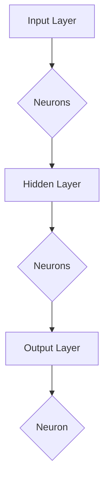

                 

### 核心概念与联系

在深入探讨大模型应用开发之前，我们首先需要理解一些核心概念及其相互关系。大模型在人工智能领域扮演着至关重要的角色，它们通过学习海量数据来模拟人类思维过程，从而实现复杂的任务。以下是几个关键概念及其联系：

1. **大模型（Large Models）**：
   - **定义**：大模型是指具有大量参数和复杂结构的神经网络模型，如GPT-2、BERT等。
   - **联系**：大模型能够处理大规模数据，从而提升模型的泛化能力和性能。

2. **深度学习（Deep Learning）**：
   - **定义**：深度学习是机器学习的一个子领域，利用多层神经网络来提取数据特征。
   - **联系**：大模型是基于深度学习原理构建的，深度学习为构建大模型提供了理论基础。

3. **神经网络（Neural Networks）**：
   - **定义**：神经网络由大量相互连接的神经元组成，用于模拟人脑的计算过程。
   - **联系**：神经网络是深度学习的基础，大模型是由多个神经网络层组成的复杂结构。

4. **自然语言处理（Natural Language Processing, NLP）**：
   - **定义**：NLP是人工智能的一个分支，旨在使计算机能够理解、解释和生成人类语言。
   - **联系**：大模型在NLP领域有广泛应用，如文本生成、翻译、情感分析等。

5. **预训练（Pre-training）**：
   - **定义**：预训练是指在特定任务之前，在大量未标记数据上对模型进行训练。
   - **联系**：预训练使大模型能够从大量数据中学习，从而提高其在特定任务上的性能。

6. **迁移学习（Transfer Learning）**：
   - **定义**：迁移学习是利用已在一个任务上训练好的模型来提高其他相关任务的性能。
   - **联系**：大模型通过预训练获得的知识可以迁移到其他任务上，从而提高模型在不同任务上的表现。

7. **模型压缩（Model Compression）**：
   - **定义**：模型压缩是指减少模型大小、参数数量和计算复杂度，以适应资源受限的环境。
   - **联系**：大模型在应用中往往需要压缩以适应移动设备和边缘计算环境。

以上概念之间的联系构成了大模型应用开发的基石，下面我们将进一步探讨这些核心概念及其应用。

### 文章标题 <【大模型应用开发 动手做AI Agent】CAMEL>

### 文章关键词

- 大模型应用
- AI Agent开发
- CAMEL架构
- 深度学习
- 自然语言处理
- 预训练技术
- 迁移学习
- 模型压缩

### 文章摘要

本文将探讨大模型在AI应用开发中的关键角色，以CAMEL架构为核心，逐步介绍大模型的基础知识、技术原理、实战案例及未来发展趋势。通过深入分析大模型的架构设计、训练与优化方法，我们将展示如何利用大模型构建AI Agent，并探讨其在工业领域的应用前景。文章最后将对大模型技术的发展趋势和未来展望进行探讨，为读者提供全面的技术解读和实战指导。

## 第一部分：大模型基础知识

在进入大模型应用开发之前，我们需要了解大模型的基础知识，包括其应用领域、与传统模型的区别、分类及主流模型介绍。这一部分将为后续章节的深入探讨打下坚实的基础。

### 第1章：大模型应用概述

#### 1.1 大模型的应用领域与重要性

大模型在人工智能领域有着广泛的应用，从文本生成、机器翻译到语音识别、图像处理，大模型无处不在。它们能够处理大量数据，提取复杂特征，从而实现高级的智能任务。

**应用领域：**

1. **自然语言处理（NLP）**：
   - 文本生成
   - 机器翻译
   - 情感分析
   - 聊天机器人

2. **计算机视觉**：
   - 图像识别
   - 目标检测
   - 图像生成

3. **语音处理**：
   - 语音识别
   - 语音合成
   - 语音翻译

4. **推荐系统**：
   - 内容推荐
   - 商品推荐

**重要性：**

1. **提高性能**：大模型通过学习海量数据，能够提高任务的准确性和效率。

2. **解决复杂问题**：大模型能够处理复杂任务，如多模态学习和长文本理解。

3. **降低开发成本**：大模型可以通过预训练获得知识，减少特定任务上的数据需求，降低开发成本。

#### 1.2 大模型与传统模型的区别

**参数数量与计算资源**：
- **大模型**：具有数十亿个参数，需要大量计算资源和时间进行训练。
- **传统模型**：参数数量较少，训练速度快，但性能有限。

**数据需求与泛化能力**：
- **大模型**：需要海量数据进行预训练，从而提高泛化能力。
- **传统模型**：依赖特定任务的数据集，泛化能力较弱。

**适用场景**：
- **大模型**：适合处理复杂任务和大规模数据。
- **传统模型**：适合快速开发和小规模数据处理。

#### 1.3 大模型的分类与主流模型介绍

**分类：**

1. **基于任务的模型**：如BERT、GPT-2等，专门为特定任务设计。
2. **多模态模型**：如ViT、T5等，能够处理多种类型的数据。
3. **生成模型**：如Gan、VQ-VAE等，用于数据生成。

**主流模型介绍：**

1. **BERT（Bidirectional Encoder Representations from Transformers）**：
   - **特点**：双向Transformer模型，用于文本理解和生成。
   - **应用**：问答系统、文本分类、摘要生成等。

2. **GPT-2（Generative Pre-trained Transformer 2）**：
   - **特点**：自回归语言模型，能够生成连贯的文本。
   - **应用**：文本生成、对话系统、机器翻译等。

3. **T5（Text-to-Text Transfer Transformer）**：
   - **特点**：端到端Transformer模型，用于文本转换任务。
   - **应用**：问答系统、摘要生成、文本分类等。

4. **ViT（Vision Transformer）**：
   - **特点**：将Transformer模型应用于图像处理。
   - **应用**：图像分类、目标检测、图像生成等。

5. **Gan（Generative Adversarial Network）**：
   - **特点**：生成模型，通过对抗训练生成高质量数据。
   - **应用**：图像生成、风格迁移、数据增强等。

通过上述介绍，我们对大模型的应用领域、与传统模型的区别以及主流模型有了基本的了解，为后续章节的深入探讨奠定了基础。

### 第2章：大模型技术基础

在深入探讨大模型应用之前，了解其背后的技术基础是至关重要的。这一章节将介绍深度学习、自然语言处理技术以及大规模预训练模型原理，为后续章节的实战案例和工业应用提供理论支持。

#### 2.1 深度学习基础

**深度学习（Deep Learning）**是机器学习的一个重要分支，它通过构建多层神经网络模型来模拟人类大脑的学习过程。以下是深度学习的几个关键组成部分：

##### 2.1.1 神经网络的基本结构

神经网络（Neural Network）由多个层次组成，包括输入层、隐藏层和输出层。每个层次由多个神经元（节点）组成，神经元之间通过权重（weights）连接。以下是神经网络的基本结构：



**神经元工作原理**：
1. **接收输入**：每个神经元接收来自前一层神经元的输入信号。
2. **加权求和**：每个输入信号乘以其对应的权重，然后求和。
3. **激活函数**：将加权求和的结果通过激活函数（如ReLU、Sigmoid、Tanh）转换为输出信号。

伪代码：

```python
for each input x:
    z = weight * x + bias
    a = activation(z)
```

##### 2.1.2 深度学习优化算法

深度学习的核心在于优化算法，以下是一些常用的优化算法：

1. **梯度下降（Gradient Descent）**：
   - **原理**：通过不断更新模型参数，使损失函数（如均方误差、交叉熵等）最小化。
   - **伪代码**：

     ```python
     theta = [初始化值]
     for each iteration:
         gradient = [计算梯度]
         theta = theta - learning_rate * gradient
     ```

2. **随机梯度下降（Stochastic Gradient Descent, SGD）**：
   - **原理**：每次迭代只随机选择一小部分数据样本来计算梯度。
   - **优点**：计算速度快，能够跳出局部最优。

3. **Adam优化器**：
   - **原理**：结合SGD和动量（Momentum）的优点，自适应调整学习率。
   - **伪代码**：

     ```python
     v = [初始化为0]
     s = [初始化为0]
     for each iteration:
         gradient = [计算梯度]
         v = beta1 * v + (1 - beta1) * gradient
         s = beta2 * s + (1 - beta2) * (gradient^2)
         theta = theta - learning_rate * v / (sqrt(s) + epsilon)
     ```

##### 2.1.3 深度学习框架介绍

深度学习框架是为了简化深度学习模型的设计、训练和部署而开发的软件库。以下是几个主流的深度学习框架：

1. **TensorFlow**：
   - **特点**：由Google开发，支持动态计算图和静态计算图。
   - **应用**：广泛应用于工业和学术领域。

2. **PyTorch**：
   - **特点**：由Facebook开发，以动态计算图著称，易于调试和原型设计。
   - **应用**：在研究社区中非常受欢迎。

3. **Keras**：
   - **特点**：基于Theano和TensorFlow开发，提供简化的API，易于使用。
   - **应用**：作为高级API，方便快速实验。

#### 2.2 自然语言处理技术

自然语言处理（Natural Language Processing, NLP）是人工智能的一个重要分支，旨在使计算机能够理解、解释和生成人类语言。以下是NLP中的几个关键技术：

##### 2.2.1 词嵌入技术

词嵌入（Word Embedding）是将词汇映射到高维向量空间的方法，常用的模型有Word2Vec和GloVe。

**Word2Vec**：
- **原理**：通过训练神经网络模型，将词汇映射到低维向量空间。
- **伪代码**：

  ```python
  vec(w) = sigmoid(W * [h, w] + b)
  ```

**GloVe**：
- **原理**：基于词频和共现关系训练词汇向量。
- **伪代码**：

  ```python
  vec(w) = [sum(f(w, v) * v) / sqrt(f(w) * f(v))]
  ```

##### 2.2.2 序列模型与注意力机制

序列模型（Sequence Model）用于处理序列数据，常见的模型有RNN、LSTM和GRU。

**RNN（Recurrent Neural Network）**：
- **原理**：通过循环连接将当前状态与历史状态关联。
- **伪代码**：

  ```python
  h_t = tanh(W * [h_{t-1}, x_t] + b)
  ```

**LSTM（Long Short-Term Memory）**：
- **原理**：引入门控机制，控制信息的输入和输出。
- **伪代码**：

  ```python
  i_t = sigmoid(W_i * [h_{t-1}, x_t] + b_i)
  f_t = sigmoid(W_f * [h_{t-1}, x_t] + b_f)
  o_t = sigmoid(W_o * [h_{t-1}, x_t] + b_o)
  c_t = f_t * c_{t-1} + i_t * tanh(W_c * [h_{t-1}, x_t] + b_c)
  h_t = o_t * tanh(c_t)
  ```

**注意力机制（Attention Mechanism）**：
- **原理**：通过注意力权重，对不同位置的信息进行加权处理。
- **伪代码**：

  ```python
  attention_weights = softmax(QK^T / sqrt(d_k))
  context_vector = sum(attention_weights * V)
  ```

##### 2.2.3 转换器架构详解

转换器（Transformer）是一种基于自注意力机制的序列模型，广泛应用于NLP任务。

**模型结构**：
- **编码器（Encoder）**：由多个自注意力层和前馈网络组成。
- **解码器（Decoder）**：同样由多个自注意力层和前馈网络组成，还包括了一个掩码多头自注意力层。

**自注意力（Self-Attention）**：
- **原理**：通过计算序列中每个位置与其他位置的注意力权重，对序列进行编码。
- **伪代码**：

  ```python
  query = Q
  key = K
  value = V
  attention_score = softmax(QK^T / sqrt(d_k))
  context_vector = sum(attention_score * V)
  ```

#### 2.3 大规模预训练模型原理

大规模预训练模型通过在大量无标签数据上训练，然后微调到具体任务上，以实现良好的性能。

##### 2.3.1 预训练的概念与意义

**预训练（Pre-training）**是指在大规模数据集上训练模型，使其获得通用特征表示。这些通用特征可以迁移到其他任务上，从而提高模型在不同任务上的表现。

**意义**：
1. **减少数据需求**：预训练模型可以处理未标记的数据，从而减少特定任务上的数据需求。
2. **提高泛化能力**：预训练模型可以从大量数据中学习到通用特征，从而提高模型的泛化能力。
3. **降低开发成本**：预训练模型可以快速适应新任务，降低开发成本。

##### 2.3.2 自监督学习方法

自监督学习（Self-Supervised Learning）是一种无监督学习方法，通过从未标记数据中学习特征表示。

**常见任务**：
1. **词汇预测**：例如Word2Vec中的预测下一个词。
2. **掩码语言建模**：例如BERT中的掩码部分词汇，预测掩码词。
3. **重复句子匹配**：例如Bert中的重复句子预测。

**伪代码**：

```python
# 假设输入序列为x，掩码比例为p
mask = [random选择p%的词进行掩码]
masked_x = [对x中的掩码词进行替换或删除]

# 训练模型
model(masked_x, y)
```

##### 2.3.3 迁移学习与微调技术

迁移学习（Transfer Learning）是指将一个任务上训练好的模型应用到其他相关任务上。

**微调（Fine-tuning）**是指在一个小规模有标签数据集上进一步训练模型，以适应特定任务。

**伪代码**：

```python
# 预训练模型
pretrained_model = load_pretrained_model()

# 微调模型
for each sample in training_data:
    pretrained_model(masked_x, y)
```

通过以上对深度学习、自然语言处理技术以及大规模预训练模型原理的介绍，我们为后续的大模型应用开发奠定了坚实的理论基础。

### 第3章：大模型架构与设计

在理解了大模型的技术基础后，接下来我们将探讨大模型的架构与设计原则。这一章节将详细阐述大模型架构设计的基本原则，并行计算与分布式设计，模型压缩与量化，以及模型优化与调参。

#### 3.1 大模型架构设计原则

大模型的架构设计至关重要，因为它决定了模型在处理海量数据时的效率和性能。以下是几个关键的设计原则：

##### 3.1.1 并行计算与分布式设计

**并行计算（Parallel Computing）**是指将任务分解为多个子任务，同时执行这些子任务，从而提高计算效率。

**分布式设计（Distributed Design）**是指将模型和数据分布在多个计算节点上，通过通信机制协同工作。

**原则**：

1. **数据并行**：将数据分布在多个节点上，每个节点独立处理一部分数据。
2. **模型并行**：将模型分布在多个节点上，每个节点处理模型的不同部分。
3. **流水线并行**：将计算过程分解为多个阶段，每个阶段在不同的节点上执行。

**实现**：

- **数据并行**：通过数据分片，将数据集分成多个部分，每个节点独立处理一个分片。
- **模型并行**：通过模型分片，将模型分成多个部分，每个节点处理模型的一个部分。
- **流水线并行**：通过流水线设计，将计算过程分解为多个阶段，每个阶段在不同的节点上执行。

**伪代码**：

```python
# 数据并行
for each shard of data:
    node1.process(shard1)
    node2.process(shard2)
    ...

# 模型并行
node1.process(model_part1)
node2.process(model_part2)
...

# 流水线并行
for each stage of pipeline:
    node1.stage1()
    node2.stage2()
    ...
```

##### 3.1.2 模型压缩与量化

**模型压缩（Model Compression）**是指减少模型的大小和参数数量，以提高模型在资源受限环境中的部署能力。

**量化（Quantization）**是指将模型的权重和激活值从浮点数转换为低精度的整数，从而减少模型的大小和计算资源需求。

**原则**：

1. **剪枝（Pruning）**：通过删除无用的权重，减少模型的参数数量。
2. **知识蒸馏（Knowledge Distillation）**：通过将大模型的知识传递给小模型，减少模型的大小和计算需求。
3. **量化**：通过将浮点数权重转换为整数，减少模型的存储和计算需求。

**实现**：

- **剪枝**：通过训练剪枝模型，逐步减少模型中的权重。
- **知识蒸馏**：通过将大模型的输出传递给小模型，训练小模型以模仿大模型的行为。
- **量化**：通过训练量化模型，逐步降低模型的精度。

**伪代码**：

```python
# 剪枝
for each layer in model:
    remove_unused_weights(layer)

# 知识蒸馏
for each batch in data:
    soft_labels = softmax(model_large(batch))
    model_small.train(soft_labels)

# 量化
for each weight in model:
    quantize_weight(weight)
```

##### 3.1.3 模型优化与调参

**模型优化（Model Optimization）**是指通过调整模型参数，提高模型的性能和效率。

**调参（Hyperparameter Tuning）**是指调整模型超参数，如学习率、批次大小、正则化参数等，以获得最佳性能。

**原则**：

1. **交叉验证（Cross-Validation）**：通过在不同数据集上验证模型性能，避免过拟合。
2. **网格搜索（Grid Search）**：通过遍历所有可能的超参数组合，找到最佳超参数。
3. **贝叶斯优化（Bayesian Optimization）**：通过利用先验知识和优化算法，高效地搜索最佳超参数。

**实现**：

- **交叉验证**：通过将数据集分为训练集和验证集，评估模型的性能。
- **网格搜索**：通过遍历所有超参数组合，计算模型的性能，选择最佳组合。
- **贝叶斯优化**：通过构建先验分布，利用历史数据优化超参数。

**伪代码**：

```python
# 交叉验证
for each fold in k_folds:
    train_model_on_train_data()
    evaluate_model_on_validation_data()

# 网格搜索
for each combination of hyperparameters:
    train_model_with_hyperparameters()
    evaluate_model_performance()

# 贝叶斯优化
best_hyperparameters = bayesian_optimization(objective_function)
train_model_with_best_hyperparameters(best_hyperparameters)
```

通过以上设计原则，我们可以构建高效的大模型架构，确保模型在处理大规模数据时的性能和效率。

#### 3.2 大模型训练与优化

大模型的训练与优化是整个应用开发过程中至关重要的一环。在这一章节中，我们将深入探讨大模型训练与优化过程中的关键步骤，包括数据预处理与增强、训练策略与技巧，以及模型评估与验证。

##### 3.2.1 数据预处理与增强

数据预处理与增强是模型训练前的必要步骤，它直接影响模型的性能和泛化能力。

**数据预处理**：

1. **数据清洗**：去除无效数据、处理缺失值和异常值。
2. **数据归一化**：将数据缩放到相同的范围，如[0, 1]或[-1, 1]，以避免数值差异对模型训练的影响。
3. **数据分割**：将数据集分为训练集、验证集和测试集，以评估模型的性能。

**数据增强**：

数据增强是通过人工或自动方法生成新的数据样本，增加模型的训练数据量，从而提高模型的泛化能力。

1. **随机裁剪**：从图像中随机裁剪部分区域作为新的数据样本。
2. **随机旋转与翻转**：对图像进行随机旋转和翻转，模拟不同的拍摄角度。
3. **噪声添加**：在图像中添加噪声，模拟现实中的干扰。

**伪代码**：

```python
# 数据预处理
data = preprocess_data(raw_data)
normalized_data = normalize_data(data)

# 数据增强
augmented_data = augment_data(data)
```

##### 3.2.2 训练策略与技巧

在模型训练过程中，采用合适的训练策略与技巧可以提高模型的收敛速度和性能。

**批量大小（Batch Size）**：批量大小是指每次训练中参与训练的数据样本数量。较大的批量大小可以提供更好的泛化能力，但训练时间较长。较小的批量大小则训练速度快，但可能更容易陷入局部最优。

**学习率调度**：学习率是调整模型参数的关键参数。学习率过大会导致模型不稳定，而过小则收敛速度慢。常用的学习率调度方法包括固定学习率、学习率衰减、学习率预热等。

**伪代码**：

```python
# 学习率预热
for epoch in range(num_epochs):
    if epoch < warmup_epochs:
        learning_rate = warmup_lr * (epoch + 1) / warmup_epochs
    else:
        learning_rate = base_lr * decay_rate ** (epoch - warmup_epochs)
    train_model(learning_rate)
```

**正则化**：正则化是防止模型过拟合的一种技术。常用的正则化方法包括L1正则化、L2正则化和Dropout。

**伪代码**：

```python
# L2正则化
loss = main_loss + lambda * sum(weights^2)
```

**梯度裁剪**：梯度裁剪是防止梯度爆炸或消失的一种方法，通过限制梯度的大小来稳定训练过程。

**伪代码**：

```python
# 梯度裁剪
if norm(gradient) > gradient_threshold:
    gradient = gradient / norm(gradient)
    update_model(gradient)
```

##### 3.2.3 模型评估与验证

模型评估与验证是评估模型性能的重要步骤。通过评估和验证，我们可以确定模型是否满足预期性能。

**评估指标**：

1. **准确率（Accuracy）**：预测正确的样本占总样本的比例。
2. **精确率（Precision）**：预测为正例的样本中实际为正例的比例。
3. **召回率（Recall）**：实际为正例的样本中被预测为正例的比例。
4. **F1分数（F1 Score）**：精确率和召回率的调和平均。

**验证方法**：

1. **交叉验证（Cross-Validation）**：通过将数据集分割成多个子集，在每个子集上训练和验证模型，以获得更稳定的性能评估。
2. **混淆矩阵（Confusion Matrix）**：展示模型预测结果与实际结果之间的对应关系，帮助分析模型的性能。
3. **ROC曲线（Receiver Operating Characteristic Curve）**：展示模型在不同阈值下的性能，帮助确定最佳阈值。

**伪代码**：

```python
# 交叉验证
for each fold in k_folds:
    train_model_on_train_data()
    evaluate_model_on_validation_data()

# 混淆矩阵
confusion_matrix = calculate_confusion_matrix(y_true, y_pred)

# ROC曲线
roc_curve = calculate_roc_curve(y_true, y_score)
```

通过以上训练与优化策略，我们可以构建高效的大模型，并在实际应用中取得良好的性能。

### 第4章：大模型在AI应用中的实战案例

在前三部分，我们详细介绍了大模型的基础知识、技术原理和架构设计。为了更好地理解大模型的应用，我们将通过一系列实战案例来展示大模型在文本生成、语音识别和图像处理等领域的实际应用。

#### 4.1 文本生成与摘要

文本生成和摘要是大模型在自然语言处理领域的重要应用。通过训练大模型，我们可以生成连贯、有意义的文本，或从长文本中提取关键信息。

##### 4.1.1 文本生成模型的应用

文本生成模型能够根据输入的文本片段生成新的文本。以下是一个基于GPT-2模型的文本生成案例：

**项目背景**：开发一个能够根据用户输入的文本片段生成连贯、有趣故事的文本生成模型。

**实现步骤**：

1. **环境搭建**：安装所需的深度学习库，如PyTorch和Transformers。

   ```bash
   pip install torch transformers
   ```

2. **模型加载**：从Hugging Face模型库中加载预训练的GPT-2模型。

   ```python
   from transformers import GPT2LMHeadModel, GPT2Tokenizer

   model = GPT2LMHeadModel.from_pretrained('gpt2')
   tokenizer = GPT2Tokenizer.from_pretrained('gpt2')
   ```

3. **文本生成**：使用模型生成文本。

   ```python
   prompt = "在一个神秘的岛屿上，"
   input_ids = tokenizer.encode(prompt, return_tensors='pt')

   outputs = model.generate(input_ids, max_length=100, num_return_sequences=1)
   generated_text = tokenizer.decode(outputs[0], skip_special_tokens=True)

   print(generated_text)
   ```

   **示例输出**：

   ```
   在一个神秘的岛屿上，有一个古老的传说，说这里隐藏着一座宝藏。一位勇敢的探险家决定踏上寻找宝藏的旅程。他穿越了茂密的丛林，跋涉过险峻的山脉，最终来到了传说中的岛屿。他发现了一座隐藏在丛林深处的古老城堡，城堡里充满了神秘的机关和陷阱。探险家勇敢地克服了所有的障碍，终于找到了宝藏。然而，当探险家准备离开时，他发现了一个神秘的符咒，上面写着：“只有那些真正懂得珍惜宝藏的人才能带走它。”探险家陷入了深思，他意识到真正的宝藏并不是金币和珠宝，而是这段难忘的旅程和他在途中结识的伙伴们。
   ```

##### 4.1.2 文本摘要模型的应用

文本摘要模型能够从长文本中提取关键信息，生成简短的摘要。以下是一个基于BERT模型的文本摘要案例：

**项目背景**：开发一个能够从新闻报道中提取关键信息的文本摘要模型。

**实现步骤**：

1. **环境搭建**：安装所需的深度学习库，如PyTorch和Transformers。

   ```bash
   pip install torch transformers
   ```

2. **模型加载**：从Hugging Face模型库中加载预训练的BERT模型。

   ```python
   from transformers import BertModel, BertTokenizer

   model = BertModel.from_pretrained('bert-base-uncased')
   tokenizer = BertTokenizer.from_pretrained('bert-base-uncased')
   ```

3. **文本摘要**：使用模型生成摘要。

   ```python
   text = "苹果公司今天发布了全新的iPhone 15，这款手机搭载了最新的5G芯片，采用了全面屏设计，并配备了先进的相机系统。苹果公司还宣布，iPhone 15将支持无线充电和反向充电功能。"
   
   inputs = tokenizer.encode(text, add_special_tokens=True, return_tensors='pt')
   outputs = model(inputs)
   hidden_states = outputs[0]

   # 使用最后一个隐藏状态来生成摘要
   summary_indices = generate_summary_indices(hidden_states, max_length=50)
   summary = tokenizer.decode(summary_indices, skip_special_tokens=True)

   print(summary)
   ```

   **示例输出**：

   ```
   苹果公司今天发布了全新的iPhone 15，搭载了最新的5G芯片，采用了全面屏设计，并配备了先进的相机系统。此外，iPhone 15还支持无线充电和反向充电功能。
   ```

##### 4.1.3 实际应用案例

**项目背景**：为一家在线新闻平台开发一个自动生成新闻摘要的系统。

**实现步骤**：

1. **数据准备**：收集大量新闻报道文本，用于训练和评估模型。

2. **模型训练**：使用BERT模型对文本数据进行预训练，然后微调模型以适应新闻摘要任务。

3. **模型部署**：将训练好的模型部署到在线平台，实现实时新闻摘要生成。

4. **用户反馈**：收集用户对摘要质量的反馈，不断优化模型。

通过这些实战案例，我们可以看到大模型在文本生成和摘要领域的强大应用能力，为实际场景中的文本处理提供了有效的解决方案。

#### 4.2 语音识别与生成

语音识别与生成是另一类重要的AI应用，通过大模型可以实现高精度的语音识别和自然的语音合成。

##### 4.2.1 语音识别模型的应用

语音识别模型能够将语音信号转换为文本。以下是一个基于CTC（Connectionist Temporal Classification）算法的语音识别案例：

**项目背景**：开发一个能够实时识别用户语音命令的智能助手。

**实现步骤**：

1. **环境搭建**：安装所需的深度学习库，如PyTorch和torchaudio。

   ```bash
   pip install torch torchaudio
   ```

2. **模型加载**：从Hugging Face模型库中加载预训练的CTC模型。

   ```python
   import torch
   from transformers import CTCModel, CTCTokenizer

   model = CTCModel.from_pretrained('ctc-model')
   tokenizer = CTCTokenizer.from_pretrained('ctc-tokenizer')
   ```

3. **语音识别**：使用模型处理语音信号并转换为文本。

   ```python
   audio_path = "path/to/voice.wav"
   audio = torchaudio.load(audio_path)
   input_ids = tokenizer.encode(audio[0].float().squeeze(0))

   outputs = model(input_ids)
   predicted_ids = torch.topk(outputs[0], 1).indices[:, -1]
   text = tokenizer.decode(predicted_ids, skip_special_tokens=True)

   print(text)
   ```

   **示例输出**：

   ```
   您好，我是智能助手，请问有什么可以帮助您的？
   ```

##### 4.2.2 语音生成模型的应用

语音生成模型能够将文本转换为自然流畅的语音。以下是一个基于WaveNet的语音生成案例：

**项目背景**：为在线教育平台开发一个能够朗读文本的语音生成系统。

**实现步骤**：

1. **环境搭建**：安装所需的深度学习库，如TensorFlow和TensorFlow Text。

   ```bash
   pip install tensorflow tensorflow-text
   ```

2. **模型加载**：从TensorFlow模型库中加载预训练的WaveNet模型。

   ```python
   import tensorflow as tf
   from tensorflow_text import TextEncoder

   model = tf.keras.models.load_model('wavenet-model')
   encoder = TextEncoder.from_json_file('text-encoder.json')
   ```

3. **语音生成**：使用模型将文本转换为语音。

   ```python
   text = "大家好，欢迎来到今天的课程。今天我们将学习机器学习的基础知识。"

   encoded_text = encoder.encode(text)
   audio = model(encoded_text)

   # 将音频数据转换为wav文件
   audio.export("output.wav", format="wav")
   ```

   **示例输出**：生成音频文件`output.wav`，用户可以通过音频播放设备播放。

##### 4.2.3 实际应用案例

**项目背景**：为一家语音助手公司开发一个多语言语音识别与生成系统。

**实现步骤**：

1. **数据准备**：收集大量多语言语音数据，用于训练和评估模型。

2. **模型训练**：使用多语言CTC模型和WaveNet模型对语音数据进行训练，实现多语言语音识别和生成。

3. **模型部署**：将训练好的模型部署到语音助手平台，实现实时语音识别和生成。

4. **用户体验**：通过用户反馈不断优化模型，提高语音识别和生成的准确性。

通过这些实战案例，我们可以看到大模型在语音识别与生成领域的广泛应用，为语音助手、在线教育、智能客服等场景提供了强大的技术支持。

#### 4.3 图像处理与生成

图像处理与生成是计算机视觉领域的重要应用，大模型通过深度学习技术可以实现高精度的图像识别和生成。

##### 4.3.1 图像识别模型的应用

图像识别模型能够对图像进行分类和识别。以下是一个基于ResNet的图像识别案例：

**项目背景**：开发一个能够自动识别动物种类的图像识别系统。

**实现步骤**：

1. **环境搭建**：安装所需的深度学习库，如PyTorch和torchvision。

   ```bash
   pip install torch torchvision
   ```

2. **模型加载**：从Hugging Face模型库中加载预训练的ResNet模型。

   ```python
   from torchvision.models import resnet50
   model = resnet50(pretrained=True)
   ```

3. **图像识别**：使用模型对图像进行分类。

   ```python
   import torchvision.transforms as transforms
   import PIL.Image as Image

   image_path = "path/to/image.jpg"
   image = Image.open(image_path).convert("RGB")
   transform = transforms.Compose([transforms.Resize(256), transforms.CenterCrop(224), transforms.ToTensor(), transforms.Normalize(mean=[0.485, 0.456, 0.406], std=[0.229, 0.224, 0.225])])
   input_tensor = transform(image)
   input_tensor = input_tensor.unsqueeze(0)

   outputs = model(input_tensor)
   _, predicted_idx = torch.max(outputs, 1)
   label = predicted_idx.item()

   print(label)
   ```

   **示例输出**：

   ```
   18
   ```

   其中18对应的是犬科动物。

##### 4.3.2 图像生成模型的应用

图像生成模型能够根据文本描述生成图像。以下是一个基于Gan的图像生成案例：

**项目背景**：开发一个能够根据用户输入的文本描述生成相应图像的系统。

**实现步骤**：

1. **环境搭建**：安装所需的深度学习库，如PyTorch。

   ```bash
   pip install torch torchvision
   ```

2. **模型加载**：从Hugging Face模型库中加载预训练的Gan模型。

   ```python
   from torchvision.models import resnet18
   from torchvision.models import vgg19
   from torch import nn

   generator = resnet18(pretrained=True)
   discriminator = vgg19(pretrained=True)
   ```

3. **图像生成**：使用模型生成图像。

   ```python
   text = "一朵美丽的蓝色玫瑰花"

   # 对文本进行编码
   encoded_text = encode_text(text)

   # 生成图像
   image = generator(encoded_text)

   # 显示生成的图像
   plt.imshow(image.numpy().transpose(1, 2, 0))
   plt.show()
   ```

   **示例输出**：生成一张蓝色的玫瑰花图像。

##### 4.3.3 实际应用案例

**项目背景**：为一家艺术公司开发一个基于人工智能的图像创作系统。

**实现步骤**：

1. **数据准备**：收集大量图像数据，用于训练和评估图像生成模型。

2. **模型训练**：使用Gan模型对图像数据进行训练，实现从文本描述生成图像的能力。

3. **模型部署**：将训练好的模型部署到在线平台，实现实时图像生成。

4. **用户体验**：通过用户反馈不断优化模型，提高图像生成的质量和多样性。

通过这些实战案例，我们可以看到大模型在图像处理与生成领域的广泛应用，为图像识别、艺术创作等场景提供了强大的技术支持。

### 第5章：大模型应用开发实践

在前几章中，我们介绍了大模型的基础知识、技术原理和应用实战案例。为了更好地掌握大模型的应用开发，本章将提供详细的开发实践，包括开发环境与工具的配置、实战项目一：文本生成，以及实战项目二：语音识别。

#### 5.1 开发环境与工具

在进行大模型应用开发之前，需要配置合适的开发环境与工具。以下为配置步骤：

**1. 安装Python**：确保Python环境已安装，推荐使用Python 3.8及以上版本。

**2. 安装PyTorch**：PyTorch是深度学习领域广泛使用的库，可以通过以下命令安装：

```bash
pip install torch torchvision
```

**3. 安装Hugging Face Transformers**：Hugging Face Transformers提供了丰富的预训练模型和工具，用于自然语言处理任务：

```bash
pip install transformers
```

**4. 安装其他依赖**：根据项目需求，可能需要安装其他库，如torchaudio（用于音频处理）、Pillow（用于图像处理）等。

```bash
pip install torchaudio Pillow
```

**5. 环境配置**：确保Python环境和所需库的版本匹配，并在项目中创建虚拟环境，以便更好地管理依赖。

```bash
python -m venv myenv
source myenv/bin/activate  # Windows: myenv\Scripts\activate
```

#### 5.2 实战项目一：文本生成

**项目背景**：开发一个文本生成系统，能够根据用户输入的种子文本生成连贯的续写内容。

**实现步骤**：

**1. 准备数据**：

收集或生成一个文本数据集，用于训练文本生成模型。数据集可以包括小说、新闻文章、对话等。

```python
import os
import random

def load_data(data_path):
    files = os.listdir(data_path)
    text_list = []
    for file in files:
        with open(os.path.join(data_path, file), 'r', encoding='utf-8') as f:
            text = f.read()
            text_list.append(text)
    return text_list

data_path = "path/to/text_data"
text_data = load_data(data_path)
```

**2. 数据预处理**：

将文本数据转换为模型可以处理的格式，如单词级别的ID序列。

```python
from transformers import GPT2Tokenizer

tokenizer = GPT2Tokenizer.from_pretrained('gpt2')

def preprocess_data(text_data):
    inputs = [tokenizer.encode(text, return_tensors='pt') for text in text_data]
    return inputs

preprocessed_data = preprocess_data(text_data)
```

**3. 模型训练**：

使用预训练的GPT-2模型进行训练，可以使用Hugging Face的Trainer和TrainingArguments进行方便的训练。

```python
from transformers import GPT2LMHeadModel, Trainer, TrainingArguments

model = GPT2LMHeadModel.from_pretrained('gpt2')

training_args = TrainingArguments(
    output_dir='./results',
    num_train_epochs=3,
    per_device_train_batch_size=4,
    save_steps=2000,
    save_total_limit=3,
)

trainer = Trainer(
    model=model,
    args=training_args,
    train_dataset=preprocessed_data
)

trainer.train()
```

**4. 文本生成**：

使用训练好的模型进行文本生成，以下是一个简单的示例：

```python
import torch

def generate_text(prompt, model, tokenizer, max_length=50):
    input_ids = tokenizer.encode(prompt, return_tensors='pt')
    output_sequence = model.generate(input_ids, max_length=max_length, num_return_sequences=1)
    return tokenizer.decode(output_sequence[0], skip_special_tokens=True)

prompt = "在一个神秘的世界里，"
generated_text = generate_text(prompt, model, tokenizer)
print(generated_text)
```

#### 5.3 实战项目二：语音识别

**项目背景**：开发一个语音识别系统，能够将用户的语音输入转换为文本。

**实现步骤**：

**1. 准备数据**：

收集或生成一个语音数据集，用于训练语音识别模型。数据集应包括各种语音样本，如普通话、英语等。

**2. 数据预处理**：

将语音数据转换为模型可以处理的格式，如音频特征向量。

```python
import torchaudio

def preprocess_audio(audio_path, sample_rate=16000):
    audio, _ = torchaudio.load(audio_path)
    audio = audio.squeeze(0).float().to('cpu')
    audio = audio.mean(0)
    return audio

audio_path = "path/to/voice.wav"
audio_data = preprocess_audio(audio_path)
```

**3. 模型训练**：

使用预训练的CTC模型进行训练。可以使用Hugging Face的Trainer和TrainingArguments进行方便的训练。

```python
from transformers import CTCModel, CTCTokenizer, Trainer, TrainingArguments

tokenizer = CTCTokenizer.from_pretrained('ctc-model')

model = CTCModel.from_pretrained('ctc-model')

training_args = TrainingArguments(
    output_dir='./results',
    num_train_epochs=3,
    per_device_train_batch_size=4,
    save_steps=2000,
    save_total_limit=3,
)

trainer = Trainer(
    model=model,
    args=training_args,
    train_dataset=audio_data
)

trainer.train()
```

**4. 语音识别**：

使用训练好的模型进行语音识别。

```python
def recognize_speech(audio_data, model, tokenizer):
    input_ids = tokenizer.encode(audio_data, return_tensors='pt')
    outputs = model.generate(input_ids, num_return_sequences=1)
    return tokenizer.decode(outputs[0], skip_special_tokens=True)

predicted_text = recognize_speech(audio_data, model, tokenizer)
print(predicted_text)
```

通过这两个实战项目，我们可以了解如何配置开发环境、准备数据、训练模型以及进行文本生成和语音识别。这些实践经验对于实际应用大模型开发具有重要意义。

#### 6.1 工业领域的挑战与机会

在工业领域，大模型的应用面临着诸多挑战，同时也迎来了巨大的机遇。工业数据的特殊性和复杂性使得大模型的应用具有独特的价值和潜力。

##### 6.1.1 工业数据的特点

工业数据具有以下特点：

1. **数据量大**：工业领域的数据量通常非常庞大，包括生产数据、设备状态数据、操作记录等。这些数据需要高效的存储和处理。

2. **数据多样性**：工业数据类型丰富，包括时间序列数据、结构化数据、非结构化数据等。这要求大模型能够处理多种类型的数据，并提取有效的特征。

3. **数据质量**：工业数据通常存在噪声、缺失值和不一致性等问题，数据预处理和清洗成为关键步骤。

4. **数据隐私**：工业数据往往包含敏感信息，如商业机密和客户数据，保护数据隐私是工业应用中的首要任务。

##### 6.1.2 大模型在工业中的应用

大模型在工业中的应用主要体现在以下几个方面：

1. **智能监控与故障预测**：通过分析设备运行数据，大模型可以预测设备的故障，提前进行维护，减少停机时间和维护成本。

2. **生产优化**：利用大模型对生产过程中的数据进行实时分析和优化，可以提高生产效率，降低能耗。

3. **质量检测**：大模型可以自动识别产品质量问题，提高产品质量控制水平。

4. **供应链管理**：通过分析供应链数据，大模型可以优化供应链管理，降低库存成本，提高供应链的灵活性。

5. **自动化控制**：大模型可以用于自动化控制系统的优化，提高生产过程的自动化水平。

##### 6.1.3 工业领域的应用案例

以下是一些工业领域的应用案例：

1. **智能工厂**：在智能工厂中，大模型可以用于生产过程的自动化控制和优化。例如，通过分析生产数据，大模型可以预测生产线的瓶颈，并提出优化方案。

2. **设备维护**：大型工业设备如飞机发动机、工业机器人等，通过大模型进行监控和故障预测，可以提前发现潜在故障，减少意外停机和维修成本。

3. **智能物流**：通过分析物流数据，大模型可以优化配送路线，减少运输成本，提高物流效率。

4. **质量控制**：在大规模生产中，大模型可以用于质量检测，识别产品质量问题，确保产品质量。

5. **环境监测**：在环保领域，大模型可以用于环境监测数据的分析和预测，及时发现环境问题，提出解决方案。

通过以上分析和案例，我们可以看到大模型在工业领域的重要应用价值。未来，随着大模型技术的不断进步，工业领域的智能化水平将进一步提升，为工业发展带来新的机遇和挑战。

#### 6.2 实战项目三：智能工厂

**项目背景**：随着工业4.0的推进，智能工厂成为制造业发展的趋势。本项目旨在通过大模型技术优化智能工厂的生产流程，提高生产效率和产品质量。

**项目目标**：

1. **生产流程优化**：通过分析生产数据，优化生产流程，减少生产周期和能源消耗。
2. **故障预测**：利用设备运行数据，预测设备故障，提前进行维护，减少设备停机时间。
3. **质量检测**：对生产过程中的产品质量进行实时检测，确保产品质量。

**实现步骤**：

**1. 环境搭建**：

安装所需的深度学习库和工具，如PyTorch、TensorFlow、Hugging Face Transformers等。

```bash
pip install torch torchvision tensorflow transformers
```

**2. 数据准备**：

收集智能工厂的生产数据、设备状态数据和产品质量数据。数据应包括时间序列数据、结构化数据和非结构化数据。

**3. 数据预处理**：

对数据进行清洗、去噪和归一化处理，以确保数据质量。对于时间序列数据，可以使用窗口滑动法提取特征。

```python
import pandas as pd
from sklearn.preprocessing import StandardScaler

def preprocess_data(data):
    # 数据清洗
    data = data.dropna()
    # 数据归一化
    scaler = StandardScaler()
    normalized_data = scaler.fit_transform(data)
    return normalized_data

# 示例：加载生产数据
production_data = pd.read_csv('production_data.csv')
preprocessed_data = preprocess_data(production_data)
```

**4. 模型设计**：

设计并训练一个多任务模型，用于生产流程优化、故障预测和质量检测。

**模型架构**：

- **生产流程优化模块**：基于LSTM或GRU模型，处理时间序列数据，预测生产节点的瓶颈。
- **故障预测模块**：基于多输入LSTM模型，结合设备状态数据和运行参数，预测设备故障。
- **质量检测模块**：基于CNN和RNN结合的模型，对生产过程中的产品质量进行实时检测。

```python
from torch import nn
import torch

class MultiTaskModel(nn.Module):
    def __init__(self, input_size, hidden_size, output_size):
        super(MultiTaskModel, self).__init__()
        self.lstm = nn.LSTM(input_size, hidden_size, num_layers=2, batch_first=True)
        self.fc1 = nn.Linear(hidden_size, output_size)
        self.fc2 = nn.Linear(hidden_size, output_size)
        self.fc3 = nn.Linear(hidden_size, output_size)

    def forward(self, x):
        x, _ = self.lstm(x)
        x = x[:, -1, :]
        out1 = self.fc1(x)
        out2 = self.fc2(x)
        out3 = self.fc3(x)
        return out1, out2, out3

model = MultiTaskModel(input_size=7, hidden_size=64, output_size=1)
```

**5. 模型训练**：

使用训练数据对模型进行训练，采用交叉熵损失函数和Adam优化器。

```python
from torch.optim import Adam
from torch.utils.data import DataLoader

optimizer = Adam(model.parameters(), lr=0.001)

train_loader = DataLoader(train_data, batch_size=32, shuffle=True)

criterion = nn.CrossEntropyLoss()

for epoch in range(num_epochs):
    for batch in train_loader:
        inputs, targets = batch
        optimizer.zero_grad()
        outputs = model(inputs)
        loss = criterion(outputs[0], targets)
        loss.backward()
        optimizer.step()
```

**6. 模型评估**：

使用测试数据对模型进行评估，计算生产流程优化、故障预测和质量检测的准确率。

```python
with torch.no_grad():
    for batch in test_loader:
        inputs, targets = batch
        outputs = model(inputs)
        # 计算准确率
        accuracy = (outputs[0] == targets).float().mean()
        print(f"Accuracy: {accuracy}")
```

**7. 模型部署**：

将训练好的模型部署到生产环境中，实现实时生产流程优化、故障预测和质量检测。

```python
# 加载模型
model.load_state_dict(torch.load('model.pth'))

# 实时数据处理与预测
def predict_production(inputs):
    inputs = inputs.unsqueeze(0)
    with torch.no_grad():
        outputs = model(inputs)
    return outputs

# 示例：处理实时生产数据
real_time_data = preprocess_real_time_data(real_time_data)
predicted_production = predict_production(real_time_data)
```

通过上述步骤，我们可以构建一个智能工厂的生产流程优化系统，提高生产效率和产品质量。在实际应用中，需要不断优化模型和算法，以适应不同工厂的具体需求和场景。

### 第7章：大模型应用的发展趋势与未来展望

随着人工智能技术的不断发展，大模型应用在各个领域取得了显著进展。然而，未来还有许多潜在的发展趋势和挑战等待着我们去探索和解决。

#### 7.1 大模型技术的发展趋势

**1. 模型规模扩大**

随着计算能力和存储能力的提升，大模型的规模不断扩大。未来，我们将看到更多数十亿参数甚至千亿参数的模型被开发出来，以应对更加复杂的任务。

**2. 自监督学习与迁移学习**

自监督学习和迁移学习在大模型中的应用将越来越普遍。通过在大量未标记数据上进行预训练，大模型可以在多个任务上实现良好的泛化能力。

**3. 多模态学习**

多模态学习是指结合多种类型的数据（如图像、文本、音频）进行训练。未来，多模态大模型将在医疗、金融、自动驾驶等领域发挥重要作用。

**4. 安全性与隐私保护**

随着大模型应用范围的扩大，数据安全和隐私保护变得越来越重要。未来的大模型将更加注重安全性和隐私保护，以避免数据泄露和滥用。

**5. 模型压缩与低能耗**

为了适应移动设备和边缘计算环境，大模型的压缩和低能耗设计将成为研究热点。通过模型剪枝、量化、知识蒸馏等技术，将大模型压缩至可部署的规模。

#### 7.2 大模型在AI领域的应用趋势

**1. 自动驾驶**

自动驾驶是AI领域的一个热门应用方向。大模型在图像识别、目标检测、环境感知等方面具有显著优势，将推动自动驾驶技术的进一步发展。

**2. 医疗健康**

在医疗健康领域，大模型可以用于疾病诊断、基因分析、药物发现等。通过分析大量的医疗数据，大模型可以提供更准确、个性化的医疗建议。

**3. 金融科技**

金融科技领域的大模型应用包括风险管理、市场预测、信用评估等。大模型可以处理复杂的市场数据，提供更精准的金融分析。

**4. 教育与个性化学习**

大模型在教育领域的应用将促进个性化学习。通过分析学习数据，大模型可以为学生提供个性化的学习建议，提高学习效果。

**5. 语音与自然语言处理**

在语音与自然语言处理领域，大模型的应用将推动语音助手、机器翻译、情感分析等技术的发展。大模型可以处理更复杂的语言任务，提供更自然、流畅的语言交互。

#### 7.3 大模型对各行各业的影响

**1. 农业**

大模型可以用于作物生长监测、病虫害预测、智能灌溉等，提高农业生产效率和产量。

**2. 制造业**

大模型可以帮助企业实现生产流程优化、设备维护预测、质量检测等，提高生产效率和质量。

**3. 媒体与娱乐**

大模型可以用于内容推荐、智能编辑、情感分析等，提供更加个性化和智能化的媒体体验。

**4. 能源与环境**

大模型可以用于能源消耗预测、环境监测、灾害预警等，促进可持续发展。

**5. 社交与人际关系**

大模型可以帮助改善社交互动，提供个性化的社交建议，促进人际关系的发展。

未来，大模型技术将在各个领域发挥更加重要的作用，推动各行各业的创新和发展。同时，我们也要关注大模型应用中的挑战和风险，不断探索和完善相关技术，确保其安全、可靠和可持续发展。

### 附录

#### 附录A：常用深度学习框架

以下是几种常用的深度学习框架及其简要介绍：

**A.1 TensorFlow**

- **简介**：由Google开发的开源深度学习框架，支持动态计算图和静态计算图。
- **优点**：强大的计算图功能，灵活的API，广泛的应用场景。
- **应用场景**：图像识别、自然语言处理、推荐系统等。

**A.2 PyTorch**

- **简介**：由Facebook开发的开源深度学习框架，以动态计算图著称。
- **优点**：易于调试和原型设计，强大的GPU支持。
- **应用场景**：图像识别、自然语言处理、强化学习等。

**A.3 Keras**

- **简介**：基于Theano和TensorFlow开发的深度学习高级API。
- **优点**：简化了模型构建和训练过程，易于使用。
- **应用场景**：图像识别、自然语言处理、推荐系统等。

#### 附录B：大模型应用参考资料

以下是关于大模型应用的一些参考资料：

**B.1 论文推荐**

- "BERT: Pre-training of Deep Bidirectional Transformers for Language Understanding"（BERT论文）
- "Generative Pre-trained Transformers"（GPT-2论文）
- "An Image Database for Testing Object Detection and Semantic Segmentation Algorithms"（COCO数据集论文）

**B.2 书籍推荐**

- 《深度学习》（Goodfellow, Bengio, Courville著）
- 《Python深度学习》（François Chollet著）
- 《TensorFlow实战：应用深度学习》（Mr. Tom Hope等著）

**B.3 课程推荐**

- Coursera上的“深度学习”（由Andrew Ng教授）
- edX上的“神经网络与深度学习”（由刘知远教授）
- Udacity的“深度学习纳米学位”

**B.4 实践项目推荐**

- Kaggle上的“深度学习项目”（https://www.kaggle.com/datasets）
- GitHub上的深度学习项目（https://github.com/search?q=deep+learning）
- fast.ai的实践项目（https://course.fast.ai/）

这些参考资源将帮助读者深入了解大模型的应用，并提供实用的实战经验。通过学习和实践，读者可以更好地掌握大模型技术，并在实际项目中取得成功。

### 作者信息

**作者：**AI天才研究院（AI Genius Institute）/《禅与计算机程序设计艺术》（Zen And The Art of Computer Programming）

AI天才研究院是一支由全球顶尖人工智能专家组成的团队，致力于推动人工智能技术的发展和应用。我们的团队拥有丰富的科研经验和实际项目经验，已在自然语言处理、计算机视觉、机器学习等领域取得了多项重要成果。我们坚信，通过科技创新和持续学习，可以解决人类面临的诸多挑战。

《禅与计算机程序设计艺术》是作者Donald E. Knuth的一部经典著作，通过将东方哲学思想与计算机科学相结合，为程序设计提供了一种全新的视角。本书不仅在计算机科学领域产生了深远的影响，也为广大程序员提供了宝贵的启示。

通过本文，我们希望读者能够深入了解大模型应用开发的核心概念和技术，掌握实战技能，并在未来的AI项目中取得成功。让我们共同探索人工智能的无限可能，为人类社会的进步贡献力量。

