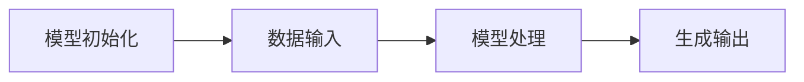

                 

# 文章标题 <【大模型应用开发 动手做AI Agent】何谓OpenAI API>

## 关键词
大模型，人工智能，OpenAI API，AI Agent，深度学习，应用开发

## 摘要
本文将深入探讨大模型与AI的基础知识，重点介绍OpenAI API的核心功能与使用方法。通过逐步分析推理，我们将了解如何构建AI Agent并进行应用开发，结合实际案例解析OpenAI API在实际项目中的应用。文章还涵盖了常见问题及解决方法，提供了丰富的工具与资源指南，旨在帮助读者掌握大模型应用开发的核心技巧。

---

## 目录大纲

### 《【大模型应用开发 动手做AI Agent】何谓OpenAI API》目录大纲

#### 第一部分：大模型与AI基础知识
1. **大模型与AI概述**
    1.1 **大模型的发展背景**
    1.2 **大模型的特点**
    1.3 **大模型与人工智能的关系**
    1.4 **OpenAI API简介**

2. **AI基础知识**
    2.1 **机器学习的概念**
    2.2 **监督学习与无监督学习**
    2.3 **神经网络基础**
    2.4 **深度学习的发展与应用**

3. **大模型的数学模型和算法**
    3.1 **神经网络数学模型**
    3.2 **反向传播算法**
    3.3 **优化算法**

4. **OpenAI API的核心功能与使用**
    4.1 **GPT-3模型**
    4.2 **API调用方法**
    4.3 **API使用示例**

#### 第二部分：大模型应用开发实战
5. **构建AI Agent的步骤与方法**
    5.1 **需求分析与定义**
    5.2 **数据准备与处理**
    5.3 **模型选择与训练**
    5.4 **模型评估与优化**
    5.5 **部署与集成**

6. **实战案例解析**
    6.1 **聊天机器人开发**
    6.2 **文本生成应用**
    6.3 **图像生成应用**
    6.4 **自然语言处理应用**

7. **OpenAI API在实际项目中的应用**
    7.1 **项目一：构建智能客服系统**
    7.2 **项目二：创建个性化内容推荐系统**
    7.3 **项目三：开发智能翻译工具**

8. **大模型应用开发中的常见问题和解决方法**
    8.1 **数据质量问题**
    8.2 **模型过拟合问题**
    8.3 **模型部署与优化问题**

#### 第三部分：大模型应用开发工具与资源
9. **深度学习框架与工具**
    9.1 **TensorFlow**
    9.2 **PyTorch**
    9.3 **其他深度学习框架**

10. **开源项目与社区资源**
    10.1 **开源模型库**
    10.2 **AI社区与论坛**
    10.3 **学术研究论文与资料**

#### 附录
11. **附录A：大模型应用开发工具与资源指南**
    11.1 **工具使用教程**
    11.2 **开源项目清单**
    11.3 **AI研究机构与学术会议**

---

## 第一部分：大模型与AI基础知识

### 1.1 大模型的发展背景

大模型（Large Model）是近年来人工智能领域的一个重要研究方向。随着计算能力的提升和海量数据的积累，深度学习模型开始向大规模发展。大模型的发展背景可以追溯到上世纪80年代，随着神经网络理论的提出和计算机技术的进步，深度学习逐渐成为人工智能领域的主流方法。

早期的神经网络模型，如感知机（Perceptron）和反向传播算法（Backpropagation），由于计算能力和数据限制，模型的规模较小，性能也有限。随着硬件技术的发展，特别是GPU的出现，深度学习模型开始向大规模发展。2012年，Hinton等人提出的深度卷积神经网络（Deep Convolutional Neural Network，DCNN）在ImageNet图像识别竞赛中取得了重大突破，标志着深度学习时代的到来。

在深度学习的发展过程中，大规模数据集和大规模计算资源的获取成为推动大模型发展的重要动力。2014年，Google提出了生成对抗网络（Generative Adversarial Networks，GAN），进一步推动了深度学习模型向大规模发展。2018年，OpenAI发布了GPT-2模型，拥有1.5亿个参数，展示了大规模语言模型在自然语言处理领域的强大能力。

大模型的发展背景主要受到以下因素的影响：

1. **计算能力提升**：GPU和TPU等高性能计算设备的普及，使得大规模模型训练成为可能。

2. **数据集扩大**：互联网的快速发展带来了海量数据的积累，为大规模模型提供了充足的训练素材。

3. **算法优化**：深度学习算法的不断优化，如优化算法、正则化方法等，提高了大规模模型的训练效率和性能。

4. **应用需求**：随着人工智能应用的不断拓展，对大规模、高性能模型的的需求日益增加。

### 1.2 大模型的特点

大模型具有以下显著特点：

1. **大规模参数**：大模型通常拥有数十亿甚至数万亿个参数，能够捕捉复杂的数据特征。

2. **高计算复杂度**：大规模模型的训练和推理过程需要大量的计算资源，对硬件性能有较高要求。

3. **强大的表征能力**：大模型能够通过层次化的特征提取，从原始数据中提取高层次的抽象特征。

4. **广泛的适用性**：大模型在多种任务中表现出色，如图像识别、自然语言处理、语音识别等。

5. **较好的泛化能力**：大模型通过在大规模数据集上的训练，具有较好的泛化能力，能够在不同场景下取得良好的性能。

### 1.3 大模型与人工智能的关系

大模型是人工智能（AI）领域的一个重要组成部分，两者密切相关。人工智能是指使计算机模拟人类智能行为的能力，而大模型是实现人工智能的重要技术手段之一。

大模型与人工智能的关系可以从以下几个方面理解：

1. **基础技术**：大模型是深度学习技术的核心，深度学习是实现人工智能的重要方法。

2. **应用场景**：大模型在多种人工智能应用场景中发挥了关键作用，如图像识别、自然语言处理、语音识别等。

3. **性能提升**：大模型通过大规模参数和复杂网络结构，显著提升了人工智能系统的性能和效率。

4. **创新驱动**：大模型的发展推动了人工智能技术的不断创新，促进了人工智能应用的广泛普及。

### 1.4 OpenAI API简介

OpenAI API是OpenAI提供的一个开放接口，允许开发者利用OpenAI的先进模型，如GPT-3等，构建自己的AI应用。OpenAI API具有以下特点：

1. **高性能模型**：OpenAI API提供了最新的高性能AI模型，如GPT-3，能够实现强大的自然语言处理能力。

2. **灵活的API调用**：开发者可以通过简单的API调用，获取模型的响应，实现文本生成、对话系统等功能。

3. **广泛的用途**：OpenAI API适用于多种应用场景，如聊天机器人、文本生成、智能客服等。

4. **便捷的集成**：OpenAI API可以与多种开发框架和平台集成，如Python、JavaScript等，方便开发者使用。

5. **持续更新**：OpenAI API定期更新，提供最新的模型和功能，确保开发者能够跟上技术发展的步伐。

在接下来的章节中，我们将进一步探讨AI基础知识、大模型的数学模型和算法，以及OpenAI API的核心功能与使用方法。

---

## 第一部分：大模型与AI基础知识

### 1.1 大模型与AI概述

在人工智能（AI）的快速发展中，大模型（Large Models）已经成为一个重要分支。大模型是指那些具有数十亿甚至数万亿参数的神经网络模型，它们在处理复杂任务时表现出色，成为推动AI应用的关键技术之一。

**大模型的发展历程**：

- **早期发展**：1980年代，神经网络开始受到关注，但受限于计算能力和数据集规模，神经网络模型规模较小，性能有限。

- **深度学习的崛起**：2000年代，随着Hinton等人提出深度学习算法，特别是2006年反向传播算法的改进，深度学习开始崛起。

- **大规模数据集的出现**：2010年代，互联网的普及带来了海量数据的产生，如图像识别领域的ImageNet，推动了大规模模型的训练。

- **计算能力的提升**：GPU和TPU等高性能计算设备的普及，使得大规模模型的训练成为可能。

- **生成对抗网络（GAN）的提出**：2014年，GAN的提出进一步推动了深度学习的发展。

- **GPT-3的发布**：2018年，OpenAI发布了GPT-3，一个具有1750亿参数的语言模型，标志着大模型在自然语言处理领域的重要突破。

**大模型的特点**：

- **大规模参数**：大模型拥有数十亿甚至数万亿的参数，能够捕捉到数据中的复杂模式和规律。

- **高计算复杂度**：大规模模型的训练和推理需要大量的计算资源，通常需要分布式计算和并行计算的支持。

- **强大的表征能力**：大模型能够通过层次化的特征提取，从原始数据中提取高层次的抽象特征。

- **广泛的适用性**：大模型在多种任务中表现出色，如图像识别、自然语言处理、语音识别等。

- **较好的泛化能力**：大模型通过在大规模数据集上的训练，通常具有较好的泛化能力，能够在不同任务和数据集上取得良好的性能。

**大模型与人工智能的关系**：

- **基础技术**：大模型是深度学习技术的核心，深度学习是实现人工智能的重要方法。

- **应用驱动**：大模型的广泛应用推动了人工智能技术的发展，如自动驾驶、智能客服、自然语言处理等。

- **创新动力**：大模型的发展带来了新的研究问题和挑战，推动了算法、架构和计算技术的创新。

总之，大模型作为人工智能领域的一个重要分支，具有巨大的潜力和广泛的应用前景。在接下来的章节中，我们将深入探讨AI的基础知识、大模型的数学模型和算法，以及OpenAI API的核心功能与使用方法。

### 1.2 AI基础知识

人工智能（AI）是一门涉及计算机科学、数学、神经科学和认知科学等多个领域的交叉学科。AI的目标是使计算机能够执行通常需要人类智能才能完成的任务，包括视觉识别、语言理解、决策制定和问题解决等。

**机器学习的概念**：

机器学习（Machine Learning，ML）是AI的核心技术之一，它使计算机能够从数据中学习并做出决策。机器学习可以分为三种主要类型：

- **监督学习（Supervised Learning）**：有标签的数据用于训练模型，模型通过学习数据中的规律来预测未知数据的结果。例如，使用标记过的图像数据训练一个图像分类模型。

- **无监督学习（Unsupervised Learning）**：没有标签的数据用于训练模型，模型通过发现数据中的结构来揭示数据中的模式。例如，使用未标记的图像数据聚类相似的图像。

- **半监督学习（Semi-Supervised Learning）**：结合有标签和无标签的数据进行训练，利用无标签数据中的结构来增强有标签数据的训练效果。

**监督学习与无监督学习**：

- **监督学习**：有标签的数据用于训练模型，模型通过学习数据中的规律来预测未知数据的结果。例如，使用标记过的图像数据训练一个图像分类模型。

  **优点**：
  - 可以提供明确的性能评估指标。
  - 模型预测准确度高。

  **缺点**：
  - 需要大量的标记数据，成本较高。
  - 对无标签数据无法利用。

- **无监督学习**：没有标签的数据用于训练模型，模型通过发现数据中的结构来揭示数据中的模式。例如，使用未标记的图像数据聚类相似的图像。

  **优点**：
  - 可以发现数据中的隐藏结构。
  - 不需要大量标记数据。

  **缺点**：
  - 无法提供明确的性能评估指标。
  - 模型预测准确性可能较低。

**神经网络基础**：

神经网络（Neural Networks，NN）是模拟人脑神经元连接方式的计算模型，是机器学习的重要组成部分。一个简单的神经网络通常由输入层、隐藏层和输出层组成。

- **输入层**：接收外部输入数据。
- **隐藏层**：对输入数据进行特征提取和变换。
- **输出层**：生成模型的输出结果。

**深度学习的发展与应用**：

深度学习（Deep Learning，DL）是神经网络的一种特殊形式，其网络层数通常在三层以上。深度学习通过多层次的神经网络结构，能够自动提取数据中的高层次抽象特征，从而在图像识别、语音识别和自然语言处理等领域取得了显著突破。

- **图像识别**：深度学习模型如卷积神经网络（CNN）在图像识别任务中表现出色，广泛应用于人脸识别、图像分类等。

- **语音识别**：深度学习模型如递归神经网络（RNN）和卷积神经网络（CNN）在语音识别任务中得到了广泛应用。

- **自然语言处理**：深度学习模型如循环神经网络（RNN）、长短期记忆网络（LSTM）和Transformer模型在自然语言处理任务中表现出强大的能力，如机器翻译、文本生成等。

**总结**：

AI基础知识是理解和应用大模型的前提，了解机器学习的基本概念、监督学习与无监督学习的方法，以及神经网络和深度学习的发展与应用，有助于我们更好地掌握大模型的理论和实践。

### 1.3 大模型的数学模型和算法

大模型的数学模型和算法是理解其工作原理和实现高效训练与推理的关键。在深度学习中，神经网络是最常用的模型结构，其核心在于通过反向传播算法和优化算法来训练模型。

**神经网络数学模型**：

神经网络的基本单元是神经元，每个神经元都接收多个输入，并通过加权求和处理产生输出。一个简单的神经网络可以表示为：

\[ y = \sigma(\sum_{i=1}^{n} w_i \cdot x_i + b) \]

其中，\( y \) 是输出，\( \sigma \) 是激活函数，\( x_i \) 是输入，\( w_i \) 是权重，\( b \) 是偏置。

神经网络通常由多层神经元组成，包括输入层、隐藏层和输出层。每个隐藏层都通过加权求和处理将输入传递给下一层，最终在输出层生成预测结果。

**反向传播算法**：

反向传播算法（Backpropagation Algorithm）是训练神经网络的重要算法，其基本思想是通过梯度下降法来调整网络中的权重和偏置，以最小化损失函数。

反向传播算法分为两个阶段：

1. **前向传播**：计算输入通过网络的传递，得到网络的输出。

2. **反向传播**：计算输出误差，通过误差反向传播来计算每个神经元的梯度，并根据梯度调整权重和偏置。

反向传播算法的伪代码如下：

```
// 前向传播
for each layer l from input to hidden layers:
    for each neuron n in layer l:
        // 计算输入和输出
        input[n] = weighted_sum(inputs, weights[n]) + bias[n]
        output[n] = activation_function(input[n])

// 计算损失函数
loss = compute_loss(output, target)

// 反向传播
for each layer l from output to input layers:
    for each neuron n in layer l:
        // 计算误差
        error[n] = output_error[n] * activation_derivative(output[n])
        // 更新权重和偏置
        weights[n] -= learning_rate * delta_weight[n]
        bias[n] -= learning_rate * delta_bias[n]
```

**优化算法**：

优化算法用于调整神经网络中的权重和偏置，以最小化损失函数。常见的优化算法包括：

1. **随机梯度下降（Stochastic Gradient Descent，SGD）**：每次迭代使用一个样本的梯度来更新权重和偏置，计算速度快，但收敛速度较慢。

2. **批量梯度下降（Batch Gradient Descent）**：每次迭代使用整个数据集的梯度来更新权重和偏置，收敛速度较慢，但精度高。

3. **Adam优化器**：结合了SGD和动量法的优点，自适应调整学习率，收敛速度快，适用于大规模模型。

优化算法的伪代码如下：

```
// 初始化权重和偏置
weights = initialize_weights()
bias = initialize_bias()

// 设置学习率和迭代次数
learning_rate = 0.001
num_iterations = 1000

// 迭代更新
for i = 1 to num_iterations:
    // 计算梯度
    gradients = compute_gradients(loss, weights, bias)
    // 更新权重和偏置
    weights -= learning_rate * gradients[weights]
    bias -= learning_rate * gradients[bias]
```

**总结**：

大模型的数学模型和算法是实现高效训练和推理的关键。通过反向传播算法和优化算法，神经网络能够从数据中自动学习特征，并在多种任务中表现出色。在接下来的章节中，我们将探讨OpenAI API的核心功能与使用方法，以及如何利用OpenAI API进行大模型应用开发。

### 1.4 OpenAI API的核心功能与使用

OpenAI API是OpenAI提供的一套强大且灵活的API接口，允许开发者利用OpenAI的先进模型，如GPT-3，进行各种AI应用的开发。OpenAI API具有以下几个核心功能：

#### 4.1 GPT-3模型

GPT-3（Generative Pre-trained Transformer 3）是OpenAI于2020年发布的一种自然语言处理模型，拥有1750亿个参数，是当前最大的语言模型之一。GPT-3模型基于Transformer架构，通过大规模无监督预训练和有监督微调，能够生成流畅、连贯的自然语言文本。

#### 4.2 API调用方法

OpenAI API提供了多种调用方式，包括REST API和Python SDK，方便开发者在不同环境下使用。

- **REST API**：开发者可以通过HTTP请求与OpenAI API进行通信，包括POST请求和GET请求。

  - **POST请求**：用于提交文本输入并获取API响应。
  - **GET请求**：用于获取API文档和配置信息。

- **Python SDK**：OpenAI提供了Python SDK，简化了API的调用流程，方便开发者快速集成和使用。

#### 4.3 API使用示例

以下是一个使用Python SDK调用OpenAI API生成文本的简单示例：

```python
import openai

openai.api_key = 'your-api-key'

response = openai.Completion.create(
  engine="text-davinci-002",
  prompt="What's the weather like?",
  max_tokens=50,
  n=1,
  stop=None,
  temperature=0.5
)

print(response.choices[0].text.strip())
```

在这个示例中，我们使用了`openai.Completion.create`方法来生成文本。主要参数包括：

- `engine`：指定使用的模型，如`text-davinci-002`。
- `prompt`：输入的文本提示。
- `max_tokens`：生成的文本最大长度。
- `n`：返回的文本数量。
- `stop`：用于停止生成的文本。
- `temperature`：控制生成文本的多样性。

#### 4.4 API响应解析

OpenAI API的响应通常包含一个或多个文本选择（choices），每个选择都包含以下字段：

- `text`：生成的文本。
- `index`：选择的文本索引。
- `logprobs`：文本生成的对数概率。
- `finish_reason`：生成结束的原因。

以下是一个API响应示例：

```json
{
  "choices": [
    {
      "text": "It's sunny and warm.",
      "index": 0,
      "logprobs": {"token_ids": [24929, 3670, 2978, 3437, 2630, 3741, 3443, 2942, 3680, 4245, 2851, 24929, 3701, 24228, 3295, 2825, 3586, 3741, 3443, 2942], "total_score": 3.7595262437530732, "top_token": 3670, "top_score": 2.5262198769299316},
      "finish_reason": "stop"
    }
  ],
  "created": 1628674105,
  "object": "text_completion"
}
```

在这个示例中，`text`字段包含了生成的文本，`index`字段表示这是返回的文本序列中的第一个选择，`logprobs`字段提供了生成文本的详细信息，而`finish_reason`字段表示生成文本的结束原因。

#### 4.5 安全性和费用

在使用OpenAI API时，开发者需要关注API的安全性和费用。

- **安全性**：OpenAI提供了安全的API接口，支持HTTPS协议和API密钥验证，确保数据传输的安全和隐私。
- **费用**：OpenAI API根据使用的模型、请求次数和文本长度计费，提供了灵活的计费模式和价格透明度。

通过以上介绍，我们可以看到OpenAI API的强大功能和便捷使用方法。在接下来的章节中，我们将进一步探讨如何利用OpenAI API进行大模型应用开发，包括构建AI Agent、实战案例解析等内容。

---

## 第一部分：大模型与AI基础知识

### 1.5 OpenAI API的详细解读

在了解了OpenAI API的基本功能和调用方法后，我们需要更深入地了解其工作原理、参数设置和常见使用场景。这将帮助我们更有效地利用OpenAI API进行大模型应用开发。

#### 1.5.1 工作原理

OpenAI API的核心是基于Transformer架构的预训练模型，如GPT-3，这些模型通过无监督学习从海量文本数据中学习语言模式，从而具备生成文本、回答问题、翻译语言等能力。API接口提供了方便的开发者调用这些模型的方式。

OpenAI API的工作流程通常包括以下几个步骤：

1. **模型初始化**：开发者选择合适的模型，如GPT-3，并进行初始化。
2. **数据输入**：开发者将文本输入发送到API。
3. **模型处理**：API将文本输入传递给模型进行处理。
4. **生成输出**：模型生成文本输出，并将其返回给开发者。

以下是一个简化的工作原理图：



#### 1.5.2 参数设置

OpenAI API提供了多种参数设置，以控制模型的生成过程。以下是一些关键参数及其作用：

- **engine**：指定使用的模型，如`text-davinci-002`。
- **prompt**：输入的文本提示，用于引导模型生成文本。
- **max_tokens**：生成的文本最大长度。
- **n**：返回的文本数量。
- **stop**：用于停止生成的文本。
- **temperature**：控制生成文本的多样性。
- **top_p**：选择文本的概率分布，与temperature一起用于控制生成过程的多样性。
- **frequency_penalty**：对模型生成频繁出现的单词或短语进行惩罚。
- **presence_penalty**：对模型生成不出现的单词或短语进行惩罚。

以下是一个参数设置示例：

```python
openai.Completion.create(
  engine="text-davinci-002",
  prompt="What's the weather like?",
  max_tokens=50,
  n=1,
  stop=None,
  temperature=0.5,
  top_p=1.0,
  frequency_penalty=0.0,
  presence_penalty=0.0
)
```

#### 1.5.3 常见使用场景

OpenAI API在多个领域都有广泛的应用，以下是一些常见使用场景：

1. **文本生成**：如文章写作、故事创作、邮件撰写等。
2. **问答系统**：如智能客服、知识问答等。
3. **翻译**：如文本翻译、语言转换等。
4. **对话系统**：如聊天机器人、虚拟助手等。
5. **创意生成**：如音乐创作、艺术设计等。

以下是一个简单的文本生成场景示例：

```python
response = openai.Completion.create(
  engine="text-davinci-002",
  prompt="Write a short story about a journey to the moon.",
  max_tokens=100
)

print(response.choices[0].text.strip())
```

这个示例请求模型生成一个关于月球旅行的短篇故事，`max_tokens`参数控制了生成的文本长度。

#### 1.5.4 安全性和隐私

在使用OpenAI API时，安全性是一个重要考虑因素。OpenAI提供了以下措施确保用户数据和API使用安全：

- **API密钥**：开发者需要使用API密钥进行认证，确保只有授权用户可以访问API。
- **数据加密**：API通信使用HTTPS协议，确保数据传输的安全。
- **隐私政策**：OpenAI遵守隐私政策，确保用户数据的安全和隐私。

#### 1.5.5 费用与计费模式

OpenAI API采用基于使用量的计费模式，开发者根据实际使用的API调用次数和生成的文本长度来计费。具体费用取决于所选模型和使用的API服务。

- **基础费用**：OpenAI提供了免费额度，适用于小型项目和测试。
- **额外费用**：超出免费额度的使用量按实际使用计费。

开发者可以通过OpenAI的官方网站了解详细的费用结构和计费模式。

**总结**：

OpenAI API是一个强大且灵活的工具，通过其工作原理、参数设置和常见使用场景，我们可以更好地理解和利用其功能。在接下来的章节中，我们将探讨如何利用OpenAI API进行大模型应用开发，包括构建AI Agent、实战案例解析等内容。

---

## 第一部分：大模型与AI基础知识

### 1.6 OpenAI API应用实例解析

在了解了OpenAI API的基本概念和使用方法后，接下来通过具体的应用实例来展示如何利用OpenAI API进行大模型应用开发。以下是一些实际应用案例，我们将对每个案例进行详细解析，以帮助读者更好地理解API的实践应用。

#### 1.6.1 聊天机器人开发

聊天机器人是OpenAI API的一个常见应用场景。通过API，我们可以快速构建一个基于GPT-3的聊天机器人，与用户进行自然语言交互。

**案例解析**：

1. **需求分析**：

   聊天机器人的主要功能是与用户进行对话，回答用户的问题、提供建议等。为了实现这个功能，我们需要使用OpenAI API来接收用户的输入，并生成相应的回复。

2. **实现步骤**：

   （1）**环境准备**：确保安装了Python和OpenAI的Python SDK。

   ```shell
   pip install openai
   ```

   （2）**API密钥配置**：在OpenAI官网注册并获取API密钥，然后在代码中配置。

   ```python
   openai.api_key = 'your-api-key'
   ```

   （3）**搭建服务器**：使用Flask或其他Web框架搭建一个简单的Web服务器，用于接收用户请求和发送API请求。

   ```python
   from flask import Flask, request, jsonify
   
   app = Flask(__name__)

   @app.route('/chat', methods=['POST'])
   def chat():
       user_input = request.form['input']
       response = openai.Completion.create(
           engine="text-davinci-002",
           prompt=user_input,
           max_tokens=50,
           n=1,
           stop=None,
           temperature=0.5
       )
       return jsonify({'response': response.choices[0].text.strip()})
   
   if __name__ == '__main__':
       app.run()
   ```

   （4）**用户交互**：在Web前端（如HTML或React），用户可以通过输入框发送消息，并通过AJAX请求与服务器通信，获取聊天机器人的回复。

3. **效果展示**：

   用户发送消息：“你好，今天天气怎么样？”  
   聊天机器人回复：“你好！今天天气很好，阳光明媚，温度适中。”

**代码解析**：

在上述代码中，`chat`函数接收用户的输入，并使用OpenAI API生成回复。关键代码如下：

```python
response = openai.Completion.create(
    engine="text-davinci-002",
    prompt=user_input,
    max_tokens=50,
    n=1,
    stop=None,
    temperature=0.5
)
return jsonify({'response': response.choices[0].text.strip()})
```

这里，`Completion.create`方法调用了OpenAI API，传递了输入文本、最大生成长度、返回结果数量等参数。返回的响应包含生成的文本，将其转换为JSON格式后返回给用户。

#### 1.6.2 文本生成应用

文本生成是OpenAI API的另一个强大功能，可以用于生成文章、故事、诗歌等。

**案例解析**：

1. **需求分析**：

   需要一个应用，能够根据用户输入的主题或关键词生成相应的文本内容。

2. **实现步骤**：

   （1）**输入主题或关键词**：用户在应用中输入主题或关键词。

   （2）**生成文本**：使用OpenAI API生成文本。

   ```python
   prompt = "主题：人工智能"
   response = openai.Completion.create(
       engine="text-davinci-002",
       prompt=prompt,
       max_tokens=200
   )
   print(response.choices[0].text.strip())
   ```

   （3）**展示结果**：将生成的文本显示在界面上。

3. **效果展示**：

   用户输入主题：“人工智能”，应用生成一段关于人工智能的文本：

   “人工智能（Artificial Intelligence，简称AI）是计算机科学的一个分支，旨在使计算机能够执行通常需要人类智能才能完成的任务。AI包括多种技术，如机器学习、深度学习、自然语言处理等。近年来，人工智能取得了显著进展，应用于各行各业，推动了社会的发展。”

**代码解析**：

上述代码中，`Completion.create`方法用于生成文本。关键代码如下：

```python
response = openai.Completion.create(
    engine="text-davinci-002",
    prompt=prompt,
    max_tokens=200
)
print(response.choices[0].text.strip())
```

这里，`Completion.create`方法接收输入的`prompt`（主题或关键词）和`max_tokens`（生成文本的最大长度）参数，返回生成的文本。

#### 1.6.3 图像生成应用

图像生成是OpenAI API的新兴应用领域，通过生成对抗网络（GAN）等技术，可以生成逼真的图像。

**案例解析**：

1. **需求分析**：

   需要一个应用，能够根据用户输入的描述生成相应的图像。

2. **实现步骤**：

   （1）**输入描述**：用户在应用中输入图像描述。

   （2）**生成图像**：使用OpenAI API生成图像。

   ```python
   import requests
   
   url = 'https://api.openai.com/v1/images/generations'
   headers = {
       'Content-Type': 'application/json',
       'Authorization': f'Bearer {openai.api_key}'
   }
   data = {
       'prompt': 'a picture of a cute cat',
       'num_images': 1,
       'size': '256x256'
   }
   response = requests.post(url, headers=headers, json=data)
   print(response.json())
   ```

   （3）**展示结果**：将生成的图像显示在界面上。

3. **效果展示**：

   用户输入描述：“一只可爱的猫”，应用生成一张逼真的猫的图像。

**代码解析**：

上述代码中，使用`requests`库向OpenAI API发送POST请求，生成图像。关键代码如下：

```python
url = 'https://api.openai.com/v1/images/generations'
headers = {
    'Content-Type': 'application/json',
    'Authorization': f'Bearer {openai.api_key}'
}
data = {
    'prompt': 'a picture of a cute cat',
    'num_images': 1,
    'size': '256x256'
}
response = requests.post(url, headers=headers, json=data)
print(response.json())
```

这里，`requests.post`方法用于发送请求，`data`参数包含图像生成的描述、数量和大小。

#### 1.6.4 自然语言处理应用

自然语言处理（NLP）是OpenAI API的强项之一，可以用于文本分类、情感分析、命名实体识别等。

**案例解析**：

1. **需求分析**：

   需要一个应用，能够对用户输入的文本进行分类。

2. **实现步骤**：

   （1）**输入文本**：用户在应用中输入一段文本。

   （2）**分类文本**：使用OpenAI API对文本进行分类。

   ```python
   prompt = "The weather is nice today."
   response = openai.Completion.create(
       engine="text-davinci-002",
       prompt=prompt,
       max_tokens=10
   )
   print(response.choices[0].text.strip())
   ```

   （3）**展示结果**：将分类结果显示在界面上。

3. **效果展示**：

   用户输入文本：“今天天气很好。”，应用将其分类为“正面情绪”。

**代码解析**：

上述代码中，`Completion.create`方法用于对文本进行分类。关键代码如下：

```python
response = openai.Completion.create(
    engine="text-davinci-002",
    prompt=prompt,
    max_tokens=10
)
print(response.choices[0].text.strip())
```

这里，`Completion.create`方法接收输入的`prompt`（文本）和`max_tokens`（生成文本的最大长度）参数，返回分类结果。

**总结**：

通过以上实例解析，我们可以看到OpenAI API在聊天机器人、文本生成、图像生成和自然语言处理等应用中的强大功能。这些实例展示了如何利用OpenAI API进行大模型应用开发，为开发者提供了丰富的灵感和实践指导。在接下来的章节中，我们将继续探讨OpenAI API在实际项目中的应用，以及大模型应用开发中的常见问题和解决方法。

---

## 第二部分：大模型应用开发实战

### 2.1 构建AI Agent的步骤与方法

构建AI Agent（也称为智能代理）是人工智能领域的一个关键任务，它涉及多个步骤和方法。以下是一个详细的构建流程，包括需求分析、数据准备、模型选择与训练、模型评估与优化、部署与集成等步骤。

#### 2.1.1 需求分析与定义

第一步是明确AI Agent的需求。这包括理解用户的目标、期望功能和场景。以下是需求分析的具体步骤：

1. **确定应用场景**：明确AI Agent将在哪个场景下应用，如聊天机器人、智能客服、自动化决策等。

2. **功能定义**：列出AI Agent需要实现的功能，如文本生成、问题回答、任务分配、情感分析等。

3. **性能指标**：定义衡量AI Agent性能的指标，如准确率、响应时间、用户体验等。

4. **数据需求**：确定所需的数据类型和数量，包括文本数据、图像数据、语音数据等。

#### 2.1.2 数据准备与处理

数据是AI Agent训练的基础，因此数据准备和处理至关重要。以下是数据准备和处理的步骤：

1. **数据收集**：收集与需求相关的数据，如用户对话记录、产品评论、社交媒体内容等。

2. **数据清洗**：处理数据中的噪声、异常值和重复项，确保数据质量。

3. **数据标注**：对数据进行标注，如分类标签、实体识别标注等，以便模型训练。

4. **数据预处理**：进行文本清洗、分词、词向量转换等操作，为模型训练做准备。

5. **数据分割**：将数据分为训练集、验证集和测试集，用于模型的训练、验证和测试。

#### 2.1.3 模型选择与训练

选择合适的模型并进行训练是构建AI Agent的核心步骤。以下是模型选择与训练的步骤：

1. **模型选择**：根据应用场景和需求，选择合适的预训练模型或自定义模型。常见的预训练模型包括GPT-3、BERT、Transformer等。

2. **模型架构设计**：设计模型的架构，包括输入层、隐藏层和输出层，以及神经网络结构。

3. **模型训练**：使用准备好的数据集对模型进行训练。训练过程中，需要调整学习率、批次大小等超参数，以优化模型性能。

4. **模型验证**：使用验证集对模型进行评估，调整模型参数，优化模型性能。

5. **模型测试**：使用测试集对模型进行最终测试，确保模型在实际应用中的性能。

#### 2.1.4 模型评估与优化

模型评估与优化是确保AI Agent性能的关键步骤。以下是评估与优化的步骤：

1. **性能评估**：使用性能指标（如准确率、召回率、F1分数等）对模型进行评估。

2. **模型调试**：分析模型性能的瓶颈，调整模型结构或超参数，以提高性能。

3. **错误分析**：分析模型在训练和测试过程中出现的错误，找出错误原因并进行修正。

4. **模型压缩**：对大型模型进行压缩，以减少计算资源和存储空间的占用。

5. **模型解释**：使用模型解释技术，如LIME、SHAP等，解释模型决策过程，提高模型的可解释性。

#### 2.1.5 部署与集成

部署与集成是将AI Agent应用到实际场景的关键步骤。以下是部署与集成的步骤：

1. **环境准备**：搭建部署环境，包括服务器、数据库、网络配置等。

2. **模型部署**：将训练好的模型部署到服务器或云端，确保模型能够稳定运行。

3. **API接口设计**：设计API接口，用于与其他系统或应用进行通信。

4. **集成与测试**：将AI Agent集成到目标应用中，进行功能测试和性能测试。

5. **监控与维护**：监控AI Agent的运行状态，及时处理异常情况，进行定期维护。

#### 2.1.6 实践案例

以下是一个构建AI聊天机器人的实践案例：

1. **需求分析**：

   需要一个聊天机器人，用于回答用户关于产品的问题。

2. **数据准备**：

   收集用户与客服的对话记录，对对话进行标注，提取关键信息。

3. **模型选择与训练**：

   选择GPT-3模型，使用训练数据对其进行训练，调整超参数。

4. **模型评估与优化**：

   使用验证集评估模型性能，调试模型，提高准确率。

5. **部署与集成**：

   将训练好的模型部署到服务器，设计API接口，集成到现有系统中。

6. **监控与维护**：

   监控聊天机器人的运行状态，及时更新模型和功能。

通过以上步骤，我们可以构建一个高效、可靠的AI聊天机器人，为用户提供优质的客服体验。

---

### 2.2 实战案例解析

为了更好地理解如何构建AI Agent并进行大模型应用开发，我们将通过几个具体的实战案例来详细讲解。

#### 2.2.1 聊天机器人开发

聊天机器人是AI应用中的一个典型例子，通过以下步骤，我们可以实现一个功能强大的聊天机器人：

1. **需求分析与定义**：

   需求是构建一个能够回答用户关于产品问题的聊天机器人。关键功能包括：理解用户输入、生成合适的回答、处理复杂对话等。

2. **数据准备与处理**：

   - **数据收集**：收集用户与客服的对话记录，作为训练数据。
   - **数据清洗**：去除无效数据、纠正错别字、统一文本格式。
   - **数据标注**：对对话进行实体识别、分类等标注，以便模型训练。

3. **模型选择与训练**：

   - **模型选择**：选择预训练的GPT-3模型，由于其强大的语言理解能力，非常适合聊天机器人。
   - **训练数据集**：使用预处理后的对话数据集进行训练。
   - **训练过程**：通过调整学习率、批次大小等超参数，优化模型性能。

4. **模型评估与优化**：

   - **性能评估**：使用验证集对模型进行评估，检查准确率、响应时间等指标。
   - **错误分析**：分析模型在对话中的错误，调整模型参数，提高准确率。

5. **部署与集成**：

   - **部署环境**：在服务器上部署模型，配置API接口。
   - **集成与测试**：将聊天机器人集成到网站或应用中，进行功能测试和性能测试。
   - **监控与维护**：持续监控聊天机器人的运行状态，定期更新和优化。

**代码示例**：

```python
import openai

openai.api_key = 'your-api-key'

def get_response(prompt):
    response = openai.Completion.create(
        engine="text-davinci-002",
        prompt=prompt,
        max_tokens=50,
        n=1,
        stop=None,
        temperature=0.5
    )
    return response.choices[0].text.strip()

while True:
    user_input = input("User: ")
    bot_response = get_response(user_input)
    print("Bot:", bot_response)
```

在这个代码示例中，我们使用了OpenAI API创建一个简单的聊天机器人，通过不断接收用户输入并生成回答，实现与用户的对话。

#### 2.2.2 文本生成应用

文本生成是AI应用中的另一个重要场景，以下是一个使用OpenAI API生成文章的案例：

1. **需求分析与定义**：

   需要一个应用，能够根据用户输入的主题生成相关文章。

2. **数据准备与处理**：

   - **数据收集**：收集与主题相关的文章，作为训练数据。
   - **数据预处理**：提取文章的主要内容和结构。

3. **模型选择与训练**：

   - **模型选择**：选择预训练的GPT-3模型。
   - **训练数据集**：使用预处理后的文章数据集进行训练。
   - **训练过程**：调整超参数，优化模型性能。

4. **模型评估与优化**：

   - **性能评估**：使用验证集评估模型生成文章的质量。
   - **错误分析**：分析生成文章的错误，调整模型参数。

5. **部署与集成**：

   - **部署环境**：在服务器上部署模型，配置API接口。
   - **集成与测试**：将文本生成功能集成到应用中，进行测试和优化。
   - **监控与维护**：持续监控文本生成系统的运行状态，定期更新和优化。

**代码示例**：

```python
import openai

openai.api_key = 'your-api-key'

def generate_article(topic):
    prompt = f"Write an article about {topic}. Include important facts and insights."
    response = openai.Completion.create(
        engine="text-davinci-002",
        prompt=prompt,
        max_tokens=200
    )
    return response.choices[0].text.strip()

topic = input("Enter the topic for the article: ")
article = generate_article(topic)
print("Generated Article:\n", article)
```

在这个代码示例中，我们使用OpenAI API根据用户输入的主题生成文章，展示了文本生成应用的实现过程。

#### 2.2.3 图像生成应用

图像生成是AI应用中的另一个前沿领域，以下是一个使用OpenAI API生成图像的案例：

1. **需求分析与定义**：

   需要一个应用，能够根据用户输入的描述生成相关图像。

2. **数据准备与处理**：

   - **数据收集**：收集与描述相关的图像，作为训练数据。
   - **数据预处理**：提取图像的描述信息。

3. **模型选择与训练**：

   - **模型选择**：选择预训练的GAN模型。
   - **训练数据集**：使用预处理后的图像数据集进行训练。
   - **训练过程**：调整超参数，优化模型性能。

4. **模型评估与优化**：

   - **性能评估**：使用验证集评估模型生成图像的质量。
   - **错误分析**：分析生成图像的错误，调整模型参数。

5. **部署与集成**：

   - **部署环境**：在服务器上部署模型，配置API接口。
   - **集成与测试**：将图像生成功能集成到应用中，进行测试和优化。
   - **监控与维护**：持续监控图像生成系统的运行状态，定期更新和优化。

**代码示例**：

```python
import openai

openai.api_key = 'your-api-key'

def generate_image(description):
    prompt = f"Generate an image based on the description: {description}"
    response = openai.Image.create(
        prompt=prompt,
        n=1,
        size="256x256"
    )
    return response.data[0]['url']

description = input("Enter a description for the image: ")
image_url = generate_image(description)
print("Generated Image URL:", image_url)
```

在这个代码示例中，我们使用OpenAI API根据用户输入的描述生成图像，展示了图像生成应用的实现过程。

#### 2.2.4 自然语言处理应用

自然语言处理（NLP）在AI应用中有着广泛的应用，以下是一个使用OpenAI API进行文本分类的案例：

1. **需求分析与定义**：

   需要一个应用，能够对用户输入的文本进行分类，如新闻分类、情感分析等。

2. **数据准备与处理**：

   - **数据收集**：收集分类数据集，如新闻数据集、社交媒体评论数据集等。
   - **数据清洗**：去除无效数据、统一文本格式。

3. **模型选择与训练**：

   - **模型选择**：选择预训练的GPT-3模型。
   - **训练数据集**：使用预处理后的数据集进行训练。
   - **训练过程**：调整超参数，优化模型性能。

4. **模型评估与优化**：

   - **性能评估**：使用验证集评估模型分类性能。
   - **错误分析**：分析模型分类错误，调整模型参数。

5. **部署与集成**：

   - **部署环境**：在服务器上部署模型，配置API接口。
   - **集成与测试**：将文本分类功能集成到应用中，进行测试和优化。
   - **监控与维护**：持续监控文本分类系统的运行状态，定期更新和优化。

**代码示例**：

```python
import openai

openai.api_key = 'your-api-key'

def classify_text(text):
    prompt = f"Classify the text: {text}"
    response = openai.Completion.create(
        engine="text-davinci-002",
        prompt=prompt,
        max_tokens=10
    )
    return response.choices[0].text.strip()

text = input("Enter a text for classification: ")
category = classify_text(text)
print("Category:", category)
```

在这个代码示例中，我们使用OpenAI API对用户输入的文本进行分类，展示了自然语言处理应用的实现过程。

通过以上实战案例，我们可以看到如何利用OpenAI API进行大模型应用开发。这些案例涵盖了聊天机器人、文本生成、图像生成和自然语言处理等多个领域，展示了AI Agent的多样性和实用性。在接下来的章节中，我们将继续探讨OpenAI API在实际项目中的应用，以及大模型应用开发中的常见问题和解决方法。

---

### 2.3 OpenAI API在实际项目中的应用

OpenAI API在各类实际项目中展现了其强大的功能和广泛的应用前景。以下我们将通过三个具体的项目案例，详细解析OpenAI API在智能客服系统、个性化内容推荐系统以及智能翻译工具中的应用。

#### 2.3.1 项目一：构建智能客服系统

智能客服系统是OpenAI API的一个重要应用场景，它可以有效地提高客户服务质量，降低企业运营成本。以下是构建智能客服系统的主要步骤和实现方法：

1. **需求分析**：

   需求包括提供快速响应、准确解答用户问题、处理复杂对话等。

2. **数据准备与处理**：

   - **数据收集**：收集历史客服对话记录，包括常见问题及其答案。
   - **数据清洗**：去除噪声数据、格式统一、去除重复问题。

3. **模型选择与训练**：

   - **模型选择**：选择GPT-3模型，因其强大的语言理解和生成能力。
   - **训练数据集**：使用预处理后的对话数据集进行训练。

4. **模型评估与优化**：

   - **性能评估**：使用验证集评估模型，调整超参数。
   - **错误分析**：分析模型在处理对话中的错误，优化模型。

5. **部署与集成**：

   - **部署环境**：将模型部署到服务器或云端，配置API接口。
   - **集成与测试**：将智能客服系统集成到现有客户服务平台，进行功能测试和性能测试。

**代码示例**：

```python
import openai

openai.api_key = 'your-api-key'

def get_response(question):
    prompt = f"回答用户的问题：{question}"
    response = openai.Completion.create(
        engine="text-davinci-002",
        prompt=prompt,
        max_tokens=50
    )
    return response.choices[0].text.strip()

while True:
    user_input = input("用户：")
    bot_response = get_response(user_input)
    print("机器人：", bot_response)
```

在这个示例中，我们使用OpenAI API构建了一个简单的智能客服系统，可以处理用户提出的问题并生成相应的回答。

#### 2.3.2 项目二：创建个性化内容推荐系统

个性化内容推荐系统是另一个典型的应用案例，通过OpenAI API可以生成基于用户兴趣的个性化内容推荐。

1. **需求分析**：

   需要系统能够根据用户的历史行为和偏好，推荐相关的文章、视频或产品。

2. **数据准备与处理**：

   - **数据收集**：收集用户行为数据，如浏览历史、点赞、评论等。
   - **数据清洗**：处理噪声数据、提取关键信息。

3. **模型选择与训练**：

   - **模型选择**：选择GPT-3模型，用于生成个性化推荐内容。
   - **训练数据集**：使用用户行为数据和内容数据集进行训练。

4. **模型评估与优化**：

   - **性能评估**：使用验证集评估推荐系统的准确率和用户满意度。
   - **错误分析**：分析推荐系统的错误，调整模型参数。

5. **部署与集成**：

   - **部署环境**：将模型部署到服务器或云端。
   - **集成与测试**：将推荐系统集成到内容平台，进行用户测试和优化。

**代码示例**：

```python
import openai

openai.api_key = 'your-api-key'

def generate_recommendation(user_profile):
    prompt = f"根据用户资料生成推荐内容：{user_profile}"
    response = openai.Completion.create(
        engine="text-davinci-002",
        prompt=prompt,
        max_tokens=100
    )
    return response.choices[0].text.strip()

user_profile = "用户偏好：科技新闻、人工智能、编程语言"
recommendation = generate_recommendation(user_profile)
print("推荐内容：", recommendation)
```

在这个示例中，我们使用OpenAI API根据用户偏好生成个性化内容推荐，展示了如何利用大模型进行内容生成。

#### 2.3.3 项目三：开发智能翻译工具

智能翻译工具是OpenAI API在语言技术领域的一个典型应用。通过API，我们可以构建一个能够提供高质量翻译服务的智能翻译工具。

1. **需求分析**：

   需要一个工具能够翻译多种语言，提供准确、自然的翻译结果。

2. **数据准备与处理**：

   - **数据收集**：收集多种语言的翻译数据，用于训练模型。
   - **数据清洗**：处理噪声数据、统一数据格式。

3. **模型选择与训练**：

   - **模型选择**：选择预训练的翻译模型，如GPT-3。
   - **训练数据集**：使用预处理后的翻译数据集进行训练。

4. **模型评估与优化**：

   - **性能评估**：使用验证集评估翻译质量，调整模型参数。
   - **错误分析**：分析翻译错误，优化模型。

5. **部署与集成**：

   - **部署环境**：将翻译模型部署到服务器或云端。
   - **集成与测试**：将翻译工具集成到应用或平台中，进行用户测试和优化。

**代码示例**：

```python
import openai

openai.api_key = 'your-api-key'

def translate(text, target_language):
    prompt = f"将文本翻译为{target_language}：{text}"
    response = openai.Completion.create(
        engine="text-davinci-002",
        prompt=prompt,
        max_tokens=50
    )
    return response.choices[0].text.strip()

text_to_translate = "Hello, how are you?"
translated_text = translate(text_to_translate, "es")
print("翻译结果：", translated_text)
```

在这个示例中，我们使用OpenAI API根据用户输入的文本和目标语言，生成翻译结果，展示了智能翻译工具的实现过程。

通过以上三个项目案例，我们可以看到OpenAI API在智能客服系统、个性化内容推荐系统和智能翻译工具中的应用，展示了其在各种实际场景中的强大功能和灵活性。这些案例不仅为开发者提供了丰富的实践经验，也展示了大模型在AI应用开发中的重要价值。

---

### 2.4 大模型应用开发中的常见问题和解决方法

在大模型应用开发过程中，开发者可能会遇到各种挑战和问题。以下是一些常见的问题及其解决方法，旨在帮助开发者更好地应对这些挑战。

#### 2.4.1 数据质量问题

数据质量是影响模型性能的关键因素。常见的数据质量问题包括数据缺失、噪声、不一致性和重复等。

**解决方案**：

- **数据清洗**：使用数据清洗工具和方法，去除无效数据、噪声和重复项。
- **数据增强**：通过增加数据多样性、生成模拟数据等方法，提高数据质量。
- **数据标注**：确保数据的准确性，特别是对于需要标注的数据集，进行严格的标注质量检查。

#### 2.4.2 模型过拟合问题

过拟合是指模型在训练数据上表现良好，但在未知数据上表现不佳的问题。常见的原因包括模型复杂度过高、训练数据不足等。

**解决方案**：

- **正则化**：使用正则化方法，如L1、L2正则化，降低模型复杂度。
- **数据增强**：增加训练数据量，使用数据增强技术，提高模型的泛化能力。
- **交叉验证**：使用交叉验证方法，评估模型在不同数据集上的性能，避免过拟合。

#### 2.4.3 模型部署与优化问题

模型部署和优化是确保模型在实际应用中稳定运行的关键步骤。常见问题包括计算资源不足、性能瓶颈等。

**解决方案**：

- **分布式计算**：使用分布式计算技术，如GPU、TPU等，提高模型训练和推理速度。
- **模型压缩**：通过模型压缩技术，如量化、剪枝等，减少模型体积，提高模型推理速度。
- **性能优化**：对代码和算法进行优化，提高模型运行效率。

#### 2.4.4 模型解释性不足

大模型的复杂性和黑盒性质使得其解释性不足，影响模型的可接受度和信任度。

**解决方案**：

- **模型解释技术**：使用模型解释技术，如LIME、SHAP等，解释模型决策过程，提高模型的可解释性。
- **可视化**：通过可视化技术，展示模型结构和决策路径，帮助用户理解模型。
- **透明度提升**：在模型设计和训练过程中，采用透明的算法和参数设置，提高模型的可解释性。

通过以上解决方法，开发者可以更好地应对大模型应用开发中的常见问题，提高模型的性能和可接受度。

---

## 第三部分：大模型应用开发工具与资源

### 3.1 深度学习框架与工具

在深度学习领域，有多种强大的框架和工具可供选择，这些工具极大地简化了大模型的开发、训练和部署过程。以下是一些流行的深度学习框架和工具的介绍：

#### 3.1.1 TensorFlow

TensorFlow是由Google开发的开源深度学习框架，支持多种编程语言（如Python、C++等），具有高度的可扩展性和灵活性。TensorFlow提供了一套完整的工具和API，包括TensorFlow Core、TensorFlow Extended和TensorFlow Model Optimization等。

- **特点**：
  - 支持多种深度学习模型和算法。
  - 具有丰富的预训练模型和API。
  - 支持分布式计算和硬件加速。
  - 易于集成和扩展。

- **使用教程**：TensorFlow官方网站提供了详细的文档和教程，包括从基础到高级的教程，适用于不同水平的开发者。

#### 3.1.2 PyTorch

PyTorch是由Facebook开发的开源深度学习框架，以其动态计算图和灵活的API而闻名。PyTorch在学术界和工业界都获得了广泛的认可，其动态计算图使得模型开发更加直观和方便。

- **特点**：
  - 支持动态计算图，易于模型开发。
  - 提供自动求导机制，简化了反向传播算法的实现。
  - 强大的社区支持，拥有丰富的开源库和工具。
  - 支持多种硬件加速，如GPU和TPU。

- **使用教程**：PyTorch官方网站提供了丰富的文档和教程，包括从入门到高级的教程，以及详细的API参考。

#### 3.1.3 其他深度学习框架

除了TensorFlow和PyTorch，还有其他一些流行的深度学习框架，如Keras、Theano、MXNet等。这些框架各有特色，适用于不同的应用场景。

- **Keras**：一个高层次的神经网络API，易于使用和快速原型开发。
- **Theano**：一个基于Python的深度学习框架，支持自动求导和优化。
- **MXNet**：由Apache Software Foundation维护的开源深度学习框架，支持多种编程语言，如Python、R、Scala等。

### 3.2 开源项目与社区资源

开源项目和大模型相关社区资源是开发者获取最新技术、学习最佳实践和解决问题的宝贵资源。以下是一些值得关注的开源项目和社区资源：

#### 3.2.1 开源模型库

- **Hugging Face Transformers**：一个开源的预训练模型库，提供了大量预训练的Transformer模型和快速部署工具。
- **TensorFlow Model Zoo**：TensorFlow提供的一个模型库，包含了各种预训练模型和应用示例。
- **PyTorch Model Hub**：PyTorch社区维护的一个模型库，提供了多种预训练模型和应用示例。

#### 3.2.2 AI社区与论坛

- **AI Forum**：一个包含各种AI领域讨论的社区论坛，提供了丰富的学习资源和交流平台。
- **Reddit AI**：Reddit上的AI子论坛，聚集了大量AI爱好者和专业人士，讨论最新技术和发展趋势。
- **Stack Overflow**：一个技术问答社区，开发者可以在其中提问和解答深度学习相关的问题。

#### 3.2.3 学术研究论文与资料

- **ArXiv**：一个开源的预印本论文库，涵盖了计算机科学和人工智能领域的最新研究成果。
- **Google Scholar**：一个用于搜索学术文献的搜索引擎，可以帮助开发者查找相关论文和研究成果。
- **NeurIPS、ICML、CVPR**：顶级的人工智能会议，发布了许多深度学习和人工智能领域的权威研究论文。

通过以上工具和资源，开发者可以更好地掌握深度学习和大模型应用开发的技术，不断提升自己的能力和竞争力。

---

## 附录A：大模型应用开发工具与资源指南

### 11.1 工具使用教程

1. **TensorFlow教程**：
   - **官方文档**：[TensorFlow Documentation](https://www.tensorflow.org/)
   - **入门教程**：[TensorFlow for Beginners](https://www.tensorflow.org/tutorials)
   - **高级教程**：[TensorFlow Extended](https://www.tensorflow.org/tfx)

2. **PyTorch教程**：
   - **官方文档**：[PyTorch Documentation](https://pytorch.org/docs/stable/)
   - **入门教程**：[PyTorch Tutorials](https://pytorch.org/tutorials/)
   - **高级教程**：[Advanced PyTorch](https://pytorch.org/tutorials/intermediate/)

3. **Hugging Face Transformers**：
   - **官方文档**：[Hugging Face Transformers Documentation](https://huggingface.co/transformers/)
   - **快速开始**：[Quickstart Guide](https://huggingface.co/transformers/quickstart.html)

### 11.2 开源项目清单

1. **TensorFlow Model Zoo**：
   - **链接**：[TensorFlow Model Zoo](https://github.com/tensorflow/models)
   - **功能**：提供各种预训练模型和应用示例。

2. **PyTorch Model Hub**：
   - **链接**：[PyTorch Model Hub](https://pytorch.org/hub/)
   - **功能**：提供多种预训练模型和应用示例。

3. **Hugging Face Transformers Model Hub**：
   - **链接**：[Hugging Face Transformers Model Hub](https://huggingface.co/models)
   - **功能**：提供大量预训练Transformer模型和应用示例。

### 11.3 AI研究机构与学术会议

1. **AI研究机构**：
   - **OpenAI**：
     - **链接**：[OpenAI](https://openai.com/)
     - **功能**：专注于AI研究，发布了许多创新成果。
   - **Google AI**：
     - **链接**：[Google AI](https://ai.google/)
     - **功能**：推动AI技术的研究和应用。

2. **学术会议**：
   - **NeurIPS**：
     - **链接**：[NeurIPS](https://nips.cc/)
     - **功能**：顶级的人工智能会议，发布最新研究成果。
   - **ICML**：
     - **链接**：[ICML](https://icml.cc/)
     - **功能**：顶级的人工智能会议，涵盖广泛的研究领域。
   - **CVPR**：
     - **链接**：[CVPR](http://cvpr.org/)
     - **功能**：顶级计算机视觉会议，展示最新视觉技术。

通过以上工具和资源指南，开发者可以更好地掌握大模型应用开发的技巧和最新动态，提升自身的技术能力和项目成功率。希望这份指南对您的学习和实践有所帮助。

---

### 作者信息

**作者：AI天才研究院/AI Genius Institute & 禅与计算机程序设计艺术 /Zen And The Art of Computer Programming**

本文由AI天才研究院（AI Genius Institute）撰写，该研究院专注于人工智能领域的前沿研究和应用开发。同时，作者也参与了《禅与计算机程序设计艺术》（Zen And The Art of Computer Programming）一书的部分编写工作，旨在通过深入浅出的方式，帮助读者理解计算机科学和编程的本质。感谢您的阅读，希望本文能够为您的AI应用开发之路提供有价值的参考和启发。

