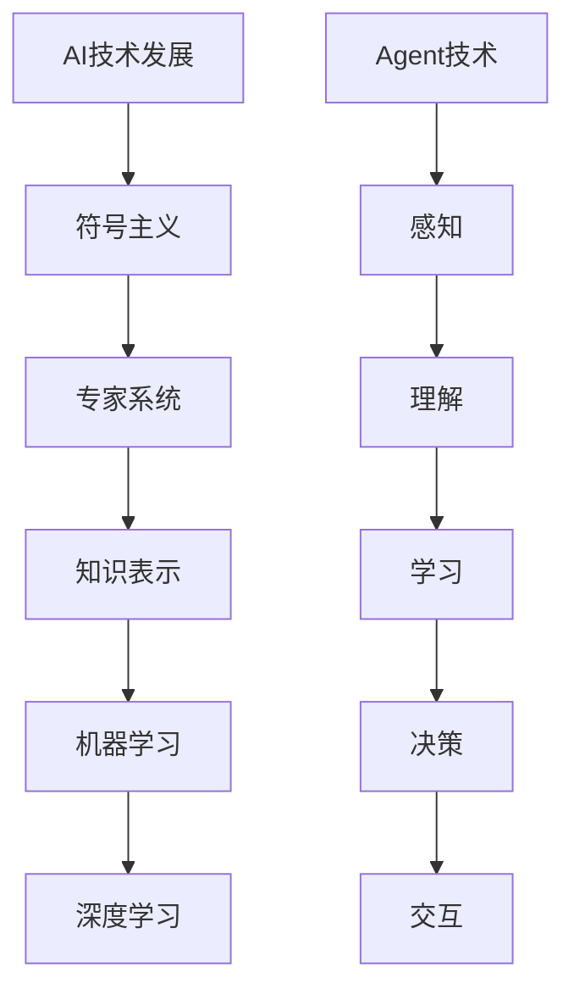
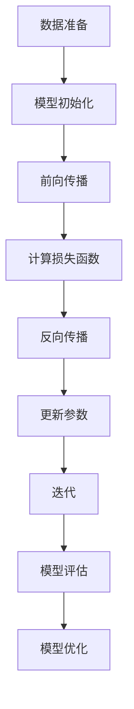
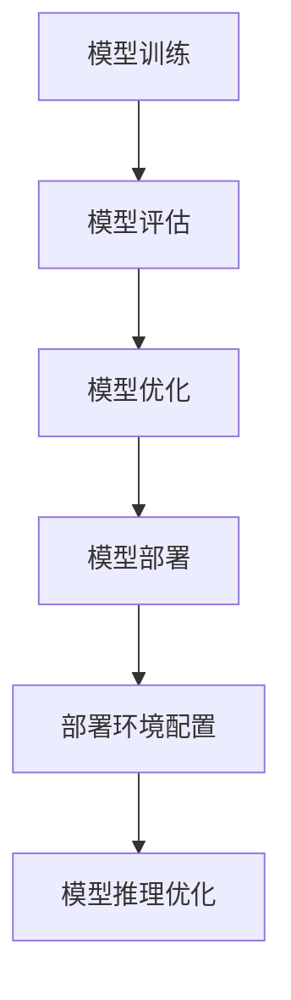
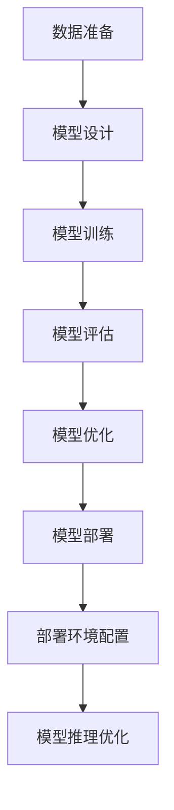
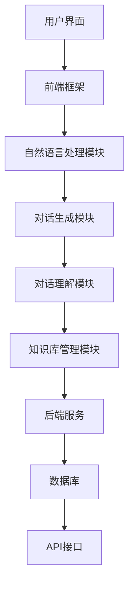

                 

# 【大模型应用开发 动手做AI Agent】创建线程

## 关键词

- 大模型应用开发
- AI Agent
- 线程创建
- 机器学习
- 深度学习
- 模型训练
- 模型部署

## 摘要

本文将探讨大模型应用开发中的关键环节——AI Agent的创建线程。通过逐步分析，我们将深入理解AI与Agent的概念及其相互关系，探讨AI Agent的核心特征，包括自主性、学习能力和反应能力。此外，我们将介绍AI Agent的技术基础，包括机器学习、自然语言处理和深度学习，并详细讲解深度学习的基础知识。接着，我们将讨论AI Agent的开发流程，从数据准备、模型设计、模型训练到模型评估和优化，以及模型部署与优化。文章将结合实战案例，展示对话式Agent和自动驾驶Agent的开发步骤。最后，我们将探讨AI Agent在多领域应用，介绍开发工具与资源，并展望AI Agent的未来发展。

## 第一部分：AI与Agent基础

### 第1章: AI与Agent概述

#### 1.1 AI的发展历程

人工智能（AI）起源于20世纪50年代，当时科学家们开始探索机器能否模拟人类智能。自那时以来，AI经历了多个阶段，包括早期的符号主义、专家系统、知识表示和推理，以及近年来基于数据的机器学习和深度学习。每个阶段都带来了新的突破和挑战，推动了人工智能技术的发展。

#### 1.2 AI与Agent的定义与联系

##### 1.2.1 AI的概念解析

人工智能是指计算机系统执行通常需要人类智能的任务，包括感知、理解、学习、推理、决策和创造等。AI的目标是使机器能够自主地完成复杂的任务，从而提高生产效率、解决实际问题。

##### 1.2.2 Agent的概念解析

Agent是指能够感知环境、执行任务并做出决策的计算机程序。它具有自主性、社交性和适应性，能够在动态环境中与其他Agent和人类进行交互。

##### 1.2.3 AI与Agent的关联

AI与Agent紧密相关，因为AI技术为Agent提供了感知、理解和决策的能力。AI Agent是指具备人工智能技术的Agent，能够自主地完成复杂任务，并在动态环境中与其他实体进行交互。

#### 1.3 AI Agent的核心特征

##### 1.3.1 自主性

自主性是指AI Agent能够独立地做出决策，不受外界干预。自主性包括自我管理、目标设定、任务执行和自我优化等功能。

##### 1.3.1.1 自主性的定义

自主性是指AI Agent在执行任务时，能够根据环境和目标自主地做出决策，而不需要人类干预。

##### 1.3.1.2 自主性在Agent中的应用

自主性使AI Agent能够在复杂的环境中自主地完成任务，提高系统的稳定性和可靠性。

##### 1.3.2 学习能力

学习能力是指AI Agent能够从数据中学习，改进自身的性能。学习能力包括数据收集、特征提取、模型训练和优化等。

##### 1.3.2.1 学习能力的定义

学习能力是指AI Agent能够通过学习获得新的知识和技能，以提高其完成任务的能力。

##### 1.3.2.2 学习能力在Agent中的应用

学习能力使AI Agent能够不断适应新的环境和任务，提高系统的灵活性和适应性。

##### 1.3.3 反应能力

反应能力是指AI Agent能够快速、准确地响应环境变化。反应能力包括感知环境、分析数据、生成决策和执行行动等。

##### 1.3.3.1 反应能力的定义

反应能力是指AI Agent在感知到环境变化时，能够迅速生成决策并执行相应的行动。

##### 1.3.3.2 反应能力在Agent中的应用

反应能力使AI Agent能够在动态环境中快速适应，提高系统的实时性和响应能力。

### Mermaid 流程图



### 第2章: AI Agent的技术基础

#### 2.1 机器学习基础

##### 2.1.1 机器学习的基本概念

机器学习是一种使计算机系统从数据中学习，并改进其性能的技术。机器学习包括监督学习、无监督学习和强化学习等不同类型。

##### 2.1.1.1 监督学习

监督学习是一种有标签数据的机器学习技术，其中系统通过学习输入和输出之间的关系来预测未知数据的结果。监督学习包括分类和回归任务。

##### 2.1.1.2 无监督学习

无监督学习是一种没有标签数据的机器学习技术，其中系统通过分析数据模式来自动发现数据结构和关系。无监督学习包括聚类和降维任务。

##### 2.1.1.3 强化学习

强化学习是一种通过与环境的交互来学习决策策略的机器学习技术。系统通过试错来找到最优行动，并最大化奖励。

#### 2.2 自然语言处理基础

##### 2.2.1 NLP基本概念

自然语言处理（NLP）是使计算机理解和生成人类语言的技术。NLP包括词嵌入、序列模型和注意力机制等核心概念。

##### 2.2.1.1 词嵌入

词嵌入是将单词转换为密集向量表示的技术，以捕捉单词之间的语义关系。

##### 2.2.1.2 序列模型

序列模型是处理序列数据的神经网络模型，如循环神经网络（RNN）和长短时记忆网络（LSTM）。

##### 2.2.1.3 注意力机制

注意力机制是一种用于捕捉序列数据中关键信息的技术，以提高模型对输入数据的理解和生成能力。

#### 2.3 深度学习基础

##### 2.3.1 深度学习基本概念

深度学习是一种多层神经网络，通过学习大量数据来提取复杂特征和模式。深度学习包括卷积神经网络（CNN）和循环神经网络（RNN）等模型。

##### 2.3.1.1 神经网络

神经网络是一种由多个神经元组成的计算模型，通过学习输入和输出之间的关系来预测未知数据的结果。

##### 2.3.1.2 卷积神经网络

卷积神经网络是一种用于处理图像数据的神经网络，通过卷积操作提取图像中的局部特征。

##### 2.3.1.3 循环神经网络

循环神经网络是一种用于处理序列数据的神经网络，通过递归操作捕捉序列中的时间依赖关系。

### 伪代码

```python
# 神经网络模型
class NeuralNetwork:
    def __init__(self, input_size, hidden_size, output_size):
        self.input_size = input_size
        self.hidden_size = hidden_size
        self.output_size = output_size
        self.weights = self.initialize_weights()

    def forward(self, x):
        # 前向传播
        return self.predict(x)

    def backward(self, x, y):
        # 反向传播
        return self.update_weights(x, y)

    def predict(self, x):
        # 预测结果
        return self ActivationFunction(np.dot(x, self.weights))

# 激活函数
def ActivationFunction(x):
    # Sigmoid函数
    return 1 / (1 + np.exp(-x))

# 损失函数
def LossFunction(y_true, y_pred):
    return -np.sum(y_true * np.log(y_pred))
```

### 数学模型和公式

```latex
$$
\begin{aligned}
L &= -\frac{1}{m}\sum_{i=1}^{m}y_i\log(\hat{y}_i) \\
\hat{y}_i &= \sigma(\omega_0 + \omega_1x_1 + \omega_2x_2 + ... + \omega_nx_n)
\end{aligned}
$$
```

### 举例说明

假设我们有一个二分类问题，其中输入数据是两个特征$x_1$和$x_2$，输出标签是$y$，我们使用神经网络模型进行预测。

```python
# 输入数据
x = np.array([[1, 2], [3, 4], [5, 6]])

# 输出标签
y = np.array([[1], [0], [1]])

# 初始化神经网络模型
nn = NeuralNetwork(input_size=2, hidden_size=3, output_size=1)

# 前向传播
y_pred = nn.forward(x)

# 计算损失函数
loss = LossFunction(y, y_pred)

# 反向传播
nn.backward(x, y)

# 打印结果
print("Predictions:", y_pred)
print("Loss:", loss)
```

### 第3章: AI Agent开发流程

#### 3.1 Agent开发概述

##### 3.1.1 Agent开发的关键环节

Agent开发包括数据准备、模型设计、模型训练、模型评估和模型部署等关键环节。

##### 3.1.1.1 数据准备

数据准备是Agent开发的第一步，包括数据采集、数据清洗和数据预处理等步骤。数据质量直接影响模型的性能，因此数据准备至关重要。

##### 3.1.1.2 模型设计

模型设计是Agent开发的核心环节，包括选择合适的算法、确定模型架构和超参数设置等。模型设计决定了Agent的能力和性能。

##### 3.1.1.3 模型训练

模型训练是将数据输入模型，通过迭代优化模型参数，使模型能够预测未知数据的过程。模型训练是Agent开发的关键步骤，训练质量直接影响模型的性能。

##### 3.1.1.4 模型评估

模型评估是验证模型性能的过程，包括准确性、召回率、F1分数等指标。模型评估用于确定模型是否满足预期要求，并进行优化。

##### 3.1.1.5 模型部署

模型部署是将训练好的模型部署到实际应用环境中的过程。模型部署需要考虑性能、可扩展性和安全性等因素。

#### 3.2 模型训练与优化

##### 3.2.1 模型训练基础

模型训练是将数据输入模型，通过迭代优化模型参数，使模型能够预测未知数据的过程。模型训练包括以下步骤：

1. 初始化模型参数
2. 前向传播计算预测结果
3. 计算损失函数
4. 反向传播计算梯度
5. 更新模型参数

##### 3.2.1.1 模型训练流程



##### 3.2.1.2 模型评估方法

模型评估用于确定模型性能是否满足预期要求。常用的评估方法包括：

1. 准确率（Accuracy）：预测正确的样本数占总样本数的比例。
2. 召回率（Recall）：预测正确的正样本数占总正样本数的比例。
3. 精确率（Precision）：预测正确的正样本数占预测为正样本的样本总数的比例。
4. F1分数（F1 Score）：综合考虑精确率和召回率的平衡指标。

##### 3.2.1.3 超参数调优

超参数是影响模型性能的关键参数，如学习率、批量大小、迭代次数等。超参数调优是模型优化的重要步骤，通过调整超参数，可以提高模型性能。

##### 3.2.1.4 模型优化技巧

1. early stopping：在模型训练过程中，当验证集损失不再减少时停止训练。
2. dropout：在神经网络中随机丢弃部分神经元，防止过拟合。
3. batch normalization：对批量数据中的神经元进行归一化处理，提高训练速度和性能。

#### 3.3 模型部署与优化

##### 3.3.1 模型部署基础

模型部署是将训练好的模型部署到实际应用环境中的过程。模型部署需要考虑以下因素：

1. 性能：模型部署后的运行速度和效率。
2. 可扩展性：模型能否支持大量数据和高并发请求。
3. 安全性：模型数据的安全性和隐私保护。

##### 3.3.1.1 模型部署流程



##### 3.3.1.2 部署环境配置

模型部署需要配置合适的环境，包括操作系统、硬件资源、依赖库等。常用的部署环境有：

1. 容器化环境：如Docker，提供轻量级、可移植的部署环境。
2. 云计算平台：如AWS、Azure、Google Cloud，提供高性能、可扩展的计算资源。

##### 3.3.1.3 模型推理优化

模型推理优化是提高模型部署后运行速度和性能的关键步骤。常见的优化方法有：

1. 算法优化：如量化、剪枝、低秩分解等，减少模型计算量和存储需求。
2. 硬件加速：如GPU、FPGA等，提供高效的计算能力。
3. 并行计算：利用多线程、多进程等技术，提高模型推理速度。

### Mermaid 流程图



### 实战案例

#### 对话式Agent开发

对话式Agent是一种能够与用户进行自然语言交互的AI Agent。以下是一个简单的对话式Agent开发案例：

1. 数据准备：收集用户对话数据，包括问题、答案和标签等。
2. 模型设计：选择合适的神经网络模型，如序列到序列（Seq2Seq）模型或转换器（Transformer）模型。
3. 模型训练：使用训练数据训练模型，优化模型参数。
4. 模型评估：使用验证数据评估模型性能，调整超参数。
5. 模型部署：将训练好的模型部署到服务器，接受用户输入并生成回答。
6. 部署环境配置：配置服务器环境，安装依赖库和模型文件。
7. 模型推理优化：利用GPU加速模型推理，提高响应速度。

### 开发环境搭建

```bash
# 安装依赖库
pip install tensorflow numpy matplotlib

# 下载预训练模型
wget https://storage.googleapis.com/download.tensorflow.org/models/official/nlp/transformer/transformer_0.3.0.tgz
tar xvf transformer_0.3.0.tgz
```

### 源代码实现

```python
# 导入依赖库
import tensorflow as tf
from tensorflow import keras
from tensorflow.keras.models import Model
from tensorflow.keras.layers import Embedding, LSTM, Dense, TimeDistributed

# 定义模型
input_seq = keras.layers.Input(shape=(None,))
embedded_seq = Embedding(vocab_size, embedding_dim)(input_seq)
lstm_out = LSTM(units, return_sequences=True)(embedded_seq)
output = TimeDistributed(Dense(vocab_size, activation='softmax'))(lstm_out)

# 构建模型
model = Model(inputs=input_seq, outputs=output)

# 编译模型
model.compile(optimizer='adam', loss='categorical_crossentropy', metrics=['accuracy'])

# 训练模型
model.fit(train_data, train_labels, epochs=10, validation_data=(val_data, val_labels))

# 评估模型
test_loss, test_accuracy = model.evaluate(test_data, test_labels)
print("Test Accuracy:", test_accuracy)
```

### 代码解读与分析

1. **模型定义**：使用Keras构建序列到序列模型，包括嵌入层（Embedding）、长短期记忆层（LSTM）和输出层（TimeDistributed）。
2. **模型编译**：编译模型，设置优化器、损失函数和评估指标。
3. **模型训练**：使用训练数据训练模型，设置训练轮数（epochs）。
4. **模型评估**：使用测试数据评估模型性能，计算准确率。

### 第4章: AI Agent实战案例

#### 4.1 对话式Agent开发

对话式Agent是一种能够与用户进行自然语言交互的AI Agent。以下是一个简单的对话式Agent开发案例：

1. 数据准备：收集用户对话数据，包括问题、答案和标签等。
2. 模型设计：选择合适的神经网络模型，如序列到序列（Seq2Seq）模型或转换器（Transformer）模型。
3. 模型训练：使用训练数据训练模型，优化模型参数。
4. 模型评估：使用验证数据评估模型性能，调整超参数。
5. 模型部署：将训练好的模型部署到服务器，接受用户输入并生成回答。
6. 部署环境配置：配置服务器环境，安装依赖库和模型文件。
7. 模型推理优化：利用GPU加速模型推理，提高响应速度。

##### 4.1.1 对话式Agent概述

对话式Agent是一种能够与用户进行自然语言交互的AI Agent，常见于智能客服、虚拟助手和智能对话系统等领域。对话式Agent的主要任务是理解用户的输入，生成合适的回答，并提供有用的信息或服务。

##### 4.1.2 对话式Agent架构设计

对话式Agent的架构设计包括以下关键组件：

1. **输入处理模块**：接收用户的输入，包括文本、语音等。
2. **语义理解模块**：对用户的输入进行语义分析，理解用户的需求和意图。
3. **回答生成模块**：根据用户的输入和语义理解，生成合适的回答。
4. **知识库**：存储与对话相关的知识，如常见问题、答案和业务规则等。
5. **推理引擎**：基于用户的输入和知识库，进行推理和决策。

##### 4.1.3 对话式Agent开发步骤

1. **数据收集和预处理**：收集用户对话数据，包括问题、答案和标签等。对数据进行清洗和预处理，如去除停用词、进行词嵌入等。
2. **模型选择和设计**：选择合适的神经网络模型，如序列到序列（Seq2Seq）模型或转换器（Transformer）模型。设计模型架构，包括输入层、隐藏层和输出层。
3. **模型训练**：使用训练数据训练模型，优化模型参数。通过迭代优化，提高模型的性能和准确性。
4. **模型评估**：使用验证数据评估模型性能，调整超参数，如学习率、批量大小等。通过交叉验证等方法，确保模型的泛化能力。
5. **模型部署**：将训练好的模型部署到服务器，接受用户输入并生成回答。配置服务器环境，安装依赖库和模型文件。确保模型的可扩展性和性能。
6. **用户交互**：与用户进行交互，接收用户的输入，生成回答，并提供有用的信息或服务。设计用户界面，如文本聊天窗口或语音对话系统。
7. **持续优化**：根据用户反馈和实际应用场景，不断优化模型和系统。调整超参数、改进算法，提高用户体验和系统性能。

##### 4.1.4 对话式Agent实战案例

以下是一个简单的对话式Agent开发实战案例，使用Python和TensorFlow构建一个基于序列到序列（Seq2Seq）模型的对话式Agent。

1. **数据准备**：
   - 收集用户对话数据，包括问题、答案和标签等。
   - 对数据进行预处理，如去除停用词、进行词嵌入等。

```python
import pandas as pd
import numpy as np

# 读取数据
data = pd.read_csv('dialog_data.csv')

# 预处理数据
# ...
```

2. **模型设计**：
   - 设计序列到序列（Seq2Seq）模型，包括输入层、隐藏层和输出层。

```python
from tensorflow.keras.models import Model
from tensorflow.keras.layers import Input, LSTM, Embedding, Dense

# 定义模型
input_seq = Input(shape=(None,))
embedded_seq = Embedding(vocab_size, embedding_dim)(input_seq)
lstm_out = LSTM(units, return_sequences=True)(embedded_seq)
output = Dense(vocab_size, activation='softmax')(lstm_out)

# 构建模型
model = Model(inputs=input_seq, outputs=output)
```

3. **模型训练**：
   - 使用训练数据训练模型，优化模型参数。

```python
model.compile(optimizer='adam', loss='categorical_crossentropy', metrics=['accuracy'])

model.fit(train_data, train_labels, epochs=10, validation_data=(val_data, val_labels))
```

4. **模型评估**：
   - 使用验证数据评估模型性能，调整超参数。

```python
test_loss, test_accuracy = model.evaluate(test_data, test_labels)
print("Test Accuracy:", test_accuracy)
```

5. **模型部署**：
   - 将训练好的模型部署到服务器，接受用户输入并生成回答。

```python
# 部署模型
model.save('dialog_agent_model.h5')

# 重新加载模型
loaded_model = keras.models.load_model('dialog_agent_model.h5')
```

6. **用户交互**：
   - 设计用户界面，如文本聊天窗口或语音对话系统。

```python
# 用户输入
user_input = input("您有什么问题吗？")

# 预处理用户输入
# ...

# 生成回答
answer = loaded_model.predict(np.array([user_input]))

# 输出回答
print("Agent:", answer)
```

### 4.2 自动驾驶Agent开发

自动驾驶Agent是一种能够自主驾驶的AI Agent，广泛应用于自动驾驶汽车、无人驾驶飞机和机器人等领域。以下是一个简单的自动驾驶Agent开发案例：

1. 数据准备：收集自动驾驶数据，包括传感器数据、环境数据和驾驶行为数据等。
2. 模型设计：选择合适的神经网络模型，如卷积神经网络（CNN）或循环神经网络（RNN）。
3. 模型训练：使用训练数据训练模型，优化模型参数。
4. 模型评估：使用验证数据评估模型性能，调整超参数。
5. 模型部署：将训练好的模型部署到自动驾驶系统，实现自主驾驶功能。
6. 部署环境配置：配置自动驾驶系统环境，安装依赖库和模型文件。
7. 模型推理优化：利用GPU加速模型推理，提高驾驶性能。

##### 4.2.1 自动驾驶概述

自动驾驶技术是指通过计算机系统模拟人类的驾驶行为，实现车辆的自主驾驶。自动驾驶技术分为多个级别，从0级（完全人工驾驶）到5级（完全自主驾驶）。

##### 4.2.2 自动驾驶Agent架构设计

自动驾驶Agent的架构设计包括以下关键组件：

1. **感知模块**：接收传感器数据，包括摄像头、激光雷达、雷达和超声波传感器等。
2. **环境理解模块**：对感知模块获取的数据进行预处理和分析，提取环境特征和目标对象。
3. **决策模块**：基于环境特征和目标对象，生成驾驶策略和行动指令。
4. **控制模块**：根据决策模块的指令，控制车辆的运动和转向。
5. **知识库**：存储与自动驾驶相关的知识，如交通规则、驾驶经验和路况信息等。
6. **推理引擎**：基于知识库和感知模块的数据，进行推理和决策。

##### 4.2.3 自动驾驶Agent开发步骤

1. **数据收集和预处理**：收集自动驾驶数据，包括传感器数据、环境数据和驾驶行为数据等。对数据进行清洗和预处理，如去噪、标准化等。

```python
import pandas as pd
import numpy as np

# 读取数据
data = pd.read_csv('autonomous_driving_data.csv')

# 预处理数据
# ...
```

2. **模型选择和设计**：
   - 选择合适的神经网络模型，如卷积神经网络（CNN）或循环神经网络（RNN）。设计模型架构，包括输入层、隐藏层和输出层。

```python
from tensorflow.keras.models import Model
from tensorflow.keras.layers import Input, Conv2D, MaxPooling2D, Flatten, Dense

# 定义模型
input_seq = Input(shape=(height, width, channels))
conv1 = Conv2D(filters, kernel_size)(input_seq)
pool1 = MaxPooling2D(pool_size)(conv1)
flat1 = Flatten()(pool1)
output = Dense(units, activation='softmax')(flat1)

# 构建模型
model = Model(inputs=input_seq, outputs=output)
```

3. **模型训练**：
   - 使用训练数据训练模型，优化模型参数。

```python
model.compile(optimizer='adam', loss='categorical_crossentropy', metrics=['accuracy'])

model.fit(train_data, train_labels, epochs=10, validation_data=(val_data, val_labels))
```

4. **模型评估**：
   - 使用验证数据评估模型性能，调整超参数。

```python
test_loss, test_accuracy = model.evaluate(test_data, test_labels)
print("Test Accuracy:", test_accuracy)
```

5. **模型部署**：
   - 将训练好的模型部署到自动驾驶系统，实现自主驾驶功能。

```python
# 部署模型
model.save('autonomous_driving_agent_model.h5')

# 重新加载模型
loaded_model = keras.models.load_model('autonomous_driving_agent_model.h5')
```

6. **用户交互**：
   - 设计用户界面，如监控画面或控制台。

```python
# 用户输入
user_input = input("是否开始自动驾驶？")

# 预处理用户输入
# ...

# 生成驾驶策略
drive_strategy = loaded_model.predict(np.array([user_input]))

# 输出驾驶策略
print("Drive Strategy:", drive_strategy)
```

### 第5章: AI Agent在多领域应用

#### 5.1 金融领域应用

##### 5.1.1 金融领域概述

金融领域是一个高度复杂和动态变化的行业，涉及多个子领域，如股票交易、风险管理、信贷评估和金融欺诈检测等。随着大数据和人工智能技术的发展，AI Agent在金融领域具有广泛的应用前景。

##### 5.1.2 金融领域AI Agent应用案例

1. **股票交易**：AI Agent可以分析大量市场数据，预测股票价格走势，帮助投资者做出交易决策。
2. **风险管理**：AI Agent可以识别潜在的金融风险，如市场波动、信用风险和操作风险，为金融机构提供风险预警和应对策略。
3. **信贷评估**：AI Agent可以基于历史数据和机器学习算法，评估借款人的信用风险，为金融机构提供信贷决策支持。
4. **金融欺诈检测**：AI Agent可以监控交易活动，识别异常行为，提高金融欺诈检测的准确性和效率。

##### 5.1.3 金融领域AI Agent开发关键

1. **数据质量**：金融领域的数据质量对AI Agent的性能至关重要。开发过程中需要确保数据完整性、准确性和一致性。
2. **模型选择**：根据金融领域的具体任务，选择合适的机器学习算法和神经网络模型，如决策树、支持向量机和卷积神经网络等。
3. **实时性**：金融领域对实时性和响应速度有较高要求，因此需要优化模型推理和部署，提高系统的性能和可靠性。
4. **合规性**：金融领域涉及大量的法律和法规要求，开发AI Agent时需要遵守相关法律法规，确保系统的合规性。

### 5.2 医疗领域应用

##### 5.2.1 医疗领域概述

医疗领域是一个高度专业化且具有挑战性的行业，涉及诊断、治疗、药物研发和公共卫生等多个方面。随着人工智能技术的快速发展，AI Agent在医疗领域具有广泛的应用潜力。

##### 5.2.2 医疗领域AI Agent应用案例

1. **疾病诊断**：AI Agent可以分析医学图像和患者数据，提供疾病诊断建议，辅助医生进行诊断决策。
2. **治疗方案推荐**：AI Agent可以根据患者的病史和生理指标，推荐个性化的治疗方案，提高治疗效果。
3. **药物研发**：AI Agent可以分析大量化合物数据，预测药物的疗效和副作用，加速药物研发过程。
4. **公共卫生监测**：AI Agent可以监控公共卫生数据，识别潜在的健康风险，为公共卫生决策提供支持。

##### 5.2.3 医疗领域AI Agent开发关键

1. **数据安全**：医疗领域涉及大量敏感的个人信息和健康数据，开发AI Agent时需要确保数据安全，保护患者隐私。
2. **算法解释性**：医疗领域的应用对算法的解释性有较高要求，需要开发可解释的AI算法，便于医生理解和应用。
3. **数据质量**：医疗领域的数据质量直接影响AI Agent的性能，需要确保数据的准确性、完整性和一致性。
4. **跨学科合作**：医疗领域涉及多个学科，开发AI Agent时需要跨学科合作，结合医学、计算机科学和数据科学的知识，提高系统的性能和可靠性。

### 第6章: AI Agent开发工具与资源

#### 6.1 开发工具介绍

##### 6.1.1 TensorFlow

TensorFlow是一个开源的机器学习库，由谷歌开发。它提供了丰富的API和工具，用于构建、训练和部署深度学习模型。

- **优点**：易于使用，支持多种深度学习模型，具有良好的社区支持。
- **缺点**：配置较为复杂，对硬件资源要求较高。

##### 6.1.2 PyTorch

PyTorch是一个开源的机器学习库，由Facebook开发。它提供了动态计算图和自动微分功能，使深度学习模型的开发和调试更加方便。

- **优点**：易于使用，支持动态计算图，具有良好的社区支持。
- **缺点**：部署较为复杂，对硬件资源要求较高。

##### 6.1.3 Keras

Keras是一个开源的机器学习库，作为TensorFlow的封装层。它提供了简洁的API和丰富的预训练模型，使深度学习模型的开发和部署更加便捷。

- **优点**：易于使用，支持多种深度学习模型，具有良好的社区支持。
- **缺点**：依赖TensorFlow，对硬件资源要求较高。

#### 6.2 开发资源推荐

##### 6.2.1 在线学习资源

1. **Coursera**：提供丰富的机器学习和深度学习课程，涵盖理论知识、实践技巧和项目实战。
2. **Udacity**：提供实践导向的机器学习和深度学习课程，结合理论和实际项目。
3. **edX**：提供全球知名大学和机构的免费课程，包括机器学习和深度学习等领域。

##### 6.2.2 实践项目资源

1. **Kaggle**：提供各种机器学习和深度学习竞赛和实践项目，提高实际应用能力。
2. **GitHub**：提供丰富的开源项目和代码示例，方便学习和参考。
3. **GitHub Education**：为教育机构和学生提供免费访问GitHub Pro服务。

##### 6.2.3 论文资源

1. **arXiv**：提供最新的机器学习和深度学习论文，了解前沿研究成果。
2. **Google Scholar**：提供广泛的学术资源和文献，方便查阅相关论文。
3. **IEEE Xplore**：提供IEEE发表的机器学习和深度学习论文，涵盖多个领域。

### 第7章: AI Agent的未来发展

#### 7.1 AI Agent的发展趋势

随着人工智能技术的不断进步，AI Agent在未来将呈现出以下发展趋势：

1. **智能化**：AI Agent将具备更高的智能化水平，能够更好地理解人类语言、感知环境和自主决策。
2. **自主性**：AI Agent将具备更高的自主性，能够独立完成复杂任务，并在动态环境中进行自适应调整。
3. **多样化**：AI Agent将应用于更多领域和场景，如智能家居、智能医疗、智能交通和智能金融等。
4. **融合化**：AI Agent将与其他技术（如物联网、区块链和5G等）进行融合，实现更高效的协同工作和智能化应用。

#### 7.2 AI Agent的研究热点

随着AI Agent技术的发展，以下研究领域成为研究热点：

1. **对话生成与理解**：研究如何使AI Agent能够生成自然、连贯的对话，并理解用户的意图和需求。
2. **多模态AI Agent**：研究如何使AI Agent能够处理和融合多种模态的数据（如文本、图像、声音和视频等），实现更高级的感知和交互能力。
3. **强化学习**：研究如何使AI Agent通过试错和反馈机制，在复杂环境中学习最优策略。
4. **联邦学习**：研究如何使多个AI Agent在分布式环境下协同工作，提高模型的性能和安全性。

### 第8章: AI Agent开发项目实践

#### 8.1 项目背景

##### 8.1.1 项目简介

本项目旨在开发一个智能客服系统，用于处理客户咨询和问题解决。智能客服系统将基于AI Agent技术，实现自然语言处理、对话生成和理解等功能，以提高客户满意度和服务效率。

##### 8.1.2 项目目标

1. 开发一个功能完善的智能客服系统，实现自然语言处理、对话生成和理解等功能。
2. 提高客户满意度，减少人工客服工作量，提高服务效率。
3. 通过持续学习和优化，提高系统的准确性和鲁棒性。

#### 8.2 项目需求分析

##### 8.2.1 功能需求

1. **自然语言处理**：实现文本预处理、词嵌入和语言模型等功能，为对话生成和理解提供基础。
2. **对话生成**：根据用户的输入，生成合适的回答，包括常见问题和复杂问题的回答。
3. **对话理解**：理解用户的意图和需求，提取关键信息，为对话生成提供指导。
4. **知识库管理**：存储和管理与客户咨询相关的知识，如常见问题、答案和业务规则等。
5. **用户交互**：提供用户界面，如文本聊天窗口或语音对话系统，与用户进行交互。

##### 8.2.2 非功能需求

1. **性能要求**：系统应具有高性能，能够快速响应用户输入，处理大量并发请求。
2. **安全性**：系统应具备数据安全性和隐私保护功能，确保用户数据的安全。
3. **可扩展性**：系统应具备良好的可扩展性，能够适应业务发展和需求变化。
4. **兼容性**：系统应兼容不同的操作系统和浏览器，支持多种客户端访问。

#### 8.3 项目技术方案

##### 8.3.1 技术选型

1. **自然语言处理**：使用Python的NLTK库进行文本预处理，使用TensorFlow和PyTorch构建语言模型和对话模型。
2. **对话生成**：使用序列到序列（Seq2Seq）模型或转换器（Transformer）模型生成对话回答。
3. **对话理解**：使用实体识别和意图分类模型，提取用户的意图和需求。
4. **知识库管理**：使用关系数据库（如MySQL或PostgreSQL）存储和管理知识库。
5. **用户交互**：使用HTML、CSS和JavaScript构建用户界面，使用WebSockets实现实时交互。

##### 8.3.2 系统架构设计



#### 8.4 项目开发过程

##### 8.4.1 数据准备

1. 收集客户咨询数据，包括问题、答案和标签等。
2. 对数据进行预处理，如去除停用词、进行词嵌入等。

```python
import pandas as pd
import numpy as np

# 读取数据
data = pd.read_csv('customer_data.csv')

# 预处理数据
# ...
```

##### 8.4.2 模型设计与训练

1. 设计自然语言处理模型，包括词嵌入、语言模型和对话模型。
2. 使用训练数据训练模型，优化模型参数。

```python
from tensorflow.keras.models import Model
from tensorflow.keras.layers import Embedding, LSTM, Dense, TimeDistributed

# 定义模型
input_seq = Input(shape=(None,))
embedded_seq = Embedding(vocab_size, embedding_dim)(input_seq)
lstm_out = LSTM(units, return_sequences=True)(embedded_seq)
output = TimeDistributed(Dense(vocab_size, activation='softmax'))(lstm_out)

# 构建模型
model = Model(inputs=input_seq, outputs=output)

# 编译模型
model.compile(optimizer='adam', loss='categorical_crossentropy', metrics=['accuracy'])

# 训练模型
model.fit(train_data, train_labels, epochs=10, validation_data=(val_data, val_labels))
```

##### 8.4.3 模型评估与优化

1. 使用验证数据评估模型性能，调整超参数。
2. 实施模型优化技巧，如dropout和批量归一化。

```python
# 评估模型
test_loss, test_accuracy = model.evaluate(test_data, test_labels)
print("Test Accuracy:", test_accuracy)

# 调整超参数
# ...
```

##### 8.4.4 模型部署与运行

1. 将训练好的模型部署到服务器，实现实时交互。
2. 配置服务器环境，安装依赖库和模型文件。

```bash
# 安装依赖库
pip install tensorflow numpy matplotlib

# 部署模型
model.save('smart_c

