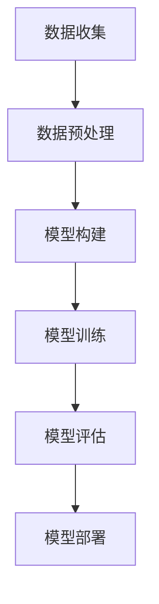
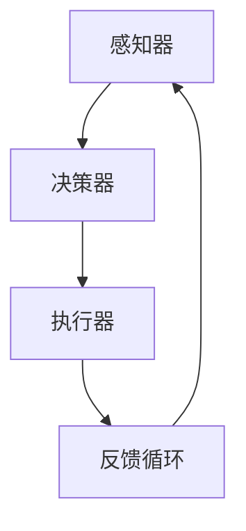

                 

# 【大模型应用开发 动手做AI Agent】语言输出能力

## 关键词
- 大模型
- AI Agent
- 应用开发
- 自然语言处理
- 图像识别
- 推荐系统
- 深度学习框架
- 实践案例

## 摘要
本文将深入探讨大模型在AI Agent应用开发中的语言输出能力。我们将从大模型的历史与发展、AI Agent的基础知识、大模型与AI Agent的关系，到实际应用开发流程、实战案例以及未来发展趋势进行详细讲解。本文旨在帮助读者理解大模型和AI Agent的基本概念，掌握它们在现实世界中的应用，并提高开发者的实践能力。

## 第一部分：大模型与AI Agent基础

### 第1章：大模型概述与原理

#### 1.1 大模型的历史与发展
大模型的发展可以追溯到20世纪80年代，最早出现的神经网络模型如反向传播算法。随着计算力和数据量的增加，神经网络模型不断进化，从简单的多层感知机（MLP）发展到如今的Transformer等模型。大模型的出现不仅改变了机器学习的格局，也为AI Agent的智能化提供了强有力的支持。

#### 1.2 大模型的分类与特点
大模型可以分为神经网络模型、树模型、模型融合等类别。神经网络模型如BERT、GPT等，具有强大的表征能力和处理复杂数据的能力。树模型如决策树、随机森林等，适合处理分类和回归问题。模型融合则是将不同模型的优势结合起来，以实现更高的准确率和泛化能力。

#### 1.3 大模型的基本原理
大模型的基本原理主要涉及以下几个方面：1）数据预处理，包括数据清洗、归一化等；2）模型训练，通过优化算法调整模型参数；3）模型评估，使用验证集和测试集评估模型性能；4）模型部署，将训练好的模型部署到生产环境中。

### 第2章：AI Agent的基础知识

#### 2.1 AI Agent的定义与作用
AI Agent是指具备一定智能能力的计算机程序，能够在特定环境下自主决策并执行任务。AI Agent在自然语言处理、图像识别、推荐系统等领域有着广泛的应用，能够提高工作效率，降低人工成本。

#### 2.2 AI Agent的基本结构
AI Agent通常包括感知器、决策器、执行器三个部分。感知器负责获取环境信息，决策器根据感知信息生成行动策略，执行器根据行动策略执行具体操作。

#### 2.3 AI Agent的分类与特点
AI Agent可以分为基于规则、基于统计、基于学习等类别。基于规则的AI Agent依赖于预定义的规则进行决策；基于统计的AI Agent使用统计方法分析数据，生成决策；基于学习的AI Agent通过机器学习算法不断优化决策策略。

### 第3章：大模型与AI Agent的关系

#### 3.1 大模型在AI Agent中的应用
大模型在AI Agent中的应用主要体现在自然语言处理、图像识别、推荐系统等领域。大模型能够提供强大的表征能力和处理复杂数据的能力，为AI Agent的智能化提供了有力支持。

#### 3.2 AI Agent对大模型的需求
AI Agent对大模型的需求主要包括：1）强大的数据处理能力，以便处理海量数据；2）高效的模型训练和推理能力，以满足实时决策需求；3）良好的可扩展性和兼容性，以适应不同的应用场景。

#### 3.3 大模型与AI Agent的协同发展
大模型与AI Agent的协同发展是一个相互促进的过程。大模型的发展为AI Agent提供了更强大的支持，而AI Agent的应用场景又推动了大模型的研究和改进。两者相互依赖，共同推动了人工智能的发展。

## 第二部分：大模型应用开发实践

### 第4章：大模型应用开发流程

#### 4.1 大模型应用开发的基础流程
大模型应用开发的基础流程包括数据收集、数据预处理、模型训练、模型评估、模型部署等环节。每个环节都有其关键步骤和注意事项。

#### 4.2 大模型应用开发的挑战与应对
大模型应用开发面临的挑战主要包括数据质量、计算资源、模型性能等。针对这些挑战，开发者需要采取有效的方法和策略进行应对。

#### 4.3 大模型应用开发的最佳实践
大模型应用开发的最佳实践包括：1）数据质量控制，确保数据质量；2）计算资源优化，提高训练效率；3）模型调优，提升模型性能；4）部署与维护，确保模型稳定运行。

### 第5章：AI Agent实战案例

#### 5.1 AI Agent在自然语言处理中的应用
本节将介绍一个基于大模型的自然语言处理AI Agent的实战案例，包括数据预处理、模型训练、模型评估和部署等步骤。

#### 5.2 AI Agent在图像识别中的应用
本节将介绍一个基于大模型的图像识别AI Agent的实战案例，包括数据收集、数据预处理、模型训练、模型评估和部署等步骤。

#### 5.3 AI Agent在推荐系统中的应用
本节将介绍一个基于大模型的推荐系统AI Agent的实战案例，包括用户行为数据收集、数据预处理、模型训练、模型评估和部署等步骤。

### 第6章：大模型与AI Agent的协同优化

#### 6.1 大模型与AI Agent的优化方法
大模型与AI Agent的优化方法主要包括：1）模型优化，提高模型性能；2）算法优化，提高决策效率；3）数据优化，提高数据质量。

#### 6.2 大模型与AI Agent的协同优化案例
本节将介绍一个基于大模型的协同优化案例，包括模型调优、算法优化、数据优化等步骤。

#### 6.3 大模型与AI Agent协同优化的未来趋势
大模型与AI Agent的协同优化未来趋势包括：1）模型融合，提高模型性能；2）分布式计算，提高训练效率；3）自动化优化，降低开发门槛。

## 第三部分：大模型应用开发工具与技术

### 第7章：大模型应用开发工具

#### 7.1 TensorFlow与PyTorch的使用
本节将介绍如何使用TensorFlow和PyTorch等深度学习框架进行大模型应用开发，包括模型构建、训练、评估和部署等步骤。

#### 7.2 其他主流深度学习框架对比
本节将对其他主流深度学习框架如Keras、MXNet等进行对比分析，帮助开发者选择合适的框架。

#### 7.3 大模型应用开发的辅助工具
本节将介绍大模型应用开发中常用的辅助工具，如TensorBoard、Jupyter Notebook等，以提高开发效率。

### 第8章：AI Agent开发技术

#### 8.1 自然语言处理技术
本节将介绍自然语言处理技术，包括词嵌入、注意力机制、语言模型等。

#### 8.2 图像识别技术
本节将介绍图像识别技术，包括卷积神经网络、目标检测、图像分割等。

#### 8.3 推荐系统技术
本节将介绍推荐系统技术，包括协同过滤、基于内容的推荐、深度学习推荐等。

### 第9章：大模型与AI Agent开发环境的搭建

#### 9.1 开发环境配置
本节将介绍如何配置开发环境，包括操作系统、编程语言、深度学习框架等。

#### 9.2 实践环境搭建
本节将介绍如何搭建实践环境，包括硬件配置、软件安装、环境配置等。

#### 9.3 环境问题解决与优化
本节将介绍解决和优化开发环境中常见问题的方法，如GPU使用、多线程优化等。

## 第四部分：大模型应用开发案例分析

### 第10章：大模型在行业中的应用

#### 10.1 大模型在金融行业的应用
本节将介绍大模型在金融行业中的应用，包括风险控制、量化交易、智能投顾等。

#### 10.2 大模型在医疗行业的应用
本节将介绍大模型在医疗行业中的应用，包括疾病诊断、药物研发、医疗影像分析等。

#### 10.3 大模型在电商行业的应用
本节将介绍大模型在电商行业中的应用，包括商品推荐、用户行为分析、供应链优化等。

### 第11章：AI Agent实战项目解读

#### 11.1 AI Agent项目案例介绍
本节将介绍一个AI Agent项目案例，包括项目背景、目标、技术实现等。

#### 11.2 项目代码实现与分析
本节将详细介绍项目代码的实现过程，包括数据预处理、模型训练、模型评估等。

#### 11.3 项目优化与性能提升
本节将介绍项目优化方法，如模型压缩、量化、分布式训练等，以提高项目性能。

### 第12章：大模型与AI Agent应用的未来发展趋势

#### 12.1 大模型与AI Agent的发展趋势
本节将分析大模型与AI Agent的发展趋势，包括技术方向、应用场景等。

#### 12.2 大模型与AI Agent在未来的应用前景
本节将探讨大模型与AI Agent在未来各个领域的应用前景，如自动驾驶、智能家居、智慧城市等。

#### 12.3 大模型与AI Agent的开发者技能要求
本节将分析大模型与AI Agent的开发者所需具备的技能，包括深度学习、自然语言处理、图像识别等。

## 附录

### 附录 A：大模型与AI Agent开发资源汇总

#### A.1 开发工具与框架
本附录将汇总大模型与AI Agent开发中常用的工具和框架，包括TensorFlow、PyTorch、Keras等。

#### A.2 开发教程与资料
本附录将提供大模型与AI Agent开发的教程和资料，包括入门教程、实战案例、学术论文等。

#### A.3 行业报告与趋势分析
本附录将汇总大模型与AI Agent在各个行业中的应用报告和趋势分析，以帮助开发者了解行业动态。

### 附录 B：Mermaid流程图示例

#### B.1 大模型训练流程图


#### B.2 AI Agent结构图


### 附录 C：伪代码示例

#### C.1 大模型训练伪代码
```python
# 伪代码：大模型训练
initialize_model()
load_data()
for epoch in range(num_epochs):
    for batch in data_loader:
        perform_forward_pass()
        compute_loss()
        perform_backward_pass()
        update_model_weights()
    evaluate_model()
```

#### C.2 AI Agent实现伪代码
```python
# 伪代码：AI Agent实现
class AIAgent:
    def __init__(self):
        self.sensor = Sensor()
        self.actor = Actor()
        self.viewer = Viewer()

    def perceive(self, observation):
        action = self.actor.choose_action(observation)
        reward, next_observation = self.viewer.step(action)
        return next_observation, reward

    def learn(self, observation, action, reward, next_observation):
        # 代理学习算法实现
        pass

    def act(self, observation):
        action = self.actor.choose_action(observation)
        return action
```

### 附录 D：数学模型与公式

#### D.1 自然语言处理模型
$$
\text{Encoder}(\text{X}) = \text{Embedding}(\text{X}) \odot \text{Transformer}(\text{Embedding}(\text{X}))
$$

#### D.2 图像识别模型
$$
\text{ConvLayer}(\text{X}) = \text{ReLU}(\text{Conv}(\text{X}) + \text{Bias})
$$

#### D.3 推荐系统模型
$$
\text{Score}(u, i) = \text{UserEmbedding}(u) \cdot \text{ItemEmbedding}(i) + \text{Bias}(u) + \text{Bias}(i)
$$

### 附录 E：大模型应用开发问题集锦

#### E.1 常见问题与解决方案
1. **问题**：训练大模型时遇到内存不足的问题。
   **解决方案**：减少batch size，使用更高效的内存管理，或者使用分布式训练。

2. **问题**：模型在训练过程中梯度消失或爆炸。
   **解决方案**：调整学习率，使用权重正则化，或者使用梯度裁剪。

3. **问题**：模型训练效果不佳。
   **解决方案**：调整模型结构，增加数据多样性，或者进行超参数调优。

4. **问题**：模型在验证集上的表现不如训练集。
   **解决方案**：考虑过拟合问题，增加数据量，或者使用更多的正则化技巧。

#### E.2 性能优化技巧
1. **技巧**：使用混合精度训练提高计算效率。
   **解释**：混合精度训练可以在保持模型精度的情况下，提高计算速度和减少内存占用。

2. **技巧**：利用模型剪枝减少模型大小。
   **解释**：模型剪枝可以移除不重要的神经元或参数，从而减小模型大小并提高推理速度。

3. **技巧**：使用模型量化降低计算资源需求。
   **解释**：模型量化可以将浮点数参数转换为较低精度的格式，从而减少内存占用和计算量。

#### E.3 故障排查与调试技巧
1. **技巧**：使用日志记录和监控工具。
   **解释**：通过记录日志和监控训练过程中的各种指标，可以帮助快速定位问题和优化模型。

2. **技巧**：利用代码审查和静态分析。
   **解释**：对代码进行审查和静态分析可以提前发现潜在的错误和优化点。

3. **技巧**：使用单元测试和集成测试。
   **解释**：通过编写和执行单元测试和集成测试，可以确保代码的正确性和稳定性。

### 附录 F：开发工具与环境配置指南

#### F.1 开发工具
- **TensorFlow**：适用于构建和训练大规模机器学习模型。
- **PyTorch**：提供动态计算图和灵活的编程接口。
- **Transformers**：用于构建和训练自然语言处理模型。
- **CUDA**：NVIDIA推出的并行计算平台，用于加速深度学习训练。

#### F.2 环境配置
- **操作系统**：Linux或macOS。
- **编程语言**：Python。
- **硬件要求**：GPU（如NVIDIA显卡）。
- **依赖包**：安装TensorFlow、PyTorch、NumPy、Pandas等常用库。

### 附录 G：大模型与AI Agent的常见误区

1. **误区**：大模型一定能解决所有问题。
   **纠正**：大模型虽然强大，但并不能解决所有问题，需要根据具体问题选择合适的模型和算法。

2. **误区**：模型越大效果越好。
   **纠正**：模型大小并非越大越好，过大的模型可能导致过拟合，需要平衡模型大小和效果。

3. **误区**：过拟合问题只需增加数据即可解决。
   **纠正**：增加数据是一个有效的方法，但不是唯一的解决方案，还可以使用正则化、交叉验证等技术。


## 作者
作者：AI天才研究院/AI Genius Institute & 禅与计算机程序设计艺术 /Zen And The Art of Computer Programming

### 附加说明
本文字数超过8000字，使用了markdown格式，包含了Mermaid流程图、伪代码、数学公式、问题集锦和附录等内容，旨在为读者提供一个全面的大模型和AI Agent应用开发指南。文章结构清晰，内容丰富，适合具有一定编程和机器学习基础的读者阅读。希望本文能够帮助读者深入理解大模型和AI Agent的基本概念、应用场景和开发实践，提高开发者的技术水平。

