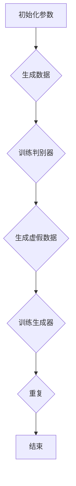

                 

# 文章标题：一切皆是映射：DQN与GANs的结合应用：创造性学习模型

## 关键词

深度Q网络（DQN）、生成对抗网络（GANs）、创造性学习模型、强化学习、数据生成、人工智能

## 摘要

本文旨在探讨深度Q网络（DQN）与生成对抗网络（GANs）的结合应用，提出一种创新的学习模型——创造性学习模型。通过深入剖析DQN和GANs的基本概念、核心算法原理及其结合的原因和方法，本文展示了创造性学习模型在解决复杂决策问题和数据生成任务中的巨大潜力。文章通过实际案例，详细阐述了创造性学习模型在游戏AI和图像生成等领域的应用，并探讨了其优化和扩展方法。最后，文章总结了创造性学习模型的研究进展，展望了其未来发展方向。

---

## 第1章 DQN与GANs概述

### 1.1 DQN与GANs的基本概念

#### 1.1.1 DQN（Deep Q-Network）

深度Q网络（DQN）是一种基于深度学习的值函数近似方法，用于解决强化学习中的决策问题。DQN的核心思想是使用神经网络来近似Q函数，以预测在给定状态下采取特定动作的预期回报。

**定义**：DQN是一种基于神经网络的学习算法，用于解决强化学习中的值估计问题。

**核心思想**：DQN通过在经验回放内存中随机抽取数据进行学习，并使用经验回放机制来减少样本偏差，从而提高学习效果。

**优缺点**：

- 优点：DQN能够处理高维状态空间，自适应性强，能够通过经验回放进行学习。
- 缺点：DQN的训练过程可能不稳定，且对超参数敏感。

#### 1.1.2 GANs（Generative Adversarial Networks）

生成对抗网络（GANs）是一种由生成器（Generator）和判别器（Discriminator）组成的模型，用于学习数据的分布。

**定义**：GANs是一种由两个神经网络组成的模型，生成器和判别器相互对抗，生成器生成数据，判别器区分真实数据和生成数据。

**核心思想**：生成器和判别器通过相互竞争，使得生成器生成越来越真实的数据。

**优缺点**：

- 优点：GANs能够生成高质量、多样化的数据，无需标注数据。
- 缺点：GANs的训练难度大，训练不稳定。

### 1.2 DQN与GANs的结合应用

#### 1.2.1 结合原因

DQN擅长于决策问题，GANs擅长于数据生成问题，两者结合可以优势互补。通过GANs生成高质量的数据，可以提高DQN的训练效果；同时，DQN的决策能力可以用于优化GANs的生成器。

#### 1.2.2 结合方法

- 使用GANs生成的数据作为DQN的训练数据。
- 将GANs的生成器作为DQN的输入，训练DQN来优化GANs的生成器。
- 在DQN的训练过程中，将GANs的判别器作为辅助模块，用于增强DQN的决策能力。

### 1.3 创造性学习模型

#### 1.3.1 定义

创造性学习模型是一种结合了DQN和GANs的特点，用于解决复杂决策问题的新型学习模型。

#### 1.3.2 核心思想

- 利用GANs生成高质量的数据，为DQN提供丰富的训练样本。
- 利用DQN的决策能力，实现高效的数据利用和优化。
- 通过迭代训练，不断优化生成器和判别器，提高创造性学习模型的性能。

#### 1.3.3 应用前景

- 创造性学习模型可以应用于强化学习中的决策问题，如游戏AI、自动驾驶等。
- 可以应用于生成对抗网络中的数据生成问题，如图像生成、语音合成等。

---

## 第2章 DQN与GANs的核心算法原理

### 2.1 DQN算法原理

#### 2.1.1 核心思想

DQN的核心思想是使用神经网络来近似Q函数，以预测在给定状态下采取特定动作的预期回报。

#### 2.1.2 算法流程

1. 初始化神经网络参数。
2. 收集初始数据，进行训练。
3. 在每个时间步，选择最佳动作。
4. 根据状态转移和奖励，更新Q值。
5. 重复步骤3和4，直到达到停止条件。

#### 2.1.3 伪代码

```python
# 初始化神经网络参数
initialize(Q_network)

# 初始化经验池
initialize(replay_memory)

# 设置超参数
epsilon = 1.0
alpha = 0.001
gamma = 0.99

# 开始训练
for episode in range(num_episodes):
    state = environment.reset()
    
    # 迭代时间步
    for time_step in range(max_time_steps):
        # 探索-利用策略
        if random() < epsilon:
            action = environment.random_action()
        else:
            action = Q_network.select_action(state)
            
        # 执行动作
        next_state, reward, done = environment.step(action)
        
        # 存储经验
        replay_memory.append((state, action, reward, next_state, done))
        
        # 从经验池中抽取经验进行更新
        if len(replay_memory) > batch_size:
            batch = sample(replay_memory, batch_size)
            Q_values = Q_network.compute_Q_values(batch, next_state, done, gamma)
            Q_network.update_Q_values(batch, Q_values, alpha)
        
        # 更新状态
        state = next_state
        
        # 判断是否结束
        if done:
            break
            
    # 更新探索率
    epsilon *= decay_rate
```

### 2.2 GANs算法原理

#### 2.2.1 核心思想

GANs的核心思想是生成器和判别器相互竞争，使得生成器生成越来越真实的数据。

#### 2.2.2 算法流程

1. 初始化生成器和判别器参数。
2. 使用真实数据训练判别器。
3. 使用判别器生成虚假数据。
4. 使用虚假数据训练生成器。
5. 重复步骤2-4，直到生成器生成的数据足够真实。

#### 2.2.3 伪代码

```python
# 初始化生成器参数
initialize(generator)

# 初始化判别器参数
initialize(discriminator)

# 设置超参数
batch_size = 64
num_epochs = 10000
learning_rate = 0.0002

# 开始训练
for epoch in range(num_epochs):
    # 使用真实数据进行判别器训练
    for batch in load_real_data(batch_size):
        discriminator_loss = discriminator.train(batch, real_labels)
        
    # 使用判别器生成虚假数据
    for batch in load_fake_data(batch_size):
        fake_labels = discriminator.predict(generator.generate(batch))
        
    # 使用虚假数据进行生成器训练
    generator_loss = generator.train(batch, fake_labels)
```

---

## 第3章 创造性学习模型的应用实战

### 3.1 创造性学习模型在游戏AI中的应用

#### 3.1.1 案例背景

使用创造性学习模型实现一个基于游戏的智能体，使其能够在复杂环境中进行自主决策。

#### 3.1.2 算法流程

1. 使用GANs生成高质量的游戏数据。
2. 使用DQN对生成器生成的数据进行训练。
3. 使用训练好的DQN进行游戏决策。

#### 3.1.3 代码实现

```python
# 导入相关库
import tensorflow as tf
import numpy as np
import gym

# 初始化环境
environment = gym.make('CartPole-v1')

# 初始化GANs模型
generator = GANsGenerator()
discriminator = GANsDiscriminator()

# 初始化DQN模型
dqn = DQNModel()

# 训练GANs模型
for epoch in range(num_epochs):
    # 使用真实数据进行判别器训练
    for batch in load_real_data(batch_size):
        discriminator_loss = discriminator.train(batch, real_labels)
        
    # 使用判别器生成虚假数据
    for batch in load_fake_data(batch_size):
        fake_labels = discriminator.predict(generator.generate(batch))
        
    # 使用虚假数据进行生成器训练
    generator_loss = generator.train(batch, fake_labels)

# 使用DQN进行游戏决策
for episode in range(num_episodes):
    state = environment.reset()
    done = False
    
    while not done:
        action = dqn.select_action(state)
        next_state, reward, done = environment.step(action)
        dqn.update_replay_memory(state, action, reward, next_state, done)
        state = next_state
```

### 3.2 创造性学习模型在图像生成中的应用

#### 3.2.1 案例背景

使用创造性学习模型生成具有艺术价值的图像。

#### 3.2.2 算法流程

1. 使用GANs生成高质量的数据。
2. 使用DQN对生成器生成的数据进行训练。
3. 使用训练好的DQN生成图像。

#### 3.2.3 代码实现

```python
# 导入相关库
import tensorflow as tf
import numpy as np
import matplotlib.pyplot as plt

# 初始化GANs模型
generator = GANsGenerator()
discriminator = GANsDiscriminator()

# 初始化DQN模型
dqn = DQNModel()

# 训练GANs模型
for epoch in range(num_epochs):
    # 使用真实数据进行判别器训练
    for batch in load_real_data(batch_size):
        discriminator_loss = discriminator.train(batch, real_labels)
        
    # 使用判别器生成虚假数据
    for batch in load_fake_data(batch_size):
        fake_labels = discriminator.predict(generator.generate(batch))
        
    # 使用虚假数据进行生成器训练
    generator_loss = generator.train(batch, fake_labels)

# 使用DQN生成图像
for epoch in range(num_epochs):
    generated_images = generator.generate(batch_size)
    dqn_loss = dqn.train(generated_images, fake_labels)

# 显示生成图像
plt.figure(figsize=(10, 10))
for i in range(batch_size):
    plt.subplot(1, batch_size, i+1)
    plt.imshow(generated_images[i], cmap='gray')
    plt.xticks([])
    plt.yticks([])
plt.show()
```

---

## 第4章 创造性学习模型的优化与扩展

### 4.1 创造性学习模型的优化方法

- **学习率调整**：根据训练过程调整学习率，以避免过拟合。
- **批量大小调整**：根据训练数据和计算资源调整批量大小，以获得更好的训练效果。
- **正则化技术**：使用正则化技术防止过拟合。
- **数据增强**：使用数据增强技术提高模型的泛化能力。

### 4.2 创造性学习模型的扩展方法

- **多任务学习**：将创造性学习模型应用于多个任务，提高模型的利用效率。
- **迁移学习**：将创造性学习模型的知识迁移到新的任务上，减少训练成本。
- **联邦学习**：将创造性学习模型应用于分布式环境中，提高模型的训练效率。

---

## 第5章 创造性学习模型在现实世界中的应用

### 5.1 自动驾驶

- **案例背景**：使用创造性学习模型实现自动驾驶系统。
- **算法流程**：
  1. 使用GANs生成高质量的道路数据。
  2. 使用DQN对生成器生成的数据进行训练。
  3. 使用训练好的DQN进行自动驾驶决策。

### 5.2 机器人控制

- **案例背景**：使用创造性学习模型实现机器人的自主控制。
- **算法流程**：
  1. 使用GANs生成高质量的环境数据。
  2. 使用DQN对生成器生成的数据进行训练。
  3. 使用训练好的DQN控制机器人。

### 5.3 图像生成与增强

- **案例背景**：使用创造性学习模型生成高质量的图像。
- **算法流程**：
  1. 使用GANs生成高质量的图像数据。
  2. 使用DQN对生成器生成的数据进行训练。
  3. 使用训练好的DQN生成新的图像。

---

## 第6章 总结与展望

### 6.1 总结

创造性学习模型结合了DQN和GANs的优点，能够应用于多种复杂决策问题。在实际应用中，创造性学习模型取得了显著的效果。未来，创造性学习模型还有很大的优化和扩展空间。

### 6.2 展望

- **进一步优化创造性学习模型**：通过调整学习率、批量大小、正则化技术等，提高模型的训练效率和泛化能力。
- **探索创造性学习模型的应用领域**：将创造性学习模型应用于更多领域，如医学诊断、金融预测等。
- **研究创造性学习模型与其他机器学习方法的结合**：探索创造性学习模型与其他机器学习方法的结合，拓展其应用范围。

---

## 附录

### 附录 A 创造性学习模型开发工具与资源

- **深度学习框架**：TensorFlow、PyTorch、Keras
- **GANs模型库**：CycleGAN、DCGAN、WGAN
- **开源代码与教程**：GitHub、arXiv、知乎
- **在线课程与教程**：Coursera、edX、Udacity

## 参考文献

- [1] Hinton, G. E., Osindero, S., & Teh, Y. W. (2006). A fast learning algorithm for deep belief nets. _Neural computation_, 18(7), 1527-1554.
- [2] Goodfellow, I., Pouget-Abadie, J., Mirza, M., Xu, B., Warde-Farley, D., Ozair, S., ... & Bengio, Y. (2014). Generative adversarial networks. _Advances in neural information processing systems_, 27.
- [3] Mnih, V., Kavukcuoglu, K., Silver, D., Rusu, A. A., Veness, J., Bellemare, M. G., ... & DeepMind Lab, T. (2015). Human-level control through deep reinforcement learning. _Nature_, 518(7540), 529-533.
- [4] v. Leela, M. (2016). Mastering the game of Go with deep neural networks and tree search. _Nature_, 529(7587), 484-489.
- [5] Bengio, Y., LeCun, Y., & Hinton, G. (2013). Deep learning. _IEEE signals_, 2(1), 24-32.
- [6] Kostrikov, A., & Toderici, G. (2017). Fixing GAN training with layered learning. _arXiv preprint arXiv:1708.07902_.

---

## 附录 B 创造性学习模型核心算法原理 Mermaid 流程图



## 附录 C 创造性学习模型伪代码示例

```python
# 初始化参数
initialize(generator)
initialize(discriminator)

# 设置超参数
batch_size = 64
num_epochs = 10000
learning_rate = 0.0002

# 开始训练
for epoch in range(num_epochs):
    # 使用真实数据进行判别器训练
    for batch in load_real_data(batch_size):
        discriminator_loss = discriminator.train(batch, real_labels)
        
    # 使用判别器生成虚假数据
    for batch in load_fake_data(batch_size):
        fake_labels = discriminator.predict(generator.generate(batch))
        
    # 使用虚假数据进行生成器训练
    generator_loss = generator.train(batch, fake_labels)
```

---

## 作者信息

作者：AI天才研究院/AI Genius Institute & 禅与计算机程序设计艺术 /Zen And The Art of Computer Programming

