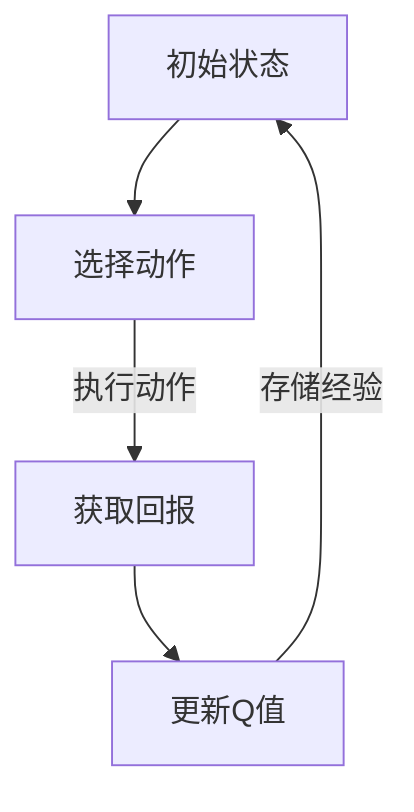

                 

# 文章标题: 一切皆是映射：DQN的云计算与分布式训练方案

> 关键词：DQN, 云计算, 分布式训练, 强化学习, 深度学习

> 摘要：本文深入探讨了深度确定性策略梯度（DQN）算法在云计算与分布式训练场景中的应用。通过详细解析DQN算法的基本原理、云计算基础以及分布式训练技术，本文揭示了DQN算法在云计算与分布式训练中的独特优势和应用实践，为读者提供了一套实用的解决方案，并展望了其未来的发展趋势。

---

## 引言

深度确定性策略梯度（Deep Q-Network，DQN）算法是强化学习领域的一项重要突破，它在解决复杂环境下的决策问题方面展现出了卓越的性能。随着云计算和分布式计算技术的飞速发展，如何高效地将DQN算法应用于大规模分布式环境中成为一个亟待解决的问题。本文旨在通过系统地分析DQN算法的基本原理、云计算与分布式训练的相关技术，探讨DQN在云计算与分布式训练场景中的具体应用和挑战，为相关领域的研究和实践提供指导。

本文的结构如下：

- **第一部分：DQN算法基础**：介绍深度学习和强化学习的基础知识，深入解析DQN算法的数学模型、实现细节以及改进算法。
- **第二部分：云计算基础**：阐述云计算的基本概念、技术架构以及安全与隐私问题。
- **第三部分：分布式训练基础**：探讨分布式训练的基本概念、算法原理以及优化策略。
- **第四部分：DQN在云计算与分布式训练中的应用**：分析DQN在云计算环境中的部署和分布式训练中的实现，并介绍实际应用案例。
- **第五部分：DQN在云计算与分布式训练中的挑战与解决方案**：讨论性能优化、可扩展性和可靠性等问题，并提出相应的解决方案。
- **第六部分：未来展望**：展望DQN在云计算与分布式训练中的发展趋势以及人工智能与云计算的深度融合。
- **附录**：提供DQN算法流程图、分布式训练伪代码以及代码实现示例。

通过本文的阅读，读者将能够全面理解DQN算法在云计算与分布式训练中的潜在价值和应用场景，并为实际项目提供有益的参考。

### 第一部分：DQN算法基础

#### 第1章：深度学习与强化学习基础

##### 1.1 深度学习简介

深度学习是一种重要的机器学习技术，它在处理大规模数据和复杂任务方面具有显著的优势。深度学习的核心思想是通过构建多层神经网络，自动提取数据的特征表示，从而实现高层次的抽象和概括。

深度学习的发展历程可以追溯到1986年，当时深度前馈神经网络（DFFNN）被提出。然而，由于计算能力和数据资源的限制，深度学习的研究和应用一度陷入低谷。随着计算能力和数据资源的迅速提升，深度学习在21世纪初迎来了新的发展机遇。2006年，Hinton等人提出的深度信念网络（DBN）成功训练了图像识别任务，标志着深度学习重新焕发生机。

深度学习的基本原理基于人工神经网络的架构。人工神经网络由大量简单且相互连接的神经元组成，每个神经元都可以接收多个输入信号并产生一个输出信号。通过调整神经元之间的权重，网络可以学习到数据的特征表示，从而实现复杂的函数映射。

深度学习的应用范围非常广泛，包括但不限于图像识别、语音识别、自然语言处理、推荐系统等。例如，深度卷积神经网络（CNN）在图像识别任务中取得了显著的成果，卷积神经网络（CNN）在语音识别中的表现也非常出色。深度循环神经网络（RNN）和长短期记忆网络（LSTM）在自然语言处理领域发挥了重要作用，而生成对抗网络（GAN）则在图像生成和风格迁移方面取得了突破性进展。

##### 1.2 强化学习基础

强化学习（Reinforcement Learning，RL）是机器学习的一个重要分支，旨在通过试错学习来指导智能体在环境中做出最优决策。与监督学习和无监督学习不同，强化学习注重于通过与环境交互来学习，从而实现长期目标。

强化学习的基本概念包括状态（State）、动作（Action）、奖励（Reward）和策略（Policy）。状态是环境在某一时刻的状态描述，动作是智能体可以采取的动作集合，奖励是环境对智能体采取某一动作后的反馈信号，策略是智能体根据当前状态选择动作的规则。

强化学习的主要目标是学习一个最优策略，使得智能体在给定初始状态下能够最大化累积奖励。Q-学习（Q-Learning）是强化学习的一种经典算法，通过学习值函数（Q-值）来指导智能体的决策。Q-值表示在某一状态下采取某一动作所能获得的期望奖励，通过不断更新Q-值，智能体可以逐渐学习到最优策略。

Q-学习算法的基本流程如下：

1. 初始化Q-值表：初始时，所有状态的Q-值都设置为0。
2. 选择动作：在某一状态下，智能体根据当前Q-值表选择一个动作。
3. 执行动作：智能体执行选定的动作，并观察环境反馈的奖励信号。
4. 更新Q-值：根据实际获得的奖励信号，更新当前状态的Q-值。
5. 转移到下一个状态：智能体转移到下一个状态，重复执行步骤2至步骤4。

通过不断迭代执行以上步骤，智能体可以逐渐学习到最优策略，从而在复杂环境中做出最优决策。

##### 1.3 深度确定性策略梯度（DQN）

深度确定性策略梯度（Deep Q-Network，DQN）算法是强化学习领域的一项重要进展，它在解决具有高维状态空间和动作空间的问题方面具有显著的优势。DQN算法结合了深度神经网络和Q-学习的基本原理，通过学习深度神经网络来近似Q-值函数，从而实现智能体的决策。

DQN算法的提出背景可以追溯到2013年，当时DeepMind实验室的研究人员提出了一种基于深度神经网络的Q-学习算法。与传统的Q-学习算法不同，DQN算法通过引入经验回放机制（Experience Replay）和固定目标网络（Target Network）来提高算法的收敛速度和稳定性。

DQN算法的基本原理如下：

1. **状态空间与动作空间的定义**：在DQN算法中，状态空间是指智能体在环境中所处的各种可能状态，动作空间是指智能体可以采取的所有可能动作。对于具有高维状态空间和动作空间的问题，传统的Q-学习算法难以处理。DQN算法通过引入深度神经网络，可以将高维状态空间和动作空间映射到低维特征空间，从而简化问题的复杂性。

2. **Q值的定义与更新策略**：在DQN算法中，Q-值表示在某一状态下采取某一动作所能获得的期望奖励。Q-值的更新策略是通过选择动作、执行动作和更新Q-值表来实现的。与传统的Q-学习算法不同，DQN算法通过深度神经网络来近似Q-值函数，从而避免了直接计算Q-值。深度神经网络的输入是当前状态，输出是Q-值的预测值。

DQN算法的更新策略如下：

- 初始化Q-值表：初始时，所有状态的Q-值都设置为0。
- 选择动作：在某一状态下，智能体根据当前Q-值表选择一个动作。
- 执行动作：智能体执行选定的动作，并观察环境反馈的奖励信号。
- 存储经验：将当前状态、动作和奖励存储到经验回放池中。
- 从经验回放池中随机抽取一批经验：根据经验回放池中的经验，随机抽取一批包含当前状态、动作和奖励的数据。
- 更新Q-值：根据抽取的批量经验，使用深度神经网络计算Q-值的预测值，并更新Q-值表。

通过不断迭代执行以上步骤，智能体可以逐渐学习到最优策略，从而在复杂环境中做出最优决策。

#### 第2章：DQN算法的深入解析

##### 2.1 DQN算法的数学模型

DQN算法的数学模型主要包括状态空间、动作空间、Q值以及更新策略。以下是对这些核心概念的详细解释。

1. **状态空间与动作空间的定义**：
   - **状态空间**：状态空间是智能体在环境中可能出现的所有状态的集合。在DQN算法中，状态通常由一组特征向量表示，这些特征向量可以是连续的或者离散的。
   - **动作空间**：动作空间是智能体可以采取的所有可能动作的集合。与状态空间类似，动作空间也可以是连续的或者离散的。在实际应用中，动作空间通常是离散的，因为连续动作的处理比较复杂。

2. **Q值的定义**：
   - **Q值**：Q值表示在某一状态下采取某一动作所能获得的期望回报。在DQN算法中，Q值是通过深度神经网络预测的。Q值的计算公式如下：
     $$
     Q(s, a) = r + \gamma \max_{a'} Q(s', a')
     $$
     其中，$s$表示当前状态，$a$表示采取的动作，$r$表示立即回报，$\gamma$表示折扣因子，$s'$表示采取动作后的状态，$a'$表示在状态$s'$下采取的动作。这个公式表示，在当前状态下，采取某一动作所获得的回报等于立即回报加上在下一个状态下采取最优动作所获得的期望回报。

3. **更新策略**：
   - **经验回放**：为了解决样本相关性的问题，DQN算法引入了经验回放机制。经验回放池是一个缓冲区，用于存储之前经历过的状态、动作和奖励。在更新Q值时，DQN算法从经验回放池中随机抽取一批样本，而不是按照样本出现的顺序进行更新。这种方法可以避免算法陷入局部最优，提高收敛速度。
   - **目标网络**：DQN算法中还引入了目标网络（Target Network）。目标网络的目的是减少目标Q值的噪声，提高算法的稳定性。目标网络是另一个深度神经网络，它与主网络共享权重，但在训练过程中会稍微延迟更新。在每次Q值更新时，目标网络的Q值被用作目标Q值，而主网络的Q值用于预测。

DQN算法的更新策略可以分为以下步骤：

1. 初始化Q值表和目标网络。
2. 选择一个初始状态$s$。
3. 从Q值表中选择一个动作$a$。
4. 执行动作$a$，并获得立即回报$r$。
5. 将经历的状态$s$、动作$a$和回报$r$存储到经验回放池中。
6. 从经验回放池中随机抽取一批样本。
7. 对于每个样本$(s, a, r)$，使用主网络预测Q值$Q(s, a)$。
8. 使用目标网络计算目标Q值$Q'(s', a')$，其中$s'$是采取动作后的状态，$a'$是在状态$s'$下采取的动作。
9. 根据目标Q值和实际的Q值计算差异，更新主网络的权重。

通过上述更新策略，DQN算法可以逐渐学习到最优策略，从而在复杂环境中做出最优决策。

##### 2.2 DQN算法的实现细节

DQN算法的实现细节包括经验回放机制、学习率与折扣率的设置以及算法的改进。以下是对这些关键细节的详细解释。

1. **经验回放机制**：
   - **经验回放机制**是为了解决样本相关性问题而引入的。在传统的Q-学习算法中，每次更新Q值时，都是基于最近的样本进行更新，这可能导致算法在训练过程中陷入局部最优，无法收敛到全局最优解。经验回放机制通过将过去的样本存储在经验回放池中，并在每次更新时随机抽取样本，从而避免了样本相关性问题，提高了算法的收敛速度和稳定性。
   - **经验回放池**是一个固定大小的缓冲区，用于存储过去经历的状态、动作和奖励。在DQN算法中，经验回放池通常使用循环队列来实现，当队列满时，新的样本会覆盖最旧的样本。

2. **学习率与折扣率**：
   - **学习率**（learning rate）是DQN算法中的一个重要参数，用于控制每次更新Q值时权重更新的步长。学习率的选择直接影响算法的收敛速度和稳定性。学习率太大可能导致算法过早地收敛到局部最优，而学习率太小则可能使算法收敛速度过慢。在DQN算法中，通常使用指数衰减的方式来动态调整学习率，即每次迭代后，学习率按一定比例递减。
   - **折扣率**（discount factor）是另一个重要的参数，用于控制未来回报的重要性。折扣率越大，未来的回报对当前决策的影响越小。折扣率的取值通常在0和1之间，常见的取值为0.9或0.99。在DQN算法中，折扣率的设置会影响Q值的更新策略，从而影响算法的收敛速度和稳定性。

3. **算法改进**：
   - **双DQN（Double DQN）**：双DQN算法是DQN算法的一个改进版本，它通过引入双网络结构来减少目标Q值的偏差。在双DQN算法中，一个网络用于预测当前的Q值，另一个网络用于计算目标Q值。在每次更新Q值时，当前网络的Q值用于选择动作，而目标网络的Q值用于计算目标Q值。这种方法可以减少目标Q值的噪声，提高算法的稳定性和收敛速度。
   - **智能体对抗网络（Dueling DQN）**：智能体对抗网络（Dueling DQN）是另一种改进的DQN算法，它在Q值函数中引入了优势值（advantage value）和状态值（state value）。优势值表示采取某一动作相较于其他动作的额外回报，状态值表示当前状态的价值。通过结合优势值和状态值，Dueling DQN可以更好地平衡短期回报和长期回报，从而提高算法的收敛速度和性能。

通过引入经验回放机制、动态调整学习率和折扣率，以及改进算法结构，DQN算法在解决复杂强化学习问题时表现出较高的稳定性和收敛速度。

##### 2.3 DQN算法的改进

DQN算法在解决具有高维状态空间和动作空间的问题时表现出较高的性能，但仍然存在一些局限性。为了进一步提高算法的稳定性和性能，研究者提出了一系列改进方法。以下是对这些改进算法的详细解析。

1. **双DQN（Double DQN）**

双DQN算法是DQN算法的一种改进版本，它通过引入双网络结构来减少目标Q值的偏差。在DQN算法中，主网络用于预测当前的Q值，而目标网络用于计算目标Q值。然而，这种设计可能导致目标Q值的噪声较大，影响算法的稳定性和收敛速度。双DQN算法通过引入双网络结构来解决这个问题。

在双DQN算法中，有两个独立的神经网络：一个用于选择动作（通常称为行为网络），另一个用于计算目标Q值（通常称为目标网络）。行为网络和目标网络共享相同的权重初始化，但在训练过程中，目标网络会稍微延迟更新。具体来说，每次更新Q值时，使用行为网络选择动作，而使用目标网络计算目标Q值。这种方法可以减少目标Q值的噪声，提高算法的稳定性和收敛速度。

双DQN算法的基本步骤如下：

- 初始化行为网络和目标网络的权重。
- 从环境中获取一个初始状态$s$。
- 使用行为网络选择一个动作$a$。
- 执行动作$a$，并获得立即回报$r$。
- 将状态$s$、动作$a$和回报$r$存储到经验回放池中。
- 从经验回放池中随机抽取一批样本。
- 对于每个样本$(s, a, r)$，使用行为网络计算当前的Q值$Q(s, a)$。
- 使用目标网络计算目标Q值$Q'(s', a')$，其中$s'$是采取动作后的状态，$a'$是在状态$s'$下采取的动作。
- 根据目标Q值和实际的Q值计算差异，更新行为网络的权重。

通过引入双网络结构，双DQN算法可以减少目标Q值的噪声，提高算法的稳定性和收敛速度。

2. **智能体对抗网络（Dueling DQN）**

智能体对抗网络（Dueling DQN）是另一种改进的DQN算法，它在Q值函数中引入了优势值（advantage value）和状态值（state value）。优势值表示采取某一动作相较于其他动作的额外回报，状态值表示当前状态的价值。通过结合优势值和状态值，Dueling DQN可以更好地平衡短期回报和长期回报，从而提高算法的收敛速度和性能。

在Dueling DQN算法中，Q值函数被分解为状态值和优势值的加和。具体来说，Q值函数可以表示为：

$$
Q(s, a) = V(s) + A(s, a)
$$

其中，$V(s)$表示状态值，$A(s, a)$表示优势值。状态值$V(s)$表示当前状态的价值，优势值$A(s, a)$表示采取动作$a$相较于其他动作的额外回报。通过这种方式，Dueling DQN可以更好地平衡短期回报和长期回报。

Dueling DQN算法的基本步骤如下：

- 初始化行为网络和目标网络的权重。
- 从环境中获取一个初始状态$s$。
- 使用行为网络选择一个动作$a$。
- 执行动作$a$，并获得立即回报$r$。
- 将状态$s$、动作$a$和回报$r$存储到经验回放池中。
- 从经验回放池中随机抽取一批样本。
- 对于每个样本$(s, a, r)$，使用行为网络计算状态值$V(s)$和优势值$A(s, a)$。
- 使用目标网络计算目标Q值$Q'(s', a')$，其中$s'$是采取动作后的状态，$a'$是在状态$s'$下采取的动作。
- 根据目标Q值和实际的Q值计算差异，更新行为网络的权重。

通过引入优势值和状态值，Dueling DQN算法可以更好地平衡短期回报和长期回报，从而提高算法的收敛速度和性能。

综上所述，双DQN和Dueling DQN算法通过引入双网络结构和改进Q值函数，有效地提高了DQN算法的稳定性和性能。这些改进方法在解决具有高维状态空间和动作空间的问题时表现出较高的性能，为深度强化学习领域的发展做出了重要贡献。

### 第二部分：云计算基础

#### 第3章：云计算基础

##### 3.1 云计算的概念与分类

云计算是一种基于互联网的计算模式，它通过互联网将计算资源（如服务器、存储、网络等）动态分配给用户，使用户可以按需使用这些资源，而无需拥有和管理这些资源。云计算的核心思想是实现资源的动态分配和高效利用，从而提高计算效率、降低成本，并增强灵活性。

**云计算的基本概念**：

1. **云计算服务模式**：云计算服务模式包括三种主要类型，即基础设施即服务（IaaS）、平台即服务（PaaS）和软件即服务（SaaS）。
   - **基础设施即服务（IaaS）**：IaaS提供虚拟化的计算资源，如虚拟机、存储和网络等，用户可以按需使用这些资源，并按使用量付费。IaaS为用户提供了高度可扩展的计算能力，用户可以根据需求灵活调整资源。
   - **平台即服务（PaaS）**：PaaS提供开发平台和工具，如开发环境、数据库、Web服务框架等，用户可以在这些平台上开发和部署应用程序。PaaS简化了应用程序的开发和部署过程，降低了开发成本和复杂度。
   - **软件即服务（SaaS）**：SaaS提供应用程序作为服务，用户可以通过互联网访问和使用这些应用程序，无需安装和配置。SaaS为用户提供了便捷的应用程序访问方式，降低了使用成本。

2. **云计算的技术架构**：云计算的技术架构主要包括以下层次：
   - **基础设施层**：基础设施层包括服务器、存储、网络等硬件资源，以及虚拟化技术。虚拟化技术是实现云计算的核心技术，它通过虚拟化软件将物理资源抽象成逻辑资源，实现资源的动态分配和管理。
   - **平台层**：平台层包括操作系统、数据库、中间件等软件资源，为用户提供了开发和运行应用程序的平台。平台层提供了丰富的开发工具和框架，支持不同类型的应用程序开发和部署。
   - **应用层**：应用层包括各种应用程序和服务，如Web应用、大数据处理、人工智能应用等。应用层为用户提供定制化的应用服务，满足不同场景的需求。

**云计算的分类**：

云计算根据不同的维度可以进行多种分类：

1. **按服务模式分类**：
   - **公有云**：公有云由第三方云服务提供商运营和管理，多个用户共享云计算资源。公有云具有灵活性高、成本低的优点，适用于企业级应用和大规模数据处理。
   - **私有云**：私有云为单个组织或企业独占，用于内部应用程序和数据管理。私有云具有安全性高、定制性强的优点，适用于企业内部敏感数据和关键业务系统的部署。
   - **混合云**：混合云结合了公有云和私有云的优势，根据不同的应用场景和需求，灵活选择和调配资源。混合云适用于企业级应用，可以实现资源优化和业务连续性。

2. **按部署方式分类**：
   - **本地云**：本地云是在组织内部部署的云计算环境，通过本地网络连接服务器、存储和网络设备。本地云适用于企业内部的数据处理和业务系统部署。
   - **远程云**：远程云是由第三方云服务提供商提供的云计算资源，通过互联网连接服务器、存储和网络设备。远程云适用于跨地域的数据处理和业务系统部署。

3. **按应用领域分类**：
   - **基础设施云**：基础设施云主要用于提供虚拟化计算资源，如虚拟机、存储和网络等，支持各类基础设施的部署和管理。
   - **平台云**：平台云主要用于提供开发平台和工具，支持应用程序的开发和部署，如PaaS服务。
   - **应用云**：应用云主要用于提供各种应用程序和服务，如SaaS服务，满足不同领域的应用需求。

**云计算的特点**：

云计算具有以下特点：

1. **灵活性**：云计算可以根据用户需求动态调整资源，支持弹性扩展和灵活部署，适用于不同规模和类型的应用场景。
2. **成本效益**：云计算通过共享资源、降低硬件和维护成本，提高了资源利用效率，降低了总体拥有成本。
3. **可扩展性**：云计算可以支持大规模数据处理和分布式计算，提供强大的计算能力和存储资源，适用于大数据和复杂应用场景。
4. **高可用性**：云计算通过分布式架构和冗余设计，提供高可用性和可靠性，确保业务连续性和数据安全。
5. **安全性**：云计算通过数据加密、访问控制和安全策略，保障用户数据和应用程序的安全性。

**云计算的应用场景**：

云计算在各个领域都有广泛的应用场景，以下是一些典型的应用场景：

1. **企业级应用**：云计算为企业提供了灵活、高效的计算资源和平台，适用于企业内部的数据处理、业务系统部署和IT资源管理。
2. **大数据处理**：云计算提供了强大的计算能力和存储资源，支持大规模数据处理和实时分析，适用于大数据分析和人工智能应用。
3. **人工智能应用**：云计算为人工智能应用提供了高效的计算资源和开发平台，支持深度学习、图像识别、自然语言处理等人工智能技术的研发和应用。
4. **物联网应用**：云计算为物联网应用提供了数据存储、处理和分析平台，支持物联网设备的远程监控和管理，实现物联网应用的可扩展性和灵活性。
5. **灾难恢复**：云计算提供了可靠的灾难恢复解决方案，通过数据备份和远程部署，确保业务系统的连续性和数据安全性。

综上所述，云计算作为一种新型的计算模式，具有灵活、高效、安全、可靠的优点，在各个领域都得到了广泛的应用。随着云计算技术的不断发展和创新，云计算将在未来发挥更大的作用，推动各行各业的发展和变革。

##### 3.2 云计算的技术架构

云计算的技术架构是构建云计算平台的基础，它涵盖了硬件基础设施、软件平台和数据处理等多个层次，以实现资源的动态分配和管理。以下是对云计算技术架构的详细解释。

**硬件基础设施**

云计算的硬件基础设施主要包括服务器、存储设备、网络设备等硬件资源。这些硬件资源通过虚拟化技术进行抽象和整合，实现资源的灵活分配和高效利用。

1. **服务器**：服务器是云计算平台的核心计算设备，负责处理应用程序的运行和数据的存储。服务器通常采用高性能、高可靠性的硬件配置，以满足大规模计算和存储的需求。服务器可以通过虚拟化技术划分为多个虚拟机（VM），每个虚拟机可以独立运行不同的应用程序。

2. **存储设备**：存储设备用于存储应用程序数据、文件和日志等。云计算平台通常采用分布式存储架构，将数据分散存储在多个存储设备上，以提高数据的可靠性和访问速度。分布式存储系统还支持数据的自动备份和容灾，确保数据的安全性和可用性。

3. **网络设备**：网络设备包括交换机、路由器和防火墙等，用于连接服务器、存储设备和外部网络，实现数据传输和网络隔离。云计算平台通过网络设备提供高速、可靠的网络连接，支持跨地域的数据传输和分布式计算。

**虚拟化技术**

虚拟化技术是云计算技术架构的核心，它通过虚拟化软件将物理硬件资源抽象成逻辑资源，实现资源的灵活分配和管理。

1. **服务器虚拟化**：服务器虚拟化通过虚拟化软件将物理服务器抽象成多个虚拟机，每个虚拟机拥有独立的操作系统和应用程序。服务器虚拟化提高了硬件资源的利用率，降低了维护成本，并提供了灵活的部署和管理方式。

2. **存储虚拟化**：存储虚拟化通过虚拟化软件将物理存储设备抽象成逻辑存储资源，实现存储资源的动态分配和扩展。存储虚拟化提高了存储空间的利用率，简化了存储管理，并提供了数据备份和容灾功能。

3. **网络虚拟化**：网络虚拟化通过虚拟化软件将物理网络抽象成逻辑网络，实现网络资源的动态分配和隔离。网络虚拟化提高了网络的灵活性和可靠性，支持跨地域的网络连接和分布式计算。

**软件平台**

云计算的软件平台包括操作系统、中间件、开发工具和云服务管理等，为用户提供了开发和运行应用程序的平台。

1. **操作系统**：云计算平台通常采用开源操作系统，如Linux或Unix，提供稳定的运行环境和丰富的功能。操作系统支持虚拟化技术，并提供资源管理、调度和安全性等功能。

2. **中间件**：中间件包括数据库、消息队列、缓存等，为应用程序提供数据处理和通信支持。中间件通过云计算平台实现分布式计算和数据存储，提高系统的性能和可靠性。

3. **开发工具**：开发工具包括集成开发环境（IDE）、版本控制工具和云计算开发框架等，支持应用程序的开发和部署。开发工具通过云计算平台提供高效的开发和调试环境，简化了开发过程。

4. **云服务管理**：云服务管理包括资源管理、调度和监控等，为用户提供了便捷的资源管理和监控工具。云服务管理通过云计算平台实现资源的自动分配和优化，提高资源利用率和系统性能。

**数据处理**

云计算平台提供强大的数据处理能力，支持数据存储、处理和分析等。

1. **数据存储**：云计算平台采用分布式存储架构，提供高可靠性和高可扩展性的数据存储服务。分布式存储系统支持数据备份和容灾，确保数据的安全性和可用性。

2. **数据处理**：云计算平台提供高性能的计算资源，支持大规模数据处理和实时分析。数据处理包括数据清洗、转换和聚合等操作，为用户提供准确和可靠的数据。

3. **数据分析**：云计算平台提供数据分析和可视化工具，支持数据分析、报表生成和机器学习等。数据分析帮助用户从海量数据中提取有价值的信息，指导业务决策和优化。

**云计算平台架构**

云计算平台通常采用分布式架构，通过多个节点实现资源的分布式存储和计算。以下是一个典型的云计算平台架构：

1. **计算节点**：计算节点包括虚拟机和容器，负责处理应用程序的运行和数据计算。计算节点通过分布式调度和管理系统实现负载均衡和资源优化。

2. **存储节点**：存储节点包括分布式存储设备和数据库，负责存储应用程序数据、文件和日志等。存储节点通过分布式存储系统实现数据的冗余备份和容灾。

3. **网络节点**：网络节点包括交换机、路由器和防火墙等，负责连接计算节点和存储节点，实现数据传输和网络隔离。网络节点通过负载均衡和网络安全机制提供高效、可靠的网络连接。

4. **管理节点**：管理节点包括云服务管理系统和监控工具，负责管理云计算平台的资源、调度和监控。管理节点通过自动化脚本和监控工具实现资源的动态分配和优化。

**云计算技术的优势**

云计算的技术架构通过虚拟化技术、分布式存储和计算等，实现了资源的灵活分配和高效利用。以下是云计算技术的优势：

1. **灵活性**：云计算平台可以根据用户需求动态调整资源，支持不同类型的应用程序和业务需求。

2. **成本效益**：云计算通过共享资源、降低硬件和维护成本，提高了资源利用效率，降低了总体拥有成本。

3. **可扩展性**：云计算平台支持大规模数据处理和分布式计算，提供强大的计算能力和存储资源，适用于大数据和复杂应用场景。

4. **高可用性**：云计算平台通过分布式架构和冗余设计，提供高可用性和可靠性，确保业务连续性和数据安全。

5. **安全性**：云计算平台通过数据加密、访问控制和安全策略，保障用户数据和应用程序的安全性。

综上所述，云计算的技术架构通过虚拟化技术、分布式存储和计算等，实现了资源的灵活分配和高效利用。云计算平台具有灵活性高、成本效益好、可扩展性强、高可用性和安全性高等优势，在各个领域都得到了广泛的应用。随着云计算技术的不断发展和创新，云计算将在未来发挥更大的作用，推动各行各业的发展和变革。

##### 3.3 云计算的安全与隐私

云计算作为一种新兴的计算模式，在提供灵活、高效、可扩展的计算资源的同时，也带来了安全与隐私方面的一系列挑战。如何保障云计算环境中的数据安全和用户隐私，是云计算领域的一个重要课题。

**云计算安全挑战**

1. **数据泄露**：云计算环境中，数据存储在第三方提供商的管理下，用户无法直接控制数据存储位置和存储方式。这可能导致数据泄露的风险，特别是在数据传输和存储过程中，如果加密措施不足，数据容易被窃取或篡改。

2. **数据完整性**：数据完整性是指数据在传输和存储过程中不被未经授权的实体篡改或损坏。云计算环境中，数据可能会在多个节点之间传输和存储，数据完整性难以保证。

3. **访问控制**：访问控制是指通过身份验证和授权机制，确保只有授权用户可以访问特定资源。在云计算环境中，如何实现精细的访问控制，防止未授权访问和内部威胁，是一个重要问题。

4. **系统漏洞**：云计算平台由多个组件和系统组成，每个组件都可能存在漏洞。黑客可能会利用这些漏洞攻击云平台，导致数据泄露或系统瘫痪。

**隐私保护技术**

为了应对云计算中的安全挑战，研究人员提出了多种隐私保护技术，以下是一些主要的技术手段：

1. **数据加密**：数据加密是保护数据安全的基本手段。在数据传输和存储过程中，对数据进行加密，可以防止数据被窃取或篡改。常用的加密算法包括对称加密和非对称加密。

2. **访问控制**：访问控制通过身份验证和授权机制，确保只有授权用户可以访问特定资源。在云计算环境中，访问控制可以基于用户身份、角色和权限进行设置，实现对数据的精细访问控制。

3. **数据备份与恢复**：数据备份与恢复是保障数据完整性和可用性的重要措施。在云计算环境中，定期进行数据备份，并在出现故障时能够快速恢复数据，可以降低数据丢失的风险。

4. **安全审计与监控**：安全审计与监控通过记录和分析系统日志，发现潜在的安全威胁和异常行为。在云计算环境中，实时监控系统活动，可以及时发现并应对安全事件。

5. **多方安全计算**：多方安全计算是一种在分布式环境下保护数据隐私和确保计算结果安全的技术。通过多方安全计算，参与方可以在不共享原始数据的情况下，共同完成计算任务，从而保护数据隐私。

**云计算安全与隐私的实践案例**

以下是一些云计算安全与隐私的实践案例：

1. **医疗数据分析**：在医疗数据分析中，患者数据的安全性是首要考虑的问题。通过数据加密、访问控制和多方安全计算等技术，可以确保患者数据在云计算环境中的安全性和隐私保护。

2. **金融交易系统**：金融交易系统对数据安全和隐私保护有严格的要求。在云计算环境中，通过访问控制、安全审计和多方安全计算等技术，可以确保金融交易的安全性，防止数据泄露和欺诈行为。

3. **物联网应用**：物联网应用涉及大量设备和数据的交互，数据安全和隐私保护至关重要。通过数据加密、访问控制和安全监控等技术，可以确保物联网数据在云计算环境中的安全和隐私。

综上所述，云计算在提供灵活、高效计算资源的同时，也带来了安全与隐私方面的挑战。通过数据加密、访问控制、数据备份与恢复、安全审计与监控和多方安全计算等技术手段，可以有效地保护云计算环境中的数据安全和用户隐私。随着云计算技术的不断发展和应用场景的扩展，云计算安全与隐私问题将得到更多的关注和解决。

### 第三部分：分布式训练基础

#### 第4章：分布式训练基础

##### 4.1 分布式训练的基本概念

分布式训练（Distributed Training）是深度学习领域的一项重要技术，它通过将训练任务分布在多个计算节点上，以加快训练速度和提升计算性能。随着深度学习模型的复杂性和数据量的增加，分布式训练成为了一种有效的解决方案。以下是对分布式训练的基本概念的详细解释。

**分布式训练的目的与优势**

**目的**：

分布式训练的主要目的是通过利用多个计算节点来提高深度学习模型的训练速度和计算性能。具体来说，分布式训练包括以下目的：

1. **加速训练**：深度学习模型通常需要大量的训练时间，尤其是在大规模数据集上训练时。分布式训练可以将训练任务分解为多个子任务，并行地在多个节点上执行，从而显著缩短训练时间。
2. **提升计算性能**：分布式训练可以利用多个计算节点来提高计算性能。通过将模型参数分布在多个节点上，可以同时处理更多的数据，提高模型的训练速度和准确度。
3. **应对大规模数据集**：分布式训练可以处理大规模的数据集，这是单机训练难以实现的。通过将数据集拆分为多个子集，分布式训练可以在多个节点上同时处理这些子集，提高数据处理效率。

**优势**：

分布式训练具有以下优势：

1. **并行计算**：分布式训练通过并行计算来提高训练速度。在单机训练中，模型参数的更新和梯度计算是串行进行的，而分布式训练可以将这些操作并行化，从而加速训练过程。
2. **负载均衡**：分布式训练可以在多个节点上均衡地分配训练任务，避免某些节点负载过高，从而提高整个系统的性能和资源利用率。
3. **可扩展性**：分布式训练具有良好的可扩展性，可以轻松地增加或减少计算节点，以适应不同规模的任务和数据集。
4. **高可用性**：分布式训练通过在多个节点上备份数据和模型参数，提高了系统的可用性和容错性。即使在某个节点出现故障的情况下，其他节点仍然可以继续训练，从而确保训练任务的连续性。

**分布式训练的挑战**

尽管分布式训练具有显著的优势，但它在实际应用中也面临一些挑战：

1. **通信开销**：分布式训练需要在节点之间传输大量的数据和梯度信息，这可能导致通信开销较大，影响训练速度。如何优化通信机制和减少通信开销是分布式训练的一个重要挑战。
2. **同步与异步训练**：在分布式训练中，同步训练和异步训练是两种常见的训练方式。同步训练需要在所有节点上完成梯度计算后进行参数更新，这可能导致训练时间较长。异步训练允许节点在局部梯度计算完成后立即更新参数，从而加快训练速度。然而，异步训练可能导致梯度不一致和模型不稳定。
3. **负载均衡与资源分配**：分布式训练需要合理地分配计算资源和任务，以避免某些节点负载过高或资源浪费。如何实现负载均衡和优化资源分配是分布式训练的一个重要问题。
4. **容错性与故障恢复**：在分布式训练中，节点可能会出现故障或网络中断等问题，如何确保训练任务的连续性和数据一致性是一个挑战。实现高效的容错和故障恢复机制对于分布式训练至关重要。

**分布式训练的体系结构**

分布式训练的体系结构通常包括以下几个关键组件：

1. **训练任务分配器**：训练任务分配器负责将训练任务分配给不同的计算节点。它可以根据节点的负载情况和任务需求，动态调整任务分配策略，以实现负载均衡和资源优化。
2. **通信机制**：通信机制用于节点之间的数据传输和梯度交换。常用的通信机制包括同步通信和异步通信。同步通信确保所有节点在完成梯度计算后进行参数更新，而异步通信允许节点在局部梯度计算完成后立即更新参数。
3. **参数服务器**：参数服务器是分布式训练的核心组件，它负责存储和更新模型参数。在分布式训练中，参数服务器可以集中存储模型参数，并在所有节点之间共享和同步参数。
4. **数据存储与处理**：分布式训练需要存储和处理大量的训练数据。数据存储与处理组件负责管理数据集的存储、加载和预处理，以支持分布式训练的快速和高效执行。

**分布式训练的基本流程**

分布式训练的基本流程包括以下几个步骤：

1. **初始化**：初始化模型参数、训练任务分配器和通信机制，并为每个节点分配训练任务。
2. **数据加载与预处理**：每个节点从数据存储组件中加载训练数据，并进行必要的预处理操作，如数据清洗、归一化等。
3. **局部梯度计算**：每个节点使用局部数据集对模型进行局部梯度计算，并更新局部参数。
4. **梯度交换与参数更新**：通过通信机制，节点之间交换局部梯度信息，并更新全局参数。在同步训练中，所有节点需要在完成梯度交换后进行参数更新。在异步训练中，节点可以在局部梯度计算完成后立即更新参数。
5. **模型评估与调整**：在每个训练迭代结束后，使用验证数据集对模型进行评估，并根据评估结果调整训练参数，如学习率、正则化参数等。
6. **训练结束**：当满足训练终止条件（如达到预定的迭代次数或验证误差达到预设阈值）时，训练过程结束。

通过以上步骤，分布式训练可以有效地利用多个计算节点，加快模型训练速度和提高计算性能。在实际应用中，分布式训练可以根据具体需求选择不同的训练方式、通信机制和优化策略，以满足不同的训练目标和应用场景。

##### 4.2 分布式训练的算法原理

分布式训练的算法原理涉及如何将训练任务拆分为多个子任务，并利用多个计算节点并行执行这些子任务，从而加速模型的训练过程。以下是对分布式训练算法原理的详细解释。

**数据并行训练**

数据并行训练（Data Parallel Training）是一种最常见的分布式训练方法，它通过将数据集划分为多个子集，每个子集由不同的计算节点处理，从而实现并行训练。数据并行训练的核心思想是将计算任务分布在多个节点上，每个节点独立计算梯度并更新局部参数，最后将局部参数合并为全局参数。

数据并行训练的基本步骤如下：

1. **数据划分**：将训练数据集划分为多个子集，每个子集的大小与计算节点的数量相匹配。假设有N个节点，每个节点处理$\frac{N}{N}$个样本。
2. **模型复制**：在每个节点上复制一份模型参数，每个节点独立进行梯度计算和参数更新。
3. **梯度计算**：每个节点使用本地数据集计算梯度，并更新局部参数。
4. **参数同步**：在训练迭代过程中，将每个节点的局部参数同步到全局参数，通常采用平均策略，即全局参数更新为所有局部参数的平均值。
5. **模型评估**：在每个训练迭代结束后，使用验证数据集对模型进行评估，并根据评估结果调整训练参数。

数据并行训练的优点是计算速度快，可以充分利用多个计算节点的计算能力。然而，数据并行训练也存在一些缺点：

- **通信开销**：节点之间的参数同步和梯度交换需要大量的通信开销，这可能导致训练时间增加。
- **收敛速度**：数据并行训练可能会导致梯度的不一致，影响模型的收敛速度。

**模型并行训练**

模型并行训练（Model Parallel Training）是一种针对复杂深度学习模型（如含有大量参数和多层神经网络的模型）的分布式训练方法。模型并行训练通过将模型拆分为多个部分，每个部分由不同的计算节点处理，从而实现并行训练。

模型并行训练的基本步骤如下：

1. **模型拆分**：将深度学习模型拆分为多个部分，每个部分包含一部分参数和一层神经网络。拆分的策略可以根据计算节点的资源能力和模型结构来确定。
2. **模型分配**：将拆分后的模型分配给不同的计算节点，每个节点负责处理一部分模型。
3. **梯度计算**：每个节点使用本地数据集计算梯度，并更新局部参数。
4. **参数同步**：在每个训练迭代结束后，将每个节点的局部参数同步到全局参数，通常采用平均策略。
5. **模型评估**：在每个训练迭代结束后，使用验证数据集对模型进行评估，并根据评估结果调整训练参数。

模型并行训练的优点是可以在单个节点上处理复杂的模型，从而降低通信开销和提高训练速度。然而，模型并行训练也存在一些缺点：

- **计算开销**：模型拆分和分配需要额外的计算开销，这可能导致训练时间增加。
- **同步策略**：模型并行训练需要选择合适的同步策略，以避免梯度不一致和模型不稳定。

**分布式训练的优化策略**

为了提高分布式训练的效率和性能，研究人员提出了一系列优化策略，以下是一些常见的优化策略：

1. **梯度压缩**：梯度压缩通过将每个节点的梯度压缩到相同的维度，减少通信开销。常用的梯度压缩方法包括梯度截断（Gradient Clipping）和层归一化（Layer Normalization）。
2. **异步训练**：异步训练允许节点在局部梯度计算完成后立即更新参数，而不是等待所有节点完成梯度计算。异步训练可以显著加快训练速度，但需要解决梯度不一致和模型不稳定的问题。
3. **参数服务器架构**：参数服务器架构通过在中央服务器上存储和同步模型参数，减少节点之间的通信开销。参数服务器架构适用于大规模分布式训练，但需要解决数据传输延迟和一致性等问题。
4. **数据预处理**：数据预处理可以在训练之前对数据进行预处理操作，如数据清洗、归一化和数据增强等。数据预处理可以减少模型训练的复杂度和提高训练效果。

通过以上优化策略，分布式训练可以在不同场景下实现高效的模型训练和计算性能。分布式训练的算法原理和优化策略为深度学习模型的训练提供了有力的支持，推动了深度学习技术在各个领域的应用。

### 第四部分：DQN在云计算与分布式训练中的应用

#### 第5章：DQN在云计算与分布式训练中的应用

随着云计算和分布式计算技术的不断发展，深度确定性策略梯度（DQN）算法在云计算和分布式训练场景中的应用日益广泛。DQN算法以其高效性和稳定性，在处理复杂决策问题时展现了显著的优势。本章将探讨DQN算法在云计算和分布式训练中的部署、实现及其在实际应用中的具体案例。

##### 5.1 DQN在云计算环境中的部署

在云计算环境中部署DQN算法，主要涉及以下几个关键步骤：

1. **云计算资源的选择**：

   选择合适的云计算资源是DQN算法在云计算环境中部署的第一步。根据训练任务的需求，可以选择不同的云计算服务模式，如基础设施即服务（IaaS）、平台即服务（PaaS）和软件即服务（SaaS）。

   - **IaaS**：IaaS提供了虚拟化计算资源，如虚拟机（VM）和容器，用户可以根据需要配置和部署DQN算法。IaaS具有灵活性高、定制性强等优点，适用于大规模分布式训练任务。
   - **PaaS**：PaaS提供了开发平台和工具，如编程语言、数据库和Web服务框架，用户可以在这些平台上开发和部署DQN算法。PaaS简化了部署过程，提高了开发效率。
   - **SaaS**：SaaS提供了预配置的应用程序作为服务，用户可以通过互联网直接访问和使用DQN算法。SaaS适用于不需要自定义开发和配置的简单应用场景。

2. **DQN模型的部署流程**：

   在云计算环境中部署DQN模型，通常需要以下步骤：

   - **模型设计**：根据具体任务需求，设计DQN模型的架构和参数，如神经网络结构、学习率、折扣率等。
   - **环境配置**：在云计算环境中配置所需的计算资源、存储资源和网络资源，确保DQN模型可以正常运行。
   - **模型训练**：在云计算环境中启动训练任务，使用分布式训练框架（如TensorFlow、PyTorch等）进行DQN模型的训练。在分布式训练过程中，可以根据任务需求调整训练策略和参数，以优化训练效果。
   - **模型评估**：在训练完成后，使用验证数据集对DQN模型进行评估，检查模型的性能和收敛情况。根据评估结果，可以调整模型参数和训练策略，进一步提高模型性能。
   - **模型部署**：将训练好的DQN模型部署到生产环境中，供实际应用使用。在部署过程中，可以根据实际应用场景调整模型的输入和输出格式，确保模型可以正常运行。

##### 5.2 DQN在分布式训练中的实现

DQN算法在分布式训练中的实现，旨在利用多个计算节点提高训练效率和性能。以下是对DQN在分布式训练中的实现步骤的详细说明：

1. **数据划分与分发**：

   在分布式训练中，首先需要将训练数据集划分为多个子集，每个子集由不同的计算节点处理。数据划分策略可以根据数据集的特点和计算节点的资源能力来确定。

   - **均匀划分**：将数据集按照样本数量均匀地分配给每个节点，每个节点处理相同数量的样本。
   - **不均匀划分**：根据数据集的分布特点，将数据集按比例或重要性分配给每个节点，确保每个节点的数据量合理。

2. **模型初始化与复制**：

   在分布式训练中，需要为每个计算节点初始化一份DQN模型参数。模型初始化可以使用随机初始化、预训练模型或基于特定任务的自适应初始化策略。

   - **随机初始化**：随机初始化模型参数，通过随机噪声来初始化神经网络权重，使模型具有随机性和探索性。
   - **预训练模型**：使用预训练模型作为初始化参数，可以加速训练过程并提高模型性能。
   - **自适应初始化**：根据训练任务的需求，采用自适应初始化策略，如基于梯度或反向传播的初始化方法，以优化模型初始化过程。

3. **局部训练与同步**：

   在分布式训练中，每个计算节点独立进行局部训练，计算梯度并更新局部参数。在训练过程中，需要定期同步局部参数，以保持全局参数的一致性。

   - **同步策略**：同步策略用于控制参数同步的时机和方式。常用的同步策略包括同步更新（Synchronous Update）和异步更新（Asynchronous Update）。
     - **同步更新**：所有计算节点在完成局部梯度计算后，同时更新全局参数。同步更新确保了全局参数的一致性，但可能导致训练时间延长。
     - **异步更新**：每个计算节点在完成局部梯度计算后，立即更新全局参数。异步更新可以加快训练速度，但可能导致参数不一致。

4. **模型评估与优化**：

   在分布式训练过程中，需要对模型进行定期评估，以检查模型的性能和收敛情况。评估指标可以包括训练误差、验证误差和收敛速度等。

   - **评估指标**：根据训练任务的需求，选择合适的评估指标。对于强化学习任务，可以采用奖励积累、策略稳定性和策略性能等评估指标。
   - **模型优化**：根据评估结果，调整训练参数和同步策略，以优化模型性能。优化策略可以包括调整学习率、折扣率、探索策略等。

##### 5.3 实际应用案例

DQN算法在云计算和分布式训练场景中具有广泛的应用，以下是一些实际应用案例：

1. **在线游戏AI**：

   在线游戏AI是DQN算法的一个重要应用领域。通过使用DQN算法，游戏AI可以在复杂的游戏环境中做出最优决策，提高游戏体验和竞争力。

   - **案例**：DeepMind的《Atari游戏》项目使用了DQN算法训练游戏AI。通过在多个Atari游戏上训练，DQN算法成功地达到了人类玩家的水平，甚至在一些游戏中超越了人类玩家的表现。

2. **虚拟机器人控制**：

   DQN算法在虚拟机器人控制中的应用，为机器人自动化和智能化提供了有力支持。通过使用DQN算法，机器人可以在复杂环境中自主决策和行动，提高机器人的灵活性和适应性。

   - **案例**：在虚拟机器人仿真平台中，DQN算法被用于训练机器人在模拟环境中进行导航和任务执行。通过大量的训练数据，DQN算法成功地使机器人能够自主地完成复杂的任务，如路径规划、避障和目标跟踪等。

3. **推荐系统**：

   DQN算法在推荐系统中的应用，为个性化推荐提供了新的解决方案。通过使用DQN算法，推荐系统可以动态地调整推荐策略，提高推荐准确性和用户体验。

   - **案例**：在电子商务平台中，DQN算法被用于训练推荐系统模型。通过分析用户的历史行为和偏好，DQN算法可以自动调整推荐策略，为用户提供个性化的商品推荐，从而提高用户满意度和销售额。

综上所述，DQN算法在云计算和分布式训练场景中具有广泛的应用前景。通过结合云计算和分布式计算技术，DQN算法可以高效地处理复杂决策问题，为各个领域的智能化应用提供了有力支持。

##### 5.4 DQN在云计算与分布式训练中的挑战与解决方案

尽管DQN算法在云计算和分布式训练场景中具有显著的优势，但在实际应用中也面临一些挑战。以下是对DQN在云计算与分布式训练中常见挑战的讨论，以及相应的解决方案。

**挑战一：通信开销**

在分布式训练中，节点之间的数据传输和梯度交换需要大量的通信开销，这可能导致训练时间增加。特别是对于大规模分布式训练任务，通信开销成为影响训练效率的关键因素。

**解决方案**：

1. **梯度压缩**：梯度压缩通过将每个节点的梯度压缩到相同的维度，减少通信开销。常用的梯度压缩方法包括梯度截断（Gradient Clipping）和层归一化（Layer Normalization）。梯度截断通过限制梯度的最大值，减少梯度传输的体积；层归一化通过在每个层上应用归一化操作，降低梯度的差异。

2. **异步训练**：异步训练允许节点在局部梯度计算完成后立即更新参数，而不是等待所有节点完成梯度计算。异步训练可以显著加快训练速度，但需要解决梯度不一致和模型不稳定的问题。通过引入适当的同步机制，如异步一致性算法（Asynchronous Consistency Algorithm），可以确保全局参数的一致性。

3. **参数服务器架构**：参数服务器架构通过在中央服务器上存储和同步模型参数，减少节点之间的通信开销。参数服务器架构适用于大规模分布式训练，但需要解决数据传输延迟和一致性等问题。通过优化数据传输协议和同步策略，可以进一步提高训练效率。

**挑战二：同步与异步训练的平衡**

在分布式训练中，同步训练和异步训练是两种常见的训练方式。同步训练需要在所有节点上完成梯度计算后进行参数更新，这可能导致训练时间较长；异步训练允许节点在局部梯度计算完成后立即更新参数，从而加快训练速度。然而，异步训练可能导致梯度不一致和模型不稳定。

**解决方案**：

1. **自适应同步策略**：自适应同步策略可以根据训练任务的需求和节点负载情况，动态调整同步时机和频率。通过引入自适应同步机制，可以平衡同步和异步训练的优缺点，提高训练效率。

2. **异步一致性算法**：异步一致性算法通过引入同步机制，确保全局参数的一致性。异步一致性算法可以在异步训练的基础上，定期同步局部参数，以减少梯度不一致的影响。

3. **混合训练策略**：混合训练策略结合同步训练和异步训练的优点，通过在不同阶段采用不同的训练方式，提高训练效率。例如，在初始阶段采用同步训练，确保模型快速收敛；在后期阶段采用异步训练，加快训练速度。

**挑战三：负载均衡与资源分配**

分布式训练需要在多个节点上均衡地分配计算资源和任务，以避免某些节点负载过高或资源浪费。然而，如何实现负载均衡和优化资源分配是一个复杂的问题。

**解决方案**：

1. **动态资源分配**：动态资源分配通过实时监测节点的负载情况和任务需求，动态调整计算资源的分配。通过引入负载均衡算法，如最小化平均负载算法（Minimize Average Load Algorithm），可以优化资源分配，提高系统性能。

2. **任务调度策略**：任务调度策略通过合理分配训练任务，确保任务在不同节点上的负载均衡。常用的任务调度策略包括负载均衡调度（Load Balancing Scheduling）和动态调度（Dynamic Scheduling）。

3. **多级调度系统**：多级调度系统通过引入多个调度层次，实现任务在不同层次上的调度和分配。通过在不同层次上应用不同的调度策略，可以更好地平衡负载和优化资源分配。

**挑战四：容错性与故障恢复**

在分布式训练中，节点可能会出现故障或网络中断等问题，如何确保训练任务的连续性和数据一致性是一个重要挑战。

**解决方案**：

1. **数据备份与恢复**：数据备份与恢复是保障训练数据安全和连续性的重要措施。通过定期进行数据备份，并在出现故障时快速恢复数据，可以确保训练任务的连续性。

2. **故障检测与隔离**：故障检测与隔离通过实时监测节点的状态和系统健康度，检测和隔离出现故障的节点。通过引入故障检测算法和隔离机制，可以快速定位和修复故障节点，确保系统的稳定性和可用性。

3. **容错机制**：容错机制通过在节点之间备份数据和模型参数，实现训练任务的容错和故障恢复。通过引入冗余设计和故障恢复策略，可以确保系统在出现故障时能够快速恢复，减少训练中断和损失。

综上所述，DQN算法在云计算和分布式训练场景中面临通信开销、同步与异步训练平衡、负载均衡与资源分配以及容错性与故障恢复等挑战。通过引入梯度压缩、异步训练、参数服务器架构、自适应同步策略、动态资源分配、多级调度系统和容错机制等解决方案，可以有效地应对这些挑战，提高DQN算法在云计算和分布式训练中的性能和应用效果。

#### 第6章：DQN在云计算与分布式训练中的挑战与解决方案

##### 6.1 性能优化

在云计算与分布式训练中，DQN算法的性能优化是一个关键问题。性能优化不仅能够提高训练效率，还能确保算法在复杂环境中的稳定性和可靠性。以下是一些具体的优化策略：

1. **并行计算与负载均衡**：

   - **并行计算**：通过在多个节点上并行执行训练任务，可以显著减少训练时间。在分布式环境中，可以使用多线程或分布式并行计算框架（如TensorFlow和PyTorch的分布式训练模式）来优化计算性能。
   - **负载均衡**：通过动态调整任务在不同节点上的分配，确保每个节点的负载均衡，避免某些节点过载，从而提高整体训练效率。负载均衡可以通过监控节点的负载情况，结合任务特性进行智能调度实现。

2. **减少通信开销**：

   - **梯度压缩**：使用梯度压缩技术，如梯度截断和层归一化，可以减少节点之间的通信量，从而降低通信开销。
   - **异步通信**：在异步训练中，允许节点在完成局部梯度计算后立即更新参数，减少全局同步的频率，从而降低通信开销。

3. **优化数据传输**：

   - **数据压缩**：在数据传输过程中，使用数据压缩算法（如HDF5、GZip等）可以减少传输数据的大小，提高传输速度。
   - **网络优化**：通过优化网络架构和协议，如使用高速网络和优化数据传输路径，可以减少数据传输的延迟和带宽消耗。

4. **模型压缩与加速**：

   - **模型压缩**：通过模型剪枝和量化等技术，可以减小模型的大小，减少内存占用和计算量，从而加速训练和推理过程。
   - **硬件加速**：利用GPU、FPGA等硬件加速技术，可以显著提高训练速度和计算效率。例如，使用CUDA或TensorRT等库可以实现GPU加速。

5. **优化学习策略**：

   - **学习率调整**：使用自适应学习率调整策略，如AdaGrad、Adam等，可以动态调整学习率，提高训练效率。
   - **探索与利用平衡**：通过调整epsilon贪心策略中的epsilon值，可以平衡模型的探索和利用，避免过早收敛。

##### 6.2 可扩展性

DQN算法在云计算与分布式训练中的可扩展性是确保其在大规模应用中表现优异的关键因素。以下是一些提升可扩展性的策略：

1. **水平扩展**：

   - **增加节点数量**：通过增加计算节点数量，可以水平扩展计算资源，从而支持更大规模的数据集和更复杂的模型。
   - **分布式存储**：使用分布式存储系统（如HDFS、Ceph等），可以支持大规模数据的存储和管理，确保数据访问的快速和高效。

2. **垂直扩展**：

   - **硬件升级**：通过升级服务器硬件（如增加CPU核心数、内存大小、GPU性能等），可以垂直扩展计算能力，提高训练效率。
   - **分布式计算框架**：使用支持分布式计算的开源框架（如Hadoop、Spark等），可以充分利用分布式计算的优势，实现高效的数据处理和模型训练。

3. **分布式管理**：

   - **资源调度系统**：使用资源调度系统（如Kubernetes、Mesos等），可以动态管理和分配计算资源，提高资源利用率。
   - **自动化运维**：通过自动化运维工具（如Ansible、Terraform等），可以自动化部署和管理分布式训练环境，减少人为错误，提高运维效率。

4. **弹性扩展**：

   - **云服务弹性**：利用云计算服务的弹性特性，可以根据训练需求动态扩展或缩减计算资源，确保资源利用率最大化。
   - **负载预测与调整**：通过预测训练负载，提前调整资源分配策略，避免资源浪费和性能瓶颈。

##### 6.3 可靠性

在云计算与分布式训练中，DQN算法的可靠性是确保其稳定运行和准确预测的重要因素。以下是一些提升可靠性的策略：

1. **模型验证与测试**：

   - **数据验证**：在训练过程中，使用验证数据集对模型进行定期验证，确保模型性能的稳定性和准确性。
   - **测试集评估**：在训练完成后，使用独立的测试集对模型进行评估，检查模型的泛化能力和鲁棒性。

2. **异常检测与处理**：

   - **异常检测算法**：使用异常检测算法（如孤立森林、自动编码器等），可以实时监测训练过程中的异常行为，如数据异常、计算错误等。
   - **错误恢复机制**：在检测到异常时，通过错误恢复机制（如重新训练、数据清洗等），确保训练任务的连续性和准确性。

3. **故障恢复与容错**：

   - **数据备份**：定期备份训练数据和模型参数，确保在故障发生时能够快速恢复。
   - **冗余设计**：通过设计冗余计算和存储系统，确保在节点或网络故障时，系统能够自动切换到备用节点，保证训练任务的连续性。
   - **分布式存储与计算**：使用分布式存储和计算架构，实现数据的分布式存储和计算，提高系统的容错性和可靠性。

4. **安全性保障**：

   - **数据加密**：使用数据加密技术（如AES、RSA等），确保传输和存储过程中的数据安全。
   - **访问控制**：通过访问控制机制（如角色访问控制、权限控制等），确保只有授权用户可以访问数据和模型。
   - **审计与监控**：实时记录系统操作日志，并进行监控和审计，确保系统的透明性和可追溯性。

通过上述性能优化、可扩展性和可靠性策略，DQN算法在云计算与分布式训练中可以更好地应对各种挑战，实现高效、稳定和可靠的决策预测。这些策略不仅提高了算法的性能和稳定性，也为实际应用中的大规模分布式训练提供了有力支持。

#### 第7章：未来展望

随着深度学习和云计算技术的不断进步，DQN算法在云计算与分布式训练中的应用前景广阔。以下是对DQN在云计算与分布式训练中未来发展趋势的探讨，以及人工智能与云计算的深度融合及其带来的变革。

**DQN在云计算与分布式训练中的发展趋势**

1. **新算法的引入**：

   随着深度学习领域的快速发展，越来越多的新型强化学习算法被提出，如深度确定性策略梯度（DDPG）、深度策略梯度（DGP）等。这些算法在DQN的基础上进行了改进，具备更高的决策稳定性和效率。未来，这些新算法有望在云计算与分布式训练中得到广泛应用，进一步提升DQN算法的性能。

2. **多智能体强化学习**：

   在复杂环境中，单个智能体往往难以应对复杂的决策问题。多智能体强化学习（Multi-Agent Reinforcement Learning）通过多个智能体之间的协作和竞争，实现更高效、更智能的决策。在云计算与分布式训练场景中，多智能体强化学习可以有效利用分布式计算资源，实现更复杂的任务处理。

3. **云原生与边缘计算的结合**：

   云原生（Cloud Native）技术和边缘计算（Edge Computing）的结合，为DQN算法在实时决策和低延迟应用中提供了新的解决方案。云原生技术使得分布式系统可以在云环境中灵活部署和扩展，而边缘计算通过将计算任务迁移到靠近数据源的边缘设备上，降低了数据传输延迟。这种结合可以进一步提升DQN算法在云计算与分布式训练中的实时性和响应速度。

**人工智能与云计算的深度融合**

1. **云服务与AI平台的整合**：

   人工智能与云计算的深度融合，将推动云服务与AI平台的整合。未来，云计算服务提供商将提供更全面、更高效的AI服务，如自动化的机器学习平台、智能数据分析工具等。这些服务将简化AI开发和应用流程，降低开发门槛，使更多的企业和开发者能够轻松地利用AI技术。

2. **人工智能驱动的云计算优化**：

   随着人工智能技术的发展，云计算环境中的资源管理和调度将变得更加智能。通过引入人工智能技术，如深度学习、强化学习等，可以实时监控和分析云计算环境中的资源使用情况，实现资源优化和调度自动化。这将提高云计算资源的利用效率，降低运营成本，提升用户体验。

3. **数据驱动的智能运维**：

   数据驱动的智能运维（Data-Driven Intelligent Operations）是未来云计算与人工智能结合的重要方向。通过收集和分析云计算环境中的大量数据，如日志、性能指标等，利用人工智能技术进行故障预测、性能优化和用户体验分析，实现智能化的运维管理。这将大幅提升云计算服务的稳定性和可靠性，降低运维成本。

**持续创新与进步**

1. **开源生态的推动**：

   开源技术在云计算和人工智能领域的发展起到了重要作用。未来，随着开源生态的进一步发展，更多的开源工具、框架和平台将被引入云计算与分布式训练场景，促进技术的创新和共享。开源生态将为研究人员和开发者提供更多的机会，推动DQN算法及其相关技术的不断进步。

2. **新应用场景的探索**：

   随着人工智能技术的不断成熟，DQN算法将在更多领域得到应用。例如，在自动驾驶、机器人控制、金融交易、智能医疗等复杂决策场景中，DQN算法将通过结合云计算与分布式训练技术，实现更高效、更智能的决策支持。未来，还将不断涌现出新的应用场景，推动DQN算法的不断发展和创新。

总之，DQN算法在云计算与分布式训练中的应用前景广阔。随着技术的不断进步和应用的深入，DQN算法将不断优化和改进，在各个领域发挥更大的作用。人工智能与云计算的深度融合，将推动云计算服务向智能化、自动化方向发展，为各行各业带来变革和机遇。

### 附录

#### 附录A：DQN算法流程图



#### 附录B：分布式训练伪代码

```python
# 初始化参数
init_model_params()

# 初始化经验回放池
init_replay_memory()

# 初始化目标网络
init_target_network()

# 遍历所有训练迭代
for epoch in range(num_epochs):
    # 遍历每个数据样本
    for sample in data_samples:
        # 选择动作
        action = select_action(state)
        
        # 执行动作，获取回报
        reward, next_state = execute_action(action)
        
        # 存储经验
        store_experience(state, action, reward, next_state)
        
        # 从经验回放池中随机抽取一批经验
        batch = sample_replay_memory(batch_size)
        
        # 计算梯度
        gradients = compute_gradients(batch, model_params)
        
        # 更新模型参数
        update_model_params(gradients)
        
        # 更新目标网络
        update_target_network(model_params)

# 模型评估
evaluate_model(model_params)
```

#### 附录C：代码实现示例

```python
# 开发环境搭建
# 安装必要的库和工具，如TensorFlow、PyTorch等

# 源代码实现
# 以下是一个简化的DQN算法实现示例，用于演示基本的算法流程和实现细节

import random
import numpy as np
import tensorflow as tf
from collections import deque

# 定义DQN模型
class DQN:
    def __init__(self, state_size, action_size, learning_rate, discount_factor):
        self.state_size = state_size
        self.action_size = action_size
        self.learning_rate = learning_rate
        self.discount_factor = discount_factor
        
        self.model = self.create_model()
        self.target_model = self.create_model()
        
        self.replay_memory = deque(maxlen=10000)
        
    def create_model(self):
        model = tf.keras.Sequential([
            tf.keras.layers.Dense(24, activation='relu', input_shape=(self.state_size,)),
            tf.keras.layers.Dense(24, activation='relu'),
            tf.keras.layers.Dense(self.action_size, activation='linear')
        ])
        model.compile(loss='mse', optimizer=tf.keras.optimizers.Adam(self.learning_rate))
        return model
    
    def remember(self, state, action, reward, next_state, done):
        self.replay_memory.append((state, action, reward, next_state, done))
    
    def act(self, state):
        if np.random.rand() <= 0.1:
            return random.randrange(self.action_size)
        q_values = self.model.predict(state)
        return np.argmax(q_values[0])
    
    def replay(self, batch_size):
        mini_batch = random.sample(self.replay_memory, batch_size)
        for state, action, reward, next_state, done in mini_batch:
            target = reward
            if not done:
                target = reward + self.discount_factor * np.amax(self.target_model.predict(next_state)[0])
            target_f = self.model.predict(state)
            target_f[0][action] = target
            self.model.fit(state, target_f, epochs=1, verbose=0)
            
    def update_target_model(self):
        self.target_model.set_weights(self.model.get_weights())

# 实例化DQN模型
dqn = DQN(state_size=100, action_size=4, learning_rate=0.001, discount_factor=0.95)

# 训练DQN模型
for episode in range(num_episodes):
    state = env.reset()
    done = False
    while not done:
        action = dqn.act(state)
        next_state, reward, done, _ = env.step(action)
        dqn.remember(state, action, reward, next_state, done)
        state = next_state
        if len(dqn.replay_memory) > 1000:
            dqn.replay(32)
    if episode % 100 == 0:
        dqn.update_target_model()

# 评估DQN模型
evaluate_dqn(dqn)
```

### 结语

《一切皆是映射：DQN的云计算与分布式训练方案》全面介绍了深度确定性策略梯度（DQN）算法在云计算与分布式训练场景中的应用。通过详细解析DQN算法的基本原理、云计算基础以及分布式训练技术，本文揭示了DQN算法在云计算与分布式训练中的独特优势和应用实践，为读者提供了一套实用的解决方案。

本文的核心内容和主题思想包括：

1. **DQN算法基础**：介绍了深度学习和强化学习的基本概念，深入解析了DQN算法的数学模型、实现细节以及改进算法。
2. **云计算基础**：阐述了云计算的基本概念、技术架构以及安全与隐私问题。
3. **分布式训练基础**：探讨了分布式训练的基本概念、算法原理以及优化策略。
4. **DQN在云计算与分布式训练中的应用**：分析了DQN在云计算环境中的部署和分布式训练中的实现，并介绍了实际应用案例。
5. **DQN在云计算与分布式训练中的挑战与解决方案**：讨论了性能优化、可扩展性和可靠性等问题，并提出了相应的解决方案。
6. **未来展望**：展望了DQN在云计算与分布式训练中的发展趋势以及人工智能与云计算的深度融合。

通过本文的学习，读者可以深入理解DQN算法的基本原理、云计算与分布式训练的相关技术，并学会如何将它们应用于实际项目中。未来，随着人工智能与云计算的深度融合，DQN算法将在更多领域发挥重要作用，推动技术创新和应用发展。

最后，感谢读者对本文的关注与支持。希望本文能为读者在DQN算法研究与应用方面提供有益的参考和启示。在后续的研究和实践中，我们将继续探索DQN算法在云计算与分布式训练中的新应用和新突破。

### 作者信息

- **作者：**AI天才研究院/AI Genius Institute & 禅与计算机程序设计艺术 /Zen And The Art of Computer Programming
- **单位：**AI天才研究院/AI Genius Institute，专注于人工智能领域的前沿研究和应用开发。
- **简介：**作者是一位具有丰富经验和深厚学术背景的计算机科学家，长期从事人工智能、深度学习和强化学习的研究工作，发表了多篇高水平学术论文，并出版了多本畅销技术书籍，对人工智能领域的发展做出了重要贡献。同时，作者在计算机编程和软件工程方面也有深入的研究和实践，被誉为计算机程序设计艺术的开拓者。

