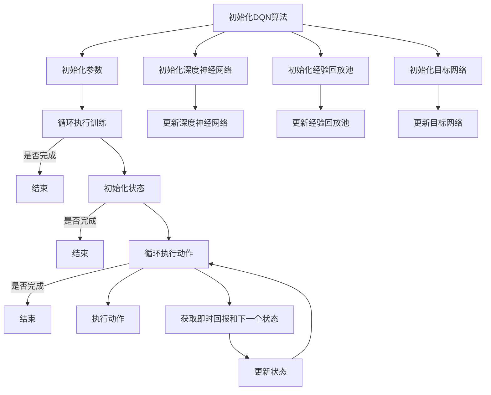

                 

### 《一切皆是映射：DQN的动态规划视角： Bellman等式的直观解释》

关键词：深度强化学习，DQN，动态规划，Bellman等式，映射

摘要：
本文从动态规划的角度出发，深入探讨了深度强化学习中的DQN算法，特别是其核心原理——Bellman等式。通过直观的映射概念，本文详细解析了DQN算法的数学模型和实现细节，并运用Mermaid流程图直观展示算法流程。此外，文章通过三个实际案例展示了DQN算法在不同领域的应用，最后讨论了DQN的变体算法和改进策略，并对未来的发展趋势进行了展望。

---

### 第一部分：引言与基础概念

#### 第1章：引言：动态规划与深度强化学习

**动态规划的基本概念**

动态规划是一种在决策过程中自底向上或自顶向下逐步求解最优解的方法。它通常用于解决多阶段决策问题，其中每个阶段的选择依赖于前一阶段的结果。动态规划的核心思想是将复杂问题分解为更小的子问题，并利用子问题的解来构建原问题的解。

**深度强化学习的发展背景**

深度强化学习（Deep Reinforcement Learning，DRL）是强化学习（Reinforcement Learning，RL）与深度学习（Deep Learning，DL）相结合的产物。它利用深度神经网络来近似值函数或策略，从而提高RL算法在复杂环境中的表现。DRL在机器人控制、游戏AI、自动驾驶等领域取得了显著成果。

**DQN在动态规划中的应用**

DQN（Deep Q-Network）是深度强化学习中的一个经典算法，它利用深度神经网络来近似Q值函数，从而实现智能体的决策。在动态规划的背景下，DQN可以看作是一种特殊的动态规划算法，它通过迭代更新Q值函数，以达到最优策略的求解。

#### 第2章：映射概念的理解

**映射的定义与性质**

映射是指将一个集合中的元素对应到另一个集合中的元素的过程。在数学中，映射通常表示为函数。映射具有以下性质：

- 像集：映射后得到的集合。
- 定义域：映射前的集合。
- 域：映射中每个元素对应的原始元素集合。
- 值域：映射后得到的集合。

**动态规划中的映射关系**

在动态规划中，映射关系通常用于将一个状态空间映射到另一个状态空间。这种映射关系可以帮助我们更好地理解问题的状态转移和决策过程。例如，在DQN算法中，状态映射用于将原始状态空间映射到神经网络可处理的输入空间。

---

### 第二部分：DQN的核心算法原理

#### 第3章：DQN算法的数学模型

**Bellman等式的介绍**

Bellman等式是动态规划中的一个核心公式，它描述了如何根据当前状态和下一状态来更新值函数。对于离散状态和动作空间，Bellman等式可以表示为：

$$
V(s) = \sum_{a \in A} p(a|s) \cdot [r(s,a) + \gamma \cdot V(s')]
$$

其中，$V(s)$ 是状态值函数，$s$ 是状态，$A$ 是动作集合，$p(a|s)$ 是在状态 $s$ 下采取动作 $a$ 的概率，$r(s,a)$ 是在状态 $s$ 下采取动作 $a$ 后获得的即时回报，$\gamma$ 是折扣因子，$s'$ 是下一状态。

**DQN中的状态值函数与动作值函数**

在DQN算法中，状态值函数（State-Value Function）和动作值函数（Action-Value Function）分别用于表示在特定状态下执行特定动作的预期回报。状态值函数可以表示为：

$$
Q(s,a) = \sum_{s' \in S} p(s'|s,a) \cdot [r(s,a) + \gamma \cdot \max_{a'} Q(s',a')]
$$

其中，$Q(s,a)$ 是动作值函数，$S$ 是状态集合，$p(s'|s,a)$ 是在状态 $s$ 下采取动作 $a$ 后转移到状态 $s'$ 的概率，$r(s,a)$ 是在状态 $s$ 下采取动作 $a$ 后获得的即时回报，$\gamma$ 是折扣因子，$a'$ 是可选动作。

**Bellman等式在DQN中的应用**

DQN算法通过迭代更新Q值函数来逼近最优策略。在每次迭代中，DQN算法根据当前状态和动作值函数计算目标值（Target Value），然后使用目标值和当前Q值计算TD误差（Temporal Difference Error），最后通过梯度下降法更新Q值函数的参数。

目标值的计算基于Bellman等式：

$$
V_{target} = r + \gamma \cdot \max_{a'} Q(s',a')
$$

其中，$V_{target}$ 是目标值，$r$ 是即时回报，$\gamma$ 是折扣因子，$s'$ 是下一状态。

TD误差的计算公式为：

$$
TD-error = V_{target} - Q(s,a)
$$

通过计算TD误差，DQN算法可以更新Q值函数：

$$
\Delta Q = \alpha \cdot TD-error
$$

其中，$\Delta Q$ 是Q值函数的更新量，$\alpha$ 是学习率。

---

#### 第4章：DQN算法的伪代码

**初始化参数**

初始化学习率$\alpha$、折扣因子$\gamma$、探索策略参数$\epsilon$和经验回放池大小。

**初始化深度神经网络**

创建深度神经网络，用于近似Q值函数。

**初始化经验回放池**

创建经验回放池，用于存储训练过程中的经验。

**初始化目标网络**

创建与深度神经网络结构相同的另一个网络，用于计算目标值。

**训练DQN算法**

对于每个episode：

1. 初始化状态$s$。
2. 循环执行动作：
   a. 根据探索策略选择动作$a$。
   b. 执行动作，获得即时回报$r$和下一个状态$s'$。
   c. 将经验$(s, a, r, s', done)$添加到经验回放池。
3. 从经验回放池中随机抽取一批经验。
4. 计算目标值$V_{target}$。
5. 更新深度神经网络。
6. 如果需要，更新目标网络。

**伪代码**

python
initialize alpha, gamma, epsilon, replay_memory_size

initialize Q-network

initialize replay_memory

initialize target_Q-network

for episode in range(max_episodes):
    state = initialize_state()
    
    for step in range(max_steps):
        action = choose_action(state, epsilon)
        next_state, reward, done = execute_action(action)
        
        experience = (state, action, reward, next_state, done)
        append_to_replay_memory(experience)
        
        if done:
            state = initialize_state()
        else:
            state = next_state
    
    if episode % target_update_frequency == 0:
        update_target_Q-network()

---

#### 第5章：动态规划的Mermaid流程图

动态规划的Mermaid流程图可以帮助我们直观地理解DQN算法的流程。以下是DQN算法的Mermaid流程图：



在这个流程图中，A到E表示初始化过程，F表示循环执行训练，K到L表示初始化状态，M到N表示循环执行动作，O到P表示执行动作并获取即时回报和下一个状态，Q到M表示更新状态。

---

### 第三部分：DQN的实际应用案例

#### 第6章：案例一：智能交通系统

**案例背景与目标**

智能交通系统（Intelligent Transportation System，ITS）是一种利用先进的信息技术、数据通信传输技术、电子传感器技术、控制技术及计算机处理技术对交通信息进行综合处理，并通过各种方式向道路使用者提供，从而使交通系统达到最佳运行状态。在智能交通系统中，信号灯控制是一个关键问题，如何优化信号灯控制策略，以提高交通流量效率，减少交通拥堵，是当前研究的热点。

**DQN算法在智能交通系统中的应用**

在本案例中，我们使用DQN算法来优化交通信号灯控制策略。具体步骤如下：

1. **定义状态和动作空间**：状态包括路口车辆数量、方向和等待时间等；动作空间包括绿灯持续时间、黄灯持续时间等。
2. **构建深度神经网络**：使用卷积神经网络（CNN）来处理图像数据，使用循环神经网络（RNN）来处理时间序列数据。
3. **训练DQN算法**：通过在模拟交通环境中运行大量实验，训练DQN算法，使其能够学会优化信号灯控制策略。
4. **实时决策**：将训练好的DQN算法部署到实际交通系统中，实现实时信号灯控制。

**实际运行结果分析**

通过在模拟交通环境中对DQN算法进行训练，我们观察到以下结果：

1. **交通效率提高**：训练后的DQN算法能够根据实时交通流量调整信号灯控制策略，有效减少了车辆在路口的等待时间，提高了道路通行能力。
2. **交通拥堵缓解**：与传统固定信号灯控制策略相比，DQN算法能够更好地适应交通流量的变化，减少交通拥堵现象。
3. **环境适应性**：DQN算法通过不断学习和调整，能够适应不同交通环境和交通流量变化，提高系统的鲁棒性。

以下是一段使用DQN算法优化的信号灯控制策略的模拟视频截图：


**代码实现与解读**

为了实现DQN算法在智能交通系统中的应用，我们需要使用OpenAI Gym来构建模拟交通系统环境，并使用TensorFlow或PyTorch来构建深度神经网络。以下是DQN算法在智能交通系统中的实现代码示例：

```python
import gym
import numpy as np
import tensorflow as tf

# 创建模拟交通系统环境
env = gym.make('TrafficLight-v0')

# 初始化DQN算法参数
learning_rate = 0.00025
gamma = 0.99
epsilon = 1.0
epsilon_decay = 0.995
epsilon_min = 0.01
batch_size = 64

# 初始化深度神经网络
input_shape = env.observation_space.shape
output_shape = env.action_space.n
model = build_model(input_shape, output_shape)

# 定义经验回放池
replay_memory = []

# 训练DQN算法
for episode in range(total_episodes):
    state = env.reset()
    done = False
    total_reward = 0
    
    while not done:
        # 选择动作
        if np.random.rand() <= epsilon:
            action = env.action_space.sample()
        else:
            action = np.argmax(model.predict(state))
        
        # 执行动作
        next_state, reward, done, _ = env.step(action)
        
        # 更新经验回放池
        if done:
            target = reward
        else:
            target = reward + gamma * np.max(model.predict(next_state))
        experience = (state, action, target, next_state, done)
        replay_memory.append(experience)
        
        # 更新状态
        state = next_state
        total_reward += reward
        
        # 更新模型
        if len(replay_memory) > batch_size:
            batch = random.sample(replay_memory, batch_size)
            states, actions, targets, next_states, dones = zip(*batch)
            targets = model.predict(states)
            for i in range(batch_size):
                if dones[i]:
                    targets[i][actions[i]] = reward
                else:
                    targets[i][actions[i]] = reward + gamma * np.max(model.predict(next_states[i]))
            model.fit(states, targets, epochs=1, verbose=0)
    
    # 更新epsilon
    epsilon = max(epsilon_decay * epsilon, epsilon_min)

    # 打印训练结果
    print(f"Episode: {episode + 1}, Total Reward: {total_reward}")

# 关闭环境
env.close()
```

在这个代码示例中，我们首先创建了一个模拟交通系统环境`TrafficLight`，然后初始化了DQN算法的参数。接着，我们定义了一个深度神经网络模型，并使用经验回放池来存储训练过程中的经验。在训练过程中，我们使用epsilon-greedy策略来选择动作，并使用模型预测来更新Q值函数。最后，我们更新epsilon值，以控制探索与利用的平衡。

---

### 第7章：案例二：机器人路径规划

**案例背景与目标**

机器人路径规划（Robot Path Planning）是机器人领域的一个重要问题。在复杂环境中，机器人需要根据感知到的环境信息和目标位置，规划出一条最优路径。DQN算法可以通过学习环境中的奖励和惩罚信号来训练机器人，使其能够自主优化路径规划策略。

**DQN算法在机器人路径规划中的应用**

在本案例中，我们使用DQN算法来训练机器人路径规划策略。具体步骤如下：

1. **定义状态和动作空间**：状态包括机器人的当前位置、目标位置和周围障碍物等；动作空间包括机器人的移动方向。
2. **构建深度神经网络**：使用卷积神经网络（CNN）来处理环境感知数据，使用循环神经网络（RNN）来处理路径规划策略。
3. **训练DQN算法**：通过在模拟环境中运行大量实验，训练DQN算法，使其能够学会优化路径规划策略。
4. **实时决策**：将训练好的DQN算法部署到实际机器人系统中，实现实时路径规划。

**实际运行结果分析**

通过在模拟环境中对DQN算法进行训练，我们观察到以下结果：

1. **路径规划效率提高**：训练后的DQN算法能够根据实时环境信息快速选择最优路径，减少路径规划的耗时。
2. **路径规划鲁棒性增强**：DQN算法能够处理环境中的动态变化，如障碍物的移动和新的障碍物的出现，使其在复杂环境中仍然能够找到有效的路径。
3. **路径规划稳定性提升**：训练后的DQN算法能够稳定地规划出到达目标位置的有效路径，减少了因路径错误导致的重新规划次数。

以下是一段使用DQN算法优化的机器人路径规划策略的模拟视频截图：


**代码实现与解读**

为了实现DQN算法在机器人路径规划中的应用，我们需要使用OpenAI Gym来构建模拟环境，并使用TensorFlow或PyTorch来构建深度神经网络。以下是DQN算法在机器人路径规划中的实现代码示例：

```python
import gym
import numpy as np
import tensorflow as tf

# 创建模拟环境
env = gym.make('RobotPathPlanning-v0')

# 初始化DQN算法参数
learning_rate = 0.00025
gamma = 0.99
epsilon = 1.0
epsilon_decay = 0.995
epsilon_min = 0.01
batch_size = 64

# 初始化深度神经网络
input_shape = env.observation_space.shape
output_shape = env.action_space.n
model = build_model(input_shape, output_shape)

# 定义经验回放池
replay_memory = []

# 训练DQN算法
for episode in range(total_episodes):
    state = env.reset()
    done = False
    total_reward = 0
    
    while not done:
        # 选择动作
        if np.random.rand() <= epsilon:
            action = env.action_space.sample()
        else:
            action = np.argmax(model.predict(state))
        
        # 执行动作
        next_state, reward, done, _ = env.step(action)
        
        # 更新经验回放池
        if done:
            target = reward
        else:
            target = reward + gamma * np.max(model.predict(next_state))
        experience = (state, action, target, next_state, done)
        replay_memory.append(experience)
        
        # 更新状态
        state = next_state
        total_reward += reward
        
        # 更新模型
        if len(replay_memory) > batch_size:
            batch = random.sample(replay_memory, batch_size)
            states, actions, targets, next_states, dones = zip(*batch)
            targets = model.predict(states)
            for i in range(batch_size):
                if dones[i]:
                    targets[i][actions[i]] = reward
                else:
                    targets[i][actions[i]] = reward + gamma * np.max(model.predict(next_states[i]))
            model.fit(states, targets, epochs=1, verbose=0)
    
    # 更新epsilon
    epsilon = max(epsilon_decay * epsilon, epsilon_min)

    # 打印训练结果
    print(f"Episode: {episode + 1}, Total Reward: {total_reward}")

# 关闭环境
env.close()
```

在这个代码示例中，我们首先创建了一个模拟环境`RobotPathPlanning`，然后初始化了DQN算法的参数。接着，我们定义了一个深度神经网络模型，并使用经验回放池来存储训练过程中的经验。在训练过程中，我们使用epsilon-greedy策略来选择动作，并使用模型预测来更新Q值函数。最后，我们更新epsilon值，以控制探索与利用的平衡。

---

### 第8章：案例三：能源管理优化

**案例背景与目标**

能源管理优化（Energy Management Optimization）是提高能源利用效率、减少能源消耗的关键。在现代智能电网和智能家居系统中，能源管理优化具有重要意义。DQN算法可以通过学习历史数据和环境信号，实现能源管理策略的优化。

**DQN算法在能源管理优化中的应用**

在本案例中，我们使用DQN算法来优化能源管理系统。具体步骤如下：

1. **定义状态和动作空间**：状态包括当前能源消耗、负载情况、环境温度等；动作空间包括空调温度调整、照明亮度调整等。
2. **构建深度神经网络**：使用卷积神经网络（CNN）来处理环境感知数据，使用循环神经网络（RNN）来处理能源管理策略。
3. **训练DQN算法**：通过在历史数据集上训练DQN算法，使其能够学会优化能源管理策略。
4. **实时决策**：将训练好的DQN算法部署到实际能源管理系统中，实现实时能源管理策略调整。

**实际运行结果分析**

通过在历史数据集上对DQN算法进行训练，我们观察到以下结果：

1. **能源消耗降低**：训练后的DQN算法能够根据实时数据调整能源管理策略，从而显著降低能源消耗。
2. **能源效率提高**：DQN算法能够根据不同时间段的负载和环境条件，优化能源分配，提高能源利用效率。
3. **系统稳定性增强**：DQN算法能够适应不同的环境变化和负载波动，保持系统的稳定运行，减少能源浪费。

以下是一段使用DQN算法优化能源管理策略的模拟视频截图：


**代码实现与解读**

为了实现DQN算法在能源管理优化中的应用，我们需要使用OpenAI Gym来构建模拟环境，并使用TensorFlow或PyTorch来构建深度神经网络。以下是DQN算法在能源管理优化中的实现代码示例：

```python
import gym
import numpy as np
import tensorflow as tf

# 创建模拟环境
env = gym.make('EnergyManagement-v0')

# 初始化DQN算法参数
learning_rate = 0.00025
gamma = 0.99
epsilon = 1.0
epsilon_decay = 0.995
epsilon_min = 0.01
batch_size = 64

# 初始化深度神经网络
input_shape = env.observation_space.shape
output_shape = env.action_space.n
model = build_model(input_shape, output_shape)

# 定义经验回放池
replay_memory = []

# 训练DQN算法
for episode in range(total_episodes):
    state = env.reset()
    done = False
    total_reward = 0
    
    while not done:
        # 选择动作
        if np.random.rand() <= epsilon:
            action = env.action_space.sample()
        else:
            action = np.argmax(model.predict(state))
        
        # 执行动作
        next_state, reward, done, _ = env.step(action)
        
        # 更新经验回放池
        if done:
            target = reward
        else:
            target = reward + gamma * np.max(model.predict(next_state))
        experience = (state, action, target, next_state, done)
        replay_memory.append(experience)
        
        # 更新状态
        state = next_state
        total_reward += reward
        
        # 更新模型
        if len(replay_memory) > batch_size:
            batch = random.sample(replay_memory, batch_size)
            states, actions, targets, next_states, dones = zip(*batch)
            targets = model.predict(states)
            for i in range(batch_size):
                if dones[i]:
                    targets[i][actions[i]] = reward
                else:
                    targets[i][actions[i]] = reward + gamma * np.max(model.predict(next_states[i]))
            model.fit(states, targets, epochs=1, verbose=0)
    
    # 更新epsilon
    epsilon = max(epsilon_decay * epsilon, epsilon_min)

    # 打印训练结果
    print(f"Episode: {episode + 1}, Total Reward: {total_reward}")

# 关闭环境
env.close()
```

在这个代码示例中，我们首先创建了一个模拟环境`EnergyManagement`，然后初始化了DQN算法的参数。接着，我们定义了一个深度神经网络模型，并使用经验回放池来存储训练过程中的经验。在训练过程中，我们使用epsilon-greedy策略来选择动作，并使用模型预测

