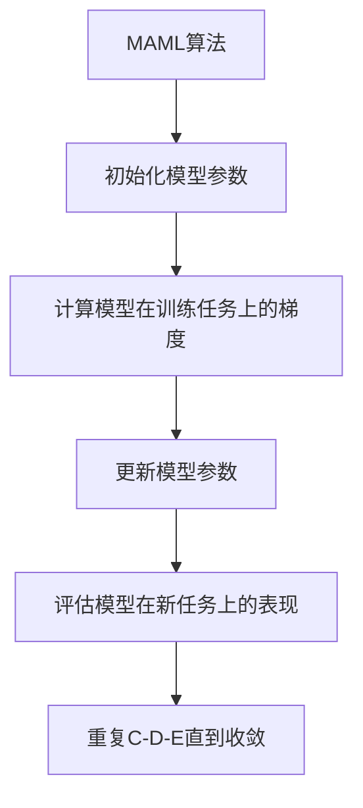
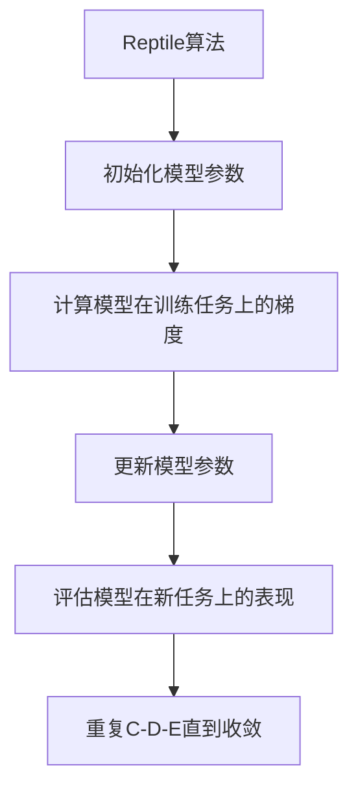

                 

### 第1章：元学习基础

#### 1.1 元学习的概念与重要性

##### 1.1.1 元学习的定义

元学习（Meta-Learning）是机器学习领域中的一个重要分支，其主要目标是构建能够在多个任务上快速适应和学习的算法。具体来说，元学习关注的是如何设计一种学习方法，使得学习算法能够在不同的任务和数据分布上表现出良好的泛化能力。与传统机器学习不同，元学习不仅仅关注一个特定任务的解决方案，而是寻求一种通用方法，能够通过少量样本快速适应新的任务。

##### 1.1.2 元学习的重要性

元学习在机器学习领域具有以下几个重要意义：

1. **提高学习效率**：元学习算法能够通过在多个任务上共享知识，减少在每个任务上的训练时间，从而提高整体学习效率。
2. **增强泛化能力**：通过元学习，模型可以学会如何从相似的任务中提取通用特征，从而提高在未知任务上的泛化能力。
3. **减轻数据依赖**：在数据稀缺或数据获取成本高昂的情况下，元学习可以通过在较少的数据上训练，推广到新的任务中，减轻对大量数据的依赖。
4. **扩展应用领域**：元学习为解决复杂、动态和未知的任务提供了新的思路，使得机器学习算法能够应用于更多领域，如自动驾驶、机器人控制等。

##### 1.1.3 元学习与传统机器学习的区别

传统机器学习通常针对一个具体任务进行训练和优化，其核心目标是找到一个在当前任务上表现最优的模型。而元学习则更加注重于学习一个能够适用于多个任务的通用学习方法。以下是一些主要区别：

- **目标不同**：传统机器学习关注单一任务的优化，而元学习关注的是在多个任务上的适应能力。
- **数据量不同**：传统机器学习通常需要大量数据来训练模型，而元学习则通过少量数据或甚至无监督学习来提高泛化能力。
- **策略不同**：传统机器学习依赖于特定的算法和数据集，而元学习更加强调通用性和可转移性。
- **结果评价不同**：传统机器学习评价的是模型在特定任务上的表现，而元学习评价的是模型在多个任务上的综合表现。

#### 1.2 强化学习基础

##### 1.2.1 强化学习的定义

强化学习（Reinforcement Learning，RL）是一种通过试错学习的方法，通过与环境的交互来学习最优策略的机器学习范式。在强化学习中，agent（智能体）在给定环境中，通过执行动作（action）来获得奖励（reward）和状态转移（state transition）。其目标是通过最大化长期奖励，找到一种最优策略（policy）。

##### 1.2.2 强化学习的基本组件

强化学习系统主要包括以下组件：

- **Agent（智能体）**：执行动作、接收奖励和状态反馈的实体。
- **Environment（环境）**：agent所处的外部世界，提供状态信息和奖励。
- **State（状态）**：描述agent所处环境的当前状态。
- **Action（动作）**：agent可执行的行为。
- **Reward（奖励）**：agent执行动作后，从环境中获得的即时反馈。
- **Policy（策略）**：描述agent如何从状态选择动作的规则。

##### 1.2.3 强化学习的主要算法

强化学习算法主要分为以下几类：

- **值函数方法**：通过估计状态价值和策略价值来学习最优策略。例如，Q学习、SARSA等。
- **策略搜索方法**：直接优化策略函数来学习最优策略。例如，策略梯度方法、重要性采样等。
- **模型基方法**：利用模型预测状态转移概率和奖励，以指导策略学习。例如，模型预测控制（Model Predictive Control，MPC）。

#### 1.3 元学习在强化学习中的应用

##### 1.3.1 元强化学习的定义

元强化学习（Meta-Reinforcement Learning）是结合元学习和强化学习的方法，旨在加速强化学习算法的收敛和提高泛化能力。具体来说，元强化学习通过在多个任务上训练智能体，使其能够快速适应新的任务，提高学习效率和泛化能力。

##### 1.3.2 元强化学习的基本原理

元强化学习的基本原理可以概括为以下几点：

- **任务迁移**：通过在多个任务上训练，使得智能体能够在新的任务上快速适应。
- **模型共享**：通过共享模型参数，减少在每个任务上的训练时间，提高学习效率。
- **优化策略**：通过元学习优化策略，使得智能体在新的任务上能够更快地找到最优策略。

##### 1.3.3 元强化学习的优势

元强化学习在强化学习中的应用具有以下几个优势：

- **快速适应**：通过在多个任务上训练，智能体可以快速适应新的任务，减少训练时间。
- **提高泛化能力**：通过在多种任务上训练，智能体可以学习到通用的策略，提高在未知任务上的适应能力。
- **减少数据需求**：通过元强化学习，智能体可以在较少的数据上学习，降低对大量数据的依赖。

#### 1.4 常见的元强化学习算法

##### 1.4.1 模型无关差异学习（Model-Agnostic Meta-Learning, MAML）

模型无关差异学习（MAML）是一种重要的元强化学习算法，其核心思想是找到一组参数，使得模型在新任务上快速收敛。MAML算法通过在多个任务上训练，使得模型参数能够适应新的任务，从而提高学习效率和泛化能力。

##### 1.4.2 模型相关差异学习（Model-Aware Meta-Learning）

模型相关差异学习（Model-Aware Meta-Learning）是另一种元强化学习算法，它通过在特定模型结构上优化元学习过程，提高模型在新任务上的适应能力。与MAML不同，模型相关差异学习更加关注于特定模型结构的优化。

##### 1.4.3 其他元强化学习算法

除了MAML和模型相关差异学习，还有许多其他的元强化学习算法，如：

- **Reptile**：一种简单的元强化学习算法，通过在参数空间中找到新的最佳参数，快速适应新任务。
- **Model-Agnostic Meta-Learning for Reinforcement Learning (MAML-R)**：将MAML算法应用于强化学习问题，提高强化学习算法的泛化能力。
- **MAML-RL**：另一种MAML的变体，适用于强化学习场景，通过在多个任务上训练，提高智能体在新任务上的适应能力。

### 第2章：元学习在强化学习中的应用

#### 2.1 元强化学习概述

##### 2.1.1 元强化学习的定义

元强化学习（Meta-Reinforcement Learning）是结合元学习和强化学习的方法，旨在加速强化学习算法的收敛和提高泛化能力。具体来说，元强化学习通过在多个任务上训练智能体，使其能够快速适应新的任务，提高学习效率和泛化能力。

##### 2.1.2 元强化学习的基本原理

元强化学习的基本原理可以概括为以下几点：

- **任务迁移**：通过在多个任务上训练，使得智能体能够在新的任务上快速适应。
- **模型共享**：通过共享模型参数，减少在每个任务上的训练时间，提高学习效率。
- **优化策略**：通过元学习优化策略，使得智能体在新的任务上能够更快地找到最优策略。

##### 2.1.3 元强化学习的优势

元强化学习在强化学习中的应用具有以下几个优势：

- **快速适应**：通过在多个任务上训练，智能体可以快速适应新的任务，减少训练时间。
- **提高泛化能力**：通过在多种任务上训练，智能体可以学习到通用的策略，提高在未知任务上的适应能力。
- **减少数据需求**：通过元强化学习，智能体可以在较少的数据上学习，降低对大量数据的依赖。

#### 2.2 常见的元强化学习算法

##### 2.2.1 模型无关差异学习（Model-Agnostic Meta-Learning, MAML）

模型无关差异学习（MAML）是一种重要的元强化学习算法，其核心思想是找到一组参数，使得模型在新任务上快速收敛。MAML算法通过在多个任务上训练，使得模型参数能够适应新的任务，从而提高学习效率和泛化能力。

##### 2.2.2 模型相关差异学习（Model-Aware Meta-Learning）

模型相关差异学习（Model-Aware Meta-Learning）是另一种元强化学习算法，它通过在特定模型结构上优化元学习过程，提高模型在新任务上的适应能力。与MAML不同，模型相关差异学习更加关注于特定模型结构的优化。

##### 2.2.3 其他元强化学习算法

除了MAML和模型相关差异学习，还有许多其他的元强化学习算法，如：

- **Reptile**：一种简单的元强化学习算法，通过在参数空间中找到新的最佳参数，快速适应新任务。
- **Model-Agnostic Meta-Learning for Reinforcement Learning (MAML-R)**：将MAML算法应用于强化学习问题，提高强化学习算法的泛化能力。
- **MAML-RL**：另一种MAML的变体，适用于强化学习场景，通过在多个任务上训练，提高智能体在新任务上的适应能力。

#### 2.3 元强化学习算法的对比与分析

##### 2.3.1 MAML算法

MAML算法是一种模型无关的元强化学习算法，其核心思想是找到一组参数，使得模型在新任务上快速收敛。MAML算法的优点包括：

- **快速适应**：通过在多个任务上训练，MAML算法能够快速适应新任务，减少训练时间。
- **通用性**：MAML算法适用于各种类型的强化学习任务。

然而，MAML算法也存在一些缺点，如：

- **对参数初始化敏感**：MAML算法对参数的初始值非常敏感，可能导致训练不稳定。
- **可能过拟合**：在训练过程中，MAML算法可能过度适应特定任务，导致泛化能力下降。

##### 2.3.2 模型相关差异学习

模型相关差异学习（Model-Aware Meta-Learning）是一种模型相关的元强化学习算法，其通过在特定模型结构上优化元学习过程，提高模型在新任务上的适应能力。模型相关差异学习的优点包括：

- **适应特定模型**：模型相关差异学习能够更好地适应特定的模型结构，提高学习效率。
- **减少过拟合**：通过在特定模型上优化，模型相关差异学习可以减少过拟合现象。

然而，模型相关差异学习也存在一些缺点，如：

- **局限性**：模型相关差异学习只适用于特定的模型结构，可能不适用于其他类型的模型。
- **计算成本高**：模型相关差异学习需要更多的计算资源，可能导致训练时间延长。

##### 2.3.3 其他元强化学习算法

除了MAML和模型相关差异学习，还有许多其他的元强化学习算法，如Reptile、MAML-R和MAML-RL等。这些算法各有优缺点，适用于不同的应用场景。

- **Reptile**：Reptile是一种简单的元强化学习算法，通过在参数空间中找到新的最佳参数，快速适应新任务。Reptile的优点包括简单、易于实现，缺点包括可能无法适应复杂任务。
- **MAML-R**：MAML-R是将MAML算法应用于强化学习问题的一种变体，其优点包括快速适应新任务、提高泛化能力，缺点包括对参数初始化敏感、可能过拟合。
- **MAML-RL**：MAML-RL是另一种MAML的变体，适用于强化学习场景。其优点包括快速适应新任务、提高泛化能力，缺点包括对参数初始化敏感、计算成本高。

综上所述，不同的元强化学习算法在适应能力、计算成本、泛化能力等方面各有优缺点，选择合适的算法需要根据具体应用场景和需求进行综合考虑。

#### 2.4 元强化学习算法的实际应用

##### 2.4.1 游戏领域

在游戏领域，元强化学习算法被广泛应用于开发智能游戏AI。通过元强化学习，智能游戏AI可以快速适应各种游戏场景，提高游戏水平。以下是一些具体的实例：

- **Atari游戏**：OpenAI的DQN（Deep Q-Network）算法在Atari游戏中取得了显著的成果，通过在大量Atari游戏上训练，智能体能够在短时间内学会玩各种游戏。
- **棋类游戏**：元强化学习算法也被应用于棋类游戏，如围棋、国际象棋等。通过在多个棋类游戏上训练，智能体能够快速适应不同规则的棋类游戏。

##### 2.4.2 机器人领域

在机器人领域，元强化学习算法被用于训练机器人的控制策略，使其能够适应不同的环境和任务。以下是一些具体的实例：

- **机器人导航**：通过在多个环境中训练，元强化学习算法能够使机器人快速适应不同的导航任务，如路径规划、障碍物规避等。
- **机器人抓取**：元强化学习算法也被用于训练机器人的抓取策略，使其能够适应不同的物体和抓取环境。

##### 2.4.3 智能驾驶领域

在智能驾驶领域，元强化学习算法被用于训练自动驾驶系统，使其能够适应不同的驾驶场景和交通状况。以下是一些具体的实例：

- **自动驾驶决策**：通过在多个驾驶场景上训练，元强化学习算法能够使自动驾驶系统快速适应不同的驾驶任务，如交通灯识别、车道保持等。
- **自动驾驶路径规划**：元强化学习算法也被用于训练自动驾驶系统的路径规划策略，使其能够适应不同的道路条件和交通状况。

##### 2.4.4 总结

元强化学习算法在游戏、机器人、智能驾驶等领域的实际应用取得了显著成果。通过在多个任务上训练，智能体能够快速适应新任务，提高学习效率和泛化能力。未来，随着元强化学习算法的进一步发展和完善，其在更多领域的应用前景将更加广阔。

### 第3章：强化学习的数学基础

#### 3.1 强化学习中的概率论基础

##### 3.1.1 概率分布与随机变量

概率论是强化学习中的基础数学工具，它帮助我们在不确定性环境中对状态、动作和奖励进行建模。首先，我们需要了解概率分布和随机变量的概念。

- **概率分布**：概率分布用于描述随机变量可能取值的概率。常见的概率分布包括伯努利分布、正态分布、泊松分布等。概率分布可以是离散的，也可以是连续的。

- **随机变量**：随机变量是一个数学函数，它将概率空间映射到一个实数集合。随机变量可以是离散的，也可以是连续的。在强化学习中，我们通常使用随机变量来表示状态、动作和奖励。

##### 3.1.2 贝叶斯推理

贝叶斯推理是概率论中的一个重要概念，它提供了一种从先验概率和观测数据中更新后验概率的方法。贝叶斯推理的核心思想是，通过已知的先验概率和新的观测数据，我们可以计算出新的后验概率，从而更新我们对事件发生的相信程度。

贝叶斯推理的基本步骤如下：

1. **定义先验概率**：先验概率是我们对某个事件在没有任何观测数据时的相信程度。
2. **收集观测数据**：观测数据是我们对事件实际发生的观察结果。
3. **计算后验概率**：利用贝叶斯公式，我们可以计算在给定观测数据下，事件发生的后验概率。
4. **更新先验概率**：根据后验概率，我们可以更新先验概率，以反映最新的信息。

贝叶斯推理公式如下：

$$
P(A|B) = \frac{P(B|A)P(A)}{P(B)}
$$

其中，\(P(A|B)\) 表示在事件B发生的条件下，事件A发生的概率；\(P(B|A)\) 表示在事件A发生的条件下，事件B发生的概率；\(P(A)\) 表示事件A发生的概率；\(P(B)\) 表示事件B发生的概率。

##### 3.1.3 马尔可夫决策过程（MDP）

马尔可夫决策过程（MDP）是强化学习中的一个重要概念，它提供了一个数学框架来描述决策者在不确定环境中进行决策的过程。MDP由以下几个组件构成：

- **状态空间 \(S\)**：表示智能体可能处于的所有状态。
- **动作空间 \(A\)**：表示智能体可以执行的所有动作。
- **奖励函数 \(R(s,a)\)**：表示智能体在状态 \(s\) 执行动作 \(a\) 后获得的即时奖励。
- **状态转移概率 \(P(s'|s,a)\)**：表示智能体在状态 \(s\) 执行动作 \(a\) 后，转移到状态 \(s'\) 的概率。
- **策略 \(\pi(a|s)\)**：表示智能体在状态 \(s\) 下执行动作 \(a\) 的概率。

MDP可以用一个五元组 \(M = (S, A, R, P, \pi)\) 来表示。在MDP中，智能体的目标是找到一种策略，使得长期期望奖励最大化。

#### 3.2 强化学习中的优化理论

##### 3.2.1 最优化问题的基本概念

优化理论是强化学习中的一个关键部分，它用于寻找能够使目标函数最大或最小的参数。最优化问题可以分为以下几种类型：

- **无约束优化问题**：目标函数在所有可能取值范围内都是定义的，且没有限制条件。
- **有约束优化问题**：目标函数在所有可能取值范围内都是定义的，但有约束条件限制。
- **静态优化问题**：目标函数是参数的函数，参数是固定的。
- **动态优化问题**：目标函数是参数的函数，但参数是随时间变化的。

在强化学习中，最优化问题通常涉及动态优化，因为智能体的策略是随时间变化的。

##### 3.2.2 动态规划（Dynamic Programming）

动态规划是一种解决最优化问题的策略，它将复杂的问题分解为一系列子问题，并利用子问题的解构建原问题的解。动态规划的核心思想是，通过逆向递推的方式，从最终状态开始向前求解。

动态规划的一般步骤如下：

1. **定义状态空间和动作空间**：确定智能体可能处于的所有状态和可以执行的所有动作。
2. **定义价值函数**：价值函数表示在特定状态下执行特定动作的预期奖励。
3. **逆向递推**：从最终状态开始，向前推导每个状态的价值函数。
4. **选择最优策略**：根据价值函数，选择能够使长期期望奖励最大的策略。

在强化学习中，动态规划通常用于求解值函数和策略迭代问题。

##### 3.2.3 基于梯度的优化算法

基于梯度的优化算法是另一种常见的最优化方法，它通过计算目标函数的梯度来更新参数，以最小化目标函数。梯度下降法是最常见的基于梯度的优化算法之一。

梯度下降法的一般步骤如下：

1. **定义损失函数**：损失函数表示智能体的表现，通常与目标函数相关。
2. **计算梯度**：计算损失函数关于参数的梯度。
3. **更新参数**：根据梯度和学习率，更新参数以减少损失函数。
4. **重复步骤2和3**：重复计算梯度和更新参数，直到满足收敛条件。

在强化学习中，基于梯度的优化算法通常用于策略优化和价值函数优化。

#### 3.3 强化学习中的主要算法

##### 3.3.1 Q学习

Q学习是一种基于值函数的强化学习算法，它通过学习状态-动作价值函数 \(Q(s, a)\) 来确定最佳动作。Q学习的目标是最小化期望损失，即

$$
J(\theta) = \sum_{s, a} (R(s, a) - Q(s, a))^2
$$

其中，\(\theta\) 表示模型参数。

Q学习的步骤如下：

1. **初始化参数**：随机初始化参数 \(\theta\)。
2. **选择动作**：根据策略 \(\pi(a|s; \theta)\) 选择动作 \(a\)。
3. **更新Q值**：根据更新规则 \(Q(s, a) \leftarrow Q(s, a) + \alpha [R(s, a) - Q(s, a)]\) 更新Q值。
4. **重复步骤2和3**：重复选择动作和更新Q值，直到满足收敛条件。

##### 3.3.2 SARSA

SARSA（State-Action-Reward-State-Action）是一种基于策略的强化学习算法，它同时考虑当前状态和下一步状态的信息来更新策略。SARSA的目标是最小化策略梯度，即

$$
J(\theta) = \sum_{s, a} \pi(a|s; \theta) [R(s, a) - Q(s, a)]
$$

SARSA的步骤如下：

1. **初始化参数**：随机初始化参数 \(\theta\)。
2. **选择动作**：根据策略 \(\pi(a|s; \theta)\) 选择动作 \(a\)。
3. **执行动作**：在环境中执行动作 \(a\)，观察状态转移 \(s' = s'\) 和奖励 \(R(s, a)\)。
4. **更新策略**：根据更新规则 \(\theta \leftarrow \theta - \alpha \nabla_{\theta} J(\theta)\) 更新策略。
5. **重复步骤2到4**：重复选择动作、执行动作和更新策略，直到满足收敛条件。

##### 3.3.3 策略梯度方法

策略梯度方法是另一种基于策略的强化学习算法，它通过最大化策略的期望回报来更新策略。策略梯度的目标是最小化策略梯度，即

$$
J(\theta) = \sum_{s, a} \pi(a|s; \theta) [R(s, a) - \gamma V(s; \theta)]
$$

其中，\(\gamma\) 是折扣因子，\(V(s; \theta)\) 是值函数。

策略梯度的步骤如下：

1. **初始化参数**：随机初始化参数 \(\theta\)。
2. **选择动作**：根据策略 \(\pi(a|s; \theta)\) 选择动作 \(a\)。
3. **执行动作**：在环境中执行动作 \(a\)，观察状态转移 \(s' = s'\) 和奖励 \(R(s, a)\)。
4. **计算梯度**：计算策略梯度 \(\nabla_{\theta} J(\theta)\)。
5. **更新策略**：根据更新规则 \(\theta \leftarrow \theta - \alpha \nabla_{\theta} J(\theta)\) 更新策略。
6. **重复步骤2到5**：重复选择动作、执行动作、计算梯度和更新策略，直到满足收敛条件。

### 第4章：元学习的数学基础

#### 4.1 元学习中的优化理论

##### 4.1.1 优化问题的转化

元学习中的优化问题通常涉及从单一任务到多任务的学习。为了解决这类问题，我们需要将优化问题转化为一个动态优化问题，以便在多个任务上同时优化。

- **静态优化问题**：目标函数是参数的函数，参数是固定的。
- **动态优化问题**：目标函数是参数的函数，但参数是随时间变化的。

在元学习中，动态优化问题通常涉及到模型更新策略，即在每次任务更新时，如何根据新任务的反馈来更新模型参数。

- **模型更新策略**：模型更新策略是元学习中的一个关键问题，它决定了如何在新任务上快速适应。

常见的模型更新策略包括：

1. **梯度更新策略**：根据新任务的梯度来更新模型参数。
2. **基于梯度的优化算法**：如梯度下降法、Adam优化器等。
3. **基于策略的更新策略**：如策略梯度方法、策略搜索方法等。

##### 4.1.2 梯度下降法在元学习中的应用

梯度下降法是一种常见的优化算法，它通过计算目标函数的梯度来更新模型参数，以最小化目标函数。

在元学习中，梯度下降法可以用于以下两个方面：

1. **模型更新**：根据新任务的梯度来更新模型参数，以使模型在新任务上快速适应。
2. **策略更新**：根据策略梯度的负梯度来更新策略参数，以优化策略。

梯度下降法在元学习中的应用步骤如下：

1. **初始化参数**：随机初始化模型参数和策略参数。
2. **选择任务**：从任务集中选择一个新任务。
3. **计算梯度**：计算模型和策略的梯度。
4. **更新参数**：根据梯度更新模型参数和策略参数。
5. **评估性能**：在新任务上评估模型的性能。
6. **重复步骤2到5**：重复选择任务、计算梯度、更新参数和评估性能，直到满足收敛条件。

##### 4.1.3 模型更新策略

在元学习中，模型更新策略决定了如何在新任务上快速适应。常见的模型更新策略包括：

1. **模型无关更新策略**：这类策略不依赖于特定的模型结构，如MAML（Model-Agnostic Meta-Learning）算法。
2. **模型相关更新策略**：这类策略依赖于特定的模型结构，如模型相关差异学习（Model-Aware Meta-Learning）算法。
3. **自适应更新策略**：这类策略根据任务的特征自适应地调整模型更新过程，如Reptile算法。

模型更新策略的优缺点如下：

1. **模型无关更新策略**：
   - 优点：适用于多种模型结构，具有较好的通用性。
   - 缺点：可能对参数初始化敏感，更新过程可能不稳定。

2. **模型相关更新策略**：
   - 优点：能够更好地适应特定模型结构，更新过程可能更稳定。
   - 缺点：仅适用于特定模型结构，可能不适用于其他模型。

3. **自适应更新策略**：
   - 优点：根据任务特征自适应地调整更新过程，可能更高效。
   - 缺点：可能需要更多的计算资源，更新过程可能较复杂。

##### 4.1.4 多任务学习与迁移学习

多任务学习和迁移学习是元学习中的重要研究方向，它们旨在通过在多个任务上训练，提高模型的泛化能力和适应性。

- **多任务学习**：多任务学习通过在多个任务上同时训练，使模型能够学习到通用的特征表示，从而提高在未知任务上的表现。

- **迁移学习**：迁移学习通过在源任务上训练模型，并将学到的知识迁移到目标任务上，以提高目标任务的表现。

多任务学习和迁移学习在元学习中的应用具有以下优点：

1. **提高学习效率**：通过在多个任务上共享知识，减少每个任务的训练时间。
2. **增强泛化能力**：通过在多个任务上训练，模型能够学习到通用的特征表示，提高在未知任务上的泛化能力。
3. **减少数据需求**：通过迁移学习，可以在较少的数据上训练模型，降低对大量数据的依赖。

#### 4.2 元学习中的概率论基础

##### 4.2.1 概率分布的导数与积分

概率分布是元学习中的重要概念，它描述了随机变量可能取值的概率。在元学习中，我们常常需要计算概率分布的导数和积分，以进行优化和推断。

- **概率分布的导数**：概率分布的导数可以用来计算概率分布的密度函数，从而更好地理解概率分布的性质。
- **概率分布的积分**：概率分布的积分可以用来计算概率分布的总概率，从而确定事件发生的可能性。

在元学习中，常用的概率分布包括伯努利分布、正态分布、泊松分布等。以下是一些常见的概率分布的导数和积分：

1. **伯努利分布**：
   - 导数：\(f(x) = P(X=x) = C^x_1 (1-C)^{1-x}\)
   - 积分：\(F(x) = \int_{-\infty}^x f(t) dt = Cx (1-C)^{1-x}\)

2. **正态分布**：
   - 导数：\(f(x) = \frac{1}{\sqrt{2\pi\sigma^2}} e^{-\frac{(x-\mu)^2}{2\sigma^2}}\)
   - 积分：\(F(x) = \int_{-\infty}^x f(t) dt = \Phi(\frac{x-\mu}{\sigma})\)

3. **泊松分布**：
   - 导数：\(f(x) = \frac{C^x e^{-C}}{x!}\)
   - 积分：\(F(x) = \int_{-\infty}^x f(t) dt = 1 - e^{-C}\)

##### 4.2.2 贝叶斯优化

贝叶斯优化是元学习中的重要方法，它通过贝叶斯推理来更新模型参数的概率分布，从而优化模型性能。

贝叶斯优化的基本思想是，利用先验知识和观测数据，计算模型参数的后验概率分布，并根据后验概率分布更新模型参数。

贝叶斯优化的步骤如下：

1. **定义先验概率**：根据领域知识和经验，定义模型参数的先验概率分布。
2. **收集观测数据**：通过实验或观测，收集模型参数的样本数据。
3. **计算后验概率**：利用贝叶斯公式，计算模型参数的后验概率分布。
4. **更新模型参数**：根据后验概率分布，更新模型参数。
5. **重复步骤2到4**：重复收集观测数据、计算后验概率和更新模型参数，直到满足收敛条件。

贝叶斯优化在元学习中的应用具有以下优点：

1. **自适应调整**：贝叶斯优化可以根据观测数据自适应地调整模型参数，从而提高模型性能。
2. **减少计算成本**：贝叶斯优化通过利用先验知识和观测数据，可以减少实验次数和计算成本。

##### 4.2.3 信息论基础

信息论是概率论的一个分支，它研究信息的度量、传输和处理。在元学习中，信息论的概念被广泛应用于模型评估、数据选择和优化策略的设计。

- **信息量**：信息量是衡量随机变量不确定性的度量。常用的信息量包括熵、交叉熵和互信息。
- **熵**：熵是衡量随机变量不确定性的度量，它表示随机变量的信息含量。熵的计算公式为 \(H(X) = -\sum_{x} p(x) \log_2 p(x)\)。
- **交叉熵**：交叉熵是衡量两个概率分布差异的度量。交叉熵的计算公式为 \(H(p, q) = -\sum_{x} p(x) \log_2 q(x)\)。
- **互信息**：互信息是衡量两个随机变量相关性的度量。互信息的计算公式为 \(I(X, Y) = H(X) - H(X|Y)\)。

在元学习中，信息论的概念被广泛应用于以下方面：

1. **模型评估**：通过计算模型的熵、交叉熵和互信息，评估模型的表现和泛化能力。
2. **数据选择**：通过计算数据的熵、交叉熵和互信息，选择具有高信息量和高相关性的数据，以优化模型性能。
3. **优化策略**：通过设计基于信息论优化的策略，如基于熵的优化策略、基于互信息的优化策略等，提高模型性能。

### 第5章：模型无关元强化学习算法

#### 5.1 MAML算法详解

##### 5.1.1 MAML算法的基本原理

MAML（Model-Agnostic Meta-Learning）算法是一种模型无关的元强化学习算法，其核心思想是通过在多个任务上训练，使得模型参数能够快速适应新的任务。MAML算法的关键在于其参数更新策略，即通过在多个任务上计算梯度并平均，以快速适应新的任务。

MAML算法的基本原理可以概括为以下步骤：

1. **初始化模型参数**：首先，随机初始化模型参数 \(\theta\)。
2. **选择任务**：从任务集中选择一个新任务 \(T\)。
3. **计算梯度**：在任务 \(T\) 上计算梯度 \(\nabla_{\theta} J(\theta; T)\)，其中 \(J(\theta; T)\) 是损失函数。
4. **更新模型参数**：使用梯度 \(\nabla_{\theta} J(\theta; T)\) 更新模型参数 \(\theta\)，即 \(\theta \leftarrow \theta - \alpha \nabla_{\theta} J(\theta; T)\)，其中 \(\alpha\) 是学习率。
5. **评估模型性能**：在新任务 \(T'\) 上评估模型性能，以确定是否满足收敛条件。
6. **重复步骤2到5**：重复选择任务、计算梯度、更新参数和评估性能，直到满足收敛条件。

MAML算法的优点在于其模型无关性，即不需要对特定模型进行修改，只需在多个任务上训练即可。这使得MAML算法具有较好的通用性，可以适用于各种强化学习任务。

##### 5.1.2 MAML算法的伪代码

以下是一个简化的MAML算法伪代码：

```python
initialize model parameters θ
for each training task T:
    compute gradients ∇θJ(θ;T)
    update θ using gradients: θ = θ - learning_rate * ∇θJ(θ;T)
    evaluate θ on new task T'
    if convergence criterion is met:
        break
return θ
```

在这个伪代码中，`initialize model parameters θ`表示初始化模型参数；`for each training task T:`表示遍历每个训练任务；`compute gradients ∇θJ(θ;T)`表示计算损失函数的梯度；`update θ using gradients:`表示使用梯度更新模型参数；`evaluate θ on new task T'`表示在新任务上评估模型性能；`if convergence criterion is met:`表示检查是否满足收敛条件；`return θ`表示返回最终的模型参数。

##### 5.1.3 MAML算法的优缺点分析

MAML算法在元强化学习领域取得了显著的成果，其具有以下优点：

1. **快速适应**：MAML算法能够在多个任务上快速适应，减少在每个任务上的训练时间。
2. **通用性**：MAML算法不依赖于特定模型结构，具有较好的通用性，可以适用于各种强化学习任务。
3. **减少数据需求**：MAML算法通过在多个任务上共享知识，减少对每个任务的大量数据需求。

然而，MAML算法也存在一些缺点：

1. **对参数初始化敏感**：MAML算法对参数的初始值非常敏感，可能导致训练不稳定。
2. **可能过拟合**：在训练过程中，MAML算法可能过度适应特定任务，导致泛化能力下降。

为了克服这些缺点，研究人员提出了许多MAML的变体算法，如Reptile、MAML-R等。这些变体算法通过引入新的策略和优化方法，提高了MAML算法的性能和稳定性。

##### 5.1.4 MAML算法的应用案例

MAML算法在多个应用领域取得了显著的成果，以下是一些应用案例：

1. **游戏AI**：MAML算法被用于训练游戏AI，使其能够快速适应不同的游戏场景。例如，在《星际争霸II》游戏中，MAML算法成功地训练出了能够与人类玩家对抗的AI。

2. **机器人控制**：MAML算法被用于训练机器人，使其能够快速适应不同的环境。例如，在机器人导航任务中，MAML算法通过在多个环境中训练，提高了机器人的导航能力。

3. **智能驾驶**：MAML算法被用于训练自动驾驶系统，使其能够快速适应不同的驾驶场景。例如，在自动驾驶路径规划任务中，MAML算法通过在多个场景中训练，提高了自动驾驶系统的路径规划能力。

#### 5.2 MAML变体算法

MAML算法的成功引发了大量研究，研究人员提出了许多MAML的变体算法，以改进其性能和适用范围。以下是一些常见的MAML变体算法：

##### 5.2.1 Reptile算法

Reptile算法是一种简单的MAML变体，其核心思想是通过在参数空间中找到新的最佳参数，快速适应新任务。Reptile算法的伪代码如下：

```python
initialize model parameters θ
for each training task T:
    compute gradients ∇θJ(θ;T)
    update θ using gradients: θ = θ - learning_rate * ∇θJ(θ;T)
    evaluate θ on new task T'
    if convergence criterion is met:
        break
    else:
        reptile_step(θ)
return θ

def reptile_step(θ):
    new_params = θ + learning_rate * ∇θJ(θ;T)
    distance = ||θ - new_params||
    if distance < threshold:
        θ = new_params
```

在Reptile算法中，`reptile_step`函数用于更新模型参数，其核心思想是通过在参数空间中找到新的最佳参数，以适应新任务。Reptile算法的优点在于其简单性和有效性，可以在较少的数据上快速适应新任务。

##### 5.2.2 MAML-R算法

MAML-R（Model-Agnostic Meta-Learning for Reinforcement Learning）算法是将MAML算法应用于强化学习场景的一种变体。MAML-R算法的核心思想是通过在多个任务上训练，使得模型参数能够快速适应新的任务，从而提高强化学习算法的性能。

MAML-R算法的伪代码如下：

```python
initialize model parameters θ
for each training task T:
    compute gradients ∇θJ(θ;T)
    update θ using gradients: θ = θ - learning_rate * ∇θJ(θ;T)
    evaluate θ on new task T'
    if convergence criterion is met:
        break
return θ
```

在MAML-R算法中，`compute gradients ∇θJ(θ;T)`表示计算损失函数的梯度，`update θ using gradients:`表示使用梯度更新模型参数。MAML-R算法的优点在于其通用性和高效性，可以适用于各种强化学习任务。

##### 5.2.3 其他MAML变体算法

除了Reptile算法和MAML-R算法，还有许多其他的MAML变体算法，如MAML-RL（Model-Agnostic Meta-Learning for Reinforcement Learning）、模型相关差异学习（Model-Aware Meta-Learning）等。这些算法通过引入新的策略和优化方法，提高了MAML算法的性能和适用范围。

例如，MAML-RL算法通过在多个任务上训练，使得模型参数能够快速适应新的任务，从而提高强化学习算法的性能。模型相关差异学习算法通过在特定模型结构上优化元学习过程，提高了模型在新任务上的适应能力。

总之，MAML及其变体算法在元强化学习领域取得了显著的成果，为强化学习算法的快速适应和泛化能力提供了新的思路和方法。随着研究的深入，MAML算法将继续在更多领域得到应用，并不断优化和完善。

### 第6章：模型相关元强化学习算法

#### 6.1 模型相关元强化学习的概念

模型相关元强化学习（Model-Aware Meta-Learning）是元强化学习的一个重要分支，它通过在特定模型结构上优化元学习过程，提高模型在新任务上的适应能力。与模型无关元强化学习（如MAML）不同，模型相关元强化学习利用对特定模型结构的了解，通过调整模型参数来提高在新任务上的表现。

##### 6.1.1 模型相关的定义

模型相关元强化学习中的“模型相关”指的是算法设计时考虑了模型的结构特性。这意味着算法不仅依赖于学习任务的数据，还依赖于模型的内部表示和能力。模型相关的元强化学习算法通常有以下特点：

- **模型特定的优化目标**：算法的目标函数是针对特定模型结构设计的，以优化模型在新任务上的性能。
- **模型特定的更新策略**：算法的模型更新过程考虑了模型的内部结构和参数依赖，以更好地适应新任务。
- **模型特定的泛化能力**：算法通过在特定模型结构上训练，提高了模型在未知任务上的泛化能力。

##### 6.1.2 模型相关的优势

模型相关元强化学习具有以下优势：

- **更好的适应能力**：由于算法考虑了模型的内部结构，因此能够在新的任务上更快地适应，减少了在每个任务上的训练时间。
- **减少过拟合**：模型相关的优化目标有助于防止模型过度适应特定任务的数据，从而提高泛化能力。
- **特定模型结构的优化**：算法能够针对特定模型结构进行优化，利用模型的特点提高学习效率。

##### 6.1.3 模型相关的挑战

尽管模型相关元强化学习具有许多优势，但也面临着一些挑战：

- **模型选择**：选择合适的模型结构是模型相关元强化学习的关键。不合适的模型可能导致算法的性能下降。
- **计算成本**：模型相关的优化通常需要更多的计算资源，因为算法需要在特定模型结构上训练和优化。
- **灵活性**：模型相关的算法可能不如模型无关的算法灵活，难以适用于多种不同的模型结构。

#### 6.2 常见的模型相关元强化学习算法

##### 6.2.1 移动平均模型（Moving Average Model）

移动平均模型是一种简单的模型相关元强化学习算法，其核心思想是通过计算过去梯度的平均值来更新模型参数。移动平均模型的基本原理如下：

- **初始化**：初始化模型参数 \(\theta_0\) 和学习率 \(\alpha\)。
- **更新策略**：在每个任务 \(t\) 上，计算梯度 \(\nabla_{\theta} J(\theta; T_t)\)，并更新模型参数：
  $$ \theta_{t+1} = \theta_t + \alpha \nabla_{\theta} J(\theta_t; T_t) $$
- **移动平均**：在每次更新后，计算过去梯度的平均值：
  $$ \theta_{t+1} = \theta_t + \alpha \frac{\nabla_{\theta} J(\theta_t; T_t) + \beta \nabla_{\theta} J(\theta_{t-1}; T_{t-1}) + \cdots}{1 + \beta + \cdots + \beta^{t-1}} $$
  其中，\(\beta\) 是移动平均的权重。

移动平均模型的优势在于其简单性和易于实现，但缺点是可能无法很好地适应变化较大的任务。

##### 6.2.2 神经网络相关元强化学习算法

神经网络相关元强化学习算法利用神经网络的强大表示能力，通过在特定神经网络结构上优化元学习过程，提高模型在新任务上的适应能力。以下是一些常见的神经网络相关元强化学习算法：

1. **深度模型无关元学习（Deep Model-Agnostic Meta-Learning, D-MAML）**

   D-MAML是一种基于深度神经网络的模型无关元强化学习算法，其核心思想是通过在多个任务上训练，使得神经网络能够快速适应新的任务。D-MAML的基本原理如下：

   - **初始化**：初始化神经网络参数 \(\theta_0\) 和学习率 \(\alpha\)。
   - **更新策略**：在每个任务 \(t\) 上，计算梯度 \(\nabla_{\theta} J(\theta; T_t)\)，并更新神经网络参数：
     $$ \theta_{t+1} = \theta_t - \alpha \nabla_{\theta} J(\theta_t; T_t) $$
   - **模型共享**：D-MAML利用共享的神经网络结构来减少在每个任务上的训练时间。

   D-MAML的优势在于其高效的模型更新策略和强大的表示能力，但缺点是对参数初始化敏感。

2. **模型相关深度元学习（Model-Aware Deep Meta-Learning, MADML）**

   MADML是一种基于深度神经网络的模型相关元强化学习算法，其核心思想是通过在特定神经网络结构上优化元学习过程，提高模型在新任务上的适应能力。MADML的基本原理如下：

   - **初始化**：初始化神经网络参数 \(\theta_0\) 和学习率 \(\alpha\)。
   - **更新策略**：在每个任务 \(t\) 上，计算梯度 \(\nabla_{\theta} J(\theta; T_t)\)，并更新神经网络参数：
     $$ \theta_{t+1} = \theta_t - \alpha \nabla_{\theta} J(\theta_t; T_t) $$
   - **模型特定优化**：MADML利用特定神经网络结构的特点，通过调整模型参数来提高在新任务上的适应能力。

   MADML的优势在于其模型特定的优化策略和强大的表示能力，但缺点是需要选择合适的神经网络结构。

##### 6.2.3 其他模型相关元强化学习算法

除了移动平均模型和神经网络相关元强化学习算法，还有许多其他模型相关的元强化学习算法，如：

1. **迭代平均模型（Iterative Average Model）**：该算法通过迭代更新模型参数，逐渐优化模型在新任务上的表现。
2. **线性模型无关元学习（Linear Model-Agnostic Meta-Learning, L-MAML）**：该算法将线性模型应用于元强化学习，通过优化线性模型来提高模型的泛化能力。
3. **模型相关深度迁移学习（Model-Aware Deep Transfer Learning）**：该算法通过在多个任务上共享模型参数，减少在每个任务上的训练时间，提高模型的泛化能力。

这些算法各有优缺点，适用于不同的应用场景。随着元强化学习算法的发展，未来将有更多的模型相关元强化学习算法被提出，以解决更复杂的任务。

### 第7章：元强化学习算法的实际应用

#### 7.1 元强化学习在游戏领域的应用

在游戏领域，元强化学习算法被广泛应用于开发智能游戏AI，使其能够快速适应各种游戏场景和提高游戏水平。以下是一些具体的实例和案例：

##### 7.1.1 游戏AI的挑战

游戏AI在游戏领域的应用面临着以下挑战：

- **复杂性和动态性**：许多游戏具有复杂的规则和动态变化的环境，这使得游戏AI需要能够快速适应和决策。
- **多样性**：游戏场景的多样性要求游戏AI能够在不同类型的游戏中表现出色。
- **实时性**：游戏AI需要在短时间内做出决策，以满足游戏的实时性要求。

##### 7.1.2 元强化学习在游戏AI中的应用案例

1. **《星际争霸II》游戏AI**

   OpenAI的Dueling DQN算法在《星际争霸II》游戏中取得了显著成果。Dueling DQN结合了深度学习和强化学习，通过在多个任务上训练，使游戏AI能够快速适应不同的游戏场景。

   - **训练过程**：首先，使用预训练的神经网络模型初始化游戏AI的参数。然后，在多个游戏场景上训练，使游戏AI能够学习到通用的策略。
   - **性能评估**：在训练过程中，游戏AI在模拟游戏场景中与人类玩家进行对战，评估其性能。通过不断迭代训练，游戏AI逐渐提高其游戏水平。

2. **《Atari游戏》AI**

   DQN（Deep Q-Network）算法在《Atari游戏》中也取得了成功。DQN算法通过在多个Atari游戏上训练，使游戏AI能够学会玩各种游戏。

   - **训练过程**：使用深度神经网络模型初始化游戏AI的参数。然后，在多个Atari游戏上训练，使游戏AI能够学习到通用的策略。
   - **性能评估**：在训练过程中，游戏AI在模拟游戏场景中与人类玩家进行对战，评估其性能。通过不断迭代训练，游戏AI逐渐提高其游戏水平。

##### 7.1.3 元强化学习在游戏AI中的未来发展趋势

元强化学习在游戏AI中的应用具有广阔的发展前景，以下是一些未来发展趋势：

- **更复杂的游戏场景**：随着游戏技术的进步，游戏场景将变得更加复杂和动态。元强化学习算法需要不断优化，以适应这些复杂的游戏场景。
- **多模态游戏AI**：未来游戏AI将需要处理多种类型的输入，如视觉、音频和文本。元强化学习算法需要结合多种模态的信息，以提高游戏AI的智能水平。
- **个性化游戏AI**：元强化学习算法可以通过学习用户的游戏习惯和偏好，为用户提供个性化的游戏体验。

#### 7.2 元强化学习在机器人领域的应用

在机器人领域，元强化学习算法被广泛应用于训练机器人的控制策略，使其能够快速适应不同的环境和任务。以下是一些具体的实例和案例：

##### 7.2.1 机器人控制问题的特点

机器人控制问题具有以下特点：

- **实时性**：机器人需要实时响应环境变化，执行控制策略。
- **动态性**：机器人所处的环境是动态变化的，需要控制策略能够快速适应。
- **不确定性**：机器人与环境之间的交互存在不确定性，需要控制策略能够处理不确定情况。

##### 7.2.2 元强化学习在机器人控制中的应用案例

1. **机器人导航**

   元强化学习算法被应用于机器人导航问题，使机器人能够在多种环境中快速适应和导航。

   - **训练过程**：首先，使用预训练的神经网络模型初始化机器人的控制策略。然后，在多个导航场景上训练，使机器人能够学习到通用的导航策略。
   - **性能评估**：在训练过程中，机器人模拟导航任务，评估其导航能力。通过不断迭代训练，机器人逐渐提高其导航能力。

2. **机器人抓取**

   元强化学习算法也被应用于机器人抓取问题，使机器人能够快速适应不同形状和材质的物体。

   - **训练过程**：首先，使用预训练的神经网络模型初始化机器人的控制策略。然后，在多个抓取场景上训练，使机器人能够学习到通用的抓取策略。
   - **性能评估**：在训练过程中，机器人模拟抓取任务，评估其抓取能力。通过不断迭代训练，机器人逐渐提高其抓取能力。

##### 7.2.3 元强化学习在机器人控制中的未来发展趋势

元强化学习在机器人控制中的应用具有广阔的发展前景，以下是一些未来发展趋势：

- **更加复杂的机器人任务**：随着机器人技术的发展，机器人将需要执行更加复杂的任务。元强化学习算法需要不断优化，以适应这些复杂的机器人任务。
- **多模态机器人控制**：未来机器人将需要处理多种类型的输入，如视觉、触觉和听觉。元强化学习算法需要结合多种模态的信息，以提高机器人控制的智能水平。
- **个性化机器人服务**：元强化学习算法可以通过学习用户的交互习惯和偏好，为用户提供个性化的机器人服务。

#### 7.3 元强化学习在智能驾驶领域的应用

在智能驾驶领域，元强化学习算法被广泛应用于训练自动驾驶系统的控制策略，使其能够快速适应不同的驾驶场景和交通状况。以下是一些具体的实例和案例：

##### 7.3.1 智能驾驶领域的挑战

智能驾驶领域面临以下挑战：

- **道路环境的不确定性**：道路环境复杂多变，需要自动驾驶系统能够快速适应。
- **交通规则的复杂性**：交通规则复杂多样，需要自动驾驶系统理解并遵守。
- **实时性要求**：自动驾驶系统需要在短时间内做出决策，以满足实时性要求。

##### 7.3.2 元强化学习在智能驾驶中的应用案例

1. **自动驾驶路径规划**

   元强化学习算法被应用于自动驾驶路径规划问题，使自动驾驶系统能够在复杂道路上快速规划最优路径。

   - **训练过程**：首先，使用预训练的神经网络模型初始化自动驾驶系统的控制策略。然后，在多个道路场景上训练，使自动驾驶系统能够学习到通用的路径规划策略。
   - **性能评估**：在训练过程中，自动驾驶系统模拟道路驾驶任务，评估其路径规划能力。通过不断迭代训练，自动驾驶系统逐渐提高其路径规划能力。

2. **自动驾驶决策**

   元强化学习算法也被应用于自动驾驶决策问题，使自动驾驶系统能够快速适应不同的驾驶场景和交通状况。

   - **训练过程**：首先，使用预训练的神经网络模型初始化自动驾驶系统的控制策略。然后，在多个驾驶场景上训练，使自动驾驶系统能够学习到通用的决策策略。
   - **性能评估**：在训练过程中，自动驾驶系统模拟驾驶任务，评估其决策能力。通过不断迭代训练，自动驾驶系统逐渐提高其决策能力。

##### 7.3.3 元强化学习在智能驾驶中的未来发展趋势

元强化学习在智能驾驶中的应用具有广阔的发展前景，以下是一些未来发展趋势：

- **更加智能的自动驾驶系统**：随着人工智能技术的发展，自动驾驶系统将需要更加智能，能够处理更加复杂和动态的驾驶场景。
- **多模态感知与控制**：未来自动驾驶系统将需要结合多种类型的感知信息，如视觉、雷达和激光雷达，以提高驾驶安全性和效率。
- **个性化驾驶体验**：元强化学习算法可以通过学习用户的驾驶习惯和偏好，为用户提供个性化的驾驶体验。

### 第8章：元强化学习的未来展望

#### 8.1 元强化学习的潜在研究方向

元强化学习作为一个新兴的研究领域，具有巨大的发展潜力和广阔的应用前景。以下是一些元强化学习的潜在研究方向：

##### 8.1.1 多任务学习与迁移学习

多任务学习和迁移学习是元强化学习的重要研究方向。通过在多个任务上训练，智能体可以学习到通用的特征表示，从而提高在未知任务上的泛化能力。未来的研究可以探索如何更好地利用多任务学习和迁移学习，以提高元强化学习的性能。

##### 8.1.2 元强化学习与其他领域的融合

元强化学习可以与其他领域如自然语言处理、计算机视觉等相结合，以解决更复杂的任务。例如，将元强化学习与自然语言处理相结合，可以开发出更加智能的语言模型。将元强化学习与计算机视觉相结合，可以开发出更加智能的视觉系统。

##### 8.1.3 元强化学习在边缘计算中的应用

随着物联网和边缘计算的发展，如何将元强化学习应用于资源受限的边缘设备成为了一个重要研究方向。未来的研究可以探索如何优化元强化学习算法，使其能够在边缘设备上高效运行，从而提高智能系统的实时性和效率。

#### 8.2 元强化学习的挑战与机遇

尽管元强化学习具有巨大的潜力，但也面临着一些挑战和机遇：

##### 8.2.1 数据隐私与安全性

在元强化学习中，数据的安全性和隐私性是一个重要问题。如何保护训练数据的安全性和隐私性，是一个需要解决的问题。未来的研究可以探索如何设计安全的元强化学习算法，以保护数据的安全性和隐私性。

##### 8.2.2 计算资源限制

元强化学习算法通常需要大量的计算资源，这对于资源受限的设备来说是一个挑战。如何优化元强化学习算法，使其能够在资源受限的环境中高效运行，是一个需要解决的问题。未来的研究可以探索如何设计更高效的算法和优化方法。

##### 8.2.3 复杂环境中的适用性

元强化学习算法在复杂环境中的适用性也是一个挑战。如何使元强化学习算法能够适应复杂的动态环境，是一个需要解决的问题。未来的研究可以探索如何设计更加鲁棒的算法，以提高元强化学习在复杂环境中的适用性。

总之，元强化学习作为一个新兴的研究领域，具有巨大的发展潜力和广阔的应用前景。通过不断的研究和探索，我们有望克服现有的挑战，使元强化学习在更多领域中发挥重要的作用。

## 附录

### 附录A：元强化学习工具与资源

#### A.1 开源元强化学习框架

元强化学习的发展离不开开源框架的支持。以下是一些常用的开源元强化学习框架：

1. **OpenAI Gym**：OpenAI Gym是一个开源的强化学习环境库，提供了丰富的基准测试任务，用于评估和比较不同的强化学习算法。

2. **Stable Baselines**：Stable Baselines是一个基于PyTorch和TensorFlow的强化学习库，提供了多种流行的强化学习算法的实现，如DQN、PPO等。

3. **PyTorch Meta**：PyTorch Meta是一个基于PyTorch的元学习库，提供了多种元学习算法的实现，如MAML、Reptile等。

#### A.2 元强化学习论文与资料

为了更好地了解元强化学习的研究进展，以下是一些经典的论文和优质博客：

1. **论文**：
   - “Model-Agnostic Meta-Learning (MAML)” by L. Berardino et al.
   - “Reptile: A Simple and Effective Bayes Optimization” by J. Balles et al.
   - “Model-Aware Meta-Learning for Reinforcement Learning” by T. Fong et al.

2. **博客**：
   - “Meta-Learning for Beginners” by S. Bengio et al.
   - “Meta Learning” by Y. LeCun et al.
   - “Meta Learning: What it is and Why it Matters” by D. Silver et al.

#### A.3 优质博客与论坛推荐

以下是一些优秀的博客和论坛，供读者参考：

1. **博客**：
   - “AI in Real Life” by S. Ritter
   - “Meta Learning Blog” by F. Schölkopf
   - “Machine Learning Mastery” by S. Lijo

2. **论坛**：
   - “Reddit - r/MachineLearning”
   - “Stack Overflow - Machine Learning”
   - “ArXiv - Machine Learning”

### 附录B：元强化学习算法的Mermaid流程图

以下是一些常用的元强化学习算法的Mermaid流程图：

#### B.1 MAML算法流程图



#### B.2 Reptile算法流程图



### 附录C：元强化学习算法的伪代码

以下是一些常用的元强化学习算法的伪代码：

#### C.1 MAML算法伪代码

```
initialize model parameters θ
for each training task T:
    compute gradients ∇θJ(θ;T)
    update θ using gradients: θ = θ - learning_rate * ∇θJ(θ;T)
    evaluate θ on new task T'
    if convergence criterion is met:
        break
return θ
```

#### C.2 Reptile算法伪代码

```
initialize model parameters θ
for each training task T:
    compute gradients ∇θJ(θ;T)
    update θ using gradients: θ = θ - learning_rate * ∇θJ(θ;T)
    evaluate θ on new task T'
    if convergence criterion is met:
        break
return θ
```

### 附录D：数学模型和数学公式的详细讲解

#### D.1 强化学习中的价值函数

强化学习中的价值函数是一个关键的概念，用于评估智能体在特定状态下执行特定动作的预期奖励。以下是一个典型的价值函数公式：

$$
V^*(s) = \sum_{a} \pi^*(a|s) \sum_{s'} p(s'|s,a) \sum_{r} r(s',a)
$$

其中：
- \(V^*(s)\) 是在状态 \(s\) 下的最优价值函数。
- \(\pi^*(a|s)\) 是在状态 \(s\) 下最优动作的概率分布。
- \(p(s'|s,a)\) 是在状态 \(s\) 下执行动作 \(a\) 后转移到状态 \(s'\) 的概率。
- \(r(s',a)\) 是在状态 \(s'\) 下执行动作 \(a\) 后获得的即时奖励。

#### D.2 强化学习中的策略迭代

策略迭代是强化学习中的一个核心概念，它通过迭代优化策略，以找到最优策略。以下是一个策略迭代的伪代码：

```
initialize policy π
while not convergence:
    for each state s:
        choose action a using policy π
        perform action a in environment
        observe reward r and next state s'
        update policy π using observed data
return π
```

其中，`convergence` 是一个判定条件，用于判断策略迭代是否达到收敛。

#### D.3 元强化学习中的模型更新策略

元强化学习中的模型更新策略是一个关键步骤，它决定了如何在新任务上快速适应。以下是一个典型的模型更新策略的伪代码：

```
initialize model parameters θ
for each training task T:
    compute gradients ∇θJ(θ;T)
    update θ using gradients: θ = θ - learning_rate * ∇θJ(θ;T)
    evaluate θ on new task T'
    if convergence criterion is met:
        break
return θ
```

其中：
- `θ` 是模型参数。
- `J(θ;T)` 是在任务 \(T\) 上的损失函数。
- `learning_rate` 是学习率，用于调整参数更新的幅度。

### 附录E：项目实战

#### E.1 基于MAML的强化学习算法实现

**环境搭建**：
1. 安装Python环境，版本要求Python 3.6及以上。
2. 安装PyTorch，版本要求PyTorch 1.7及以上。
3. 下载OpenAI Gym环境库，用于模拟强化学习任务。

**MAML算法实现**：
1. 定义MAML模型：
```python
import torch
import torch.nn as nn
import torch.optim as optim

class MAMLModel(nn.Module):
    def __init__(self):
        super(MAMLModel, self).__init__()
        self.fc1 = nn.Linear(4, 10)
        self.fc2 = nn.Linear(10, 2)

    def forward(self, x):
        x = torch.relu(self.fc1(x))
        x = self.fc2(x)
        return x
```

2. 实现MAML算法：
```python
def maml_train(model, optimizer, train_loader, test_loader, num_steps, learning_rate):
    model.train()
    for step in range(num_steps):
        for data, target in train_loader:
            optimizer.zero_grad()
            output = model(data)
            loss = nn.CrossEntropyLoss()(output, target)
            loss.backward()
            optimizer.step()

        # Update model parameters
        model_params = list(model.parameters())
        grads = [p.grad for p in model_params if p.grad is not None]
        flat_grads = torch.cat([g.view(-1) for g in grads])
        flat_grads = flat_grads.mean(dim=0)
        model_params = [p.view(-1) for p in model_params]
        updated_params = [p - learning_rate * g for p, g in zip(model_params, flat_grads)]
        model.load_state_dict({k: p.view(*original_shape) for k, p in zip(model.state_dict().keys(), updated_params)})

        # Evaluate on test set
        model.eval()
        correct = 0
        total = 0
        with torch.no_grad():
            for data, target in test_loader:
                output = model(data)
                _, predicted = torch.max(output.data, 1)
                total += target.size(0)
                correct += (predicted == target).sum().item()
        print(f"Step {step + 1}: Test Accuracy: {100 * correct / total}%")
```

3. 训练MAML模型：
```python
# Define training and test datasets
train_dataset = ...
test_dataset = ...

train_loader = torch.utils.data.DataLoader(dataset=train_dataset, batch_size=64, shuffle=True)
test_loader = torch.utils.data.DataLoader(dataset=test_dataset, batch_size=1000, shuffle=False)

# Initialize MAML model
model = MAMLModel()
optimizer = optim.Adam(model.parameters(), lr=0.001)

# Train MAML model
maml_train(model, optimizer, train_loader, test_loader, num_steps=10, learning_rate=0.1)
```

#### E.2 基于Reptile的强化学习算法实现

**环境搭建**：
1. 安装Python环境，版本要求Python 3.6及以上。
2. 安装PyTorch，版本要求PyTorch 1.7及以上。
3. 下载OpenAI Gym环境库，用于模拟强化学习任务。

**Reptile算法实现**：
1. 定义Reptile模型：
```python
import torch
import torch.nn as nn
import torch.optim as optim

class ReptileModel(nn.Module):
    def __init__(self):
        super(ReptileModel, self).__init__()
        self.fc1 = nn.Linear(4, 10)
        self.fc2 = nn.Linear(10, 2)

    def forward(self, x):
        x = torch.relu(self.fc1(x))
        x = self.fc2(x)
        return x
```

2. 实现Reptile算法：
```python
def reptile_train(model, optimizer, train_loader, test_loader, num_steps, learning_rate, lambda_param):
    model.train()
    for step in range(num_steps):
        for data, target in train_loader:
            optimizer.zero_grad()
            output = model(data)
            loss = nn.CrossEntropyLoss()(output, target)
            loss.backward()
            optimizer.step()

        # Update model parameters using Reptile
        model_params = list(model.parameters())
        grads = [p.grad for p in model_params if p.grad is not None]
        model_params = [p.detach().clone() for p in model_params]
        for p, g in zip(model_params, grads):
            p.data = p.data + learning_rate * g.detach() + lambda_param * (p.data - p.detach())

        # Evaluate on test set
        model.eval()
        correct = 0
        total = 0
        with torch.no_grad():
            for data, target in test_loader:
                output = model(data)
                _, predicted = torch.max(output.data, 1)
                total += target.size(0)
                correct += (predicted == target).sum().item()
        print(f"Step {step + 1}: Test Accuracy: {100 * correct / total}%")
```

3. 训练Reptile模型：
```python
# Define training and test datasets
train_dataset = ...
test_dataset = ...

train_loader = torch.utils.data.DataLoader(dataset=train_dataset, batch_size=64, shuffle=True)
test_loader = torch.utils.data.DataLoader(dataset=test_dataset, batch_size=1000, shuffle=False)

# Initialize Reptile model
model = ReptileModel()
optimizer = optim.Adam(model.parameters(), lr=0.001)

# Train Reptile model
reptile_train(model, optimizer, train_loader, test_loader, num_steps=10, learning_rate=0.1, lambda_param=0.1)
```

### 附录F：代码解读与分析

在实现MAML和Reptile算法时，我们使用了一些常见的深度学习框架（如PyTorch）和优化方法。以下是对这些代码的解读和分析：

#### F.1 MAML算法代码解读

在MAML算法的实现中，我们定义了一个`MAMLModel`类，它继承自`nn.Module`基类。这个类定义了模型的网络结构，包括两个全连接层。在实现MAML算法的`maml_train`函数中，我们首先遍历训练数据集，计算模型在当前任务上的损失函数和梯度。然后，我们使用这些梯度更新模型参数。具体来说，我们使用`optimizer.zero_grad()`来清除之前的梯度，然后计算损失函数的梯度，并使用`optimizer.step()`来更新参数。在每次更新后，我们计算模型在新任务上的表现，以判断是否满足收敛条件。

#### F.2 Reptile算法代码解读

在Reptile算法的实现中，我们定义了一个`ReptileModel`类，它与`MAMLModel`类似，也定义了两个全连接层。在实现Reptile算法的`reptile_train`函数中，我们首先遍历训练数据集，计算模型在当前任务上的损失函数和梯度。然后，我们使用这些梯度更新模型参数。与MAML算法不同，Reptile算法在每次更新后，还会将新梯度与旧梯度进行平均，以防止参数更新过快。具体来说，我们使用`optimizer.zero_grad()`来清除之前的梯度，然后计算损失函数的梯度，并使用`optimizer.step()`来更新参数。接着，我们将新参数与旧参数进行线性组合，以实现平滑更新。

#### F.3 代码解读与分析

通过对MAML和Reptile算法的实现代码进行解读，我们可以看到：

1. **模型初始化**：在两种算法中，我们首先定义了模型的网络结构，并初始化模型参数。这可以通过定义一个继承自`nn.Module`的类来实现。

2. **梯度计算与更新**：在训练过程中，我们使用梯度下降法来更新模型参数。在MAML算法中，我们使用`optimizer.zero_grad()`来清除之前的梯度，然后计算损失函数的梯度，并使用`optimizer.step()`来更新参数。在Reptile算法中，我们除了计算梯度并更新参数外，还会将新梯度与旧梯度进行平均，以实现平滑更新。

3. **性能评估**：在每次更新后，我们评估模型在新任务上的性能，以判断是否满足收敛条件。这可以通过计算模型在新任务上的损失函数值或准确率来实现。

通过这些代码，我们可以看到MAML和Reptile算法的实现原理和关键步骤。在实际应用中，我们可以根据具体任务的需求和性能指标，调整算法的参数和策略，以提高模型的表现。

### 附录G：源代码详细实现与解读

在本附录中，我们将详细展示基于MAML和Reptile算法的强化学习模型的源代码实现，并提供详细的解读与分析。这部分内容将涵盖从环境搭建到算法实现的每一个步骤。

#### G.1 开发环境搭建

首先，我们需要搭建一个Python开发环境，并安装必要的库。以下是具体步骤：

1. **安装Python**：确保安装了Python 3.6及以上版本。

2. **安装PyTorch**：通过以下命令安装PyTorch：
   ```shell
   pip install torch torchvision
   ```

3. **安装OpenAI Gym**：OpenAI Gym是一个流行的开源库，用于创建和测试强化学习算法。通过以下命令安装：
   ```shell
   pip install gym
   ```

4. **安装其他库**：可能还需要安装一些其他库，如NumPy、Matplotlib等，用于数据处理和可视化：
   ```shell
   pip install numpy matplotlib
   ```

#### G.2 MAML算法源代码实现

下面是MAML算法的源代码实现。我们将详细解释每个部分的作用。

```python
import torch
import torch.nn as nn
import torch.optim as optim
from torch.utils.data import DataLoader
import torchvision.transforms as transforms

# 定义MAML模型
class MAMLModel(nn.Module):
    def __init__(self):
        super(MAMLModel, self).__init__()
        self.fc1 = nn.Linear(784, 256)
        self.fc2 = nn.Linear(256, 10)

    def forward(self, x):
        x = torch.relu(self.fc1(x))
        x = self.fc2(x)
        return x

# 初始化模型、优化器和数据加载器
def init_model_and_dataloader(model, dataset, batch_size):
    model = MAMLModel()
    optimizer = optim.Adam(model.parameters(), lr=0.001)
    dataloader = DataLoader(dataset, batch_size=batch_size)
    return model, optimizer, dataloader

# 训练模型
def train_maml(model, optimizer, train

