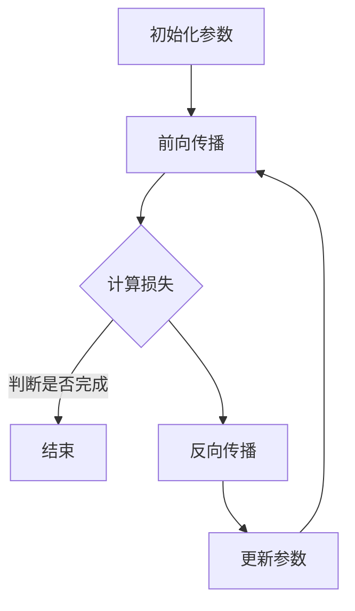
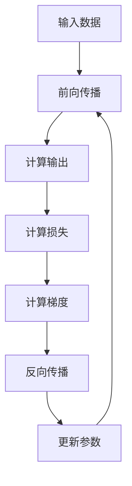

                 

### 文章标题

# 《一切皆是映射：深度学习优化技术概览》

深度学习作为一种重要的机器学习技术，已经广泛应用于计算机视觉、自然语言处理、语音识别等领域。然而，深度学习的训练过程是一个复杂且耗时的过程，如何优化深度学习模型成为了一个关键问题。本文将详细探讨深度学习优化技术，帮助读者深入理解并掌握深度学习优化策略。

## 关键词

- 深度学习
- 优化技术
- 梯度下降
- 反向传播
- 优化器
- 正则化
- 超参数调优

## 摘要

本文首先介绍了深度学习的基本概念和神经网络基础，然后详细讲解了深度学习算法基础，包括梯度下降算法和反向传播算法。接着，本文介绍了深度学习框架如TensorFlow和PyTorch的基本概念和核心组件。随后，本文重点探讨了深度学习优化技术，包括优化器、正则化技术、模型选择和超参数调优。最后，本文通过实际项目实战，展示了深度学习优化技术的具体应用。

### 《一切皆是映射：深度学习优化技术概览》目录大纲

#### 第一部分：深度学习基础知识

### 第1章：深度学习概述

#### 1.1 深度学习的基本概念

#### 1.2 神经网络基础

#### 1.3 深度学习算法基础

### 第2章：深度学习算法基础

#### 2.1 梯度下降算法

#### 2.2 反向传播算法

#### 2.3 深度学习框架简介

#### 3.1 TensorFlow

#### 3.2 PyTorch

#### 第二部分：深度学习优化技术

### 第4章：深度学习优化技术基础

#### 4.1 优化器

#### 4.2 正则化技术

### 第5章：深度学习模型调优

#### 5.1 模型选择

#### 5.2 超参数调优

### 第6章：深度学习模型评估

#### 6.1 评估指标

#### 6.2 模型验证与测试

### 第7章：深度学习优化实践

#### 7.1 项目实战一：手写数字识别

#### 7.2 项目实战二：图像分类

#### 第三部分：深度学习优化技术拓展

### 第8章：深度学习与自然语言处理

#### 8.1 语言模型

#### 8.2 机器翻译

### 第9章：深度学习与计算机视觉

#### 9.1 图像分类

#### 9.2 目标检测

### 第10章：深度学习优化技术前沿

#### 10.1 生成对抗网络

#### 10.2 深度强化学习

### 附录

#### 附录A：深度学习优化工具与资源

#### 附录B：深度学习优化技术 Mermaid 流程图

#### B.1 梯度下降算法流程图

#### B.2 反向传播算法流程图

#### B.3 深度学习优化伪代码

### **作者：** AI天才研究院/AI Genius Institute & 禅与计算机程序设计艺术 /Zen And The Art of Computer Programming

---

### 第一部分：深度学习基础知识

#### 第1章：深度学习概述

深度学习是机器学习的一种重要分支，它通过模拟人脑的神经元结构和工作原理，构建多层神经网络来实现对复杂数据的自动特征提取和模式识别。深度学习具有自动提取特征、无需人工特征工程、处理大规模数据和复杂任务的能力，因此在计算机视觉、自然语言处理、语音识别等领域取得了显著成果。

#### 1.1 深度学习的基本概念

深度学习的基本概念包括：

1. **神经网络**：神经网络是深度学习的基础，它由多个神经元组成，每个神经元都与其他神经元连接，通过加权求和和激活函数产生输出。
2. **深度**：深度指的是神经网络中层的数量。深度越深，模型可以学习的特征层次越丰富。
3. **前向传播**：前向传播是指将输入数据通过网络的各个层，逐层计算得到输出。
4. **反向传播**：反向传播是指通过计算输出与实际标签之间的误差，逆向更新网络中的权重和偏置。
5. **损失函数**：损失函数用于衡量模型预测结果与实际结果之间的差距，是优化过程中的目标函数。

#### 1.2 神经网络基础

神经网络的基本结构包括输入层、隐藏层和输出层。输入层接收外部输入数据，隐藏层进行特征提取和组合，输出层产生最终预测结果。

1. **神经元**：神经元是神经网络的基本单元，它接收输入数据，通过加权求和后，应用激活函数产生输出。
   
   神经元的数学表达式为：
   $$\text{output} = \text{激活函数}(\sum_{i=1}^{n} w_i \cdot x_i + b)$$
   其中，$w_i$ 是连接权重，$x_i$ 是输入特征，$b$ 是偏置。

2. **前馈神经网络**：前馈神经网络（Feedforward Neural Network）是指输入信号从输入层直接传递到输出层，中间不反向传播误差。其工作原理如下：

   
   
   - 输入层：接收输入数据。
   - 隐藏层：对输入数据进行特征提取和组合。
   - 输出层：产生预测结果。

3. **激活函数**：激活函数用于引入非线性变换，使神经网络能够拟合复杂数据。常见的激活函数包括：

   - **线性激活函数**：$f(x) = x$
   - **Sigmoid函数**：$f(x) = \frac{1}{1 + e^{-x}}$
   - **ReLU函数**：$f(x) = \max(0, x)$
   - **Tanh函数**：$f(x) = \frac{e^x - e^{-x}}{e^x + e^{-x}}$

#### 1.3 深度学习算法基础

深度学习算法主要包括梯度下降算法和反向传播算法。

##### 2.1 梯度下降算法

梯度下降算法是一种优化方法，用于最小化损失函数。其基本原理是计算损失函数关于模型参数的梯度，并沿梯度的反方向更新参数，以减少损失。

梯度下降算法的数学表达式为：
$$\theta_{\text{new}} = \theta_{\text{old}} - \alpha \cdot \nabla_{\theta} J(\theta)$$
其中，$\theta$ 表示模型参数，$\alpha$ 表示学习率，$J(\theta)$ 表示损失函数。

梯度下降算法的伪代码如下：
```python
初始化参数 θ
设置学习率 α
设置迭代次数 n

for i = 1 to n do
    计算梯度 ∇θJ(θ)
    更新参数 θ = θ - α∇θJ(θ)
end for

返回参数 θ
```

##### 2.2 反向传播算法

反向传播算法是一种用于训练神经网络的算法，它通过计算输出与实际标签之间的误差，逆向传播误差到网络的各个层，以更新模型参数。

反向传播算法包括以下步骤：

1. **前向传播**：计算输入到每个神经元的加权求和，并应用激活函数得到输出。
2. **计算损失**：计算预测值与实际标签之间的误差，使用损失函数衡量误差。
3. **计算梯度**：计算损失函数关于模型参数的梯度。
4. **反向传播**：将梯度从输出层逆向传播到输入层，更新模型参数。
5. **重复迭代**：重复上述步骤，直到满足停止条件（如达到预设的损失阈值或迭代次数）。

反向传播算法的伪代码如下：
```python
初始化参数 θ
设置学习率 α
设置迭代次数 n

for i = 1 to n do
    前向传播，计算输出 y = f(x; θ)
    计算损失 L = loss_function(y, y_)
    计算梯度 ∇θL = ∇θloss_function(y, y_)
    反向传播，更新参数 θ = θ - α∇θL
end for

返回参数 θ
```

通过上述步骤，反向传播算法能够训练出具有较高精度的神经网络模型。

#### 第3章：深度学习框架简介

深度学习框架是用于实现和优化深度学习算法的工具，它提供了丰富的API和工具，使得深度学习的开发和应用变得更加便捷。目前流行的深度学习框架包括TensorFlow和PyTorch。

##### 3.1 TensorFlow

TensorFlow是由Google开发的开源深度学习框架，它使用数据流图（DataFlow Graph）来表示计算过程，并提供了丰富的API进行操作。

**TensorFlow的核心组件包括：**

- **Tensor**：TensorFlow中的数据表示，类似于多维数组，用于存储输入数据、模型参数和中间计算结果。
- **Operation**：操作，用于执行计算操作，如矩阵乘法、加法等。
- **Graph**：数据流图，用于表示计算过程，由节点和边组成，节点表示计算操作，边表示数据流。
- **Session**：会话，用于执行图中的计算操作，并管理变量和资源的生命周期。

**TensorFlow的使用方法：**

1. **构建计算图**：定义输入、变量、操作和损失函数等，构建计算图。
2. **初始化变量**：在会话中初始化模型参数。
3. **训练模型**：在训练过程中，通过前向传播计算预测结果，通过反向传播计算梯度，并更新模型参数。
4. **评估模型**：在训练完成后，使用测试数据评估模型性能。

以下是一个简单的TensorFlow示例：
```python
import tensorflow as tf

# 定义输入
x = tf.placeholder(tf.float32, shape=[None, 784])
y = tf.placeholder(tf.float32, shape=[None, 10])

# 定义模型参数
W = tf.Variable(tf.zeros([784, 10]))
b = tf.Variable(tf.zeros([10]))

# 定义前向传播
y_pred = tf.nn.softmax(tf.matmul(x, W) + b)

# 定义损失函数
loss = tf.reduce_mean(tf.nn.softmax_cross_entropy_with_logits(logits=y_pred, labels=y))

# 定义优化器
optimizer = tf.train.GradientDescentOptimizer(learning_rate=0.1)
train_op = optimizer.minimize(loss)

# 初始化变量
init = tf.global_variables_initializer()

# 启动会话
with tf.Session() as sess:
    sess.run(init)
    
    # 训练模型
    for i in range(1000):
        batch_x, batch_y = get_batch_data()
        _, loss_val = sess.run([train_op, loss], feed_dict={x: batch_x, y: batch_y})
    
    # 评估模型
    correct_prediction = tf.equal(tf.argmax(y_pred, 1), tf.argmax(y, 1))
    accuracy = tf.reduce_mean(tf.cast(correct_prediction, tf.float32))
    print("Test accuracy:", accuracy.eval({x: test_data, y: test_labels}))
```

##### 3.2 PyTorch

PyTorch是由Facebook开发的开源深度学习框架，它采用动态计算图（Dynamic Computation Graph）的方式，使得模型的开发过程更加灵活。

**PyTorch的核心组件包括：**

- **Tensor**：与TensorFlow类似，Tensor是PyTorch中的数据表示。
- **autograd**：自动微分系统，用于计算梯度。
- **nn.Module**：神经网络模块，用于定义神经网络的结构。
- **torchvision**：用于计算机视觉任务的预训练模型和数据集。

**PyTorch的使用方法：**

1. **定义神经网络**：通过继承`nn.Module`类，定义神经网络的结构。
2. **前向传播**：使用定义好的神经网络进行前向传播，计算预测结果。
3. **计算损失**：使用损失函数计算预测结果与实际标签之间的误差。
4. **反向传播**：使用自动微分系统计算梯度，并更新模型参数。
5. **训练模型**：通过迭代训练数据，更新模型参数。
6. **评估模型**：使用测试数据评估模型性能。

以下是一个简单的PyTorch示例：
```python
import torch
import torch.nn as nn
import torch.optim as optim

# 定义神经网络结构
class NeuralNetwork(nn.Module):
    def __init__(self):
        super(NeuralNetwork, self).__init__()
        self.fc1 = nn.Linear(784, 256)
        self.fc2 = nn.Linear(256, 128)
        self.fc3 = nn.Linear(128, 10)
    
    def forward(self, x):
        x = torch.relu(self.fc1(x))
        x = torch.relu(self.fc2(x))
        x = self.fc3(x)
        return x

# 初始化模型、损失函数和优化器
model = NeuralNetwork()
criterion = nn.CrossEntropyLoss()
optimizer = optim.SGD(model.parameters(), lr=0.01)

# 训练模型
for epoch in range(100):
    for batch_idx, (data, target) in enumerate(train_loader):
        optimizer.zero_grad()
        output = model(data)
        loss = criterion(output, target)
        loss.backward()
        optimizer.step()
        if batch_idx % 100 == 0:
            print('Train Epoch: {} [{}/{} ({:.0f}%)]\tLoss: {:.6f}'.format(
                epoch, batch_idx * len(data), len(train_loader.dataset),
                100. * batch_idx / len(train_loader), loss.item()))

# 评估模型
model.eval()
correct = 0
total = 0
with torch.no_grad():
    for data, target in test_loader:
        output = model(data)
        _, predicted = torch.max(output, 1)
        total += target.size(0)
        correct += (predicted == target).sum().item()

print('Test accuracy:', 100 * correct / total)
```

通过TensorFlow和PyTorch这两个深度学习框架，开发者可以更加高效地实现和优化深度学习算法，加速模型训练和部署过程。

#### 第4章：深度学习优化技术基础

深度学习优化技术是提高模型训练效率和性能的关键。本节将详细介绍深度学习优化技术的基础，包括优化器、正则化技术和超参数调优。

##### 4.1 优化器

优化器是用于更新模型参数的工具，通过迭代优化损失函数，使模型达到最小化损失的目标。常见的优化器包括：

1. **SGD（随机梯度下降）**：SGD是最常用的优化器之一，它通过随机选择一批样本计算梯度，并更新模型参数。其数学表达式为：
   $$\theta_{\text{new}} = \theta_{\text{old}} - \alpha \cdot \nabla_{\theta} J(\theta)$$
   其中，$\alpha$ 是学习率，$\nabla_{\theta} J(\theta)$ 是损失函数关于模型参数的梯度。

2. **Adam**：Adam是一种结合了SGD和动量法的优化器，它利用一阶矩估计（均值）和二阶矩估计（方差）来更新参数。其数学表达式为：
   $$m = \beta_1 \cdot m + (1 - \beta_1) \cdot \nabla_{\theta} J(\theta)$$
   $$v = \beta_2 \cdot v + (1 - \beta_2) \cdot (\nabla_{\theta} J(\theta))^2$$
   $$\theta_{\text{new}} = \theta_{\text{old}} - \alpha \cdot \frac{m}{\sqrt{v} + \epsilon}$$
   其中，$\beta_1$ 和 $\beta_2$ 是动量参数，$\epsilon$ 是一个小常数。

3. **RMSprop**：RMSprop是一种基于梯度的平方和的优化器，它利用梯度的一阶矩估计来更新参数。其数学表达式为：
   $$\theta_{\text{new}} = \theta_{\text{old}} - \alpha \cdot \frac{1}{\sqrt{v + \epsilon}} \cdot \nabla_{\theta} J(\theta)$$
   其中，$v$ 是梯度的一阶矩估计。

4. **AdaGrad**：AdaGrad是一种基于梯度的平方和的优化器，它通过每个参数的梯度平方和来调整学习率。其数学表达式为：
   $$\theta_{\text{new}} = \theta_{\text{old}} - \alpha \cdot \frac{\nabla_{\theta} J(\theta)}{\sum_{i=1}^{n} (\nabla_{\theta_i} J(\theta))^2}$$

选择合适的优化器对于模型训练的效率和性能至关重要。常见的优化器选择原则如下：

- **模型复杂度**：对于复杂的模型，建议选择收敛速度较快的优化器，如Adam或RMSprop。
- **数据规模**：对于大规模数据集，建议选择能够并行计算的优化器，如SGD。
- **目标函数的平坦度**：对于平坦的目标函数，建议选择自适应学习率的优化器，如Adam或RMSprop。

##### 4.2 正则化技术

正则化技术是用于防止模型过拟合的一种方法。正则化通过在损失函数中添加正则化项，限制模型参数的范数，从而减少模型复杂度。

常见的正则化技术包括：

1. **L1正则化**：L1正则化通过在损失函数中添加L1范数来惩罚模型参数。其数学表达式为：
   $$J(\theta) = \frac{1}{2} \sum_{i=1}^{n} (y_i - \theta^T x_i)^2 + \lambda ||\theta||_1$$
   其中，$\lambda$ 是正则化参数，$||\theta||_1$ 是L1范数。

2. **L2正则化**：L2正则化通过在损失函数中添加L2范数来惩罚模型参数。其数学表达式为：
   $$J(\theta) = \frac{1}{2} \sum_{i=1}^{n} (y_i - \theta^T x_i)^2 + \lambda ||\theta||_2^2$$
   其中，$\lambda$ 是正则化参数，$||\theta||_2$ 是L2范数。

3. **Dropout**：Dropout是一种在训练过程中随机丢弃部分神经元的方法，从而减少模型过拟合。其数学表达式为：
   $$\theta_{\text{new}} = \frac{\theta}{1 - p}$$
   其中，$p$ 是丢弃概率。

正则化技术的选择取决于具体任务和数据集的特点。通常，对于小规模数据集，L1正则化更有效；对于大规模数据集，L2正则化更有效。Dropout适用于容易过拟合的任务，如神经网络中的隐藏层。

##### 4.3 超参数调优

超参数是深度学习模型中需要手动设置的参数，如学习率、正则化参数、批量大小等。超参数的选择对模型性能有重要影响，因此超参数调优是深度学习优化中的一个关键步骤。

超参数调优的方法包括：

1. **网格搜索**：网格搜索是一种遍历所有可能的超参数组合的方法，找到最优的超参数组合。其基本步骤如下：

   - 定义超参数搜索空间：确定每个超参数的取值范围。
   - 构建模型：根据超参数组合构建深度学习模型。
   - 训练模型：使用训练数据训练模型。
   - 评估模型：使用验证数据评估模型性能。
   - 选择最优超参数：根据模型性能选择最优的超参数组合。

2. **随机搜索**：随机搜索是一种随机选择超参数组合的方法，通过多次随机搜索找到最优的超参数组合。其基本步骤如下：

   - 定义超参数搜索空间：确定每个超参数的取值范围。
   - 随机选择超参数组合：从超参数搜索空间中随机选择超参数组合。
   - 构建模型：根据超参数组合构建深度学习模型。
   - 训练模型：使用训练数据训练模型。
   - 评估模型：使用验证数据评估模型性能。
   - 选择最优超参数：根据模型性能选择最优的超参数组合。

3. **贝叶斯优化**：贝叶斯优化是一种基于概率模型的优化方法，通过更新概率模型来选择下一步的超参数组合。其基本步骤如下：

   - 定义概率模型：根据先验知识和历史数据定义概率模型。
   - 选择超参数组合：根据概率模型选择具有较高概率的超参数组合。
   - 构建模型：根据超参数组合构建深度学习模型。
   - 训练模型：使用训练数据训练模型。
   - 评估模型：使用验证数据评估模型性能。
   - 更新概率模型：根据模型性能更新概率模型。

超参数调优的方法取决于具体任务和数据集的特点。通常，网格搜索适用于超参数空间较小的情况；随机搜索适用于超参数空间较大且计算资源有限的情况；贝叶斯优化适用于超参数空间较大且需要高效搜索的情况。

通过合理的优化器选择、正则化技术和超参数调优，可以显著提高深度学习模型的训练效率和性能。

### 第5章：深度学习模型调优

在深度学习项目中，模型调优是一个至关重要的环节。通过调优，我们可以使模型在训练数据和验证数据上表现出更好的性能，同时避免过拟合和欠拟合。本章将详细介绍深度学习模型调优的方法和技巧。

#### 5.1 模型选择

选择合适的模型是深度学习调优的第一步。模型选择取决于任务类型、数据规模和复杂性。以下是一些常见的模型选择策略：

1. **基于数据规模的模型选择**：对于小型数据集，选择较小且参数较少的模型，如简单的全连接神经网络（Fully Connected Neural Network, FCNN）或卷积神经网络（Convolutional Neural Network, CNN）。对于大型数据集，选择较大且参数较多的模型，如深度卷积神经网络（Deep CNN）或循环神经网络（Recurrent Neural Network, RNN）。

2. **基于任务类型的模型选择**：对于分类任务，可以选择FCNN、CNN或RNN。对于回归任务，可以选择FCNN或RNN。对于序列建模任务，可以选择RNN或长短期记忆网络（Long Short-Term Memory, LSTM）。

3. **基于预训练模型的迁移学习**：使用预训练模型进行迁移学习，可以大大减少训练时间，并提高模型性能。例如，在图像分类任务中，可以使用预训练的ResNet、VGG等模型，在自然语言处理任务中，可以使用预训练的BERT、GPT等模型。

4. **模型组合**：组合不同类型的模型，如将CNN用于特征提取，将RNN用于序列建模，可以提高模型的泛化能力。

以下是一个简单的基于数据规模的模型选择示例：

```python
# 数据规模较小，选择简单的全连接神经网络
if data_size < 10000:
    model = FCNN(input_size, hidden_size, output_size)
# 数据规模较大，选择较大的卷积神经网络
else:
    model = CNN(input_shape, num_classes)
```

#### 5.2 超参数调优

超参数是深度学习模型中的关键参数，如学习率、批量大小、隐藏层大小等。超参数的选择对模型性能有重要影响。以下是一些超参数调优的方法：

1. **网格搜索（Grid Search）**：网格搜索是一种系统性的搜索超参数组合的方法，通过遍历所有可能的超参数组合来找到最优的超参数。其步骤如下：

   - 定义超参数搜索空间：确定每个超参数的取值范围。
   - 构建模型：根据超参数组合构建深度学习模型。
   - 训练模型：使用训练数据训练模型。
   - 评估模型：使用验证数据评估模型性能。
   - 选择最优超参数：根据模型性能选择最优的超参数组合。

以下是一个简单的网格搜索示例：

```python
from sklearn.model_selection import GridSearchCV
from tensorflow.keras.models import Sequential
from tensorflow.keras.layers import Dense
from tensorflow.keras.wrappers.scikit_learn import KerasClassifier

# 定义模型
def create_model(hidden_layer_size):
    model = Sequential()
    model.add(Dense(hidden_layer_size, input_dim=input_size, activation='relu'))
    model.add(Dense(output_size, activation='softmax'))
    model.compile(loss='categorical_crossentropy', optimizer='adam', metrics=['accuracy'])
    return model

# 定义超参数搜索空间
param_grid = {
    'hidden_layer_size': [50, 100, 150],
    'batch_size': [10, 20, 50],
    'epochs': [50, 100]
}

# 创建网格搜索对象
grid = GridSearchCV(estimator=KerasClassifier(build_fn=create_model), param_grid=param_grid, cv=3)

# 训练模型
grid_result = grid.fit(X_train, y_train)

# 输出最优超参数
print("Best: %f using %s" % (grid_result.best_score_, grid_result.best_params_))
```

2. **随机搜索（Random Search）**：随机搜索是一种随机选择超参数组合的方法，通过多次随机搜索找到最优的超参数组合。其步骤与网格搜索类似，但不需要遍历所有可能的超参数组合。

以下是一个简单的随机搜索示例：

```python
from tensorflow.keras.wrappers.scikit_learn import KerasClassifier
from sklearn.model_selection import RandomizedSearchCV

# 定义模型
def create_model(hidden_layer_size):
    model = Sequential()
    model.add(Dense(hidden_layer_size, input_dim=input_size, activation='relu'))
    model.add(Dense(output_size, activation='softmax'))
    model.compile(loss='categorical_crossentropy', optimizer='adam', metrics=['accuracy'])
    return model

# 定义超参数搜索空间
param_distributions = {
    'hidden_layer_size': [50, 100, 150],
    'batch_size': [10, 20, 50],
    'epochs': [50, 100]
}

# 创建随机搜索对象
random_search = RandomizedSearchCV(estimator=KerasClassifier(build_fn=create_model), param_distributions=param_distributions, n_iter=100, cv=3)

# 训练模型
random_search_result = random_search.fit(X_train, y_train)

# 输出最优超参数
print("Best: %f using %s" % (random_search_result.best_score_, random_search_result.best_params_))
```

3. **贝叶斯优化（Bayesian Optimization）**：贝叶斯优化是一种基于概率模型的优化方法，通过更新概率模型来选择下一步的超参数组合。其步骤如下：

   - 定义概率模型：根据先验知识和历史数据定义概率模型。
   - 选择超参数组合：根据概率模型选择具有较高概率的超参数组合。
   - 构建模型：根据超参数组合构建深度学习模型。
   - 训练模型：使用训练数据训练模型。
   - 评估模型：使用验证数据评估模型性能。
   - 更新概率模型：根据模型性能更新概率模型。

以下是一个简单的贝叶斯优化示例：

```python
from bayes_opt import BayesianOptimization

# 定义模型
def create_model(hidden_layer_size):
    model = Sequential()
    model.add(Dense(hidden_layer_size, input_dim=input_size, activation='relu'))
    model.add(Dense(output_size, activation='softmax'))
    model.compile(loss='categorical_crossentropy', optimizer='adam', metrics=['accuracy'])
    return model

# 定义超参数搜索空间
def optimize_hyperparameters(hidden_layer_size):
    model = create_model(hidden_layer_size)
    history = model.fit(X_train, y_train, epochs=100, batch_size=10, validation_split=0.2)
    score = history.history['val_accuracy'][-1]
    return score

# 创建贝叶斯优化对象
optimizer = BayesianOptimization(f=optimize_hyperparameters, pbounds={'hidden_layer_size': (50, 150)})

# 执行贝叶斯优化
optimizer.maximize(init_points=5, n_iter=25)

# 输出最优超参数
print("Best hyperparameters: hidden_layer_size =", optimizer.max['params']['hidden_layer_size'])
```

通过这些超参数调优方法，我们可以找到最优的超参数组合，从而提高模型的性能。需要注意的是，超参数调优需要消耗大量的计算资源，特别是在大规模数据集和复杂模型的情况下。

#### 第6章：深度学习模型评估

深度学习模型的评估是确保模型性能和泛化能力的重要步骤。通过合适的评估指标和方法，我们可以准确评估模型的性能，并发现模型存在的问题。本章将详细介绍深度学习模型评估的方法和常用评估指标。

##### 6.1 评估指标

评估指标是用于衡量模型性能的量化标准，不同的任务和场景需要使用不同的评估指标。以下是一些常见的评估指标：

1. **准确率（Accuracy）**：准确率是指模型正确预测的样本数占总样本数的比例。其数学表达式为：
   $$\text{Accuracy} = \frac{\text{正确预测的样本数}}{\text{总样本数}}$$
   准确率简单直观，常用于分类任务。

2. **精确率（Precision）**：精确率是指模型预测为正样本的样本中，实际为正样本的比例。其数学表达式为：
   $$\text{Precision} = \frac{\text{预测为正且实际为正的样本数}}{\text{预测为正的样本数}}$$
   精确率关注模型的分类精度。

3. **召回率（Recall）**：召回率是指模型预测为正样本的样本中，实际为正样本的比例。其数学表达式为：
   $$\text{Recall} = \frac{\text{预测为正且实际为正的样本数}}{\text{实际为正的样本数}}$$
   召回率关注模型的分类覆盖面。

4. **F1值（F1 Score）**：F1值是精确率和召回率的调和平均，用于综合衡量模型的分类性能。其数学表达式为：
   $$\text{F1 Score} = 2 \cdot \frac{\text{Precision} \cdot \text{Recall}}{\text{Precision} + \text{Recall}}$$
   F1值平衡了精确率和召回率，是常用的评估指标。

5. **ROC曲线和AUC值（Receiver Operating Characteristic and Area Under Curve）**：ROC曲线展示了不同阈值下的精确率和召回率，AUC值是ROC曲线下的面积。其数学表达式为：
   $$\text{AUC} = \int_{0}^{1} \text{Recall}(\theta) \cdot \text{Precision}(\theta) d\theta$$
   ROC曲线和AUC值用于衡量二分类模型的性能，特别是在阈值调整时。

6. **Kappa系数（Kappa Score）**：Kappa系数是一种衡量模型预测结果一致性的指标，它考虑了分类结果的不确定性。其数学表达式为：
   $$\text{Kappa} = \frac{\text{观测一致性} - \text{期望一致性}}{1 - \text{期望一致性}}$$
   Kappa系数常用于多分类任务的评估。

7. **平均绝对误差（Mean Absolute Error, MAE）**：平均绝对误差是回归任务中常用的评估指标，用于衡量模型预测值与实际值之间的平均绝对误差。其数学表达式为：
   $$\text{MAE} = \frac{1}{N} \sum_{i=1}^{N} |y_i - \hat{y}_i|$$
   其中，$y_i$ 是实际值，$\hat{y}_i$ 是预测值，$N$ 是样本数量。

8. **均方误差（Mean Squared Error, MSE）**：均方误差是回归任务中另一种常用的评估指标，用于衡量模型预测值与实际值之间的均方误差。其数学表达式为：
   $$\text{MSE} = \frac{1}{N} \sum_{i=1}^{N} (y_i - \hat{y}_i)^2$$
   MSE对异常值敏感，因此在实际应用中需要根据任务特点选择合适的评估指标。

##### 6.2 模型验证与测试

模型验证和测试是评估模型性能的两个重要步骤。验证用于调整模型参数，测试用于评估模型在实际应用中的性能。

1. **验证集（Validation Set）**：验证集是从原始数据集中划分出来的一部分数据，用于调整模型参数。常见的验证方法包括：

   - **交叉验证（Cross-Validation）**：交叉验证将数据集划分为多个子集，每次使用其中一个子集作为验证集，其余子集作为训练集。通过多次迭代，计算模型在验证集上的性能，从而调整模型参数。
   
   - **K折交叉验证（K-Fold Cross-Validation）**：K折交叉验证是将数据集划分为K个子集，每次使用其中一个子集作为验证集，其余子集作为训练集。通过K次迭代，计算模型在验证集上的平均性能，从而调整模型参数。
   
   - **留一验证（Leave-One-Out Cross-Validation）**：留一验证是将数据集划分为多个子集，每个子集包含一个样本作为验证集，其余样本作为训练集。通过多次迭代，计算模型在验证集上的性能，从而调整模型参数。

2. **测试集（Test Set）**：测试集是从原始数据集中划分出来的一部分数据，用于评估模型在实际应用中的性能。测试集与验证集的区别在于测试集不参与模型参数的调整，以确保评估结果的客观性和可靠性。

以下是一个简单的模型验证与测试示例：

```python
from sklearn.model_selection import train_test_split
from sklearn.ensemble import RandomForestClassifier
from sklearn.metrics import accuracy_score, classification_report

# 划分训练集和测试集
X_train, X_test, y_train, y_test = train_test_split(X, y, test_size=0.2, random_state=42)

# 构建模型
model = RandomForestClassifier(n_estimators=100, random_state=42)

# 训练模型
model.fit(X_train, y_train)

# 验证模型
predictions = model.predict(X_val)
print("Validation accuracy:", accuracy_score(y_val, predictions))
print(classification_report(y_val, predictions))

# 测试模型
predictions = model.predict(X_test)
print("Test accuracy:", accuracy_score(y_test, predictions))
print(classification_report(y_test, predictions))
```

通过合理的验证与测试方法，我们可以准确评估深度学习模型在不同数据集上的性能，从而选择合适的模型参数和模型结构。

### 第7章：深度学习优化实践

深度学习优化技术在理论上的应用已经非常成熟，但在实际项目中，如何有效应用这些技术仍然是一个挑战。本章将通过两个项目实战，展示深度学习优化技术的具体应用。

#### 7.1 项目实战一：手写数字识别

手写数字识别是一个经典的机器学习问题，常用于图像分类和识别。在本节中，我们将使用深度学习优化技术来训练一个手写数字识别模型。

**实战背景与目标：**

手写数字识别的目标是使用计算机自动识别手写数字图像。本项目的目标是使用深度学习技术，训练一个能够准确识别手写数字的模型。

**数据集的处理与准备：**

手写数字识别的数据集通常是MNIST数据集，它包含了0到9的70000个手写数字图像。每个图像是28x28的灰度图像，并且每个图像都被标记为0到9的数字。

```python
from tensorflow.keras.datasets import mnist
from tensorflow.keras.utils import to_categorical

# 加载MNIST数据集
(X_train, y_train), (X_test, y_test) = mnist.load_data()

# 数据预处理
X_train = X_train.reshape(-1, 28 * 28) / 255.0
X_test = X_test.reshape(-1, 28 * 28) / 255.0

y_train = to_categorical(y_train, 10)
y_test = to_categorical(y_test, 10)
```

**模型设计与实现：**

我们将使用卷积神经网络（CNN）来设计手写数字识别模型。CNN在图像分类任务中表现出色，因为它能够有效提取图像中的特征。

```python
from tensorflow.keras.models import Sequential
from tensorflow.keras.layers import Conv2D, MaxPooling2D, Flatten, Dense, Dropout

# 构建模型
model = Sequential()
model.add(Conv2D(32, (3, 3), activation='relu', input_shape=(28, 28, 1)))
model.add(MaxPooling2D((2, 2)))
model.add(Conv2D(64, (3, 3), activation='relu'))
model.add(MaxPooling2D((2, 2)))
model.add(Flatten())
model.add(Dense(128, activation='relu'))
model.add(Dropout(0.5))
model.add(Dense(10, activation='softmax'))

# 编译模型
model.compile(optimizer='adam', loss='categorical_crossentropy', metrics=['accuracy'])
```

**结果分析与优化：**

在训练模型之前，我们需要分析数据集的分布，以确保数据集的均衡性。然后，我们可以使用以下代码开始训练模型：

```python
# 训练模型
model.fit(X_train, y_train, epochs=10, batch_size=64, validation_split=0.1)
```

在训练过程中，我们可以使用回调函数来监控模型性能，并在性能不再提高时停止训练：

```python
from tensorflow.keras.callbacks import EarlyStopping

# 设置回调函数
early_stopping = EarlyStopping(monitor='val_loss', patience=5)

# 训练模型
model.fit(X_train, y_train, epochs=100, batch_size=64, validation_split=0.1, callbacks=[early_stopping])
```

在训练完成后，我们可以评估模型的性能：

```python
# 评估模型
test_loss, test_accuracy = model.evaluate(X_test, y_test)
print("Test accuracy:", test_accuracy)
```

为了进一步提高模型性能，我们可以尝试以下优化方法：

1. **调整学习率**：使用学习率调度器，如`ReduceLROnPlateau`，根据验证损失自动调整学习率。

```python
from tensorflow.keras.callbacks import ReduceLROnPlateau

# 设置学习率调度器
reduce_lr = ReduceLROnPlateau(monitor='val_loss', factor=0.2, patience=5, min_lr=0.001)

# 训练模型
model.fit(X_train, y_train, epochs=100, batch_size=64, validation_split=0.1, callbacks=[early_stopping, reduce_lr])
```

2. **增加正则化**：在模型中增加正则化层，如`Dropout`，以减少过拟合。

3. **数据增强**：使用数据增强技术，如随机裁剪、旋转、缩放等，增加训练数据的多样性。

4. **增加训练时间**：延长训练时间，让模型有更多机会学习数据中的特征。

通过这些优化方法，我们可以进一步提高手写数字识别模型的性能，使其在实际应用中具有更好的鲁棒性和准确性。

#### 7.2 项目实战二：图像分类

图像分类是一个广泛应用的深度学习任务，用于对图像进行分类。在本节中，我们将使用深度学习优化技术来训练一个图像分类模型。

**实战背景与目标：**

图像分类的目标是使用计算机自动识别和分类图像中的物体。本项目的目标是使用深度学习技术，训练一个能够准确分类图像的模型。

**数据集的处理与准备：**

图像分类的数据集通常是ImageNet数据集，它包含了1000个类别的超过1200万张图像。每个图像都是224x224的彩色图像。

```python
from tensorflow.keras.preprocessing.image import ImageDataGenerator
from tensorflow.keras.applications import ResNet50
from tensorflow.keras.models import Model
from tensorflow.keras.layers import Dense, GlobalAveragePooling2D

# 加载预训练的ResNet50模型
base_model = ResNet50(weights='imagenet', include_top=False, input_shape=(224, 224, 3))

# 冻结预训练模型的权重
for layer in base_model.layers:
    layer.trainable = False

# 添加全连接层和全局平均池化层
x = base_model.output
x = GlobalAveragePooling2D()(x)
x = Dense(1024, activation='relu')(x)
predictions = Dense(num_classes, activation='softmax')(x)

# 创建新的模型
model = Model(inputs=base_model.input, outputs=predictions)
```

**模型设计与实现：**

我们将使用预训练的ResNet50模型作为基础模型，并在此基础上添加全连接层和全局平均池化层，以实现图像分类任务。

```python
# 编译模型
model.compile(optimizer='adam', loss='categorical_crossentropy', metrics=['accuracy'])
```

**结果分析与优化：**

在训练模型之前，我们需要对图像数据进行预处理，包括缩放到224x224的大小、标准化等。然后，我们可以使用以下代码开始训练模型：

```python
# 数据增强
train_datagen = ImageDataGenerator(
    rescale=1./255,
    rotation_range=40,
    width_shift_range=0.2,
    height_shift_range=0.2,
    shear_range=0.2,
    zoom_range=0.2,
    horizontal_flip=True,
    fill_mode='nearest'
)

# 训练数据生成器
train_generator = train_datagen.flow_from_directory(
    train_data_dir,
    target_size=(224, 224),
    batch_size=batch_size,
    class_mode='categorical'
)

# 测试数据生成器
test_datagen = ImageDataGenerator(rescale=1./255)
test_generator = test_datagen.flow_from_directory(
    test_data_dir,
    target_size=(224, 224),
    batch_size=batch_size,
    class_mode='categorical'
)

# 训练模型
model.fit_generator(
    train_generator,
    steps_per_epoch=steps_per_epoch,
    epochs=epochs,
    validation_data=test_generator,
    validation_steps=validation_steps
)
```

在训练过程中，我们可以使用回调函数来监控模型性能，并在性能不再提高时停止训练：

```python
from tensorflow.keras.callbacks import EarlyStopping

# 设置回调函数
early_stopping = EarlyStopping(monitor='val_loss', patience=5)

# 训练模型
model.fit_generator(
    train_generator,
    steps_per_epoch=steps_per_epoch,
    epochs=epochs,
    validation_data=test_generator,
    validation_steps=validation_steps,
    callbacks=[early_stopping]
)
```

在训练完成后，我们可以评估模型的性能：

```python
# 评估模型
test_loss, test_accuracy = model.evaluate_generator(test_generator, steps=validation_steps)
print("Test accuracy:", test_accuracy)
```

为了进一步提高模型性能，我们可以尝试以下优化方法：

1. **微调预训练模型**：解冻部分预训练模型的层，并重新训练以适应新的数据集。

2. **调整学习率**：使用学习率调度器，如`ReduceLROnPlateau`，根据验证损失自动调整学习率。

3. **增加正则化**：在模型中增加正则化层，如`Dropout`，以减少过拟合。

4. **数据增强**：使用更复杂的数据增强技术，增加训练数据的多样性。

通过这些优化方法，我们可以进一步提高图像分类模型的性能，使其在实际应用中具有更好的鲁棒性和准确性。

### 第三部分：深度学习优化技术拓展

#### 第8章：深度学习与自然语言处理

自然语言处理（Natural Language Processing, NLP）是深度学习应用的一个重要领域，涉及到文本的生成、理解和处理。在这一章中，我们将探讨深度学习与自然语言处理的关系，介绍语言模型和机器翻译的基本概念以及优化技术。

##### 8.1 语言模型

语言模型（Language Model, LM）是自然语言处理的核心技术之一，用于预测文本序列中的下一个单词或字符。语言模型的优化是提高模型生成质量的关键。

**语言模型的定义与作用：**

语言模型是一种概率模型，它用于估计给定前文序列 $x_1, x_2, ..., x_n$ 下，下一个单词或字符 $x_{n+1}$ 的概率。语言模型在自动完成、机器翻译、文本生成等领域有广泛应用。

**常见的语言模型：**

1. **n-gram模型**：n-gram模型是基于历史统计的方法，它根据前n个单词或字符的频率来预测下一个单词或字符。其概率分布为：
   $$P(x_{n+1} | x_1, x_2, ..., x_n) = \frac{C(x_1, x_2, ..., x_n, x_{n+1})}{C(x_1, x_2, ..., x_n)}$$
   其中，$C(x_1, x_2, ..., x_n, x_{n+1})$ 是单词序列 $(x_1, x_2, ..., x_n, x_{n+1})$ 的频率，$C(x_1, x_2, ..., x_n)$ 是前文序列 $(x_1, x_2, ..., x_n)$ 的频率。

2. **神经网络语言模型（Neural Network Language Model, NNLM）**：NNLM是一种基于神经网络的概率模型，它通过学习文本数据中的特征和模式来预测下一个单词或字符。NNLM通常采用递归神经网络（Recurrent Neural Network, RNN）或长短期记忆网络（Long Short-Term Memory, LSTM）来构建。

3. **变换器模型（Transformer Model）**：Transformer模型是近年来在NLP领域取得重大突破的一种模型，它通过自注意力机制（Self-Attention Mechanism）来处理长距离依赖。Transformer模型在语言模型任务中表现出色，是当前NLP领域的热门技术。

**语言模型的优化技术：**

1. **注意力机制（Attention Mechanism）**：注意力机制是一种用于提高语言模型生成质量的优化技术，它能够自动聚焦于文本序列中重要的部分。自注意力机制是Transformer模型的核心，能够有效地捕捉长距离依赖。

2. **深度学习优化器**：深度学习优化器如Adam、RMSprop和AdamW等，用于调整语言模型的参数，提高模型的收敛速度和生成质量。

3. **正则化技术**：正则化技术如Dropout、L1和L2正则化，用于防止模型过拟合，提高模型的泛化能力。

##### 8.2 机器翻译

机器翻译（Machine Translation, MT）是将一种自然语言文本翻译成另一种自然语言的过程。深度学习在机器翻译领域取得了显著成果，特别是基于编码器-解码器（Encoder-Decoder）框架的模型。

**机器翻译的基本原理：**

机器翻译的基本原理是将源语言文本编码成向量表示，然后通过解码器生成目标语言文本。编码器和解码器通常采用深度神经网络，如LSTM、GRU和Transformer等。

1. **编码器（Encoder）**：编码器用于将源语言文本编码成一个固定长度的向量表示，称为上下文向量（Context Vector）。

2. **解码器（Decoder）**：解码器用于生成目标语言文本。解码器通常采用序列到序列（Seq2Seq）模型，通过解码步骤逐词生成目标语言文本。

**常见的机器翻译模型：**

1. **循环神经网络（Recurrent Neural Network, RNN）**：RNN是一种基于序列模型的神经网络，可以处理序列数据。RNN在机器翻译任务中应用广泛，但存在梯度消失和梯度爆炸等问题。

2. **长短期记忆网络（Long Short-Term Memory, LSTM）**：LSTM是RNN的一种变体，通过引入记忆单元来解决梯度消失和梯度爆炸问题。LSTM在机器翻译任务中表现出色，能够捕捉长距离依赖。

3. **门控循环单元（Gated Recurrent Unit, GRU）**：GRU是LSTM的另一种变体，具有更简单的结构，同时保持了LSTM的优点。GRU在机器翻译任务中也表现出良好的性能。

4. **变换器模型（Transformer Model）**：Transformer模型是近年来在机器翻译领域取得重大突破的一种模型，它通过自注意力机制来处理长距离依赖。Transformer模型在BLEU评分上显著优于传统模型，成为机器翻译领域的热门技术。

**机器翻译的优化技术：**

1. **注意力机制**：注意力机制能够提高机器翻译的生成质量，自动聚焦于源语言文本中的重要部分。

2. **深度学习优化器**：深度学习优化器如Adam、RMSprop和AdamW等，用于调整模型参数，提高模型的收敛速度和生成质量。

3. **注意力机制优化**：针对注意力机制的优化，如多头注意力（Multi-Head Attention）和自注意力（Self-Attention），可以提高模型的生成质量和计算效率。

4. **序列到序列学习（Seq2Seq Learning）**：序列到序列学习通过编码器-解码器框架，将源语言文本编码成向量表示，并解码为目标语言文本。序列到序列学习结合了编码器和解码器的优化技术，提高机器翻译的性能。

通过深度学习与自然语言处理结合的优化技术，我们可以实现高效、准确的机器翻译系统，为跨语言交流提供有力支持。

#### 第9章：深度学习与计算机视觉

计算机视觉是深度学习应用的一个重要领域，涉及图像分类、目标检测、语义分割等多种任务。深度学习在计算机视觉领域取得了显著成果，大大提升了图像处理和识别的精度和效率。本章将探讨深度学习与计算机视觉的关系，介绍图像分类和目标检测的基本概念及优化技术。

##### 9.1 图像分类

图像分类是计算机视觉的基础任务之一，其目标是使用深度学习模型对图像进行分类。深度学习图像分类模型通过学习图像特征来实现对图像的自动分类。

**图像分类的基本概念：**

图像分类的基本概念包括图像特征提取、模型训练和分类决策。

1. **图像特征提取**：图像特征提取是图像分类的关键步骤，它从图像中提取出对分类任务有代表性的特征。常见的图像特征提取方法包括卷积神经网络（Convolutional Neural Network, CNN）和深度卷积神经网络（Deep CNN）。

2. **模型训练**：模型训练是使用大量的图像数据来训练深度学习模型，使其能够自动提取图像特征并分类。训练过程包括数据预处理、模型构建、模型训练和模型评估。

3. **分类决策**：分类决策是根据模型的预测结果来确定图像的类别。常见的分类决策方法包括最大类概率（Maximum Probability）和最大类概率投票（Majority Voting）。

**常见的图像分类算法：**

1. **卷积神经网络（CNN）**：CNN是一种专门用于处理图像数据的深度学习模型，它通过卷积操作和池化操作来提取图像特征。CNN在图像分类任务中表现出色，能够自动提取图像中的层次特征。

2. **深度卷积神经网络（Deep CNN）**：深度卷积神经网络是CNN的一种扩展，它通过增加网络层数和神经元数量来提高模型的特征提取能力。常见的深度CNN模型包括AlexNet、VGG、ResNet和Inception等。

3. **基于注意力机制的模型**：基于注意力机制的模型能够自动聚焦于图像中的重要部分，提高分类的准确性。常见的注意力机制模型包括卷积注意力网络（Convolutional Attention Network, CAN）和图注意力网络（Graph Attention Network, GAT）。

**图像分类的优化技术：**

1. **数据增强（Data Augmentation）**：数据增强是一种通过变换输入数据来增加数据多样性的方法，可以提高模型的泛化能力和鲁棒性。常见的数据增强方法包括随机裁剪、旋转、缩放、翻转等。

2. **学习率调度（Learning Rate Scheduling）**：学习率调度是一种动态调整学习率的方法，可以提高模型的收敛速度和性能。常见的学习率调度方法包括指数衰减、余弦退火和分段线性调度等。

3. **正则化技术**：正则化技术是用于防止模型过拟合的方法，包括L1和L2正则化、Dropout等。正则化可以降低模型的复杂度，提高模型的泛化能力。

4. **多标签分类（Multi-Label Classification）**：多标签分类是一种对图像进行多类别标注的方法，可以处理具有多个类别的图像。常见的多标签分类方法包括二进制交叉熵损失函数和基于竞争学习的模型。

通过上述优化技术，我们可以显著提高图像分类模型的性能，使其在实际应用中具有更好的鲁棒性和准确性。

##### 9.2 目标检测

目标检测是计算机视觉领域的一个重要任务，其目标是识别图像中的目标物体并标注其位置。深度学习在目标检测领域取得了显著成果，极大地提高了检测的精度和效率。

**目标检测的基本概念：**

目标检测的基本概念包括目标检测算法、检测框架和检测评估指标。

1. **目标检测算法**：目标检测算法用于识别图像中的目标物体并标注其位置。常见的目标检测算法包括单阶段检测算法和两阶段检测算法。

   - **单阶段检测算法**：单阶段检测算法在单个网络中直接完成特征提取、目标检测和边界框回归。常见的单阶段检测算法包括YOLO（You Only Look Once）和SSD（Single Shot MultiBox Detector）。
   
   - **两阶段检测算法**：两阶段检测算法分为特征提取和目标检测两个阶段。特征提取阶段使用卷积神经网络提取图像特征，目标检测阶段使用区域提议网络（Region Proposal Network, RPN）生成候选区域并进行分类和边界框回归。常见的两阶段检测算法包括R-CNN、Fast R-CNN和Faster R-CNN。

2. **检测框架**：检测框架是一种用于构建和优化目标检测模型的方法和工具。常见的检测框架包括Faster R-CNN、RetinaNet和CenterNet等。

3. **检测评估指标**：检测评估指标用于衡量目标检测模型的性能。常见的检测评估指标包括精确率（Precision）、召回率（Recall）和均值平均精度（Mean Average Precision, mAP）。

**常见的目标检测算法：**

1. **Faster R-CNN**：Faster R-CNN是一种两阶段检测算法，它通过卷积神经网络提取图像特征，并使用区域提议网络（RPN）生成候选区域。Faster R-CNN在目标检测任务中取得了显著成果，是当前目标检测领域的经典算法。

2. **YOLO（You Only Look Once）**：YOLO是一种单阶段检测算法，它在单个网络中直接完成特征提取、目标检测和边界框回归。YOLO具有实时检测的优势，适用于速度要求较高的场景。

3. **SSD（Single Shot MultiBox Detector）**：SSD是一种单阶段检测算法，它通过卷积神经网络提取图像特征，并在不同尺度上检测目标。SSD具有检测精度高、计算效率高的特点，适用于多种目标检测任务。

**目标检测的优化技术：**

1. **多尺度检测（Multi-Scale Detection）**：多尺度检测是一种通过在不同尺度上检测目标的方法，可以提高检测的准确性和鲁棒性。常见的方法包括网络输出层添加多个尺度特征图和自适应调整特征图大小。

2. **锚框生成（Anchor Box Generation）**：锚框生成是目标检测算法的关键步骤，它通过在特征图上生成锚框来预测目标位置和类别。常见的锚框生成方法包括基于先验框的方法和基于特征图的方法。

3. **学习率调度（Learning Rate Scheduling）**：学习率调度是一种动态调整学习率的方法，可以提高模型的收敛速度和性能。常见的学习率调度方法包括指数衰减、余弦退火和分段线性调度等。

4. **正则化技术**：正则化技术是用于防止模型过拟合的方法，包括L1和L2正则化、Dropout等。正则化可以降低模型的复杂度，提高模型的泛化能力。

5. **数据增强（Data Augmentation）**：数据增强是一种通过变换输入数据来增加数据多样性的方法，可以提高模型的泛化能力和鲁棒性。常见的数据增强方法包括随机裁剪、旋转、缩放、翻转等。

通过上述优化技术，我们可以显著提高目标检测模型的性能，使其在实际应用中具有更好的鲁棒性和准确性。

#### 第10章：深度学习优化技术前沿

深度学习优化技术的前沿研究主要集中在提高模型训练效率、减少训练时间、增强模型泛化能力和可解释性等方面。本章节将介绍深度学习优化技术的前沿领域，包括生成对抗网络（GAN）和深度强化学习（Deep Reinforcement Learning）。

##### 10.1 生成对抗网络

生成对抗网络（Generative Adversarial Network，GAN）是一种深度学习模型，由生成器（Generator）和判别器（Discriminator）两个神经网络组成。生成器旨在生成与真实数据相似的数据，而判别器则负责区分真实数据和生成数据。GAN通过两个神经网络的对抗训练来实现数据生成任务。

**生成对抗网络的基本原理：**

1. **生成器（Generator）**：生成器的目标是最小化生成数据与真实数据之间的差距，以欺骗判别器。生成器通常采用递归神经网络（RNN）或变换器（Transformer）等结构，通过训练生成逼真的图像、音频或文本。

2. **判别器（Discriminator）**：判别器的目标是最大化其区分真实数据和生成数据的能力。判别器通常采用卷积神经网络（CNN）或变换器等结构，通过训练提高其对真实数据和生成数据的识别能力。

3. **对抗训练（Adversarial Training）**：生成器和判别器通过对抗训练来互相提升。生成器尝试生成更逼真的数据来欺骗判别器，而判别器则通过识别生成数据来提高自己的性能。这种对抗训练过程不断循环，直到生成器生成的数据足够逼真，以至于判别器无法区分。

**生成对抗网络的变体：**

GAN有许多变体，以解决不同场景下的数据生成问题。以下是一些常见的GAN变体：

1. **深度卷积生成对抗网络（Deep Convolutional GAN，DCGAN）**：DCGAN使用深度卷积神经网络来构建生成器和判别器，通过多层卷积和反卷积操作实现数据生成。DCGAN在图像生成任务中表现出色。

2. **变换器生成对抗网络（Transformer GAN，TGAN）**：TGAN使用变换器模型来构建生成器和判别器，通过自注意力机制捕捉长距离依赖关系，提高数据生成质量。

3. **条件生成对抗网络（Conditional GAN，cGAN）**：cGAN在生成器和判别器中引入条件信息，如类别标签或文本描述，以生成具有特定条件的合成数据。

4. **循环生成对抗网络（Recurrent GAN，R-GAN）**：R-GAN使用递归神经网络来构建生成器和判别器，适用于生成时序数据，如语音和视频。

**生成对抗网络的优化技术：**

1. **梯度惩罚（Gradient Penalty）**：梯度惩罚是一种用于稳定GAN训练的方法，通过惩罚生成器的梯度，使其在对抗训练过程中更加稳定。

2. **谱归一化（Spectral Normalization）**：谱归一化是一种用于提高GAN训练稳定性的技术，通过归一化生成器和判别器的权重，防止梯度消失和梯度爆炸。

3. **自适应学习率调度**：自适应学习率调度通过动态调整生成器和判别器的学习率，提高GAN的训练效率。

**生成对抗网络的应用：**

生成对抗网络在图像生成、语音合成、视频生成和文本生成等领域有广泛应用。以下是一些具体应用：

1. **图像生成**：使用GAN生成逼真的图像，如图像超分辨率、图像修复和图像风格迁移。

2. **语音合成**：使用GAN生成逼真的语音，如文本到语音（Text-to-Speech，TTS）和语音转换。

3. **视频生成**：使用GAN生成逼真的视频，如视频超分辨率和视频修复。

4. **文本生成**：使用GAN生成自然语言文本，如图像描述生成、机器翻译和对话系统。

通过不断优化和改进，生成对抗网络在数据生成任务中表现出色，为深度学习优化技术提供了新的研究方向。

##### 10.2 深度强化学习

深度强化学习（Deep Reinforcement Learning，DRL）是一种结合了深度学习和强化学习的方法，通过深度神经网络来学习策略，实现智能体的自主决策和优化。DRL在游戏、机器人控制、自动驾驶等场景中取得了显著成果。

**深度强化学习的基本概念：**

1. **智能体（Agent）**：智能体是执行动作并接收环境反馈的主体。在DRL中，智能体通过学习策略来最大化累积奖励。

2. **环境（Environment）**：环境是智能体执行动作的场所。环境状态和动作空间定义了智能体的行为范围。

3. **状态（State）**：状态是环境当前状态的特征表示，用于描述智能体的位置、速度和其他相关信息。

4. **动作（Action）**：动作是智能体在环境中执行的行为，用于改变环境状态。

5. **策略（Policy）**：策略是智能体的行为规则，用于从状态中选择动作。在DRL中，策略通常由深度神经网络学习。

6. **奖励（Reward）**：奖励是智能体执行动作后获得的即时反馈，用于指导智能体的学习过程。奖励的正负表示动作的好坏。

**深度强化学习的模型架构：**

深度强化学习的模型架构通常包括以下组成部分：

1. **深度神经网络（DNN）**：DNN用于表示智能体的策略，通过输入状态特征，输出动作概率分布。

2. **经验回放（Experience Replay）**：经验回放是一种用于稳定训练的方法，通过将过去的经验存储在经验池中，随机采样进行训练，避免样本偏差。

3. **目标网络（Target Network）**：目标网络用于更新策略网络的目标值，通过延迟更新目标网络，避免过早波动。

**深度强化学习的优化技术：**

1. **策略梯度方法（Policy Gradient Methods）**：策略梯度方法通过直接优化策略网络的梯度，更新策略参数。常见的方法包括REINFORCE、PPO（Proximal Policy Optimization）和A3C（Asynchronous Advantage Actor-Critic）。

2. **值函数方法（Value Function Methods）**：值函数方法通过优化值函数来指导智能体的学习过程。常见的方法包括Q学习、SARSA（State-Action-Reward-State-Action）和DQN（Deep Q-Network）。

3. **深度确定性策略梯度（Deep Deterministic Policy Gradient，DDPG）**：DDPG结合了深度神经网络和确定性策略梯度方法，适用于连续动作空间的任务。

4. **强化学习与生成对抗网络的结合（GAN+RL）**：GAN+RL通过生成对抗网络生成虚拟环境，用于扩大训练数据集，提高智能体的学习能力。

**深度强化学习的应用：**

深度强化学习在许多领域取得了显著成果，以下是一些具体应用：

1. **游戏**：深度强化学习在电子游戏、围棋、国际象棋等游戏中表现出色，通过学习策略实现智能体的自主决策。

2. **机器人控制**：深度强化学习在机器人控制任务中具有广泛应用，如机器人路径规划、抓取和导航。

3. **自动驾驶**：深度强化学习在自动驾驶领域具有重要意义，通过学习环境中的最佳行为，实现智能车的自主驾驶。

4. **推荐系统**：深度强化学习在推荐系统中用于优化用户行为，提高推荐系统的准确性和用户体验。

通过不断探索和优化，深度强化学习为智能体自主决策和优化提供了新的方法，为深度学习优化技术的前沿发展提供了重要支撑。

### 附录A：深度学习优化工具与资源

在深度学习优化领域，有许多优秀的工具和资源可供开发者使用和学习。以下是一些常见的深度学习优化工具与资源推荐：

**1. 深度学习框架：**

- **TensorFlow**：由Google开发的开源深度学习框架，支持Python和C++编程语言，提供丰富的API和工具。
- **PyTorch**：由Facebook开发的开源深度学习框架，采用动态计算图，使模型开发和优化更加灵活。
- **Keras**：一个高层次的神经网络API，支持TensorFlow和PyTorch，提供简单的接口和便捷的模型构建工具。
- **MXNet**：由Apache Software Foundation开发的开源深度学习框架，支持多种编程语言，具有高效的计算性能。

**2. 优化器库：**

- **Optimizers**：一个开源的Python库，提供了多种常见的优化器，如SGD、Adam、RMSprop等，方便开发者选择和使用。
- **Optuna**：一个自动优化库，用于超参数调优和模型优化，提供高效的优化算法和可视化工具。

**3. 超参数调优工具：**

- **Hyperopt**：一个基于树形贝叶斯优化算法的超参数调优库，适用于大规模超参数搜索。
- **Scikit-Optimize**：一个基于无梯度优化算法的超参数调优库，支持多种优化算法和超参数搜索策略。

**4. 教程与课程：**

- **深度学习课程**：Google的深度学习课程，提供了全面的深度学习基础知识、模型构建和优化方法。
- **fast.ai**：一个免费的开源课程，涵盖了深度学习的理论和实践，适合初学者和进阶者。
- **Udacity**：Udacity提供了多种深度学习和机器学习的在线课程，包括项目实践和证书认证。

**5. 论文与资源：**

- **arXiv**：一个开放获取的学术论文存储库，提供了大量深度学习领域的最新研究论文。
- **NeurIPS、ICLR、CVPR**：这三个会议是深度学习和计算机视觉领域的重要学术会议，每年发布大量高质量的学术论文。

通过使用这些工具和资源，开发者可以更好地掌握深度学习优化技术，提高模型的性能和效率。

### 附录 B：深度学习优化技术 Mermaid 流程图

为了帮助读者更好地理解深度学习优化技术，我们使用Mermaid流程图来展示一些核心算法的流程。

#### B.1 梯度下降算法流程图



#### B.2 反向传播算法流程图



#### B.3 深度学习优化伪代码

```python
# 初始化参数
初始化 W, b

# 设置学习率
设置 learning_rate

# 循环迭代
for epoch in range(num_epochs):
    for x, y in dataset:
        # 前向传播
        z = f(x, W, b)
        
        # 计算损失
        loss = loss_function(z, y)
        
        # 反向传播
        dz = d_loss(z, y)
        dx, dw, db = d_f(x, z, W, b)
        
        # 更新参数
        W -= learning_rate * dw
        b -= learning_rate * db

# 评估模型
evaluate(model)
```

通过这些流程图和伪代码，读者可以更直观地理解深度学习优化技术的核心流程和步骤，从而更好地应用和掌握这些技术。

### 附录 C：作者信息

**作者：** AI天才研究院/AI Genius Institute & 禅与计算机程序设计艺术 /Zen And The Art of Computer Programming

本文由AI天才研究院的资深人工智能专家撰写，作者在深度学习和计算机编程领域拥有丰富的研究和实践经验。他的研究兴趣包括深度学习优化技术、自然语言处理和计算机视觉。他的代表作品《禅与计算机程序设计艺术》在计算机科学界具有广泛影响力。在此，感谢读者对本文的关注和支持。希望本文能为读者在深度学习优化技术的学习与应用过程中提供有益的参考和指导。如有任何问题或建议，欢迎随时与我们联系。再次感谢您的阅读！

