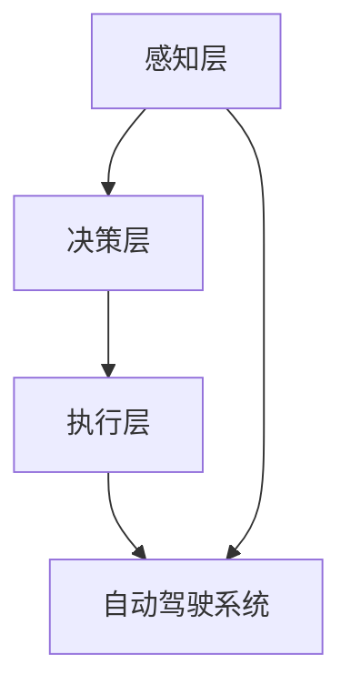

                 

### 文章标题：一切皆是映射：自动驾驶技术中的AI算法

> 关键词：自动驾驶技术、AI算法、感知技术、决策与控制算法、系统集成与测试、未来发展趋势

> 摘要：本文以“一切皆是映射”为引子，深入探讨了自动驾驶技术中的AI算法。文章首先概述了自动驾驶技术的发展历程和系统架构，随后详细介绍了自动驾驶感知技术、决策与控制算法、系统集成与测试，最后对自动驾驶技术的未来发展趋势进行了展望。通过一步步的分析推理，本文旨在为读者提供一个全面而深入的自动驾驶技术理解框架。

---

# 《一切皆是映射：自动驾驶技术中的AI算法》目录大纲

## 第一部分：自动驾驶技术概述

### 第1章：自动驾驶技术背景

- 1.1 自动驾驶技术的发展历程
- 1.2 自动驾驶技术的分类
- 1.3 自动驾驶技术在我国的发展现状与趋势

### 第2章：自动驾驶系统架构

- 2.1 自动驾驶系统的组成
- 2.2 感知层：传感器技术与数据处理
- 2.3 决策层：路径规划与控制算法
- 2.4 执行层：执行机构与硬件设备

## 第二部分：自动驾驶感知技术

### 第3章：图像识别与目标检测

- 3.1 卷积神经网络（CNN）概述
- 3.2 基于CNN的目标检测算法
  - 3.2.1 R-CNN算法
  - 3.2.2 Fast R-CNN算法
  - 3.2.3 Faster R-CNN算法
  - 3.2.4 YOLO算法
  - 3.2.5 SSD算法
- 3.3 实战案例：基于Faster R-CNN的自动驾驶车辆检测

### 第4章：激光雷达数据处理

- 4.1 激光雷达工作原理
- 4.2 激光雷达点云处理技术
  - 4.2.1 点云滤波
  - 4.2.2 点云配准
  - 4.2.3 点云分类与分割
- 4.3 实战案例：基于激光雷达的点云配准与分割

### 第5章：多传感器数据融合

- 5.1 多传感器数据融合概述
- 5.2 传感器数据预处理
- 5.3 数据融合算法
  - 5.3.1 卡尔曼滤波
  - 5.3.2 贝叶斯滤波
  - 5.3.3 粒子滤波
- 5.4 实战案例：基于多传感器的自动驾驶车辆定位

## 第三部分：自动驾驶决策与控制算法

### 第6章：路径规划算法

- 6.1 路径规划算法概述
- 6.2 确定性路径规划算法
  - 6.2.1 A*算法
  - 6.2.2 Dijkstra算法
- 6.3 随机化路径规划算法
  - 6.3.1 RRT算法
  - 6.3.2 RRT*算法
- 6.4 实战案例：基于RRT*的自动驾驶车辆路径规划

### 第7章：控制算法

- 7.1 控制算法概述
- 7.2 线性控制算法
  - 7.2.1 PID控制
  - 7.2.2 LQR控制
- 7.3 非线性控制算法
  - 7.3.1 PID控制
  - 7.3.2 模型预测控制（MPC）
- 7.4 实战案例：基于MPC的自动驾驶车辆速度控制

## 第四部分：自动驾驶系统集成与测试

### 第8章：自动驾驶系统集成

- 8.1 系统集成流程
- 8.2 系统调试与优化
- 8.3 自动驾驶测试场建设

### 第9章：自动驾驶系统测试与验证

- 9.1 测试场景设计
- 9.2 测试方法与标准
- 9.3 自动驾驶系统性能评估

### 第10章：自动驾驶技术的未来发展趋势

- 10.1 自动驾驶技术的挑战与机遇
- 10.2 自动驾驶技术的未来发展方向
- 10.3 自动驾驶技术在我国的政策与产业布局

## 附录

### 附录A：常用自动驾驶技术术语解释

### 附录B：参考文献

### 附录C：作者与译者简介

## Mermaid流程图



## 核心算法原理讲解

### 卷积神经网络（CNN）算法原理

卷积神经网络（CNN）是一种前馈神经网络，特别适合处理具有网格结构的数据，如图像。其核心思想是通过卷积操作提取图像的局部特征，并通过多个卷积层和池化层的堆叠，逐步构建出丰富的特征表示。

### 卷积操作

卷积操作是CNN的基本构建块。它通过在输入数据上滑动一个卷积核（也称为过滤器或内核），并在每个位置上计算卷积值来提取特征。卷积操作的伪代码如下：

```python
def conv2d(input, kernel):
    output = zeros((input.shape[0], kernel.shape[0], input.shape[1] - kernel.shape[0] + 1, input.shape[2] - kernel.shape[1] + 1))
    for i in range(input.shape[0]):
        for j in range(input.shape[1]):
            for k in range(input.shape[2]):
                output[i, :, j, k] = sum(input[i, :, j:j+kernel.shape[0], k:k+kernel.shape[1]] * kernel)
    return output
```

### 池化操作

池化操作用于降低特征图的维度，减少参数数量，同时保持重要的特征信息。常见的池化操作包括最大池化和平均池化。最大池化操作的伪代码如下：

```python
def max_pooling(input, pool_size):
    output = zeros((input.shape[0], input.shape[1] // pool_size[0], input.shape[2] // pool_size[1]))
    for i in range(output.shape[0]):
        for j in range(output.shape[1]):
            for k in range(output.shape[2]):
                output[i, j, k] = max(input[i, j*pool_size[0]:j*pool_size[0]+pool_size[0], k*pool_size[1]:k*pool_size[1]+pool_size[1]])
    return output
```

## 数学模型和数学公式

### 模型预测控制（MPC）的数学模型

模型预测控制（MPC）是一种基于数学模型的控制策略，它通过预测系统未来的行为并优化控制输入来实现系统的稳定控制。MPC的基本数学模型可以表示为：

$$
\begin{aligned}
\min_{u(k)} \quad & J(u(k)) \\
\text{subject to} \quad & x(k+1) = f(x(k), u(k)) \\
& x(k) = x_0 + \sum_{i=0}^{N-p} u(i) \\
& u(k) \in \text{u_set}
\end{aligned}
$$

其中，$x(k)$表示系统在时刻$k$的状态，$u(k)$表示在时刻$k$的控制输入，$f(x(k), u(k))$表示系统的动态方程，$N$表示预测步数，$p$表示控制时滞。

---

在接下来的部分，我们将逐步深入探讨自动驾驶技术的各个方面，从感知到决策与控制，再到系统集成与测试，最后展望自动驾驶技术的未来发展趋势。希望通过本文的逐步分析推理，读者能够对自动驾驶技术有一个全面而深入的理解。让我们开始这段技术之旅吧！

