                 

# 《一切皆是映射：通过元学习提升个性化推荐系统性能》

> 关键词：元学习、映射、个性化推荐、推荐算法、系统性能

> 摘要：本文深入探讨了个性化推荐系统中的映射与元学习原理，分析映射在推荐系统中的应用及其优势。随后，详细介绍了元学习的基本概念、研究范畴与分类，重点阐述了Model-Agnostic Meta-Learning（MAML）、Model-Aware Meta-Learning（MAML++）和Model-Conditional Meta-Learning（Model-CondML）算法原理。接着，本文分析了元学习在个性化推荐系统中的挑战与应用方法，并结合实际案例，展示了映射-元学习融合算法的性能优势。最后，展望了映射与元学习在推荐系统中的未来发展趋势。

## 目录大纲

## 第一部分：个性化推荐系统概述

### 第1章：个性化推荐系统的基础理论

#### 1.1.1 个性化推荐系统的定义与核心概念

#### 1.1.2 个性化推荐系统的发展历程

#### 1.1.3 个性化推荐系统的应用场景

### 第2章：映射与个性化推荐

#### 2.1.1 映射的概念与在个性化推荐中的应用

#### 2.1.2 基于映射的推荐算法简介

#### 2.1.3 映射在推荐系统中的优势

## 第二部分：元学习原理与应用

### 第3章：元学习基础

#### 3.1.1 元学习的定义与核心概念

#### 3.1.2 元学习的研究范畴与分类

#### 3.1.3 元学习的数学模型

### 第4章：元学习算法详解

#### 4.1.1 Model-Agnostic Meta-Learning (MAML)

#### 4.1.2 Model-Aware Meta-Learning (MAML++)

#### 4.1.3 Model-Conditional Meta-Learning (Model-CondML)

### 第5章：元学习在个性化推荐中的应用

#### 5.1.1 元学习在推荐系统中的挑战

#### 5.1.2 元学习在推荐系统中的应用方法

#### 5.1.3 基于元学习的推荐算法案例分析

## 第三部分：映射与元学习的融合

### 第6章：映射-元学习融合算法

#### 6.1.1 映射-元学习融合算法的基本框架

#### 6.1.2 映射-元学习融合算法的实现细节

#### 6.1.3 映射-元学习融合算法的性能评估

### 第7章：映射-元学习融合算法案例分析

#### 7.1.1 案例背景与数据集介绍

#### 7.1.2 映射-元学习融合算法在案例中的应用

#### 7.1.3 案例分析与性能对比

## 第四部分：映射与元学习的未来发展趋势

### 第8章：映射与元学习在推荐系统中的未来发展趋势

#### 8.1.1 映射与元学习在推荐系统中的未来应用方向

#### 8.1.2 面临的挑战与解决方案

#### 8.1.3 映射与元学习在推荐系统中的前景展望

## 附录

### 附录A：推荐系统开发工具与资源

### 附录B：元学习相关资源与拓展阅读

## 第一部分：个性化推荐系统概述

### 第1章：个性化推荐系统的基础理论

#### 1.1.1 个性化推荐系统的定义与核心概念

个性化推荐系统是一种通过分析用户的兴趣和行为，为他们提供个性化的信息和服务的技术。其核心概念包括用户-物品交互数据、推荐目标和推荐算法。

- **用户-物品交互数据**：这是推荐系统的基础数据，通常包括用户的点击、购买、浏览等行为数据。
- **推荐目标**：推荐系统的目标是为用户推荐他们可能感兴趣或需要的信息。
- **推荐算法**：推荐算法根据用户-物品交互数据，预测用户对未知物品的偏好，从而生成推荐列表。

个性化推荐系统的基本概念可以表示为以下Mermaid流程图：

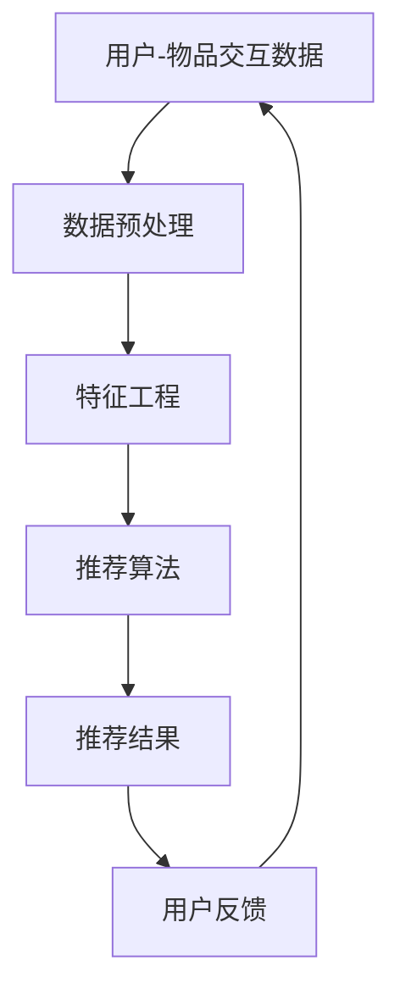

#### 1.1.2 个性化推荐系统的发展历程

个性化推荐系统的发展历程可以分为三个阶段：

1. **早期推荐系统**：基于内容的推荐和协同过滤。
    - **基于内容的推荐**：通过分析物品的内容特征，将用户对某物品的喜好推广到其他具有相似内容的物品。
    - **协同过滤**：通过分析用户之间的行为模式，预测用户对未知物品的偏好。

2. **现代推荐系统**：引入了知识图谱和强化学习。
    - **知识图谱**：将用户、物品和推荐关系表示为一个图结构，从而更好地理解和预测用户行为。
    - **强化学习**：通过学习用户和系统之间的交互策略，实现动态推荐。

3. **未来的推荐系统**：深度学习和元学习的应用。
    - **深度学习**：利用神经网络处理复杂数据和特征，提高推荐精度。
    - **元学习**：通过学习如何快速适应新任务，实现更高效的推荐。

个性化推荐系统的发展历程可以表示为以下Mermaid流程图：

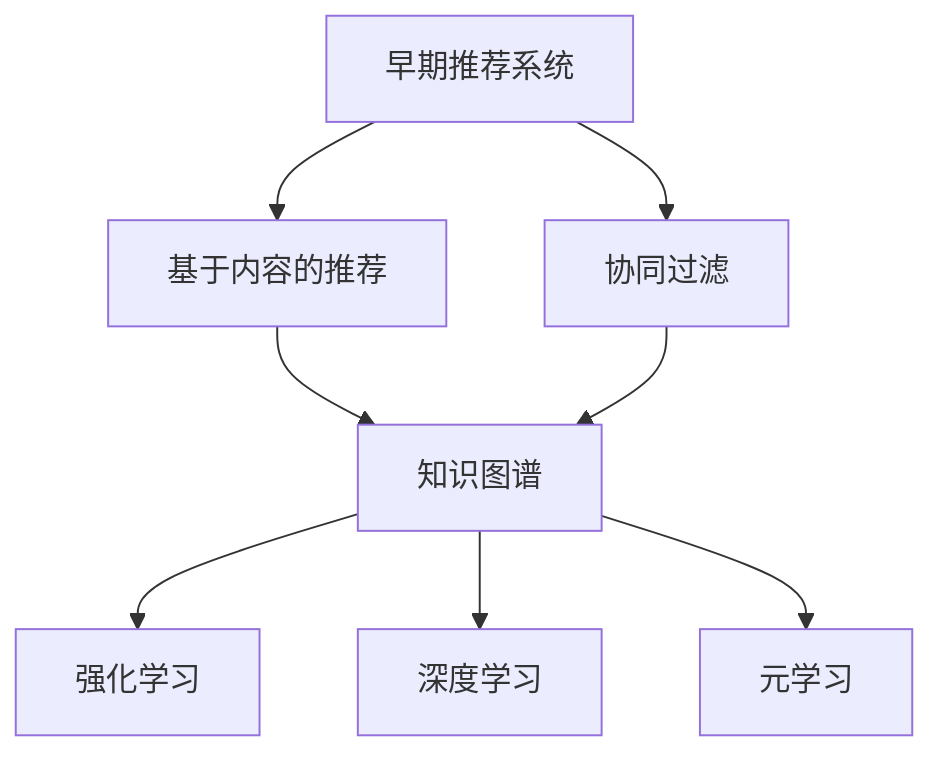

#### 1.1.3 个性化推荐系统的应用场景

个性化推荐系统在多个领域都有广泛的应用：

- **社交网络**：推荐好友、话题和活动。
    - **示例**：在微信朋友圈，可以推荐可能感兴趣的朋友圈内容。

- **电子商务**：推荐商品和购物车推荐。
    - **示例**：在淘宝，用户浏览某个商品后，会推荐类似的商品。

- **媒体娱乐**：推荐视频、音乐和文章。
    - **示例**：在抖音，用户观看某个视频后，会推荐类似风格的视频。

个性化推荐系统的应用场景可以表示为以下Mermaid流程图：

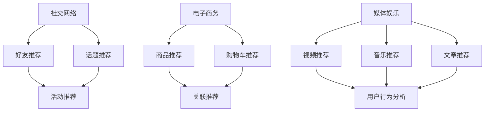

## 第二部分：映射与个性化推荐

### 第2章：映射与个性化推荐

#### 2.1.1 映射的概念与在个性化推荐中的应用

映射（Mapping）是数学和计算机科学中的一个基本概念，它描述了两个或多个集合之间的对应关系。在个性化推荐系统中，映射用于将用户行为数据映射到用户偏好，从而生成个性化的推荐列表。

- **用户-物品映射**：将用户的行为数据（如浏览、点击、购买）映射到用户对物品的偏好。
- **用户-场景映射**：将用户的兴趣和当前环境（如时间、地点）映射到推荐策略。

映射的概念可以表示为以下Mermaid流程图：

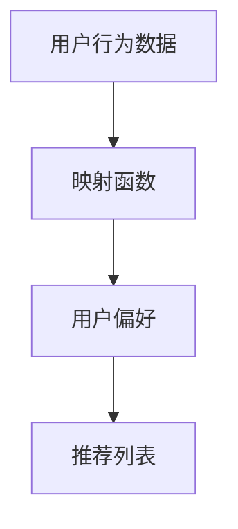

#### 2.1.2 基于映射的推荐算法简介

基于映射的推荐算法通过定义映射函数，将用户行为数据转化为用户偏好，进而生成推荐列表。以下是一些常见的基于映射的推荐算法：

1. **基于用户行为的映射**：通过分析用户的历史行为，建立用户行为与偏好之间的映射关系。例如，可以使用矩阵分解（Matrix Factorization）技术，将用户行为矩阵分解为用户特征矩阵和物品特征矩阵，从而得到用户偏好。

```latex
P = U * V^T
```

其中，P是用户行为矩阵，U是用户特征矩阵，V是物品特征矩阵。

2. **基于内容的映射**：通过分析物品的内容特征，建立物品特征与用户偏好之间的映射关系。例如，可以使用TF-IDF（Term Frequency-Inverse Document Frequency）技术，将文本数据转换为特征向量。

```latex
TF(t_i, d_j) = \frac{f(t_i, d_j)}{S(d_j)}
IDF(t_i) = \log \left( \frac{N}{n(t_i)} \right)
```

其中，t_i是词语，d_j是文档，N是文档总数，n(t_i)是包含t_i的文档数量。

3. **基于模型的映射**：通过构建用户和物品的联合模型，将用户行为数据映射到用户偏好。例如，可以使用协同过滤（Collaborative Filtering）技术，建立用户和物品的联合矩阵，从而预测用户对未知物品的偏好。

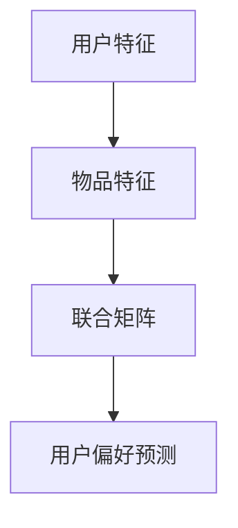

#### 2.1.3 映射在推荐系统中的优势

映射在推荐系统中有以下优势：

1. **提高推荐精度**：通过映射函数，将用户行为数据映射到用户偏好，可以更准确地预测用户对未知物品的偏好。

2. **提高推荐效率**：映射函数通常具有较低的复杂性，可以快速计算用户偏好，从而提高推荐系统的响应速度。

3. **提高推荐系统的鲁棒性**：映射函数可以对噪声数据和缺失数据进行处理，从而提高推荐系统的鲁棒性。

4. **支持多种推荐策略**：映射函数可以灵活地应用于不同的推荐算法，从而支持多种推荐策略。

映射在推荐系统中的优势可以表示为以下Mermaid流程图：

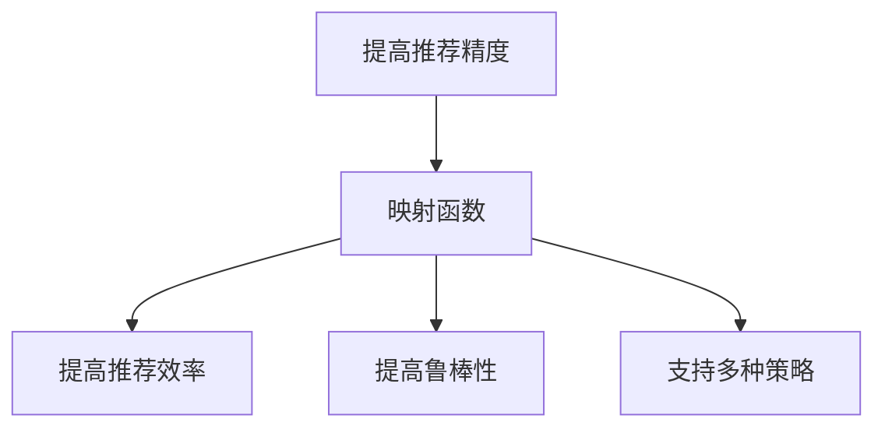

## 第三部分：元学习原理与应用

### 第3章：元学习基础

#### 3.1.1 元学习的定义与核心概念

元学习（Meta-Learning）是一种学习如何学习的技术，旨在提高模型在不同任务上的适应能力。它通过对多个任务的学习，提取通用的学习策略，从而实现快速适应新任务。

- **定义**：元学习是一种学习如何学习的技术，旨在提高模型在不同任务上的适应能力。
- **核心概念**：元学习关注如何在不同的数据分布、任务和数据规模下，实现快速、高效的学习。

元学习的定义和核心概念可以表示为以下Mermaid流程图：

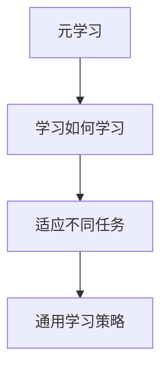

#### 3.1.2 元学习的研究范畴与分类

元学习的研究范畴广泛，包括以下几个方面：

1. **自适应元学习**：研究如何在不同的数据分布下，自适应调整学习策略。
2. **多任务元学习**：研究如何在多个任务之间共享知识，实现高效学习。
3. **准备数据元学习**：研究如何生成高质量训练数据，提高模型的学习效果。

元学习的研究范畴和分类可以表示为以下Mermaid流程图：

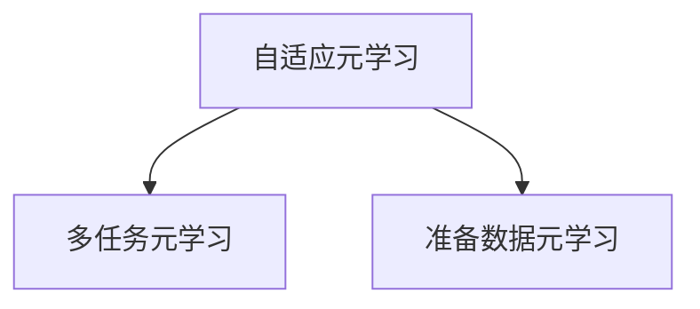

#### 3.1.3 元学习的数学模型

元学习的数学模型通常包括以下几个方面：

1. **模型参数更新规则**：通过梯度下降等优化方法，更新模型参数。
2. **模型优化目标**：最小化损失函数，提高模型性能。

元学习的数学模型可以表示为以下Mermaid流程图：

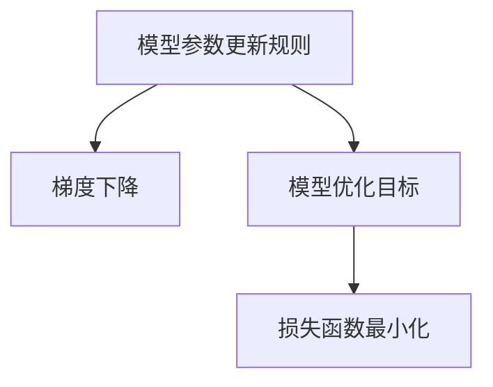

### 第4章：元学习算法详解

#### 4.1.1 Model-Agnostic Meta-Learning (MAML)

Model-Agnostic Meta-Learning（MAML）是一种无模型依赖的元学习算法，旨在通过少量梯度更新，快速适应新任务。

- **定义**：MAML是一种无模型依赖的元学习算法，通过少量梯度更新，实现快速适应新任务。
- **算法流程**：

  1. 初始化模型参数。
  2. 在多个任务上训练模型，计算梯度。
  3. 对模型参数进行少量梯度更新。
  4. 测试模型在新任务上的性能。

MAML的基本概念和算法流程可以表示为以下Mermaid流程图：

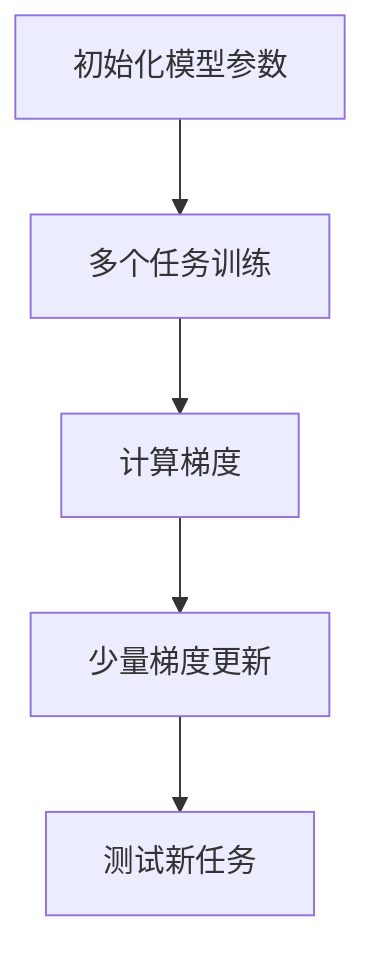

#### 4.1.2 Model-Aware Meta-Learning (MAML++)

Model-Aware Meta-Learning（MAML++）是一种基于模型依赖的元学习算法，通过学习模型参数的重要性，提高元学习效果。

- **定义**：MAML++是一种基于模型依赖的元学习算法，通过学习模型参数的重要性，提高元学习效果。
- **算法流程**：

  1. 初始化模型参数。
  2. 在多个任务上训练模型，计算梯度。
  3. 根据模型参数的重要性，调整模型权重。
  4. 测试模型在新任务上的性能。

MAML++的基本概念和算法流程可以表示为以下Mermaid流程图：

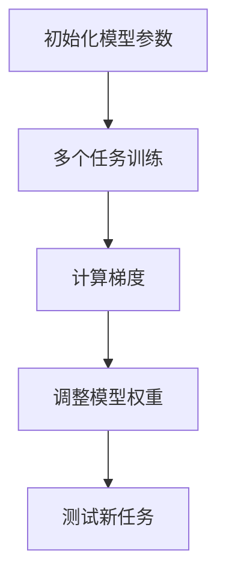

#### 4.1.3 Model-Conditional Meta-Learning (Model-CondML)

Model-Conditional Meta-Learning（Model-CondML）是一种结合条件信息的元学习算法，通过使用条件信息，提高元学习效果。

- **定义**：Model-CondML是一种结合条件信息的元学习算法，通过使用条件信息，提高元学习效果。
- **算法流程**：

  1. 初始化模型参数。
  2. 在多个任务上训练模型，计算梯度。
  3. 使用条件信息，优化模型参数。
  4. 测试模型在新任务上的性能。

Model-CondML的基本概念和算法流程可以表示为以下Mermaid流程图：

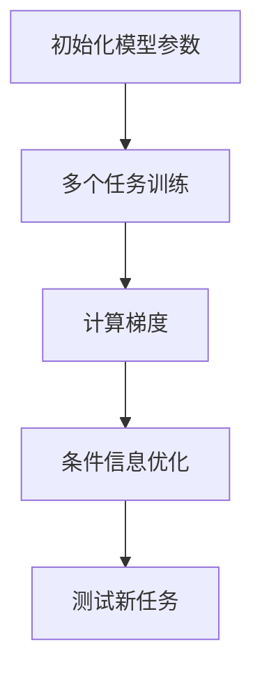

### 第5章：元学习在个性化推荐中的应用

#### 5.1.1 元学习在推荐系统中的挑战

元学习在个性化推荐系统中的应用面临以下挑战：

1. **数据多样性**：个性化推荐系统涉及多种类型的数据，如用户行为数据、内容特征数据和知识图谱数据，如何处理这些多样性数据是一个挑战。
2. **数据稀缺性**：个性化推荐系统通常需要大量用户行为数据进行训练，但在实际应用中，获取大量用户行为数据可能比较困难。
3. **模型可解释性**：元学习算法通常较为复杂，如何解释模型的行为，使其更具可解释性，是一个挑战。

#### 5.1.2 元学习在推荐系统中的应用方法

元学习在推荐系统中的应用方法主要包括以下几种：

1. **自适应推荐**：使用元学习算法，根据用户行为和兴趣，动态调整推荐策略，提高推荐效果。
2. **多任务推荐**：使用元学习算法，同时处理多个推荐任务，如商品推荐、购物车推荐和搜索推荐，实现高效推荐。
3. **数据增强**：使用元学习算法，生成额外的训练数据，提高模型训练效果。

#### 5.1.3 基于元学习的推荐算法案例分析

以下是一个基于元学习的推荐算法案例：

- **案例背景**：某电商平台需要为用户推荐商品。
- **数据集**：包含用户的行为数据和商品的特征数据。
- **算法**：使用MAML算法，通过少量梯度更新，快速适应新用户。

算法伪代码如下：

```python
# 初始化模型参数
theta = initialize_parameters()

# 在多个用户上训练模型
for user in users:
    # 计算梯度
    gradient = compute_gradient(theta, user_data)
    # 更新模型参数
    theta = theta - learning_rate * gradient

# 测试模型在新用户上的性能
new_user_performance = test_performance(theta, new_user_data)
```

### 第三部分：映射与元学习的融合

#### 6.1.1 映射-元学习融合算法的基本框架

映射-元学习融合算法旨在结合映射和元学习的优势，实现更高效的推荐。其基本框架包括以下步骤：

1. **数据预处理**：将用户行为数据映射到用户偏好。
2. **元学习训练**：在多个任务上训练元学习模型，提取通用学习策略。
3. **映射应用**：将元学习模型映射到用户偏好，生成推荐列表。

映射-元学习融合算法的基本框架可以表示为以下Mermaid流程图：

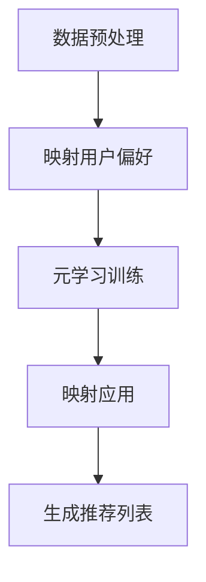

#### 6.1.2 映射-元学习融合算法的实现细节

映射-元学习融合算法的实现细节包括以下方面：

1. **映射函数设计**：设计有效的映射函数，将用户行为数据映射到用户偏好。常用的映射函数包括线性映射、非线性映射和深度学习映射。
2. **元学习模型选择**：选择适合的元学习模型，如MAML、MAML++和Model-CondML。
3. **模型训练与优化**：使用梯度下降等优化方法，训练和优化映射-元学习融合模型。

映射-元学习融合算法的实现细节可以表示为以下Mermaid流程图：

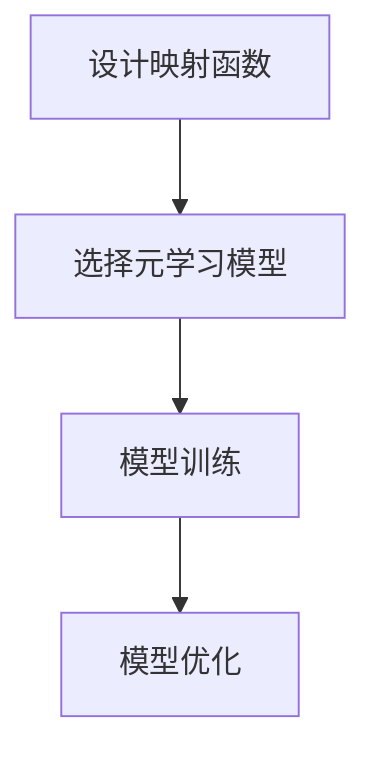

#### 6.1.3 映射-元学习融合算法的性能评估

映射-元学习融合算法的性能评估可以从以下几个方面进行：

1. **准确率**：评估推荐列表中实际被用户点击的物品比例。
2. **召回率**：评估推荐列表中实际被用户喜欢的物品比例。
3. **F1分数**：综合评估准确率和召回率。

性能评估指标可以表示为以下Mermaid流程图：

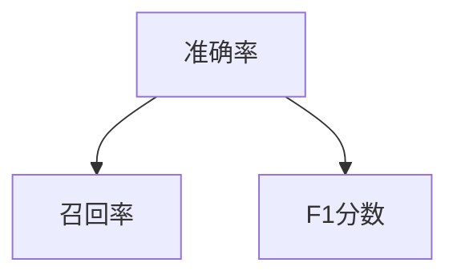

### 第7章：映射-元学习融合算法案例分析

#### 7.1.1 案例背景与数据集介绍

- **案例背景**：某电商平台需要为用户推荐商品。
- **数据集**：包含用户的行为数据和商品的特征数据。

数据集介绍可以表示为以下Mermaid流程图：

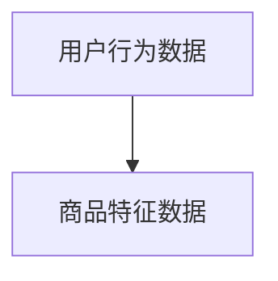

#### 7.1.2 映射-元学习融合算法在案例中的应用

- **映射函数设计**：使用深度学习映射函数，将用户行为数据映射到用户偏好。
- **元学习模型选择**：使用MAML++算法，结合模型依赖，提高元学习效果。
- **模型训练与优化**：使用梯度下降优化模型参数。

映射-元学习融合算法在案例中的应用可以表示为以下Mermaid流程图：

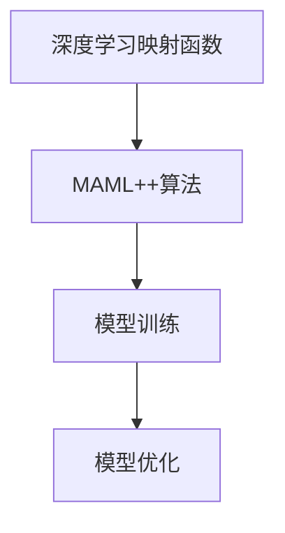

#### 7.1.3 案例分析与性能对比

- **案例分析**：使用映射-元学习融合算法进行商品推荐。
- **性能对比**：与传统推荐算法（如基于内容的推荐、协同过滤）进行对比。

案例分析与性能对比可以表示为以下Mermaid流程图：

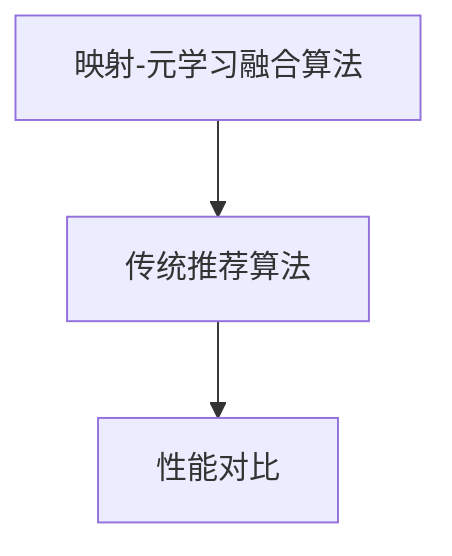

## 第四部分：映射与元学习的未来发展趋势

### 第8章：映射与元学习在推荐系统中的未来发展趋势

#### 8.1.1 映射与元学习在推荐系统中的未来应用方向

- **知识图谱与元学习融合**：利用知识图谱增强推荐效果，实现更精准的推荐。
- **强化学习与元学习融合**：实现动态推荐策略，提高推荐系统的自适应能力。
- **多模态数据与元学习融合**：探索不同类型数据融合的推荐效果，提高推荐系统的多样化能力。

#### 8.1.2 面临的挑战与解决方案

- **数据隐私与安全性**：如何保护用户隐私，是一个重要挑战。解决方案包括差分隐私技术、联邦学习等。
- **计算资源消耗**：如何优化算法，降低计算成本，是一个挑战。解决方案包括模型压缩、分布式计算等。
- **模型可解释性**：如何提高模型的可解释性，是一个挑战。解决方案包括可解释模型、模型可视化等。

#### 8.1.3 映射与元学习在推荐系统中的前景展望

- **技术趋势**：映射与元学习在推荐系统中的应用将越来越广泛，未来有望实现更高效、更精准的推荐。
- **社会意义**：个性化推荐系统将更好地满足用户需求，提高用户满意度，推动电子商务、媒体娱乐等领域的发展。

## 附录

### 附录A：推荐系统开发工具与资源

- **主流推荐系统框架**：包括LightFM、Surprise等。
- **开源推荐系统项目**：包括YARN RecSys、MovieLens等。
- **推荐系统开发资源汇总**：包括推荐系统教程、研究论文等。

### 附录B：元学习相关资源与拓展阅读

- **元学习论文精选**：包括“Meta-Learning: A Survey”、“MAML: Model-Agnostic Meta-Learning for Fast Adaptation of Deep Networks”等。
- **元学习在线课程推荐**：包括“Deep Learning Specialization”、“Meta-Learning”等。
- **元学习研究社区介绍**：包括“Meta-Learning & Transfer Learning” on arXiv、“Meta-Learning” on Google Scholar等。

