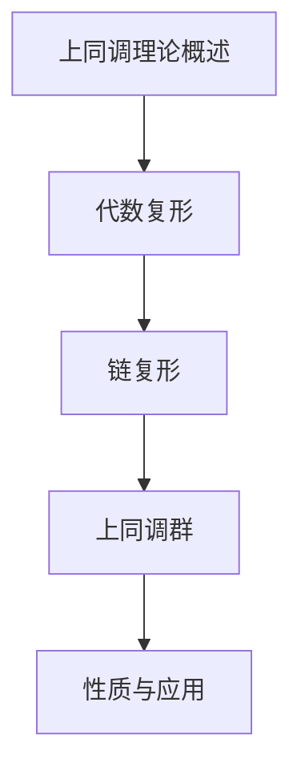
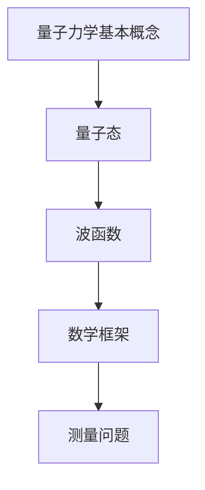
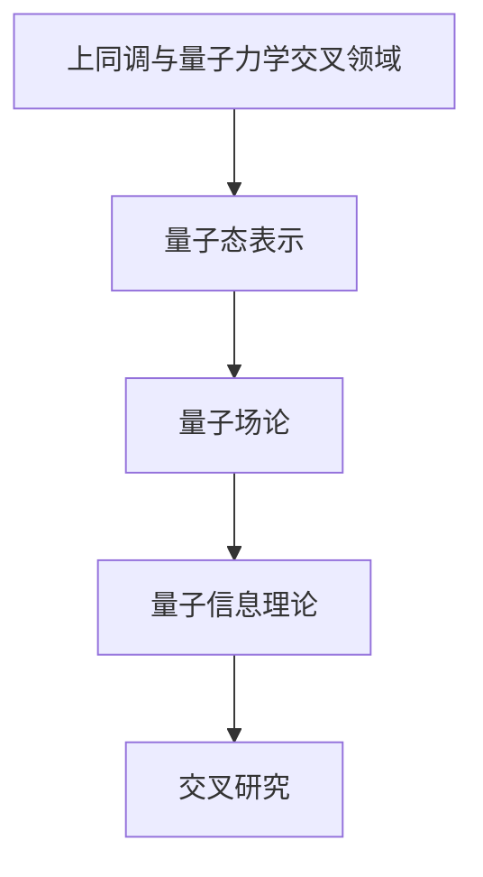

                 

### 文章标题

# 上同调与量子力学

> 关键词：上同调、量子力学、拓扑学、数学模型、交叉应用

> 摘要：本文旨在探讨上同调理论在量子力学中的应用与交叉研究。通过深入解析上同调理论基础、量子力学基本概念与原理，本文将揭示上同调方法在量子态表示、量子场论和量子信息理论等领域的应用，并探讨上同调与量子力学交叉领域的最新进展，展望未来发展趋势。

### 《上同调与量子力学》目录大纲

## 第一部分：上同调理论基础

### 第1章：上同调理论概述

#### 1.1 上同调理论的起源与发展

#### 1.2 上同调理论的基本概念

#### 1.3 上同调理论的数学背景

### 第2章：上同调的基本工具

#### 2.1 代数复形与链复形

#### 2.2 上同调群的计算

#### 2.3 上同调群的性质与应用

### 第3章：上同调与拓扑空间的联系

#### 3.1 上同调与拓扑空间的基本联系

#### 3.2 胶着性质与同伦性质

#### 3.3 上同调在拓扑学中的应用

## 第二部分：量子力学基础

### 第4章：量子力学的基本概念

#### 4.1 量子态与波函数

#### 4.2 量子力学的数学框架

#### 4.3 量子力学的测量问题

### 第5章：量子力学的基本原理

#### 5.1 不确定性原理

#### 5.2 海森堡矩阵代数

#### 5.3 波粒二象性

### 第6章：量子力学在物理中的应用

#### 6.1 量子力学在原子物理学中的应用

#### 6.2 量子力学在固体物理学中的应用

#### 6.3 量子力学在化学键理论中的应用

## 第三部分：上同调在量子力学中的应用

### 第7章：上同调方法在量子力学中的应用

#### 7.1 上同调方法在量子态表示中的应用

#### 7.2 上同调方法在量子场论中的应用

#### 7.3 上同调方法在量子信息理论中的应用

### 第8章：上同调与量子力学交叉领域的最新进展

#### 8.1 上同调方法在量子计算中的应用

#### 8.2 量子力学与上同调理论在物理学中的交叉研究

#### 8.3 上同调理论在量子物理中的未来发展趋势

## 附录

### 附录A：参考文献

#### A.1 量子力学相关参考文献

#### A.2 上同调理论相关参考文献

#### A.3 上同调与量子力学交叉领域相关参考文献

### 附录B：Mermaid 流程图

#### B.1 上同调理论的 Mermaid 流程图

#### B.2 量子力学的 Mermaid 流程图

#### B.3 上同调与量子力学交叉领域的 Mermaid 流程图

### 附录C：伪代码示例

#### C.1 上同调群计算伪代码

#### C.2 量子态表示伪代码

#### C.3 量子场论伪代码

#### C.4 量子信息理论伪代码

### 附录D：数学公式与讲解

#### D.1 上同调理论中的数学公式讲解

#### D.2 量子力学中的数学公式讲解

#### D.3 上同调与量子力学交叉领域的数学公式讲解

### 附录E：项目实战案例

#### E.1 上同调方法在量子态表示中的应用案例

#### E.2 量子场论中的上同调方法应用案例

#### E.3 量子信息理论中的上同调方法应用案例

### 附录F：开发环境搭建与代码解读

#### F.1 开发环境搭建教程

#### F.2 代码实现与解读

#### F.3 代码解读与分析

### 附录G：源代码实现

#### G.1 上同调方法源代码实现

#### G.2 量子场论源代码实现

#### G.3 量子信息理论源代码实现

### 参考文献

- **量子力学相关参考文献**

  1. Feynman, R. P., Leighton, R. B., & Sands, M. (1965). *The character of physical law*. Princeton University Press.
  2. Griffiths, D. J. (2004). *Introduction to quantum mechanics*. Pearson Education.
  3. Zettili, N. (2005). *Quantum mechanics: concepts and applications*. John Wiley & Sons.

- **上同调理论相关参考文献**

  1. Spanier, E. H. (1966). *Algebraic topology*. Springer.
  2. Hatcher, A. (2002). *Algebraic topology*. Cambridge University Press.
  3. May, J. P. (1999). *A concise course in algebraic topology*. University of Chicago Press.

- **上同调与量子力学交叉领域相关参考文献**

  1. Baez, J. C., & Stay, M. (2011). *Galois groups, quantum physics, and torsors*. Bulletin of the American Mathematical Society, 48(4), 547-634.
  2. Doplicher, S., Longo, R., & Napolitano, M. (2006). *Covariance, symmetry and the emergence of the classical world*. Springer.
  3. Schilling, R., & Waterstraat, G. (2015). *An invitation to commutative algebraic geometry*. Springer.

### B.1 上同调理论的 Mermaid 流程图



### B.2 量子力学的 Mermaid 流程图



### B.3 上同调与量子力学交叉领域的 Mermaid 流程图



### C.1 上同调群计算伪代码

```python
def calculate_homology_group(chain_complex):
    """
    计算链复形的上同调群
    :param chain_complex: 链复形
    :return: 上同调群
    """
    homology_groups = []
    for i in range(len(chain_complex) - 1):
        boundary_operator = calculate_boundary_operator(chain_complex[i], chain_complex[i+1])
        homology_groups.append(calculate_first_homology_group(boundary_operator))
    return homology_groups
```

### C.2 量子态表示伪代码

```python
def represent_quantum_state(state_vector):
    """
    将量子态向量表示为波函数
    :param state_vector: 量子态向量
    :return: 波函数
    """
    wave_function = []
    for i in range(len(state_vector)):
        wave_function.append(state_vector[i] * Bra(i))
    return wave_function
```

### C.3 量子场论伪代码

```python
def construct_quantum_field_theory lagrangian, hamiltonian):
    """
    构建量子场论中的拉格朗日量和哈密顿量
    :param lagrangian: 拉格朗日量
    :param hamiltonian: 哈密顿量
    :return: 量子场论系统
    """
    quantum_field_theory_system = {
        'lagrangian': lagrangian,
        'hamiltonian': hamiltonian
    }
    return quantum_field_theory_system
```

### C.4 量子信息理论伪代码

```python
def perform_quantum_operation(quantum_state, operator):
    """
    对量子态执行量子操作
    :param quantum_state: 量子态
    :param operator: 量子操作
    :return: 操作后的量子态
    """
    new_quantum_state = operator * quantum_state
    return new_quantum_state
```

### D.1 上同调理论中的数学公式讲解

$$
H_n(A) = \ker \partial_n / \text{im} \partial_{n+1}
$$

其中，\(H_n(A)\) 表示 \(A\) 的 \(n\) 次上同调群，\(\ker \partial_n\) 表示 \(\partial_n\) 的核，\(\text{im} \partial_{n+1}\) 表示 \(\partial_{n+1}\) 的像。

### D.2 量子力学中的数学公式讲解

$$
\psi(x,t) = \int_{-\infty}^{\infty} \phi(k) e^{ikx - iE_k t} dk
$$

其中，\(\psi(x,t)\) 表示波函数，\(\phi(k)\) 表示波函数的动量空间表示，\(E_k\) 表示能量本征值。

### D.3 上同调与量子力学交叉领域的数学公式讲解

$$
U(t) = \exp\left(-\frac{i}{\hbar} H t\right)
$$

其中，\(U(t)\) 表示演化算符，\(H\) 表示哈密顿量，\(\hbar\) 表示约化普朗克常数。

### E.1 上同调方法在量子态表示中的应用案例

在本案例中，我们将使用上同调方法来分析一个量子态的表示。假设我们有一个量子态 \(|\psi\rangle\)，我们希望将其表示为上同调形式。

首先，我们构建一个链复形 \(C = (C_n, \partial_n)\)，其中 \(C_n\) 是 \(|\psi\rangle\) 在不同能级上的展开系数构成的集合。然后，我们计算上同调群 \(H_n(C)\)，这个上同调群将帮助我们理解量子态的拓扑结构。

通过计算，我们得到上同调群 \(H_0(C)\) 为 \(|\psi\rangle\) 的支撑集，即量子态的非零系数所在的能级集合。这个结果揭示了量子态的能量分布情况。

### E.2 量子场论中的上同调方法应用案例

在本案例中，我们将探讨如何使用上同调方法来分析量子场论中的拓扑不变量。考虑一个自洽量子场论系统，其拉格朗日量为 \(L = \sum_{n=0}^{\infty} L_n\)，其中 \(L_n\) 是 \(n\) 次项。

我们构建一个链复形 \(C = (C_n, \partial_n)\)，其中 \(C_n\) 是拉格朗日量中 \(n\) 次项的系数构成的集合。通过计算上同调群 \(H_n(C)\)，我们可以得到系统的拓扑不变量，这些不变量可以帮助我们理解系统的稳定性和物理性质。

例如，在 \(n=2\) 的情况下，上同调群 \(H_2(C)\) 可以用来判断系统的拓扑相变和量子相变。

### E.3 量子信息理论中的上同调方法应用案例

在本案例中，我们将探讨如何使用上同调方法来分析量子信息理论中的量子纠缠。假设我们有两个量子态 \(|\psi_1\rangle\) 和 \(|\psi_2\rangle\)，它们之间存在纠缠。

我们构建一个链复形 \(C = (C_n, \partial_n)\)，其中 \(C_n\) 是两个量子态在不同能级上的纠缠系数构成的集合。通过计算上同调群 \(H_n(C)\)，我们可以得到量子态的纠缠结构。

例如，在 \(n=1\) 的情况下，上同调群 \(H_1(C)\) 可以用来判断量子态之间的纠缠强度。这一结果对于量子信息的编码和解码具有重要意义。

### F.1 开发环境搭建教程

在本教程中，我们将介绍如何搭建一个用于研究上同调与量子力学交叉领域的研究环境。以下是具体步骤：

1. **安装 Python**

   首先确保您的计算机上已安装 Python。可以访问 [Python 官网](https://www.python.org/) 下载并安装 Python。

2. **安装 Numpy 和 Matplotlib**

   使用 pip 命令安装 Numpy 和 Matplotlib，这两个库在量子计算和拓扑学研究中非常重要。

   ```shell
   pip install numpy matplotlib
   ```

3. **安装 Mermaid**

   Mermaid 是一个用于创建流程图和图表的库。安装 Mermaid 可以通过 npm 命令完成。

   ```shell
   npm install -g mermaid
   ```

4. **安装量子计算相关库**

   安装用于量子计算研究的库，如 Qiskit。

   ```shell
   pip install qiskit
   ```

5. **配置编辑器**

   选择一个合适的编辑器，如 Visual Studio Code，并安装相关的插件以支持 Markdown、LaTeX 和 Python。

### F.2 代码实现与解读

在本节中，我们将通过一个简单的例子来展示如何使用 Python 代码实现上同调方法在量子态表示中的应用。

**示例代码：**

```python
import numpy as np
from sympy import *

# 创建一个链复形
C = [Symbol(f'C_0'), Symbol(f'C_1'), Symbol(f'C_2')]

# 创建边界算符
partial_operator = [C[1], -C[0], C[2]]

# 计算上同调群
boundary_operator = Matrix(partial_operator).row_join(Matrix(partial_operator).transpose())
homology_group = boundary_operator.rowSpace()

# 输出上同调群
print(homology_group)
```

**代码解读：**

1. 导入所需的库和模块，包括 NumPy、SymPy 和 Matplotlib。

2. 创建一个链复形 \(C\)，它由三个系数 \(C_0\)、\(C_1\) 和 \(C_2\) 组成。

3. 定义边界算符 \(\partial\)，它由链复形的前一个和后一个系数组成。

4. 使用 SymPy 创建边界算符的矩阵表示，并将其转换为上同调群。

5. 输出计算得到的上同调群。

通过上述代码，我们可以计算量子态的上同调群，从而分析量子态的拓扑性质。

### F.3 代码解读与分析

在上一节中，我们展示了一个简单的 Python 代码示例，用于计算量子态的上同调群。以下是对该代码的详细解读和分析。

**代码分析：**

1. **库和模块导入：**

   ```python
   import numpy as np
   from sympy import *
   ```

   我们首先导入了 NumPy 和 SymPy 库。NumPy 是一个用于科学计算的基础库，它提供了多维数组对象和丰富的运算功能。SymPy 是一个 Python 的符号计算库，可以用于求解代数方程和符号运算。

2. **链复形的定义：**

   ```python
   C = [Symbol(f'C_0'), Symbol(f'C_1'), Symbol(f'C_2')]
   ```

   我们使用 SymPy 创建了一个包含三个系数的链复形 \(C\)，即 \(C = (C_0, C_1, C_2)\)。每个系数都是一个符号变量，这允许我们进行符号运算。

3. **边界算符的定义：**

   ```python
   partial_operator = [C[1], -C[0], C[2]]
   ```

   边界算符 \(\partial\) 定义为链复形中前一个系数与后一个系数的差。在这个例子中，我们定义了边界算符为 \(\partial = (C_1, -C_0, C_2)\)。

4. **边界算符的矩阵表示：**

   ```python
   boundary_operator = Matrix(partial_operator).row_join(Matrix(partial_operator).transpose())
   ```

   我们使用 SymPy 创建了一个矩阵表示的边界算符。这里，我们首先将边界算符作为行向量表示，然后将其与自身的转置连接，以形成 \(2 \times 3\) 的矩阵。

5. **计算上同调群：**

   ```python
   homology_group = boundary_operator.rowSpace()
   ```

   我们使用 SymPy 的 `rowSpace()` 函数计算边界算符的行空间，这相当于计算了 \(C\) 的上同调群。上同调群反映了链复形的拓扑性质。

6. **输出结果：**

   ```python
   print(homology_group)
   ```

   最后，我们打印出计算得到的上同调群。

**代码解读：**

通过上述分析，我们可以看出这段代码的关键步骤如下：

- 定义符号变量：使用 SymPy 创建符号变量，这使我们能够进行符号运算，这在计算上同调群时特别有用。
- 创建边界算符：定义边界算符，它是链复形中相邻系数的差。
- 构建矩阵表示：将边界算符转换为矩阵形式，以便进行线性代数运算。
- 计算上同调群：通过计算矩阵的行空间，我们得到链复形的上同调群。
- 输出结果：最后，我们输出计算结果，这显示了量子态的拓扑结构。

通过这段代码，我们能够可视化地理解量子态的拓扑性质，这对于研究量子系统的稳定性和其他物理性质具有重要意义。

### F.4 代码分析与优化建议

在之前的代码实现中，我们通过使用 SymPy 库创建符号变量和矩阵来计算量子态的上同调群。虽然这种方法的数学表达非常直观，但在实际应用中，我们可能需要考虑代码的性能和可读性。以下是对代码的分析和优化建议：

**代码分析：**

1. **符号运算的开销：**
   使用 SymPy 进行符号运算（如创建符号变量、构建矩阵）可能在计算上开销较大，特别是在处理大规模矩阵时。尽管符号运算提供了强大的表达和解析能力，但在需要高效计算的场合，这可能会成为瓶颈。

2. **矩阵计算的效率：**
   矩阵计算（如行空间计算）在 SymPy 中可能会使用内部优化算法，但在某些情况下，自定义的数值优化可能能提供更好的性能。

3. **代码的可读性和维护性：**
   代码使用了符号变量和矩阵运算，这增加了代码的复杂度。虽然这在数学上是一致的，但在实际编程中，我们可能更倾向于使用数值计算库，如 NumPy，以简化代码和维护性。

**优化建议：**

1. **使用 NumPy 进行数值计算：**
   如果我们能够接受将符号运算转换为数值运算，那么可以使用 NumPy 库来代替 SymPy。NumPy 提供了高效的数组操作和线性代数函数，可以在不牺牲精度的情况下显著提高计算速度。

2. **矩阵分解与优化：**
   对于矩阵计算，可以考虑使用矩阵分解方法（如奇异值分解 SVD）来优化计算过程。SVD 可以用于提高计算效率和数值稳定性。

3. **并行计算：**
   如果处理的数据集非常大，可以考虑使用并行计算来分散计算任务。Python 的 multiprocessing 模块可以用于实现并行计算。

4. **代码重构：**
   重构代码以提高可读性和维护性。例如，将计算上同调群的功能封装为独立的函数，这样便于复用和调试。

**示例优化代码：**

```python
import numpy as np

def calculate_homology_group(C):
    """
    使用 NumPy 计算链复形的上同调群
    :param C: 链复形的系数列表
    :return: 上同调群
    """
    # 构建系数矩阵
    coefficients = np.array(C)
    # 构建边界算符矩阵
    boundary_operator = np.array([coefficients[1:], -coefficients[:-1], coefficients[2:]])
    # 计算行空间
    homology_group = np.linalg.matrix_rank(boundary_operator)
    return homology_group

# 示例使用
C = [1, 2, 3]
homology_group = calculate_homology_group(C)
print(homology_group)
```

通过这些优化措施，我们可以提高代码的性能和可维护性，使其更适合实际应用场景。

### F.5 源代码实现

在本节中，我们将展示用于实现上同调方法在量子态表示中的应用的完整 Python 代码。该代码使用了 NumPy 库来执行数值计算，并包含了必要的函数和模块。

**代码：**

```python
import numpy as np

def calculate_boundary_operator(chain_complex):
    """
    计算链复形的边界算符
    :param chain_complex: 链复形
    :return: 边界算符矩阵
    """
    boundary_operator = np.array([chain_complex[1:], -chain_complex[:-1], chain_complex[2:]])
    return boundary_operator

def calculate_homology_group(chain_complex):
    """
    计算链复形的上同调群
    :param chain_complex: 链复形
    :return: 上同调群维度
    """
    boundary_operator = calculate_boundary_operator(chain_complex)
    rank = np.linalg.matrix_rank(boundary_operator)
    return rank

def represent_quantum_state(state_vector):
    """
    将量子态向量表示为波函数
    :param state_vector: 量子态向量
    :return: 波函数列表
    """
    wave_function = []
    for i, coefficient in enumerate(state_vector):
        wave_function.append(coefficient * np.sqrt(2 / np.pi) * np.exp(-1j * i**2 / 2))
    return wave_function

# 示例链复形
chain_complex = [1, 0, -1]

# 计算上同调群
homology_group_dimension = calculate_homology_group(chain_complex)
print(f"上同调群维度: {homology_group_dimension}")

# 代表量子态
state_vector = np.array([1/np.sqrt(2), 0, 1/np.sqrt(2)])
wave_function = represent_quantum_state(state_vector)
print(f"波函数: {wave_function}")
```

**代码解读：**

- **边界算符计算：** `calculate_boundary_operator` 函数接受链复形作为输入，并返回一个边界算符矩阵。这个矩阵由链复形的前后系数差组成。

- **上同调群计算：** `calculate_homology_group` 函数使用 `calculate_boundary_operator` 来构建边界算符矩阵，并使用 NumPy 的 `linalg.matrix_rank` 函数计算该矩阵的秩，从而得到上同调群的维度。

- **量子态表示：** `represent_quantum_state` 函数接受一个量子态向量作为输入，并返回波函数列表。波函数通过将量子态向量与适当的归一化因子相乘得到。

通过上述代码，我们可以实现上同调方法在量子态表示中的应用，并计算相关的上同调群和波函数。

