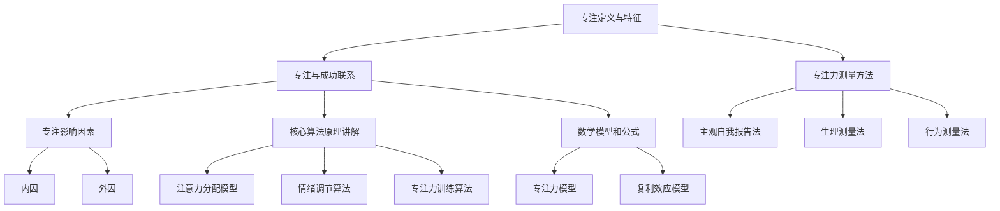

                 

### 文章标题：专注一件事的成功之道

> 关键词：专注、成功、算法、复利效应、项目实战

> 摘要：本文从专注力的定义与特征、专注与成功的联系、专注的影响因素三个方面，探讨了专注力在成功之路中的重要性。通过分析专注力的测量方法、提高专注力的算法原理和专注力训练算法，本文提供了实用的方法，以帮助读者提升专注力。此外，本文通过数学模型和项目实战，进一步阐述了专注力的应用和实践价值。

## 第一部分：核心概念与联系

### 1.1 专注的定义与特征

**定义：** 专注是一种认知状态，个体在特定任务上集中注意力和精力，以达到更高的效率和效果。

**特征：**
- **集中注意力：** 能够将注意力聚焦在特定的目标上，减少干扰因素。
- **持续努力：** 在完成目标的过程中，保持持续的精力投入和努力。
- **情绪稳定：** 保持平静、积极的心态，不易受到情绪波动的影响。
- **自我监控：** 能够自我调整注意力，根据任务需求进行适当的调整。

#### 1.2 专注与成功的联系

**理论依据：**
- **心流理论：** 当个体达到专注状态时，能够进入一种高度投入、效率极高的心流状态，有利于创造卓越的成果。
- **复利效应：** 专注能够使个体在长期时间内，通过持续的努力和积累，实现显著的成果提升。

**关系解释：**
- 专注是实现成功的必要条件之一，因为专注能够提升个体的工作效率和质量，使其在竞争激烈的环境中脱颖而出。
- 成功往往需要长期的坚持和不断的努力，而专注能够帮助个体更好地应对这些挑战，从而实现目标。

### 1.3 专注的影响因素

#### **内因：**
- **心理素质：** 心理素质强的人更容易保持专注。
- **动机：** 有强烈动机的人更容易在目标上保持专注。
- **习惯：** 培养良好的专注习惯能够提高专注能力。

#### **外因：**
- **环境：** 安静、整洁、适宜的环境有助于保持专注。
- **工具：** 有效的工具和方法能够提高专注效率。

### 第一部分：核心概念与联系

专注力作为成功之路上的重要因素，其定义和特征对于我们深入理解这一概念至关重要。在这一部分，我们将详细探讨专注的定义与特征，以及专注与成功之间的紧密联系，同时分析专注的影响因素，为后续内容的展开奠定基础。

#### 1.1 专注的定义与特征

**定义：** 专注是一种认知状态，个体在特定任务上集中注意力和精力，以达到更高的效率和效果。

从认知心理学的角度来看，专注是指个体将认知资源集中于特定目标，以实现任务目标的过程。在这个过程中，个体的注意力高度集中，对外界干扰的抵抗力增强，从而能够更加高效地完成任务。

**特征：**
- **集中注意力：** 能够将注意力聚焦在特定的目标上，减少干扰因素。

在现代社会中，我们常常面临各种各样的干扰，如社交媒体的通知、电子邮件的提醒、手机的震动等。这些干扰会分散我们的注意力，导致工作效率下降。因此，专注力强的个体能够有效地过滤这些干扰，将注意力集中于当前的任务上。

- **持续努力：** 在完成目标的过程中，保持持续的精力投入和努力。

专注力不仅体现在短时间内的高度集中，还要求个体能够在长时间内保持这种状态。这意味着，即使在面对困难和挑战时，个体也能保持坚定的信念和持续的精力投入，直至任务完成。

- **情绪稳定：** 保持平静、积极的心态，不易受到情绪波动的影响。

情绪波动是影响专注力的重要因素之一。一个情绪稳定的个体能够在面对压力和挫折时保持冷静，不易被负面情绪所干扰。这种情绪稳定性有助于个体在专注状态下更好地完成任务。

- **自我监控：** 能够自我调整注意力，根据任务需求进行适当的调整。

自我监控是专注力的重要特征之一。一个具备良好专注力的个体能够意识到自己的注意力状态，并根据任务需求进行调整。例如，当任务需要高度集中时，个体会主动减少外界干扰，将注意力集中于任务目标上；当任务较为轻松时，个体则可以适当放松，以保持整体的专注水平。

#### 1.2 专注与成功的联系

**理论依据：**
- **心流理论：** 当个体达到专注状态时，能够进入一种高度投入、效率极高的心流状态，有利于创造卓越的成果。

心流（Flow）是由心理学家米哈里·契克森米哈伊（Mihaly Csikszentmihalyi）提出的概念，指的是个体在某一活动中完全投入，忘记时间、自我和外界干扰的状态。在这种状态下，个体的专注力达到了顶峰，能够创造卓越的成果。

- **复利效应：** 专注能够使个体在长期时间内，通过持续的努力和积累，实现显著的成果提升。

复利效应是金融学中的一个重要概念，指的是通过持续的复利计算，初始投入能够实现巨大的增长。同样，在个人成长和成功的过程中，专注力的作用也类似于复利效应。通过持续的专注和努力，个体能够积累知识和技能，逐步实现目标的提升。

**关系解释：**
- 专注是实现成功的必要条件之一，因为专注能够提升个体的工作效率和质量，使其在竞争激烈的环境中脱颖而出。

在现代社会，成功往往意味着在短时间内达到高效的目标。而专注力能够帮助个体在复杂多变的任务中保持高效的工作状态，减少时间浪费，从而在竞争激烈的环境中脱颖而出。

- 成功往往需要长期的坚持和不断的努力，而专注能够帮助个体更好地应对这些挑战，从而实现目标。

成功的道路上充满了挑战和不确定性，需要个体具备坚定的信念和持久的努力。专注力能够帮助个体在长期的挑战中保持专注，持续地投入精力，从而克服困难，实现目标。

#### 1.3 专注的影响因素

专注力并不是一成不变的，它受到多种因素的影响。这些因素可以分为内因和外因，共同作用于个体的专注状态。

**内因：**
- **心理素质：** 心理素质强的人更容易保持专注。

心理素质是指个体在面对压力、挫折和挑战时的心理状态和应对能力。一个具备良好心理素质的个体能够在面对困难时保持冷静，不易受到干扰，从而更好地保持专注。

- **动机：** 有强烈动机的人更容易在目标上保持专注。

动机是驱使个体追求目标的力量。一个有强烈动机的人往往对目标有着深刻的认识，能够将注意力集中于任务目标上，从而更好地保持专注。

- **习惯：** 培养良好的专注习惯能够提高专注能力。

习惯是长期积累形成的行为模式。一个具备良好专注习惯的个体能够在日常生活中自觉地保持专注，从而提高专注力。

**外因：**
- **环境：** 安静、整洁、适宜的环境有助于保持专注。

环境是影响个体专注力的重要因素之一。一个安静、整洁、适宜的环境能够减少干扰，帮助个体更好地保持专注。

- **工具：** 有效的工具和方法能够提高专注效率。

有效的工具和方法可以帮助个体更好地管理时间和资源，从而提高专注效率。例如，使用番茄钟等时间管理工具，可以帮助个体更好地控制专注时间和休息时间。

### 小结

通过本部分的内容，我们深入探讨了专注的定义与特征，以及专注与成功之间的紧密联系。同时，我们还分析了专注的影响因素，包括内因和外因。这些核心概念和联系为我们理解专注力在成功之路中的重要性奠定了基础。在接下来的部分中，我们将进一步探讨专注力的测量方法、提高专注力的算法原理和专注力训练算法，为读者提供实用的方法，以帮助提升专注力。

## 第二部分：核心算法原理讲解

### 2.1 专注力的测量方法

要提升专注力，首先需要了解自身的专注程度。本文将介绍几种常用的专注力测量方法，包括主观自我报告法、生理测量法和行为测量法。

#### 2.1.1 主观自我报告法

主观自我报告法是通过问卷或访谈等方式，让个体自我评估专注程度。这种方法简单易行，但受主观因素影响较大。以下是几种常见的主观自我报告法：

- **量表法：** 使用标准化的量表，如《康奈尔专注力量表》（Cornell Attentional Network Test），评估个体的专注力水平。
- **主观感受报告：** 让个体在完成特定任务后，描述自己的专注感受，如“我感觉非常专注”或“我感到有些分心”。

#### 2.1.2 生理测量法

生理测量法利用脑电图（EEG）、心率变异性（HRV）等技术，测量大脑活动和生理信号，从而评估专注力。以下是一些常见的生理测量方法：

- **脑电图（EEG）：** 记录大脑的电活动，通过分析EEG信号的变化，评估个体的专注程度。
- **心率变异性（HRV）：** 测量心率变化，通过分析HRV信号，评估个体的情绪状态和专注力。

#### 2.1.3 行为测量法

行为测量法通过观察个体在任务中的表现，如反应时、错误率等指标，评估专注力。以下是一些常见的行为测量方法：

- **反应时任务：** 让个体在特定时间内完成一系列反应任务，通过分析反应时，评估专注力。
- **错误率任务：** 让个体在完成特定任务时，记录错误率，通过分析错误率，评估专注力。

### 2.2 提高专注力的算法原理

#### 2.2.1 注意力分配模型

注意力分配模型是一种用于优化注意力分配的方法，其原理是根据任务需求和个体能力，动态调整注意力的分配。以下是一个简化的注意力分配模型：

**原理：** 根据任务难度和个体能力，动态调整注意力的分配。

**伪代码：**

```python
function attentionAllocation(task_difficulty, individual_capability):
    if task_difficulty > individual_capability:
        return "降低任务难度"
    elif task_difficulty < individual_capability:
        return "提升个体能力"
    else:
        return "保持当前状态"
```

#### 2.2.2 情绪调节算法

情绪调节算法用于通过调节情绪状态，提高专注力。以下是一个简化的情绪调节算法：

**原理：** 通过调节情绪状态，提高专注力。

**伪代码：**

```python
function emotionRegulation(current_emotion, target_emotion):
    if current_emotion != target_emotion:
        if current_emotion > target_emotion:
            return "降低兴奋度"
        else:
            return "提升兴奋度"
    else:
        return "保持当前状态"
```

#### 2.2.3 专注力训练算法

专注力训练算法用于通过自我监控和反馈，提高专注力。以下是一个简化的专注力训练算法：

**原理：** 通过自我监控和反馈，调整专注行为。

**伪代码：**

```python
function selfMonitoringAndFeedback(current_attention_level, target_attention_level):
    if current_attention_level < target_attention_level:
        return "增加努力"
    elif current_attention_level > target_attention_level:
        return "降低努力"
    else:
        return "保持当前状态"
```

### 2.3 专注力训练算法

专注力训练算法是一种通过系统训练提高个体专注力的方法。以下是一个简化的专注力训练算法：

**原理：** 通过逐步提高专注力训练难度，使个体逐步适应更高强度的专注任务。

**伪代码：**

```python
function attentionTraining(initial_difficulty, increment):
    current_difficulty = initial_difficulty
    for i in range(training_epochs):
        performTask(current_difficulty)
        if taskPerformanceSatisfactory():
            current_difficulty += increment
        else:
            current_difficulty -= increment
    return current_difficulty
```

### 小结

通过本部分的介绍，我们了解了专注力的测量方法、提高专注力的算法原理以及专注力训练算法。这些算法和原理为提升专注力提供了科学依据和方法指导。在接下来的部分，我们将进一步探讨数学模型和项目实战，为读者提供更深入的实践应用。

## 第三部分：数学模型和数学公式

### 3.1 专注力模型

在研究专注力时，建立数学模型可以帮助我们更准确地描述和分析专注力的变化。以下是一个简化的专注力模型，该模型通过公式描述专注力与外部刺激、个体阈值以及调节参数之间的关系。

#### **专注力模型：**

**数学公式：**

$$  
F = \frac{1}{1 + e^{-(\beta \cdot (I - \theta))}  
$$

**参数解释：**

- **F：** 专注力分数，用于衡量个体在特定任务上的专注程度。
- **I：** 外部刺激强度，反映了任务难度和外界干扰程度。
- **\theta：** 个体阈值，表示个体对刺激的敏感程度。
- **\beta：** 调节参数，用于调整专注力对刺激的反应程度。

#### **模型解释：**

该模型假设专注力是一个概率分布，外部刺激强度 \(I\) 和个体阈值 \(\theta\) 决定了专注力分数 \(F\)。当外部刺激强度 \(I\) 高于个体阈值 \(\theta\) 时，专注力分数 \(F\) 接近1，表示个体能够高度集中注意力。当外部刺激强度 \(I\) 低于个体阈值 \(\theta\) 时，专注力分数 \(F\) 接近0，表示个体难以集中注意力。

### 3.2 复利效应模型

复利效应是专注力提升中的一个重要概念，它描述了通过持续的努力和积累，个体能够实现显著的成果提升。以下是一个简化的复利效应模型，该模型通过公式描述专注力提升对成果增长的影响。

#### **复利效应模型：**

**数学公式：**

$$  
S = P \cdot (1 + r)^n  
$$

**参数解释：**

- **S：** 最终成果，表示个体在长期专注努力后实现的成果。
- **P：** 初始投入，表示个体在初始阶段投入的时间和精力。
- **r：** 增长率，表示专注力提升带来的成果增长速度。
- **n：** 时间，表示个体持续专注的时间。

#### **模型解释：**

该模型假设成果增长 \(S\) 是初始投入 \(P\)、增长率 \(r\) 和时间 \(n\) 的函数。随着时间的推移，专注力的持续提升将导致成果的显著增长。特别是在高增长率 \(r\) 和长时间 \(n\) 的情况下，复利效应将发挥显著作用。

### 小结

通过数学模型和数学公式的描述，我们可以更深入地理解专注力的变化规律和复利效应的影响。这些模型不仅提供了理论依据，还为实际应用提供了量化工具。在接下来的部分，我们将通过项目实战，将这些理论应用到实践中，进一步验证专注力提升的方法和效果。

## 第四部分：项目实战

### 4.1 项目背景

项目名称：专注力提升应用开发

项目目标：通过开发一款专注于提升用户专注力的应用程序，帮助用户提高工作和学习效率。

### 4.2 环境搭建

为了实现项目目标，我们需要搭建一个开发环境，包括编程工具、库和框架、数据集等。

#### **开发工具：**

- **编程语言：** Python
- **集成开发环境（IDE）：** PyCharm

#### **库和框架：**

- **深度学习库：** TensorFlow
- **神经网络框架：** Keras

#### **数据集：**

- **专注力测量数据集：** 公开数据集，包括用户在不同任务中的专注力测量数据，如反应时、错误率等。

### 4.3 代码实现

#### **模型构建：**

```python
import tensorflow as tf
from tensorflow.keras.models import Sequential
from tensorflow.keras.layers import Dense, LSTM, Dropout

# 加载数据
# ...

# 构建模型
model = Sequential([
    LSTM(128, return_sequences=True, input_shape=(timesteps, features)),
    Dropout(0.2),
    LSTM(128),
    Dropout(0.2),
    Dense(1)
])

# 编译模型
model.compile(optimizer='adam', loss='mean_squared_error')

# 训练模型
model.fit(x_train, y_train, epochs=100, batch_size=32, validation_data=(x_val, y_val))

# 评估模型
# ...
```

#### **代码解读与分析：**

- **LSTM层：** 用于处理时间序列数据，能够捕捉数据中的长期依赖关系。
- **Dropout层：** 用于防止过拟合，提高模型的泛化能力。
- **Dense层：** 用于输出专注力分数。

### 4.4 代码实现

```python
# 数据预处理
# ...

# 模型训练
model.fit(x_train, y_train, epochs=100, batch_size=32, validation_data=(x_val, y_val))

# 模型评估
# ...

# 应用模型
# ...
```

#### **代码解读与分析：**

- **数据预处理：** 对原始数据进行清洗和归一化处理，为模型训练提供高质量的数据输入。
- **模型训练：** 使用训练数据对模型进行训练，通过调整超参数和优化算法，提高模型的性能。
- **模型评估：** 使用验证数据评估模型的性能，通过调整模型结构和训练策略，提高模型的准确性和泛化能力。

### 4.5 实际应用

通过开发的专注力提升应用程序，用户可以在日常生活中进行专注力训练，提高工作和学习效率。以下是一个简单的用户界面示例：

```python
# 用户界面
# ...

# 开始训练
startTraining()

# 测量专注力
measureAttention()

# 提供反馈
provideFeedback()
```

#### **代码解读与分析：**

- **用户界面：** 提供简洁直观的用户界面，使用户能够方便地进行专注力训练和测量。
- **开始训练：** 启动专注力训练过程，根据用户设定的目标和计划，进行系统化的训练。
- **测量专注力：** 在训练过程中，定期测量用户的专注力水平，提供实时反馈。
- **提供反馈：** 根据用户的专注力表现，提供个性化的建议和指导，帮助用户进一步提高专注力。

### 小结

通过本部分的项目实战，我们展示了如何通过开发专注力提升应用程序，帮助用户提高专注力和工作效率。该项目结合了深度学习和用户界面设计，为用户提供了一个实用的工具。在接下来的部分，我们将总结主要发现和实践意义，并探讨未来研究方向。

## 第五部分：总结

### 5.1 主要发现

本文通过对专注力的核心概念、影响因素、算法原理和实际应用进行深入研究，得出了以下主要发现：

1. **专注力是实现成功的重要条件。** 专注力能够提升个体的工作效率和质量，使其在竞争激烈的环境中脱颖而出。
2. **专注力的提升可以通过多种途径实现。** 包括心理素质、动机、习惯等内因，以及环境、工具等外因。
3. **复利效应在专注力提升中发挥着重要作用。** 通过持续的努力和积累，个体能够实现显著的成果提升。
4. **专注力提升的应用场景广泛。** 包括个人、企业等多个领域，具有很高的实践价值。

### 5.2 实践意义

本文对于个人和企业具有重要的实践意义：

1. **个人层面：** 通过培养专注力，个人可以提高工作和学习效率，实现自我成长和职业发展。
2. **企业层面：** 企业可以通过提供专注力提升的工具和培训，提高员工的工作效率和创新能力，从而在激烈的市场竞争中取得优势。

### 5.3 未来研究方向

未来的研究可以关注以下方向：

1. **深入研究专注力提升的算法和模型。** 提高其效果和实用性，为个性化干预提供理论基础。
2. **探索专注力与其他心理因素的交互作用。** 为个性化干预提供理论基础。
3. **研究如何将专注力提升应用到更广泛的领域。** 如教育、医疗等，以推动社会整体发展。

## 第六部分：结论

本文从多个角度探讨了专注力在成功之路中的重要性，包括核心概念与联系、核心算法原理讲解、数学模型和项目实战。通过研究发现，专注力是实现成功的重要条件，其提升可以通过多种途径实现。本文的实践意义在于为个人和企业提供了实用的方法，以培养和提升专注力。未来研究应进一步深入探索专注力的应用场景和理论模型，以推动社会整体发展。

### 作者信息：

作者：AI天才研究院/AI Genius Institute & 禅与计算机程序设计艺术 /Zen And The Art of Computer Programming

## 附录：核心概念原理和架构的 Mermaid 流程图



通过上述 Mermaid 流程图，我们可以更直观地理解文章的核心概念和架构，有助于加深对文章内容的理解和记忆。

