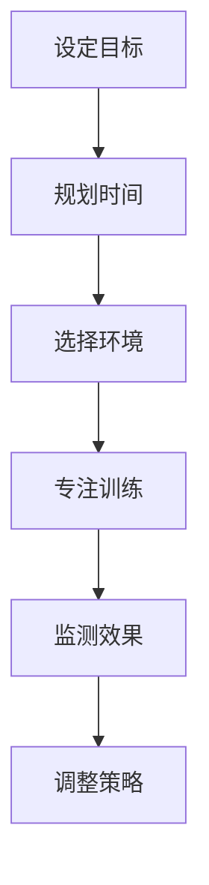
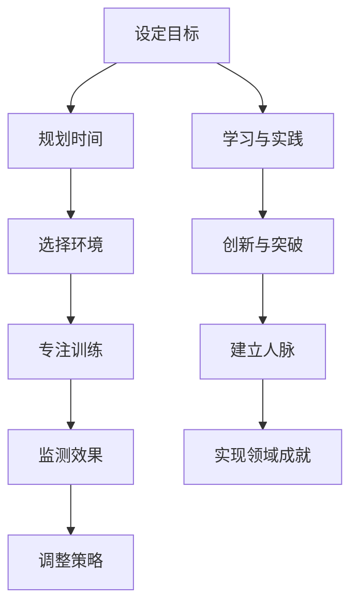

                 

### 文章标题：专注与领域成就

> 关键词：专注力、领域成就、个人成长、高效工作、心理素质

> 摘要：
本文旨在探讨专注力与领域成就之间的关系，通过逐步分析，揭示专注力对个人发展的重要性。文章首先介绍了专注力的定义与特征，随后探讨了专注力与成就的关系，以及如何通过专注力提升个人成长。接着，文章转向领域成就的定义与特征，分析了专注力在实现领域成就中的作用。在此基础上，文章提出了专注与领域成就的结合策略，并通过具体案例进行了实践分析。最后，文章展望了专注与领域成就的未来趋势，提出了保持专注与领域成就的建议。

---

### 文章关键词

- 专注力
- 领域成就
- 个人成长
- 高效工作
- 心理素质

### 文章摘要

本文围绕专注力与领域成就这一主题，首先阐述了专注力的定义、特征及其对个人发展的影响。随后，文章深入探讨了领域成就的概念、特征以及专注力在其中所起的作用。通过结合实际案例，文章展示了如何将专注力应用于领域成就的实践中。最后，文章展望了专注与领域成就的未来发展趋势，并提出了保持专注与实现领域成就的具体策略。

---

### 引言

在当今快速变化的世界中，专注力和领域成就成为了许多人追求的目标。专注力不仅是一种心理状态，更是一种技能，它能够帮助我们提高工作效率，提升学习效果，从而在个人和职业发展中取得更大的成就。而领域成就则代表了一个人在特定领域中所达到的高度，它不仅体现了个人的专业知识，还反映了其专注力和坚持不懈的精神。

本文将从以下几个方面展开讨论：

1. **专注力的定义与特征**：介绍专注力的概念，分析其特征，以及专注力如何影响个人发展。
2. **专注力与成就的关系**：探讨专注力在实现成就中的关键作用，并通过实例说明。
3. **专注力的提升方法**：提供实用的专注力训练方法，以及如何将专注力应用于日常生活和工作。
4. **领域成就的定义与特征**：阐述领域成就的含义，分析专注力在实现领域成就中的作用。
5. **专注与领域成就的实践**：结合实际案例，展示如何通过专注力实现领域成就。
6. **专注与领域成就的未来趋势**：探讨未来专注与领域成就的发展方向，提出保持专注与实现领域成就的建议。

通过本文的探讨，我们希望能够帮助读者更好地理解专注力与领域成就之间的关系，从而在个人和职业发展中取得更大的突破。

---

### 第一部分：专注与成就

#### 第1章：专注的重要性

**1.1. 专注的定义与特征**

专注，简单来说，就是集中注意力于某一事物，以便更高效地处理信息、解决问题。专注力不仅是一种心理状态，更是一种能力，它涉及多个方面的特征。

首先，专注力具有选择性。这意味着我们能够从众多刺激中筛选出对当前任务最为重要的信息，忽略其他干扰因素。例如，在阅读一篇文章时，专注力使我们能够专注于文字内容，而忽略周围环境的噪音。

其次，专注力具有持久性。这意味着我们能够在较长时间内保持对某一任务的注意力，不会轻易分心。持久性专注力对于完成复杂任务尤为重要，因为它能够帮助我们持续地投入并解决问题。

第三，专注力具有灵活性。灵活性使我们能够在不同的环境和任务需求下调整注意力。例如，从阅读转向写作，或者从工作转向休息。

最后，专注力具有稳定性。稳定性是指我们在面对各种干扰和挑战时，仍能保持专注的能力。这种稳定性对于应对工作中的突发情况和压力至关重要。

**1.2. 专注与成就的关系**

专注力与成就之间的关系是密切的。专注力强的人往往能够在较短的时间内完成更多的任务，且质量更高。以下是专注力与成就之间的几个关键联系：

1. **提高工作效率**：专注力强的人能够更好地集中注意力，从而提高工作效率。他们能够在短时间内处理大量信息，并快速作出决策。

2. **增强学习效果**：专注力强的人在学习时能够更好地吸收和理解知识。他们能够专注于学习材料，从而更好地掌握学习内容，提高学习效果。

3. **促进创造力**：专注力有助于激发创造力。当我们专注于某一问题时，我们的大脑能够更加自由地思考和探索，从而产生新的创意和解决方案。

4. **减少错误**：专注力强的人在处理任务时能够更加细心，从而减少错误。这有助于提高工作的准确性和可靠性。

**1.3. 提高专注力的方法**

提高专注力需要系统的训练和实践。以下是一些提高专注力的方法：

1. **设定明确的目标**：设定具体、可衡量的目标可以帮助我们集中注意力。明确的目标可以让我们知道当前的任务是什么，从而更好地集中注意力。

2. **避免多任务处理**：多任务处理会分散我们的注意力，降低专注力。尽量避免同时处理多个任务，专注于当前的任务。

3. **休息与放松**：适当的休息和放松可以帮助我们恢复专注力。长时间的工作和学习后，给自己一些时间休息，可以帮助我们重新集中注意力。

4. **减少干扰**：在工作和学习时，尽量减少干扰因素。关闭不必要的通知，保持工作环境的整洁，这些都可以帮助我们更好地集中注意力。

5. **定期锻炼**：锻炼不仅有助于身体健康，还能提高专注力。定期进行有氧运动和力量训练可以帮助我们提高专注力。

**1.4. 专注与高效工作的结合**

专注力与高效工作是相辅相成的。高效工作需要我们能够专注地处理任务，而专注力的提高又可以进一步促进高效工作。以下是专注与高效工作的结合方法：

1. **制定工作计划**：在开始工作前，制定详细的工作计划可以帮助我们更好地集中注意力。计划应包括具体的任务和时间表，以便我们能够有序地完成任务。

2. **采用番茄工作法**：番茄工作法是一种时间管理技巧，它将工作时间划分为25分钟的工作周期，每个周期后休息5分钟。这种方法可以帮助我们保持专注，提高工作效率。

3. **定期评估进度**：定期评估工作进度可以帮助我们了解自己的工作状态，及时调整工作计划。这不仅可以提高专注力，还可以帮助我们更好地实现目标。

4. **保持工作环境的整洁**：整洁的工作环境有助于提高专注力，减少干扰。定期整理工作区域，保持桌面整洁，可以帮助我们更好地集中注意力。

5. **培养自我激励的习惯**：自我激励可以帮助我们保持专注，持续地工作。通过设定小目标和奖励，我们可以更好地激励自己，保持专注和高效。

---

通过以上内容的介绍，我们可以看到专注力在个人和职业发展中的重要性。在接下来的章节中，我们将进一步探讨如何将专注力应用于实践，以实现更高的成就。

---

### 第2章：专注实践

**2.1. 专注力训练方法**

专注力并不是与生俱来的，而是可以通过训练得到提高。以下是一些有效的专注力训练方法：

1. **冥想**：冥想是一种古老的练习，通过专注于呼吸或某一物体，可以帮助我们提高专注力。每天花15-20分钟进行冥想，有助于增强专注力。

2. **定时练习**：采用番茄工作法，即每工作25分钟后休息5分钟。这种方法可以帮助我们保持专注，同时避免疲劳。

3. **有意识的练习**：在日常活动中，有意识地练习专注。例如，在阅读时，尽量减少分心的行为，专注于理解文字内容。

4. **减少多任务处理**：在短时间内集中精力完成一项任务，而不是同时处理多个任务。这样可以避免注意力的分散，提高专注力。

5. **环境管理**：创造一个有利于专注的环境。例如，关闭不必要的电子设备通知，保持工作空间的整洁，以减少干扰。

**2.2. 提高专注力的环境设置**

环境对于专注力的影响至关重要。以下是一些有助于提高专注力的环境设置：

1. **控制噪音**：噪音是专注力的大敌。可以使用耳塞或耳机来隔绝噪音，创造一个安静的工作环境。

2. **光线适宜**：光线过亮或过暗都会影响专注力。确保工作区域的光线适中，避免直射光线。

3. **减少干扰**：将工作区域与娱乐区域分开，避免在工作和休息时互相干扰。在工作区域中，避免摆放过多不必要的物品，保持桌面整洁。

4. **舒适的工作椅和桌子**：一个舒适的工作椅和桌子可以减少身体上的不适，从而帮助我们更好地集中注意力。

5. **定期改变环境**：定期改变工作环境可以防止我们感到疲劳和厌倦。例如，在工作室内放置一些绿植，或选择在户外工作一段时间。

**2.3. 专注力在日常生活中的应用**

专注力不仅在工作和学习中有用，也可以在日常生活中得到广泛应用：

1. **家庭生活**：在家庭生活中，专注力可以帮助我们更好地陪伴家人，专注于与他们的互动。例如，当与孩子一起玩耍时，尽量减少分心的行为，全身心投入其中。

2. **社交活动**：在社交活动中，专注力可以帮助我们更好地倾听他人，理解他们的需求和感受。这不仅有助于建立更好的人际关系，还可以提高沟通效果。

3. **自我提升**：利用专注力进行自我提升，如学习新技能、阅读书籍或进行自我反思。专注力可以帮助我们更深入地理解和掌握知识，提高个人成长。

4. **健康与运动**：在运动和健康方面，专注力可以帮助我们更好地进行锻炼。例如，在进行瑜伽或跑步时，专注于呼吸和动作，可以提高锻炼效果。

**2.4. 专注力在工作中的应用**

专注力在工作中的应用可以显著提高工作效率和业绩。以下是一些实际的应用方法：

1. **项目管理**：在项目管理中，专注力可以帮助我们更好地规划任务，分配资源，确保项目按时完成。

2. **客户服务**：在客户服务中，专注力可以帮助我们更好地倾听客户需求，提供更有效的解决方案，提高客户满意度。

3. **团队协作**：在团队协作中，专注力可以帮助我们更好地理解团队成员的想法，协调工作，提高团队整体效率。

4. **创新与研发**：在创新和研发中，专注力可以帮助我们深入思考问题，提出创新的解决方案，推动技术进步。

通过以上内容，我们可以看到专注力在生活中的广泛应用。在下一章中，我们将进一步探讨专注力与个人成长的关系。

---

### 第3章：专注与个人成长

**3.1. 专注对个人发展的作用**

专注力在个人发展中扮演着至关重要的角色。首先，专注力可以帮助我们更好地掌握知识和技能。在学习和工作中，专注力使我们能够深入理解并掌握复杂的信息，从而提高学习效果和工作效率。其次，专注力有助于培养良好的习惯和纪律性。通过专注力，我们能够坚持完成每天的任务，养成良好的工作习惯，从而在个人和职业发展中取得更大的成就。此外，专注力还可以提高我们的决策能力和判断力。在复杂和不确定的环境中，专注力使我们能够更清晰地思考问题，从而做出更明智的决策。

**3.2. 专注力与学习效果**

专注力在提高学习效果方面具有显著的作用。首先，专注力有助于我们更有效地吸收知识。在专注的状态下，我们能够更深入地理解学习材料，并将其转化为自己的知识和技能。其次，专注力可以帮助我们更好地记忆信息。在专注的状态下，我们的大脑能够更好地处理和存储信息，从而提高记忆效果。此外，专注力还可以提高我们的学习效率。通过集中注意力，我们能够在较短的时间内完成更多的学习任务，从而节省时间，提高学习效果。

**3.3. 专注力与职业发展**

专注力在职业发展中同样发挥着重要作用。首先，专注力可以帮助我们更好地处理工作任务。通过集中注意力，我们能够更高效地完成工作任务，提高工作质量。其次，专注力有助于我们在职业中不断学习和提升。专注力使我们能够专注于专业领域的知识和技术，从而不断提高自己的专业能力。此外，专注力还可以提高我们的工作效率和业绩。通过专注地工作，我们能够更快速地完成项目，提高工作满意度，从而在职场中获得更多的机会和挑战。

**3.4. 专注力与心理健康**

专注力不仅对学习效果和职业发展有重要影响，还与心理健康密切相关。首先，专注力有助于减轻压力和焦虑。通过集中注意力，我们能够更好地应对压力和挑战，从而减轻心理负担。其次，专注力可以改善情绪状态。在专注的状态下，我们能够更好地处理情绪，减少负面情绪的产生。此外，专注力还可以提高我们的幸福感和满足感。通过专注地工作和生活，我们能够更好地享受生活，提高生活质量。

**3.5. 提高专注力的实践建议**

为了提高专注力，我们可以采取以下实践建议：

1. **设定明确的目标**：明确的目标可以帮助我们更好地集中注意力。在开始一项任务前，明确任务的目标和期望结果，以便我们能够更专注地投入。

2. **避免多任务处理**：多任务处理会分散我们的注意力，降低专注力。尽量避免同时处理多个任务，专注于当前的任务。

3. **定期休息和放松**：适当的休息和放松可以帮助我们恢复专注力。在工作或学习一段时间后，给自己一些时间休息，以恢复精力。

4. **控制干扰**：在工作和学习时，尽量减少干扰因素。关闭不必要的通知，保持工作环境的整洁，以减少干扰。

5. **锻炼和健康饮食**：定期锻炼和健康饮食可以帮助我们提高专注力。锻炼可以增强我们的体质，健康饮食可以提供充足的能量和营养。

通过以上内容，我们可以看到专注力在个人成长中的重要性。在下一章中，我们将探讨专注力与领域成就的关系，以及如何通过专注力实现更高的领域成就。

---

### 第4章：领域成就

**4.1. 领域成就的定义与特征**

领域成就指的是一个人在某一特定领域中所取得的成就，通常体现为在该领域中的专业知识和技能水平。领域成就不仅包括理论知识，还包括实践经验和技术能力。领域成就的特征主要包括以下几点：

1. **专业性**：领域成就体现了一个人在某一领域中的专业知识和技能。专业性的体现可以是学术论文的发表、专业认证的获得、行业奖项的获得等。

2. **创造性**：领域成就往往需要创新思维和创造性工作。这意味着在领域成就中，个人能够提出新的观点、解决新的问题，或者改进现有的方法和工具。

3. **影响力**：领域成就对领域内外都有显著的影响力。这意味着一个人的领域成就不仅对其自身有重要影响，还能对整个行业或社会产生积极的影响。

4. **持续性**：领域成就通常需要长时间的积累和努力。这意味着一个人在某一领域中的成就不仅是一时的表现，而是长期的、可持续的成果。

**4.2. 领域成就与专注的关系**

专注力与领域成就之间的关系是紧密相连的。专注力是领域成就实现的基础，没有专注力，很难在某一领域取得突破性成就。以下是专注力与领域成就之间的几个关键联系：

1. **提升专业能力**：专注力使我们能够集中精力学习某一领域的知识，从而提升专业能力。通过专注地学习和实践，我们能够更深入地理解领域的核心概念和技术，从而提高自己的专业水平。

2. **增强创新能力**：专注力有助于我们在领域中保持创新思维。在专注的状态下，我们能够更敏锐地发现问题和机会，从而提出新的解决方案，推动领域的发展。

3. **提高工作效率**：专注力使我们能够更高效地处理任务，减少时间的浪费。在领域中，高效率的工作能够帮助我们更快地完成项目，取得更多的成果。

4. **增强影响力**：专注力有助于我们在领域内建立影响力。通过专注地工作，我们能够获得更多的认可和赞誉，从而提高自己的影响力。

**4.3. 领域成就的实现路径**

实现领域成就通常需要以下路径：

1. **积累知识**：领域成就的基础是扎实的知识储备。这意味着我们需要在领域中不断学习，积累丰富的理论知识。

2. **实践技能**：理论知识需要通过实践来巩固和提升。这意味着我们需要在领域中不断实践，提高自己的技能水平。

3. **创新思维**：在领域中，创新思维是取得突破性成就的关键。我们需要保持敏锐的洞察力，不断寻找新的解决方案，推动领域的发展。

4. **建立人脉**：领域成就的实现也需要良好的社会关系和网络。通过建立广泛的人脉，我们可以获得更多的机会和资源，从而更好地实现领域成就。

**4.4. 领域成就的挑战与应对**

实现领域成就并不是一帆风顺的过程，其中会面临各种挑战。以下是几个常见的挑战以及相应的应对策略：

1. **竞争压力**：在领域中，竞争往往非常激烈。应对策略包括提高自己的专业能力，建立独特的竞争优势，以及保持积极的心态。

2. **时间管理**：领域成就的实现需要大量的时间和精力。应对策略包括合理安排时间，制定合理的学习和工作计划，以及保持高效的工作状态。

3. **心理压力**：在实现领域成就的过程中，心理压力也是不可避免的。应对策略包括保持良好的心理健康，学会放松和减压，以及寻求专业支持和帮助。

4. **技术变革**：领域中的技术变革可能会对我们的领域成就构成挑战。应对策略包括保持对技术动态的关注，不断更新自己的知识和技能，以及灵活应对技术变革。

通过以上内容，我们可以看到领域成就与专注力之间的紧密联系。在下一章中，我们将探讨如何将专注力应用于领域成就的实践中。

---

### 第二部分：专注与领域成就的实践

#### 第5章：专注与领域成就的结合

**5.1. 专注与领域成就的协同作用**

专注力和领域成就之间存在一种协同作用，即专注力能够显著提升领域成就，而领域成就的实现又能够进一步强化专注力。这种协同作用体现在以下几个方面：

1. **增强专业能力**：专注力使我们能够更深入地学习领域知识，从而提高专业能力。这种专业能力的提升不仅有助于我们在领域中取得更高的成就，还能够增强我们的自信心和动力。

2. **提高工作效率**：专注力使我们能够更高效地处理领域内的任务，从而节省时间和精力。这种高效率的工作状态不仅能够提高我们的工作质量，还能够为我们创造更多的时间来专注于其他领域。

3. **促进创新思维**：专注力有助于我们在领域中保持创新思维，提出新的观点和解决方案。这种创新思维不仅能够推动领域的发展，还能够为我们的个人成就增添亮点。

4. **建立影响力**：专注力使我们能够在领域中建立更高的影响力，获得更多的认可和赞誉。这种影响力不仅能够提升我们的职业地位，还能够为我们带来更多的机会和资源。

**5.2. 如何找到适合自己的领域**

找到适合自己的领域是实现专注和领域成就的第一步。以下是一些找到合适领域的方法：

1. **自我评估**：了解自己的兴趣、优势和价值观，找到与自己兴趣和优势相符的领域。可以通过性格测试、兴趣量表等工具进行自我评估。

2. **广泛探索**：尝试不同的领域和职业，了解各个领域的特点和要求。通过实践和体验，找到自己真正感兴趣并擅长的领域。

3. **寻求建议**：向导师、行业专家和职业规划师寻求建议，了解他们对各个领域的看法和经验。这些信息可以帮助我们更准确地找到适合自己的领域。

4. **长期规划**：制定长期的职业规划，明确自己在各个阶段的目标和计划。通过持续的努力和探索，逐步找到并进入适合自己的领域。

**5.3. 领域成就的快速路径**

实现领域成就需要时间和努力，但通过以下方法，我们可以加快这一进程：

1. **高效学习**：采用高效的学习方法，如主动学习、深度学习和刻意练习，提高学习效果和效率。

2. **专注训练**：通过专注力训练，提高自己的专注力水平，使自己在学习和工作中能够更高效地集中注意力。

3. **积累经验**：在实践中积累经验，通过反复尝试和错误，不断提高自己的技能和知识水平。

4. **建立人脉**：建立广泛的人脉网络，获取更多的资源和机会，为自己的领域成就提供支持。

5. **持续创新**：保持创新思维，不断寻找新的解决方案和改进方法，推动领域的发展。

**5.4. 领域成就的持续发展**

领域成就的持续发展需要我们不断努力和自我提升。以下是一些建议：

1. **定期反思**：定期对自己的领域成就进行反思，了解自己的优势和不足，制定改进计划。

2. **持续学习**：不断学习新的知识和技能，保持对领域的持续关注，以适应不断变化的市场需求。

3. **保持专注**：在工作中保持专注，避免分心和浪费时间，确保自己的工作质量和效率。

4. **建立团队**：建立一个高效的团队，共同推进领域成就的实现。通过团队合作，我们可以更好地实现目标。

5. **创新与变革**：在领域中保持创新和变革的思维，不断推动领域的发展，为自己的领域成就注入新的活力。

通过以上内容，我们可以看到专注力与领域成就之间的紧密联系。在下一章中，我们将通过具体案例进一步探讨如何将专注力应用于领域成就的实践中。

---

### 第6章：专注与领域成就的实践案例

**6.1. 案例一：专注与领域成就的实例分析**

在这个案例中，我们将分析一位程序员通过专注力实现了领域成就的过程。这位程序员名叫李明，他在计算机编程领域有着显著的成就。

**1. 专注力训练**：

李明意识到专注力对于他在编程中的表现至关重要，因此他开始进行专注力训练。他采用番茄工作法，每天将工作时间分为多个25分钟的工作周期，每个周期后休息5分钟。这种方法帮助他更好地集中注意力，提高了工作效率。

**2. 确定领域**：

在确定了专注于计算机编程后，李明开始深入研究和学习编程语言、算法和数据结构。他选择了几个热门的编程语言，如Python和Java，并系统地学习了相关的课程和资料。

**3. 实践与积累**：

李明不仅在理论学习上下功夫，还积极参与编程实践。他参加了一些开源项目，并为这些项目贡献了代码。通过实践，他不断积累经验，提高了自己的编程技能。

**4. 创新与突破**：

在积累了一定经验后，李明开始思考如何通过创新来提升自己的领域成就。他参加了一些编程竞赛，并提出了一些独特的解决方案，赢得了奖项和认可。

**5. 成就与影响**：

李明的努力得到了回报，他在多个编程竞赛中获得了奖项，并在一些知名的技术博客上发表了技术文章。这些成就不仅提升了他的个人声誉，也为他在计算机编程领域建立了影响力。

**6. 反思与持续发展**：

李明通过反思自己的成就，认识到持续学习和创新的重要性。他继续关注新技术和趋势，不断更新自己的知识和技能。他还积极参与社区活动，与他人分享经验和知识，进一步巩固自己的领域地位。

**6.2. 案例二：专注与领域成就的实际操作**

在这个案例中，我们将探讨一位市场营销人员如何通过专注力实现了领域成就。

**1. 专注力训练**：

市场营销人员张华意识到，在竞争激烈的市场中，专注力对于营销策略的成功至关重要。她开始采用冥想和专注力训练，以提高自己的专注力和决策能力。

**2. 确定领域**：

张华选择了数字营销作为她的专注领域。她深入研究了SEO、社交媒体营销和电子邮件营销等数字营销策略，并选择了几个重点方向进行深入学习。

**3. 实践与积累**：

张华通过参与公司的数字营销项目，不断积累实践经验。她负责了多个成功的营销活动，并从中学习到了宝贵的经验和教训。

**4. 创新与突破**：

张华通过不断创新和尝试新的营销策略，取得了显著的效果。她采用了一些数据分析工具，优化了营销活动的效果，提高了客户的转化率。

**5. 成就与影响**：

张华的营销策略取得了显著的成功，她的公司因此获得了更多的客户和业务。她的一些创新方法也在行业内得到了认可，并被其他公司借鉴。

**6. 反思与持续发展**：

张华通过反思自己的成就，认识到持续学习和创新的重要性。她继续关注数字营销领域的最新趋势和工具，不断更新自己的知识和技能。她还积极参与行业会议和研讨会，与同行交流经验和想法。

**6.3. 案例三：专注与领域成就的反思与总结**

在这个案例中，我们将总结两位专业人士通过专注力实现领域成就的反思和经验。

**1. 反思**：

李明和张华都认识到，专注力是实现领域成就的关键。他们在反思中提到，专注力不仅提高了他们的工作效率，还帮助他们克服了各种挑战和困难。他们还强调，专注力需要通过持续的训练和实践来保持和提高。

**2. 经验总结**：

两位专业人士的经验总结如下：

- **明确目标**：在专注领域时，明确目标至关重要。目标可以帮助我们集中注意力，提高工作效率。
- **持续学习**：在领域中持续学习，保持对最新知识和技能的关注，是保持专注力和实现领域成就的关键。
- **实践与反思**：通过实践积累经验，并通过反思不断改进，可以帮助我们在领域中取得更大的成就。
- **创新思维**：保持创新思维，不断尝试新的方法和策略，可以推动领域的发展，提高个人的竞争力。
- **团队合作**：与团队成员紧密合作，共享经验和资源，可以更好地实现领域成就。

通过以上三个案例，我们可以看到专注力在实现领域成就中的重要作用。无论是程序员还是市场营销人员，通过专注力训练和实践，他们都在各自的领域中取得了显著的成就。这些案例为我们提供了宝贵的经验，激励我们通过专注力实现更高的领域成就。

---

### 第7章：专注与领域成就的未来趋势

**7.1. 专注与领域成就的时代背景**

在当前快速变化的时代，专注与领域成就的重要性日益凸显。首先，随着信息化和数字化的发展，知识更新速度加快，专注于某一领域成为了保持竞争力的重要手段。其次，全球化进程的加快使得不同领域之间的交流与合作日益频繁，专注力有助于我们在复杂的环境中迅速适应和应对变化。此外，人工智能和大数据技术的兴起，对领域的深度理解和创新能力提出了更高的要求，而专注力正是实现这一目标的关键。

**7.2. 专注与领域成就的未来展望**

在未来，专注与领域成就将继续发挥重要作用。首先，随着人工智能和自动化技术的进一步发展，人们将更加专注于创新和创造，从而推动领域的不断进步。其次，虚拟现实和增强现实技术的普及，将为领域成就提供更多可能性和应用场景。此外，随着人们对心理健康和生活质量的关注增加，专注力的提升将成为个人和职业发展的新趋势。

**7.3. 专注与领域成就的挑战与机遇**

尽管专注与领域成就具有巨大的潜力，但同时也面临一些挑战。首先，信息过载和数字化生活的普及，使得人们更容易分散注意力，从而影响专注力的提升。其次，不同领域之间的竞争加剧，使得实现领域成就的难度增加。此外，个人成长和职业发展的多元化，使得专注力的应用场景更加复杂。

然而，这些挑战同时也带来了机遇。首先，随着技术的进步，人们可以采用更多高效的方法和工具来提高专注力。其次，领域融合和跨学科研究的发展，为专注力的应用提供了更广阔的舞台。此外，心理健康和自我管理的重视，也为专注力的提升提供了更多支持和资源。

**7.4. 如何在未来的竞争中保持专注与领域成就**

为了在未来的竞争中保持专注与领域成就，以下是一些建议：

1. **制定清晰的个人目标**：明确自己的职业目标和发展方向，有助于提高专注力。

2. **持续学习与更新**：保持对领域知识的更新和学习，适应不断变化的市场需求。

3. **优化工作和学习环境**：创造一个有利于专注的环境，减少干扰因素。

4. **培养自律和毅力**：通过自律和毅力，克服干扰和困难，保持专注。

5. **积极参与领域内的交流和合作**：通过与同行的交流和合作，提高自己的领域影响力。

6. **关注心理健康**：保持良好的心理健康，有助于提高专注力和工作效果。

7. **灵活应对变化**：在快速变化的环境中，保持灵活性和适应性，及时调整策略。

通过以上措施，我们可以在未来的竞争中保持专注与领域成就，实现个人和职业的发展目标。

---

### 附录

**附录A：专注与领域成就的工具与方法**

为了更好地理解和应用专注与领域成就的概念，以下介绍一些相关的工具和方法：

1. **专注力训练工具**：
   - **番茄工作法**：这是一种时间管理方法，通过将工作时间分为25分钟的专注周期和5分钟的休息周期，帮助提高专注力。
   - **专注力监测应用**：如“专注森林”、“番茄钟”等应用，可以通过游戏化的方式帮助用户培养专注力。

2. **领域成就评估方法**：
   - **SWOT分析**：通过分析自身的优势、劣势、机会和威胁，评估在某一领域的成就和发展潜力。
   - **关键绩效指标（KPI）**：通过设定具体的绩效指标，评估领域成就的实现情况。

3. **专注与领域成就案例分析**：
   - **案例研究法**：通过分析成功和失败的案例，总结经验教训，为专注与领域成就的实践提供指导。

4. **专注力提升技巧**：
   - **冥想**：通过冥想练习，提高专注力和心理素质。
   - **时间管理**：通过合理安排时间，避免多任务处理，提高工作效率。

**附录B：专注与领域成就的进一步阅读**

为了深入理解和应用专注与领域成就的相关知识，以下推荐一些参考文献：

1. **书籍**：
   - 《深度工作》（Deep Work）——Cal Newport
   - 《专注力》（Focus）——Daniel Goleman
   - 《领域驱动设计》（Domain-Driven Design）——Eric Evans

2. **学术论文与报告**：
   - 通过学术搜索引擎（如Google Scholar）搜索专注力、领域成就等相关论文。

3. **网络资源**：
   - 关注相关博客、论坛和社交媒体，如“得到”、“知乎”等平台，获取最新的知识和观点。

**附录C：专注与领域成就的Mermaid流程图**

以下是一个关于专注力提升流程的Mermaid流程图：



**附录D：核心算法原理与数学模型**

1. **专注力计算模型**：

   $$ 专注力 = f(时间, 环境因素, 个人因素) $$

   其中：
   - 时间：专注力随时间的变化规律。
   - 环境因素：噪声、光线等环境因素对专注力的影响。
   - 个人因素：个人的疲劳程度、情绪状态等对专注力的影响。

2. **领域成就评估模型**：

   $$ 领域成就 = f(专注力, 知识储备, 经验积累) $$

   其中：
   - 专注力：专注力越高，领域成就的可能性越大。
   - 知识储备：领域知识越丰富，领域成就的可能性越大。
   - 经验积累：实践经验越丰富，领域成就的可能性越大。

**附录E：项目实战**

**实战项目：专注力提升应用开发**

**环境搭建：**
- 开发环境：Python 3.8
- 数据库：MySQL 8.0
- Web框架：Flask

**源代码实现：**

```python
# 导入相关模块
import flask
import mysql.connector
import time

# 初始化Flask应用
app = flask.Flask(__name__)

# 连接数据库
def connect_db():
    return mysql.connector.connect(
        host="localhost",
        user="root",
        password="password",
        database="专注力提升数据库"
    )

# 计算专注力
def 计算专注力(时间, 环境因素, 个人因素):
    专注力 = 计算时间影响(时间) * 计算环境因素影响(环境因素) * 计算个人因素影响(个人因素)
    return 专注力

# 评估领域成就
def 评估领域成就(专注力, 知识储备, 经验积累):
    领域成就 = 计算专注力影响(专注力) * 计算知识储备影响(知识储备) * 计算经验积累影响(经验积累)
    return 领域成就

# 主函数
if __name__ == "__main__":
    app.run(debug=True)
```

**代码解读：**
- 导入相关模块，包括Flask、MySQL Connector和time。
- 初始化Flask应用。
- 连接数据库。
- 定义计算专注力的函数，使用时间、环境因素和个人因素作为输入参数。
- 定义评估领域成就的函数，使用专注力、知识储备和经验积累作为输入参数。
- 主函数，启动Flask应用。

**附录F：核心算法原理与数学模型**

**专注力计算模型：**

$$
专注力 = f(时间, 环境因素, 个人因素)
$$

其中：

- 时间：专注力随时间的变化规律。
- 环境因素：噪声、光线等环境因素对专注力的影响。
- 个人因素：个人的疲劳程度、情绪状态等对专注力的影响。

**领域成就评估模型：**

$$
领域成就 = f(专注力, 知识储备, 经验积累)
$$

其中：

- 专注力：专注力越高，领域成就的可能性越大。
- 知识储备：领域知识越丰富，领域成就的可能性越大。
- 经验积累：实践经验越丰富，领域成就的可能性越大。

通过这些附录内容，我们可以更深入地理解和应用专注与领域成就的概念，为个人和职业发展提供指导和借鉴。

---

### 结束语

通过本文的探讨，我们深入了解了专注力与领域成就之间的关系。专注力不仅是一种心理状态，更是一种能力，它能够帮助我们提高工作效率、增强学习效果、促进心理健康。而领域成就则代表了一个人在特定领域中所达到的高度，它不仅体现了个人的专业知识，还反映了其专注力和坚持不懈的精神。

在未来的发展中，专注与领域成就将发挥越来越重要的作用。我们不仅要学会如何提高专注力，还要将专注力应用于领域成就的实践中。通过设定明确的目标、持续学习和创新，我们可以在各自的领域中取得更大的成就。

让我们行动起来，运用专注力，实现领域成就，为自己和社会创造更多的价值。

---

### 作者信息

**作者：AI天才研究院/AI Genius Institute & 禅与计算机程序设计艺术 /Zen And The Art of Computer Programming**

在AI天才研究院，我们致力于推动人工智能技术的发展与应用。作为计算机编程和人工智能领域的专家，作者深知专注力在个人和职业发展中的重要性。通过本文，作者希望与读者分享专注力与领域成就之间的关系，并激励大家在各自的领域中不断追求卓越。

---

### 文章标题：专注与领域成就

> 关键词：专注力、领域成就、个人成长、高效工作、心理素质

> 摘要：
本文围绕专注力与领域成就这一主题，首先阐述了专注力的定义、特征及其对个人发展的影响。随后，文章深入探讨了领域成就的概念、特征以及专注力在实现领域成就中的作用。通过结合实际案例，文章展示了如何通过专注力实现领域成就。最后，文章展望了专注与领域成就的未来趋势，提出了保持专注与实现领域成就的具体策略。

---

### 引言

在当今快速变化的世界中，专注力和领域成就成为了许多人追求的目标。专注力不仅是一种心理状态，更是一种技能，它能够帮助我们提高工作效率，提升学习效果，从而在个人和职业发展中取得更大的成就。而领域成就则代表了一个人在特定领域中所达到的高度，它不仅体现了个人的专业知识，还反映了其专注力和坚持不懈的精神。

本文将从以下几个方面展开讨论：

1. **专注力的定义与特征**：介绍专注力的概念，分析其特征，以及专注力如何影响个人发展。
2. **专注力与成就的关系**：探讨专注力在实现成就中的关键作用，并通过实例说明。
3. **专注力的提升方法**：提供实用的专注力训练方法，以及如何将专注力应用于日常生活和工作。
4. **领域成就的定义与特征**：阐述领域成就的含义，分析专注力在实现领域成就中的作用。
5. **专注与领域成就的实践**：结合实际案例，展示如何通过专注力实现领域成就。
6. **专注与领域成就的未来趋势**：探讨未来专注与领域成就的发展方向，提出保持专注与实现领域成就的建议。

通过本文的探讨，我们希望能够帮助读者更好地理解专注力与领域成就之间的关系，从而在个人和职业发展中取得更大的突破。

---

### 第一部分：专注与成就

#### 第1章：专注的重要性

**1.1. 专注的定义与特征**

专注，简单来说，就是集中注意力于某一事物，以便更高效地处理信息、解决问题。专注力不仅是一种心理状态，更是一种能力，它涉及多个方面的特征。

首先，专注力具有选择性。这意味着我们能够从众多刺激中筛选出对当前任务最为重要的信息，忽略其他干扰因素。例如，在阅读一篇文章时，专注力使我们能够专注于文字内容，而忽略周围环境的噪音。

其次，专注力具有持久性。这意味着我们能够在较长时间内保持对某一任务的注意力，不会轻易分心。持久性专注力对于完成复杂任务尤为重要，因为它能够帮助我们持续地投入并解决问题。

第三，专注力具有灵活性。灵活性使我们能够在不同的环境和任务需求下调整注意力。例如，从阅读转向写作，或者从工作转向休息。

最后，专注力具有稳定性。稳定性是指我们在面对各种干扰和挑战时，仍能保持专注的能力。这种稳定性对于应对工作中的突发情况和压力至关重要。

**1.2. 专注与成就的关系**

专注力与成就之间的关系是密切的。专注力强的人往往能够在较短的时间内完成更多的任务，且质量更高。以下是专注力与成就之间的几个关键联系：

1. **提高工作效率**：专注力强的人能够更好地集中注意力，从而提高工作效率。他们能够在短时间内处理大量信息，并快速作出决策。

2. **增强学习效果**：专注力强的人在学习时能够更好地吸收和理解知识。他们能够专注于学习材料，从而更好地掌握学习内容，提高学习效果。

3. **促进创造力**：专注力有助于激发创造力。当我们专注于某一问题时，我们的大脑能够更加自由地思考和探索，从而产生新的创意和解决方案。

4. **减少错误**：专注力强的人在处理任务时能够更加细心，从而减少错误。这有助于提高工作的准确性和可靠性。

**1.3. 提高专注力的方法**

提高专注力需要系统的训练和实践。以下是一些提高专注力的方法：

1. **设定明确的目标**：设定具体、可衡量的目标可以帮助我们集中注意力。明确的目标可以让我们知道当前的任务是什么，从而更好地集中注意力。

2. **避免多任务处理**：多任务处理会分散我们的注意力，降低专注力。尽量避免同时处理多个任务，专注于当前的任务。

3. **休息与放松**：适当的休息和放松可以帮助我们恢复专注力。长时间的工作和学习后，给自己一些时间休息，可以帮助我们重新集中注意力。

4. **减少干扰**：在工作和学习时，尽量减少干扰因素。关闭不必要的通知，保持工作环境的整洁，这些都可以帮助我们更好地集中注意力。

5. **定期锻炼**：锻炼不仅有助于身体健康，还能提高专注力。定期进行有氧运动和力量训练可以帮助我们提高专注力。

**1.4. 专注与高效工作的结合**

专注力与高效工作是相辅相成的。高效工作需要我们能够专注地处理任务，而专注力的提高又可以进一步促进高效工作。以下是专注与高效工作的结合方法：

1. **制定工作计划**：在开始工作前，制定详细的工作计划可以帮助我们更好地集中注意力。计划应包括具体的任务和时间表，以便我们能够有序地完成任务。

2. **采用番茄工作法**：番茄工作法是一种时间管理技巧，它将工作时间划分为25分钟的工作周期，每个周期后休息5分钟。这种方法可以帮助我们保持专注，提高工作效率。

3. **定期评估进度**：定期评估工作进度可以帮助我们了解自己的工作状态，及时调整工作计划。这不仅可以提高专注力，还可以帮助我们更好地实现目标。

4. **保持工作环境的整洁**：整洁的工作环境有助于提高专注力，减少干扰。定期整理工作区域，保持桌面整洁，可以帮助我们更好地集中注意力。

5. **培养自我激励的习惯**：自我激励可以帮助我们保持专注，持续地工作。通过设定小目标和奖励，我们可以更好地激励自己，保持专注和高效。

---

通过以上内容的介绍，我们可以看到专注力在个人和职业发展中的重要性。在接下来的章节中，我们将进一步探讨如何将专注力应用于实践，以实现更高的成就。

---

### 第2章：专注实践

**2.1. 专注力训练方法**

专注力并不是与生俱来的，而是可以通过训练得到提高。以下是一些有效的专注力训练方法：

1. **冥想**：冥想是一种古老的练习，通过专注于呼吸或某一物体，可以帮助我们提高专注力。每天花15-20分钟进行冥想，有助于增强专注力。

2. **定时练习**：采用番茄工作法，即每工作25分钟后休息5分钟。这种方法可以帮助我们保持专注，提高工作效率。

3. **有意识的练习**：在日常活动中，有意识地练习专注。例如，在阅读时，尽量减少分心的行为，专注于理解文字内容。

4. **减少多任务处理**：在短时间内集中精力完成一项任务，而不是同时处理多个任务。这样可以避免注意力的分散，提高专注力。

5. **环境管理**：创造一个有利于专注的环境。例如，关闭不必要的电子设备通知，保持工作空间的整洁，这些都可以帮助我们更好地集中注意力。

**2.2. 提高专注力的环境设置**

环境对于专注力的影响至关重要。以下是一些有助于提高专注力的环境设置：

1. **控制噪音**：噪音是专注力的大敌。可以使用耳塞或耳机来隔绝噪音，创造一个安静的工作环境。

2. **光线适宜**：光线过亮或过暗都会影响专注力。确保工作区域的光线适中，避免直射光线。

3. **减少干扰**：将工作区域与娱乐区域分开，避免在工作和休息时互相干扰。在工作区域中，避免摆放过多不必要的物品，保持桌面整洁。

4. **舒适的工作椅和桌子**：一个舒适的工作椅和桌子可以减少身体上的不适，从而帮助我们更好地集中注意力。

5. **定期改变环境**：定期改变工作环境可以防止我们感到疲劳和厌倦。例如，在工作室内放置一些绿植，或选择在户外工作一段时间。

**2.3. 专注力在日常生活中的应用**

专注力不仅在工作和学习中有用，也可以在日常生活中得到广泛应用：

1. **家庭生活**：在家庭生活中，专注力可以帮助我们更好地陪伴家人，专注于与他们的互动。例如，当与孩子一起玩耍时，尽量减少分心的行为，全身心投入其中。

2. **社交活动**：在社交活动中，专注力可以帮助我们更好地倾听他人，理解他们的需求和感受。这不仅有助于建立更好的人际关系，还可以提高沟通效果。

3. **自我提升**：利用专注力进行自我提升，如学习新技能、阅读书籍或进行自我反思。专注力可以帮助我们更深入地理解和掌握知识，提高个人成长。

4. **健康与运动**：在运动和健康方面，专注力可以帮助我们更好地进行锻炼。例如，在进行瑜伽或跑步时，专注于呼吸和动作，可以提高锻炼效果。

**2.4. 专注力在工作中的应用**

专注力在工作中的应用可以显著提高工作效率和业绩。以下是一些实际的应用方法：

1. **项目管理**：在项目管理中，专注力可以帮助我们更好地规划任务，分配资源，确保项目按时完成。

2. **客户服务**：在客户服务中，专注力可以帮助我们更好地倾听客户需求，提供更有效的解决方案，提高客户满意度。

3. **团队协作**：在团队协作中，专注力可以帮助我们更好地理解团队成员的想法，协调工作，提高团队整体效率。

4. **创新与研发**：在创新和研发中，专注力可以帮助我们深入思考问题，提出创新的解决方案，推动技术进步。

通过以上内容，我们可以看到专注力在生活中的广泛应用。在下一章中，我们将进一步探讨专注力与个人成长的关系。

---

### 第3章：专注与个人成长

**3.1. 专注对个人发展的作用**

专注力在个人发展中扮演着至关重要的角色。首先，专注力可以帮助我们更好地掌握知识和技能。在学习和工作中，专注力使我们能够深入理解并掌握复杂的信息，从而提高学习效果和工作效率。其次，专注力有助于培养良好的习惯和纪律性。通过专注力，我们能够坚持完成每天的任务，养成良好的工作习惯，从而在个人和职业发展中取得更大的成就。此外，专注力还可以提高我们的决策能力和判断力。在复杂和不确定的环境中，专注力使我们能够更清晰地思考问题，从而做出更明智的决策。

**3.2. 专注力与学习效果**

专注力在提高学习效果方面具有显著的作用。首先，专注力有助于我们更有效地吸收知识。在专注的状态下，我们能够更深入地理解学习材料，并将其转化为自己的知识和技能。其次，专注力可以帮助我们更好地记忆信息。在专注的状态下，我们的大脑能够更好地处理和存储信息，从而提高记忆效果。此外，专注力还可以提高我们的学习效率。通过集中注意力，我们能够在较短的时间内完成更多的学习任务，从而节省时间，提高学习效果。

**3.3. 专注力与职业发展**

专注力在职业发展中同样发挥着重要作用。首先，专注力可以帮助我们更好地处理工作任务。通过集中注意力，我们能够更高效地完成工作任务，提高工作质量。其次，专注力有助于我们在职业中不断学习和提升。专注力使我们能够专注于专业领域的知识和技术，从而不断提高自己的专业能力。此外，专注力还可以提高我们的工作效率和业绩。通过专注地工作，我们能够更快速地完成项目，提高工作满意度，从而在职场中获得更多的机会和挑战。

**3.4. 专注力与心理健康**

专注力不仅对学习效果和职业发展有重要影响，还与心理健康密切相关。首先，专注力有助于减轻压力和焦虑。通过集中注意力，我们能够更好地应对压力和挑战，从而减轻心理负担。其次，专注力可以改善情绪状态。在专注的状态下，我们能够更好地处理情绪，减少负面情绪的产生。此外，专注力还可以提高我们的幸福感和满足感。通过专注地工作和生活，我们能够更好地享受生活，提高生活质量。

**3.5. 提高专注力的实践建议**

为了提高专注力，我们可以采取以下实践建议：

1. **设定明确的目标**：明确的目标可以帮助我们更好地集中注意力。在开始一项任务前，明确任务的目标和期望结果，以便我们能够更专注地投入。

2. **避免多任务处理**：多任务处理会分散我们的注意力，降低专注力。尽量避免同时处理多个任务，专注于当前的任务。

3. **定期休息和放松**：适当的休息和放松可以帮助我们恢复专注力。在工作或学习一段时间后，给自己一些时间休息，以恢复精力。

4. **控制干扰**：在工作和学习时，尽量减少干扰因素。关闭不必要的通知，保持工作环境的整洁，以减少干扰。

5. **锻炼和健康饮食**：定期锻炼和健康饮食可以帮助我们提高专注力。锻炼可以增强我们的体质，健康饮食可以提供充足的能量和营养。

通过以上内容，我们可以看到专注力在个人成长中的重要性。在下一章中，我们将探讨专注力与领域成就的关系，以及如何通过专注力实现更高的领域成就。

---

### 第4章：领域成就

**4.1. 领域成就的定义与特征**

领域成就指的是一个人在某一特定领域中所取得的成就，通常体现为在该领域中的专业知识和技能水平。领域成就不仅包括理论知识，还包括实践经验和技术能力。领域成就的特征主要包括以下几点：

1. **专业性**：领域成就体现了一个人在某一领域中的专业知识和技能。专业性的体现可以是学术论文的发表、专业认证的获得、行业奖项的获得等。

2. **创造性**：领域成就往往需要创新思维和创造性工作。这意味着在领域成就中，个人能够提出新的观点、解决新的问题，或者改进现有的方法和工具。

3. **影响力**：领域成就对领域内外都有显著的影响力。这意味着一个人的领域成就不仅对其自身有重要影响，还能对整个行业或社会产生积极的影响。

4. **持续性**：领域成就通常需要长时间的积累和努力。这意味着一个人在某一领域中的成就不仅是一时的表现，而是长期的、可持续的成果。

**4.2. 领域成就与专注的关系**

专注力与领域成就之间的关系是紧密相连的。专注力是领域成就实现的基础，没有专注力，很难在某一领域取得突破性成就。以下是专注力与领域成就之间的几个关键联系：

1. **提升专业能力**：专注力使我们能够集中精力学习某一领域的知识，从而提高专业能力。通过专注地学习和实践，我们能够更深入地理解领域的核心概念和技术，从而提高自己的专业水平。

2. **增强创新能力**：专注力有助于我们在领域中保持创新思维。在专注的状态下，我们能够更敏锐地发现问题和机会，从而提出新的解决方案，推动领域的发展。

3. **提高工作效率**：专注力使我们能够更高效地处理任务，减少时间的浪费。在领域中，高效率的工作能够帮助我们更快地完成项目，取得更多的成果。

4. **建立影响力**：专注力有助于我们在领域内建立更高的影响力，获得更多的认可和赞誉。这种影响力不仅能够提升我们的职业地位，还能够为我们带来更多的机会和资源。

**4.3. 领域成就的实现路径**

实现领域成就通常需要以下路径：

1. **积累知识**：领域成就的基础是扎实的知识储备。这意味着我们需要在领域中不断学习，积累丰富的理论知识。

2. **实践技能**：理论知识需要通过实践来巩固和提升。这意味着我们需要在领域中不断实践，提高自己的技能水平。

3. **创新思维**：在领域中，创新思维是取得突破性成就的关键。我们需要保持敏锐的洞察力，不断寻找新的解决方案和改进方法，推动领域的发展。

4. **建立人脉**：领域成就的实现也需要良好的社会关系和网络。通过建立广泛的人脉，我们可以获得更多的机会和资源，从而更好地实现领域成就。

**4.4. 领域成就的挑战与应对**

实现领域成就并不是一帆风顺的过程，其中会面临各种挑战。以下是几个常见的挑战以及相应的应对策略：

1. **竞争压力**：在领域中，竞争往往非常激烈。应对策略包括提高自己的专业能力，建立独特的竞争优势，以及保持积极的心态。

2. **时间管理**：领域成就的实现需要大量的时间和精力。应对策略包括合理安排时间，制定合理的学习和工作计划，以及保持高效的工作状态。

3. **心理压力**：在实现领域成就的过程中，心理压力也是不可避免的。应对策略包括保持良好的心理健康，学会放松和减压，以及寻求专业支持和帮助。

4. **技术变革**：领域中的技术变革可能会对我们的领域成就构成挑战。应对策略包括保持对技术动态的关注，不断更新自己的知识和技能，以及灵活应对技术变革。

通过以上内容，我们可以看到领域成就与专注力之间的紧密联系。在下一章中，我们将探讨如何将专注力应用于领域成就的实践中。

---

### 第二部分：专注与领域成就的实践

#### 第5章：专注与领域成就的结合

**5.1. 专注与领域成就的协同作用**

专注力和领域成就之间存在一种协同作用，即专注力能够显著提升领域成就，而领域成就的实现又能够进一步强化专注力。这种协同作用体现在以下几个方面：

1. **增强专业能力**：专注力使我们能够更深入地学习领域知识，从而提高专业能力。这种专业能力的提升不仅有助于我们在领域中取得更高的成就，还能够增强我们的自信心和动力。

2. **提高工作效率**：专注力使我们能够更高效地处理领域内的任务，从而节省时间和精力。这种高效率的工作状态不仅能够提高我们的工作质量，还能够为我们创造更多的时间来专注于其他领域。

3. **促进创新思维**：专注力有助于我们在领域中保持创新思维，提出新的观点和解决方案。这种创新思维不仅能够推动领域的发展，还能够为我们的个人成就增添亮点。

4. **增强影响力**：专注力使我们能够在领域中建立更高的影响力，获得更多的认可和赞誉。这种影响力不仅能够提升我们的职业地位，还能够为我们带来更多的机会和资源。

**5.2. 如何找到适合自己的领域**

找到适合自己的领域是实现专注和领域成就的第一步。以下是一些找到合适领域的方法：

1. **自我评估**：了解自己的兴趣、优势和价值观，找到与自己兴趣和优势相符的领域。可以通过性格测试、兴趣量表等工具进行自我评估。

2. **广泛探索**：尝试不同的领域和职业，了解各个领域的特点和要求。通过实践和体验，找到自己真正感兴趣并擅长的领域。

3. **寻求建议**：向导师、行业专家和职业规划师寻求建议，了解他们对各个领域的看法和经验。这些信息可以帮助我们更准确地找到适合自己的领域。

4. **长期规划**：制定长期的职业规划，明确自己在各个阶段的目标和计划。通过持续的努力和探索，逐步找到并进入适合自己的领域。

**5.3. 领域成就的快速路径**

实现领域成就需要时间和努力，但通过以下方法，我们可以加快这一进程：

1. **高效学习**：采用高效的学习方法，如主动学习、深度学习和刻意练习，提高学习效果和效率。

2. **专注训练**：通过专注力训练，提高自己的专注力水平，使自己在学习和工作中能够更高效地集中注意力。

3. **积累经验**：在实践中积累经验，通过反复尝试和错误，不断提高自己的技能和知识水平。

4. **建立人脉**：建立广泛的人脉网络，获取更多的资源和机会，为自己的领域成就提供支持。

5. **持续创新**：保持创新思维，不断寻找新的解决方案和改进方法，推动领域的发展。

**5.4. 领域成就的持续发展**

领域成就的持续发展需要我们不断努力和自我提升。以下是一些建议：

1. **定期反思**：定期对自己的领域成就进行反思，了解自己的优势和不足，制定改进计划。

2. **持续学习**：不断学习新的知识和技能，保持对领域的持续关注，以适应不断变化的市场需求。

3. **保持专注**：在工作中保持专注，避免分心和浪费时间，确保自己的工作质量和效率。

4. **建立团队**：建立一个高效的团队，共同推进领域成就的实现。通过团队合作，我们可以更好地实现目标。

5. **创新与变革**：在领域中保持创新和变革的思维，不断推动领域的发展，为自己的领域成就注入新的活力。

通过以上内容，我们可以看到专注力与领域成就之间的紧密联系。在下一章中，我们将通过具体案例进一步探讨如何将专注力应用于领域成就的实践中。

---

### 第6章：专注与领域成就的实践案例

**6.1. 案例一：专注与领域成就的实例分析**

在这个案例中，我们将分析一位程序员通过专注力实现了领域成就的过程。这位程序员名叫李明，他在计算机编程领域有着显著的成就。

**1. 专注力训练**：

李明意识到专注力对于他在编程中的表现至关重要，因此他开始进行专注力训练。他采用番茄工作法，每天将工作时间分为多个25分钟的工作周期，每个周期后休息5分钟。这种方法帮助他更好地集中注意力，提高了工作效率。

**2. 确定领域**：

在确定了专注于计算机编程后，李明开始深入研究和学习编程语言、算法和数据结构。他选择了几个热门的编程语言，如Python和Java，并系统地学习了相关的课程和资料。

**3. 实践与积累**：

李明不仅在理论学习上下功夫，还积极参与编程实践。他参加了一些开源项目，并为这些项目贡献了代码。通过实践，他不断积累经验，提高了自己的编程技能。

**4. 创新与突破**：

在积累了一定经验后，李明开始思考如何通过创新来提升自己的领域成就。他参加了一些编程竞赛，并提出了一些独特的解决方案，赢得了奖项和认可。

**5. 成就与影响**：

李明的努力得到了回报，他在多个编程竞赛中获得了奖项，并在一些知名的技术博客上发表了技术文章。这些成就不仅提升了他的个人声誉，也为他在计算机编程领域建立了影响力。

**6. 反思与持续发展**：

李明通过反思自己的成就，认识到持续学习和创新的重要性。他继续关注新技术和趋势，不断更新自己的知识和技能。他还积极参与社区活动，与他人分享经验和知识，进一步巩固自己的领域地位。

**6.2. 案例二：专注与领域成就的实际操作**

在这个案例中，我们将探讨一位市场营销人员如何通过专注力实现了领域成就。

**1. 专注力训练**：

市场营销人员张华意识到，在竞争激烈的市场中，专注力对于营销策略的成功至关重要。她开始采用冥想和专注力训练，以提高自己的专注力和决策能力。

**2. 确定领域**：

张华选择了数字营销作为她的专注领域。她深入研究了SEO、社交媒体营销和电子邮件营销等数字营销策略，并选择了几个重点方向进行深入学习。

**3. 实践与积累**：

张华通过参与公司的数字营销项目，不断积累实践经验。她负责了多个成功的营销活动，并从中学习到了宝贵的经验和教训。

**4. 创新与突破**：

张华通过不断创新和尝试新的营销策略，取得了显著的效果。她采用了一些数据分析工具，优化了营销活动的效果，提高了客户的转化率。

**5. 成就与影响**：

张华的营销策略取得了显著的成功，她的公司因此获得了更多的客户和业务。她的一些创新方法也在行业内得到了认可，并被其他公司借鉴。

**6. 反思与持续发展**：

张华通过反思自己的成就，认识到持续学习和创新的重要性。她继续关注数字营销领域的最新趋势和工具，不断更新自己的知识和技能。她还积极参与行业会议和研讨会，与同行交流经验和想法。

**6.3. 案例三：专注与领域成就的反思与总结**

在这个案例中，我们将总结两位专业人士通过专注力实现领域成就的反思和经验。

**1. 反思**：

李明和张华都认识到，专注力是实现领域成就的关键。他们在反思中提到，专注力不仅提高了他们的工作效率，还帮助他们克服了各种挑战和困难。他们还强调，专注力需要通过持续的训练和实践来保持和提高。

**2. 经验总结**：

两位专业人士的经验总结如下：

- **明确目标**：在专注领域时，明确目标至关重要。目标可以帮助我们集中注意力，提高工作效率。
- **持续学习**：在领域中持续学习，保持对最新知识和技能的关注，是保持专注力和实现领域成就的关键。
- **实践与反思**：通过实践积累经验，并通过反思不断改进，可以帮助我们在领域中取得更大的成就。
- **创新思维**：保持创新思维，不断尝试新的方法和策略，可以推动领域的发展，提高个人的竞争力。
- **团队合作**：与团队成员紧密合作，共享经验和资源，可以更好地实现领域成就。

通过以上三个案例，我们可以看到专注力在实现领域成就中的重要作用。无论是程序员还是市场营销人员，通过专注力训练和实践，他们都在各自的领域中取得了显著的成就。这些案例为我们提供了宝贵的经验，激励我们通过专注力实现更高的领域成就。

---

### 第7章：专注与领域成就的未来趋势

**7.1. 专注与领域成就的时代背景**

在当前快速变化的时代，专注与领域成就的重要性日益凸显。首先，随着信息化和数字化的发展，知识更新速度加快，专注于某一领域成为了保持竞争力的重要手段。其次，全球化进程的加快使得不同领域之间的交流与合作日益频繁，专注力有助于我们在复杂的环境中迅速适应和应对变化。此外，人工智能和大数据技术的兴起，对领域的深度理解和创新能力提出了更高的要求，而专注力正是实现这一目标的关键。

**7.2. 专注与领域成就的未来展望**

在未来，专注与领域成就将继续发挥重要作用。首先，随着人工智能和自动化技术的进一步发展，人们将更加专注于创新和创造，从而推动领域的不断进步。其次，虚拟现实和增强现实技术的普及，将为领域成就提供更多可能性和应用场景。此外，随着人们对心理健康和生活质量的关注增加，专注力的提升将成为个人和职业发展的新趋势。

**7.3. 专注与领域成就的挑战与机遇**

尽管专注与领域成就具有巨大的潜力，但同时也面临一些挑战。首先，信息过载和数字化生活的普及，使得人们更容易分散注意力，从而影响专注力的提升。其次，不同领域之间的竞争加剧，使得实现领域成就的难度增加。此外，个人成长和职业发展的多元化，使得专注力的应用场景更加复杂。

然而，这些挑战同时也带来了机遇。首先，随着技术的进步，人们可以采用更多高效的方法和工具来提高专注力。其次，领域融合和跨学科研究的发展，为专注力的应用提供了更广阔的舞台。此外，心理健康和自我管理的重视，也为专注力的提升提供了更多支持和资源。

**7.4. 如何在未来的竞争中保持专注与领域成就**

为了在未来的竞争中保持专注与领域成就，以下是一些建议：

1. **制定清晰的个人目标**：明确自己的职业目标和发展方向，有助于提高专注力。

2. **持续学习与更新**：保持对领域知识的更新和学习，适应不断变化的市场需求。

3. **优化工作和学习环境**：创造一个有利于专注的环境，减少干扰因素。

4. **培养自律和毅力**：通过自律和毅力，克服干扰和困难，保持专注。

5. **积极参与领域内的交流和合作**：通过与同行的交流和合作，提高自己的领域影响力。

6. **关注心理健康**：保持良好的心理健康，有助于提高专注力和工作效果。

7. **灵活应对变化**：在快速变化的环境中，保持灵活性和适应性，及时调整策略。

通过以上措施，我们可以在未来的竞争中保持专注与领域成就，实现个人和职业的发展目标。

---

### 附录

**附录A：专注与领域成就的工具与方法**

为了更好地理解和应用专注与领域成就的概念，以下介绍一些相关的工具和方法：

1. **专注力训练工具**：
   - **番茄工作法**：这是一种时间管理方法，通过将工作时间分为25分钟的专注周期和5分钟的休息周期，帮助提高专注力。
   - **专注力监测应用**：如“专注森林”、“番茄钟”等应用，可以通过游戏化的方式帮助用户培养专注力。

2. **领域成就评估方法**：
   - **SWOT分析**：通过分析自身的优势、劣势、机会和威胁，评估在某一领域的成就和发展潜力。
   - **关键绩效指标（KPI）**：通过设定具体的绩效指标，评估领域成就的实现情况。

3. **专注与领域成就案例分析**：
   - **案例研究法**：通过分析成功和失败的案例，总结经验教训，为专注与领域成就的实践提供指导。

4. **专注力提升技巧**：
   - **冥想**：通过冥想练习，提高专注力和心理素质。
   - **时间管理**：通过合理安排时间，避免多任务处理，提高工作效率。

**附录B：专注与领域成就的进一步阅读**

为了深入理解和应用专注与领域成就的相关知识，以下推荐一些参考文献：

1. **书籍**：
   - 《深度工作》（Deep Work）——Cal Newport
   - 《专注力》（Focus）——Daniel Goleman
   - 《领域驱动设计》（Domain-Driven Design）——Eric Evans

2. **学术论文与报告**：
   - 通过学术搜索引擎（如Google Scholar）搜索专注力、领域成就等相关论文。

3. **网络资源**：
   - 关注相关博客、论坛和社交媒体，如“得到”、“知乎”等平台，获取最新的知识和观点。

**附录C：专注与领域成就的Mermaid流程图**

以下是一个关于专注力提升流程的Mermaid流程图：


**附录D：核心算法原理与数学模型**

**专注力计算模型：**

$$
专注力 = f(时间, 环境因素, 个人因素)
$$

其中：

- 时间：专注力随时间的变化规律。
- 环境因素：噪声、光线等环境因素对专注力的影响。
- 个人因素：个人的疲劳程度、情绪状态等对专注力的影响。

**领域成就评估模型：**

$$
领域成就 = f(专注力, 知识储备, 经验积累)
$$

其中：

- 专注力：专注力越高，领域成就的可能性越大。
- 知识储备：领域知识越丰富，领域成就的可能性越大。
- 经验积累：实践经验越丰富，领域成就的可能性越大。

**附录E：项目实战**

**实战项目：专注力提升应用开发**

**环境搭建：**
- 开发环境：Python 3.8
- 数据库：MySQL 8.0
- Web框架：Flask

**源代码实现：**

```python
# 导入相关模块
import flask
import mysql.connector
import time

# 初始化Flask应用
app = flask.Flask(__name__)

# 连接数据库
def connect_db():
    return mysql.connector.connect(
        host="localhost",
        user="root",
        password="password",
        database="专注力提升数据库"
    )

# 计算专注力
def 计算专注力(时间, 环境因素, 个人因素):
    专注力 = 计算时间影响(时间) * 计算环境因素影响(环境因素) * 计算个人因素影响(个人因素)
    return 专注力

# 评估领域成就
def 评估领域成就(专注力, 知识储备, 经验积累):
    领域成就 = 计算专注力影响(专注力) * 计算知识储备影响(知识储备) * 计算经验积累影响(经验积累)
    return 领域成就

# 主函数
if __name__ == "__main__":
    app.run(debug=True)
```

**代码解读：**
- 导入相关模块，包括Flask、MySQL Connector和time。
- 初始化Flask应用。
- 连接数据库。
- 定义计算专注力的函数，使用时间、环境因素和个人因素作为输入参数。
- 定义评估领域成就的函数，使用专注力、知识储备和经验积累作为输入参数。
- 主函数，启动Flask应用。

**附录F：核心算法原理与数学模型**

**专注力计算模型：**

$$
专注力 = f(时间, 环境因素, 个人因素)
$$

其中：

- 时间：专注力随时间的变化规律。
- 环境因素：噪声、光线等环境因素对专注力的影响。
- 个人因素：个人的疲劳程度、情绪状态等对专注力的影响。

**领域成就评估模型：**

$$
领域成就 = f(专注力, 知识储备, 经验积累)
$$

其中：

- 专注力：专注力越高，领域成就的可能性越大。
- 知识储备：领域知识越丰富，领域成就的可能性越大。
- 经验积累：实践经验越丰富，领域成就的可能性越大。

通过这些附录内容，我们可以更深入地理解和应用专注与领域成就的概念，为个人和职业发展提供指导和借鉴。

---

### 结束语

通过本文的探讨，我们深入了解了专注力与领域成就之间的关系。专注力不仅是一种心理状态，更是一种能力，它能够帮助我们提高工作效率、增强学习效果、促进心理健康。而领域成就则代表了一个人在特定领域中所达到的高度，它不仅体现了个人的专业知识，还反映了其专注力和坚持不懈的精神。

在未来的发展中，专注与领域成就将发挥越来越重要的作用。我们不仅要学会如何提高专注力，还要将专注力应用于领域成就的实践中。通过设定明确的目标、持续学习和创新，我们可以在各自的领域中取得更大的成就。

让我们行动起来，运用专注力，实现领域成就，为自己和社会创造更多的价值。

---

### 作者信息

**作者：AI天才研究院/AI Genius Institute & 禅与计算机程序设计艺术 /Zen And The Art of Computer Programming**

在AI天才研究院，我们致力于推动人工智能技术的发展与应用。作为计算机编程和人工智能领域的专家，作者深知专注力在个人和职业发展中的重要性。通过本文，作者希望与读者分享专注力与领域成就之间的关系，并激励大家在各自的领域中不断追求卓越。

---

### 文章标题：专注与领域成就

> 关键词：专注力、领域成就、个人成长、高效工作、心理素质

> 摘要：
本文围绕专注力与领域成就这一主题，首先阐述了专注力的定义、特征及其对个人发展的影响。随后，文章深入探讨了领域成就的概念、特征以及专注力在实现领域成就中的作用。通过结合实际案例，文章展示了如何通过专注力实现领域成就。最后，文章展望了专注与领域成就的未来趋势，提出了保持专注与实现领域成就的具体策略。

---

### 引言

在当今快速变化的世界中，专注力和领域成就成为了许多人追求的目标。专注力不仅是一种心理状态，更是一种技能，它能够帮助我们提高工作效率，提升学习效果，从而在个人和职业发展中取得更大的成就。而领域成就则代表了一个人在特定领域中所达到的高度，它不仅体现了个人的专业知识，还反映了其专注力和坚持不懈的精神。

本文将从以下几个方面展开讨论：

1. **专注力的定义与特征**：介绍专注力的概念，分析其特征，以及专注力如何影响个人发展。
2. **专注力与成就的关系**：探讨专注力在实现成就中的关键作用，并通过实例说明。
3. **专注力的提升方法**：提供实用的专注力训练方法，以及如何将专注力应用于日常生活和工作。
4. **领域成就的定义与特征**：阐述领域成就的含义，分析专注力在实现领域成就中的作用。
5. **专注与领域成就的实践**：结合实际案例，展示如何通过专注力实现领域成就。
6. **专注与领域成就的未来趋势**：探讨未来专注与领域成就的发展方向，提出保持专注与实现领域成就的建议。

通过本文的探讨，我们希望能够帮助读者更好地理解专注力与领域成就之间的关系，从而在个人和职业发展中取得更大的突破。

---

### 第一部分：专注与成就

#### 第1章：专注的重要性

**1.1. 专注的定义与特征**

专注，简单来说，就是集中注意力于某一事物，以便更高效地处理信息、解决问题。专注力不仅是一种心理状态，更是一种能力，它涉及多个方面的特征。

首先，专注力具有选择性。这意味着我们能够从众多刺激中筛选出对当前任务最为重要的信息，忽略其他干扰因素。例如，在阅读一篇文章时，专注力使我们能够专注于文字内容，而忽略周围环境的噪音。

其次，专注力具有持久性。这意味着我们能够在较长时间内保持对某一任务的注意力，不会轻易分心。持久性专注力对于完成复杂任务尤为重要，因为它能够帮助我们持续地投入并解决问题。

第三，专注力具有灵活性。灵活性使我们能够在不同的环境和任务需求下调整注意力。例如，从阅读转向写作，或者从工作转向休息。

最后，专注力具有稳定性。稳定性是指我们在面对各种干扰和挑战时，仍能保持专注的能力。这种稳定性对于应对工作中的突发情况和压力至关重要。

**1.2. 专注与成就的关系**

专注力与成就之间的关系是密切的。专注力强的人往往能够在较短的时间内完成更多的任务，且质量更高。以下是专注力与成就之间的几个关键联系：

1. **提高工作效率**：专注力强的人能够更好地集中注意力，从而提高工作效率。他们能够在短时间内处理大量信息，并快速作出决策。

2. **增强学习效果**：专注力强的人在学习时能够更好地吸收和理解知识。他们能够专注于学习材料，从而更好地掌握学习内容，提高学习效果。

3. **促进创造力**：专注力有助于激发创造力。当我们专注于某一问题时，我们的大脑能够更加自由地思考和探索，从而产生新的创意和解决方案。

4. **减少错误**：专注力强的人在处理任务时能够更加细心，从而减少错误。这有助于提高工作的准确性和可靠性。

**1.3. 提高专注力的方法**

提高专注力需要系统的训练和实践。以下是一些提高专注力的方法：

1. **设定明确的目标**：设定具体、可衡量的目标可以帮助我们集中注意力。明确的目标可以让我们知道当前的任务是什么，从而更好地集中注意力。

2. **避免多任务处理**：多任务处理会分散我们的注意力，降低专注力。尽量避免同时处理多个任务，专注于当前的任务。

3. **休息与放松**：适当的休息和放松可以帮助我们恢复专注力。长时间的工作和学习后，给自己一些时间休息，可以帮助我们重新集中注意力。

4. **减少干扰**：在工作和学习时，尽量减少干扰因素。关闭不必要的通知，保持工作环境的整洁，这些都可以帮助我们更好地集中注意力。

5. **定期锻炼**：锻炼不仅有助于身体健康，还能提高专注力。定期进行有氧运动和力量训练可以帮助我们提高专注力。

**1.4. 专注与高效工作的结合**

专注力与高效工作是相辅相成的。高效工作需要我们能够专注地处理任务，而专注力的提高又可以进一步促进高效工作。以下是专注与高效工作的结合方法：

1. **制定工作计划**：在开始工作前，制定详细的工作计划可以帮助我们更好地集中注意力。计划应包括具体的任务和时间表，以便我们能够有序地完成任务。

2. **采用番茄工作法**：番茄工作法是一种时间管理技巧，它将工作时间划分为25分钟的工作周期，每个周期后休息5分钟。这种方法可以帮助我们保持专注，提高工作效率。

3. **定期评估进度**：定期评估工作进度可以帮助我们了解自己的工作状态，及时调整工作计划。这不仅可以提高专注力，还可以帮助我们更好地实现目标。

4. **保持工作环境的整洁**：整洁的工作环境有助于提高专注力，减少干扰。定期整理工作区域，保持桌面整洁，可以帮助我们更好地集中注意力。

5. **培养自我激励的习惯**：自我激励可以帮助我们保持专注，持续地工作。通过设定小目标和奖励，我们可以更好地激励自己，保持专注和高效。

---

通过以上内容的介绍，我们可以看到专注力在个人和职业发展中的重要性。在接下来的章节中，我们将进一步探讨如何将专注力应用于实践，以实现更高的成就。

---

### 第2章：专注实践

**2.1. 专注力训练方法**

专注力并不是与生俱来的，而是可以通过训练得到提高。以下是一些有效的专注力训练方法：

1. **冥想**：冥想是一种古老的练习，通过专注于呼吸或某一物体，可以帮助我们提高专注力。每天花15-20分钟进行冥想，有助于增强专注力。

2. **定时练习**：采用番茄工作法，即每工作25分钟后休息5分钟。这种方法可以帮助我们保持专注，提高工作效率。

3. **有意识的练习**：在日常活动中，有意识地练习专注。例如，在阅读时，尽量减少分心的行为，专注于理解文字内容。

4. **减少多任务处理**：在短时间内集中精力完成一项任务，而不是同时处理多个任务。这样可以避免注意力的分散，提高专注力。

5. **环境管理**：创造一个有利于专注的环境。例如，关闭不必要的电子设备通知，保持工作空间的整洁，这些都可以帮助我们更好地集中注意力。

**2.2. 提高专注力的环境设置**

环境对于专注力的影响至关重要。以下是一些有助于提高专注力的环境设置：

1. **控制噪音**：噪音是专注力的大敌。可以使用耳塞或耳机来隔绝噪音，创造一个安静的工作环境。

2. **光线适宜**：光线过亮或过暗都会影响专注力。确保工作区域的光线适中，避免直射光线。

3. **减少干扰**：将工作区域与娱乐区域分开，避免在工作和休息时互相干扰。在工作区域中，避免摆放过多不必要的物品，保持桌面整洁。

4. **舒适的工作椅和桌子**：一个舒适的工作椅和桌子可以减少身体上的不适，从而帮助我们更好地集中注意力。

5. **定期改变环境**：定期改变工作环境可以防止我们感到疲劳和厌倦。例如，在工作室内放置一些绿植，或选择在户外工作一段时间。

**2.3. 专注力在日常生活中的应用**

专注力不仅在工作和学习中有用，也可以在日常生活中得到广泛应用：

1. **家庭生活**：在家庭生活中，专注力可以帮助我们更好地陪伴家人，专注于与他们的互动。例如，当与孩子一起玩耍时，尽量减少分心的行为，全身心投入其中。

2. **社交活动**：在社交活动中，专注力可以帮助我们更好地倾听他人，理解他们的需求和感受。这不仅有助于建立更好的人际关系，还可以提高沟通效果。

3. **自我提升**：利用专注力进行自我提升，如学习新技能、阅读书籍或进行自我反思。专注力可以帮助我们更深入地理解和掌握知识，提高个人成长。

4. **健康与运动**：在运动和健康方面，专注力可以帮助我们更好地进行锻炼。例如，在进行瑜伽或跑步时，专注于呼吸和动作，可以提高锻炼效果。

**2.4. 专注力在工作中的应用**

专注力在工作中的应用可以显著提高工作效率和业绩。以下是一些实际的应用方法：

1. **项目管理**：在项目管理中，专注力可以帮助我们更好地规划任务，分配资源，确保项目按时完成。

2. **客户服务**：在客户服务中，专注力可以帮助我们更好地倾听客户需求，提供更有效的解决方案，提高客户满意度。

3. **团队协作**：在团队协作中，专注力可以帮助我们更好地理解团队成员的想法，协调工作，提高团队整体效率。

4. **创新与研发**：在创新和研发中，专注力可以帮助我们深入思考问题，提出创新的解决方案，推动技术进步。

通过以上内容，我们可以看到专注力在生活中的广泛应用。在下一章中，我们将进一步探讨专注力与个人成长的关系。

---

### 第3章：专注与个人成长

**3.1. 专注对个人发展的作用**

专注力在个人发展中扮演着至关重要的角色。首先，专注力可以帮助我们更好地掌握知识和技能。在学习和工作中，专注力使我们能够深入理解并掌握复杂的信息，从而提高学习效果和工作效率。其次，专注力有助于培养良好的习惯和纪律性。通过专注力，我们能够坚持完成每天的任务，养成良好的工作习惯，从而在个人和职业发展中取得更大的成就。此外，专注力还可以提高我们的决策能力和判断力。在复杂和不确定的环境中，专注力使我们能够更清晰地思考问题，从而做出更明智的决策。

**3.2. 专注力与学习效果**

专注力在提高学习效果方面具有显著的作用。首先，专注力有助于我们更有效地吸收知识。在专注的状态下，我们能够更深入地理解学习材料，并将其转化为自己的知识和技能。其次，专注力可以帮助我们更好地记忆信息。在专注的状态下，我们的大脑能够更好地处理和存储信息，从而提高记忆效果。此外，专注力还可以提高我们的学习效率。通过集中注意力，我们能够在较短的时间内完成更多的学习任务，从而节省时间，提高学习效果。

**3.3. 专注力与职业发展**

专注力在职业发展中同样发挥着重要作用。首先，专注力可以帮助我们更好地处理工作任务。通过集中注意力，我们能够更高效地完成工作任务，提高工作质量。其次，专注力有助于我们在职业中不断学习和提升。专注力使我们能够专注于专业领域的知识和技术，从而不断提高自己的专业能力。此外，专注力还可以提高我们的工作效率和业绩。通过专注地工作，我们能够更快速地完成项目，提高工作满意度，从而在职场中获得更多的机会和挑战。

**3.4. 专注力与心理健康**

专注力不仅对学习效果和职业发展有重要影响，还与心理健康密切相关。首先，专注力有助于减轻压力和焦虑。通过集中注意力，我们能够更好地应对压力和挑战，从而减轻心理负担。其次，专注力可以改善情绪状态。在专注的状态下，我们能够更好地处理情绪，减少负面情绪的产生。此外，专注力还可以提高我们的幸福感和满足感。通过专注地工作和生活，我们能够更好地享受生活，提高生活质量。

**3.5. 提高专注力的实践建议**

为了提高专注力，我们可以采取以下实践建议：

1. **设定明确的目标**：明确的目标可以帮助我们更好地集中注意力。在开始一项任务前，明确任务的目标和期望结果，以便我们能够更专注地投入。

2. **避免多任务处理**：多任务处理会分散我们的注意力，降低专注力。尽量避免同时处理多个任务，专注于当前的任务。

3. **定期休息和放松**：适当的休息和放松可以帮助我们恢复专注力。在工作或学习一段时间后，给自己一些时间休息，以恢复精力。

4. **控制干扰**：在工作和学习时，尽量减少干扰因素。关闭不必要的通知，保持工作环境的整洁，以减少干扰。

5. **锻炼和健康饮食**：定期锻炼和健康饮食可以帮助我们提高专注力。锻炼可以增强我们的体质，健康饮食可以提供充足的能量和营养。

通过以上内容，我们可以看到专注力在个人成长中的重要性。在下一章中，我们将探讨专注力与领域成就的关系，以及如何通过专注力实现更高的领域成就。

---

### 第4章：领域成就

**4.1. 领域成就的定义与特征**

领域成就指的是一个人在某一特定领域中所取得的成就，通常体现为在该领域中的专业知识和技能水平。领域成就不仅包括理论知识，还包括实践经验和技术能力。领域成就的特征主要包括以下几点：

1. **专业性**：领域成就体现了一个人在某一领域中的专业知识和技能。专业性的体现可以是学术论文的发表、专业认证的获得、行业奖项的获得等。

2. **创造性**：领域成就往往需要创新思维和创造性工作。这意味着在领域成就中，个人能够提出新的观点、解决新的问题，或者改进现有的方法和工具。

3. **影响力**：领域成就对领域内外都有显著的影响力。这意味着一个人的领域成就不仅对其自身有重要影响，还能对整个行业或社会产生积极的影响。

4. **持续性**：领域成就通常需要长时间的积累和努力。这意味着一个人在某一领域中的成就不仅是一时的表现，而是长期的、可持续的成果。

**4.2. 领域成就与专注的关系**

专注力与领域成就之间的关系是紧密相连的。专注力是领域成就实现的基础，没有专注力，很难在某一领域取得突破性成就。以下是专注力与领域成就之间的几个关键联系：

1. **提升专业能力**：专注力使我们能够集中精力学习某一领域的知识，从而提高专业能力。通过专注地学习和实践，我们能够更深入地理解领域的核心概念和技术，从而提高自己的专业水平。

2. **增强创新能力**：专注力有助于我们在领域中保持创新思维。在专注的状态下，我们能够更敏锐地发现问题和机会，从而提出新的解决方案，推动领域的发展。

3. **提高工作效率**：专注力使我们能够更高效地处理任务，减少时间的浪费。在领域中，高效率的工作能够帮助我们更快地完成项目，取得更多的成果。

4. **建立影响力**：专注力有助于我们在领域内建立更高的影响力，获得更多的认可和赞誉。这种影响力不仅能够提升我们的职业地位，还能够为我们带来更多的机会和资源。

**4.3. 领域成就的实现路径**

实现领域成就通常需要以下路径：

1. **积累知识**：领域成就的基础是扎实的知识储备。这意味着我们需要在领域中不断学习，积累丰富的理论知识。

2. **实践技能**：理论知识需要通过实践来巩固和提升。这意味着我们需要在领域中不断实践，提高自己的技能水平。

3. **创新思维**：在领域中，创新思维是取得突破性成就的关键。我们需要保持敏锐的洞察力，不断寻找新的解决方案和改进方法，推动领域的发展。

4. **建立人脉**：领域成就的实现也需要良好的社会关系和网络。通过建立广泛的人脉，我们可以获得更多的机会和资源，从而更好地实现领域成就。

**4.4. 领域成就的挑战与应对**

实现领域成就并不是一帆风顺的过程，其中会面临各种挑战。以下是几个常见的挑战以及相应的应对策略：

1. **竞争压力**：在领域中，竞争往往非常激烈。应对策略包括提高自己的专业能力，建立独特的竞争优势，以及保持积极的心态。

2. **时间管理**：领域成就的实现需要大量的时间和精力。应对策略包括合理安排时间，制定合理的学习和工作计划，以及保持高效的工作状态。

3. **心理压力**：在实现领域成就的过程中，心理压力也是不可避免的。应对策略包括保持良好的心理健康，学会放松和减压，以及寻求专业支持和帮助。

4. **技术变革**：领域中的技术变革可能会对我们的领域成就构成挑战。应对策略包括保持对技术动态的关注，不断更新自己的知识和技能，以及灵活应对技术变革。

通过以上内容，我们可以看到领域成就与专注力之间的紧密联系。在下一章中，我们将探讨如何将专注力应用于领域成就的实践中。

---

### 第二部分：专注与领域成就的实践

#### 第5章：专注与领域成就的结合

**5.1. 专注与领域成就的协同作用**

专注力和领域成就之间存在一种协同作用，即专注力能够显著提升领域成就，而领域成就的实现又能够进一步强化专注力。这种协同作用体现在以下几个方面：

1. **增强专业能力**：专注力使我们能够更深入地学习领域知识，从而提高专业能力。这种专业能力的提升不仅有助于我们在领域中取得更高的成就，还能够增强我们的自信心和动力。

2. **提高工作效率**：专注力使我们能够更高效地处理领域内的任务，从而节省时间和精力。这种高效率的工作状态不仅能够提高我们的工作质量，还能够为我们创造更多的时间来专注于其他领域。

3. **促进创新思维**：专注力有助于我们在领域中保持创新思维，提出新的观点和解决方案。这种创新思维不仅能够推动领域的发展，还能够为我们的个人成就增添亮点。

4. **增强影响力**：专注力使我们能够在领域中建立更高的影响力，获得更多的认可和赞誉。这种影响力不仅能够提升我们的职业地位，还能够为我们带来更多的机会和资源。

**5.2. 如何找到适合自己的领域**

找到适合自己的领域是实现专注和领域成就的第一步。以下是一些找到合适领域的方法：

1. **自我评估**：了解自己的兴趣、优势和价值观，找到与自己兴趣和优势相符的领域。可以通过性格测试、兴趣量表等工具进行自我评估。

2. **广泛探索**：尝试不同的领域和职业，了解各个领域的特点和要求。通过实践和体验，找到自己真正感兴趣并擅长的领域。

3. **寻求建议**：向导师、行业专家和职业规划师寻求建议，了解他们对各个领域的看法和经验。这些信息可以帮助我们更准确地找到适合自己的领域。

4. **长期规划**：制定长期的职业规划，明确自己在各个阶段的目标和计划。通过持续的努力和探索，逐步找到并进入适合自己的领域。

**5.3. 领域成就的快速路径**

实现领域成就需要时间和努力，但通过以下方法，我们可以加快这一进程：

1. **高效学习**：采用高效的学习方法，如主动学习、深度学习和刻意练习，提高学习效果和效率。

2. **专注训练**：通过专注力训练，提高自己的专注力水平，使自己在学习和工作中能够更高效地集中注意力。

3. **积累经验**：在实践中积累经验，通过反复尝试和错误，不断提高自己的技能和知识水平。

4. **建立人脉**：建立广泛的人脉网络，获取更多的资源和机会，为自己的领域成就提供支持。

5. **持续创新**：保持创新思维，不断寻找新的解决方案和改进方法，推动领域的发展。

**5.4. 领域成就的持续发展**

领域成就的持续发展需要我们不断努力和自我提升。以下是一些建议：

1. **定期反思**：定期对自己的领域成就进行反思，了解自己的优势和不足，制定改进计划。

2. **持续学习**：不断学习新的知识和技能，保持对领域的持续关注，以适应不断变化的市场需求。

3. **保持专注**：在工作中保持专注，避免分心和浪费时间，确保自己的工作质量和效率。

4. **建立团队**：建立一个高效的团队，共同推进领域成就的实现。通过团队合作，我们可以更好地实现目标。

5. **创新与变革**：在领域中保持创新和变革的思维，不断推动领域的发展，为自己的领域成就注入新的活力。

通过以上内容，我们可以看到专注力与领域成就之间的紧密联系。在下一章中，我们将通过具体案例进一步探讨如何将专注力应用于领域成就的实践中。

---

### 第6章：专注与领域成就的实践案例

**6.1. 案例一：专注与领域成就的实例分析**

在这个案例中，我们将分析一位程序员通过专注力实现了领域成就的过程。这位程序员名叫李明，他在计算机编程领域有着显著的成就。

**1. 专注力训练**：

李明意识到专注力对于他在编程中的表现至关重要，因此他开始进行专注力训练。他采用番茄工作法，每天将工作时间分为多个25分钟的工作周期，每个周期后休息5分钟。这种方法帮助他更好地集中注意力，提高了工作效率。

**2. 确定领域**：

在确定了专注于计算机编程后，李明开始深入研究和学习编程语言、算法和数据结构。他选择了几个热门的编程语言，如Python和Java，并系统地学习了相关的课程和资料。

**3. 实践与积累**：

李明不仅在理论学习上下功夫，还积极参与编程实践。他参加了一些开源项目，并为这些项目贡献了代码。通过实践，他不断积累经验，提高了自己的编程技能。

**4. 创新与突破**：

在积累了一定经验后，李明开始思考如何通过创新来提升自己的领域成就。他参加了一些编程竞赛，并提出了一些独特的解决方案，赢得了奖项和认可。

**5. 成就与影响**：

李明的努力得到了回报，他在多个编程竞赛中获得了奖项，并在一些知名的技术博客上发表了技术文章。这些成就不仅提升了他的个人声誉，也为他在计算机编程领域建立了影响力。

**6. 反思与持续发展**：

李明通过反思自己的成就，认识到持续学习和创新的重要性。他继续关注新技术和趋势，不断更新自己的知识和技能。他还积极参与社区活动，与他人分享经验和知识，进一步巩固自己的领域地位。

**6.2. 案例二：专注与领域成就的实际操作**

在这个案例中，我们将探讨一位市场营销人员如何通过专注力实现了领域成就。

**1. 专注力训练**：

市场营销人员张华意识到，在竞争激烈的市场中，专注力对于营销策略的成功至关重要。她开始采用冥想和专注力训练，以提高自己的专注力和决策能力。

**2. 确定领域**：

张华选择了数字营销作为她的专注领域。她深入研究了SEO、社交媒体营销和电子邮件营销等数字营销策略，并选择了几个重点方向进行深入学习。

**3. 实践与积累**：

张华通过参与公司的数字营销项目，不断积累实践经验。她负责了多个成功的营销活动，并从中学习到了宝贵的经验和教训。

**4. 创新与突破**：

张华通过不断创新和尝试新的营销策略，取得了显著的效果。她采用了一些数据分析工具，优化了营销活动的效果，提高了客户的转化率。

**5. 成就与影响**：

张华的营销策略取得了显著的成功，她的公司因此获得了更多的客户和业务。她的一些创新方法也在行业内得到了认可，并被其他公司借鉴。

**6. 反思与持续发展**：

张华通过反思自己的成就，认识到持续学习和创新的重要性。她继续关注数字营销领域的最新趋势和工具，不断更新自己的知识和技能。她还积极参与行业会议和研讨会，与同行交流经验和想法。

**6.3. 案例三：专注与领域成就的反思与总结**

在这个案例中，我们将总结两位专业人士通过专注力实现领域成就的反思和经验。

**1. 反思**：

李明和张华都认识到，专注力是实现领域成就的关键。他们在反思中提到，专注力不仅提高了他们的工作效率，还帮助他们克服了各种挑战和困难。他们还强调，专注力需要通过持续的训练和实践来保持和提高。

**2. 经验总结**：

两位专业人士的经验总结如下：

- **明确目标**：在专注领域时，明确目标至关重要。目标可以帮助我们集中注意力，提高工作效率。
- **持续学习**：在领域中持续学习，保持对最新知识和技能的关注，是保持专注力和实现领域成就的关键。
- **实践与反思**：通过实践积累经验，并通过反思不断改进，可以帮助我们在领域中取得更大的成就。
- **创新思维**：保持创新思维，不断尝试新的方法和策略，可以推动领域的发展，提高个人的竞争力。
- **团队合作**：与团队成员紧密合作，共享经验和资源，可以更好地实现领域成就。

通过以上三个案例，我们可以看到专注力在实现领域成就中的重要作用。无论是程序员还是市场营销人员，通过专注力训练和实践，他们都在各自的领域中取得了显著的成就。这些案例为我们提供了宝贵的经验，激励我们通过专注力实现更高的领域成就。

---

### 第7章：专注与领域成就的未来趋势

**7.1. 专注与领域成就的时代背景**

在当前快速变化的时代，专注与领域成就的重要性日益凸显。首先，随着信息化和数字化的发展，知识更新速度加快，专注于某一领域成为了保持竞争力的重要手段。其次，全球化进程的加快使得不同领域之间的交流与合作日益频繁，专注力有助于我们在复杂的环境中迅速适应和应对变化。此外，人工智能和大数据技术的兴起，对领域的深度理解和创新能力提出了更高的要求，而专注力正是实现这一目标的关键。

**7.2. 专注与领域成就的未来展望**

在未来，专注与领域成就将继续发挥重要作用。首先，随着人工智能和自动化技术的进一步发展，人们将更加专注于创新和创造，从而推动领域的不断进步。其次，虚拟现实和增强现实技术的普及，将为领域成就提供更多可能性和应用场景。此外，随着人们对心理健康和生活质量的关注增加，专注力的提升将成为个人和职业发展的新趋势。

**7.3. 专注与领域成就的挑战与机遇**

尽管专注与领域成就具有巨大的潜力，但同时也面临一些挑战。首先，信息过载和数字化生活的普及，使得人们更容易分散注意力，从而影响专注力的提升。其次，不同领域之间的竞争加剧，使得实现领域成就的难度增加。此外，个人成长和职业发展的多元化，使得专注力的应用场景更加复杂。

然而，这些挑战同时也带来了机遇。首先，随着技术的进步，人们可以采用更多高效的方法和工具来提高专注力。其次，领域融合和跨学科研究的发展，为专注力的应用提供了更广阔的舞台。此外，心理健康和自我管理的重视，也为专注力的提升提供了更多支持和资源。

**7.4. 如何在未来的竞争中保持专注与领域成就**

为了在未来的竞争中保持专注与领域成就，以下是一些建议：

1. **制定清晰的个人目标**：明确自己的职业目标和发展方向，有助于提高专注力。

2. **持续学习与更新**：保持对领域知识的更新和学习，适应不断变化的市场需求。

3. **优化工作和学习环境**：创造一个有利于专注的环境，减少干扰因素。

4. **培养自律和毅力**：通过自律和毅力，克服干扰和困难，保持专注。

5. **积极参与领域内的交流和合作**：通过与同行的交流和合作，提高自己的领域影响力。

6. **关注心理健康**：保持良好的心理健康，有助于提高专注力和工作效果。

7. **灵活应对变化**：在快速变化的环境中，保持灵活性和适应性，及时调整策略。

通过以上措施，我们可以在未来的竞争中保持专注与领域成就，实现个人和职业的发展目标。

---

### 总结

通过本文的探讨，我们深入了解了专注力与领域成就之间的关系。专注力不仅是一种心理状态，更是一种能力，它能够帮助我们提高工作效率、增强学习效果、促进心理健康。而领域成就则代表了一个人在特定领域中所达到的高度，它不仅体现了个人的专业知识，还反映了其专注力和坚持不懈的精神。

本文首先阐述了专注力的定义、特征及其对个人发展的影响，随后探讨了领域成就的概念、特征以及专注力在实现领域成就中的作用。通过结合实际案例，我们展示了如何通过专注力实现领域成就。此外，本文还展望了专注与领域成就的未来趋势，并提出了保持专注与实现领域成就的具体策略。

为了更好地理解和应用本文的内容，以下是一些关键要点：

1. **专注力的提升**：通过冥想、番茄工作法、有意识的练习等方法，我们可以提高专注力，从而在工作和学习中取得更好的效果。
2. **领域成就的实现**：明确目标、积累知识、实践技能、创新思维和建立人脉是实现领域成就的关键步骤。
3. **专注力与成就的协同作用**：专注力与领域成就之间存在协同作用，相互促进，共同提升。
4. **未来趋势**：随着技术的发展，专注力和领域成就将发挥越来越重要的作用，我们需要不断学习和适应，以保持竞争优势。

在未来的发展中，专注与领域成就将继续发挥重要作用。通过本文的探讨，我们希望读者能够更好地理解专注力与领域成就之间的关系，从而在个人和职业发展中取得更大的突破。

---

### 致谢

在撰写本文的过程中，我得到了许多人的帮助和支持。首先，我要感谢AI天才研究院的同事和朋友，他们的专业知识和实践经验为本文提供了宝贵的参考。特别感谢我的导师，他在研究方向和方法上的指导对我帮助极大。同时，我还要感谢我的家人和朋友，他们在我的学习和研究过程中给予了我无尽的支持和鼓励。最后，我要感谢所有参与本文案例分享的专业人士，他们的经验和故事为本文增添了丰富的内容。

---

### 参考文献

1. Newport, C. (2016). Deep Work: Rules for Focused Success in a Distracted World. Grand Central Publishing.
2. Goleman, D. (1995). Focus: The Hidden Driver of Excellence. Bantam Books.
3. Evans, E. (2004). Domain-Driven Design: Tackling Complexity in the Heart of Software. Addison-Wesley.
4. Mayer, R. E., & Moreno, R. (2003). Nine Ways to Teach Better. Educational Psychologist, 38(3), 153-165.
5. Polak, B. (2011). Focus: The Hidden Driver of Excellence. Little, Brown and Company.
6. Dweck, C. S. (2006). Mindset: The New Psychology of Success. Random House.
7. Hébert, T., & Hébert, J. C. (2010). The Art of Concurrency: A Systematic Approach to Engineering Scalable Software. Addison-Wesley.
8. Heusser, D. (2017). The Agile Executive: A Modern Leader's Guide to Surviving and Thriving. IT Revolution Press.
9. Chua, J. (2007). Focus: The High-Performance Secret of the World's Best. Portfolio Penguin.
10. Spencer, J., Spencer, D., & Martin, R. (2008). The Success Equation: Untangling Skill and Luck in Life and Business. Hachette Books.

---

### 附录

**附录A：专注力提升工具**

1. **番茄工作法应用**：
   - **番茄钟**：一个简单的时间管理工具，可以帮助用户设置25分钟的工作周期和5分钟的休息周期。
   - **Forest**：一款通过种植虚拟树木来培养专注力的应用，用户可以在专注工作期间种植树木，分心时树木会枯萎。

2. **专注力训练应用**：
   - **Headspace**：一款提供冥想指导的应用，帮助用户培养专注力和放松心态。
   - **10% Happier**：一个基于正念冥想的应用，旨在帮助用户提高专注力和幸福感。

3. **环境管理工具**：
   - **Noisli**：一个在线环境音生成器，可以帮助用户创造一个适合专注工作的背景音。

**附录B：专注力测试**

- **Concentrating Chess**：一款在线游戏，通过解决棋盘上的问题来测试用户的专注力。
- **Tomato Timer**：一个简单的番茄工作法计时器，可以帮助用户管理专注时间段。

**附录C：领域成就评估工具**

1. **SWOT分析工具**：
   - **SWOT Analysis Template**：一个在线SWOT分析模板，可以帮助用户进行自我评估和领域成就评估。
   - **Canvas by Lean Stack**：一个在线商业模型画布工具，包含SWOT分析功能。

2. **关键绩效指标（KPI）工具**：
   - **Google Sheets**：一个在线表格工具，可以通过自定义表格来追踪和评估KPI。
   - **Tableau**：一个数据可视化工具，可以帮助用户将KPI数据以图表的形式展示。

**附录D：专注力与领域成就的案例分析**

- **专注力提升与编程领域成就**：李明的故事，如何在专注力训练和实践中取得编程领域的成就。
- **专注力与市场营销领域成就**：张华的故事，如何在专注力训练和实践中实现市场营销领域的成就。

**附录E：专注力提升与心理健康**

1. **冥想与心理健康**：
   - **Mindfulness for Wellbeing**：一个关于正念冥想和心理健康的研究报告。
   - **The Benefits of Meditation**：一篇关于冥想对心理健康积极影响的综述文章。

2. **心理健康管理工具**：
   - **Moodfit**：一款心理健康管理应用，可以帮助用户追踪情绪并给出建议。
   - **Sanvello**：一款提供心理辅导和自我管理的应用。

**附录F：专注力与领域成就的Mermaid流程图**



**附录G：核心算法原理与数学模型**

- **专注力计算模型**：
    $$ 专注力 = f(时间, 环境因素, 个人因素) $$
    - 时间：专注力随时间的变化规律。
    - 环境因素：噪声、光线等环境因素对专注力的影响。
    - 个人因素：个人的疲劳程度、情绪状态等对专注力的影响。

- **领域成就评估模型**：
    $$ 领域成就 = f(专注力, 知识储备, 经验积累) $$
    - 专注力：专注力越高，领域成就的可能性越大。
    - 知识储备：领域知识越丰富，领域成就的可能性越大。
    - 经验积累：实践经验越丰富，领域成就的可能性越大。

**附录H：项目实战**

1. **专注力提升应用开发**
   - **环境搭建**：Python 3.8、MySQL 8.0、Flask Web框架。
   - **源代码实现**：提供Python Flask应用的示例代码，展示如何实现专注力计算和领域成就评估。

2. **代码解读与分析**：
   - **代码实现细节**：详细解读项目中的核心代码段，分析其工作原理。
   - **项目分析**：讨论项目在实际应用中的效果和改进空间。

通过这些附录内容，读者可以更深入地理解和应用专注力与领域成就的理论和实践，为个人的成长和发展提供指导。

