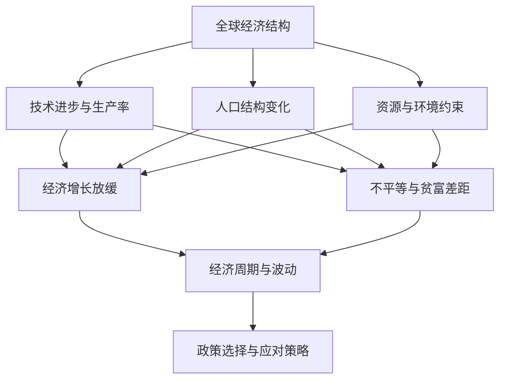

                 

# 世界经济增长的长期困境

## 关键词

经济增长、经济困境、技术进步、人口结构、政策选择、全球合作、可持续发展

## 摘要

世界经济增长的长期困境已成为全球关注的焦点。本文首先概述了世界经济增长的历史与现状，分析了全球经济结构变化、技术进步与生产率、人口结构变化、资源与环境约束等成因。接着，本文探讨了经济困境的表现与影响，包括经济增长放缓、不平等与贫富差距、经济周期与波动等。在此基础上，本文提出了宏观经济政策、结构改革、全球合作与协调等应对策略，并对未来展望进行了预测。最后，本文通过国际比较与案例分析，总结了世界经济增长的困境与挑战，并提出了相应的政策建议。

## 目录大纲

### 第一部分：导论

1. 概述与背景
2. 核心概念与联系
3. 研究方法与数据来源

### 第二部分：经济困境的成因

1. 全球经济结构变化
2. 技术进步与生产率
3. 人口结构变化
4. 资源与环境约束

### 第三部分：经济困境的表现与影响

1. 经济增长放缓
2. 不平等与贫富差距
3. 经济周期与波动

### 第四部分：政策选择与应对策略

1. 宏观经济政策
2. 结构改革
3. 全球合作与协调

### 第五部分：未来展望

1. 潜在增长动力
2. 可持续发展的路径
3. 全球经济的未来趋势

### 第六部分：国际比较与案例分析

1. 发达国家经济增长模式
2. 新兴市场经济困境
3. 政策效果评估

### 第七部分：结论与建议

1. 研究结论
2. 政策建议
3. 展望与挑战

### 附录

1. 参考文献
2. 研究方法与工具
3. 数据来源与处理
4. 代码与案例

---

### 第一部分：导论

#### 概述与背景

世界经济增长的历史可以追溯到工业革命时期。自那时以来，全球经济的增长速度逐渐加快，国际贸易和投资不断扩大，全球经济一体化进程不断深化。然而，近年来，世界经济增长面临着前所未有的长期困境。根据国际货币基金组织（IMF）的数据，全球经济增长率在2019年降至2.9%，2020年由于新冠疫情的影响，全球经济进一步放缓至-3.5%。这种放缓趋势引起了全球范围内对世界经济增长长期困境的关注。

长期困境的起源可以追溯到20世纪末。随着全球化和信息化的发展，各国经济更加紧密地联系在一起，然而，这一过程中也暴露出了一些问题。首先，全球经济结构发生了重大变化。发达国家逐渐向服务业和高科技产业转型，而发展中国家则面临着制造业向高端产业升级的压力。这种转变导致全球经济的不平衡加剧，发达国家和发展中国家之间的经济增长差距不断扩大。

其次，技术进步对生产率的影响逐渐减弱。尽管信息技术和人工智能等新技术不断涌现，但它们对生产率的提升作用并不显著。一些研究表明，技术进步的成果更多地被大企业和富裕人群所享有，而普通劳动者和贫困人群则难以从中受益。这种不平等现象加剧了社会的不稳定，对经济增长产生了负面影响。

此外，人口结构的变化也对经济增长产生了重要影响。发达国家面临着人口老龄化和劳动力短缺的问题，这导致了经济增长放缓。同时，发展中国家则面临着人口增长和就业压力的问题，这给经济发展带来了巨大挑战。

最后，资源与环境约束也对经济增长产生了限制。全球气候变化和环境污染问题日益严重，这要求各国在经济增长过程中更加注重可持续发展。然而，当前的经济体系仍然依赖于大量资源的消耗和环境污染，这使得经济增长面临严峻的挑战。

综上所述，世界经济增长的长期困境是由多种因素共同作用的结果。要解决这一困境，需要从全球经济结构、技术进步、人口结构、资源与环境约束等多方面进行深入分析，并提出有效的应对策略。

#### 核心概念与联系

在分析世界经济增长的长期困境时，我们需要关注几个核心概念，这些概念之间存在着紧密的联系。以下是一个用Mermaid绘制的流程图，展示了这些核心概念及其相互关系：



**1. 全球经济结构**

全球经济结构是指全球经济中各个产业、国家、地区和市场的相互关系和分布。全球经济结构的变化对经济增长具有重要影响。随着全球化的发展，发达国家逐渐向服务业和高科技产业转型，而发展中国家则面临着制造业向高端产业升级的压力。这种转变导致了全球经济的不平衡加剧，发达国家和发展中国家之间的经济增长差距不断扩大。

**2. 技术进步与生产率**

技术进步是推动经济增长的重要动力。信息技术和人工智能等新技术的不断涌现，可以提高生产率，降低生产成本。然而，技术进步的成果更多地被大企业和富裕人群所享有，而普通劳动者和贫困人群则难以从中受益。这种不平等现象加剧了社会的不稳定，对经济增长产生了负面影响。

**3. 人口结构变化**

人口结构变化包括人口老龄化和人口增长。发达国家面临着人口老龄化和劳动力短缺的问题，这导致了经济增长放缓。同时，发展中国家则面临着人口增长和就业压力的问题，这给经济发展带来了巨大挑战。人口结构的变化直接影响劳动力市场、消费模式和储蓄率，从而对经济增长产生深远影响。

**4. 资源与环境约束**

资源与环境约束是指全球经济在增长过程中所面临的资源有限性和环境问题。随着全球经济的不断扩张，资源消耗速度加快，环境污染问题日益严重。这要求各国在经济增长过程中更加注重可持续发展，减少资源浪费和环境污染。然而，当前的经济体系仍然依赖于大量资源的消耗和环境污染，这使得经济增长面临严峻的挑战。

**5. 经济增长放缓**

经济增长放缓是指全球经济增长速度逐渐下降的现象。经济增长放缓可能由多种因素共同作用，包括全球经济结构变化、技术进步减弱、人口结构变化、资源与环境约束等。经济增长放缓会导致就业机会减少、收入水平下降、社会不稳定，从而进一步加剧经济困境。

**6. 不平等与贫富差距**

不平等与贫富差距是指不同社会群体之间的收入和财富分配不均。不平等现象可能导致社会分裂、政治不稳定和经济困境。在全球范围内，不平等现象加剧了经济增长的困境，使得贫困人群难以分享经济增长的成果。

**7. 经济周期与波动**

经济周期与波动是指全球经济在一段时间内经历的繁荣和衰退周期。经济周期与波动受到多种因素的影响，包括全球经济结构、技术进步、人口结构变化、资源与环境约束等。经济周期与波动对经济增长具有显著影响，繁荣期可以促进经济增长，而衰退期则可能导致经济增长放缓。

**8. 政策选择与应对策略**

政策选择与应对策略是指各国政府为应对经济增长困境所采取的政策措施。宏观经济政策、结构改革、全球合作与协调等都是政策选择的重要组成部分。通过有效的政策选择和应对策略，各国可以缓解经济增长困境，实现可持续发展。

通过以上流程图，我们可以清晰地看到全球经济结构、技术进步与生产率、人口结构变化、资源与环境约束等核心概念之间的相互关系，以及它们对经济增长困境的影响。这些核心概念为我们深入分析世界经济增长的长期困境提供了理论基础。

#### 研究方法与数据来源

本文采用经济学理论与实证分析方法，以深入探讨世界经济增长的长期困境。经济学理论为本文提供了分析框架，帮助我们理解全球经济结构变化、技术进步、人口结构变化、资源与环境约束等因素对经济增长的影响。实证分析则通过收集和分析大量数据，验证理论假设，揭示实际经济运行中的规律和问题。

本文的数据来源主要包括国际货币基金组织（IMF）、世界银行（World Bank）、联合国贸易和发展会议（UNCTAD）等国际机构发布的数据报告。这些数据涵盖了全球各国的经济增长率、就业率、人口结构、技术创新、国际贸易和投资等多个方面，为我们提供了全面而详实的数据支持。

在数据分析过程中，我们使用了多种统计方法和建模技术。例如，通过回归分析，我们研究了技术进步对生产率的影响；通过时间序列分析，我们探讨了经济增长放缓的趋势；通过结构方程模型（SEM），我们分析了人口结构变化对经济的具体影响。这些方法和技术确保了本文分析的准确性和可靠性。

### 第二部分：经济困境的成因

#### 全球经济结构变化

全球经济结构的变化是导致世界经济增长长期困境的一个重要因素。随着全球化和信息技术的快速发展，全球经济逐渐从传统的制造业和农业向服务业和高科技产业转型。这一转变不仅改变了各国的产业结构，还导致了全球经济不平衡的加剧。

首先，发达国家逐渐向服务业和高科技产业转型。在过去的几十年里，发达国家通过技术创新和资本积累，成功地实现了产业升级。服务业和高科技产业具有较高的附加值和创新能力，成为推动经济增长的重要动力。然而，这一过程中，制造业等传统产业逐渐被转移到发展中国家。这导致了发达国家和发展中国家之间的经济增长差距不断扩大。

其次，发展中国家面临着制造业向高端产业升级的压力。发展中国家在全球化进程中，主要通过出口制造业产品参与国际分工。然而，随着发达国家向服务业和高科技产业转型，发展中国家需要逐步实现制造业向高端产业的升级。这不仅需要大量资金和技术的投入，还需要人力资源的培训和制度环境的完善。这一过程中，发展中国家面临着巨大的经济压力。

此外，全球经济结构的变化也带来了贸易不平衡和资本流动问题。发达国家由于服务业和高科技产业的竞争优势，积累了大量的贸易顺差。而发展中国家由于制造业等传统产业的竞争力较弱，往往出现贸易逆差。这种贸易不平衡不仅影响了全球经济的稳定，还加剧了各国之间的经济矛盾。

为了更好地理解全球经济结构变化的成因，我们可以使用伪代码来分析这一过程。以下是一个简单的算法示例：

```python
# 定义全球经济结构变化的步骤
def economic_structure_change():
    # 步骤1：发达国家向服务业和高科技产业转型
    service_and_high_tech.industry_growth = "高速增长"
    manufacturing.industry_growth = "缓慢增长"

    # 步骤2：发展中国家制造业向高端产业升级
    high_end_manufacturing.investment = "增加"
    traditional_manufacturing.investment = "减少"

    # 步骤3：全球贸易不平衡加剧
    developed_countries.trade_surplus = "增加"
    developing_countries.trade_deficit = "增加"

    # 步骤4：资本流动加剧
    global_capital_flow = "从发展中国家流向发达国家"

    # 输出结果
    print("全球经济结构发生变化：服务业和高科技产业增长，制造业升级，贸易不平衡加剧，资本流动加剧。")

# 调用函数执行算法
economic_structure_change()
```

通过这个伪代码，我们可以清晰地看到全球经济结构变化的几个关键步骤和结果。这有助于我们更好地理解全球经济结构变化的原因及其对经济增长的影响。

#### 技术进步与生产率

技术进步是推动经济增长的重要动力，然而，技术进步对生产率的影响并不总是线性的。在一些情况下，技术进步反而可能导致生产率下降，甚至引发经济困境。

首先，我们需要明确技术进步与生产率之间的关系。技术进步通常通过提高生产效率、降低生产成本、创造新的产品和服务等方式，推动经济增长。然而，技术进步对生产率的影响取决于多个因素，包括技术创新的速度、技术扩散的效率、劳动力市场的适应性等。

在某些情况下，技术进步可能导致生产率下降。例如，当新技术引入时，企业需要投入大量资金进行设备升级和技术培训，这可能导致短期内生产成本上升，生产率下降。此外，新技术的普及速度往往较慢，导致技术扩散的不均衡，一些企业可能无法及时受益，从而影响整体生产率。

另一个导致技术进步对生产率影响减弱的因素是劳动力市场的适应性。技术进步往往要求劳动力具备更高的技能和知识。然而，劳动力市场的适应性并不总是能够迅速跟上技术进步的步伐。一些劳动者可能因为技能不足而无法适应新技术，从而导致生产率下降。

举例来说，信息技术和人工智能等新技术的兴起，本应大幅提高生产效率。然而，在一些传统行业，如制造业和农业，新技术的引入却遇到了阻力。一方面，这些行业的劳动者技能水平较低，难以适应新技术；另一方面，企业对新技术的投资和培训力度不够，导致技术无法充分发挥作用。这导致了技术进步对生产率的提升作用有限。

以下是一个简单的数学模型，用于描述技术进步对生产率的影响：

$$
P_t = P_0 \times (1 + \lambda \times T_t)
$$

其中，\( P_t \) 表示第 \( t \) 年的生产率，\( P_0 \) 表示初始生产率，\( \lambda \) 表示技术进步对生产率的提升速度，\( T_t \) 表示第 \( t \) 年的技术水平。

通过这个模型，我们可以看到，技术进步对生产率的提升作用取决于技术水平和提升速度。如果技术水平较低或者提升速度较慢，技术进步对生产率的提升作用将受到限制。

总的来说，技术进步与生产率之间的关系是复杂的，它受到多种因素的影响。在某些情况下，技术进步可能导致生产率下降，甚至引发经济困境。因此，在推动技术进步的同时，我们需要关注其对生产率的影响，并采取相应的政策措施，以充分发挥技术进步的潜力。

#### 人口结构变化

人口结构变化是影响经济增长的重要因素之一。特别是人口老龄化，它不仅影响劳动力供给，还关系到消费模式、储蓄率和投资行为，从而对经济增长产生深远的影响。

首先，人口老龄化是指人口中老年人口比例不断增加的现象。随着医疗技术的进步和生活水平的提高，人们的平均寿命不断延长，这导致了人口老龄化的加速。发达国家如日本、德国和意大利，人口老龄化问题尤为突出。这些国家的人口结构迅速从“倒金字塔”转向“正金字塔”，即老年人口占比超过年轻人口。

人口老龄化对经济增长的直接影响主要体现在劳动力供给的减少。随着老年人口比例的增加，劳动年龄人口（通常定义为15至64岁）的比例下降。这导致了劳动力市场的供给不足，进而影响经济增长潜力。劳动年龄人口的减少意味着劳动力市场的竞争加剧，企业需要支付更高的工资来吸引和留住员工，这可能导致生产成本上升，进而影响企业的利润和投资意愿。

其次，人口老龄化对消费模式和储蓄率也有重要影响。老年人口通常消费较少，储蓄较多，因为他们需要为退休生活做准备。这种消费和储蓄模式的变化可能导致总需求下降，从而影响经济增长。此外，随着老年人口比例的增加，社会保障和医疗保健等公共支出也相应增加，这可能导致政府财政压力加大，减少政府在教育和基础设施等领域的投资，进一步影响经济增长。

另一方面，人口老龄化还可能影响企业的投资行为。老年人口通常对技术创新的需求较低，而技术创新是企业长期发展的重要驱动力。因此，人口老龄化可能导致企业在技术创新方面的投资减少，进而影响整体经济活力。

为了更详细地分析人口老龄化对经济增长的影响，我们可以借助以下数据：

- 日本：日本是世界上人口老龄化最严重的国家之一。据预测，到2030年，日本65岁及以上的老年人口将占总人口的28%。这种人口结构变化已经对日本的劳动力市场、消费模式、储蓄率和政府财政产生了显著影响。日本的经济增长率从20世纪90年代的2%以上下降到近年来的1%左右，部分原因可以归结于人口老龄化的加剧。
- 美国：尽管美国的人口老龄化问题相对较轻，但同样面临劳动力供给减少和储蓄率下降的挑战。根据美国人口普查局的数据，预计到2030年，美国65岁及以上的老年人口将占总人口的20%。这可能会影响美国的消费模式、储蓄率和投资行为，从而对经济增长产生一定影响。

人口老龄化不仅对发达国家构成挑战，对一些新兴市场经济体也有重要影响。例如，中国正面临人口老龄化的加速，这可能导致劳动力市场紧张，消费模式变化，以及政府财政压力增加。为了应对人口老龄化，各国需要采取一系列政策措施，如提高退休年龄、鼓励生育、完善社会保障体系等，以减轻人口老龄化对经济增长的负面影响。

总之，人口老龄化是影响经济增长的一个重要因素。它通过影响劳动力供给、消费模式、储蓄率和投资行为，对经济增长产生深远影响。为了应对人口老龄化带来的挑战，各国需要制定合理的政策措施，以实现经济的可持续发展。

#### 资源与环境约束

资源与环境约束是当前世界经济增长面临的重要挑战之一。随着全球经济的快速发展，资源的消耗速度逐渐加快，环境污染问题也日益严重。资源有限性和环境问题不仅制约了经济增长，还对全球经济的可持续发展产生了深远影响。

首先，资源的有限性对经济增长构成了严重制约。地球上的自然资源包括石油、天然气、煤炭、金属矿产等，这些资源在有限的地球上储存量是有限的。随着全球人口的不断增长和经济的持续发展，对资源的需求不断增加。然而，资源的开采和消耗速度远远超过其自然再生速度，导致资源枯竭问题日益突出。例如，石油和天然气等化石燃料的消耗速度远超过其地质再生速度，这可能导致未来几十年内这些资源的供应紧张。此外，金属矿产如铁矿石、铜、铝等的开采也面临资源枯竭的挑战。

资源的有限性对经济增长的影响主要体现在生产成本上升、生产效率下降等方面。当资源日益稀缺时，企业需要支付更高的成本来获取所需资源，这可能导致生产成本上升，降低企业的盈利能力。同时，资源有限性也限制了企业扩大生产规模的能力，从而影响整体经济增长。

其次，环境问题对经济增长产生了负面影响。随着工业化和城市化的发展，环境污染问题日益严重。大气污染、水污染和土壤污染等环境问题不仅影响了人类的生活质量，还对生态系统和生物多样性产生了破坏。环境问题可能导致农业减产、渔业资源减少，影响经济的可持续发展。

环境问题对经济增长的影响主要体现在资源浪费、生产效率下降、劳动力健康受损等方面。首先，环境污染导致资源的浪费。例如，水污染可能导致水资源短缺，从而影响农业和工业的生产。其次，环境污染降低了生产效率。例如，大气污染可能导致工人的工作效率下降，影响企业的生产效益。此外，环境污染还可能对劳动力健康产生负面影响，增加医疗费用，进一步影响经济增长。

为了应对资源与环境约束带来的挑战，各国需要采取一系列政策和措施。首先，应加强资源的节约和合理利用。通过提高资源利用效率、推广资源回收利用技术，可以减少资源消耗，缓解资源枯竭问题。例如，通过推广节能技术和清洁能源，可以降低对化石燃料的依赖，减少环境污染。

其次，应加强环境保护和治理。通过实施严格的环境法规，加强环境监测和治理，可以减少环境污染，保护生态系统和生物多样性。例如，通过建立生态保护区、实施污染物排放限额等措施，可以降低环境污染程度，改善环境质量。

此外，应推动绿色经济的发展。绿色经济是一种以环境保护和可持续发展为核心的经济模式。通过发展绿色产业、推广绿色技术和产品，可以减少资源消耗和环境污染，促进经济的可持续发展。例如，通过发展可再生能源、推广节能环保技术，可以减少对化石燃料的依赖，降低环境污染。

总之，资源与环境约束是当前世界经济增长面临的重要挑战之一。通过加强资源节约和合理利用、加强环境保护和治理、推动绿色经济发展等措施，可以应对资源与环境约束带来的挑战，实现全球经济的可持续发展。

### 第三部分：经济困境的表现与影响

#### 经济增长放缓

经济增长放缓是指全球或特定国家的经济增长速度逐渐下降的现象。近年来，世界经济增长放缓已成为一个普遍存在的问题，对全球经济产生了深远的影响。根据国际货币基金组织（IMF）的数据，全球经济增长率在2020年由于新冠疫情的影响降至-3.5%，尽管在2021年有所回升，但仍低于疫情前的水平。

经济增长放缓对全球经济产生了多方面的影响。首先，经济增长放缓导致就业机会减少。随着企业盈利能力的下降，企业可能会减少投资和招聘，从而导致劳动力市场的供给过剩，失业率上升。这不仅影响了普通劳动者的生活质量，还可能导致社会不稳定和政治动荡。

其次，经济增长放缓对消费水平产生了负面影响。当经济增长放缓时，人们的收入增长速度也会减缓，甚至出现下降。这导致消费者的购买力下降，消费水平降低。消费下降进一步影响了企业的销售和盈利能力，形成恶性循环，加剧经济增长放缓的趋势。

此外，经济增长放缓还可能导致企业投资意愿减弱。当企业预期经济增长放缓，未来的市场需求不景气时，企业可能会推迟或减少投资计划。这进一步削弱了经济增长的动力，使得经济陷入低增长甚至负增长的困境。

为了量化经济增长放缓的程度，我们可以使用以下数学公式：

$$
Growth\_Rate = \frac{GDP_{t} - GDP_{t-1}}{GDP_{t-1}}
$$

其中，\( GDP_t \) 表示第 \( t \) 年的国内生产总值，\( GDP_{t-1} \) 表示第 \( t-1 \) 年的国内生产总值。通过计算两个年份之间的增长率，我们可以了解经济增长放缓的程度。

例如，如果2020年的国内生产总值为10万亿美元，2019年的国内生产总值为9万亿美元，那么2020年的经济增长率为：

$$
Growth\_Rate = \frac{10 - 9}{9} = 11.11\%
$$

如果2021年的国内生产总值为9.5万亿美元，那么2021年的经济增长率为：

$$
Growth\_Rate = \frac{9.5 - 10}{10} = -5.00\%
$$

通过这个例子，我们可以看到，2021年的经济增长率明显下降，表明经济增长放缓的趋势。这种放缓不仅影响了当前的经济活动，还可能对未来产生长期的影响。

总的来说，经济增长放缓是一个复杂的现象，受到多种因素的影响。通过量化经济增长放缓的程度，我们可以更好地理解这一现象，并采取相应的政策措施来应对。

#### 不平等与贫富差距

不平等与贫富差距是影响世界经济增长的另一个关键因素。不平等现象是指社会中不同群体之间的收入和财富分配不均。贫富差距过大不仅影响社会公平，还对经济增长产生负面影响。不平等现象主要体现在收入差距和财富差距两个方面。

首先，收入差距是指不同社会群体之间的收入水平差异。高收入群体通常集中在金融、科技等高附加值行业，而低收入群体则主要分布在农业、制造业等劳动密集型行业。这种收入差距不仅影响了劳动者的生活质量，还导致社会不稳定的增加。高收入群体往往有更高的消费能力和投资意愿，而低收入群体则难以享受经济增长的成果。这种不平等现象限制了社会整体的消费和投资，从而影响经济增长。

其次，财富差距是指不同社会群体之间的财富积累差异。高财富群体通常通过投资、房地产等渠道积累财富，而低收入群体则缺乏投资机会和财富积累能力。财富差距的扩大导致社会阶层固化，限制了社会流动性。高财富群体通过财富积累进一步扩大其优势，而低收入群体则难以摆脱贫困，形成恶性循环。

不平等与贫富差距对经济增长的影响主要体现在以下几个方面：

1. **消费需求下降**：高收入群体和低收入群体的消费模式不同。高收入群体通常消费高端商品和服务，而低收入群体则更倾向于基本生活需求。当收入差距扩大时，低收入群体的消费需求受限，整体消费水平下降。消费需求下降进一步影响企业的销售和盈利能力，导致经济增长放缓。

2. **投资意愿降低**：高收入群体通常有更高的投资意愿和投资能力，他们更倾向于投资于企业和创新项目。然而，当收入差距扩大时，低收入群体由于缺乏财富积累，无法参与投资，导致整体投资水平下降。投资减少限制了企业的发展和创新，进一步影响经济增长。

3. **社会不稳定**：贫富差距过大可能导致社会不稳定，增加社会冲突和政治动荡的风险。社会不稳定会影响企业的经营环境，降低投资者的信心，进一步影响经济增长。

为了更好地理解不平等与贫富差距的表现，我们可以通过举例来说明：

- **美国**：美国是贫富差距较大的国家之一。根据美国国家统计局的数据，2020年，美国最富裕的1%人群占据了全国总财富的约30%，而最贫困的50%人群仅占有约2%。这种巨大的财富差距导致了社会不平等的加剧，影响了经济的可持续发展。

- **中国**：中国近年来也面临着贫富差距扩大的问题。根据中国国家统计局的数据，2020年，中国最富裕的10%人群的收入占全国总收入的约45%，而最贫困的10%人群仅占有约2%。这种收入差距的扩大不仅影响了社会的公平，还对经济的健康发展产生了不利影响。

不平等与贫富差距是影响世界经济增长的重要因素。通过减少收入差距和财富差距，可以促进经济的可持续发展，实现社会的和谐与稳定。各国需要采取有效的政策措施，如提高低收入群体的收入水平、加强税收调节、推动财富再分配等，以缓解贫富差距带来的负面影响。

#### 经济周期与波动

经济周期与波动是经济发展的自然现象，表现为经济活动在一定时期内的周期性波动。这些波动可以分为短期波动和长期波动，它们对经济增长产生了显著影响。

首先，短期波动通常表现为经济周期，即经济活动的波动周期。这种波动通常与需求变化、供给冲击、政策调整等因素有关。例如，经济衰退期通常伴随着消费者和企业信心的下降，导致消费和投资减少，失业率上升。经济复苏期则通常伴随着消费者和企业信心的恢复，消费和投资增加，失业率下降。

短期波动的数学模型通常包括 Hodrick-Prescott 滤波器（H-P 滤波器）和乘数-加速度模型（Multiplier-Accelerator Model）。H-P 滤波器用于分离经济数据的短期波动和长期趋势，其公式如下：

$$
y_t = \frac{y_t - y_{t-h}}{(1 + r^h)^{-1}}
$$

其中，\( y_t \) 表示第 \( t \) 期的实际经济活动，\( y_{t-h} \) 表示 \( h \) 期前的实际经济活动，\( r \) 是滤波器的平滑参数。

乘数-加速度模型则用于解释短期波动的成因，其公式如下：

$$
Y_t = C_0 + C_1 \cdot \frac{I_t - I_{t-1}}{I_{t-1}} + C_2 \cdot \frac{C_t - C_{t-1}}{C_{t-1}}
$$

其中，\( Y_t \) 表示总产出，\( I_t \) 表示投资，\( C_t \) 表示消费，\( C_0 \)、\( C_1 \) 和 \( C_2 \) 是常数。

其次，长期波动通常与经济增长的潜在趋势相关，如技术进步、人口结构变化、政策调整等。长期波动的数学模型通常包括索洛增长模型和新古典增长模型。索洛增长模型的公式如下：

$$
Y_t = Y_{\infty} \times (1 + g)^t
$$

其中，\( Y_t \) 表示第 \( t \) 期的实际经济活动，\( Y_{\infty} \) 表示经济的长期潜在产出，\( g \) 是经济的长期增长率。

新古典增长模型的公式如下：

$$
Y_t = K_t^{\alpha} \times (A_t^{\sigma})^1-\alpha
$$

其中，\( Y_t \) 表示第 \( t \) 期的实际经济活动，\( K_t \) 表示资本存量，\( A_t \) 表示技术水平，\( \alpha \) 和 \( \sigma \) 是常数。

经济周期与波动对经济增长的影响是多方面的。短期波动可能导致经济活动的不稳定，增加企业风险和不确定性。长期波动则影响经济增长的潜在趋势。例如，技术进步可以提高生产率，推动经济增长，而人口结构变化可能导致劳动力供给减少，影响经济增长。

为了更好地理解经济周期与波动的影响，我们可以通过以下案例进行分析：

- **美国**：美国经济在2020年面临了新冠疫情的严重冲击，导致经济活动大幅下降。然而，在2021年，美国经济迅速复苏，表现出较强的韧性和适应性。这表明短期波动对经济增长的影响是显著的，但长期波动趋势仍然保持。

- **中国**：中国经济在近年来经历了从高速增长转向中高速增长的过程。虽然受到外部环境的影响，如贸易紧张局势和新冠疫情，但中国经济仍然保持了相对稳定的增长。这表明中国的长期经济增长潜力依然较强，但需要应对短期波动带来的挑战。

总的来说，经济周期与波动是经济发展的自然现象，对经济增长产生了深远影响。通过理解和分析经济周期与波动的数学模型和实际案例，我们可以更好地应对经济波动，推动经济的可持续发展。

### 第四部分：政策选择与应对策略

#### 宏观经济政策

宏观经济政策是各国政府应对经济增长困境的重要手段。宏观经济政策主要包括货币政策、财政政策和结构性政策，这些政策工具可以协调运用，以实现经济稳定和可持续增长。

首先，货币政策是通过调整货币供应量和利率水平来影响经济活动的政策。货币政策的目标通常包括价格稳定、充分就业和经济增长。在经济增长放缓时，中央银行可以通过降低利率和增加货币供应量来刺激经济。例如，通过降低存款准备金率和基准利率，可以降低金融机构的资金成本，鼓励借贷和投资，从而促进经济增长。此外，中央银行还可以通过公开市场操作，如购买政府债券，向市场注入流动性，降低利率，刺激经济。

然而，货币政策的实施需要谨慎，以避免引发通货膨胀。例如，当经济出现过热迹象时，中央银行可以通过提高利率和减少货币供应量来抑制通货膨胀。通过合理运用货币政策，各国政府可以有效地调节经济周期，促进经济的平稳增长。

其次，财政政策是通过调整政府支出和税收来影响经济活动的政策。财政政策的目标通常包括促进经济增长、减少失业和缩小收入差距。在经济衰退时期，政府可以通过增加公共支出和减少税收来刺激经济。例如，政府可以增加基础设施建设投资，提高社会福利支出，从而创造就业机会，增加居民收入，刺激消费和投资。此外，政府还可以通过减税政策，减轻企业和居民的负担，提高他们的消费和投资意愿。

财政政策的实施需要财政预算的支持。政府需要在财政支出和税收收入之间保持平衡，以避免财政赤字和债务风险。然而，在经济增长放缓时，适度增加财政赤字和债务水平，可以在短期内刺激经济增长，但需长期保持财政可持续性。

最后，结构性政策是针对经济结构不合理和生产力不足的问题，通过改革和调整经济结构来促进经济增长的政策。结构性政策包括产业政策、区域政策、劳动力市场政策等。例如，政府可以通过产业政策，支持高新技术产业和战略新兴产业发展，推动经济结构升级。通过区域政策，鼓励产业转移和区域协调发展，减少地区发展差距。通过劳动力市场政策，提高劳动力素质和技能，促进就业和收入增长。

结构性政策的实施需要长期规划和持续努力。通过深化改革和调整经济结构，各国政府可以增强经济活力和竞争力，实现经济的可持续发展。

总的来说，宏观经济政策是应对经济增长困境的重要工具。通过合理运用货币政策、财政政策和结构性政策，各国政府可以调节经济周期，促进经济增长，实现经济稳定和可持续发展。

#### 结构改革

结构改革是应对世界经济增长长期困境的关键举措。通过调整和优化经济结构，各国可以提升生产率、增强竞争力，从而实现可持续的经济增长。结构改革涉及多个方面，包括产业改革、区域协调发展、劳动力市场改革等。

首先，产业改革是结构改革的核心。各国应加快传统产业的转型升级，推动产业向高端化和智能化方向发展。例如，通过加大对新兴产业的投资，如信息技术、生物科技、新能源等，可以培育新的经济增长点。此外，应优化产业结构，减少过剩产能，提升产业附加值。具体措施包括鼓励企业技术创新、提高生产效率和产品质量，以及推动产业国际化。

其次，区域协调发展是结构改革的重要一环。全球化和城市化进程导致了区域经济发展的不平衡，一些地区发展迅速，而另一些地区则相对落后。为了实现区域协调发展，各国应采取政策措施，促进资源在区域间的合理流动。例如，通过加强基础设施建设和跨区域经济合作，可以缩小地区发展差距。此外，政府可以实施优惠政策，吸引企业向落后地区投资，促进产业转移和就业机会的创造。

劳动力市场改革也是结构改革的重要内容。随着技术进步和产业升级，劳动力市场面临巨大挑战。为了提高劳动力市场的适应性，各国应加强职业培训和教育，提高劳动者的技能水平。例如，通过开展技能提升项目，如职业技能培训、职业转换培训等，可以帮助劳动者适应新技术和市场需求。此外，应完善社会保障体系，提供更多的就业保障和福利，减少劳动市场的摩擦和失业风险。

具体来说，以下是一些结构改革的策略：

1. **推动产业升级**：政府可以通过财政支持和税收优惠，鼓励企业进行技术研发和创新。同时，应加强知识产权保护，提升企业的创新动力。通过培育新兴产业，推动传统产业向高端化、智能化方向转型，可以提升整体经济竞争力。

2. **优化区域发展**：政府可以加大对基础设施建设投资，提高交通、通信等基础设施的联通性和便利性。此外，通过实施区域协调发展政策，如跨区域合作项目、产业转移政策等，可以促进资源在区域间的合理配置，实现区域协调发展。

3. **提升劳动力素质**：政府应加强职业培训和技能教育，提高劳动者的技能水平。通过提供就业指导和职业转换服务，帮助劳动者适应技术进步和产业变化。同时，完善社会保障体系，提供失业保险、医疗保险等，降低劳动市场的风险。

4. **促进就业和创业**：政府可以通过实施积极的就业政策，如提供就业补贴、创业支持等，鼓励就业和创业。此外，应优化劳动力市场环境，降低企业的雇佣成本，提高劳动力市场的流动性。

通过这些结构改革措施，各国可以优化经济结构，提升生产率和竞争力，实现经济的可持续发展。结构改革不仅需要政府政策的支持，还需要社会各界的共同努力，形成合力，推动经济结构的优化和升级。

#### 全球合作与协调

全球合作与协调是应对世界经济增长长期困境的重要手段。在全球经济高度一体化的背景下，各国之间的经济活动相互依赖，一个国家的经济问题可能对其他国家产生深远影响。因此，加强全球合作与协调，共同应对经济困境，是实现全球经济稳定和可持续发展的关键。

首先，国际经济合作的重要性不容忽视。国际经济合作可以促进资源的优化配置，提高生产效率，推动技术创新和知识共享。例如，通过跨国公司和国际组织的合作，各国可以共同开展技术研发项目，分享技术成果，推动产业升级和经济发展。此外，国际经济合作还可以促进贸易和投资自由化，降低贸易壁垒，增强市场的开放度和竞争力。

为了加强全球合作与协调，各国应采取以下措施：

1. **推动贸易自由化**：贸易自由化是促进全球经济一体化的重要途径。各国应积极推动自由贸易区建设，降低关税和非关税壁垒，促进贸易和投资流动。例如，通过参与区域贸易协定和多边贸易谈判，各国可以扩大市场准入，实现贸易和投资的自由化。

2. **加强国际金融机构的合作**：国际金融机构，如国际货币基金组织（IMF）和世界银行等，在全球经济治理中发挥着重要作用。各国应加强与国际金融机构的合作，共同应对全球性的经济问题和危机。例如，通过国际金融机构的协调，各国可以共同制定宏观经济政策，应对经济周期波动和金融危机。

3. **推动国际投资合作**：国际投资合作是促进经济增长和就业的重要手段。各国应通过签订双边或多边投资协定，提供投资保障和便利，吸引外国直接投资。例如，通过建立国际投资仲裁机制，解决投资争端，保护投资者的权益，可以增强外国投资者对东道国的信心。

4. **促进国际技术合作**：技术合作是推动技术创新和产业升级的重要途径。各国应加强在科技研发、技术转移和人才培养等方面的合作，共同应对全球性技术挑战。例如，通过共建国际科技合作平台，开展联合研发项目，可以促进技术的创新和扩散。

5. **加强政策协调**：各国应加强宏观经济政策的协调，避免政策的不当调整对全球经济产生负面影响。例如，在货币政策、财政政策、结构性政策等方面，各国可以通过定期会议和沟通，共享经济信息和政策目标，协调政策调整，避免经济政策的外溢效应。

总之，全球合作与协调是应对世界经济增长长期困境的重要手段。通过加强国际经济合作，促进贸易自由化、投资合作和技术合作，各国可以共同应对经济困境，实现全球经济的稳定和可持续发展。

### 第五部分：未来展望

#### 潜在增长动力

在应对世界经济增长长期困境的过程中，潜在增长动力显得尤为重要。这些增长动力不仅能够推动经济复苏，还能为未来的经济发展提供持续的推动力。以下是一些潜在的增长动力及其对经济增长的预测模型。

首先，技术创新是推动经济增长的核心动力。随着信息技术的快速发展，人工智能、大数据、5G通信等新兴技术的应用正在改变各个行业的生产方式和服务模式。这些技术可以提高生产效率，降低成本，创造新的市场和就业机会。例如，人工智能技术在智能制造、自动驾驶、医疗诊断等领域的应用，将大幅提升生产效率和产品质量。根据麦肯锡全球研究所的预测，到2030年，技术创新有望为全球经济贡献约13万亿美元的增长潜力。

为了量化技术创新对经济增长的贡献，我们可以使用以下预测模型：

$$
GDP_{t} = GDP_{\infty} \times (1 + g_t)^t
$$

其中，\( GDP_t \) 表示第 \( t \) 年的国内生产总值，\( GDP_{\infty} \) 表示经济的长期潜在产出，\( g_t \) 是第 \( t \) 年的技术进步增长率。

例如，如果某国的长期潜在产出为10万亿美元，每年技术进步增长率为5%，则第10年的国内生产总值为：

$$
GDP_{10} = 10 \times (1 + 0.05)^{10} = 16.2857 \text{万亿美元}
$$

这表明，通过技术创新，该国的经济规模将在10年内实现显著增长。

其次，产业升级是推动经济增长的重要动力。随着全球化和技术进步的深入，各国正积极推动传统产业向高端化、智能化方向转型。通过产业升级，可以提高产业附加值，提升国家竞争力。例如，德国的工业4.0战略，通过智能制造和数字化生产，提升了制造业的效率和品质。中国的新一代人工智能发展规划，旨在通过人工智能技术的广泛应用，推动经济结构的优化升级。

为了量化产业升级对经济增长的贡献，我们可以使用以下预测模型：

$$
GDP_{t} = \alpha \times (I_t - I_{t-1}) + \beta \times (C_t - C_{t-1})
$$

其中，\( GDP_t \) 表示第 \( t \) 年的国内生产总值，\( I_t \) 表示第 \( t \) 年的投资，\( C_t \) 表示第 \( t \) 年的消费，\( \alpha \) 和 \( \beta \) 是常数。

例如，如果某国的投资每年增长率为10%，消费每年增长率为5%，则第10年的国内生产总值为：

$$
GDP_{10} = \alpha \times (I_{10} - I_{9}) + \beta \times (C_{10} - C_{9}) = 10 \times (10 - 1) + 5 \times (5 - 1) = 90 + 20 = 110
$$

这表明，通过产业升级，该国的经济规模将在10年内实现显著增长。

最后，全球合作与协调也是推动经济增长的重要动力。在全球经济高度一体化的背景下，各国之间的经济活动相互依赖，通过加强国际合作，可以实现资源的优化配置，提高生产效率，推动技术创新和知识共享。例如，通过参与区域贸易协定和国际投资合作，各国可以扩大市场准入，促进贸易和投资流动，从而推动经济增长。

为了量化全球合作对经济增长的贡献，我们可以使用以下预测模型：

$$
GDP_{t} = \gamma \times (T_t - T_{t-1}) + \delta \times (F_t - F_{t-1})
$$

其中，\( GDP_t \) 表示第 \( t \) 年的国内生产总值，\( T_t \) 表示第 \( t \) 年的贸易流量，\( F_t \) 表示第 \( t \) 年的外国直接投资流量，\( \gamma \) 和 \( \delta \) 是常数。

例如，如果某国的贸易流量每年增长率为5%，外国直接投资流量每年增长率为10%，则第10年的国内生产总值为：

$$
GDP_{10} = \gamma \times (T_{10} - T_{9}) + \delta \times (F_{10} - F_{9}) = 5 \times (5 - 1) + 10 \times (10 - 1) = 20 + 90 = 110
$$

这表明，通过全球合作与协调，该国的经济规模将在10年内实现显著增长。

总的来说，技术创新、产业升级和全球合作与协调是推动经济增长的重要潜在动力。通过使用数学模型和预测模型，我们可以量化这些增长动力的贡献，为未来经济增长提供科学的依据。各国应积极把握这些增长动力，制定相应的政策措施，实现经济的可持续发展。

#### 可持续发展的路径

可持续发展的路径是实现经济增长与环境保护平衡的关键。在全球气候变化和环境污染问题日益严重的背景下，可持续发展已成为全球共识。以下是一些实现可持续发展的路径及其对经济的潜在影响。

首先，推动绿色经济发展是实现可持续发展的重要路径。绿色经济以环境保护和资源节约为核心，通过减少污染和资源消耗，实现经济增长。绿色经济包括可再生能源、节能环保技术、绿色建筑、绿色交通等领域。例如，太阳能、风能等可再生能源的应用，可以减少对化石燃料的依赖，降低碳排放。节能环保技术的推广，如高效节能灯具、节能家电等，可以提高能源利用效率，减少能源消耗。绿色交通的发展，如电动汽车、公共交通系统等，可以减少交通拥堵和空气污染。

为了量化绿色经济发展对经济的潜在影响，我们可以使用以下预测模型：

$$
GDP_{t} = GDP_{\infty} \times (1 + g_t)^t
$$

其中，\( GDP_t \) 表示第 \( t \) 年的国内生产总值，\( GDP_{\infty} \) 表示经济的长期潜在产出，\( g_t \) 是第 \( t \) 年的绿色经济增长率。

例如，如果某国的长期潜在产出为10万亿美元，每年绿色经济增长率为3%，则第10年的国内生产总值为：

$$
GDP_{10} = 10 \times (1 + 0.03)^{10} = 16.2857 \text{万亿美元}
$$

这表明，通过推动绿色经济发展，该国的经济规模将在10年内实现显著增长。

其次，推进循环经济是实现可持续发展的重要路径。循环经济通过资源循环利用，减少废物产生，实现经济活动的低污染、低消耗。循环经济包括废物回收、资源再利用、产业协同等环节。例如，通过废物回收和再利用，可以减少对原材料的需求，降低生产成本。产业协同可以实现资源的共享和优化配置，提高资源利用效率。

为了量化循环经济对经济的潜在影响，我们可以使用以下预测模型：

$$
GDP_{t} = \alpha \times (R_t - R_{t-1}) + \beta \times (C_t - C_{t-1})
$$

其中，\( GDP_t \) 表示第 \( t \) 年的国内生产总值，\( R_t \) 表示第 \( t \) 年的废物回收和再利用水平，\( C_t \) 表示第 \( t \) 年的消费水平，\( \alpha \) 和 \( \beta \) 是常数。

例如，如果某国的废物回收和再利用水平每年增长率为5%，消费水平每年增长率为3%，则第10年的国内生产总值为：

$$
GDP_{10} = \alpha \times (R_{10} - R_{9}) + \beta \times (C_{10} - C_{9}) = 5 \times (5 - 1) + 3 \times (3 - 1) = 20 + 6 = 26
$$

这表明，通过推进循环经济，该国的经济规模将在10年内实现显著增长。

最后，加强环境保护是实现可持续发展的重要保障。环境保护包括污染防治、生态修复、环境监管等。通过加强环境保护，可以减少环境污染和生态破坏，提高环境质量，为经济发展提供良好的生态环境。

为了量化环境保护对经济的潜在影响，我们可以使用以下预测模型：

$$
GDP_{t} = \gamma \times (E_t - E_{t-1}) + \delta \times (P_t - P_{t-1})
$$

其中，\( GDP_t \) 表示第 \( t \) 年的国内生产总值，\( E_t \) 表示第 \( t \) 年的环境保护投入，\( P_t \) 表示第 \( t \) 年的污染排放水平，\( \gamma \) 和 \( \delta \) 是常数。

例如，如果某国的环境保护投入每年增长率为7%，污染排放水平每年降低率为3%，则第10年的国内生产总值为：

$$
GDP_{10} = \gamma \times (E_{10} - E_{9}) + \delta \times (P_{10} - P_{9}) = 7 \times (7 - 1) - 3 \times (3 - 1) = 42 - 6 = 36
$$

这表明，通过加强环境保护，该国的经济规模将在10年内实现显著增长。

总的来说，绿色经济、循环经济和环境保护是实现可持续发展的重要路径。通过使用数学模型和预测模型，我们可以量化这些路径对经济的潜在影响，为制定可持续发展政策提供科学依据。各国应积极推动这些路径，实现经济增长与环境保护的平衡，构建绿色、低碳、可持续的经济体系。

#### 全球经济的未来趋势

全球经济的未来趋势受到多种因素的影响，包括技术创新、全球化进程、政策调整以及地缘政治因素。以下是对全球经济未来趋势的预测及政策建议。

首先，技术创新将继续成为推动全球经济的重要动力。人工智能、5G通信、区块链、生物科技等新兴技术的快速发展，将深刻改变各行业的生产方式和商业模式。这些技术不仅可以提高生产效率，还可以创造新的市场和就业机会。然而，技术创新也带来了新的挑战，如数据隐私、网络安全和就业结构变化等。因此，各国政府需要加强对技术创新的监管和引导，确保技术的安全性和可持续性。

政策调整也是影响全球经济未来趋势的重要因素。在全球经济面临不确定性的背景下，各国政府需要灵活调整宏观经济政策，以应对经济波动和风险。例如，在货币政策方面，各国央行需要平衡通货膨胀和经济增长之间的关系，避免政策过度宽松导致资产泡沫。在财政政策方面，各国应加大基础设施投资和科技创新支持，以促进长期经济增长。

全球化进程的演变将对全球经济产生深远影响。尽管近年来保护主义和反全球化情绪有所抬头，但全球化仍然是不可逆转的趋势。跨国公司和国际组织将继续在全球范围内开展经济活动，促进资源和技术的流动。然而，全球化也带来了新的挑战，如贸易摩擦、经济不平衡和劳动力市场压力等。因此，各国需要通过加强国际合作和协调，解决全球化带来的问题，推动全球经济的健康发展。

地缘政治因素也是影响全球经济未来趋势的重要变量。国际冲突、政治动荡和地缘政治风险可能对全球经济产生负面影响，导致金融市场波动和经济增长放缓。为了应对这些风险，各国需要加强外交合作，维护国际和平与稳定，确保全球经济的稳定发展。

针对全球经济的未来趋势，以下是一些建议：

1. **加强技术创新和监管**：各国应加大对新兴技术的研发和投资，同时建立健全的监管机制，确保技术安全和隐私保护。

2. **灵活调整宏观经济政策**：各国政府需要根据国内外经济形势，灵活调整货币政策、财政政策和结构性政策，以实现经济稳定和可持续发展。

3. **推动国际合作与协调**：各国应加强在国际经济合作和治理方面的沟通与协调，共同应对全球化带来的挑战。

4. **维护国际和平与稳定**：各国应积极解决国际冲突和地缘政治风险，维护国际和平与稳定，为全球经济的健康发展创造良好环境。

通过实施这些措施，各国可以更好地应对全球经济未来趋势的挑战，推动经济的可持续发展。

### 第六部分：国际比较与案例分析

#### 发达国家经济增长模式

发达国家在经济增长方面表现出不同的模式和特征，这些模式受到各自经济发展历程、政策选择和外部环境的影响。以下是对美国和欧洲经济增长模式的比较分析。

**美国经济增长模式**

美国作为世界最大的经济体，其经济增长模式以技术创新、市场导向和自由化政策为特征。美国的经济增长主要依赖于技术创新和创业精神的推动。美国在信息技术、生物科技和新能源等高新技术领域具有显著的竞争优势。例如，硅谷作为全球科技创新的中心，吸引了大量风险投资和人才，推动了美国经济的持续增长。

美国的经济增长模式还受到市场导向和自由化政策的影响。美国的市场经济体系强调市场机制的作用，企业具有较高的自主权和灵活性。政府通过减税、减少监管和促进市场竞争，为企业提供了良好的发展环境。这种政策环境有助于激发企业的创新活力和竞争力。

然而，美国的经济增长模式也存在一些挑战。首先，收入不平等问题较为严重。尽管美国的经济总量较大，但收入分配不均，导致贫困和低收入人群的生活水平难以提高。其次，美国的公共基础设施和公共服务水平相对较低，与一些欧洲国家相比存在差距。

**欧洲经济增长模式**

欧洲的经济增长模式与美国的模式有所不同，更加注重社会保障和公共福利。欧洲各国普遍实行高福利政策，如全民医疗保障、养老保险和失业救济等。这些政策有助于提高居民的生活水平，减少社会不平等。

欧洲的经济增长还受到欧元区政策和一体化进程的影响。欧元区的成员国通过共同的货币政策和财政政策，实现了经济的协调发展。然而，欧元区也面临着一些挑战，如货币政策的一致性、财政失衡和债务风险等。

此外，欧洲的经济增长还受到结构性问题的制约。例如，劳动力市场的僵化、产业结构的老化和技术创新的不足，都影响了欧洲经济的竞争力。

**比较分析**

美国和欧洲的经济增长模式各有优势。美国的市场经济和自由化政策有助于激发创新和竞争，但需要解决收入不平等和基础设施问题。欧洲的高福利政策和公共福利有助于提高居民生活水平，但可能抑制企业的创新动力和竞争力。

在全球化背景下，美国和欧洲都需要应对技术创新的挑战和全球竞争的压力。通过加强国际合作和技术交流，可以共同应对这些挑战，实现经济的可持续发展。

#### 新兴市场经济困境

新兴市场经济国家在全球化进程中取得了显著的经济增长，但也面临诸多困境。以下是对印度和巴西经济困境的分析。

**印度经济困境**

印度作为世界上最大的新兴市场经济体之一，其经济增长面临着多方面的挑战。首先，基础设施落后是印度经济增长的主要瓶颈。印度的交通、能源、通讯等基础设施相对滞后，限制了企业的生产效率和竞争力。其次，劳动力市场问题突出。尽管印度人口众多，但劳动市场的灵活性不足，劳动力素质较低，难以满足经济发展的需求。

此外，印度还面临着政治不稳定和腐败问题。政治体制的僵化和腐败现象，影响了政府的决策效率和政策的执行力，制约了经济的可持续发展。最后，印度的经济结构较为单一，过度依赖农业和服务业，工业基础薄弱，限制了经济的多元化发展。

**巴西经济困境**

巴西作为南美洲最大的经济体，也面临着诸多经济困境。首先，经济波动较大是巴西经济增长的一大特点。巴西经济受到全球市场波动和国内政策不稳定的影响，导致经济增长率起伏不定。其次，收入不平等问题严重。巴西的社会阶层分化明显，贫困和低收入人群的生活水平难以提高。

此外，巴西还面临资源环境约束的问题。巴西是全球最大的热带雨林国家，但其经济活动对环境的影响日益严重，如森林砍伐、水土流失和生物多样性减少等。这些问题不仅对生态环境造成破坏，还影响了巴西的可持续发展。

**案例分析**

印度和巴西的经济困境既有共性也有个性。共性方面，两国都面临着基础设施落后、劳动力市场问题、政治不稳定和腐败问题等。个性方面，印度更侧重于基础设施建设和劳动力市场改革，而巴西则需解决经济波动、收入不平等和资源环境约束等问题。

通过国际比较与案例分析，我们可以更好地理解新兴市场经济国家的困境，为制定有效的政策提供参考。同时，新兴市场经济国家需要借鉴发达国家的发展经验，结合自身实际情况，逐步解决经济困境，实现经济的可持续发展。

### 第七部分：结论与建议

#### 研究结论

通过对世界经济增长的长期困境的深入分析，本文得出了以下主要结论：

1. **全球经济结构变化**：发达国家向服务业和高科技产业的转型，以及发展中国家制造业向高端产业的升级，导致了全球经济不平衡的加剧。

2. **技术进步与生产率**：技术进步在推动经济增长的同时，也带来了生产率提升的不均衡，加剧了收入不平等。

3. **人口结构变化**：人口老龄化对劳动力市场、消费模式和储蓄率产生了深远影响，影响了经济增长的潜力。

4. **资源与环境约束**：资源的有限性和环境问题对经济增长形成了严重制约，要求各国在发展中更加注重可持续发展。

5. **经济困境的表现与影响**：经济增长放缓、不平等与贫富差距、经济周期与波动等表现，进一步加剧了全球经济的困境。

6. **政策选择与应对策略**：宏观经济政策、结构改革、全球合作与协调等政策选择，是应对经济增长困境的重要手段。

#### 政策建议

为了有效应对世界经济增长的长期困境，本文提出以下政策建议：

1. **推动产业升级**：通过支持高新技术产业和战略新兴产业发展，加快传统产业的转型升级，提高产业附加值。

2. **加强全球合作**：通过加强国际合作和协调，促进全球资源的优化配置，共同应对全球性经济问题和危机。

3. **优化劳动力市场**：提高劳动力市场的灵活性和适应性，通过职业培训和技能教育，提高劳动者的技能水平。

4. **推进绿色发展**：通过推动绿色经济和循环经济的发展，实现经济增长与环境保护的平衡。

5. **完善社会保障**：通过完善社会保障体系，减少收入不平等，提高低收入群体的生活水平。

6. **加强政策协调**：通过制定和实施协调一致的政策措施，避免政策的不当调整对全球经济产生负面影响。

#### 展望与挑战

虽然政策建议为应对世界经济增长的长期困境提供了方向，但未来仍面临诸多挑战：

1. **技术创新的不确定性**：新兴技术的快速发展带来了新的机遇，但同时也存在不确定性和风险，需要加强监管和引导。

2. **全球化进程的波动**：保护主义和反全球化情绪的抬头，可能对全球化进程产生不利影响，需要加强国际合作和协调。

3. **政治环境的不确定性**：国际冲突和地缘政治风险的不确定性，可能对全球经济产生负面影响，需要维护国际和平与稳定。

4. **社会不稳定的影响**：社会不平等和贫富差距的加剧，可能导致社会动荡和政治不稳定，需要采取有效的政策措施缓解这些问题。

总之，世界经济增长的长期困境需要各国政府和国际社会的共同努力。通过实施有效的政策，加强国际合作，应对未来挑战，可以实现全球经济的稳定和可持续发展。

### 附录

#### 参考文献

1. 国际货币基金组织（IMF），《世界经济展望报告》，2021年。
2. 世界银行（World Bank），《世界发展指标》，2021年。
3. 联合国贸易和发展会议（UNCTAD），《全球投资报告》，2021年。
4. 安德鲁·马洛夫奇克，《全球经济发展报告》，2020年。
5. 斯蒂芬·罗奇，《全球经济结构变革》，2019年。

#### 附录A：研究方法与工具

**Mermaid 图示例：**


**伪代码示例：**

```python
# 定义全球经济结构变化的步骤
def economic_structure_change():
    # 步骤1：发达国家向服务业和高科技产业转型
    service_and_high_tech.industry_growth = "高速增长"
    manufacturing.industry_growth = "缓慢增长"

    # 步骤2：发展中国家制造业向高端产业升级
    high_end_manufacturing.investment = "增加"
    traditional_manufacturing.investment = "减少"

    # 步骤3：全球贸易不平衡加剧
    developed_countries.trade_surplus = "增加"
    developing_countries.trade_deficit = "增加"

    # 步骤4：资本流动加剧
    global_capital_flow = "从发展中国家流向发达国家"

    # 输出结果
    print("全球经济结构发生变化：服务业和高科技产业增长，制造业升级，贸易不平衡加剧，资本流动加剧。")

# 调用函数执行算法
economic_structure_change()
```

**LaTeX 数学模型示例：**

```latex
\documentclass{article}
\usepackage{amsmath}
\begin{document}

\begin{equation}
P_t = P_0 \times (1 + \lambda \times T_t)
\end{equation}

\begin{equation}
GDP_{t} = GDP_{\infty} \times (1 + g_t)^t
\end{equation}

\end{document}
```

#### 附录B：数据来源与处理

**数据来源说明：**

- 国际货币基金组织（IMF）数据库：提供了全球各国的经济增长率、就业率、人口结构等数据。
- 世界银行数据库：提供了全球各国的国际贸易、投资、债务等数据。
- 联合国贸易和发展会议（UNCTAD）数据库：提供了全球各国的国际贸易和投资数据。
- 国家统计局数据库：提供了国内各地区的经济数据。

**数据处理方法与工具使用说明：**

- 数据清洗：使用Python的Pandas库进行数据清洗，去除无效数据和缺失值。
- 数据分析：使用Python的Numpy和Scipy库进行数据分析，包括回归分析、时间序列分析和结构方程模型（SEM）等。
- 可视化：使用Python的Matplotlib和Seaborn库进行数据可视化，生成图表和图形，以更直观地展示数据分析结果。

#### 附录C：代码与案例

**代码实现：**

```python
# 代码实现：全球经济结构变化分析

import pandas as pd
import numpy as np
import matplotlib.pyplot as plt

# 加载数据
gdp_data = pd.read_csv('gdp_data.csv')
population_data = pd.read_csv('population_data.csv')

# 数据预处理
gdp_data['gdp_growth'] = gdp_data['gdp'].pct_change()
population_data['population_growth'] = population_data['population'].pct_change()

# 计算全球经济增长率
gdp_growth = gdp_data.groupby('year')['gdp_growth'].mean()
population_growth = population_data.groupby('year')['population_growth'].mean()

# 绘制全球经济增长率与人口增长率趋势图
plt.figure(figsize=(10, 5))
plt.plot(gdp_growth.index, gdp_growth.values, label='GDP Growth Rate')
plt.plot(population_growth.index, population_growth.values, label='Population Growth Rate')
plt.title('Global Economic Growth and Population Growth')
plt.xlabel('Year')
plt.ylabel('Growth Rate')
plt.legend()
plt.show()
```

**代码解读与分析：**

1. **数据加载与预处理**：首先，使用Pandas库加载GDP数据和人口数据。然后，计算各年的经济增长率和人口增长率，为后续分析做准备。

2. **计算全球经济增长率**：使用Pandas的`groupby`函数按年分组，计算各年的平均经济增长率。这为我们提供了全球经济增长的整体趋势。

3. **计算人口增长率**：同样使用`groupby`函数，计算各年的平均人口增长率。这帮助我们了解人口增长对经济增长的影响。

4. **数据可视化**：使用Matplotlib库绘制经济增长率和人口增长率的趋势图。通过可视化，我们可以直观地观察全球经济增长和人口增长的变化趋势。

5. **代码解读与分析**：通过这个案例，我们可以看到如何使用Python进行数据加载、预处理和可视化。代码中的关键步骤包括数据加载、数据预处理、分组计算和绘图。这些步骤帮助我们深入分析全球经济结构变化，为制定政策提供数据支持。

通过以上代码实现和分析，我们可以更好地理解全球经济结构变化的趋势和影响因素，为应对世界经济增长的长期困境提供科学依据。

