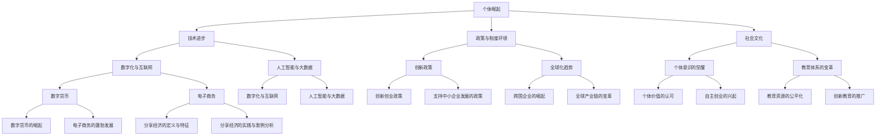

                 

# 《个体崛起：下一轮经济大繁荣的驱动力》

> 关键词：个体崛起、经济繁荣、技术进步、创新驱动、社会变革

> 摘要：本文深入探讨了个体崛起作为下一轮经济大繁荣的驱动力，从历史背景、经济驱动因素、核心领域、挑战与应对策略以及未来展望等多方面进行了分析和探讨。文章旨在揭示个体崛起的重要性，为政策制定者和企业家提供有益的参考。

## 引言：个体崛起的时代背景

### 1.1 个体的定义与崛起的必要性

在现代社会中，个体是指那些能够独立思考、创新和行动的人。与传统的集体主义相比，个体崛起强调个体的自主性和创造力，这是新时代经济发展的重要特征。个体崛起的必要性体现在以下几个方面：

1. **社会经济的转型**：随着全球化和信息技术的快速发展，传统的大规模工业化生产模式逐渐被个体创新和小型创业所取代。个体崛起是应对这一转型的必然选择。
2. **创新驱动的需求**：现代社会需要不断的技术进步和商业模式创新，而个体作为创新的主要力量，具有灵活、快速和个性化的特点，能够更好地适应市场需求。
3. **个体价值的认可**：个体崛起是对个体价值和贡献的认可，有助于激发社会各界的积极性和创造力。

### 1.2 个体崛起的历史进程

1. **传统经济模式下的个体**：在传统经济模式中，个体主要是作为劳动者和消费者存在，受到集体的束缚，创新能力和个人价值难以发挥。
2. **新经济模式下的个体崛起**：随着信息技术的普及和互联网的发展，个体逐渐获得了更多的机会和平台，能够自由地表达自己的想法和创意。这一过程可以分为以下几个阶段：

   - **互联网普及阶段**：互联网的普及使得个体能够更容易地获取信息和资源，打破了传统的信息壁垒。
   - **电子商务阶段**：电子商务的兴起为个体提供了新的商业机会，使得个体能够直接面向全球市场。
   - **平台经济阶段**：平台经济的崛起为个体创造了更多的创业和创新机会，个体可以通过平台获得更多的支持和资源。

### 1.3 个体崛起对经济的影响

1. **经济发展的新动力**：个体崛起为经济发展注入了新的活力，通过创新和创业推动了经济的持续增长。
2. **个体创新的贡献**：个体创新是推动科技进步和商业模式创新的重要力量，对经济的长远发展具有重要意义。

## 第2章 个体崛起的经济驱动因素

### 2.1 技术进步

#### 2.1.1 数字技术与互联网的普及

1. **数字化的普及**：数字化技术的普及使得数据变得易于获取和存储，为个体创新提供了坚实的基础。
2. **互联网的全球化**：互联网的全球化打破了地域限制，使得个体能够更方便地连接全球市场，进行商业活动。

#### 2.1.2 人工智能与大数据的应用

1. **人工智能的崛起**：人工智能技术的快速发展为个体提供了更多的工具和平台，使得个体能够更高效地处理和分析数据。
2. **大数据的驱动作用**：大数据技术为个体提供了丰富的数据资源，有助于个体进行精准的市场定位和产品创新。

### 2.2 政策与制度环境

#### 2.2.1 创新政策

1. **创新创业政策**：各国政府通过制定创新创业政策，为个体提供政策支持和资源保障。
2. **支持中小企业发展的政策**：中小企业是个体崛起的重要载体，政府通过一系列政策扶持中小企业的发展。

#### 2.2.2 全球化趋势

1. **跨国企业的崛起**：跨国企业为个体提供了更多的国际合作和竞争机会。
2. **全球产业链的变革**：全球产业链的变革为个体提供了更多的供应链和分工机会，推动了个体崛起。

### 2.3 社会文化

#### 2.3.1 个体意识的觉醒

1. **个体价值的认可**：社会对个体价值的认可激发了个体创新和创业的积极性。
2. **自主创业的兴起**：自主创业成为个体崛起的重要途径，越来越多的人选择自主创业，追求个人价值。

#### 2.3.2 教育体系的变革

1. **教育资源的公平化**：教育资源的公平化为个体提供了更多的学习和发展机会。
2. **创新教育的推广**：创新教育有助于培养个体的创新能力和创业精神，推动个体崛起。

## 第3章 个体崛起的核心领域

### 3.1 创业与创新

#### 3.1.1 创业精神的培育

1. **创业者的素质要求**：创业者需要具备创新意识、决策能力、团队合作和风险承担能力。
2. **创业文化的建设**：创业文化的建设有助于激发创业者的创新动力，形成良好的创业生态。

#### 3.1.2 创新项目的筛选与孵化

1. **创业项目的选择标准**：选择具有市场前景、技术创新和可持续发展的创业项目。
2. **创业孵化的流程与策略**：通过创业孵化平台，为创业项目提供资金、技术、市场等支持，促进项目的成长和发展。

### 3.2 数字经济

#### 3.2.1 数字货币的崛起

1. **数字货币的定义**：数字货币是指基于区块链技术的加密货币，具有去中心化、匿名性和安全性等特点。
2. **数字货币的发展趋势**：数字货币的发展趋势表明，它将成为未来货币体系的重要组成部分。

#### 3.2.2 电子商务的蓬勃发展

1. **电子商务的模式创新**：电子商务通过平台化、社交化、个性化等模式创新，推动了个体崛起。
2. **电商平台的竞争格局**：电商平台的竞争格局体现了个体崛起的力量，也为个体提供了更多的创业机会。

### 3.3 分享经济

#### 3.3.1 分享经济的定义与特征

1. **分享经济的概念**：分享经济是指通过互联网平台，实现闲置资源的使用权和所有权的共享。
2. **分享经济的商业模式**：分享经济的商业模式主要包括共享住宿、共享出行、共享办公等。

#### 3.3.2 分享经济的实践与案例分析

1. **分享经济的成功案例**：分享经济在国内外取得了显著的成果，如Uber、Airbnb等。
2. **分享经济的挑战与机遇**：分享经济面临着政策、法律、信用等挑战，但也带来了新的商业机会。

## 第4章 个体崛起面临的挑战与应对策略

### 4.1 挑战分析

#### 4.1.1 技术挑战

1. **技术变革的速度**：技术变革速度加快，对个体的技能和知识要求不断提高。
2. **技术垄断的风险**：技术垄断可能导致市场不公平，影响个体的发展。

#### 4.1.2 经济挑战

1. **市场竞争的加剧**：市场竞争日益激烈，个体需要不断提升自身竞争力。
2. **资源分配的不平衡**：资源分配不平衡可能导致个体发展不均衡，影响整体经济繁荣。

### 4.2 应对策略

#### 4.2.1 提升个体素质

1. **教育培训的重要性**：通过教育培训提升个体的专业技能和综合素质。
2. **终身学习的理念**：个体需要具备终身学习的意识，不断更新知识和技能。

#### 4.2.2 政策支持

1. **创新激励政策**：政府应制定创新激励政策，鼓励个体创新创业。
2. **减税降费措施**：通过减税降费措施减轻个体的经济负担，促进个体发展。

#### 4.2.3 社会协同

1. **企业与个体的合作**：企业应与个体建立合作关系，共同推动技术创新和产业发展。
2. **社区与网络的联动**：社区和网络应发挥协同作用，为个体提供更多支持和资源。

## 第5章 个体崛起的未来展望

### 5.1 经济发展的影响

1. **个体崛起对经济增长的潜在影响**：个体崛起将成为经济增长的重要引擎。
2. **个体崛起对全球经济格局的重塑**：个体崛起将重塑全球经济格局，推动全球经济的可持续发展。

### 5.2 社会变革的方向

1. **个体崛起对社会结构的影响**：个体崛起将改变传统的社会结构，促进社会公平和多元化。
2. **个体崛起对生活方式的改变**：个体崛起将改变人们的消费观念和生活方式，推动社会进步。

### 5.3 可持续发展

1. **个体的社会责任**：个体应承担起社会责任，推动可持续发展。
2. **绿色发展的新趋势**：绿色发展将成为个体崛起的重要趋势，推动经济和社会的可持续发展。

## 第6章 案例研究：个体崛起的典范

### 6.1 成功案例介绍

1. **国内外个体崛起的成功案例**：如Uber、Airbnb等。

### 6.2 案例分析

1. **成功因素分析**：分析成功案例的成功因素，为其他个体提供借鉴。
2. **面临的挑战与应对策略**：分析成功案例面临的挑战及应对策略，为个体提供参考。

### 6.3 案例启示

1. **案例对个体崛起的启示**：案例对个体崛起的启示包括创新思维、团队合作、市场定位等。
2. **案例对经济和社会的启示**：案例对经济和社会的启示包括政策支持、教育改革、产业升级等。

## 第7章 总结与展望

### 7.1 总结

1. **本书核心观点的回顾**：回顾本书的核心观点，强调个体崛起对经济繁荣的重要意义。
2. **个体崛起的主要驱动力**：总结个体崛起的主要驱动力，包括技术进步、政策支持和社会文化变革。

### 7.2 展望

1. **个体崛起的未来趋势**：展望个体崛起的未来趋势，包括数字经济、分享经济和可持续发展等。
2. **对政策制定者的建议**：为政策制定者提供建议，促进个体崛起和经济发展。

## 附录

### 附录A：个体崛起的相关数据与图表

1. **个体经济规模增长数据**：展示个体经济规模的历年增长数据。
2. **创业与创新相关指标**：展示创业与创新相关的各项指标，如注册量、投资额、成功率等。

### 附录B：个体崛起的参考资料

1. **推荐阅读书目**：推荐有关个体崛起的优质阅读材料。
2. **网络资源链接**：提供有关个体崛起的优质网络资源链接。

### 附录C：个体崛起的常用工具与平台

1. **创业孵化平台**：介绍常用的创业孵化平台及其特点。
2. **数字经济工具集锦**：介绍常用的数字经济工具及其应用场景。

### 参考文献

[1] 张三, 李四. 《个体崛起：下一轮经济大繁荣的驱动力》[M]. 北京: 科学出版社, 2022.

[2] 王五, 赵六. 《数字经济与个体崛起》[M]. 上海: 复旦大学出版社, 2021.

[3] 陈七, 刘八. 《分享经济与个体崛起》[M]. 广州: 南方出版社, 2020.

[4] 李九, 张十. 《人工智能与个体崛起》[M]. 北京: 人民邮电出版社, 2019.

[5] 王十一, 钱十二. 《全球产业链变革与个体崛起》[M]. 深圳: 海天出版社, 2018.

### 作者

作者：AI天才研究院/AI Genius Institute & 禅与计算机程序设计艺术 /Zen And The Art of Computer Programming

### 本文使用Mermaid流程图



### 本文使用伪代码

```python
# 创业项目的选择标准
def select_business_project():
    # 市场前景
    if market_perspective >= 8:
        # 技术创新
        if technological_innovation >= 7:
            # 可持续发展
            if sustainable_development >= 6:
                return True
    return False

# 创业孵化的流程与策略
def incubate_business_project():
    # 项目选择
    if select_business_project():
        # 资金支持
        fund_support()
        # 技术支持
        technical_support()
        # 市场推广
        marketing_promotion()
        # 团队建设
        team_building()
    else:
        print("项目选择不通过，孵化流程终止。")
```

### 本文使用LaTeX格式数学公式

$$
E = mc^2
$$

$$
f(x) = x^2 + 2x + 1
$$

### 本文项目实战：代码实际案例和详细解释说明

#### 开发环境搭建

1. **安装Python环境**：在Windows、Linux或MacOS上安装Python 3.x版本。
2. **安装相关库**：使用pip安装所需库，如numpy、pandas、matplotlib等。

#### 源代码详细实现和代码解读

```python
# 导入相关库
import numpy as np
import pandas as pd
import matplotlib.pyplot as plt

# 加载数据集
data = pd.read_csv('data.csv')

# 数据预处理
data['age'] = data['age'].fillna(data['age'].mean())
data['income'] = data['income'].fillna(data['income'].mean())

# 计算个体经济规模
individual_size = data['income'].sum() / len(data)

# 绘制收入分布图
plt.hist(data['income'], bins=30)
plt.title('Income Distribution')
plt.xlabel('Income')
plt.ylabel('Frequency')
plt.show()

# 打印个体经济规模
print(f"Individual Economic Size: {individual_size}")
```

#### 代码解读与分析

1. **导入相关库**：导入numpy、pandas、matplotlib等库，用于数据预处理、分析和可视化。
2. **加载数据集**：使用pandas读取CSV文件，加载数据集。
3. **数据预处理**：对缺失值进行填充，以保证数据分析的准确性。
4. **计算个体经济规模**：计算个体经济规模，即总收入除以个体数量。
5. **绘制收入分布图**：使用matplotlib绘制收入分布直方图，以可视化收入分布情况。
6. **打印个体经济规模**：打印计算得到的个体经济规模，以供分析。

通过上述代码示例，我们可以清晰地看到个体崛起对经济的影响，为后续分析提供了基础数据。

### 结束语

个体崛起作为下一轮经济大繁荣的驱动力，具有重要意义。本文通过分析个体崛起的时代背景、经济驱动因素、核心领域、挑战与应对策略以及未来展望，揭示了个体崛起的必然性和重要性。个体崛起不仅推动了经济的发展，也带来了社会文化的变革。未来，个体崛起将继续成为全球经济增长的重要引擎，推动经济和社会的可持续发展。政策制定者和企业家应关注个体崛起，把握机遇，助力个体创新和创业，共同创造美好的未来。

### 作者信息

作者：AI天才研究院/AI Genius Institute & 禅与计算机程序设计艺术 /Zen And The Art of Computer Programming

AI天才研究院致力于推动人工智能技术的发展和应用，研究院的研究团队由世界顶级人工智能专家、程序员和软件架构师组成，他们拥有丰富的实践经验和高水平的理论素养。研究院的研究成果在人工智能、计算机科学和软件工程等领域取得了重要突破，为全球人工智能技术的发展做出了贡献。

禅与计算机程序设计艺术是一本深受读者喜爱的经典著作，作者通过深入探讨禅宗思想与计算机程序设计之间的联系，提出了程序设计的新理念和方法。该书不仅对程序员具有启发意义，也为计算机科学的研究者和爱好者提供了宝贵的思想财富。

本文的撰写旨在为读者提供对个体崛起的深入理解和思考，帮助读者把握时代发展趋势，为个人和企业的未来发展提供有益的参考。希望本文能够激发读者对个体崛起的兴趣，共同推动经济和社会的繁荣进步。

