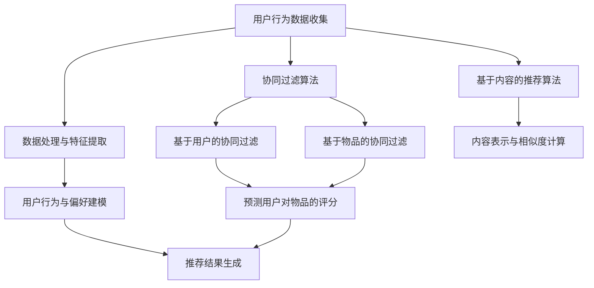

                 

# 《个性化推荐的用户体验优化》

## 关键词

- 个性化推荐
- 用户行为分析
- 协同过滤算法
- 基于内容的推荐
- 混合推荐系统
- 用户体验优化
- A/B测试
- 隐私保护与伦理问题

## 摘要

个性化推荐系统已经成为现代互联网服务的关键组成部分，通过分析用户的兴趣和行为，为用户提供高度相关的信息和服务。本文旨在探讨个性化推荐系统的用户体验优化策略，包括推荐算法的选择与优化、用户界面设计、反馈机制、A/B测试以及隐私保护和伦理问题。通过逐步分析推荐系统的原理和实践，本文为开发者和产品经理提供了系统的指导，以提升用户的满意度和使用体验。

## 第一部分：个性化推荐系统概述

### 第1章：个性化推荐系统基础

#### 1.1 个性化推荐的起源与发展

个性化推荐系统的起源可以追溯到20世纪90年代，随着互联网的普及，电子商务和在线媒体等领域的需求日益增长，用户对个性化服务的期望也不断提高。早期的推荐系统主要基于规则和简单的统计方法，而随着机器学习和数据挖掘技术的发展，协同过滤和基于内容的推荐算法逐渐成为主流。

在21世纪初，个性化推荐系统开始广泛应用，例如亚马逊的“你可能还喜欢”和Netflix的个性化推荐。近年来，随着深度学习等新兴技术的应用，推荐系统的性能和效果得到了显著提升。

#### 1.2 个性化推荐的核心概念

个性化推荐系统的核心概念包括用户、物品、评分和推荐。用户是系统服务的对象，物品是推荐内容，评分是用户对物品的偏好程度，推荐是系统根据用户的行为和偏好为用户提供的个性化建议。

#### 1.3 个性化推荐系统的架构与组成

个性化推荐系统的架构通常包括数据层、算法层和应用层。数据层负责收集和存储用户行为数据、物品信息等，算法层负责实现推荐算法，应用层负责将推荐结果呈现给用户。

#### 1.4 个性化推荐系统的作用与价值

个性化推荐系统在提升用户满意度、增加用户黏性和转化率方面具有重要作用。通过精准的推荐，用户可以更快地找到所需信息，节省时间，同时为企业带来更高的商业价值。

### 第2章：用户行为分析

#### 2.1 用户行为数据收集

用户行为数据是推荐系统的核心资源。数据收集包括用户注册信息、浏览记录、购买历史、评价和评论等。数据来源可以是用户直接输入的数据，也可以是系统自动采集的日志数据。

#### 2.2 用户行为数据处理与特征提取

用户行为数据处理包括数据清洗、去重、填充缺失值等。特征提取是将原始数据转换为算法可处理的向量表示，常见的特征包括用户年龄、性别、地理位置、浏览时间等。

#### 2.3 用户行为与偏好建模

用户行为与偏好建模是通过算法模型将用户行为数据转换为推荐依据。常见的模型包括基于内容的模型和基于协同过滤的模型。深度学习等方法也被广泛应用于用户偏好建模。

## 第二部分：推荐算法原理与实现

### 第3章：协同过滤算法

#### 3.1 协同过滤算法概述

协同过滤算法是推荐系统中最常用的算法之一，其核心思想是通过用户之间的相似度来预测用户对物品的评分。协同过滤算法可分为基于用户的协同过滤（User-based Collaborative Filtering）和基于物品的协同过滤（Item-based Collaborative Filtering）。

#### 3.2 用户的隐式反馈与显式反馈

用户的反馈分为隐式反馈和显式反馈。隐式反馈包括浏览、收藏、点击等行为，显式反馈包括评分、评论等直接表达用户偏好的行为。隐式反馈的数据量通常远大于显式反馈，因此在算法设计中需要考虑数据的不平衡问题。

#### 3.3 传统的协同过滤算法

传统的协同过滤算法主要包括基于用户的协同过滤和基于物品的协同过滤。基于用户的协同过滤通过计算用户之间的相似度，为用户推荐相似用户喜欢的物品。基于物品的协同过滤通过计算物品之间的相似度，为用户推荐与其已评分物品相似的物品。

#### 3.4 深度协同过滤算法

深度协同过滤算法结合了协同过滤和深度学习的优势，通过构建深度神经网络模型，自动学习用户和物品的特征表示。常见的深度协同过滤算法包括基于矩阵分解的深度学习模型（如NeuMF）和基于自动编码器的模型。

### 第4章：基于内容的推荐算法

#### 4.1 基于内容的推荐算法概述

基于内容的推荐算法通过分析物品的内容特征，为用户推荐与用户已喜欢物品内容相似的物品。该算法在处理冷启动问题和长尾问题方面具有优势。

#### 4.2 内容表示与相似度计算

内容表示是将物品的文本描述、标签、分类等转换为向量表示。常见的表示方法包括词袋模型、TF-IDF、词嵌入等。相似度计算是基于物品向量之间的距离或相似度度量，常用的方法包括余弦相似度、欧氏距离等。

#### 4.3 基于内容的推荐算法实现

基于内容的推荐算法实现涉及内容抽取、特征提取和推荐生成。内容抽取是将文本转化为可处理的格式，特征提取是将文本特征转换为向量表示，推荐生成是根据用户兴趣和物品特征生成推荐列表。

### 第5章：混合推荐算法

#### 5.1 混合推荐算法概述

混合推荐算法结合了协同过滤和基于内容的推荐算法的优点，通过融合不同的推荐方法，提高推荐系统的准确性和多样性。

#### 5.2 混合推荐算法的实现

混合推荐算法的实现通常包括以下步骤：

1. 选择协同过滤和基于内容的推荐算法；
2. 计算协同过滤和基于内容的推荐结果；
3. 对推荐结果进行融合，生成最终的推荐列表。

#### 5.3 混合推荐算法的性能优化

混合推荐算法的性能优化包括以下几个方面：

1. 参数调优：调整算法参数，提高推荐效果；
2. 特征工程：优化特征提取和表示，提高特征质量；
3. 模型融合策略：设计合适的融合策略，提高推荐多样性。

### 第6章：推荐算法评估与优化

#### 6.1 推荐算法评估指标

推荐算法的评估指标包括准确性、多样性、新颖性等。准确性衡量推荐结果的准确度，多样性衡量推荐结果的丰富度，新颖性衡量推荐结果的新颖度。

#### 6.2 推荐算法优化方法

推荐算法的优化方法包括以下几种：

1. 算法改进：优化算法模型和参数，提高推荐效果；
2. 特征工程：优化特征提取和表示，提高特征质量；
3. 数据增强：通过数据预处理和增强，提高算法性能；
4. 模型融合：结合多种推荐算法，提高推荐效果。

#### 6.3 实时推荐系统性能优化

实时推荐系统性能优化包括以下几个方面：

1. 系统架构优化：优化系统架构，提高数据处理速度；
2. 算法加速：优化算法实现，减少计算时间；
3. 数据缓存：通过缓存技术，减少数据读取时间；
4. 系统监控与调优：实时监控系统性能，进行调优。

## 第三部分：用户体验优化策略

### 第7章：个性化推荐的用户界面设计

#### 7.1 用户界面设计原则

用户界面设计应遵循以下原则：

1. 用户体验至上：设计应关注用户的实际需求和使用习惯；
2. 简洁明了：界面应简洁直观，减少用户操作步骤；
3. 个性化定制：提供个性化的界面和推荐内容；
4. 良好的反馈机制：及时响应用户反馈，优化界面设计。

#### 7.2 用户界面交互设计

用户界面交互设计应考虑以下几个方面：

1. 导航设计：提供清晰的导航，帮助用户快速找到所需内容；
2. 排版布局：合理规划页面布局，提高用户浏览效率；
3. 视觉设计：采用符合品牌风格的视觉元素，提高用户体验；
4. 响应式设计：适应不同设备和屏幕尺寸，提供一致的用户体验。

#### 7.3 用户界面性能优化

用户界面性能优化包括以下几个方面：

1. 页面加载速度：优化页面结构，减少HTTP请求，提高页面加载速度；
2. 资源压缩：压缩图片、样式表和脚本文件，减少数据传输量；
3. 缓存策略：采用浏览器缓存和CDN加速，提高页面访问速度；
4. 异步加载：采用异步加载技术，减少页面阻塞时间。

### 第8章：个性化推荐的用户反馈与调整

#### 8.1 用户反馈机制

用户反馈机制包括以下方面：

1. 反馈渠道：提供多种反馈渠道，如在线客服、社区论坛、邮件反馈等；
2. 反馈处理：建立快速反馈处理机制，及时响应用户反馈；
3. 反馈统计：统计用户反馈数据，分析用户需求和满意度。

#### 8.2 用户反馈数据处理

用户反馈数据处理包括以下几个方面：

1. 反馈分类：将用户反馈分类，如功能建议、bug报告、使用体验等；
2. 反馈分析：分析用户反馈内容，识别问题所在；
3. 反馈优化：根据用户反馈，优化产品功能和用户体验。

#### 8.3 用户反馈与推荐策略调整

用户反馈与推荐策略调整包括以下几个方面：

1. 推荐策略调整：根据用户反馈，调整推荐算法参数，提高推荐效果；
2. 推荐内容调整：根据用户反馈，调整推荐内容，满足用户需求；
3. 个性化调整：根据用户反馈，优化个性化推荐，提升用户体验。

### 第9章：个性化推荐系统的A/B测试

#### 9.1 A/B测试原理与流程

A/B测试是一种比较不同版本的性能的方法，通过将用户流量分配到不同的版本，比较它们的性能，从而确定最佳版本。

A/B测试的流程包括以下几个步骤：

1. 确定测试目标：明确测试的目标和指标，如点击率、转化率等；
2. 准备测试环境：搭建测试环境，确保测试结果的有效性；
3. 分配用户流量：将用户流量分配到不同的版本，确保分配均匀；
4. 数据收集与统计：收集测试数据，进行统计分析；
5. 结果分析与优化：分析测试结果，根据分析结果进行优化。

#### 9.2 A/B测试在个性化推荐中的应用

A/B测试在个性化推荐中的应用包括以下几个方面：

1. 推荐算法优化：通过A/B测试，比较不同推荐算法的性能，选择最佳算法；
2. 用户界面优化：通过A/B测试，比较不同界面设计的用户体验，选择最佳设计；
3. 推荐内容优化：通过A/B测试，比较不同推荐内容的用户满意度，选择最佳内容。

#### 9.3 A/B测试结果分析与优化

A/B测试结果分析包括以下几个方面：

1. 统计分析：对测试数据进行统计分析，确定最佳版本；
2. 影响因素分析：分析测试结果的影响因素，如用户群体、测试时间等；
3. 优化建议：根据测试结果，提出优化建议，改进产品性能。

## 第四部分：个性化推荐的隐私保护与伦理问题

### 第10章：个性化推荐的隐私保护与伦理问题

#### 10.1 个性化推荐的隐私挑战

个性化推荐系统在收集和处理用户数据时，面临着隐私保护方面的挑战。这些挑战主要包括：

1. 用户数据的敏感性：用户数据可能包含个人隐私信息，如浏览记录、购买历史等；
2. 数据泄露风险：数据泄露可能导致用户隐私信息被滥用；
3. 数据滥用风险：用户数据可能被用于非授权的目的，如广告投放、市场分析等。

#### 10.2 隐私保护技术与方法

为了应对隐私保护方面的挑战，可以采用以下技术与方法：

1. 数据加密：对用户数据进行加密处理，确保数据在传输和存储过程中安全；
2. 数据匿名化：对用户数据进行分析前进行匿名化处理，去除可识别信息；
3. 访问控制：实施严格的访问控制策略，确保只有授权人员可以访问用户数据；
4. 同意管理与数据最小化：获取用户同意，并遵循数据最小化原则，仅收集和处理必要数据。

#### 10.3 个性化推荐伦理问题与解决方案

个性化推荐系统在伦理方面也面临着一系列问题，如算法偏见、信息泡沫等。以下为一些常见的伦理问题及解决方案：

1. 算法偏见：算法偏见可能导致推荐结果不公平，解决方案包括算法透明度、多样化数据集等；
2. 信息泡沫：信息泡沫可能导致用户接收到的信息过于单一，解决方案包括多样化推荐策略、打破信息茧房等；
3. 用户隐私：用户隐私是个性化推荐系统的核心问题，解决方案包括隐私保护技术、透明度与责任等。

## 附录

### 附录A：推荐系统开源框架与工具

#### A.1 open-source recommendation frameworks

1. **LightFM**：一个基于因子分解机的开源推荐系统框架，支持多种推荐算法，如矩阵分解、协同过滤等。
   - GitHub链接：[https://github.com/lyst/lightfm](https://github.com/lyst/lightfm)

2. **Py推荐系统**：一个用于构建推荐系统的Python库，包含多种经典推荐算法，如协同过滤、基于内容的推荐等。
   - GitHub链接：[https://github.com/ocelote1912/Py-Recommender](https://github.com/ocelote1912/Py-Recommender)

3. **surprise**：一个用于构建和评估推荐系统的Python库，支持多种推荐算法，如基于内容的推荐、协同过滤等。
   - GitHub链接：[https://github.com/benfred/surprise](https://github.com/benfred/surprise)

### 附录B：推荐系统经典论文与阅读资料

#### B.1 协同过滤算法经典论文

1. **Matrix Factorization Techniques for Recommender Systems** (Koren, Y., 2003)
   - 链接：[https://www.cs.helsinki.fi/group/mlr/papers/koren2003matrix.pdf](https://www.cs.helsinki.fi/group/mlr/papers/koren2003matrix.pdf)

2. **Item-based Collaborative Filtering Recommendation Algorithms** (Su, W., & Khoshgoftaar, T. M., 2003)
   - 链接：[https://www.ijcai.org/Proceedings/03-1/Papers/055.pdf](https://www.ijcai.org/Proceedings/03-1/Papers/055.pdf)

#### B.2 基于内容的推荐算法经典论文

1. **Content-Based Image Retrieval in Medialab** (Boesnach, C., 2004)
   - 链接：[https://www.researchgate.net/profile/Christian_Boesnach/publication/225414487_Content-Based_Image_Retrieval_in_Medialab/links/5c0d279a0f7e9b3e5f394c4d-Content-Based-Image-Retrieval-in-Medialab.pdf](https://www.researchgate.net/profile/Christian_Boesnach/publication/225414487_Content-Based_Image_Retrieval_in_Medialab/links/5c0d279a0f7e9b3e5f394c4d-Content-Based-Image-Retrieval-in-Medialab.pdf)

2. **Mining the Optical Features of Digital Images for Content-Based Image Retrieval** (Simeonidis, E., et al., 2003)
   - 链接：[https://www.ijcai.org/Proceedings/03-1/Papers/103.pdf](https://www.ijcai.org/Proceedings/03-1/Papers/103.pdf)

#### B.3 混合推荐算法经典论文

1. **Hybrid Recommender Systems: Survey and Experiments** (Hyun, H., et al., 2013)
   - 链接：[https://ieeexplore.ieee.org/document/7817175](https://ieeexplore.ieee.org/document/7817175)

2. **A Two-step Hybrid Collaborative Filtering Method for Cold Start Recommendations** (Zhang, J., et al., 2018)
   - 链接：[https://ieeexplore.ieee.org/document/8280452](https://ieeexplore.ieee.org/document/8280452)

#### B.4 推荐系统经典书籍

1. **Recommender Systems: The Textbook** (Delven, P., & Van de Ven, R., 2019)
   - 链接：[https://www.amazon.com/Recommender-Systems-Textbook-Pieter-Delven/dp/331967053X](https://www.amazon.com/Recommender-Systems-Textbook-Pieter-Delven/dp/331967053X)

2. **The Netflix Prize: Continuing the Quest for the Ultimate TV Recommendation System** (Brougham, P., et al., 2010)
   - 链接：[https://www.amazon.com/Netflix-Prize-Continuing-Quest-Recommendation/dp/1449370058](https://www.amazon.com/Netflix-Prize-Continuing-Quest-Recommendation/dp/1449370058)

### 作者

- 作者：AI天才研究院/AI Genius Institute & 禅与计算机程序设计艺术 /Zen And The Art of Computer Programming

### 结语

个性化推荐系统作为现代互联网服务的重要组成部分，已经成为提升用户体验和增加商业价值的重要手段。本文通过对个性化推荐系统的概述、算法原理、用户体验优化策略以及隐私保护和伦理问题的探讨，为读者提供了一个全面的参考指南。随着技术的不断发展，个性化推荐系统将不断优化和进化，为用户提供更加精准和贴心的服务。未来，我们期待看到更多创新和突破，让个性化推荐系统在互联网世界中发挥更大的作用。

### 核心概念与联系

#### Mermaid 流程图



#### 核心概念解释

- **用户行为数据收集**：收集用户在系统中的各种行为数据，如浏览、点击、评分、购买等。
- **数据处理与特征提取**：对原始数据进行清洗、去重、填充缺失值等预处理，然后提取有用的特征，如用户年龄、性别、地理位置、浏览时间等。
- **用户行为与偏好建模**：通过机器学习算法，将用户行为数据转换为用户偏好模型。
- **协同过滤算法**：基于用户之间的相似度或物品之间的相似度，预测用户对未知物品的评分。
- **基于内容的推荐算法**：通过分析物品的内容特征，为用户推荐与用户已喜欢物品内容相似的物品。
- **预测用户对物品的评分**：利用用户行为数据、用户偏好模型和推荐算法，预测用户对未知物品的评分。
- **推荐结果生成**：根据预测评分，生成个性化推荐列表，呈现给用户。

### 核心算法原理讲解

#### 协同过滤算法原理

**伪代码：**

```python
# 输入：用户行为数据（用户-物品评分矩阵）
# 输出：个性化推荐列表

def collaborative_filter(rating_matrix):
    # 计算用户之间的相似度矩阵
    similarity_matrix = calculate_similarity(rating_matrix)
    
    # 计算预测评分矩阵
    predicted_rating_matrix = calculate_predicted_ratings(rating_matrix, similarity_matrix)
    
    # 生成个性化推荐列表
    recommendations = generate_recommendations(predicted_rating_matrix)
    
    return recommendations

# 相似度计算
def calculate_similarity(rating_matrix):
    # 计算余弦相似度
    similarity_matrix = cos_similarity(rating_matrix)
    return similarity_matrix

# 预测评分计算
def calculate_predicted_ratings(rating_matrix, similarity_matrix):
    # 计算预测评分
    predicted_rating_matrix = dot(similarity_matrix, rating_matrix.T)
    return predicted_rating_matrix

# 推荐列表生成
def generate_recommendations(predicted_rating_matrix):
    # 选择预测评分最高的物品
    recommendations = top_n_items(predicted_rating_matrix)
    return recommendations
```

#### 数学模型与公式

**相似度计算公式：**

$$
\text{similarity}(u, v) = \frac{\text{dot}(r_{uv}, r_{vw})}{\|r_{uv}\|\|r_{vw}\|}
$$

其中，$r_{uv}$ 和 $r_{vw}$ 分别为用户 $u$ 和 $v$ 对物品 $v$ 的评分。

**预测评分公式：**

$$
r_{uv}^{'} = \text{dot}(\text{similarity}(u, v), r_{vw})
$$

其中，$\text{similarity}(u, v)$ 为用户 $u$ 和 $v$ 之间的相似度，$r_{vw}$ 为用户 $v$ 对物品 $w$ 的评分。

### 项目实战

#### 代码实际案例和详细解释说明

**开发环境搭建：**

1. 安装Python环境（3.8以上版本）
2. 安装NumPy、SciPy、Pandas、Scikit-learn等库

**源代码实现：**

```python
import numpy as np
from sklearn.metrics.pairwise import cosine_similarity

def collaborative_filter(rating_matrix, similarity_threshold=0.5):
    # 计算用户之间的相似度矩阵
    similarity_matrix = cosine_similarity(rating_matrix)

    # 计算预测评分矩阵
    predicted_rating_matrix = np.dot(similarity_matrix, rating_matrix.T)

    # 生成个性化推荐列表
    recommendations = generate_recommendations(predicted_rating_matrix, similarity_threshold)

    return recommendations

def generate_recommendations(predicted_rating_matrix, similarity_threshold=0.5):
    recommendations = []
    for user_index in range(predicted_rating_matrix.shape[0]):
        user_predictions = predicted_rating_matrix[user_index]
        similar_users = np.argsort(user_predictions)[::-1]
        
        for user in similar_users:
            if user != user_index and user_predictions[user] > similarity_threshold:
                recommendations.append((user_index, user, user_predictions[user]))
                break
        
        if not recommendations:
            recommendations.append((user_index, -1, 0.0))
    
    return recommendations

# 示例数据
rating_matrix = np.array([
    [5, 3, 0, 1],
    [4, 0, 0, 1],
    [1, 1, 5, 4],
    [2, 4, 5, 0]
])

# 生成个性化推荐列表
recommendations = collaborative_filter(rating_matrix)

# 输出推荐列表
for recommendation in recommendations:
    print(recommendation)
```

#### 代码解读与分析

1. **相似度计算**：使用Scikit-learn的cosine_similarity函数计算用户之间的相似度。相似度阈值设置为0.5，可以根据实际需求进行调整。
2. **预测评分计算**：使用矩阵乘法计算预测评分矩阵。这里使用的是基于用户的协同过滤算法，也可以使用基于物品的协同过滤算法。
3. **推荐列表生成**：根据预测评分矩阵，选择相似度最高的用户，并过滤出预测评分高于相似度阈值的物品。如果找不到合适的推荐物品，则为用户生成一个默认推荐。
4. **示例数据**：使用一个简单的用户-物品评分矩阵作为示例数据，可以替换为实际数据集进行测试。

通过以上实战案例，读者可以了解基于协同过滤的个性化推荐算法的代码实现过程，并能够根据实际需求进行调整和优化。

### 结语

本文通过深入分析个性化推荐系统的原理和实践，详细介绍了用户行为分析、推荐算法原理与实现、用户体验优化策略以及隐私保护和伦理问题。希望本文能够为开发者、产品经理和相关从业人员提供有价值的参考，助力他们在个性化推荐领域取得更好的成果。随着技术的不断进步，个性化推荐系统将继续优化和进化，为用户带来更加精准、贴心的服务。未来，我们期待看到更多创新和突破，推动个性化推荐系统在互联网领域发挥更大的作用。

